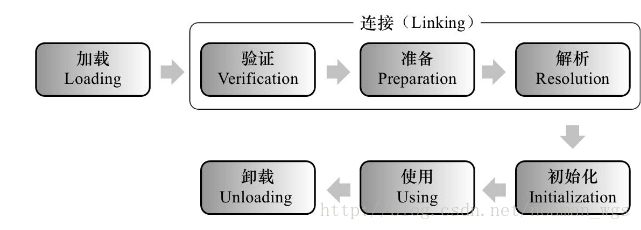
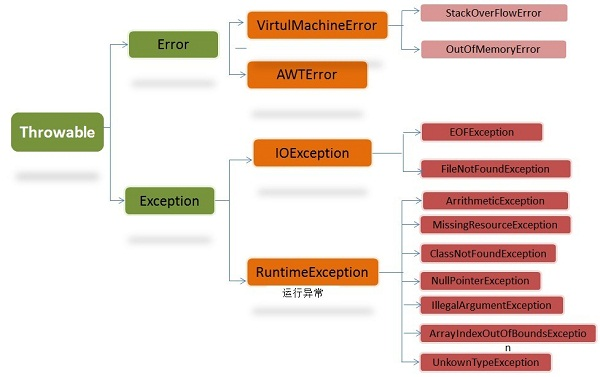
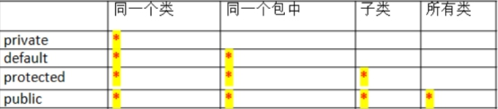

# String


## 空构造器

 

调用构造器创造string，性能低下且内存开销大

==string内容相同，Java认为它们代表同一个String对象==

```
//底层维护字符数组
private final char value[];

	/** Note that use of this constructor is unnecessary since Strings are immutable.
JDK源码上的注解: 注意，由于字符串是不可变的，因此不需要使用此构造函数。
用构造函数创建string是无意义的,并且性能低
*/
    public String() {
    //对于new String(),仅仅是分配了空字符串的数组地址,并没有产生新的对象
        this.value = "".value; }
```

 

## indexof("")

==不存在返回-1	空字符串返回0==

 

对于空字符串的下标获取,首先调用这个方法

```java
public int indexOf(String str) {
  return indexOf(str, 0);}
```


对于不指定下标的indexof()方法,默认分配0的初始下标

```java
public int indexOf(String str, int fromIndex) {
  return indexOf(value, 0, value.length,
      str.value, 0, str.value.length, fromIndex);}
```


```java
public int indexOf(String str, int fromIndex) {
  return indexOf(value, 0, value.length,
      str.value, 0, str.value.length, fromIndex);}
```


对所有indexof方法的处理最终都是在调用这个方法

```java
static int indexOf(char[] source, int sourceOffset, int sourceCount,
    char[] target, int targetOffset, int targetCount,
    int fromIndex) {

	//在这里规定了,空字符串时,fromIndex =sourceCount=0,返回0
  if (fromIndex >= sourceCount) {
    return (targetCount == 0 ? sourceCount : -1);
  }
  if (fromIndex < 0) {
    fromIndex = 0;
  }
  if (targetCount == 0) {
    return fromIndex; }}
```


## 编码转换


newString("".getBytes("GB2312"), "ISO-8859-1");


## String编译优化

字符串对象创建有两种形式，

1.字面量形式，String str = "aa"	存进字符串常量池

2.new 							存进堆

 

对于字符串，其对象的引用都是存储在栈中的，如果是编译期已经创建好的就存储在常量池中(双引号定义的或final修饰并且能在编译期就能确定的)，如果是运行期才能确定的就存储在堆中（如：new关键字创建出来的）。

==对于equals相等的字符串，在常量池中永远只有一份，在堆中有多份==

 

```java
String a="hello2";

String b="hello"+2;

System.out.println((a==b));

输出为：true。因为 ”hello” +2在编译期就已经被优化成 “hello2”，因此在运行期变量 a 和 b 指向的是同一个对象(在字符串常量池)

String a="hello2";

String b="hello";

String c=b+2;

System.out.println((a==c));

输出为 false。由于有符号引用的存在，所以String c=b+2不会在编译期间被优化，不会把 b+2 当做字面量处理，因此生成的对象是保存在堆上的。所以a和c不是指向同一个对象。
```


## String/Builder/Buffer区别

* 相同点：
  * 都用 final 修饰，不能派生子类
* 操作的相关方法类似
  
* 不同点：
  * String只读，内容不能改变，StringBuffer和StringBuilder类表示的字符串对象可以直接进行修改，在修改的同时地址值不会发生改变。
  * StringBuilder是JDK1.5新特性，和StringBuffer的方法完全相同，线程不安全,性能高。
  * ==String、Buffer、Builder 类型不同，无法用 equals()方法比较内容==
  * Builder线程不安全


## String为什么final

* 若允许被继承，则其高度的被使用率可能会降低程序的性能

* 为了安全。JDK中的核心类比如 String，内部很多方法的实现都不是 java 编写的，只是==调用操作系统的 API，也就是本地方法调用==，如果这种类可以被继承并重写，将导致操作系统面临风险


# 序列化


将实例对象的状态信息写入字节流,通过socket进行传输或者持久化.然后通过反序列化恢复对象状态


## 两种实现方法

* 实现Serializable接口，所有的序列化将会自动进行

* 实现**Externalizable接口**,在writeExternal方法中进行手工指定所要序列化的变量

 

## Serializable原理


==有AB两个类，B含有指向A类对象的引用，进行实例化时,系统会将a的数据复制一份到b，从文件中恢复对象(重新加载到内存)，对象a同时存在两份==

　　

1.保存到磁盘的对象获得序列号

2.保存对象时，先检查该对象是否被保存了

3.如果保存过，查看是否有修改,否则更新对象

以上的步骤,序列化机制解决了对象引用的问题

 

* 注意事项
  * 序列化，**只对状态进行保存，不管对象的方法**
  * **父类实现序列化，**子类自动序列化
  * 对象的**实例变量引用其他对象，**引用对象自动序列化
  * 并非所有的对象都可以序列化
    　　* 安全方面:对象拥有private，public等字段，在写入文件，或者进行RMI传输时,private等域不受保护
      * 资源分配方面:比如socket/thread类，如果可以序列化，进行传输或者保存，也无法对他们进行重新的资源分配

 

## serialversionUID

目的是序列化对象版本控制。如果在新版本中这个值修改了，新版本就不兼容旧版本，反序列化时会抛出InvalidClassException异常。如果修改较小，比如仅仅是增加了一个属性，我们希望向下兼容，那就不用修改；如果我们删除了一个属性，或者更改了类的继承关系，必然不兼容旧数据，这时就应该手动更新版本号

 

serialVersionUID = 1L意义:

有两种生成方式：一个是默认的1L， 一个是根据类名、接口名、成员方法及属性等来生成一个64位的哈希字段，如： -8940196742313994740L

不指定 serialVersionUID将导致添加或修改类中的任何字段时, 已序列化类将无法恢复


 

# 接口


## 默认方法

实现接口需要实现其所有的抽象方法,当接口加入新方法时，我们就需要对项目重新编写

使用**default**修饰， 定义**方法体**。default方法所有的子类会**默认实现** ，可以避免修改代码


这个default是jdk8新关键字，**和访问限定修饰符“default”不是一个概念**，与switch中的default功能完全不同.

实际上是**public default**,省略了public


与抽象类的不同：抽象类更多的是提供一个模板，子类之间的某个流程大致相同，仅仅是某个步骤可能不一样（模板方法设计模式），这个时候使用抽象类，该步骤定义为抽象方法。而default关键字是用于扩展


## 静态方法

接口的静态方法不会被实现类所实现

**只用于内部调用**


两个接口定义**相同静态方法**，实现类实现这两个接口，并不会产生错误，编译器通过**反射**来区分是哪个接口下的方法

两个接口定义**相同非静态方法**，并且一个实现类同时实现了这两个接口，那么必须在实现类中重写默认方法，否则编译失败。

**静态方法调用    类名.方法**   通过**反射**来区分哪个接口下的方法

​    **非静态         对象.方法** 


## 函数式接口 

**只有一个抽象方法**

### @FunctionalInterface

只在编译期起作用，如@Override注解。编译期会强制检查该接口是否符合函数式接口的条件，不符合则会报错。**即使不使用，只要满足定义也是函数式接口**。


### Supplier

java.util.function.Supplier<T> 接口仅包含一个无参的方法： T get() 。

用来获取一个泛型参数指定类型的对象数据。由于这是一个函数式接口，这也就意味着对应的Lambda表达式需要“对外提供”一个符合泛型类型的对象数据。

```
   public void testGetUser() {
        User user = getUser(User::new);}

    private User getUser(Supplier<User> supplier) {
        return supplier.get();}
```

 

​	Supplier求数组元素的最小值

```
public void testGetMin(){
        int[] arr={5,3,100,10};
        int min = getMin(()->{
            int minNum=arr[0];
            for (int i : arr) {
                if (i<minNum) minNum=i;}
            return minNum;
        });}

    private Integer getMin(Supplier<Integer> supplier) {
        return supplier.get();
    }
```

 

### Consumer接口

java.util.function.Consumer<T> 

**与Supplier接口相反**，它不是生产一个数据，而是消费一个数据


**抽象方法：accept**，消费一个指定泛型的数据

```
public void testConsumer() {
        User user = new User();
        setUserDefaultSex(u -> u.setSex("nan"), user);
        //user的sex被改变}
        
    private void setUserDefaultSex(Consumer<User> consumer, User user) {
        consumer.accept(user);}
```


**默认方法：andThen**

**方法的参数和返回值全都是 Consumer 类型**，那么就可以实现效果：消费数据的时候，首先做一个操作，然后再做一个操作，实现组合

要想实现组合，需要两个或多个Lambda表达式

```
public void testConsumer2() {
        User user = new User();
        setUserNameAndSex(u -> u.setSex("nan"), u -> u.setName("aa"), user);
        System.out.println(user.getSex() + user.getName());}

    private void setUserNameAndSex(Consumer<User> one, Consumer<User> two, User user) 			{one.andThen(two).accept(user);}
```

 

### Predicate接口

对某种类型的数据进行判断，**得到boolean**结果

**抽象方法：test** 	用于条件判断

```
public void testPredicate() {
        longThan(s -> s.length() > 5, "hello!!");}

    private void longThan(Predicate<String> predicate, String str) {
        boolean flag = predicate.test(str);}
```


**默认方法：and** 

**默认方法：or** 

```
public void testSuccess() {
    successMan(s -> s.contains("富"), s -> s.contains("帅"), "高富帅");}

private void successMan(Predicate<String> one, Predicate<String> two, String str) {
    boolean flag = one.or(two).test(str);}
```

**默认方法：negate** 	取反


### Function接口


**抽象方法：apply** 

java.util.function.Function<T,R>根据 T类型的参数得到 R类型的返回值

```
public void testFunction() {
        Integer value = parseInteger(Integer::parseInt, "10");}

    private Integer parseInteger(Function<String, Integer> function, String str) {
        return function.apply(str);}
```

**默认方法：andThen**


## 接口和抽象类的区别


* 相同
  * 抽象类和接口均包含抽象方法，类必须实现所有的抽象方法，否则是抽象类

  * 抽象类和接口都不能实例化，他们位于继承树的顶端，用来被其他类继承和实现

* 不同
  * 接口中只能定义全局静态常量，不能定义变量。抽象类中可以定义常量和变量
  * 接口中所有的方法都是abstract。==抽象类中不全为abstract==
  * **接口不能定义构造方法**,抽象类中可以有构造方法，但不能用来实例化，而在子类实例化是执行，完成属于抽象类的初始化操作。
  * 单继承多接口

 

接口可以继承接口

==抽象类可以实现接口==，抽象类可以继承实体类,可以有main方法


==最主要区别还是设计理念==

*  接口  实现类仅仅是实现了接口定义的约定。接口定义了“做什么”，而实现类负责“怎么做”，体现了功能和实现分离的原则。**接口和实现是has-a **

* 抽象类体现了一种继承关系，目的是复用代码，抽象类中定义了各个子类的相同代码，可以认为父类是一个实现了部分功能的“中间产品”，而子类是“最终产品”。**父类和子类是is-a**


# Lambda

函数式编程思想,只关注做什么,不关注怎么做

**lambda不是语法糖**

语法糖 :写法不同,实现原理相同,如增强for循环


(类型 参数1, 类型 参数2....) -> {代码}

**参数没有则留空,有则必须是函数式接口@FunctionalInterface**


* FunctionalInterface	起到注释作用,标明这是函数式接口,避免其他人写入方法
  * 函数式接口只有一个抽象方法
  * default方法某默认实现，不属于抽象方法
  * 接口重写了Object的公共方法也不算入内


lambda无法单独出现，需要函数式接口来盛放，lambda方法体是函数接口的实现


​     lambda表达式可以访问给它传递的变量，访问自己内外部的变量。但访问外部变量时,变量引用不可变,即一旦定义后，在后面就不能再随意修改引用

​	实例变量存在堆中，而局部变量存在栈，**lambda(匿名内部类) 会在另一个线程中执行**。如果在线程中要直接访问一个局部变量，可能线程执行时该局部变量已经被销毁了，而 **final 类型的局部变量在 Lambda 表达式(匿名类) 中其实是局部变量的一个拷贝**


==在lambda中，this不是指向lambda表达式产生的那个对象，而是声明它的外部对象==


## 省略规则


参数类型可以省略,但只能都省略或都不省略

参数只有一个,小括号能省略

大括号内语句只有一条,大括号/分号/return关键词能省略


## 延迟执行


先合并字符串,再判断level==1,决定要不要执行方法 

```java
public class Demo01Logger {
    private static void log(int level, String msg) {
        if (level == 1) {
            System.out.println(msg);}}
  
    public static void main(String[] args) {
        String msgA = "Hello";
        String msgB = "World";
        log(1, msgA + msgB);}}
```


优化后,先判断,后执行字符串合并

```java
@FunctionalInterface
public interface MessageBuilder {
    String buildMessage();
}

public class Demo02LoggerLambda {
    private static void log(int level, MessageBuilder builder) {
        if (level == 1) {
            System.out.println(builder.buildMessage());}}

    public static void main(String[] args) {
        String msgA = "Hello";
        String msgB = "World";
        log(1, () -> msgA + msgB  );}}
```


## 方法引用 ::

```
print(e -> System.out.println(e));
```

这个lambda只是接收了参数,并将它打印,而打印的方法有现成的System.out.println

```
print(System.out::println);
```


如果Lambda要表达的函数方案已存在于某个方法的实现中，可以通过::来引用该方法

* Lambda写法	 s -> System.out.println(s); 	拿到参数之后经Lambda之手，继而传递给 System.out.println 方法去处理

* 方法引用写法	 System.out::println     直接让println 方法来取代Lambda

* 对象名引用	user :: getName

* 构造器引用	User::new

* 类名引用		User::getName

* super引用成员方法  super::sayHello

  ```
  public class Woman extends Human {
      @Override
      public void sayHello() {
          System.out.println("大家好,我是Man!");}
  
      public void method(Greetable g) {
          g.greet();}
  
      public void show() {
          method(super::sayHello);}}
  ```

* this引用	this::buyHouse

```
public class Husband {
    private void buyHouse() {
        System.out.println("买套房子");}

    private void marry(Richable lambda) {
        lambda.buy();}

    public void beHappy() {
        marry(this::buyHouse);}}
```


## Comparator


```
//res是二维数组,需求是根据res[]进行排序,不考虑第二个[]
int[][] res = new int[n][2];
Arrays.sort(res,new Comparator<int[]>(){
            @Override
            public int compare(int[] o1, int[] o2) {
                return o1[0] - o2[0];         } });
                
//进一步简化	省略参数类型
 Arrays.sort(res, (o1, o2) -> o1[0] - o2[0]);
 
//Comparator类的内部实现，还有一个 comparing 方法
Arrays.sort(res, Comparator.comparingInt(o -> o[0]));
```


# Stream

得益于Lambda所带来的函数式编程，引入全新的Stream概念，用于解决集合类库的弊端。

Stream是集合元素的函数模型，不是集合，也不是数据结构，**其本身不存储任何元素或地址**,只是在原数据集上定义了一组操作。也不会改变原有数据

Stream流不保存数据，Stream操作是尽可能惰性的，即每当访问到流中的一个元素，才会在此元素上执行这一系列操作。


```
list.stream().filter(s -> s.startsWith("张"))
                .filter(s -> s.length() == 3)
                .forEach(System.out::println);
```

 stream().forEach


## 获取流

* Collection接口获取流

Collection 接口中加入了default方法stream() 获取流，所有实现类均可获取流。

* Map获取流

java.util.Map 接口不是 Collection 的子接口，且其K-V数据结构不符合流元素的单一特征，所以获取对应的流

需要分key、value或entry等情况：

```
public static void main(String[] args) {
        Map<String, String> map = new HashMap<>();
        Stream<String> keyStream = map.keySet().stream();
        Stream<String> valueStream = map.values().stream();
        Stream<Map.Entry<String, String>> entryStream = map.entrySet().stream();}
```

* 数组获取流 

如果使用的不是集合或映射而是数组，由于数组对象不可能添加默认方法，所以 Stream 接口中提供了静态方法of() ，使用很简单：

```
public static void main(String[] args) {
        String[] array = {"张无忌", "张翠山", "张三丰", "张一元"};
        Stream<String> stream = Stream.of(array);}
```


## 常用方法


* 筛选与分片
  * forEach	调用的多线程，调用线程池要额外耗费时间,**无序**
  * forEachOrdered     按**原顺序**输出
  * limit    取前几个
  * distinct   去重
  * skip     跳过前几个
  * filter        将一个流转换成另一个子集流
* 映射

  * map      将流中的元素映射到另一个流

```java
Stream<String> stream = list.stream().map(e -> e.substring(2));
```

* flatMap


* 终止操作

  * allMatch 检查是否匹配所有元素 方法参数为断言型接口
  * anyMatch 检查是否匹配所有元素 方法参数为断言型接口
  * noneMatch 检查是否没有匹配所有元素 方法参数为断言型接口
  * findFirst 返回第一个元素 无方法参数
  * findAny 返回当前流的任意元素 无方法参数
  * count 返回流中的元素总个数 无方法参数
  * max 返回流的最大值 无方法参数
  * min 返回流中的最小值 无方法参数


* 归约

  * count   统计个数

  * concat   合并流,Stream的静态方法

    ```java
     Stream<String> result = Stream.concat(streamA, streamB);
    ```

  * reduce  将流中的元素反复结合起来，得到一个值。

```java
List<Integer> list1 = Arrays.asList(1,2,3,4,5,6,7,8,9,10);
Integer reduce = list1.stream().reduce(11, (x, y) -> x + y);
reduce ： 66
```


* 收集	方法参数为Collector。Collector由Collectors中的toList()，toSet(),toMap(Function(T,R) key,Function(T,R) value)等静态方法实现。
  * toList()
  * toMap()
  * toSet()

```
list.stream().collect(Collectors.toList());
```


* 分组
  *  Collectors.groupingBy()

```java
 public static void main(String[] args) {
        List<User> users = Arrays.asList(new User("张三", 19, 1000),
                new User("张三", 58, 2000),
                new User("李四", 38, 3000),
                new User("赵五", 48, 4000)
        );
        Map<String, List<User>> collect3 = users.stream().collect(Collectors.groupingBy(x -> x.getName()));
        System.out.println(collect3);

输出：{李四=[User{name='李四', age=38, salary=3000}], 张三=[User{name='张三', age=19, salary=1000}, User{name='张三', age=58, salary=2000}], 赵五=[User{name='赵五', age=48, salary=4000}]}
```


## parallelStream


​	通过默认的ForkJoinPool，提高多线程任务的速度，默认线程数量等于运行计算机上的处理器数量

​	**Java8为ForkJoinPool添加了一个通用线程池，用来处理没有被显式提交到任何线程池的任务**。当调用Arrays类上添加的新方法时，自动并行化就会发生。


## 使用原则


* 单核cpu，不用parallel stream

* 低数据量场景（size<=1000），stream不如iterator，但是这些任务运行时间都低于毫秒，效率的差距不明显
* 大数据量时（szie>10000），stream 的处理效率会高于 iterator，特别是使用了并行流，cpu恰好将线程分配到多个核心的条件下（parallel stream 底层使用的是 JVM 的 ForkJoinPool，分配线程很玄学,受引CPU环境影响，当没分配到多个cpu核心时，加上引用 forkJoinPool 的开销，运行效率可能还不如普通的 Stream）


* ==含有装箱类型，先转成对应的数值流==，减少频繁的拆箱、装箱的性能损失


# Iterator


```
 for (Iterator iterator = set.iterator(); iterator.hasNext();) {
            String string = (String) iterator.next();
            System.out.println(string);
        }
```


* forEachRemaining(Consumer<? super E> action)：为每个剩余元素执行给定的操作,直到所有的元素都已经被处理或行动将抛出一个异常

* hasNext()  如果迭代器中还有元素，则返回true。

* next()：返回迭代器中的下一个元素

* remove()：删除迭代器新返回的元素。


==Iterator只能单向移动==

==Iterator.remove()是唯一能安全地在迭代过程中修改集合==；如果在迭代过程中以任何其它的方式修改集合将会产生未知的行为。而且每调用一次next()方法，remove()方法只能被调用一次，如果违反这个规则将抛出一个异常。


## ListIterator

继承于Iterator接口,功能更强大,

只能用于各种List类型的访问。可以通过调用listIterator()方法产生一个指向List开始处的ListIterator, 还可以调用listIterator(n)方法创建一个一开始就指向列表索引为n的元素处的ListIterator。

==双向移动==

==产生迭代器前一个和后一个元素的索引==

用set()替换它访问过的最后一个元素.

用add()在next()方法返回的元素之前或previous()方法返回的元素之后插入一个元素.


## Iterator和ListIterator区别


* 只有ListIterator有add()
* ListIterator有hasPrevious()和previous()方法，可以**逆序遍历**
* ListIterator用nextIndex()和previousIndex()指定索引位置
* ListIterator在遍历同时set()修改


## foreach


foreach是通过iterator实现的遍历

对于数组,for和foreach差不多

对于链表，foreach效率高


## fail-fast机制


fail-fast产生的原因在于对集合进行迭代时，某个线程对该集合进行了修改，这时迭代器就会抛出 ConcurrentModificationException 异常信息，从而 fail-fast

要了解fail-fast机制，我们首先要对ConcurrentModificationException 异常有所了解。当方法检测到对象的并发修改，但不允许这种修改时就抛出该异常。同时需要注意的是，该异常不会始终指出对象已经由不同线程并发修改，如果单线程违反了规则，同样也有可能会抛出该异常

迭代器的快速失败行为无法得到保证，它不能保证一定会出现该错误，但会尽最大努力抛出ConcurrentModificationException异常，所以因此，为提高此类操作的正确性而编写一个依赖于此异常的程序是错误的做法，正确做法是：ConcurrentModificationException 应该仅用于检测 bug


ArrayList

```java
 public E next() {    
            checkForComodification();    
            /** 省略 */    
        }    

        public void remove() {    
            if (this.lastRet < 0)    
                throw new IllegalStateException();    
            checkForComodification();    
            /** 省略 */    
        }

//迭代器调用next()、remove()都会调用checkForComodification()，该方法主要就是检测modCount == expectedModCount,若不等则抛出ConcurrentModificationException 异常，从而产生fail-fast机制。

//expectedModCount 在Itr中定义：int expectedModCount = ArrayList.this.modCount;它的值是不可能修改的，会变的只有modCount
//modCount在 AbstractList 中定义的，为全局变量
protected transient int modCount = 0; 
```


无论add、remove、clear方法,都会导致modCount的改变

```java
public boolean add(E paramE) {    
    ensureCapacityInternal(this.size + 1);    
    /** 省略此处代码 */    
}    

private void ensureCapacityInternal(int paramInt) {    
    if (this.elementData == EMPTY_ELEMENTDATA)    
        paramInt = Math.max(10, paramInt);    
    ensureExplicitCapacity(paramInt);    
}    

private void ensureExplicitCapacity(int paramInt) {    
    this.modCount += 1;    //修改modCount    
    /** 省略此处代码 */    
}    

ublic boolean remove(Object paramObject) {    
    int i;    
    if (paramObject == null)    
        for (i = 0; i < this.size; ++i) {    
            if (this.elementData[i] != null)    
                continue;    
            fastRemove(i);    
            return true;    
        }    
    else    
        for (i = 0; i < this.size; ++i) {    
            if (!(paramObject.equals(this.elementData[i])))    
                continue;    
            fastRemove(i);    
            return true;    
        }    
    return false;    
}    

private void fastRemove(int paramInt) {    
    this.modCount += 1;   //修改modCount    
    /** 省略此处代码 */    
}    

public void clear() {    
    this.modCount += 1;    //修改modCount    
    /** 省略此处代码 */    
}
```


### 避免fail-fast


* 加synchronized
  * 可能会阻塞


* 使用CopyOnWriteArrayList来替换ArrayList，其所有修改值的操作都对底层数组进行复制来实现
  * 无需同步,就能实现并发
  * 遍历操作的数量远超可变操作数量


# 集合


List 以特定索引来存取元素，可有重复元素。

Set 不能存放重复元素（用对象的 equals()方法来区分元素是否重复）

Map 保存键值对映射，映射关系可以是一对一或多对一。

Set 和 Map 容器都有基于哈希存储和排序树（红黑树）的两种实现版本，基于哈希存储的版本理论存取时间复杂度为O(1)，而基于排序树版本的实现在插入或删除元素时会按照元素或元素的键（key）构成排序树从而达到排序和去重的效果。


==Collections类==

​	专门用来操作集合类 ，提供一系列静态方法实现对各种集合的搜索、排序、线程安全化等操作


## 集合和数组的比较

数组不是面向对象的，存在明显的缺陷，集合完全弥补了数组的一些缺点，比数组更灵活，可大大提高软件的开发效率.不同的集合框架类可适用于不同场合

1）**数组的效率高**于集合

2）**数组能存放基本数据类型**和对象，而集合类中只能放对象

3）**数组容量固定**，集合类容量动态改变

4）==数组无法判断实际有多少元素，length只告诉了array的容量==

5）集合有多种实现方式和不同的适用场合，而不像数组仅采用顺序表方式。

6）集合以类的形式存在，具有封装、继承、多态等类的特性，通过简单的方法和属性调用即可实现各种复杂操作，提高效率


### ArrayList 和 LinkedList 的区别和联系

* 相同点：
  * 都实现List接口，有序、不唯一

* 不同点：
  * ArrayList数组实现,长度可变，查询效率高
    * 初始容量10,满了时新建一个2倍容量的数组,并把原数组复制过去,实现扩容
  * LinkedList 采用双向链表存储方式。插入、删除元素时效率高


## List、Map、Set区别


List与Set实现公共父接口Collection,所以都是单列元素的集合。

Set不允许重复，不能有两个相等（注意，不是仅仅是相同）的对象 ，所以，Set的add()返回boolean

Set取元素时，没法说取第几个，只能以Iterator接口取得所有的元素，再逐一遍历各个元素。


List表示有先后顺序的集合

一个对象可以被反复存储进List中，相当于集合中有多个索引指向了这个对象

List除了可以以Iterator接口取得所有的元素，再逐一遍历各个元素之外，还可以调用get(index i)来明确说明取第几个


Map与List和Set不同，它是双列的集合

可以获得所有的key的集合，可以获得所有value的集合，还可以获得key和value组合成的Map.Entry对象的集合


## Set


### HashSet


1）哈希表的查询快，时间复杂度为 O（1）

2）HashMap、Hashtable、HashSet 这些集合采用的是哈希表结构，需要用hashCode

3）系统类已经覆盖了hashCode 方法,**自定义类放入hash类集合，必须重写hashcode**。不重写调用的是Object的hashcode,比较地址。


==向哈希Set中添加数据的原理==

首先计算hashCode，得到一个位置用来存放当前对象，如在该位置没有一个对象存在的话，直接增加进去。

如果在该位置有对象，进行**equals，如果false,再进行一次散列，将该对象放到散列后计算出的新地址里**。如果true，那么集合认为集合中已经存在该对象了，不会再将该对象增加到集合中了。

**hashCode决定数据在表中的存储位置，而equals判断是否存在相同数据。**


### TreeSet


二叉树实现,


元素不允许重复且==有序(自然顺序)==,底层存储结构是二叉树,**中序遍历保证有序**，存入元素时需要**和树中元素进行对比**,保证不重复

3）可以通过 Comparable(外部比较器)和 Comparator(内部比较器)来指定比较策略，实现了 Comparable 的系统类可以顺利存入 TreeSet。实现 Comparable接口指定比较策略

4）可创建 Comparator 接口实现类来指定比较策略，并通过 TreeSet 构造方法参数传入。这种方式尤其对系统类非常适用。


## List


### ArrayList


少量数据时效率高

初始大小10,扩容为1.5倍


### CopyOnWriteArrayList


内部维护 transient volatile的数组

```java
private transient volatile Object[] array;
```


### LinkedList


大量数据时效率高


### Vector


内部实现与ArrayList一致

**在方法中进行了同步,线程安全**

**扩容为2倍**,适合数据量大的存储


### 检索、插入、删除效率


* ArrayList和Vector中，从指定的位置检索，或在末尾插入、删除都是O(1)

其他位置为O(n-i)，n为元素的个数，i下标。需要执行(n-i)个对象的位移操作

* LinkedList
  * 插入、删除集合中任何位置都O(1)
  * 索引时O(i),i下标


### List的多态

List list = new ArrayList() 与 ArrayList alist = new ArrayList()

List接口有多个实现类，现在你用的是ArrayList，也许哪一天需要换成LinkedList或者Vector等等，这时你只要改变一行就行      

这就是面向接口编程,LinkedList和ArrayList都实现了List接口

在List list时,并不知道实例化了Linked还是Array,但是这个list都是要去add()的

这也是多态的体现,父类引用指向子类对象


## Map


### HashMap


* 是Hashtable的轻量级实现（非线程安全的实现）

* 允许空键/值

* 继承了AbstractMap,实现了Map，克隆，序列化接口

```java
HashMap<K,V> extends AbstractMap<K,V>
    implements Map<K,V>, Cloneable, Serializable {
//AbstractMap已经实现过了Map接口，而HashMap又继承了AbstractMap，这样使得HashMap已经实现了Map接口，然而HashMap又再次去实现了Map接口,这是JDK中多此一举的失误
  
AbstractMap<K,V> implements Map<K,V> {
```


* HashMap把Hashtable的contains方法去掉了，改成containsvalue和containsKey。因为contains方法容易让人引起误解


#### 按位与2次幂容量

取余:xxx%16  不断在做除法,效率低,并且负数取余仍是负数,还需要转为正数

按位与: 	hash&(length-1)

​			(length-1)  1111

​			(hash)   1001

​			     =1001

当length-1不为全1,即length不为2的幂,将出现0,而0的部分按位与永远为0

将导致0的桶永远放不进


#### 7 死锁隐患


 

原先:	3->5->7

多线程resize时,可能同时3->7	7->3,出现循环,查询3/7时出现死锁

==可以通过精心设计的一组object实现dos(拒绝服务攻击)==,对象的HashCode相同,使得它们被存放在同一个桶中,HashMap退化为链表,而链表的查询复杂度O(n)

 

在put的时候，插入的元素超过了容量*负载因子,触发resize()和rehash()，会将原数组重新hash到新数组，在多线程的环境下，存在同时其他的元素也在进行put操作，如果hash值相同，可能出现同时在同一数组下用链表表示，造成闭环，导致在get时会出现死循环


#### 8 HashMap


* hash()

```java
static final int hash(Object key) {
    int h;
    return (key == null) ? 0 : (h = key.hashCode()) ^ (h >>> 16); }
```

jdk7中,容易出现低位相同,高位不同的hash	如1101……….1111

​											1001………1111

将高位与地位异或(不进位的加法),能够减少碰撞的概率

 

* resize方法

```java
Node<K,V> loHead = null, loTail = null;

Node<K,V> hiHead = null, hiTail = null;
```

扩容时,将原链表拆为两个高低位的链表

比如16个桶,哈希码11111…….11101

​							 1111	=1101

扩容32个桶,					11111	=11101

扩容后第一位只能是0或1,并且桶中的元素被分配在了1xxx和0xxx两个新桶中,元素保持原先的顺序.而保持了顺序就降低了多线程中,顺序调换出现的死锁概率

 

* 底层数组创建机制
  * 7，创建对象时就创建了数组
  * 8，**首次调用put**才创建

* hash相等时
  * 产生hash碰撞,key值相同则替换，否则加到后面		**比较key用equals**


#### 成员变量


* MAXIMUM_CAPACITY = 1 << 30    最大容量

* UNTREEIFY_THRESHOLD = 6    链表的值小于6则会从红黑树转回链表

* MIN_TREEIFY_CAPACITY** = 64	超过这个值，才能进行树形化

* Node<K, V>[] table	table用来初始化(必须是二的n次幂)

* Set<Entry<K, V>> entrySet	存放缓存

* size	元素个数

* int modCount	修改次数

* int threshold		下次扩容的临界值，（容量\*负载因子)

* float loadFactor	哈希表的负载因子


#### 基本类型不能做为键值


* 泛型约束为Object类型
  * map.put(1, “Java”)，实际上是将1进行了自动装箱操作,变为了 Integer类型

* 引用数据类型重写了HashCode()和 equals()两个方法，能==保证key的唯一性==


### ConcurrentHashMap


对桶进行了分段，每个分段都用锁进行保护，从而让锁的粒度小，并发性能高

==不接受空key/value==

cas乐观锁+synchronized锁	**锁只加在数组头节点**


#### CAS无锁定算法


在ConcurrentHashMap中，很多的操作都会依靠CAS算法完成

```java
  // Unsafe mechanics  CAS保障了哪些成员变量操作是原子性的
    private static final sun.misc.Unsafe U;
    private static final long LOCKSTATE;
      static {
                U = sun.misc.Unsafe.getUnsafe();
                Class<?> k = TreeBin.class; //操作TreeBin,后面会介绍这个类
             LOCKSTATE = U.objectFieldOffset(k.getDeclaredField("lockState"));
--------------------------------------------------------------------------------------
    private static final sun.misc.Unsafe U;
    private static final long SIZECTL;
    private static final long TRANSFERINDEX;
    private static final long BASECOUNT;
    private static final long CELLSBUSY;
    private static final long CELLVALUE;
    private static final long ABASE;
    private static final int ASHIFT;

    static {
        //以下变量会在下面介绍到
            U = sun.misc.Unsafe.getUnsafe();
            Class<?> k = ConcurrentHashMap.class;
            SIZECTL = U.objectFieldOffset(k.getDeclaredField("sizeCtl"));
            TRANSFERINDEX = U.objectFieldOffset(k.getDeclaredField("transferIndex"));
            BASECOUNT = U.objectFieldOffset(k.getDeclaredField("baseCount"));
            CELLSBUSY = U.objectFieldOffset(k.getDeclaredField("cellsBusy"));
            Class<?> ck = CounterCell.class;
            CELLVALUE = U.objectFieldOffset(ck.getDeclaredField("value"));
            Class<?> ak = Node[].class;
            ABASE = U.arrayBaseOffset(ak);
            int scale = U.arrayIndexScale(ak);
            if ((scale & (scale - 1)) != 0)
                throw new Error("data type scale not a power of two");
            ASHIFT = 31 - Integer.numberOfLeadingZeros(scale);}

//3个原子性操作方法：
    static final <K,V> Node<K,V> tabAt(Node<K,V>[] tab, int i) {
        return (Node<K,V>)U.getObjectVolatile(tab, ((long)i << ASHIFT) + ABASE);
    }

    static final <K,V> boolean casTabAt(Node<K,V>[] tab, int i,
                                        Node<K,V> c, Node<K,V> v) {
        return U.compareAndSwapObject(tab, ((long)i << ASHIFT) + ABASE, c, v); }

    static final <K,V> void setTabAt(Node<K,V>[] tab, int i, Node<K,V> v) {
        U.putObjectVolatile(tab, ((long)i << ASHIFT) + ABASE, v);}
```


1.7- 的ConcurrentHashMap中是锁定了Segment

jdk1.8+ 锁定的是一个Node头节点，减小了锁的粒度，性能和冲突都会减少

```java
//这段代码其实是在扩容阶段对头节点的锁定，其实还有很多地方不一一列举。
               synchronized (f) {
                    if (tabAt(tab, i) == f) {
                        Node<K,V> ln, hn;
                        if (fh >= 0) {
                            int runBit = fh & n;
                            Node<K,V> lastRun = f;
                            for (Node<K,V> p = f.next; p != null; p = p.next) {
                                int b = p.hash & n;
                                if (b != runBit) {
                                    runBit = b;
                                    lastRun = p;
                                }
                            }
                            if (runBit == 0) {
                                ln = lastRun;
                                hn = null;
                            }
                            else {
                                hn = lastRun;
                                ln = null;
                            }
                            for (Node<K,V> p = f; p != lastRun; p = p.next) {
                                int ph = p.hash; K pk = p.key; V pv = p.val;
                                if ((ph & n) == 0)
                                    ln = new Node<K,V>(ph, pk, pv, ln);
                                else
                                    hn = new Node<K,V>(ph, pk, pv, hn);
                            }
                            setTabAt(nextTab, i, ln);
                            setTabAt(nextTab, i + n, hn);
                            setTabAt(tab, i, fwd);
                            advance = true;
                        }
                        else if (f instanceof TreeBin) {
                        .....  }    }
```


#### 成员变量


```java

private static int RESIZE_STAMP_BITS = 16;

    /**
     * The maximum number of threads that can help resize.
     * Must fit in 32 - RESIZE_STAMP_BITS bits.
     */
    private static final int MAX_RESIZERS = (1 << (32 - RESIZE_STAMP_BITS)) - 1;

    /**
     * The bit shift for recording size stamp in sizeCtl.
     */
    private static final int RESIZE_STAMP_SHIFT = 32 - RESIZE_STAMP_BITS;

//判断当前状态	MOVED代表该节点是个forwarding Node，表示有线程处理过了
    static final int MOVED     = -1;
    static final int TREEBIN   = -2;

//sizeCtl标志控制符
//-N	正在进行初始化或扩容操作
//N		hash表还没有被初始化，这个数值表示初始化或下一次进行扩容的大小,始终是当前容量的0.75倍
private transient volatile int sizeCtl;
```


#### 内部类


Node

```java
static class Node<K,V> implements Map.Entry<K,V> {
        final int hash;
        final K key;
//用volatile修饰value/next，使得value和next具有可见性和有序性，保证线程安全
  同时大家仔细看过代码就会发现同时它还错了一个find的方法，该方法主要是用户寻找某一个节点。
        volatile V val;
        volatile Node<K,V> next;
  
//setValue（）方法直接抛出异常，禁止用该方法设置value
public final V setValue(V value) {   throw new UnsupportedOperationException();  }
```


TreeNode

```java
//TreeNode继承自Node,附带next指针
static final class TreeNode<K,V> extends Node<K,V> {
        TreeNode<K,V> parent;  // red-black tree links
        TreeNode<K,V> left;
        TreeNode<K,V> right;
        TreeNode<K,V> prev;    // needed to unlink next upon deletion
        boolean red;
   
//TreeBin内部封装了TreeNode,树的根节点为TreeBin,子结点为TreeNode
//TreeNode的next指针可以在TreeBin中寻找下一个TreeNode，这也是与HashMap的区别
static final class TreeBin<K,V> extends Node<K,V> {
        TreeNode<K,V> root;
        volatile TreeNode<K,V> first;
        volatile Thread waiter;
        volatile int lockState;
        // values for lockState
        static final int WRITER = 1; // set while holding write lock
        static final int WAITER = 2; // set when waiting for write lock
        static final int READER = 4; // increment value for setting read lock
```


ForwordingNode

```java
//主要是在扩容阶段，链接两个table的节点类，nextTable用于指向下一个table，但并不是说有2个table，而是在扩容的时,线程读取到为空或者处理完的节点设置为forwordingNode，别的线程发现这个forwordingNode会继续向后执行遍历，解决了多线程安全的问题
//处理节点时会对节点上锁,保证线程安全
static final class ForwardingNode<K,V> extends Node<K,V> {
        final Node<K,V>[] nextTable;
        ForwardingNode(Node<K,V>[] tab) {
            super(MOVED, null, null, null);
            this.nextTable = tab;
        }

        Node<K,V> find(int h, Object k) {
            // loop to avoid arbitrarily deep recursion on forwarding nodes
            outer: for (Node<K,V>[] tab = nextTable;;) {
                Node<K,V> e; int n;
                if (k == null || tab == null || (n = tab.length) == 0 ||
                    (e = tabAt(tab, (n - 1) & h)) == null)
                    return null;
                for (;;) {
                    int eh; K ek;
                    if ((eh = e.hash) == h &&
                        ((ek = e.key) == k || (ek != null && k.equals(ek))))
                        return e;
                    if (eh < 0) {
                        if (e instanceof ForwardingNode) {
                            tab = ((ForwardingNode<K,V>)e).nextTable;
                            continue outer;
                        }
                        else
                            return e.find(h, k);        }
                    if ((e = e.next) == null)
                        return null;    } }   }}
```


#### transfer


在数组扩容时,**有且只能由一个线程构建一个nextTable**，然后把原table复制到nextTable中，复制可以多线程共同操作。在复制过程中有一定的规律和算法操控


数组桶中的3种存储情况：空，链表头，TreeBin头

1. 数组中某个值为空，放置**forwordingNode**
2. 不为空，是链表头结点，就拆分为两个链表，存储到nextTable对应的两个位置
3. 不为空，是TreeBin头结点，此处存储着红黑树，先判断需不需要把树转链表，做完一系列的处理，然后把对应的结果存储在nextTable的对应两个位置


==拆分为两个链表的原因==

* 由hash()和扩容策略决定

* 在原先数组中，下标的计算是(lenth-1) & hash())，哈希值相同的都会在同一个链表中，而且lenth都是2的倍数

* 扩容会扩大原先数组的两倍，如容量8（0111）二进制，扩大一倍(1111)，按位与得到前三位一致，只有第四位不一样

* 9&7=1，1&7=1,扩容后，9&15=9，1&15=1，只有第四位不一样，原先在1位置的元素重新hash之后，只能得到1或则9(1+length)的位置，是对称的


```java
private final void transfer(Node<K,V>[] tab, Node<K,V>[] nextTab) {
        int n = tab.length, stride; //stride 主要和CPU相关
        //主要是判断CPU处理的量，如果小于16则直接赋值16
        if ((stride = (NCPU > 1) ? (n >>> 3) / NCPU : n) < MIN_TRANSFER_STRIDE)
            stride = MIN_TRANSFER_STRIDE; // subdivide range
        if (nextTab == null) {            // initiating只能有一个线程进行构造nextTable，如果别的线程进入发现不为空就不用构造nextTable了
            try {
                @SuppressWarnings("unchecked")
                Node<K,V>[] nt = (Node<K,V>[])new Node<?,?>[n << 1]; //把新的数组变为原来的两倍，这里的n<<1就是向左移动一位，也就是乘2
                nextTab = nt;
            } catch (Throwable ex) {      // try to cope with OOME
                sizeCtl = Integer.MAX_VALUE;
                return;
            }
            nextTable = nextTab;
            transferIndex = n; //原先扩容大小
        }
        int nextn = nextTab.length;
        //构造一个ForwardingNode用于多线程之间的共同扩容情况
        ForwardingNode<K,V> fwd = new ForwardingNode<K,V>(nextTab);
        boolean advance = true; //遍历的确认标志
        boolean finishing = false; // to ensure sweep before committing nextTab
        //遍历每个节点
        for (int i = 0, bound = 0;;) {
            Node<K,V> f; int fh; //定义一个节点和一个节点状态判断标志fh
            while (advance) {
                int nextIndex, nextBound;
                if (--i >= bound || finishing)
                    advance = false;
                else if ((nextIndex = transferIndex) <= 0) {
                    i = -1;
                    advance = false;
                }
                //下面就是一个CAS计算
                else if (U.compareAndSwapInt
                         (this, TRANSFERINDEX, nextIndex,
                          nextBound = (nextIndex > stride ?
                                       nextIndex - stride : 0))) {
                    bound = nextBound;
                    i = nextIndex - 1;
                    advance = false;
                }
            }
            if (i < 0 || i >= n || i + n >= nextn) {
                int sc;
                //如果原table已经复制结束
                if (finishing) {
                    nextTable = null; //可以看出在扩容的时候nextTable只是类似于一个temp用完会丢掉
                    table = nextTab;
                    sizeCtl = (n << 1) - (n >>> 1); //修改扩容后的阀值，应该是现在容量的0.75倍
                    return;//结束循环
                }
                //采用CAS算法更新SizeCtl。
                if (U.compareAndSwapInt(this, SIZECTL, sc = sizeCtl, sc - 1)) {
                    if ((sc - 2) != resizeStamp(n) << RESIZE_STAMP_SHIFT)
                        return;
                    finishing = advance = true;
                    i = n; // recheck before commit
                }
            }
            //CAS算法获取某一个数组的节点，为空就设为forwordingNode
            else if ((f = tabAt(tab, i)) == null)
                advance = casTabAt(tab, i, null, fwd);
           //如果这个节点的hash值是MOVED，就表示这个节点是forwordingNode节点，就表示这个节点已经被处理过了，直接跳过
            else if ((fh = f.hash) == MOVED)
                advance = true; // already processed
            else {
            //对头节点进行加锁，禁止别的线程进入
                synchronized (f) {
                //CAS校验这个节点是否在table对应的i处
                    if (tabAt(tab, i) == f) {
                        Node<K,V> ln, hn;
                        //如果这个节点的确是链表节点
                        //把链表拆分成两个小列表并存储到nextTable对应的两个位置
                        if (fh >= 0) {
                            int runBit = fh & n;
                            Node<K,V> lastRun = f;
                            for (Node<K,V> p = f.next; p != null; p = p.next) {
                                int b = p.hash & n;
                                if (b != runBit) {
                                    runBit = b;
                                    lastRun = p;
                                }
                            }
                            if (runBit == 0) {
                                ln = lastRun;
                                hn = null;
                            }
                            else {
                                hn = lastRun;
                                ln = null;
                            }
                            for (Node<K,V> p = f; p != lastRun; p = p.next) {
                                int ph = p.hash; K pk = p.key; V pv = p.val;
                                if ((ph & n) == 0)
                                    ln = new Node<K,V>(ph, pk, pv, ln);
                                else
                                    hn = new Node<K,V>(ph, pk, pv, hn);
                            }
                            //CAS存储在nextTable的i位置上
                            setTabAt(nextTab, i, ln);
                            //CAS存储在nextTable的i+n位置上
                            setTabAt(nextTab, i + n, hn);
                            //CAS在原table的i处设置forwordingNode节点，表示这个这个节点已经处理完毕
                            setTabAt(tab, i, fwd);
                            advance = true;
                        }
                        //如果这个节点是红黑树
                        else if (f instanceof TreeBin) {
                            TreeBin<K,V> t = (TreeBin<K,V>)f;
                            TreeNode<K,V> lo = null, loTail = null;
                            TreeNode<K,V> hi = null, hiTail = null;
                            int lc = 0, hc = 0;
                            for (Node<K,V> e = t.first; e != null; e = e.next) {
                                int h = e.hash;
                                TreeNode<K,V> p = new TreeNode<K,V>
                                    (h, e.key, e.val, null, null);
                                if ((h & n) == 0) {
                                    if ((p.prev = loTail) == null)
                                        lo = p;
                                    else
                                        loTail.next = p;
                                    loTail = p;
                                    ++lc;  }
                                else {
                                    if ((p.prev = hiTail) == null)
                                        hi = p;
                                    else
                                        hiTail.next = p;
                                    hiTail = p;
                                    ++hc;   }          }
                            //如果拆分后的树的节点数量已经少于6个就需要重新转化为链表
                            ln = (lc <= UNTREEIFY_THRESHOLD) ? untreeify(lo) :
                                (hc != 0) ? new TreeBin<K,V>(lo) : t;
                            hn = (hc <= UNTREEIFY_THRESHOLD) ? untreeify(hi) :
                                (lc != 0) ? new TreeBin<K,V>(hi) : t;
                                //CAS存储在nextTable的i位置上
                            setTabAt(nextTab, i, ln);
                              //CAS存储在nextTable的i+n位置上
                            setTabAt(nextTab, i + n, hn);
                            //CAS在原table的i处设置forwordingNode节点，表示这个这个节点已经处理完毕
                            setTabAt(tab, i, fwd);
                            advance = true; 
```


#### put


* 判断kv是否为空,为空报错

* 根据key的hash值定位到桶位置,判断if(table==null)，先初始化table

* 再判断table中指定的桶
  * ==null,直接插入(无需加锁)
  * ==桶的hash=-1,即MOVED状态（节点为forwordingNode），说明有线程正在进行扩容，当前线程协助扩容==

* 开始put()
  * 桶为链表
    * 遍历检查是否有相同的key?更新:插入
    * 链表>8?树:void
  * 桶为红黑树
    * 插入
    * 自平衡

* 插入后,map已存储数量+1,==在addCount方法中判断是否需要扩容==


##### addCount


```java
    private final void addCount(long x, int check) {
        CounterCell[] as; long b, s;
        if ((as = counterCells) != null ||
            !U.compareAndSwapLong(this, BASECOUNT, b = baseCount, s = b + x)) {
            CounterCell a; long v; int m;
            boolean uncontended = true;
            if (as == null || (m = as.length - 1) < 0 ||
                (a = as[ThreadLocalRandom.getProbe() & m]) == null ||
                !(uncontended =U.compareAndSwapLong(a, CELLVALUE, v = a.value, v + x))) {
                fullAddCount(x, uncontended);
                return;
            }
            if (check <= 1)
                return;
            s = sumCount();
        }
        //是否需要进行扩容操作
        if (check >= 0) {
            Node<K,V>[] tab, nt; int n, sc;
            while (s >= (long)(sc = sizeCtl) && (tab = table) != null &&
                   (n = tab.length) < MAXIMUM_CAPACITY) {
                int rs = resizeStamp(n);
                //如果小于0就说明已经再扩容或者已经在初始化
                if (sc < 0) {
                    if ((sc >>> RESIZE_STAMP_SHIFT) != rs || sc == rs + 1 ||
                        sc == rs + MAX_RESIZERS || (nt = nextTable) == null ||transferIndex <= 0)
                        break;
                        //如果是正在扩容就协助扩容
                    if (U.compareAndSwapInt(this, SIZECTL, sc, sc + 1))
                        transfer(tab, nt);
                }
                //如果正在初始化就首次发起扩容
                else if (U.compareAndSwapInt(this, SIZECTL, sc,(rs << RESIZE_STAMP_SHIFT) + 2))
                    transfer(tab, null);
                s = sumCount();
```


### HashTable


双数组

线程安全,效率低

所有涉及多线程都加上了synchronized关键字来**锁住整个table**


### LinkedHashMap

==有序==,用HashMap操作数据结构，用LinkedList维护顺序

```java
LinkedHashMap<K,V> extends HashMap<K,V>  implements Map<K,V>
```


只定义了3个属性

```java
//最久访问的节点或最先插入的节点
transient LinkedHashMap.Entry<K,V> head;
//尾部为最近访问的或最近插入的节点
transient LinkedHashMap.Entry<K,V> tail;
//false插入顺序存储		true查询顺序存储
final boolean accessOrder;
```


空构造器

```java
    public LinkedHashMap() {
        super();
    //默认值false
        accessOrder = false; }
```


构造器	传入map参数

```java
public LinkedHashMap(Map<? extends K, ? extends V> m) {
    super();
    accessOrder = false;
    putMapEntries(m, false);}
```


从构造方法中可以看出，**默认都采用插入顺序存储**。

所有构造方法都是通过调用父类来创建对象的。


* Entry的属性
  * K key
  * V value
  * Entry<K, V> next
  * int hash
  * **Entry<K, V> before**		用于维护Entry的先后顺序	最后两个为LinkedHashMap自己的,前四个继承HashMap
  * **Entry<K, V> after**

```
static class Entry<K,V> extends HashMap.Node<K,V> {
    Entry<K,V> before, after;
    Entry(int hash, K key, V value, Node<K,V> next) {
        super(hash, key, value, next);    }}
```


LinkedHashMap 内部类 Entry 继承自 HashMap 内部类 Node，并新增了两个属性before 和 afte用于维护双向链表。

HashMap 的内部类 TreeNode 不继承自己的内部类 Node，却继承自 LinkedHashMap 内部类 Entry,使得TreeNode 具备了和其他 Entry 一起组成链表的能力。这是一种==多态,使用 HashMap 时TreeNode 不能组成链表能力。如果继承 LinkedHashMap 内部类 Entry将导致TreeNode 多了两个用不到的属性，浪费空间，但这与 通过继承获得的组成链表的能力相比，是值得的。

> Because TreeNodes are about twice the size of regular nodes, we use them only when bins contain enough nodes to warrant use(see TREEIFY_THRESHOLD). 
>
> And when they become too small (due to removal or resizing) they are converted back to plain bins. In
> usages with well-distributed user hashCodes, tree bins are rarely used.
>
> TreeNode 对象的大小约是普通 Node 对象的2倍，我们仅在桶（bin）中包含足够多的节点时再使用。当桶中的节点数量变少时（取决于删除和扩容），TreeNode 会被转成 Node。当用户实现的 hashCode 方法具有良好分布性时,不会转为红黑树，树类型的桶将会很少被使用。

由于链表很少被树化,TreeNode较少被使用,


#### 链表初始化


插入第一个节点时创建链表,此时head和tail同时指向第一个节点

后续的节点将接在tail指向的节点后面,同时更新tail


插入元素

LinkedHashMap没有覆写父类的 put 方法，而是直接使用了父类的实现

再put之后,调用linkNodeLast()更新链表的tail

```
    private void linkNodeLast(LinkedHashMap.Entry<K,V> p) {
        LinkedHashMap.Entry<K,V> last = tail;
        tail = p;
        if (last == null)
            head = p;
        else {
            p.before = last;
            last.after = p;   }   }
```


删除元素

没有重写hashMap的删除,


```java
HashMap:
	//remove()调用了removeNode()
    public V remove(Object key) {
        Node<K,V> e;
        return (e = removeNode(hash(key), key, null, false, true)) == null ?
            null : e.value;
    }
//removeNode()执行完HashMap所需的删除逻辑时,回调了afterNodeRemoval(),HashMap中的afterNodeRemoval()为抽象方法
final Node<K,V> removeNode() {
        ...
afterNodeRemoval(node);}

// LinkedHashMap 中覆写
void afterNodeRemoval(Node<K,V> e) { // unlink
    LinkedHashMap.Entry<K,V> p =
        (LinkedHashMap.Entry<K,V>)e, b = p.before, a = p.after;
    // 将 p 节点的前驱后后继引用置空
    p.before = p.after = null;
    // b 为 null，表明 p 是头节点
    if (b == null)
        head = a;
    else
        b.after = a;
    // a 为 null，表明 p 是尾节点
    if (a == null)
        tail = b;
    else
        a.before = b;
//删除逻辑
1.根据 hash 定位到桶位置
2.遍历链表
3.从链表中移除要删除的节点
```


#### 维护访问顺序

```
get/getOrDefault/replace	3种改变顺序的方法
```


```java
// LinkedHashMap 中覆写
public V get(Object key) {
    Node<K,V> e;
    if ((e = getNode(hash(key), key)) == null)
        return null;
//accessOrder==true，按访问顺序排序
    if (accessOrder)
        afterNodeAccess(e);
    return e.value;
}

    void afterNodeAccess(Node<K,V> e) { // move node to last
        LinkedHashMap.Entry<K,V> last;
        if (accessOrder && (last = tail) != e) {
            LinkedHashMap.Entry<K,V> p =
                (LinkedHashMap.Entry<K,V>)e, b = p.before, a = p.after;
            p.after = null;
            if (b == null)
                head = a;
            else
                b.after = a;
            if (a != null)
                a.before = b;
            else
                last = b;
            if (last == null)
                head = p;
            else {
                p.before = last;
                last.after = p;
            }
            tail = p;
            ++modCount;    }}
```


### TreeMap


红黑树实现

线程不安全


#### TreeMap按Value排序

TreeMap底层是根据红黑树的数据结构构建的，默认是key的自然排序

==将TreeMap的EntrySet转换成list，然后使用Collections.sor排序==

```
 Map<String,String> map = new TreeMap<String,String>();

List<Entry<String, String>> list = new ArrayList<Entry<String, String>>(map.entrySet());
Collections.sort(list,new Comparator<Map.Entry<String,String>>() {
//升序排序
public int compare(Entry<String, String> o1, Entry<String, String> o2) {
return o1.getValue().compareTo(o2.getValue()); } });

```


### TreeMap 和 TreeSet 在排序时如何比较元素？Collections.sort（）方法如何比较元素？


TreeSet	实现Comparable接口，该接口提供了比较元素的**compareTo()方法**，当插入元素时会**回调**该方法比较元素的大小

TreeMap	实现Comparable接口,根据键对元素进行排序

Collections工具类的sort方法有两种重载的形式，

第一种要求实现Comparable 接口以实现元素的比较

第二种要求传入第二个参数，参数是 Comparator 接口的子类型（重写compare方法），其实就是是通过接口注入算法，也是对回调模式的应用


## 队列


offer，add区别：

堆满插入时add抛出 unchecked 异常

offer()返回false

 

poll，remove区别：

remove() 和 poll() 方法都是从队列中删除第一个元素。remove() 的行为与 Collection 接口的版本相似

poll() 被空集合调用时不抛出异常，只是返回 null

 

peek，element区别：

element() 和 peek() 用于在队列的头部查询元素。

在队列为空时， element() 抛出一个异常，而 peek() 返回 null


### Deque

双端队列接口，继承自Queue接口

实现类	LinkedList、ArrayDeque、LinkedBlockingDeque


Deque接口扩展了 Queue 接口。在将双端队列用作队列时，将得到 FIFO（先进先出）行为。将元素添加到双端队列的末尾，从双端队列的开头移除元素。从 Queue 接口继承的方法完全等效于 Deque 方法

| **Queue方法** | **等效Deque方法** |
| ------------- | ----------------- |
| add add(e)    | addLast(e)        |
| offer(e)      | offerLast(e)      |
| remove()      | removeFirst()     |
| poll()        | pollFirst()       |
| element()     | getFirst()        |
| peek()        | peekFirst()       |


也可用作 LIFO（后进先出）堆栈。在将双端队列用作堆栈时，元素被推入双端队列的开头并从双端队列开头弹出。堆栈方法完全等效于 Deque 方法

| **堆栈方法** | **等效Deque方法** |
| ------------ | ----------------- |
| push(e)      | addFirst(e)       |
| pop()        | removeFirst()     |
| peek()       | peekFirst()       |


### PriorityQueue 优先队列 1.5+


* **基于优先堆**的**无界**队列，**容量不受限制,会自动扩容**，但可以指定初始容量

* **不允许空值，不支持不可比较的对象**，如自定义类

* **队头最小**
* PriorityQueue是**非线程安全**的，==PriorityBlockingQueue线程安全==（实现BlockingQueue接口）


# NIO


* io
  * 阻塞的IO模型
  * 单向
  * 以最基础的字节流处理数据

* nio
  * ==多路复用==的IO模型
  * 利用缓冲实现了数据在channel中的**双向**传输
  * 以块的方式处理数据,效率高
  * 通道和缓冲区
    * 缓冲区可以分片，只读/直接/间接缓冲区


## Buffer类4个属性与方法


* buffer	标记当前的position

* capacity	最大容量

* limit	可以操作数据的个数

* position	正在被操作数据的位置
  * position<=limit<=capacity


put() get()存取数据

flip()读数据模式	开启之后,当调用get()时, 会将position调为0, limit调为当前最大存储位置,然后再执行get()方法, 不然position并不在起始位置

rewind()重置读数据模式	再次将position调为0, limit调为当前最大存储位置

clear()	**并不会删除数据**,只是将三个属性初始化,里面的数据处于"被遗忘"状态,position和limit都被初始化,难以读取数据

**mark()	记录当前的position位置**

**reset()	配合mark()的使用,回到mark的位置**


## 通道


* IO
  * cpu需要建立若干io接口来进行io操作,这将导致cpu被占用
  * 后来引入了**DMA**直接存储器访问,cpu将io操作交给DMA进行,DMA先向cpu申请资源,然后形成**DMA总线**,不过总线的过多也会导致总线冲突,影响性能

* NIO
  * **channel类似于DMA总线**,是一个完全独立的处理器,专门用于处理io,不需要向cpu申请资源


### 主要实现类

* FileChannel	      本地传输
* SocketChannel        TCP
* ServerSocketChannel  TCP
* DatagramChannel      UDP


### 获取通道 getChannel()

本地

* FileInputStream/Output
* RandomAccessFile

Web

* Socket
* ServerSocket
* DatagramSocket

JDK1.7中NIO.2针对各个通道提供open()静态方法

JDK1.7中NIO.2的File工具类提供newByteChannel()方法


## 直接/非直接缓冲区

非直接	allocate()分配缓冲区,缓冲区在**jvm**

直接	allocateDirect(),在**物理内存**

jvm对于直接缓冲区,会尽量避免使用中间缓冲区进行数据的读写,而是直接在缓冲区上进行io操作

分配**直接**缓冲区需要**更大的成本**,也**不会被gc回收**,会影响应用程序的内存


对于非直接缓冲区,物理磁盘的数据先读取至内核地址空间,再被copy到jvm内存,最后到应用程序

点开allocate()方法也可以看到返回的是heap堆缓冲


对于直接缓冲区,应用程序通过物理内存映射文件直接与物理磁盘交换数据 省略了copy的步骤

* 缺点
  * ==直到gc释放了应用程序与物理内存映射文件的引用,才会销毁链接==,映射文件的引用有可能延迟数十秒才会被回收
  * 直接缓冲区的建立与销毁是成本高,只适合长时间的连接,大文件的传输
  * ==直接缓冲区只能用ByteBuffer==


## 关闭

使用IO流往往需要多次使用try/catch

如果在一个try/catch中关闭多个流,将会导致关闭时其中一个流,抛出异常,程序中断,之后的流将不再被关闭!!!

需要一条一条的try/catch


## 非直接传输


```java
FileInputStream in = new FileInputStream("1.jpg");
        FileOutputStream out = new FileOutputStream("2.jpg");

        FileChannel inChannel = in.getChannel();
        FileChannel outChannel = out.getChannel();
        ByteBuffer buffer = ByteBuffer.allocate(1024);
        while (inChannel.read(buffer) != -1) {
            //切换至读模式
            buffer.flip();
          //将缓冲区数据写入通道
            outChannel.write(buffer);
            buffer.clear();
        }
        
        out.close();
        in.close();
        inChannel.close();
        outChannel.close();
```


## 直接传输


* NonReadableChannelException
  * MapMode只有READ_WRITE模式,而在outChannel并没有授予StandardOpenOption.READ权限,导致文件不可读

* FileAlreadyExistsException
  * StandardOpenOption.CREATE_NEW在文件存在时,会直接报错,CREATE模式则覆盖源文件

```java
FileChannel inChannel = FileChannel.open(Paths.get("1.png"), StandardOpenOption.READ);
//CREATE_NEW,文件不存在则创建,存在则报错
//CREATE,不存在则创建,存在则覆盖
FileChannel outChannel = FileChannel.open(Paths.get("2.png"), StandardOpenOption.WRITE, StandardOpenOption.READ, StandardOpenOption.CREATE_NEW);

//内存映射文件
MappedByteBuffer inmap = inChannel.map(FileChannel.MapMode.READ_ONLY, 0, inChannel.size());
MappedByteBuffer outMap = outChannel.map(FileChannel.MapMode.READ_WRITE, 0, inChannel.size());

//直接对缓冲区进行数据的读写
byte[] bytes = new byte[inmap.limit()];
inmap.get(bytes);
outMap.put(bytes);

inChannel.close();
outChannel.close();
```


## 通道传输

底层也是用的直接传输


```java
FileChannel inChannel = FileChannel.open(Paths.get("1.png"), StandardOpenOption.READ);
FileChannel outChannel = FileChannel.open(Paths.get("2.png"), StandardOpenOption.WRITE, StandardOpenOption.READ, StandardOpenOption.CREATE_NEW);

inChannel.transferTo(0, inChannel.size(), outChannel);
//        outChannel.transferFrom(inChannel, 0, inChannel.size());

inChannel.close();
outChannel.close();
```


# 多线程


* 并行
  * 同时多个进程运行
* 并发
  * 上下文快速切换,造成同时运行的假象

* 串行
  * 按先后顺序进行


即使没有主动创建线程,后台也会有多个线程,如主线程(用户线程),gc线程(守护线程)

线程的运行由**调度器安排调度**,调度器由操作系统控制,先后顺序无法干预

对同一份资源操作时,存在资源抢夺问题,需要加入并发控制

线程会带来额外开销,如cpu调度时间,并发控制开销

**每个线程在自己的工作内存交互,内存控制不当会造成数据不一致**


==线程安全主要体现在以下3个方面==

* 原子性：提供了互斥访问，同一时刻只能有一个线程进行操作

* 可见性：线程对主内存的修改可以及时被其他线程观察到

* 有序性：线程观察其他线程中的指令执行顺序，由于指令重排序的存在，该观察结果一般杂乱无序


## JUC concurrent 1.5+


如CopyOnWriteArrayList,底层维护了transient(序列化) volatile(唯一)的数组

```
final transient ReentrantLock lock = new ReentrantLock();//可重用锁
private transient volatile Object[] array;
```


### CountDownLatch


Java的concurrent包里面的CountDownLatch其实可以把它看作一个计数器，只不过这个计数器的操作是原子操作，同时只能有一个线程去操作这个计数器，也就是同时只能有一个线程去减这个计数器里面的值。

   你可以向CountDownLatch对象设置一个初始的数字作为计数值，任何调用这个对象上的await()方法都会阻塞，直到这个计数器的计数值被其他的线程减为0为止。

   CountDownLatch的一个非常典型的应用场景是：有一个任务想要往下执行，但必须要等到其他的任务执行完毕后才可以继续往下执行。假如我们这个想要继续往下执行的任务调用一个CountDownLatch对象的await()方法，其他的任务执行完自己的任务后调用同一个CountDownLatch对象上的countDown()方法，这个调用await()方法的任务将一直阻塞等待，直到这个CountDownLatch对象的计数值减到0为止。

   举个例子，有三个工人在为老板干活，这个老板有一个习惯，就是当三个工人把一天的活都干完了的时候，他就来检查所有工人所干的活。记住这个条件：三个工人先全部干完活，老板才检查。所以在这里用Java代码设计两个类，Worker代表工人，Boss代表老板，具体的代码实现如下：

Java代码 [](javascript:void())

1. **package** org.zapldy.concurrent; 
2.  
3. **import** java.util.Random; 
4. **import** java.util.concurrent.CountDownLatch; 
5. **import** java.util.concurrent.TimeUnit; 
6.  
7. **public** **class** Worker **implements** Runnable{ 
8.    
9.   **private** CountDownLatch downLatch; 
10.   **private** String name; 
11.    
12.   **public** Worker(CountDownLatch downLatch, String name){ 
13. ​    **this**.downLatch = downLatch; 
14. ​    **this**.name = name; 
15.   } 
16.    
17.   **public** **void** run() { 
18. ​    **this**.doWork(); 
19. ​    **try**{ 
20. ​      TimeUnit.SECONDS.sleep(**new** Random().nextInt(10)); 
21. ​    }**catch**(InterruptedException ie){ 
22. ​    } 
23. ​    System.out.println(**this**.name + "活干完了！"); 
24. ​    **this**.downLatch.countDown(); 
25. ​     
26.   } 
27.    
28.   **private** **void** doWork(){ 
29. ​    System.out.println(**this**.name + "正在干活!"); 
30.   } 
31.    
32. } 

 

Java代码 [](javascript:void())

1. **package** org.zapldy.concurrent; 
2.  
3. **import** java.util.concurrent.CountDownLatch; 
4.  
5. **public** **class** Boss **implements** Runnable { 
6.  
7.   **private** CountDownLatch downLatch; 
8.    
9.   **public** Boss(CountDownLatch downLatch){ 
10. ​    **this**.downLatch = downLatch; 
11.   } 
12.    
13.   **public** **void** run() { 
14. ​    System.out.println("老板正在等所有的工人干完活......"); 
15. ​    **try** { 
16. ​      **this**.downLatch.await(); 
17. ​    } **catch** (InterruptedException e) { 
18. ​    } 
19. ​    System.out.println("工人活都干完了，老板开始检查了！"); 
20.   } 
21.  
22. } 

 

Java代码 [](javascript:void())

1. **package** org.zapldy.concurrent; 
2.  
3. **import** java.util.concurrent.CountDownLatch; 
4. **import** java.util.concurrent.ExecutorService; 
5. **import** java.util.concurrent.Executors; 
6.  
7. **public** **class** CountDownLatchDemo { 
8.  
9.   **public** **static** **void** main(String[] args) { 
10. ​    ExecutorService executor = Executors.newCachedThreadPool(); 
11. ​     
12. ​    CountDownLatch latch = **new** CountDownLatch(3); 
13. ​     
14. ​    Worker w1 = **new** Worker(latch,"张三"); 
15. ​    Worker w2 = **new** Worker(latch,"李四"); 
16. ​    Worker w3 = **new** Worker(latch,"王二"); 
17. ​     
18. ​    Boss boss = **new** Boss(latch); 
19. ​     
20. ​    executor.execute(w3); 
21. ​    executor.execute(w2); 
22. ​    executor.execute(w1); 
23. ​    executor.execute(boss); 
24. ​     
25. ​    executor.shutdown(); 
26.   } 
27.  
28. } 

​    当你运行CountDownLatchDemo这个对象的时候，你会发现是等所有的工人都干完了活，老板才来检查，下面是我本地机器上运行的一次结果，可以肯定的每次运行的结果可能与下面不一样，但老板检查永远是在后面的。

Java代码 [](javascript:void())

1. 王二正在干活! 
2. 李四正在干活! 
3. 老板正在等所有的工人干完活...... 
4. 张三正在干活! 
5. 张三活干完了！ 
6. 王二活干完了！ 
7. 李四活干完了！ 
8. 工人活都干完了，老板开始检查了！ 

 


## ThreadLocal


为每个线程**创造资源的副本**,而不是共享资源。将每个线程存取数据的行为加以隔离，给每个线程特定空间来保管该线程所独享的资源

原理 : ThreadLocal 类中有一个Map，用于存储每一个线程的变量的副本


## 创建线程3种方式


* 继承Java.lang.Thread类，覆盖 run() 方法        Thread本身就继承了Runnable 
  * 优势：编写简单
  * 劣势：单继承,无法继承其它父类

```
public class TestThread extends Thread {
    @Override
    public void run() {super.run();}

    public static void main(String[] args) {
        new TestThread().start();}}
```


* 实现 Java.lang.Runnable 接口，实现 run()方法
  * 优势：可继承其它类
  * 劣势：较复杂，如需访问当前线程，需Thread.currentThread()

```
public class TestThread2 implements Runnable {
    @Override
    public void run() {}

    public static void main(String[] args) {
        TestThread2 testThread =new TestThread2();
        new Thread(testThread).start();}}
```


* 实现Callable接口  (有返回值,可以抛出异常)

1. 实现Callable接口,定义返回值类型
2. 重写call()方法,需要抛出异常
4. 创建执行服务  ExecutorService service = Executors.newFixedThreadPool(3);
5. 提交执行   Future<String> result = service.submit(new TestCallable());
6. 获取结果  result.get();
7. 关闭服务   service.shutdown();

```
public class TestCallable implements Callable<String> {

    @Override
    public String call() {
        return Thread.currentThread().getName(); }

    public static void main(String[] args) throws ExecutionException, InterruptedException  {
        //创建执行服务
        ExecutorService service = Executors.newFixedThreadPool(3);
        //提交执行
        Future<String> result = service.submit(new TestCallable());
        //获取返回值
        String str = result.get();
        //关闭服务	需要抛出2个异常
        service.shutdown();}}
```


## 线程的6种状态


* 新建 NEW，线程被创建出来，但尚未启动时的线程状态；

* 就绪 RUNNABLE，表示可以运行的线程状态，它可能正在运行，或者是在排队等待操作系统给它分配 CPU 资源；

比如Thread.start方法就是将线程从NEW状态 转换成 RUNNABLE 状态。

* 阻塞 BLOCKED，处于阻塞状态的线程正在等待监视器锁

比如等待执行 synchronized 代码块或者使用 synchronized 标记的方法。

* 等待 WAITING，等待另一个线程执行某个特定的动作。

比如，一个线程调用了Object.wait()方法，那它就在等待另一个线程调用Object.notify() 或 Object.notifyAll() 方法。

* 计时等待 TIMED_WAITING，和上者类似，只是多了一个超时时间。

比如调用了有超时时间设置的方法 Object.wait(long timeout) 和 Thread.join(long timeout) 等这些方法时，它才会进入此状态；

* 终止 TERMINATED，线程死亡	**死亡线程将无法再次start**


## 线程的方法


* setPriority()	更改优先级	优先级范围1-10

​	优先级低的也有可能被先调用,全看cpu心情,这将导致性能倒置 :优先级高的一直在等待

* yield()	**暂停但不阻塞**正在执行的线程对象,**转入就绪状态**,cpu有可能再次调度到礼让线程,导致礼让失败
* sleep()	
  * **转入阻塞转态**
  * ==计时结束自动苏醒,不涉及线程间通信==
  * 监控状态依然保持,==不释放锁==
  * **sleep()可以放在任何地方使用****
  * 存在异常抛出InterruptedException

* wait 
  * Object的方法,==释放对象锁==
  * ==被notify()/计时结束后苏醒==
  * **wait()必须放在同步控制方法和同步代码块中使用**


* join()	合并线程,相当于插队,其他线程等待该线程终止	容易造成线程阻塞

`interrupt()	中断线程(不推荐)`

isAlive	是否存活

* start()    此时线程处于就绪状态，并没有运行，得到 cpu 时间片**再执行 run()方法** .run()方法只是类的一个普通方法而已，**如果直接调用 run 方法，程序中依然只有主线程**，还是要顺序执行
* Thread.state / thread.getState()	获取线程状态
* **线程同时启动**    for 循环，调用 wait()方法，让所有线程等待,再调用 notifyAll(), 同时启动所有线程


Object

```java
final void wait() 	等待其它线程通知

void wait(long timeout) 线程等待指定毫秒参数的时间

final void wait(longtimeout,int nanos)线程等待指定毫秒、微妙的时间

final void notify()唤醒一个处于等待状态的线程。注意的是在调用此方法的时候，并不能确切的唤醒某一个等待状态的线程，而是由 JVM 确定唤醒哪个线程，而且不是按优先级。

final void notifyAll()唤醒同一个对象上所有调用 wait()方法的线程，注意并不是给所有唤醒线程一个对象的锁，而是让它们竞争
```


**不推荐调用jdk的stop,destroy方法停止线程**,可以在源码看到这些方法加上了@Deprecated注解,表示方法过时

应该用boolean标志,boolean=false停止线程 **,让线程自己停下来,而不是被动停止**


JDK 1.5 通过 Lock 接口提供了显式(explicit)的锁机制，增强了灵活性以及对线程的协调。Lock 接口中定义了加锁（lock()）和解锁(unlock())的方法，同时还提供了 newCondition()方法来产生用于线程之间通信的Condition 对象；

JDK 1.5 还提供了信号量(semaphore)机制，信号量可以用来限制对某个共享资源进行访问的线程的数量。在对资源进行访问之前，线程必须得到信号量的许可（调用 Semaphore 对象的 acquire()方法）；在完成对资源的访问后，线程必须向信号量归还许可（调用 Semaphore 对象的 release()方法）。


## 守护线程 daemon

**JVM必须保证用户线程执行完毕,但无需等待守护线程执行完毕**


如日志记录,监控内存,垃圾回收


## 线程同步

每个线程在自己的工作内存交互,内存没有同步会造成数据不一致


### 不安全线程案例

```
List<String> list = new ArrayList<String>();
for (int i = 0; i <= 10000; i++) {
    new Thread(() -> list.add(Thread.currentThread().getName())).start();
}
Thread.sleep(4000);
System.out.println(list.size());//不到10000	list.add()时,两个线程同时add,导致list被修改而不是添加
```


### 同步代码块/方法

synchronized控制对象的访问,每个对象对应一把锁,必须获得该方法的对象的锁才能执行方法,否则会线程阻塞

方法执行完毕,才会释放锁,让下一个线程拿到锁


* 同步代码块	synchronized (对象) { }
  * 同步代码块在方法内部的==对象上==加锁。


* 同步方法：public synchronized void xxx(int i) { }
  * 同步方法在==方法上==加synchronized,锁的范围大，将导致性能差
  * ==同步方法默认锁定this,即当前类,所以不需要指明对象==

**在静态方法中，都是默认锁定类对象**


### 锁

从jdk1.5开始,可以显式定义同步锁对象Lock,实现同步

Lock接口,提供了对共享资源的独占访问,线程开始访问共享资源之前需要先获得Lock对象

锁保证了数据在方法中被访问时的正确性

锁会消耗性能,低优先级线程拿到排它锁,将导致性能倒置


ReentrantLock可重入锁 实现了Lock,与synchronized相同并发性和内存语义

```
private final ReentrantLock lock = new ReentrantLock();
        lock.lock();					//在try外面加锁
        try {
            ...
        } finally {
            lock.unlock();}		//在finally解锁
```


#### Lock 与synchronized对比

Lock是显式锁,synchronized是隐式,出了作用域就释放

Lock只有代码块锁,没有方法锁

Lock在调度线程方面性能更好


**对象锁分为三种：共享资源、this、当前类的字节码文件对象**


#### 悲观锁


认为别人会修改，所以每次在拿数据的时候都会上锁，这样别人想拿这个数据就会block直到它拿到锁。传统的关系型数据库里边就用到了很多这种锁机制，比如行锁，表锁等，读锁，写锁等，都是在做操作之前先上锁


#### 乐观锁


认为别人不会修改，所以不会上锁，但是在更新时判断在此期间别人有没有去更新数据，可以使用版本号等机制,在更新数据时会提高版本号,在提交时,提交版本低于目前版本,将回滚。乐观锁适用于多读的应用类型，可以提高吞吐量

两种锁各有优缺点，不可认为一种好于另一种，像乐观锁适用于写比较少的情况下，即冲突真的很少发生的时候，这样可以省去了锁的开销，加大了系统的整个吞吐量。但如果经常产生冲突，上层应用会不断的进行retry，反倒降低性能，所以这种情况下用悲观锁就比较合适


#### 同步锁

 Java 中每个对象都有一个内置锁。 当程序运行到非静态的 synchronized 同步方法上时，自动获得与正在执行代码类的当前实例（this 实例）有关的锁。获得一个对象的锁也称为获取锁、 锁定对象、在对象上锁定或在对象上同步。 当程序运行到 synchronized 同步方法或代码块时才该对象锁才起作用。 一个对象只有一个锁。所以，如果一个线程获得该锁，就没有其他线程可以 获得锁，直到第一个线程释放（或返回）锁。这也意味着任何其他线程都不 能进入该对象上的 synchronized 方法或代码块，直到该锁被释放。 释放锁是指持锁线程退出了 synchronized 同步方法或代码块。 关于锁和同步，有一下几个要点： 1）只能同步方法，而不能同步变量和类； 2）每个对象只有一个锁；当提到同步时，应该清楚在什么上同步？也就是 说，在哪个对象上同步？ 3）不必同步类中所有的方法，类可以同时拥有同步和非同步方法。 4）如果两个线程要执行一个类中的 synchronized 方法，并且两个线程使 用相同的实例来调用方法，那么一次只能有一个线程能够执行方法，另一个需要等待，直到锁被释放。也就是说：如果一个线程在对象上获得一个锁， 就没有任何其他线程可以进入（该对象的）类中的任何一个同步方法。 5）如果线程拥有同步和非同步方法，则非同步方法可以被多个线程自由访 问而不受锁的限制。 6）线程睡眠时，它所持的任何锁都不会释放。 7）线程可以获得多个锁。比如，在一个对象的同步方法里面调用另外一个 对象的同步方法，则获取了两个对象的同步锁。 8）同步损害并发性，应该尽可能缩小同步范围。同步不但可以同步整个方 法，还可以同步方法中一部分代码块。 9）在使用同步代码块时候，应该指定在哪个对象上同步，也就是说要获取哪个对象的锁


#### 方法锁和静态方法锁的区别

静态方法，需要对Class对象加锁。

非静态方法，需要对本对象(this)加锁。


#### 死锁

多个线程各自占有一部分共享资源,并发生互相等待

常发生于**一个同步块同时拥有2个以上对象的锁**


**4个必要条件**

* 互斥	一个资源同时被多个进程使用

* 请求与保持	一个进程请求资源而阻塞,对已有的资源保持不释放

* 不剥夺	进程已获得的资源在未使用完之前,不会被抢夺

* 循环等待	若干个进程之间形成循环等待资源

只要打破一个条件就能避免死锁


**尽量不要嵌套同步**

synchronized (对象) { 

​	synchronized (对象) { }

}


#### 原子性，指令有序性和线程可见性


* 原子性和事务的原子性一致
* 指令有序性:上下两个互不关联的语句不会被指令重排序
  * 指令重排序是指处理器为了性能优化，在无关联的代码的执行是可能会和代码顺序不一致。比如说int i = 1；int j = 2；那么这两条语句的执行顺序可能会先执行int j = 2

* 线程可见性:线程修改了某变量，其他线程能马上知道


#### 无锁算法（nonblocking algorithms）


使用低层原子化的机器指令， 保证并发情况下数据的完整性。典型的如CAS算法


#### 内存屏障


确保指令重排序时不会把其后面的指令排到内存屏障之前的位置，也不会把前面的指令排到内存屏障的后面

即在执行到内存屏障这句指令时，在它前面的操作已经全部完成；它会强制将对缓存的修改操作立即写入主存；如果是写操作，它会导致其他CPU中对应的缓存行无效。在使用volatile修饰的变量会产生内存屏障


## 线程通信

wait + notify 解决线程通信

这两个都是Object的方法,只能在同步方法或同步代码块中使用,否则会抛出IIIegalMonitorStateException


### 管程法

生产者把产品放入**缓冲区**,消费者从缓冲区拿

每次操作时判断缓冲区的容量,满了则生产者不生产,空了消费者不消费


### 信号灯法

判断**标志位**,如果为真,等待,如果为假,唤醒

每次进行操作时判断标志位,决定wait或者是执行


## volatile


==volatile弱同步，不能保证线程安全==

synchronized强同步


一、volatile 的内存语义是：

* 写入时，JMM 把该线程本地内存中的**变量值立即刷新到主内存,并通知其他线程**，如果其他线程的工作内存中存在这个变量拷贝副本，就放弃这个副本，重新去主内存获取

* 读取时，JMM 把该线程**本地内存设置为无效，直接从主内存中读取**

* 有序性,产生内存屏障，防止指令重排,必定能够顺序执行

* volatile 变量不会被缓存在寄存器或者对其他处理器不可见的地方，因此在读取 volatile 类型的变量时总会返回最新写入的值


二、volatile 底层的实现机制

把 volatile变量和非volatile变量都生成汇编代码，会发现 volatile 变量多出一个 lock 前缀指令

1 、重排序时不能把后面的指令重排序到内存屏障之前的位置

2、使得本 CPU 的 Cache 写入内存

3、写入动作也会引起别的 CPU 或者别的内核无效化其 Cache，相当于让新写入的值对别的线程可见


### 线程不安全案例

```java
    public static volatile int c = 0;

    public static void increase(){  c++;  }

    public static void main(String[] args) throws InterruptedException {
        //循环1000次,但c!=1000
        for (int i = 0; i < 1000; i++) {
            new Thread(new Runnable() {
                public void run() {
                    increase();
                }
            }
            ).start();    }
        Thread.sleep(5000);}

volatile修饰的变量的确具有原子性，也就是c是具有原子性，但c++不具有，c++其实就是c = c +1，已经存在了多步操作。所以c具有原子性，但是c++这个操作不具有原子性。

根据前面介绍的java内存模型，当有一个线程去读取主内存的过程中获取c的值，并拷贝一份放入自己的工作内存中，在对c进行+1操作的时候线程阻塞了（各种阻塞情况），那么这个时候有别的线程进入读取c的值，因为有一个线程阻塞就导致该线程无法体现出可见性，导致别的线程的工作内存不会失效，那么它还是从主内存中读取c的值，也会正常的+1操作。如此便导致了结果是小于等于1000的。
```


## synchronized


**属于悲观锁**,认为程序中的并发情况严重，所以严防死守

synchronized 关键字可以将对象或者方法标记为同步，以实现对对象和方法的互斥访问，可以用 synchronized(对象) { … }定义同步代码块，或者在声明方法时将 synchronized 作为方法的修饰符


synchronized关键字会让没有得到锁资源的线程进入BLOCKED状态，而后在争夺到锁资源后恢复为RUNNABLE状态，这个过程中涉及到操作系统用户模式和内核模式的转换，代价比较高。


尽管JAVA 1.6为synchronized做了优化，增加了从偏向锁到轻量级锁再到重量级锁的过过度，但是在最终转变为重量级锁之后，性能仍然比较低。所以面对这种情况们就可以使用“**原子操作类**”


## 原子操作类


juc.atomic包

AtomicBoolean，AtomicUInteger，AtomicLong。它们分别用于Boolean，Integer，Long类型的原子性操作


Atomic操作类的底层正是用到了“CAS机制”


AtomicInteger

```java
public class AtomicInteger extends Number implements java.io.Serializable {
    private static final long serialVersionUID = 6214790243416807050L;
 
    // setup to use Unsafe.compareAndSwapInt for updates
    private static final Unsafe unsafe = Unsafe.getUnsafe();
    private static final long valueOffset;
 
    static {
        try {
            valueOffset = unsafe.objectFieldOffset
                (AtomicInteger.class.getDeclaredField("value"));
        } catch (Exception ex) { throw new Error(ex); }
    }
 
    private volatile int value;
 
    public final int incrementAndGet() {
      //this对象本身	valueOffset记录value在内存的编译地址	
        return unsafe.getAndAddInt(this, valueOffset, 1) + 1;
    }
}
```


Unsafe

```java
public final class Unsafe {
    private static final Unsafe theUnsafe;

 public final int getAndAddInt(Object var1, long var2, int var4) {
        int var5;
        do {
            var5 = this.getIntVolatile(var1, var2);
        } while(!this.compareAndSwapInt(var1, var2, var5, var5 + var4));
        return var5;
    }
 
//native方法	var1当前的对象	var2 valueOffset	var4常量1	var5根据var1+2,调用getIntVolatile()得到的值
//当var1==var5,才更新
 public final native boolean compareAndSwapInt(Object var1, long var2, int var4, int var5);
 
  
 public native int getIntVolatile(Object var1, long var2);
}
```


## CAS无锁定算法


Compare And Swap，比较与交换

* 内存地址V，旧值A和新值B
* 执行过程中发现V上的值与A相等(主内存未被修改)，就将V更新为B。不匹配不执行任何操作
* 无锁定,线程不必等待锁定，效率高


* 缺点
  * CPU开销大  反复尝试更新，却一直不成功，给CPU压力
  * 不能保证代码块的原子性   **只保证变量的原子性操作**


### ABA问题


**当一个值从A->B，又B->A，普通CAS机制会误判通过检测**


| 线程1 | 获取当前值A | 期望更新为B |
| ----- | ----------- | ----------- |
| 线程2 | 获取当前值A | 期望更新为B |
| 线程3 |             | 期望更新为A |


* 1执行成功，A->B	同时2阻塞

* 3获取当前值B,2仍然阻塞

* 3执行，B->A

* 2恢复，由于阻塞之前获得“当前值A”，并且compare()内存地址V中的实际值也是A，所以A->B


**虽然代码逻辑无问题,但业务逻辑不合理**


* 100存款，提款50

* 提款机出问题，提款操作被同时提交两次，开启了两个线程，都获取当前值100，要更新成50
  * 正常的业务为1次成功,1次失败

* 1执行成功，100->50	2阻塞

* 发生汇款50	2仍然阻塞

* 汇款成功，50->100

* 2恢复,100->50    被提款了2次


==版本号==

真正要做到严谨的CAS，compare()不仅要比较A和V的实际值，还要比较变量的版本号是否一致

每次修改都更新版本号


AtomicStampedReference类就实现了用版本号作比较额CAS机制。


## Lock 1.5+


**属于乐观锁**，认为程序中的并发情况不严重，让线程不断去重试更新


**需要显式指定起始位置lock()和终止位置unlock()**,一般会在finally块中写unlock()以防死锁

能完成synchronized的所有功能,有更精确的线程语义和更好的性能。

==synchronized会自动释放锁，Lock必须手动在finally块释放==


```
lock()	以阻塞方式来获取锁，如果获取到了锁，立即返回；如果别的线程持有锁，则当前线程等待，直到获取锁后返回。

2) tryLock()。以非阻塞的方式获取锁。只是尝试性的去获取一下锁，如果获取到锁，立即返回true，立即否则返回false。

3) tryLock(longtimeout,TimeUnit unit)。如果获取到了锁，立即返回true，否则会等待参数给定的时间单元，在等待的过程中，如果获取到了锁，就立即返回true。如果等待超时，返回false。

4) lockInterruptibly（）。如果获取到了锁，立即返回；如果没有获取到锁，当前线程处于休眠状态，或者当前线程会被别的线程中断（会受到InterruptedException异常）。他与lock()方法的区别在于lock优先考虑获取锁，如果没有获取到锁，会一直处于阻塞状态，忽略interrupt（）方法，待获取锁成功后，才响应中断。lockInterruptibly 优先考虑响应中断，而不是响应锁的普通获取或重入获取。

5) ReentrantLock()。创建一个ReentrantLock实例。

6) Unlock()。释放锁
```


### ReentrantLock


重入锁,当前持有该锁的线程能够多次获取该锁，无需等待


### synchronized VS lock


- sync是关键字，lock是接口
- synchronized是托管给JVM执行的，==lock是JDK代码实现的，需要手动释放,容易死锁==
- ==sync默认是非公平锁，悲观锁。Lock是乐观锁，CAS思想==
- synchronize语义清晰,编程更简洁，可以进行很多优化，有适应自旋，锁消除，锁粗化，轻量级锁，偏向锁等
- lock的功能更多更灵活，缺点是一定要在finally里面 unlock()资源才行
- 性能不一样：资源竞争激烈的情况下，lock性能会比synchronize好，**竞争不激烈的情况下，synchronize比lock性能好，synchronize会根据锁的竞争情况，从偏向锁-->轻量级锁-->重量级锁升级**


## 线程/工作内存/主内存


每个线程都有一个独立的工作内存，用于存储线程私有的数据

**Java内存模型规定变量都存储在主内存**，主内存是共享内存区域，所有线程都可以访问

线程**对变量的操作在工作内存中进行**（线程安全问题的根本原因）

* 首先要将变量从主内存拷贝到工作内存

* 然后对变量进行操作，再将变量写回主内存

* **因此不同的线程间无法访问对方的工作内存**，==线程间的通信(传值)必须通过主内存来完成==,多个线程对一个共享变量进行修改时，都是对自己工作内存的副本进行操作，相互不可见。主内存中共享变量的结果是不可预知的


## 线程池（thread pool）

创建和销毁对象是很费时间的，**虚拟机将试图跟踪每一个对象，以便能够在对象销毁后进行垃圾回收**  线程池也**利于管理线程的个数与活跃数**


### 线程池参数

最大线程数 maximumPoolSize	性能最高的线程数

核心线程数 corePollSize	平时的流量需要的线程数

线程空闲时间 

空闲的线程保留的时间 keepAliveTime

阻塞队列大小 


Executor		总接口,只定义了execute()执行线程方法

ExecutorService extends Executor 子接口,定义了shutdown()关闭 submit()等方法

```
abstract class AbstractExecutorService implements ExecutorService
实现了ExecutorService的方法
```


class ThreadPoolExecutor extends AbstractExecutorService

```
void execute(Runnable command){}	//执行Runnable线程,无返回值
```


```
<T>Future<T> submit(Callable<T> task)	//执行Callable线程,有返回值
```


```
Executors工具类(工厂模式),返回不同类型的线程池
定义了new线程池的方法
Executors.newFixedThreadPool(10);
```


SingleThreadExecutor

FixedThreadPool

WorkStealingPool

CachedThreadPool

ScheduledThreadPool


使用Executors去创建，而是通过ThreadPoolExecutor的方式，这样的处理方式让写的同学更加明确线程池的运行规则，规避资源耗尽的风险。 说明：

Executors创建线程池对象的弊端
        1）FixedThreadPool和SingleThreadPool:
  允许的请求队列长度为Integer.MAX_VALUE，可能会**堆积大量的请求**，从而导致OOM。
        2）CachedThreadPool:
  允许的创建线程数量为Integer.MAX_VALUE，可能会**创建大量的线程**，从而导致OOM。


### 队列

一个缓冲的工具，当没有足够的线程去处理任务时，可以将任务放进队列中，以队列先进先出的特性来执行工作任务

核心线程满了，进队列，队列也满了，创建新线程，直到达到最大线程数，之后再超出，会进入拒绝rejectedExecution


# 反射


在**运行状态**中，对于任意一个实体类，都能够知道这个类的所有属性和方法；对于任意一个对象，都能够调用它的任意方法和属性；这种动态获取信息以及动态调用对象方法的功能称为java语言的反射机制。


**在程序运行过程中，操作对象**。可以提高程序扩展性和复用性，**解耦**


适用场景

* 在编译时不知道该对象或类可能属于哪些类，通过反射可以使程序代码访问装载到JVM中的类的内部信息
* 反射提高了灵活性和扩展性，**低耦合**。它允许**程序创建和控制任何类的对象，无需提前硬编码**目标类
* Struts、Hibernate、Spring 在实现过程中都采用了该技术
* 反射是**解释操作**，用于字段和方法接入时效率低
* 会模糊程序内部逻辑：程序人员希望在源代码中看到程序的逻辑，反射等绕过了源代码的技术，因而会带来维护问题。**反射代码比直接代码更复杂**


## Class


Class 类是反射的入口，用于获取与类相关的各种信息和方法

**每个类也可看做是一个对象**，有共同的Class来存放类的结构信息，能够通过相应方法取出相应信息：类名、属性、方法、构造方法、父类和接口


| asSubclass(Class<U>  clazz)              | 把传递的类的对象转换成代表其子类的对象 |
| ---------------------------------------- | -------------------------------------- |
| getClassLoader()                         | 获得类的加载器                         |
| getClasses()                             | 返回数组，包含公共类和接口类的对象     |
| getDeclaredClasses()                     | 返回数组，包含类和接口类的对象         |
| forName(String  className)               | 根据类名返回类的对象                   |
| getName()                                | 获得类的完整路径名字                   |
| newInstance()                            | 创建类的实例                           |
| getPackage()                             | 获得类的包                             |
| getSimpleName()                          | 获得类的名字                           |
| getSuperclass()                          | 获得当前类继承的父类的名字             |
| getInterfaces()                          | 获得当前类实现的类或是接口             |
| .class                                   | 获取当前对象的类                       |
|                                          |                                        |
| isAnnotation()                           | 如果是注解类型则返回true               |
| isArray()                                | 如果是一个数组类则返回true             |
| isEnum()                                 | 是枚举类则返回true                     |
| isInstance(Object obj)                   | 是该类的实例则返回true                 |
| isInterface()                            | 是接口类则返回true                     |
|                                          |                                        |
| getAnnotation(Class<A>  annotationClass) | 获得与参数类型匹配的公有注解对象       |
|                                          |                                        |


## Field


代表类的成员变量。**成员变量（字段）!=成员属性**。User类中有name变量，则它有name字段。如果**没有get/setName，就没有name属性**。**如果有get/set,不管字段是否存在，都认为有这个属性**


| getField(String name)          | 获得1个public字段  |
| ------------------------------ | ------------------ |
| getFields()                    | 获得所有public字段 |
| getDeclaredField(String  name) | 获得某个字段       |
| getDeclaredFields()            | 获得所有字段       |
| setAccessible(true)            | 忽略访问权限修饰符 |


getDeclaredField()访问非public字段时,会报错

```
can not access a member of class *** with modifiers "private"
```

setAccessible(true)忽略访问修饰符


```java
    @Test
    public void testSet() throws Exception {
        User user = new User("张三", 23, "220202202002022222");
        Class<? extends User> userClass = user.getClass();
      
        Field idNumberField = userClass.getField("idNumber");
        // set方法：给对象的字段设置值。需要传入当前被操作的user对象
        idNumberField.set(user, "123456");
    }
```


## Method


| **方法**                           | **用途**                                 |
| ---------------------------------- | ---------------------------------------- |
| invoke(Object obj, Object... args) | 传递object对象及参数调用该对象对应的方法 |
| getName                            | 获取方法名                               |
| SetAccessible(true)                | 暴力反射，忽略访问权限修饰符             |

 

Invoke方法的用处：SpringAOP在切面方法执行的前后进行某些操作，就是使用的invoke方法。

| **方法**                                                    | **用途**               |
| ----------------------------------------------------------- | ---------------------- |
| getMethod(String name,  Class...<?> parameterTypes)         | 获得该类某个公有的方法 |
| getMethods()                                                | 获得该类所有公有的方法 |
| getDeclaredMethod(String name,  Class...<?> parameterTypes) | 获得该类某个方法       |
| getDeclaredMethods()                                        | 获得该类所有方法       |

 

## Constructor

 

| **方法**                                            | **用途**                               |
| --------------------------------------------------- | -------------------------------------- |
| getConstructor(Class...<?>  parameterTypes)         | 获得该类中与参数类型匹配的公有构造方法 |
| getConstructors()                                   | 获得该类的所有公有构造方法             |
| getDeclaredConstructor(Class...<?>  parameterTypes) | 获得该类中与参数类型匹配的构造方法     |
| getDeclaredConstructors()                           | 获得该类所有构造方法                   |
| newInstance(Object... initargs)                     | 根据传递的参数创建类的对象             |


* Class类的newInstance()只能无参构造
* Constructor的newInstance()能传递构造参数

```java
Class<Session> sessionClass = Session.class;
Constructor<Session> declaredConstructor = sessionClass.getDeclaredConstructor();
declaredConstructor.setAccessible(true);
Session session2 = declaredConstructor.newInstance();
```


* Constructor类违背了Java的一些思想
  * 可以无视private的构造方法,强行创建对象
  * 破坏了单例模式

 


## 注解


注解本身并不起任何作用,只作为标识	通过反射来获取注解,再根据注解的参数执行业务


* 作用分类：
  * 编写文档：通过代码中标识的注解生成文档（Swagger）
  * 代码分析：通过代码里的注解对代码进行分析（逻辑判断）
  * 编译检查：通过代码里对应的注解让编译器实现基本的编译检查（Override，Deprecated，FunctionalInterface）

* JDK中预定义的一些注解
  * Override：检测该注解标识的方法是否继承自父类
  * Deprecated：标识方法、类、字段等已经过时，后续的版本可能会将其移除
  * SuppressWarnings：压制警告


### 元注解


==用于描述注解的适用范围==


* @Target	作用范围
  * Type：作用于类
  * METHOD：作用于方法
  * FIELD：作用于字段
  * ElementType取值

* @Retention：描述注解被保留的阶段
  * RetentionPolicy.RUNTIME：当前描述的注解，会保留到class字节码文件中，并被jvm读取到
* @Documented：描述注解是否被抽取到api文档中

* @Inherited：描述注解是否可以被继承

 


### 自定义注解


```java
@Target(ElementType.TYPE)
@Retention(RetentionPolicy.RUNTIME)
public @interface MyAnnotation {
    String name() default "lx";
    int value();
}
```


```
@MyAnnotation(123)
public class User{}
```


```java
public void testAnnotation() {
        Class<User> userClass = User.class;
        // 获取注解
        MyAnnotation myAnnotation = userClass.getAnnotation(MyAnnotation.class);
        // 注解不为空的时候进行处理
        if (myAnnotation != null) {
            // 获取打在User类上的注解的两个属性
            System.out.println(myAnnotation.name() + ":" + myAnnotation.value());
        }
    }
```


==注解本质上是一个接口，默认继承自Annotation接口==

* 如果定义了属性，在使用属性的时需要赋值

* ==只有一个属性且名称value，则可以省略==

* 数组赋值时用{}封装

* ==属性中的返回值==类型有下列取值：
  * 基本数据类型
  * String
  * 枚举
  * 注解
  * 以上类型的数组


## 泛型擦除


```java
    List<User> list= new ArrayList<>();
    Class<? extends List> listClass = list.getClass();
    Method add = listClass.getDeclaredMethod("add", Object.class);
		add.setAccessible(true);
  //通过invoke()在运行时向list插入Integer数据,避免了编译时的泛型检验
    add.invoke(list, 5);
```


# JVM


## 6种存储方式


1．寄存器（register）**最快,位于处理器内部**。数量有限，由编译器根据需求分配。**无法直接控制**

2．栈（stack）位于**随机访问存储器RAM**，**通过“栈指针”从处理器获得直接支持**。==指针向下移动，分配新内存；向上移动，释放内存==。创建程序时，**编译器必须知道栈内所有数据的大小和生命周期**，因为它必须生成相应的代码，以便上下移动指针,**限制了程序的灵活性**

3．堆（heap）通用内存池,位于**随机访问存储器RAM**，用于存放对象。堆不同于堆栈的好处是：**编译器不需要知道要分配多少空间，也不必知道数据的生命周期,灵活性高,效率低**

4．静态存储（static storage）位于**随机访问存储器RAM**,存放运行时一直存在的数据

5．常量存储（constant storage）位于**代码内部**，这样安全。**有时在嵌入式中常量会和其它部分隔离，位于只读存储器ROM（read-only memory）**

6．非RAM存储（non-RAM storage）位于**程序外**，不受程序控制，没有运行时也存在,**字节流/持久化对象**,对象被转化成可以存放在其它媒介上的事物，在需要时可恢复


## 内存模型


### 栈


* 虚拟机是和物理机都有代码执行能力,物理机执行引擎建立在处理器、硬件指令集、操作系统层面,虚拟机执行引擎由自己实现，用于执行虚拟机字节码指令集
* 执行时输入字节码文件,进行字节码解析,可能通过解释器执行,也可能通过执行编译器产生本地代码执行
* 虚拟机栈==分配的内存大小确定==
  
  * ==对象引用,基本类型,指令地址==
  
  * ==局部变量表==
  
    * 存放**方法参数**和**局部变量**
    * 容量以变量槽（Slot）为最小单位，每个Slot都应该至少能存放一个boolean、byte、char、short、int、float、reference类型的数据
    * **局部变量必须手动赋值**，不会被被赋初值,不像类变量那样有加载过程中有准备阶段
  
  * ==操作数栈==
  
    * 后入先出，栈的最大深度在编译时确定。32位数据类型所占的栈容量为1，64位数据类型所占栈容量为2
    * 方法在执行过程中，各种字节码指令往操作数栈中写入或提取内容(出入栈)。比如执行add，将栈顶的两个int出栈并相加，然后结果入栈
    * Jvm的解释执行引擎就是基于操作数栈的执行引擎
  
  * ==动态连接==
  
    * class文件的常量池中有大量的符号引用，字节码中的方法调用以常量池指向的方法的符号引用作为参数
    * 这些符号引用一部分会在类加载阶段（解析）或首次使用的时转化为直接引用，这种转化成为静态解析，另一部分成为动态连接
  
  * ==方法返回地址==
  
    * 方法执行时，只有正常/异常完成能退出方法
      * 正常完成出口：执行引擎遇到一个方法返回的字节码指令，这时候执行引擎读取栈帧中的方法返回地址，将返回值传递给上层的方法调用者。
      * 异常完成出口：遇到异常并且没有在方法体内得到处理，也就是在本地异常表内没有搜索到匹配的异常处理器,执行引擎不会读取方法返回地址，上层调用者不会得到任何返回值
  
    * ==方法退出:把当前栈帧出栈。恢复上层方法的局部变量表和操作数栈，把返回值压入调用者栈帧的操作数栈中，调整PC计数器,执行下一条指令==
    * 一般把动态连接、方法返回地址和其他附加信息全部归为一类，成为栈帧信息
  
  * 线程私有，生命周期与线程相同,==方法调用进栈,结束出栈==
  
  * 效率高.由操作系统自动分配,有专门的寄存器存放栈的地址，压栈出栈有专门指令
  
  * 按先后定义的顺序依次压栈，**相邻变量的地址之间不会存在其它变量**。栈的内存地址由高到低，**后定义的变量地址低于先定义的变量**
* 本地方法栈
  
  * 为虚拟机使用到本地方法服务（native）

==栈是运行时单位，解决程序运行时方法调用/执行，堆是存储单位，解决数据存储==


### 堆 heap


* 只有1个,被所有线程共享
* 存储==对象和对象的class信息(操作指令)==
* ==堆是gc的主要区域==
  * 新生代   分三个区,默认占比 8:1:1,方便采用**复制-清除策略**
  * 区分空闲/使用区,将存活的对象复制进空闲区，**避免碎片问题**。虽然复制后使用区没有碎片，但下一次GC，Eden和使用区里都存在需要回收的对象,从而导致碎片
  * **Survivor from/to区交替空闲** -> 新生代实际可用90%
    * Eden主要存放新创建对象,==分配内存时需要加锁==
      * 线程在Eden上被分配独享的空间TLAB（Thread Local Allocation Buffer）,==在TLAB分配内存不需要加锁==，JVM给线程中的对象分配内存时尽量在TLAB分配,如果对象过大或TLAB用完，则仍在堆上进行分配
      * Eden满时
        * **进入老年代的对象大小在GC前未知**
        * 之前晋升到老年代的平均值>老年代剩余空间，**full GC**
        * < 则判断参数HandlePromotionFailure(是否允许担保失败,默认允许)，有担保则**Minor GC**
          * 大对象进入年老代,保证Eden区空间充足  -XX:PretenureSizeThreshold=
          * 长期存活进入老年代，避免from/to重复复制,以及Survivor空间不足  -XX:MaxTenuringThreshold= 默认15次
          * **动态对象年龄判断**,年龄相同的对象>Survivor/2，**超出部分放入老年代,保证老年代空间充足**
      * GC后,使用/空闲区互换,**年龄+1**
  * 年老代  存活时间较久，较大的对象
* 堆的申请和释放工作由程序员控制，容易**内存泄漏**->己动态分配的堆内存未释放或无法释放


### 主/工作内存


内存模型分主内存和工作内存

* 主内存存储所有变量，共享

* 工作内存线程私有，保存变量值的副本，**线程对变量的操作在工作内存中完成，结束后放回主内存**

**主内存可粗略认为是堆，工作内存认为是栈**


CPU从内存取数据到寄存器，然后进行处理，但内存处理速度远低于CPU，导致CPU在处理指令时花费很多时间在等待内存做准备工作，于是在寄存器和主内存间添加了**CPU缓存**，CPU缓存小，但访问速度比主内存快


每个线程都需要从主内存中读取操作，所有的变量存储在主内存中，每个线程从**主内存**中获得变量的值

然后从图中可以看到每个线程获得数据之后会放入自己的**工作内存**，这个就是java内存模型的规定之二，保证每个线程操作的都是从主内存拷贝的**副本**，也就是说线程不能直接写主内存的变量，需要把主内存的变量值读取之后放入自己的工作内存中的变量副本中，然后操作这个副本。

线程与线程之间无法直接访问对方工作内存中的变量


基本执行步骤：

1. lock（锁定）：线程读主内存时,把变量锁定
2. unlock（解锁）：读完后解锁，别的线程就可以进入操作
3. read（读取）：把变量值放入工作内存
4. load（加载）：把read操作得到的值放入工作内存变量副本中
5. use（使用）：把工作内存中的一个变量值传递给执行引擎
6. assign（赋值）：执行引擎赋值给工作内存的变量
7. store（存储）：把工作内存中的变量的值传到主内存
8. write（写入）：把store操作的值写入主内存变量


### 方法区/静态区


* 只有1个,被线程共享
* 存储==已被虚拟机加载的class文件信息,类型信息,static变量,常量，编译期生成的常量==等**唯一的元素**
* ==永久代==
  * ==GC主要进行常量池回收，类型卸载==
* 常量池,包含==基本类型和对象型的常量值==

  * Boolean,String及数组
  * ==小于127的Byte,Short,Integer,Long,Character== **不包括浮点数**
  * **编译期生成的常量**,如string的intern()
* 方法表
  * 实现动态调用的核心,存放在方法区中的类型信息中
  * 方法区的类型信息指向方法表，方法表指向具体方法,这些方法中包括从父类继承/自身重写


==方法区中的类型信息跟在堆中的class对象不同==

* 方法区中class类型信息只有唯一的实例（各个线程共享)

* 堆中可以有多个该class对象

* ==通过堆中的class对象访问到方法区中类信息(反射)==


### 程序计数器


* **线程私有**
  * 当前线程所执行的行号指示器,通过改变计数器的值来确定下一条指令

  * 为了线程切换能恢复到正确的位置，每条线程都需要一个独立的程序计数器

  * **不会OutofMemoryError**


## 代码的3个阶段


* .java	经过javac编译->	.class

* .class	经过ClassLoader类加载器->	class类对象
  * class对象包含字段,构造方法,成员方法信息

* class对象	创建对象->	对象


## GC


传统的 C/C++语言，程序员负责回收已经分配内存

* 显式回收垃圾回收的缺点：

1）程序忘记回收，从而导致内存泄露，降低系统性能。

2）程序错误回收程序核心类库的内存，导致系统崩溃。

 

* Java由JRE在后台自动回收不再使用的内存

1）可以提高编程效率,保护程序的完整性。

3）影响性能,==Jvm必须跟踪程序中有用的对象==，确定哪些是无用的

 

* 回收机制

  * ==只回收堆内存里的对象==,不回收栈/物理连接
  * 无法控制回收执行时间,可以通过 System.gc()或者 Runtime.getRuntime().gc()来请求回收
  * ==将对象的引用变量设置为 null，暗示可以回收==
  * 回收任何对象之前，总会先调用它的 finalize 方法,但==不要主动调用finalize== ，应该交给垃圾回收机制调用


### 4种引用


* 强引用
  * ==不会被GC回收==，并且在java.lang.ref里也没有对应类型
  * Object obj = new Object()这里的obj便是强引用

* 软引用(SoftReference)
  * ==内存不足才回收==
  * 实现内存敏感的高速缓存,和引用队列（ReferenceQueue）联合使用，如果软引用所引用的对象被垃圾回收，Jvm就会把这个软引用加入到与之关联的引用队列中

* 弱引用（WeakReference）
  * ==一旦发现弱引用的对象，就回收==。由于GC是优先级很低的线程， 不一定会很快发现弱引用的对象
  * 可以和引用队列联合使用，如果弱引用所引用的对象被垃圾回收，Java虚拟机就会把这个弱引用加入到与之关联的引用队列中
  * **常用于Map数据结构中，占用内存空间较大的对象**

* 虚引用（PhantomReference）
  * 主要用来跟踪对象被垃圾回收器回收的活动
  * **必须和引用队列联合使用**
  * ==回收时发现虚引用，就会在回收对象的内存之前，把这个虚引用加入到与之关联的引用队列中==
  * 程序可以通过判断引用队列中是否已经加入了虚引用，来了解被引用的对象是否将要被垃圾回收。如果已被加入，就可以在所引用的对象的内存被回收之前采取必要的行动
  * 由于Object.finalize()方法的不安全/低效，常用虚引用完成**对象回收前的资源释放工作****


## 创建/分配/访问


* 创建

遇到new指令时，首先检查这个指令的参数是否能在常量池中定位到一个类的符号引用，并且检查这个符号引用代表的类是否已被加载、连接和初始化过。

如果没有，那必须先执行相应的类的加载过程。

 

* 内存分配	==对象内存的大小在类加载完成后已经确定==，分配空间等同于从堆中划分确定大小的内存

* 两种分配方式
  * 指针碰撞：所有用过的内存在一边，空闲内存在另一边，中间放着一个指针作为分界点的指示器，

把指针往空闲内存那边挪一段与对象大小相等的距离。再使用Serial，ParNew等收集器，

（也就是用复制算法，标记-整理算法的收集器），分配算法通常采用指针碰撞。

* ​	空闲列表：虚拟机维护一个列表，记录哪些内存是可用的，分配的时候从列表中找到一块足够大的空间划分给对象，并更新列表。

使用CMS这种基于标记-清除算法的收集器，通常用空闲列表

 

　　对象创建在虚拟机中时非常频繁的行为，即使是仅仅修改一个指针指向的位置，在并发情况下也并不是线程安全的，可能出现正在给对象A分配内存，指针还没来得及修改，对象B又同时使用了原来的指针来分配内存的情况。

同步

　　虚拟机采用CAS配上失败重试的方式保证更新操作的原子性

本地线程分配缓冲（Thread Local Allocation Buffer, TLAB）

　　把内存分配的动作按照线程划分为在不同的空间之中进行，即每个线程在Java堆中预先分配一小块内存（TLAB）。

　　哪个线程要分配内存，就在哪个线程的TLAB上分配。只有TLAB用完并分配新的TLAB时，才需要同步锁定。

 

　　内存分配完之后，虚拟机要将分配到的内存空间都初始化为零值（不包括对象头），保证了对象的实例字段在Java代码中可以不赋初始值就直接使用。

 

**对象的内存布局：**

　　对象在内存中可分为3个部分，对象头，实例数据，对齐填充。

　　对象头的第一部分用于存储对象自身的**运行时数据**，如对象的哈希码，GC分代年龄，锁状态标志，线程持有的锁等。

　　另一部分是类型指针，即对象指向它的类元数据的指针，通过这个来确定这个对象是哪个类的实例。

　　实例数据是对象真正存储的有效信息。

 

**对象的访问定位：**

　　程序要通过栈上的reference数据来操作堆上的具体对象。对象的访问方式有**使用句柄**和**直接指针**。

　　**使用句柄**：java堆会划分一块内存作为句柄池，reference中存的是对象的**句柄地址**，而句柄中包含了**对象的实例数据的地址和类型数据的地址（在方法区）**。

优点：对象被移动，reference不用修改，只会改变句柄中保存的地址。

　　**使用直接指针**：reference中存的是对象的地址，对象中分一小块内存保存类型数据的地址。优点：速度快。


# 类加载机制


类加载机制	验证， 准备， 解析

准备	**为类的类变量（非对象变量）分配内存,初始值，准备类中每个字段、方法和实现接口所需的数据结构**





```java
public class Singleton {
    //1.静态变量    调用了非静态的构造器  将优先加载非静态,跳过静态
    //4.构造方法结束,赋值
    private static Singleton instance = new Singleton();

    //3.构造方法    此时x=y=1
    public Singleton() {   x++;   y++; }

    //5.静态变量赋值  此时x=1,y=0
    private static int x,y = 0;

    //2.非静态变量
    private int z = 1;

    public static Singleton getInstance() {   return instance; }

    public static void main(String[] args) {
        //6.main方法体     结果x=1,y=0
        getInstance();   }}
```


```java
public class Singleton2 {

    //3.构造方法    此时x=y=1
    public Singleton2() {     x++; y++;    }

    //1.静态变量赋值  此时x=y=0
    private static int x = 0, y;
    //2.静态变量调用构造方法
    //4.构造器返回值赋值
    private static Singleton2 instance = new Singleton2();

    public static Singleton2 getInstance() {   return instance;    }

    public static void main(String[] args) {
        //5.main方法体       结果x=y=1
        getInstance();   }}
```


* 类引用调用的大致过程
  * 编译器将源代码编译成class文件，根据静态类型将调用的符号引用写到class文件
  * 在执行时，JVM根据class文件找到调用方法的符号引用，在方法表中找到偏移量
  * 然后根据this指针确定对象的实际类型，==使用实际类型的方法表(多态的实现)==，根据偏移量在实际类型的方法表中找到方法则直接调用，否则，按照继承关系从下往上搜索


实例方法和变量的内存是在运行时分配的，所以地址(内存的偏移)无法固定。静态方法无法调用实例方法和变量,实例方法可以调用静态方法和变量。


类方法执行时,对象还未创建,==类方法不能被实例调用==

在类方法中调用实例方法,将优先执行完所有实例方法,==类方法可以调用实例方法==


## 静态代码块

```java
 static{ }
```

* 属于类
* 类被加载的时运行，只运行一次，优先于各种代码块以及构造函数
  * 静态代码块**主动运行**,所以不能在方法体中
  * 静态方法是被动运行,通过类名或对象名访问
  * 普通方法是实例化后运行,通过对象访问

* 一般用于项目启动加载配置文件


## 构造代码块

```
{}
```

* 属于类

* 创建对象时调用，**每次创建对象都会调用**，优先于构造函数执行

* 不实例化对象，构造代码块不会执行

* 构造方法被重载,不能事先确定到底执行哪个,构造代码块却一定被执行

  

## 构造函数

* 属于类
* 命名为类名,不带返回值。普通函数可以和构造函数同名，但有返回值

* 主要用于在类的对象创建时定义初始化的状态。不能被void修饰,以区分其他有返回值的方法

* 不能被直接调用，必须通过new

* 默认先调用父类的无参构造


## 普通代码块

-    构造代码块是在**类中**定义的，
-    普通代码块是在**方法体中**定义的


* 静态和动态分开处理
  * 静态加载： 静态变量，静态代码块
  * 动态加载： 
  * **静态/实例方法在调用的才会执行**
  * 当静态加载中遇到需要加载动态的情况：**先加载动态再加载静态**（因为非静态可以访问静态，而静态不能访问非静态）
  * 静态变量声明必须放在使用前面

* main是否第一句先执行
  * main也是静态方法，首先加载main所在的类,不执行main，优先加载类中其他静态部分

* 父类、子类加载顺序

　　1、父类的静态变量和静态块赋值（按照声明顺序）
　　2、自身的静态变量和静态块赋值（按照声明顺序）
　　3、main方法
　　3、父类的成员变量和块赋值（按照声明顺序）
　　4、父类构造器赋值
　　5、自身成员变量和块赋值（按照声明顺序）
　　6、自身构造器赋值
　　7、静态方法，实例方法只有在调用的时候才会去执行


# 创建对象方式


1、new 语句

2、反射,调用 java.lang.Class 或者 java.lang.reflect.Constructor类的 newInstance()实例方法。

3、clone()

4、反序列化，调用 java.io.ObjectInputStream 对象的readObject()方法。

(1)和(2)显式调用构造

(3)(4)不调用构造


# == hash equals


(1)对象相同（equals 方法返回 true），则hashCode相同

(2)hashCode 相同，并不一定相同


**==是关系运算符，equals()是方法**

* ==    
  * 基本类型，比较值
  * 引用类型，比较地址
  * ==不能比较没有父子关系的两个对象==

* equals() 
  * 重写equals()，比较内容
  * Object == equals 都比较地址

* hashCode()
  * 如果equals()相等，hashCode相等
  * 从某一应用程序的一次执行到同一应用程序的另一次执行，hashCode()无需保持一致。
  * 以下情况不是必需的
    * equals()不相等，hashCode()必定不相等,但hashCode()必定不相等可以提高哈希表的性能
    * equals()被重写时，有必要重写 hashCode 方法，以维护 hashCode 方法的常规协定


# Object 6个方法


```java
public boolean equals(Object) 	比较地址
public native int hashCode() 	获取哈希码 	是native Method,不是用java实现的方法
public String toString()
public final native Class getClass() 		获取类结构信息
protected void finalize() throws Throwable 	垃圾回收前执行的方法
protected native Object clone() throws CloneNotSupportedException 	克隆
public final void wait() throws InterruptedException 	多线程等待
public final native void notify() 			唤醒
public final native void notifyAll() 		唤醒所有等待线程
```


# 对象克隆


* ==实现 Cloneable 接口==并重写 Object 类中的 clone()方法；

* 实现 Serializable 接口，通过对象的==序列化和反序列化==，可以实现深度克隆,更重要的是支持==泛型限定==


## 深度/浅度克隆

浅度拷贝即直接赋值，拷贝的只是原始对象的引用地址，在堆中仍然共用一块内存。而深度拷贝为新对象在堆中重新分配一块内存，所以对新对象的操作不会影响原始对象。

要将可变对象和不可变对象相互转换，或者需要==操作新对象的时候不影响原始对象，用深度拷贝== ==copy-on-write==原则就是利用深度拷贝来实现的

 

## hutool克隆


CopyOptions定义了克隆规则		setIgnoreNullValue忽略null

```
BeanUtil.copyProperties(来源,目标, CopyOptions.create().setIgnoreNullValue(true).setIgnoreError(true));
```


# 拆箱装箱 1.5+


装箱：基本数据类型->包装器类型      valueOf方法

拆箱：包装器类型->基本数据类型      xxxValue方法


==基本数据类型不是面向对象（没有属性、方法）==，实际使用时存在很多的不便（比如集合的元素只能是Object）。所以需要包装类


## 8种基本类型


* **Java基本类型的大小不随机器结构的变化而变化**。大小的不可更改使得Java移植能力强

* ==基本数据类型只能值传递，封装类按照引用传递==

* 基本类型在栈；对象在堆，对象的引用在栈
  * 基本类型在栈，效率高，但可能内存泄漏

* 基本类型在声明时自动分配空间/赋值，==引用数据类型声明时只在分配了引用空间==，必须通过实例化在堆内存中开辟空间后才赋值

* ==数组也是引用对象==，**将一个数组赋值给另一个数组只是在栈中添加了一个引用变量**，而堆内存中数据并没有增加只是多了一个引用指向改数据空间。所以某个数组所做的修改在另一个数组中也可以看到

| 基本类型 | 大小(字节)            | 默认值         | 封装类    |                           |
| -------- | --------------------- | -------------- | --------- | ------------------------- |
| byte     | 1                     | (byte)0        | Byte      | -128~127                  |
| short    | 2                     | (short)0       | Short     | -32768~32767              |
| int      | 4                     | 0              | Integer   | -2^31^~2^31^-1            |
| long     | 8                     | 0L             | Long      |                           |
| float    | 1符号+8指数+23尾数=4  | 0.0f           | Float     | -3.4e^45^~3.4e^38^        |
| double   | 1符号+11指数+52尾数=8 | 0.0d           | Double    | -1.79e^308^ ~ +1.79e^308^ |
| boolean  | -                     | false          | Boolean   |                           |
| char     | 2                     | \u0000  (null) | Character |                           |


```java
short s1 = 1; 
s1 = s1 + 1;		//错误,s1 + 1为int,需要强转
s1 += 1;				//正确,被优化为s1 = (short)(s1 + 1)

float f=3.4			//错误,3.4 是双精度数，将双精度型（double）赋值给浮点型（float）
float f =(float)3.4	或 float f =3.4F		//正确
```


# Switch


1.5前，只能是byte，short，char，int类型(或其包装类)的常量表达式

1.5后，引入枚举enum

1.7后，exper还可以是String类型。

**long在所有版本都不行**


1.7通过hashCode(),将string转换为int,switch(String)只是语法糖,在相应位置插入了强制转换代码，底层并没有修改

```java
//在编译后的class中
String string = "Hello";
            String s;
            switch ((s = string).hashCode()){
            case 2301506: 
                //用equals进行安全检查（避免hash相同值不同）
                if (!s.equals("Java"))
```


# 异常



两个子类:异常,错误

==异常能被程序本身可以处理，错误是无法处理==


*  Exception
  * 必须进行处理的异常，否则不能编译通过

* RuntimeException
  * 编译器不会检查**它，没有用try-catch/throws也会编译通过

* Error:是**程序无法处理的错误**，表示运行应用程序中较严重问题。
  * 大多数错误与代码编写者执行的操作无关。例如，Java虚拟机运行错误/OutOfMemoryError。错误发生时，Java虚拟机（JVM）一般会选择线程终止。


## try/catch


* 不管有没有异常，finally都会执行
* catch中return，finally依然执行
* return的是表达式,finally无法改变返回值;return的是引用类型，finally能改变返回值
* finally代码中最好不要包含return，程序会提前退出，也就是说返回的值不是try或catch中的值


## 内存溢出/泄漏


* 内存泄露(OOM)：对象不被GC回收，始终占用内存。==分配的对象可达但已无用==
  * 内存泄露是内存溢出的一种诱因，不是唯一因素

* 内存溢出：无法申请到足够的内存。通常发生于OLD段或Perm段垃圾回收后，仍然无内存空间容纳对象的情况
  * 栈溢出(SOF)：递归太深而发生堆栈溢出
  * **静态的集合类过多**
  * 数据库、网络、输入输出流，没有显式关闭
    * GC只负责回收，无法判断对象是否正在使用资源
  * ==单例对象中拥有另一个对象的引用的话，这个被引用的对象就不能被及时回收==
    * 解决办法是单例对象中持有的其他对象使用弱引用，其占用的内存会被回收


除了程序计数器外，虚拟机内存的其他几个运行时区域都有发生OutOfMemoryError(OOM)异常的可能


* Heap堆溢出：
  * 通过内存映像分析工具对dump出来的堆转存快照进行分析，重点是确认内存中的对象是否是必要的，**先分清是因为内存泄漏(Memory Leak)还是内存溢出(Memory Overflow)**
    * **内存泄漏,对象不需要了，内存和引用没被回收**，通过工具查看泄漏对象到GCRoots的引用链。找到泄漏对象是通过怎样的路径与GC Roots关联并导致垃圾收集器无法自动回收
    * 内存溢出，检查虚拟机的参数(-Xmx与-Xms)的设置是否适当

* 栈溢出
  * 线程请求的栈深度大于虚拟机所允许的最大深度，将抛出StackOverflowError异常。
  * 虚拟机在扩展栈时无法申请到足够的内存空间，则抛出OutOfMemoryError异常
  * 当栈的大小越大可分配的线程数就越少
  * 递归调用，大量循环或死循环，全局变量过多，数组、List、map数据过大
  * 栈一般默认为1-2m

* 常量池溢出
  * 异常信息：OutOfMemoryError:PermGenspace
  * 如果要向运行时常量池中添加内容，最简单的做法就是使用String.intern()这个Native方法。该方法的作用是：如果池中已经包含一个等于此String的字符串，则返回代表池中这个字符串的String对象；否则，将此String对象包含的字符串添加到常量池中，并且返回此String对象的引用
  * 常量池分配在方法区内，可以通过-XX:PermSize和-XX:MaxPermSize限制方法区的大小，从而间接限制其中常量池的容量

* 方法区溢出
  * 异常信息：OutOfMemoryError:PermGenspace
  * 存放Class的相关信息，如类名、访问修饰符、常量池、字段描述、方法描述等。
  * 类如果要被垃圾收集器回收，条件很苛刻。在经常动态生成大量Class的应用中，要特别注意这点


## 避免泄露/溢出


1、尽早释放无用对象的引用

2、避免用String

3、尽量少用静态变量，因为静态变量存放在方法区，基本不参与垃圾回收

4、避免循环创建对象

5、大概计算一下数据量的最大值，设定所需内存空间值。


# 修饰符


==重写的访问修饰符只能比父类大==

 


## 父类成员在子类的访问权限

Public继承方式    不改变父类的访问权限

protected          private不变,其余都变为protected

private            都改成private


## 子类成员在外部的访问权限

**父类的private     只有父类能访问**

private方式继承的非private成员    只有子类的成员函数能访问,子类的子类/外部不能访问

protected方式继承的非private成员 	只有子类及子类的子类(非private继承) 能访问


## final


* 不能修饰构造方法。**修饰的类不能被继承，方法不能被重写**
* 修饰基本类型变量，值不能改变

* **修饰引用类型变量，栈内存中的引用不能改变**，但堆内存中对象的属性值可以改变

```java
 final Dog dog = new Dog("aa");
 dog.name = "bb";//正确
 dog = new Dog("cc");//错误
```


## static

一般在需要实现以下两个功能时使用静态变量：

1.在对象之间共享值时

2.方便访问变量时


* 生命周期不同。
  * 成员变量随对象的创建而存在，随着对象的被回收而释放
  * 静态变量随类的加载而存在，随着类的消失而消失

* 调用方式不同。
  * 成员变量只能被对象调用。
  * 静态变量可以被对象调用，还可以被类名调用。

* 数据存储位置不同。
  * 成员变量在堆
  * 静态变量在方法区的静态区

* 内存拷贝不同
  * 成员变量可以在内存有多个拷贝
  * 静态变量只能1个


static并不代表不可修改,它是能够时刻保持最新的值的静态变量

==静态是指不会随着函数的调用/退出发生变化==。下次调用时，这个值与上次调用一致

==static final全局常量才不能修改==


## native


```
@Documented
@Target(ElementType.FIELD)
@Retention(RetentionPolicy.SOURCE)
public @interface Native {}
```

native是**java调用非java代码的接口**

定义Native Method时,**并不需要提供实现**,其实现体将由**非java语言在外面实现****


```java
 //Native Method的声明更像是描述非java代码在java中的大致模样
 public class IHaveNatives
   {  native public void Native1( int x ) ;
      native static public long Native2() ;
      native synchronized private float Native3( Object o ) ;
      native void Native4( int[] ary ) throws Exception ; }
```


==native可以与所有修饰符连用，除abstract==,与abstract的无实现相违背


==native method可以返回任何java类型，包括非基本类型==，而且同样可以进行异常控制。这些方法的实现体可以制一个异常并且将其抛出。当native method接收到非基本类型,如Object时，可以访问非基本类型的内部，**但这将使native method依赖于所访问的java类的实现**。可以在一个native method的本地实现中访问所有的java特性，但会导致依赖于所访问的java特性的实现，这远不如使用java特性方便


native method不会对其他类调用这些本地方法产生任何影响，调用者甚至不知道它所调用的是一个本地方法。JVM将控制调用本地方法的所有细节。
如果含有本地方法的类被继承，**子类会继承这个本地方法并且可以用java重写**，本地方法被fianl标识，继承后不能被重写。
本地方法扩充了jvm,在sun的java的并发实现中，许多与操作系统的接触点都用到了本地方法，使java能够超越java运行时的界限。


==JVM怎样使Native Method跑起来==
当类第一次被使用时，这个类的字节码会被加载到内存。在这个被加载的字节码入口,维持着该类所有方法描述符的list，这些方法描述符包含：方法代码存于何处，有哪些参数，修饰符等等。
native修饰符将有一个指向该方法的实现的指针。这些实现在一些DLL文件内，它们会被操作系统加载到java程序的地址空间。当带有本地方法的类被加载时，其相关的DLL并未被加载，因此指向方法实现的指针并不会被设置。**当本地方法被调用之前，这些DLL才会被加载**，这是通过调用java.system.loadLibrary()实现的。


## transient瞬态


为了避免被序列号,可以声明为**静态或瞬态**

生命周期仅存于调用者的内存中,不会被持久化

只能修饰非本地变量，不能修饰方法和类

 

一旦变量被transient修饰，变量将不再是对象持久化的一部分，该变量内容在序列化后无法获得访问。

**实现Externalizable接口 ,则无视transient**


## sql.Date和util.Date 

1） java.sql.Date 是 java.util.Date 的子类，是一个包装了毫秒值的瘦包装器，允许JDBC将毫秒值标识为 SQL DATE 值

2）java.sql.Date是针对 SQL 语句使用的，只包含日期而没有时间部分。

以下操作中容易出现不易被发现的 BUG：获得一个 JAVA 里的日期对象。 从数据库里读取日期 试图比较两个日期对象是否相等。如果毫秒部分丢失，本来认为相等的两个日期对象用 Equals 方法可能返回 false。sql.Timestamp比util.Date类精确度要高


# 内部类


## 匿名内部类


* 没有名字,==不能继承,但可以作为接口,由另一个内部类实现==
  * 在匿名内部类里创建新方法没有太大意义，但它可以通过覆盖父类的方法达到神奇效果

* ==无法向下强转==，持有对一个匿名内部类对象引用的变量类型一定是它的直接或间接父类类型。

* 没有构造函数,依赖父类的构造函数来实例化,把创建对象的任务交给了父类


## 静态内部类和内部类区别


静态内部类不需要有指向外部类的引用。但非静态内部类需要持有对外部类的引用。

静态内部类可以有静态成员(方法，属性)，而非静态内部类则不能有静态成员(方法，属性)。

静态内部类只能访问外部类的静态成员。非静态内部类能够访问外部类的静态和非静态成员。

实例化方式不同：

1) 静态内部类：不依赖于外部类的实例，直接实例化内部类对象

2) 非静态内部类：通过外部类的对象实例生成内部类对象


