# String


## 空构造器

 

调用构造器创造string，性能低下且内存开销大

==string内容相同，Java认为它们代表同一个String对象==

```java
//底层维护字符数组
private final char value[];

/** Note that use of this constructor is unnecessary since Strings are immutable.
JDK源码上的注解: 注意，由于字符串是不可变的，因此不需要使用此构造函数。
用构造函数创建string是无意义的,并且性能低
*/
    public String() {
    //对于new String(),仅仅是分配了空字符串的数组地址,并没有产生新的对象
        this.value = "".value; }
```

 

## indexof("")


==不存在返回-1	空字符串返回0==

 

对于空字符串的下标获取,首先调用这个方法

```java
public int indexOf(String str) {
  return indexOf(str, 0);}
```


对于不指定下标的indexof()方法,默认分配0的初始下标

```java
public int indexOf(String str, int fromIndex) {
  return indexOf(value, 0, value.length,
      str.value, 0, str.value.length, fromIndex);}
```


```java
public int indexOf(String str, int fromIndex) {
  return indexOf(value, 0, value.length,
      str.value, 0, str.value.length, fromIndex);}
```


对所有indexof方法的处理最终都是在调用这个方法

```java
static int indexOf(char[] source, int sourceOffset, int sourceCount,
    char[] target, int targetOffset, int targetCount,
    int fromIndex) {

	//在这里规定了,空字符串时,fromIndex =sourceCount=0,返回0
  if (fromIndex >= sourceCount) {
    return (targetCount == 0 ? sourceCount : -1);
  }
  if (fromIndex < 0) {
    fromIndex = 0;
  }
  if (targetCount == 0) {
    return fromIndex; }}
```


## 编码转换


newString("".getBytes("GB2312"), "ISO-8859-1");


## String编译优化

字符串对象创建有两种形式，

1.字面量形式，String str = "aa"	存进字符串常量池

2.new 							存进堆

 

对于字符串，其对象的引用都是存储在栈中的，如果是编译期已经创建好的就存储在常量池中(双引号定义的或final修饰并且能在编译期就能确定的)，如果是运行期才能确定的就存储在堆中（如：new关键字创建出来的）。

==对于equals相等的字符串，在常量池中永远只有一份，在堆中有多份==

 

```java
String a="hello2";

String b="hello"+2;

System.out.println((a==b));

输出为：true。因为 ”hello” +2在编译期就已经被优化成 “hello2”，因此在运行期变量 a 和 b 指向的是同一个对象(在字符串常量池)

String a="hello2";

String b="hello";

String c=b+2;

System.out.println((a==c));

输出为 false。由于有符号引用的存在，所以String c=b+2不会在编译期间被优化，不会把 b+2 当做字面量处理，因此生成的对象是保存在堆上的。所以a和c不是指向同一个对象。
```


## String/Builder/Buffer区别

* 相同点：
  * 都用 final 修饰，不能派生子类
* 操作的相关方法类似
  
* 不同点：
  * String只读，内容不能改变，StringBuffer和StringBuilder类表示的字符串对象可以直接进行修改，在修改的同时地址值不会发生改变。
  * StringBuilder是JDK1.5新特性，和StringBuffer的方法完全相同，线程不安全,性能高。
  * ==String、Buffer、Builder 类型不同，无法用 equals()方法比较内容==
  * Builder线程不安全


## String为什么final

* 若允许被继承，则其高度的被使用率可能会降低程序的性能

* 为了安全。JDK中的核心类比如 String，内部很多方法的实现都不是 java 编写的，只是==调用操作系统的 API，也就是本地方法调用==，如果这种类可以被继承并重写，将导致操作系统面临风险


## Splitter


```
 Splitter splitter = Splitter.on(",").omitEmptyStrings().trimResults();
    List<String> list = splitter.splitToList("1,,,1,1    ,");

```


# 时间日期


## LocalDate


```
of() 
plusDays(long daysToAdd)	增加天数
```


## LocalDateTime


```
toLocalDate()	转换LocalDate
getYear()
```


## Timestamp


```
toLocalDateTime()	
```


## DateTimeFormatter


```java
//format
DateTimeFormatter dateFormatter = DateTimeFormatter.ISO_LOCAL_DATE;
dateFormatter.format(LocalDate.of(2018, 11, 11));

//parse
DateTimeFormatter dateFormatter = DateTimeFormatter.ofPattern("yyyy-MM-dd");
LocalDate day = LocalDate.parse("1900-01-01", dateFormatter);
Assert.assertEquals(LocalDate.of(1900, 1, 1), day);
```


## Duration 1.8+


表示两个Instant间的一段时间

包含两个域：纳秒值（小于一秒的部分），秒钟值（一共的秒数），纳秒+秒 合计为真实时间长度


```java
//没有毫秒,并且是final	,创建后无法改变时间
private final long seconds;
private final int nanos;
```


**创建**

```java
Instant first = Instant.now();
Instant second = Instant.now();
Duration duration = Duration.between(first, second);
```


**转化**	整个时间(秒+毫秒)的转化

```java
toNanos()
toMillis()
toMinutes()
toHours()
toDays()
//没有toSeconds()是因为等同于没有getSeconds()
```


**计算方法**	所有的计算方法都返回新的Duration，保证Duration的不可变

```java
plusNanos()
plusMillis()
plusSeconds()
plusMinutes()
plusHours()
plusDays()
minusNanos()
minusMillis()
minusSeconds()
minusMinutes()
minusHours()
minusDays()
```


# Optional


解决NPE,一个包含可选值的包装类，**既可以含有对象也可以为null**


```java
empty()	//返回一个空的Optional
of()/ofNullable()	//创建包含值的 Optional		of()不允许接受null
get()	
```


检查是否有值

```java
//接受Consumer函数
public void ifPresent(Consumer<? super T> consumer) {
  if (value != null)  consumer.accept(value);
}

opt.ifPresent( u -> assertEquals(user.getEmail(), u.getEmail()));
```


取值

```java
//在对象为空时返回默认值
public T orElse(T other) {
  return value != null ? value : other;
}

//在对象为空时执行Supplier
public T orElseGet(Supplier<? extends T> other) {
  return value != null ? value : other.get();
}

//区别:
//orElse()中调用方法,无论如何都会执行一次
//orElseGet()传入Supplier,只在对象为空时才被运行
User user = new User("john@gmail.com", "1234");
User result = Optional.ofNullable(user).orElse(createNewUser());	//此处必定调用createNewUser()
User result2 = Optional.ofNullable(user).orElseGet(() -> createNewUser());//不一定调用


//对象为空时抛出异常
public <X extends Throwable> T orElseThrow(Supplier<? extends X> exceptionSupplier) throws X {
  if (value != null) {
    return value;
  } else {
    throw exceptionSupplier.get();
  }
}
```


转换值

map和flatMap返回值为 Optional ,支持**链式调用**

```java
Optional<U> map(Function<? super T, ? extends U> mapper)		//入参不同
Optional<U> flatMap(Function<? super T, Optional<U>> mapper)//传入Optional,返回Optional
  
//user -> String
String email = Optional.ofNullable(user).map(u -> u.getEmail()).orElse("default@gmail.com");
```


过滤	 返回测试结果为 true 的值,如果都为false,返回empty()

```java
public Optional<T> filter(Predicate<? super T> predicate) {
  Objects.requireNonNull(predicate);
  if (!isPresent())
    return this;
  else
    return predicate.test(value) ? this : empty();
}

Optional<User> result = Optional.ofNullable(user).filter(u -> u.getEmail() != null && u.getEmail().contains("@"));
```


# 序列化


将实例对象的状态信息写入==字节流==,通过socket进行传输或者持久化.然后通过反序列化恢复对象状态

通过ObjectInputStream和ObjectOutputStream实现序列化和反序列化

序列化是把内存对象保存到存储介质中，反序列化就是把存储介质中的数据转化为Java对象。java。需要进行序列化的对象必须实现Serializable接口，通常情况下需要满足以下条件：
（1）强烈建议手动生成serialVersionUID常量
（2）需要加解密则实现readObject()和writeObject()
（3）使用Hibernate二级缓存或其他缓存服务器时，对象必须是可序列化的
（4）如果需要远程调用对象或传值的话，则对象需要序列化
（5）**序列化类的可序列化成员必须也是可序列化的，不需要序列化的属性用transient修饰**


## 两种实现方法


* 实现Serializable接口，所有的序列化将会自动进行

* 实现**Externalizable接口**,在writeExternal方法中进行手工指定所要序列化的变量

 

## 原理


==有AB两个类，B含有指向A类对象的引用，进行实例化时,系统会将a的数据复制一份到b，从文件中恢复对象(重新加载到内存)，对象a同时存在两份==

　　

1.保存到磁盘的对象获得序列号

2.保存对象时，先检查该对象是否被保存了

3.如果保存过，查看是否有修改,否则更新对象

以上的步骤,序列化机制解决了对象引用的问题

 

* 注意事项
  * 序列化，**只对状态进行保存，不管对象的方法**
  * **父类实现序列化，**子类自动序列化
  * 对象的**实例变量引用其他对象，**引用对象自动序列化
  * 并非所有的对象都可以序列化
    　　* 安全方面:对象拥有private，public等字段，在写入文件，或者进行RMI传输时,private等域不受保护
      * 资源分配方面:比如socket/thread类，如果可以序列化，进行传输或者保存，也无法对他们进行重新的资源分配

 

## serialversionUID

目的是序列化对象版本控制。如果在新版本中这个值修改了，新版本就不兼容旧版本，反序列化时会抛出InvalidClassException异常。如果修改较小，比如仅仅是增加了一个属性，我们希望向下兼容，那就不用修改；如果我们删除了一个属性，或者更改了类的继承关系，必然不兼容旧数据，这时就应该手动更新版本号

 

serialVersionUID = 1L意义:

有两种生成方式：一个是默认的1L， 一个是根据类名、接口名、成员方法及属性等来生成一个64位的哈希字段，如： -8940196742313994740L

不指定 serialVersionUID将导致添加或修改类中的任何字段时, 已序列化类将无法恢复


# 继承


超类和子类 成员变量名称相同

并不会重写父类的成员变量,**子类中将有两个相同名称的变量**

```java
public class A {  
  public int m = 1;  

  public void view(){
    System.out.println(this.m);
  }  
}  

public class B extends A{  

  public int m = 2;  

  /**
 *  @Override
 *  public void view(){
 *      System.out.println(this.m);		//2
 *      System.out.println(super.m);	//1
 *  }
 */  

  public static void main(String[] args) {
    B b = new B();
    b.view();		//1
  }  
}
```


 

# 接口


## default 1.8+


**子类默认实现default**,实际上是**public default**,省略了public


与抽象类的不同：抽象类更多的是提供一个模板，子类之间的某个流程大致相同，仅仅是某个步骤可能不一样（模板方法设计模式），这个时候使用抽象类，该步骤定义为抽象方法。而default是用于扩展


## 静态方法 1.8+


不会被实现类所实现,**只用于内部调用**


两个接口定义**相同静态方法**，实现类实现这两个接口，并不会产生错误，编译器通过**反射**来区分是哪个接口下的方法

两个接口定义**相同非静态方法**，实现类实现了这两个接口，必须在实现类中重写默认方法


## 函数式接口


**只有一个抽象方法**


**@FunctionalInterface**

只在编译期起作用。编译期会强制检查该接口是否符合函数式接口的条件，不符合则会报错。**即使不使用，只要满足定义也是函数式接口**。


### Supplier


仅一个无参的方法： T get() 

用来获取一个泛型参数指定类型的对象数据。由于这是一个函数式接口，这也就意味着对应的Lambda表达式需要“对外提供”一个符合泛型类型的对象数据。

```java
public void testGetUser() {
  User user = getUser(User::new);}

private User getUser(Supplier<User> supplier) {
  return supplier.get();}
```

 

Supplier求数组元素的最小值

```java
public void testGetMin(){
  int[] arr={5,3,100,10};
  int min = getMin(()->{
    int minNum=arr[0];
    for (int i : arr) {
      if (i<minNum) minNum=i;}
    return minNum;
  });}

private Integer getMin(Supplier<Integer> supplier) {
  return supplier.get();
}
```

 

### Consumer接口

java.util.function.Consumer<T> 

**与Supplier接口相反**，它不是生产一个数据，而是消费一个数据


**抽象方法：accept**，消费一个指定泛型的数据

```java
public void testConsumer() {
  User user = new User();
  setUserDefaultSex(u -> u.setSex("nan"), user);
  //user的sex被改变}

  private void setUserDefaultSex(Consumer<User> consumer, User user) {
    consumer.accept(user);}
```


**默认方法：andThen**

**方法的参数和返回值全都是 Consumer 类型**，那么就可以实现效果：消费数据的时候，首先做一个操作，然后再做一个操作，实现组合

要想实现组合，需要两个或多个Lambda表达式

```java
public void testConsumer2() {
  User user = new User();
  setUserNameAndSex(u -> u.setSex("nan"), u -> u.setName("aa"), user);
  System.out.println(user.getSex() + user.getName());}

private void setUserNameAndSex(Consumer<User> one, Consumer<User> two, User user) {
  one.andThen(two).accept(user);
}
```

 

### Predicate接口

对某种类型的数据进行判断，**得到boolean**结果

**抽象方法：test** 	用于条件判断

```
public void testPredicate() {
        longThan(s -> s.length() > 5, "hello!!");}

    private void longThan(Predicate<String> predicate, String str) {
        boolean flag = predicate.test(str);}
```


**默认方法：and** 

**默认方法：or** 

```
public void testSuccess() {
    successMan(s -> s.contains("富"), s -> s.contains("帅"), "高富帅");}

private void successMan(Predicate<String> one, Predicate<String> two, String str) {
    boolean flag = one.or(two).test(str);}
```

**默认方法：negate** 	取反


### Function接口


**抽象方法：apply** 

java.util.function.Function<T,R>根据 T类型的参数得到 R类型的返回值

```
public void testFunction() {
        Integer value = parseInteger(Integer::parseInt, "10");}

    private Integer parseInteger(Function<String, Integer> function, String str) {
        return function.apply(str);}
```

**默认方法：andThen**


## Lambda


函数式编程思想,只关注做什么,不关注怎么做

**lambda不是语法糖**

语法糖 :写法不同,实现原理相同,如增强for循环


(类型 参数1, 类型 参数2....) -> {代码}

**参数没有则留空,有则必须是函数式接口@FunctionalInterface**


* FunctionalInterface	起到注释作用,标明这是函数式接口,避免其他人写入方法
  * 函数式接口只有一个抽象方法
  * default方法某默认实现，不属于抽象方法
  * 接口重写了Object的公共方法也不算入内


lambda无法单独出现，需要函数式接口来盛放，lambda方法体是函数接口的实现


​     lambda表达式可以访问给它传递的变量，访问自己内外部的变量。但访问外部变量时,变量引用不可变,即一旦定义后，在后面就不能再随意修改引用

​	实例变量存在堆中，而局部变量存在栈，**lambda(匿名内部类) 会在另一个线程中执行**。如果在线程中要直接访问一个局部变量，可能线程执行时该局部变量已经被销毁了，而 **final 类型的局部变量在 Lambda 表达式(匿名类) 中其实是局部变量的一个拷贝**


==在lambda中，this不是指向lambda表达式产生的那个对象，而是声明它的外部对象==


### 省略规则


参数类型可以省略,但只能都省略或都不省略

参数只有一个,小括号能省略

大括号内语句只有一条,大括号/分号/return关键词能省略


### 延迟执行


先合并字符串,再判断level==1,决定要不要执行方法 

```java
public class Demo01Logger {
    private static void log(int level, String msg) {
        if (level == 1) {
            System.out.println(msg);}}
  
    public static void main(String[] args) {
        String msgA = "Hello";
        String msgB = "World";
        log(1, msgA + msgB);}}
```


优化后,先判断,后执行字符串合并

```java
@FunctionalInterface
public interface MessageBuilder {
    String buildMessage();
}

public class Demo02LoggerLambda {
    private static void log(int level, MessageBuilder builder) {
        if (level == 1) {
            System.out.println(builder.buildMessage());}}

    public static void main(String[] args) {
        String msgA = "Hello";
        String msgB = "World";
        log(1, () -> msgA + msgB  );}}
```


### 方法引用 ::


```
print(e -> System.out.println(e));
```

这个lambda只是接收了参数,并将它打印,而打印的方法有现成的System.out.println

```
print(System.out::println);
```


如果Lambda要表达的函数方案已存在于某个方法的实现中，可以通过::来引用该方法

* Lambda写法	 s -> System.out.println(s); 	拿到参数之后经Lambda之手，继而传递给 System.out.println 方法去处理

* 方法引用写法	 System.out::println     直接让println 方法来取代Lambda

* 对象名引用	user :: getName

* 构造器引用	User::new

* 类名引用		User::getName

* super引用成员方法  super::sayHello

  ```
  public class Woman extends Human {
      @Override
      public void sayHello() {
          System.out.println("大家好,我是Man!");}
  
      public void method(Greetable g) {
          g.greet();}
  
      public void show() {
          method(super::sayHello);}}
  ```

* this引用	this::buyHouse

```
public class Husband {
    private void buyHouse() {
        System.out.println("买套房子");}

    private void marry(Richable lambda) {
        lambda.buy();}

    public void beHappy() {
        marry(this::buyHouse);}}
```


### Comparator


```
//res是二维数组,需求是根据res[]进行排序,不考虑第二个[]
int[][] res = new int[n][2];
Arrays.sort(res,new Comparator<int[]>(){
            @Override
            public int compare(int[] o1, int[] o2) {
                return o1[0] - o2[0];         } });
                
//进一步简化	省略参数类型
 Arrays.sort(res, (o1, o2) -> o1[0] - o2[0]);
 
//Comparator类的内部实现，还有一个 comparing 方法
Arrays.sort(res, Comparator.comparingInt(o -> o[0]));
```


## 接口和抽象类的区别


* 相同
  * 抽象类和接口均包含抽象方法，类必须实现所有的抽象方法
* **都不能实例化**，位于继承树的顶端，用来被继承和实现
  * 都不全为abstract,接口也可以有default

* 不同
  * 接口中只能定义全局静态常量，不能定义变量。抽象类中可以定义常量和变量
  * **接口不能定义构造方法/成员变量**,抽象类中可以有构造方法，但不能用来实例化
  * 单继承多接口
  * 子类和抽象类是is-a关系，和接口是like-a关系

 

接口可以继承接口

==抽象类可以实现接口==，抽象类可以继承实体类,可以有main方法


==最主要区别还是设计理念==

*  接口  接口定义“做什么”，实现类负责“怎么做”，功能和实现分离。**has-a **

*  抽象类体现继承关系，目的是复用代码，定义了各子类的相同代码，可以认为父类是实现了部分功能的“中间产品”，而子类是“最终产品”。**is-a**


本质上，**抽象类保护一个类不被实例化，或者允许一个类包含未实现的抽象方法。而接口仅暴露了必要的method,适合多态**


抽象也可以实现多态，但有两个问题

1. 单继承的局限
2. 暴露过多method


# Stream


Stream是集合元素的函数模型，不是集合，也不是数据结构，**其本身不存储任何元素或地址**,只在原数据集上定义了一组操作,不会改变原有数据

Stream流不保存数据，Stream操作是尽可能惰性的，只在元素被访问到时才会进行操作


## 获取流

* Collection接口加入了default方法stream() 获取流，所有实现类均可获取流

* Map获取流	需要分key、value或entry等情况：

```java
map.keySet().stream();
map.values().stream();
map.entrySet().stream();
```

* 数组获取流 	Stream.of(array);


## 常用方法


**筛选与分片**

```
forEach	无序		forEachOrdered	原序
limit
skip
distinct   去重
filter
range() -> [ , )      rangeClosed() -> [ , ]


  * map      将流中的元素映射到另一个流

​```java
Stream<String> stream = list.stream().map(e -> e.substring(2));
​```

* flatMap
```


**映射**

```java
Stream<R> map(Function<> mapper);

Stream<R> flatMap(Function<> mapper);	//1:n的转换

Stream<List<Integer>> in = Stream.of(
 Arrays.asList(1),
 Arrays.asList(2, 3),
 Arrays.asList(4, 5, 6)
 );
Stream<Integer> out = in.flatMap((childList) -> childList.stream());
//flatMap 把in中的层级结构扁平化，将底层元素抽出来放到一起，最终out里面都是数字
```


**终止操作**

```
all/any/noneMatch 检查是否匹配所有元素 方法参数为断言型接口
findFirst 返回第一个元素 无方法参数
findAny 返回当前流的任意元素 无方法参数
count 返回流中的元素总个数 无方法参数
max 返回流的最大值 无方法参数
min 返回流中的最小值 无方法参数
```


**归约**

* count   统计个数

* concat   合并流,Stream的静态方法

  ```java
   Stream<String> result = Stream.concat(streamA, streamB);
  ```

* reduce  将流中的元素反复结合起来，得到一个值

```java
List<Integer> list1 = Arrays.asList(1,2,3,4,5,6,7,8,9,10);
Integer reduce = list1.stream().reduce(11, (x, y) -> x + y);
reduce ： 66
```


**收集**	toList/Map/Set()


**分组**	Collectors.groupingBy()

```java
 public static void main(String[] args) {
        List<User> users = Arrays.asList(new User("张三", 19, 1000),
                new User("张三", 58, 2000),
                new User("李四", 38, 3000),
                new User("赵五", 48, 4000)
        );
        Map<String, List<User>> collect3 = users.stream().collect(Collectors.groupingBy(x -> x.getName()));
        System.out.println(collect3);

输出：{李四=[User{name='李四', age=38, salary=3000}], 张三=[User{name='张三', age=19, salary=1000}, User{name='张三', age=58, salary=2000}], 赵五=[User{name='赵五', age=48, salary=4000}]}
```


## 使用原则


* 单核cpu，不用parallel stream

* 低数据量场景（size<=1000），stream不如iterator，但是这些任务运行时间都低于毫秒，效率的差距不明显
* 大数据量时（szie>10000），stream 的处理效率会高于 iterator，特别是使用了并行流，cpu恰好将线程分配到多个核心的条件下（parallel stream 底层使用的是 JVM 的 ForkJoinPool，分配线程很玄学,受引CPU环境影响，当没分配到多个cpu核心时，加上引用 forkJoinPool 的开销，运行效率可能还不如普通的 Stream）


* ==含有装箱类型，先转成对应的数值流==，减少频繁的拆箱、装箱的性能损失


# 集合/Map/数组


集合主要分为两种：Collection 和 Map

Collection 是 List 和 Set 接口的父接口

ArrayList 和 LinkedList 是 List 的实现类

HashSet 和 TreeSet 是 Set 的实现类

LinkedHashSet 是 HashSet 的子类

HashMap 和 TreeMap 是 Map 的实现类

LinkedHashMap 是 HashMap 的子类


List 以特定索引来存取元素，可重复

Set 不能存放重复元素（equals()区分是否重复）

Map 保存键值对映射，映射关系 一对一/多对一

Set 和 Map 容器都有基于哈希存储和排序树（红黑树）的两种实现版本，基于哈希存储的版本理论存取时间复杂度为O(1)，而基于排序树版本的实现在插入或删除元素时会按照元素或元素的键（key）构成排序树从而达到排序和去重的效果。


## 集合VS数组


| 集合                           | 数组                                              |
| ------------------------------ | ------------------------------------------------- |
| 面向对象,效率高                | 非面向对象                                        |
|                                | 无法判断实际有多少元素，length只告诉了array的容量 |
| 有多种实现方式和不同的适用场合 | 仅采用顺序表                                      |
|                                |                                                   |


## List、Map、Set区别


| List                       | Set                      | Map                 |
| -------------------------- | ------------------------ | ------------------- |
| 单列                       | 单列                     | 双列                |
| 重复(重复存储多个对象索引) | 不重复,add()返回boolean  | key不重复,value重复 |
| 有序                       | 无序，只能以Iterator遍历 |                     |
|                            |                          |                     |


## Set


### HashSet


哈希表的查询快，O(1)

**自定义类放入hash类集合，必须重写hashcode**


==向HashSet中add的原理==

* 计算hashCode得到位置
  * 该位置没有对象，直接插入
  * 有对象，equals()
    * false,放到重新散列后的新地址
    * true，元素重复,不插入

**hashCode决定存储位置，equals判断重复**


### TreeSet


元素不允许重复且==有序(自然顺序)==,底层存储结构是**二叉树**,**中序遍历保证有序**，存入元素时需要**和树中元素进行对比**,保证不重复


## List


==List的多态==

List list = new ArrayList() 与 ArrayList list = new ArrayList()

List接口有多个实现类，从ArrayList换成LinkedList/Vector只需改变一行    

这就是面向接口编程,LinkedList和ArrayList都实现了List接口,在List list时,并不知道实例化了Linked还是Array,但list都是要去add()

这也是多态的体现,父类引用指向子类对象


==效率==

* ArrayList和Vector中，从指定的位置检索，或在末尾插入、删除都是O(1)

  * 其他位置为O(n-i)，n为元素的个数，i下标。需要执行(n-i)个对象的位移操作

* LinkedList
  * 插入、删除集合中任何位置都O(1)
  * 索引时O(i),i下标


### AbstractList


==List接口是由AbstractList实现==

接口中全都是抽象的方法，而抽象类中可以有抽象方法，还可以有具体的实现方法

让AbstractList实现List接口中一些通用的方法，而具体的子类去继承AbstractList类，拿到一些通用的方法再实现一些特有的方法

这样一来，让代码更简洁，就继承结构最底层的类中通用的方法都抽取出来，先一起实现了，减少重复代码


```java
public abstract class AbstractList<E> extends AbstractCollection<E> implements List<E> {
  	//都是直接抛出异常
		public E set(int index, E element) {  throw new UnsupportedOperationException();}
    public void add(int index, E element) {   throw new UnsupportedOperationException();}
    public E remove(int index) {    throw new UnsupportedOperationException();}
}
```


#### SubList


```java
//ArrayList
public List<E> subList(int fromIndex, int toIndex) {
    subListRangeCheck(fromIndex, toIndex, size);
    return new SubList(this, 0, fromIndex, toIndex);
}

    static void subListRangeCheck(int fromIndex, int toIndex, int size) {
        if (fromIndex < 0)    throw new IndexOutOfBoundsException("fromIndex = " + fromIndex);
        if (toIndex > size)    throw new IndexOutOfBoundsException("toIndex = " + toIndex);
        if (fromIndex > toIndex)  throw new IllegalArgumentException("fromIndex(" + fromIndex +") > toIndex(" + toIndex + ")");
    }
```


```java
//AbstractList的内部类SubList,与ArrayList没有继承关系，无法强转
class SubList<E> extends AbstractList<E> {
    private final AbstractList<E> l;
    private final int offset;
    private int size;

  	//把原列表的部分属性赋值给SubList
  	//SubList并没有重新创建一个List，而是直接引用了原有的List（父类的视图）
    SubList(AbstractList<E> list, int fromIndex, int toIndex) {
        if (fromIndex < 0)   throw new IndexOutOfBoundsException("fromIndex = " + fromIndex);
        if (toIndex > list.size())   throw new IndexOutOfBoundsException("toIndex = " + toIndex);
        if (fromIndex > toIndex)     throw new IllegalArgumentException("fromIndex("+fromIndex +")>toIndex("+toIndex+")");
        l = list;
        offset = fromIndex;
        size = toIndex - fromIndex;
        this.modCount = l.modCount;	//重点
//对父/子List做的非结构性修改（non-structural changes），都会影响到彼此
//对子List做结构性修改，操作同样会反映到父List上
//对父List做结构性修改，会抛出异常ConcurrentModificationException
      
//如果需要对subList作修改，又不想动原list。那么可以创建subList的深度拷贝
```


### ArrayList


少量数据时效率高

初始大小10,扩容为1.5倍


```java
//RandomAccess标记性接口，用来快速随机存取，在实现了该接口时普通的for循环性能更高，没有实现该接口的话，Iterator性能更高(linkedList)。这个标记性只是为了让使用者知道应选用什么遍历方式
//Cloneable接口
public class ArrayList<E> extends AbstractList<E> implements List<E>, RandomAccess, Cloneable, java.io.Serializable{
		//初始大小10
  	private static final int DEFAULT_CAPACITY = 10;
    // 空对象数组
    private static final Object[] EMPTY_ELEMENTDATA = {};
    // 缺省空对象数组
    private static final Object[] DEFAULTCAPACITY_EMPTY_ELEMENTDATA = {};
    // 元素数组
    transient Object[] elementData;
    // 实际元素大小，默认0
    private int size;
    // 最大数组容量
    private static final int MAX_ARRAY_SIZE = Integer.MAX_VALUE - 8;
}
```


#### 构造


```java
public ArrayList() {　　
  super();        //调用父类无参构造，父类中的是个空的构造方法
  this.elementData = EMPTY_ELEMENTDATA;//EMPTY_ELEMENTDATA：空的Object[]
}

public ArrayList(int initialCapacity) {
  super(); //父类中空的构造方法
  if (initialCapacity < 0)   throw new IllegalArgumentException("Illegal Capacity: "+initialCapacity);
  this.elementData = new Object[initialCapacity];
}

public ArrayList(Collection<? extends E> c) {
  elementData = c.toArray();
  size = elementData.length;
  //每个集合的toarray()的实现方法不一样，如果不是Object[].class，就需要使用ArrayList中的方法去改造一下
  if (elementData.getClass() != Object[].class) 。
    elementData = Arrays.copyOf(elementData, size, Object[].class);
}
```


#### add


minCapacity = size+1,代表插入操作所需要的最小容量


原数组是空的，add()时数组容量变为10

原数组不为空，扩容1.5倍


```java
public boolean add(E e) {    
  //确定内部容量是否够
  ensureCapacityInternal(size + 1);
  //插入，并size++
  elementData[size++] = e;
  return true;
}

//数组容量检查，不够则进行扩容，只供类内部使用
private void ensureCapacityInternal(int minCapacity) {
  ensureExplicitCapacity(calculateCapacity(elementData, minCapacity));
}

private static int calculateCapacity(Object[] elementData, int minCapacity) {
  // 刚初始化时，容量设置为max[10,minCapacity]
  if (elementData == DEFAULTCAPACITY_EMPTY_ELEMENTDATA) {
    return Math.max(DEFAULT_CAPACITY, minCapacity);
  }
  return minCapacity;
}

//数组容量检查，不够时则进行扩容，只供类内部使用 
// minCapacity 想要的最小容量
private void ensureExplicitCapacity(int minCapacity) {
  modCount++;
  //最小容量>数组缓冲区当前长度
  if (minCapacity - elementData.length > 0)
    grow(minCapacity);//扩容
}

private void grow(int minCapacity) {
  int oldCapacity = elementData.length;
  // 1.5倍扩容
  int newCapacity = oldCapacity + (oldCapacity >> 1);

  //扩容后的容量 < 想要的最小容量		再次扩容为想要的最小容量
  if (newCapacity - minCapacity < 0)   newCapacity = minCapacity;
  //扩容后大于临界值，进行大容量分配
  if (newCapacity - MAX_ARRAY_SIZE > 0)    newCapacity = hugeCapacity(minCapacity);

  //copyof(原数组，新的数组长度)
  elementData = Arrays.copyOf(elementData, newCapacity);
}

//大容量分配
private static int hugeCapacity(int minCapacity) {
  //如果minCapacity<0，抛出异常
  if (minCapacity < 0)   throw new OutOfMemoryError();
  //扩容后的容量 > 分配给ArrayList的容量，判断需要的容量是否比分派的容量大，是就把Integer.MAX_VALUE:2147483647赋值给minCapacity，否就用MAX_ARRAY_SIZE：2147483639
  return (minCapacity > MAX_ARRAY_SIZE) ? Integer.MAX_VALUE :MAX_ARRAY_SIZE;
}
```


```java
public void add(int index, E element) {
  //越界检查
  rangeCheckForAdd(index);
  ensureCapacityInternal(size + 1);
  // 对数组进行复制处理，目的是空出index的位置插入element，并将index后的所有元素后移一个位置
  //arraycopy(原数组，源数组中的起始位置，目标数组，目标数据中的起始位置，复制数量)
  //复制的时只是复制容器里的引用，只在写的时候会创建新对象添加到新容器里，而旧容器的对象还在使用
  System.arraycopy(elementData, index, elementData, index + 1,size - index);
  //将指定的index位置赋值为element
  elementData[index] = element;
  //实际容量+1
  size++;
}

private void rangeCheckForAdd(int index) {
  if (index > size || index < 0)   throw new IndexOutOfBoundsException(outOfBoundsMsg(index));
}
```


#### remove


1. 越界检查
2. modCount++
3. 通过索引找到要删除的元素
4. 计算要移动的位数
5. 移动元素（复制数组）
6. 将 —-size上的位置赋值为null，help gc
7. 返回被删除的元素


根据下标删除

```java
public E remove(int index) {
  rangeCheck(index);
  modCount++;
  //记录索引处的元素
  E oldValue = elementData(index);
  // 删除指定元素后，需要左移的元素个数
  int numMoved = size - index - 1;
  //如果有需要左移的元素，就移动（原地复制）
  if (numMoved > 0)  System.arraycopy(elementData, index+1, elementData, index,numMoved);
  // size-1处的元素置为null,help GC
  elementData[--size] = null;
  return oldValue;
}
```


根据对象删除

```java
//根据参数删除索引最低的元素
public boolean remove(Object o) {
  if (o == null) {
    for (int index = 0; index < size; index++)
      if (elementData[index] == null) {
        fastRemove(index);
        return true;
      }
  } else {
    for (int index = 0; index < size; index++)
      if (o.equals(elementData[index])) {
        fastRemove(index);
        return true;
      }
  }
  return false;
}

//快速删除，省去了边界检查，并且不返回已删除的值
private void fastRemove(int index) {
  modCount++;
  int numMoved = size - index - 1;
  if (numMoved > 0)   System.arraycopy(elementData, index+1, elementData, index,numMoved);
  elementData[--size] = null; // help GC
}
```


范围删除

```java
[fromIndex,toIndex)	不包含右边界
 protected void removeRange(int fromIndex, int toIndex) {
   modCount++;
   int numMoved = size - toIndex;//被删除的索引后面的个数
   System.arraycopy(elementData, toIndex, elementData, fromIndex,numMoved);

   int newSize = size - (toIndex-fromIndex);
   for (int i = newSize; i < size; i++) {
     elementData[i] = null;
   }
   size = newSize;
 }
```


#### retainAll


```java
//检测两个集合是否有交集
//如果集合list中的元素都在集合list2中则list中的元素不做移除操作，反之如果只要有一个不在list2中则会进行移除操作
//即：list进行移除操作返回值为：true，反之返回值则为false
public boolean retainAll(Collection<?> c) {
  return batchRemove(c, true, 0, size);
}

boolean batchRemove(Collection<?> c, boolean complement, final int from, final int end) {
  Objects.requireNonNull(c);//非空检查
  final Object[] es = elementData;//原集合
  int r;
  // Optimize for initial run of survivors
  for (r = from;; r++) {//from等于0，end等于size
    if (r == end)
      return false;
    //判断集合c中是否包含原集合中的当前元素,包含则跳出循环
    if (c.contains(es[r]) != complement)  break;
  }
  int w = r++;//w等于0
  try {
    for (Object e; r < end; r++)//r等于1
      //判断集合c中是否包含原集合中的当前元素
      if (c.contains(e = es[r]) == complement)
        //如果包含则直接保存
        es[w++] = e;
  } catch (Throwable ex) {// 如果 c.contains() 抛出异常
    // Preserve behavioral compatibility with AbstractCollection,even if c.contains() throws.
    // 复制剩余的元素，将剩下的元素都赋值给原集合
    System.arraycopy(es, r, es, w, end - r);
    //w为当前集合的length
    w += end - r;
    throw ex;
  } finally {
    modCount += end - w;
    //这里有两个用途，在removeAll()时，w一直为0，就直接跟clear一样，全是为null。		//retainAll()：没有一个交集返回true，有交集但不全交也返回true，而两个集合相等的时候，返回false，所以不能根据返回值来确认两个集合是否有交集，而是通过原集合的大小是否发生改变来判断，如果原集合中还有元素，则代表有交集，而元集合没有元素了，说明两个集合没有交集。	
    shiftTailOverGap(es, w, end);
  }
  return true;
}

public boolean contains(Object o) {
  return indexOf(o) >= 0;
}

public int indexOf(Object o) {
  return indexOfRange(o, 0, size);
}

int indexOfRange(Object o, int start, int end) {
  //一开始start为0，end等于size
  Object[] es = elementData;
  if (o == null) {
    for (int i = start; i < end; i++) {
      if (es[i] == null) {
        return i;
      }
    }
  } else {
    for (int i = start; i < end; i++) {
      if (o.equals(es[i])) {
        return i;
      }
    }
  }
  return -1;
}
//移除元素的核心操作 
private void shiftTailOverGap(Object[] es, int lo, int hi) {
  //arraycopy(原数组，源数组中的起始位置，目标数组，目标数据中的起始位置，要复制的数组元素的数量)
  System.arraycopy(es, hi, es, lo, size - hi);
  for (int to = size, i = (size -= hi - lo); i < to; i++)
    es[i] = null;
}
```


#### indexOf()/lastIndexOf()


不存在时返回-1

```java
public int indexOf(Object o) {
  if (o == null) {
    for (int i = 0; i < size; i++)
      if (elementData[i]==null)   return i;
  // 查找的元素不为空
  } else {
    for (int i = 0; i < size; i++)
      if (o.equals(elementData[i])) return i;
  }
  return -1;
}
public int lastIndexOf(Object o) {
  if (o == null) {
    for (int i = size-1; i >= 0; i--)
      if (elementData[i]==null)    return i;
  } else {
    for (int i = size-1; i >= 0; i--)
      if (o.equals(elementData[i]))  return i;
  }
  return -1;
}
```


#### clear


```java
public void clear() {
  modCount++;
  for (int i = 0; i < size; i++)
    elementData[i] = null;	//help GC
  size = 0;		//重置size
}
```


### CopyOnWriteArrayList


**读多写少**的场景,比如黑白名单，商品类目的访问


减少扩容次数

==使用批量添加==,减少添加次数,每次添加都会进行复制，损耗性能


**内存占用问题**。在写操作时，内存里同时存在新旧两个对象，可能造成频繁GC


**数据一致性问题**。CopyOnWrite容器只保证最终一致性，不保证实时一致性


```java
public class CopyOnWriteArrayList<E> implements List<E>, RandomAccess, Cloneable, java.io.Serializable {

    final transient ReentrantLock lock = new ReentrantLock();

    //维护了transient(序列化) volatile(可见)的数组
    private transient volatile Object[] array;
```


#### add


add()需要加锁，否则会Copy出N个副本

```java
public boolean add(E e) {
    final ReentrantLock lock = this.lock;
    lock.lock();
    try {
        Object[] elements = getArray();
        int len = elements.length;
        Object[] newElements = Arrays.copyOf(elements, len + 1);
        newElements[len] = e;
        setArray(newElements);
        return true;
    } finally {
        lock.unlock();
    }
}
```


#### get


读的时候不需要加锁

```java
public E get(int index) {
    return get(getArray(), index);
}
```


#### CopyOnWriteArrayList VS Vector


Vector是增删改查方法都加了synchronized，保证同步，但是每个方法执行的时候都要去获得锁，性能低

CopyOnWriteArrayList 只是在增删改上加锁，但是读不加锁，在读方面的性能就好于Vector，CopyOnWriteArrayList支持读多写少的并发情况


### LinkedList


大量数据时效率高


### Vector


内部实现与ArrayList一致

**在方法中进行了同步,线程安全**

**扩容为2倍**,适合数据量大的存储


## Map


| 集合类            | Key            | Value          | Super       | 说明            |
| ----------------- | -------------- | -------------- | ----------- | --------------- |
| Hashtable         | 不允许null     | 不允许null     | Dictionary  | 安全            |
| ConcurrentHashMap | **不允许null** | **不允许null** | AbstractMap | 锁分段技术(CAS) |
| TreeMap           | 不允许null     | **允许null**   | AbstractMap | 不安全          |
| HashMap           | **允许null**   | **允许null**   | AbstractMap | 不安全          |


### HashMap


* 是Hashtable的非线程安全实现

* 允许空键/值

  


```java
//继承AbstractMap,实现了Map，克隆，序列化接口
HashMap<K,V> extends AbstractMap<K,V> implements Map<K,V>, Cloneable, Serializable {

//AbstractMap已经实现Map接口，而HashMap又继承AbstractMap再实现了Map接口,是JDK中多此一举的失误
AbstractMap<K,V> implements Map<K,V> {
```


#### 按位与2次幂容量


hash&(length-1)	==	hash%length

* 取余不断在除法,效率低,并且负数取余仍是负数,还需要转为正数

* 按位与: 	hash&(length-1)

​			(length-1)  1111

​			(hash)   1001

​			     =1001

当length-1不为全1,即length不为2的幂,将出现0,而0的部分按位与永远为0

将导致0的桶永远放不进


#### 成员变量


```java
DEFAULT_INITIAL_CAPACITY = 1 << 4;	//默认初始容量
MAXIMUM_CAPACITY = 1 << 30    //最大容量

//红黑树长度小于6则会转回链表,红黑树的log(n)，log(8) = 3,log(6)≈ 2.6
//链表平均查找长度是 log(n/2)，log(8) = 4，log(6)=3
UNTREEIFY_THRESHOLD = 6    
TREEIFY_THRESHOLD = 8;
MIN_TREEIFY_CAPACITY = 64	//超过这个值，才能树化,否则只是扩容

Node<K, V>[] table
Set<Entry<K, V>> entrySet	存放缓存
size	//kv数量
int modCount	//修改次数
int threshold		//扩容阈值（容量*负载因子)
float loadFactor	//负载因子(太小导致数组的利用率低)
```


#### 构造


```java
public HashMap() {	this.loadFactor = DEFAULT_LOAD_FACTOR; }
public HashMap(int initialCapacity) {   this(initialCapacity, DEFAULT_LOAD_FACTOR);}

public HashMap(int initialCapacity, float loadFactor) {
  if (initialCapacity < 0)   throw new IllegalArgumentException("Illegal initial capacity: " + initialCapacity);
  if (initialCapacity > MAXIMUM_CAPACITY)  initialCapacity = MAXIMUM_CAPACITY;
  //Float.isNaN()判断非法值,经过多次运算后float可能会出现非法情况，如除数为0.0,在Float中NaN是引用类型，每个NaN都是不同对象
  if (loadFactor <= 0 || Float.isNaN(loadFactor)) throw new IllegalArgumentException("Illegal load factor:" +loadFactor);
  this.loadFactor = loadFactor;
  //tableSizeFor()判断initialCapacity是否为2^n,不是则扩大initialCapacity
  this.threshold = tableSizeFor(initialCapacity);
}

//修正容量为2^n
static final int tableSizeFor(int cap) {
  //-1为了防止cap已经是2^n
  int n = cap - 1;
  n |= n >>> 1;
  n |= n >>> 2;
  n |= n >>> 4;
  n |= n >>> 8;
  n |= n >>> 16;
  return (n < 0) ? 1 : (n >= MAXIMUM_CAPACITY) ? MAXIMUM_CAPACITY : n + 1;
}


//参数为Map的构造
public HashMap(Map<? extends K, ? extends V> m) {
  this.loadFactor = DEFAULT_LOAD_FACTOR;
  putMapEntries(m, false);
}

final void putMapEntries(Map<? extends K, ? extends V> m, boolean evict) {
  int s = m.size();//获取map元素个数
  if (s > 0) {
    if (table == null) {
      //+1.0F 让计算出的size向上取整,获得更大的容量,避免resize(可能刚创建,元素就均匀分布到每个数组,触发扩容)
      float ft = ((float)s / loadFactor) + 1.0F;
      int t = ((ft < (float)MAXIMUM_CAPACITY) ?(int)ft : MAXIMUM_CAPACITY);
      //得到的t大于阈值->更新阈值
      if (t > threshold)   threshold = tableSizeFor(t);
    }
    //已初始化,元素个数>阈值 -> 扩容
    else if (s > threshold)    resize();

    //遍历放入新map
    for (Map.Entry<? extends K, ? extends V> e : m.entrySet()) {
      K key = e.getKey();
      V value = e.getValue();
      putVal(hash(key), key, value, false, evict);
```


#### get


```java
public V get(Object key) {
  Node<K,V> e;
  return (e = getNode(hash(key), key)) == null ? null : e.value;
}

final Node<K,V> getNode(int hash, Object key) {
  //first存放对应下标链表的第一个元素
  Node<K,V>[] tab; Node<K,V> first, e; 
  int n; K k;
  //复制table到tab,判空
  if ((tab = table) != null && (n = tab.length) > 0 &&(first = tab[(n - 1) & hash]) != null) {

    //下标第一个元素的key就是要找的key
    if (first.hash == hash && ((k = first.key) == key || (key != null && key.equals(k))))
      return first;

    //下标第一个元素不是,寻找下一个并赋值给e
    if ((e = first.next) != null) {
      //红黑树的方法
      if (first instanceof TreeNode)		 return ((TreeNode<K,V>)first).getTreeNode(hash, key);
      //遍历链表,直到下个节点不存在  
      do {
        //寻找对应key的位置
        if (e.hash == hash &&((k = e.key) == key || (key != null && key.equals(k))))    return e;
      } while ((e = e.next) != null);
    }
  }
  return null;
```


##### hash


```java
static final int hash(Object key) {
  int h;
  //null==key -> 返回0		null不能调用hashCode(),所以给了默认值0		->		hashMap支持Null的Key
  //hashCode()与hashCode()右移16的异或运算(相同为0,否则1)	->	高16位与低16位都参与异或,减少碰撞概率
  //当length很小 -> 高位全0,低位不同	->	容易碰撞
  return (key == null) ? 0 : (h = key.hashCode()) ^ (h >>> 16);
}
```


```shell
#按位异或,计算hash
1111 1111 1111 1111 1111 0000 1110 1010	// key.hashCode()结果
0000 0000 0000 0000 1111 1111 1111 1111	// 右移16位
1111 1111 1111 1111 0000 1111 0001 0101 // hash

#对于(length - 1) & hash		假设length 16
0000 0000 0000 0000 0000 0000 0000 1111 // 15 length-1
1111 1111 1111 1111 0000 1111 0001 0101	// hash
0000 0000 0000 0000 0000 0000 0000 0101 // 5


#假设不进行16位右移操作
1111 1111 1111 1111 1111 0000 1110 1010 // key.hashCode()结果
0000 0000 0000 0000 0000 0000 0000 1111 // 15
0000 0000 0000 0000 0000 0000 0000 1010 // 10

1010 0110 0011 1111 1111 0000 1110 1010	// 高位不同,低位相同的key.hashCode()
0000 0000 0000 0000 0000 0000 0000 1111 // 15
0000 0000 0000 0000 0000 0000 0000 1010 // 10,出现了碰撞
```


#### put


* 先通过hash值计算出key映射到哪个桶
  * 桶上没有碰撞，直接插入
  * 如果出现碰撞
    * 用红黑树处理冲突，调用红黑树的方法插入数据
    * 链式方法插入,插入后判断长度是否达到树化临界值
    * 键重复，更新value

* 插入后如果size大于阈值threshold，扩容


* 底层数组创建机制
  * 7，创建对象时就创建了数组
  * ==8，首次put才创建==


```java
public V put(K key, V value) {  return putVal(hash(key), key, value, false, true); }

//onlyIfAbsent=true,不改变现有的值		evict=false,table为新建状态
final V putVal(int hash, K key, V value, boolean onlyIfAbsent, boolean evict) {
  Node<K,V>[] tab; Node<K,V> p; 
  //n数组长度		i key的hash值
  int n, i;

  //table为空/长度为0	->	resize()实例化一个数组,赋值给tab		tab.length赋值给n
  if ((tab = table) == null || (n = tab.length) == 0)        n = (tab = resize()).length;

  //hash&(length-1)计算当前key的下标		获取当前下标的Node,赋值给p
  //p==null -> 当前数组下标位置没有存储值 -> 创建新Node,插入数组
  if ((p = tab[i = (n - 1) & hash]) == null)       tab[i] = newNode(hash, key, value, null);
  else {
    Node<K,V> e; K k;

    //寻找键值对所在node的位置
    //元素的hash==传入的hash,并且key相等			将node赋值给e(更新旧值)
    if (p.hash == hash && ((k = p.key) == key || (key != null && key.equals(k))))	  e = p;
    else if (p instanceof TreeNode)   e = ((TreeNode<K,V>)p).putTreeVal(this, tab, hash, key, value);

    //key不相等,并且不是treeNode
    else {
      //binCount记录循环次数,判断是否需要树化
      for (int binCount = 0; ; ++binCount) {

        //到达链表末尾
        if ((e = p.next) == null) {
          //将数据插入表尾.next
          p.next = newNode(hash, key, value, null);

          //循环次数>=树化边界值-1	->	树化
          if (binCount >= TREEIFY_THRESHOLD - 1)  	treeifyBin(tab, hash);
          break;
        }

        //当前位置的key与要put的key相同,跳出循环
        if (e.hash == hash &&((k = e.key) == key || (key != null && key.equals(k))))
          break;
        p = e;
      }
    }

    //e不为空,则之前找到了键值对的Node
    if (e != null) {
      V oldValue = e.value;

      //onlyIfAbsent=false,需要改变现有的值,将传入参数value赋值给e,返回e的旧值
      if (!onlyIfAbsent || oldValue == null)       e.value = value;
      afterNodeAccess(e);
      return oldValue;
    }
  }

  //更新修改次数
  ++modCount;
  if (++size > threshold)     resize();
  afterNodeInsertion(evict);
  return null;
```


##### 7 死锁隐患

 

原先:	3->5->7

多线程resize时,可能同时3->7	7->3,出现循环,查询3/7时出现死锁

==可以通过一组HashCode相同的object实现dos(拒绝服务攻击)==,被存放在同一个桶中,HashMap退化为链表,查询复杂度O(n)

 

put时元素超过了容量*负载因子,触发resize()和rehash()，将原数组重新hash到新数组，在多线程的环境下，其他元素也在put，如果hash值相同，可能出现同时在同一数组下用链表表示，造成闭环，导致在get时会出现死循环


##### resize


==链表长度>=8，数组长度<64,也会扩容==


```java
Node<K,V> loHead = null, loTail = null;

Node<K,V> hiHead = null, hiTail = null;
```

==扩容时,将原链表拆为两个高低位的链表==

比如16个桶,哈希码11111…….11101

​						1111 = 1101

扩容32个桶,			  11111 = 11101

扩容后第一位只能是0或1,桶中的元素被分配到1xxx和0xxx两个新桶中,元素保持原先的顺序.降低了多线程中顺序调换出现的死锁概率

每次扩容都是翻倍，与原来的(n-1)&hash的结果相比，只多了一个二进制位，所以节点要么在原来的位置，要么在 原位置+原容量 位置

也保证了rehash后每个桶上的节点数<=原来桶上的节点数，保证了rehash后不会出现更严重的hash冲突，均匀地把之前的冲突的节点分散到新的桶中


```java
final Node<K, V>[] resize() {
  // 先拿到旧的hash桶
  Node<K, V>[] oldTab = table;
  // 获取未扩容前的数组容量
  int oldCap = (oldTab == null) ? 0 : oldTab.length;
  // 旧的临界值
  int oldThr = threshold;
  // 定义新的容量和临界值
  int newCap, newThr = 0;
  // 旧容量大于0
  if (oldCap > 0) {
    // 旧的容量如果超过了最大容量
    if (oldCap >= MAXIMUM_CAPACITY) {
      // 临界值就等于Integer类型最大值
      threshold = Integer.MAX_VALUE;
      // 不扩容，直接返回就数组
      return oldTab;
    }
    /*
            没超过最大值，数组扩容为原来的2倍
            1.(newCap = oldCap << 1) < MAXIMUM_CAPACITY 扩大到2倍之后赋值给newCap，判断newCap是否小于最大容量
            2.oldCap >= DEFAULT_INITIAL_CAPACITY 原数组长度大于等于数组初始化长度
         */
    else if ((newCap = oldCap << 1) < MAXIMUM_CAPACITY &&
             oldCap >= DEFAULT_INITIAL_CAPACITY) {
      // 当前容量在默认值和最大值的一半之间
      // 新的临界值为当前临界值的2倍
      newThr = oldThr << 1; // double threshold
    }
  } else if (oldThr > 0) // initial capacity was placed in threshold
  {
    // 旧容量为0，当前临界值不为0，让新的临界值等于当前临界值
    newCap = oldThr;
  } else {
    // 当前容量和临界值都为0，让新的容量等于默认值，临界值=初始容量*加载因子
    newCap = DEFAULT_INITIAL_CAPACITY;
    newThr = (int) (DEFAULT_LOAD_FACTOR * DEFAULT_INITIAL_CAPACITY);
  }
  // 经过上面对新临界值的计算后如果还是0
  if (newThr == 0) {
    // 计算临界值为新容量 * 加载因子
    float ft = (float) newCap * loadFactor;
    // 判断新容量小于最大值，并且计算出的临界值也小于最大值
    // 那么就把计算出的临界值赋值给新临界值。否则新临界值默认为Integer最大值
    newThr = (newCap < MAXIMUM_CAPACITY && ft < (float) MAXIMUM_CAPACITY ?
              (int) ft : Integer.MAX_VALUE);
  }
  // 临界值赋值
  threshold = newThr;
  @SuppressWarnings({"rawtypes", "unchecked"})
  // 使用新的容量创建新数组
  Node<K, V>[] newTab = (Node<K, V>[]) new Node[newCap];
  // 赋值给hash桶
  table = newTab;
  // 下面一堆是复制值
  // 如果旧的桶不为空
  if (oldTab != null) {
    // 遍历旧桶，把旧桶中的元素重新计算下标位置，赋值给新桶
    // j 表示数组下标位置
    for (int j = 0; j < oldCap; ++j) {
      Node<K, V> e;
      /*
               (e = oldTab[j]) != null 将旧桶的当前下标位置元素赋值给e，并且e不为null
             */
      if ((e = oldTab[j]) != null) {
        // 置空，置空之后原本的这个数据就可以被gc回收
        oldTab[j] = null;
        // 下一个节点如果为空
        if (e.next == null) {
          // 如果没有下一个节点，说明不是链表，当前桶上只有一个键值对，直接计算下标后插入
          newTab[e.hash & (newCap - 1)] = e;
        } else if (e instanceof TreeNode) {
          // 节点是红黑树，进行切割操作
          ((TreeNode<K, V>) e).split(this, newTab, j, oldCap);
        } else { // preserve order
          // 到这里说明该位置的元素是链表
          /*
                    loHead：链表头结点
                    loTail：数据链表
                    hiHead：新位置链表头结点
                    hiTail：新位置数据链表
                     */
          Node<K, V> loHead = null, loTail = null;
          Node<K, V> hiHead = null, hiTail = null;
          Node<K, V> next;
          // 循环链表，直到链表末再无节点
          do {
            // 获取下一个节点
            next = e.next;
            // 如果这里为true，说明e这个节点在resize之后不需要移动位置
            if ((e.hash & oldCap) == 0) {
              if (loTail != null) {
                loTail.next = e;
              } else {
                loHead = e;
              }
              loTail = e;
            } else {
              if (hiTail == null) {
                hiHead = e;
              } else {
                hiTail.next = e;
              }
              hiTail = e;
            }
          } while ((e = next) != null);
          if (loTail != null) {
            loTail.next = null;
            newTab[j] = loHead;
          }
          if (hiTail != null) {
            hiTail.next = null;
            newTab[j + oldCap] = hiHead;
          }
        }
      }
    }
  }
  return newTab;
}
```


##### putIfAbsent


put()	如果key重复，会覆盖之前的数据,否则直接插入,返回null

putIfAbsent()	如果key重复，不插入,返回null


```java
//onlyIfAbsent:true	不需要改变已存在的值
public V putIfAbsent(K key, V value) {
        return putVal(hash(key), key, value, true, true);
}
```


##### computeIfAbsent


在map不含有k对应的value时,才进行value的计算，提高性能


* 查询key是否存在
  * key不存在,计算得出value,插入并返回value (计算value时异常,不插入)
  * key存在
    * value==null,计算得出value,插入并返回value (计算value时异常,不插入)
    * value!=null,不做任何操作,返回null


在计算过程中，无法修改map,否则ConcurrentModificationException


##### merge


三个参数，**key**：map中的键，**value**：使用者传入的值，**remappingFunction** 执行自定义功能并返回最终值


* 不存在key，将传入的value作为key put(value,newValue)
* key存在
  * 执行remappingFunction计算key的旧值和传入的value,得到newValue，put(key,newValue)


```java
//BiFunction接口接收两个值，执行自定义功能并返回最终值
default V merge(K key, V value,BiFunction<? super V, ? super V, ? extends V> remappingFunction) {
        Objects.requireNonNull(remappingFunction);
        Objects.requireNonNull(value);
        V oldValue = get(key);
        V newValue = (oldValue == null) ? value : remappingFunction.apply(oldValue, value);
        if(newValue == null) {
            remove(key);
        } else {
            put(key, newValue);
        }
        return newValue;
    }
```


#### remove


```java
//返回被删除key的value
public V remove(Object key) {
        Node<K,V> e;
        return (e = removeNode(hash(key), key, null, false, true)) == null ? null : e.value;
    }

//matchValue=true	仅当值相同时移除		movable=true	移除时移动其他节点
final Node<K,V> removeNode(int hash, Object key, Object value, boolean matchValue, boolean movable) {
        Node<K,V>[] tab; Node<K,V> p; 
  			int n, index;
  // (tab = table) != null  把hash桶赋值给tab，并且判断tab是否为nul
  // (n = tab.length) > 0 获取tab的长度，赋值给n，判断n是否大于0
  // (p = tab[index = (n - 1) & hash]) != null 根据hash计算索引位置，赋值给index, 并从tab中取出该位置的元素，赋值给p，并判断p!=nul
        if ((tab = table) != null && (n = tab.length) > 0 &&(p = tab[index = (n - 1) & hash]) != null) {
            
          	//进到这里,说明table不为空,并且key对应table下标的链表不为空
          	Node<K,V> node = null, e; K k; V v;
          
          	//链表表头就是待删除元素
            if (p.hash == hash &&((k = p.key) == key || (key != null && key.equals(k))))	  node = p;
            
          	//遍历链表
          	else if ((e = p.next) != null) {
                if (p instanceof TreeNode)   node = ((TreeNode<K,V>)p).getTreeNode(hash, key);
                else {
                    do {
                        if (e.hash == hash && ((k = e.key) == key ||(key != null && key.equals(k)))) {
                            node = e;
                            break;
                        }
                        p = e;
                    } while ((e = e.next) != null);
                }
            }
          
            if (node != null && (!matchValue || (v = node.value) == value ||(value != null && value.equals(v)))) {
                if (node instanceof TreeNode)
                    ((TreeNode<K,V>)node).removeTreeNode(this, tab, movable);
                
              	//node == p	->	说明node是第一个节点,将下一个节点赋值给当前下标(删除)
              	else if (node == p)    tab[index] = node.next;
                else    p.next = node.next;
                ++modCount;
                --size;
                afterNodeRemoval(node);
                return node;
            }
        }
        return null;
```


#### treeifyBin


```java
//替换指定哈希表的所引出桶中的所有节点，除非表太小，否则将修改大小
final void treeifyBin(Node<K, V>[] tab, int hash) {
  int n, index;
  Node<K, V> e;
  /*
        如果当前数组为空，或者数组长度小于进行树形化的阈值（64）就去扩容，而不是转换为红黑树。
        目的：如果数组很小，那么转换为红黑树然后遍历效率要低一些，这时候进行扩容，那么重新计算哈希值
        链表的长度就有可能变短了，数据会放到数组中，这样相对来说效率高一些
     */
  if (tab == null || (n = tab.length) < MIN_TREEIFY_CAPACITY) {
    resize();
  } else if ((e = tab[index = (n - 1) & hash]) != null) {
    /*
            1.执行到这里说明哈希表中数组长度大于阈值64，开始进行树形化。
            2.(e = tab[index = (n - 1) & hash]) != null 通过当前key的hash计算当前key所在的下标位置，取出来赋值给e，判断e不为空
         */
    // hd：红黑树的头结点。tl：红黑树的尾结点
    TreeNode<K, V> hd = null, tl = null;
    do {
      // 重新创建一个树节点，内容和当前链表节点e一致
      TreeNode<K, V> p = replacementTreeNode(e, null);
      if (tl == null) {
        // 将新创建的p节点赋值给红黑树的头结点
        hd = p;
      } else {
        /*
                p.prev = tl 将上一个节点p赋值给现在的p的前一个节点
                tl.next = p 将现在的节点p作为树的为节点的下一个节点
                 */
        p.prev = tl;
        tl.next = p;
      }
      tl = p;
    } while ((e = e.next) != null);
    /*
            让桶中第一个元素即数组中的元素指向新建的红黑树的节点，以后这个桶里的元素就是红黑树，而不是链表
         */
    if ((tab[index] = hd) != null) {
      hd.treeify(tab);
    }
  }
}
```


#### 红黑树查找


因为红黑树是一个自平衡的二叉查找树，查询操作不会破坏红黑树的平衡，所以查找和二叉查找树的查询方式没有区别。

\1.   从根节点开始，把根节点设置为当前节点。

\2.   若当前节点为空，则返回null。

\3.   若当前节点不为空，用当前节点的key和查找key做比较。

\4.   若当前节点的key等于要查找的key，那么该key就是查找目标，返回当前节点。

\5.   若当前节点key大于查找的key，把当前节点的左子节点设置为当前节点，重复2.

\6.   若当前节点key小于查找的key，把当前节点的右子节点设置为当前节点，重复2


```java
final TreeNode<K, V> find(int h, Object k, Class<?> kc) {
    TreeNode<K, V> p = this;
    do {
        int ph, dir;
        K pk;
        TreeNode<K, V> pl = p.left, pr = p.right, q;
        if ((ph = p.hash) > h) {
            p = pl;
        } else if (ph < h) {
            p = pr;
        } else if ((pk = p.key) == k || (k != null && k.equals(pk))) {
            return p;
        } else if (pl == null) {
            p = pr;
        } else if (pr == null) {
            p = pl;
        } else if ((kc != null ||
                (kc = comparableClassFor(k)) != null) &&
                (dir = compareComparables(kc, k, pk)) != 0) {
            p = (dir < 0) ? pl : pr;
        } else if ((q = pr.find(h, k, kc)) != null) {
            return q;
        } else {
            p = pl;
        }
    } while (p != null);
    return null;
}
```


#### 遍历map


==forEach是Map接口新增的default方法==

```java
map.forEach((key, value) -> {
        System.out.println(key + ":" + value);
    });
```


#### 基本类型不能做为键值


* 泛型约束为Object类型
  * map.put(1, “Java”)，实际上是将1进行了自动装箱操作,变为了 Integer类型

* 引用数据类型重写了HashCode()和 equals()两个方法，能==保证key的唯一==


### ConcurrentHashMap


CAS + 同步锁 + Node + 红黑树

对桶进行分段，每个分段用锁保护,**锁只加在数组头节点**，锁粒度小，并发性能高

==不接受空key/value==


#### CAS无锁定算法


1.7- 的ConcurrentHashMap中是锁定了Segment

jdk1.8+ 锁定的是Node头节点，减小了锁的粒度，性能和冲突都会减少


#### 成员变量


ConcurrentHashMap的并发度就是segment的大小，默认为16，这意味着最多同时可以有16条线程操作ConcurrentHashMap，这也是ConcurrentHashMap对Hashtable的最大优势

```java
//
private static int RESIZE_STAMP_BITS = 16;

private static final int MAX_RESIZERS = (1 << (32 - RESIZE_STAMP_BITS)) - 1;

private static final int RESIZE_STAMP_SHIFT = 32 - RESIZE_STAMP_BITS;

// 可用处理器数量
static final int NCPU = Runtime.getRuntime().availableProcessors();

//MOVED代表该节点是forwarding Node，已被其他线程处理过了
static final int MOVED   = -1;
static final int TREEBIN = -2;

//sizeCtl标志控制符
//未初始化:	 0  未指定初始容量		> 0  初始容量的最近的2次幂
//初始化中： -1  正在初始化			-N  高15位是指定容量标识，低16为并行扩容线程数+1 (见resizeStamp())
//初始化完成：table.length * 0.75  0.75的扩容阈值
private transient volatile int sizeCtl;

//3种Node: TreeBin		ForwardingNode 扩容时存放的结点		Node 普通结点，表示链表头结点
transient volatile Node<K,V>[] table;

//扩容时用于存放数据的变量，扩容完成后置为null
private transient volatile Node<K,V>[] nextTable;
```


#### 内部类


Node

```java
static class Node<K,V> implements Map.Entry<K,V> {
  final int hash;
  final K key;
  //用volatile修饰value/next，使得value和next具有可见性和有序性，保证线程安全
  volatile V val;
  volatile Node<K,V> next;

  //setValue（）方法直接抛出异常，禁止用该方法设置value
  public final V setValue(V value) {   throw new UnsupportedOperationException();  }
```


TreeNode

```java
//TreeNode继承自Node,附带next指针
static final class TreeNode<K,V> extends Node<K,V> {
  TreeNode<K,V> parent;  // red-black tree links
  TreeNode<K,V> left;
  TreeNode<K,V> right;
  TreeNode<K,V> prev;    // needed to unlink next upon deletion
  boolean red;

  //TreeBin内部封装了TreeNode,树的根节点为TreeBin,子结点为TreeNode
  //TreeNode的next指针可以在TreeBin中寻找下一个TreeNode，这也是与HashMap的区别
  static final class TreeBin<K,V> extends Node<K,V> {
    TreeNode<K,V> root;
    volatile TreeNode<K,V> first;
    volatile Thread waiter;
    volatile int lockState;
    // values for lockState
    static final int WRITER = 1; // set while holding write lock
    static final int WAITER = 2; // set when waiting for write lock
    static final int READER = 4; // increment value for setting read lock
```


ForwordingNode(扩容阶段用到)

```java
//在扩容时,线程读取到为空或者处理完的节点,设置为forwordingNode,指向下一个table，别的线程发现这个forwordingNode会继续向后执行遍历，解决了多线程安全问题
//处理节点时会对节点上锁,保证线程安全
static final class ForwardingNode<K,V> extends Node<K,V> {
  final Node<K,V>[] nextTable;
  ForwardingNode(Node<K,V>[] tab) {
    super(MOVED, null, null, null);
    this.nextTable = tab;
  }

  Node<K,V> find(int h, Object k) {
    // loop to avoid arbitrarily deep recursion on forwarding nodes
    outer: for (Node<K,V>[] tab = nextTable;;) {
      Node<K,V> e; int n;
      if (k == null || tab == null || (n = tab.length) == 0 ||
          (e = tabAt(tab, (n - 1) & h)) == null)
        return null;
      for (;;) {
        int eh; K ek;
        if ((eh = e.hash) == h &&
            ((ek = e.key) == k || (ek != null && k.equals(ek))))
          return e;
        if (eh < 0) {
          if (e instanceof ForwardingNode) {
            tab = ((ForwardingNode<K,V>)e).nextTable;
            continue outer;
          }
          else
            return e.find(h, k);        }
        if ((e = e.next) == null)
          return null;    } }   }}
```


#### initTable


==在链表初始化中没有加锁==

```java
private final Node<K,V>[] initTable() {
    Node<K,V>[] tab; int sc;
    while ((tab = table) == null || tab.length == 0) {
      	//sizeCtl<0代表当前table正在被其他线程初始化,当前线程yield礼让
        if ((sc = sizeCtl) < 0)    Thread.yield();
      
      	//初始化前,CAS将sizeCtl置为-1,让其他线程让出cpu
        else if (U.compareAndSwapInt(this, SIZECTL, sc, -1)) {
            try {
                if ((tab = table) == null || tab.length == 0) {
                  	//DEFAULT_CAPACITY:16
                    int n = (sc > 0) ? sc : DEFAULT_CAPACITY;
                    Node<K,V>[] nt = (Node<K,V>[])new Node<?,?>[n];
                    table = tab = nt;
                  	//扩容阈值0.75
                    sc = n - (n >>> 2);
                }
            } finally {
              	//扩容保护
                sizeCtl = sc;
            }
            break;
        }
    }
    return tab;
}
```


#### 3个原子操作


用于对指定位置的节点进行操作,CAS保证了线程安全


ABASE表示table中首个元素的内存偏移地址，所以((long)i << ASHIFT) + ABASE为table[i]的内存偏移地址

```java
static final <K,V> Node<K,V> tabAt(Node<K,V>[] tab, int i) {
    return (Node<K,V>)U.getObjectVolatile(tab, ((long)i << ASHIFT) + ABASE);
}

static final <K,V> boolean casTabAt(Node<K,V>[] tab, int i,Node<K,V> c, Node<K,V> v) {
    return U.compareAndSwapObject(tab, ((long)i << ASHIFT) + ABASE, c, v);
}

static final <K,V> void setTabAt(Node<K,V>[] tab, int i, Node<K,V> v) {
    U.putObjectVolatile(tab, ((long)i << ASHIFT) + ABASE, v);
}
```


#### spread


```java
static final int HASH_BITS = 0x7fffffff;//01111111_11111111_11111111_11111111

static final int spread(int h) {
    //无符号右移加入高位影响，与HASH_BITS做与操作保留对hash有用的比特位，有让hash>0的意思
    return (h ^ (h >>> 16)) & HASH_BITS;
}
```


#### get


```java
public V get(Object key) {
  Node<K,V>[] tab; Node<K,V> e, p; int n, eh; K ek;
    int h = spread(key.hashCode());
  	//如果tab不空并且bin里面的节点不为空
    if ((tab = table) != null && (n = tab.length) > 0 && (e = tabAt(tab, (n - 1) & h)) != null) {
      // 如果bin里面的头节点就是需要查询的value
      if ((eh = e.hash) == h) {
        if ((ek = e.key) == key || (ek != null && key.equals(ek)))
          return e.val;
      }
      // eh < 0 说明是MOVED(-1)或TREEBIN(-2)
      else if (eh < 0) 		 return (p = e.find(h, key)) != null ? p.val : null;
      while ((e = e.next) != null) { // 链表
        if (e.hash == h &&((ek = e.key) == key || (ek != null && key.equals(ek))))
          return e.val;
      }
    }
  return null;
}
```


#### transfer


1. 单线程新建nextTable，新容量一般为原table容量的两倍。
2. 每个线程想增/删元素时，如果访问的桶是ForwardingNode节点，则表明当前正处于扩容状态，协助一起扩容完成后再完成相应的数据更改操作
3. 扩容时将原table的所有桶倒序分配，每个线程每次最小分配16个桶，防止资源竞争导致的效率下降。单个桶内元素的迁移是加锁的，但桶范围处理分配可以多线程，在没有迁移完成所有桶之前每个线程需要重复获取迁移桶范围，直至所有桶迁移完成
4. 一个旧桶内的数据迁移完成但不是所有桶都迁移完成时，查询数据委托给ForwardingNode结点查询nextTable完成
5. 迁移过程中sizeCtl用于记录参与扩容线程的数量，全部迁移完成后sizeCtl更新为新table容量的0.75倍。


在数组扩容时,**只能由一个线程构建一个nextTable**，然后把原table复制到nextTable中，复制时可以多线程共同操作


数组桶中的3种存储情况：空，链表头，TreeBin头

1. 数组中某个值为空，放置**forwordingNode**
2. 不为空，是链表头结点，就拆分为两个链表，存储到nextTable对应的两个位置
3. 不为空，是TreeBin头结点，先判断需不需要把树转链表，再把对应的结果存储在nextTable的对应两个位置


==拆分为两个链表的原因==:由hash()和扩容策略决定

在原先数组中，下标的计算是(lenth-1) & hash()，哈希值相同的都会在同一个链表中，而且lenth都是2的倍数

扩容会扩大原先数组的两倍，如容量8（0111）二进制，扩大一倍(1111)，只有1个高位不一样

9&7=1，1&7=1,扩容后，9&15=9，1&15=1，只有第四位不一样，原先在1位置的元素重新hash之后，只能得到1或则9(1+length)的位置，是对称的


```java
private final void transfer(Node<K,V>[] tab, Node<K,V>[] nextTab) {
  //stride每个线程处理桶的最小数目
  int n = tab.length, stride;
  //判断CPU数量，如果cpu<16则stride直接赋值16
  if ((stride = (NCPU > 1) ? (n >>> 3) / NCPU : n) < MIN_TRANSFER_STRIDE)
    stride = MIN_TRANSFER_STRIDE;
  if (nextTab == null) {            // initiating只能有一个线程进行构造nextTable，如果别的线程进入发现不为空就不用构造nextTable了
    try {
      //扩容2倍
      Node<K,V>[] nt = (Node<K,V>[])new Node<?,?>[n << 1];
      nextTab = nt;
    } catch (Throwable ex) {
      //扩容保护
      sizeCtl = Integer.MAX_VALUE;
      return;
    }
    nextTable = nextTab;
    transferIndex = n; //原先扩容大小
  }
  int nextn = nextTab.length;
  //构造ForwardingNode处理多线程间的共同扩容情况
  ForwardingNode<K,V> fwd = new ForwardingNode<K,V>(nextTab);
   //当前线程是否需要继续寻找下一个可处理的节点
  boolean advance = true;
  //所有桶是否都已迁移完成
  boolean finishing = false;

  for (int i = 0, bound = 0;;) {
    Node<K,V> f; int fh;
    //此循环的作用是确定当前线程要迁移的桶的范围或通过更新i的值确定当前范围内下一个要处理的节点。
    while (advance) {
      int nextIndex, nextBound;
      if (--i >= bound || finishing)
        advance = false;
      //迁移总进度<=0，表示所有桶都迁移完成
      else if ((nextIndex = transferIndex) <= 0) {
        i = -1;
        advance = false;
      }
      //下面就是一个CAS计算
      else if (U.compareAndSwapInt(this, TRANSFERINDEX, nextIndex,nextBound = (nextIndex > stride ? nextIndex - stride : 0))) {
        //确定当前线程每次分配的待迁移桶的范围为[bound, nextIndex)
        bound = nextBound;
        i = nextIndex - 1;
        advance = false;
      }
    }
    //当前线程自己的活已经做完或所有线程的活都已做完，第二与第三个条件应该是下面让"i = n"后，再次进入循环时要做的边界检查
    if (i < 0 || i >= n || i + n >= nextn) {
      int sc;
      //原table复制结束
      if (finishing) {
        nextTable = null; //help GC
        table = nextTab;
        //修改阈值为0.75倍
        sizeCtl = (n << 1) - (n >>> 1);
        return;
      }
      //当前线程已结束扩容,CAS更新sizeCtl，sizeCtl-1表示参与扩容线程数-1
      if (U.compareAndSwapInt(this, SIZECTL, sc = sizeCtl, sc - 1)) {
        //相等时说明没有线程在参与扩容了，置finishing=advance=true，为保险让i=n再检查一次
        if ((sc - 2) != resizeStamp(n) << RESIZE_STAMP_SHIFT)
          return;
        finishing = advance = true;
        i = n;
      }
    }
    //获取数组的节点，为空就设为forwordingNode
    else if ((f = tabAt(tab, i)) == null)  advance = casTabAt(tab, i, null, fwd);
    //节点的hash值是MOVED，说明是已经被处理过的forwordingNode，直接跳过
    else if ((fh = f.hash) == MOVED)  advance = true;
    else {
      //对头节点进行加锁，禁止别的线程进入
      synchronized (f) {
        //CAS校验这个节点是否在table对应的i处
        if (tabAt(tab, i) == f) {
          Node<K,V> ln, hn;
          //如果这个节点的确是链表节点
          //把链表拆分成两个小列表并存储到nextTable对应的两个位置
          if (fh >= 0) {
            int runBit = fh & n;
            Node<K,V> lastRun = f;
            for (Node<K,V> p = f.next; p != null; p = p.next) {
              int b = p.hash & n;
              if (b != runBit) {
                runBit = b;
                lastRun = p;
              }
            }
            if (runBit == 0) {
              ln = lastRun;
              hn = null;
            }
            else {
              hn = lastRun;
              ln = null;
            }
            for (Node<K,V> p = f; p != lastRun; p = p.next) {
              int ph = p.hash; K pk = p.key; V pv = p.val;
              if ((ph & n) == 0)
                ln = new Node<K,V>(ph, pk, pv, ln);
              else
                hn = new Node<K,V>(ph, pk, pv, hn);
            }
            //CAS存储在nextTable的i位置上
            setTabAt(nextTab, i, ln);
            //CAS存储在nextTable的i+n位置上
            setTabAt(nextTab, i + n, hn);
            //CAS在原table的i处设置forwordingNode节点，表示这个这个节点已经处理完毕
            setTabAt(tab, i, fwd);
            advance = true;
          }
          //如果这个节点是红黑树
          else if (f instanceof TreeBin) {
            TreeBin<K,V> t = (TreeBin<K,V>)f;
            TreeNode<K,V> lo = null, loTail = null;
            TreeNode<K,V> hi = null, hiTail = null;
            int lc = 0, hc = 0;
            for (Node<K,V> e = t.first; e != null; e = e.next) {
              int h = e.hash;
              TreeNode<K,V> p = new TreeNode<K,V>
                (h, e.key, e.val, null, null);
              if ((h & n) == 0) {
                if ((p.prev = loTail) == null)
                  lo = p;
                else
                  loTail.next = p;
                loTail = p;
                ++lc;  }
              else {
                if ((p.prev = hiTail) == null)   hi = p;
                else
                  hiTail.next = p;
                hiTail = p;
                ++hc;   }          }
            //如果拆分后的树的节点数量已经少于6个就需要重新转化为链表
            ln = (lc <= UNTREEIFY_THRESHOLD) ? untreeify(lo) :
            (hc != 0) ? new TreeBin<K,V>(lo) : t;
            hn = (hc <= UNTREEIFY_THRESHOLD) ? untreeify(hi) :
            (lc != 0) ? new TreeBin<K,V>(hi) : t;
            //CAS存储在nextTable的i位置上
            setTabAt(nextTab, i, ln);
            //CAS存储在nextTable的i+n位置上
            setTabAt(nextTab, i + n, hn);
            //CAS在原table的i处设置forwordingNode节点，表示这个这个节点已经处理完毕
            setTabAt(tab, i, fwd);
            advance = true;
          }
        }
   
//添加、删除节点之处都会检测到table的第i个桶是ForwardingNode的话会调用helpTransfer()方法。
final Node<K,V>[] helpTransfer(Node<K,V>[] tab, Node<K,V> f) {
        Node<K,V>[] nextTab; int sc;
        if (tab != null && (f instanceof ForwardingNode) &&
            (nextTab = ((ForwardingNode<K,V>)f).nextTable) != null) {
            int rs = resizeStamp(tab.length);
            while (nextTab == nextTable && table == tab &&
                   (sc = sizeCtl) < 0) {
                if ((sc >>> RESIZE_STAMP_SHIFT) != rs || sc == rs + 1 ||
                    sc == rs + MAX_RESIZERS || transferIndex <= 0)
                    break;
                if (U.compareAndSwapInt(this, SIZECTL, sc, sc + 1)) {
                    transfer(tab, nextTab);
                    break;
                }
            }
            return nextTab;
        }
        return table;
    }
```


#### put


* 判断kv是否为空,为空报错

* 根据key的hash值定位到桶位置,判断if(table==null)，先初始化table

* 再判断table中指定的桶
  * ==null,直接插入(无需加锁)
  * ==桶的hash=-1,即MOVED状态（节点为forwordingNode），说明有线程正在进行扩容，当前线程协助扩容==

* 开始put()
  * 桶为链表
    * 遍历检查是否有相同的key?更新:插入
    * 链表>8?树:void
  * 桶为红黑树
    * 插入
    * 自平衡

* 插入后,map已存储数量+1,==在addCount方法中判断是否需要扩容==


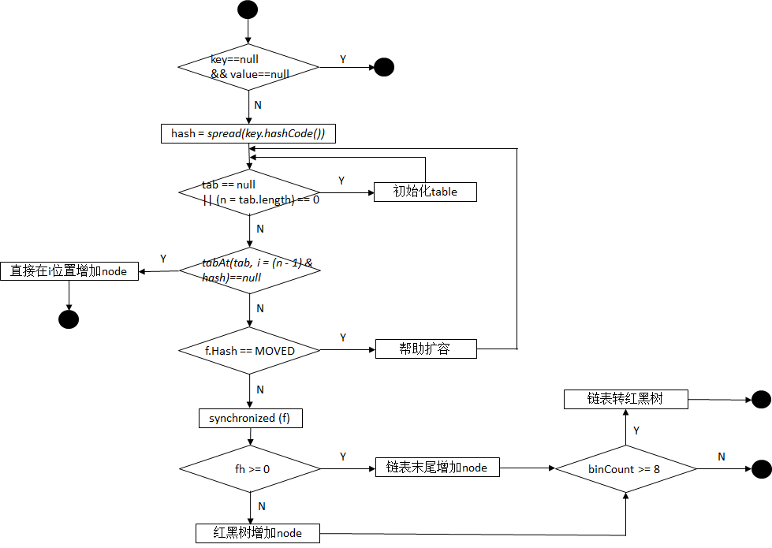


```java
public V put(K key, V value) {
  return putVal(key, value, false);
}

final V putVal(K key, V value, boolean onlyIfAbsent) {
  if (key == null || value == null) throw new NullPointerException();
  int hash = spread(key.hashCode());
  //结点数,检查是否要转为树
  int binCount = 0;
  //CAS经典写法，不成功无限重试，再次循环进行相应操作
  for (Node<K,V>[] tab = table;;) {
    Node<K,V> f; int n, i, fh;
    //检查是否需要初始化
    if (tab == null || (n = tab.length) == 0)   tab = initTable();
    //table对应下标处为null
    else if ((f = tabAt(tab, i = (n - 1) & hash)) == null) {
      //创建Node对象做为链表首结点
      if (casTabAt(tab, i, null,new Node<K,V>(hash, key, value, null)))
        break;
    }
    //当前结点正在扩容(MOVED状态)
    else if ((fh = f.hash) == MOVED)
      //helpTransfer()协助扩容，扩容完毕后tab指向新table
      tab = helpTransfer(tab, f); 
    else {
      V oldVal = null;
      synchronized (f) {
        //双重检查i处结点未变化
        if (tabAt(tab, i) == f) {
          //fh为f的hash值,hash>=0即spread()方法计算而来
          if (fh >= 0) {
            binCount = 1;
            for (Node<K,V> e = f;; ++binCount) {
              K ek;
              if (e.hash == hash &&((ek = e.key) == key ||
                   (ek != null && key.equals(ek)))) {
                oldVal = e.val;
                //onlyIfAbsent表示是新元素才加入，旧值不替换，默认fase
                if (!onlyIfAbsent)    e.val = value;
                break;
              }
              Node<K,V> pred = e;
              if ((e = e.next) == null) {
                //把新结点加入链表尾部，next由volatile修饰
                pred.next = new Node<K,V>(hash, key,value, null);
                break;
              }
            }
          }
          //红黑树结点类型
          else if (f instanceof TreeBin) {
            Node<K,V> p;
            binCount = 2;
            if ((p = ((TreeBin<K,V>)f).putTreeVal(hash, key,value)) != null) {
              oldVal = p.val;
              if (!onlyIfAbsent)  p.val = value;
            }
          }
        }
      }
      if (binCount != 0) {
        //默认桶中结点数超过8个数据结构会转为红黑树
        if (binCount >= TREEIFY_THRESHOLD)   treeifyBin(tab, i);
        if (oldVal != null)  return oldVal;
        break;
      }
    }
  }
  addCount(1L, binCount);  //更新size，检测扩容
  return null;
}
```


#### addCount


```java
private final void addCount(long x, int check) {
  CounterCell[] as; long b, s;
  if ((as = counterCells) != null ||
      !U.compareAndSwapLong(this, BASECOUNT, b = baseCount, s = b + x)) {
    CounterCell a; long v; int m;
    boolean uncontended = true;
    if (as == null || (m = as.length - 1) < 0 ||
        (a = as[ThreadLocalRandom.getProbe() & m]) == null ||
        !(uncontended =U.compareAndSwapLong(a, CELLVALUE, v = a.value, v + x))) {
      fullAddCount(x, uncontended);
      return;
    }
    if (check <= 1)
      return;
    s = sumCount();
  }  
  //是否需要扩容	check结点数量
  if (check >= 0) {
    Node<K,V>[] tab, nt; int n, sc;
    //s:插入元素后的容量		s>=扩容阈值 && s<最大扩容值时,才扩容，如果tab=null说明正在初始化，死循环等待初始化完成
    while (s >= (long)(sc = sizeCtl) && (tab = table) != null && (n = tab.length) < MAXIMUM_CAPACITY) {
      //rs的高16位置0，第16位为1，低15位存放n		rs与RESIZE_STAMP_SHIFT配合可以求出新的sizeCtl的值
      int rs = resizeStamp(n);
      //正在扩容/初始化,将sizeCtl+1并调用transfer()让当前线程参与扩容
      if (sc < 0) {
        if ((sc >>> RESIZE_STAMP_SHIFT) != rs || 	//条件1：检查是对容量n的扩容，保证sizeCtl与n是一块修改好的
            sc == rs + 1 ||sc == rs + MAX_RESIZERS ||		//条件2/3：sc的最小值或最大值判断
            (nt = nextTable) == null ||transferIndex <= 0)	//条件4/5: 确保tranfer()中的nextTable相关初始化逻辑已走完
          break;
        //transfer()协助扩容,sizeCtl++
        if (U.compareAndSwapInt(this, SIZECTL, sc, sc + 1))  transfer(tab, nt);
      }
      //没有线程在扩容，将sizeCtl的值改为(rs << RESIZE_STAMP_SHIFT) + 2)
      else if (U.compareAndSwapInt(this, SIZECTL, sc,(rs << RESIZE_STAMP_SHIFT) + 2))
        transfer(tab, null);
      s = sumCount();
    } 
  }
}

//计算n转换成二进制后前面有几个0	返回 高16位置0，第16位为1，低15位存放n，表示是对n的扩容
static final int resizeStamp(int n) {
  //(1 << (RESIZE_STAMP_BITS - 1) -> 1<<15 -> 高16位为0，第16位为1
  return Integer.numberOfLeadingZeros(n) | (1 << (RESIZE_STAMP_BITS - 1));
}
```


rs即resizeStamp(n)，如当前容量为8时sc(sizeCtl)的计算过程如下：

```java
//容量n=8
0000 0000 0000 0000 0000 0000 0000 1000
//Integer.numberOfLeadingZeros(8)=28，二进制表示如下：
0000 0000 0000 0000 0000 0000 0001 1100
//rs
0000 0000 0000 0000 1000 0000 0001 1100
//temp = rs << RESIZE_STAMP_SHIFT，即 temp = rs << 16，左移16后temp最高位为1，所以temp成了一个负数。
1000 0000 0001 1100 0000 0000 0000 0000
//第一个线程要扩容时，sc = (rs << RESIZE_STAMP_SHIFT) + 2)
1000 0000 0001 1100 0000 0000 0000 0010
12345678910
```

那么在扩容时sizeCtl值的意义便如下图所示：

| 高15位        | 低16位           |
| ------------- | ---------------- |
| 容量n扩容标识 | 并行扩容线程数+1 |


#### tryPresize


```java
private final void tryPresize(int size) {
        //根据传入的size计算出真正的新容量，新容量需要是2的幂次方。
        int c = (size >= (MAXIMUM_CAPACITY >>> 1)) ? MAXIMUM_CAPACITY :
            tableSizeFor(size + (size >>> 1) + 1);
        int sc;
        while ((sc = sizeCtl) >= 0) {
            Node<K,V>[] tab = table; int n;
            if (tab == null || (n = tab.length) == 0) {
                n = (sc > c) ? sc : c;   //table未初始化则给一个初始容量
                //后面相似代码不再讲解
                if (U.compareAndSwapInt(this, SIZECTL, sc, -1)) {
                    try {
                        if (table == tab) {
                            @SuppressWarnings("unchecked")
                            Node<K,V>[] nt = (Node<K,V>[])new Node<?,?>[n];
                            table = nt;
                            sc = n - (n >>> 2);
                        }
                    } finally {
                        sizeCtl = sc;
                    }
                }
            }
            else if (c <= sc || n >= MAXIMUM_CAPACITY)
                break;
            else if (tab == table) {
                int rs = resizeStamp(n);
                if (sc < 0) {
                    Node<K,V>[] nt;
                    if ((sc >>> RESIZE_STAMP_SHIFT) != rs || sc == rs + 1 ||
                        sc == rs + MAX_RESIZERS || (nt = nextTable) == null ||
                        transferIndex <= 0)
                        break;
                    if (U.compareAndSwapInt(this, SIZECTL, sc, sc + 1))
                        //传入指定容量
                        transfer(tab, nt);
                }
                else if (U.compareAndSwapInt(this, SIZECTL, sc,
                                             (rs << RESIZE_STAMP_SHIFT) + 2))
                    transfer(tab, null);
            }
        }
    }
```


### HashTable


双数组

线程安全,效率低

所有涉及多线程都加上了synchronized关键字来**锁住整个table**


#### size()为什么要做同步


同一时间只能有一条线程执行固定类的同步方法，但是对于类的非同步方法，可以多条线程同时访问。所以，这样就有问题了，可能线程A在执行Hashtable的put方法添加数据，线程B则可以正常调用size()方法读取Hashtable中当前元素的个数，那读取到的值可能不是最新的，可能线程A添加了完了数据，但是没有对size++，线程B就已经读取size了，那么对于线程B来说读取到的size一定是不准确的。

**而给size()方法加了同步之后，意味着线程B调用size()方法只有在线程A调用put方法完毕之后才可以调用，这样就保证了线程安全性**


### LinkedHashMap


==有序==,用HashMap操作数据结构，用LinkedList维护顺序

```java
LinkedHashMap<K,V> extends HashMap<K,V>  implements Map<K,V>
```


只定义了3个属性

```java
//最久访问的节点或最先插入的节点
transient LinkedHashMap.Entry<K,V> head;
//尾部为最近访问的或最近插入的节点
transient LinkedHashMap.Entry<K,V> tail;
//false插入顺序存储		true查询顺序存储		默认false
final boolean accessOrder;
```


构造器，**默认都采用插入顺序存储**,都通过调用父类来创建对象

```java
public LinkedHashMap() {
  super();
  accessOrder = false; }

//map参数
public LinkedHashMap(Map<? extends K, ? extends V> m) {
  super();
  accessOrder = false;
  putMapEntries(m, false);}
```


Entry
```java
static class Entry<K,V> extends HashMap.Node<K,V> {
  //维护Entry的先后顺序
  Entry<K,V> before, after;
  //kv,next,hash都继承自HashMap
  Entry(int hash, K key, V value, Node<K,V> next) { super(hash, key, value, next);    }}
```


LinkedHashMap 内部类 Entry 继承自 HashMap 内部类 Node，并新增了两个属性before 和 afte用于维护双向链表

==HashMap 的内部类 TreeNode 不继承自己的内部类 Node，却继承自 LinkedHashMap 内部类 Entry,使得TreeNode 具备了和其他 Entry 一起组成链表的能力(多态)==


==TreeNode的大小约是Node对象的2倍==，仅在桶中包含足够多的节点时才被使用。当桶中的节点数量变少时，TreeNode会被转成 Node=

当用户实现的 hashCode 方法具有良好分布性时,不会转为红黑树，TreeNode将很少被使用


#### 链表初始化


==插入第一个节点时创建链表==,此时head和tail同时指向第一个节点

后续的节点将接在tail指向的节点后面,同时更新tail


插入元素

LinkedHashMap没有覆写父类的 put 方法，而是直接使用了父类的实现

再put之后,调用linkNodeLast()更新链表的tail

```java
    private void linkNodeLast(LinkedHashMap.Entry<K,V> p) {
        LinkedHashMap.Entry<K,V> last = tail;
        tail = p;
        if (last == null)
            head = p;
        else {
            p.before = last;
            last.after = p;   }   }
```


删除元素

没有重写hashMap的删除

```java
HashMap:
	//remove()调用了removeNode()
    public V remove(Object key) {
        Node<K,V> e;
        return (e = removeNode(hash(key), key, null, false, true)) == null ?null : e.value;
    }
//removeNode()执行完HashMap所需的删除逻辑时,回调了afterNodeRemoval(),HashMap中的afterNodeRemoval()为抽象方法
final Node<K,V> removeNode() {
        ...
afterNodeRemoval(node);}

// LinkedHashMap 中覆写
void afterNodeRemoval(Node<K,V> e) { // unlink
    LinkedHashMap.Entry<K,V> p =
        (LinkedHashMap.Entry<K,V>)e, b = p.before, a = p.after;
    // 将 p 节点的前驱后后继引用置空
    p.before = p.after = null;
    // b 为 null，表明 p 是头节点
    if (b == null)   head = a;
    else    b.after = a;
    // a 为 null，表明 p 是尾节点
    if (a == null)   tail = b;
    else   a.before = b;
//删除逻辑
1.根据 hash 定位到桶位置
2.遍历链表
3.从链表中移除要删除的节点
```


#### 维护访问顺序

```
get/getOrDefault/replace	3种改变顺序的方法
```


```java
// LinkedHashMap 中覆写
public V get(Object key) {
    Node<K,V> e;
    if ((e = getNode(hash(key), key)) == null)
        return null;
//accessOrder==true，按访问顺序排序
    if (accessOrder)
        afterNodeAccess(e);
    return e.value;
}

    void afterNodeAccess(Node<K,V> e) { // move node to last
        LinkedHashMap.Entry<K,V> last;
        if (accessOrder && (last = tail) != e) {
            LinkedHashMap.Entry<K,V> p =
                (LinkedHashMap.Entry<K,V>)e, b = p.before, a = p.after;
            p.after = null;
            if (b == null)
                head = a;
            else
                b.after = a;
            if (a != null)
                a.before = b;
            else
                last = b;
            if (last == null)
                head = p;
            else {
                p.before = last;
                last.after = p;
            }
            tail = p;
            ++modCount;    }}
```


### TreeMap


红黑树实现,线程不安全


#### TreeMap按Value排序

TreeMap底层是根据红黑树的数据结构构建的，默认是key的自然排序

==将TreeMap的EntrySet转换成list，然后使用Collections.sor排序==

```java
 Map<String,String> map = new TreeMap<String,String>();

List<Entry<String, String>> list = new ArrayList<Entry<String, String>>(map.entrySet());
Collections.sort(list,new Comparator<Map.Entry<String,String>>() {
//升序排序
public int compare(Entry<String, String> o1, Entry<String, String> o2) {
	return o1.getValue().compareTo(o2.getValue()); } });
```


## 排序


### Comparable(函数式接口)


一个类实现了Comparable接口，就意味着“**该类支持排序**”,可以通过 Collections.sort（或 Arrays.sort）进行排序,也可以用作“有序映射(如TreeMap)”中的键或“有序集合(TreeSet)”中的元素，而不需要指定比较器


```java
public interface Comparable<T> {
    public int compareTo(T o);
}
```


### Comparator(内部比较器)


==策略模式==

比较器接口


## Iterator


所有集合类都实现了Iterator接口

==Iterator只能单向移动==


```java
forEachRemaining(Consumer<? super E> action) 为剩余元素执行指定的操作,直到所有的元素都完成或抛出异常
hasNext()  如果迭代器中还有元素，则返回true
next()		返回迭代器中的下一个元素
remove()	删除当前元素//唯一能安全地在迭代过程中修改集合的方式,并且每次next()只能一次remove()
```


### ListIterator


继承于Iterator接口,功能更强大

只能用于List类型的访问

==双向移动,保留迭代器前一个和后一个元素的索引==


```java
listIterator(n)	//指定迭代器初始位置
set()	//替换当前元素.
previous()	//前一个元素
```


### Iterator和ListIterator区别


* 只有ListIterator有add()
* ListIterator有hasPrevious()和previous()方法，可以**逆序遍历**
* ListIterator用nextIndex()和previousIndex()指定索引位置
* ListIterator在遍历同时set()修改


### foreach


foreach是通过iterator实现的遍历

对于数组,for和foreach差不多

对于链表，foreach效率高


### fail-fast机制


在迭代时对该集合进行修改，迭代器抛出 ConcurrentModificationException(并发修改)

如果**单线程违反了规则，也会抛出该异常**

迭代器的快速失败行为无法得到保证，它不能保证一定会出现该错误，但会尽最大努力抛出ConcurrentModificationException异常


为提高并发修改集合的正确性,依赖于此异常是错误的

正确做法是：

* ConcurrentModificationException 仅用于检测 bug

* synchronized  (阻塞问题)

* 使用CopyOnWriteArrayList来替换ArrayList，其所有修改值的操作都对底层数组复制来实现
  * 无需同步,就能实现并发
  * 遍历操作的数量远超可变操作数量


ArrayList

```java
 public E next() {    
            checkForComodification();    
            /** 省略 */    
        }    

        public void remove() {    
            if (this.lastRet < 0)    
                throw new IllegalStateException();    
            checkForComodification();    
            /** 省略 */    
        }

//迭代器调用next()、remove()都会调用checkForComodification()，该方法主要就是检测modCount == expectedModCount,若不等则抛出ConcurrentModificationException 异常，从而产生fail-fast机制。

//expectedModCount 在Itr中定义：int expectedModCount = ArrayList.this.modCount;它的值是不可能修改的，会变的只有modCount
//modCount在 AbstractList 中定义的，为全局变量
protected transient int modCount = 0; 
```


无论add、remove、clear方法,都会导致modCount的改变

```java
public boolean add(E paramE) {    
    ensureCapacityInternal(this.size + 1);    
    /** 省略此处代码 */    
}    

private void ensureCapacityInternal(int paramInt) {    
    if (this.elementData == EMPTY_ELEMENTDATA)    
        paramInt = Math.max(10, paramInt);    
    ensureExplicitCapacity(paramInt);    
}    

private void ensureExplicitCapacity(int paramInt) {    
    this.modCount += 1;    //修改modCount    
    /** 省略此处代码 */    
}    

ublic boolean remove(Object paramObject) {    
    int i;    
    if (paramObject == null)    
        for (i = 0; i < this.size; ++i) {    
            if (this.elementData[i] != null)    
                continue;    
            fastRemove(i);    
            return true;    
        }    
    else    
        for (i = 0; i < this.size; ++i) {    
            if (!(paramObject.equals(this.elementData[i])))    
                continue;    
            fastRemove(i);    
            return true;    
        }    
    return false;    
}    

private void fastRemove(int paramInt) {    
    this.modCount += 1;   //修改modCount    
    /** 省略此处代码 */    
}    

public void clear() {    
    this.modCount += 1;    //修改modCount    
    /** 省略此处代码 */    
}
```


## Arrays


### asList


**不建议使用于基本数据类型的数组**

该方法将数组与List列表链接起来：当更新其一个时，另一个自动更新


==得到的List长度不可变==,不支持add()、remove()、clear()等,会抛出java.lang.UnsupportedOperationException

```java
public static <T> List<T> asList(T... a) {
        return new ArrayList<>(a);	//是Arrays的内部类ArrayList(继承自AbstractList),没有实现add()、remove(),调用将直接抛出异常
    }

体现的是适配器模式，只转换接口，后台的数据仍是数组
private static class ArrayList<E> extends AbstractList<E>implements RandomAccess, java.io.Serializable{
        private final E[] a;

        ArrayList(E[] array) { a = Objects.requireNonNull(array); }
```


转化列表后只是用来遍历，用Arrays.asList()

List还要添加或删除元素，new java.util.ArrayList，然后循环添加元素


## Collections


专门用来操作集合类 ，提供一系列静态方法实现对各种集合的搜索、排序、线程安全化等操作


### toArray


toArray的空参方法返回的是Object[]

可以调用有参构造,传入有类型的初始数组作为参数,因为参数只起到声明类型的作用,参数数组的长度可以为0

```java
public <T> T[] toArray(T[] a) {
        if (a.length < size)
            // 调用Arrays.copyOf(),传入了参数的class属性,利用反射
            return (T[]) Arrays.copyOf(elementData, size, a.getClass());
        System.arraycopy(elementData, 0, a, 0, size);
        if (a.length > size)    a[size] = null;
        return a;
    }
```


### unmodifiableList()


==装饰器模式==

传入一个List实例la，返回这个list的只读视图，类型依然是List

之后对视图进行add、remove等改变其内容的操作,直接抛出异常UnsupportedOperationException

```java
static class UnmodifiableList<E> extends UnmodifiableCollection<E> implements List<E> {

        final List<? extends E> list;

        UnmodifiableList(List<? extends E> list) {
            super(list);
            this.list = list;
        }

        public boolean equals(Object o) {return o == this || list.equals(o);}
        public int hashCode()           {return list.hashCode();}

        public E get(int index) {return list.get(index);}
        public E set(int index, E element) {
            throw new UnsupportedOperationException();
        }
        public void add(int index, E element) {    throw new UnsupportedOperationException();}
        public E remove(int index) {   throw new UnsupportedOperationException(); }
        public int indexOf(Object o)            {return list.indexOf(o);}
        public int lastIndexOf(Object o)        {return list.lastIndexOf(o);}
        public boolean addAll(int index, Collection<? extends E> c) {    throw new UnsupportedOperationException();}

        @Override
        public void replaceAll(UnaryOperator<E> operator) {   throw new UnsupportedOperationException();}
        @Override
        public void sort(Comparator<? super E> c) {  throw new UnsupportedOperationException();}
```


### synchronizedList


转换成线程安全的容器（==装潢模式==，将已有对象传入另一个类的构造器中,创建新对象来增加新功能）


## 队列


offer，add区别：

堆满插入时add抛出 unchecked 异常

offer()返回false

 

poll，remove区别：

remove() 和 poll() 方法都是从队列中删除第一个元素。remove() 的行为与 Collection 接口的版本相似

poll() 被空集合调用时不抛出异常，只是返回 null

 

peek，element区别：

element() 和 peek() 用于在队列的头部查询元素。

在队列为空时， element() 抛出一个异常，而 peek() 返回 null


### Deque


双端队列接口，继承自Queue接口

实现类	LinkedList、ArrayDeque、LinkedBlockingDeque


Deque接口扩展了 Queue 接口。在将双端队列用作队列时，将得到 FIFO（先进先出）行为。将元素添加到双端队列的末尾，从双端队列的开头移除元素。从 Queue 接口继承的方法完全等效于 Deque 方法

| **Queue方法** | **等效Deque方法** |
| ------------- | ----------------- |
| add(e)        | addLast(e)        |
| offer(e)      | offerLast(e)      |
| remove()      | removeFirst()     |
| poll()        | pollFirst()       |
| element()     | getFirst()        |
| peek()        | peekFirst()       |


也可用作 LIFO（后进先出）堆栈。在将双端队列用作堆栈时，元素被推入双端队列的开头并从双端队列开头弹出。堆栈方法完全等效于 Deque 方法

| **堆栈方法** | **等效Deque方法** |
| ------------ | ----------------- |
| push(e)      | addFirst(e)       |
| pop()        | removeFirst()     |
| peek()       | peekFirst()       |


### PriorityQueue 优先队列 1.5+


* **基于优先堆**的**无界**队列，**容量不受限制,会自动扩容**，但可以指定初始容量

* **不允许空值，不支持不可比较的对象**，如自定义类

* **队头最小**
* PriorityQueue是**非线程安全**的，==PriorityBlockingQueue线程安全==（实现BlockingQueue接口）


# IO


## BIO


每个连接对应一个线程,服务器:客户端=1:n

根本原因在于阻塞

```java
ServerSocket server = new ServerSocket(9090);
while (true) {
  Socket client = server.accept();    //等待客户端连接时阻塞,占用时间片但不运行
  new Thread(() -> {  //每个客户端连接都新开辟线程进行处理
      InputStream in = client.getInputStream();
      BufferedReader reader = new BufferedReader(new InputStreamReader(in));
      while (true) {
        String s = reader.readLine();
        if (null == s) {
          client.close();
          break;
        }
      }
  });
```


按传输的单位,分为
字节流：InputStream OutputStream

二进制文件用字节流读取

字符流：Reader Writer

字符流只处理文本文件。在设备中，大多数情况是以字节形式存储数据的，因此字符流通过需要传入字节流当参数

**其它与 IO 操作相关的类都是派生于上述 4 个抽象类**


按传输的方向,分为
输入流InputStream
输出流OutputStream


按实现功能,分为
节点流：OutputStream	直接与数据源相连，用于输入或者输出
处理流： OutputStreamWriter	在节点流的基础上对之进行加工，进行一些功能的扩展

**处理流的构造器需要传入节点流的子类**


### BufferedInputStream


适合大数据量的硬盘读取,缓冲流能够减少对硬盘的损伤


### Printwriter


可以打印各种数据类型


把控制台的输出重定向到文件

SetOut（printWriter,printStream）重定向


字节流->字符流


使用转换处理流OutputStreamWriter 可以将字节流转为字符流
New OutputStreamWriter（new FileOutputStream（File file））;


### DataInput


把包括基本类型在内的数据和字符串按顺序输出到数据源，或者按照顺序从数据源读入


### ObjectInput


把对象写入数据源或从一个数据源读出来


InputStream里的read()返回的是什么,read(byte[] data)是什么意思,返回的是什么值

\*答案\*

\*返回的是所读取的字节的int型（范围0-255）
read（byte [ ] data）将读取的字节储存在这个数组
返回的就是传入数组参数个数\*

\*Read 字节读取字节 字符读取字符\*

 **18.OutputStream里面的write()是什么意思,write(byte b[], int off, int len)这个方法里面的三个参数分别是什么意思**

\*答案\*

\*write将指定字节传入数据源
Byte b[ ]是byte数组
b[off]是传入的第一个字符
b[off+len-1]是传入的最后的一个字符 
len是实际长度\*

 **19.流一般需要不需要关闭,如果关闭的话在用什么方法,一般要在那个代码块里面关闭比较好，处理流是怎么关闭的，如果有多个流互相调用传入是怎么关闭的？**

\*答案\*

\*流一旦打开就必须关闭，使用close方法
放入finally语句块中（finally 语句一定会执行）
调用的处理流就关闭处理流
多个流互相调用只关闭最外层的流\*


**说下常用的io流**

Icon

InputStream,OutputStream,
FileInputStream,FileOutputStream,
BufferedInputStream,BufferedOutputStream
Reader,Writer
BufferedReader,BufferedWriter


\1. 读写原始数据，一般采用什么流？（AC ）
A InputStream
B DataInputStream
C OutputStream
D BufferedInputStream
\2. 为了提高读写性能，可以采用什么流？（ DF）
A InputStream
B DataInputStream
C BufferedReader
D BufferedInputStream
E OutputStream
F BufferedOutputStream
\3. 对各种基本数据类型和String类型的读写，采用什么流？（ AD）
A DataInputStream
B BufferedReader
C PrintWriter
D DataOutputStream
E ObjectInputStream
F ObjectOutputStream
\4. 能指定字符编码的I/O流类型是：（BH ）
A Reader
B InputStreamReader
C BufferedReader
D Writer
E PrintWriter
F ObjectInputStream
G ObjectOutputStream
H OutputStreamWriter
\5. File类型中定义了什么方法来判断一个文件是否存在？（ D）
A createNewFile
B renameTo
C delete
D exists
\6. File类型中定义了什么方法来创建一级目录？（ CD）
A createNewFile
B exists
C mkdirs
D mkdir


File类的mkdir方法根据抽象路径创建目录；File类的mkdirs方法根据抽象路径创建目录，包括创建必需但不存在的父目录

\7. 对文本文件操作用什么I/O流？（AD ）
A FileReader
B FileInputStream
C RandomAccessFile
D FileWriter

\9. 创建一个TCP客户程序的顺序是：（DACBE ）
A 获得I/O流
B 关闭I/O流
C 对I/O流进行读写操作
D 建立socket
E 关闭socket
\10. 创建一个TCP服务程序的顺序是：（BCADEGF ）
A 创建一个服务线程处理新的连接
B 创建一个服务器socket
C 从服务器socket接受客户连接请求
D 在服务线程中，从socket中获得I/O流
E 对I/O流进行读写操作，完成与客户的交互
F 关闭socket
G 关闭I/O流
\11. [Java ](http://lib.csdn.net/base/java)UDP编程主要用到的两个类型是：（ BD）
A UDPSocket
B DatagramSocket
C UDPPacket
D DatagramPacket


# NIO


* io
  * 阻塞的IO模型
  * 单向
  * 字节流处理数据

* nio
  * ==多路复用==的IO模型
  * 利用缓冲实现了数据在channel中的**双向**传输
  * **以块的方式处理数据**,效率高
  * 通道和缓冲区
    * 缓冲区可以分片，只读/直接/间接缓冲区


| IO                                                           | NIO                                                          |
| ------------------------------------------------------------ | ------------------------------------------------------------ |
| 面向流                                                       | 面向缓冲区                                                   |
| 阻塞,连接:线程=1:1                                           | 非阻塞,==异步==                                              |
| 没处理完线程不能退出,**不能用线程池**,连接数较多将出现资源不足 | 基于反应器模式，用于事件多路分离和分派的体系结构模式，**可用线程池** |
| 瓶颈在于不能处理过多的连接                                   | 连接的线程数和连接数没有关系,处理1000个连接只需要100个线程的线程池 |
| **无选择器**                                                 | **有选择器**,允许线程监视多个输入通道，可以注册多个通道使用一个选择器，然后使用一个线程来“选择”通道 |
|                                                              |                                                              |
|                                                              |                                                              |


```java
LinkedList<SocketChannel> list = new LinkedList<>();
ServerSocketChannel channel = ServerSocketChannel.open();   //开启监听
channel.bind(new InetSocketAddress(9090));
channel.configureBlocking(false);   //开启内核的非阻塞

while (true) {
  SocketChannel client = channel.accept();    //不会阻塞,立刻有返回值

  if (null != client) {
    client.configureBlocking(false);
    list.add(client);
  }
  ByteBuffer buffer = ByteBuffer.allocateDirect(4096);
  for (SocketChannel s : list) {
    int i = s.read(buffer); // -1 0 >0 此处也非阻塞
    if (i > 0) {
      buffer.flip();
      byte[] bytes = new byte[buffer.limit()];
      buffer.get(bytes);
      System.out.println(bytes.toString());
      buffer.clear();
    }
  }
}
```


## Buffer类4个属性与方法


* buffer	标记当前的position

* capacity	最大容量

* limit	可以操作数据的个数

* position	正在被操作数据的位置
  * position<=limit<=capacity


put() get()存取数据

flip()读数据模式	开启之后,当调用get()时, 会将position调为0, limit调为当前最大存储位置,然后再执行get()方法, 不然position并不在起始位置

rewind()重置读数据模式	再次将position调为0, limit调为当前最大存储位置

clear()	**并不会删除数据**,只是将三个属性初始化,里面的数据处于"被遗忘"状态,position和limit都被初始化,难以读取数据

**mark()	记录当前的position位置**

**reset()	配合mark()的使用,回到mark的位置**


## 通道


* IO
  * cpu需要建立若干io接口来进行io操作,这将导致cpu被占用
  * 后来引入了**DMA**直接存储器访问,cpu将io操作交给DMA进行,DMA先向cpu申请资源,然后形成**DMA总线**,不过总线的过多也会导致总线冲突,影响性能

* NIO
  * **channel类似于DMA总线**,是一个完全独立的处理器,专门用于处理io,不需要向cpu申请资源


### 主要实现类

* FileChannel	      本地传输
* SocketChannel        TCP
* ServerSocketChannel  TCP
* DatagramChannel      UDP


### 获取通道 getChannel()

本地

* FileInputStream/Output
* RandomAccessFile

Web

* Socket
* ServerSocket
* DatagramSocket

JDK1.7中NIO.2针对各个通道提供open()静态方法

JDK1.7中NIO.2的File工具类提供newByteChannel()方法


## 直接/非直接缓冲区


非直接	allocate()分配缓冲区,缓冲区在**jvm**

直接	allocateDirect(),在**物理内存**

jvm对于直接缓冲区,会尽量避免使用中间缓冲区进行数据的读写,而是直接在缓冲区上进行io操作

分配**直接**缓冲区需要**更大的成本**,也**不会被gc回收**,会影响应用程序的内存


对于非直接缓冲区,物理磁盘的数据先读取至内核地址空间,再被copy到jvm内存,最后到应用程序

点开allocate()方法也可以看到返回的是heap堆缓冲


对于直接缓冲区,应用程序通过物理内存映射文件直接与物理磁盘交换数据 省略了copy的步骤

* 缺点
  * ==直到gc释放了应用程序与物理内存映射文件的引用,才会销毁链接==,映射文件的引用有可能延迟数十秒才会被回收
  * 直接缓冲区的建立与销毁是成本高,只适合长时间的连接,大文件的传输
  * ==直接缓冲区只能用ByteBuffer==


## 关闭


使用IO流往往需要多次使用try/catch

如果在一个try/catch中关闭多个流,将会导致关闭时其中一个流,抛出异常,程序中断,之后的流将不再被关闭!!!

需要一条一条的try/catch


## 非直接传输


```java
FileInputStream in = new FileInputStream("1.jpg");
        FileOutputStream out = new FileOutputStream("2.jpg");

        FileChannel inChannel = in.getChannel();
        FileChannel outChannel = out.getChannel();
        ByteBuffer buffer = ByteBuffer.allocate(1024);
        while (inChannel.read(buffer) != -1) {
            //切换至读模式
            buffer.flip();
          //将缓冲区数据写入通道
            outChannel.write(buffer);
            buffer.clear();
        }
        
        out.close();
        in.close();
        inChannel.close();
        outChannel.close();
```


## 直接传输


* NonReadableChannelException
  * MapMode只有READ_WRITE模式,而在outChannel并没有授予StandardOpenOption.READ权限,导致文件不可读

* FileAlreadyExistsException
  * StandardOpenOption.CREATE_NEW在文件存在时,会直接报错,CREATE模式则覆盖源文件

```java
FileChannel inChannel = FileChannel.open(Paths.get("1.png"), StandardOpenOption.READ);
//CREATE_NEW,文件不存在则创建,存在则报错
//CREATE,不存在则创建,存在则覆盖
FileChannel outChannel = FileChannel.open(Paths.get("2.png"), StandardOpenOption.WRITE, StandardOpenOption.READ, StandardOpenOption.CREATE_NEW);

//内存映射文件
MappedByteBuffer inmap = inChannel.map(FileChannel.MapMode.READ_ONLY, 0, inChannel.size());
MappedByteBuffer outMap = outChannel.map(FileChannel.MapMode.READ_WRITE, 0, inChannel.size());

//直接对缓冲区进行数据的读写
byte[] bytes = new byte[inmap.limit()];
inmap.get(bytes);
outMap.put(bytes);

inChannel.close();
outChannel.close();
```


## 通道传输

底层也是用的直接传输


```java
FileChannel inChannel = FileChannel.open(Paths.get("1.png"), StandardOpenOption.READ);
FileChannel outChannel = FileChannel.open(Paths.get("2.png"), StandardOpenOption.WRITE, StandardOpenOption.READ, StandardOpenOption.CREATE_NEW);

inChannel.transferTo(0, inChannel.size(), outChannel);
//        outChannel.transferFrom(inChannel, 0, inChannel.size());

inChannel.close();
outChannel.close();
```


# 多线程


**进程**：在操作系统上独立运行的程序，是**资源分配的基本单位**。运行程序 = 进程程创建 -> 运行 -> 消亡

**线程**：是比进程更小的**执行单位**，也被称为轻量级进程

**线程共享进程的堆和方法区**，但**每个线程有自己的程序计数器、虚拟机栈和本地方法栈**，所以系统在各个线程间上下文切换时，负担比进程小


.png)


| 并行 | 同时多个进程运行                  |
| ---- | --------------------------------- |
| 并发 | 上下文快速切换,造成同时运行的假象 |
| 串行 | 按先后顺序进行                    |


**守护线程 daemon**

即使没有主动创建线程,后台也会有多个线程,如主线程(用户线程),gc线程(守护线程)

**JVM必须保证用户线程执行完毕,但无需等待守护线程执行完毕**

一条java线程将对应多条操作系统OS的线程(守护线程的存在)


**上下文切换 ContextSwitch**

CPU给每个线程分配CPU时间片,时间片结束后切换线程，当前状态（PC、寄存器等）放到缓存或者内存中，称为**保护现场**，以便下次切换回这个任务时，可以再加载状态


**超线程**

一个ALU对应多个PC/Registers (所谓的4核8线程)

原本上下文切换需要切换掉 程序计数器PC 和 寄存器Registers 中的数据,再让运算单元ALU去运算

而超线程的ALU不需要切换数据,只需要切换PC/Registers,效率更高


线程有独立的工作内存，用于存储私有数据	主内存则共享内存区域

线程**对变量的操作在工作内存中进行**（线程安全问题的根本原因）

* 首先将变量从主内存拷贝到工作内存

* 然后对变量进行操作，再将变量写回主内存

* **线程间无法访问对方的工作内存**，==线程通信(传值)必须通过主内存完成==,多线程对共享变量进行修改时，工作内存的副本进行操作，相互不可见。主内存中共享变量的结果是不可预知的


**start() 会执行 run()**

new 一个 Thread，线程进入初始状态；

调用 start()方法，会启动一个线程并使线程进入了就绪状态，当分配到时间片后就可以开始运行了。 start() 会执行线程的相应准备工作，然后自动执行 run() 方法的内容，这是真正的多线程工作

而直接执行run()是作为main线程下的普通方法，并不是多线程


## CAS无锁算法


Compare And Swap，比较与交换

* 内存地址V，旧值A和新值B
* 执行过程中发现V上的值 == A (主内存未被修改)，就将V更新为B
  * 不匹配则不更新,并可以再次尝试
* 无锁定,线程不必等待锁定，效率高


CAS不通过JVM,直接利用JNI（Java Native Interface本地调用）,存在CPU的原语支持,直接调用CPU的cmpxchg汇编指令,使得CAS操作不会被cpu打断(不存在判断旧值是否相等过程中被其他线程修改了值)

JUC建立在CAS之上，相对于synchronized性能更高

==读/改/写都是原子性操作==


* 缺点
  * CPU开销大  反复尝试更新，却一直不成功，给CPU压力,**只适合冲突较少的场景**
  * 不能保证代码块的原子性   **只保证变量的原子性操作**


### ABA问题


**当一个值从A->B，又B->A，普通CAS机制会误判通过检测**


| 线程1 | 获取当前值A | 期望更新为B |
| ----- | ----------- | ----------- |
| 线程2 | 获取当前值A | 期望更新为B |
| 线程3 |             | 期望更新为A |


* 1执行成功，A->B	同时2阻塞

* 3获取当前值B,2仍然阻塞

* 3执行，B->A

* 2恢复，由于阻塞之前获得“当前值A”，并且compare()内存地址V中的实际值也是A，所以A->B


**虽然代码逻辑无问题,但业务逻辑不合理**


* 100存款，提款50

* 提款机出问题，提款操作被同时提交两次，开启了两个线程，都获取当前值100，要更新成50
  * 正常的业务为1次成功,1次失败

* 1执行成功，100->50	2阻塞

* 发生汇款50	2仍然阻塞

* 汇款成功，50->100

* 2恢复,100->50    被提款了2次


==版本号==

compare()不仅要比较A和V的实际值，还要比较变量的版本号是否一致,每次修改都更新版本号


AtomicStampedReference类就实现了用版本号作比较机制


## COW


CopyOnWrite


## JUC 1.5+


Java的CAS会使用现代处理器上提供的高效机器级别原子指令，这些原子指令以原子方式对内存执行读-改-写操作，这是在多处理器中实现同步的关键（从本质上来说，能够支持原子性读-改-写指令的计算机器，是顺序计算图灵机的异步等价机器，因此任何现代的多处理器都会去支持某种能对内存执行原子性读-改-写操作的原子指令）

同时，volatile变量的读/写 + CAS 可以实现线程之间的通信

把这些特性整合在一起，就形成了整个concurrent包实现的基石


concurrent包的通用实现模式：

首先，声明共享变量为volatile

然后，使用CAS的原子条件更新来实现线程同步

同时，配合volatile的读/写 + CAS所具有的volatile读和写的内存语义来实现线程通信


AQS的实现模式:

非阻塞数据结构 + 原子变量类


### fail-safe机制


基于遍历容器的克隆,因此对容器内容的修改不影响遍历

JUC的容器都是安全失败的,可以在多线程下并发使用,并发修改


先复制原有集合内容，在拷贝的集合上进行遍历

由于迭代时是对原集合的拷贝进行遍历，在遍历过程中对原集合所作的修改不能被迭代器检测到，**不会触发Concurrent Modification Exception**


缺点：迭代器不能访问到修改后的内容(遍历期间原集合的修改无法得知)


### CountDownLatch 闭锁


相当于原子操作的计数器，同时只能有一个线程去操作计数器


- 当一个或多个线程调用await方法时，这些线程会阻塞
- 其它线程调用countDown方法会将计数器减1(调用countDown方法的线程不会阻塞)
- 计数器的值变为0时，因await方法阻塞的线程会被唤醒，继续执行


==countDown()写在finally中,避免死锁==

向CountDownLatch对象设置初始计数值，任何调用这个对象上的await()方法都会阻塞，直到这个计数器的计数值被其他的线程减为0


用join()也可以实现类似CountDownLatch的效果,但是如果线程的工作分为2个阶段,其余线程在完成1阶段后,阻塞线程就可以运行,这个情景下无法使用join(),因为**join()只能合并线程,但不能让线程同时运行**


适用场景:

有一个任务想要往下执行，但必须要等到其他的任务执行完毕后才可以继续往下执行。假如我们这个想要继续往下执行的任务调用一个CountDownLatch对象的await()方法，其他的任务执行完自己的任务后调用同一个CountDownLatch对象上的countDown()方法，这个调用await()方法的任务将一直阻塞等待，直到这个CountDownLatch对象的计数值减到0为止


```java
//需求:要求6个线程都执行完了,mian线程最后执行
CountDownLatch countDownLatch = new CountDownLatch(6);
for (int i = 1; i <= 6; i++) {
  new Thread(() -> countDownLatch.countDown(), i + "").start();
}
countDownLatch.await();
```


### CyclicBarrier


可循环(Cyclic) 使用的屏障(barrier)

让一组线程到达屏障时被阻塞,直到所有线程到达屏障时,才唤醒所有被拦截的线程


```java
//集齐7颗龙珠就能召唤神龙
CyclicBarrier cyclicBarrier = new CyclicBarrier(7, () -> System.out.println(""));
for (int i = 1; i <= 7; i++) {
  final int temp = i;
  new Thread(() -> cyclicBarrier::await).start();
}
```


### Phaser


强调阶段,类似于分阶段的内存屏障

不光可以设置阶段个数,也能设置屏障个数


```
bulkRegister()	指定屏障拦截的线程数量

onAdvance()	需重写方法,自定义各个阶段的业务,以int表示阶段

arriveAndAwaitAdvance()	线程到达,并参与后续阶段

arriveAndDeregister()	线程到达此处时停止,不再参与后续阶段


```


### Semaphore 信号量


限制对共享资源进行访问的线程数量

对资源访问前，线程必须得到信号量的许可(permits-—)

完成访问后，线程必须向信号量归还许可（permits++）


适用场景:

限流,多个共享资源的互斥使用 / 并发线程数的控制


```java
acquire（获取） 成功获取时信号量–-	信号量为0时,获取失败,

release（释放）信号量++，唤醒等待的线程,必须放在finally
  
new Semaphore(int permits);	同时执行的线程数量
```


```java
Semaphore semaphore = new Semaphore(1);
for (int i = 1; i <= 6; i++) {
  new Thread(() -> {
    try {
      semaphore.acquire();
      System.out.println(Thread.currentThread().getName() + "\t抢占了车位");
    } catch (InterruptedException e) {
      e.printStackTrace();
    } finally {
      semaphore.release();
      System.out.println(Thread.currentThread().getName() + "\t离开了车位");
    }
  }, String.valueOf(i)).start();
}
```


### Exchanger


**只支持2个线程间同步数据**


```java
static Exchanger<String> exchanger = new Exchanger();

public static void main(String[] args) {
    new Thread(() -> {
        String s = "T1";
        s = exchanger.exchange(s);
        System.out.println(Thread.currentThread().getName() + s);
    }, "t1").start();

    new Thread(() -> {
        String s = "T2";
        s = exchanger.exchange(s);
        System.out.println(Thread.currentThread().getName() + s);
    }, "t2").start();
}

t1T2
t2T1		两个线程的局部变量s交换了引用
```


### Atomic


底层是CAS

AtomicBoolean，AtomicUInteger，AtomicLong。分别用于Boolean，Integer，Long类型的原子性操作


AtomicInteger

```java
public class AtomicInteger extends Number implements java.io.Serializable {
  private static final Unsafe unsafe = Unsafe.getUnsafe();
  private static final long valueOffset;

  static {
    try {
      valueOffset = unsafe.objectFieldOffset(AtomicInteger.class.getDeclaredField("value"));
    } catch (Exception ex) { throw new Error(ex); }
  }

  private volatile int value;

  public final int incrementAndGet() {
    //this对象本身	valueOffset记录value在主内存的地址
    return unsafe.getAndAddInt(this, valueOffset, 1) + 1;
  }
}
```


Unsafe

```java
public final class Unsafe {
  private static final Unsafe theUnsafe;
  //单例模式
  private Unsafe() { }
  static {
    ...
      theUnsafe = new Unsafe();
    ...
  }


  public final int getAndAddInt(Object var1, long var2, int var4) {
    int var5;
    do {
      var5 = this.getIntVolatile(var1, var2);
    } while(!this.compareAndSwapInt(var1, var2, var5, var5 + var4));
    return var5;
  }

  //native方法	var1当前对象	var2 valueOffsetvalue在主内存的地址	var4常量1	var5根据var1/2,调用getIntVolatile()得到的值
  //当var1==var5,才更新
  public final native boolean compareAndSwapInt(Object var1, long var2, int var4, int var5);

  public native int getIntVolatile(Object var1, long var2);
  
  //直接在JVM上分配内存
   public native long allocateMemory(long var1);
}

//最终是靠lock cmpxchg指令实现CAS操作,在一个cpu进行修改值时,不允许其他cpu进行修改
```


#### LongAdder


使用了**分段锁**,在并发量更大的情况下,比AtomicLong更快


### Executor 1.5+


Executor根据一组执行策略来调度，执行和控制的异步任务

无限制的创建线程会引起内存溢出。所以需要创建线程池来回收再利用线程


==Executors类里面提供了一些静态工厂，生成一些常用的线程池==

**newCachedThreadPool** 可缓存线程池，如果线程池长度超过处理需要，可灵活回收空闲线程，若无可回收，则新建线程

**newFixedThreadPool** 定长线程池，可控制线程最大并发数，超出的线程会在队列中等待

**newScheduledThreadPool** 定长线程池，支持定时及周期性任务执行

**newSingleThreadExecutor** 单线程化的线程池，它只会用唯一的工作线程来执行任务，保证所有任务按照指定顺序(FIFO, LIFO, 优先级)执行


Executor		总接口,只定义了execute()执行线程方法

ExecutorService extends Executor 子接口,定义了shutdown()关闭 submit()等方法

```
abstract class AbstractExecutorService implements ExecutorService
```


class ThreadPoolExecutor extends AbstractExecutorService

```
void execute(Runnable command){}	//执行Runnable线程,无返回值
```


```
<T>Future<T> submit(Callable<T> task)	//执行Callable线程,有返回值
```


```
Executors工具类(工厂模式),返回不同类型的线程池
定义了new线程池的方法
Executors.newFixedThreadPool(10);
```


Executors创建线程池对象的弊端
1）FixedThreadPool和SingleThreadPool:
  允许的请求队列长度为Integer.MAX_VALUE，可能会**堆积大量的请求**，从而导致OOM
2）CachedThreadPool:
  允许的创建线程数量为Integer.MAX_VALUE，可能会**创建大量的线程**，从而导致OOM


### Callable + Future


**Callable用于产生结果，Future用于获取结果**

**Callable接口用泛型去定义它的返回类型**。Executors类提供了一些有用的方法去在线程池中执行Callable内的任务。但Callable任务是并行的，必须等待它返回的结果。Future对象解决了这个问题


**在线程池提交Callable任务后返回了一个Future对象**，从而知道Callable任务的状态和得到Callable的返回值(Future提供的get())


### FutureTask


用于异步获取执行结果或取消执行任务的场景。通过传入Runnable或者Callable的任务给FutureTask，直接调用其run方法或者放入线程池执行，之后可以在外部通过FutureTask的get方法异步获取执行结果，因此，FutureTask非常适合用于耗时的计算，主线程可以在完成自己的任务后，再去获取结果。另外，FutureTask还可以确保即使调用了多次run方法，它都只会执行一次Runnable或者Callable任务，或者通过cancel取消FutureTask的执行等。


### ThreadPoolExecutor


```java
public ThreadPoolExecutor(int corePoolSize,
                          int maximumPoolSize,
                          long keepAliveTime,
                          TimeUnit unit,
                          BlockingQueue<Runnable> workQueue) {
    this(corePoolSize, maximumPoolSize, keepAliveTime, unit, workQueue,
         Executors.defaultThreadFactory(), defaultHandler);
}
```


## ThreadLocal


创建只能被线程自己读写的变量,线程间无法访问对方的ThreadLocal

**ThreadLocal是资源的副本**,而不是共享资源。隔离线程存取数据的行为，给线程特定空间来保管独享资源


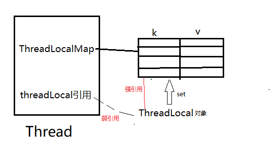


在Spring中,标记为事务的M方法调用了m1()和m2(),则m12对数据库的连接都将从 当前线程的ThreadLocal获取,使得两个方法获得同一个连接,从而保证事务能够回滚


ThreadLocal内部类ThreadLocalMap，存储每个线程的变量的副本，数据存储以后，只有指定线程可以得到存储数据

```java
class Thread implements Runnable {
  //每个线程一个ThreadLocalMap
 ThreadLocal.ThreadLocalMap threadLocals = null;
}
   
//设置ThreadLocal变量
public void set(T value) {
      //当前线程
      Thread t = Thread.currentThread();
      ThreadLocalMap map = getMap(t);
      //当前线程持有map就直接set，没有则创建并set
      if (map != null)
          map.set(this, value);
      else
          createMap(t, value);
  }
  
//每个线程持有一个ThreadLocalMap对象
ThreadLocalMap getMap(Thread t) {return t.threadLocals;}
   
void createMap(Thread t, T firstValue) {
      //每个新线程Thread都会实例化一个ThreadLocalMap赋值给成员变量threadLocals
      t.threadLocals = new ThreadLocalMap(this, firstValue);
}
```


**ThreadLocal的静态内部类ThreadLocalMap,维护数组table，ThreadLocal确定一个数组下标，对应value存储位置**

==ThreadLocalMap的键值对不会被GC,当不需要使用这个变量时必须手动remove==

```java
ThreadLocalMap {
  private static final int INITIAL_CAPACITY = 16;
  private Entry[] table;
  private int size = 0;
  private int threshold; // Default to 0

  //Entry为ThreadLocalMap静态内部类
  //对ThreadLocal的弱引用,在ThreadLocal=null时,避免了还有引用指向threadlocal对象,能够顺利gc
  //如果这里为强引用,将导致threadlocal永远无法被回收
  static class Entry extends WeakReference<ThreadLocal<?>> {
    Object value;
    Entry(ThreadLocal<?> k, Object v) {
      super(k);
      value = v;
    }
  }

  //ThreadLocalMap构造方法
  ThreadLocalMap(ThreadLocal<?> firstKey, Object firstValue) {
    //创建了长度为16的Entry数组
    table = new Entry[INITIAL_CAPACITY];
    //位运算,计算出存放位置
    int i = firstKey.threadLocalHashCode & (INITIAL_CAPACITY - 1);
    table[i] = new Entry(firstKey, firstValue);
    size = 1;
    setThreshold(INITIAL_CAPACITY);
  }

  private void set(ThreadLocal<?> key, Object value) {
    Entry[] tab = table;
    int len = tab.length;
    int i = key.threadLocalHashCode & (len-1);

    for (Entry e = tab[i];
         e != null;
         e = tab[i = nextIndex(i, len)]) {
      ThreadLocal<?> k = e.get();

      if (k == key) {
        e.value = value;
        return;
      }

      if (k == null) {
        replaceStaleEntry(key, value, i);
        return;
      }
    }

    tab[i] = new Entry(key, value);
    int sz = ++size;
    if (!cleanSomeSlots(i, sz) && sz >= threshold)
      rehash();
  }
```


每个Thread持有一个ThreadLocalMap的实例threadLocals-> thread:table = 1:1


```java
//在某一线程声明了ABC三种类型的ThreadLocal
//一个Thread只有一个ThreadLocalMap -> ABC对应同一个ThreadLocalMap对象,但存储在table数组的不同位置
ThreadLocal<A> sThreadLocalA = new ThreadLocal<A>();
ThreadLocal<B> sThreadLocalB = new ThreadLocal<B>();
ThreadLocal<C> sThreadLocalC = new ThreadLocal<C>();
```


ABC在table中的位置通过这里确定

```java
  //ThreadLocalMap中set方法。
  private void set(ThreadLocal<?> key, Object value) {
            Entry[] tab = table;
            int len = tab.length;
            //获取索引值
            int i = key.threadLocalHashCode & (len-1);

            //遍历tab如果已经存在则更新值
            for (Entry e = tab[i];
                 e != null;
                 e = tab[i = nextIndex(i, len)]) {
                ThreadLocal<?> k = e.get();

                if (k == key) {
                    e.value = value;
                    return;
                }

                if (k == null) {
                    replaceStaleEntry(key, value, i);
                    return;
                }
            }
            
            //如果上面没有遍历成功则创建新值
            tab[i] = new Entry(key, value);
            int sz = ++size;
            //满足条件数组扩容x2
            if (!cleanSomeSlots(i, sz) && sz >= threshold)
                rehash();
        }
```


在ThreadLocalMap中的set方法与构造方法能看到

- `int i = key.threadLocalHashCode & (len-1)`
- `int i = firstKey.threadLocalHashCode & (INITIAL_CAPACITY - 1)`
  将threadLocalHashCode进行一个位运算（取模）得到索引i


threadLocalHashCode是通过原子操作类AtomicInteger的自增确定的

```java
    private final int threadLocalHashCode = nextHashCode();

    private static AtomicInteger nextHashCode = new AtomicInteger();

    private static final int HASH_INCREMENT = 0x61c88647;//0x61c88647是斐波那契散列乘数，避免hash冲突

    private static int nextHashCode() {
        //每次new ThreadLocal会使threadLocalHashCode自增，增量为0x61c88647
        return nextHashCode.getAndAdd(HASH_INCREMENT);
    }
```


对于ThreadLocal对应的索引i是确定的

同一Thread的不同ThreadLocal，这些ThreadLocal实例共享table数组，每个ThreadLocal实例在table中的索引i不同

不同Thread间的table独立


### get


```java
//获取ThreadLocal变量
public T get() {
    Thread t = Thread.currentThread();
    ThreadLocalMap map = getMap(t);
    if (map != null) {
        ThreadLocalMap.Entry e = map.getEntry(this);
        if (e != null) {
            @SuppressWarnings("unchecked")
            T result = (T)e.value;
            return result;
        }
    }
    return setInitialValue();
}
    
//ThreadLocalMap中getEntry方法
private Entry getEntry(ThreadLocal<?> key) {
       int i = key.threadLocalHashCode & (table.length - 1);
       Entry e = table[i];
       if (e != null && e.get() == key)
            return e;
       else
            return getEntryAfterMiss(key, i, e);
   }
```

理解了set方法，get方法也就清楚明了，无非是通过计算出索引直接从数组对应位置读取即可。


### ThreadLocal特性


ThreadLocal和Synchronized都是为了解决多线程中相同变量的访问冲突问题

不同的点是

- Synchronized通过线程等待，牺牲时间来解决访问冲突
- ThreadLocal通过每个线程单独一份存储空间，牺牲空间来解决冲突，**具有线程隔离效果，只有在线程内才能获取到对应的值**
  - 正因为线程隔离特性，当数据是以线程为作用域并且不同线程具有不同的数据副本的时候,就可以考虑采用ThreadLocal
  - 如android中Looper、ActivityThread以及AMS


### InheritableThreadLocal


InheritableThreadLocal类是ThreadLocal类的子类

**InheritableThreadLocal允许线程以及该线程创建的所有子线程都可以访问ThreadLocal变量**


## 线程6种状态


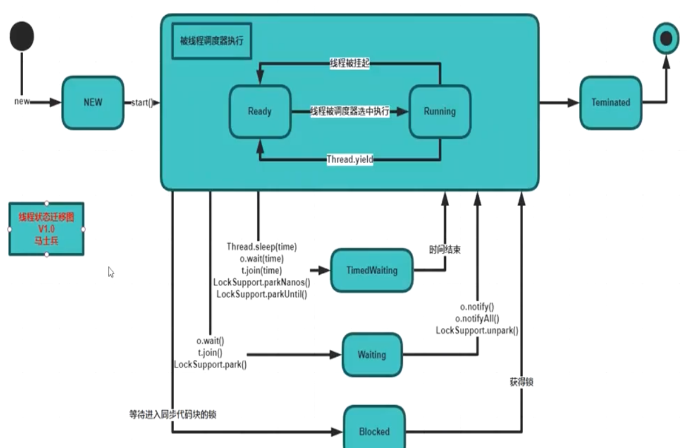


* 新建 NEW

* 就绪/运行 RUNNABLE   排队等待操作系统分配 CPU时间片

  * Thread.start()  NEW-> RUNNABLE
  * 就绪不代表立即运行,还需要和其他线程竞争CPU

* 阻塞 BLOCKED  等待锁

  * synchronized

* 等待 WAITING   等待另一个线程执行特定的动作

  * wait() => notify()

* 计时等待 TIMED_WAITING，和WAITING类似，只是多了超时时间

  * wait(long timeout) / Thread.join(long timeout) 设置了超时时间时，才会进入此状态

* 终止 TERMINATED，线程死亡	**死亡线程将无法再次start**


## 线程的方法


线程可以获得多个锁


### 创建线程3种方式


* 继承Java.lang.Thread类，重写run()        **Thread本身继承了Runnable**
  * 优势：编写简单
  * 劣势：单继承,无法继承其它父类


* 实现 Java.lang.Runnable 接口，实现 run()
  * 优势：可继承其它类
  * 劣势：较复杂，如需访问当前线程，需Thread.currentThread()


* 实现Callable接口  (有返回值,可以抛出异常)
  * 一般和ExecutorService配合

```java
//1.实现Callable接口,定义返回值类型
public class TestCallable implements Callable<String> {

  //2.重写call()方法,需要抛出异常
    @Override
    public String call() {  return Thread.currentThread().getName(); }

    public static void main(String[] args) throws ExecutionException, InterruptedException  {
        //3.创建执行服务
        ExecutorService service = Executors.newFixedThreadPool(3);
        //4.提交执行
        Future<String> result = service.submit(new TestCallable());
        //5.获取返回值
        String str = result.get();
        //6.关闭服务	需要抛出2个异常
        service.shutdown();}}
```


- Object的wait()+notify()唤醒线程
  - wait()/notify (只能在**同步块或同步方法里**成对出现,**顺序不能反**)
- Condition的await()+signal()唤醒线程
  - await()+signal()成对出现,**顺序不能反**
- LockSupport类可以阻塞当前线程以及唤醒指定被阻塞的线程


* setPriority()	更改优先级	优先级范围1-10

​	优先级低的也有可能被先调用,全看cpu心情,这将导致性能倒置 :优先级高的一直在等待


```shell
getState()	获取线程状态
isAlive	是否存活

yield()	#暂停但不阻塞线程,转入就绪状态,cpu有可能再次调度到礼让线程	礼让不一定成功
join()	#合并线程,让另一个线程在自己的时间片下运行,等合并线程运行完后才执行自己的后续方法	容易造成线程阻塞


interrupt()	中断线程(不推荐)
```


* sleep()	**Thread类的静态方法**
  * ==计时结束自动苏醒,不涉及线程间通信==,监控状态依然保持,==不释放锁==
  * 可以在任何地方使用,异常抛出InterruptedException
  * **超时/interrupt()唤醒**
* wait   Object的方法,==释放对象锁==
  * 必须在同步控制方法和同步代码块中使用
  * ==notify()/计时结束 苏醒==


* start()    此时线程处于就绪状态，并没有运行，得到 cpu 时间片**再执行 run()方法** .run()方法只是类的一个普通方法而已，**如果直接调用 run 方法，程序中依然只有主线程**，还是要顺序执行
* Thread.state / thread.getState()	获取线程状态
* **线程同时启动**    for 循环，调用 wait()方法，让所有线程等待,再调用 notifyAll(), 同时启动所有线程


**不推荐调用jdk的stop,destroy方法停止线程**,可以在源码看到这些方法加上了@Deprecated注解,表示方法过时

应该用boolean标志,boolean=false停止线程 **,让线程自己停下来,而不是被动停止**


## 锁


**对象锁分为三种：共享资源、this、当前类的字节码文件对象**


### 分类


#### 悲观/乐观


* 悲观
  * 认为别人会修改，每次拿数据的时都上锁，别的线程block
  * 传统的关系型数据库里边就用到了很多这种锁机制，比如行锁，表锁等，读锁，写锁等，都是在做操作之前先上锁


* 乐观
  * 认为别人不修改，不上锁，但在更新时判断在此期间别人有没有去更新数据(版本号),在更新数据时提高版本号.提交时的版本低于目前版本,将回滚
  * 适用于并发量不大的场景,省去了锁的开销，加大了系统的整个吞吐量
  * 如果并发量大,上层应用不断进行retry，降低性能


#### 同步锁


每个对象都有一个内置锁,一个对象只有一个锁

当程序运行到非静态的 synchronized 同步方法上时，自动获得与正在执行代码类的当前实例（this 实例）有关的锁

获得一个对象的锁也称为获取锁、 锁定对象、在对象上锁定或在对象上同步

一个线程获得该锁，就没有其他线程可以获得锁，直到第一个线程释放/返回锁


#### 公平/非公平


公平锁：当线程发现已经有线程在排对获取锁了，那么它必须排队，**除非线程已占有锁，此次重入**

非公平锁：只有一种情况需排队： 如果当前全局处于读锁状态，且等待队列中第一个等待线程想获取写锁，那么当前线程能够获取到读锁的条件为：当前线程获取了写锁，还未释放；当前线程获取了读锁，这一次只是重入读锁而已；其它情况当前线程入队尾


#### 可重入


线程外层函数获得锁后,再进入该线程的内层方法会自动获取锁 **(锁对象是同一个)**

**可以在一定程度上避免死锁**

ReentrantLock,synchronized


#### 隐式/显示


区分点在于有没有显示声明锁

隐式:synchronized

显示:lock


#### 自旋


**SMP架构中的一种low-level的同步机制**

当线程A想要获取一把自旋锁,而该锁又被其它线程锁持有时，线程A会在一个循环中自旋以检测锁是否可用


- **由于自旋时不释放CPU，因而持有自旋锁的线程应该尽快释放自旋锁，否则等待该自旋锁的线程会一直自旋，浪费CPU时间**
- **持有自旋锁的线程在sleep前应释放自旋锁**


### 死锁


多个线程各自占有一部分共享资源,并互相等待

常发生于**一个同步块同时拥有2个以上对象的锁**


**4个必要条件**

* 互斥	一个资源同时被多个进程使用

* 请求与保持	一个进程请求资源而阻塞,对已有的资源保持不释放

* 不剥夺	进程已获得的资源在未使用完之前,不会被抢夺

* 循环等待	若干个进程之间形成循环等待资源

只要打破一个条件就能避免死锁


- **避免一个线程同时获取多个锁**
- **避免一个线程在锁内同时占用多个资源，尽量保证每个锁只占用一个资源。**
- **使用定时锁**
- **对于数据库锁，加锁和解锁必须在一个数据库连接里，否则会出现解锁失败的情况**

* 无锁函数（cas）或 重入锁（ReentrantLock）

　

### 活锁


体现了一种谦让的美德，每个线程都想把资源让给对方

但可能会产生一直将资源让来让去，导致资源在两个线程间跳动而无法使某一线程真正的到资源并执行


### 饥饿


线程一直获取不到资源，一直无法执行。

优先级太低 或 某一线程一直占着某种资源不放


解决方法：

　　与死锁相比，饥饿现象还是有可能在一段时间之后恢复执行的。**设置优先级尽量避免饥饿**


**尽量不要嵌套同步**

synchronized (对象) { 

​	synchronized (对象) { }

}


### 锁消除 eliminate


StringBuffer是线程安全的,在拼接字符串时进行了synchronized

但在同时执行大量append()时,会导致重复申请/释放锁,浪费性能

```
sb.append().append()
```

当JVM发现线程私有的变量,会自动消除对象内部的锁,因为私有变量不存在被其他线程引用的可能


### 锁粗化 coarsening


```
while(i<100){
sb.append();
}
```


JVM检测到代码块对同一个对象连续加锁,会将加锁范围粗化到代码块外,使得只需要一次加锁


## 多线程带来的问题


#### 线程安全


非原子性地操作共享资源


==线程安全主要体现在以下3个方面==

* 原子性：互斥访问，同时只能有一个线程进行操作
* 可见性：线程对主内存的修改可以及时被其他线程观察到
* 有序性：上下两个互不关联的语句不会被指令重排序
  * 指令重排序是指处理器为了性能优化，在无关联的代码的执行是可能会和代码顺序不一致
  * 如果编译器推迟执行一个操作，其他线程可能在这个操作执行完之前都不会看到该操作的结果


解决思路：

　　　　**尽量不使用共享变量，将不必要的共享变量变成局部变量**

　　　　**synchronized/Lock**

　　　　**ThreadLocal为每一个线程建立一个变量的副本，各个线程间独立操作，互不影响**


#### 性能问题


线程的生命周期开销是非常大的，**线程的创建到销毁会占用大量的内存**。

如果不合理的创建了多个线程，cup的处理器数量小于了线程数量，将会有很多的线程被闲置，闲置的线程将会占用大量的内存，为垃圾回收带来很大压力，同时cpu在分配线程时还会消耗其性能


解决思路：

　　**线程池**


#### 并发控制


对同一份资源操作时,存在资源抢夺问题,需要并发控制


#### 数据不一致


每个线程在自己的工作内存交互,内存控制不当会造成数据不一致


#### 阻塞


解决方法：

　　**减少锁持有时间，读写锁分离，减小锁的粒度，锁分离，锁粗化**

> 临界区：
>
> 　　临界区是用来表示一种公共的资源（共享数据），它可以被多个线程使用，但是在每次只能有一个线程能够使用它，当临界区资源正在被一个线程使用时，其他的线程就只能等待当前线程执行完之后才能使用该临界区资源。
>


### 线程通信


wait + notify 解决线程通信

这两个都是Object的方法,只能在同步方法或同步代码块中**成对使用**,否则抛出IIIegalMonitorStateException


#### 管程法

生产者把产品放入**缓冲区**,消费者从缓冲区拿

每次操作时判断缓冲区的容量,满了则生产者不生产,空了消费者不消费


#### 信号灯法

判断**标志位**,如果为真,等待,如果为假,唤醒

每次进行操作时判断标志位,决定wait或者是执行


## volatile


synchronized强同步

==volatile针对变量弱同步，不保证线程安全==		static不是可见的

==volatile修饰引用变量时,引用不变不会刷新至主内存==,所以volatile一般用于修饰值对象


依赖于cpu的缓存一致性协议


volatile 内存语义

* 写入时，JMM 把工作内存中的**变量值立即刷新到主内存,并通知其他线程**
  * 其他线程的读写,放弃工作内存中的副本，重新去主内存获取
* 产生==内存屏障==，防止指令重排把后面的指令排到内存屏障前/后,指令顺序执行
* volatile 变量不会被缓存在寄存器 或 处理器不可见的地方，因此在读 volatile 变量时总会返回最新的值


### 内存屏障


JSR内存屏障协议:	Load/Storage 读/写屏障

- LoadLoad	上下两个L指令不能重排,下面同理
- StoreStore
- LoadStore
- StoreLoad

　　内存屏障防止Volatile修饰的关键字指令不会重排序

底层是loadfence/storefence原语指令


实现机制

把 volatile变量和非volatile变量都生成汇编代码，会发现 volatile 变量多出一个 lock 前缀指令


### 缓存行


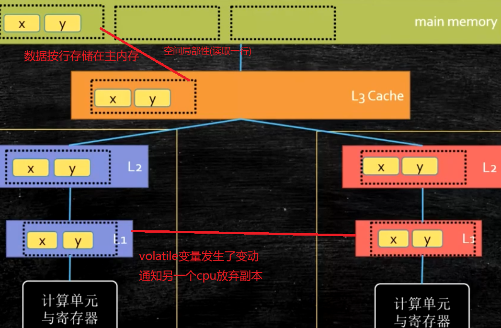


==缓存行默认64字节==

缓存行越大,空间局部性效率越高,读取越慢


CPU为每个缓存行记录状态

* Modified	被修改
* Exclusive	独占

* Shared	共享

* Invalid	失效


### volatile VS synchronized


| volatile                    | synchronized               |
| --------------------------- | -------------------------- |
| 线程同步的轻量级实现,性能高 |                            |
| **只能用于变量**            | **可以修饰方法以及代码块** |
| ==变量在多线程间的可见性==  | 访问资源的同步性           |
| 不保证原子性                | 可见+原子性                |


### 线程不安全案例

```java
public static volatile int c = 0;
    
    public static void main(String[] args) throws InterruptedException {
        for (int i = 0; i < 100000; i++) {
            new Thread(() -> {
                c++;	//非原子性操作
                System.out.println(c);
            }
            ).start();
        }
        Thread.sleep(5000);
    }

volatile变量具有原子性- > c具有原子性，但c++不具有 -> c = c + 1，已经存在了多步操作。所以c具有原子性，但是c++不具有原子性
```


## synchronized


**悲观+不公平+可重入	无锁/自旋/互斥信号量**	既保证了原子性,也保证可见性

让没有得到锁资源的线程进入BLOCKED状态，争夺到锁后恢复为RUNNABLE状态，==退出或异常时自动释放锁==


不能用于锁定String常量	类库可能也需要使用String,锁定后可能会重入(与类库同一线程),也可能死锁

不能用于锁定Integer	Integer进行了特殊处理,值发生变化时会是新的对象

不能用于锁定Long	同理


==由于锁定的对象不可变,需要进行final修饰==

```java
final Object o = new Object();
synchronized (o){}
```


synchronized的重入:

```java
synchronized m1(){}

synchronized m2(){
  m1();//此时不可重入的话将导致死锁
}
```


用于**对象/方法(实例+静态方法)**,==不能同步变量==

- **对于普通同步方法，锁是当前实例对象**
- **对于静态同步方法，锁是当前类的Class对象**
- **对于同步代码块，锁是synchronized括号里配置的对象**


### 原理


编译为字节码后,可以看到有**monitorenter + monitorexit 指令**

monitorenter指令:同步开始,线程尝试获取锁(monitor)。当计数器为0则成功获取，获取后将锁计数器设为1

monitorexit指令:同步结束,将锁计数器设为0，表明锁被释放

==monitor对象存在于每个Java对象的对象头中== -> synchronized的锁存在**Java对象头**,这也是Java中任意对象都可以作为锁的原因


尽管JAVA 1.6为synchronized做了优化,如**偏向锁、轻量级锁、自旋锁、适应性自旋锁、锁消除、锁粗化**等技术来减少锁操作的开销,但在最终转变为重量级锁之后，性能仍比较低,面对这种情况可以使用“**原子操作类**”


### 同步代码块/方法


synchronized控制对象的访问,每个对象对应一把锁,必须获得该方法的对象的锁才能执行方法,否则线程阻塞

方法执行完毕,才会释放锁,让下一个线程拿到锁


* 同步代码块	synchronized (对象) { }
  * ==对象上==加锁

* 同步方法：
  * 在==方法上==加synchronized,锁的范围大，性能差
  * ==锁定this(当前类),不需要指明对象==

**在静态方法中，默认锁定类对象**


### 4种状态


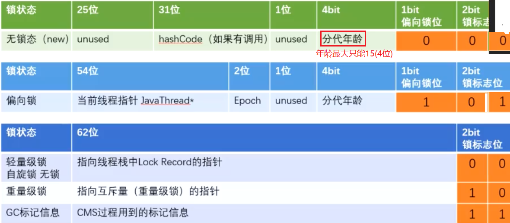


**锁四种状态，依次是：无锁(刚new出对象) -> 偏向锁 -> 轻量级锁(也叫无锁/自旋锁)、重量级锁**，随着竞争的激烈而逐渐升级


* 偏向锁(修改偏向锁位)	第一次申请锁,无竞争
  * **偏向于第一个获得它的线程**，如果在接下来的执行过程中，该锁没有被其他线程获取，则永远不需要进行同步
  * **一旦有另外一个线程去尝试获取这个锁时，偏向模式结束**

* 轻量级锁(修改指针)	已分配偏向锁,发生竞争
  * 撤销偏向锁
  * 尝试**CAS自旋**地将 对象头中的64位指针 指向自己线程栈中的LockRecord,操作成功的线程获得锁

* 自适应自旋锁(Adapative Self Spinning) 1.6+
  * 自旋过于消耗cpu,会在自旋超过10次/自旋线程超过cpu核数一半 时升级为重量级锁
  * Jvm控制,无法修改


==在未升级为重量级之前,申请锁都是只运行在用户态的操作==,但不一定效率高,因为自旋锁大量消耗cpu资源,可能会比重量级锁更慢


* 重量级锁	
  * 在**内核态**中,锁为mutex互斥资源(重量级锁),用户态在申请锁时可能出现锁被分配完的情况
  * 升级至重量级锁将进入操作系统的等待队列,等待操作系统主动调用,不需要像自旋那样占用cpu时间
  * 适合操作时间长的方法,避免其他线程自旋过久


==锁可以认为不可降级==，锁的升级策略提高获得锁和释放锁的效率

锁只在GC时才会降级,然而此时已经没有对象指向它了,降级也没有任何意义


## Lock 1.5+


**乐观锁**，认为并发不严重，让线程不断去重试更新

**需要显式指定起始位置lock()和终止位置unlock()**,在finally中unlock()以防死锁

==synchronized自动释放锁，Lock必须手动在finally块释放==


能完成synchronized的所有功能,更具扩展性,有更精确的线程语义和更好的性能,可以公平锁


```java
lock()	以阻塞方式来获取锁，如果获取到了锁，立即返回；如果别的线程持有锁，则当前线程等待，直到获取锁后返回

tryLock()以非阻塞的方式获取锁。尝试性的去获取，获取到了立即返回true

tryLock(longtimeout,TimeUnit unit)。如果获取到了锁，立即返回true，否则会等待参数给定的时间单元，在等待的过程中，如果获取到了锁，就立即返回true。如果等待超时，返回false。

lockInterruptibly（）	如果获取到了锁，立即返回；如果没有获取到锁，当前线程处于休眠状态，或者被别的线程中断（会受到InterruptedException异常）。与lock()方法的区别在于lock优先考虑获取锁，如果没有获取到锁，会一直处于阻塞状态，忽略interrupt（）方法，待获取锁成功后，才响应中断。lockInterruptibly 优先考虑响应中断，而不是响应锁的普通获取或重入获取

Unlock()释放锁
```


==有多少个lock,就有多少个unlock,成对出现,否则会使其他线程处于等待状态==


### AQS


AbstractQueuedSynchronizer 抽象队列式同步器,**没有锁的概念**

除synchronized之外的锁,都基于AQS


如果被请求资源空闲，则将当前线程设置为有效，并锁定共享资源

如果被请求资源被占用，线程阻塞,加入CLH队列,等待合适时机唤醒


CLH是虚拟的FIFO(先进先出)双向队列

**AQS将请求共享资源的线程封装成Node，实现锁的分配**，用volatile修饰共享变量state，线程通过CAS去改变state，成功则获取锁成功，失败则进入等待队列，等待被唤醒

**注意：AQS是自旋锁：**在等待唤醒的时候，使用自旋（while(!cas())）的方式，不停地尝试获取锁，直到被其他线程获取成功

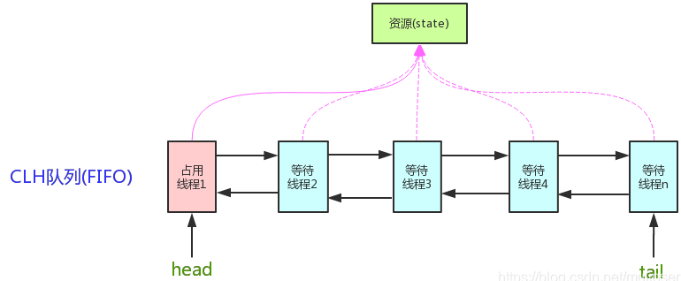


state是共享资源，其访问方式有如下三种：
getState();setState();compareAndSetState();


```java
//继承自AbstractOwnableSynchronizer
public abstract class AbstractQueuedSynchronizer extends AbstractOwnableSynchronizer implements java.io.Serializable {

  /** AQS类内部维护FIFO的双向队列，负责同步状态的管理
    当前线程获取同步状态失败时，同步器会将当前线程以及等待状态等构造成一个节点Node并加入同步队列；
    当同步状态释放时，会把首节点中线程唤醒，使其再次尝试同步状态 */
  private transient volatile Node head;
  private transient volatile Node tail;

  //锁占用状态；在ReentrantLock中，0空闲,1被占用，>1可重入占用
  private volatile int state;
}

public abstract class AbstractOwnableSynchronizer  implements java.io.Serializable {

  //只有一个变量：exclusiveOwnerThread，表示当前占用该锁的线程，并且提供了相应的get，set
  private transient Thread exclusiveOwnerThread;

  protected final void setExclusiveOwnerThread(Thread thread) {  exclusiveOwnerThread = thread;}

  protected final Thread getExclusiveOwnerThread() { return exclusiveOwnerThread;}
}
```


```java
//AbstractQueuedSynchronizer内部类Node
static final class Node {
  //两种资源共享方式
  //Share共享模式，可以被多个线程获取，比如读写锁中的读锁,Semaphore、CountDownLatch、ReadWriteLock，CyclicBarrier
  static final Node SHARED = new Node();
  
  //null Exclusive独占模式，比如读写锁中的写锁,ReentrantLock
  //1 取消获取锁(等待超时/被中断),需要从同步队列中移除
  //-1 当前节点释放了同步状态或被取消，需要解锁后继节点
  //-2 节点在等待队列中，当其他线程对Condition调用了signal()，该节点从等待队列 -> 条件队列
  //-3 下一次共享式同步状态获取将会被无条件地传播下去
  static final Node EXCLUSIVE = null;
  static final int CANCELLED =  1;
  static final int SIGNAL    = -1;
  static final int CONDITION = -2;
  static final int PROPAGATE = -3;

  //当前节点的信号量(1,0,-1,-2,-3)5种状态,使用CAS更改状态，volatile保证可见性
  volatile int waitStatus;

  volatile Node prev;
  volatile Node next;
  volatile Thread thread;
}
```


Node阻塞队列的体现：等待队列，条件队列

两种队列都是基于Node节点构建的，每个节点的Node都会有信号量，也就是属性waitSate


等待队列双向链表结构，每个节点记录的有前驱节点和后驱节点

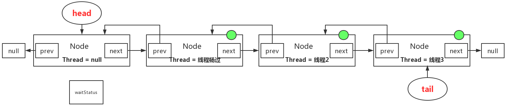


线程被阻塞之后会被放在等待队列里，head的属性thread是null，不放任何线程信息，仅为标记位


==条件队列是单向链表	只能存储独占==	Condition


不同资源共享方式的同步器,争用共享资源的方式也不同


AQS的设计基于==模板方法==模式

围绕state提供两种基本操作get/set + 双向队列存放阻塞线程 + 一系列判断和处理方法

独占模式的acquire()和release()

共享模式的acquireShared()和releaseShared()

还定义了抽象方法tryAcquire()、tryAcquiredShared()、tryRelease()和tryReleaseShared()**由子类实现**，分别对应独占/共享模式下的锁的尝试获取，实现公平性和非公平性，在尝试获取中，如果新来的线程必须先入队才能获取,就是公平锁，否则非公平


如果需要自定义同步器：

1. 使用者继承AbstractQueuedSynchronizer并重写指定的方法。（这些重写方法很简单，无非是对于共享资源state的获取和释放）
2. 将AQS组合在自定义同步组件的实现中，并调用其模板方法，而这些模板方法会调用使用者重写的方法

只需要实现state的获取和释放方式即可，至于具体线程等待队列的维护，AQS已经在顶层实现好了

| tryAcquire(int)       | 独占方式获取资源,需要CAS | 成功true，失败false                                       |
| --------------------- | ------------------------ | --------------------------------------------------------- |
| tryRelease(int)       | 独占方式释放资源,需要CAS |                                                           |
|                       |                          |                                                           |
| tryAcquireShared(int) | 共享方式获取资源,需要CAS | 负数失败；0成功，但没有剩余可用资源；正数成功，有剩余资源 |
| tryReleaseShared(int) | 共享方式释放资源,需要CAS | 释放后允许唤醒后续等待结点返回true，否则false             |


ReentrantLock为例：

state初始化0，表示未锁定

A线程lock()时，会调用tryAcquire()独占锁并将state+1

之后其他线程tryAcquire时就失败，直到A线程unlock（）->state=0，其他线程才有机会获取该锁

**A释放锁之前，自己也是可以重复获取此锁（state累加），这就是可重入的概念**

注意：**获取多少次锁就要释放多少次锁，保证state能回到0**


以CountDownLatch为例，任务分N个子线程去执行，state就初始化 为N，N个线程并行执行，每个线程执行完之后countDown（）一次，state就会CAS减一。当N子线程全部执行完毕，state=0，会unpark()主调用线程，主调用线程就会从await()函数返回，继续之后的动作


一般来说，自定义同步器要么是独占方法，要么是共享方式，他们也只需实现tryAcquire-tryRelease、tryAcquireShared-tryReleaseShared中的一种

但AQS也支持自定义同步器同时**实现独占和共享两种方式，如ReentrantReadWriteLock**


在acquire() acquireShared()两种方式下，线程在等待队列中都是忽略中断的，**acquireInterruptibly()/acquireSharedInterruptibly()是支持响应中断**的


**AQS的简单应用**
Mutex：不可重入互斥锁，锁资源（state）只有两种状态：0：未被锁定；1：锁定


### ReentrantLock


重入独占锁,当前持有该锁的线程能够多次获取锁，无需等待

自旋锁，通过循环调用CAS操作来实现加锁

通过避免线程进入内核态的阻塞状态来提高性能


* 可中断
  * lockInterruptibly()抢锁的时候可以被中断，中断直接抛出异常，退出抢锁,避免死锁
  * Synchronized只有抢锁的过程，不可干预

- 快速反馈
  - trylock（）不等待或者限定时间等待获取锁，更灵活。避免死锁
- 读写锁
  - ReentrantReadWriteLock类实现了读写锁的功能，类似于Mysql，锁自身维护一个计数器，读锁可以并发的获取，写锁只能独占。
  - synchronized全是独占锁
- Condition
  - Condition是比Sync更精准的线程调度工具，一个lock可以有多个Condition，比如在生产消费的业务下，一个锁通过控制生产Condition和消费Condition精准控制


```java
public ReentrantLock() {
  //默认非公平锁，可以避免大量的线程切换，提高性能
  sync = new NonfairSync();
}

//构造时传入boolean来决定是不是公平/非公平锁
public ReentrantLock(boolean fair) {
  sync = fair ? new FairSync() : new NonfairSync();
}
```


获得独占非公平锁

```java
protected final boolean tryAcquire(int acquires) {
  return nonfairTryAcquire(acquires);
}


final boolean nonfairTryAcquire(int acquires) {
  final Thread current = Thread.currentThread();
  //0表示没有线程占用锁,可以拿锁
  int c = getState();
  if (c == 0) {
    if (compareAndSetState(0, acquires)) {
      setExclusiveOwnerThread(current);
      return true;
    }
  }
  else if (current == getExclusiveOwnerThread()) {
    int nextc = c + acquires;
    if (nextc < 0) // overflow
      throw new Error("Maximum lock count exceeded");
    setState(nextc);
    return true;
  }
  return false;
}
```


```java
//ReentrantLock
static final class FairSync extends Sync {
  //加锁
  final void lock() {  acquire(1);  }

  //获得独占公平锁
  protected final boolean tryAcquire(int acquires) {
    final Thread current = Thread.currentThread();
    //0表示没有线程占用锁,可以拿锁
    int c = getState();
    if (c == 0) {
      //队列里面没有线程在等待,才能抢锁(公平的体现)			cas算法原子操作改变state值，state值又被volitale修饰，保证并发下修改state的安全性
      if (!hasQueuedPredecessors() && compareAndSetState(0, acquires)) {
        setExclusiveOwnerThread(current);
        return true;
      }
    }
    else if (current == getExclusiveOwnerThread()) {
      int nextc = c + acquires;
      if (nextc < 0)   throw new Error("Maximum lock count exceeded");
      setState(nextc);
      return true;
    }
    return false;
  }
}


//AbstractQueuedSynchronizer
//加锁
public final void acquire(int arg) {
  //加锁失败
  if (!tryAcquire(arg) &&
      //addWaiter()独占方式加入CLH等待队列
      acquireQueued(addWaiter(Node.EXCLUSIVE), arg))
    selfInterrupt();
}

private Node addWaiter(Node mode) {
  //将当前线程封装为Node
  Node node = new Node(Thread.currentThread(), mode);

  //将当前节点插入队尾(CAS)
  Node pred = tail;
  if (pred != null) {
    node.prev = pred;
    //CAS
    if (compareAndSetTail(pred, node)) {
      pred.next = node;
      return node;
    }
  }
  //tail不为null 或 CAS失败,enq()
  enq(node);
  return node;
}


private Node enq(final Node node) {
  //死循环,不断尝试CAS
  for (;;) {
    Node t = tail;
    //队列为空
    if (t == null) {
      //初始化，创建空的head,指向tail
      if (compareAndSetHead(new Node()))   tail = head;

    } else {
      node.prev = t;
      //当前节点set为tail
      if (compareAndSetTail(t, node)) {
        t.next = node;
        return t;
      }
    }
  }
}
```


AQS里面的线程唤醒不会唤醒所有的等待线程，只唤醒head的next（head不放线程），实现顺序唤醒

而object的notify方法和notifyall方法会唤醒所有线程,无序

```java
public final void acquire(int arg) {
  if (!tryAcquire(arg) &&
      //acquireQueued()唤醒线程
      acquireQueued(addWaiter(Node.EXCLUSIVE), arg))
    selfInterrupt();
}

final boolean acquireQueued(final Node node, int arg) {
  boolean failed = true;
  try {
    boolean interrupted = false;
    for (;;) {
      //当前结点的前驱结点
      final Node p = node.predecessor();
      //当前驱结点是head，才tryAcquire()尝试获取锁，成功后顶替head		保证等待时间最长的节点head.next能最先获得锁(公平)
      if (p == head && tryAcquire(arg)) {
        //获取同步状态成功，将当前结点设置为头结点
        setHead(node);
        p.next = null; // help GC
        failed = false;
        return interrupted;
      }
      /**如果前驱节点不是Head，通过shouldParkAfterFailedAcquire判断是否应该阻塞
         通过park(this)阻塞当前线程,避免无意义的自旋，
          前驱节点信号量为-1，当前线程可以安全被阻塞
             */
      if (shouldParkAfterFailedAcquire(p, node) && parkAndCheckInterrupt())
        interrupted = true;
    }
  } finally {
    if (failed)
      cancelAcquire(node);
  }
}
```


#### Lock


```java
//公平
final void lock() {
  acquire(1);
}

public final void acquire(int arg) {
  if (!tryAcquire(arg) && acquireQueued(addWaiter(Node.EXCLUSIVE), arg))
    selfInterrupt();
}

protected final boolean tryAcquire(int acquires) {
  ...
    if (c == 0) {
      //队列里面没有线程在等待,才能抢锁(公平的体现)
      if (!hasQueuedPredecessors() &&  compareAndSetState(0, acquires)) {
        setExclusiveOwnerThread(current);
        return true;
      }

//非公平	当锁对象是同一个时,线程外层函数获得锁后,再进入该线程的内层方法会自动获取锁
      //非公平是针对队列中线程和新线程而言的,队列中的线程处于 
  final void lock() {
    //直接尝试获取锁，无视同步队列
    if (compareAndSetState(0, 1))   setExclusiveOwnerThread(Thread.currentThread());
    //直接获取失败时,才考虑同步队列
    else	 acquire(1);
  }

      final boolean nonfairTryAcquire(int acquires) {
        final Thread current = Thread.currentThread();
        int c = getState();
        if (c == 0) {
          //没有hasQueuedPredecessors(),不需要判断当前线程是否为head.next，也不需要判断当前线程是否在同步队列中              
          if (compareAndSetState(0, acquires)) {
            setExclusiveOwnerThread(current);
            return true;
          }
        }
        //可重入的体现,
        else if (current == getExclusiveOwnerThread()) {
          //重入是将state++
          int nextc = c + acquires;
          if (nextc < 0)  throw new Error("Maximum lock count exceeded");
          setState(nextc);
          return true;
        }
        return false;
      }
```


#### unlock


```java
public void unlock() {
  sync.release(1);
}

public final boolean release(int arg) {
  if (tryRelease(arg)) {
    Node h = head;
    if (h != null && h.waitStatus != 0)
      unparkSuccessor(h);
    return true;
  }
  return false;
}

protected final boolean tryRelease(int releases) {
  int c = getState() - releases;//1-1=0
  if (Thread.currentThread() != getExclusiveOwnerThread())    throw new IllegalMonitorStateException();
  boolean free = false;
  if (c == 0) {
    free = true;
    setExclusiveOwnerThread(null);//当前线程设置为null
  }
  setState(c);//当前状态设置为0
  return free;
}

private void unparkSuccessor(Node node) {

  int ws = node.waitStatus;
  if (ws < 0)     compareAndSetWaitStatus(node, ws, 0);

  Node s = node.next;
  if (s == null || s.waitStatus > 0) {
    s = null;
    for (Node t = tail; t != null && t != node; t = t.prev)
      if (t.waitStatus <= 0)   s = t;
  }
  if (s != null)  LockSupport.unpark(s.thread);
}
```


#### lockInterruptibly


如果获取了锁定立即返回，如果没有获取锁定，当前线程处于休眠状态，直到或者锁定，或者当前线程被别的线程中断


### ReentrantReadWriteLock


**读读共享、写写互斥、读写互斥**


适用场景:写多读少

缺点:在写少读多时,将阻塞过多的读操作


读锁	tryAcquireShared(int arg) tryReleaseShared(int arg)

写锁为独占锁	tryAcquire(int arg) tryRelease(int arg)


**线程进入读锁的前提条件**：

- **没有其他线程的写锁**
- **没有写请求或者有写请求，但调用线程和持有锁的线程是同一个**

**线程进入写锁的前提条件**：

- **没有其他线程的读锁**
- **没有其他线程的写锁**
- 如果一个线程占有写锁，在不释放写锁的情况下，它还能占有读锁，即写锁降级为读锁
- 对同时占有读锁和写锁的线程，如果完全释放了写锁，那么它就完全转换成了读锁，以后的写操作无法重入，在写锁未完全释放时写可以重入
- 公平模式下无论读/写锁的申请都必须按照AQS等待队列先进先出的顺序。非公平模式下读操作插队的条件是锁等待队列head节点后的下一个节点是SHARED型节点，写锁则无条件插队
- 读锁不允许newConditon获取Condition接口，而写锁的newCondition接口实现方法同ReentrantLock


#### Sync


ReentrantReadWriteLnock内部类Sync


AQS中只提供了int state表示锁的状态

**高16位表示读锁，低16位表示写锁**,读/写的state最大值均为65535，即所有获得了锁的线程的拿到锁的总次数(由于是重入锁，每个线程可以拿到n个锁)

由于读写锁主要的应用场景为多读少写，可以重写state的前24位为读锁，后8位为写锁

sharedCount!=0 表示分配了读锁，exclusiveCount != 0 表示分配了写锁

sharedCount和exclusiveCount 一般不会同时不为 0，==只有当线程占用了写锁，才可以重入获取读锁，反之不成立==


```java
abstract static class Sync extends AbstractQueuedSynchronizer {
  
       static final int SHARED_SHIFT   = 16;
       // 由于读锁用高位部分，所以读锁个数+1 = 状态值+ 2^16
       static final int SHARED_UNIT    = (1 << SHARED_SHIFT);
       // 写锁的可重入的最大次数、读锁允许的最大数量
       static final int MAX_COUNT      = (1 << SHARED_SHIFT) - 1;
       // 写锁掩码，用于状态的低16位有效值
       static final int EXCLUSIVE_MASK = (1 << SHARED_SHIFT) - 1;
       // 读锁计数，当前持有读锁的线程数
      static int sharedCount(int c)    { return c >>> SHARED_SHIFT; }
      // 写锁计数(重入次数)
      static int exclusiveCount(int c) { return c & EXCLUSIVE_MASK; }
  
  		//每个线程特定的 read 持有计数。存放在ThreadLocal，不需要线程安全
			static final class HoldCounter {
            int count = 0;
        		// 使用id而不是引用,避免保留垃圾。注意这是个常量
            final long tid = getThreadId(Thread.currentThread());
        }

        //采用继承来重写 initialValue()	这样就不用进行这样的处理：如果ThreadLocal没有当前线程的计数，则new一个，再放进ThreadLocal里。
        static final class ThreadLocalHoldCounter extends ThreadLocal<HoldCounter> {
            public HoldCounter initialValue() {
                return new HoldCounter();
            }
        }
  
  			//保存当前线程重入读锁的次数的容器。在读锁重入次数为 0 时移除
  			private transient ThreadLocalHoldCounter readHolds;

        //最近一个成功获取读锁的线程的计数。通常情况下，下一个释放线程是最后一个获取线程,节约查找时间
        private transient HoldCounter cachedHoldCounter;
  
		//firstReader是最后一个把 共享计数 从 0 -> 1 并且还未释放锁 的线程,如果不存在则为null
     * firstReader 不能导致gc失败保留垃圾，因此在 tryReleaseShared 里设置为null
     * firstReader及其计数firstReaderHoldCount是不会放入 readHolds 的
     */
    private transient Thread firstReader = null;
  
  	//firstReader 的重入计数
    private transient int firstReaderHoldCount;
  
    Sync() {
        readHolds = new ThreadLocalHoldCounter();
        setState(getState()); // 利用 volatile 确保 readHolds 的内存可见性
    }
```


Sync中有两个方法是抽象的，子类必须实现

```java
//公平模式
static final class FairSync extends Sync {
  //writerShouldBlock和readerShouldBlock方法都表示当有别的线程也在尝试获取锁时，是否应该阻塞
  final boolean writerShouldBlock() {
    //对于公平模式，hasQueuedPredecessors()表示等待队列是否还有线程。一旦有，当前线程也该被挂起
    return hasQueuedPredecessors();
  }
  final boolean readerShouldBlock() {
    return hasQueuedPredecessors();
  }
}

//非公平模式
static final class NonfairSync extends Sync {
  // 写线程不公平,不需要阻塞,允许闯入
  final boolean writerShouldBlock() {    return false; }
  final boolean readerShouldBlock() {		return apparentlyFirstQueuedIsExclusive();  }
}

//当head.next是独占线程，为了防止独占线程(写线程)饥饿等待，则后入线程排队，否则可以闯入
//也就是说,head.next想获取写锁，则读线程阻塞
final boolean apparentlyFirstQueuedIsExclusive() {
  Node h, s;
  return (h = head) != null &&
    (s = h.next)  != null &&
    !s.isShared()         &&
    s.thread != null;
}
```


==如果当前全局处于读锁状态，且等待队列中第一个等待线程想获取写锁，那么当前线程能获取读锁的条件为==

1. 当前线程获取了写锁，还未释放
2. 当前线程获取了读锁，进行重入读锁

其它情况当前线程入队尾。这样处理提高效率，也避免想获取写锁的线程饥饿，得不到执行机会


例如：C请求写锁，由于当前AB拥有读锁，写锁获取失败，线程C入队列,阻塞并等待其他线程释放锁唤醒


此时线程D想获取读锁，上面规则，队列中第一个等待线程C请求写锁，为避免写锁迟迟获取不到，并且D不是重入获取读锁，所以D也入队


#### 获取读锁


在以下几种情况，获取读锁会失败：

（1）有线程持有写锁，且该线程不是当前线程

（2）写锁空闲 且  公平策略决定 读线程应当被阻塞，除了重入获取，其他获取读锁失败

（3）读锁数量max，抛出异常

除了以上三种情况，该线程会循环尝试获取读锁直到成功

```java
public final void acquireShared(int arg){
  if(tryAcquireShared(arg) < 0){  // 调用子类, 获取共享 lock  返回 < 0, 表示失败
    doAcquireShared(arg);       // 调用 doAcquireShared 当前 线程加入 Sync Queue 里面, 等待获取 lock
  }
}

protected final int tryAcquireShared(int unused) {
  Thread current = Thread.currentThread();
  int c = getState();
  //有线程持有写锁，且该线程不是当前线程，获取锁失败
  if (exclusiveCount(c) != 0 && getExclusiveOwnerThread() != current)    return -1;

  //获取读锁计数
  int r = sharedCount(c);
  //不应该阻塞 && 读锁数<MAX_COUNT && 设置state成功 -> 获取锁成功
  if (!readerShouldBlock() &&   r < MAX_COUNT && compareAndSetState(c, c + SHARED_UNIT)) {
    if (r == 0) {
      //下面对firstReader的处理：firstReader是不会放到readHolds里的，这样，在读锁只有一个的情况下，就避免了查找readHolds
      firstReader = current;
      firstReaderHoldCount = 1;
    } else if (firstReader == current) {
      firstReaderHoldCount++;

      ///非 firstReader 读锁重入计数更新
    } else {
      HoldCounter rh = cachedHoldCounter;
      if (rh == null || rh.tid != current.getId())
        cachedHoldCounter = rh = readHolds.get();
      else if (rh.count == 0)
        readHolds.set(rh);
      rh.count++;
    }
    return 1;
  }
  //获取读锁失败，放入循环重试
  return fullTryAcquireShared(current);
}


final int fullTryAcquireShared(Thread current) {
  HoldCounter rh = null;
  for (;;) {
    int c = getState();
    if (exclusiveCount(c) != 0) {
      if (getExclusiveOwnerThread() != current)
        return -1;     //1.有线程持有写锁，且该线程不是当前线程，获取锁失败
      //2.有线程持有写锁，且该线程是当前线程，则应该放行让其重入获取锁，否则会造成死锁。
    } else if (readerShouldBlock()) {
      //3.写锁空闲  且  公平策略决定 读线程应当被阻塞
      // 下面的处理是说，如果是已获取读锁的线程重入读锁时，
      // 即使公平策略指示应当阻塞也不会阻塞。
      // 否则，这也会导致死锁的。
      if (firstReader == current) {
        // assert firstReaderHoldCount > 0;
      } else {
        if (rh == null) {
          rh = cachedHoldCounter;
          if (rh == null || rh.tid != current.getId()) {
            rh = readHolds.get();
            if (rh.count == 0)
              readHolds.remove();
          }
        }
        //4.需要阻塞且是非重入(还未获取读锁的)，获取失败。
        if (rh.count == 0)
          return -1;
      }

    }
    //5.写锁空闲  且  公平策略决定线程可以获取读锁
    if (sharedCount(c) == MAX_COUNT)//6.读锁数量达到最多
      throw new Error("Maximum lock count exceeded");
    //7. 申请读锁成功，下面的处理跟tryAcquireShared是类似的。
    if (compareAndSetState(c, c + SHARED_UNIT)) {
      if (sharedCount(c) == 0) {
        firstReader = current;
        firstReaderHoldCount = 1;
      } else if (firstReader == current) {
        firstReaderHoldCount++;
      } else {
        if (rh == null)
          rh = cachedHoldCounter;
        if (rh == null || rh.tid != current.getId())
          rh = readHolds.get();
        else if (rh.count == 0)
          readHolds.set(rh);
        rh.count++;
        cachedHoldCounter = rh; // cache for release
      }
      return 1;
    }
```


#### 获取共享lock


```java
private void doAcquireShared(int arg){
  final Node node = addWaiter(Node.SHARED);       // 1. 将当前的线程封装成 Node 加入到 Sync Queue 里面
  boolean failed = true;

  try {
    boolean interrupted = false;
    for(;;){
      final Node p = node.predecessor();      // 2. 获取当前节点的前继节点 (当一个n在 Sync Queue 里面, 并且没有获取 lock 的 node 的前继节点不可能是 null)
      if(p == head){
        int r = tryAcquireShared(arg);      // 3. 判断前继节点是否是head节点(前继节点是head, 存在两种情况 (1) 前继节点现在占用 lock (2)前继节点是个空节点, 已经释放 lock, node 现在有机会获取 lock); 则再次调用 tryAcquireShared 尝试获取一下
        if(r >= 0){
          setHeadAndPropagate(node, r);   // 4. 获取 lock 成功, 设置新的 head, 并唤醒后继获取  readLock 的节点
          p.next = null; // help GC
          if(interrupted){               // 5. 在获取 lock 时, 被中断过, 则自己再自我中断一下(外面的函数可能需要这个参数)
            selfInterrupt();
          }
          failed = false;
          return;
        }
      }

      if(shouldParkAfterFailedAcquire(p, node) && // 6. 调用 shouldParkAfterFailedAcquire 判断是否需要中断(这里可能会一开始 返回 false, 但在此进去后直接返回 true(主要和前继节点的状态是否是 signal))
         parkAndCheckInterrupt()){           // 7. 现在lock还是被其他线程占用 那就睡一会, 返回值判断是否这次线程的唤醒是被中断唤醒
        interrupted = true;
      }
    }
  }finally {
    if(failed){             // 8. 在整个获取中出错(比如线程中断/超时)
      cancelAcquire(node);  // 9. 清除 node 节点(清除的过程是先给 node 打上 CANCELLED标志, 然后再删除)
    }
```


独占锁模式获取成功以后设置头结点然后返回中断状态，结束流程。而共享锁模式获取成功以后，调用了setHeadAndPropagate方法，从方法名就可以看出除了设置新的头结点以外还有一个传递动作，一起看下代码：


```java
//两个入参，一个是当前成功获取共享锁的节点，一个就是tryAcquireShared方法的返回值，注意上面说的，它可能大于0也可能等于0
private void setHeadAndPropagate(Node node, int propagate) {
  Node h = head; //记录当前头节点
  //设置新的头节点，即把当前获取到锁的节点设置为头节点
  //注：这里是获取到锁之后的操作，不需要并发控制
  setHead(node);
  //这里意思有两种情况是需要执行唤醒操作
  //1.propagate > 0 表示调用方指明了后继节点有可能需要被唤醒，因为此方法是获取读锁过程调用，那么后面节点很可能也要获取读锁
  //2.头节点后面的节点需要被唤醒（waitStatus<0），不论是老的头结点还是新的头结点
  if (propagate > 0 || h == null || h.waitStatus < 0) {
    Node s = node.next;
    //如果当前节点的后继节点是共享类型获取没有后继节点，则进行唤醒
    //这里可以理解为除非明确指明不需要唤醒（后继等待节点是独占类型），否则都要唤醒
    //这里的初衷是   后一个节点正好是共享节点，就唤醒，实现共享，独占有锁释放时候唤醒
    if (s == null || s.isShared())
      //后面详细说
      doReleaseShared();
  }
}

private void setHead(Node node) {
  head = node;
  node.thread = null;
  node.prev = null;
}
```


这个唤醒操作在releaseShared()方法里也会调用。唤醒后面想获取锁的节点


```java
private void doReleaseShared() {
  for (;;) {
    //唤醒操作由头结点开始，注意这里的头节点已经是上面新设置的头结点了
    //其实就是唤醒上面新获取到共享锁的节点的后继节点
    Node h = head;
    if (h != null && h != tail) {
      int ws = h.waitStatus;
      //表示后继节点需要被唤醒
      if (ws == Node.SIGNAL) {
        //这里需要控制并发，因为入口有setHeadAndPropagate跟releaseShared两个，避免两次unpark
        if (!compareAndSetWaitStatus(h, Node.SIGNAL, 0))
          continue;      
        //执行唤醒操作      
        unparkSuccessor(h);
      }
      //如果后继节点暂时不需要唤醒，则把当前节点状态设置为PROPAGATE确保以后可以传递下去
      else if (ws == 0 &&
               !compareAndSetWaitStatus(h, 0, Node.PROPAGATE))
        continue;                
    }
    //如果头结点没有发生变化，表示设置完成，退出循环
    //如果头结点发生变化，比如说其他线程获取到了锁，为了使自己的唤醒动作可以传递，必须进行重试
    if (h == head)                   
      break;
  }
```


#### 读锁的释放


```java
public final boolean releaseShared(int arg) {
  if (tryReleaseShared(arg)) {
    doReleaseShared();
    return true;
  }
  return false;
}

//释放锁tryReleaseShared由子类Sync实现
protected final boolean tryReleaseShared(int unused) {
  Thread current = Thread.currentThread();
  // 清理firstReader缓存 或 readHolds里的重入计数
  if (firstReader == current) {
    // assert firstReaderHoldCount > 0;
    if (firstReaderHoldCount == 1)
      firstReader = null;
    else
      firstReaderHoldCount--;
  } else {
    HoldCounter rh = cachedHoldCounter;
    if (rh == null || rh.tid != current.getId())
      rh = readHolds.get();
    int count = rh.count;
    if (count <= 1) {
      // 完全释放读锁
      readHolds.remove();
      if (count <= 0)
        throw unmatchedUnlockException();
    }
    --rh.count; // 主要用于重入退出
  }
  // 循环在CAS更新状态值，主要是把读锁数量减 1
  for (;;) {
    int c = getState();
    int nextc = c - SHARED_UNIT;
    if (compareAndSetState(c, nextc))
      // 释放读锁对其他读线程没有任何影响，
      // 但可以允许等待的写线程继续，如果读锁、写锁都空闲。
      return nextc == 0;
  }
}
```


#### 写锁的获取


写锁的获取和ReentrantLock独占锁的锁获取过程几乎一样，除了tryAcquire()要考虑读锁的情况

在以下情况，写锁获取失败：

（1） 写锁为0，读锁不为0   或者写锁不为0，且当前线程不是已获取独占锁的线程，锁获取失败。

（2）写锁数量已达到最大值，写锁获取失败。

（3）当前线程应该阻塞，或者设置同步状态state失败，获取锁失败


```java
public final void acquire(int arg) {
  if (!tryAcquire(arg) &&
      acquireQueued(addWaiter(Node.EXCLUSIVE), arg))
    selfInterrupt();
}


protected final boolean tryAcquire(int acquires) {
  Thread current = Thread.currentThread();
  int c = getState();
  int w = exclusiveCount(c);
  if (c != 0) {
    // 1.写锁为0，读锁不为0    或者写锁不为0，且当前线程不是已获取独占锁的线程，锁获取失败
    if (w == 0 || current != getExclusiveOwnerThread())
      return false;
    //2. 写锁数量已达到最大值，写锁获取失败
    if (w + exclusiveCount(acquires) > MAX_COUNT)
      throw new Error("Maximum lock count exceeded");
    // Reentrant acquire
    setState(c + acquires);
    return true;
  }
  //3.当前线程应该阻塞，或者设置同步状态state失败，获取锁失败。
  if (writerShouldBlock() ||
      !compareAndSetState(c, c + acquires))
    return false;
  setExclusiveOwnerThread(current);
  return true;
}
```


#### 写锁的释放


```java
public final boolean release(int arg) {
        if (tryRelease(arg)) {
            Node h = head;
            if (h != null && h.waitStatus != 0)
                unparkSuccessor(h);
            return true;
        }
        return false;
    }
 
protected final boolean tryRelease(int releases) {
            if (!isHeldExclusively())
                throw new IllegalMonitorStateException();
            int nextc = getState() - releases;
            boolean free = exclusiveCount(nextc) == 0;
            if (free)
                setExclusiveOwnerThread(null);
            setState(nextc);
            return free;
        }
```


#### 总结


获取锁的过程：

当线程调用acquireShared()申请获取锁资源时，如果成功，则进入临界区
当获取锁失败时，则创建一个共享类型的节点并进入一个FIFO等待队列，然后被挂起等待唤醒。
当队列中的等待线程被唤醒以后就重新尝试获取锁资源，如果成功则唤醒后面还在等待的共享节点并把该唤醒事件传递下去，即会依次唤醒在该节点后面的所有共享节点，然后进入临界区，否则继续挂起等待
释放锁过程：

当线程调用releaseShared()进行锁资源释放时，如果释放成功，则唤醒队列中等待的节点，如果有的话


跟独占锁相比，共享锁的主要特征在于当一个在等待队列中的共享节点成功获取到共享锁后,必须依次唤醒后面所有可以跟它一起共享当前锁资源的节点，毫无疑问，这些节点必须也是在等待共享锁（这是大前提，如果等待的是独占锁，那前面已经有一个共享节点获取锁了，它肯定是获取不到的）

当共享锁被释放的时候，可以用读写锁为例进行思考，当一个读锁被释放，此时不论是读锁还是写锁都可以竞争资源


读写锁还提供了一些新的方法，比如final int getReadHoldCount()，返回当前线程获取读锁的次数。由于读状态保存的是所有获取读锁的线程读锁次数的总和，因此每个线程自己的读锁次数需要单独保存，引入了ThreadLocal，由线程自身维护


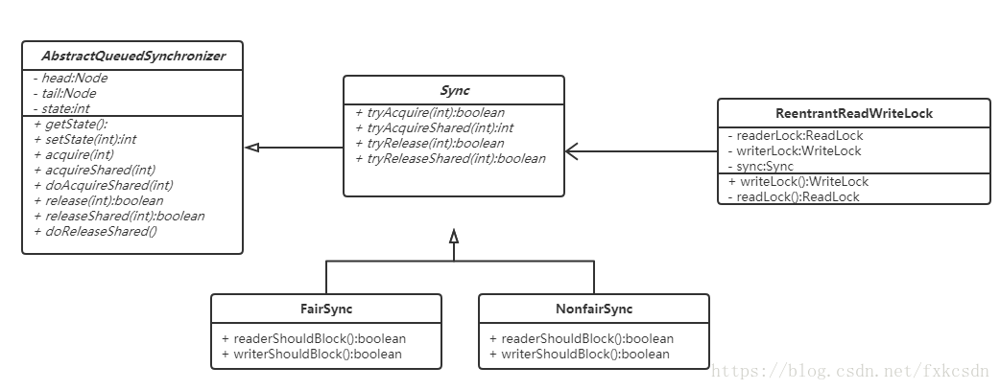


### synchronized VS lock


竞争激烈时，lock性能会比synchronize好，**竞争不激烈时，synchronize比lock性能好，synchronize会根据锁的竞争情况，从偏向锁-->轻量级锁-->重量级锁升级**


| 类别         | synchronized                                   | Lock                                              |
| :----------- | :--------------------------------------------- | :------------------------------------------------ |
|              | 关键字，在jvm层面上                            | 接口                                              |
| 锁的释放     | 执行结束/**发生异常**，jvm**自动**让线程释放锁 | 必须在finally中**手动释放**，容易死锁             |
| 等待/通知    | wait()+notify()                                | Condition+signalAll()                             |
| 获取锁的状态 | 无法判断,获取不到将一直阻塞                    | 可以tryLock,获取不到则进行后续的策略              |
| 锁类型       | **可重入** ==只能非公平+悲观==                 | **支持重入** ==公平/不公平切换== CAS **中断等待** |
| 性能         | 少量同步                                       | 大量同步                                          |
|              | 隐式                                           | 显示                                              |
|              |                                                | 只有代码块锁,没有方法锁                           |
| 响应中断     | 线程将一直等待,不能响应中断                    | 支持响应中断,lockInterruptibly()+interruptibly()  |


### LockSupport


线程阻塞工具类，都是静态方法，可以让线程在任意位置阻塞，也有对应的唤醒方法


**Permit许可**

每个线程都有许可(permit),只有两个值1/0，默认0

可以把许可看成是一种(0,1)信号量，但**与Semaphore不同的是，permit不能累加**


通过park() + unpark(thread)实现阻塞/唤醒	调用的Unsafe中的native代码

```java
//park()阻塞	permit默认0，所以一开始调用park()，当前线程阻塞，直到别的线程将当前线程的permit设置为1时, park()会被唤醒，将permit设置为0并返回
public static void park() {
  UNSAFE.park(false, 0L);
}

//unpark()唤醒	将thread的permit设置成1(多次unpark()不累加),自动唤醒之前阻塞的LockSupport.park()
public static void unpark(Thread thread) {
  if (thread != null)
    UNSAFE.unpark(thread);
}
```


**如果没有LockSupport,线程阻塞一般以加锁/阻塞队列来实现,难以唤醒指定线程**

**并且LockSupport不用持有/加锁，性能高**

**wait/notify顺序不能调换,park/unpark可以未阻塞前解除阻塞**


```java
Thread t1 = new Thread(() -> {
  LockSupport.park();
  LockSupport.park();//因为permit=1,上一行已经使用了permit,第二个park()会导致程序处于一直等待的状态
}, "A");
t1.start();

//多次unPark(),permit=1,不会累加
Thread t2 = new Thread(() -> LockSupport.unpark(t1), "B");
t2.start();
```


### Condition


线程同步

synchronized

wait()+notify()可以实现等待/通知模式

Condition接口也提供了类似Object的监视器方法，与Lock配合可以实现等待/通知模式


Object和Condition接口的对比


condition对象依赖于lock对象


```java
public Lock lock = new ReentrantLock();
    public Condition condition = lock.newCondition();

    public static void main(String[] args) {
        Test useCase = new Test();
        ExecutorService executorService = Executors.newFixedThreadPool(2);
        executorService.execute(useCase::conditionWait);
        executorService.execute(useCase::conditionSignal);
    }

    public void conditionWait() {
        lock.lock();
        try {
            System.out.println(Thread.currentThread().getName() + "拿到锁了");
            System.out.println(Thread.currentThread().getName() + "等待信号");
            condition.await();
            System.out.println(Thread.currentThread().getName() + "拿到信号");
        } catch (Exception ignored) {

        } finally {
            lock.unlock();
        }
    }

    public void conditionSignal() {
        lock.lock();
        try {
            Thread.sleep(5000);
            System.out.println(Thread.currentThread().getName() + "拿到锁了");
            condition.signal();
            System.out.println(Thread.currentThread().getName() + "发出信号");
        } catch (Exception ignored) {

        } finally {
            lock.unlock();
        }
    }

pool-1-thread-1拿到锁了
pool-1-thread-1等待信号
pool-1-thread-2拿到锁了
pool-1-thread-2发出信号
pool-1-thread-1拿到信号
```


将Condition对象作为成员变量。当调用await()后，当前线程会释放锁并在此等待

而其他线程调用Condition对象的signal()方法，通知当前线程后，当前线程才从await()返回，并且在返回前已经获取了锁


condition是条件队列

当一个线程在调用了await方法以后，直到线程等待的某个条件为真的时候才会被唤醒,为线程提供了更加简单的等待/通知模式


Condition必须配合锁一起使用，因为对共享状态变量的访问发生在多线程环境下。一个Condition的实例必须与一个Lock绑定，因此Condition一般都是作为Lock的内部实现


```java
await() 	当前线程在接到信号或被中断之前一直处于等待状态
await(long time, TimeUnit unit) ：造成当前线程在接到信号、被中断或到达指定等待时间之前一直处于等待状态
awaitNanos(long nanosTimeout) ：造成当前线程在接到信号、被中断或到达指定等待时间之前一直处于等待状态。返回值表示剩余时间，如果在nanosTimesout之前唤醒，那么返回值 = nanosTimeout - 消耗时间，如果返回值 <= 0 ,则可以认定它已经超时了
awaitUninterruptibly() ：造成当前线程在接到信号之前一直处于等待状态。【注意：该方法对中断不敏感】
awaitUntil(Date deadline) ：造成当前线程在接到信号、被中断或到达指定最后期限之前一直处于等待状态。如果没有到指定时间就被通知，则返回true，否则表示到了指定时间，返回返回false
  
signal() ：唤醒一个等待线程。该线程从等待方法返回前必须先获得与Condition相关的锁
signal()All ：唤醒所有等待线程。能够从等待方法返回的线程必须先获得与Condition相关的锁
```


ConditionObject是AQS的内部类

每个Condition对象都包含一个队列(条件队列)。条件队列是一个FIFO的队列，在队列中的每个节点都包含了一个线程引用，该线程就是在Condition对象上条件的线程


#### await


线程调用了Condition.await()，会释放锁、构造成节点加入条件队列并进入等待状态

新增节点就是将尾部节点指向新增的节点。节点引用更新本来就是在获取锁以后的操作，所以不需要CAS保证。同时也是线程安全的操作

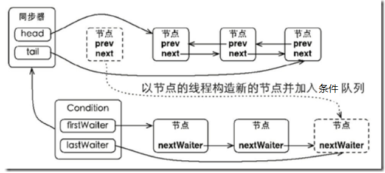


当从await方法返回的时候,会获取condition相关联的锁。当队列中的节点被唤醒的时候，则唤醒节点的线程开始尝试获取同步状态

如果不是通过其他线程调用Condition.signal()方法唤醒，而是对条件线程进行中断，则会抛出InterruptedException


#### signal


在调用signal()方法前,必须先判断是否获取到了锁。接着获取条件队列的首节点，将其移动到等待队列

并利用LockSupport唤醒节点中的线程,被唤醒的线程将从await方法中的while循环中退出。随后加入到等待队列的竞争中

竞争成功则会返回到await()之前的状态


调用Condition的signal()方法，将会唤醒在等待队列中等待最长时间的节点（head.next）


#### 总结


调用await()后，将当前线程加入Condition条件队列中,并释放锁,否则别的线程就无法拿到锁 -> 死锁

自旋(while)挂起，不断检测节点是否在等待队列中，如果是则尝试获取锁，否则挂起

当线程被signal方法唤醒，被唤醒的线程将从await()方法中的while循环中退出来，然后调用acquireQueued()方法竞争同步状态


#### 生产者消费者模式


```java
private LinkedList<Object> buffer;    //生产者容器
    private int maxSize;           //容器最大值
    private Lock lock;
    private Condition fullCondition;
    private Condition notFullCondition;

    BoundedQueue(int maxSize) {
        this.maxSize = maxSize;
        buffer = new LinkedList<>();
        lock = new ReentrantLock();
        fullCondition = lock.newCondition();
        notFullCondition = lock.newCondition();
    }

    /**
     * 生产者
     */
    public void put(Object obj) throws InterruptedException {
        lock.lock();
        try {
            while (maxSize == buffer.size()) {
                notFullCondition.await();       //满了，添加的线程进入等待状态
            }
            buffer.add(obj);
            fullCondition.signal(); //通知
        } finally {
            lock.unlock();
        }
    }

    /**
     * 消费者
     */
    public Object get() throws InterruptedException {
        Object obj;
        lock.lock();
        try {
            while (buffer.size() == 0) { //队列中没有数据了 线程进入等待状态
                fullCondition.await();
            }
            obj = buffer.poll();
            notFullCondition.signal(); //通知
        } finally {
            lock.unlock();
        }
        return obj;
    }
```


## 同步/并发容器的实现


### 一、同步容器

主要代表有Vector和Hashtable，以及Collections.synchronizedXxx等。

锁的粒度为当前对象整体。迭代器是及时失败的，即在迭代的过程中发现被修改，就会抛出ConcurrentModificationException。

### 二、并发容器

主要代表有ConcurrentHashMap、CopyOnWriteArrayList、ConcurrentSkipListMap、ConcurrentSkipListSet

锁的粒度是分散的、细粒度的，即读和写是使用不同的锁

迭代器具有弱一致性，即可以容忍并发修改，不会抛出ConcurrentModificationException


ConcurrentHashMap中，会将hash表的数组分成若干段，每段维护一个锁，以达到高效的并发访问


### 三、阻塞队列

主要代表有LinkedBlockingQueue、ArrayBlockingQueue、PriorityBlockingQueue(Comparable,Comparator)、SynchronousQueue

提供了可阻塞的put和take方法，以及支持定时的offer和poll方法。适用于生产者、消费者模式（线程池和工作队列-Executor），同时也是同步容器


### 四、双端队列

主要代表有ArrayDeque和LinkedBlockingDeque。意义：正如阻塞队列适用于生产者消费者模式，双端队列同样适用与另一种模式，即工作密取。在生产者-消费者设计中，所有消费者共享一个工作队列，而在工作密取中，每个消费者都有各自的双端队列。如果一个消费者完成了自己双端队列中的全部工作，那么他就可以从其他消费者的双端队列末尾秘密的获取工作。具有更好的可伸缩性，这是因为工作者线程不会在单个共享的任务队列上发生竞争。在大多数时候，他们都只是访问自己的双端队列，从而极大的减少了竞争。当工作者线程需要访问另一个队列时，它会从队列的尾部而不是头部获取工作，因此进一步降低了队列上的竞争。适用于：网页爬虫等任务中


### 五、比较及适用场景


如果不需要阻塞队列，优先选择ConcurrentLinkedQueue

如果需要阻塞队列，队列大小固定优先选择ArrayBlockingQueue

队列大小不固定优先选择LinkedBlockingQueue

如果需要对队列进行排序，选择PriorityBlockingQueue

如果需要一个快速交换的队列，选择SynchronousQueue

如果需要对队列中的元素进行延时操作，则选择DelayQueue


## 线程池 thread pool


创建/销毁对象费时间,线程池**利于管理线程的个数与活跃数,统一分配、调优和监控**


**内核级线程**是真正与操作系统内核交互的线程,存在上下文切换等性能消耗

new Thread 用户级:内核级 = 1:1

线程池	用户级:内核级 = 1:n

线程池减少了内核级线程的数量,从而无需大量的创建/切换线程


### 流程


1. 核心线程数 < corePoolSize，创建核心线程
2. workQueue没满，放入队列
3. 总线程数 < maximumPoolSize,新建非核心线程
4. 执行拒绝策略


### 线程池参数


**corePoolSize：核心数量,提交任务时开始创建**

**maximumPoolSize:最大数量**

**keepAliveTime:存活时间**。> corePoolSize && keepAliveTime，销毁线程

**unit**：keepAliveTime的单位

**workQueu**e：用于保存等待执行任务的**阻塞队列**，提交的任务将会被放到这个队列里

**threadFactory：线程工厂**

**handler：拒绝策略**，默认AbortPolicy（抛出异常），CallerRunsPolicy(只用调用者所在线程来运行任务)、DiscardOldestPolicy(丢弃队列里最近的一个任务，再执行当前任务)、DiscardPolicy(不处理)


### Executors


通过Executors.newXXX快速创建3种类型的ThreadPoolExecutor


**FixedThreadPool** 固定大小 + LinkedBlockingQueue无界队列

**可控制线程最大并发数**

```java
public static ExecutorService newFixedThreadPool(int nThreads) {
  return new ThreadPoolExecutor(nThreads, nThreads,	//核心=最大数量
                                0L, TimeUnit.MILLISECONDS,
                                new LinkedBlockingQueue<Runnable>());}//无界队列
```


**SingleThreadExecutor** 单线程 + LinkedBlockingQueue无界队列

保证所有任务按照指定顺序(FIFO, LIFO)执行

```java
public static ExecutorService newSingleThreadExecutor() {
    return new FinalizableDelegatedExecutorService
        (new ThreadPoolExecutor(1, 1,	//只有一个线程
                                0L, TimeUnit.MILLISECONDS,
                                new LinkedBlockingQueue<Runnable>()));}//无界队列
```


**CachedThreadPool** 核心0 + 非核心无限 + 60秒清除空闲线程 + 无容量队列

**灵活回收空闲线程,**适用于执行很多的短期异步任务的小程序，负载较轻的服务器

```java
public static ExecutorService newCachedThreadPool() {
    return new ThreadPoolExecutor(0, Integer.MAX_VALUE,	//无限的非核心线程
                                  60L, TimeUnit.SECONDS,	//60秒清除空闲
                                  new SynchronousQueue<Runnable>());}
//SynchronousQueue没有容量，不存储元素，会直接将任务交给消费者,被消费后才能继续添加新元素
```


**ScheduledThreadPool** 定长 + DelayQueue

延迟/定期执行任务

```java
public static ScheduledExecutorService newScheduledThreadPool(int corePoolSize) {
  return new ScheduledThreadPoolExecutor(corePoolSize);
}

public class ScheduledThreadPoolExecutor extends ThreadPoolExecutor implements ScheduledExecutorService {
  public ScheduledThreadPoolExecutor(int corePoolSize) {
    super(corePoolSize, Integer.MAX_VALUE, 0, NANOSECONDS,new DelayedWorkQueue());
  }
}
```


### ExecutorService


线程将任务委托给ExecutorService,继续执行与任务无关的其他任务


```
public interface ExecutorService extends Executor {


}
```


ExecutorService 接口在 java.util.concurrent 包中有如下实现类：

- ThreadPoolExecutor
- ScheduledThreadPoolExecutor


execute()，执行任务,无返回值

```java
Future<T> submit(Callable<T> task);	//通过future.get()获取返回值(阻塞直到任务运行结束)
```

submit()，提交一个线程任务，有返回值。
submit(Callable<T> task)能获取到它的返回值，通过future.get()获取（阻塞直到任务执行完）。一般使用FutureTask+Callable配合使用（IntentService中有体现）。

submit(Runnable task, T result)能通过传入的载体result间接获得线程的返回值

submit(Runnable task)则是没有返回值的，就算获取它的返回值也是null。

Future.get方法会使取结果的线程进入阻塞状态，知道线程执行完成之后，唤醒取结果的线程，然后返回结果。


```java
//32位,高3位表示线程池状态,低29位表示线程池数量
private final AtomicInteger ctl = new AtomicInteger(ctlOf(RUNNING, 0));

private final BlockingQueue<Runnable> workQueue;

    private final ReentrantLock mainLock = new ReentrantLock();
//工作线程
    private final HashSet<Worker> workers = new HashSet<Worker>();

    private final Condition termination = mainLock.newCondition();
```


### Worker.runWorker


```java
//AQS + Runnable
private final class Worker
  extends AbstractQueuedSynchronizer
  implements Runnable{

  final Thread thread;
  Runnable firstTask;
  //完成的task数量
  volatile long completedTasks;

  final void runWorker(Worker w) {
    Thread wt = Thread.currentThread();
    Runnable task = w.firstTask;
    w.firstTask = null;
    w.unlock(); // allow interrupts
    boolean completedAbruptly = true;
    try {
      //直到队列中下一个task也为null,才停止
      while (task != null || (task = getTask()) != null) {
        w.lock();
        if ((runStateAtLeast(ctl.get(), STOP) ||
             (Thread.interrupted() &&
              runStateAtLeast(ctl.get(), STOP))) &&
            !wt.isInterrupted())
          wt.interrupt();
        try {
          beforeExecute(wt, task);
          Throwable thrown = null;
          try {
            task.run();//运行
          } catch (RuntimeException x) {
            thrown = x; throw x;
          } catch (Error x) {
            thrown = x; throw x;
          } catch (Throwable x) {
            thrown = x; throw new Error(x);
          } finally {
            afterExecute(task, thrown);
          }
        } finally {
          task = null;
          w.completedTasks++;
          w.unlock();
        }
      }
      completedAbruptly = false;
    } finally {
      processWorkerExit(w, completedAbruptly);
    }
  }
```


### execute


```java
public void execute(Runnable command) {
  if (command == null)       throw new NullPointerException();
  int c = ctl.get();
  //工作中线程数量 < 核心,添加核心线程
  if (workerCountOf(c) < corePoolSize) {
    if (addWorker(command, true))  return;
    c = ctl.get();//更新数量
  }
  //线程池正在运行 && 添加任务至工作队列成功
  if (isRunning(c) && workQueue.offer(command)) {
    
    int recheck = ctl.get();
    //二次校验,当线程池停止时,移出队列并拒绝策略
    if (! isRunning(recheck) && remove(command)) reject(command);
    //空闲工作线程=0,添加非核心线程
    else if (workerCountOf(recheck) == 0)  addWorker(null, false);
  }
  //此时 工作中线程数量 > 核心 && 队列满,尝试添加非核心工作线程
  else if (!addWorker(command, false))
    reject(command);//添加失败执行拒绝策略
}
```


#### addWorker


```java
private boolean addWorker(Runnable firstTask, boolean core) {
  retry://CAS循环
  for (;;) {
    int c = ctl.get();
    int rs = runStateOf(c);

    // Check if queue empty only if necessary.
    if (rs >= SHUTDOWN && ! (rs == SHUTDOWN && firstTask == null && ! workQueue.isEmpty()))
      return false;

    for (;;) {
      int wc = workerCountOf(c);
      // 根据是否为添加核心线程 校验能否添加线程
      if (wc >= CAPACITY || wc >= (core ? corePoolSize : maximumPoolSize))
        return false;
      //CAS增加线程数量,成功则跳出循环
      if (compareAndIncrementWorkerCount(c))  break retry;
      c = ctl.get();  // 更新数量
      //当最新状态!=原状态,跳到外层重新retry,否则继续内层CAS
      if (runStateOf(c) != rs)  continue retry;
    }
  }

  boolean workerStarted = false;
  boolean workerAdded = false;
  Worker w = null;
  try {
    w = new Worker(firstTask);
    final Thread t = w.thread;
    if (t != null) {
      final ReentrantLock mainLock = this.mainLock;
      mainLock.lock();
      try {
        int rs = runStateOf(ctl.get());

        if (rs < SHUTDOWN ||
            (rs == SHUTDOWN && firstTask == null)) {
          if (t.isAlive())    throw new IllegalThreadStateException();
          workers.add(w);
          int s = workers.size();
          if (s > largestPoolSize)
            largestPoolSize = s;
          workerAdded = true;
        }
      } finally {
        mainLock.unlock();
      }
      if (workerAdded) {
        t.start();
        workerStarted = true;
      }
    }
  } finally {
    if (! workerStarted)
      addWorkerFailed(w);
  }
  return workerStarted;
}
```


### 线程池的工作队列


当没有足够的线程去处理任务时，可以将任务放进队列中，以队列先进先出的特性来执行工作任务

核心线程满了，进队列，队列也满了，创建新线程，直到达到最大线程数，之后再超出，会进入拒绝rejectedExecution


### 阻塞队列


阻塞队列是一个在队列基础上又支持了两个附加操作的队列

2个附加操作：

支持阻塞的**插入**方法：队列满时，队列会阻塞插入元素的线程，直到队列不满。支持阻塞的**移除**方法：队列空时，获取元素的线程会等待队列变为非空


7种阻塞队列


- **ArrayBlockingQueue**：**基于数组 有界**，按FIFO（先进先出）原则对元素进行排序,队满时不保证线程公平的访问(队列外的被阻塞元素将持续阻塞,没有获得锁的机会)
- **LinkedBlockingQueue**：**基于链表 有界**，按FIFO排序，吞吐量高于ArrayBlockingQueue。静态工厂方法Executors.newFixedThreadPool()使用了这个队列
- **SynchronousQueue**：**不存储元素**。每个插入操作必须等到另一个线程调用移除操作，否则插入操作一直阻塞，吞吐量高于Linked-BlockingQueue，静态工厂方法Executors.newCachedThreadPool使用了这个队列
- **PriorityBlockingQueue**：**支持优先级排序 无界**
- DelayQueue：**支持延时获取元素** 优先级队列 无界
- LinkedTransferQueue：链表 无界 
  - transfer()如果当前有消费者正在等待接收元素（take或者待时间限制的poll方法），transfer可以把生产者传入的元素立刻传给消费者。如果没有消费者等待接收元素，则将元素放在队列的tail节点，并等到该元素被消费者消费了才返回
  - tryTransfer()用来试探生产者传入的元素能否直接传给消费者。，如果没有消费者在等待，则返回false。和上述方法的区别是该方法无论消费者是否接收，方法立即返回。而transfer方法是必须等到消费者消费了才返回
- LinkedBlockingDeque：双向链表 在入队时，减少一半的竞争


#### 阻塞队列与 生产/消费模型


阻塞队列作为 生产者存放/消费者获取元素的容器


任何有效的生产者-消费者问题解决方案都是通过控制生产者put()方法（生产资源）和消费者take()方法（消费资源）的调用来实现的，一旦你实现了对方法的阻塞控制，那么你将解决该问题。

Java通过BlockingQueue提供了开箱即用的支持来控制这些方法的调用（一个线程创建资源，另一个消费资源）。java.util.concurrent包下的BlockingQueue接口是一个线程安全的可用于存取对象的队列。

**BlockingQueue是一种数据结构，支持一个线程往里存资源，另一个线程从里取资源。这正是解决生产者消费者问题所需要的，那么让我们开始解决该问题吧。**

**生产者**

以下代码用于生产者线程

```java
//生产者
class Producer implements Runnable {

    protected BlockingQueue<Object> queue;

    Producer(BlockingQueue<Object> theQueue) {
        this.queue = theQueue;
    }

    public void run() {
        try {
            while (true) {
                Object justProduced = getResource();
                queue.put(justProduced);
                System.out.println("生产者资源队列大小= " + queue.size());
            }
        } catch (InterruptedException ex) {
            System.out.println("生产者 中断");
        }
    }

    Object getResource() {
        try {
            Thread.sleep(100);
        } catch (InterruptedException ex) {
            System.out.println("生产者 读 中断");
        }
        return new Object();
    }
}
```

**消费者**

以下代码用于消费者线程

```
//消费者
class Consumer implements Runnable {

    protected BlockingQueue<Object> queue;

    Consumer(BlockingQueue<Object> theQueue) {
        this.queue = theQueue;
    }

    public void run() {
        try {
            while (true) {
                Object obj = queue.take();
                System.out.println("消费者 资源 队列大小 " + queue.size());
                take(obj);
            }
        } catch (InterruptedException ex) {
            System.out.println("消费者 中断");
        }
    }

    void take(Object obj) {
        try {
            Thread.sleep(100); // simulate time passing
        } catch (InterruptedException ex) {
            System.out.println("消费者 读 中断");
        }
        System.out.println("消费对象 " + obj);
    }
}
```

**测试该解决方案是否运行正常**

```
//测试
public class ProducerConsumerExample {

    public static void main(String[] args) throws InterruptedException {
        int numProducers = 4;
        int numConsumers = 3;
        BlockingQueue<Object> myQueue = new LinkedBlockingQueue<Object>(5);

        for (int i = 0; i < numProducers; i++) {
            new Thread(new Producer(myQueue)).start();
        }

        for (int i = 0; i < numConsumers; i++) {
            new Thread(new Consumer(myQueue)).start();
        }

        Thread.sleep(1000);
        System.exit(0);
    }
}
```

**运行结果**

```
生产者资源队列大小= 1
生产者资源队列大小= 1
消费者 资源 队列大小 1
生产者资源队列大小= 1
消费者 资源 队列大小 1
消费者 资源 队列大小 1
生产者资源队列大小= 1
生产者资源队列大小= 3
消费对象 java.lang.Object@1e1aa52b
生产者资源队列大小= 2
生产者资源队列大小= 5
消费对象 java.lang.Object@6e740a76
消费对象 java.lang.Object@697853f6
......
消费对象 java.lang.Object@41a10cbc
消费对象 java.lang.Object@4963c8d1
消费者 资源 队列大小 5
生产者资源队列大小= 5
生产者资源队列大小= 5
消费者 资源 队列大小 4
消费对象 java.lang.Object@3e49c35d
消费者 资源 队列大小 4
生产者资源队列大小= 5
```

**从输出结果中,我们可以发现队列大小永远不会超过5，消费者线程消费了生产者生产的资源**。


### 拒绝策略


ThreadPoolExecutor默认有四个拒绝策略：

1. `ThreadPoolExecutor.AbortPolicy()` 直接抛出异常RejectedExecutionException
2. `ThreadPoolExecutor.CallerRunsPolicy()` 直接调用run方法并且阻塞执行
3. `ThreadPoolExecutor.DiscardPolicy()` 直接丢弃后来的任务
4. `ThreadPoolExecutor.DiscardOldestPolicy()` 丢弃在队列中队首的任务

当然可以自己继承 RejectedExecutionHandler 来写拒绝策略


### Future


支持异步调用,但对于结果的获取却不方便，只能通过阻塞或者轮询的方式得到任务的结果。阻塞的方式显然和我们的异步编程的初衷相违背，轮询的方式又会耗费无谓的 CPU 资源，而且也不能及时地得到计算结果


三种功能：

判断任务是否完成；

中断任务；

获取任务执行结果

```java
public interface Future<V> {
  boolean cancel(boolean mayInterruptIfRunning);//取消任务成功返回true,取消失败/任务已完成,返回false。入参true表示可以取消正在执行过程中的任务
  boolean isCancelled();	//任务是否被取消成功
  boolean isDone();
  V get() throws InterruptedException, ExecutionException;	//获取执行结果，这个方法会阻塞，一直等到任务执行完毕
  V get(long timeout, TimeUnit unit)  throws InterruptedException, ExecutionException, TimeoutException;
}
```


### FutureTask


FutureTask既可以作为Runnable被线程执行，又能作为Future得到Callable的返回值,因为FutureTask实现了RunnableFuture

```java
public class FutureTask<V> implements RunnableFuture<V>
  public FutureTask(Callable<V> callable)
  public FutureTask(Runnable runnable, V result)
  
public interface RunnableFuture<V> extends Runnable, Future<V> {
    void run();
}
```


# 反射


==通过堆中的class对象访问到方法区中class文件(反射)==

**动态获取信息/调用对象方法**

在运行时，对任意类，都能知道这个类的所有属性和方法,对于任意对象，都能够调用它的任意方法和属性

**在运行过程中，操作对象**,提高程序扩展性和复用性，**解耦**


适用场景

* 在编译时不知道该对象或类可能属于哪些类，通过反射可以使程序代码访问装载到JVM中的类的内部信息
* 反射提高了灵活性和扩展性，**低耦合**。允许**程序创建和控制任何类的对象，无需提前硬编码**目标类
* Struts、Hibernate、Spring 在实现过程中都采用了该技术
* 反射是**解释操作**，用于字段和方法接入时效率低
* 会模糊程序内部逻辑：程序人员希望在源代码中看到程序的逻辑，反射等绕过了源代码的技术，带来维护问题


## Class


Class 类是反射的入口，用于获取与类相关的各种信息和方法

**每个类也可看做是对象**，有共同的Class来存放类的结构信息，能够通过相应方法取出相应信息：类名、属性、方法、构造方法、父类和接口


| asSubclass(Class<U>  clazz)              | 把传递的类的对象转换成代表其子类的对象 |
| ---------------------------------------- | -------------------------------------- |
| getClassLoader()                         | 获得类的加载器                         |
| getClasses()                             | 返回数组，包含公共类和接口类的对象     |
| getDeclaredClasses()                     | 返回数组，包含类和接口类的对象         |
| forName(String  className)               | 根据类名返回类的对象                   |
| getName()                                | 获得类的完整路径名字                   |
| newInstance()                            | 创建类的实例                           |
| getPackage()                             | 获得类的包                             |
| getSimpleName()                          | 获得类的名字                           |
| getSuperclass()                          | 获得当前类继承的父类的名字             |
| getInterfaces()                          | 获得当前类实现的类或是接口             |
| .class                                   | 获取当前对象的类                       |
|                                          |                                        |
| isAnnotation()                           | 如果是注解类型则返回true               |
| isArray()                                | 如果是一个数组类则返回true             |
| isEnum()                                 | 是枚举类则返回true                     |
| isInstance(Object obj)                   | 是该类的实例则返回true                 |
| isInterface()                            | 是接口类则返回true                     |
|                                          |                                        |
| getAnnotation(Class<A>  annotationClass) | 获得与参数类型匹配的公有注解对象       |
|                                          |                                        |


## Field


代表类的成员变量。**成员变量（字段）!=成员属性**。User类中有name变量，则它有name字段。如果**没有get/setName，就没有name属性**。**如果有get/set,不管字段是否存在，都认为有这个属性**


| getField(String name)          | 获得1个public字段  |
| ------------------------------ | ------------------ |
| getFields()                    | 获得所有public字段 |
| getDeclaredField(String  name) | 获得某个字段       |
| getDeclaredFields()            | 获得所有字段       |
| setAccessible(true)            | 忽略访问权限修饰符 |


getDeclaredField()访问非public字段时,会报错

```
can not access a member of class  with modifiers "private"
```

setAccessible(true)忽略访问修饰符


```java
@Test
public void testSet() throws Exception {
  User user = new User("张三", 23, "220202202002022222");
  Class<? extends User> userClass = user.getClass();

  Field idNumberField = userClass.getField("idNumber");
  // set方法：给对象的字段设置值。需要传入当前被操作的user对象
  idNumberField.set(user, "123456");
}
```


## Method


| **方法**                           | **用途**                                 |
| ---------------------------------- | ---------------------------------------- |
| invoke(Object obj, Object... args) | 传递object对象及参数调用该对象对应的方法 |
| getName                            | 获取方法名                               |
| SetAccessible(true)                | 暴力反射，忽略访问权限修饰符             |

 

Invoke方法的用处：SpringAOP在切面方法执行的前后进行某些操作，就是使用的invoke方法。

| **方法**                                                    | **用途**               |
| ----------------------------------------------------------- | ---------------------- |
| getMethod(String name,  Class...<?> parameterTypes)         | 获得该类某个公有的方法 |
| getMethods()                                                | 获得该类所有公有的方法 |
| getDeclaredMethod(String name,  Class...<?> parameterTypes) | 获得该类某个方法       |
| getDeclaredMethods()                                        | 获得该类所有方法       |

 

## Constructor

 

| **方法**                                            | **用途**                                          |
| --------------------------------------------------- | ------------------------------------------------- |
| getConstructor(Class...<?>  parameterTypes)         | 获得该类中与参数类型匹配的公有构造方法            |
| getConstructors()                                   | 获得该类的所有公有构造方法                        |
| getDeclaredConstructor(Class...<?>  parameterTypes) | 获得该类中与参数类型匹配的构造方法                |
| getDeclaredConstructors()                           | 获得该类所有构造方法                              |
| ==newInstance(Object... initargs)==                 | 根据传递的参数创建类的对象(**弱引用,容易被回收**) |


* Class类的newInstance()只能无参构造
* Constructor的newInstance()能传递构造参数

```java
Class<Session> sessionClass = Session.class;
Constructor<Session> declaredConstructor = sessionClass.getDeclaredConstructor();
declaredConstructor.setAccessible(true);
Session session2 = declaredConstructor.newInstance();
```


* Constructor类违背了Java的一些思想
  * 可以无视private的构造方法,强行创建对象
  * 破坏了单例模式

 


## 注解


注解本身并不起任何作用,只作为标识	通过反射来获取注解,再根据注解的参数执行业务


* 作用分类：
  * 编写文档：通过代码中标识的注解生成文档（Swagger）
  * 代码分析：通过代码里的注解对代码进行分析（逻辑判断）
  * 编译检查：通过代码里对应的注解让编译器实现基本的编译检查（Override，Deprecated，FunctionalInterface）

* JDK中预定义的一些注解
  * Override：检测该注解标识的方法是否继承自父类
  * Deprecated：标识方法、类、字段等已经过时，后续的版本可能会将其移除
  * SuppressWarnings：压制警告


### 元注解


==用于描述注解的适用范围==


* @Target	作用范围
  
* ```shell
  Type：作用于类
  METHOD：作用于方法
  FIELD：作用于字段
  PACKAGE
  ElementType取值
  PARAMETER
  TYPE_PARAMETER  标注类型参数
  CONSTRUCTOR
  LOCAL_VARIABLE  局部变量
  ANNOTATION_TYPE  注解类
  TYPE_USE  所有类型
  ```

* @Retention：描述注解被保留的阶段
  
  * RetentionPolicy.RUNTIME：当前描述的注解，会保留到class字节码文件中，并被jvm读取到	**默认**
  
  * RetentionPolicy.SOURCE：注解只保留在源文件，当Java文件编译成class文件的时候，注解被遗弃
  
  * RetentionPolicy.CLASS：注解被保留到class文件，但jvm加载class文件时候被遗弃
  
    生命周期长度 SOURCE < CLASS < RUNTIME
  
    需要在运行时动态获取注解信息，那只能用RUNTIME注解，比如@Deprecated使用RUNTIME注解
     在编译时进行预处理操作，比如生成一些辅助代码（如 ButterKnife），就用 CLASS注解；
     只是检查性的操作，比如 @Override 和 @SuppressWarnings，使用SOURCE 注解。
  
* @Documented：描述注解是否被抽取到javadoc中

* @Inherited：描述注解是否可以被继承

* @Repeatable:指明注解为可重复注解，可以在同一个地方多次使用

* @Scheduled

  ```shell
  #Cron 定时时间		允许正则表达式
  @Scheduled(cron = "0 0 5 * * ?")      [秒] [分] [小时] [日] [月] [周] [年]
  ?    不指定值
  \-    区间
  ,    指定多个值
  /    递增触发。秒”5/15” 表示从5秒开始，每增15秒触发
  L    最后。对于日字段，表示当月的最后一天.对于周字段上设置”6L”这样的格式,则表示“本月最后一个星期五”
  W   离指定日期的最近的工作日(周一至周五). 例如在日字段上置”15W”，表示离每月15号最近的那个工作日触发。如果15号正好是周六，则找最近的周五(14号)触发, 如果15号是周未，则找最近的下周一(16号)触发.如果15号正好在工作日(周一至周五)，则就在该天触发。如果指定格式为 “1W”,它则表示每月1号往后最近的工作日触发。如果1号正是周六，则将在3号下周一触发。(注，”W”前只能设置具体的数字,不允许区间”-“)。
  \#    序号(表示每月的第几个周几)，例如在周字段上设置”6#3”表示在每月的第三个周六.注意如果指定”#5”,正好第五周没有周六，则不会触发该配置
  ’L’和‘W’组合使用。在日字段上设置”LW”,则表示在本月的最后一个工作日触发；周字段的设置，若使用英文字母是不区分大小写的，即MON与mon相同
  
  # zone时区.一般留空
  fixedDelay上一次执行完毕后多长时间再执行
  @Scheduled(fixedDelay = 5000) //上一次执行完毕时间点之后5秒再执行
  
  fixedDelayString 同上的字符串形式,支持占位符
  @Scheduled(fixedDelayString = "5000") //上一次执行完毕时间点之后5秒再执行
   fixedRate上一次开始执行后多长时间再执行
  
  @Scheduled(fixedRate = 5000) //上一次开始执行时间点之后5秒再执行
  
  fixedRateString同上的字符串形式。支持占位符
  
  initialDelay第一次延迟多长时间后再执行
  
  @Scheduled(initialDelay=1000, fixedRate=5000) //第一次延迟1秒后执行，之后按fixedRate的规则每5秒执行一次
  
  initialDelayString同上的字符串形式。支持占位符
  ```


### 自定义注解


```java
@Target(ElementType.TYPE)
@Retention(RetentionPolicy.RUNTIME)
public @interface MyAnnotation {
    String name() default "lx";
    int value();
}
```


```
@MyAnnotation(123)
public class User{}
```


```java
public void testAnnotation() {
  Class<User> userClass = User.class;
  // 获取注解
  MyAnnotation myAnnotation = userClass.getAnnotation(MyAnnotation.class);
  // 注解不为空的时候进行处理
  if (myAnnotation != null) {
    // 获取打在User类上的注解的两个属性
    System.out.println(myAnnotation.name() + ":" + myAnnotation.value());
  }
}
```


==注解本质上是一个接口，默认继承自Annotation接口==

* 如果定义了属性，在使用属性的时需要赋值

* ==只有一个属性且名称value，则可以省略==

* 数组赋值时用{}封装

* ==属性中的返回值==类型有下列取值：
  * 基本数据类型
  * String
  * 枚举
  * 注解
  * 以上类型的数组


## 泛型擦除


```java
List<User> list= new ArrayList<>();
Class<? extends List> listClass = list.getClass();
Method add = listClass.getDeclaredMethod("add", Object.class);
add.setAccessible(true);
//通过invoke()避免了编译时的泛型检验
add.invoke(list, 5);
```


# JVM


Jconsole	查看JVM状态


## 6种存储方式


1．寄存器（register）**最快,位于处理器内部**。数量有限，由编译器根据需求分配。**无法直接控制**

2．栈（stack）位于**随机访问存储器RAM**，**通过“栈指针”从处理器获得直接支持**。==指针向下移动，分配新内存；向上移动，释放内存==。创建程序时，**编译器必须知道栈内所有数据的大小和生命周期**，因为它必须生成相应代码，以便上下移动指针,**限制程序的灵活性**

3．堆（heap）通用内存池,位于**随机访问存储器RAM**，用于存放对象。堆不同于堆栈的好处是：**编译器不需要知道要分配多少空间，也不必知道数据的生命周期,灵活性高,效率低**

4．静态存储（static storage）位于**随机访问存储器RAM**,存放运行时一直存在的数据

5．常量存储（constant storage）位于**代码内部**，这样安全。**有时在嵌入式中常量会和其它部分隔离，位于只读存储器ROM（read-only memory）**

6．非RAM存储（non-RAM storage）位于**程序外**，不受程序控制，没有运行时也存在,**字节流/持久化对象**,对象被转化成可以存放在其它媒介上的事物，在需要时可恢复


## JMM


### 栈

**-Xss**


虚拟机和物理机都有代码执行能力,物理机执行引擎建立在处理器、硬件指令集、操作系统层面,虚拟机执行引擎由自己实现，用于执行虚拟机字节码指令集


一个方法在栈上的内存称为栈帧,栈有多个栈帧,在方法调用完成后出栈


* 虚拟机栈==分配的内存大小在编译时确定==

  * ==对象引用,基本类型,指令地址==

  * ==对象引用和局部变量==(大小固定,运行期间不变)
    
    * **32位**(JOL规定)的变量槽（Slot），Slot至少能存放一个boolean、byte、char、short、int、float、reference类型的数据
    * **局部变量必须手动赋值**，不会被被赋初值,不像类变量在加载过程中有准备阶段
    
  * ==操作数栈==(工作空间)

      * 方法在执行过程中，各种字节码指令往操作数栈中读/写(出入栈)
      * Jvm的解释执行引擎就是基于操作数栈的执行引擎

  * ==动态连接==
    * 指向方法区中的方法表,从而支持方法调用过程中的动态连接
    * class文件的常量池中有大量的符号引用，字节码中的方法调用以常量池指向的方法的符号引用作为参数,这些符号引用一部分会在类加载阶段（解析）或首次使用的时转化为直接引用，这种转化成为静态解析，另一部分成为动态连接
    
  * ==方法返回地址(出口)==

      * 正常出口：执行引擎遇到返回的字节码指令，将返回值传递给上层的方法调用者
      * 异常出口：遇到未处理的异常(本地异常表没有匹配的异常处理器),执行引擎不会读取方法返回地址，上层调用者不会得到任何返回值
      * ==方法退出:当前栈帧出栈。恢复上层方法的局部变量表和操作数栈，把返回值压入调用者的操作数栈，调整PC计数器,执行下一条指令==

      一般把动态连接、方法返回地址和其他附加信息全部归为一类，成为栈帧信息

  * 线程私有，生命周期与线程相同,方法调用进栈,结束出栈

  * 效率高.由操作系统自动分配,有专门的寄存器存放栈的地址，压栈出栈有专门指令

  * 按先后定义的顺序依次压栈，**相邻变量的地址之间不会存在其它变量**。栈的内存地址由高到低，**后定义的变量地址低于先定义的变量**

  * **线程请求的栈深度大于虚拟机所允许的深度，StackOverflowError**
* 本地方法栈
  
  * 为虚拟机使用到本地方法服务（native）

==栈是运行时单位，解决程序运行时方法调用/执行，堆是存储单位，解决数据存储==


### 堆 heap

-Xms -Xmx


* 只有1个,被所有线程共享,虚拟机启动时创建
* 存储==对象和class对象(操作指令)==
* ==gc主要区域==
  * 新生代   分三个区,默认占比 8:1:1,方便采用**复制-清除策略**
  * 区分空闲/使用区,将存活的对象复制进空闲区，**避免碎片问题**。虽然复制后使用区没有碎片，但下次GC，Eden和使用区里都存在需要回收的对象,导致碎片
  * **Survivor from/to区交替空闲** -> 新生代实际可用90%
    * Eden存放新创建对象,==分配内存时需要加锁==
      * 线程在Eden上被分配独享的空间TLAB（Thread Local Allocation Buffer）,==在TLAB分配内存不需要加锁==，JVM会尽量在TLAB分配,对象过大或TLAB用完时，则仍在堆上进行分配
      * Eden满时
        * **进入老年代的对象大小在GC前未知**
        * 之前晋升到老年代的平均值>老年代剩余空间，**full GC**
        * < 则判断参数HandlePromotionFailure(是否允许担保失败,默认允许)，有担保则**Minor GC**
          * 大对象进入年老代,保证Eden区空间充足  -XX:PretenureSizeThreshold(默认0,代表不管怎样都在Eden先分配)
          * 长期存活进入老年代，避免from/to重复复制,以及Survivor空间不足  -XX:MaxTenuringThreshold 默认15次
          * **动态对象年龄判断**,年龄相同的对象>Survivor/2，**超出部分放入老年代,保证老年代空间充足**
      * GC后,使用/空闲区互换,**年龄+1**
  * 年老代  存活时间较久，较大的对象
* 堆的申请和释放工作由程序员控制，容易**内存泄漏** -> 己动态分配的堆内存未释放或无法释放


#### TLAB

-XX:TLABSize


Thread Local Allocation Buffer

堆区线程共享,由于频繁创建对象,在并发环境下从堆区中划分内存空间是线程不安全的,需要加锁等机制,将导致分配速度降低,所以需要TLAB


**JVM为每个线程在Eden区分配了一个私有缓存区**(Eden的1%),使得线程可以不加锁地创建对象

快速分配策略:当TLAB空间不足时,重新创建TLAB.多线程同时分配内存时,使用TLAB可以避免线程安全问题,提升内存分配的吞吐量


- 尽管不是所有的对象实例都能够在TLAB中成功分配内存,但JVM确实是将TLAB作为内存分配的首选
- 在程序中,开发人员可以通过选项"-XX:UseTLAB"设置是否开启TLAB空间。
- 一旦对象在TLAB空间分配内存失败时, JVM就会尝试着通过使用加锁机制确保数据操作的原子性,从而直接在Eden空间中分配内存


#### 主/工作/直接内存


* 主内存存储所有变量，共享
* 工作内存线程私有，保存变量值的副本，**线程对变量的操作在工作内存中完成，结束后放回主内存**,线程间无法直接访问对方工作内存中的变量
* 直接内存（Direct Memory）
  * -XX:MaxDirectMemorySize  如果没指定，默认与堆的最大值（-Xmx）一样
  * 并不是虚拟机运行时数据区的一部分，也不是Java虚拟机规范中定义的内存区域，但是这部分内存也被频繁地使用，而且也可能OOM
* 

**主内存可粗略认为是堆，工作内存认为是栈**

主内存可粗略认为是堆，工作内存认为是栈


CPU从内存取数据到寄存器，然后进行处理，但内存处理速度远低于CPU，导致CPU在处理指令时花费很多时间在等待内存做准备工作，于是在寄存器和主内存间添加了**CPU缓存**，CPU缓存小，但访问速度比主内存快


基本执行步骤：

1. lock（锁定）：线程读主内存时,把变量锁定
2. unlock（解锁）：读完后解锁，别的线程就可以进入操作
3. read（读取）：把变量值放入工作内存
4. load（加载）：把read操作得到的值放入工作内存变量副本中
5. use（使用）：把工作内存中的一个变量值传递给执行引擎
6. assign（赋值）：执行引擎赋值给工作内存的变量
7. store（存储）：把工作内存中的变量的值传到主内存
8. write（写入）：把store操作的值写入主内存变量


### 方法/静态区

**-XX:MaxPermSize**


* 只有1个,共享
* ==已被虚拟机加载的class信息(编译后的代码),类型信息,static变量,常量，编译期生成的常量==等**唯一的元素**
* ==永久代,GC主要进行常量池回收，类型卸载==
* 方法表
  * 实现动态调用的核心,存放在方法区中的类型信息中
  * 方法区的类型信息指向方法表，方法表指向具体方法,这些方法中包括从父类继承/自身重写


#### 运行时常量池

**-XX:PermSize和-XX:MaxPermSize**


- **常量池** 是Class文件的一部分,可以理解为Class文件中的资源仓库，它是Class文件结构中与其他项目资源关联最多的数据类型,**数据在编译期被确定**
  - **字符串常量池**：编译期,类中产生的字符串类型数据
  - **运行时常量池**：虚拟机加载Class后把常量池中的数据放入运行时常量池
    - 包含==基本类型和对象型的常量值==
    - ==小于127的Byte,Short,Integer,Long,Character== **不包括浮点数**
    - **编译期生成的常量**,如string的intern()


* 2类常量:
  * 字面量：字符串、声明为final的常量值等
  * 符号引用：类和接口的完全限定名、字段的名称和描述符、方法的名称和描述符


### 程序计数器


* **线程私有**
  * 字节码解释器 通过改变计数器的值来确定下一条指令，从而实现代码的流程控制，如：顺序执行、选择、循环、异常处理
* **为了线程切换能恢复到正确的位置，每条线程都需要一个独立的程序计数器**
  * 执行的是 native的话，程序计数器记录的是 undefined 地址，只有执行的是 Java 代码时程序计数器记录的才是下一条指令的地址
* **不会OutofMemoryError**


## JOL 对象内存布局


```shell
java -XX:+PrintCommandLineFlags -version

-XX:InitialHeapSize=257798976 #最小堆大小
-XX:MaxHeapSize=4124783616 #最大堆大小  
-XX:+PrintCommandLineFlags
-XX:+UseCompressedClassPointers #将类型指针进行压缩(8->4字节)
-XX:+UseCompressedOops	#将普通对象指针(成员变量指向对象)进行压缩 8->4字节
-XX:-UseLargePagesIndividualAllocation -XX:+UseParallelGC
java version "1.8.0_191"
Java(TM) SE Runtime Environment (build 1.8.0_191-b12)
Java HotSpot(TM) 64-Bit #java为64位(1个指针8字节)
```


**64/32位操作系统指系统使用多少位表示一个指针**

**Java默认开启指针压缩,使得运行在64位操作系统上的指针也是4字节而不是8字节**

但4字节32位不代表一个指针只能指向2^32^=4GB大小的内存空间,每个指向的内存空间都是1字节.

这也意味着**在内存超过2^32^*2^3^=32GB时,不能开启指针压缩**


| 对象头 markword       | 锁                                   | 8字节 | 存储对象运行时数据，哈希，GC分代年龄，锁状态标志，线程持有的锁 |
| --------------------- | ------------------------------------ | ----- | ------------------------------------------------------------ |
| 类型指针 classpointer | 指向xxx.class                        | 4     | 指向类元数据的指针，通过这个确定这个对象是哪个类的实例       |
| 实例数据 instancedata | 成员属性                             | 每个4 | 真正存储的有效信息                                           |
| 对齐 padding          | 将存储空间填充为8的倍数,能进加速读取 |       |                                                              |


```java
Object o = new Object();
        System.out.println(ClassLayout.parseInstance(o).toPrintable());//打印对象在内存中的布局	需加入JOL依赖(Java Object Layout)
        synchronized (o) {
            System.out.println(ClassLayout.parseInstance(o).toPrintable());
        }

java.lang.Object object internals:
 OFFSET  SIZE   TYPE DESCRIPTION                               VALUE
      0     4        (object header)        //对象头           01 00 00 00 (00000001 00000000 00000000 00000000) (1)
      4     4        (object header)        //对象头           00 00 00 00 (00000000 00000000 00000000 00000000) (0)
      8     4        (object header)        //类型指针       e5 01 00 f8 (11100101 00000001 00000000 11111000) (-134217243)
   	//Object无成员属性
     12     4        (loss due to the next object alignment)	//前面的3个Size合计3*4=12,需要填充额外的4字节
Instance size: 16 bytes//占据的总字节
Space losses: 0 bytes internal + 4 bytes external = 4 bytes total


//锁住对象后的内存状态
java.lang.Object object internals:
 OFFSET  SIZE   TYPE DESCRIPTION                               VALUE
      0     4        (object header)                           e8 f7 ac 02 (11101000 11110111 10101100 00000010) (44890088)
      4     4        (object header)                           00 00 00 00 (00000000 00000000 00000000 00000000) (0)
      8     4        (object header)                           e5 01 00 f8 (11100101 00000001 00000000 11111000) (-134217243)
     12     4        (loss due to the next object alignment)
Instance size: 16 bytes
Space losses: 0 bytes internal + 4 bytes external = 4 bytes total
```


**补齐包括内补齐和外补齐**

**在对象有成员属性boolean和string时**

```java
boolean flag;	1字节
							内补齐3字节
string ="xxx";	4字节(此处只需存储4字节的指针指向"xxx"对象)
```

内补齐使得读取成员变量时不会出现碎片化


## JIT


Just-In-Time	及时编译

原本是JVM将语句一条条地解释,再执行

当一个方法被高频率地调用(热点代码),将直接及时编译成机器语言


## 代码的3个阶段


源代码阶段

.java	成员变量，构造方法，成员方法通过**javac编译** ->	.class


Class类对象阶段

.class	ClassLoader类加载器 ->	内存(加载了class文件中的成员变量，构造方法，成员方法)


Runtime运行时阶段

class对象	创建对象->	对象


## 指令重排


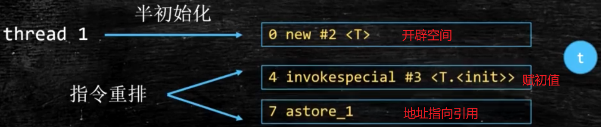


地址指向引用 和 赋值 指令可能调换顺序


## GC


传统的 C/C++语言，程序员负责回收已经分配内存

* 显式回收垃圾回收的缺点：

1）程序忘记回收，从而导致内存泄露，降低系统性能

2）程序错误回收程序核心类库的内存，导致系统崩溃

 

* Java由JRE在后台自动回收不再使用的内存

1）可以提高编程效率,保护程序的完整性

3）影响性能,==Jvm必须跟踪程序中有用的对象==，确定哪些是无用的

 

* 回收机制

  * ==只回收堆内存里的对象==,不回收栈/物理连接
  * 无法控制回收执行时间,可以通过 System.gc()或者 Runtime.getRuntime().gc()来请求回收
  * ==将对象的引用变量设置为 null，暗示可以回收==
  * 回收任何对象之前，总会先调用它的 finalize 方法,但==不要主动调用finalize==


**引用计数法**

通过对象的引用计数器,判断该对象是否被引用,计数器为0则被回收

但存在**对象之间相互引用**的问题,此时无法回收


可达性算法

判断与GC Roots是否可达


**标记清除算法**

先对可回收的垃圾进行标记,然后再清理

**会产生大量的内存碎片**


**标记整理算法**

标记后让所有存活对象向一端移动

**内存变动频繁,效率低**


**复制算法**


**分代回收算法**

新生:大量对象新生/死亡				复制算法

年老:存活对象大,没有额外空间进行担保	标记清理/整理

永久代


### 4种引用


* 强引用
  * ==没有变量指向堆中的对象时,GC回收==
  * Object obj = new Object()
* 软引用(SoftReference)
  * ==内存不足才回收==
  * 实现内存敏感的高速缓存,和引用队列（ReferenceQueue）联合使用，如果软引用所引用的对象被gc，Jvm就会把这个软引用加入到引用队列
* 弱引用（WeakReference）
  * ==一旦发现弱引用的对象，就回收==。由于GC是优先级很低的线程， 不一定会很快发现弱引用
  * 和引用队列联合使用，如果弱引用所引用的对象被gc，Jvm就会把弱引用加到引用队列中
  * **常用于Map数据结构中，占用内存空间较大的对象**

* 虚引用（PhantomReference）
  * 主要用来回收==堆外内存(NIO的实现也用了虚引用)==,**必须和引用队列联合使用**
  * **虚引用无法通过get来获得引用对象**,其他3种都能
  * ==回收之前，把虚引用加入与之关联的引用队列中==,Jvm监听引用队列,得知虚引用对象要被GC,通知操作系统释放堆外内存

  * 由于Object.finalize()方法的不安全/低效，常用虚引用完成**对象回收前的资源释放工作**


## 创建/分配/访问


* 创建

遇到new指令时，首先检查这个指令的参数是否能在常量池中定位到一个类的符号引用，并且检查这个符号引用代表的类是否已被加载、连接和初始化过。

如果没有，那必须先执行相应的类的加载过程

 

内存分配	==对象内存的大小在类加载完成后已经确定==，分配空间等同于从堆中划分确定大小的内存

首先尝试在栈上进行分配,如果对象比较简单,就直接在栈上分配

```java
public class Test{
	public Point point;	//在持有的对象引用内部简单时,会被JVM视为Test有x,y两个成员属性
}

public class Point{
	public int x;
	public int x;
}
```


* 两种分配方式
  * 指针碰撞：所有用过的内存在一边，空闲内存在另一边，中间放着一个指针作为分界点的指示器，

把指针往空闲内存那边挪一段与对象大小相等的距离。再使用Serial，ParNew等收集器，

（也就是用复制算法，标记-整理算法的收集器），分配算法通常采用指针碰撞。

* 空闲列表：虚拟机维护一个列表，记录哪些内存是可用的，分配的时候从列表中找到一块足够大的空间划分给对象，并更新列表。

使用CMS这种基于标记-清除算法的收集器，通常用空闲列表

 

　　对象创建在虚拟机中时非常频繁的行为，即使是仅仅修改一个指针指向的位置，在并发情况下也并不是线程安全的，可能出现正在给对象A分配内存，指针还没来得及修改，对象B又同时使用了原来的指针来分配内存的情况。

同步

　　虚拟机采用CAS配上失败重试的方式保证更新操作的原子性

本地线程分配缓冲（Thread Local Allocation Buffer, TLAB）

　　把内存分配的动作按照线程划分为在不同的空间之中进行，即每个线程在Java堆中预先分配一小块内存（TLAB）。

　　哪个线程要分配内存，就在哪个线程的TLAB上分配。只有TLAB用完并分配新的TLAB时，才需要同步锁定。

 

　　内存分配完之后，虚拟机要将分配到的内存空间都初始化为零值（不包括对象头），保证了对象的实例字段在Java代码中可以不赋初始值就直接使用。

 


 

**对象的访问定位：**

　　程序要通过栈上的reference数据来操作堆上的具体对象。对象的访问方式有**使用句柄**和**直接指针**。

　　**使用句柄**：java堆会划分一块内存作为句柄池，reference中存的是对象的**句柄地址**，而句柄中包含了**对象的实例数据的地址和类型数据的地址（在方法区）**。

优点：对象被移动，reference不用修改，只会改变句柄中保存的地址。

　　**使用直接指针**：reference中存的是对象的地址，对象中分一小块内存保存类型数据的地址。优点：速度快。


## 类加载机制


每个在JVM中运行的实例都有对应的class文件，而class文件的加载通过类加载器

每个类都对应一个加载器。如果不是有特殊用途，每个类在JVM中只加载一次

Class文件由类装载器装载后，在JVM中将形成一份描述Class结构的元信息对象(包括Class的结构信息：构造函数，属性和方法等),==借由这个Class相关的元信息对象间接调用Class对象的功能==


**类也是由成员变量/构造器和方法等构成的,类本质也是Class类的对象**

**`class<?>描述类的结构` 所以`class<?>对象对应一个普通类的所有对象`**

**Class类对象无法直接创建 因为构造方法是`私有的` ,由JVM随类装载时自动创建**

所有的Java类都有一个静态属性class，它引用代表这个类的Class对象


假如类还未加载到内存中，那么在创建该类的实例时，具体过程:

创建实例必须先将该类加载到内存并进行初始化，也就是说，**类初始化在实例化之前进行，但并不意味着：只有类初始化结束后才能进行实例化**


### 双亲委派模型


**工作过程**：

类加载器接收到类加载请

把请求委托给父类加载器，每层的类加载器都是如此，因此**所有的加载请求都应该传送到顶层的启动类加载器**中，只有当父加载器反馈无法完成这个加载请求（搜索范围中没有找到所需的类）时，子加载器才会尝试自己去加载


**加载过程**:

先自底向上检查是否已被加载,以保证类只被加载一次

若未被加载，则由父类加载器先加载，自顶向下逐层尝试加载


**好处**：

类随着类加载器一起具备了**带有优先级的层次关系**

例如Object类存放在rt.jar中，无论哪个类加载器要加载Object，最终都会委派给启动类加载器，因此Object类在各种类加载器中都是同一个类


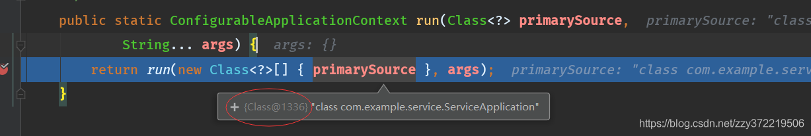


**任何类(在其作用域范围内)为了表示`唯一`的对象都需要加对象的HashCode**


**每个Class对象又都是生产其对应类对象的模板**

**如果没有 JVM就会通过类加载器(ClassLoader)根据类的名称去找对应的.class文件(这也是Java程序运行前需要先编译的原因 除了加载.class ClassLoader同样负责加载文件和配置等其他资源)**

**这时如果没有发生错误 此类的类对象(Class对象)会被加载到内存**


当程序要使用某个类, 如果该类还未被加载到内存中, 则通过加载, 连接, 初始化三步来实现对这个类进行初始化:

**加载**就是将class文件读入内存, 并创建Class对象

　　JVM\进行类加载阶段需要完成以下三件事情:   

1. 通过一个类的全限定名称来获取定义此类的二进制字节流 

　　　　2. 将这个字节流所代表的静态存储结构转化为方法区的运行时数据结构

　　　　3. 在java堆中生成一个代表这个类的java.lang.Class对象, 作为方法区这些数据的访问入口

　　类的加载的最终产品是位于堆区中的Class对象, Class对象封装了类在方法区内的数据结构, 并且向Java程序员提供了访问方法区内的数据结构的接口

 

　　类的加载时机

　　　　1. 创建类的实例

　　　　2. 使用类的静态变量或者为静态变量赋值

　　　　3. 调用类的静态方法

　　　　4. 使用反射方式来强制创建某个类或接口对应的java.lang.Class对象

　　　　5. 初始化某个类的子类

　　　　6. 直接使用java命令来运行某个主类

　　通俗的说就是只要用到了类的东西类就会加载

 

　　JVM在运行时会产生3个类加载器组成的初始化加载器层次结构

- Bootstrap ClassLoader 根类加载器 

​    　 用C++编写

​    　　也被称为引导类加载器, 负责java核心类的加载 该加载器无法直接获取

​    　　比如System, String等, 在JDK中JRE的lib目录下rt,jar文件中

- Extension ClassLoader 扩展类加载器

​    　　负责JRE的扩展目录中jar包的加载 jre/lib/ext目录下的jar包或-Djava,ext,dirs指定目录下的jar包装入工作库

- System ClassLoader 系统类加载器(加载自己写的类以及第三方类库(导入的jar包))

​    　　负责在JVM\启动时加载来自java命令的class文件, 以及classpath环境变量所指定的jar包和类路径

 

 

**连接**就是将类的二进制数据合并到JRE中 

　　**连**接分为以下三步:

　　　　**验证** 检查载入Class文件数据的正确性

- - - 文件格式检验：检验字节流是否符合Class文件格式的规范, 并且能被当前版本的虚拟机处理
    - 元数据检验：对字节码描述的信息进行语义分析, 以保证其描述的内容符合Java语言规范的要求
    - 字节码检验：通过数据流和控制流分析, 确定程序语义是合法、符合逻辑的
    - 符号引用检验：符号引用检验可以看作是对类自身以外(常量池中的各种符号引用)的信息进行匹配性校验

　　　　　　是否有正确的内部结构(构造器, 方法, 变量, 代码块), 并和其他类协调一致

　　　　**准备** 该阶段正式为类变量分配内存并设置类变量初始值

　　　　　　这些变量所使用的内存将在方法区中进行分配, 此时进行内存分配的仅包括类变量, 而不包括实例变量(实例变量将会在对象实例化时随着对象一起分配在Java堆中), 

　　　　　　另外, 在这里分配的静态类变量是将其值定义为默认值, 这里所设置的初始值通常情况下是数据类型默认的零值(如0, 0L, null, false等), 而不是被在Java代码中

　　　　　　被显式地赋予的值, 正确的赋值将在初始化阶段执行,

　　　　**解析** 将类的二进制数据中的符号引用替换为直接引用

　　　　　　比如说类中方法中的运算, 运算中符号a=1 去掉a直接变成1, 这样可以节约很多资源

 

 

**初始化**就是对类的静态变量, 静态代码块执行初始化操作

   类初始化阶段是类加载过程的最后一步, 前面的类加载过程中, 除了加载（Loading）阶段用户应用程序可以通过自定义类加载器参与之外, 其余动作完全由虚拟机主导和控制, 到了初始化阶段, 才真正开始执行类中定义的Java程序代码 

　　初始化为类的静态变量赋予正确的初始值, JVM负责对类进行初始化, 主要对类变量进行初始化, 在Java中对类变量进行初始值设定有两种方式：

- - 声明静态变量(类变量)时指定初始值 
  - 使用静态代码块为类变量指定初始值

​    初始化步骤:

​      \1. 假如这个类还没有被加载和连接, 则程序先加载并连接该类

​      \2. 假如该类的直接父类还没有被初始化, 则先初始化其直接父类

​      \3. 假如类中有初始化语句, 则系统依次执行这些初始化语句

　　JVM在堆内存中创建对象, 类的成员变量进入到堆内存中, 赋默认值 

 

 

最后就是我们熟悉的Runtime运行时\阶段

```
Person p = new Person();
p,study();
```

执行上述代码会在堆内存创建一个Person类的对象, 并且在栈内存分配一块储存空间存放Person类型的引用变量p, p存放该对象的地址并且指向该对象, 调用p的study方法实际是, 对象通过Person类的字节码对象来访问方法区Person字节码的study方法

 


名词解释 :

Java源程序: 即Java源代码, 用java语言编写的程序

Java类加载器(Java Classloader): 是Java运行时环境(JRE)的一部分, 负责动态加载Java类到JVM的内存空间中

JRE: 即Java Runtime Environment, Java运行环境,内部包含了一个Java虚拟机以及一些标准类库(Jar包)\

JAR包:\ 通常用于聚合大量的Java类文件、相关的元数据和资源(文本、图片等)文件到一个文件, 以便开发Java平台应用软件或库

JVM: 即Java Virtual Machine一种能够运行Java字节码**(*Java bytecode)的虚拟机

类(Class): 类是具有共同属性和行为的对象的集合, 类定义了对象的属性和方法

字节码: 字节码是已经经过编译, 但与特定机器码无关, 需要解释器转译后才能成为机器码的中间代码

Java字节码: 是Java虚拟机执行的一种指令格式

Java编译器:\ 将Java源文件(.java文件)编译成字节码文件(.class文件, 是特殊的二进制文件, 二进制字节码文件), 这种字节码就是JVM的“机器语言”, javac命令可以简单看成是Java编译器

Java解释器:\ 是JVM的一部分, Java解释器用来解释执行Java编译器编译后的程序, java命令可以简单看成是Java解释器

**运行时类**: 加载到内存中的字节码文件对应的类称为运行时类,  此运行时类即为一个Class的实例

Java堆(Heap): 在\**\*JVM\*\**\启动时创建,\ 是JVM\所管理的内存中最大的一块,\ 在JVM 中，堆(Heap)是可供各条线程共享的运行时内存区域, 也是供所有类实例和数组对象分配内存的区域,  Java堆是被所有线程所共享的一块内存区域, Java堆是垃圾收集器管理的主要区域

Java栈(Stack): 在函数中定义的基本类型的变量、Java指令代码、对象的引用变量均在函数的栈内存中分配，当超过变量的作用域后，Java 会自动释放掉该变量分配的内存空间

方法区(Non-Heap): 方法区与Java堆一样，是各个线程共享的内存区域，用于存储已被虚拟机加载的类信息(构造方法和接口定义)、常量、静态变量、即时编译器编译后的代码等数据, 运行时常量池存在方法区中


加载 -> 连接(验证/准备/解析) -> 初始化 -> 使用 -> 卸载


准备	**为类变量（非对象变量）分配内存,赋初值，准备类中每个字段、方法和实现接口所需的数据结构**

如果类变量是**final**，编译时javac将会为value生成ConstantValue属性，在准备阶段根据ConstantValue将变量设置为指定的值(**不赋默认值**)


初始化	执行类构造器

**类构造器是编译器收集所有静态语句块和类变量的赋值语句，按语句在源码中的顺序合并生成类构造器**


**类初始化时机：**

类的初始化是指类加载过程中的初始化阶段,对类变量按照代码进行赋值的过程

1. 遇到new、getstatic、putstatic或invokestatic这四条字节码指令
2. 使用java.lang.reflect包的方法对类进行反射调用
3. 当初始化一个类的时候，如果发现其父类还没有进行过初始化，就先触发其父类的初始化
4. JVM启动时，先初始化包含main()的主类


**父类的类构造器() -> 子类的类构造器() -> 父类的成员变量和实例代码块 -> 父类的构造函数 -> 子类的成员变量和实例代码块 -> 子类的构造函数。**

JVM会保证类构造器在多线程环境中被正确的加锁、同步

如果多个线程同时去初始化一个类，只会有一个线程去执行这个类的类构造器

类构造器与构造方法不同，不需要显式调用，JVM会保证在子类类构造器执行前，父类的类构造器执行完毕

在类的生命周期中，类构造器最多会被虚拟机调用一次，构造方法会被JVM调用多次

当对象被创建时，虚拟机就会为其分配内存来存放 对象本身+父类继承的实例变量,同时赋默认值。

在内存分配完成之后，Java虚拟机就会开始对新创建的对象按照程序猿的意志进行初始化。在Java对象初始化过程中，主要涉及三种执行对象初始化的结构，分别是实例变量初始化、实例代码块初始化以及构造函数初始化


### 类卸载


当Class对象不再被引用时，Class对象结束生命周期，类在方法区内的数据也会被卸载，从而结束类的生命周期


**JVM自带的类加载器(根类/扩展类/系统类加载器)所加载的类，始终不会被卸载**(jvm和jls规范)

JVM会始终引用这些类加载器，而这些类加载器则会**始终引用**它们所加载的类的Class对象，因此这些Class对象**始终是可触及的**

用户自定义的类加载器对象加载的类型,只有在很简单的上下文环境中才能被卸载，而且还要借助于强制调用虚拟机的垃圾收集功能才可以做到


一个已经加载的类型被卸载的几率很小,至少被卸载的时间是不确定的

开发代码时候，不应该对虚拟机的类型卸载做任何假设的前提下来实现系统中的特定功能


loader1变量和obj变量 间接引用 代表Sample类的Class对象，而objClass变量则直接引用它。

如果程序运行过程中，3个引用变量都置为null，此时 对象/类加载器对象/Class对象 都结束生命周期，类在方法区内的二进制数据**被卸载**

当再次有需要时，会检查类的Class对象是否存在，**如果存在则直接使用，不再重新加载**；不存在则类被重新加载，在Jvm的堆区生成新的Class对象


实例变量在对象初始化的过程中会被赋值几次？

1. 分配完内存后，会给实例变量赋默认值，这个赋值过程无法避免

2. 在声明实例变量x的同时进行了赋值，此时是第二次赋值
3. 在实例代码块中，又对变量做了初始化操作，就被第三次赋值
4. 在构造方法中，也对变量做了初始化操作，就被第四次赋值

==在Java的对象初始化过程中，实例变量最多被初始化4次==


   What(是什么？) Java反射就是在运行状态中，对于任意一个类，都能够知道这个类的所有属性和方法；对于任意一个对象，都能够调用它的任意方法和属性；并且能改变它的属性。而这也是Java被视为动态（或准动态，为啥要说是准动态，因为一般而言的动态语言定义是程序运行时，允许改变程序结构或变量类型，这种语言称为动态语言。从这个观点看，Perl，Python，Ruby是动态语言，C++，Java，C#不是动态语言。）语言的一个关键性质。
   Why(为什么？) 我们知道反射机制允许程序在运行时取得任何一个已知名称的class的内部信息，包括包括其modifiers(修饰符)，fields(属性)，methods(方法)等，并可于运行时改变fields内容或调用methods。那么我们便可以更灵活的编写代码，代码可以在运行时装配，无需在组件之间进行源代码链接，降低代码的耦合度；还有动态代理的实现等等；但是需要注意的是反射使用不当会造成很高的资源消耗！
  **获取class的三种方式：**（一个类在 JVM 中只会有一个 Class 实例，因此c1= c2= c3）
1、通过对象调用 getClass() 方法来获取,通常应用在：比如你传过来一个 Object
类型的对象，而我不知道你具体是什么类，用这种方法
    **Person p1 = new Person();Class c1 = p1.getClass();**
2、直接通过 类名.class 的方式得到,该方法最为安全可靠，程序性能更高
这说明任何一个类都有一个隐含的静态成员变量 class
   　**Class c2 = Person.class;**
3、通过 Class 对象的 forName() 静态方法来获取，用的最多，
但可能抛出 ClassNotFoundException 异常
    **Class c3 = Class.forName(“com.ys.reflex.Person”);**
通过 Class 类可以获取成员变量、成员方法、接口、超类、构造方法等。常用的方法如下：
  getName()：获得类的完整名字。
　　getFields()：获得类的public类型的属性。
　　getDeclaredFields()：获得类的所有属性。包括private 声明的和继承类
　　getMethods()：获得类的public类型的方法。
　　getDeclaredMethods()：获得类的所有方法。包括private 声明的和继承类
　　getMethod(String name, Class[] parameterTypes)：获得类的特定方法，name参数指定方法的名字，parameterTypes 参数指定方法的参数类型。
　　getConstructors()：获得类的public类型的构造方法。
　　getConstructor(Class[] parameterTypes)：获得类的特定构造方法，parameterTypes 参数指定构造方法的参数类型。
　　newInstance()：通过类的不带参数的构造方法创建这个类的一个对象。
暴力反射：获取私有属性和方法的方式称为暴力反射，但是这是不建议的。

**反射的使用场景：**
  比如对于Tomcat而言，它并不知道我们会有什么样的方法，这些都只是在项目被部署进webapp下后才确定的，由此分析，必然用到了Java的反射来实现类的动态加载、实例化、获取方法、调用方法。Tomcat需要根据请求调用方法，动态地加载方法所在的类，完成类的实例化并通过该实例获得需要的方法，最终将请求传入方法执行。
  灵活使用反射能让我们代码更加灵活，这里比如JDBC原生代码注册驱动、动态代理、MyBatis的实体类、Spring 的 AOP等等都有反射的实现。但是凡事都有两面性，反射也会消耗系统的性能，增加复杂性等，合理使用才是真！


```java
public class Singleton {
    //1.静态变量    调用了非静态的构造器  将优先加载非静态,跳过静态
    //4.构造方法结束,赋值
    private static Singleton instance = new Singleton();

    //3.构造方法    此时x=y=1
    public Singleton() {   x++;   y++; }

    //5.静态变量赋值  此时x=1,y=0
    private static int x,y = 0;

    //2.非静态变量
    private int z = 1;

    public static Singleton getInstance() {   return instance; }

    public static void main(String[] args) {
        //6.main方法体     结果x=1,y=0
        getInstance();   }}
```


```java
public class Singleton2 {

    //3.构造方法    此时x=y=1
    public Singleton2() {     x++; y++;    }

    //1.静态变量赋值  此时x=y=0
    private static int x = 0, y;
    //2.静态变量调用构造方法
    //4.构造器返回值赋值
    private static Singleton2 instance = new Singleton2();

    public static Singleton2 getInstance() {   return instance;    }

    public static void main(String[] args) {
        //5.main方法体       结果x=y=1
        getInstance();   }}
```


* 类引用调用的大致过程
  * 编译器将源代码编译成class文件，根据静态类型将调用的符号引用写到class文件
  * 在执行时，JVM根据class文件找到调用方法的符号引用，在方法表中找到偏移量
  * 然后根据this指针确定对象的实际类型，==使用实际类型的方法表(多态的实现)==，根据偏移量在实际类型的方法表中找到方法则直接调用，否则，按照继承关系从下往上搜索


实例方法和变量的内存是在运行时分配的，所以地址(内存的偏移)无法固定。静态方法无法调用实例方法和变量,实例方法可以调用静态方法和变量。


类方法执行时,对象还未创建,==类方法不能被实例调用==

在类方法中调用实例方法,将优先执行完所有实例方法,==类方法可以调用实例方法==


### 静态代码块

```java
 static{ }
```

* 属于类
* 类被加载的时运行，只运行一次，优先于各种代码块以及构造函数
  * 静态代码块**主动运行**,所以不能在方法体中
  * 静态方法是被动运行,通过类名或对象名访问
  * 普通方法是实例化后运行,通过对象访问

* 一般用于项目启动加载配置文件


### 构造代码块

```
{}
```

* 属于类

* 创建对象时调用，**每次创建对象都会调用**，优先于构造函数执行

* 不实例化对象，构造代码块不会执行

* 构造方法被重载,不能事先确定到底执行哪个,构造代码块却一定被执行

  

### 构造函数

* 属于类
* 命名为类名,不带返回值。普通函数可以和构造函数同名，但有返回值

* 主要用于在类的对象创建时定义初始化的状态。不能被void修饰,以区分其他有返回值的方法

* 不能被直接调用，必须通过new

* 默认先调用父类的无参构造


### 普通代码块

-    构造代码块是在**类中**定义的，
-    普通代码块是在**方法体中**定义的


* 静态和动态分开处理
  * 静态加载： 静态变量，静态代码块
  * 动态加载： 
  * **静态/实例方法在调用的才会执行**
  * 当静态加载中遇到需要加载动态的情况：**先加载动态再加载静态**（因为非静态可以访问静态，而静态不能访问非静态）**实例初始化在静态初始化之前**”
  * 静态变量声明必须放在使用前面

* main是否第一句先执行
  * main也是静态方法，首先加载main所在的类,不执行main，优先加载类中其他静态部分

* 父类、子类加载顺序

　　1、父类的静态变量和静态块赋值（按照声明顺序）
　　2、自身的静态变量和静态块赋值（按照声明顺序）
　　3、main方法
　　3、父类的成员变量和块赋值（按照声明顺序）
　　4、父类构造器赋值
　　5、自身成员变量和块赋值（按照声明顺序）
　　6、自身构造器赋值
　　7、静态方法，实例方法只有在调用的时候才会去执行


# 创建对象方式


1. new 语句
2. Class.newInstance() 反射
3. Constructor.newInstance() 反射（可调用私有构造）

3、clone()

4、反序列化，调用 java.io.ObjectInputStream 对象的readObject()方法。

1/2/3显式调用构造

4/5不调用构造


new和 Class.forName(String className) 在类加载的时候没有区别，都是由当前调用类的classloader类加载，并写进缓存,不会被再次加载


类被哪个类加载器加载，不是随意的，是有铁定法则的。


类加载器分为两类，一类是ContextClassLoader，一个是当前类的加载器

使用new创建类，用的是new所在类的加载器，例如在Group类中用new方式创建了一个Person，那么Person类被Group.class类的加载器加载的(此时假定Person类尚未被虚拟机加载)

而Class.forName(String name, boolean initialize,ClassLoader loader)可以**指定类加载器**。如果没有指定类加载器，那么使用的是ContextClassloader，该加载器是设置在线程中的,可以通过Thread.currentThread.getContextClassLoader()获取


new 其实是forName和 newInstance的结合并且 new 是静态，forName是动态

调用new之前，类可以没有被加载过，没有加载时就会触发类查找。然而newInstance 只能类被加载时才能正常调用


# Object 6个方法


```java
public boolean equals(Object) 	比较地址
public native int hashCode() 	获取哈希码 	是native Method,不是用java实现的方法
public String toString()
public final native Class getClass() 		获取类结构信息
protected void finalize() throws Throwable 	垃圾回收前执行的方法
protected native Object clone() throws CloneNotSupportedException 	克隆
public final void wait() throws InterruptedException 	多线程等待
public final native void notify() 			唤醒,由JVM随机唤醒
public final native void notifyAll() 		唤醒所有等待线程,随后竞争
```


## == hash equals


equals():true -> 对象相同 -> hashCode相同

hashCode相同，equals()不一定true


**==是关系运算符，equals()是方法**

* ==
  * 基本类型，比较值
  * 引用类型，比较地址
  * ==不能比较没有继承关系的对象==

* equals() 
  * 重写后比较内容
  * Object的equals 比较地址
* 对象相等 -> equals
  
* hashCode()

  * 根据一定的规则将与对象相关的信息（内存地址，对象的字段）映射成散列值
  * 用于查找的快捷性,用散列来确定对象hash到哪个slot,减少equals的次数
  * equals -> hashCode 相等
  * !equals -> hashCode 可以相等,但建议不同
  * 重写equals()时，有必要重写 hashCode()

  

  


## 对象克隆


* ==实现 Cloneable 接口==并重写 Object 类中的 clone()方法

* 实现 Serializable 接口，通过对象的==序列化和反序列化==，深度克隆,支持泛型


### 深/浅克隆

浅度拷贝即直接赋值，拷贝的只是原始对象的引用地址，在堆中仍然共用一块内存。而深度拷贝为新对象在堆中重新分配一块内存，所以对新对象的操作不会影响原始对象。

要将可变对象和不可变对象相互转换，或者需要==操作新对象的时候不影响原始对象，用深度拷贝== ==copy-on-write==原则就是利用深度拷贝来实现的

 

### hutool克隆


CopyOptions定义了克隆规则		setIgnoreNullValue忽略null

```
BeanUtil.copyProperties(来源,目标, CopyOptions.create().setIgnoreNullValue(true).setIgnoreError(true));
```


# 拆箱装箱 1.5+


装箱：基本数据类型->包装器类型      valueOf方法

拆箱：包装器类型->基本数据类型      xxxValue方法


==基本数据类型不是面向对象（没有属性、方法）==，实际使用时存在很多的不便（比如集合的元素只能是Object）。所以需要包装类


## 8种基本类型


* **Java基本类型的大小不随机器结构的变化而变化**。大小的不可更改使得Java移植能力强

* ==基本数据类型只能值传递，封装类按照引用传递==

* 基本类型在栈；对象在堆，对象的引用在栈
  * 基本类型在栈，效率高，但可能内存泄漏

* 基本类型在声明时自动分配空间/赋值，==引用数据类型声明时只在分配了引用空间==，必须通过实例化在堆内存中开辟空间后才赋值

* ==数组也是引用对象==，**将一个数组赋值给另一个数组只是在栈中添加了一个引用变量**，而堆内存中数据并没有增加只是多了一个引用指向改数据空间。所以某个数组所做的修改在另一个数组中也可以看到

| 基本类型 | 大小(字节)            | 默认值         | 封装类    |                           |
| -------- | --------------------- | -------------- | --------- | ------------------------- |
| byte     | 1                     | (byte)0        | Byte      | -128~127                  |
| short    | 2                     | (short)0       | Short     | -32768~32767              |
| int      | 4                     | 0              | Integer   | -2^31^~2^31^-1            |
| long     | 8                     | 0L             | Long      |                           |
| float    | 1符号+8指数+23尾数=4  | 0.0f           | Float     | -3.4e^45^~3.4e^38^        |
| double   | 1符号+11指数+52尾数=8 | 0.0d           | Double    | -1.79e^308^ ~ +1.79e^308^ |
| boolean  | 1                     | false          | Boolean   |                           |
| char     | 2                     | \u0000  (null) | Character |                           |


```java
short s1 = 1; 
s1 = s1 + 1;		//错误,s1 + 1为int,需要强转
s1 += 1;				//正确,被优化为s1 = (short)(s1 + 1)

float f=3.4			//错误,3.4 是双精度数，将双精度型（double）赋值给浮点型（float）
float f =(float)3.4	或 float f =3.4F		//正确
```


## Character


```java
isLetter()		是否为字母
isDigit()		是否为数字
isWhitespace()	是否为空白字符
  
isUpperCase()	是否是大写字母
isLowerCase()	是否是小写字母
toUpperCase()	转化为大写
toLowerCase()
```


# 异常


两个子类:异常,错误

==异常能被程序本身可以处理，错误是无法处理==


*  Exception (CheckedException   强制调用方对该异常进行处理,否则不能编译通过 )
*  RuntimeException (unchecked exception,编译器不会检查它，没try-catch/throws也会编译通过)
* Error:是**程序无法处理的错误**，表示运行应用程序中较严重问题。
  * 大多数错误与代码编写者执行的操作无关。例如，Java虚拟机运行错误/OutOfMemoryError。错误发生时，Java虚拟机（JVM）一般会选择线程终止。


**对其他应用提供接口的时候,使用javadoc @throws 明确method抛出的异常**


## try/catch


* 不管有没有异常，finally都会执行
* catch中return，finally依然执行
* return的是表达式,finally无法改变返回值;return的是引用类型，finally能改变返回值
* finally代码中最好不要包含return，程序会提前退出，也就是说返回的值不是try或catch中的值


避免对异常捕获但不作任何处理,只在能处理异常时才进行捕获,否则延迟

对catch的异常不作处理的话,需要写明不处理原因的注释

当catch的异常被命名为expected, 此异常是被期望的且类型正确，此时可以在不作注释的情况下不处理异常


## CheckedException


在编写代码时无法确定调用方的文件是否存在,此类CheckedException应用在运行时无法避免,只能通过强制软件开发人员在编写代码的时候就考虑对这些无法避免的情况的处理


```java
/**
    * Creates a new <tt>FileReader</tt>, given the name of the
    * file to read from.
    *
    * @param fileName the name of the file to read from
    * @exception  FileNotFoundException  if the named file does not exist,
    *                   is a directory rather than a regular file,
    *                   or for some other reason cannot be opened for
    *                   reading.
    */
public FileReader(String fileName) throws FileNotFoundException {
  super(new FileInputStream(fileName));
}
```


* 缺点
  * 将Checked Exception向上传递throws ,将导致异常不断地向上传递,降低代码质量,在异常向上传递的同时也会模糊异常原本的含义,让上层调用者无法得知异常的原因与处理方式,要**避免二次throw异常**
  * 对于频繁被调用的API,每处调用都需要用 try … catch …块来截获该异常 ,会污染代码


Checked Exception只在异常情况对于API以及API的使用者都无法避免的情况下被使用 ,这也是API设计中的一部分。在调用的时候，必须处理此异常 

例如在打开一个文件的时候，API以及API的使用者都没有办法保证该文件一定存在。反过来，在通过索引访问数据的时候，如果API的使用者对参数index传入的是-1，那么这就是一个代码上的错误，是完全可以避免的。因此对于index参数值不对的情况，我们应该使用Unchecked Exception 

Checked Exception不应该被广泛调用的API所抛出。这一方面是基于代码整洁性的考虑，另一方面则是因为Checked Exception本身的实际意义是API以及API的使用者都无法避免的情况。如果一个应用有太多处这种“无法避免的异常”，那么这个程序是否拥有足够的质量也是一个很值得考虑的问题。而就API提供者而言，在一个主要的被广泛使用的功能上抛出这种异常，也是对其自身API的一种否定。

Checked Exception应该有明确的意义。这种明确意义的标准则是需要让API使用者能够看到这个Checked Exception所对应的异常类，该异常类所包含的各个域，并阅读相应的API文档以后就能够了解到底哪里出现了问题，进而向用户提供准确的有关该异常的解释


## 内存溢出/泄漏


* 内存泄露(OOM)：对象不被GC回收，始终占用内存。==分配的对象可达但已无用==
  * 内存泄露是内存溢出的一种诱因，不是唯一因素

* 内存溢出：**无法满足内存分配需求**
  * 栈溢出(SOF)：递归太深而发生堆栈溢出
  * **静态的集合类过多**
  * 数据库、网络、输入输出流，没有显式关闭
    * GC只负责回收，无法判断对象是否正在使用资源
  * ==单例对象中拥有另一个对象的引用的话，这个被引用的对象就不能被及时回收==
    * 解决办法是单例对象中持有的其他对象使用弱引用，其占用的内存会被回收


除了程序计数器外，虚拟机内存的其他几个运行时区域都有发生OutOfMemoryError(OOM)异常的可能


* Heap堆溢出：
  * 通过内存映像分析工具对dump出来的堆转存快照进行分析，重点是确认内存中的对象是否是必要的，**先分清是因为内存泄漏(Memory Leak)还是内存溢出(Memory Overflow)**
    * **内存泄漏,对象不需要了，内存和引用没被回收**，通过工具查看泄漏对象到GCRoots的引用链。找到泄漏对象是通过怎样的路径与GC Roots关联并导致垃圾收集器无法自动回收
    * 内存溢出，检查虚拟机的参数(-Xmx与-Xms)的设置是否适当

* 栈溢出
  * 线程请求的栈深度大于虚拟机所允许的最大深度，将抛出StackOverflowError异常。
  * 虚拟机在扩展栈时无法申请到足够的内存空间，则抛出OutOfMemoryError异常
  * 当栈的大小越大可分配的线程数就越少
  * 递归调用，大量循环或死循环，全局变量过多，数组、List、map数据过大
  * 栈一般默认为1-2m

* 常量池溢出
  * 异常信息：OutOfMemoryError:PermGenspace
  * 如果要向运行时常量池中添加内容，最简单的做法就是使用String.intern()这个Native方法。该方法的作用是：如果池中已经包含一个等于此String的字符串，则返回代表池中这个字符串的String对象；否则，将此String对象包含的字符串添加到常量池中，并且返回此String对象的引用
  * 常量池分配在方法区内，可以通过-XX:PermSize和-XX:MaxPermSize限制方法区的大小，从而间接限制其中常量池的容量

* 方法区溢出
  * 异常信息：OutOfMemoryError:PermGenspace
  * 存放Class的相关信息，如类名、访问修饰符、常量池、字段描述、方法描述等。
  * 类如果要被垃圾收集器回收，条件很苛刻。在经常动态生成大量Class的应用中，要特别注意这点


## 避免泄露/溢出


1、尽早释放无用对象的引用

2、避免用String

3、尽量少用静态变量，因为静态变量存放在方法区，基本不参与垃圾回收

4、避免循环创建对象

5、大概计算一下数据量的最大值，设定所需内存空间值。


# 修饰符/关键字


==重写的访问修饰符只能比父类大==

 


## 父类成员在子类的访问权限

Public继承方式    不改变父类的访问权限

protected          private不变,其余都变为protected

private            都改成private


## 子类成员在外部的访问权限

**父类的private     只有父类能访问**

private方式继承的非private成员    只有子类的成员函数能访问,子类的子类/外部不能访问

protected方式继承的非private成员 	只有子类及子类的子类(非private继承) 能访问


## final


* 不能修饰构造方法。**修饰的类不能被继承，方法不能被重写**
* 修饰基本类型变量，值不能改变

* **修饰引用类型变量，栈内存中的引用不能改变**，但堆内存中对象的属性值可以改变

```java
 final Dog dog = new Dog("aa");
 dog.name = "bb";//正确
 dog = new Dog("cc");//错误
```


## static

一般在需要实现以下两个功能时使用静态变量：

1.在对象之间共享值时

2.方便访问变量时


* 生命周期不同。
  * 成员变量随对象的创建而存在，随着对象的被回收而释放
  * 静态变量随类的加载而存在，随着类的消失而消失

* 调用方式不同。
  * 成员变量只能被对象调用。
  * 静态变量可以被对象调用，还可以被类名调用。

* 数据存储位置不同。
  * 成员变量在堆
  * 静态变量在方法区的静态区

* 内存拷贝不同
  * 成员变量可以在内存有多个拷贝
  * 静态变量只能1个


static并不代表不可修改,它是能够时刻保持最新的值的静态变量

==静态是指不会随着函数的调用/退出发生变化==。下次调用时，这个值与上次调用一致

==static final全局常量才不能修改==


## native


```
@Documented
@Target(ElementType.FIELD)
@Retention(RetentionPolicy.SOURCE)
public @interface Native {}
```

native是**java调用非java代码的接口**

定义Native Method时,**并不需要提供实现**,其实现体将由**非java语言在外面实现*


```java
 //Native Method的声明更像是描述非java代码在java中的大致模样
 public class IHaveNatives
   {  native public void Native1( int x ) ;
      native static public long Native2() ;
      native synchronized private float Native3( Object o ) ;
      native void Native4( int[] ary ) throws Exception ; }
```


==native可以与所有修饰符连用，除abstract==,与abstract的无实现相违背


==native method可以返回任何java类型，包括非基本类型==，而且同样可以进行异常控制。这些方法的实现体可以制一个异常并且将其抛出。当native method接收到非基本类型,如Object时，可以访问非基本类型的内部，**但这将使native method依赖于所访问的java类的实现**。可以在一个native method的本地实现中访问所有的java特性，但会导致依赖于所访问的java特性的实现，这远不如使用java特性方便


native method不会对其他类调用这些本地方法产生任何影响，调用者甚至不知道它所调用的是一个本地方法。JVM将控制调用本地方法的所有细节。
如果含有本地方法的类被继承，**子类会继承这个本地方法并且可以用java重写**，本地方法被fianl标识，继承后不能被重写。
本地方法扩充了jvm,在sun的java的并发实现中，许多与操作系统的接触点都用到了本地方法，使java能够超越java运行时的界限。


==JVM怎样使Native Method跑起来==
当类第一次被使用时，这个类的字节码会被加载到内存。在这个被加载的字节码入口,维持着该类所有方法描述符的list，这些方法描述符包含：方法代码存于何处，有哪些参数，修饰符等等。
native修饰符将有一个指向该方法的实现的指针。这些实现在一些DLL文件内，它们会被操作系统加载到java程序的地址空间。当带有本地方法的类被加载时，其相关的DLL并未被加载，因此指向方法实现的指针并不会被设置。**当本地方法被调用之前，这些DLL才会被加载**，这是通过调用java.system.loadLibrary()实现的。


## transient瞬态


为了避免被序列号,可以声明为**静态或瞬态**

生命周期仅存于调用者的内存中,不会被持久化

只能修饰非本地变量，不能修饰方法和类

 

一旦变量被transient修饰，变量将不再是对象持久化的一部分，该变量内容在序列化后无法获得访问。

**实现Externalizable接口 ,则无视transient**


## sql.Date和util.Date 

1） java.sql.Date 是 java.util.Date 的子类，是一个包装了毫秒值的瘦包装器，允许JDBC将毫秒值标识为 SQL DATE 值

2）java.sql.Date是针对 SQL 语句使用的，只包含日期而没有时间部分。

以下操作中容易出现不易被发现的 BUG：获得一个 JAVA 里的日期对象。 从数据库里读取日期 试图比较两个日期对象是否相等。如果毫秒部分丢失，本来认为相等的两个日期对象用 Equals 方法可能返回 false。sql.Timestamp比util.Date类精确度要高


## Switch


1.5前，只能是byte，short，char，int类型(或其包装类)的常量表达式

1.5后，引入枚举enum

1.7后，exper还可以是String类型。

**long在所有版本都不行**


1.7通过hashCode(),将string转换为int,switch(String)只是语法糖,在相应位置插入了强制转换代码，底层并没有修改

==Switch中的String必须先判空==

```java
//在编译后的class中
String string = "Hello";
            String s;
            switch ((s = string).hashCode()){
            case 2301506: 
                //用equals进行安全检查（避免hash相同值不同）
                if (!s.equals("Java"))
```


每个case要么通过continue/break/return等来终止，要么注释说明程序将继续执行到哪一个case为止


==对于case不需要break时,必须写注释,解释为何不需要break==

必须包含一个default语句并且放在最后


# 内部类


## 匿名内部类


* 没有名字,==不能继承,但可以作为接口,由另一个内部类实现==
  * 在匿名内部类里创建新方法没有太大意义，但它可以通过覆盖父类的方法达到神奇效果

* ==无法向下强转==，持有对一个匿名内部类对象引用的变量类型一定是它的直接或间接父类类型。

* 没有构造函数,依赖父类的构造函数来实例化,把创建对象的任务交给了父类


## 静态内部类和内部类区别


静态内部类不需要有指向外部类的引用。但非静态内部类需要持有对外部类的引用。

静态内部类可以有静态成员(方法，属性)，而非静态内部类则不能有静态成员(方法，属性)。

静态内部类只能访问外部类的静态成员。非静态内部类能够访问外部类的静态和非静态成员。

实例化方式不同：

1) 静态内部类：不依赖于外部类的实例，直接实例化内部类对象

2) 非静态内部类：通过外部类的对象实例生成内部类对象


