一个技术点，面试官常见的三连问：

1. xxx是什么？
2. xxx优缺点是什么？
3. xxx应用及使用场景是什么？


# 细碎的知识


### 编译与解释并存


高级编程语言按照程序的执行方式分为编译型和解释型两种。简单来说，编译型语言是指编译器针对特定的操作系统将源代码一次性翻译成可被该平台执行的机器码；解释型语言是指解释器对源程序逐行解释成特定平台的机器码并立即执行

Java的编译	[类加载,.java->.class](#类加载)

Java的解释	[JIT](#JIT)


**面向对象**带来创建实例/分配内存**并非Java性能低的根本原因**,面向过程也需要分配内存，计算内存偏移量

**面向过程的语言大多被直接编译成机器码,而Java是半编译半解释**


### 静态不能调用非静态


静态方法属于类,在[加载](加载)时根据.class文件在堆中创建class对象 -> 支持通过类名直接访问

非静态成员属于实例,此时内存中还不存在实例,也不存在实例的方法,所以无法被静态访问


### Java只有值传递

方法得到的是参数值的拷贝，无法修改原参数的内容


对于基本类型,传地址

对于其他类型,传引用地址,也是地址的值


Java虽然传地址的值,但不是引用调用


### 成员变量 VS 局部变量

1. 从语法形式上看，成员变量是属于类的，而局部变量是在代码块或方法中定义的变量或是方法的参数；成员变量可以被 `public`,`private`,`static` 等修饰符所修饰，而局部变量不能被访问控制修饰符及 `static` 所修饰；但**成员变量和局部变量都能被 `final` 修饰**
2. 从变量在内存中的存储方式来看,如果成员变量是使用 `static` 修饰的，那么这个成员变量是属于类的，如果没有使用 `static` 修饰，这个成员变量是属于实例的。而对象存在于堆内存，局部变量则存在于栈内存
3. 从变量在内存中的生存时间上看，成员变量是对象的一部分，它随着对象的创建而存在，而局部变量随着方法的调用而存在。
4. 从变量是否有默认值来看，成员变量会自动赋初始值（被`final`修饰的成员变量则必须显式地赋值），而局部变量则不会自动赋值


# Stream


Stream是集合元素的函数模型，不是集合，也不是数据结构，**其本身不存储任何元素或地址**,只在原数据集上定义了一组操作,不会改变原有数据

Stream流不保存数据，操作是尽可能惰性的，只在元素被访问到时才会进行操作

**stream()：**串行流

**parallelStream()：**并行流	在普通的赋值场景下，线程安全的容器在并发的情况下需要加锁，效率低，但是在CPU密集和IO密集型的计算方式下，效率高


## 获取流

* Collection接口加入了default方法stream() 获取流，所有实现类均可获取流

* Map获取流	需要分key、value或entry等情况：

```java
map.keySet().stream();
map.values().stream();
map.entrySet().stream();
```

* 数组获取流 	Stream.of(array);


## 常用方法


**筛选与分片**

```java
forEach	无序		forEachOrdered	原序
limit
skip
distinct   去重
range() -> [ , )      rangeClosed() -> [ , ]
```


**映射**

```java
Stream<R> map(Function<> mapper);

Stream<R> flatMap(Function<> mapper);	//1:n的转换

Stream<List<Integer>> in = Stream.of(
 Arrays.asList(1),
 Arrays.asList(2, 3),
 Arrays.asList(4, 5, 6)
 );
Stream<Integer> out = in.flatMap((childList) -> childList.stream());
//flatMap 把in中的层级结构扁平化，将底层元素抽出来放到一起，最终out里面都是数字
```


**终止操作**

```
all/any/noneMatch 检查是否匹配所有元素 方法参数为断言型接口
findFirst 返回第一个元素 无方法参数
findAny 返回当前流的任意元素 无方法参数
count 返回流中的元素总个数 无方法参数
max 返回流的最大值 无方法参数
min 返回流中的最小值 无方法参数
```


**归约**

* count   统计个数

* concat   合并流,Stream的静态方法

  ```java
   Stream<String> result = Stream.concat(streamA, streamB);
  ```

* reduce  将流中的元素反复结合起来，得到一个值

```java
List<Integer> list1 = Arrays.asList(1,2,3,4,5,6,7,8,9,10);
Integer reduce = list1.stream().reduce(11, (x, y) -> x + y);
reduce ： 66
```


**收集**	toList/Map/Set()


**分组**	Collectors.groupingBy()


## parallel stream

parallel stream 底层使用的是 JVM 的 ForkJoinPool，分配线程很玄学,受引CPU环境影响，当没分配到多个cpu核心时，加上引用 forkJoinPool 的开销，运行效率可能还不如普通的 Stream

在 Stream 上通过并行获得的性能， 最好是通过 ArrayList 、 HashMap 、 HashSet和 ConcurrentHashMap 实例，数组， int 范围和 long 范围等

这些数据结构都可以被精确、轻松地分成任意大小的子范围，使并行线程中的分工变得更加轻松


# 集合/Map/数组


| 集合                 | 数组                   |
| -------------------- | ---------------------- |
| 面向对象,效率高,灵活 | 非面向对象,顺序表      |
|                      | 无法判断实际有多少元素 |


集合中存放对象的引用，实际内容都在堆/方法区里，但是基本数据类型是在栈上分配空间的。随时就被收回


| List                       | Set                     | Map                 |
| -------------------------- | ----------------------- | ------------------- |
| 单列                       | 单列                    | 双列                |
| 重复(重复存储多个对象指针) | 不重复,add()返回boolean | key不重复,value重复 |
| 有序                       | TreeSet支持排序         | LinkedHashMap有序   |


|                                   | add      | find         | delete   | GetByIndex |
| --------------------------------- | -------- | ------------ | -------- | ---------- |
| 数组 Array (T[])                  | O(n)     | **O(n)**     | O(n)     | O(1)       |
| 链表 Linked list (LinkedList<T>)  | O(1)     | **O(n)**     | O(n)     | O(n)       |
| Resizable array list (List<T>)    | O(1)     | **O(n)**     | O(n)     | O(1)       |
| Stack (Stack<T>)                  | O(1)     | **-**        | O(1)     | -          |
| Queue (Queue<T>)                  | O(1)     | **-**        | O(1)     | -          |
| Hash table (Dictionary<K,T>)      | O(1)     | **O(1)**     | O(1)     | -          |
| Hash table based set (HashSet<T>) | O(1)     | **O(1)**     | O(1)     | -          |
| Tree based set (SortedSet<T>)     | O(log n) | **O(log n)** | O(log n) | -          |


## Collections


### 查找/替换

```java
int binarySearch(List list, Object key)//对List进行二分查找，返回索引，注意List必须是有序的
int max(Collection coll)//根据元素的自然顺序，返回最大的元素。 类比int min(Collection coll)
int max(Collection coll, Comparator c)//根据定制排序，返回最大元素，排序规则由Comparatator类控制。类比int min(Collection coll, Comparator c)
void fill(List list, Object obj)//用指定的元素代替指定list中的所有元素。
int frequency(Collection c, Object o)//统计元素出现次数
int indexOfSubList(List list, List target)//统计target在list中第一次出现的索引，找不到则返回-1
boolean replaceAll(List list, Object oldVal, Object newVal)//用新元素替换旧元素
```


### 排序


#### Comparable(函数式接口)

```java
public interface Comparable<T> {
  public int compareTo(T o);	//0代表相等
}
```


Java所有基本类型类型的装箱都声明了compare(),不需要通过><的比较符去实现compareTo()


#### Comparator(内部比较器)

o1<o2 -> 负数	o1=o2 -> 0	o1>o2 -> 正数

```java
public interface Comparator<T> {
  int compare(T o1, T o2);
}
```


[Collections.sort](#Collections.sort)


## Set


### TreeSet


元素不允许重复且==有序(自然顺序)==,底层存储结构是**二叉树**,**中序遍历保证有序**


额外实现了NavigableMap,带来了集合中的元素根据键排序的能力,也可以通过构造器指定比较器


## List


|      | ArrayList/Vector            |            |
| ---- | --------------------------- | ---------- |
| O(1) | 下标搜索，**末尾插入/删除** | 插入、删除 |
| O(n) | 搜索                        | 查找       |


| ArrayList                       | LinkedList                | Vector                          |
| ------------------------------- | ------------------------- | ------------------------------- |
| Object[]                        | Object[]                  | Node的双向链表                  |
| 线程不安全                      | 不安全                    | 安全                            |
| 指定位置插入O(n) copy数组耗时   |                           | 指定位置插入O(n) 额外的查找耗时 |
| 得益于数组结构,支持RandomAccess | 双向链表不支持RandomAcess |                                 |
| 扩容的额外预留空间              |                           | 存储前后节点的额外空间          |
| 1.5倍扩容                       | 链表天生不需要扩容        | 2倍扩容                         |


### ArrayList


#### retainAll 交集


### CopyOnWriteArrayList


**适合读多写少**,并且由于副本的存在,==读不加锁,写不阻塞读==

==使用批量添加==,减少添加次数,添加时的复制损耗性能

**内存占用问题**。在写操作时，内存里同时存在新旧两个对象，可能造成频繁GC

**数据一致性问题**。CopyOnWrite容器**只保证最终一致性**，读操作无法读取实时性的数据


### Lists


|                      |                  |      |
| -------------------- | ---------------- | ---- |
| reverse              | 翻转列表         |      |
| charactersOf("")     | 字符串->字符列表 |      |
| partition(list,size) | 按size划分列表   |      |


### ImmutableList


不支持null的元素


#### 三种构造方式

```java
ImmutableList.of("a", "b");
ImmutableList.copyOf(list);
ImmutableList.<String>builder().add("a").add("b").build();
```


## Map


| 集合类            | Key            | Value          | Super       | 说明            |
| ----------------- | -------------- | -------------- | ----------- | --------------- |
| Hashtable         | 不允许null     | 不允许null     | Dictionary  | 安全            |
| ConcurrentHashMap | **不允许null** | **不允许null** | AbstractMap | 锁分段技术(CAS) |
| TreeMap           | 不允许null     | **允许null**   | AbstractMap | 不安全          |
| HashMap           | **允许null**   | **允许null**   | AbstractMap | 不安全          |


### HashTable


双数组

线程安全,效率低

get/put等加了synchronized**锁住整个table**,导致性能低


#### size()为什么要做同步


同一时间只能有一条线程执行固定类的同步方法，但是对于类的非同步方法，可以多条线程同时访问。所以，这样就有问题了，可能线程A在执行Hashtable的put方法添加数据，线程B则可以正常调用size()方法读取Hashtable中当前元素的个数，那读取到的值可能不是最新的，可能线程A添加了完了数据，但是没有对size++，线程B就已经读取size了，那么对于线程B来说读取到的size一定是不准确的。

**而给size()方法加了同步之后，意味着线程B调用size()方法只有在线程A调用put方法完毕之后才可以调用，这样就保证了线程安全性**


### HashMap

通过hash将搜索的时间复杂度降低为O(1)


**基本类型不能做为键值**

* 泛型约束为Object, map.put(1, “Java”)，实际上是将1自动装箱为了Integer

* 引用类型有hashCode()/equals()方法，能==保证key的唯一==


#### 为什么是2次幂容量

1.**与运算** 2.**容量-1**

hash&(length-1)

* 取余不断在除法,效率低,并且负数取余仍是负数,还需要转为正数

* 按位与: 	hash&(length-1)

​			(length-1)  1111

​			(hash)   1001

​			     =1001

当length-1不为全1,即length不为2的幂,将出现0,而0的部分按位与永远为0

将导致部分桶永远放不进


#### hash

把高位的数据右移到低位的16位，然后与自己做异或. 这样让高低位的数据进行混合,同时参与hash的计算,加大低位的随机性

若不进行右移,在高位相同低位不同的的hashCode参与hash运算时,容易出现碰撞

```shell
#按位异或,计算hash
1111 1111 1111 1111 1111 0000 1110 1010	// key.hashCode()结果
0000 0000 0000 0000 1111 1111 1111 1111	// 右移16位
1111 1111 1111 1111 0000 1111 0001 0101 // hash

#对于(length - 1) & hash		假设length 16
0000 0000 0000 0000 0000 0000 0000 1111 // 15 length-1
1111 1111 1111 1111 0000 1111 0001 0101	// hash
0000 0000 0000 0000 0000 0000 0000 0101 // 5


#假设不进行16位右移操作
1111 1111 1111 1111 1111 0000 1110 1010 // key.hashCode()结果
0000 0000 0000 0000 0000 0000 0000 1111 // 15
0000 0000 0000 0000 0000 0000 0000 1010 // 10

1010 0110 0011 1111 1111 0000 1110 1010	// 高位不同,低位相同的key.hashCode()
0000 0000 0000 0000 0000 0000 0000 1111 // 15
0000 0000 0000 0000 0000 0000 0000 1010 // 10,出现了碰撞
```


#### put


* 先通过hash值计算出key映射到哪个桶
  * 桶上没有碰撞，直接插入
  * 出现碰撞
    * equals ? 键重复，更新value : 红黑树/链式插入

* 插入后检查size > threshold ? 扩容 : void


* 底层数组创建机制
  * 7创建对象时就创建了数组
  * ==8首次put才创建==


```java
public V put(K key, V value) {  return putVal(hash(key), key, value, false, true); }

public V putIfAbsent(K key, V value) {
  return putVal(hash(key), key, value, true, true);	//onlyIfAbsent:true	键值重复不覆盖
}

final V putVal(int hash, K key, V value, boolean onlyIfAbsent, boolean evict) {
  Node<K,V>[] tab; Node<K,V> p; 
  int n, i;	//n数组长度		i key的hash值

  //table为空/长度为0,resize()实例化一个数组
  if ((tab = table) == null || (n = tab.length) == 0)
    n = (tab = resize()).length;

  //hash&(length-1)计算当前key的下标	p==null -> 桶没有头结点
  if ((p = tab[i = (n - 1) & hash]) == null)
    tab[i] = newNode(hash, key, value, null);	//创建新Node,插入数组
  else {
    Node<K,V> e; K k;
    if (p.hash == hash && ((k = p.key) == key || (key != null && key.equals(k))))
      e = p;	//hashcode和equals都相等
    else if (p instanceof TreeNode)
      e = ((TreeNode<K,V>)p).putTreeVal(this, tab, hash, key, value);
    else {
      for (int binCount = 0; ; ++binCount) {	//记录循环次数,判断是否需要树化
        if ((e = p.next) == null) {	//到达链表末尾,将数据插入
          p.next = newNode(hash, key, value, null);
          if (binCount >= TREEIFY_THRESHOLD - 1)	//判断是否需要树化
            treeifyBin(tab, hash);
          break;
        }
        //当前位置的key与要put的key相同,跳出循环
        if (e.hash == hash && ((k = e.key) == key || (key != null && key.equals(k))))
          break;
        p = e;
      }
    }

    //e不为空,则之前找到了键值对的Node
    if (e != null) {
      V oldValue = e.value;
      //onlyIfAbsent=false,需要改变现有的值,将传入参数value赋值给e,返回e的旧值
      if (!onlyIfAbsent || oldValue == null)
        e.value = value;
      afterNodeAccess(e);	//空方法,为LinkedHashMap铺路
      return oldValue;
    }
  }
  ++modCount;	//更新修改次数
  if (++size > threshold)	//判断扩容
    resize();
  afterNodeInsertion(evict);	//空方法,为LinkedHashMap铺路
  return null;
```


##### 7 死锁隐患

原先:	3->5->7

多线程resize时,可能同时3->7	7->3,出现循环,查询3/7时出现死锁

==可以通过一组HashCode相同的object实现dos(拒绝服务)==,被存放在同一个桶中,退化为链表


##### computeIfAbsent


在map不含有k对应的value时,才进行value的计算，提高性能

```java
public V computeIfAbsent(K key, Function<? super K, ? extends V> mappingFunction) {
  key不存在,计算得出value,插入并返回value (计算value时异常,不插入)
  key存在 && value==null ? 计算得出value,插入并返回value : 不做任何操作,返回null
  
    计算过程中，无法修改map,否则ConcurrentModificationException
}
```


##### merge

三个参数，**key**：map中的键，**value**：使用者传入的值，**remappingFunction** 执行自定义功能并返回最终值


* 不存在key，将传入的value作为key put(value,newValue)
* key存在,执行remappingFunction计算key的旧值和传入的value,得到newValue，put(key,newValue)


```java
//BiFunction接口接收两个值，执行自定义功能并返回最终值
default V merge(K key, V value,BiFunction<? super V, ? super V, ? extends V> remappingFunction) {
  Objects.requireNonNull(remappingFunction);
  Objects.requireNonNull(value);
  V oldValue = get(key);
  V newValue = (oldValue == null) ? value : remappingFunction.apply(oldValue, value);
  if(newValue == null) {
    remove(key);
  } else {
    put(key, newValue);
  }
  return newValue;
}
```


#### resize

==链表长度>=8，数组长度<64,也会扩容==

```java
Node<K,V> loHead = null, loTail = null;
Node<K,V> hiHead = null, hiTail = null;
```

==扩容时,将原链表拆为两个高低位的链表==

比如16个桶,哈希码11111…….11101

​						1111 = 1101

扩容32个桶,			  11111 = 11101

扩容后第一位只能是0或1,桶中的元素被分配到1xxx和0xxx两个新桶中,元素保持原先的顺序.降低了多线程中顺序调换出现的死锁概率

每次扩容都是翻倍，与原来的(n-1)&hash的结果相比，只多了一个二进制位，所以节点要么在原来的位置，要么在 原位置+原容量 位置

也保证了rehash后每个桶上的节点数<=原来桶上的节点数，保证了rehash后不会出现更严重的hash冲突，均匀地把之前的冲突的节点分散到新的桶中


```java
final Node<K, V>[] resize() {
  Node<K, V>[] oldTab = table;
  int oldCap = (oldTab == null) ? 0 : oldTab.length;
  int oldThr = threshold;
  int newCap, newThr = 0;

  if (oldCap > 0) {
    if (oldCap >= MAXIMUM_CAPACITY) {	//旧容量超过最大容量,不扩容，直接返回原数组
      threshold = Integer.MAX_VALUE;
      return oldTab;
    }
    else if ((newCap = oldCap << 1) < MAXIMUM_CAPACITY && oldCap >= DEFAULT_INITIAL_CAPACITY) {
      newThr = oldThr << 1; //两倍的扩容
    }
  } else if (oldThr > 0) { //更新旧临界值
    newCap = oldThr;
  } else { //旧容量/临界值都=0时,让新的容量等于默认值，临界值=初始容量*加载因子
    newCap = DEFAULT_INITIAL_CAPACITY;
    newThr = (int) (DEFAULT_LOAD_FACTOR * DEFAULT_INITIAL_CAPACITY);
  }
 
  if (newThr == 0) {	 // 经过上面对新临界值的计算后如果还是0,计算临界值为新容量 * 加载因子
    float ft = (float) newCap * loadFactor;
    newThr = (newCap < MAXIMUM_CAPACITY && ft < (float) MAXIMUM_CAPACITY ?
              (int) ft : Integer.MAX_VALUE);
  }  
  threshold = newThr; // 临界值赋值

  // 用新容量创建新数组,赋值给hash桶
  Node<K, V>[] newTab = (Node<K, V>[]) new Node[newCap];
  table = newTab;

  if (oldTab != null) {
    for (int j = 0; j < oldCap; ++j) { //遍历旧桶元素重新计算下标,赋值给新桶
      Node<K, V> e;
      if ((e = oldTab[j]) != null) {
        oldTab[j] = null; //help GC
        if (e.next == null) { //不存在下一个节点,也就是没有链表
          newTab[e.hash & (newCap - 1)] = e;
        } else if (e instanceof TreeNode) { //判断是否为树
          ((TreeNode<K, V>) e).split(this, newTab, j, oldCap);
        } else { //是链表
          Node<K, V> loHead = null, loTail = null;
          Node<K, V> hiHead = null, hiTail = null;
          Node<K, V> next;

          do {
            next = e.next;
            if ((e.hash & oldCap) == 0) { //为true则节点在resize后不需要移动位置
              if (loTail != null) {
                loTail.next = e;
              } else {
                loHead = e;
              }
              loTail = e;
            } else { //resize后需要移动到原下标+oldCap的位置
              if (hiTail == null) {
                hiHead = e;
              } else {
                hiTail.next = e;
              }
              hiTail = e;
            }
          } while ((e = next) != null);
          if (loTail != null) {
            loTail.next = null;
            newTab[j] = loHead; 放在原位置
          }
          if (hiTail != null) {
            hiTail.next = null;
            newTab[j + oldCap] = hiHead; //放到原下标+oldCap的位置
          }
        }
      }
    }
  }
  return newTab;
}
```


#### remove

```java
//返回被删除key的value
public V remove(Object key) {
  Node<K,V> e;
  return (e = removeNode(hash(key), key, null, false, true)) == null ? null : e.value;
}

//matchValue=true	仅当值相同时移除		movable=true	移除时移动其他节点
final Node<K,V> removeNode(int hash, Object key, Object value, boolean matchValue, boolean movable) {
  Node<K,V>[] tab; Node<K,V> p; 
  int n, index;
  // (tab = table) != null  把hash桶赋值给tab，并且判断tab是否为nul
  // (n = tab.length) > 0 获取tab的长度，赋值给n，判断n是否大于0
  // (p = tab[index = (n - 1) & hash]) != null 根据hash计算索引位置，赋值给index, 并从tab中取出该位置的元素，赋值给p，并判断p!=nul
  if ((tab = table) != null && (n = tab.length) > 0 &&(p = tab[index = (n - 1) & hash]) != null) {

    //进到这里,说明table不为空,并且key对应table下标的链表不为空
    Node<K,V> node = null, e; K k; V v;

    //链表表头就是待删除元素
    if (p.hash == hash &&((k = p.key) == key || (key != null && key.equals(k))))	  node = p;

    //遍历链表
    else if ((e = p.next) != null) {
      if (p instanceof TreeNode)   node = ((TreeNode<K,V>)p).getTreeNode(hash, key);
      else {
        do {
          if (e.hash == hash && ((k = e.key) == key ||(key != null && key.equals(k)))) {
            node = e;
            break;
          }
          p = e;
        } while ((e = e.next) != null);
      }
    }

    if (node != null && (!matchValue || (v = node.value) == value ||(value != null && value.equals(v)))) {
      if (node instanceof TreeNode)
        ((TreeNode<K,V>)node).removeTreeNode(this, tab, movable);

      //node == p	->	说明node是第一个节点,将下一个节点赋值给当前下标(删除)
      else if (node == p)    tab[index] = node.next;
      else    p.next = node.next;
      ++modCount;
      --size;
      afterNodeRemoval(node);
      return node;
    }
  }
  return null;
```


#### 红黑树

在特殊情况下hash冲突频繁, 导致元素都被放进同一个链表，这样查询的时间复杂度趋向于O(n), 所以定义了**链表长度为8(泊松分布)且数组大小>=64转红黑树**

树化后如果**节点数小于6, 退化为链表**, 树化和反树化都有开销的, 设定为6可以预留出**缓冲空间**, 避免在树的形态上反复横跳


红黑树的节点为TreeNode, 大小约是Node的2倍, 所以只在map中数据量足够大时才会转红黑树, 避免浪费空间

当hashCode具有良好分布性时,不会转为红黑树，TreeNode将很少被使用


##### TreeNode

==HashMap.TreeNode 不继承自己的内部类 Node，却继承 LinkedHashMap.Entry,使得TreeNode 具备了和其他 Entry 一起组成链表的能力(多态)==


##### treeifyBin

树化条件 : 链表长度>8 && 数组长度>64

在数组过小时,转换为红黑树后遍历的效率反而降低

```java
final void treeifyBin(Node<K, V>[] tab, int hash) {
  int n, index;
  Node<K, V> e;
  if (tab == null || (n = tab.length) < MIN_TREEIFY_CAPACITY) {
    resize();
  } else if ((e = tab[index = (n - 1) & hash]) != null) {
    TreeNode<K, V> hd = null, tl = null;// hd：红黑树的头结点。tl：红黑树的尾结点
    do {
      // 重新创建一个树节点，内容和当前链表节点e一致
      TreeNode<K, V> p = replacementTreeNode(e, null);
      if (tl == null) {
        // 将新创建的p节点赋值给红黑树的头结点
        hd = p;
      } else {
        p.prev = tl;
        tl.next = p;
      }
      tl = p;
    } while ((e = e.next) != null);
    if ((tab[index] = hd) != null) {//让桶中第一个元素即数组中的元素指向新建的红黑树的节点，以后这个桶里的元素就是红黑树，而不是链表
      hd.treeify(tab);
    }
  }
}
```


##### 红黑树查找


因为红黑树是一个自平衡的二叉查找树，查询操作不会破坏红黑树的平衡，所以查找和二叉查找树的查询方式没有区别。

\1.   从根节点开始，把根节点设置为当前节点。

\2.   若当前节点为空，则返回null。

\3.   若当前节点不为空，用当前节点的key和查找key做比较。

\4.   若当前节点的key等于要查找的key，那么该key就是查找目标，返回当前节点。

\5.   若当前节点key大于查找的key，把当前节点的左子节点设置为当前节点，重复2.

\6.   若当前节点key小于查找的key，把当前节点的右子节点设置为当前节点，重复2


```java
final TreeNode<K, V> find(int h, Object k, Class<?> kc) {
    TreeNode<K, V> p = this;
    do {
        int ph, dir;
        K pk;
        TreeNode<K, V> pl = p.left, pr = p.right, q;
        if ((ph = p.hash) > h) {
            p = pl;
        } else if (ph < h) {
            p = pr;
        } else if ((pk = p.key) == k || (k != null && k.equals(pk))) {
            return p;
        } else if (pl == null) {
            p = pr;
        } else if (pr == null) {
            p = pl;
        } else if ((kc != null ||
                (kc = comparableClassFor(k)) != null) &&
                (dir = compareComparables(kc, k, pk)) != 0) {
            p = (dir < 0) ? pl : pr;
        } else if ((q = pr.find(h, k, kc)) != null) {
            return q;
        } else {
            p = pl;
        }
    } while (p != null);
    return null;
}
```


### ConcurrentHashMap


CAS + synchronized + Node + 红黑树

分段桶,**锁只加在数组头节点**，粒度小，并发高

==不接受空key/value==  Map#get返回null时,存在二义性: 可能是key不存在, 也可能是value为null. 在不考虑多线程的HashMap场景下, 可以通过contains(key)来判断key是否存在. 在多线程的场景下, 在调用完contains后, map有可能会被其他线程改动 (无法保证符合操作的原子性), 所以ConcurrentHashMap禁止了null来规避二义性


1.7- 锁定Segment

jdk1.8+ 锁定Node头节点，减小锁粒度;还支持CAS,在CAS失败时使用内置锁 synchronized. **不支持加锁独占访问**


对于在整个map上进行计算的size(),isEmpty(),并不会锁住整个map进行计算,所以它的返回值在计算过程中可能已经过期了,只能当做一个近似值

而HashTable,synchronizedMap则提供了获得Map的锁来访问map的方式,这种情况下能获得精确值,但损失了性能.只有在需要对整个Map进行加锁独占访问时才考虑使用


```java
public class ConcurrentHashMap<K,V> extends AbstractMap<K,V> implements ConcurrentMap<K,V>, Serializable {
  private static int RESIZE_STAMP_BITS = 16;

  private static final int MAX_RESIZERS = (1 << (32 - RESIZE_STAMP_BITS)) - 1;

  private static final int RESIZE_STAMP_SHIFT = 32 - RESIZE_STAMP_BITS;
  
  private transient volatile int sizeCtl;	//1:table正在初始化	n:3种含义:有n-1个线程正在进行扩容/需要初始化的大小/table的容量

  static final int NCPU = Runtime.getRuntime().availableProcessors();	//可用处理器数量

  static final int MOVED   = -1;//代表该节点是forwarding Node，已被其他线程处理过了
  static final int TREEBIN = -2;

  //sizeCtl标志控制符
  //未初始化:	 0  未指定初始容量		> 0  初始容量的最近的2次幂
  //初始化中： -1  正在初始化			-N  高15位是指定容量标识，低16为并行扩容线程数+1 (见resizeStamp())
  //初始化完成：table.length * 0.75  0.75的扩容阈值
  private transient volatile int sizeCtl;

  //3种Node: TreeBin		ForwardingNode 扩容时存放的结点		Node 普通结点，表示链表头结点
  transient volatile Node<K,V>[] table;
  private transient volatile Node<K,V>[] nextTable;	//扩容时存放数据，扩容后置为null
}
```


#### 内部类


##### Node

```java
static class Node<K,V> implements Map.Entry<K,V> {
  final int hash;
  final K key;
  volatile V val;	//volatile使val和next具有可见性和有序性，保证线程安全
  volatile Node<K,V> next;

  //setValue（）方法直接抛出异常，禁止用该方法设置value
  public final V setValue(V value) {   throw new UnsupportedOperationException();  }
```


##### ForwardingNode

只在扩容时使用,作为占位符,表示当前节点为null或则已被移动

```java
static final class ForwardingNode<K,V> extends Node<K,V> {
  final Node<K,V>[] nextTable;
  ForwardingNode(Node<K,V>[] tab) {
    super(MOVED, null, null, null);	//MOVED状态
    this.nextTable = tab;
  }

  Node<K,V> find(int h, Object k) {
    outer: for (Node<K,V>[] tab = nextTable;;) {
      Node<K,V> e; int n;
      if (k == null || tab == null || (n = tab.length) == 0 ||
          (e = tabAt(tab, (n - 1) & h)) == null)
        return null;
      for (;;) {
        int eh; K ek;
        if ((eh = e.hash) == h &&
            ((ek = e.key) == k || (ek != null && k.equals(ek))))
          return e;
        if (eh < 0) {
          if (e instanceof ForwardingNode) {
            tab = ((ForwardingNode<K,V>)e).nextTable;
            continue outer;
          }
          else
            return e.find(h, k);
        }
        if ((e = e.next) == null)
          return null;
      }
    }
  }
}
```


Segment 分段锁

每个分段锁维护着几个桶，多个线程可以同时访问不同分段锁上的桶,使得并发数量=桶的数量

```java
static class Segment<K,V> extends ReentrantLock implements Serializable {
    final float loadFactor;
    Segment(float lf) { this.loadFactor = lf; }
}
```


TreeNode

```java
//TreeNode继承自Node,附带next指针
static final class TreeNode<K,V> extends Node<K,V> {
  TreeNode<K,V> parent;  // red-black tree links
  TreeNode<K,V> left;
  TreeNode<K,V> right;
  TreeNode<K,V> prev;    // needed to unlink next upon deletion
  boolean red;

  //TreeBin内部封装了TreeNode,树的根节点为TreeBin,子结点为TreeNode
  //TreeNode的next指针可以在TreeBin中寻找下一个TreeNode，这也是与HashMap的区别
  static final class TreeBin<K,V> extends Node<K,V> {
    TreeNode<K,V> root;
    volatile TreeNode<K,V> first;
    volatile Thread waiter;
    volatile int lockState;
    // values for lockState
    static final int WRITER = 1; // set while holding write lock
    static final int WAITER = 2; // set when waiting for write lock
    static final int READER = 4; // increment value for setting read lock
```


ForwordingNode(扩容阶段用到)

```java
//在扩容时,线程读取到为空或者处理完的节点,设置为forwordingNode,指向下一个table，别的线程发现这个forwordingNode会继续向后执行遍历，解决了多线程安全问题
//处理节点时会对节点上锁,保证线程安全
static final class ForwardingNode<K,V> extends Node<K,V> {
  final Node<K,V>[] nextTable;
  ForwardingNode(Node<K,V>[] tab) {
    super(MOVED, null, null, null);
    this.nextTable = tab;
  }

  Node<K,V> find(int h, Object k) {
    outer: for (Node<K,V>[] tab = nextTable;;) {
      Node<K,V> e; int n;
      if (k == null || tab == null || (n = tab.length) == 0 ||
          (e = tabAt(tab, (n - 1) & h)) == null)
        return null;
      for (;;) {
        int eh; K ek;
        if ((eh = e.hash) == h &&
            ((ek = e.key) == k || (ek != null && k.equals(ek))))
          return e;
        if (eh < 0) {
          if (e instanceof ForwardingNode) {
            tab = ((ForwardingNode<K,V>)e).nextTable;
            continue outer;
          }
          else
            return e.find(h, k);        }
        if ((e = e.next) == null)
          return null;    } }   }}
```


#### initTable


==在链表初始化中没有加锁==

初始化操作在第一次put时进行，并且只会执行一次

```java
private final Node<K,V>[] initTable() {
  Node<K,V>[] tab; int sc;
  while ((tab = table) == null || tab.length == 0) {
    //sizeCtl<0代表当前table正在被其他线程初始化,当前线程yield礼让
    if ((sc = sizeCtl) < 0)    Thread.yield();

    //初始化前,CAS将sizeCtl置为-1,让其他线程让出cpu
    else if (U.compareAndSwapInt(this, SIZECTL, sc, -1)) {
      try {
        if ((tab = table) == null || tab.length == 0) {
          //DEFAULT_CAPACITY:16
          int n = (sc > 0) ? sc : DEFAULT_CAPACITY;
          Node<K,V>[] nt = (Node<K,V>[])new Node<?,?>[n];
          table = tab = nt;
          sc = n - (n >>> 2);	//扩容阈值0.75
        }
      } finally {
        sizeCtl = sc;	//扩容保护
      }
      break;
    }
  }
  return tab;
}
```


#### 原子操作

`putIfAbsent`、`compute`、`computeIfAbsent` 、`computeIfPresent`、`merge`


#### spread

与hashMap类似

```java
static final int HASH_BITS = 0x7fffffff;//01111111_11111111_11111111_11111111

static final int spread(int h) {
  //无符号右移加入高位影响，与HASH_BITS做与操作保留对hash有用的比特位，有让hash>0的意思
  return (h ^ (h >>> 16)) & HASH_BITS;
}
```


#### get

```java
public V get(Object key) {
  Node<K,V>[] tab; Node<K,V> e, p; int n, eh; K ek;
    int h = spread(key.hashCode());
  	//如果tab不空并且bin里面的节点不为空
    if ((tab = table) != null && (n = tab.length) > 0 && (e = tabAt(tab, (n - 1) & h)) != null) {
      // 如果bin里面的头节点就是需要查询的value
      if ((eh = e.hash) == h) {
        if ((ek = e.key) == key || (ek != null && key.equals(ek)))
          return e.val;
      }
      // eh < 0 说明是MOVED(-1)或TREEBIN(-2)
      else if (eh < 0) 		 return (p = e.find(h, key)) != null ? p.val : null;
      while ((e = e.next) != null) { // 链表
        if (e.hash == h &&((ek = e.key) == key || (ek != null && key.equals(ek))))
          return e.val;
      }
    }
  return null;
}
```


#### transfer


1. 单线程新建nextTable，新容量一般为原table容量的两倍。
2. 每个线程想增/删元素时，如果访问的桶是ForwardingNode节点，表明正在扩容，协助扩容
3. 扩容时将原table的所有桶倒序分配，每个线程每次最小分配16个桶，防止资源竞争。单个桶内元素的迁移是加锁的，但桶范围处理分配可以多线程，在没有迁移完成所有桶之前每个线程需要重复获取迁移桶范围，直至所有桶迁移完成
4. 一个旧桶内的数据迁移完成但不是所有桶都迁移完成时，查询数据委托给ForwardingNode结点查询nextTable完成
5. 迁移过程中sizeCtl用于记录参与扩容线程的数量，全部迁移完成后sizeCtl更新为新table容量的0.75倍。


在数组扩容时,**只能由一个线程构建一个nextTable**，然后把原table复制到nextTable中，复制时可以多线程共同操作


数组桶中的3种存储情况：空，链表头，TreeBin头

1. 数组中某个值为空，放置**forwordingNode**
2. 不为空，是Node，就拆分为两个链表，存储到nextTable对应的两个位置
3. 不为空，是TreeBin头结点，先判断树转链表，再把对应的结果存储在nextTable的对应两个位置


==拆分为两个链表的原因==:由hash()和扩容策略决定

在原先数组中，下标的计算是(lenth-1) & hash()，哈希值相同会在同一个链表中

两倍扩容后，8（0111）->1111，只有1个高位不一样

9&7=0001，1&7=0001,扩容后，9&15=1001，1&15=0001，只有1位不一样，原先在1位置的元素重新hash之后，只能得到1或9(1+length)的位置，是对称的


```java
private final void transfer(Node<K,V>[] tab, Node<K,V>[] nextTab) {
  int n = tab.length, stride;//stride每个线程处理桶的最小数目
  if ((stride = (NCPU > 1) ? (n >>> 3) / NCPU : n) < MIN_TRANSFER_STRIDE)
    stride = MIN_TRANSFER_STRIDE;//cpu数量<16则stride直接赋值16
  if (nextTab == null) {//只能有一个线程进行构造nextTable
    try {
      nextTab = (Node<K,V>[])new Node<?,?>[n << 1];//构造扩容2倍的nextTab
    } catch (Throwable ex) {
      sizeCtl = Integer.MAX_VALUE;//扩容保护
      return;
    }
    nextTable = nextTab;
    transferIndex = n; //原先扩容大小
  }
  int nextn = nextTab.length;
  //构造ForwardingNode处理多线程间的共同扩容情况
  ForwardingNode<K,V> fwd = new ForwardingNode<K,V>(nextTab);
  boolean advance = true;//当前线程是否需要继续寻找下一个可处理的节点
  boolean finishing = false;//所有桶是否都已迁移完成

  for (int i = 0, bound = 0;;) {
    Node<K,V> f; int fh;
    //此循环的作用是确定当前线程要迁移的桶的范围或通过更新i的值确定当前范围内下一个要处理的节点。
    while (advance) {
      int nextIndex, nextBound;
      if (--i >= bound || finishing)	advance = false;
      else if ((nextIndex = transferIndex) <= 0) {	//迁移总进度<=0，表示所有桶都迁移完成
        i = -1;
        advance = false;
      }
      else if (U.compareAndSwapInt(this, TRANSFERINDEX, nextIndex,nextBound = (nextIndex > stride ? nextIndex - stride : 0))) {
        //确定当前线程每次分配的待迁移桶的范围为[bound, nextIndex)
        bound = nextBound;
        i = nextIndex - 1;
        advance = false;
      }
    }
    //当前线程自己的活已经做完或所有线程的活都已做完，第二与第三个条件应该是下面让"i = n"后，再次进入循环时要做的边界检查
    if (i < 0 || i >= n || i + n >= nextn) {
      int sc;
      //原table复制结束
      if (finishing) {
        nextTable = null; //help GC
        table = nextTab;
        //修改阈值为0.75倍
        sizeCtl = (n << 1) - (n >>> 1);
        return;
      }
      //当前线程已结束扩容,CAS更新sizeCtl，sizeCtl-1表示参与扩容线程数-1
      if (U.compareAndSwapInt(this, SIZECTL, sc = sizeCtl, sc - 1)) {
        //相等时说明没有线程在参与扩容了，置finishing=advance=true，为保险让i=n再检查一次
        if ((sc - 2) != resizeStamp(n) << RESIZE_STAMP_SHIFT)
          return;
        finishing = advance = true;
        i = n;
      }
    }
    //获取数组的节点，为空就设为forwordingNode
    else if ((f = tabAt(tab, i)) == null)  advance = casTabAt(tab, i, null, fwd);
    //节点的hash值是MOVED，说明是已经被处理过的forwordingNode，直接跳过
    else if ((fh = f.hash) == MOVED)  advance = true;
    else {
      //对头节点进行加锁，禁止别的线程进入
      synchronized (f) {
        //CAS校验这个节点是否在table对应的i处
        if (tabAt(tab, i) == f) {
          Node<K,V> ln, hn;
          //如果这个节点的确是链表节点
          //把链表拆分成两个小列表并存储到nextTable对应的两个位置
          if (fh >= 0) {
            int runBit = fh & n;
            Node<K,V> lastRun = f;
            for (Node<K,V> p = f.next; p != null; p = p.next) {
              int b = p.hash & n;
              if (b != runBit) {
                runBit = b;
                lastRun = p;
              }
            }
            if (runBit == 0) {
              ln = lastRun;
              hn = null;
            }
            else {
              hn = lastRun;
              ln = null;
            }
            for (Node<K,V> p = f; p != lastRun; p = p.next) {
              int ph = p.hash; K pk = p.key; V pv = p.val;
              if ((ph & n) == 0)
                ln = new Node<K,V>(ph, pk, pv, ln);
              else
                hn = new Node<K,V>(ph, pk, pv, hn);
            }
            //CAS存储在nextTable的i位置上
            setTabAt(nextTab, i, ln);
            //CAS存储在nextTable的i+n位置上
            setTabAt(nextTab, i + n, hn);
            //CAS在原table的i处设置forwordingNode节点，表示这个这个节点已经处理完毕
            setTabAt(tab, i, fwd);
            advance = true;
          }
          //如果这个节点是红黑树
          else if (f instanceof TreeBin) {
            TreeBin<K,V> t = (TreeBin<K,V>)f;
            TreeNode<K,V> lo = null, loTail = null;
            TreeNode<K,V> hi = null, hiTail = null;
            int lc = 0, hc = 0;
            for (Node<K,V> e = t.first; e != null; e = e.next) {
              int h = e.hash;
              TreeNode<K,V> p = new TreeNode<K,V>
                (h, e.key, e.val, null, null);
              if ((h & n) == 0) {
                if ((p.prev = loTail) == null)
                  lo = p;
                else
                  loTail.next = p;
                loTail = p;
                ++lc;  }
              else {
                if ((p.prev = hiTail) == null)   hi = p;
                else
                  hiTail.next = p;
                hiTail = p;
                ++hc;   }          }
            //如果拆分后的树的节点数量已经少于6个就需要重新转化为链表
            ln = (lc <= UNTREEIFY_THRESHOLD) ? untreeify(lo) :
            (hc != 0) ? new TreeBin<K,V>(lo) : t;
            hn = (hc <= UNTREEIFY_THRESHOLD) ? untreeify(hi) :
            (lc != 0) ? new TreeBin<K,V>(hi) : t;
            //CAS存储在nextTable的i位置上
            setTabAt(nextTab, i, ln);
            //CAS存储在nextTable的i+n位置上
            setTabAt(nextTab, i + n, hn);
            //CAS在原table的i处设置forwordingNode节点，表示这个这个节点已经处理完毕
            setTabAt(tab, i, fwd);
            advance = true;
          }
        }

        //添加、删除节点之处都会检测到table的第i个桶是ForwardingNode的话会调用helpTransfer()方法。
        final Node<K,V>[] helpTransfer(Node<K,V>[] tab, Node<K,V> f) {
          Node<K,V>[] nextTab; int sc;
          if (tab != null && (f instanceof ForwardingNode) &&
              (nextTab = ((ForwardingNode<K,V>)f).nextTable) != null) {
            int rs = resizeStamp(tab.length);
            while (nextTab == nextTable && table == tab &&
                   (sc = sizeCtl) < 0) {
              if ((sc >>> RESIZE_STAMP_SHIFT) != rs || sc == rs + 1 ||
                  sc == rs + MAX_RESIZERS || transferIndex <= 0)
                break;
              if (U.compareAndSwapInt(this, SIZECTL, sc, sc + 1)) {
                transfer(tab, nextTab);
                break;
              }
            }
            return nextTab;
          }
          return table;
        }
```


#### put


* 判断kv是否为空,为空报错

* 根据key的hash值定位到桶位置,判断if(table==null)，先初始化table

* 再判断table中指定的桶
  * ==null,直接插入(无需加锁)
  * ==桶的hash=-1,即MOVED状态（节点为forwordingNode），说明有线程正在进行扩容，当前线程协助扩容==

* 开始put()
  * 桶为链表
    * 遍历检查是否有相同的key?更新:插入
    * 链表>8?树:void
  * 桶为红黑树
    * 插入+自平衡
  
* 插入后,map已存储数量+1,==在addCount方法中判断是否需要扩容==


定位索引的方式 (n - 1) & hash

```java
public V put(K key, V value) {
  return putVal(key, value, false);
}

final V putVal(K key, V value, boolean onlyIfAbsent) {
  if (key == null || value == null) throw new NullPointerException();
  int hash = spread(key.hashCode());
  int binCount = 0;	//结点数,检查是否要转为树
  for (Node<K,V>[] tab = table;;) {	//CAS
    Node<K,V> f; int n, i, fh;
    
    if (tab == null || (n = tab.length) == 0)   tab = initTable();	//懒初始化
    else if ((f = tabAt(tab, i = (n - 1) & hash)) == null) {	//插入下标处为null
      if (casTabAt(tab, i, null,new Node<K,V>(hash, key, value, null)))//创建Node做为链表首结点
        break;
    }
    
    else if ((fh = f.hash) == MOVED)	//当前结点正在MOVED扩容状态
      tab = helpTransfer(tab, f); //协助扩容，扩容完毕后tab指向新table
    else {	//hash冲突
      V oldVal = null;
      synchronized (f) {
        if (tabAt(tab, i) == f) {	//双重检查i处结点
          if (fh >= 0) {
            binCount = 1;
            for (Node<K,V> e = f;; ++binCount) {
              K ek;
              if (e.hash == hash &&((ek = e.key) == key || (ek != null && key.equals(ek)))) {
                oldVal = e.val;
                //onlyIfAbsent表示是新元素才加入，旧值不替换，默认fase
                if (!onlyIfAbsent)    e.val = value;
                break;
              }
              Node<K,V> pred = e;
              if ((e = e.next) == null) {
                //把新结点加入链表尾部，next由volatile修饰
                pred.next = new Node<K,V>(hash, key,value, null);
                break;
              }
            }
          }
          //红黑树结点类型
          else if (f instanceof TreeBin) {
            Node<K,V> p;
            binCount = 2;
            if ((p = ((TreeBin<K,V>)f).putTreeVal(hash, key,value)) != null) {
              oldVal = p.val;
              if (!onlyIfAbsent)  p.val = value;
            }
          }
        }
      }
      if (binCount != 0) {
        //默认桶中结点数超过8个数据结构会转为红黑树
        if (binCount >= TREEIFY_THRESHOLD)   treeifyBin(tab, i);
        if (oldVal != null)  return oldVal;
        break;
      }
    }
  }
  addCount(1L, binCount);  //更新size，检测扩容
  return null;
}
```


#### tabAt

获取table对应的索引元素f

```java
static final <K,V> Node<K,V> tabAt(Node<K,V>[] tab, int i) {
  return (Node<K,V>)U.getObjectVolatile(tab, ((long)i << ASHIFT) + ABASE);
}
```

不用table[index]的原因跟ConcurrentHashMap的弱一致性有关。虽然table是volatile的，但不能保证线程每次都拿到table中的最新元素

**Unsafe.getObjectVolatile可以直接获取指定内存的数据**，保证每次拿到数据都是最新的


#### addCount


```java
private final void addCount(long x, int check) {
  CounterCell[] as; long b, s;
  if ((as = counterCells) != null ||
      !U.compareAndSwapLong(this, BASECOUNT, b = baseCount, s = b + x)) {
    CounterCell a; long v; int m;
    boolean uncontended = true;
    if (as == null || (m = as.length - 1) < 0 ||
        (a = as[ThreadLocalRandom.getProbe() & m]) == null ||
        !(uncontended =U.compareAndSwapLong(a, CELLVALUE, v = a.value, v + x))) {
      fullAddCount(x, uncontended);
      return;
    }
    if (check <= 1)
      return;
    s = sumCount();
  }  
  //是否需要扩容	check结点数量
  if (check >= 0) {
    Node<K,V>[] tab, nt; int n, sc;
    //s:插入元素后的容量		s>=扩容阈值 && s<最大扩容值时,才扩容，如果tab=null说明正在初始化，死循环等待初始化完成
    while (s >= (long)(sc = sizeCtl) && (tab = table) != null && (n = tab.length) < MAXIMUM_CAPACITY) {
      //rs的高16位置0，第16位为1，低15位存放n		rs与RESIZE_STAMP_SHIFT配合可以求出新的sizeCtl的值
      int rs = resizeStamp(n);
      //正在扩容/初始化,将sizeCtl+1并调用transfer()让当前线程参与扩容
      if (sc < 0) {
        if ((sc >>> RESIZE_STAMP_SHIFT) != rs || 	//条件1：检查是对容量n的扩容，保证sizeCtl与n是一块修改好的
            sc == rs + 1 ||sc == rs + MAX_RESIZERS ||		//条件2/3：sc的最小值或最大值判断
            (nt = nextTable) == null ||transferIndex <= 0)	//条件4/5: 确保tranfer()中的nextTable相关初始化逻辑已走完
          break;
        //transfer()协助扩容,sizeCtl++
        if (U.compareAndSwapInt(this, SIZECTL, sc, sc + 1))  transfer(tab, nt);
      }
      //没有线程在扩容，将sizeCtl的值改为(rs << RESIZE_STAMP_SHIFT) + 2)
      else if (U.compareAndSwapInt(this, SIZECTL, sc,(rs << RESIZE_STAMP_SHIFT) + 2))
        transfer(tab, null);
      s = sumCount();
    } 
  }
}

//计算n转换成二进制后前面有几个0	返回 高16位置0，第16位为1，低15位存放n，表示是对n的扩容
static final int resizeStamp(int n) {
  //(1 << (RESIZE_STAMP_BITS - 1) -> 1<<15 -> 高16位为0，第16位为1
  return Integer.numberOfLeadingZeros(n) | (1 << (RESIZE_STAMP_BITS - 1));
}
```


rs即resizeStamp(n)，如当前容量为8时sc(sizeCtl)的计算过程如下：

```java
//容量n=8
0000 0000 0000 0000 0000 0000 0000 1000
//Integer.numberOfLeadingZeros(8)=28，二进制表示如下：
0000 0000 0000 0000 0000 0000 0001 1100
//rs
0000 0000 0000 0000 1000 0000 0001 1100
//temp = rs << RESIZE_STAMP_SHIFT，即 temp = rs << 16，左移16后temp最高位为1，所以temp成了一个负数。
1000 0000 0001 1100 0000 0000 0000 0000
//第一个线程要扩容时，sc = (rs << RESIZE_STAMP_SHIFT) + 2)
1000 0000 0001 1100 0000 0000 0000 0010
12345678910
```

那么在扩容时sizeCtl值的意义便如下图所示：

| 高15位        | 低16位           |
| ------------- | ---------------- |
| 容量n扩容标识 | 并行扩容线程数+1 |


#### tryPresize


```java
private final void tryPresize(int size) {
    //根据传入的size计算出真正的新容量，新容量需要是2的幂次方。
    int c = (size >= (MAXIMUM_CAPACITY >>> 1)) ? MAXIMUM_CAPACITY :
    tableSizeFor(size + (size >>> 1) + 1);
    int sc;
    while ((sc = sizeCtl) >= 0) {
        Node<K,V>[] tab = table; int n;
        if (tab == null || (n = tab.length) == 0) {
            n = (sc > c) ? sc : c;   //table未初始化则给一个初始容量
            //后面相似代码不再讲解
            if (U.compareAndSwapInt(this, SIZECTL, sc, -1)) {
                try {
                    if (table == tab) {
                        @SuppressWarnings("unchecked")
                        Node<K,V>[] nt = (Node<K,V>[])new Node<?,?>[n];
                        table = nt;
                        sc = n - (n >>> 2);
                    }
                } finally {
                    sizeCtl = sc;
                }
            }
        }
        else if (c <= sc || n >= MAXIMUM_CAPACITY)
            break;
        else if (tab == table) {
            int rs = resizeStamp(n);
            if (sc < 0) {
                Node<K,V>[] nt;
                if ((sc >>> RESIZE_STAMP_SHIFT) != rs || sc == rs + 1 ||
                    sc == rs + MAX_RESIZERS || (nt = nextTable) == null ||
                    transferIndex <= 0)
                    break;
                if (U.compareAndSwapInt(this, SIZECTL, sc, sc + 1))
                    //传入指定容量
                    transfer(tab, nt);
            }
            else if (U.compareAndSwapInt(this, SIZECTL, sc,
                                         (rs << RESIZE_STAMP_SHIFT) + 2))
                transfer(tab, null);
        }
    }
}
```


### LinkedHashMap


节点的before, after组成了双向链表

```java
static class Entry<K,V> extends HashMap.Node<K,V> {
    Entry<K,V> before, after;
    Entry(int hash, K key, V value, Node<K,V> next) {
        super(hash, key, value, next);
    }
}
```


在HashMap中, 预留了3个回调接口, 并在put/get等方法中调用到了这些接口. 从而支持了Map中的有序性

```java
// HashMap
void afterNodeAccess(Node<K,V> p) { }
void afterNodeInsertion(boolean evict) { }
void afterNodeRemoval(Node<K,V> p) { }
```


#### 链表初始化

==插入第一个节点时创建链表==,此时head和tail同时指向第一个节点

后续的节点将接在tail指向的节点后面,同时更新tail


插入元素

LinkedHashMap没有覆写父类的 put 方法，而是直接使用了父类的实现

再put之后,调用linkNodeLast()更新链表的tail


#### afterNodeAccess

accessOrder=true时，在访问节点后将节点移到链表尾部，使得链表首部就是最久未使用的节点


#### afterNodeInsertion

put后，当removeEldestEntry()返回 true时,移除链表头节点

evict 只有在构建 Map 的时候才为 false，在这里为 true。

```java
void afterNodeInsertion(boolean evict) {//evict只在构建Map时为false
    LinkedHashMap.Entry<K,V> first;
    if (evict && (first = head) != null && removeEldestEntry(first)) {
        K key = first.key;
        removeNode(hash(key), key, null, false, true);
    }
}
```


#### removeEldestEntry

默认返回false，可以继承 LinkedHashMap 并且重写,从而实现 LRU 的缓存，通过移除最近最久未使用的节点，从而保证缓存空间足够，并且缓存的数据都是热点数据

```java
protected boolean removeEldestEntry(Map.Entry<K,V> eldest) {
  return false;
}
```


#### LRU缓存


以下是使用 LinkedHashMap 实现的一个 LRU 缓存：

- 设定最大缓存空间 MAX_ENTRIES  为 3；
- 使用 LinkedHashMap 的构造函数将 accessOrder 设置为 true，开启 LRU 顺序；
- 覆盖 removeEldestEntry() 方法实现，在节点多于 MAX_ENTRIES 就会将最近最久未使用的数据移除。

```java
class LRUCache<K, V> extends LinkedHashMap<K, V> {
  private static final int MAX_ENTRIES = 3;

  protected boolean removeEldestEntry(Map.Entry eldest) {
    return size() > MAX_ENTRIES;
  }

  LRUCache() {
    super(MAX_ENTRIES, 0.75f, true);
  }
}
```

```java
public static void main(String[] args) {
  LRUCache<Integer, String> cache = new LRUCache<>();
  cache.put(1, "a");
  cache.put(2, "b");
  cache.put(3, "c");
  cache.get(1);
  cache.put(4, "d");
  System.out.println(cache.keySet());	//[3, 1, 4]
}
```


### TreeMap


底层红黑树数据结构,线程不安全，默认是key的自然排序


### WeakHashMap


WeakHashMap 的 Entry 继承自 WeakReference，被 WeakReference 关联的对象在下一次垃圾回收时会被回收。

WeakHashMap 主要用来实现缓存，通过使用 WeakHashMap 来引用缓存对象，由 JVM 对这部分缓存进行回收。

```java
private static class Entry<K,V> extends WeakReference<Object> implements Map.Entry<K,V>
```

#### ConcurrentCache

Tomcat 中的 ConcurrentCache 使用了 WeakHashMap 来实现缓存功能。

ConcurrentCache 采取的是分代缓存：

- 经常使用的对象放入 eden 中，eden 使用 ConcurrentHashMap 实现，不用担心会被回收（伊甸园）；
- 不常用的对象放入 longterm，longterm 使用 WeakHashMap 实现，这些老对象会被垃圾收集器回收。
- 当调用  get() 方法时，会先从 eden 区获取，如果没有找到的话再到 longterm 获取，当从 longterm 获取到就把对象放入 eden 中，从而保证经常被访问的节点不容易被回收。
- 当调用 put() 方法时，如果 eden 的大小超过了 size，那么就将 eden 中的所有对象都放入 longterm 中，利用虚拟机回收掉一部分不经常使用的对象。

```java
public final class ConcurrentCache<K, V> {

    private final int size;

    private final Map<K, V> eden;

    private final Map<K, V> longterm;

    public ConcurrentCache(int size) {
        this.size = size;
        this.eden = new ConcurrentHashMap<>(size);
        this.longterm = new WeakHashMap<>(size);
    }

    public V get(K k) {
        V v = this.eden.get(k);
        if (v == null) {
            v = this.longterm.get(k);
            if (v != null)
                this.eden.put(k, v);
        }
        return v;
    }

    public void put(K k, V v) {
        if (this.eden.size() >= size) {
            this.longterm.putAll(this.eden);
            this.eden.clear();
        }
        this.eden.put(k, v);
    }
}
```


### Multimap

Multimap是guava包下的一个接口，是(key, collection) 类型的集合

Multimap.get(key) 并不会返回null，而是空集合


```java
ArrayListMultimap<String, Long> multimap = ArrayListMultimap.create();
multimap.put("a", 1L);
multimap.put("a", 1L);
multimap.put("a", 2L);
System.out.println(multimap.get("a"));//[1, 1, 2]
multimap.remove("a", 1L);
System.out.println(multimap.get("a"));//[1, 2]
```


## Iterator


所有集合类都实现了Iterator接口

==Iterator只能单向移动==


```java
forEachRemaining(Consumer<? super E> action) 为剩余元素执行指定的操作,直到所有的元素都完成或抛出异常
hasNext()  如果迭代器中还有元素，则返回true
next()		返回迭代器中的下一个元素
remove()	删除当前元素//唯一能安全地在迭代过程中修改集合的方式,并且每次next()只能一次remove()
```


### ListIterator


继承于Iterator接口,功能更强大

只能用于List类型的访问

==双向移动,保留迭代器前一个和后一个元素的索引==


```java
listIterator(n)	//指定迭代器初始位置
set()	//替换当前元素.
previous()	//前一个元素
```


### Iterator和ListIterator区别


* 只有ListIterator有add()
* ListIterator有hasPrevious()和previous()方法，可以**逆序遍历**
* ListIterator用nextIndex()和previousIndex()指定索引位置
* ListIterator在遍历同时set()修改


### foreach


foreach是通过iterator实现的遍历

对于数组,for和foreach差不多

对于链表，foreach效率高


### fail-fast

迭代时对集合进行修改/迭代时集合被另一个线程修改，迭代器抛出 ConcurrentModificationException


通过modCount


迭代器的快速失败行为无法得到保证，不能保证一定会出现该错误，但会尽最大努力抛出ConcurrentModificationException异常


## Queue


| `Queue` 接口 | 抛出异常  | 返回特殊值 |
| ------------ | --------- | ---------- |
| 插入队尾     | add(E e)  | offer(E e) |
| 删除队首     | remove()  | poll()     |
| 查询队首     | element() | peek()     |


### Deque


双端队列接口，继承自Queue接口

实现类	LinkedList、ArrayDeque、LinkedBlockingDeque


Deque接口扩展了 Queue 接口。在将双端队列用作队列时，将得到 FIFO（先进先出）行为。将元素添加到双端队列的末尾，从双端队列的开头移除元素。从 Queue 接口继承的方法完全等效于 Deque 方法

| **Queue方法** | **等效Deque方法** |
| ------------- | ----------------- |
| add(e)        | addLast(e)        |
| offer(e)      | offerLast(e)      |
| remove()      | removeFirst()     |
| poll()        | pollFirst()       |
| element()     | getFirst()        |
| peek()        | peekFirst()       |


也可用作 LIFO（后进先出）堆栈。在将双端队列用作堆栈时，元素被推入双端队列的开头并从双端队列开头弹出。堆栈方法完全等效于 Deque 方法

| **堆栈方法** | **等效Deque方法** |
| ------------ | ----------------- |
| push(e)      | addFirst(e)       |
| pop()        | removeFirst()     |
| peek()       | peekFirst()       |


### PriorityQueue 优先队列


* **基于优先堆**的**无界**队列，支持自动扩容, 不允许使用索引来访问元素
* **不允许空值，不支持不可比较的对象**，如自定义类
* PriorityQueue是**非线程安全**的，==PriorityBlockingQueue线程安全==（实现BlockingQueue接口）


### BlockingQueue


`ArrayBlockingQueue`：使用数组实现的有界阻塞队列。在创建时需要指定容量大小，并支持公平和非公平两种方式的锁访问机制

`LinkedBlockingQueue`：使用单向链表实现的可选有界阻塞队列。在创建时可以指定容量大小，如果不指定则默认为`Integer.MAX_VALUE`。和`ArrayBlockingQueue`不同的是， 它仅支持非公平的锁访问机制。

`PriorityBlockingQueue`：支持优先级排序的无界阻塞队列。元素必须实现`Comparable`接口或者在构造函数中传入`Comparator`对象，并且不能插入 null 元素。

`SynchronousQueue`：同步队列，是一种不存储元素的阻塞队列。每个插入操作都必须等待对应的删除操作，反之删除操作也必须等待插入操作。因此，`SynchronousQueue`通常用于线程之间的直接传递数据。

`DelayQueue`：延迟队列，其中的元素只有到了其指定的延迟时间，才能够从队列中出队


## 数组


数组的类型是具体化的,并且==子类无法代替父类== -> 数组不支持泛型


### Arrays


### asList


**不建议使用于基本数据类型的数组**

该方法将数组与List列表链接起来：当更新其一个时，另一个自动更新


==适配器模式==，只转换接口，后台的数据仍是数组

基于内部类Arrays.ArrayList实现,内部数组为final -> ==得到的List长度不可变==,不支持add/remove/clear,抛出UnsupportedOperationException

```java
public static <T> List<T> asList(T... a) {	//限定了泛型,无法传入基本类型
  return new ArrayList<>(a);
}

private static class ArrayList<E> extends AbstractList<E>implements RandomAccess, Serializable{
  private final E[] a;

  ArrayList(E[] array) { 
    a = Objects.requireNonNull(array); 
  }
```


转化列表后只是用来遍历，用Arrays.asList()

List还要添加或删除元素，new java.util.ArrayList，然后循环添加元素


#### copyOf

本质都是去调用System.arraycopy()

```java
public static boolean[] copyOf(boolean[] original, int newLength) {
  boolean[] copy = new boolean[newLength];
  System.arraycopy(original, 0, copy, 0, Math.min(original.length, newLength));
  return copy;
}
```


## 转换


### 数组->ArrayList


**2. 最简便的方法(推荐)**

```java
List list = new ArrayList<>(Arrays.asList("a", "b", "c"))
```

**3. 使用 Java8 的Stream(推荐)**

```java
Integer [] myArray = { 1, 2, 3 };
List myList = Arrays.stream(myArray).collect(Collectors.toList());
//基本类型也可以实现转换（依赖boxed的装箱操作）
int [] myArray2 = { 1, 2, 3 };
List myList = Arrays.stream(myArray2).boxed().collect(Collectors.toList());
```

**4. 使用 Guava(推荐)**

对于不可变集合，你可以使用[`ImmutableList`](https://github.com/google/guava/blob/master/guava/src/com/google/common/collect/ImmutableList.java)类及其[`of()`](https://github.com/google/guava/blob/master/guava/src/com/google/common/collect/ImmutableList.java#L101)与[`copyOf()`](https://github.com/google/guava/blob/master/guava/src/com/google/common/collect/ImmutableList.java#L225)工厂方法：（参数不能为空）

```java
List<String> il = ImmutableList.of("string", "elements");  // from varargs
List<String> il = ImmutableList.copyOf(aStringArray);      // from array
```

对于可变集合，你可以使用[`Lists`](https://github.com/google/guava/blob/master/guava/src/com/google/common/collect/Lists.java)类及其[`newArrayList()`](https://github.com/google/guava/blob/master/guava/src/com/google/common/collect/Lists.java#L87)工厂方法：

```java
List<String> l1 = Lists.newArrayList(anotherListOrCollection);    // from collection
List<String> l2 = Lists.newArrayList(aStringArray);               // from array
List<String> l3 = Lists.newArrayList("or", "string", "elements"); // from varargs
```

**5. 使用 Apache Commons Collections**

```java
List<String> list = new ArrayList<String>();
CollectionUtils.addAll(list, str);
```

**6. Java9 的 `List.of()`方法**

``` java
Integer[] array = {1, 2, 3};
List<Integer> list = List.of(array);
System.out.println(list); /* [1, 2, 3] */
/* 不支持基本数据类型 */
```


# IO


FD	文件描述符，指向该进程打开文件的记录表。当程序打开/创建文件时，内核向进程返回一个文件描述符


IO对应[计算机结构](软件设计师/计组原+操作系统.md/ "计算机结构")的输入输出设备,描述了计算机系统和外部设备间通信的过程

为了保证系统稳定/安全性，进程的地址空间划分为 **用户空间（User space）** 和 **内核空间（Kernel space）**

只有内核空间才能进行系统态级别的资源操作,IO也依赖内核空间的能力

用户空间的程序不能直接访问内核空间,当想要执行 IO 操作时，只能发起系统调用来间接访问内核空间

我们在平常开发过程中接触最多的就是 **磁盘 IO（读写文件）** 和 **网络 IO（网络请求和相应）**

**应用程序实际上只是发起了 IO 操作的调用而已，具体 IO 的执行是由操作系统的内核来完成的**

当应用程序发起 I/O 调用后，会经历两个步骤：

1. 内核等待 I/O 设备准备好数据
2. 内核将数据从内核空间拷贝到用户空间


**流**

文件由0/1组成,二进制串以流的形式在设备间传输


字节数组

读写数据本质是对字节数组做读取和写出操作，即使是字符流，也是在字节流基础上转化为一个个字符


Java 的 I/O 大概可以分成以下几类：

- 磁盘操作：File
- 字节操作：InputStream 和 OutputStream
- 字符操作：Reader 和 Writer
- 对象操作：Serializable
- 网络操作：Socket
- 新的输入/输出：NIO


## 类型


* 按流的方向划分
  
* 输入/输出
  
* 按处理数据单位划分
  * 字节/字符(2字节)
  * ==设备上数据都以字节为单位输入输出==,而字符流是在字节流的基础上对数据进行转换，输出字符，但每个字符依旧是以字节为单位存储的
  * 音频文件、图片等媒体文件用字节流比较好
  * 涉及到字符的话使用字符流比较好

* 按角色划分

  * 节点流: 直接与数据源相连，读入或读出

  * 处理流: 对节点流封装，使用外层处理流读写数据，本质上是利用节点流的功能，外层的处理流可以提供额外的功能。处理流的基类都是以 Filter 开头

    **处理流的构造器需要传入节点流的子类**


## IO模型


==输入操作的2个阶段==

1. 等待数据从网络中到达,然后复制到内核中缓冲区
2. 将数据从内核拷贝到进程中

| 同步             | 异步       |
| ---------------- | ---------- |
| BIO : select     | 信号驱动   |
| NIO : poll       | 异步IO     |
| 事件驱动 : epoll |            |
| ==第一阶段阻塞== | ==不阻塞== |


select，poll，epoll都是IO多路复用机制。I/O多路复用就通过监视多个描述符，一旦某个描述符读就/写就绪，能够通知程序进行相应的读写操作。

**但select，poll，epoll本质上都是同步I/O，都需要在读写事件就绪后自己负责进行读写，读写过程阻塞**


### BIO:select

**应用进程阻塞**，直到数据从内核缓冲区复制到应用进程缓冲区中

**被阻塞进程的cpu占用时间低** -> cpu利用率高


**连接:线程 = 1:1**,服务器:客户端 = 1:n

应用程序调用`read`后，会一直阻塞，直到在内核把数据拷贝到用户空间，线程切换也会带来额外开销


select 允许应用程序监视一组文件描述符，等待1~N个描述符成为就绪状态，从而完成 I/O 操作

```c
int select(int n, fd_set *readfds, fd_set *writefds, fd_set *exceptfds, struct timeval *timeout);
//成功调用返回结果大于 0，出错返回结果为 -1，超时返回结果为 0
```


fd_set 数组，固定大小:FD_SETSIZE -> 只能监听部分描述符

三种类型描述符：readset、writeset、exceptset，分别对应读、写、异常条件的描述符集合

timeout 超时参数


recvfrom() 用于接收 Socket 传来的数据，并复制到应用进程的缓冲区中

```c
ssize_t recvfrom(int sockfd, void *buf, size_t len, int flags, struct sockaddr *src_addr, socklen_t *addrlen);
```


### NIO:poll

应用进程执行系统调用后，内核返回错误码。应用进程继续执行，但需要==轮循polling==IO是否完成

本质上和select没有区别，将用户传入的数组拷贝到内核空间，然后查询每个fd对应的设备状态，如果设备就绪则在设备等待队列中加入一项并继续遍历，如果遍历完所有fd后没有发现就绪设备，则挂起当前进程，直到设备就绪或者超时

轮循 -> **CPU 处理更多系统调用** -> **CPU利用率↓**


```c
int poll(struct pollfd *fds, unsigned int nfds, int timeout);
```

poll 功能与 select 类似，也是等待一组描述符中的一个成为就绪状态


poll 中的描述符是 pollfd 类型的数组

```c
struct pollfd {
  int   fd;         /* file descriptor */
  short events;     /* requested events */
  short revents;    /* returned events */
};
```


### 多路复用/事件驱动 epoll

IO multiplexing多路复用		Event Driven事件驱动

**没有描述符数量限制**


线程首先发起 select 调用，询问内核数据是否准备就绪，等内核把数据准备好了，用户线程再发起 read 调用。read 调用的过程（数据从内核空间->用户空间）还是阻塞的

> 目前支持 IO 多路复用的系统调用，有 select，epoll 等等。select 系统调用，是目前几乎在所有的操作系统上都有支持
>
> - **select 调用** ：内核提供的系统调用，它支持一次查询多个系统调用的可用状态。几乎所有的操作系统都支持。
> - **epoll 调用** ：linux 2.6 内核，属于 select 调用的增强版本，优化了 IO 的执行效率。

**IO 多路复用模型，通过减少无效的系统调用，减少了对 CPU 资源的消耗**

**选择器 ( Selector )** ，也可以被称为 **多路复用器**。通过它，只需要一个线程便可以管理多个客户端连接。当客户端数据到了之后，才会为其服务


```c
int epoll_create(int size);
int epoll_ctl(int epfd, int op, int fd, struct epoll_event *event)；
int epoll_wait(int epfd, struct epoll_event * events, int maxevents, int timeout);
```

epoll_ctl() 用于向内核注册新的描述符或者是改变某个文件描述符的状态。已注册的描述符在内核中会被维护在一棵红黑树上，通过回调函数内核会将 I/O 准备好的描述符加入到一个链表中管理，进程调用 epoll_wait() 便可以得到事件完成的描述符

epoll 只需要将描述符从进程缓冲区向内核缓冲区拷贝一次，并且进程不需要通过轮询来获得事件完成的描述符


epoll 对多线程编程更有友好，一个线程调用了 epoll_wait() 另一个线程关闭了同一个描述符也不会产生像 select 和 poll 的不确定情况


#### 触发模式


EPOLL**LT** level trigger	**默认**

当 epoll_wait() 检测到描述符事件到达时，将此事件通知进程，进程可以**不立即处理该事件**，下次调用 epoll_wait() 会再次通知进程。同时支持 Blocking 和 No-Blocking


EPOLL**ET**	edge trigger

通知之后进程必须**立即处理**事件，下次再调用 epoll_wait() 时不会再得到事件到达的通知

通过减少 epoll 事件重复触发次数 -> 效率高。只支持 No-Blocking，以避免由于一个文件句柄的阻塞读/阻塞写操作把处理多个文件描述符的任务饿死


**epoll为什么要有EPOLLET触发模式？**

如果采用EPOLLLT模式的话，系统中一旦有大量你不需要读写的就绪文件描述符，它们每次调用epoll_wait都会返回，这样会大大降低处理程序检索自己关心的就绪文件描述符的效率.。而采用EPOLLET这种边沿触发模式的话，当被监控的文件描述符上有可读写事件发生时，epoll_wait()会通知处理程序去读写。如果这次没有把数据全部读写完(如读写缓冲区太小)，那么下次调用epoll_wait()时，它不会通知你，也就是它只会通知你一次，直到该文件描述符上出现第二次可读写事件才会通知你！！！**这种模式比水平触发效率高，系统不会充斥大量你不关心的就绪文件描述符**

**epoll的优点：**

1、**没有最大并发连接的限制，能打开的FD的上限远大于1024（1G的内存上能监听约10万个端口）**；
**2、效率提升，不是轮询的方式，不会随着FD数目的增加效率下降。只有活跃可用的FD才会调用callback函数；**
**即Epoll最大的优点就在于它只管你“活跃”的连接，而跟连接总数无关，因此在实际的网络环境中，Epoll的效率就会远远高于select和poll。**

3、 内存拷贝，利用mmap()文件映射内存加速与内核空间的消息传递；即epoll使用mmap减少复制开销


### 信号驱动

signal driven IO

应用进程 系统调用sigaction ，内核立即返回不阻塞应用进程。内核在**数据到达**时向应用进程发送 SIGIO 信号，通知应用进程调用 recvfrom 将数据从内核复制到应用进程中

相比于NIO的轮询方式，信号驱动 I/O 的 CPU 利用率更高


### 异步

asynchronous IO

应用进程 系统调用aio_read ,内核立即返回不阻塞应用进程，内核在**所有操作完成**后向应用进程发送信号

异步 I/O 与信号驱动 I/O 的区别在于，异步 通知应用进程 I/O 完成，而信号驱动 I/O 的信号是通知应用进程可以开始 I/O

<div align="center">  </div><br>


## BIO


### InputStream

InputStream 所有输入字节流的抽象基类


- ByteArrayInputStream 和 FileInputStream 是两种基本的节点流
- DataInputStream、BufferedInputStream 和 PushBackInputStream 都是处理流，对基本的节点流进行封装并增强
- PipiedInputStream 用于多线程通信，可以与其它线程公用一个管道，读取管道中的数据。
- ObjectInputStream 用于对象的反序列化，将对象的字节数据读入内存中，通过该流对象可以将字节数据转换成对应的对象


#### read


```java
public abstract int read() throws IOException;	//从输入流中读取下一个字节，读到尾部时返回 -1

public int read(byte b[]) throws IOException {
  return read(b, 0, b.length);
}

public int read(byte b[], int off, int len) throws IOException {
  if (b == null) {
    throw new NullPointerException();
  } else if (off < 0 || len < 0 || len > b.length - off) {
    throw new IndexOutOfBoundsException();
  } else if (len == 0) {
    return 0;
  }

  int c = read();
  if (c == -1) {
    return -1;
  }
  b[off] = (byte)c;

  int i = 1;
  try {
    for (; i < len ; i++) {
      c = read();
      if (c == -1) {
        break;
      }
      b[off + i] = (byte)c;
    }
  } catch (IOException ee) {
  }
  return i;
}
```


#### BufferedInputStream


适合大数据量的硬盘读取,缓冲流能够减少对硬盘的损伤


#### DataInput


把包括基本类型在内的数据和字符串按顺序输出到数据源，或者按照顺序从数据源读入


#### ObjectInput


把对象写入数据源或从一个数据源读出来


#### FilterInputStream


[装饰器模式](面向对象.md "装饰器")


### OutputStream

OutputStream 所有输出字节流的抽象基类


#### ObjectOutputStream

用于对象的序列化，将对象转换成字节数组后，将所有的字节都写入到指定位置中


##### writeObject

序列化	对象转换成二进制字节流


##### readObject

反序列化	二进制字节流转换成对象


### 字符流对象

字符流对象也会有对应关系，大多数的类可以认为是操作的数据从字节数组变为字符，类的功能和字节流对象相似

字符输入流和字节输入流的组成非常相似，字符输入流是对字节输入流的一层转换，所有文件的存储都是字节的存储，在磁盘上保留的不是文件的字符，而是先把字符编码成字节，再保存到文件中。在读取文件时，读入的也是一个一个字节组成的字节序列，而 Java 虚拟机通过将字节序列，按照2个字节为单位转换为 Unicode 字符，实现字节到字符的映射

[](https://s3.51cto.com/oss/202009/09/a4bb9f2c63c28876868e7b2fcd53e597.png-wh_600x-s_8800480.png)


### Reader


重要方法方法功能public int read(java.nio.CharBuffer target)将读入的字符存入指定的字符缓冲区中public int read()读取一个字符public int read(char cbuf[])读入字符放入整个字符数组中abstract public int read(char cbuf[], int off, int len)将字符读入字符数组中的指定范围中

还有其它一些额外的方法，与字节输入流基类提供的方法是相同的，只是作用的对象不再是字节，而是字符。

[](https://s2.51cto.com/oss/202009/09/31f773afb53edc5fce23d70ca0c934eb.png-wh_600x-s_3185164982.png)

- Reader 是所有字符输入流的抽象基类
- CharArrayReader 和 StringReader 是两种基本的节点流，它们分别从读取 字符数组 和 字符串 数据，StringReader 内部是一个 String 变量值，通过遍历该变量的字符，实现读取字符串，本质上也是在读取字符数组
- PipedReader 用于多线程中的通信，从共用地管道中读取字符数据
- BufferedReader 是字符输入缓冲流，将读入的数据放入字符缓冲区中，实现高效地读取字符


#### InputStreamReader

字节 -> 字符流


### Writer

字符输出流的抽象基类


[](https://s2.51cto.com/oss/202009/09/f0b75834ffc46d9d16c48112c9360784.png-wh_600x-s_1227140995.png)


- CharArrayWriter、StringWriter 是两种基本的节点流，它们分别向Char 数组、字符串中写入数据。StringWriter 内部保存了 StringBuffer 对象，可以实现字符串的动态增长
- PipedWriter 可以向共用的管道中写入字符数据，给其它线程读取。
- BufferedWriter 是缓冲输出流，可以将写出的数据缓存起来，缓冲区满时再调用 flush() 写出数据，减少 IO 次数。
- PrintWriter 和 PrintStream 类似，功能和使用也非常相似，只是写出的数据是字符而不是字节。
- OutputStreamWriter 将字符流转换为字节流，将字符写出到指定位置


### 序列化


将==对象状态==写入==字节流== -> **不会对静态变量进行序列化**，静态变量属于类的状态;不对方法进行序列化

**父类实现序列化，**子类自动序列化

引用对象自动序列化


**socket/thread无法序列化**，即使序列化了也无法对它们重新分配资源


（1）强烈建议手动生成serialVersionUID常量
（2）需要加解密则实现readObject()和writeObject()
（3）使用Hibernate二级缓存或其他缓存服务器时，对象必须是可序列化的
（4）如果需要远程调用对象或传值的话，则对象需要序列化
（5）**序列化类的可序列化成员必须也是可序列化的，不需要序列化的属性用transient修饰**


**实现方法**

1. 实现Serializable接口，所有的序列化将会自动进行

2. 实现**Externalizable接口**,在writeExternal方法中进行手工指定所要序列化的变量
3. [OutputStream](#OutputStream)


#### 原理

==有AB两个类，B含有指向A类对象的引用，进行实例化时,系统会将a的数据复制一份到b，从文件中恢复对象(重新加载到内存)，对象a同时存在两份==


 

#### serialversionUID

目的是序列化对象版本控制。如果在新版本中这个值修改了，新版本就不兼容旧版本，反序列化抛出InvalidClassException。如果修改较小，比如仅仅是增加了一个属性，我们希望向下兼容，那就不用修改；如果我们删除了一个属性，或者更改了类的继承关系，必然不兼容旧数据，这时就应该手动更新版本号

 


**两种生成方式**

默认的1L

根据类名、接口名、成员方法及属性等来生成一个64位的哈希字段

**不指定serialVersionUID生成方式将导致添加或修改类中的任何字段时, 已序列化类将无法恢复**


#### transient


为了防止序列化,声明为**静态或瞬态** -> 生命周期仅存于调用者的内存中,不会被持久化

只能修饰非本地变量，不能修饰方法和类

 

一旦变量被transient修饰，变量将不再是对象持久化的一部分，该变量内容在序列化后无法获得访问。

**实现Externalizable接口 ,则无视transient**


## NIO

同步非阻塞 I/O

NIO 以 java.io.\* 为基础进行重新实现,可以利用 io的特性,同时也支持块的读取方式，这使得即使在面向流的系统中，处理速度也会更快。


| IO                                                           | NIO                                                          |
| ------------------------------------------------------------ | ------------------------------------------------------------ |
| 面向流,字节                                                  | 面向**块**,数据块                                            |
| 阻塞,连接:线程=1:1                                           | 非阻塞,==异步==                                              |
| 没处理完线程不能退出,**不能用线程池**,连接数较多将出现资源不足 | 基于反应器模式，用于事件多路分离和分派的体系结构模式，**可用线程池** |
| 瓶颈在于线程不足,不能处理过多的连接                          |                                                              |
|                                                              | **有选择器**,允许线程监视多个输入通道，可以注册多个通道使用一个选择器，然后使用一个线程来“选择”通道 |
|                                                              | 缓冲区可以分片，只读/直接/间接缓冲区                         |
| 为流式数据创建过滤器非常容易，链接几个过滤器，以便每个过滤器只负责复杂处理机制的一部分 |                                                              |


https://cs-notes-1256109796.cos.ap-guangzhou.myqcloud.com/093f9e57-429c-413a-83ee-c689ba596cef.png


```java
LinkedList<SocketChannel> list = new LinkedList<>();
ServerSocketChannel channel = ServerSocketChannel.open();   //开启监听
channel.bind(new InetSocketAddress(9090));
channel.configureBlocking(false);   //开启内核的非阻塞

while (true) {
  SocketChannel client = channel.accept();    //不会阻塞,立刻有返回值

  if (null != client) {
    client.configureBlocking(false);
    list.add(client);
  }
  ByteBuffer buffer = ByteBuffer.allocateDirect(4096);
  for (SocketChannel s : list) {
    int i = s.read(buffer); // -1 0 >0 此处也非阻塞
    if (i > 0) {
      buffer.flip();
      byte[] bytes = new byte[buffer.limit()];
      buffer.get(bytes);
      System.out.println(bytes.toString());
      buffer.clear();
    }
  }
}
```


### Channel

通道取代输入输出流的区分,实现**双向**读写


* IO
  * cpu需要建立若干io接口来进行io操作,这将导致cpu被占用
  * 后来引入了**DMA**直接存储器访问,cpu将io操作交给DMA进行,DMA先向cpu申请资源,然后形成**DMA总线**,不过总线的过多也会导致总线冲突,影响性能

* NIO
  * **channel类似于DMA总线**,是一个完全独立的处理器,专门用于处理io,不需要向cpu申请资源


#### 主要实现类

* FileChannel	      本地传输
* SocketChannel        通过 TCP 读写网络中数据
* ServerSocketChannel  监听 TCP连接请求，为其分配 SocketChannel
* DatagramChannel      UDP


- 文件 IO：FileInputStream、FileOutputStream、RandomAccessFile
- TCP 网络 IO：Socket、ServerSocket
- UDP 网络 IO：DatagramSocket

通过上述类的getChannel()获得通道


本地

* FileInputStream/Output
* RandomAccessFile

Web

* Socket
* ServerSocket
* DatagramSocket

JDK1.7中NIO.2针对各个通道提供open()静态方法

JDK1.7中NIO.2的File工具类提供newByteChannel()方法


### Buffer

**通道中的数据都必须先经过缓冲区**，不会直接对通道进行读写

缓冲区实质上是一个数组，但它不仅仅是一个数组。缓冲区提供了对数据的结构化访问，而且还可以跟踪系统的读/写进程。


**除boolean外**,所有基本类型都有对应的抽象缓冲实现


```java
public abstract class Buffer {

  //mark <= position <= limit <= capacity
  private int mark = -1;	//标记位置,可以将position还原到mark的位置	
  private int position = 0;	//当前位置
  private int limit;	//可以读写数据的界限
  private int capacity;	//最大容量
}
```


put() get()存取数据


#### flip

开启读模式

```java
public final Buffer flip() {
    limit = position;	//界限为当前位置
    position = 0;	//重置当前位置为0
    mark = -1;
    return this;
}
```


#### rewind

从0开始重新读

```java
public final Buffer rewind() {
    position = 0;
    mark = -1;
    return this;
}
```


#### clear

**并不会删数据**,只将三个属性初始化,里面的数据处于"被遗忘"状态,position和limit都被初始化,无法读取数据

```java
public final Buffer clear() {
    position = 0;
    limit = capacity;
    mark = -1;
    return this;
}
```


**mark()	记录当前的position位置**

**reset()	配合mark()的使用,回到mark的位置**


#### allocate

**jvm内存**分配**非直接缓冲区**	在buffer的各个子类定义


物理磁盘的数据 -> 内核空间 copy-> jvm内存 -> 应用程序


#### allocateDirect

对于直接缓冲区,应用程序通过==物理内存映射文件==直接与物理磁盘交换数据 省略了copy步骤

只支持**ByteBuffer**能分配直接缓冲区

建立/销毁成本高,只适合长时间连接,大文件传输

==直到gc释放应用程序与物理内存映射文件的引用,才会销毁链接==,映射文件的引用有可能延迟数十秒才会被回收


### 非直接传输


```java
FileInputStream in = new FileInputStream("1.jpg");
        FileOutputStream out = new FileOutputStream("2.jpg");

        FileChannel inChannel = in.getChannel();
        FileChannel outChannel = out.getChannel();
        ByteBuffer buffer = ByteBuffer.allocate(1024);
        while (inChannel.read(buffer) != -1) {
            //切换至读模式
            buffer.flip();
          //将缓冲区数据写入通道
            outChannel.write(buffer);
            buffer.clear();
        }
        
        out.close();
        in.close();
        inChannel.close();
        outChannel.close();
```


### 直接传输


* NonReadableChannelException
  * MapMode只有READ_WRITE模式,而在outChannel并没有授予StandardOpenOption.READ权限,导致文件不可读

* FileAlreadyExistsException
  * StandardOpenOption.CREATE_NEW在文件存在时,会直接报错,CREATE模式则覆盖源文件

```java
FileChannel inChannel = FileChannel.open(Paths.get("1.png"), StandardOpenOption.READ);
//CREATE_NEW,文件不存在则创建,存在则报错
//CREATE,不存在则创建,存在则覆盖
FileChannel outChannel = FileChannel.open(Paths.get("2.png"), StandardOpenOption.WRITE, StandardOpenOption.READ, StandardOpenOption.CREATE_NEW);

//内存映射文件
MappedByteBuffer inmap = inChannel.map(FileChannel.MapMode.READ_ONLY, 0, inChannel.size());
MappedByteBuffer outMap = outChannel.map(FileChannel.MapMode.READ_WRITE, 0, inChannel.size());

//直接对缓冲区进行数据的读写
byte[] bytes = new byte[inmap.limit()];
inmap.get(bytes);
outMap.put(bytes);

inChannel.close();
outChannel.close();
```


### 通道传输

底层也是用的直接传输


```java
FileChannel inChannel = FileChannel.open(Paths.get("1.png"), StandardOpenOption.READ);
FileChannel outChannel = FileChannel.open(Paths.get("2.png"), StandardOpenOption.WRITE, StandardOpenOption.READ, StandardOpenOption.CREATE_NEW);

inChannel.transferTo(0, inChannel.size(), outChannel);
//outChannel.transferFrom(inChannel, 0, inChannel.size());

inChannel.close();
outChannel.close();
```


### Selector

Selector监听多个Socket请求,实现复用


NIO 实现了 IO 多路复用中的 Reactor 模型，一个 Thread 使用一个 Selector 通过轮询的方式去监听多个 Channel 上的事件，从而让一个线程就可以处理多个事件

通过配置监听的 Channel 为非阻塞，那么当 Channel 上的 IO 事件还未到达时，就不会进入阻塞状态一直等待，而是继续轮询其它 Channel，找到 IO 事件已经到达的 Channel 执行


应该注意的是，只有 Socket类型的Channel 才能配置为非阻塞，而 FileChannel 不能，为 FileChannel 配置非阻塞也没有意义


Selector.select在保留了原BIO的能力基础上,新增非阻塞的[select](#select)


#### SelectorImpl


```java
public abstract class SelectorImpl extends AbstractSelector {
  protected Set<SelectionKey> selectedKeys = new HashSet();
  protected HashSet<SelectionKey> keys = new HashSet();
  private Set<SelectionKey> publicKeys;
  private Set<SelectionKey> publicSelectedKeys;
}
```

[SelectionKey](#SelectionKey)


##### select

对应同步

```java
//一直阻塞等待 -> BIO
public int select() throws IOException {
    return this.select(0L);
}

//非阻塞 -> BIO
public int select(long var1) throws IOException {
        if (var1 < 0L) {
            throw new IllegalArgumentException("Negative timeout");
        } else {
            return this.lockAndDoSelect(var1 == 0L ? -1L : var1);
        }
    }
```


#### SelectionKey

注册的具体事件


```java
public abstract class SelectionKey {
  public static final int OP_READ = 1 << 0;	//套接字通道准备好进行读操作
  public static final int OP_WRITE = 1 << 2;	//							写操作
  public static final int OP_CONNECT = 1 << 3;	//						接受其他通道
  public static final int OP_ACCEPT = 1 << 4;		//						完成连接
  //4类事件将整合为1个int,例如int interestSet = SelectionKey.OP_READ | SelectionKey.OP_WRITE;
}
```


## AIO

异步非阻塞 I/O,也就是 NIO 2	1.7+

异步 IO 是基于事件和回调机制实现的，也就是应用操作之后会直接返回，不会堵塞在那里，当后台处理完成，操作系统会通知相应的线程进行后续的操


## 关闭


使用IO流往往需要多次使用try/catch

如果在一个try/catch中关闭多个流,将会导致关闭时其中一个流,抛出异常,程序中断,之后的流将不再被关闭!!!

需要一条一条的try/catch


# 多线程

1. 早期的计算机不包含操作系统,从头到尾只执行一个程序,并且这个程序能访问计算机中的所有资源.这种裸机环境使得编程困难,并且每次只能运行一个程序

2. 操作系统的出现使计算机每次能运行多个程序,并带来了进程的概念,不同程序在单独的进程中运行.操作系统为进程分配各种资源,不同进程通过粗粒度的通信机制交换数据(套接字/信号处理器/共享内存)


**进程**：操作系统上独立运行的程序。运行程序 = 进程创建 -> 运行 -> 消亡 的过程

**线程**：进程的**执行单位**，也被称为轻量级进程,**共享堆和方法区**，但**有独立的程序计数器、栈**，所以线程间上下文切换负担比进程小

==cpu资源的最小调度单位是线程,系统资源(比如内存)的最小分配单元是进程==,当线程想要操作进程共享变量值的时候,会先从共享内存中load到自己的工作内存,并在工作内存进行读写,但是此时并没有直接写回内存中,如果这个时候其他线程需要读取或者操作这个变量的时候,读取到的数据就不是最新的内容,造成数据的不可见


线程**对变量的操作在工作内存中进行**（线程安全问题的根本原因）

* 首先将变量从主内存拷贝到工作内存

* 然后对变量进行操作，回写主内存

* ==线程间无法访问对方的工作内存，线程通信(传值)必须通过主内存完成==,多线程对共享变量修改时相互不可见,导致结果不可预知


**并发vs并行**

- **并发**：n个作业在同一**时间段**内执行
- **并行**：n个作业在同一**时刻**执行


**守护线程 daemon**

即使没有主动创建线程,后台也会有多个线程,如gc线程

一条java线程将对应多条操作系统OS的线程(例如守护线程)

**守护线程的生命周期与JVM一致**, JVM中只剩守护线程时，JVM将关闭


**上下文切换 ContextSwitch**

CPU给每个线程分配CPU时间片,时间片结束后切换线程，当前状态放到缓存或者内存中，称为**保护现场**，以便下次切换回这个任务时，可以再加载状态


**创建线程3种方式**

继承Thread，重写run()  **Thread本身继承了Runnable**

* 优势：编写简单
* 劣势：单继承,无法继承其它父类

实现Runnable.run()

* 优势：可继承其它类
* 劣势：较复杂，如需访问当前线程，需Thread.currentThread()

实现Callable接口  (有返回值,可抛出异常)


**原子性**: 一组语句作为一个不可分割的单元被执行

32位的jvm在操作long/double这种64位的基本类型时,采用的是高32位和低32位分成2次进行操作,这是无法保证原子性的.而64位的jvm则不会出现这个问题.不管采用的是32位还是64位的jvm,都应该用volatile来修饰long/double


**重入性**意味着锁的粒度是线程,而不是调用


## CAS

Compare And Swap	比较与交换 无锁算法

* 内存地址V，旧值A和新值B
* 执行过程中发现V对应的值 == A (主内存未被修改)，就将V更新为B


**CAS是系统原语,原语由若干指令组成,这些指令是连续执行的,不会被cpu打断**,这保证了CAS的原子性


**缺点**

* CPU开销大  并发过大导致反复重试
* 不能保证代码块的原子性   **只保证变量的原子性操作**


### ABA

**当一个值从A->B，又B->A，普通CAS机制会误判通过检测**

| SessionA                           | SessionB    | SessionC    |
| ---------------------------------- | ----------- | ----------- |
| 获取当前值==A==,期望更新为B,但阻塞 |             |             |
|                                    | 更新为==B== |             |
|                                    |             | 更新为==A== |
| 更新为B                            |             |             |


**虽然代码逻辑无问题,但中途的数据更新业务被忽视**


### 版本号

compare()不仅要比较A和V的实际值，还要比较变量的版本号是否一致,每次修改都更新版本号

AtomicStampedReference类就实现了用版本号作比较机制


## AQS

AbstractQueuedSynchronizer 抽象队列式同步器,**无锁**,除synchronized之外的锁都基于AQS. 由**state 变量 +同步队列+等待队列**组成

**公平/非公平**的实现: 区分线程获取锁时是加入到**同步队列尾部**还是直接用 **CAS** 争抢锁


同步队列

是个双向链表, 线程通过CAS改变volatile的state，失败则进入同步队列，等待唤醒


等待队列

也是个双向链表, 条件 condition 不满足时候则入等待队列, 满足条件后加入同步队列


### acquire/release

```java
public final void acquire(int arg) {
  if (!tryAcquire(arg) &&
      acquireQueued(addWaiter(Node.EXCLUSIVE), arg));//加锁失败时addWaiter()独占加入CLH等待队列
    selfInterrupt();
}

public final boolean release(int arg) {
  if (tryRelease(arg)) {
    Node h = head;
    if (h != null && h.waitStatus != 0)
      unparkSuccessor(h);
    return true;
  }
  return false;
}
```


AQS基于==模板方法==,**围绕state提供get/set + 双向队列存放阻塞线程 + 预设的获取/释放锁方法**

在自定义AQS同步器时,需要重写:

```java
acquire() / release() //独占
acquireShared() / releaseShared() //共享
acquireInterruptibly() / acquireSharedInterruptibly() //响应中断
isHeldExclusively() //该线程是否正在独占资源。只有用到condition才需要去实现

//AQS中的其他方法都是 final,只有这几个方法可以被其他类重写
//一般来说，自定义同步器要么是独占方法，要么是共享方式，只需实现`tryAcquire-tryRelease`、`tryAcquireShared-tryReleaseShared`中的一种即可。但 AQS 也支持自定义同步器同时实现独占和共享两种方式，如`ReentrantReadWriteLock`
```


### acquireSharedInterruptibly

```java
public final void acquireSharedInterruptibly(int arg) throws InterruptedException {
    if (Thread.interrupted()) throw new InterruptedException();
    if (tryAcquireShared(arg) < 0)
        doAcquireSharedInterruptibly(arg);
}
```


### addWaiter

```java
private Node addWaiter(Node mode) {
  Node node = new Node(Thread.currentThread(), mode);	//当前线程封装为Node
  //将当前节点插入队尾(CAS)
  Node pred = tail;
  if (pred != null) {
    node.prev = pred;
    if (compareAndSetTail(pred, node)) {	//CAS
      pred.next = node;
      return node;
    }
  }
  enq(node);	 //tail不为null 或 CAS失败,enq()
  return node;
}


private Node enq(final Node node) {
  for (;;) {	//死循环,不断尝试CAS
    Node t = tail;
    //队列为空
    if (t == null) {
      //初始化，创建空的head,指向tail
      if (compareAndSetHead(new Node()))   tail = head;
    } else {
      node.prev = t;
      //当前节点set为tail
      if (compareAndSetTail(t, node)) {
        t.next = node;
        return t;
      }
    }
  }
}
```


### acquireQueued

AQS只唤醒head的next（head不放线程），实现**有序唤醒**

而object的notify()会唤醒所有线程,无序

```java
final boolean acquireQueued(final Node node, int arg) {
  boolean failed = true;
  try {
    boolean interrupted = false;
    for (;;) {
      //当前结点的前驱结点
      final Node p = node.predecessor();
      //当前驱结点是head，才tryAcquire()尝试获取锁，成功后顶替head		保证等待时间最长的节点head.next能最先获得锁(公平)
      if (p == head && tryAcquire(arg)) {
        //获取同步状态成功，将当前结点设置为头结点
        setHead(node);
        p.next = null; // help GC
        failed = false;
        return interrupted;
      }
      /**如果前驱节点不是Head，通过shouldParkAfterFailedAcquire判断是否应该阻塞
         通过park(this)阻塞当前线程,避免无意义的自旋，
          前驱节点信号量为-1，当前线程可以安全被阻塞*/
      if (shouldParkAfterFailedAcquire(p, node) && parkAndCheckInterrupt())
        interrupted = true;
    }
  } finally {
    if (failed)  cancelAcquire(node);
  }
}
```


### Node

AQS内部类Node

```java
static final class Node {
  static final Node SHARED = new Node();

  //1 取消获取锁(等待超时/被中断),需要从同步队列中移除
  //-1 当前节点释放了同步状态或被取消，需要解锁后继节点
  //-2 节点在等待队列中，当其他线程对Condition调用了signal()，该节点从等待队列 -> 条件队列
  //-3 下一次共享式同步状态获取将会被无条件地传播下去
  static final Node EXCLUSIVE = null;	//null Exclusive独占模式，比如读写锁中的写锁,ReentrantLock
  static final int CANCELLED =  1;
  static final int SIGNAL    = -1;
  static final int CONDITION = -2;
  static final int PROPAGATE = -3;

  //当前节点的信号量(1,0,-1,-2,-3)5种状态,使用CAS更改状态，volatile保证可见性
  volatile int waitStatus;

  volatile Node prev;
  volatile Node next;
  volatile Thread thread;
  Node nextWaiter;
}
```


### ConditionObject

AQS的内部类

```java
public class ConditionObject implements Condition {

}
```


==条件队列是单向链表	只能存储独占==	[条件队列Condition](###Condition)


#### addConditionWaiter


```java
private Node addConditionWaiter() {
  Node t = lastWaiter;
  // If lastWaiter is cancelled, clean out.
  if (t != null && t.waitStatus != Node.CONDITION) {
    unlinkCancelledWaiters();
    t = lastWaiter;
  }
  Node node = new Node(Thread.currentThread(), Node.CONDITION);
  if (t == null)
    firstWaiter = node;
  else
    t.nextWaiter = node;
  lastWaiter = node;
  return node;
}
```


## JUC


==volatile共享变量 + CAS原子操作==


### 同步容器类的问题

对同步容器进行的复合操作依然是线程不安全的,例如迭代,条件运算等等


在并发调用getLast和deleteLast时,可能会因Vector长度变动而抛出ArrayIndexOutOfBoundsException

```java
public static Object getLast(Vector list) {
	int lastlndex = list.size()
	return list.get(lastlndex);
}

public static void deleteLast(Vector list)
	int lastlndex = list.size() - 1;
	list.remove(lastlndex);
}
```

客户端在对同步容器进行复合操作时需要**加锁**, 在代码块中加入synchronized(list){}就能避免这个问题


同理,在迭代容器时,也会抛出ConcurrentModificationException,但这种场景不适合加锁,当容器元素过多时,可能导致持有锁的时间过长.另一种替代方法是**克隆容器**


### fail-safe


**JUC的容器都是安全失**败的,可在多线程下并发使用,并发修改

在迭代时对原集合的拷贝进行遍历，**遍历过程中对原集合所作的修改不能被迭代器检测到，不会触发Concurrent Modification Exception**


缺点：迭代器不能访问到修改后的内容(遍历期间原集合的修改无法得知)


### CountDownLatch


==异步转同步	countDown()写在finally中,避免死锁==

向CountDownLatch对象设置初始计数值，任何调用这个对象上的await()方法都会阻塞，直到这个计数器的计数值被其他的线程减为0

相当于原子操作的计数器，同时只能有一个线程去操作计数器


- 当一个或多个线程调用await方法时，这些线程会阻塞
- 其它线程调用countDown(),计数器减1,调用countDown()的线程不会阻塞
- 计数器的值变为0时，因await方法阻塞的线程会被唤醒，继续执行


用join()也可以实现类似CountDownLatch的效果,但如果线程的工作分为2个阶段,其余线程在完成1阶段后,阻塞线程就可以运行,这个情景下无法使用join(),因为**join()只能合并线程,但不能让线程同时运行**


**缺点**

属于==一次性==的计数器,没提供让计数器自增的方法


**适用场景**:

1.多个线程await,一个线程countDown通知并发运行

2.一个线程await,多个线程countDown


```java
public class CountDownLatch {
    private final Sync sync;
}
```


#### await

```java
public void await() throws InterruptedException {
  this.sync.acquireSharedInterruptibly(1);
}
```

await的调用链


#### countDown

```java
public void countDown() {
    this.sync.releaseShared(1);
}
```

countDown的调用链


```java
//需求:要求6个线程都执行完了,mian线程最后执行
CountDownLatch countDownLatch = new CountDownLatch(6);
for (int i = 1; i <= 6; i++) {
  new Thread(() -> countDownLatch.countDown(), i + "").start();
}
countDownLatch.await();


//需求:6个子线程阻塞,mian线程通知并发执行
CountDownLatch countDownLatch = new CountDownLatch(1);
for (int i = 1; i <= 6; i++) {
  new Thread(() -> countDownLatch.await()).start();
}
wait(5000);
countDownLatch.countDown();
```


### CyclicBarrier

可循环(Cyclic)屏障(barrier)

基于`ReentrantLock`(AQS)+`Condition`

让一组线程到达屏障时被阻塞,直到**所有线程到达屏障时才唤醒所有被拦截的线程**

```java
public class CyclicBarrier {

  private final ReentrantLock lock = new ReentrantLock();
  private final Condition trip = lock.newCondition();

  private final int parties; //拦截线程的数量
  private int count; //计数,为0打破屏障

  private final Runnable barrierCommand; //解除屏障后优先执行的任务

  private Generation generation = new Generation();

  public class CyclicBarrier {
    public CyclicBarrier(int parties, Runnable barrierAction) {
      if (parties <= 0) throw new IllegalArgumentException();
      this.parties = parties;
      this.count = parties;
      this.barrierCommand = barrierAction;
    }

    public CyclicBarrier(int parties) {
      this(parties, null);
    }
  }
}
```


#### nextGeneration

```java
private void nextGeneration() {
  trip.signalAll();
  count = parties;
  generation = new Generation(); //重置Generation.broken属性
}
```


#### breakBarrier

```java
private void breakBarrier() {
  generation.broken = true;
  count = parties; //可循环使用的阻塞线程个数
  trip.signalAll();  //唤醒
}
```


#### await

```java
public int await() throws InterruptedException, BrokenBarrierException {
  return dowait(false, 0L);
}

private int dowait(boolean timed, long nanos) throws InterruptedException, BrokenBarrierException, TimeoutException {
  final ReentrantLock lock = this.lock;
  lock.lock();
  try {
    final Generation g = generation;
    if (g.broken) throw new BrokenBarrierException(); //判断屏障是否已被打破

    if (Thread.interrupted()) {
      breakBarrier();
      throw new InterruptedException();
    }

    int index = --count;
    if (index == 0) {
      boolean ranAction = false;
      try {
        final Runnable command = barrierCommand;
        if (command != null)
          command.run(); //优先执行的指令,在构造方法传入
        ranAction = true;
        nextGeneration(); //初始化下一个屏障
        return 0;
      } finally {
        if (!ranAction)
          breakBarrier();
      }
    }

    for (;;) {
      try {
        if (!timed)
          trip.await();
        else if (nanos > 0L)
          nanos = trip.awaitNanos(nanos);
      } catch (InterruptedException ie) {
        if (g == generation && ! g.broken) {
          breakBarrier();
          throw ie;
        } else {
          // We're about to finish waiting even if we had not
          // been interrupted, so this interrupt is deemed to
          // "belong" to subsequent execution.
          Thread.currentThread().interrupt();
        }
      }

      if (g.broken)
        throw new BrokenBarrierException();

      if (g != generation)
        return index;

      if (timed && nanos <= 0L) {
        breakBarrier();
        throw new TimeoutException();
      }
    }
  } finally {
    lock.unlock();
  }
}
```


#### reset

通过 reset() 循环使用计数器

```java
public void reset() {
    final ReentrantLock lock = this.lock;
    lock.lock();
    try {
        breakBarrier();   // break the current generation
        nextGeneration(); // start a new generation
    } finally {
        lock.unlock();
    }
}
```


```java
//集齐7颗龙珠就能召唤神龙
CyclicBarrier cyclicBarrier = new CyclicBarrier(7, () -> System.out.println(""));
for (int i = 1; i <= 7; i++) {
  final int temp = i;
  new Thread(() -> cyclicBarrier::await).start();
}
```


#### CyclicBarrier VS CountDownLatch

| CountDownLatch                   | CyclicBarrier                |
| -------------------------------- | ---------------------------- |
| 一次性的计数                     | 通过reset()重复使用          |
| 同时支持1运行n等待 和 1等待n运行 | 只支持n等待时再运行,灵活度低 |
|                                  |                              |


### Phaser

强调阶段,类似于分阶段的内存屏障

不光可以设置阶段个数,也能设置屏障个数


```java
bulkRegister()	指定屏障拦截的线程数量

onAdvance()	需重写方法,自定义各个阶段的业务,以int表示阶段

arriveAndAwaitAdvance()	线程到达,并参与后续阶段

arriveAndDeregister()	线程到达此处时停止,不再参与后续阶段
```


### Semaphore

信号量

**`synchronized` / `ReentrantLock` 同时只允许一个线程访问某资源，`Semaphore`可以指定线程数同时访问**

将构造 AQS 的 state 为 `permits`。当执行任务的线程数量超出 `permits`，那么多余的线程将会被放入阻塞队列 Park,并自旋判断 state 是否大于 0。只有当 state 大于 0 的时候，阻塞的线程才能继续执行,此时先前执行任务的线程继续执行 `release()` 方法，`release()` 方法使得 state 的变量会加 1，那么自旋的线程便会判断成功。


访问资源前，线程必须得到信号量的许可(permits-—),permits为0时,无法获得许可

完成访问后，线程必须向信号量归还许可（permits++）

**适用场景**:	限流,多个共享资源的互斥使用 / 并发线程数的控制


```java
Semaphore semaphore = new Semaphore(1);
for (int i = 1; i <= 6; i++) {
  new Thread(() -> {
    try {
      semaphore.acquire();
      System.out.println(Thread.currentThread().getName() + "\t抢占了车位");
    } catch (InterruptedException e) {
      e.printStackTrace();
    } finally {
      semaphore.release();
      System.out.println(Thread.currentThread().getName() + "\t离开了车位");
    }
  }, String.valueOf(i)).start();
}
```


### Exchanger


**只支持2个线程间同步数据**


```java
static Exchanger<String> exchanger = new Exchanger();

public static void main(String[] args) {
    new Thread(() -> {
        String s = "T1";
        s = exchanger.exchange(s);
        System.out.println(Thread.currentThread().getName() + s);
    }, "t1").start();

    new Thread(() -> {
        String s = "T2";
        s = exchanger.exchange(s);
        System.out.println(Thread.currentThread().getName() + s);
    }, "t2").start();
}

t1T2
t2T1		两个线程的局部变量s交换了引用
```


### RateLimiter

Guava基于令牌桶实现的限速工具类


```java
public static void main(String[] args) {
  RateLimiter rateLimiter = RateLimiter.create(5); //1s内最多执行次数
  for (int i=0; i< 10; i++) {
    double timeCost = rateLimiter.acquire(); //timeCost:本次竞争所耗时间
    System.out.println(LocalTime.now());
  }
}
```


### Atomic

在语言层面上,Atomic没有做任何同步操作,底层是CAS,利用操作系统的硬件特性实现原子性,利用cpu多核性能实现硬件层面的阻塞

只能保证单个变量的原子性,对多个变量的操作需要加锁

| 基本类型      | 数组类型             | 引用类型                                            | 对象的属性修改类型          |
| ------------- | -------------------- | --------------------------------------------------- | --------------------------- |
| AtomicInteger | AtomicIntegerArray   | AtomicReference                                     | AtomicIntegerFieldUpdater   |
| AtomicLong    | AtomicLongArray      | AtomicMarkableReference 原子更新带有标记的引用类型  | AtomicLongFieldUpdater      |
| AtomicBoolean | AtomicReferenceArray | AtomicStampedReference 原子更新带有版本号的引用类型 | AtomicReferenceFieldUpdater |
|               |                      | 基本类型只能更新一个变量,引用类型一次更新多个变量   |                             |


#### AtomicInteger

```java
public class AtomicInteger extends Number implements java.io.Serializable {
  private static final Unsafe unsafe = Unsafe.getUnsafe();
  private static final long valueOffset;

  static {
    try {
      valueOffset = unsafe.objectFieldOffset(AtomicInteger.class.getDeclaredField("value"));
    } catch (Exception ex) { throw new Error(ex); }
  }

  private volatile int value;

  public final int incrementAndGet() {
    //this对象本身	valueOffset记录value在主内存的地址
    return unsafe.getAndAddInt(this, valueOffset, 1) + 1;
  }
}
```


#### AtomicIntegerArray

```java
public final int get(int i) //获取 index=i 位置元素的值
public final int getAndSet(int i, int newValue)//返回 index=i 位置的当前的值，并将其设置为新值：newValue
public final int getAndIncrement(int i)//获取 index=i 位置元素的值，并让该位置的元素自增
public final int getAndDecrement(int i) //获取 index=i 位置元素的值，并让该位置的元素自减
public final int getAndAdd(int i, int delta) //获取 index=i 位置元素的值，并加上预期的值
boolean compareAndSet(int i, int expect, int update) //如果输入的数值等于预期值，则以原子方式将 index=i 位置的元素值设置为输入值（update）
public final void lazySet(int i, int newValue)//最终 将index=i 位置的元素设置为newValue,使用 lazySet 设置之后可能导致其他线程在之后的一小段时间内还是可以读到旧的值。
```


#### AtomicStampedReference

```java
import java.util.concurrent.atomic.AtomicStampedReference;

public class AtomicStampedReferenceDemo {
  public static void main(String[] args) {
    // 实例化、取当前值和 stamp 值
    final Integer initialRef = 0, initialStamp = 0;
    final AtomicStampedReference<Integer> asr = new AtomicStampedReference<>(initialRef, initialStamp);
    System.out.println("currentValue=" + asr.getReference() + ", currentStamp=" + asr.getStamp());

    // compare and set
    final Integer newReference = 666, newStamp = 999;
    final boolean casResult = asr.compareAndSet(initialRef, newReference, initialStamp, newStamp);
    System.out.println("currentValue=" + asr.getReference()
                       + ", currentStamp=" + asr.getStamp()
                       + ", casResult=" + casResult);

    // 获取当前的值和当前的 stamp 值
    int[] arr = new int[1];
    final Integer currentValue = asr.get(arr);
    final int currentStamp = arr[0];
    System.out.println("currentValue=" + currentValue + ", currentStamp=" + currentStamp);

    // 单独设置 stamp 值
    final boolean attemptStampResult = asr.attemptStamp(newReference, 88);
    System.out.println("currentValue=" + asr.getReference()
                       + ", currentStamp=" + asr.getStamp()
                       + ", attemptStampResult=" + attemptStampResult);

    // 重新设置当前值和 stamp 值
    asr.set(initialRef, initialStamp);
    System.out.println("currentValue=" + asr.getReference() + ", currentStamp=" + asr.getStamp());

    // [不推荐使用，除非搞清楚注释的意思了] weak compare and set
    // 困惑！weakCompareAndSet 这个方法最终还是调用 compareAndSet 方法。[版本: jdk-8u191]
    // 但是注释上写着 "May fail spuriously and does not provide ordering guarantees,
    // so is only rarely an appropriate alternative to compareAndSet."
    // todo 感觉有可能是 jvm 通过方法名在 native 方法里面做了转发
    final boolean wCasResult = asr.weakCompareAndSet(initialRef, newReference, initialStamp, newStamp);
    System.out.println("currentValue=" + asr.getReference()
                       + ", currentStamp=" + asr.getStamp()
                       + ", wCasResult=" + wCasResult);
  }
}
```


#### LongAdder


使用了**分段锁**,在并发量更大的情况下,比AtomicLong更快


### BlockingQueue


有以下阻塞队列的实现：

-   **FIFO 队列**：LinkedBlockingQueue、ArrayBlockingQueue（固定长度）
-   **优先级队列**：PriorityBlockingQueue


**提供阻塞的 take/put：队列为空take阻塞；队列满put阻塞**

```java
public interface BlockingQueue<E> extends Queue<E> {
  void put(E e) throws InterruptedException;
  E take() throws InterruptedException;
}
```


### ExecutorCompletionService

将Executor和BlockingQueue的功能融合在一起

内部维护了BlockingQueue和Executor,调用submit()后,任务将被Executor执行,执行结果Future被保存到BlockingQueue,并且支持take()/poll()获取结果

**多个ExecutorCompletionService可以共享同一个Executor**


ExecutorCompletionService和都支持提交一批任务后,获取任务结果,不同点在于:

|                   | ExecutorCompletionService                                    | ExecutorService.invokeAll()                   |
| ----------------- | ------------------------------------------------------------ | --------------------------------------------- |
| 任务提交/获取结果 | **单个**                                                     | 批量                                          |
| 获取结果的时机    | 任务执行完毕马上把结果存入队列.take非阻塞,poll阻塞,利用了poll来支持超时机制.**不需要等待所有任务都执行完毕** | 阻塞地等待所有任务执行完后才返回,支持超时机制 |
|                   |                                                              |                                               |

另外,**invokeAny**则也是支持**任意一个**任务执行完毕后立马返回结果的,其余未执行完的任务则会被**取消**


## Thread


### JVM线程6个状态


| 枚举值        |                                         |                                     |
| ------------- | --------------------------------------- | ----------------------------------- |
| NEW           |                                         |                                     |
| RUNNABLE      | JVM的运行态,但在OS层面上为ready/running |                                     |
| TERMINATED    | 正常/异常结束                           |                                     |
| WAITING       | **等待**                                | wait join park                      |
| TIMED_WAITING | 计时等待                                | sleep wait join parkNanos parkUntil |
| BLOCKED       | **阻塞**                                | synchronized                        |


new和terminated实际上并不是线程的状态,而是Thread对象的状态,新建/终止的不是线程,而是代表线程的对象


### 为什么不区分ready/running

目前操作系统架构通常用“时间分片方式进行抢占调度时间. 这个时间片短到10ms,区分为ready/running是意义不大的

这也使得RUNNABLE的线程, 可能正在运行,也可能处于等待时间片的状态


### start vs run

start:新线程调用run()	run:原线程


new 一个 Thread，线程进入初始状态

start()线程进入**就绪**状态，当分配到时间片后开始运行

run()是作为main线程下的普通方法，并不是多线程


### sleep

是Thread的方法,==不释放对象锁==,**可在任意地方使用**,无需在同步方法内

虽然让出了cpu,但依然保持着监控状态,当指定时间到了会自动恢复运行

[wait释放对象锁](###wait/notify)


### join

join的本质是让a线程wait,等待b线程先执行,b执行完后, 会notifyAll()唤醒a

1. a线程中调用b.join()
2. 因为join被synchronized修饰, a线程获取b的对象锁
3. 判断b线程是否Alive
4. a.wait()并释放b的对象锁 -> b执行 -> [b.exit()](###exit) -> b.notifyAll() -> a唤醒,继续执行

```java
public final void join() throws InterruptedException {
  join(0);
}

public final synchronized void join(long millis) throws InterruptedException {	//2
  long base = System.currentTimeMillis();
  long now = 0;

  if (millis < 0)	throw new IllegalArgumentException("timeout value is negative");
  if (millis == 0) {
    while (isAlive()) { //3
      wait(0);	//4 wait是让当前线程等待
    }
  } else {
    while (isAlive()) {
      long delay = millis - now;
      if (delay <= 0)	break;
      wait(delay);
      now = System.currentTimeMillis() - base;
    }
  }
}
```


### interrupt

```java
public class Thread {
    public void interrupt(){...}; // 中断目标线程
    public boolean isInterrupted(){...}; // 返回目标线程的中断状态
    public static boolean interrupted(){...}; //清除当前线程的中断状态
}
```

java的中断是一种协作机制,能够使一个线程提醒另一个线程终止(**不一定能中断成功**)

每个线程都有一个boolean类型的中断状态。当中断线程时,这个线程的中断状态将被置为true


1. 线程a中断线程b,b的中断标志置true
2. b处于**阻塞**状态（sleep/wait/join） -> 抛出**InterruptedException**实现阻塞中断

3. b处于活跃状态,若**运行过程中调用isInterrupted()**并自行停止,则中断成功. 否则b**感知不到**中断的请求

sleep/wait/join等内置方法是支持中断的,如果执行的方法不支持中断,则interrupt()失效


## ThreadLocal

==线程隔离==	创建线程内私有的变量,线程间无法互相访问ThreadLocal -> 不解决并发问题,因为**不存在竞争**

**保存资源副本,而不是共享资源**。隔离线程存取数据的行为，给线程特定空间来保管独享资源


**ThreadLocalMap在ThreadLocal类中定义，被Thread持有** -> ==thread : ThreadLocalMap : threadLocal变量 = 1: 1 : n== -> 线程隔离

**Entry的key是虚引用的ThreadLocal对象**


变量存放在当前线程的`ThreadLocalMap`中，并不是存在 `ThreadLocal` 上，`ThreadLocal` 可以理解为只是`ThreadLocalMap`的封装，传递了变量值。`ThrealLocal` 类中可以通过`Thread.currentThread()`获取到当前线程对象后，直接通过`getMap(Thread t)`可以访问到该线程的`ThreadLocalMap`对象,

`ThreadLocalMap` 可以理解为`ThreadLocal` 类实现的定制化的 `HashMap`。默认情况下这两个变量都是 null，只有当前线程调用 `ThreadLocal` 类的 `set`/`get`时才创建


另一种错误的设计思路是将ThreadLocal设计成一个共享的Map<Thread,Object>, 这样每个线程也能获取到私有的变量. 但ThreadLocal的设计初衷是为了给线程开辟线程专属的本地资源, 这种设计又会出现访问map时的资源竞争, 所以设计成了每个线程拥有一个Map<ThreadLocal,Object>


比如我现在有 3 个 ThreadLocal 对象，2 个线程。

```
ThreadLocal<String> threadLocal1 =  new ThreadLocal<>();
ThreadLocal<Integer> threadLocal2 =  new ThreadLocal<>();
ThreadLocal<Integer> threadLocal3 =  new ThreadLocal<>();
```

那此时 ThreadLocal 对象和线程的关系如下图所示, 每个线程维护自己的变量，互不干扰, 也支持存储多个本地变量的需求

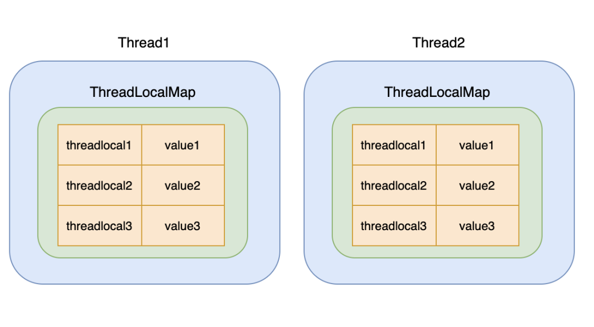


| ThreadLocal                                            | Synchronized         |
| ------------------------------------------------------ | -------------------- |
| 每个线程单独保存一份存储空间,空间换时间                | 阻塞实现, 时间换空间 |
| 线程隔离,只有在线程内才能获取到对应的值                |                      |
| 适合以线程为作用域并且不同线程具有不同的数据副本的场景 |                      |


### ThreadLocalMap

ThreadLocal内部类

每个线程私有一份map的实例, 存储<WeakReference<ThreadLocal<?>>, 变量>的键值对，只有指定线程可以得到存储数据,相较于HashMap,并没有链表的概念


#### 内存泄漏

ThreadLocalMap.table被Thread.threadLocals强引用 -> Entry[]的生命周期和thread一致 -> 即使ThreadLocal对象被GC，Entry[]也不一定被GC -> 内存泄漏

[Entry弱引用的补救](#Entry弱引用)


#### <a name="Entry弱引用">Entry</a>

ThreadLocalMap静态内部类

主键为ThreadLocal的**弱引用**，ThreadLocal很容易被回收导致[null,V], ==在get/set/remove时自动清理key为null的Entry==

```java
static class Entry extends WeakReference<ThreadLocal<?>> { //弱引用
  Object value;
  Entry(ThreadLocal<?> k, Object v) {
    super(k);
    value = v;
  }
}
```


#### 线性探测法解决hash冲突

ThreadLocal的实例的threadLocalHashCode成员变量存储了hashcode, 用于放入map的数组中时通过hash确定存储下标

在遇到hash碰撞时，则会将下标 +1，即**继续往后遍历**Entry数组, **在遍历过程中还会清除已被gc清除掉的弱引用**

这种 hash 冲突的解决效率不高，但是一般 ThreadLocal 也不会太多，所以用这种简单的办法解决即可

```java
private void set(ThreadLocal<?> key, Object value) {
    Entry[] tab = table;
    int len = tab.length;
    int i = key.threadLocalHashCode & (len-1); //每个ThreadLocal实例都有对应的hashCode

    //e!= null时hash冲突,线性探测法不断向后查找元素
    for (Entry e = tab[i]; e != null; e = tab[i = nextIndex(i, len)]) {
        ThreadLocal<?> k = e.get();

        if (k == key) { //hash一致,替换
            e.value = value;
            return;
        }

        if (k == null) { //旧threadLocal已被回收/未使用的Entry
            replaceStaleEntry(key, value, i); //替换,并向后进行探测式数据清理
            return;
        }
    }

    tab[i] = new En try(key, value);
    int sz = ++size;
    if (!cleanSomeSlots(i, sz) && sz >= threshold) //cleanSomeSlots清理被gc的弱引用
        rehash();
}
```


### InheritableThreadLocal

InheritableThreadLocal类是ThreadLocal类的子类

**InheritableThreadLocal允许线程以及该线程创建的所有子线程都可以访问ThreadLocal变量**


Thread 中已经包含了这个成员：

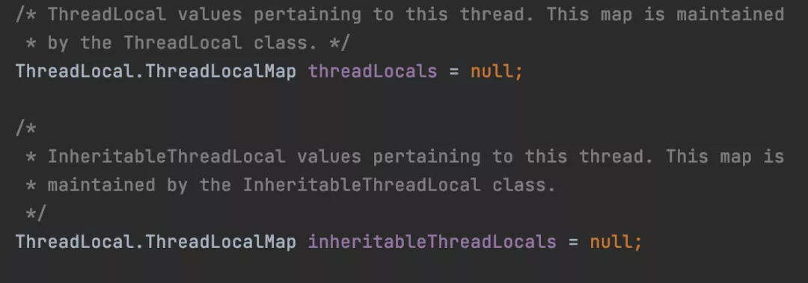

在父线程创建子线程的时候，子线程的构造函数可以得到父线程，然后判断下父线程的 InheritableThreadLocal 是否有值，如果有的话就拷过来。

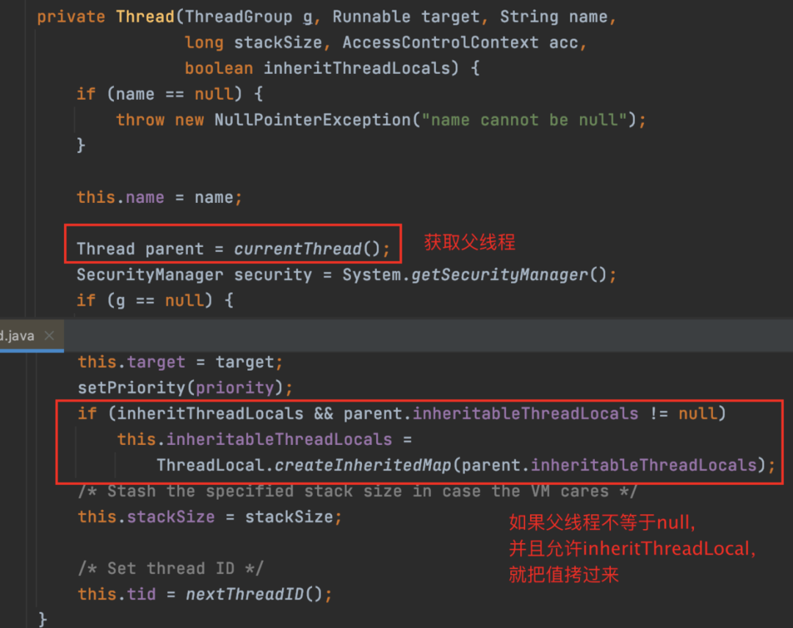

这里要注意，只会在线程创建的时会拷贝 InheritableThreadLocal 的值，之后父线程如何更改，子线程都不会受其影响。


### 为什么用弱引用

引用链: thread -> threadLocalMap -> entry -> threadLocal

线程一般是搭配**线程池**使用的, 这使得线程的**生命周期**与线程池一样长, 同理entry的生命周期也很长. 如果生命周期都很短的话, 那等thread没有引用的时候, 整条链路都会被gc, 也就不用考虑强还是弱引用了, 所以生命周期是使用弱引用的本质原因


key 使用**强引用时**, entry和threadLocal的强引用是一直存在的, 导致**ThreadLocal不会被回收**，进而内存泄漏


**弱引用的目的是让 entry和threadLocal的引用关系 不计入gc的判断中**, 让threadLocal能够顺利地被gc. 而entry虽然不会被gc, 但可以在get/set的向后线性探测过程中赋值为null, 然后被gc


### tomcat中threadLocal的问题

在每次http请求对应一个新线程的情况下, 我们无需考虑threadlocal的生命周期问题

但tomcat是隐式线程池, 多次http请求会**复用同一线程**, 也就是说会拿到上一次执行的值

所以在使用完Threadlocal后, 要显式地remove


### 案例


```java
public static void main(String[] args) throws InterruptedException {
  Thread t = new Thread(() -> test("abc", false));
  t.start();
  t.join();
  System.out.println("--gc后--");
  Thread t2 = new Thread(() -> test("def", true));
  t2.start();
  t2.join();
}

private static void test(String s, boolean isGC) {
  try {
    Thread t = Thread.currentThread(); //存在强引用,在gc后key还在
    ThreadLocal<Object> local = new ThreadLocal<>();
    local.set(s);
    if (isGC) {
      System.gc();
    }

    Field field = t.getClass().getDeclaredField("threadLocals");
    field.setAccessible(true);
    Object ThreadLocalMap = field.get(t);
    Field tableField = ThreadLocalMap.getClass().getDeclaredField("table");
    tableField.setAccessible(true);
    Object[] arr = (Object[]) tableField.get(ThreadLocalMap);
    for (Object o : arr) {
      if (o != null) {
        Class<?> entryClass = o.getClass();
        Field valueField = entryClass.getDeclaredField("value");
        Field referenceField = entryClass.getSuperclass().getSuperclass().getDeclaredField("referent");
        valueField.setAccessible(true);
        referenceField.setAccessible(true);
        System.out.println(String.format("弱引用key:%s,值:%s", referenceField.get(o), valueField.get(o)));
      }
    }
  } catch (Exception e) {
    e.printStackTrace();
  }
}
```


在ThreadLocal没有指向引用时,key在GC后被清除


在threadLocal没有指向引用时,GC将key清理了

也就是说,在**强引用**不存在时，`key`会被回收，但`value`还在，并且永远存在，出现内存泄漏


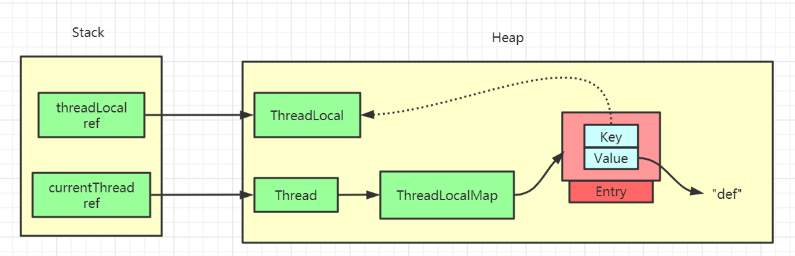


## 锁


**对象锁分为三种：共享资源、this、当前类的字节码文件对象**


当使用锁来协调对某变量的访问时,在所有访问这个变量的方法都需要使用**同一把锁**

不仅仅是在写入才需要锁,只有当所有访问方法都需要持有同一把锁,这个变量才是被锁保护的


对象的内置锁和对象的锁定状态并没有内在的关联,虽然大多数类都以内置锁作为加锁机制,但对象的域并不一定要用内置锁来保护,**内置锁的存在只是为了避免显式地创建锁对象**


仅在方法上加synchronized并不能保证方法的符合操作是原子性的

```java
if(!vector.contains(element))		vector.add(element); //contains和add都是原子方法,但复合的原子操作需要额外的加锁机制
```


### 分类


#### 悲观/乐观


* 悲观
  * 写多读少，每次拿数据的时都上锁，别的线程block

* 乐观
  * 读多写少,对比版本号保证数据是最新的


#### 独占/共享

* 独占
  * 独占锁同时只能被一个线程持有
  * 被加上独占锁后, 其他线程不能加任意类型的锁

* 共享
  * 共享锁同时可以被多个线程持有
  * 共享时只能读, 不能写


**互斥/读写锁是独占/共享锁的一种实现**


#### 同步锁


每个对象都有一个内置锁,一个对象只有一个锁

当程序运行到非静态的 synchronized 同步方法上时，自动获得与正在执行代码类的当前实例（this 实例）有关的锁

获得一个对象的锁也称为获取锁、锁定对象、在对象上锁定或在对象上同步

一个线程获得该锁，就没有其他线程可以获得锁，直到第一个线程释放/返回锁


#### 公平/非公平


公平		按申请锁的顺序排队获取锁

非公平锁	只有一种情况需排队： 当前全局处于读锁 && 等待队列中第一个等待线程想获取写锁，那么当前线程能够获取到读锁的条件为：当前线程获取了写锁，还未释放；当前线程获取了读锁，这一次只是重入读锁而已；其它情况当前线程入队尾


#### 可重入


线程外层函数获得锁后,再进入该线程的内层方法会自动获取锁 **(锁对象是同一个)**

**可以一定程度上避免死锁**

ReentrantLock,synchronized


#### 隐式/显示


区分点在于有没有显示声明锁

隐式:synchronized

显示:lock


#### 自旋

在一个有限的周期内不断重试获取锁

是如果锁的竞争激烈，或者持有锁的线程需要长时间占用锁执行同步块，这时候不适合自旋


- **由于自旋时不释放CPU，因而持有自旋锁的线程应该尽快释放自旋锁，否则等待该自旋锁的线程会一直自旋，浪费CPU时间**

  


### 死锁


多个线程各自占有一部分共享资源,并互相等待


**4个必要条件**	只要打破一个就能避免死锁

* 互斥	一个资源同时被多个进程使用

* 请求与保持	一个进程请求资源而阻塞,对已有的资源保持不释放

* 不剥夺	

* 循环等待	若干个进程之间形成循环等待资源


| 4个必要条件 |                                     |                                  |
| ----------- | ----------------------------------- | -------------------------------- |
| 互斥        | 资源同时被多个进程使用              |                                  |
| 请求与保持  | 进程请求资源时不释放对已有资源      | 一次性申请所有资源               |
| 不剥夺      | 已获得的资源在未使用完前,不会被抢夺 | 申请资源失败时主动释放占有的资源 |
| 循环等待    | 若进程间形成循环等待资源            | 按一定顺序申请资源               |


- 增加超时机制

* 无锁函数（cas）或 重入锁（ReentrantLock）

* 按相同的顺序加锁


==相同加锁顺序,动态的锁对象导致的死锁问题==

> 场景: a,b两个账户之间转账,同时发生了a->b,b->a两次转账

```java
public void transferMoney(Object fromAccount, Object toAccount, Double money) {
  synchronized (fromAccount) {
    synchronized (toAccount) {
      //转账逻辑
    }
  }
}
```

表面上看,加锁顺序都是先fromAccount再toAccount,但这两个线程的入参分别是(a,b)和(b,a),这依然会有死锁的可能性


由于无法控制入参的顺序,可以**将获取锁的循序改为按对象的hashCode排序**.由于存在**hash碰撞**的可能性,在碰撞时还需要借助另一把锁来保证加锁顺序

如果加锁对象包含唯一的,不可变的键值(账户名),那么就不需要借助hash了,也不需要考虑hash碰撞的问题

```java
private static final Object lock = new Object();

public void transferMoney(Object fromAccount, Object toAccount, Double money) {
  int fromHash = System.identityHashCode(fromAccount);
  int toHash = System.identityHashCode(toAccount);

  if (fromHash == toHash) {
    synchronized (lock) { //当hash碰撞时,需要借助另一把锁来保证加锁顺序
      //......
    }
  } else if (fromHash > toHash) {
    synchronized (fromAccount) {
      synchronized (toAccount) {
        //转账逻辑
      }
    }
  } else {
    synchronized (toAccount) {
      synchronized (fromAccount) {
        //转账逻辑
      }
    }
  }
}
```


### 活锁

每个线程都想把资源让给对方

但可能会产生一直将资源让来让去，导致资源在两个线程间跳动而无法使某一线程真正的到资源并执行


### 饥饿

线程一直获取不到资源

**优先级**太低 或 某一线程一直占着某种资源不放


与死锁相比，饥饿有可能在一段时间之后恢复执行


## 多线程的问题


### 线程安全


**线程安全的定义**

某个类的行为与其规范完全一致,当多线程访问这个类时,始终能表现出正确的行为

线程存在不安全性的本质在于 非原子性地操作共享资源

[线程安全的主要体现](#JMM三大特性)


| 阻塞同步      | 非阻塞同步    | 无同步                                                       |
| ------------- | ------------- | ------------------------------------------------------------ |
| synchronized  | CAS           | 栈封闭(局部变量)                                             |
| ReentrantLock | AtomicInteger | Thread Local                                                 |
|               |               | 可重入代码（Reentrant Code）,中断再执行不影响最终结果.要求不依赖公用资源、用到的状态都由参数传入、不调用非可重入的方法 |


#### 数据不一致

每个线程在自己的工作内存交互,内存控制不当会造成数据不一致


#### 阻塞

**减少锁持有时间，读写锁分离，减小锁的粒度，锁分离，锁粗化**


#### Immutable

不可变对象一定是线程安全的

- final 关键字修饰的基本数据类型
- String / 枚举 / Number 部分子类，如 Long / Double / BigInteger / BigDecimal
- Collections.unmodifiableXXX()


#### stateLess

无状态对象一定是线程安全的


无状态不包含任何域,也不包含任何其他类中域的引用

计算过程所产生的变量只作为局部变量,只能由本线程进行访问

无状态 = 线程间不需要共享状态 -> 线程安全


### 竞态条件

当某个计算的正确性取决于多线程的交替执行时,就会产生竞态条件


#### 先检查后执行

Check-Then-Act 通过一个**可能失效的观测结果**来决定下一步的动作


在"去看看他是否在另一家星巴克"方法中,问题点在于无法得知朋友B的具体位置,并且在方法执行过程中朋友的位置也是不可见的


这个案例的竞态条件在于:

要获得正确的结果,依赖于时间的发生顺序

在离开星巴克A -> B 时,在A的观测将失效 (前脚踏出店门,朋友从后门进来了)


为了保证线程安全性,先检查后执行 + 读取-修改-写入 这两个操作必须是原子性的


### 重入

每个锁关联一个计数器和所有者线程

当计数器 = 0,代表锁没有被任何线程持有

线程获取锁时,计数器置为1,并记录持有锁的线程

当线程重入获取锁,计数器自增


线程退出同步代码块,计数器自减

当计数器 = 0,锁被释放


### 如何用锁维护同步

虽然大多数对象都用自己的对象锁进行同步,但**对象锁与对象的同步状态没有必然联系**,对象的域不一定要用自己的对象锁来保护,**某个线程获得对象锁后,只能阻止其他线程获得这把锁,但无法阻止其他线程直接访问这个对象**


> 对于类中可能被多线程访问的所有可变状态变量,都应当只由同一把锁控制同步
>
> 从而避免维护代码时不清楚要用哪个锁


同步代码块中也可能出现竞态条件问题

```java
if(!vector.contains(e))
  vector.add(e);
```

虽然vector的方法都被synchronized修饰,但判断 vector中不存在则插入 的逻辑依然存在竞态条件问题


滥用同步来控制代码流程也会出现 活跃性问题/性能问题


### 线程通信


wait + notify

都是Object的方法,只能在同步方法或同步代码块中**成对使用**,否则抛出IIIegalMonitorStateException


#### 管程法

生产者把产品放入**缓冲区**,消费者从缓冲区拿

每次操作时判断缓冲区的容量,满了则不生产,空了则不消费


#### 信号灯法

判断**标志位**,如果为真,等待,如果为假,唤醒

每次进行操作时判断标志位,决定wait或者是执行


### 同步/并发容器


| 同步容器                    | 并发容器                                                     |      |
| --------------------------- | ------------------------------------------------------------ | ---- |
| 锁粒度为对象整体。快速失败  | 粒度细,区分读写,迭代器具有弱一致性，即可以容忍并发修改，不会抛出ConcurrentModificationException |      |
| Hashtable                   | ConcurrentXXX                                                |      |
| Collections.synchronizedXxx |                                                              |      |
| Vector                      |                                                              |      |
|                             |                                                              |      |
|                             |                                                              |      |
|                             |                                                              |      |


#### 三、阻塞队列

主要代表有LinkedBlockingQueue、ArrayBlockingQueue、PriorityBlockingQueue(Comparable,Comparator)、SynchronousQueue

提供了可阻塞的put和take方法，以及支持定时的offer和poll方法。适用于生产/消费者模式


#### 四、双端队列

主要代表有ArrayDeque和LinkedBlockingDeque。适用于工作密取模式，每个消费者都有各自的双端队列。当消费者完成了自己双端队列中的全部工作，那么他就可以从其他消费者的双端队列末尾秘密的获取工作。具有更好的可伸缩性，因为工作者线程不会在单个共享的任务队列上发生竞争。在大多数时候，他们都只是访问自己的双端队列，从而极大的减少了竞争。当工作者线程需要访问另一个队列时，它会从队列的尾部而不是头部获取工作，因此进一步降低了队列上的竞争


#### 五、比较及适用场景


如果不需要阻塞队列，优先选择ConcurrentLinkedQueue

如果需要阻塞队列，队列大小固定优先选择ArrayBlockingQueue

队列大小不固定优先选择LinkedBlockingQueue

如果需要对队列进行排序，选择PriorityBlockingQueue

如果需要一个快速交换的队列，选择SynchronousQueue

如果需要对队列中的元素进行延时操作，则选择DelayQueue


## volatile

[只保证变量的可见性,不保证操作的原子性](#JMM三大特性) -> ==针对变量弱同步，不保证线程安全==,static不是可见的

==修饰引用变量时,引用不变不刷新至主内存==


**两条实现原则**

1.Lock前缀指令会引起处理器缓存回写到内存
当对volatile变量进行写操作的时候，JVM会向处理器发送一条lock前缀的指令，将缓存中的变量回写到主存

2.一个处理器的缓存回写会导致其他处理器的缓存失效
处理器使用嗅探技术保证内部缓存/系统内存/其他处理器的缓存的数据在总线上保持一致


**内存语义**

* 写入时，JMM把工作内存中的**变量值立即刷新到主内存,并通知其他线程**(线程通信)
  * 其他线程放弃工作内存中的副本，重新去主内存获取
* 产生==内存屏障==，防止指令重排
* volatile 变量不会被缓存在寄存器/处理器不可见的地方，读volatile变量时总会返回最新的值


### 内存屏障


JSR内存屏障协议:	Load/Storage 读/写屏障

- LoadLoad	两个LoadLoad指令不能重排,下面同理
- StoreStore
- LoadStore
- StoreLoad

内存屏障防止Volatile修饰的关键字指令不会重排序,底层是loadfence/storefence原语指令


**实现机制**

把 volatile变量和非volatile变量都生成汇编代码，会发现 volatile 变量多出一个 lock 前缀指令


1.在每个volatile写操作前插入StoreStore屏障；对于这样的语句Store1; StoreLoad; Store2，在Store2及后续写入操作执行前，保证Store1的写入操作对其它处理器可见
2.在每个volatile写操作后插入StoreLoad屏障；对于这样的语句Store1; StoreLoad; Load2，在Load2及后续所有读取操作执行前，保证Store1的写入对所有处理器可见
3.在每个volatile读操作前插入LoadLoad屏障；对于这样的语句Load1;LoadLoad; Load2，在Load2及后续读取操作要读取的数据被访问前，保证Load1要读取的数据被读取完毕
4.在每个volatile读操作后插入LoadStore屏障；对于这样的语句Load1; LoadStore; Store2，在Store2及后续写入操作被刷出前，保证Load1要读取的数据被读取完毕


### volatile VS synchronized


| volatile                              | synchronized         |
| ------------------------------------- | -------------------- |
| 非锁定,性能高                         | 锁机制,锁升级        |
| **只能用于变量**                      | **方法/代码块/变量** |
| ==变量可见性==,内存屏障->禁止指令重排 | 访问资源的同步性     |
| 不保证原子性                          | 原子性               |


## synchronized

**悲观+不公平+可重入	无锁/自旋/互斥信号量**

线程进入BLOCKED状态，争夺到锁后恢复为RUNNABLE状态，==退出或异常时自动释放锁==


synchronized无法禁止[指令重排](#指令重排),不保证线程写入数据对其他线程可见,需要依赖volatile保证有序


==不能锁定String常量==	类库需要使用String,锁定后可能会死锁(与类库同一线程)

==锁定的对象不可变,需要进行final修饰== -> ==不能锁定Integer/Long==,Integer被特殊处理过,值发生变化时是新对象


用于**对象/方法(实例+静态方法)**,==不能同步变量==

**普通同步方法，锁类当前的实例对象**,==相同实例在调用方法时会阻塞==

**静态同步方法，锁当前类的class对象**,==不同实例在调用方法时也会阻塞==

```java
synchronized (xxx.class) {}	//锁class对象
public synchronized static void fun() {}	//锁class对象

public synchronized void func () {}	//锁类的实例对象
synchronized (xxx) {}	//锁实例对象
```


### 原理


##### 修饰变量时

每个对象都是监视器（Monitor）= 锁（lock）+ 等待队列（waiting queue）+ 入口队列(entry queue)

对象的非同步方法可以被任意数量的线程，在任意时刻调用


通过**monitorenter + monitorexit**两个字节码指令组成的

monitorenter : 同步开始,线程尝试获取锁(monitor)。计数器0则成功获取，获取后设为1

monitorexit : 同步结束,将锁计数器设为0，表明锁被释放

==monitor对象存在于每个Java对象的对象头中== -> Java中任意对象都可以作为锁


##### 修饰方法时

并没有**monitorenter + monitorexit 指令**

取而代之的是`ACC_SYNCHRONIZED`标识,JVM 通过该 `ACC_SYNCHRONIZED` 访问标志来辨别一个方法是否声明为同步方法，从而执行相应的同步调用


不过两者的本质都是对对象监视器 monitor 的获取


### 锁升级


**对象头8字节**


#### 无锁 001

unlocked


#### 偏向锁 101

整个生命周期内**不存在竞争,无需CAS**,一旦竞争升级为轻量级锁


1. 第一次申请锁,偏向标志位 0 -> 1
2. LockRecord记录对象hash
3. MarkWord的54位变为栈指针,指向LockRecord


#### 轻量级锁 00

1. 发生竞争,撤销偏向锁
2. 创建在栈中的Lock Record区域，存放锁对象的Mark Word
3. **CAS自旋**地将 对象头的62位变成指针,指向栈中的LockRecord


#### 自适应自旋锁 01

Adapative Self Spinning

CAS避免同步 -> 自旋的巨大开销 -> 自旋超过10次/自旋线程超过cpu核数一半 时升级为重量级锁 (**Jvm控制,无法修改)**


==在未升级为重量级之前,申请锁只运行在用户态==,但不一定效率高,因为自旋锁大量消耗cpu资源,可能会比重量级锁更慢


#### 重量级锁 10

* 在**内核态**中,锁为mutex互斥资源(重量级锁),用户态在申请锁时可能出现锁被分配完的情况
* 升级至重量级锁将进入操作系统的等待队列,等待操作系统主动调用,不需要像自旋那样占用cpu时间
* 适合操作时间长的方法,避免其他线程自旋过久


#### GC 11

==锁只在GC时降级,此时已经没有对象指向它了,降级没有意义==


### 锁消除 eliminate

对于被检测出不存在竞争的共享数据锁进行消除

1. ==线程私有变量被同步,会自动锁消除==

2. 通过**逃逸分析**，堆上的共享数据不可能被其它线程访问，锁消除


对于看起来没有加锁的代码，其实隐式的加了锁。例如下字符串拼接

```java
public static String concatString(String s1, String s2, String s3) {
  return s1 + s2 + s3;
}
```


String 不可变，编译器会对 String 拼接自动优化。在 JDK 1.5 之前，会转化为 StringBuffer 对象的连续 append() 操作：

```java
public static String concatString(String s1, String s2, String s3) {
    StringBuffer sb = new StringBuffer();
    sb.append(s1);
    sb.append(s2);
    sb.append(s3);
    return sb.toString();
}
```

每个 append() 都进行了同步。虚拟机观察变量 sb，很快就会发现它的动态作用域被限制在 concatString() 方法内部。也就是说，sb 的所有引用永远不会逃逸到 concatString() 方法之外，其他线程无法访问，因此锁消除


### 锁粗化

JVM探测到频繁对同一个对象加锁，将会把加锁的范围粗化到整个操作的外部

StringBuffer.append就进行了粗化


在这种情况下, doSth()整个方法都会被加锁同步

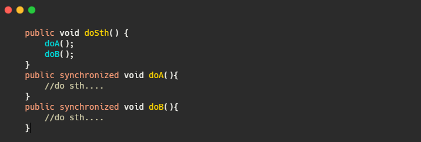


### synchronized VS lock


| 类别         | synchronized                | Lock                                       |
| :----------- | :-------------------------- | :----------------------------------------- |
|              | jvm关键字                   | jdk接口                                    |
| 锁的释放     | jvm**自动**释放             | finally**手动释放**                        |
| 等待/通知    | wait()+notify(),JVM随机唤醒 | **一个lock绑定多个condition对象**,指定唤醒 |
| 获取锁的状态 | 无法得知是否成功获取        | tryLock得知是否成功获取                    |
| 锁类型       | **重入** ==非公平+悲观==    | **重入** ==公平/不公平== CAS               |
|              |                             | tryLock**限时**                            |
|              | 隐式                        | 显式                                       |
|              |                             | **没有方法锁**                             |
| 响应中断     | 不能响应中断                | 响应中断lockInterruptibly()                |


## Lock


**乐观锁**

**需要显式lock()/unlock()**成对出现,否则死锁

能完成synchronized的所有功能,更具扩展性,有更精确的线程语义和更好的性能,可以公平锁


```java
public interface Lock {

  void lock();
  void lockInterruptibly() throws InterruptedException;
  boolean tryLock();
  boolean tryLock(long time, TimeUnit unit) throws InterruptedException;

  void unlock();

  Condition newCondition();
}
```


【强制】==在阻塞等待获取锁时，lock()必须在try代码块之外==，并且在加锁方法与try代码块之间没有任何可能抛出异常的方法调用，避免加锁成功后，在 finally 中无法解锁

```java
Lock lock = new XxxLock();
lock.lock();	//lock 方法实现中可能抛出 unchecked 异常
//lock()和try之间不能有可能抛出异常的代码,避免无法解锁
try {
  doSomething();	//将可能异常的代码放入try,在finally解锁
} finally {
  lock.unlock();	//可能出现lock()抛出unchecked异常,加锁失败,但unlock()对无锁对象解锁,进而调用AQS 的tryRelease 方法（取决于实现类），抛出IllegalMonitorStateException异常
}

//反例
Lock lock = new XxxLock();
try {
  doSomething();	// 如果此处抛出异常，则直接执行 finally 代码块,导致unlock()对无锁对象解锁
  lock.lock();
} finally {
  lock.unlock();
}
```


### ReentrantLock


重入独占:当前持有该锁的线程能够多次获取锁，无需等待

自旋锁:CAS

通过避免线程进入内核态的阻塞状态来提高性能


```java
public ReentrantLock() {
  sync = new NonfairSync();	//默认非公平
}

public ReentrantLock(boolean fair) {	//也提供公平锁
  sync = fair ? new FairSync() : new NonfairSync();
}
```


#### Sync

```java
abstract static class Sync extends AbstractQueuedSynchronizer {
  
}
```


##### tryRelease

```java
protected final boolean tryRelease(int releases) {
  int c = getState() - releases;
  if (Thread.currentThread() != getExclusiveOwnerThread())
    throw new IllegalMonitorStateException();
  boolean free = false;
  if (c == 0) {
    free = true;
    setExclusiveOwnerThread(null);	//当前线程设置为null
  }
  setState(c);	//state设为0
  return free;
}
```


##### newCondition

```java
final ConditionObject newCondition() {
  return new ConditionObject();
}
```


#### NonfairSync

```java
static final class NonfairSync extends Sync {
  final void lock() {
    if (compareAndSetState(0, 1))	//直接尝试获取锁，无视同步队列
      setExclusiveOwnerThread(Thread.currentThread());
    else acquire(1);	//直接获取失败时,才进入同步队列
  }

  protected final boolean tryAcquire(int acquires) {
    return nonfairTryAcquire(acquires);
  }

  final boolean nonfairTryAcquire(int acquires) {
    final Thread current = Thread.currentThread();

    int c = getState();
    if (c == 0) {
      //没有hasQueuedPredecessors(),不判断当前线程是否为head.next，也不判断当前线程是否在同步队列中     
      if (compareAndSetState(0, acquires)) {
        setExclusiveOwnerThread(current);
        return true;
      }
    }
    else if (current == getExclusiveOwnerThread()) {	//可重入的体现
      int nextc = c + acquires;	//state++
      setState(nextc);
      return true;
    }
    return false;
  }
}
```


#### FairSync

```java
static final class FairSync extends Sync {
  final void lock() { acquire(1); }

  protected final boolean tryAcquire(int acquires) {
    final Thread current = Thread.currentThread();
    int c = getState();
    if (c == 0) {
      if (!hasQueuedPredecessors() //队列里面没有线程在等待,才CAS改变state
          && compareAndSetState(0, acquires)) {
        setExclusiveOwnerThread(current);
        return true;
      }
    }
    else if (current == getExclusiveOwnerThread()) {
      int nextc = c + acquires;
      setState(nextc);
      return true;
    }
    return false;
  }
}
```


#### Fair VS NotFair

1. 非公平锁在调用 lock 后，首先会调用 CAS抢锁，成功则直接获取到锁返回
2. 非公平锁在 CAS 失败后，和公平锁一样都会进入到 `tryAcquire` 方法，在 `tryAcquire` 方法中，如果发现锁这个时候被释放了（state == 0），非公平锁会直接 CAS抢锁，但公平锁会判断等待队列是否有线程等待

3. 如果这两次 CAS 都失败，非公平锁也和公平锁一样进入到阻塞队列等待唤醒

相对来说，非公平锁会有更好的性能，因为它的吞吐量比较大。当然，非公平锁让获取锁的时间变得更加不确定，可能会导致在阻塞队列中的线程长期处于饥饿状态


#### lock

```java
public void lock() {
  sync.lock();
}
```


#### unlock

```java
public void unlock() {
  sync.release(1);
}
```


### ReentrantReadWriteLock

**读读共享、写写互斥、读写互斥**  适用于写多读少	在写少读多时,将阻塞过多的读操作

在ReentrantLock的基础上, 将**state分为了两部分**，高16bit用于标识读状态、低16bit标识写状态


**进入读锁的前提条件**：没有其他线程的写锁 || 自身持有写锁

**进入写锁的前提条件**：没有其他线程的读/写锁 && **该线程未持有读锁**   (在获取写锁时, 不允许同一时刻有任何线程持有读锁,包括自身的线程)


- **锁降级** 线程占有写锁时，还能继续获得读锁, 若此时释放了写锁, 则只持有读锁, 相当于写锁降级为读锁
- **不支持锁升级** 在线程持有读锁时, 再去**获取写锁前需要释放自身的读锁**, 否则视为读写互斥
- 读锁不允许newConditon获取Condition接口，而写锁的newCondition接口实现方法同ReentrantLock


#### Sync

**state高16位表示读锁，低16位表示写锁**,读/写的state最大值均为65535，即所有获得了锁的线程的拿到锁的总次数(由于是重入锁，每个线程可以拿到n个锁)

由于读写锁主要的应用场景为多读少写，可以重写state的前24位为读锁，后8位为写锁

sharedCount!=0 表示分配了读锁，exclusiveCount != 0 表示分配了写锁

sharedCount和exclusiveCount 一般不会同时不为 0，==只有当线程占用了写锁，才可以重入获取读锁，反之不成立==


```java
abstract static class Sync extends AbstractQueuedSynchronizer {

  static final int SHARED_SHIFT   = 16;
  // 由于读锁用高位部分，所以读锁个数+1 = 状态值+ 2^16
  static final int SHARED_UNIT    = (1 << SHARED_SHIFT);
  // 写锁的可重入的最大次数、读锁允许的最大数量
  static final int MAX_COUNT      = (1 << SHARED_SHIFT) - 1;
  // 写锁掩码，用于状态的低16位有效值
  static final int EXCLUSIVE_MASK = (1 << SHARED_SHIFT) - 1;
  // 读锁计数，当前持有读锁的线程数
  static int sharedCount(int c)    { return c >>> SHARED_SHIFT; }
  // 写锁计数(重入次数)
  static int exclusiveCount(int c) { return c & EXCLUSIVE_MASK; }

  //每个线程特定的 read 持有计数。存放在ThreadLocal，不需要线程安全
  static final class HoldCounter {
    int count = 0;
    // 使用id而不是引用,避免保留垃圾。注意这是个常量
    final long tid = getThreadId(Thread.currentThread());
  }

  //采用继承来重写 initialValue()	这样就不用进行这样的处理：如果ThreadLocal没有当前线程的计数，则new一个，再放进ThreadLocal里。
  static final class ThreadLocalHoldCounter extends ThreadLocal<HoldCounter> {
    public HoldCounter initialValue() {
      return new HoldCounter();
    }
  }

  //保存当前线程重入读锁的次数的容器。在读锁重入次数为 0 时移除
  private transient ThreadLocalHoldCounter readHolds;

  //最近一个成功获取读锁的线程的计数。通常情况下，下一个释放线程是最后一个获取线程,节约查找时间
  private transient HoldCounter cachedHoldCounter;

  //firstReader是最后一个把 共享计数 从 0 -> 1 并且还未释放锁 的线程,如果不存在则为null
  * firstReader 不能导致gc失败保留垃圾，因此在 tryReleaseShared 里设置为null
    * firstReader及其计数firstReaderHoldCount是不会放入 readHolds 的
    */
    private transient Thread firstReader = null;

  private transient int firstReaderHoldCount;	//firstReader 的重入计数

  Sync() {
    readHolds = new ThreadLocalHoldCounter();
    setState(getState()); // 利用 volatile 确保 readHolds 的内存可见性
  }
}
```


Sync中有两个方法是抽象的，子类必须实现

```java
//公平模式
static final class FairSync extends Sync {
  //writerShouldBlock和readerShouldBlock方法都表示当有别的线程也在尝试获取锁时，是否应该阻塞
  final boolean writerShouldBlock() {
    //对于公平模式，hasQueuedPredecessors()表示等待队列是否还有线程。一旦有，当前线程也该被挂起
    return hasQueuedPredecessors();
  }
  final boolean readerShouldBlock() {
    return hasQueuedPredecessors();
  }
}

//非公平模式
static final class NonfairSync extends Sync {
  // 写线程不公平,不需要阻塞,允许闯入
  final boolean writerShouldBlock() {    return false; }
  final boolean readerShouldBlock() {		return apparentlyFirstQueuedIsExclusive();  }
}

//当head.next是独占线程，为了防止独占线程(写线程)饥饿等待，则后入线程排队，否则可以闯入
//也就是说,head.next想获取写锁，则读线程阻塞
final boolean apparentlyFirstQueuedIsExclusive() {
  Node h, s;
  return (h = head) != null &&
    (s = h.next)  != null &&
    !s.isShared()         &&
    s.thread != null;
}
```


==如果当前全局处于读锁状态，且等待队列中第一个等待线程想获取写锁，那么当前线程能获取读锁的条件为==

1. 当前线程获取了写锁，还未释放
2. 当前线程获取了读锁，进行重入读锁

其它情况当前线程入队尾。这样处理提高效率，也避免想获取写锁的线程饥饿，得不到执行机会


例如：C请求写锁，由于当前AB拥有读锁，写锁获取失败，线程C入队列,阻塞并等待其他线程释放锁唤醒


此时线程D想获取读锁，上面规则，队列中第一个等待线程C请求写锁，为避免写锁迟迟获取不到，并且D不是重入获取读锁，所以D也入队


#### 获取读锁


在以下几种情况，获取读锁会失败：

（1）有线程持有写锁，且该线程不是当前线程

（2）写锁空闲 且  公平策略决定 读线程应当被阻塞，除了重入获取，其他获取读锁失败

（3）读锁数量max，抛出异常

除了以上三种情况，该线程会循环尝试获取读锁直到成功

```java
public final void acquireShared(int arg){
  if(tryAcquireShared(arg) < 0){  // 调用子类, 获取共享 lock  返回 < 0, 表示失败
    doAcquireShared(arg);       // 调用 doAcquireShared 当前 线程加入 Sync Queue 里面, 等待获取 lock
  }
}

protected final int tryAcquireShared(int unused) {
  Thread current = Thread.currentThread();
  int c = getState();
  //有线程持有写锁，且该线程不是当前线程，获取锁失败
  if (exclusiveCount(c) != 0 && getExclusiveOwnerThread() != current)    return -1;

  //获取读锁计数
  int r = sharedCount(c);
  //不应该阻塞 && 读锁数<MAX_COUNT && 设置state成功 -> 获取锁成功
  if (!readerShouldBlock() &&   r < MAX_COUNT && compareAndSetState(c, c + SHARED_UNIT)) {
    if (r == 0) {
      //下面对firstReader的处理：firstReader是不会放到readHolds里的，这样，在读锁只有一个的情况下，就避免了查找readHolds
      firstReader = current;
      firstReaderHoldCount = 1;
    } else if (firstReader == current) {
      firstReaderHoldCount++;

      ///非 firstReader 读锁重入计数更新
    } else {
      HoldCounter rh = cachedHoldCounter;
      if (rh == null || rh.tid != current.getId())
        cachedHoldCounter = rh = readHolds.get();
      else if (rh.count == 0)
        readHolds.set(rh);
      rh.count++;
    }
    return 1;
  }
  //获取读锁失败，放入循环重试
  return fullTryAcquireShared(current);
}


final int fullTryAcquireShared(Thread current) {
  HoldCounter rh = null;
  for (;;) {
    int c = getState();
    if (exclusiveCount(c) != 0) {
      if (getExclusiveOwnerThread() != current)
        return -1;     //1.有线程持有写锁，且该线程不是当前线程，获取锁失败
      //2.有线程持有写锁，且该线程是当前线程，则应该放行让其重入获取锁，否则会造成死锁。
    } else if (readerShouldBlock()) {
      //3.写锁空闲  且  公平策略决定 读线程应当被阻塞
      // 下面的处理是说，如果是已获取读锁的线程重入读锁时，
      // 即使公平策略指示应当阻塞也不会阻塞。
      // 否则，这也会导致死锁的。
      if (firstReader == current) {
        // assert firstReaderHoldCount > 0;
      } else {
        if (rh == null) {
          rh = cachedHoldCounter;
          if (rh == null || rh.tid != current.getId()) {
            rh = readHolds.get();
            if (rh.count == 0)
              readHolds.remove();
          }
        }
        //4.需要阻塞且是非重入(还未获取读锁的)，获取失败。
        if (rh.count == 0)
          return -1;
      }

    }
    //5.写锁空闲  且  公平策略决定线程可以获取读锁
    if (sharedCount(c) == MAX_COUNT)//6.读锁数量达到最多
      throw new Error("Maximum lock count exceeded");
    //7. 申请读锁成功，下面的处理跟tryAcquireShared是类似的。
    if (compareAndSetState(c, c + SHARED_UNIT)) {
      if (sharedCount(c) == 0) {
        firstReader = current;
        firstReaderHoldCount = 1;
      } else if (firstReader == current) {
        firstReaderHoldCount++;
      } else {
        if (rh == null)
          rh = cachedHoldCounter;
        if (rh == null || rh.tid != current.getId())
          rh = readHolds.get();
        else if (rh.count == 0)
          readHolds.set(rh);
        rh.count++;
        cachedHoldCounter = rh; // cache for release
      }
      return 1;
    }
  }
}
```


#### 获取共享lock


```java
private void doAcquireShared(int arg){
  final Node node = addWaiter(Node.SHARED);       // 1. 将当前的线程封装成 Node 加入到 Sync Queue 里面
  boolean failed = true;

  try {
    boolean interrupted = false;
    for(;;){
      final Node p = node.predecessor();      // 2. 获取当前节点的前继节点 (当一个n在 Sync Queue 里面, 并且没有获取 lock 的 node 的前继节点不可能是 null)
      if(p == head){
        int r = tryAcquireShared(arg);      // 3. 判断前继节点是否是head节点(前继节点是head, 存在两种情况 (1) 前继节点现在占用 lock (2)前继节点是个空节点, 已经释放 lock, node 现在有机会获取 lock); 则再次调用 tryAcquireShared 尝试获取一下
        if(r >= 0){
          setHeadAndPropagate(node, r);   // 4. 获取 lock 成功, 设置新的 head, 并唤醒后继获取  readLock 的节点
          p.next = null; // help GC
          if(interrupted){               // 5. 在获取 lock 时, 被中断过, 则自己再自我中断一下(外面的函数可能需要这个参数)
            selfInterrupt();
          }
          failed = false;
          return;
        }
      }

      if(shouldParkAfterFailedAcquire(p, node) && // 6. 调用 shouldParkAfterFailedAcquire 判断是否需要中断(这里可能会一开始 返回 false, 但在此进去后直接返回 true(主要和前继节点的状态是否是 signal))
         parkAndCheckInterrupt()){           // 7. 现在lock还是被其他线程占用 那就睡一会, 返回值判断是否这次线程的唤醒是被中断唤醒
        interrupted = true;
      }
    }
  }finally {
    if(failed){             // 8. 在整个获取中出错(比如线程中断/超时)
      cancelAcquire(node);  // 9. 清除 node 节点(清除的过程是先给 node 打上 CANCELLED标志, 然后再删除)
    }
```


独占锁模式获取成功以后设置头结点然后返回中断状态，结束流程。而共享锁模式获取成功以后，调用了setHeadAndPropagate方法，从方法名就可以看出除了设置新的头结点以外还有一个传递动作，一起看下代码：


```java
//两个入参，一个是当前成功获取共享锁的节点，一个就是tryAcquireShared方法的返回值，注意上面说的，它可能大于0也可能等于0
private void setHeadAndPropagate(Node node, int propagate) {
  Node h = head; //记录当前头节点
  //设置新的头节点，即把当前获取到锁的节点设置为头节点
  //注：这里是获取到锁之后的操作，不需要并发控制
  setHead(node);
  //这里意思有两种情况是需要执行唤醒操作
  //1.propagate > 0 表示调用方指明了后继节点有可能需要被唤醒，因为此方法是获取读锁过程调用，那么后面节点很可能也要获取读锁
  //2.头节点后面的节点需要被唤醒（waitStatus<0），不论是老的头结点还是新的头结点
  if (propagate > 0 || h == null || h.waitStatus < 0) {
    Node s = node.next;
    //如果当前节点的后继节点是共享类型获取没有后继节点，则进行唤醒
    //这里可以理解为除非明确指明不需要唤醒（后继等待节点是独占类型），否则都要唤醒
    //这里的初衷是   后一个节点正好是共享节点，就唤醒，实现共享，独占有锁释放时候唤醒
    if (s == null || s.isShared())
      //后面详细说
      doReleaseShared();
  }
}

private void setHead(Node node) {
  head = node;
  node.thread = null;
  node.prev = null;
}
```


这个唤醒操作在releaseShared()方法里也会调用。唤醒后面想获取锁的节点


```java
private void doReleaseShared() {
  for (;;) {
    //唤醒操作由头结点开始，注意这里的头节点已经是上面新设置的头结点了
    //其实就是唤醒上面新获取到共享锁的节点的后继节点
    Node h = head;
    if (h != null && h != tail) {
      int ws = h.waitStatus;
      //表示后继节点需要被唤醒
      if (ws == Node.SIGNAL) {
        //这里需要控制并发，因为入口有setHeadAndPropagate跟releaseShared两个，避免两次unpark
        if (!compareAndSetWaitStatus(h, Node.SIGNAL, 0))
          continue;      
        //执行唤醒操作      
        unparkSuccessor(h);
      }
      //如果后继节点暂时不需要唤醒，则把当前节点状态设置为PROPAGATE确保以后可以传递下去
      else if (ws == 0 &&
               !compareAndSetWaitStatus(h, 0, Node.PROPAGATE))
        continue;                
    }
    //如果头结点没有发生变化，表示设置完成，退出循环
    //如果头结点发生变化，比如说其他线程获取到了锁，为了使自己的唤醒动作可以传递，必须进行重试
    if (h == head)                   
      break;
  }
```


#### 读锁的释放


```java
public final boolean releaseShared(int arg) {
  if (tryReleaseShared(arg)) {
    doReleaseShared();
    return true;
  }
  return false;
}

//释放锁tryReleaseShared由子类Sync实现
protected final boolean tryReleaseShared(int unused) {
  Thread current = Thread.currentThread();
  // 清理firstReader缓存 或 readHolds里的重入计数
  if (firstReader == current) {
    // assert firstReaderHoldCount > 0;
    if (firstReaderHoldCount == 1)
      firstReader = null;
    else
      firstReaderHoldCount--;
  } else {
    HoldCounter rh = cachedHoldCounter;
    if (rh == null || rh.tid != current.getId())
      rh = readHolds.get();
    int count = rh.count;
    if (count <= 1) {
      // 完全释放读锁
      readHolds.remove();
      if (count <= 0)
        throw unmatchedUnlockException();
    }
    --rh.count; // 主要用于重入退出
  }
  // 循环在CAS更新状态值，主要是把读锁数量减 1
  for (;;) {
    int c = getState();
    int nextc = c - SHARED_UNIT;
    if (compareAndSetState(c, nextc))
      // 释放读锁对其他读线程没有任何影响，
      // 但可以允许等待的写线程继续，如果读锁、写锁都空闲。
      return nextc == 0;
  }
}
```


#### 写锁的获取


写锁的获取和ReentrantLock独占锁的锁获取过程几乎一样，除了tryAcquire()要考虑读锁的情况

在以下情况，写锁获取失败：

（1） 写锁为0，读锁不为0   或者写锁不为0，且当前线程不是已获取独占锁的线程，锁获取失败。

（2）写锁数量已达到最大值，写锁获取失败。

（3）当前线程应该阻塞，或者设置同步状态state失败，获取锁失败


```java
public final void acquire(int arg) {
  if (!tryAcquire(arg) &&
      acquireQueued(addWaiter(Node.EXCLUSIVE), arg))
    selfInterrupt();
}


protected final boolean tryAcquire(int acquires) {
  Thread current = Thread.currentThread();
  int c = getState();
  int w = exclusiveCount(c);
  if (c != 0) {
    // 1.写锁为0，读锁不为0    或者写锁不为0，且当前线程不是已获取独占锁的线程，锁获取失败
    if (w == 0 || current != getExclusiveOwnerThread())
      return false;
    //2. 写锁数量已达到最大值，写锁获取失败
    if (w + exclusiveCount(acquires) > MAX_COUNT)
      throw new Error("Maximum lock count exceeded");
    // Reentrant acquire
    setState(c + acquires);
    return true;
  }
  //3.当前线程应该阻塞，或者设置同步状态state失败，获取锁失败。
  if (writerShouldBlock() ||
      !compareAndSetState(c, c + acquires))
    return false;
  setExclusiveOwnerThread(current);
  return true;
}
```


#### 写锁的释放


```java
public final boolean release(int arg) {
  if (tryRelease(arg)) {
    Node h = head;
    if (h != null && h.waitStatus != 0)
      unparkSuccessor(h);
    return true;
  }
  return false;
}

protected final boolean tryRelease(int releases) {
  if (!isHeldExclusively())
    throw new IllegalMonitorStateException();
  int nextc = getState() - releases;
  boolean free = exclusiveCount(nextc) == 0;
  if (free)
    setExclusiveOwnerThread(null);
  setState(nextc);
  return free;
}
```


读写锁还提供了一些新的方法，比如final int getReadHoldCount()，返回当前线程获取读锁的次数。由于读状态保存的是所有获取读锁的线程读锁次数的总和，因此每个线程自己的读锁次数需要单独保存，引入了ThreadLocal，由线程自身维护


#### lockInterruptibly

```JAVA
public void lockInterruptibly() throws InterruptedException {
  sync.acquireInterruptibly(1);	//可中断地获取锁
}

public final void acquireInterruptibly(int arg) throws InterruptedException {
  if (Thread.interrupted())	throw new InterruptedException();
  if (!tryAcquire(arg))	doAcquireInterruptibly(arg);
}

private void doAcquireInterruptibly(int arg) throws InterruptedException {
  final Node node = addWaiter(Node.EXCLUSIVE);
  boolean failed = true;
  try {
    for (;;) {
      final Node p = node.predecessor();	//前继节点
      if (p == head && tryAcquire(arg)) {
        setHead(node);
        p.next = null; // help GC
        failed = false;
        return;
      }
      if (shouldParkAfterFailedAcquire(p, node) && parkAndCheckInterrupt())
        throw new InterruptedException();
    }
  } finally {
    if (failed)
      cancelAcquire(node);
  }
}

private final boolean parkAndCheckInterrupt() {
  LockSupport.park(this);	//用LockSupport中断
  return Thread.interrupted();
}
```


### LockSupport

线程阻塞工具类，**都是静态方法**，让线程在任意位置阻塞/唤醒


**Permit许可**

每个线程都有许可(permit),可视为(0,1)信号量，默认0，但**与Semaphore不同的是，permit不能累加**


park() + unpark(thread)实现阻塞/唤醒


#### setBlocker

blocker记录线程被谁阻塞,用于线程监控和分析

```java
private static void setBlocker(Thread t, Object arg) {
  UNSAFE.putObject(t, parkBlockerOffset, arg);
}
```


#### LockSupport VS Object VS Condition


如果没有LockSupport,线程阻塞一般以加锁/阻塞队列来实现,难以唤醒指定线程


| LockSupport                                | Wait/Notify                     | Condition |
| ------------------------------------------ | ------------------------------- | --------- |
| 不需要在同步方法中调用,不依赖对象锁,性能高 | 必须在同步方法中调用,需要对象锁 |           |
| unpark指定线程唤醒                         | 随机唤醒                        |           |
| **可以提前unpark,不会死锁**                | 先Notify再wait,就死锁           |           |


```java
Thread t1 = new Thread(() -> {
  LockSupport.park();
  LockSupport.park();//因为permit=1,上一行已经使用了permit,第二个park()会导致程序处于一直等待的状态
}, "A");
t1.start();

//多次unPark(),permit=1,不会累加
Thread t2 = new Thread(() -> LockSupport.unpark(t1), "B");
t2.start();
```


### Condition

==通过Lock.newCondition创建==

Condition接口把`wait, notify, notifyAll`分解到不同的对象，搭配Lock使得一个对象可以拥有多个**等待集**

基于同一个锁，实现多个条件的 挂起/唤醒


Object和Condition接口的对比


==每个condition对象都包含一个FIFO的等待队列==。队列中的每个节点都包含了一个线程引用(在condition上等待的线程)


Lock拥有一个同步队列,condition让Lock可以自定义若干个等待队列

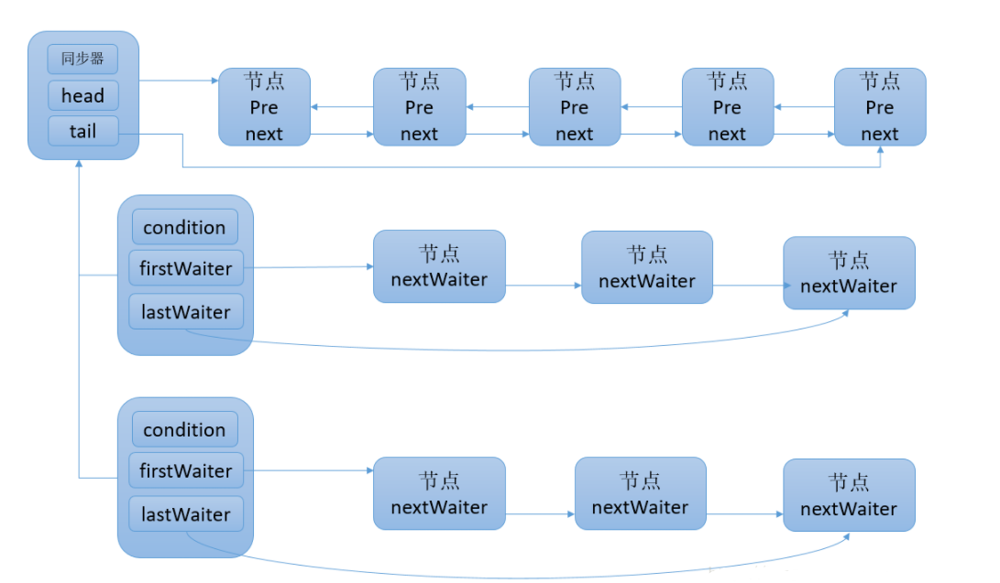


#### await

**调用await()前,需要提前获得condition对应的lock锁**

await()后,该线程将释放锁,并将该线程封装为一个Node节点插入等待队列。节点引用更新是在获取锁以后的操作，所以不需要CAS也能保证线程安全


```java
public final void await() throws InterruptedException {
  if (Thread.interrupted())
    throw new InterruptedException();
  Node node = addConditionWaiter();
  int savedState = fullyRelease(node);
  int interruptMode = 0;
  while (!isOnSyncQueue(node)) {
    LockSupport.park(this); //在这里用了LockSupport
    if ((interruptMode = checkInterruptWhileWaiting(node)) != 0)
      break;
  }
  if (acquireQueued(node, savedState) && interruptMode != THROW_IE)
    interruptMode = REINTERRUPT;
  if (node.nextWaiter != null) // clean up if cancelled
    unlinkCancelledWaiters();
  if (interruptMode != 0)
    reportInterruptAfterWait(interruptMode);
}
```


#### signal

1. **检查是否持有condition对应的lock锁**

2. 将**等待时间最长(队首)的Node**(移动到同步队列队尾)
3. 调用LockSupport.unpark()唤醒Node中的线程
4. 被唤醒的线程将从await()方法中的while (!isOnSyncQueue(node))循环中跳出, 并加入同步队列的竞争
5. 竞争成功则返回到await()之前的状态


signalAll()相当于对等待队列中的每个节点均执行一次signal()，效果就是将等待队列中所有节点全部移动到同步队列中，并唤醒每个节点的线程


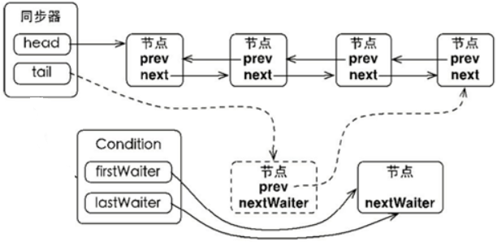

```java
public final void signal() {
  if (!isHeldExclusively()) //判断是否获取了condition对应的lock锁
    throw new IllegalMonitorStateException();
  Node first = firstWaiter;
  if (first != null)
    doSignal(first); //唤醒等待时间最长(队首)的Node
}

private void doSignal(Node first) {
  do {
    if ( (firstWaiter = first.nextWaiter) == null)
      lastWaiter = null;
    first.nextWaiter = null;
  } while (!transferForSignal(first) &&
           (first = firstWaiter) != null);
}

final boolean transferForSignal(Node node) {
  if (!compareAndSetWaitStatus(node, Node.CONDITION, 0))
    return false;

  Node p = enq(node);
  int ws = p.waitStatus;
  if (ws > 0 || !compareAndSetWaitStatus(p, ws, Node.SIGNAL))
    LockSupport.unpark(node.thread); //唤醒线程
  return true;
}
```


**总结**

调用await()后，将当前线程加入Condition条件队列中,并释放锁,否则别的线程就无法拿到锁 -> 死锁

自旋(while)挂起，不断检测节点是否在等待队列中，如果是则尝试获取锁，否则挂起

当线程被signal方法唤醒，被唤醒的线程将从await()方法中的while循环中退出来，然后调用acquireQueued()方法竞争同步状态


## ThreadPool


**降低创建/销毁对象的资源消耗**,管理线程个数/活跃数,调优和监控

线程池在内部构建了生产者消费者模型，将线程和任务两者解耦，并不直接关联，从而良好的缓冲任务，复用线程


**内核级线程**是真正与操作系统内核交互的线程,存在上下文切换等性能消耗

new Thread 用户级:内核级 = 1:1

线程池	用户级:内核级 = n:1

线程池减少了内核级线程的数量,从而无需大量的创建/切换线程


**流程**

1. 核心线程数 < corePoolSize，创建核心线程
2. workQueue没满，放入队列
3. 总线程数 < maximumPoolSize,新建非核心线程
4. 执行拒绝策略

线程池不区分核心/非核心线程，线程池是期望达到corePoolSize的并发状态，并允许在不得已情况下超载，达到corePoolSize ～ maximumPoolSize 的并发状态


**线程池自动关闭**

线程池的引用不可达 && 线程池中没有线程(所有线程运行完成自动消亡)

**不会自动关闭的特例**

FixedThreadPool的核心线程不会自动超时关闭，必须调用shutdown()

CachedThreadPool,核心线程数量0,不会有核心线程存活阻止线程池自动关闭


### 创建方式

1. new ThreadPoolExecutor

2. [Executors](#Executors)  **会导致OOM**

   Fixed/SingleThreadPool请求队列长度固定，会堆积大量的请求，导致OOM

   CachedThreadPool允许的创建线程数量为Integer.MAX_VALUE，导致OOM


### 7个参数

corePoolSize 核心线程数量	**核心线程可以被重复使用**

maximumPoolSize 最大线程数量

keepAliveTime 非核心线程在空闲后的存活时间, 若当前的线程数量>corePoolSize，空闲线程会被自动销毁

unit 时间单位

workQueue 工作队列

threadFactory 线程工厂,用来设定线程名、是否为daemon线程

handler 拒绝策略

```java
public ThreadPoolExecutor(int corePoolSize,
                          int maximumPoolSize,
                          long keepAliveTime,
                          TimeUnit unit,
                          BlockingQueue<Runnable> workQueue,
                          ThreadFactory threadFactory,
                          RejectedExecutionHandler handler
```


### 线程池参数

| corePoolSize        | 核心数量            | 同时运行的最小线程数量                                       |
| ------------------- | ------------------- | ------------------------------------------------------------ |
| **maximumPoolSize** | 最大数量            |                                                              |
| keepAliveTime       | 存活时间            | 线程数量上限 && 存活时间 > keepAliveTime，销毁线程           |
| unit                | keepAliveTime的单位 |                                                              |
| **workQueue**       | 任务队列            | 每次加入任务都判断池内正在运行的线程数量                     |
| threadFactory       | 线程工厂            |                                                              |
| handler             | 拒绝策略            | 默认AbortPolicy（抛出异常），CallerRunsPolicy(只用调用者所在线程来运行任务)、DiscardOldestPolicy(丢弃队列里最近的一个任务，再执行当前任务)、DiscardPolicy(不处理) |


```java
int getCorePoolSize()：获取核心线程数
int getLargestPoolSize()：历史峰值线程数
int getMaximumPoolSize()：最大线程数(线程池线程容量)
int getActiveCount()：当前活跃线程数
int getPoolSize()：当前线程池中的线程总数
BlockingQueue getQueue() 当前线程池的任务队列，据此可以获取积压任务的总数，getQueue.size()
```


#### 线程数的设置

- **CPU 密集型任务(N+1)：**这种任务主要消耗CPU资源，N+1是为了防止线程偶发的缺页中断，或者其它原因导致的任务暂停而带来的影响,多出来的一个线程可以充分利用 CPU 的空闲时间
- **I/O 密集型任务(2N)：**系统会用大部分的时间来处理I/O，而线程在处理I/O时不占用CPU时间片，这时就可以将 CPU 交给其它线程使用


线程池的参数不好配置的根本原因是 线程池执行的情况和任务类型相关性较大，IO/CPU密集型的任务运行起来的情况差异非常大


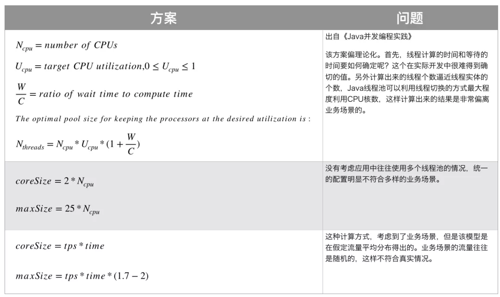


### 拒绝策略

1. AbortPolicy **默认** 丢弃任务并抛出异常
2. CallerRunsPolicy 只用调用者所在的线程来处理任务
3. DiscardOldestPolicy 丢弃任务, 不作任何处理
4. DiscardPolicy 丢弃workQueue中最老的一个任务，并将新任务加入


### 异常处理

如果没有提供异常处理方案,默认将栈追踪信息输出到System.err

> @see LxThreadPoolExceptionHandler


1. 在线程池的ThreadFactory中设置**异常处理器**,并用**execute**提交任务

   如果**用submit(),异常将会封装进Future,不会被异常处理器捕获**

2. submit提交任务,处理Future返回的异常

3. 重写ThreadPoolExecutor#afterExecute


### 控制提交任务的速率

用Semaphore实现

> @see ThreadPoolSemaphore


### 不适合线程池的任务


依赖性任务	当任务的执行存在先后顺序时,除非线程池足够的大,不然很容易造成**饥饿死锁**(任务a等待任务b的执行,但任务b阻塞在工作队列中)


线程封闭机制的任务	有些任务只能在单线程下运行,此时要强制使用newSingleThreadExecutor


对响应时间敏感的任务	通常是用户在页面上的操作


使用ThreadLocal的任务	线程池的线程会被复用,使用ThreadLocal会导致不同线程之间互相传值


**执行时间相差过大**的任务被放入同一个线程池	当多个执行时间长的任务被同时执行时,其他任务将堆积在工作队列中阻塞住,甚至可能造成死锁


### Executors

通过Executors.newXXX快速创建3种类型的ThreadPoolExecutor


**FixedThreadPool** 固定大小 + LinkedBlockingQueue无界队列

**可控制线程最大并发数**

```java
public static ExecutorService newFixedThreadPool(int nThreads) {
  return new ThreadPoolExecutor(nThreads, nThreads,	//核心=最大数量
                                0L, TimeUnit.MILLISECONDS,
                                new LinkedBlockingQueue<Runnable>());}//无界队列
```


**SingleThreadExecutor** 单线程 + LinkedBlockingQueue无界队列

保证所有任务按入队顺序执行

```java
public static ExecutorService newSingleThreadExecutor() {
    return new FinalizableDelegatedExecutorService
        (new ThreadPoolExecutor(1, 1,	//只有一个线程
                                0L, TimeUnit.MILLISECONDS,
                                new LinkedBlockingQueue<Runnable>()));}//无界队列
```


**CachedThreadPool** 0核心 + 无限非核心 + 60秒清除空闲线程 + 无容量队列

**灵活回收空闲线程,**适用于执行大量短期异步任务，负载较轻的服务器

```java
public static ExecutorService newCachedThreadPool() {
    return new ThreadPoolExecutor(0, Integer.MAX_VALUE,	//无限的非核心线程
                                  60L, TimeUnit.SECONDS,	//60秒清除空闲
                                  new SynchronousQueue<Runnable>());}
//SynchronousQueue没有容量，不存储元素，会直接将任务交给消费者,被消费后才能继续添加新元素
```


**ScheduledThreadPool** 定长 + DelayQueue 延迟/定期执行任务

```java
public static ScheduledExecutorService newScheduledThreadPool(int corePoolSize) {
  return new ScheduledThreadPoolExecutor(corePoolSize);
}

public class ScheduledThreadPoolExecutor extends ThreadPoolExecutor implements ScheduledExecutorService {
  public ScheduledThreadPoolExecutor(int corePoolSize) {
    super(corePoolSize, Integer.MAX_VALUE, 0, NANOSECONDS,new DelayedWorkQueue());
  }
}
```


#### callable

提供Runnable -> Callable的快速转化

```java
public static Callable<Object> callable(Runnable task) {
  if (task == null)	throw new NullPointerException();
  return new RunnableAdapter<Object>(task, null);
}

public static <T> Callable<T> callable(Runnable task, T result) {
  if (task == null)	throw new NullPointerException();
  return new RunnableAdapter<T>(task, result);
}
```


#### RunnableAdapter


适配器模式,重写Callable.call,去调用Runnable.run并返回result

```java
static final class RunnableAdapter<T> implements Callable<T> {
  final Runnable task;
  final T result;
  
  RunnableAdapter(Runnable task, T result) {
    this.task = task;
    this.result = result;
  }
  
  public T call() {
    task.run();
    return result;
  }
}
```


### Executor


#### execute

整个接口只定义execute(),用于实现==提交和执行的解耦==

```java
public interface Executor {
  void execute(Runnable command);	//由 ThreadPoolExecutor 实现
}
```


Executor框架的三大组成

1. 任务 Runnable/Callable
2. 任务的执行 Executor/ExecutorService/ThreadPoolExecutor
3. 异步计算的结果 Future


1. **主线程首先创建实现 `Runnable`/`Callable` 接口的任务对象**
2. **把任务对象直接交给 `ExecutorService` 执行**: `execute`/`submit`
3. **`ExecutorService.submit`将返回实现`Future`接口的对象**
4. **主线程可以执行 `FutureTask.get()`方法来等待任务执行完成。 `FutureTask.cancel`取消执行**


### ExecutorService


==ExecutorService extends Executor ，实现了关闭线程池，单个/批量提交任务获等方法==

```java
public interface ExecutorService extends Executor {
  T invokeAny(Collection<? extends Callable<T>> tasks);	//返回集合中随机一个元素的执行结果
  T invokeAny(Collection<? extends Callable<T>> tasks,long timeout, TimeUnit unit);

  List<Future<T>> invokeAll(Collection<? extends Callable<T>> tasks);	//返回Future集合

  void shutdown();	//不会立马关闭,对新的任务执行拒绝策略,在所有任务执行结束后关闭
  List<Runnable> shutdownNow();	//立即关闭正在执行的任务,并跳过所有已提交但还未运行的任务,无法保证正在运行的任务是否能够成功关闭(可能关闭,可能运行结束)

  boolean awaitTermination(long timeout, TimeUnit unit)	//等待一段时间后,返回线程池中线程是否全部运行完毕	通常与shutdown一起判断线程池是否完全关闭
}
```


#### submit

```java
Executor.execute(Runnable command);	//无返回值

Future<?> submit(Runnable task);	//Future.get==null,无法获取返回值
Future<T> submit(Runnable task, T result);	//入参的result将原封不动的作为返回值
Future<T> submit(Callable<T> task);
```

**execute()提交的任务，能将异常交给Thread.uncaughtExceptionHandler异常处理器。submit不能**


#### shutdown


**`shutdown（）`** :线程池的状态变为 `SHUTDOWN`。不再接受新任务，等待队列任务执行完毕

**`shutdownNow（）`** :线程的状态变为 `STOP`。终止当前正在运行的任务，并停止处理排队的任务并返回正在等待执行的 List

**`isTerminated`** :当调用 `shutdown()` 方法后，并且所有提交的任务完成后返回为 true

```java
ExecutorService executorService = Executors.newSingleThreadExecutor(build);
Future<T> submit = executorService.submit(callable);
executorService.shutdown();
try {
  if(!executorService.awaitTermination(60, TimeUnit.SECONDS)){	//当正在运行的线程阻塞时(IO的readLine),会导致正在运行的线程无法被shutdown关闭
    executorService.shutdownNow();	 //超时则强制中断正在运行的线程
  }
```

**shutdown + awaitTermination + shutdownNow	确保完全关闭**


### AbstractExecutorService

```java
//实现除 execute 外所有方法，execute留给ThreadPoolExecutor实现
public abstract class AbstractExecutorService implements ExecutorService {

}
```


#### newTaskFor


```java
protected <T> RunnableFuture<T> newTaskFor(Runnable runnable, T value) {
  return new FutureTask<T>(runnable, value);	//Runnable+value封装成FutureTask,从而拥有返回值
}
protected <T> RunnableFuture<T> newTaskFor(Callable<T> callable) {
  return new FutureTask<T>(callable);
}
```

[RunnableFuture](#RunnableFuture)


#### submit


```java
public Future<?> submit(Runnable task) {
  if (task == null) throw new NullPointerException();
  RunnableFuture<Void> ftask = newTaskFor(task, null);
  execute(ftask);
  return ftask;
}

public <T> Future<T> submit(Runnable task, T result) {
  if (task == null) throw new NullPointerException();
  RunnableFuture<T> ftask = newTaskFor(task, result);
  execute(ftask);
  return ftask;
}

public <T> Future<T> submit(Callable<T> task) {
  if (task == null) throw new NullPointerException();
  RunnableFuture<T> ftask = newTaskFor(task);
  execute(ftask);
  return ftask;
}
```


### ThreadPoolExecutor


```java
private static final int RUNNING    = -1 << COUNT_BITS;
private static final int SHUTDOWN   =  0 << COUNT_BITS; //不接受新任务,处理队列任务
private static final int STOP       =  1 << COUNT_BITS; //不接受新任务,也不处理队列中的任务,中断正在处理任务的线程
private static final int TIDYING    =  2 << COUNT_BITS; //所有任务已终止,workerCount为0
private static final int TERMINATED =  3 << COUNT_BITS; //terminated()方法执行完进入这个状态
```

线程池生命周期


#### 可变参数的线程池

[setCorePoolSize](#setCorePoolSize)提供了改变工作线程数的接口,无法添加大于任务队列大小的工作线程

ThreadPoolExecutor也没有提供改变任务队列大小的接口


美团技术团队的思路是主要对线程池的核心参数实现自定义可配置。这三个核心参数是：

- **`corePoolSize` :** 核心线程数线程数定义了最小可以同时运行的线程数量。
- **`maximumPoolSize` :** 当队列中存放的任务达到队列容量的时候，当前可以同时运行的线程数量变为最大线程数。
- **`workQueue`:** 当新任务来的时候会先判断当前运行的线程数量是否达到核心线程数，如果达到的话，信任就会被存放在队列中。

自定义了一个叫做 `ResizableCapacityLinkedBlockIngQueue` 的队列（主要就是把`LinkedBlockingQueue`的capacity 字段的final关键字修饰给去掉了，让它变为可变的）。


#### 拒绝策略


```java
public static class AbortPolicy implements RejectedExecutionHandler {}//默认,抛出RejectedExecutionException
public static class CallerRunsPolicy implements RejectedExecutionHandler {}	//调用run并且阻塞执行
public static class DiscardOldestPolicy implements RejectedExecutionHandler {}	//丢弃新任务
public static class DiscardPolicy implements RejectedExecutionHandler {}	//丢弃队首任务
```


#### execute


#### addWorker

在工作队列满时,才会尝试添加线程


#### runWorker

```java
final void runWorker(Worker w) {
  Thread wt = Thread.currentThread();
  Runnable task = w.firstTask;
  w.firstTask = null;
  w.unlock();	//Worker.unlock() 将state置为0，允许被interruptIfStarted()中断
  boolean completedAbruptly = true;
  try {
    //提交任务时task!=null		getTask()==null时停止从任务队列获取任务
    while (task != null || (task = getTask()) != null) {
      w.lock();
      if ((runStateAtLeast(ctl.get(), STOP) || (Thread.interrupted() && runStateAtLeast(ctl.get(), STOP))) && !wt.isInterrupted())
        wt.interrupt();
      try {
        beforeExecute(wt, task);
        Throwable thrown = null;
        try {
          task.run();//运行
        } finally {
          afterExecute(task, thrown);
        }
      } finally {
        task = null;
        w.completedTasks++;
        w.unlock();
      }
    }
    completedAbruptly = false;
  } finally {
    processWorkerExit(w, completedAbruptly);	//执行到这只有两种可能:1.异常中断，2.任务队列空
  }
}
```


#### getTask


getTask()用队列的poll()/take()保证核心线程阻塞地获取任务,不会被GC,非核心线程在任务队列为空时被移除引用,GC

take()队空时，Condition.await()释放锁 -> 核心线程继续等待新任务

poll()队空时，直接返回null -> processWorkerExit() -> 非核心线程被移除引用


#### processWorkerExit


**在线程池内部并没有区分核心/非核心**，所有线程异常/队空退出都执行processWorkerExit(),移除引用并线程数-1

```java
private void processWorkerExit(Worker w, boolean completedAbruptly) {
    if (completedAbruptly)	decrementWorkerCount();	//线程异常退出,线程数--

    final ReentrantLock mainLock = this.mainLock;
    mainLock.lock();
    try {
        completedTaskCount += w.completedTasks;
        workers.remove(w);
    } finally {
        mainLock.unlock();
    }

    tryTerminate();

    int c = ctl.get();
    if (runStateLessThan(c, STOP)) {	//线程池STOP状态&&异常退出->新增woker
        if (!completedAbruptly) {
            int min = allowCoreThreadTimeOut ? 0 : corePoolSize;
            if (min == 0 && ! workQueue.isEmpty())	min = 1;
            if (workerCountOf(c) >= min)	return;	//正常退出 && wokerQueue非空 -> 确保至少有一个线程在运行
        }
        addWorker(null, false);
    }
}
```


#### shutdown


```java
public void shutdown() {
  final ReentrantLock mainLock = this.mainLock;
  mainLock.lock();
  try {
    checkShutdownAccess();
    advanceRunState(SHUTDOWN);
    interruptIdleWorkers();
    onShutdown();
  } finally {
    mainLock.unlock();
  }
  tryTerminate();
}

private void interruptIdleWorkers() {
  interruptIdleWorkers(false);
}

private void interruptIdleWorkers(boolean onlyOne) {
  final ReentrantLock mainLock = this.mainLock;
  mainLock.lock();
  try {
    for (Worker w : workers) {
      Thread t = w.thread;
      if (!t.isInterrupted() && w.tryLock()) {
        try {
          t.interrupt();
        } catch (SecurityException ignore) {
        } finally {
          w.unlock();
        }
      }
      if (onlyOne)
        break;
    }
  } finally {
    mainLock.unlock();
  }
}
```


#### shutdownNow

相当于遍历Workers,挨个interrupt

```java
public List<Runnable> shutdownNow() {
  List<Runnable> tasks;
  final ReentrantLock mainLock = this.mainLock;
  mainLock.lock();
  try {
    checkShutdownAccess();
    advanceRunState(STOP);
    interruptWorkers();
    tasks = drainQueue();
  } finally {
    mainLock.unlock();
  }
  tryTerminate();
  return tasks;
}

private void interruptWorkers() {
  final ReentrantLock mainLock = this.mainLock;
  mainLock.lock();
  try {
    for (Worker w : workers)
      w.interruptIfStarted();	//Worker.interruptIfStarted,使得shutdownNow()能中断已启动的线程
  } finally {
    mainLock.unlock();
  }
}
```

[interruptIfStarted](#####interruptIfStarted)


#### setCorePoolSize

```java
public void setCorePoolSize(int corePoolSize) {
  if (corePoolSize < 0) throw new IllegalArgumentException();
  int delta = corePoolSize - this.corePoolSize;
  this.corePoolSize = corePoolSize;
  if (workerCountOf(ctl.get()) > corePoolSize)
    interruptIdleWorkers();
  else if (delta > 0) { //需要添加工作线程时
    int k = Math.min(delta, workQueue.size()); //首先,不需要比队列还长的工作线程数
    while (k-- > 0 && addWorker(null, true)) { //尝试循环添加工作线程
      if (workQueue.isEmpty()) //当任务队列为空则立即停止
        break;
    }
  }
}
```


#### Worker


**Worker = 线程+task+run()+AQS获取独占锁**,从而更好地管理线程中断

通过实现Runnable的run()控制内部成员线程的运行

通过继承AQS实现独占锁,用AQS的state反应线程的执行状态,防止运行中的worker被中断，runWorker()将lock()上锁，而shutdown()将无法停止获得锁的worker

线程池在执行shutdown()或tryTerminate()时,会调用interruptIdleWorkers()来中断空闲的线程，interruptIdleWorkers()会使用tryLock()来判断线程池中的线程是否是空闲状态；如果线程是空闲状态则可以安全回收


##### interruptIfStarted

不需要获取锁地中断线程

```java
void interruptIfStarted() {
  Thread t;
  // state >= 0 且 t != null 且线程未被中断
  if (getState() >= 0 && (t = thread) != null && !t.isInterrupted()) {
    try {
      t.interrupt();
    } catch (SecurityException ignore) {
    }
  }
}
```


### ScheduledThreadPoolExecutor


#### 运行机制


**`ScheduledThreadPoolExecutor` 的执行主要分为两大部分：**

1. 当调用 `ScheduledThreadPoolExecutor` 的 **`scheduleAtFixedRate()`** /**`scheduleWithFixedDelay()`** 方法时，会向 `ScheduledThreadPoolExecutor` 的 **`DelayQueue`** 添加一个实现了 **`RunnableScheduledFuture`** 接口的 **`ScheduledFutureTask`** 。
2. 线程池中的线程从 `DelayQueue` 中获取 `ScheduledFutureTask`，然后执行任务。

**`ScheduledThreadPoolExecutor` 为了实现周期性的执行任务，对 `ThreadPoolExecutor`做了如下修改：**

- 使用 **`DelayQueue`** 作为任务队列；
- 获取任务的方不同
- 执行周期任务后，增加了额外的处理


1. 线程 1 从 `DelayQueue` 中获取已到期的 `ScheduledFutureTask（DelayQueue.take()）`。到期任务是指 `ScheduledFutureTask`的 time 大于等于当前系统的时间；
2. 线程 1 执行这个 `ScheduledFutureTask`；
3. 线程 1 修改 `ScheduledFutureTask` 的 time 变量为下次将要被执行的时间；
4. 线程 1 把这个修改 time 之后的 `ScheduledFutureTask` 放回 `DelayQueue` 中（`DelayQueue.add()`)。


### 阻塞队列


2个额外方法：

支持阻塞的**插入**：队满时，队列会阻塞插入元素的线程

支持阻塞的**移除**：队空时，获取元素的线程会等待队列变为非空


7种阻塞队列

- **ArrayBlockingQueue**：**基于数组 有界**，FIFO(先进先出),**队满时不公平**(队列外的被阻塞元素将持续阻塞,没有获得锁的机会)
- **LinkedBlockingQueue**：**基于链表 有界**，FIFO排序，吞吐量高于ArrayBlockingQueue。Executors.newFixedThreadPool()
- **SynchronousQueue**：**不存储元素**。插入必须等到另一个线程调用移除操作，否则阻塞，吞吐量高于Linked-BlockingQueue，Executors.newCachedThreadPool
- **PriorityBlockingQueue**：**支持优先级排序 无界**
- DelayQueue：**支持延时获取元素** 优先级队列 无界
- LinkedTransferQueue：链表 无界 
  - transfer()如果当前有消费者正在等待接收元素（take或者待时间限制的poll方法），transfer可以把生产者传入的元素立刻传给消费者。如果没有消费者等待接收元素，则将元素放在队列的tail节点，并等到该元素被消费者消费了才返回
  - tryTransfer()用来试探生产者传入的元素能否直接传给消费者。，如果没有消费者在等待，则返回false。和上述方法的区别是该方法无论消费者是否接收，方法立即返回。而transfer方法是必须等到消费者消费了才返回
- LinkedBlockingDeque：双向链表 在入队时，减少一半的竞争


### Future

Future是异步编程的一种方式：任务提交给了Future，Future替我完成这个任务。期间我自己可以去做任何想做的事情。一段时间后,可以从Future取出结果

通常会通过ExecutorService的submit方法执行Callable，并返回FutureTask

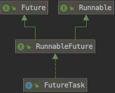


## RunnableFuture


#### FutureTask


#### CompleteFuture

future通过isDone==true才知道任务跑完了。get()的调用也会阻塞


thenApply / thenAccept 相当于 Function / Consumer


```java
private static final boolean useCommonPool = (ForkJoinPool.getCommonPoolParallelism() > 1);

private static final Executor asyncPool = useCommonPool ? ForkJoinPool.commonPool() : new ThreadPerTaskExecutor();
```


而使用completableFuture的使用就可以用then，when等等操作来防止以上的阻塞和轮询isDone的现象出现。


##### runAsync


```java
public static CompletableFuture<Void> runAsync(Runnable runnable) {
  return asyncRunStage(asyncPool, runnable);
}

//可以指定运行任务的线程池,未指定则以forkJoinPool执行
public static CompletableFuture<Void> runAsync(Runnable runnable,Executor executor) {
  return asyncRunStage(screenExecutor(executor), runnable);
}
```


一个Future类是显示的完成，而且能被用作一个完成等级，通过它的完成触发支持的依赖函数和行为。当两个或多个线程要执行完成或取消操作时，只有一个能够成功。

#### ForkJoinTask

基于任务的抽象类，可以通过ForkJoinPool来执行。一个ForkJoinTask是类似于线程实体，但是相对于线程实体是轻量级的。大量的任务和子任务会被ForkJoinPool池中的真实线程挂起来，以某些使用限制为代价。


## 如何访问共享的可变数据


```java
private static boolean stopRequested;

public static void main(String[] args) throws InterruptedException {
  new Thread(() -> {
    int i = 0;
    while (!stopRequested) { //死循环
      i++;
    }
  }).start();
  TimeUnit.SECONDS.sleep(1);
  stopRequested = true; //主线程对变量的改动不会被上一条线程得知
}
```


在没有同步时，jvm无法保证后台线程何时感知主线程中对变量的改动,所以`while`中的代码将被优化为:

```java
if (!stopRequested) { //尽管主线程将stopRequested的值变更,但工作线程并无感知
  while (true) {
    i++;
  }
}
```


第一种方法是加**volatile**关键词

```java
private static volatile boolean stopRequested;
```


第二种方法是读写方法都加**synchronized**

```java
private static synchronized boolean getStopRequested() {
  return stopRequested;
}

private static synchronized void setStopRequested() {
  stopRequested = true;
}
```


只在读/写一个方法上加锁,会导致同步不一定生效

假设共享变量v,只在读方法加锁:  a+b的结果为2, a+c的结果为3

| 线程a              | 线程b              | 线程c              |
| ------------------ | ------------------ | ------------------ |
| 加锁读到v=1,释放锁 |                    |                    |
|                    | 加锁读到v=1,释放锁 | 加锁读到v=1,释放锁 |
|                    | 写入v=3            |                    |
| 写入v=2            |                    |                    |
|                    |                    | 写入v=3            |


假设共享变量v,只在写方法加锁:  a+b的结果为3, a+c的结果为2

| 线程a       | 线程b       | 线程c       |
| ----------- | ----------- | ----------- |
| 读到v=1     | 读到v=1     | 读到v=1     |
|             |             | 加锁写入v=3 |
| 加锁写入v=2 |             |             |
|             | 加锁写入v=3 |             |


第三种方法是使用**AtomicLong**,避免了加锁同步

```java
private static final AtomicLong nextSealNum = new AtomicLong();
```


### println会自动进行变量的同步

如果上述的代码增加一行打印代码,将打破死循环

```java
while (!stopRequested) { 
  while (!getStopRequested()) {
    i++;
    System.out.println(i);
  }
}
```

```java
public void println(int x) {
  synchronized (this) { //同步了当前实例
    print(x);
    newLine();
  }
}
```


## 如何设计线程安全


分析对象的状态

找出构成对象状态的所有成员变量,包括这个对象引用了的其他对象(例如List)

**可变状态越少**,对象的构成越简单.尽量将域声明为final/Imutable,将成员变量转为本地变量


校验对象的状态

在操作前后**校验状态迁移是否有效**, 比如计数器的后置校验:自增后状态加一, 或者是非负数的校验

需要对这些底层的状态变量进行封装,否则客户代码可能会使对象处于无效的状态. 如果状态是由多个状态变量组成的,这些变量必须在单个原子操作中进行读取/更新


依赖其他线程状态的操作

等待某个条件为真后执行后续方法,这种前置条件的状态会被其他线程修改. 更合理的方式是通过Blocking Queue,Semaphore这类的同步工具类来实现


封装实现实例封闭

将同步机制封装在对象中,更有利于对代码的分析

通常会加锁访问被封装的状态,当存在多个状态时,要使用同一把锁,但**不推荐使用对象的内置锁,而是另外定义一个私有的锁对象**. 对象内置锁是公开的,很难去验证公开访问的锁在程序中是否被正确的使用


执行复合操作期间,需要持有锁


将设计同步的思路进行文档化

最基本的是标注这个类是不是线程安全的,还可以写明哪些锁保护了了哪些变量,哪些操作必须是原子性的


# JVM

JVM是运行字节码的虚拟机。针对不同系统的有不同的特定实现，从而相同字节码得到相同结果。字节码和不同系统的 JVM 实现是 Java “一次编译，随处可以运行”的关键所在

JVM与操作系统交互,操作系统与硬件交互


Jconsole	查看JVM状态


## 6种存储方式


1．寄存器（register）**最快,位于处理器内部**。数量有限，由编译器根据需求分配。**无法直接控制**

2．栈（stack）位于**随机访问存储器RAM**。==指针向下移动，分配新内存；向上移动，释放内存==。**运行前编译器必须知道栈内所有数据的大小和生命周期,限制程序的灵活性**

3．堆（heap）位于**随机访问存储器RAM**，用于存放对象。**编译器无需知道数据的大小和生命周期,灵活性高,效率低**

4．静态存储（static storage）位于**随机访问存储器RAM**,存放运行时一直存在的数据

5．常量存储（constant storage）位于**代码内部**，保证安全性

6．非RAM存储（non-RAM storage）位于**程序外**，不受程序控制，没有运行时也存在,**字节流/持久化对象**,对象被转化成可以存放在其它媒介上的事物


**直接内存**

直接内存并不是JVM运行时数据区的一部分, 但也会被频繁的使用: 在 JDK 1.4 引入的 NIO 提 供了基于 Channel 与 Buffer 的 IO 方式, 它可以使用 Native 函数库直接分配堆外内存, 然后使用 DirectByteBuffer 对象作为这块内存的引用进行操作,避免了在 Java 堆和 Native 堆中来回复制数据

Unsafe#allocateMemory这个native方法就是分配了直接内存


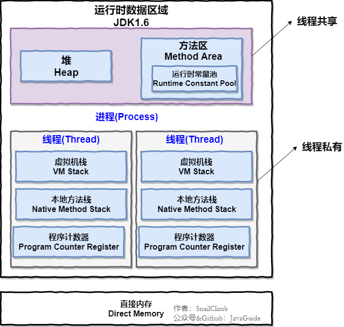 


## JMM

Java Memory Model 内存模型

==规范了内存的读写操作, 通过禁止指令重排序和内存屏障来解决并发问题==


### JMM的规范

- 所有的变量都存储在主内存中
- 每个线程都有一个私有的本地内存（寄存器、CPU 缓存等），本地内存中存储了该线程以读/写共享变量的拷贝副本
- 线程对变量的所有操作都必须在本地内存中进行，而不能直接读写主内存
- 不同的线程之间无法直接访问对方本地内存中的变量


### JMM和硬件内存架构之间的桥接

Java内存模型与硬件内存架构之间存在差异

硬件内存架构没有区分[线程栈](https://www.zhihu.com/search?q=线程栈&search_source=Entity&hybrid_search_source=Entity&hybrid_search_extra={"sourceType"%3A"answer"%2C"sourceId"%3A1805737164})和堆。对于硬件而言，所有的线程栈和堆都分布在主内存中。部分线程栈和堆可能有时候会出现在CPU缓存中和CPU内部的寄存器中

在java动态的内存模型中，分为主内存，和[线程工作内存](https://www.zhihu.com/search?q=线程工作内存&search_source=Entity&hybrid_search_source=Entity&hybrid_search_extra={"sourceType"%3A"answer"%2C"sourceId"%3A1805737164})。主内存是所有的线程所共享的，工作内存是每个线程自己有一个，不是共享的。每个线程之间的共享变量存储在主内存里面，每个线程都有一个私有的本地内存，[本地内存](https://www.zhihu.com/search?q=本地内存&search_source=Entity&hybrid_search_source=Entity&hybrid_search_extra={"sourceType"%3A"answer"%2C"sourceId"%3A1805737164})是Java内存模型的一个抽象的概念，并不是真实存在的。**从一个更低的层次来说，主内存就是硬件的内存，而为了获取更好的运行速度，[虚拟机](https://www.zhihu.com/search?q=虚拟机&search_source=Entity&hybrid_search_source=Entity&hybrid_search_extra={"sourceType"%3A"answer"%2C"sourceId"%3A1805737164})及硬件系统可能会让工作内存优先存储于寄存器和高速缓存中。因此Java内存模型中的线程的工作内存（working memory）是cpu的寄存器和高速缓存的抽象描述。**主内存则可理解为[物理主存](https://www.zhihu.com/search?q=物理主存&search_source=Entity&hybrid_search_source=Entity&hybrid_search_extra={"sourceType"%3A"answer"%2C"sourceId"%3A1805737164})的抽象。而JVM的静态内存存储模型（[JVM内存模型](https://www.zhihu.com/search?q=JVM内存模型&search_source=Entity&hybrid_search_source=Entity&hybrid_search_extra={"sourceType"%3A"answer"%2C"sourceId"%3A1805737164})）只是一种对物理内存的划分，它只局限在物理内存，而且只局限在JVM进程中的的物理内存

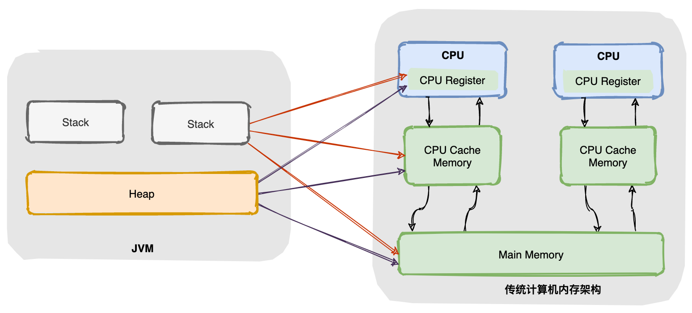


### 栈

-Xss

虚拟机和物理机都有代码执行能力,物理机执行引擎建立在处理器、硬件指令集、操作系统层面,虚拟机执行引擎由自己实现，用于执行虚拟机字节码指令集

为了保证**线程中的局部变量不被别的线程访问**,栈线程私有

==栈是运行时单位，解决方法调用/执行，堆是存储单位，解决数据存储==


#### 虚拟机栈


由若干栈帧组成==大小在编译时确定==,在方法运行期间不会改变大小

生命周期与线程相同,线程死亡时自动释放栈空间 -> GC不在栈上进行

线程私有,有专门寄存器存放栈的地址，压栈出栈有专门指令

* ==基本类型,对象引用和局部变量表==(JOL的类型指针/实例数据)

  * **局部变量不会被赋初值**,不像类变量在加载过程中有准备阶段
  * 局部变量表存放 方法入参 / 局部变量 / returnAddress类型(指向一条字节码指令的地址) / 对象引用
  * 局部变量表的容量以Slot为最小单位,JVM通过索引定位使用局部变量表。为了节省栈帧空间，**slot是可以复用的,不可达的变量可以被直接覆盖，所以栈中的变量不会被GC**
  * 只有long/double 2种类型的数据需要占用2个Slot,其余数据类型都只是占用1个

* ==操作数栈==(工作空间)

  * 方法执行过程中，各种字节码指令往操作数栈中读/写(出入栈) -> 方法的执行等同于出入栈
  * Jvm的解释执行引擎基于操作数栈
  
* ==动态链接==,指向方法区中的方法表,从而支持方法调用的动态链接
  
* .class文件的常量池中有大量符号引用，字节码中的方法调用以常量池指向的方法的符号引用作为参数,这些符号引用一部分会在类加载阶段（解析）或首次使用的时转化为直接引用，这种转化成为静态解析，另一部分成为动态连接
  
* ==方法出口信息==

  * 正常出口：执行引擎遇到返回的字节码指令，将返回值传递给上层的方法调用者,**栈帧被弹出**
  * 异常出口：遇到未处理的异常(本地异常表没有匹配的异常处理器),执行引擎不会读取方法返回地址，调用者不会得到返回值,**栈帧被弹出**
  * 不管是正常/异常方法退出,栈帧都会出栈。恢复调用方的局部变量表和操作数栈，并把返回值压入调用方的操作数栈，调整PC计数器,执行下一条指令
  
  一般把动态连接、方法返回地址和其他附加信息全部归为一类，成为**栈帧**信息,栈帧其实就是方法,存储方法和运行时的数据集
  
* 按定义顺序依次压栈，**相邻变量的地址之间不会存在其它变量**。栈的内存地址由高到低，**后定义的变量地址低于先定义的变量**


SOF: **线程请求的栈深度大于虚拟机所允许的深度StackOverflowError**,通常由递归引起

OOM: 虚拟机栈的动态拓展会不断地申请内存,当无法申请到足够的内存时


#### 本地方法栈

Native Method Stack

本地方法栈的作用与虚拟机栈的作用是相近的,唯一区别只在于虚拟机栈执行Java方法,本地方法栈执行native方法

虚拟机规范并没有规定本地方法栈使用的语言/数据结构 -> 具体的虚拟机可以对本地方法栈自由实现,甚至HotSpot是将本地方法栈和虚拟机栈合二为一


* 本地方法被执行时,在本地方法栈也会创建一个栈帧,用于存放该本地方法的局部变量表、操作数栈、动态链接、出口信息
* 方法结束后也会进行类似虚拟机栈的出栈和释放空间,也会出现 `StackOverFlowError` 和 `OutOfMemoryError` 两种错误


#### 逃逸分析

判断对象是否能逃逸出线程或方法

1. 对象被存入堆中（**静态字段或者堆中对象的实例字段**）,其他线程能获得该对象的引用，即时编译器无法追踪所有使用该对象的代码位置
2. 对象被传入未知代码中，作为入参在方法中调用了外部方法; 作为返回值传出方法


**优点**

1. 减少对象在堆上分配的频率,减少GC频率. 之前是在堆上分配, 然后把堆的地址压入调用栈. 现在可以直接存储在栈上

2. **锁消除** 如果对象未逃逸,则这个对象不需要被同步

3. 标量替换 若对象未逃逸,则直接创建方法里引用到的成员变量,而不需要创建整个对象.这些成员变量可以被单独分析和优化,并各自分别在栈帧或寄存器上分配空间，原本的对象就无需整体分配空间了

   标量: 基本数据类型,即不可被进一步分解的数据

   聚合量: 多个标量的聚合, 即java的对象

   


### 堆 heap

-Xms -Xmx


只有1个,所有线程共享,**虚拟机启动时创建**,存储==对象和class对象==,**gc主要区域**

根据JVM规范,堆可以处于物理上不连续的内存空间,只需逻辑上连续即可

堆申请和释放由程序员控制，容易OOM


#### 新生代

Young Generation   Eden:from:to默认占比 8:1:1,方便采用**复制-清除策略**

区分空闲/使用区,将存活的对象复制进空闲区，**避免碎片问题**。虽然复制后使用区没有碎片，但下次GC后,Eden和使用区里都存在需要回收的对象,导致碎片

**Survivor from/to区交替空闲** -> 新生代实际可用90%

Eden存放新创建对象,==分配内存时需要加锁==


* Eden满时
  * **进入老年代的对象大小在GC前未知**
  * 之前晋升到老年代的平均值>老年代剩余空间，**full GC**
  * < 则判断`HandlePromotionFailure`(是否允许担保失败,默认允许)，有担保则**Minor GC**
    * **大对象进入年老代**,保证Eden空间充足  -XX:PretenureSizeThreshold(默认0,代表优先在Eden分配)
    * **长期存活进入老年代**，避免from/to重复复制,以及Survivor空间不足 `-XX:MaxTenuringThreshold`年龄阈值 默认15
    * **动态对象年龄判断**,年龄相同的对象 > Survivor的`-XX:TargetSurvivorRatio=percent`默认50%，超出部分放入老年代,保证老年代空间充足,并取min(该年龄,`-XX:MaxTenuringThreshold`)作为新的年龄阈值 
* GC后,使用/空闲区互换,**年龄+1**


年老代Old Generation  存活时间较久，较大的对象


永久代Permanent Generation

在1.8+,永久代被元空间metaData取代,


#### TLAB

-XX:TLABSize	默认Eden的1%

-XX:UseTLAB	设置是否开启TLAB空间


Thread Local Allocation Buffer

堆区线程共享,创建对象线程不安全,需要加锁导致分配速度降低


TLAB是线程在Eden上的独占空间,==在TLAB分配内存不需要加锁==，首先根据逃逸算法,如果方法中的对象引用没有被返回/未被外部使用,尝试在TLAB分配,对象过大/TLAB满，在堆上分配


快速分配策略:当TLAB空间不足时,重新创建TLAB.多线程同时分配内存时,使用TLAB可以避免线程安全问题,提升内存分配的吞吐量


#### 主/工作/直接内存


* 主内存存储所有变量，共享
* 工作内存线程私有，保存变量值的副本，**线程对变量的操作在工作内存中完成，结束后放回主内存**,线程间无法直接访问对方工作内存中的变量
* 直接内存（Direct Memory）
  * -XX:MaxDirectMemorySize  如果没指定，默认与堆的最大值（-Xmx）一样
  * 并不是虚拟机运行时数据区的一部分，也不是Java虚拟机规范中定义的内存区域，但是这部分内存也被频繁地使用，而且也可能OOM

**主内存可粗略认为是堆，工作内存认为是栈**

主内存可粗略认为是堆，工作内存认为是栈


CPU从内存取数据到寄存器，然后进行处理，但内存处理速度远低于CPU，导致CPU在处理指令时花费很多时间在等待内存做准备工作，于是在寄存器和主内存间添加了**CPU缓存**，CPU缓存小，但访问速度比主内存快


基本执行步骤：

1. lock（锁定）：线程读主内存时,把变量锁定
2. unlock（解锁）：读完后解锁，别的线程就可以进入操作
3. read（读取）：把变量值放入工作内存
4. load（加载）：把read操作得到的值放入工作内存变量副本中
5. use（使用）：把工作内存中的一个变量值传递给执行引擎
6. assign（赋值）：执行引擎赋值给工作内存的变量
7. store（存储）：把工作内存中的变量的值传到主内存
8. write（写入）：把store操作的值写入主内存变量


### 方法/静态区

**-XX:MaxPermSize**


> 《Jvm规范》只规定方法区的概念和作用，并没有规定如何实现,也没有规定如何GC
>
> **永久代和元空间都是方法区的一种实现**,并且是HotSpot专属的,其他JVM实现并没有永久代
>
> 当方法区无法满足内存分配需求时,也会OOM


存储==已被JVM加载的class信息(构造方法/接口定义),static变量,常量，运行时常量池==等**唯一的元素**


Java 6中，方法区中包含的数据，除了JIT编译生成的代码存放在native memory的CodeCache区域，其他都存放在永久代；
Java 7中，Symbol的存储从PermGen移动到了native memory，并且把静态变量从instanceKlass末尾（位于PermGen内）移动到了java.lang.Class对象的末尾（位于普通Java heap内）；
Java 8中，永久代被彻底移除，取而代之的是另一块与堆不相连的本地内存——元空间（Metaspace）,‑XX:MaxPermSize 参数失去了意义，取而代之的是-XX:MaxMetaspaceSize。


**方法表**

* 实现动态调用的核心,存放在方法区中的类型信息中
* 方法区的类型信息指向方法表，方法表指向具体方法,这些方法中包括从父类继承/自身重写


#### 方法区GC

常量回收	可达性分析,当没有任何引用指向常量池中的常量,则被清除出常量池


类卸载

所有实例/加载该类的ClassLoader/class对象被GC

加载该类的 `ClassLoader` 被回收 -> **JVM自带的类加载器加载的类不会被卸载**

class对象没有在任何地方被引用，无法在任何地方通过反射访问该类的方法


#### 永久代 VS 元空间


1. 永久代是堆的一部分,被JVM设置固定大小，无法调整，元空间使用的是直接内存，受本机可用内存的限制，内存溢出的可能性更小

> 当元空间溢出时会得到如下错误： `java.lang.OutOfMemoryError: MetaSpace`

可以使用 `-XX：MaxMetaspaceSize` 标志设置最大元空间大小，默认值为 unlimited，只受系统内存的限制

2. 元空间属于本地内存,存放类的元数据，静态变量和常量池并入堆中, 相当于永久代的数据被分到了堆和元空间中


#### 运行时常量池

Runtime Constant Pool

**-XX:PermSize和-XX:MaxPermSize**

存放**编译期被确定**的各种**字面量**和**符号引用**,这部分数据在类加载后进入方法区的运行常量池存放

* 字面量：字符串、声明为final的常量值等
* 符号引用：类和接口的完全限定名、字段的名称和描述符、方法的名称和描述符


受方法区内存限制,当常量池无法申请到内存时OOM

- **字符串常量池**：编译期,类中产生的字符串类型数据
- **运行时常量池**：虚拟机加载Class后把常量池中的数据放入运行时常量池
  - 包含==基本类型和对象型的常量值==
  - ==小于127的Byte,Short,Integer,Long,Character== **不包括浮点数**
  - **编译期生成的常量**,如[String.intern](#intern)


1. **1.7- 运行时常量池存放在方法区, 此时 hotspot 虚拟机对方法区的实现为永久代**
2. **1.7 字符串常量池单独移到堆中**
3. **1.8+ hotspot Metaspace取代永久代,这时候字符串常量池还在堆,运行时常量池在元空间**


### 程序计数器

Program Counter Register

**字节码解释器通过改变计数器值来依次读取指令**，从而实现流程控制：顺序执行、选择、循环、异常处理

**为了线程切换能恢复到正确的执行位置**，程序计数器线程私有

执行native时记录undefined，执行Java代码时记录下一条字节码指令的地址


**不会OOM**,生命周期随线程的创建而创建，随着线程的结束而死亡


### 直接内存

不是虚拟机运行时数据区的一部分，也不是JVM规范中定义的内存区域，但这部分内存会被频繁地使用。也有OOM可能性


NIO引入基于**通道（Channel）** 与**缓存区（Buffer）** 的 I/O 方式,可以用 Native函数库直接分配堆外内存，然后通过存储在堆中的 DirectByteBuffer 对象作为这块内存的引用进行操作,**避免了在 Java 堆和 Native 堆之间来回复制数据**

本机直接内存的分配不会受到 Java 堆的限制，但是，既然是内存就会受到本机总内存大小以及处理器寻址空间的限制


### 主内存/工作内存


**寄存器读写的速度 >> 内存**	为了解决速度冲突，加入了高速缓存

加入高速缓存带来了**缓存一致性**问题:多个缓存共享同一块主内存区，缓存的数据可能不一致，需要协议来解决问题


**主内存		寄存器		所有变量**

**工作内存	高速缓存/寄存器	变量的主内存副本拷贝**

线程只能直接操作工作内存中的变量，不同线程之间的变量值传递需要通过主内存来完成

<div align="center">  </div><br>

#### 内存交互操作

JVM定义了8个操作来完成主内存和工作内存的交互

<div align="center">  </div><br>

- read：把一个变量的值从主内存传输到工作内存中
- load：在 read 之后执行，把 read 得到的值放入工作内存的变量副本中
- use：把工作内存中一个变量的值传递给执行引擎
- assign：把一个从执行引擎接收到的值赋给工作内存的变量
- store：把工作内存的一个变量的值传送到主内存中
- write：在 store 之后执行，把 store 得到的值放入主内存的变量中
- lock：作用于主内存的变量
- unlock


### 内存分配策略

1. 对象优先在 Eden 分配，当 Eden 空间不够时，发起 Minor GC。

2. 大对象直接进入老年代

大对象是指需要连续内存空间的对象，最典型的大对象是那种很长的字符串以及数组。

经常出现大对象会提前触发垃圾收集以获取足够的连续空间分配给大对象。

3. 长期存活的对象进入老年代

为对象定义年龄计数器，对象在 Eden 出生并经过 Minor GC 依然存活，将移动到 Survivor 中，年龄就增加 1 岁，增加到一定年龄则移动到老年代中。

4. 动态对象年龄判定

虚拟机并不是永远要求对象的年龄必须达到 MaxTenuringThreshold 才能晋升老年代，如果在 Survivor 中相同年龄所有对象大小的总和大于 Survivor 空间的一半，则年龄大于或等于该年龄的对象可以直接进入老年代，无需等到 MaxTenuringThreshold 中要求的年龄。

5. 空间分配担保

在发生 Minor GC 之前，虚拟机先检查老年代最大可用的连续空间是否大于新生代所有对象总空间，如果条件成立的话，那么 Minor GC 可以确认是安全的。

如果不成立的话虚拟机会查看 HandlePromotionFailure 的值是否允许担保失败，如果允许那么就会继续检查老年代最大可用的连续空间是否大于历次晋升到老年代对象的平均大小，如果大于，将尝试着进行一次 Minor GC；如果小于，或者 HandlePromotionFailure 的值不允许冒险，那么就要进行一次 Full GC。


### JMM三大特性

缓存一致性 -> 可见性

处理器优化 -> 原子性

指令重排序 -> 有序性


#### 原子性

```java
i = 0; // 这个是原子性的
i++;   // 包含三个操作，读取i的值，将i加1，将值赋给i
i = j; // 读取j的值，将j的值赋给i
i = i + 1; // 包含三个操作，读取i的值，将i加1，将值赋给i
```

Java 内存模型保证 read、load、use、assign、store、write、lock 和 unlock 操作具有原子性

但JMM允许JVM将没有被 volatile 修饰的 64 位数据（long，double）的读写操作划分为 两次32位的操作进行，即 load、store、read 和 write 操作不具备原子性


将内存间的交互操作简化为 3 个：load、assign、store

下图演示了两个线程同时对 cnt 进行操作，load、assign、store 这一系列操作整体上看不具备原子性，那么在 T1 修改 cnt 并且还没有将修改后的值写入主内存，T2 依然可以读入旧值。可以看出，这两个线程虽然执行了两次自增运算，但是主内存中 cnt 的值最后为 1 而不是 2。因此对 int 类型读写操作满足原子性只是说明 load、assign、store 这些单个操作具备原子性

<div align="center">  </div><br>

AtomicInteger 能保证多个线程修改的原子性

<div align="center">  </div><br>


除了使用原子类之外，也可以使用 synchronized 来保证操作的原子性。它对应的内存间交互操作为：lock 和 unlock，在虚拟机实现上对应的字节码指令为 monitorenter 和 monitorexit


#### 可见性

可通过在变量修改后将新值同步回主内存，在变量读取前从主内存刷新变量值实现可见性


- volatile
- synchronized，对变量执行 unlock 前，必须把变量值同步回主内存
- final,不变 = 可见


#### <a name="指令重排">有序性</a>

在本线程内观察，所有操作都是有序的。在一个线程观察另一个线程，所有操作都是无序的，无序是因为发生了==指令重排==

JMM允许编译器和处理器对指令进行重排序，重排序过程不会影响到单线程程序的执行，却会影响到多线程并发执行的正确性

as-if-serial语义:不管怎么重排序，单线程程序的执行结果都不能被改变


volatile 关键字通过添加内存屏障的方式来禁止指令重排，即重排序时不能把后面的指令放到内存屏障之前

synchronized 保证每个时刻只有一个线程执行同步代码


**先行发生原则**	部分操作无需volatile/synchronized 

| 先行发生原则 |                          |                                                              |
| ------------ | ------------------------ | ------------------------------------------------------------ |
| 单一线程原则 | Single Thread rule       | 在一个线程内，在程序前面的操作先行发生于后面的操作           |
| 管程锁定     | Monitor Lock Rule        | unlock先行于后续对同一个锁的lock                             |
| volatile     | Volatile Variable Rule   | 对 volatile 变量的写操作先行于后续读操作                     |
| 线程启动规则 | Thread Start Rule        | Thread 对象的 start() 先行发生于方法体内容                   |
| 线程加入规则 | Thread Join Rule         | Thread 对象的结束先行于 join() 方法返回                      |
| 线程中断规则 | Thread Interruption Rule | [interrupt()](#interrupt) 的调用先行于被中断线程的代码检测到中断事件的发生 |
| 对象终结规则 | Finalizer Rule           | 对象的初始化完成先行发生于 finalize() 的调用                 |
| 传递性       | Transitivity             | 如果操作 A 先行发生于操作 B，操作 B 先行发生于操作 C，那么操作 A 先行发生于操作 C |


## 为什么要有内存模型


### 缓存一致性问题

CPU 将常用的数据放在高速缓存中，运算结束后将结果同步到主存中

高速缓存解决了 CPU 和主存速率不匹配的问题，但同时又引入了缓存一致性问题


## 堆外内存

堆外内存直接**受操作系统管理**（而不是虚拟机），通过通过代码手动回收内存, 减少内存空间占用率

在io通信过程中, 使用堆外内存也可以**避免内存在堆内和堆外间的拷贝** 


**堆外内存的创建** [Unsafe](##内存操作), [ByteBuffer](#allocateDirect)

**堆外内存不受jvm管理,不会被gc**, 需要Unsafe#freeMemory来手动释放. 如果是用DirectByteBuffer分配的内存, 则有专门的`Cleaner`对象会自动调用freeMemory释放空间


## JVM调优

根据刚刚涉及的jvm的知识点，我们可以尝试对JVM进行调优，主要就是堆内存那块

所有线程共享数据区大小=新生代大小 + 年老代大小 + 持久代大小。持久代一般固定大小为64m。所以java堆中增大年轻代后，将会减小年老代大小（因为老年代的清理是使用fullgc，所以老年代过小的话反而是会增多fullgc的）。此值对系统性能影响较大，Sun官方推荐配置为java堆的3/8。

### 4.1 调整最大堆内存和最小堆内存

-Xmx –Xms：指定java堆最大值（默认值是物理内存的1/4(<1GB)）和初始java堆最小值（默认值是物理内存的1/64(<1GB))

默认(MinHeapFreeRatio参数可以调整)空余堆内存小于40%时，JVM就会增大堆直到-Xmx的最大限制.，默认(MaxHeapFreeRatio参数可以调整)空余堆内存大于70%时，JVM会减少堆直到 -Xms的最小限制。简单点来说，你不停地往堆内存里面丢数据，等它剩余大小小于40%了，JVM就会动态申请内存空间不过会小于-Xmx，如果剩余大小大于70%，又会动态缩小不过不会小于–Xms。就这么简单

开发过程中，通常会将 -Xms 与 -Xmx两个参数配置成相同的值，其目的是为了能够在java垃圾回收机制清理完堆区后不需要重新分隔计算堆区的大小而浪费资源。

我们执行下面的代码

```java
System.out.println("Xmx=" + Runtime.getRuntime().maxMemory() / 1024.0 / 1024 + "M");    //系统的最大空间
System.out.println("free mem=" + Runtime.getRuntime().freeMemory() / 1024.0 / 1024 + "M");  //系统的空闲空间
System.out.println("total mem=" + Runtime.getRuntime().totalMemory() / 1024.0 / 1024 + "M");  //当前可用的总空间
```

注意：此处设置的是Java堆大小，也就是新生代大小 + 老年代大小


设置一个VM options的参数

    -Xmx20m -Xms5m -XX:+PrintGCDetails


再次启动main方法


这里GC弹出了一个Allocation Failure分配失败，这个事情发生在PSYoungGen，也就是年轻代中

这时候申请到的内存为18M，空闲内存为4.214195251464844M

我们此时创建一个字节数组看看，执行下面的代码

```java
byte[] b = new byte[1 * 1024 * 1024];
System.out.println("分配了1M空间给数组");
System.out.println("Xmx=" + Runtime.getRuntime().maxMemory() / 1024.0 / 1024 + "M");  //系统的最大空间
System.out.println("free mem=" + Runtime.getRuntime().freeMemory() / 1024.0 / 1024 + "M");  //系统的空闲空间
System.out.println("total mem=" + Runtime.getRuntime().totalMemory() / 1024.0 / 1024 + "M");
```


此时free memory就又缩水了，不过total memory是没有变化的。Java会尽可能将total mem的值维持在最小堆内存大小


    byte[] b = new byte[10 * 1024 * 1024];
    System.out.println("分配了10M空间给数组");
    System.out.println("Xmx=" + Runtime.getRuntime().maxMemory() / 1024.0 / 1024 + "M");  //系统的最大空间
    System.out.println("free mem=" + Runtime.getRuntime().freeMemory() / 1024.0 / 1024 + "M");  //系统的空闲空间
    System.out.println("total mem=" + Runtime.getRuntime().totalMemory() / 1024.0 / 1024 + "M");  //当前可用的总空间


这时候我们创建了一个10M的字节数据，这时候最小堆内存是顶不住的。我们会发现现在的total memory已经变成了15M，这就是已经申请了一次内存的结果。

此时我们再跑一下这个代码

```java
System.gc();
System.out.println("Xmx=" + Runtime.getRuntime().maxMemory() / 1024.0 / 1024 + "M");    //系统的最大空间
System.out.println("free mem=" + Runtime.getRuntime().freeMemory() / 1024.0 / 1024 + "M");  //系统的空闲空间
System.out.println("total mem=" + Runtime.getRuntime().totalMemory() / 1024.0 / 1024 + "M");  //当前可用的总空间
```


    
此时我们手动执行了一次fullgc，此时total memory的内存空间又变回5.5M了，此时又是把申请的内存释放掉的结果。

### 4.2 调整新生代和老年代的比值

-XX:NewRatio --- 新生代（eden+2*Survivor）和老年代（不包含永久区）的比值

例如：-XX:NewRatio=4，表示新生代:老年代=1:4，即新生代占整个堆的1/5。在Xms=Xmx并且设置了Xmn的情况下，该参数不需要进行设置。

### 4.3 调整Survivor区和Eden区的比值

-XX:SurvivorRatio（幸存代）--- 设置两个Survivor区和eden的比值

例如：8，表示两个Survivor:eden=2:8，即一个Survivor占年轻代的1/10

### 4.4 设置年轻代和老年代的大小

-XX:NewSize --- 设置年轻代大小

-XX:MaxNewSize --- 设置年轻代最大值

可以通过设置不同参数来测试不同的情况，反正最优解当然就是官方的Eden和Survivor的占比为8:1:1，然后在刚刚介绍这些参数的时候都已经附带了一些说明，感兴趣的也可以看看。反正最大堆内存和最小堆内存如果数值不同会导致多次的gc，需要注意。

### 4.5 小总结

根据实际事情调整新生代和幸存代的大小，官方推荐新生代占java堆的3/8，幸存代占新生代的1/10

在OOM时，记得Dump出堆，确保可以排查现场问题，通过下面命令你可以输出一个.dump文件，这个文件可以使用VisualVM或者Java自带的Java VisualVM工具。

    -Xmx20m -Xms5m -XX:+HeapDumpOnOutOfMemoryError -XX:HeapDumpPath=你要输出的日志路径

一般我们也可以通过编写脚本的方式来让OOM出现时给我们报个信，可以通过发送邮件或者重启程序等来解决。

### 4.6 永久区的设置

    -XX:PermSize -XX:MaxPermSize

初始空间（默认为物理内存的1/64）和最大空间（默认为物理内存的1/4）。也就是说，jvm启动时，永久区一开始就占用了PermSize大小的空间，如果空间还不够，可以继续扩展，但是不能超过MaxPermSize，否则会OOM。

tips：如果堆空间没有用完也抛出了OOM，有可能是永久区导致的。堆空间实际占用非常少，但是永久区溢出 一样抛出OOM。


## JOL


```shell
java -XX:+PrintCommandLineFlags -version

-XX:InitialHeapSize=257798976 #最小堆大小
-XX:MaxHeapSize=4124783616 #最大堆大小  
-XX:+PrintCommandLineFlags
-XX:+UseCompressedClassPointers #将类型指针进行压缩(8->4字节)
-XX:+UseCompressedOops	#将普通对象指针(成员变量指向对象)进行压缩 8->4字节
-XX:-UseLargePagesIndividualAllocation -XX:+UseParallelGC
java version "1.8.0_191"
Java(TM) SE Runtime Environment (build 1.8.0_191-b12)
Java HotSpot(TM) 64-Bit #java为64位(1个指针8字节)
```


**64/32位操作系统指系统使用多少位表示一个指针**

**Java默认开启指针压缩,指针是4字节**,但4字节最多代表2^32^*2^3^=32GB的内存空间,超过32GB将无法开启指针压缩


| 对象头 markword       | 锁                                   | 8字节 | 对象运行时数据，哈希，GC年龄，锁状态标志 |
| --------------------- | ------------------------------------ | ----- | ------------------------------------------------------------ |
| 类型指针 classpointer | 指向xxx.class                        | 4     | 指向类元数据的指针，从而判断对象是哪个类的实例     |
| 实例数据 instancedata | 成员属性                             | 每个4 | 类中各个字段                                     |
| 对齐 padding          | 填充为8的倍数,加速读取 |       | Hotspot JVM规定对象起始地址必须是8的整数倍 |


开启指针压缩后,最小的一个对象为 8对象头+4类型指针+4对齐 = 16字节


```java
Object o = new Object();
        System.out.println(ClassLayout.parseInstance(o).toPrintable());//打印对象在内存中的布局	需加入JOL依赖(Java Object Layout)
        synchronized (o) {
            System.out.println(ClassLayout.parseInstance(o).toPrintable());
        }

java.lang.Object object internals:
 OFFSET  SIZE   TYPE DESCRIPTION                               VALUE
      0     4        (object header)        //对象头           01 00 00 00 (00000001 00000000 00000000 00000000) (1)
      4     4        (object header)        //对象头           00 00 00 00 (00000000 00000000 00000000 00000000) (0)
      8     4        (object header)        //类型指针       e5 01 00 f8 (11100101 00000001 00000000 11111000) (-134217243)
   	//Object无成员属性
     12     4        (loss due to the next object alignment)	//前面的3个Size合计3*4=12,需要填充额外的4字节
Instance size: 16 bytes//占据的总字节
Space losses: 0 bytes internal + 4 bytes external = 4 bytes total


//锁住对象后的内存状态
java.lang.Object object internals:
 OFFSET  SIZE   TYPE DESCRIPTION                               VALUE
      0     4        (object header)                           e8 f7 ac 02 (11101000 11110111 10101100 00000010) (44890088)
      4     4        (object header)                           00 00 00 00 (00000000 00000000 00000000 00000000) (0)
      8     4        (object header)                           e5 01 00 f8 (11100101 00000001 00000000 11111000) (-134217243)
     12     4        (loss due to the next object alignment)
Instance size: 16 bytes
Space losses: 0 bytes internal + 4 bytes external = 4 bytes total
```


**补齐包括内补齐和外补齐**

**在对象有成员属性boolean和string时**

```java
boolean flag;	1字节
							内补齐3字节
string ="xxx";	4字节(此处只需存储4字节的指针指向"xxx"对象)
```

内补齐使得读取成员变量时不会出现碎片化


### 64位JVM

目前主流的Cou已经支持64位架构了,JVM也早就支持了64位系统的版本,但Java程序运行在64位JVM上需要付出额外的内存(将近是32位的1.1/1.3倍)


1.6+提供了`UseCompressedOops`设置指针压缩,通过在执行代码时动态地植入压缩指令来节省内存的消耗,但这会**增加代码的执行量**:

1. 所有堆中的对象的指针都被压缩 -> 需要额外的代码完成指针的访问
2. 实例指向对象类型的引用也被压缩 -> 
3. 子类型检查 -> 


### 对象的访问定位


建立对象就是为了使用对象，Java程序通过栈上的 reference 数据来操作堆的具体对象。对象的访问方式由JVM实现而定，目前主流的访问方式有**① 使用句柄**和**② 直接指针**：

**句柄：**在堆中划分出一块内存来作为句柄池，reference 中存储句柄池地址，而句柄池中包含对象实例数据与类型数据各自的具体地址信息

优点: 在对象被移动时只改变句柄中的实例数据指针，reference不修改

**直接指针：**reference中存储对象实例数据的地址,实例数据包含指向类型数据的指针

优点: 速度快，节省一次指针定位的时间开销


## JNI


JNI的实现大多为C/C++代码,但对于新版的JDK来说,不需要依赖于其他语言的实现来加快运行速度


依赖于JNI进行编程将导致:

依赖的类不能被及时更新,其他语言并不会及时地去更新JNI的实现

JNI具有不安全性,会受到内存损坏错误的影响

难以调试

GC无法追踪本机内存的使用情况,导致无法自动GC


## JIT

Just-in-time, **及时编译器**, 边运行边编译

JIT处理的是热点代码（hotspot code）, 并有一套逻辑判断是否热点代码, 比如循环, 热点代码将被直接及时编译成机器码，下次无需编译/解释


解释器的执行，抽象的看是这样的：

```text
输入的代码 -> [ 解释器 解释执行 ] -> 执行结果
```

JIT编译然后再执行的话，抽象的看则是：

```text
输入的代码 -> [ 编译器 编译 ] -> 编译后的代码 -> [ 执行 ] -> 执行结果
```


**为什么不直接将全部代码经过JIT编译**

1. JIT编译后的机器码, 执行速度比解释器执行字节码要快, 但**JIT编译并优化的过程很慢**, 所以只有热点代码需要被JIT编译
2. JIT判断热点时, 是要收集runtime信息的, 所以会先用解释器解释执行, 并收集哪些代码需要JIT编译


**Ahead Of Time，运行前编译，预先编译**

缺点是不能根据程序运行情况做进一步的优化, 启动时比较慢


## 代码的3个阶段


源代码阶段	.java -> .class

成员变量，构造方法，成员方法通过**javac编译** ->	.class


.class的字节码不面向任何特定的处理器，只面向虚拟机 -> 平台无关,可移植

通过字节码在一定程度上解决了传统解释型语言执行效率低的问题，同时又保留了解释型语言可移植的特点


Class类对象阶段	.class -> 二进制机器码

[类加载器加载字节码文件,](#加载)然后通过解释器逐行解释执行

这种方式的执行速度较慢。而且，有些方法和代码块是经常需要被调用的(热点代码)，所以后面引进了 [JIT](#JIT)编译器


Runtime运行阶段

class对象	实例化->	对象


## GC


传统的 C/C++语言，程序员负责回收已经分配内存

* 显式回收垃圾回收的缺点：

1）程序忘记回收，从而导致内存泄露，降低系统性能

2）程序错误回收程序核心类库的内存，导致系统崩溃

 

* Java由JRE的守护线程自动回收不可达的内存区域

1）可以提高编程效率,保护程序的完整性

3）影响性能,==Jvm必须跟踪程序中的对象==，分析可达性


HotSpot 的GC实现只有两大种：

1. 部分收集 (Partial GC)：

   新生代收集（Minor GC / Young GC）：只对新生代进行垃圾收集

   老年代收集（Major GC / Old GC）：只对老年代进行垃圾收集。需要注意的是 Major GC 在有的语境中也用于指代整堆收集

   混合收集（Mixed GC）：对整个新生代和部分老年代进行垃圾收集。

2. 整堆收集 (Full GC)：收集整个 Java 堆和方法区


**主要回收区域**

主要回收 堆/方法区

程序计数器,虚拟机栈,本地方法栈 生命周期与线程一致,随线程消亡而自动释放内存,不需要GC


* 回收机制

  * ==基本只在堆进行回收==,不回收栈/物理连接
  * 无法控制回收时机,可以通过 System.gc() / Runtime.getRuntime().gc()来请求回收
  * ==将对象的引用变量设置为 null，暗示可回收==
  * 回收任何对象之前，总会先调用它的 finalize(),但==不要主动调用finalize==


**引用计数法**

通过对象的引用计数器,判断该对象是否被引用,计数器为0则被回收

但存在**对象间相互引用**的问题,此时无法回收


**可达性算法**

判断与GC Roots是否可达


**标记清除算法**

先标记可回收区域,然后再清理

**会产生大量的内存碎片**


**标记整理算法**

标记后让所有存活对象向一端移动

**内存复制频繁,效率低**


**复制算法**


**分代回收算法**

新生:大量对象新生/死亡				复制算法

年老:存活对象大,没有额外空间进行担保	标记清理/整理

永久代


### 4种引用

1.2-，Java 中引用的定义为：如果 reference类型的数据 存储的值代表的是另一块内存的起始地址，就称这块内存代表一个引用

1.2+ 以后，Java 对引用的概念进行了扩充，将引用分为强引用、软引用、弱引用、虚引用四种（引用强度逐渐减弱）


* 强引用(StrongReference)
  * ==不可达时GC==
  * Object obj = new Object()
* 软引用(SoftReference)
  * ==内存不足时回收==
  * 实现内存敏感的**高速缓存**,和引用队列（ReferenceQueue）联合使用，如果软引用所引用的对象被gc，Jvm就会把这个软引用加入到引用队列
* 弱引用（WeakReference）
  * GC线程扫描它所管辖的内存区域时,==一旦发现弱引用的对象，就回收==。由于GC是优先级很低的线程，不一定很快发现弱引用,常用于规避OOM
  * 和引用队列联合使用，如果弱引用所引用的对象被gc，Jvm就会把弱引用加到引用队列中
  * **常用于Map数据结构中，占用内存空间较大的对象**

* 虚引用（PhantomReference）
  * 主要用来回收==堆外内存(NIO也用了虚引用)==,**必须和引用队列联合使用**
  * **虚引用无法通过get来获得引用对象**,其他3种都能
  * GC对象前，如果发现它还有虚引用，就会在回收对象的内存之前，把这个虚引用加入到与之关联的引用队列中。程序可以通过判断引用队列中是否已经加入了虚引用，来了解被引用的对象是否将要被垃圾回收。程序如果发现某个虚引用已经被加入到引用队列，那么就可以在所引用的对象的内存被回收之前采取必要的行动

  * 由于Object.finalize()方法的不安全/低效，常用虚引用完成**对象回收前的资源释放工作**


### 判断存活

所有判定存活的算法都是基于引用


#### ~~引用计数~~

堆中每个实例都有一个引用计数器。实例被引用则+1。计数为0被GC,同时它引用的所有实例的引用计数器-1


**优点**：效率高，交织在程序运行中。对程序需要不被长时间打断

**缺点**：**无法检测循环引用**。互相引用将导致双方的计数器永远>=1,不会被GC


#### 可达性分析

从GC ROOT节点开始，向下搜索该节点的引用节点,所走过的路径称为引用链

当所有的引用节点寻找完毕之后，剩余节点被认为不可达(与GC ROOT没有任何引用链的节点不可达)


**优点** 解决循环引用问题

**缺点** 需要耗费大量资源和时间，分析过程中停止所有进程,保证引用关系不发生变化


##### 可作为GC Roots的对象

虚拟机栈帧的 本地变量表 中引用的对象

方法区中类静态变量引用的对象

方法区中常量引用的对象

本地方法栈引用的对象

被同步锁持有的对象

已启动的且未终止的Java线程


##### 不可达不会马上GC

GC至少要经历2次标记过程,在GC前调用一次~~finalize()~~,只保证调用,不保证执行

标记1 没有调用过 / 已被JVM调用过finalize()的对象

标记1结束后将这些对象放入一个集合,进行第二轮标记

标记2 检查标记1中对象 在finalize()过程中重新建立与引用链上的任意对象的关联 ? 不被GC : 被GC

**两次都被标记的对象才会被判断为需要GC**


### 回收方式


#### 标记清除

Mark-Sweep	两个阶段：标记/清除

所有回收算法都是基于标记清除进行拓展的


优点	实现容易,不需要移动对象

缺点	容易碎片，导致大对象分配空间不足,提前触发GC


#### 标记-复制

将内存等分两块，每次只使用其中的一块。当一块内存用完，就将还存活着的对象复制到另外一块上，然后再把已使用的内存空间一次清理掉

优点	不容易出现碎片

缺点	能用的内存缩减一半,在存活对象很多时,会频繁GC


#### 标记-整理

Mark-compact

标记阶段和Mark-Sweep一样,完成标记后，将存活对象向一端移动，再清理掉端边界以外的内存

优点	解决了内存碎片的问题


#### 分代收集

Generational Collection

根据对象存活的生命周期将内存划分年代


新生代	大量对象被GC,复制的少	采取标记-复制

老年代	只回收少量对象,复制的多	采取标记-清除/标记-整理


### 垃圾收集器

收集算法是内存回收的方法论，收集器是内存回收的具体实现

<div align="center">  </div><br>

连线表示垃圾收集器可以配合使用

- 单线程与多线程：单线程指的是垃圾收集器只使用一个线程，而多线程使用多个线程；
- 串行与并行：串行指的是垃圾收集器与用户程序交替执行，这意味着在执行垃圾收集的时候需要停顿用户程序；并行指的是垃圾收集器和用户程序同时执行。除了 CMS 和 G1 之外，其它垃圾收集器都是以串行的方式执行。


1.8默认垃圾收集器是Parallel Scavenge / Old


#### Serial

串行收集器,不仅仅只用单线程去完成GC，**GC过程中必须暂停其他所有的工作线程**


#### ParNew 收集器

等同于Serial的多线程版本,在进行GC时依然要阻塞工作线程

是 Server 场景下默认的新生代收集器，除了性能原因外，主要是因为除了 Serial 收集器，只有它能与 CMS 收集器配合使用。


#### Parallel Scavenge 收集器

与 ParNew 一样是多线程收集器。

其它收集器目标是尽可能缩短垃圾收集时用户线程的停顿时间，而它的目标是达到一个可控制的吞吐量，因此它被称为“吞吐量优先”收集器。这里的吞吐量指 CPU 用于运行用户程序的时间占总时间的比值。

停顿时间越短就越适合需要与用户交互的程序，良好的响应速度能提升用户体验。而高吞吐量则可以高效率地利用 CPU 时间，尽快完成程序的运算任务，适合在后台运算而不需要太多交互的任务。

缩短停顿时间是以牺牲吞吐量和新生代空间来换取的：新生代空间变小，垃圾回收变得频繁，导致吞吐量下降。

可以通过一个开关参数打开 GC 自适应的调节策略（GC Ergonomics），就不需要手工指定新生代的大小（-Xmn）、Eden 和 Survivor 区的比例、晋升老年代对象年龄等细节参数了。虚拟机会根据当前系统的运行情况收集性能监控信息，动态调整这些参数以提供最合适的停顿时间或者最大的吞吐量。


#### Serial Old 收集器

<div align="center">  </div><br>

是 Serial 收集器的老年代版本，也是给 Client 场景下的虚拟机使用。如果用在 Server 场景下，它有两大用途：

- 在 JDK 1.5 以及之前版本（Parallel Old 诞生以前）中与 Parallel Scavenge 收集器搭配使用。
- 作为 CMS 收集器的后备预案，在并发收集发生 Concurrent Mode Failure 时使用。

#### Parallel Old

<div align="center">  </div><br>

是 Parallel Scavenge 收集器的老年代版本。

在注重吞吐量以及 CPU 资源敏感的场合，都可以优先考虑 Parallel Scavenge 加 Parallel Old 收集器。

#### 6. CMS 收集器

<div align="center">  </div><br>

CMS（Concurrent Mark Sweep），Mark Sweep 指的是标记 - 清除算法。

分为以下四个流程：

- 初始标记：仅仅只是标记一下 GC Roots 能直接关联到的对象，速度很快，需要停顿。
- 并发标记：进行 GC Roots Tracing 的过程，它在整个回收过程中耗时最长，不需要停顿。
- 重新标记：为了修正并发标记期间因用户程序继续运作而导致标记产生变动的那一部分对象的标记记录，需要停顿。
- 并发清除：不需要停顿。

在整个过程中耗时最长的并发标记和并发清除过程中，收集器线程都可以与用户线程一起工作，不需要进行停顿。

具有以下缺点：

- 吞吐量低：低停顿时间是以牺牲吞吐量为代价的，导致 CPU 利用率不够高。
- 无法处理浮动垃圾，可能出现 Concurrent Mode Failure。浮动垃圾是指并发清除阶段由于用户线程继续运行而产生的垃圾，这部分垃圾只能到下一次 GC 时才能进行回收。由于浮动垃圾的存在，因此需要预留出一部分内存，意味着 CMS 收集不能像其它收集器那样等待老年代快满的时候再回收。如果预留的内存不够存放浮动垃圾，就会出现 Concurrent Mode Failure，这时虚拟机将临时启用 Serial Old 来替代 CMS。
- 标记 - 清除算法导致的空间碎片，往往出现老年代空间剩余，但无法找到足够大连续空间来分配当前对象，不得不提前触发一次 Full GC。

#### 7. G1 收集器

G1（Garbage-First），它是一款面向服务端应用的垃圾收集器，在多 CPU 和大内存的场景下有很好的性能。HotSpot 开发团队赋予它的使命是未来可以替换掉 CMS 收集器。

堆被分为新生代和老年代，其它收集器进行收集的范围都是整个新生代或者老年代，而 G1 可以直接对新生代和老年代一起回收。

<div align="center">  </div><br>

G1 把堆划分成多个大小相等的独立区域（Region），新生代和老年代不再物理隔离。

<div align="center">  </div><br>

通过引入 Region 的概念，从而将原来的一整块内存空间划分成多个的小空间，使得每个小空间可以单独进行垃圾回收。这种划分方法带来了很大的灵活性，使得可预测的停顿时间模型成为可能。通过记录每个 Region 垃圾回收时间以及回收所获得的空间（这两个值是通过过去回收的经验获得），并维护一个优先列表，每次根据允许的收集时间，优先回收价值最大的 Region。

每个 Region 都有一个 Remembered Set，用来记录该 Region 对象的引用对象所在的 Region。通过使用 Remembered Set，在做可达性分析的时候就可以避免全堆扫描。

<div align="center">  </div><br>

如果不计算维护 Remembered Set 的操作，G1 收集器的运作大致可划分为以下几个步骤：

- 初始标记
- 并发标记
- 最终标记：为了修正在并发标记期间因用户程序继续运作而导致标记产生变动的那一部分标记记录，虚拟机将这段时间对象变化记录在线程的 Remembered Set Logs 里面，最终标记阶段需要把 Remembered Set Logs 的数据合并到 Remembered Set 中。这阶段需要停顿线程，但是可并行执行。
- 筛选回收：首先对各个 Region 中的回收价值和成本进行排序，根据用户所期望的 GC 停顿时间来制定回收计划。此阶段其实也可以做到与用户程序一起并发执行，但是因为只回收一部分 Region，时间是用户可控制的，而且停顿用户线程将大幅度提高收集效率。

具备如下特点：

- 空间整合：整体来看是基于“标记 - 整理”算法实现的收集器，从局部（两个 Region 之间）上来看是基于“复制”算法实现的，这意味着运行期间不会产生内存空间碎片。
- 可预测的停顿：能让使用者明确指定在一个长度为 M 毫秒的时间片段内，消耗在 GC 上的时间不得超过 N 毫秒


### Full GC 的触发条件

对于 Minor GC，其触发条件非常简单，当 Eden 空间满时，就将触发一次 Minor GC。而 Full GC 则相对复杂，有以下条件：

1. 调用 System.gc()  建议虚拟机执行 Full GC，但不保证会去执行

2. 老年代空间不足（例如被大对象/长期存活对象占据了空间）

   尽量不要创建过大的对象以及数组。通过 -Xmn 虚拟机参数调大新生代的大小，让对象尽量在新生代被回收掉，不进入老年代。通过 -XX:MaxTenuringThreshold 调大对象进入老年代的年龄，让对象在新生代多存活一段时间

#### 3. 空间分配担保失败

使用复制算法的 Minor GC 需要老年代的内存空间作担保，如果担保失败会执行一次 Full GC

#### 5. Concurrent Mode Failure

执行 CMS GC 的过程中同时有对象要放入老年代，而此时老年代空间不足（可能是 GC 过程中浮动垃圾过多导致暂时性的空间不足），便会报 Concurrent Mode Failure 错误，并触发 Full GC


## 类生命周期

**加载 -> 连接(验证/准备/解析) -> 初始化** -> 使用 -> 卸载


加载和连接,解析和初始化 都是异步的


### 类加载器

读取字节码，并转换成class对象

每个类加载器都有独立的类名称空间,==类相同前提是被同一个类加载器加载==,包括`equals()`、`isInstance()`、`instanceof`的结果

Class Loader只负责.class文件的加载,能否运行由执行引擎决定


1. 启动类加载器 Bootstrap ClassLoader	%JAVA_HOME%\lib 核心类加载 该加载器无法直接获取

2. 扩展类加载器 Extension ClassLoader	%JAVA_HOME%\lib\ext

3. 应用程序类加载器 Application ClassLoader  加载classPath,若未设置则为应用程序当前路径
4. 自定义类加载器 Custom ClassLoader  继承ClassLoader，加载自定义类/导入的jar包

从4->1向上委托


#### 双亲委派模型

**所有加载请求都被一致向上委派,直到某个父类加载器发现加载路径下没有找到所需加载的Class,子加载器才会尝试自己加载**

自底向上**保证类只被加载一次**


### 类加载

实例 : 类加载器 : .class文件 = n​ : m : ​1

类在第一次使用时动态加载，而不是运行时一次性加载所有类,避免占用大量内存 -> 类加载只有一次,实例化有多次

**加载 验证 准备 解析 初始化**	5个阶段

.class被类装载器装载后，在JVM中形成class对象(类的结构信息：构造函数，属性和方法等),==借由class对象间接调用类方法->反射==


**类初始化在实例化前进行，但不意味着只有类初始化结束后才能进行实例化**: 先实例化,发现类未初始化 -> 加载+连接+初始化 -> 继续实例化


#### 加载

1. 通过类完全限定名(com.xxx.class)获取**类的二进制字节流**,将.class文件读入内存
2. 将字节流代表的**静态存储结构转化为方法区的运行时数据结构** (封装类在方法区内的数据结构)
3. **在堆中生成class对象**, 作为方法区数据的访问入口

可以通过自定义类加载器参与加载,这也是**类加载唯一能控制的部分**

==数组类型通过JVM直接创建,不通过类加载器==


**加载时机**

1. 创建类的实例
2. 使用类的静态变量/为静态变量赋值
3. 调用类的静态方法
4. 反射创建类或接口的class对象
5. 初始化某个类的子类
6. 运行某个主类


#### 验证

检查.class文件的正确性,保证被校验类的方法在运行时不会做出危害JVM

| 文件格式检验 | 字节流是否符合.class格式的规范, 并能被当前版本JVM处理        |
| ------------ | ------------------------------------------------------------ |
| 元数据检验   | 对字节码信息进行语义分析                                     |
| 字节码检验   | 通过数据流和控制流分析, 确定程序语义是合法、符合逻辑的       |
| 符号引用检验 | 是否有正确的内部结构(构造器, 方法, 变量, 代码块), 并和其他类协调一致 |


#### 准备

1. 为static变量分配方法区内存 ==(半初始化)==	可见**实例化不属于类加载的过程**
2. static变量赋零值    **static final变量赋指定的值**

```java
public static final int value = 123;	//在准备阶段被赋值123而不是0
```


#### 解析

将常量池中**符号引用转为直接引用**,也就是得到类或者字段、方法在内存中的偏移量

比如说类中方法中的运算, 运算中符号a=1 去掉a直接变成1, 节约资源


为了支持**动态绑定**,解析可与初始化调换顺序 -> 指令重排


#### 初始化

是执行`<clinit>()`的过程,也是类加载的最后一步

JVM保证`<clinit>()`的加锁调用 -> 同时只有一个线程执行构造/类变量依序赋值


非静态资源初始化`<init>`

静态资源初始化`<clinit>`

类构造器方法`<clinit>()`


**初始化时机：**

1. 四条字节码指令 new/getstatic/putstatic/invokestatic
2. 反射调用
3. 类初始化时，父类未初始化
4. JVM启动初始化main()的主类
5. MethodHandle 和 VarHandle 可以看作是轻量级的反射调用机制，而要想使用这 2 个调用，
   就必须先使用 findStaticVarHandle 来初始化要调用的类
6. ==接口中定义了default方法,接口的实现类初始化前要把接口初始化==


##### 加载顺序

1. 静态代码块

只运行一次，优先于各种代码块以及构造函数

* 静态代码块**主动运行**,所以不在方法体中
* 静态方法被动运行,通过类名或对象名访问
* 普通方法实例化后运行,通过对象访问

2. 构造代码块

```
{}
```

属于类,**每次创建对象时调用**，优先于构造函数执行

3. 构造函数

属于类,不能被void修饰,以区分其他方法,默认先调用父类的无参构造

4. 普通代码块

构造代码块是在**类中**定义的,普通代码块是在**方法体中**定义的


```java
public class Singleton {
  //1.静态变量    调用了非静态的构造器  将优先加载非静态,跳过静态
  //4.构造方法结束,赋值
  private static Singleton instance = new Singleton();
  //3.构造方法    此时x=y=1
  public Singleton() {   x++;   y++; }

  //5.静态变量赋值  此时x=1,y=0
  private static int x,y = 0;

  //2.非静态变量
  private int z = 1;

  public static Singleton getInstance() {   return instance; }

  public static void main(String[] args) {
    //6.main方法体     结果x=1,y=0		首先加载main所在的类,不执行main
    getInstance();   
  }
}
```


```java
public class Singleton2 {
  //3.构造方法    此时x=y=1
  public Singleton2() {     x++; y++;    }

  //1.静态变量赋值  此时x=y=0
  private static int x = 0, y;
  //2.静态变量调用构造方法
  //4.构造器返回值赋值
  private static Singleton2 instance = new Singleton2();

  public static Singleton2 getInstance() {   return instance;    }

  public static void main(String[] args) {
    //5.main方法体       结果x=y=1
    getInstance();   
  }
}
```


##### 父子类加载顺序

==静态加载中遇到加载动态时,先加载动态再静态==（动态可以访问静态，静态不能访问动态）

1. 父类静态变量/代码块(声明顺序) -> 子类

2. main()

3. 父类成员变量/构造代码块(声明顺序) + 构造方法 -> 子类

   **静态/实例方法只在调用时才执行**


##### 赋值次数

1. 分配完内存后给实例变量赋默认值

2. 声明实例变量时进行的赋值
3. 实例代码块赋值
4. 构造方法赋值

==初始化过程中最多赋值4次==


### 使用


类引用调用的大致过程

* 编译器将源代码编译成.class文件，根据静态类型将调用的符号引用写到.class文件
* 在执行时，JVM根据.class文件找到调用方法的符号引用，在方法表中找到偏移量
* 然后根据this指针确定对象的实际类型，==使用实际类型的方法表(多态的实现)==，根据偏移量在实际类型的方法表中找到方法则直接调用，否则，按照继承关系从下往上搜索


实例方法和变量的内存是在运行时分配的，所以地址(内存的偏移)无法固定。静态方法无法调用实例方法和变量,实例方法可以调用静态方法和变量。


类方法执行时,对象还未创建,==类方法不能被实例调用==

在类方法中调用实例方法,将优先执行完所有实例方法,==类方法可以调用实例方法==


### 卸载

[等同方法区GC](##运行时常量池)


**JVM自带的类加载器(根类/扩展类/系统类加载器)所加载的类，始终不会被卸载**(jvm和jls规范),JVM会始终引用这些类加载器，而这些类加载器会始终引用它们所加载的类的class对象，因此这些class对象始终可达

自定义类加载器加载的类型只在很简单的上下文环境中才能被卸载，而且还要借助于强制调用虚拟机的垃圾收集功能


loader1变量和obj变量 间接引用 代表Sample类的class对象，而objClass变量则直接引用它。

如果程序运行过程中，3个引用变量都置为null，此时 对象/类加载器对象/class对象 都结束生命周期，类在方法区内的二进制数据**被卸载**

当再次有需要时，会检查类的class对象是否存在，**如果存在则直接使用，不再重新加载**；不存在则类被重新加载，在Jvm的堆区生成新的class对象


# 类

源文件中可以有多个类，但只能有一个public的类，并且public的类名必须与文件名一致


## 基本类型


| 基本类型                           | 引用类型                                      |
| ---------------------------------- | --------------------------------------------- |
| 长度固定.不随机器变化,移植能力强   |                                               |
| ==栈==,传值,效率高                 | ==堆==,传引用                                 |
| 声明时分配空间/赋值,存在局部变量表 | 声明时分配引用空间,实例化在堆中开辟空间后赋值 |
| 非面向对象（没有属性、方法）       |                                               |
| **没有null**                       |                                               |
|                                    | 可能值相同但不相等                            |


| 基本类型            | 大小(字节)            | 默认值         | 封装类    |                           |
| ------------------- | --------------------- | -------------- | --------- | ------------------------- |
| byte                | 1                     | (byte)0        | Byte      | -128~127                  |
| short               | 2                     | (short)0       | Short     | -32768~32767              |
| int                 | 4                     | 0              | Integer   | -2^31^~2^31^-1            |
| long                | 8                     | 0L             | Long      |                           |
| float               | 1符号+8指数+23尾数=4  | 0.0f           | Float     | -3.4e^45^~3.4e^38^        |
| double              | 1符号+11指数+52尾数=8 | 0.0d           | Double    | -1.79e^308^ ~ +1.79e^308^ |
| [boolean](#boolean) | 1                     | false          | Boolean   |                           |
| **char**            | **2**                 | \u0000  (null) | Character |                           |
| **void**            |                       |                | Void      |                           |


<a name="boolean">boolean虽然可以被1bit存储,但JVM在编译时转换为int</a>


因为java是强类型语言,void也有对应的类Void,并且被final修饰,表示不可被继承;构造方法私有,表示不能在堆上分配空间,是一开始就在栈中分配好了空间


1.7+	数字类型的下划线使用已经合法,带来更高的可读性

```java
public static final int a = 100_100;
```


```java
short s1 = 1; 
s1 = s1 + 1;		//错误,s1 + 1为int,需要强转
s1 += 1;				//正确,被优化为s1 = (short)(s1 + 1)

float f=3.4			//错误,3.4 是双精度数，将双精度型（double）赋值给浮点型（float）
float f =(float)3.4	或 float f =3.4F		//正确
```


### char无法代表所有字符

char型是用来存储**Unicode编码**的字符,且只用两个字节,这也意味着char无法代表所有字符,例如不在Unicode编码中的特殊汉字

JVM内部使用UTF-16编码。char将被无视编码地转化为**UTF-16**,


### float精度问题

标准的浮点数可以通过32位单精度浮点数或者64位的双精度浮点数保证**有限的精度**

浮点数的精度损失是由于不同进制的数据转换导致的,十进制中的0.1,0.2无法用**有限的**二进制来表示,这些精度的误差会在累加之后不断放大

如果要实现0.1+0.2=0.3,可以考虑用更高精度的数据类型(decimal)

```js
> 0.1 + 0.2
0.30000000000000004
> 0.3
0.3
```

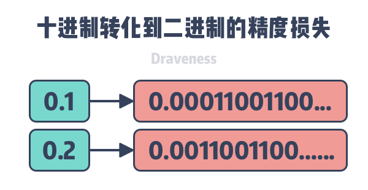


## 包装类型

**都被final修饰**,无法被继承/实现

除Double/Float外都实现了常量池技术,`Byte`,`Short`,`Integer`,`Long` 默认创建了数值 **[-128，127]** 的相应类型的缓存数据，`Character` 创建了数值在[0,127]范围的缓存数据，`Boolean` 直接返回 `True/False`


### 拆箱装箱


装箱：基本数据类型->包装器类型      valueOf方法

拆箱：包装器类型->基本数据类型      xxxValue


自动拆箱装箱在Comparator存在问题

```java
Comparator<Integer> naturalOrder = (i, j) -> (i < j) ? -1 : (i == j ? 0 : 1);
```


自动拆箱装箱简化了编程,但很可能无意识地带来了性能问题

```java
LocalDateTime now = LocalDateTime.now();
Long sum = 0L;
for (long i = 0; i < 999_9999; i++) {
  sum += i;
}
LocalDateTime now2 = LocalDateTime.now();
System.out.println(Duration.between(now, now2));

将Long改为long,0.059s -> 0.006s
```


### Integer


```java
Integer i1 = 40;
Integer i2 = 40;
Integer i3 = 0;
Integer i4 = new Integer(40);
Integer i5 = new Integer(40);
Integer i6 = new Integer(0);

i1=i2+i3   true
i4=i5+i6   true	//i5+i6被自动拆箱为0+40=40
40=i5+i6   true
```


#### IntegerCache

下界-128，上界默认127

`-XX:AutoBoxCacheMax=&lt;size` 指定上界,不支持调整下界

```java
private static class IntegerCache {
  static final int low = -128;
  static final int high;
  static final Integer cache[];

  static {
    int h = 127; //默认的上界
    .......
  }
```


### String

```java
String str1 = "abcd";//先检查字符串常量池中有没有"abcd"
String str2 = new String("abcd");//堆中创建新对象
String str3 = new String("abcd");//堆中创建新对象
String str4 = str1 + str2;//堆中创建新对象
```


#### final的好处

可以缓存 hash值 / 字符串常量池

在网络传输中保证参数不变

若允许被继承，其高度的被使用率会降低性能

核心类如果被继承并重写，会导致操作系统面临风险

final天生的线程安全

1.8+ 字符串常量池放置于方法区中


#### indexof("")


==不存在返回-1	空字符串返回0==

```java
//对于空字符串的下标获取,先赋0的初始下标
public int indexOf(String str) {return indexOf(str, 0);}

public int indexOf(String str, int fromIndex) {
  return indexOf(value, 0, value.length, str.value, 0, str.value.length, fromIndex);}

static int indexOf(char[] source, int sourceOffset, int sourceCount,
                   char[] target, int targetOffset, int targetCount,
                   int fromIndex) {

  //空字符串时,fromIndex =sourceCount=0,返回0
  if (fromIndex >= sourceCount) {
    return (targetCount == 0 ? sourceCount : -1);
  }
  if (fromIndex < 0) {
    fromIndex = 0;
  }
  if (targetCount == 0) {
    return fromIndex; }
}
```


#### 编码/解码

编码:字符 -> 字节

解码:字节 -> 字符

乱码:编码和解码过程使用不同编码方式


- GBK 编码中，中文字符占 2 个字节，英文字符占 1 个字节
- UTF-8 编码中，中文字符占 3 个字节，英文字符占 1 个字节
- UTF-16be 编码中，中文字符和英文字符都占 2 个字节

UTF-16be 中的 be 指的是 Big Endian，也就是大端。相应地也有 UTF-16le，le 指的是 Little Endian，也就是小端

Java 的内存编码使用双字节编码 UTF-16be，这不是指 Java 只支持这一种编码方式，而是说 char 这种类型使用 UTF-16be 进行编码。char 类型占 16 位，也就是两个字节，Java 使用这种双字节编码是为了让一个中文或者一个英文都能使用一个 char 来存储


```java
String str1 = "中文";
byte[] bytes = str1.getBytes("UTF-8");
String str2 = new String(bytes, "UTF-8");
System.out.println(str2);
```


newString("".getBytes("GB2312"), "ISO-8859-1");


#### 编译优化

==equals相等的字符串，在常量池中永远只有一份，在堆中有多份==

 

```java
String a="hello2";
String b="hello"+2;
System.out.println((a==b));

输出为：true。因为 ”hello” +2在编译期就已经被优化成 “hello2”

String a="hello2";
String b="hello";
String c=b+2;
System.out.println((a==c));

输出为 false。由于有符号引用的存在，所以String c=b+2不会在编译期间被优化
```


#### AbstractStringBuilder


```java
abstract class AbstractStringBuilder implements Appendable, CharSequence {
  char[] value;
  int count;	//数组长度
  AbstractStringBuilder() {}

  AbstractStringBuilder(int capacity) {
    value = new char[capacity];
  }
}
```

不是final的char[]提供了可变的字符串


##### <a name="AbstractStringBuilder.append">append</a>

```java
public AbstractStringBuilder append(String str) {
  if (str == null)	return appendNull();
  int len = str.length();
  ensureCapacityInternal(count + len);
  str.getChars(0, len, value, count);
  count += len;	//非原子性,不安全的原因
  return this;
}
```

count的非原子性操作将导致**ArrayIndexOutOfBoundsException**


##### StringBuilder


##### [append](#AbstractStringBuilder.append)

```java
@Override
public StringBuilder append(String str) {
    super.append(str);
    return this;
}
```


##### StringBuffer


```java
public final class StringBuffer extends AbstractStringBuilder implements java.io.Serializable, CharSequence{

  private transient char[] toStringCache;	//缓存toString,当数组被修改,缓存实效
  
  @Override
  public synchronized String toString() {
    if (toStringCache == null) {
      toStringCache = Arrays.copyOfRange(value, 0, count);
    }
    return new String(toStringCache, true);
  }
}
```


##### [append](#AbstractStringBuilder.append)

```java
@Override
public synchronized StringBuffer append(String str) {	//同步了append,线程安全
    toStringCache = null;	//清空缓存
    super.append(str);
    return this;
}
```


#### String/Builder/Buffer区别

* 相同点：
  * 都用 final 修饰，不能派生子类
* 不同点：
  * String只读，内容不能改变，StringBuffer和StringBuilder类表示的字符串对象可以直接进行修改，在修改的同时地址值不会发生改变
  * ==String.[equals](#equals)根据类型判断相等,==Buffer、Builder 类型不同，无法用 equals()比较内容
  * Builder线程不安全


1. 操作少量的数据: `String`
2. 单线程操作字符串缓冲区下操作大量数据:  `StringBuilder`
3. 多线程操作字符串缓冲区下操作大量数据:  `StringBuffer`


#### Splitter


```java
Splitter splitter = Splitter.on(",").omitEmptyStrings().trimResults();
List<String> list = splitter.splitToList("1,,,1,1    ,");
```


#### intern

字符串常量池存在equals的字符串 ? 返回池中字符串的引用 : 在常量池创建该字符串,返回引用

```java
public native String intern();
```


###  String 类型的变量和常量做“+”运算时发生了什么？

对象引用和“+”的字符串拼接方式，实际上是通过 `StringBuilder` 调用 `append()` 方法实现的，拼接完成之后调用 `toString()` 得到一个 `String` 对象 


```java
String str1 = "str";
String str2 = "ing";
String str3 = "str" + "ing";
String str4 = str1 + str2;
String str5 = "string";
System.out.println(str3 == str4);//false
System.out.println(str3 == str5);//true
System.out.println(str4 == str5);//false


```

经过编译器的**常量折叠**优化, str3被优化为"string"存入常量池, 与str5指向同一个常量池地址, 而str4没有被优化, 指向的是堆中的地址


在被**final**修饰后, 编译器也能将str3进行折叠

```java
//----------
final String str1 = "str";
final String str2 = "ing";
// 下面两个表达式其实是等价的
String str3 = "str" + "ing";// 常量池中的对象
String str4 = str1 + str2; // 常量池中的对象
System.out.println(str3 == str4);// true
```


### BigDecimal

BigDecimal提供了无限精度的小数,包含三个关键的成员变量

intVal 整数部分

scale 小数的位数

precision 全部的有效位数(整数位数+小数位数)

```java
public class BigDecimal extends Number implements Comparable<BigDecimal> {
    private BigInteger intVal;
    private int scale;
    private int precision = 0;
    ...
}
```


```
a.compareTo(b)	-1 : a<b

setScale	保留几位小数

stripTrailingZeros 去除尾部的0
```

**toString** 科学计数法

**toPlainString** 非科学计数法


### 禁用BigDecimal.equals进行等值比较

BigDecimal.equals会同时比较值和精度, 要用**compareTo**进行比较

```java
BigDecimal a = new BigDecimal("1");
BigDecimal b = new BigDecimal("1.0");
a.equals(b);//false
a.compareTo(b);//0
```


## 创建对象方式


1. new()
2. [Class.newInstance()](#Class) / [Constructor.newInstance()](#Constructor)
3. clone()
4. 反序列化，调用 java.io.ObjectInputStream 对象的readObject()

1/2显式调用构造 3/4不调用构造


### 创建过程


[类加载](#类加载)检查

JVM遇到 new 指令时，首先检查这个指令的参数是否能在常量池中定位到类的符号引用，并检查类是被加载、解析和初始化。如果没有，先执行类加载


分配内存

**对象所需大小在类加载后便可确定**，为对象分配空间等同于把确定大小的内存从堆中划分出来

JVM通过CAS+[TLAB](#TLAB)保证分配内存的线程安全,首先在TLAB尝试分配,当对象大于 TLAB 中的剩余内存，再采用 CAS 在堆中进行内存分配


赋初值

将分配到的内存空间都赋初值（不包括对象头）


设置对象头

保存对象是哪个类的实例、如何才能找到类的元数据信息、对象的哈希码、对象的 GC 分代年龄等信息


执行 init 方法

在上面工作都完成之后，从JVM视角来看，一个新的对象已经产生了，但``<init>` 方法还没有执行，所有的字段都还为零。所以一般来说，`<init>`将对象按照程序员的意愿进行初始化，这样一个真正可用的对象才算完全产生出来


## Object


```java
public boolean equals(Object) 	比较地址
public native int hashCode() 	获取哈希码
public String toString()
public final native Class getClass() 		获取类结构信息
protected void finalize() throws Throwable 	垃圾回收前执行的方法
protected native Object clone() throws CloneNotSupportedException	//protected,必须重写才能调用
public final native void wait(long timeout) throws InterruptedException;//释放对象锁 && 挂起，由于无参,需要配合synchronized指定需要释放的锁对象
  
  
public final native void notify() 			//由JVM随机唤醒等待队列中的其中一个线程
public final native void notifyAll() 		//唤醒所有等待线程
```


### wait/notify

是Object的方法,==会释放锁,并进入同步对象的等待队列==.必须在同步方法体内使用.需要用notify()唤醒


[sleep不释放锁](###sleep)


### == hash equals


equals():true -> 对象相同 -> hashCode相同

hashCode相同，equals()不一定true


**==是关系运算符，equals()是方法**

* ==
  * 基本类型比较值,引用类型比较地址
  * ==不能比较没有继承关系的对象==
  * 因为 Java 只有值传递，所以，对于 == 来说，不管是比较基本数据类型，还是引用数据类型的变量，其本质比较的都是值，只是引用类型变量存的值是对象的地址

* equals() 
  * 重写后比较内容
  * Object的equals 比较地址
* 对象相等 -> equals

* hashCode()

  * 根据一定的规则将与对象相关的信息（内存地址，对象的字段）映射成散列值
  * 用于查找的快捷性,用散列来确定对象hash到哪个slot,减少equals的次数
  * equals -> hashCode 相等
  * !equals -> hashCode 可以相等,但建议不同
  * 重写equals()时，有必要重写 hashCode()


### equals

==重写equals的入参必须为Object,入参为其他类型的话只是重载equals==


equals的等价关系

自反性	对象必须equals自身

对称性	a.equals(b) -> b.equals(a)

传递性


### hashCode

在运行期间,对象的equals()所用到的信息未修改,则多次调用hashCode()返回值相同

equals相等 -> hashCode相等,但反推不一定成立


#### 简化的重写hashCode

Objects.hash()为可变参数入参方法

调用hash(),指定入参可以实现快速重写hashCode


```java
//Objects
public static int hash(Object... values) {
  return Arrays.hashCode(values);
}

//重写后
@Override public int hashCode() { 
  return Objects.hash(lineNum, prefix);	//无需自定义hash过程的逻辑
}
```


### toString

重写toString能够在调试中显示更多的信息


原toString一般显示类名+@+散列码

在重写toString后,打印出的内容将是

```java
expected { abc ，123}, but was {abc, 123}	//能够更快速地定位问题
```


### clone


Cloneable表明此对象允许克隆,但此接口并没有声明clone()

Object.clone()为protected,不会因为实现Cloneable接口而变得可以调用

一般只能通过反射调用clone,但即使反射也可能失败,因为无法保证对象一定具有可访问的clone()


Cloneable只决定clone()的实现方式 -> Cloneable ? 返回对象的逐域拷贝 : CloneNotSupportedException


**不可变类不需要提供clone()**


可以将clone()理解为另一个构造器,但确保它不会影响到原始对象,并能够正确地创建被克隆对象的约束条件


### ~~finalize~~

文件句柄和套接字句柄无法被GC直接回收,在回收器释放对象的空间后,会调用它们的finalize(),从而保证一些持久性的资源被释放

终结器不能保证将在何时运行甚至是是否运行,应当尽量避免使用


### 对象克隆


* ==实现 Cloneable 接口==并重写 Object.clone()

* 实现 Serializable 接口，通过对象的==序列化和反序列化==，深度克隆,支持泛型


#### 深浅克隆

浅度拷贝	Shallow Clone

直接赋值，拷贝的只是原始对象的引用地址，在堆中仍然共用一块内存


深拷贝	Deep Clone

为新对象在堆中重新分配一块内存，所以对新对象的操作不会影响原始对象。

要将可变对象和不可变对象相互转换，或者需要==操作新对象的时候不影响原始对象，用深度拷贝== ==copy-on-write==原则就是利用深度拷贝来实现的

 

#### hutool克隆


CopyOptions定义了克隆规则		setIgnoreNullValue忽略null

```
BeanUtil.copyProperties(来源,目标, CopyOptions.create().setIgnoreNullValue(true).setIgnoreError(true));
```


## Character


```java
isLetter()		是否为字母
isDigit()		是否为数字
isWhitespace()	是否为空白字符
  
isUpperCase()	是否是大写字母
isLowerCase()	是否是小写字母
toUpperCase()	转化为大写
toLowerCase()
```


## Math


### random

```java
public static double random() {
  return RandomNumberGeneratorHolder.randomNumberGenerator.nextDouble();
}
```

返回double [0,1)	**存在除零异常**


## Random

1.7+,Random被ThreadLocalRandom取代,可以生成更快更高质量的随机数;对于Fork/Join,并行stream,则使用SplittableRandom


## 时间日期


【强制】日期格式化时，传入pattern中**年份统一使用小写的y**

yyyy表示当天所在的年，YYYY表示当天所在的周所属的年份，当本周跨年时，返回的yyyy就是下一年

表示月份是大写的M

表示分钟则是小写的m

24小时制的是大写的H

12小时制的则是小写的h

```
new SimpleDateFormat(”yyyy_MM_dd HH:mm:ss");
```


**旧API缺点**

java.util.Date 是非线程安全

在util/sql包都有日期类

没提供国际化/时区支持

**1.8+新API**

Local(本地)：简化了日期时间的处理，没有时区的问题

Zoned(时区)：通过制定的时区处理日期时间


### LocalDate/Time


LocalDate	年月日	2020-01-11

LocalTime		11:07:03.580


```java
now()
of(int year, int month, int dayOfMonth) 
plusDays(long daysToAdd)	增加天数
getYear()
  
//重写了equals方法，利于日期比较
LocalDate date1  = LocalDate.parse("2020-01-11");
LocalDate date2  = LocalDate.parse("2020-01-11");
date1.equals(date2)
//前后比较
isBefore/After()

```


### LocalDateTime


```java
LocalDateTime.toLocalDate()	//LocalDateTime->LocalDate
LocalDateTime.toLocalTime()	//LocalDateTime->LocalTime
```


### ZonedDateTime-创建时区时间

```
now()
parse("2015-12-03T10:15:30+05:30[Asia/Shanghai]")
```


#### ZoneId


```
of(String zoneId)	//创建时区
ZoneId.systemDefault()	//当前时区

```


把LocalDateTime转换成特定的时区：

```
ZonedDateTime.of(LocalDateTime localDateTime, ZoneId zone)	//LocalDateTime->ZonedDateTime
```


### Instant 时间戳


```java
now()
  
//偏移量运算
atOffset(ZoneOffset offset)

Instant.toEpochMilli()	//Instant->
```


### Timestamp


```
toLocalDateTime()	
```


### DateTimeFormatter


```java
//format
DateTimeFormatter dateFormatter = DateTimeFormatter.ISO_LOCAL_DATE;
dateFormatter.format(LocalDate.of(2018, 11, 11));

//parse
DateTimeFormatter dateFormatter = DateTimeFormatter.ofPattern("yyyy-MM-dd");
LocalDate day = LocalDate.parse("1900-01-01", dateFormatter);
```


### Duration 时间段


包含两个域：纳秒值（小于一秒的部分），秒钟值（一共的秒数），纳秒+秒 合计为真实时间长度


```java
public final class Duration implements TemporalAmount, Comparable<Duration>, Serializable {
  //没有毫秒,并且是final	,创建后无法改变时间
  private final long seconds;
  private final int nanos;
}
```


**创建**

```java
between(Temporal start, Temporal end);	//起始+结束时间

of(long amount, TemporalUnit unit)	//时间段长度+单位
```


**转化**	整个时间(秒+毫秒)的转化

```java
toNanos()
toMillis()
toMinutes()
toHours()
toDays()
//没有toSeconds()是因为等同于没有getSeconds()
```


**计算方法**	所有的计算方法都返回新的Duration，保证Duration的不可变

```java
plusNanos()
plusMillis()
plusSeconds()
plusMinutes()
plusHours()
plusDays()
minusNanos()
minusMillis()
minusSeconds()
minusMinutes()
minusHours()
minusDays()
```


## 枚举


枚举类没有可以访问的构造器 -> 属于final类,是带有泛型的单例

枚举能够保证编译时的类型安全


### EnumSet

也是继承了AbstractSet

```java
public abstract class EnumSet<E extends Enum<E>> extends AbstractSet<E> implements Cloneable, Serializable {
  final Class<E> elementType;
  final Enum<?>[] universe;

  private static Enum<?>[] ZERO_LENGTH_ENUM_ARRAY = new Enum<?>[0];

  EnumSet(Class<E>elementType, Enum<?>[] universe) {
    this.elementType = elementType;
    this.universe    = universe;
  }
}
```


#### of

```java
public static <E extends Enum<E>> EnumSet<E> of(E first, E... rest) {
  EnumSet<E> result = noneOf(first.getDeclaringClass());
  result.add(first);
  for (E e : rest)	result.add(e);
  return result;
}
```


#### EnumSet代替位域

位域

翻译位域非常困难,需要计算int的真实含义

在编写api时也需要预估需要多少位,也可能存在int->long的变化

```java
class Text {
  static final int STYLE_BLUE = 1 << 0;
  static final int STYLE_RED = 1 << 1;

  public void applyStyles(int styles) { }
}

text.applyStyles(STYLE_BLUE | STYLE_RED);
```


EnumSet.of()能够替代位域完成传递多个int

正因为枚举通常用于集合，所以没有理由用位域来表示它

```java
class Text {
  public enum Style {BLUE, RED}

  public void applyStyles(Set<Style> styles) { }
}

text.applyStyles(EnumSet.of(Style.BLUE, Style.RED));
```


### EnumMap

```java
public class EnumMap<K extends Enum<K>, V> extends AbstractMap<K, V> implements Serializable, Cloneable{
  private final Class<K> keyType;
  private transient K[] keyUniverse;
  private transient Object[] vals;	//内部用数组
  private transient int size = 0;
  private static final Object NULL = new Object() {
    public int hashCode() {
      return 0;
    }

    public String toString() {
      return "java.util.EnumMap.NULL";
    }
  };
}
```


## Optional


解决NPE,一个包含可选值的包装类，**既可以含有对象也可以为null**


```java
empty()	//返回一个空的Optional
of()/ofNullable()	//创建包含值的 Optional		of()不允许接受null
get()	
```


**检查是否有值**

```java
//接受Consumer函数
public void ifPresent(Consumer<? super T> consumer) {
  if (value != null)  consumer.accept(value);
}

opt.ifPresent( u -> assertEquals(user.getEmail(), u.getEmail()));
```


**取值**

```java
//在对象为空时返回默认值
public T orElse(T other) {
  return value != null ? value : other;
}

//在对象为空时执行Supplier
public T orElseGet(Supplier<? extends T> other) {
  return value != null ? value : other.get();
}

//区别:
//orElse()中调用方法,无论如何都会执行一次
//orElseGet()传入Supplier,只在对象为空时才被运行
User user = new User("john@gmail.com", "1234");
User result = Optional.ofNullable(user).orElse(createNewUser());	//此处必定调用createNewUser()
User result2 = Optional.ofNullable(user).orElseGet(() -> createNewUser());//不一定调用


//对象为空时抛出异常
public <X extends Throwable> T orElseThrow(Supplier<? extends X> exceptionSupplier) throws X {
  if (value != null) {
    return value;
  } else {
    throw exceptionSupplier.get();
  }
}
```


**转换值**

map和flatMap返回值为 Optional ,支持**链式调用**

```java
Optional<U> map(Function<? super T, ? extends U> mapper)		//入参不同
Optional<U> flatMap(Function<? super T, Optional<U>> mapper)//传入Optional,返回Optional
  
//user -> String
String email = Optional.ofNullable(user).map(u -> u.getEmail()).orElse("default@gmail.com");
```


**过滤**	 返回测试结果为 true 的值,如果都为false,返回empty()

```java
public Optional<T> filter(Predicate<? super T> predicate) {
  Objects.requireNonNull(predicate);
  if (!isPresent())
    return this;
  else
    return predicate.test(value) ? this : empty();
}

Optional<User> result = Optional.ofNullable(user).filter(u -> u.getEmail() != null && u.getEmail().contains("@"));
```


### 谨慎返回optinal

在没有optinal前,想要编写不返回任何值的方法时,只能抛出异常/返回null

但创建异常时会捕获整个堆栈轨迹,带来巨大开销

返回null则调用方需要额外的代码


通过optinal可以表示无法返回的有效结果

null -> Optional.empty()


尽量不要把Optional用于返回值以外的任何用途


## 内部类

内部类对象可以访问/赋值外部类对象的成员变量(**包括私有**)

编译后会生成两个不同的`.class`文件，分别是`xxx.class`和`xxx$inner.class`。所以**内部类的名字完全可以和外部类相同**


### 非静态内部类

非静态内部类无法脱离外部类独立存在 -> **创建非静态内部类的实例之前,需要先创建外部类实例**

创建非静态内部类的实例时,会隐含地**建立它与外部类实例的关联** -> 非静态内部类的实例方法内部,可以调用外部类实例的方法


可以访问外部类的所有属性/方法,但**不能持有静态属性/方法**


### 静态内部类

把它当做普通的类,只不过碰巧定义在了一个类的内部

通常作为外部类的辅助类,只在与外部类一起使用时才有意义


==内部类无需访问外部类实例时,必须定义static==,否则内部类实例将额外包含指向外部实例的引用 -> GC始终可达,外部类实例无法被回收

[HashMap.Node](#HashMap.Node)的getKey/get Value/setValue并不需要访问Map -> 定义static


==不依赖外部类而实例==，必须与外部类不同类名,**能访问外部类的所有成员,包括私有**

当静态内部类被声明为private,则只能在外部类中访问


### ~~匿名内部类~~

目前被lambada取代


* 没有名字,==不能继承,但可以作为接口,由另一个内部类实现==

* ==无法向下强转==，持有对一个匿名内部类对象引用的变量类型一定是它的直接或间接父类类型

* 不能使用class，extends，implements,没有构造函数,依赖父类的构造实例化,把创建对象的任务交给了父类


### ~~局部内部类~~


定义在代码块内

不能被public ，protected，private以及static修饰，只能访问方法中定义final类型的局部变量


### 使用场景

1、实现事件监听器（比方说actionListener 。。。采用内部类很容易实现）；

2、编写事件驱动时（内部类的对象可以访问外部类的成员方法和变量，注意包括私有成员）；

3、在能实现功能的情况下，为了节省编译后产生的字节码（内部类可以减少字节码文件,即java文件编译后的.class文件）；


### 静态内部类和内部类区别


静态内部类不需要有指向外部类的引用。但非静态内部类需要持有对外部类的引用。

静态内部类可以有静态成员(方法，属性)，而非静态内部类则不能有静态成员(方法，属性)

静态内部类只能访问外部类的静态成员。非静态内部类能够访问外部类的静态和非静态成员

实例化方式不同：

1) 静态内部类：不依赖于外部类的实例，直接实例化内部类对象

2) 非静态内部类：通过外部类的对象实例生成内部类对象


## Unsafe

提供一些用于执行低级别、不安全操作的方法，如直接访问系统内存资源、自主管理内存资源等


```java
public final class Unsafe {
  // 单例对象
  private static final Unsafe theUnsafe;
  ......
  private Unsafe() {
  }
    
  @CallerSensitive
  public static Unsafe getUnsafe() {
    Class var0 = Reflection.getCallerClass();
    // 只支持被BootstrapClassLoader加载
    if(!VM.isSystemDomainLoader(var0.getClassLoader())) {
      throw new SecurityException("Unsafe");
    } else {
      return theUnsafe;
    }
  }
}
```


unsafe的实例对象不对外暴露, 但通过反射可以获取已实例化完成的单例对象 `theUnsafe` 

```java
Field field = Unsafe.class.getDeclaredField("theUnsafe");
field.setAccessible(true);
return (Unsafe) field.get(null);
```


### 内存操作

Java对象内存的分配和回收都是由 JVM控制的。`Unsafe`提供了直接操作内存的接口


Unsafe分配的是==堆外内存==, 不受JVM控制 (有内存泄漏的风险), 需要手动调用`freeMemory`进行释放

```java
//分配新的本地空间
public native long allocateMemory(long bytes);
//重新调整内存空间的大小
public native long reallocateMemory(long address, long bytes);
//将内存设置为指定值
public native void setMemory(Object o, long offset, long bytes, byte value);
//内存拷贝
public native void copyMemory(Object srcBase, long srcOffset,Object destBase, long destOffset,long bytes);
//清除内存
public native void freeMemory(long address);
```


### 内存屏障


```java
//禁止读操作重排序，保证在这个屏障之前的所有读操作都已经完成，并且将缓存数据设为无效，重新从主存中进行加载
public native void loadFence();
//禁止store操作重排序
public native void storeFence();
//	禁止load、store操作重排序
public native void fullFence();
```


可以实现等同于volatile的功能

```java
@Getter
class ChangeThread implements Runnable{
    /**volatile**/ boolean flag=false;
    @Override
    public void run() {
        try {
            Thread.sleep(3000);
        } catch (InterruptedException e) {
            e.printStackTrace();
        }
        System.out.println("subThread change flag to:" + flag);
        flag = true;
    }
}

public static void main(String[] args){
    ChangeThread changeThread = new ChangeThread();
    new Thread(changeThread).start();
    while (true) {
        boolean flag = changeThread.isFlag();
        unsafe.loadFence(); //加入读内存屏障
        if (flag){
            System.out.println("detected flag changed");
            break;
        }
    }
    System.out.println("main thread end");
}

//运行结果
subThread change flag to:false
detected flag changed
main thread end
```


### 对象属性获取/赋值


```java
//在对象的指定偏移地址获取一个对象引用
public native Object getObject(Object o, long offset);
//在对象指定偏移地址写入一个对象引用
public native void putObject(Object o, long offset, Object x);

//出了object外,unsafe对于8大基本类型都有对应的get/put方法
```


### CAS

```java
/**
  *  CAS
  * @param o         包含要修改field的对象
  * @param offset    对象中某field的偏移量
  * @param expected  期望值
  * @param update    更新值
  * @return          true | false
  */
public final native boolean compareAndSwapObject(Object o, long offset,  Object expected, Object update);

public final native boolean compareAndSwapInt(Object o, long offset, int expected,int update);

public final native boolean compareAndSwapLong(Object o, long offset, long expected, long update);
```


### 线程调度

 `LockSupport` 的 `park`、`unpark` 方法实际是调用 `Unsafe` 的 `park`、`unpark`

```java
//取消阻塞线程
public native void unpark(Object thread);
//阻塞线程
public native void park(boolean isAbsolute, long time);
```


# 反射

==通过堆中的class对象访问到方法区中class文件== 即运行时动态获取类的方法

**动态获取类信息/调用对象方法** 在运行时，对任意类，都能获取到这个类的所有属性和方法,对于任意对象，都能够调用它的任意方法和属性


对象存在两种类型：编译时类型和运行时类型。编译时的类型由声明对象时实用的类型来决定，运行时的类型由实际赋值给对象的类型决定

```java
Person p=new Student(); //编译时类型Person，运行时类型Student
```

* **反射解决了程序如何调用运行时类型方法的问题**
* 反射让开发人员可以通过外部类的全路径名创建对象，并使用这些类，实现一些扩展的功能。
* 反射让开发人员可以枚举出类的全部成员，包括构造函数、属性、方法。以帮助开发者写出正确的代码。
* 测试时可以利用反射 API 访问类的私有成员，以保证测试代码覆盖率。


适用场景

* 在编译时不知道该对象或类可能属于哪些类，通过反射可以使程序代码访问装载到JVM中的类的内部信息
* 反射提高了灵活性和扩展性，**低耦合**。允许**程序创建和控制任何类的对象，无需提前硬编码**目标类
* 反射是**解释操作**，用于字段和方法接入时效率低
* 会模糊程序内部逻辑：程序人员希望在源代码中看到程序的逻辑，反射等绕过了源代码的技术，带来维护问题


## Class

Class类是反射的入口，用于获取与类相关的各种信息和方法

**每个类也可看做是对象**，有共同的Class来存放类的结构信息，能够通过相应方法取出相应信息：类名、属性、方法、构造方法、父类和接口


==获取class对象4种方式== (反射的实现方式)

1. 类名.class

2. Class.forName("包名")

3. 对象.getClass()

4. 类加载器.loadClass("包名")	类加载器获取class对象不会进行初始化,静态块和静态对象不会得到执行


| asSubclass(Class<U>  clazz)              | 把传递的类的对象转换成代表其子类的对象 |
| ---------------------------------------- | -------------------------------------- |
| getClassLoader()                         | 获得类的加载器                         |
| getClasses()                             | 返回数组，包含公共类和接口类的对象     |
| getDeclaredClasses()                     | 返回数组，包含类和接口类的对象         |
| forName(String  className)               | 根据类名返回类的对象                   |
| getName()                                | 获得类的完整路径名字                   |
| newInstance()                            | 创建类的实例                           |
| getPackage()                             | 获得类的包                             |
| getSimpleName()                          | 获得类的名字                           |
| getSuperclass()                          | 获得当前类继承的父类的名字             |
| getInterfaces()                          | 获得当前类实现的类或是接口             |
|                                          |                                        |
| isAnnotation()                           |                                        |
| isArray()                                |                                        |
| isEnum()                                 |                                        |
| isInstance(Object obj)                   | 是该类的实例则返回true                 |
| isInterface()                            |                                        |
|                                          |                                        |
| getAnnotation(Class<A>  annotationClass) | 获得与参数类型匹配的公有注解对象       |


## Field


代表类的成员变量。**成员变量（字段）!=成员属性**。User类中有name变量，则它有name字段。如果**没有get/setName，就没有name属性**。**如果有get/set,不管字段是否存在，都认为有这个属性**


| getField(String name)          | 获得1个public字段  |
| ------------------------------ | ------------------ |
| getFields()                    | 获得所有public字段 |
| getDeclaredField(String  name) | 获得某个字段       |
| getDeclaredFields()            | 获得所有字段       |
| setAccessible(true)            | 忽略访问权限修饰符 |


getDeclaredField()访问非public字段时,会报错

```
can not access a member of class  with modifiers "private"
```

setAccessible(true)忽略访问修饰符


```java
@Test
public void testSet() throws Exception {
  User user = new User("张三", 23, "220202202002022222");
  Class<? extends User> userClass = user.getClass();

  Field idNumberField = userClass.getField("idNumber");
  // set方法：给对象的字段设置值。需要传入当前被操作的user对象
  idNumberField.set(user, "123456");
}
```


## Method


| **方法**                           | **用途**                                 |
| ---------------------------------- | ---------------------------------------- |
| invoke(Object obj, Object... args) | 传递object对象及参数调用该对象对应的方法 |
| getName                            | 获取方法名                               |
| SetAccessible(true)                | 暴力反射，忽略访问权限修饰符             |


Invoke方法的用处：SpringAOP在切面方法执行的前后进行某些操作，就是使用的invoke方法。

| **方法**                                                    | **用途**               |
| ----------------------------------------------------------- | ---------------------- |
| getMethod(String name,  Class...<?> parameterTypes)         | 获得该类某个公有的方法 |
| getMethods()                                                | 获得该类所有公有的方法 |
| getDeclaredMethod(String name,  Class...<?> parameterTypes) | 获得该类某个方法       |
| getDeclaredMethods()                                        | 获得该类所有方法       |


## ~~Constructor~~


| **方法**                                            | **用途**                                          |
| --------------------------------------------------- | ------------------------------------------------- |
| getConstructor(Class...<?>  parameterTypes)         | 获得该类中与参数类型匹配的公有构造方法            |
| getConstructors()                                   | 获得该类的所有公有构造方法                        |
| getDeclaredConstructor(Class...<?>  parameterTypes) | 获得该类中与参数类型匹配的构造方法                |
| getDeclaredConstructors()                           | 获得该类所有构造方法                              |
| ==newInstance(Object... initargs)==                 | 根据传递的参数创建类的对象(**弱引用,容易被回收**) |


* Class类的newInstance()只能无参构造
* Constructor的newInstance()能传递构造参数

```java
Class<Session> sessionClass = Session.class;
Constructor<Session> declaredConstructor = sessionClass.getDeclaredConstructor();
declaredConstructor.setAccessible(true);
Session session2 = declaredConstructor.newInstance();
```


Constructor类违背了Java思想

* 可以无视private的构造方法,强行创建对象
* 破坏单例


# 关键词

## 4种访问权限


对于顶层的类/接口,应当设置 包级私有/公有

private	声明该类成员的顶层类内部

default	包内部的任何类

protected	声明该类的子类可访问

public	任何地方


public类的非final实例域决不能是公有的,这将放弃在这个域中存储的能力限制,任何地方都可以修改域中的值


### 继承的访问权限

==重写的访问修饰符只能比父类大==

Public继承	    不改变父类的访问权限

protected          private不变,其余都变为protected

private            都改成private


### 子类成员在外部的访问权限

**父类的private     只有父类能访问**

private方式继承的非private成员    只有子类的成员函数能访问,子类的子类/外部不能访问

protected方式继承的非private成员 	只有子类及子类的子类(非private继承) 能访问


## null

==null不是对象==，内存中并没有为它分配空间。赋值null表明这个引用没有指向任何一个对象。Java虚拟机的规范中也没有规定null的具体值


null也可以被强转,这样是编译通过的;	但null不能被赋值给基本类型

```java
String s = (String) null; //√
int i = null; //×

Integer j = null;
int k = j; //这样能绕过编译器的检测,不过会在运行时抛出NPE

String s1 = null;
s1 instanceof String; // false		instanceof为true的条件: 不为null && 没有触发ClassCastException
```


## final

不能修饰构造方法

天生的==线程安全==


==private方法会被隐式地指定为final==

子类方法 和 基类private方法签名相同，则是在子类中定义了新方法,而不是重写


| 类       | 方法     | 基本类型   | 引用类型                                                 |
| -------- | -------- | ---------- | -------------------------------------------------------- |
| 不能继承 | 不能重写 | 不能改变值 | 不能指向新对象,引用对象的所有成员方法被隐式地指定为final |


```java
 final Dog dog = new Dog("aa");
 dog.name = "bb";//正确
 dog = new Dog("cc");//错误
```


## static

1. **修饰成员变量和成员方法:** 被 static 修饰的成员属于类，不属于单个这个类的某个对象，被类中所有对象共享，可以并且建议通过类名调用。被static 声明的成员变量属于静态成员变量，静态变量 存放在 Java 内存区域的方法区
2. **静态代码块:** 静态代码块在非静态代码块之前执行(静态代码块—>非静态代码块—>构造方法)。 不管创建多少对象，静态代码块只执行一次
3. **静态内部类（static修饰类的话只能修饰内部类）：**静态内部类与非静态内部类之间存在一个最大的区别: 非静态内部类在编译完成之后会隐含地保存着一个引用，该引用是指向创建它的外围类，但是静态内部类却没有。没有这个引用就意味着：1. 它的创建是不需要依赖外围类的创建。2. 它不能使用任何外围类的非static成员变量和方法。
4. **静态导包(1.5+新特性):**


- 在外部调用静态方法时，可以使用”类名.方法名”的方式，也可以使用”对象名.方法名”的方式。而实例方法只有后面这种方式。也就是说，调用静态方法可以无需创建对象。 
- 静态方法在访问本类的成员时，只允许访问静态成员（即静态成员变量和静态方法），而不允许访问实例成员变量和实例方法；实例方法则无此限制 


### static VS 成员变量


|          | static变量       | 成员变量             |
| -------- | ---------------- | -------------------- |
| 生命周期 | 类加载 -> 类卸载 | 对象创建 -> 对象回收 |
| 调用方式 | 对象/类调用      | 对象调用             |
| 存储位置 | 方法区,1个       | 堆,多个              |
|          |                  |                      |


static不代表不可修改,它是能够时刻保持最新的值的静态变量

==静态是指不会随着函数的调用/退出发生变化==。下次调用时，这个值与上次调用一致

==static final全局常量才不能修改==


static方法从类加载便存在,所以必须有实现


## this / super

this	指向引用类的当前实例

this()	只能用于构造方法中调用其他构造方法

外部类名.this.属性/方法	表示在内部类中调用的是外部类的属性/方法


super指向父类对象,构造器中使用super需要放在首行


**this和super不能在static方法中使用**,都是指向了对象,而static属于类


## native


```
@Documented
@Target(ElementType.FIELD)
@Retention(RetentionPolicy.SOURCE)
public @interface Native {}
```

native是**java调用非java代码的接口**,定义Native Method时,**并不需要提供实现**

调用者不知道它所调用的是一个本地方法。JVM将控制调用本地方法的所有细节

子类可以继承本地方法并用java重写	**本地方法被fianl标识，继承后不能被重写**


==native可以与所有修饰符连用，除abstract==,与abstract的无实现相违背

==native method可以返回任何java类型，包括非基本类型==，可以进行异常控制。这些方法的实现体可以制一个异常并且将其抛出。当native method接收到非基本类型,可以访问非基本类型的内部，**但这将使native method依赖于所访问的java类的实现**


==JVM怎样使Native Method跑起来==
当类第一次被使用时，这个类的字节码会被加载到内存。在这个被加载的字节码入口,维持着该类所有方法描述符的list，这些方法描述符包含：方法代码存储地址，参数，修饰符等
native修饰符将有指向该方法实现的指针。这些实现在一些DLL文件内，会被操作系统加载到java程序的地址空间。当带有本地方法的类被加载时，其相关的DLL并未被加载，因此指向方法实现的指针并不会被设置。**当本地方法被调用之前，这些DLL才会被加载**，通过调用java.system.loadLibrary()实现


## Switch


1.5前，只能是byte，short，char，int类型(或其包装类)的常量表达式

1.5后，引入枚举enum

1.7后，支持String,底层调用String.hashCode(),所以==必须先判空==

**long在所有版本都不行**


switch底层都是用int进行比对,byte，short，char,enum都可以隐式转换为int,而string则是转换成了hashCode()

```java
//在编译后的class中
String string = "Hello";
String s;
switch ((s = string).hashCode()){
  case 2301506: 
    //用equals进行安全检查（避免hash相同值不同）
    if (!s.equals("Java"))
```


每个case要么通过continue/break/return等来终止，要么注释说明程序将继续执行到哪一个case为止

必须包含一个default语句并且放在最后


## transient

阻止变量被序列化；在反序列化时,赋默认值

transient只能修饰变量


# 注解

注解本身并不起任何作用,只作为标识	通过反射来获取注解,再根据注解的参数执行业务


* 作用分类：
  * 编写文档：通过代码中标识的注解生成文档（Swagger）
  * 代码分析：通过代码里的注解对代码进行分析（逻辑判断）
  * 编译检查：通过代码里对应的注解让编译器实现基本的编译检查（Override，Deprecated，FunctionalInterface）

* JDK中预定义的一些注解
  * Override：检测该注解标识的方法是否继承自父类
  * Deprecated：标识方法、类、字段等已经过时，后续的版本可能会将其移除
  * SuppressWarnings：压制警告


## 元注解


==用于描述注解的适用范围==


* @Target	作用范围

* ```shell
  Type：作用于类
  METHOD：作用于方法
  FIELD：作用于字段
  PACKAGE
  ElementType取值
  PARAMETER
  TYPE_PARAMETER  标注类型参数
  CONSTRUCTOR
  LOCAL_VARIABLE  局部变量
  ANNOTATION_TYPE  注解类
  TYPE_USE  所有类型
  ```

* @Retention：描述注解被保留的阶段

  * RetentionPolicy.RUNTIME：当前描述的注解，会保留到class字节码文件中，并被jvm读取到	**默认**

  * RetentionPolicy.SOURCE：注解只保留在源文件，当Java文件编译成class文件的时候，注解被遗弃

  * RetentionPolicy.CLASS：注解被保留到class文件，但jvm加载class文件时候被遗弃

    生命周期长度 SOURCE < CLASS < RUNTIME

    需要在运行时动态获取注解信息，那只能用RUNTIME注解，比如@Deprecated使用RUNTIME注解
    在编译时进行预处理操作，比如生成一些辅助代码（如 ButterKnife），就用 CLASS注解；
    只是检查性的操作，比如 @Override 和 @SuppressWarnings，使用SOURCE 注解。

* @Documented：描述注解是否被抽取到javadoc中

* @Inherited：描述注解是否可以被继承

* @Repeatable:指明注解为可重复注解，可以在同一个地方多次使用

* @Scheduled

  ```shell
  #Cron 定时时间		允许正则表达式
  @Scheduled(cron = "0 0 5 * * ?")      [秒] [分] [小时] [日] [月] [周] [年]
  ?    不指定值
  \-    区间
  ,    指定多个值
  /    递增触发。秒”5/15” 表示从5秒开始，每增15秒触发
  L    最后。对于日字段，表示当月的最后一天.对于周字段上设置”6L”这样的格式,则表示“本月最后一个星期五”
  W   离指定日期的最近的工作日(周一至周五). 例如在日字段上置”15W”，表示离每月15号最近的那个工作日触发。如果15号正好是周六，则找最近的周五(14号)触发, 如果15号是周未，则找最近的下周一(16号)触发.如果15号正好在工作日(周一至周五)，则就在该天触发。如果指定格式为 “1W”,它则表示每月1号往后最近的工作日触发。如果1号正是周六，则将在3号下周一触发。(注，”W”前只能设置具体的数字,不允许区间”-“)。
  \#    序号(表示每月的第几个周几)，例如在周字段上设置”6#3”表示在每月的第三个周六.注意如果指定”#5”,正好第五周没有周六，则不会触发该配置
  ’L’和‘W’组合使用。在日字段上设置”LW”,则表示在本月的最后一个工作日触发；周字段的设置，若使用英文字母是不区分大小写的，即MON与mon相同
  
  # zone时区.一般留空
  fixedDelay上一次执行完毕后多长时间再执行
  @Scheduled(fixedDelay = 5000) //上一次执行完毕时间点之后5秒再执行
  
  fixedDelayString 同上的字符串形式,支持占位符
  @Scheduled(fixedDelayString = "5000") //上一次执行完毕时间点之后5秒再执行
   fixedRate上一次开始执行后多长时间再执行
  
  @Scheduled(fixedRate = 5000) //上一次开始执行时间点之后5秒再执行
  
  fixedRateString同上的字符串形式。支持占位符
  
  initialDelay第一次延迟多长时间后再执行
  
  @Scheduled(initialDelay=1000, fixedRate=5000) //第一次延迟1秒后执行，之后按fixedRate的规则每5秒执行一次
  
  initialDelayString同上的字符串形式。支持占位符
  ```


## 自定义注解


```java
@Target(ElementType.TYPE)
@Retention(RetentionPolicy.RUNTIME)
public @interface MyAnnotation {
    String name() default "lx";
    int value();
}
```


```
@MyAnnotation(123)
public class User{}
```


```java
public void testAnnotation() {
  Class<User> userClass = User.class;
  // 获取注解
  MyAnnotation myAnnotation = userClass.getAnnotation(MyAnnotation.class);
  // 注解不为空的时候进行处理
  if (myAnnotation != null) {
    // 获取打在User类上的注解的两个属性
    System.out.println(myAnnotation.name() + ":" + myAnnotation.value());
  }
}
```


==注解本质上是一个接口，默认继承自Annotation接口==

* 如果定义了属性，在使用属性的时需要赋值

* ==只有一个属性且名称value，则可以省略==

* 数组赋值时用{}封装

* ==属性中的返回值==类型有下列取值：
  * 基本数据类型
  * String
  * 枚举
  * 注解
  * 以上类型的数组


# 泛型


## 限定/非限定通配符

**限定通配符**

<? extends T>	?必须是T的子类

<? super T>	?必须是T的父类


**非限定通配符**

<?>	任意类型


```java
List listOfRawTypes = new ArrayList();
listOfRawTypes.add(“abc”);
listOfRawTypes.add(123); //编译器校验正常 – 运行时却会出现异常
```


## 泛型擦除

泛型擦除是为了确保能和Java5之前的版本开发二进制类库进行兼容

```java
List<User> list= new ArrayList<>();
Class<? extends List> listClass = list.getClass();
Method add = listClass.getDeclaredMethod("add", Object.class);
add.setAccessible(true);
//通过invoke()避免了编译时的泛型检验
add.invoke(list, 5);
```


