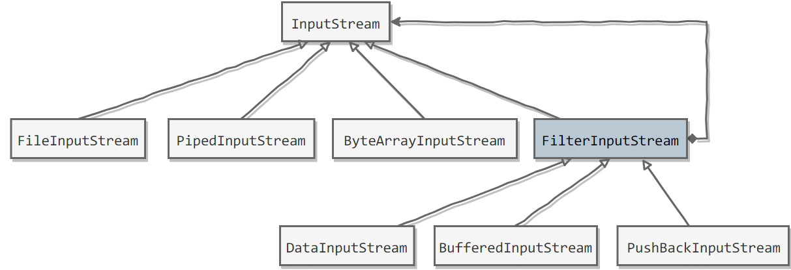
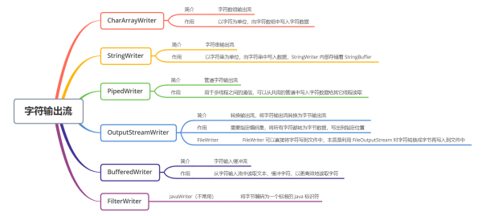
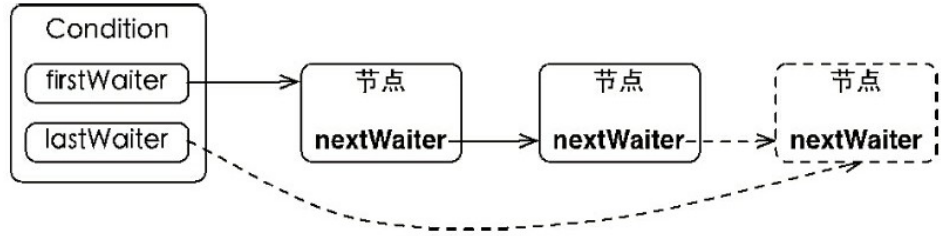
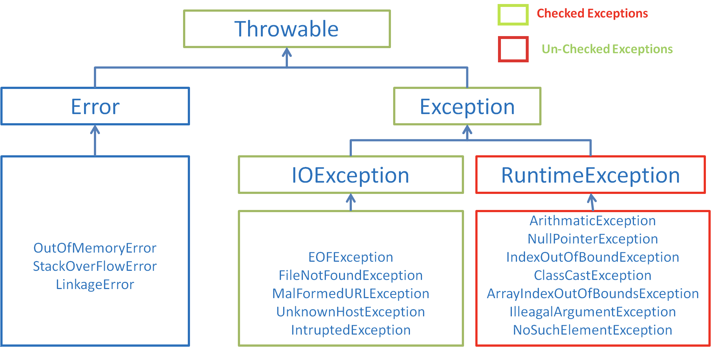

# 暂定

#### JDK 和 JRE

Java Development Kit是功能齐全的 Java SDK。拥有 JRE 所拥有的一切，还有编译器（javac）和工具（如 javadoc 和 jdb）。能够创建和编译程序

JRE 是 Java 运行时环境。它是运行已编译 Java 程序所需的所有内容的集合，包括 Java 虚拟机（JVM），Java 类库，java 命令和其他的一些基础构件。但是，它不能用于创建新程序。

如果你只是为了运行一下 Java 程序的话，那么你只需要安装 JRE 就可以了。如果你需要进行一些 Java 编程方面的工作，那么你就需要安装 JDK 了。但是，这不是绝对的。有时，即使您不打算在计算机上进行任何 Java 开发，仍然需要安装 JDK。例如，如果要使用 JSP 部署 Web 应用程序，那么从技术上讲，您只是在应用程序服务器中运行 Java 程序。那你为什么需要 JDK 呢？因为应用程序服务器会将 JSP 转换为 Java servlet，并且需要使用 JDK 来编译 servlet。


### 编译与解释并存


高级编程语言按照程序的执行方式分为编译型和解释型两种。简单来说，编译型语言是指编译器针对特定的操作系统将源代码一次性翻译成可被该平台执行的机器码；解释型语言是指解释器对源程序逐行解释成特定平台的机器码并立即执行

Java的编译	[类加载,.java->.class](#类加载)

Java的解释	[JIT](#JIT)


**面向对象**带来创建实例/分配内存**并非Java性能低的根本原因**,面向过程也需要分配内存，计算内存偏移量

**面向过程的语言大多被直接编译成机器码,而Java是半编译半解释**


### 静态不能调用非静态


静态方法属于类,在[加载](加载)时根据.class在堆中创建class对象 -> 支持通过类名直接访问

非静态成员属于实例,此时内存中还不存在实例,也不存在实例的方法,所以无法被静态地访问


### Java只有值传递

方法得到的是参数值的拷贝，无法修改原参数的内容


对于基本类型,传地址

对于其他类型,传引用地址,也是地址的值


Java虽然传地址的值,但不是引用调用


### 成员变量 VS 局部变量

1. 从语法形式上看，成员变量是属于类的，而局部变量是在代码块或方法中定义的变量或是方法的参数；成员变量可以被 `public`,`private`,`static` 等修饰符所修饰，而局部变量不能被访问控制修饰符及 `static` 所修饰；但是，成员变量和局部变量都能被 `final` 所修饰。
2. 从变量在内存中的存储方式来看,如果成员变量是使用 `static` 修饰的，那么这个成员变量是属于类的，如果没有使用 `static` 修饰，这个成员变量是属于实例的。而对象存在于堆内存，局部变量则存在于栈内存。
3. 从变量在内存中的生存时间上看，成员变量是对象的一部分，它随着对象的创建而存在，而局部变量随着方法的调用而自动消失。
4. 从变量是否有默认值来看，成员变量如果没有被赋初，则会自动以类型的默认值而赋值（一种情况例外:被 `final` 修饰的成员变量也必须显式地赋值），而局部变量则不会自动赋值


# 继承


超类和子类 成员变量名称相同

子类拥有父类对象所有的属性和方法（包括私有属性和私有方法），但是父类中的私有属性和方法子类是无法访问，**只是拥有**

不会重写父类成员变量,**子类中将有两个相同名称的变量**

==子类重写父类的方法，访问级别不允许低于父类== -> 里氏替换

```java
public class A {  
  public int m = 1;  

  public void view(){
    System.out.println(this.m);
  }  
}  

public class B extends A{  

  public int m = 2;  

  /**
 *  @Override
 *  public void view(){
 *      System.out.println(this.m);		//2
 *      System.out.println(super.m);	//1
 *  }
 */  

  public static void main(String[] args) {
    B b = new B();
    b.view();		//1
  }  
}
```


==继承打破封装性==

> 需求:继承HashSet实现新类,增加插入元素的计数的功能
>
> 
>
> 实现1:重写add和addAll,每加入一个元素计数+1,调用super.add/addAll
>
> 然而HashSet的addAll依赖于add进行实现,这将使得addAll进行了+2
>
> 
>
> 实现2:完全重写addAll,不依赖于super.add实现
>
> 这使得编程变得极为复杂

哪怕不覆盖现有方法,也存在父类方法间互相调用而导致子类的实现有所差异

子类将依赖于父类的特定功能的实现细节,当父类随着发行版本而变化,子类将必须随之改变


## 复合

将现有类变为新类的一个组件,完全不拓展现有类,而是在新类增加私有域去引用现有类的一个实例

新类的每个方法都可以调用现有类的实现


```java
//继承
public class CountSet<E> extends HashSet<E>{
  private int count = 0;
  public boolean add(E e) {
    count++;
    return super.add(e);
  }
}

//复合
public class CountSet<E> extends HashSet<E>{
  private int count = 0;
  HashSet s = new HashSet<>();
  
  public boolean add(E e) {
    count++;
    return s.add(e);
  }
}
```


只在真正是子类型,存在is-a关系时,才适合用继承

每个B都是A么?	在大多数情况下,B只需包含A的一个私有实例,利用它的实现细节罢了


在Java类库中,Stack并不是向量,却继承了向量Vector -> Vector废弃将导致Stack也废弃


## 继承优于标签


以标签区分类型,代码中将充斥着样板代码，包括枚举声明、标签域以及条件语句

在标签过多时,也会加大bug的概率

标签类完全可以转化为等价的继承关系

```java
public class Figure {
  enum Shape {RECTANGLE, CIRCL}	//标签区分类型,决定用到的成员变量,area方法的计算方式
  final Shape shape;
	
  double length;	//RECTANGLE专用
  double width;

  double radius;	//CIRCL专用

  Figure(double radius) {
    shape = Shape.CIRCL;
    this.radius = radius;
  }

  public Figure(double length, double width) {
    shape = Shape.RECTANGLE;
    this.length = length;
    this.width = width;
  }

  double area() {
    switch (shape) {	//新增类型,构造器也需增加新的逻辑,否则运行失败
      case CIRCL:
        return Math.PI * (radius * radius);
      case RECTANGLE:
        return length * width;
      default:
        throw new AssertionError(shape);
    }
  }
}
```


用继承改写后,带来了层级关系,去除了标签的冗余逻辑

```java
abstract class Figure {
  abstract double area();	//公共的area()
}

class Cicle extends Figure {

  final double radius;	//CIRCL类型对应(radius)

  public Cicle(double radius) { this.radius = radius; }

  @Override
  double area() { return Math.PI * (radius * radius); }
}
```


另外一点,子类的构造器也能反映与父类的关系

```java
class Square extends Recyangle {
  Square(double side) {
    super(side, side);
  }
}
```


## 永远打上Override


[Object.equals](#equals)入参为Object,在子类往往因定义的入参不是Object,而导致仅仅重载equals


打上@Override能利用编译器的检查,减少此类bug

也能及时发现有@Override却没有重写方法


## 重写


1. 返回值类型、方法名、参数列表相同
2. 抛出的异常<=父类异常，访问修饰符范围>=父类
3. 如果父类方法访问修饰符为 `private/final/static` 则子类就不能重写该方法，但是被 static 修饰的方法能够被再次声明
4. 构造方法无法被重写


## 慎用重载


```java
String classify(Set<?> s) { return "Set"; }
String classify(List<?> s) { return "List"; }
String classify(Collection<?> s) { return "Collection"; }

public void test() {
  Collection<?>[] collections = {
    new HashSet<>(),
    new ArrayList<>(),
    new HashMap<>().values()
  };

  for (Collection<?> c : collections) {
    System.out.println(classify(c));	//输出Collection * 3
  }
}
```


==重载方法的类型在编译时决定,重写方法的类型在运行时决定== -> **重载方法的选择是静态的，被覆盖的方法的选择则是动态的**

每次调用的对象类型不同,但这并不影响选择重载方法,因为对象在编译时的类型是确定的


重写是标准规范,而重载机制是例外 -> 重写机制符合正常逻辑,在使用重载时可能引发无法理解的bug


根本原因是重载入参的混淆性,父子类入参在重载时的调用不符合预期	一种方法是严格规定入参为绝不会混淆的类型

**命名代替重载**

[ObjectOutputStream.write](#ObjectOutputStream)对每种参数类型都有一种变形,但这些变形并不是重载 write，而是通过命名区分 writeBoolean()/writeInt()


但构造器必定是重载的,无法命名,但可以通过静态工厂取代构造器


自动拆箱装箱也会导致重载的混淆

List.remove(Object)移除指定元素	List.remove(int)移除指定下标

若为List<Integer>,删除时入参为int,以为会被自动装箱为Integer,实际调用的是List.remove(int),根据下标删除导致删除异常


重载时需要留意:各个方法的逻辑大体一致,入参可以通过简单的类型转换就转发给不同的重载方法 -> 多种重载实际生效的只应该有一个


 

# 接口


## ~~常量接口~~

constant interface


==接口只用于定义类型==,常量接口是对接口的不良使用

类内部的常量属于实现细节,类中常量的命名也将被接口类常量占用


## 标记接口

不包含方法声明的接口,只代表一个类实现了具有某种属性的接口

```java
实现Serializable意味着对象可以被ObjectOutputStream.writeObject()
```


标记接口相较于标记注解,能够提供类型的限制 -> 编译时IDE的类型提示


## default 1.8+


~~public~~ default


抽象类更多的是提供一个模板，子类间流程大致相同，仅仅是某个步骤可能不一样（模板方法设计模式），这个时候使用抽象类，该可变步骤定义为抽象方法

default直接提供了方法的实现,不需要修改实现类


**default缺点**

并非每一个实现类都需要default方法,新增defalut会带来历史子类的测试,不适配的子类必须重写default方法

新增default方法后,子类并不会出现编译时的报错,但运行时可能因为新增方法而异常

尽管default能够为所有子类新增一个已实现的方法,但这很可能会带来难以测试的bug


## 静态方法 1.8+


不会被实现类所实现,**只用于内部调用**


两个接口定义**相同静态方法**，实现类实现这两个接口，并不会产生错误，编译器通过**反射**区分是哪个接口下的方法

两个接口定义**相同非静态方法**，实现类实现了这两个接口，必须在实现类中重写默认方法


## 函数式接口


**只有一个抽象方法**


**@FunctionalInterface**

只在编译期起作用。编译期会强制检查该接口是否符合函数式接口的条件，不符合则会报错。**即使不使用，只要满足定义也是函数式接口**。


### Supplier


T get()	获取一个泛型参数指定类型的对象数据	**生产一个数据**

```java
public void testGetUser() {
  User user = getUser(User::new);}

private User getUser(Supplier<User> supplier) {
  return supplier.get();}
```

 

Supplier求数组元素的最小值

```java
public void testGetMin(){
  int[] arr={5,3,100,10};
  int min = getMin(()->{
    int minNum=arr[0];
    for (int i : arr) {
      if (i<minNum) minNum=i;}
    return minNum;
  });}

private Integer getMin(Supplier<Integer> supplier) {
  return supplier.get();
}
```

 

### Consumer

**与Supplier接口相反**，消费一个数据


**抽象方法：accept**，消费一个指定泛型的数据

```java
public void testConsumer() {
  User user = new User();
  setUserDefaultSex(u -> u.setSex("nan"), user);	//user的sex被改变
}
private void setUserDefaultSex(Consumer<User> consumer, User user) {
  consumer.accept(user);
}
```


**默认方法：andThen**

**方法的参数和返回值全都是 Consumer 类型**，那么就可以实现效果：消费数据的时候，首先做一个操作，然后再做一个操作，实现组合

要想实现组合，需要两个或多个Lambda表达式

```java
public void testConsumer2() {
  User user = new User();
  setUserNameAndSex(u -> u.setSex("nan"), u -> u.setName("aa"), user);
  System.out.println(user.getSex() + user.getName());}

private void setUserNameAndSex(Consumer<User> one, Consumer<User> two, User user) {
  one.andThen(two).accept(user);
}
```

 

### BiConsumer


```java
void accept(T t, U u);	//接受2个入参的Consumer

default BiConsumer<T, U> andThen(BiConsumer<? super T, ? super U> after) {
  Objects.requireNonNull(after);

  return (l, r) -> {
    accept(l, r);
    after.accept(l, r);
  };
}
```


### Predicate

对某种类型的数据进行判断，**得到boolean**结果

**抽象方法：test** 	用于条件判断

```
public void testPredicate() {
        longThan(s -> s.length() > 5, "hello!!");}

    private void longThan(Predicate<String> predicate, String str) {
        boolean flag = predicate.test(str);}
```


**默认方法：and** 

**默认方法：or** 

```
public void testSuccess() {
    successMan(s -> s.contains("富"), s -> s.contains("帅"), "高富帅");}

private void successMan(Predicate<String> one, Predicate<String> two, String str) {
    boolean flag = one.or(two).test(str);}
```

**默认方法：negate** 	取反


```java
public interface Predicate<T> {

  boolean test(T t);

  default Predicate<T> and(Predicate<? super T> other) {	//与
    Objects.requireNonNull(other);
    return (t) -> test(t) && other.test(t);
  }

  default Predicate<T> negate() {	//非
    return (t) -> !test(t);
  }

  default Predicate<T> or(Predicate<? super T> other) {	//或
    Objects.requireNonNull(other);
    return (t) -> test(t) || other.test(t);
  }

  static <T> Predicate<T> isEqual(Object targetRef) {
    return (null == targetRef) ? Objects::isNull : object -> targetRef.equals(object);
  }
}
```


### Function


**抽象方法：apply** 

java.util.function.Function<T,R>根据 T类型的参数得到 R类型的返回值

```
public void testFunction() {
        Integer value = parseInteger(Integer::parseInt, "10");}

    private Integer parseInteger(Function<String, Integer> function, String str) {
        return function.apply(str);}
```

**默认方法：andThen**


静态方法 identity

```java
static <T> Function<T, T> identity() {
  return t -> t;	//返回入参本身
}
```


## Lambda


函数式编程思想,只关注做什么,不关注怎么做

编译器通过类型推断得到参数的类型


(类型 参数1, 类型 参数2....) -> {代码}

**参数没有则留空,有则必须是函数式接口@FunctionalInterface**


* FunctionalInterface	起到注释作用,标明这是函数式接口,避免其他人写入方法
  * **只有一个抽象方法**
  * default属于默认实现，不属于抽象方法
  * 接口重写了Object的公共方法也不算入内


lambda无法单独出现，需要函数式接口来盛放，lambda方法体是函数接口的实现


lambda表达式可以访问给它传递的变量，访问自己内外部的变量。但**只能访问外部final变量时**,即一旦定义后，在后面就不能再随意修改引用

​	实例变量存在堆中，而局部变量存在栈，**lambda会在另一个线程中执行**。如果在线程中要直接访问一个局部变量，可能线程执行时该局部变量已经被销毁了，而 **final 类型的局部变量在 Lambda 表达式(匿名类) 中其实是局部变量的一个拷贝**

[不可变则一定是线程安全的](#Immutable)


==在lambda中，this不是指向lambda表达式产生的那个对象，而是声明它的外部对象==


### 延迟执行


先合并字符串,再判断level==1,决定要不要执行方法 

```java
public class Demo01Logger {
    private static void log(int level, String msg) {
        if (level == 1) {
            System.out.println(msg);}}
  
    public static void main(String[] args) {
        String msgA = "Hello";
        String msgB = "World";
        log(1, msgA + msgB);}}
```


优化后,先判断,后执行字符串合并

```java
@FunctionalInterface
public interface MessageBuilder {
    String buildMessage();
}

public class Demo02LoggerLambda {
    private static void log(int level, MessageBuilder builder) {
        if (level == 1) {
            System.out.println(builder.buildMessage());}}

    public static void main(String[] args) {
        String msgA = "Hello";
        String msgB = "World";
        log(1, () -> msgA + msgB  );//避免字符串合并
    }}
```


### 方法引用 ::

如果Lambda要表达的函数方案已存在于某个方法的实现中，可以通过::来引用该方法

* Lambda写法	 s -> System.out.println(s); 	拿到参数之后经Lambda之手，继而传递给 System.out.println 方法去处理

* 方法引用写法	 System.out::println     直接让println 方法来取代Lambda

* 对象名引用	user :: getName

* 构造器引用	User::new

* 类名引用		User::getName

* super引用成员方法  super::sayHello

  ```
  public class Woman extends Human {
      @Override
      public void sayHello() {
          System.out.println("大家好,我是Man!");}
  
      public void method(Greetable g) {
          g.greet();}
  
      public void show() {
          method(super::sayHello);}}
  ```

* this引用	this::buyHouse

```
public class Husband {
    private void buyHouse() {
        System.out.println("买套房子");}

    private void marry(Richable lambda) {
        lambda.buy();}

    public void beHappy() {
        marry(this::buyHouse);}}
```


### Comparator


```java
//res是二维数组,需求是根据res[]进行排序,不考虑第二个[]
int[][] res = new int[n][2];
Arrays.sort(res,new Comparator<int[]>(){
            @Override
            public int compare(int[] o1, int[] o2) {
                return o1[0] - o2[0];         } });
                
//进一步简化	省略参数类型
 Arrays.sort(res, (o1, o2) -> o1[0] - o2[0]);
 
//Comparator类的内部实现，还有一个 comparing 方法
Arrays.sort(res, Comparator.comparingInt(o -> o[0]));
```


## 接口 VS 抽象类的区别


* 相同
  * 抽象类和接口均包含抽象方法，类必须实现所有的抽象方法
  * **都不能实例化**，位于继承树的顶端，用来被继承和实现
  * 都不全为abstract,接口也可以有default

* 不同
  * 接口中只能定义全局静态常量，不能定义变量。抽象类中可以定义常量和变量
  * **接口不能定义构造方法/成员变量**,抽象类中可以有构造方法，但不能用来实例化
  * 单继承多接口
  * 接口只能public,抽象可以自定义访问权限
  * 接口是定义可选行为的最佳实践
  * 接口可以在不通过增加层次结构的情况下拓展原有功能,结合装饰器模式,也能够安全地增强类的功能
  * 在接口方法有了明显实现时,也可以用default完成实现

 

接口负责定义类型/缺省方法,然后继承接口,形成骨架实现类 -> ==模板方法模式==

骨架实现类与抽象类不同点在于:骨架实现类是为了继承而设计的,并非完全都是抽象,已将大部分功能完成了实现,甚至可以直接上手;当然也支持拓展功能的子类 与 子类带来的多态


接口可以继承接口

==抽象类可以实现接口==，抽象类可以继承实体类,可以有main方法


==最主要区别还是设计理念==

*  接口  接口定义“做什么”，实现类负责“怎么做”，功能和实现分离。**has-a **

*  抽象类体现继承关系，父类是实现部分功能的“中间产品”，子类是“最终产品”。**is-a**


本质上，**抽象类保护一个类不被实例化，或者允许一个类包含未实现的抽象方法。而接口仅暴露了必要的method,适合多态**


## 重写 VS 重载


重写（Override）	访问权限<=父类方法,返回值相同,异常类型为父类异常或异常的子类

重载（Overload）	参数类型、个数、顺序至少一个不同


构造方法只能重载,不能重写


# Stream


Stream是集合元素的函数模型，不是集合，也不是数据结构，**其本身不存储任何元素或地址**,只在原数据集上定义了一组操作,不会改变原有数据

Stream流不保存数据，操作是尽可能惰性的，只在元素被访问到时才会进行操作

**stream()：**串行流

**parallelStream()：**并行流	在普通的赋值场景下，线程安全的容器在并发的情况下需要加锁，效率低，但是在CPU密集和IO密集型的计算方式下，效率高


## 获取流

* Collection接口加入了default方法stream() 获取流，所有实现类均可获取流

* Map获取流	需要分key、value或entry等情况：

```java
map.keySet().stream();
map.values().stream();
map.entrySet().stream();
```

* 数组获取流 	Stream.of(array);


## 常用方法


**筛选与分片**

```
forEach	无序		forEachOrdered	原序
limit
skip
distinct   去重
filter
range() -> [ , )      rangeClosed() -> [ , ]


  * map      将流中的元素映射到另一个流

​```java
Stream<String> stream = list.stream().map(e -> e.substring(2));
​```

* flatMap
```


**映射**

```java
Stream<R> map(Function<> mapper);

Stream<R> flatMap(Function<> mapper);	//1:n的转换

Stream<List<Integer>> in = Stream.of(
 Arrays.asList(1),
 Arrays.asList(2, 3),
 Arrays.asList(4, 5, 6)
 );
Stream<Integer> out = in.flatMap((childList) -> childList.stream());
//flatMap 把in中的层级结构扁平化，将底层元素抽出来放到一起，最终out里面都是数字
```


**终止操作**

```
all/any/noneMatch 检查是否匹配所有元素 方法参数为断言型接口
findFirst 返回第一个元素 无方法参数
findAny 返回当前流的任意元素 无方法参数
count 返回流中的元素总个数 无方法参数
max 返回流的最大值 无方法参数
min 返回流中的最小值 无方法参数
```


**归约**

* count   统计个数

* concat   合并流,Stream的静态方法

  ```java
   Stream<String> result = Stream.concat(streamA, streamB);
  ```

* reduce  将流中的元素反复结合起来，得到一个值

```java
List<Integer> list1 = Arrays.asList(1,2,3,4,5,6,7,8,9,10);
Integer reduce = list1.stream().reduce(11, (x, y) -> x + y);
reduce ： 66
```


**收集**	toList/Map/Set()


**分组**	Collectors.groupingBy()

```java
 public static void main(String[] args) {
        List<User> users = Arrays.asList(new User("张三", 19, 1000),
                new User("张三", 58, 2000),
                new User("李四", 38, 3000),
                new User("赵五", 48, 4000)
        );
        Map<String, List<User>> collect3 = users.stream().collect(Collectors.groupingBy(x -> x.getName()));
        System.out.println(collect3);

输出：{李四=[User{name='李四', age=38, salary=3000}], 张三=[User{name='张三', age=19, salary=1000}, User{name='张三', age=58, salary=2000}], 赵五=[User{name='赵五', age=48, salary=4000}]}
```


## 使用原则


* 低数据量场景（size<=1000），stream不如iterator，但是这些任务运行时间都低于毫秒，效率的差距不明显
* 大数据量时（szie>10000），stream 的处理效率会高于 iterator，特别是使用了并行流，cpu恰好将线程分配到多个核心的条件下（parallel stream 底层使用的是 JVM 的 ForkJoinPool，分配线程很玄学,受引CPU环境影响，当没分配到多个cpu核心时，加上引用 forkJoinPool 的开销，运行效率可能还不如普通的 Stream）


* ==含有装箱类型，先转成对应的数值流==，减少频繁的拆箱、装箱的性能损失


## parallel stream

在 Stream 上通过并行获得的性能， 最好是通过 ArrayList 、 HashMap 、 HashSet和 ConcurrentHashMap 实例，数组， int 范围和 long 范围等

这些数据结构都可以被精确、轻松地分成任意大小的子范围，使并行线程中的分工变得更加轻松


# 集合/Map/数组


| 集合                 | 数组                   |
| -------------------- | ---------------------- |
| 面向对象,效率高,灵活 | 非面向对象,顺序表      |
|                      | 无法判断实际有多少元素 |


| List                       | Set                     | Map                 |
| -------------------------- | ----------------------- | ------------------- |
| 单列                       | 单列                    | 双列                |
| 重复(重复存储多个对象指针) | 不重复,add()返回boolean | key不重复,value重复 |
| 有序                       | TreeSet支持排序         | LinkedHashMap有序   |


|                                              | add      | find         | delete   | GetByIndex |
| -------------------------------------------- | -------- | ------------ | -------- | ---------- |
| 数组 Array (T[])                             | O(n)     | **O(n)**     | O(n)     | O(1)       |
| 链表 Linked list (LinkedList<T>)             | O(1)     | **O(n)**     | O(n)     | O(n)       |
| Resizable array list (List<T>)               | O(1)     | **O(n)**     | O(n)     | O(1)       |
| Stack (Stack<T>)                             | O(1)     | **-**        | O(1)     | -          |
| Queue (Queue<T>)                             | O(1)     | **-**        | O(1)     | -          |
| Hash table (Dictionary<K,T>)                 | O(1)     | **O(1)**     | O(1)     | -          |
| Tree-based dictionary(SortedDictionary<K,T>) | O(log n) | **O(log n)** | O(log n) | -          |
| Hash table based set (HashSet<T>)            | O(1)     | **O(1)**     | O(1)     | -          |
| Tree based set (SortedSet<T>)                | O(log n) | **O(log n)** | O(log n) | -          |


## Collection


## Collections


### 排序

```java
void reverse(List list)//反转
void shuffle(List list)//随机排序
void sort(List list)//按自然排序的升序排序
void sort(List list, Comparator c)//定制排序，由Comparator控制排序逻辑
void swap(List list, int i , int j)//交换两个索引位置的元素
void rotate(List list, int distance)//旋转。当distance为正数时，将list后distance个元素整体移到前面。当distance为负数时，将 list的前distance个元素整体移到后面
```


### 查找/替换

```java
int binarySearch(List list, Object key)//对List进行二分查找，返回索引，注意List必须是有序的
int max(Collection coll)//根据元素的自然顺序，返回最大的元素。 类比int min(Collection coll)
int max(Collection coll, Comparator c)//根据定制排序，返回最大元素，排序规则由Comparatator类控制。类比int min(Collection coll, Comparator c)
void fill(List list, Object obj)//用指定的元素代替指定list中的所有元素。
int frequency(Collection c, Object o)//统计元素出现次数
int indexOfSubList(List list, List target)//统计target在list中第一次出现的索引，找不到则返回-1，类比int lastIndexOfSubList(List source, list target).
boolean replaceAll(List list, Object oldVal, Object newVal), 用新元素替换旧元素
```


### ~~同步集合~~

转换成线程安全的集合（==装潢模式==，将已有对象传入另一个类的构造器中,创建新对象来增加新功能）

**最好不要用这些方法，效率低，需要线程安全的集合类型时请考虑使用 JUC 包下的并发集合**

```java
synchronizedCollection(Collection<T>  c)
synchronizedList(List<T> list)
synchronizedMap(Map<K,V> m) //返回由指定映射支持的同步（线程安全的）Map。
synchronizedSet(Set<T> s) //返回指定 set 支持的同步（线程安全的）set。
```


### toArray


toArray的空参方法返回的是Object[]

可以调用有参构造,传入有类型的初始数组作为参数,因为参数只起到声明类型的作用,参数数组的长度可以为0

```java
public <T> T[] toArray(T[] a) {
  if (a.length < size)
    // 调用Arrays.copyOf(),传入了参数的class属性,利用反射
    return (T[]) Arrays.copyOf(elementData, size, a.getClass());
  System.arraycopy(elementData, 0, a, 0, size);
  if (a.length > size)    a[size] = null;
  return a;
}
```


### unmodifiableList


==装饰器模式==

传入一个List实例la，返回这个list的只读视图，类型依然是List

之后对视图进行add、remove等改变其内容的操作,直接抛出异常UnsupportedOperationException

```java
static class UnmodifiableList<E> extends UnmodifiableCollection<E> implements List<E> {

  final List<? extends E> list;

  UnmodifiableList(List<? extends E> list) {
    super(list);
    this.list = list;
  }

  public boolean equals(Object o) {return o == this || list.equals(o);}
  public int hashCode()           {return list.hashCode();}

  public E get(int index) {return list.get(index);}
  public E set(int index, E element) {
    throw new UnsupportedOperationException();
  }
  public void add(int index, E element) {    throw new UnsupportedOperationException();}
  public E remove(int index) {   throw new UnsupportedOperationException(); }
  public int indexOf(Object o)            {return list.indexOf(o);}
  public int lastIndexOf(Object o)        {return list.lastIndexOf(o);}
  public boolean addAll(int index, Collection<? extends E> c) {    throw new UnsupportedOperationException();}

  @Override
  public void replaceAll(UnaryOperator<E> operator) {   
    throw new UnsupportedOperationException();
  }
  @Override
  public void sort(Comparator<? super E> c) {  
    throw new UnsupportedOperationException();
  }
```


### <a name="Collections.sort">sort</a>

```java
public static <T> void sort(List<T> list, Comparator<? super T> c) {
  list.sort(c);
}
```


### toArray

为泛型方法,无入参则返回`Object`类型数组

入参数组只需定义类型 && 长度为0即可,节省空间,只起到声明返回值类型的作用

```java
<T> T[] toArray(T[] a);

String [] s= new String[]{
  "dog", "lazy", "a", "over", "jumps", "fox", "brown", "quick", "A"
};
List<String> list = Arrays.asList(s);
Collections.reverse(list);
s=list.toArray(new String[0]);//没有指定类型的话会报错
```


### 排序


#### Comparable(函数式接口)

支持简单的等同性比较,并支持**顺序比较**

Comparable能够与众多泛型算法/集合进行协作

Java类库中所有值类,以及值类的枚举都实现了Comparable

```java
public interface Comparable<T> {
  public int compareTo(T o);	//0代表相等
}
```


Java所有基本类型类型的装箱都声明了compare(),不需要通过><的比较符去实现compareTo()


#### Comparator(内部比较器)

==策略模式==	在进行int的计算时,容易整数溢出

o1<o2 -> 负数	o1=o2 -> 0	o1>o2 -> 正数

```java
public interface Comparator<T> {
  int compare(T o1, T o2);
}
```


[Collections.sort](#Collections.sort)


## Set


### HashSet

==基于HashMap实现==,这也使得HashSet的源码非常非常少，除了clone()、writeObject()、readObject()是HashSet自己不得不实现之外，其他方法都是直接调用HashMap的方法


```java
public class HashSet<E> extends AbstractSet<E> implements Set<E>, Cloneable, Serializable{
  private transient HashMap<E,Object> map;
  private static final Object PRESENT = new Object();
  public HashSet() {
    map = new HashMap<>();
  }
  public HashSet(Collection<? extends E> c) {
    map = new HashMap<>(Math.max((int) (c.size()/.75f) + 1, 16));
    addAll(c);
  }
```


#### add


* 计算hashCode得到位置
  * 该位置没有对象，直接插入
  * 有对象，equals() ? 元素重复,不插入 : ==重新散列并插入==

**hashCode决定存储位置，equals判断重复**


### TreeSet


元素不允许重复且==有序(自然顺序)==,底层存储结构是**二叉树**,**中序遍历保证有序**，存入元素时需要**和树中元素进行对比**,保证不重复


额外实现了NavigableMap,带来了集合中的元素根据键排序的能力,也可以通过构造器指定比较器


```java
public class TreeMap<K,V> extends AbstractMap<K,V> implements NavigableMap<K,V>, Cloneable, Serializable{
  private final Comparator<? super K> comparator;
  private transient Entry<K,V> root;
  private transient int size = 0;
  private transient int modCount = 0;

  public TreeMap() {
    comparator = null;
  }
  public TreeMap(Comparator<? super K> comparator) {
    this.comparator = comparator;
  }
}
```


## List


==List的多态==

List list = new ArrayList() 与 ArrayList list = new ArrayList()

List接口有多个实现类，从ArrayList换成LinkedList/Vector只需改变一行    

这就是面向接口编程,LinkedList和ArrayList都实现了List接口,在List list时,并不知道实例化了Linked还是Array,但list都是要去add()

这也是多态的体现,父类引用指向子类对象


==效率==

|      | ArrayList/Vector            |            |
| ---- | --------------------------- | ---------- |
| O(1) | 下标搜索，**末尾插入/删除** | 插入、删除 |
| O(n) | 搜索                        | 查找       |


| ArrayList                      | LinkedList | Vector                          |
| ------------------------------ | ---------- | ------------------------------- |
| Object[]                       | Object[]   | Node的双向链表                  |
| 线程不安全                     | 不安全     | 安全                            |
| 指定位置插入O(n) copy数组耗时  |            | 指定位置插入O(n) 额外的查找耗时 |
| 支持RandomAccess(快速随机访问) |            |                                 |
| 扩容的额外预留空间             |            | 存储前后节点的额外空间          |
|                                |            |                                 |
|                                |            |                                 |


### AbstractList


==AbstractList实现List接口==

接口中全都是抽象的方法，而抽象类中可以有抽象方法，还可以有具体的实现方法

让AbstractList实现List接口中一些通用的方法，而具体的子类去继承AbstractList类，拿到一些通用的方法再实现一些特有的方法

提前实现了顶级父类中的通用方法，减少重复代码


```java
public abstract class AbstractList<E> extends AbstractCollection<E> implements List<E> {
  	//都是直接抛出异常
		public E set(int index, E element) {  throw new UnsupportedOperationException();}
    public void add(int index, E element) {   throw new UnsupportedOperationException();}
    public E remove(int index) {    throw new UnsupportedOperationException();}
}
```


#### SubList


```java
//ArrayList
public List<E> subList(int fromIndex, int toIndex) {
    subListRangeCheck(fromIndex, toIndex, size);
    return new SubList(this, 0, fromIndex, toIndex);
}

    static void subListRangeCheck(int fromIndex, int toIndex, int size) {
        if (fromIndex < 0)    throw new IndexOutOfBoundsException("fromIndex = " + fromIndex);
        if (toIndex > size)    throw new IndexOutOfBoundsException("toIndex = " + toIndex);
        if (fromIndex > toIndex)  throw new IllegalArgumentException("fromIndex(" + fromIndex +") > toIndex(" + toIndex + ")");
    }
```


```java
//AbstractList的内部类SubList,与ArrayList没有继承关系，无法强转
class SubList<E> extends AbstractList<E> {
    private final AbstractList<E> l;
    private final int offset;
    private int size;

  	//把原列表的部分属性赋值给SubList
  	//SubList并没有重新创建一个List，而是直接引用了原有的List（父类的视图）
    SubList(AbstractList<E> list, int fromIndex, int toIndex) {
        if (fromIndex < 0)   throw new IndexOutOfBoundsException("fromIndex = " + fromIndex);
        if (toIndex > list.size())   throw new IndexOutOfBoundsException("toIndex = " + toIndex);
        if (fromIndex > toIndex)     throw new IllegalArgumentException("fromIndex("+fromIndex +")>toIndex("+toIndex+")");
        l = list;
        offset = fromIndex;
        size = toIndex - fromIndex;
        this.modCount = l.modCount;	//重点
//对父/子List做的非结构性修改（non-structural changes），都会影响到彼此
//对子List做结构性修改，操作同样会反映到父List上
//对父List做结构性修改，会抛出异常ConcurrentModificationException
      
//如果需要对subList作修改，又不想动原list。那么可以创建subList的深度拷贝
```


### ArrayList


少量数据时效率高

初始大小10,扩容为1.5倍


```java
//RandomAccess快速随机存取的标记性接口，实现了该接口时普通的for循环性能更高，没有实现该接口则Iterator性能高
public class ArrayList<E> extends AbstractList<E> implements List<E>, RandomAccess, Cloneable, java.io.Serializable{

  private static final int DEFAULT_CAPACITY = 10;	//初始大小10
  private static final Object[] EMPTY_ELEMENTDATA = {};//单例的空集合
  private static final Object[] DEFAULTCAPACITY_EMPTY_ELEMENTDATA = {};
  transient Object[] elementData;
  private int size;
  private static final int MAX_ARRAY_SIZE = Integer.MAX_VALUE - 8;

  public ArrayList() {　　//无参构造时容量0,第一次add时分配DEFAULT_CAPACITY的容量
    super();
    this.elementData = EMPTY_ELEMENTDATA;
  }

  public ArrayList(int initialCapacity) {
    super();
    if (initialCapacity < 0)
      throw new IllegalArgumentException("Illegal Capacity: "+initialCapacity);
    this.elementData = new Object[initialCapacity];
  }

  public ArrayList(Collection<? extends E> c) {
    elementData = c.toArray();	//集合的入参也是先转成数组
    if ((size = elementData.length) != 0) {
      //集合的toarray()的实现不同，如果不是Object[].class，就使用ArrayList中的方法改造一下
      if (elementData.getClass() != Object[].class)
        elementData = Arrays.copyOf(elementData, size, Object[].class);
    } else {
      this.elementData = EMPTY_ELEMENTDATA;
    }
  }
}
```


elementData被[transient](#transient)修饰,因为这个数组是动态扩展的，并不是所有的空间都被使用，不需要所有内容都被序列化。通过重写序列化和反序列化方法，使得可以只序列化数组中有内容的那部分数据


#### add


原数组是空的，add时数组容量变为10

原数组不为空，扩容1.5倍

```java
public boolean add(E e) {    
  ensureCapacityInternal(size + 1);	//决定是否需要扩容
  elementData[size++] = e;	//插入，并size++
  return true;
}

private void ensureCapacityInternal(int minCapacity) {//数组容量检查
  ensureExplicitCapacity(calculateCapacity(elementData, minCapacity));
}

private static int calculateCapacity(Object[] elementData, int minCapacity) {
  // 刚初始化时，容量设置为max[10,minCapacity]
  if (elementData == DEFAULTCAPACITY_EMPTY_ELEMENTDATA) {
    return Math.max(DEFAULT_CAPACITY, minCapacity);
  }
  return minCapacity;
}

private void ensureExplicitCapacity(int minCapacity) {
  modCount++;
  if (minCapacity - elementData.length > 0)	//最小容量>数组缓冲区当前长度
    grow(minCapacity);//扩容
}

private void grow(int minCapacity) {
  int oldCapacity = elementData.length;
  int newCapacity = oldCapacity + (oldCapacity >> 1);	// 1.5倍扩容

  //扩容后的容量 < 想要的最小容量		再次扩容为想要的最小容量
  if (newCapacity - minCapacity < 0)   newCapacity = minCapacity;
  //扩容后大于临界值，进行大容量分配
  if (newCapacity - MAX_ARRAY_SIZE > 0)    newCapacity = hugeCapacity(minCapacity);

  elementData = Arrays.copyOf(elementData, newCapacity);
}

//大容量分配
private static int hugeCapacity(int minCapacity) {
  //如果minCapacity<0，抛出异常
  if (minCapacity < 0)   throw new OutOfMemoryError();
  //扩容后的容量 > 分配给ArrayList的容量，判断需要的容量是否比分派的容量大，是就把Integer.MAX_VALUE:2147483647赋值给minCapacity，否就用MAX_ARRAY_SIZE：2147483639
  return (minCapacity > MAX_ARRAY_SIZE) ? Integer.MAX_VALUE :MAX_ARRAY_SIZE;
}
```


```java
public void add(int index, E element) {
  rangeCheckForAdd(index);
  ensureCapacityInternal(size + 1);
  System.arraycopy(elementData, index, elementData, index + 1,size - index);
  elementData[index] = element;
  size++;
}

private void rangeCheckForAdd(int index) {
  if (index > size || index < 0)   throw new IndexOutOfBoundsException(outOfBoundsMsg(index));
}
```


#### remove


1. 越界检查
2. modCount++
3. 通过索引找到要删除的元素
4. 计算要移动的位数
5. 移动元素（复制数组）
6. 将 —-size上的位置赋值为null，help gc
7. 返回被删除的元素


根据下标删除

```java
public E remove(int index) {
  rangeCheck(index);
  modCount++;
  //记录索引处的元素
  E oldValue = elementData(index);
  // 删除指定元素后，需要左移的元素个数
  int numMoved = size - index - 1;
  //如果有需要左移的元素，就移动（原地复制）
  if (numMoved > 0)  System.arraycopy(elementData, index+1, elementData, index,numMoved);
  // size-1处的元素置为null,help GC
  elementData[--size] = null;
  return oldValue;
}
```


根据对象删除

```java
//根据参数删除索引最低的元素
public boolean remove(Object o) {
  if (o == null) {
    for (int index = 0; index < size; index++)
      if (elementData[index] == null) {
        fastRemove(index);
        return true;
      }
  } else {
    for (int index = 0; index < size; index++)
      if (o.equals(elementData[index])) {
        fastRemove(index);
        return true;
      }
  }
  return false;
}

//快速删除，省去了边界检查，并且不返回已删除的值
private void fastRemove(int index) {
  modCount++;
  int numMoved = size - index - 1;
  if (numMoved > 0)   System.arraycopy(elementData, index+1, elementData, index,numMoved);
  elementData[--size] = null; // help GC
}
```


范围删除	[fromIndex,toIndex)	不包含右边界

```java
protected void removeRange(int fromIndex, int toIndex) {
  modCount++;
  int numMoved = size - toIndex;//被删除的索引后面的个数
  System.arraycopy(elementData, toIndex, elementData, fromIndex,numMoved);

  int newSize = size - (toIndex-fromIndex);
  for (int i = newSize; i < size; i++) {
    elementData[i] = null;
  }
  size = newSize;
}
```


#### toArray


```java
public Object[] toArray() {
  return Arrays.copyOf(elementData, size);
}

public <T> T[] toArray(T[] a) {
  if (a.length < size)
    return (T[]) Arrays.copyOf(elementData, size, a.getClass());
  System.arraycopy(elementData, 0, a, 0, size);
  if (a.length > size)
    a[size] = null;
  return a;
}
```


#### ensureCapacity

内部未使用这个方法,public修饰转为外部使用

在需要大量插入元素时,提前分配足额空间

```java
public void ensureCapacity(int minCapacity) {
  int minExpand = (elementData != DEFAULTCAPACITY_EMPTY_ELEMENTDATA)
    ? 0 : DEFAULT_CAPACITY;

  if (minCapacity > minExpand) {
    ensureExplicitCapacity(minCapacity);
  }
}
```


#### retainAll

检测两个集合是否有交集

```java
//如果集合list中的元素都在集合list2中则list中的元素不做移除操作，反之如果只要有一个不在list2中则会进行移除操作
//即：list进行移除操作返回值为：true，反之返回值则为false
public boolean retainAll(Collection<?> c) {
  return batchRemove(c, true, 0, size);
}

boolean batchRemove(Collection<?> c, boolean complement, final int from, final int end) {
  Objects.requireNonNull(c);//非空检查
  final Object[] es = elementData;//原集合
  int r;
  for (r = from;; r++) {//from等于0，end等于size
    if (r == end)
      return false;
    //判断集合c中是否包含原集合中的当前元素,包含则跳出循环
    if (c.contains(es[r]) != complement)  break;
  }
  int w = r++;//w等于0
  try {
    for (Object e; r < end; r++)//r等于1
      //判断集合c中是否包含原集合中的当前元素
      if (c.contains(e = es[r]) == complement)
        //如果包含则直接保存
        es[w++] = e;
  } catch (Throwable ex) {// 如果 c.contains() 抛出异常
    // Preserve behavioral compatibility with AbstractCollection,even if c.contains() throws.
    // 复制剩余的元素，将剩下的元素都赋值给原集合
    System.arraycopy(es, r, es, w, end - r);
    //w为当前集合的length
    w += end - r;
    throw ex;
  } finally {
    modCount += end - w;
    //这里有两个用途，在removeAll()时，w一直为0，就直接跟clear一样，全是为null。		//retainAll()：没有一个交集返回true，有交集但不全交也返回true，而两个集合相等的时候，返回false，所以不能根据返回值来确认两个集合是否有交集，而是通过原集合的大小是否发生改变来判断，如果原集合中还有元素，则代表有交集，而元集合没有元素了，说明两个集合没有交集。	
    shiftTailOverGap(es, w, end);
  }
  return true;
}
```


#### indexOf()/lastIndexOf()


不存在时返回-1

```java
public int indexOf(Object o) {
  if (o == null) {
    for (int i = 0; i < size; i++)
      if (elementData[i]==null)   return i;
  // 查找的元素不为空
  } else {
    for (int i = 0; i < size; i++)
      if (o.equals(elementData[i])) return i;
  }
  return -1;
}
public int lastIndexOf(Object o) {
  if (o == null) {
    for (int i = size-1; i >= 0; i--)
      if (elementData[i]==null)    return i;
  } else {
    for (int i = size-1; i >= 0; i--)
      if (o.equals(elementData[i]))  return i;
  }
  return -1;
}
```


#### clear


```java
public void clear() {
  modCount++;
  for (int i = 0; i < size; i++)
    elementData[i] = null;	//help GC
  size = 0;		//重置size
}
```


#### trimToSize

取消将扩容预留的空间,最小化所占的存储空间

```java
public void trimToSize() {
  modCount++;
  if (size < elementData.length) {
    elementData = (size == 0) ? EMPTY_ELEMENTDATA : Arrays.copyOf(elementData, size);
  }
}
```


#### clone


```java
public Object clone() {
  ArrayList<?> v = (ArrayList<?>) super.clone();
  v.elementData = Arrays.copyOf(elementData, size);
  v.modCount = 0;
  return v;
}
```


#### 支持RandomAccess

不定义方法,只标识实现这个接口的类具有随机访问功能

```java
public interface RandomAccess {}
```


`binarySearch（)`中要判断传入的 list 是否 `RamdomAccess` 的实例，如果是，调用`indexedBinarySearch()`方法，如果不是，那么调用`iteratorBinarySearch()`方法

```java
public static <T> int binarySearch(List<? extends Comparable<? super T>> list, T key) {
  if (list instanceof RandomAccess || list.size()<BINARYSEARCH_THRESHOLD)
    return Collections.indexedBinarySearch(list, key);
  else
    return Collections.iteratorBinarySearch(list, key);
}
```

`ArrayList` 实现了 `RandomAccess` 接口， 而 `LinkedList` 没有实现。为什么呢？我觉得还是和底层数据结构有关！`ArrayList` 底层是数组，而 `LinkedList` 底层是链表。数组天然支持随机访问，时间复杂度为 O(1)，所以称为快速随机访问。链表需要遍历到特定位置才能访问特定位置的元素，时间复杂度为 O(n)，所以不支持快速随机访问。，`ArrayList` 实现了 `RandomAccess` 接口，就表明了他具有快速随机访问功能。 `RandomAccess` 接口只是标识，并不是说 `ArrayList` 实现 `RandomAccess` 接口才具有快速随机访问功能的！


### CopyOnWriteArrayList


**适合读多写少**,比如黑白名单，商品类目的访问


**读写分离**,提高并发能力

==使用批量添加==,减少添加次数,添加时的复制损耗性能

**内存占用问题**。在写操作时，内存里同时存在新旧两个对象，可能造成频繁GC

**数据一致性问题**。CopyOnWrite容器**只保证最终一致性**，读操作无法读取实时性的数据


```java
public class CopyOnWriteArrayList<E> implements List<E>, RandomAccess, Cloneable, java.io.Serializable {

  final transient ReentrantLock lock = new ReentrantLock();
  private transient volatile Object[] array;
```


#### add

需要加锁，否则会Copy出N个副本

```java
public boolean add(E e) {
    final ReentrantLock lock = this.lock;
    lock.lock();
    try {
        Object[] elements = getArray();
        int len = elements.length;
        Object[] newElements = Arrays.copyOf(elements, len + 1);
        newElements[len] = e;
        setArray(newElements);
        return true;
    } finally {
        lock.unlock();
    }
}
```


#### get


读的时候不需要加锁

```java
public E get(int index) {
    return get(getArray(), index);
}
```


#### CopyOnWriteArrayList VS Vector


Vector是增删改查方法都加了synchronized，保证同步，但是每个方法执行的时候都要去获得锁，性能低

CopyOnWriteArrayList 只是在增删改上加锁，但是读不加锁，在读方面的性能就好于Vector，CopyOnWriteArrayList支持读多写少的并发情况


### LinkedList


```java
public class LinkedList<E> extends AbstractSequentialList<E> implements List<E>, Deque<E>, Cloneable, Serializable{
  transient int size = 0;
  transient Node<E> first;
  transient Node<E> last;

  public LinkedList() {
  }

  public LinkedList(Collection<? extends E> c) {
    this();
    addAll(c);
  }
```


#### Node

基于双向链表实现

```java
private static class Node<E> {
  E item;
  Node<E> next;
  Node<E> prev;

  Node(Node<E> prev, E element, Node<E> next) {
    this.item = element;
    this.next = next;
    this.prev = prev;
  }
}
```


#### add


```java
public boolean add(E e) {
  linkLast(e);
  return true;
}

void linkLast(E e) {
  final Node<E> l = last;
  final Node<E> newNode = new Node<>(l, e, null);
  last = newNode;
  if (l == null) first = newNode;
  else l.next = newNode;
  size++;
  modCount++;
}
```


### Vector


内部实现与ArrayList一致

**在方法中进行了同步,线程安全**

**2倍扩容**,适合数据量大的存储

```java
public class Vector<E> extends AbstractList<E> implements List<E>, RandomAccess, Cloneable, Serializable{
  protected Object[] elementData;
  protected int elementCount;
  protected int capacityIncrement;
}
```


```java
public synchronized boolean add(E e) {
  modCount++;
  ensureCapacityHelper(elementCount + 1);
  elementData[elementCount++] = e;
  return true;
}

public synchronized E get(int index) {
  if (index >= elementCount)	throw new ArrayIndexOutOfBoundsException(index);
  return elementData(index);
}
```


## Map


| 集合类            | Key            | Value          | Super       | 说明            |
| ----------------- | -------------- | -------------- | ----------- | --------------- |
| Hashtable         | 不允许null     | 不允许null     | Dictionary  | 安全            |
| ConcurrentHashMap | **不允许null** | **不允许null** | AbstractMap | 锁分段技术(CAS) |
| TreeMap           | 不允许null     | **允许null**   | AbstractMap | 不安全          |
| HashMap           | **允许null**   | **允许null**   | AbstractMap | 不安全          |


### HashTable


双数组

线程安全,效率低

get/put等加了synchronized**锁住整个table**,导致性能低


#### size()为什么要做同步


同一时间只能有一条线程执行固定类的同步方法，但是对于类的非同步方法，可以多条线程同时访问。所以，这样就有问题了，可能线程A在执行Hashtable的put方法添加数据，线程B则可以正常调用size()方法读取Hashtable中当前元素的个数，那读取到的值可能不是最新的，可能线程A添加了完了数据，但是没有对size++，线程B就已经读取size了，那么对于线程B来说读取到的size一定是不准确的。

**而给size()方法加了同步之后，意味着线程B调用size()方法只有在线程A调用put方法完毕之后才可以调用，这样就保证了线程安全性**


### HashMap


```java
HashMap<K,V> extends AbstractMap<K,V> implements Map<K,V>, Cloneable, Serializable {

//AbstractMap已经实现Map接口，而HashMap又继承AbstractMap再实现了Map接口,是JDK中多此一举的失误
AbstractMap<K,V> implements Map<K,V> {
```


#### 按位与2次幂容量


hash&(length-1)	==	hash%length

* 取余不断在除法,效率低,并且负数取余仍是负数,还需要转为正数

* 按位与: 	hash&(length-1)

​			(length-1)  1111

​			(hash)   1001

​			     =1001

当length-1不为全1,即length不为2的幂,将出现0,而0的部分按位与永远为0

将导致0的桶永远放不进


#### 成员变量


```java
DEFAULT_INITIAL_CAPACITY = 1 << 4;	//默认初始容量
MAXIMUM_CAPACITY = 1 << 30    //最大容量

//红黑树长度小于6则会转回链表,红黑树的log(n)，log(8) = 3,log(6)≈ 2.6
//链表平均查找长度是 log(n/2)，log(8) = 4，log(6)=3
UNTREEIFY_THRESHOLD = 6    
TREEIFY_THRESHOLD = 8;
MIN_TREEIFY_CAPACITY = 64	//超过这个值，才能树化,否则只是扩容

Node<K, V>[] table
Set<Entry<K, V>> entrySet	存放缓存
size	//kv数量
int modCount	//修改次数
int threshold		//扩容阈值（容量*负载因子)
float loadFactor	//负载因子(太小导致数组的利用率低)
```


#### 构造


```java
public HashMap() {	this.loadFactor = DEFAULT_LOAD_FACTOR; }
public HashMap(int initialCapacity) {   this(initialCapacity, DEFAULT_LOAD_FACTOR);}

public HashMap(int initialCapacity, float loadFactor) {
  if (initialCapacity < 0)   throw new IllegalArgumentException("Illegal initial capacity: " + initialCapacity);
  if (initialCapacity > MAXIMUM_CAPACITY)  initialCapacity = MAXIMUM_CAPACITY;
  //Float.isNaN()判断非法值,经过多次运算后float可能会出现非法情况，如除数为0.0,在Float中NaN是引用类型，每个NaN都是不同对象
  if (loadFactor <= 0 || Float.isNaN(loadFactor)) throw new IllegalArgumentException("Illegal load factor:" +loadFactor);
  this.loadFactor = loadFactor;
  //tableSizeFor()判断initialCapacity是否为2^n,不是则扩大initialCapacity
  this.threshold = tableSizeFor(initialCapacity);
}

//修正容量为2^n
static final int tableSizeFor(int cap) {
  //-1为了防止cap已经是2^n
  int n = cap - 1;
  n |= n >>> 1;
  n |= n >>> 2;
  n |= n >>> 4;
  n |= n >>> 8;
  n |= n >>> 16;
  return (n < 0) ? 1 : (n >= MAXIMUM_CAPACITY) ? MAXIMUM_CAPACITY : n + 1;
}

//参数为Map的构造
public HashMap(Map<? extends K, ? extends V> m) {
  this.loadFactor = DEFAULT_LOAD_FACTOR;
  putMapEntries(m, false);
}

final void putMapEntries(Map<? extends K, ? extends V> m, boolean evict) {
  int s = m.size();//获取map元素个数
  if (s > 0) {
    if (table == null) {
      //+1.0F 让计算出的size向上取整,获得更大的容量,避免resize(可能刚创建,元素就均匀分布到每个数组,触发扩容)
      float ft = ((float)s / loadFactor) + 1.0F;
      int t = ((ft < (float)MAXIMUM_CAPACITY) ?(int)ft : MAXIMUM_CAPACITY);
      //得到的t大于阈值->更新阈值
      if (t > threshold)   threshold = tableSizeFor(t);
    }
    //已初始化,元素个数>阈值 -> 扩容
    else if (s > threshold)    resize();

    //遍历放入新map
    for (Map.Entry<? extends K, ? extends V> e : m.entrySet()) {
      K key = e.getKey();
      V value = e.getValue();
      putVal(hash(key), key, value, false, evict);
```


#### <a name="HashMap.Node">Node</a>


```java
static class Node<K,V> implements Map.Entry<K,V> {
  final int hash;
  final K key;
  V value;
  Node<K,V> next;

  Node(int hash, K key, V value, Node<K,V> next) {
    this.hash = hash;
    this.key = key;
    this.value = value;
    this.next = next;
  }

  public final K getKey()        { return key; }
  public final V getValue()      { return value; }
  public final String toString() { return key + "=" + value; }

  public final int hashCode() {
    return Objects.hashCode(key) ^ Objects.hashCode(value);
  }

  public final V setValue(V newValue) {
    V oldValue = value;
    value = newValue;
    return oldValue;
  }

  public final boolean equals(Object o) {
    if (o == this)
      return true;
    if (o instanceof Map.Entry) {
      Map.Entry<?,?> e = (Map.Entry<?,?>)o;
      if (Objects.equals(key, e.getKey()) &&
          Objects.equals(value, e.getValue()))
        return true;
    }
    return false;
  }
}
```


#### TreeNode

==HashMap.TreeNode 不继承自己的内部类 Node，却继承 LinkedHashMap.Entry,使得TreeNode 具备了和其他 Entry 一起组成链表的能力(多态)==


==TreeNode的大小约是Node的2倍==，仅在桶中包含足够多的节点时才被使用。当桶中的节点数量变少时，TreeNode被转成 Node,当hashCode具有良好分布性时,不会转为红黑树，TreeNode将很少被使用

```java
static final class TreeNode<K,V> extends LinkedHashMap.Entry<K,V> {
}
```


#### get


```java
public V get(Object key) {
  Node<K,V> e;
  return (e = getNode(hash(key), key)) == null ? null : e.value;
}

final Node<K,V> getNode(int hash, Object key) {
  //first存放对应下标链表的第一个元素
  Node<K,V>[] tab; Node<K,V> first, e; 
  int n; K k;
  //复制table到tab,判空
  if ((tab = table) != null && (n = tab.length) > 0 &&(first = tab[(n - 1) & hash]) != null) {

    //下标第一个元素的key就是要找的key
    if (first.hash == hash && ((k = first.key) == key || (key != null && key.equals(k))))
      return first;

    //下标第一个元素不是,寻找下一个并赋值给e
    if ((e = first.next) != null) {
      //红黑树的方法
      if (first instanceof TreeNode)		 return ((TreeNode<K,V>)first).getTreeNode(hash, key);
      //遍历链表,直到下个节点不存在  
      do {
        //寻找对应key的位置
        if (e.hash == hash &&((k = e.key) == key || (key != null && key.equals(k))))    return e;
      } while ((e = e.next) != null);
    }
  }
  return null;
```


##### hash


```java
static final int hash(Object key) {
  int h;
  //null==key -> 返回0		null不能调用hashCode(),所以给了默认值0		->		hashMap支持Null的Key
  //hashCode()与hashCode()右移16的异或运算(相同为0,否则1)	->	高16位与低16位都参与异或,减少碰撞概率
  //当length很小 -> 高位全0,低位不同	->	容易碰撞
  return (key == null) ? 0 : (h = key.hashCode()) ^ (h >>> 16);
}
```


```shell
#按位异或,计算hash
1111 1111 1111 1111 1111 0000 1110 1010	// key.hashCode()结果
0000 0000 0000 0000 1111 1111 1111 1111	// 右移16位
1111 1111 1111 1111 0000 1111 0001 0101 // hash

#对于(length - 1) & hash		假设length 16
0000 0000 0000 0000 0000 0000 0000 1111 // 15 length-1
1111 1111 1111 1111 0000 1111 0001 0101	// hash
0000 0000 0000 0000 0000 0000 0000 0101 // 5


#假设不进行16位右移操作
1111 1111 1111 1111 1111 0000 1110 1010 // key.hashCode()结果
0000 0000 0000 0000 0000 0000 0000 1111 // 15
0000 0000 0000 0000 0000 0000 0000 1010 // 10

1010 0110 0011 1111 1111 0000 1110 1010	// 高位不同,低位相同的key.hashCode()
0000 0000 0000 0000 0000 0000 0000 1111 // 15
0000 0000 0000 0000 0000 0000 0000 1010 // 10,出现了碰撞
```


#### put


* 先通过hash值计算出key映射到哪个桶
  * 桶上没有碰撞，直接插入
  * 如果出现碰撞
    * 用红黑树处理冲突，调用红黑树的方法插入数据
    * 链式方法插入,插入后判断长度是否达到树化临界值
    * 键重复，更新value

* 插入后如果size大于阈值threshold，扩容


* 底层数组创建机制
  * 7，创建对象时就创建了数组
  * ==8，首次put才创建==


```java
public V put(K key, V value) {  return putVal(hash(key), key, value, false, true); }

//onlyIfAbsent=true,不改变现有的值		evict=false,table为新建状态
final V putVal(int hash, K key, V value, boolean onlyIfAbsent, boolean evict) {
  Node<K,V>[] tab; Node<K,V> p; 
  //n数组长度		i key的hash值
  int n, i;

  //table为空/长度为0	->	resize()实例化一个数组,赋值给tab		tab.length赋值给n
  if ((tab = table) == null || (n = tab.length) == 0)        n = (tab = resize()).length;

  //hash&(length-1)计算当前key的下标		获取当前下标的Node,赋值给p
  //p==null -> 当前数组下标位置没有存储值 -> 创建新Node,插入数组
  if ((p = tab[i = (n - 1) & hash]) == null)       tab[i] = newNode(hash, key, value, null);
  else {
    Node<K,V> e; K k;

    //寻找键值对所在node的位置
    //元素的hash==传入的hash,并且key相等			将node赋值给e(更新旧值)
    if (p.hash == hash && ((k = p.key) == key || (key != null && key.equals(k))))	  e = p;
    else if (p instanceof TreeNode)   e = ((TreeNode<K,V>)p).putTreeVal(this, tab, hash, key, value);

    //key不相等,并且不是treeNode
    else {
      //binCount记录循环次数,判断是否需要树化
      for (int binCount = 0; ; ++binCount) {

        //到达链表末尾
        if ((e = p.next) == null) {
          //将数据插入表尾.next
          p.next = newNode(hash, key, value, null);

          //循环次数>=树化边界值-1	->	树化
          if (binCount >= TREEIFY_THRESHOLD - 1)  	treeifyBin(tab, hash);
          break;
        }

        //当前位置的key与要put的key相同,跳出循环
        if (e.hash == hash &&((k = e.key) == key || (key != null && key.equals(k))))
          break;
        p = e;
      }
    }

    //e不为空,则之前找到了键值对的Node
    if (e != null) {
      V oldValue = e.value;

      //onlyIfAbsent=false,需要改变现有的值,将传入参数value赋值给e,返回e的旧值
      if (!onlyIfAbsent || oldValue == null)       e.value = value;
      afterNodeAccess(e);
      return oldValue;
    }
  }

  //更新修改次数
  ++modCount;
  if (++size > threshold)     resize();
  afterNodeInsertion(evict);
  return null;
```


##### 7 死锁隐患

 

原先:	3->5->7

多线程resize时,可能同时3->7	7->3,出现循环,查询3/7时出现死锁

==可以通过一组HashCode相同的object实现dos(拒绝服务攻击)==,被存放在同一个桶中,HashMap退化为链表,查询复杂度O(n)

 

put时元素超过了容量*负载因子,触发resize()和rehash()，将原数组重新hash到新数组，在多线程的环境下，其他元素也在put，如果hash值相同，可能出现同时在同一数组下用链表表示，造成闭环，导致在get时会出现死循环


##### resize


==链表长度>=8，数组长度<64,也会扩容==


```java
Node<K,V> loHead = null, loTail = null;

Node<K,V> hiHead = null, hiTail = null;
```

==扩容时,将原链表拆为两个高低位的链表==

比如16个桶,哈希码11111…….11101

​						1111 = 1101

扩容32个桶,			  11111 = 11101

扩容后第一位只能是0或1,桶中的元素被分配到1xxx和0xxx两个新桶中,元素保持原先的顺序.降低了多线程中顺序调换出现的死锁概率

每次扩容都是翻倍，与原来的(n-1)&hash的结果相比，只多了一个二进制位，所以节点要么在原来的位置，要么在 原位置+原容量 位置

也保证了rehash后每个桶上的节点数<=原来桶上的节点数，保证了rehash后不会出现更严重的hash冲突，均匀地把之前的冲突的节点分散到新的桶中


```java
final Node<K, V>[] resize() {
  // 先拿到旧的hash桶
  Node<K, V>[] oldTab = table;
  // 获取未扩容前的数组容量
  int oldCap = (oldTab == null) ? 0 : oldTab.length;
  // 旧的临界值
  int oldThr = threshold;
  // 定义新的容量和临界值
  int newCap, newThr = 0;
  // 旧容量大于0
  if (oldCap > 0) {
    // 旧的容量如果超过了最大容量
    if (oldCap >= MAXIMUM_CAPACITY) {
      // 临界值就等于Integer类型最大值
      threshold = Integer.MAX_VALUE;
      // 不扩容，直接返回就数组
      return oldTab;
    }
    /*
            没超过最大值，数组扩容为原来的2倍
            1.(newCap = oldCap << 1) < MAXIMUM_CAPACITY 扩大到2倍之后赋值给newCap，判断newCap是否小于最大容量
            2.oldCap >= DEFAULT_INITIAL_CAPACITY 原数组长度大于等于数组初始化长度
         */
    else if ((newCap = oldCap << 1) < MAXIMUM_CAPACITY &&
             oldCap >= DEFAULT_INITIAL_CAPACITY) {
      // 当前容量在默认值和最大值的一半之间
      // 新的临界值为当前临界值的2倍
      newThr = oldThr << 1; // double threshold
    }
  } else if (oldThr > 0) // initial capacity was placed in threshold
  {
    // 旧容量为0，当前临界值不为0，让新的临界值等于当前临界值
    newCap = oldThr;
  } else {
    // 当前容量和临界值都为0，让新的容量等于默认值，临界值=初始容量*加载因子
    newCap = DEFAULT_INITIAL_CAPACITY;
    newThr = (int) (DEFAULT_LOAD_FACTOR * DEFAULT_INITIAL_CAPACITY);
  }
  // 经过上面对新临界值的计算后如果还是0
  if (newThr == 0) {
    // 计算临界值为新容量 * 加载因子
    float ft = (float) newCap * loadFactor;
    // 判断新容量小于最大值，并且计算出的临界值也小于最大值
    // 那么就把计算出的临界值赋值给新临界值。否则新临界值默认为Integer最大值
    newThr = (newCap < MAXIMUM_CAPACITY && ft < (float) MAXIMUM_CAPACITY ?
              (int) ft : Integer.MAX_VALUE);
  }
  // 临界值赋值
  threshold = newThr;
  @SuppressWarnings({"rawtypes", "unchecked"})
  // 使用新的容量创建新数组
  Node<K, V>[] newTab = (Node<K, V>[]) new Node[newCap];
  // 赋值给hash桶
  table = newTab;
  // 下面一堆是复制值
  // 如果旧的桶不为空
  if (oldTab != null) {
    // 遍历旧桶，把旧桶中的元素重新计算下标位置，赋值给新桶
    // j 表示数组下标位置
    for (int j = 0; j < oldCap; ++j) {
      Node<K, V> e;
      /*
               (e = oldTab[j]) != null 将旧桶的当前下标位置元素赋值给e，并且e不为null
             */
      if ((e = oldTab[j]) != null) {
        // 置空，置空之后原本的这个数据就可以被gc回收
        oldTab[j] = null;
        // 下一个节点如果为空
        if (e.next == null) {
          // 如果没有下一个节点，说明不是链表，当前桶上只有一个键值对，直接计算下标后插入
          newTab[e.hash & (newCap - 1)] = e;
        } else if (e instanceof TreeNode) {
          // 节点是红黑树，进行切割操作
          ((TreeNode<K, V>) e).split(this, newTab, j, oldCap);
        } else { // preserve order
          // 到这里说明该位置的元素是链表
          /*
                    loHead：链表头结点
                    loTail：数据链表
                    hiHead：新位置链表头结点
                    hiTail：新位置数据链表
                     */
          Node<K, V> loHead = null, loTail = null;
          Node<K, V> hiHead = null, hiTail = null;
          Node<K, V> next;
          // 循环链表，直到链表末再无节点
          do {
            // 获取下一个节点
            next = e.next;
            // 如果这里为true，说明e这个节点在resize之后不需要移动位置
            if ((e.hash & oldCap) == 0) {
              if (loTail != null) {
                loTail.next = e;
              } else {
                loHead = e;
              }
              loTail = e;
            } else {
              if (hiTail == null) {
                hiHead = e;
              } else {
                hiTail.next = e;
              }
              hiTail = e;
            }
          } while ((e = next) != null);
          if (loTail != null) {
            loTail.next = null;
            newTab[j] = loHead;
          }
          if (hiTail != null) {
            hiTail.next = null;
            newTab[j + oldCap] = hiHead;
          }
        }
      }
    }
  }
  return newTab;
}
```


##### putIfAbsent


put()	如果key重复，会覆盖之前的数据,否则直接插入,返回null

putIfAbsent()	如果key重复，不插入,返回null


```java
//onlyIfAbsent:true	不需要改变已存在的值
public V putIfAbsent(K key, V value) {
        return putVal(hash(key), key, value, true, true);
}
```


##### computeIfAbsent


在map不含有k对应的value时,才进行value的计算，提高性能


* 查询key是否存在
  * key不存在,计算得出value,插入并返回value (计算value时异常,不插入)
  * key存在
    * value==null,计算得出value,插入并返回value (计算value时异常,不插入)
    * value!=null,不做任何操作,返回null


在计算过程中，无法修改map,否则ConcurrentModificationException


##### merge


三个参数，**key**：map中的键，**value**：使用者传入的值，**remappingFunction** 执行自定义功能并返回最终值


* 不存在key，将传入的value作为key put(value,newValue)
* key存在
  * 执行remappingFunction计算key的旧值和传入的value,得到newValue，put(key,newValue)


```java
//BiFunction接口接收两个值，执行自定义功能并返回最终值
default V merge(K key, V value,BiFunction<? super V, ? super V, ? extends V> remappingFunction) {
        Objects.requireNonNull(remappingFunction);
        Objects.requireNonNull(value);
        V oldValue = get(key);
        V newValue = (oldValue == null) ? value : remappingFunction.apply(oldValue, value);
        if(newValue == null) {
            remove(key);
        } else {
            put(key, newValue);
        }
        return newValue;
    }
```


#### remove


```java
//返回被删除key的value
public V remove(Object key) {
        Node<K,V> e;
        return (e = removeNode(hash(key), key, null, false, true)) == null ? null : e.value;
    }

//matchValue=true	仅当值相同时移除		movable=true	移除时移动其他节点
final Node<K,V> removeNode(int hash, Object key, Object value, boolean matchValue, boolean movable) {
        Node<K,V>[] tab; Node<K,V> p; 
  			int n, index;
  // (tab = table) != null  把hash桶赋值给tab，并且判断tab是否为nul
  // (n = tab.length) > 0 获取tab的长度，赋值给n，判断n是否大于0
  // (p = tab[index = (n - 1) & hash]) != null 根据hash计算索引位置，赋值给index, 并从tab中取出该位置的元素，赋值给p，并判断p!=nul
        if ((tab = table) != null && (n = tab.length) > 0 &&(p = tab[index = (n - 1) & hash]) != null) {
            
          	//进到这里,说明table不为空,并且key对应table下标的链表不为空
          	Node<K,V> node = null, e; K k; V v;
          
          	//链表表头就是待删除元素
            if (p.hash == hash &&((k = p.key) == key || (key != null && key.equals(k))))	  node = p;
            
          	//遍历链表
          	else if ((e = p.next) != null) {
                if (p instanceof TreeNode)   node = ((TreeNode<K,V>)p).getTreeNode(hash, key);
                else {
                    do {
                        if (e.hash == hash && ((k = e.key) == key ||(key != null && key.equals(k)))) {
                            node = e;
                            break;
                        }
                        p = e;
                    } while ((e = e.next) != null);
                }
            }
          
            if (node != null && (!matchValue || (v = node.value) == value ||(value != null && value.equals(v)))) {
                if (node instanceof TreeNode)
                    ((TreeNode<K,V>)node).removeTreeNode(this, tab, movable);
                
              	//node == p	->	说明node是第一个节点,将下一个节点赋值给当前下标(删除)
              	else if (node == p)    tab[index] = node.next;
                else    p.next = node.next;
                ++modCount;
                --size;
                afterNodeRemoval(node);
                return node;
            }
        }
        return null;
```


#### treeifyBin


```java
//替换指定哈希表的所引出桶中的所有节点，除非表太小，否则将修改大小
final void treeifyBin(Node<K, V>[] tab, int hash) {
  int n, index;
  Node<K, V> e;
  /*
        如果当前数组为空，或者数组长度小于进行树形化的阈值（64）就去扩容，而不是转换为红黑树。
        目的：如果数组很小，那么转换为红黑树然后遍历效率要低一些，这时候进行扩容，那么重新计算哈希值
        链表的长度就有可能变短了，数据会放到数组中，这样相对来说效率高一些
     */
  if (tab == null || (n = tab.length) < MIN_TREEIFY_CAPACITY) {
    resize();
  } else if ((e = tab[index = (n - 1) & hash]) != null) {
    /*
            1.执行到这里说明哈希表中数组长度大于阈值64，开始进行树形化。
            2.(e = tab[index = (n - 1) & hash]) != null 通过当前key的hash计算当前key所在的下标位置，取出来赋值给e，判断e不为空
         */
    // hd：红黑树的头结点。tl：红黑树的尾结点
    TreeNode<K, V> hd = null, tl = null;
    do {
      // 重新创建一个树节点，内容和当前链表节点e一致
      TreeNode<K, V> p = replacementTreeNode(e, null);
      if (tl == null) {
        // 将新创建的p节点赋值给红黑树的头结点
        hd = p;
      } else {
        /*
                p.prev = tl 将上一个节点p赋值给现在的p的前一个节点
                tl.next = p 将现在的节点p作为树的为节点的下一个节点
                 */
        p.prev = tl;
        tl.next = p;
      }
      tl = p;
    } while ((e = e.next) != null);
    /*
            让桶中第一个元素即数组中的元素指向新建的红黑树的节点，以后这个桶里的元素就是红黑树，而不是链表
         */
    if ((tab[index] = hd) != null) {
      hd.treeify(tab);
    }
  }
}
```


#### 红黑树查找


因为红黑树是一个自平衡的二叉查找树，查询操作不会破坏红黑树的平衡，所以查找和二叉查找树的查询方式没有区别。

\1.   从根节点开始，把根节点设置为当前节点。

\2.   若当前节点为空，则返回null。

\3.   若当前节点不为空，用当前节点的key和查找key做比较。

\4.   若当前节点的key等于要查找的key，那么该key就是查找目标，返回当前节点。

\5.   若当前节点key大于查找的key，把当前节点的左子节点设置为当前节点，重复2.

\6.   若当前节点key小于查找的key，把当前节点的右子节点设置为当前节点，重复2


```java
final TreeNode<K, V> find(int h, Object k, Class<?> kc) {
    TreeNode<K, V> p = this;
    do {
        int ph, dir;
        K pk;
        TreeNode<K, V> pl = p.left, pr = p.right, q;
        if ((ph = p.hash) > h) {
            p = pl;
        } else if (ph < h) {
            p = pr;
        } else if ((pk = p.key) == k || (k != null && k.equals(pk))) {
            return p;
        } else if (pl == null) {
            p = pr;
        } else if (pr == null) {
            p = pl;
        } else if ((kc != null ||
                (kc = comparableClassFor(k)) != null) &&
                (dir = compareComparables(kc, k, pk)) != 0) {
            p = (dir < 0) ? pl : pr;
        } else if ((q = pr.find(h, k, kc)) != null) {
            return q;
        } else {
            p = pl;
        }
    } while (p != null);
    return null;
}
```


#### 遍历map


==forEach是Map接口新增的default方法==

```java
map.forEach((key, value) -> {
        System.out.println(key + ":" + value);
    });
```


#### 基本类型不能做为键值


* 泛型约束为Object类型
  * map.put(1, “Java”)，实际上是将1进行了自动装箱操作,变为了 Integer类型

* 引用数据类型重写了HashCode()和 equals()两个方法，能==保证key的唯一==


### ConcurrentHashMap


CAS + 同步锁 + Node + 红黑树

对桶进行分段，每个分段用锁保护,**锁只加在数组头节点**，粒度小，并发高

==不接受空key/value==


1.7- 锁定Segment

jdk1.8+ 锁定Node头节点，减小锁粒度;还支持CAS,在CAS失败时使用内置锁 synchronized


ConcurrentHashMap的并发度就是segment的大小，默认为16，支持16条线程并发

```java
public class ConcurrentHashMap<K,V> extends AbstractMap<K,V> implements ConcurrentMap<K,V>, Serializable {
  private static int RESIZE_STAMP_BITS = 16;

  private static final int MAX_RESIZERS = (1 << (32 - RESIZE_STAMP_BITS)) - 1;

  private static final int RESIZE_STAMP_SHIFT = 32 - RESIZE_STAMP_BITS;
  
  private transient volatile int sizeCtl;	//1:table正在初始化	n:3种含义:有n-1个线程正在进行扩容/需要初始化的大小/table的容量

  static final int NCPU = Runtime.getRuntime().availableProcessors();	//可用处理器数量

  static final int MOVED   = -1;//代表该节点是forwarding Node，已被其他线程处理过了
  static final int TREEBIN = -2;

  //sizeCtl标志控制符
  //未初始化:	 0  未指定初始容量		> 0  初始容量的最近的2次幂
  //初始化中： -1  正在初始化			-N  高15位是指定容量标识，低16为并行扩容线程数+1 (见resizeStamp())
  //初始化完成：table.length * 0.75  0.75的扩容阈值
  private transient volatile int sizeCtl;

  //3种Node: TreeBin		ForwardingNode 扩容时存放的结点		Node 普通结点，表示链表头结点
  transient volatile Node<K,V>[] table;
  private transient volatile Node<K,V>[] nextTable;	//扩容时存放数据，扩容后置为null
}
```


#### 内部类


##### Node

```java
static class Node<K,V> implements Map.Entry<K,V> {
  final int hash;
  final K key;
  volatile V val;	//volatile使val和next具有可见性和有序性，保证线程安全
  volatile Node<K,V> next;

  //setValue（）方法直接抛出异常，禁止用该方法设置value
  public final V setValue(V value) {   throw new UnsupportedOperationException();  }
```


##### ForwardingNode

只在扩容时使用,作为占位符,表示当前节点为null或则已被移动

```java
static final class ForwardingNode<K,V> extends Node<K,V> {
  final Node<K,V>[] nextTable;
  ForwardingNode(Node<K,V>[] tab) {
    super(MOVED, null, null, null);	//MOVED状态
    this.nextTable = tab;
  }

  Node<K,V> find(int h, Object k) {
    outer: for (Node<K,V>[] tab = nextTable;;) {
      Node<K,V> e; int n;
      if (k == null || tab == null || (n = tab.length) == 0 ||
          (e = tabAt(tab, (n - 1) & h)) == null)
        return null;
      for (;;) {
        int eh; K ek;
        if ((eh = e.hash) == h &&
            ((ek = e.key) == k || (ek != null && k.equals(ek))))
          return e;
        if (eh < 0) {
          if (e instanceof ForwardingNode) {
            tab = ((ForwardingNode<K,V>)e).nextTable;
            continue outer;
          }
          else
            return e.find(h, k);
        }
        if ((e = e.next) == null)
          return null;
      }
    }
  }
}
```


Segment 分段锁

每个分段锁维护着几个桶，多个线程可以同时访问不同分段锁上的桶,使得并发数量=桶的数量

```java
static class Segment<K,V> extends ReentrantLock implements Serializable {
    final float loadFactor;
    Segment(float lf) { this.loadFactor = lf; }
}
```


TreeNode

```java
//TreeNode继承自Node,附带next指针
static final class TreeNode<K,V> extends Node<K,V> {
  TreeNode<K,V> parent;  // red-black tree links
  TreeNode<K,V> left;
  TreeNode<K,V> right;
  TreeNode<K,V> prev;    // needed to unlink next upon deletion
  boolean red;

  //TreeBin内部封装了TreeNode,树的根节点为TreeBin,子结点为TreeNode
  //TreeNode的next指针可以在TreeBin中寻找下一个TreeNode，这也是与HashMap的区别
  static final class TreeBin<K,V> extends Node<K,V> {
    TreeNode<K,V> root;
    volatile TreeNode<K,V> first;
    volatile Thread waiter;
    volatile int lockState;
    // values for lockState
    static final int WRITER = 1; // set while holding write lock
    static final int WAITER = 2; // set when waiting for write lock
    static final int READER = 4; // increment value for setting read lock
```


ForwordingNode(扩容阶段用到)

```java
//在扩容时,线程读取到为空或者处理完的节点,设置为forwordingNode,指向下一个table，别的线程发现这个forwordingNode会继续向后执行遍历，解决了多线程安全问题
//处理节点时会对节点上锁,保证线程安全
static final class ForwardingNode<K,V> extends Node<K,V> {
  final Node<K,V>[] nextTable;
  ForwardingNode(Node<K,V>[] tab) {
    super(MOVED, null, null, null);
    this.nextTable = tab;
  }

  Node<K,V> find(int h, Object k) {
    outer: for (Node<K,V>[] tab = nextTable;;) {
      Node<K,V> e; int n;
      if (k == null || tab == null || (n = tab.length) == 0 ||
          (e = tabAt(tab, (n - 1) & h)) == null)
        return null;
      for (;;) {
        int eh; K ek;
        if ((eh = e.hash) == h &&
            ((ek = e.key) == k || (ek != null && k.equals(ek))))
          return e;
        if (eh < 0) {
          if (e instanceof ForwardingNode) {
            tab = ((ForwardingNode<K,V>)e).nextTable;
            continue outer;
          }
          else
            return e.find(h, k);        }
        if ((e = e.next) == null)
          return null;    } }   }}
```


#### initTable


==在链表初始化中没有加锁==

初始化操作在第一次put时进行，并且只会执行一次

```java
private final Node<K,V>[] initTable() {
  Node<K,V>[] tab; int sc;
  while ((tab = table) == null || tab.length == 0) {
    //sizeCtl<0代表当前table正在被其他线程初始化,当前线程yield礼让
    if ((sc = sizeCtl) < 0)    Thread.yield();

    //初始化前,CAS将sizeCtl置为-1,让其他线程让出cpu
    else if (U.compareAndSwapInt(this, SIZECTL, sc, -1)) {
      try {
        if ((tab = table) == null || tab.length == 0) {
          //DEFAULT_CAPACITY:16
          int n = (sc > 0) ? sc : DEFAULT_CAPACITY;
          Node<K,V>[] nt = (Node<K,V>[])new Node<?,?>[n];
          table = tab = nt;
          sc = n - (n >>> 2);	//扩容阈值0.75
        }
      } finally {
        sizeCtl = sc;	//扩容保护
      }
      break;
    }
  }
  return tab;
}
```


#### 3个原子操作


用于对指定位置的节点进行操作,CAS保证了线程安全

ABASE表示table中首个元素的内存偏移地址，所以((long)i << ASHIFT) + ABASE为table[i]的内存偏移地址

```java
static final <K,V> Node<K,V> tabAt(Node<K,V>[] tab, int i) {
    return (Node<K,V>)U.getObjectVolatile(tab, ((long)i << ASHIFT) + ABASE);
}

static final <K,V> boolean casTabAt(Node<K,V>[] tab, int i,Node<K,V> c, Node<K,V> v) {
    return U.compareAndSwapObject(tab, ((long)i << ASHIFT) + ABASE, c, v);
}

static final <K,V> void setTabAt(Node<K,V>[] tab, int i, Node<K,V> v) {
    U.putObjectVolatile(tab, ((long)i << ASHIFT) + ABASE, v);
}
```


#### spread

与hashMap类似

```java
static final int HASH_BITS = 0x7fffffff;//01111111_11111111_11111111_11111111

static final int spread(int h) {
  //无符号右移加入高位影响，与HASH_BITS做与操作保留对hash有用的比特位，有让hash>0的意思
  return (h ^ (h >>> 16)) & HASH_BITS;
}
```


#### get


```java
public V get(Object key) {
  Node<K,V>[] tab; Node<K,V> e, p; int n, eh; K ek;
    int h = spread(key.hashCode());
  	//如果tab不空并且bin里面的节点不为空
    if ((tab = table) != null && (n = tab.length) > 0 && (e = tabAt(tab, (n - 1) & h)) != null) {
      // 如果bin里面的头节点就是需要查询的value
      if ((eh = e.hash) == h) {
        if ((ek = e.key) == key || (ek != null && key.equals(ek)))
          return e.val;
      }
      // eh < 0 说明是MOVED(-1)或TREEBIN(-2)
      else if (eh < 0) 		 return (p = e.find(h, key)) != null ? p.val : null;
      while ((e = e.next) != null) { // 链表
        if (e.hash == h &&((ek = e.key) == key || (ek != null && key.equals(ek))))
          return e.val;
      }
    }
  return null;
}
```


#### transfer


1. 单线程新建nextTable，新容量一般为原table容量的两倍。
2. 每个线程想增/删元素时，如果访问的桶是ForwardingNode节点，表明正在扩容，协助扩容
3. 扩容时将原table的所有桶倒序分配，每个线程每次最小分配16个桶，防止资源竞争。单个桶内元素的迁移是加锁的，但桶范围处理分配可以多线程，在没有迁移完成所有桶之前每个线程需要重复获取迁移桶范围，直至所有桶迁移完成
4. 一个旧桶内的数据迁移完成但不是所有桶都迁移完成时，查询数据委托给ForwardingNode结点查询nextTable完成
5. 迁移过程中sizeCtl用于记录参与扩容线程的数量，全部迁移完成后sizeCtl更新为新table容量的0.75倍。


在数组扩容时,**只能由一个线程构建一个nextTable**，然后把原table复制到nextTable中，复制时可以多线程共同操作


数组桶中的3种存储情况：空，链表头，TreeBin头

1. 数组中某个值为空，放置**forwordingNode**
2. 不为空，是Node，就拆分为两个链表，存储到nextTable对应的两个位置
3. 不为空，是TreeBin头结点，先判断树转链表，再把对应的结果存储在nextTable的对应两个位置


==拆分为两个链表的原因==:由hash()和扩容策略决定

在原先数组中，下标的计算是(lenth-1) & hash()，哈希值相同会在同一个链表中

两倍扩容后，8（0111）->1111，只有1个高位不一样

9&7=0001，1&7=0001,扩容后，9&15=1001，1&15=0001，只有1位不一样，原先在1位置的元素重新hash之后，只能得到1或9(1+length)的位置，是对称的


```java
private final void transfer(Node<K,V>[] tab, Node<K,V>[] nextTab) {
  int n = tab.length, stride;//stride每个线程处理桶的最小数目
  if ((stride = (NCPU > 1) ? (n >>> 3) / NCPU : n) < MIN_TRANSFER_STRIDE)
    stride = MIN_TRANSFER_STRIDE;//cpu数量<16则stride直接赋值16
  if (nextTab == null) {//只能有一个线程进行构造nextTable
    try {
      nextTab = (Node<K,V>[])new Node<?,?>[n << 1];//构造扩容2倍的nextTab
    } catch (Throwable ex) {
      sizeCtl = Integer.MAX_VALUE;//扩容保护
      return;
    }
    nextTable = nextTab;
    transferIndex = n; //原先扩容大小
  }
  int nextn = nextTab.length;
  //构造ForwardingNode处理多线程间的共同扩容情况
  ForwardingNode<K,V> fwd = new ForwardingNode<K,V>(nextTab);
  boolean advance = true;//当前线程是否需要继续寻找下一个可处理的节点
  boolean finishing = false;//所有桶是否都已迁移完成

  for (int i = 0, bound = 0;;) {
    Node<K,V> f; int fh;
    //此循环的作用是确定当前线程要迁移的桶的范围或通过更新i的值确定当前范围内下一个要处理的节点。
    while (advance) {
      int nextIndex, nextBound;
      if (--i >= bound || finishing)	advance = false;
      else if ((nextIndex = transferIndex) <= 0) {	//迁移总进度<=0，表示所有桶都迁移完成
        i = -1;
        advance = false;
      }
      else if (U.compareAndSwapInt(this, TRANSFERINDEX, nextIndex,nextBound = (nextIndex > stride ? nextIndex - stride : 0))) {
        //确定当前线程每次分配的待迁移桶的范围为[bound, nextIndex)
        bound = nextBound;
        i = nextIndex - 1;
        advance = false;
      }
    }
    //当前线程自己的活已经做完或所有线程的活都已做完，第二与第三个条件应该是下面让"i = n"后，再次进入循环时要做的边界检查
    if (i < 0 || i >= n || i + n >= nextn) {
      int sc;
      //原table复制结束
      if (finishing) {
        nextTable = null; //help GC
        table = nextTab;
        //修改阈值为0.75倍
        sizeCtl = (n << 1) - (n >>> 1);
        return;
      }
      //当前线程已结束扩容,CAS更新sizeCtl，sizeCtl-1表示参与扩容线程数-1
      if (U.compareAndSwapInt(this, SIZECTL, sc = sizeCtl, sc - 1)) {
        //相等时说明没有线程在参与扩容了，置finishing=advance=true，为保险让i=n再检查一次
        if ((sc - 2) != resizeStamp(n) << RESIZE_STAMP_SHIFT)
          return;
        finishing = advance = true;
        i = n;
      }
    }
    //获取数组的节点，为空就设为forwordingNode
    else if ((f = tabAt(tab, i)) == null)  advance = casTabAt(tab, i, null, fwd);
    //节点的hash值是MOVED，说明是已经被处理过的forwordingNode，直接跳过
    else if ((fh = f.hash) == MOVED)  advance = true;
    else {
      //对头节点进行加锁，禁止别的线程进入
      synchronized (f) {
        //CAS校验这个节点是否在table对应的i处
        if (tabAt(tab, i) == f) {
          Node<K,V> ln, hn;
          //如果这个节点的确是链表节点
          //把链表拆分成两个小列表并存储到nextTable对应的两个位置
          if (fh >= 0) {
            int runBit = fh & n;
            Node<K,V> lastRun = f;
            for (Node<K,V> p = f.next; p != null; p = p.next) {
              int b = p.hash & n;
              if (b != runBit) {
                runBit = b;
                lastRun = p;
              }
            }
            if (runBit == 0) {
              ln = lastRun;
              hn = null;
            }
            else {
              hn = lastRun;
              ln = null;
            }
            for (Node<K,V> p = f; p != lastRun; p = p.next) {
              int ph = p.hash; K pk = p.key; V pv = p.val;
              if ((ph & n) == 0)
                ln = new Node<K,V>(ph, pk, pv, ln);
              else
                hn = new Node<K,V>(ph, pk, pv, hn);
            }
            //CAS存储在nextTable的i位置上
            setTabAt(nextTab, i, ln);
            //CAS存储在nextTable的i+n位置上
            setTabAt(nextTab, i + n, hn);
            //CAS在原table的i处设置forwordingNode节点，表示这个这个节点已经处理完毕
            setTabAt(tab, i, fwd);
            advance = true;
          }
          //如果这个节点是红黑树
          else if (f instanceof TreeBin) {
            TreeBin<K,V> t = (TreeBin<K,V>)f;
            TreeNode<K,V> lo = null, loTail = null;
            TreeNode<K,V> hi = null, hiTail = null;
            int lc = 0, hc = 0;
            for (Node<K,V> e = t.first; e != null; e = e.next) {
              int h = e.hash;
              TreeNode<K,V> p = new TreeNode<K,V>
                (h, e.key, e.val, null, null);
              if ((h & n) == 0) {
                if ((p.prev = loTail) == null)
                  lo = p;
                else
                  loTail.next = p;
                loTail = p;
                ++lc;  }
              else {
                if ((p.prev = hiTail) == null)   hi = p;
                else
                  hiTail.next = p;
                hiTail = p;
                ++hc;   }          }
            //如果拆分后的树的节点数量已经少于6个就需要重新转化为链表
            ln = (lc <= UNTREEIFY_THRESHOLD) ? untreeify(lo) :
            (hc != 0) ? new TreeBin<K,V>(lo) : t;
            hn = (hc <= UNTREEIFY_THRESHOLD) ? untreeify(hi) :
            (lc != 0) ? new TreeBin<K,V>(hi) : t;
            //CAS存储在nextTable的i位置上
            setTabAt(nextTab, i, ln);
            //CAS存储在nextTable的i+n位置上
            setTabAt(nextTab, i + n, hn);
            //CAS在原table的i处设置forwordingNode节点，表示这个这个节点已经处理完毕
            setTabAt(tab, i, fwd);
            advance = true;
          }
        }

        //添加、删除节点之处都会检测到table的第i个桶是ForwardingNode的话会调用helpTransfer()方法。
        final Node<K,V>[] helpTransfer(Node<K,V>[] tab, Node<K,V> f) {
          Node<K,V>[] nextTab; int sc;
          if (tab != null && (f instanceof ForwardingNode) &&
              (nextTab = ((ForwardingNode<K,V>)f).nextTable) != null) {
            int rs = resizeStamp(tab.length);
            while (nextTab == nextTable && table == tab &&
                   (sc = sizeCtl) < 0) {
              if ((sc >>> RESIZE_STAMP_SHIFT) != rs || sc == rs + 1 ||
                  sc == rs + MAX_RESIZERS || transferIndex <= 0)
                break;
              if (U.compareAndSwapInt(this, SIZECTL, sc, sc + 1)) {
                transfer(tab, nextTab);
                break;
              }
            }
            return nextTab;
          }
          return table;
        }
```


#### put


* 判断kv是否为空,为空报错

* 根据key的hash值定位到桶位置,判断if(table==null)，先初始化table

* 再判断table中指定的桶
  * ==null,直接插入(无需加锁)
  * ==桶的hash=-1,即MOVED状态（节点为forwordingNode），说明有线程正在进行扩容，当前线程协助扩容==

* 开始put()
  * 桶为链表
    * 遍历检查是否有相同的key?更新:插入
    * 链表>8?树:void
  * 桶为红黑树
    * 插入+自平衡
  
* 插入后,map已存储数量+1,==在addCount方法中判断是否需要扩容==


定位索引的方式 (n - 1) & hash

```java
public V put(K key, V value) {
  return putVal(key, value, false);
}

final V putVal(K key, V value, boolean onlyIfAbsent) {
  if (key == null || value == null) throw new NullPointerException();
  int hash = spread(key.hashCode());
  int binCount = 0;	//结点数,检查是否要转为树
  for (Node<K,V>[] tab = table;;) {	//CAS
    Node<K,V> f; int n, i, fh;
    
    if (tab == null || (n = tab.length) == 0)   tab = initTable();	//懒初始化
    else if ((f = tabAt(tab, i = (n - 1) & hash)) == null) {	//插入下标处为null
      if (casTabAt(tab, i, null,new Node<K,V>(hash, key, value, null)))//创建Node做为链表首结点
        break;
    }
    
    else if ((fh = f.hash) == MOVED)	//当前结点正在MOVED扩容状态
      tab = helpTransfer(tab, f); //协助扩容，扩容完毕后tab指向新table
    else {	//hash冲突
      V oldVal = null;
      synchronized (f) {
        if (tabAt(tab, i) == f) {	//双重检查i处结点
          if (fh >= 0) {
            binCount = 1;
            for (Node<K,V> e = f;; ++binCount) {
              K ek;
              if (e.hash == hash &&((ek = e.key) == key || (ek != null && key.equals(ek)))) {
                oldVal = e.val;
                //onlyIfAbsent表示是新元素才加入，旧值不替换，默认fase
                if (!onlyIfAbsent)    e.val = value;
                break;
              }
              Node<K,V> pred = e;
              if ((e = e.next) == null) {
                //把新结点加入链表尾部，next由volatile修饰
                pred.next = new Node<K,V>(hash, key,value, null);
                break;
              }
            }
          }
          //红黑树结点类型
          else if (f instanceof TreeBin) {
            Node<K,V> p;
            binCount = 2;
            if ((p = ((TreeBin<K,V>)f).putTreeVal(hash, key,value)) != null) {
              oldVal = p.val;
              if (!onlyIfAbsent)  p.val = value;
            }
          }
        }
      }
      if (binCount != 0) {
        //默认桶中结点数超过8个数据结构会转为红黑树
        if (binCount >= TREEIFY_THRESHOLD)   treeifyBin(tab, i);
        if (oldVal != null)  return oldVal;
        break;
      }
    }
  }
  addCount(1L, binCount);  //更新size，检测扩容
  return null;
}
```


#### tabAt

获取table对应的索引元素f

```java
static final <K,V> Node<K,V> tabAt(Node<K,V>[] tab, int i) {
  return (Node<K,V>)U.getObjectVolatile(tab, ((long)i << ASHIFT) + ABASE);
}
```

不用table[index]的原因跟ConcurrentHashMap的弱一致性有关。虽然table是volatile的，但不能保证线程每次都拿到table中的最新元素

**Unsafe.getObjectVolatile可以直接获取指定内存的数据**，保证每次拿到数据都是最新的


#### addCount


```java
private final void addCount(long x, int check) {
  CounterCell[] as; long b, s;
  if ((as = counterCells) != null ||
      !U.compareAndSwapLong(this, BASECOUNT, b = baseCount, s = b + x)) {
    CounterCell a; long v; int m;
    boolean uncontended = true;
    if (as == null || (m = as.length - 1) < 0 ||
        (a = as[ThreadLocalRandom.getProbe() & m]) == null ||
        !(uncontended =U.compareAndSwapLong(a, CELLVALUE, v = a.value, v + x))) {
      fullAddCount(x, uncontended);
      return;
    }
    if (check <= 1)
      return;
    s = sumCount();
  }  
  //是否需要扩容	check结点数量
  if (check >= 0) {
    Node<K,V>[] tab, nt; int n, sc;
    //s:插入元素后的容量		s>=扩容阈值 && s<最大扩容值时,才扩容，如果tab=null说明正在初始化，死循环等待初始化完成
    while (s >= (long)(sc = sizeCtl) && (tab = table) != null && (n = tab.length) < MAXIMUM_CAPACITY) {
      //rs的高16位置0，第16位为1，低15位存放n		rs与RESIZE_STAMP_SHIFT配合可以求出新的sizeCtl的值
      int rs = resizeStamp(n);
      //正在扩容/初始化,将sizeCtl+1并调用transfer()让当前线程参与扩容
      if (sc < 0) {
        if ((sc >>> RESIZE_STAMP_SHIFT) != rs || 	//条件1：检查是对容量n的扩容，保证sizeCtl与n是一块修改好的
            sc == rs + 1 ||sc == rs + MAX_RESIZERS ||		//条件2/3：sc的最小值或最大值判断
            (nt = nextTable) == null ||transferIndex <= 0)	//条件4/5: 确保tranfer()中的nextTable相关初始化逻辑已走完
          break;
        //transfer()协助扩容,sizeCtl++
        if (U.compareAndSwapInt(this, SIZECTL, sc, sc + 1))  transfer(tab, nt);
      }
      //没有线程在扩容，将sizeCtl的值改为(rs << RESIZE_STAMP_SHIFT) + 2)
      else if (U.compareAndSwapInt(this, SIZECTL, sc,(rs << RESIZE_STAMP_SHIFT) + 2))
        transfer(tab, null);
      s = sumCount();
    } 
  }
}

//计算n转换成二进制后前面有几个0	返回 高16位置0，第16位为1，低15位存放n，表示是对n的扩容
static final int resizeStamp(int n) {
  //(1 << (RESIZE_STAMP_BITS - 1) -> 1<<15 -> 高16位为0，第16位为1
  return Integer.numberOfLeadingZeros(n) | (1 << (RESIZE_STAMP_BITS - 1));
}
```


rs即resizeStamp(n)，如当前容量为8时sc(sizeCtl)的计算过程如下：

```java
//容量n=8
0000 0000 0000 0000 0000 0000 0000 1000
//Integer.numberOfLeadingZeros(8)=28，二进制表示如下：
0000 0000 0000 0000 0000 0000 0001 1100
//rs
0000 0000 0000 0000 1000 0000 0001 1100
//temp = rs << RESIZE_STAMP_SHIFT，即 temp = rs << 16，左移16后temp最高位为1，所以temp成了一个负数。
1000 0000 0001 1100 0000 0000 0000 0000
//第一个线程要扩容时，sc = (rs << RESIZE_STAMP_SHIFT) + 2)
1000 0000 0001 1100 0000 0000 0000 0010
12345678910
```

那么在扩容时sizeCtl值的意义便如下图所示：

| 高15位        | 低16位           |
| ------------- | ---------------- |
| 容量n扩容标识 | 并行扩容线程数+1 |


#### tryPresize


```java
private final void tryPresize(int size) {
        //根据传入的size计算出真正的新容量，新容量需要是2的幂次方。
        int c = (size >= (MAXIMUM_CAPACITY >>> 1)) ? MAXIMUM_CAPACITY :
            tableSizeFor(size + (size >>> 1) + 1);
        int sc;
        while ((sc = sizeCtl) >= 0) {
            Node<K,V>[] tab = table; int n;
            if (tab == null || (n = tab.length) == 0) {
                n = (sc > c) ? sc : c;   //table未初始化则给一个初始容量
                //后面相似代码不再讲解
                if (U.compareAndSwapInt(this, SIZECTL, sc, -1)) {
                    try {
                        if (table == tab) {
                            @SuppressWarnings("unchecked")
                            Node<K,V>[] nt = (Node<K,V>[])new Node<?,?>[n];
                            table = nt;
                            sc = n - (n >>> 2);
                        }
                    } finally {
                        sizeCtl = sc;
                    }
                }
            }
            else if (c <= sc || n >= MAXIMUM_CAPACITY)
                break;
            else if (tab == table) {
                int rs = resizeStamp(n);
                if (sc < 0) {
                    Node<K,V>[] nt;
                    if ((sc >>> RESIZE_STAMP_SHIFT) != rs || sc == rs + 1 ||
                        sc == rs + MAX_RESIZERS || (nt = nextTable) == null ||
                        transferIndex <= 0)
                        break;
                    if (U.compareAndSwapInt(this, SIZECTL, sc, sc + 1))
                        //传入指定容量
                        transfer(tab, nt);
                }
                else if (U.compareAndSwapInt(this, SIZECTL, sc,
                                             (rs << RESIZE_STAMP_SHIFT) + 2))
                    transfer(tab, null);
            }
        }
    }
```


### LinkedHashMap


==有序==,用HashMap操作数据结构，用LinkedList维护顺序

accessOrder:true LRU访问顺序排序	false 插入顺序排序

```java
LinkedHashMap<K,V> extends HashMap<K,V>  implements Map<K,V>{
  transient LinkedHashMap.Entry<K,V> head;	//最久访问或最先插入的节点
  transient LinkedHashMap.Entry<K,V> tail;	//最近访问的或最近插入的节点
  final boolean accessOrder;	//默认false插入顺序存储		true查询顺序存储

  public LinkedHashMap() {
    super();	//调用hashmap的构造
    accessOrder = false;	//默认插入顺序排序
  }

  public LinkedHashMap(Map<? extends K, ? extends V> m) {
    super();
    accessOrder = false;
    putMapEntries(m, false);
  }
}
```


#### Entry


```java
static class Entry<K,V> extends HashMap.Node<K,V> {
  Entry<K,V> before, after;	//维护顺序
  //k,v,next,hash都继承自HashMap
  Entry(int hash, K key, V value, Node<K,V> next) { 
    super(hash, key, value, next);    
  }
}
```


LinkedHashMap.Entry 继承自 [HashMap.Node](#HashMap.Node)，并新增了before/after用于维护双向链表


#### 链表初始化


==插入第一个节点时创建链表==,此时head和tail同时指向第一个节点

后续的节点将接在tail指向的节点后面,同时更新tail


插入元素

LinkedHashMap没有覆写父类的 put 方法，而是直接使用了父类的实现

再put之后,调用linkNodeLast()更新链表的tail

```java
    private void linkNodeLast(LinkedHashMap.Entry<K,V> p) {
        LinkedHashMap.Entry<K,V> last = tail;
        tail = p;
        if (last == null)
            head = p;
        else {
            p.before = last;
            last.after = p;   }   }
```


删除元素

没有重写hashMap的删除

```java
HashMap:
	//remove()调用了removeNode()
    public V remove(Object key) {
        Node<K,V> e;
        return (e = removeNode(hash(key), key, null, false, true)) == null ?null : e.value;
    }
//removeNode()执行完HashMap所需的删除逻辑时,回调了afterNodeRemoval(),HashMap中的afterNodeRemoval()为抽象方法
final Node<K,V> removeNode() {
        ...
afterNodeRemoval(node);}

// LinkedHashMap 中覆写
void afterNodeRemoval(Node<K,V> e) { // unlink
    LinkedHashMap.Entry<K,V> p =
        (LinkedHashMap.Entry<K,V>)e, b = p.before, a = p.after;
    // 将 p 节点的前驱后后继引用置空
    p.before = p.after = null;
    // b 为 null，表明 p 是头节点
    if (b == null)   head = a;
    else    b.after = a;
    // a 为 null，表明 p 是尾节点
    if (a == null)   tail = b;
    else   a.before = b;
//删除逻辑
1.根据 hash 定位到桶位置
2.遍历链表
3.从链表中移除要删除的节点
```


#### get

```
get/getOrDefault/replace	3种改变顺序的方法
```


```java
// LinkedHashMap 中覆写
public V get(Object key) {
  Node<K,V> e;
  if ((e = getNode(hash(key), key)) == null)
    return null;
  //accessOrder==true，按访问顺序排序
  if (accessOrder)
    afterNodeAccess(e);
  return e.value;
}
```


#### afterNodeAccess

accessOrder=true时，在访问节点后将节点移到链表尾部，使得链表首部就是最久未使用的节点

```java
void afterNodeAccess(Node<K,V> e) {
  LinkedHashMap.Entry<K,V> last;
  if (accessOrder && (last = tail) != e) {
    LinkedHashMap.Entry<K,V> p =
      (LinkedHashMap.Entry<K,V>)e, b = p.before, a = p.after;
    p.after = null;
    if (b == null)
      head = a;
    else
      b.after = a;
    if (a != null)
      a.before = b;
    else
      last = b;
    if (last == null)
      head = p;
    else {
      p.before = last;
      last.after = p;
    }
    tail = p;
    ++modCount;   
  }
}
```


#### afterNodeInsertion

put后，当removeEldestEntry()返回 true时,移除链表头节点

evict 只有在构建 Map 的时候才为 false，在这里为 true。

```java
void afterNodeInsertion(boolean evict) {//evict只在构建Map时为false
    LinkedHashMap.Entry<K,V> first;
    if (evict && (first = head) != null && removeEldestEntry(first)) {
        K key = first.key;
        removeNode(hash(key), key, null, false, true);
    }
}
```


#### removeEldestEntry

默认返回false，可以继承 LinkedHashMap 并且重写,从而实现 LRU 的缓存，通过移除最近最久未使用的节点，从而保证缓存空间足够，并且缓存的数据都是热点数据

```java
protected boolean removeEldestEntry(Map.Entry<K,V> eldest) {
  return false;
}
```


#### LRU缓存


以下是使用 LinkedHashMap 实现的一个 LRU 缓存：

- 设定最大缓存空间 MAX_ENTRIES  为 3；
- 使用 LinkedHashMap 的构造函数将 accessOrder 设置为 true，开启 LRU 顺序；
- 覆盖 removeEldestEntry() 方法实现，在节点多于 MAX_ENTRIES 就会将最近最久未使用的数据移除。

```java
class LRUCache<K, V> extends LinkedHashMap<K, V> {
  private static final int MAX_ENTRIES = 3;

  protected boolean removeEldestEntry(Map.Entry eldest) {
    return size() > MAX_ENTRIES;
  }

  LRUCache() {
    super(MAX_ENTRIES, 0.75f, true);
  }
}
```

```java
public static void main(String[] args) {
  LRUCache<Integer, String> cache = new LRUCache<>();
  cache.put(1, "a");
  cache.put(2, "b");
  cache.put(3, "c");
  cache.get(1);
  cache.put(4, "d");
  System.out.println(cache.keySet());	//[3, 1, 4]
}
```


### TreeMap


红黑树实现,线程不安全


#### TreeMap按Value排序

TreeMap底层是根据红黑树的数据结构构建的，默认是key的自然排序

==将TreeMap的EntrySet转换成list，然后使用Collections.sor排序==

```java
 Map<String,String> map = new TreeMap<String,String>();

List<Entry<String, String>> list = new ArrayList<Entry<String, String>>(map.entrySet());
Collections.sort(list,new Comparator<Map.Entry<String,String>>() {
//升序排序
public int compare(Entry<String, String> o1, Entry<String, String> o2) {
	return o1.getValue().compareTo(o2.getValue()); } });
```


### WeakHashMap


WeakHashMap 的 Entry 继承自 WeakReference，被 WeakReference 关联的对象在下一次垃圾回收时会被回收。

WeakHashMap 主要用来实现缓存，通过使用 WeakHashMap 来引用缓存对象，由 JVM 对这部分缓存进行回收。

```java
private static class Entry<K,V> extends WeakReference<Object> implements Map.Entry<K,V>
```

#### ConcurrentCache

Tomcat 中的 ConcurrentCache 使用了 WeakHashMap 来实现缓存功能。

ConcurrentCache 采取的是分代缓存：

- 经常使用的对象放入 eden 中，eden 使用 ConcurrentHashMap 实现，不用担心会被回收（伊甸园）；
- 不常用的对象放入 longterm，longterm 使用 WeakHashMap 实现，这些老对象会被垃圾收集器回收。
- 当调用  get() 方法时，会先从 eden 区获取，如果没有找到的话再到 longterm 获取，当从 longterm 获取到就把对象放入 eden 中，从而保证经常被访问的节点不容易被回收。
- 当调用 put() 方法时，如果 eden 的大小超过了 size，那么就将 eden 中的所有对象都放入 longterm 中，利用虚拟机回收掉一部分不经常使用的对象。

```java
public final class ConcurrentCache<K, V> {

    private final int size;

    private final Map<K, V> eden;

    private final Map<K, V> longterm;

    public ConcurrentCache(int size) {
        this.size = size;
        this.eden = new ConcurrentHashMap<>(size);
        this.longterm = new WeakHashMap<>(size);
    }

    public V get(K k) {
        V v = this.eden.get(k);
        if (v == null) {
            v = this.longterm.get(k);
            if (v != null)
                this.eden.put(k, v);
        }
        return v;
    }

    public void put(K k, V v) {
        if (this.eden.size() >= size) {
            this.longterm.putAll(this.eden);
            this.eden.clear();
        }
        this.eden.put(k, v);
    }
}
```


## Iterator


所有集合类都实现了Iterator接口

==Iterator只能单向移动==


```java
forEachRemaining(Consumer<? super E> action) 为剩余元素执行指定的操作,直到所有的元素都完成或抛出异常
hasNext()  如果迭代器中还有元素，则返回true
next()		返回迭代器中的下一个元素
remove()	删除当前元素//唯一能安全地在迭代过程中修改集合的方式,并且每次next()只能一次remove()
```


### ListIterator


继承于Iterator接口,功能更强大

只能用于List类型的访问

==双向移动,保留迭代器前一个和后一个元素的索引==


```java
listIterator(n)	//指定迭代器初始位置
set()	//替换当前元素.
previous()	//前一个元素
```


### Iterator和ListIterator区别


* 只有ListIterator有add()
* ListIterator有hasPrevious()和previous()方法，可以**逆序遍历**
* ListIterator用nextIndex()和previousIndex()指定索引位置
* ListIterator在遍历同时set()修改


### foreach


foreach是通过iterator实现的遍历

对于数组,for和foreach差不多

对于链表，foreach效率高


### fail-fast


迭代时对该集合进行修改，迭代器抛出 ConcurrentModificationException(并发修改)

**单线程违反了规则，也会抛出该异常**

迭代器的快速失败行为无法得到保证，不能保证一定会出现该错误，但会尽最大努力抛出ConcurrentModificationException异常


ArrayList内部类Itr

```java
public E next() {    
  checkForComodification();	//检查modCount是否被改变
  ......
}


public void remove() {
  checkForComodification();
  ......
}

final void checkForComodification() {
  if (modCount != expectedModCount)	throw new ConcurrentModificationException();
}
```


## Queue


offer，add区别：

堆满插入时add抛出 unchecked 异常

offer()返回false

 

poll，remove区别：

remove() 和 poll() 方法都是从队列中删除第一个元素。remove() 的行为与 Collection 接口的版本相似

poll() 被空集合调用时不抛出异常，只是返回 null

 

peek，element区别：

element() 和 peek() 用于在队列的头部查询元素。

在队列为空时， element() 抛出一个异常，而 peek() 返回 null


### Deque


双端队列接口，继承自Queue接口

实现类	LinkedList、ArrayDeque、LinkedBlockingDeque


Deque接口扩展了 Queue 接口。在将双端队列用作队列时，将得到 FIFO（先进先出）行为。将元素添加到双端队列的末尾，从双端队列的开头移除元素。从 Queue 接口继承的方法完全等效于 Deque 方法

| **Queue方法** | **等效Deque方法** |
| ------------- | ----------------- |
| add(e)        | addLast(e)        |
| offer(e)      | offerLast(e)      |
| remove()      | removeFirst()     |
| poll()        | pollFirst()       |
| element()     | getFirst()        |
| peek()        | peekFirst()       |


也可用作 LIFO（后进先出）堆栈。在将双端队列用作堆栈时，元素被推入双端队列的开头并从双端队列开头弹出。堆栈方法完全等效于 Deque 方法

| **堆栈方法** | **等效Deque方法** |
| ------------ | ----------------- |
| push(e)      | addFirst(e)       |
| pop()        | removeFirst()     |
| peek()       | peekFirst()       |


### PriorityQueue 优先队列 1.5+


* **基于优先堆**的**无界**队列，**容量不受限制,会自动扩容**，但可以指定初始容量

* **不允许空值，不支持不可比较的对象**，如自定义类

* **队头最小**
* PriorityQueue是**非线程安全**的，==PriorityBlockingQueue线程安全==（实现BlockingQueue接口）


## 数组


数组的类型是具体化的,并且==子类无法代替父类== -> 数组不支持泛型


### Arrays


### asList


**不建议使用于基本数据类型的数组**

该方法将数组与List列表链接起来：当更新其一个时，另一个自动更新


==适配器模式==，只转换接口，后台的数据仍是数组

基于内部类Arrays.ArrayList实现,内部数组为final -> ==得到的List长度不可变==,不支持add/remove/clear,抛出UnsupportedOperationException

```java
public static <T> List<T> asList(T... a) {	//限定了泛型,无法传入基本类型
  return new ArrayList<>(a);
}

private static class ArrayList<E> extends AbstractList<E>implements RandomAccess, Serializable{
  private final E[] a;

  ArrayList(E[] array) { 
    a = Objects.requireNonNull(array); 
  }
```


转化列表后只是用来遍历，用Arrays.asList()

List还要添加或删除元素，new java.util.ArrayList，然后循环添加元素


#### copyOf

本质都是去调用System.arraycopy()

```java
public static boolean[] copyOf(boolean[] original, int newLength) {
  boolean[] copy = new boolean[newLength];
  System.arraycopy(original, 0, copy, 0, Math.min(original.length, newLength));
  return copy;
}
```


## 转换


### 数组->ArrayList


**2. 最简便的方法(推荐)**

```java
List list = new ArrayList<>(Arrays.asList("a", "b", "c"))
```

**3. 使用 Java8 的Stream(推荐)**

```java
Integer [] myArray = { 1, 2, 3 };
List myList = Arrays.stream(myArray).collect(Collectors.toList());
//基本类型也可以实现转换（依赖boxed的装箱操作）
int [] myArray2 = { 1, 2, 3 };
List myList = Arrays.stream(myArray2).boxed().collect(Collectors.toList());
```

**4. 使用 Guava(推荐)**

对于不可变集合，你可以使用[`ImmutableList`](https://github.com/google/guava/blob/master/guava/src/com/google/common/collect/ImmutableList.java)类及其[`of()`](https://github.com/google/guava/blob/master/guava/src/com/google/common/collect/ImmutableList.java#L101)与[`copyOf()`](https://github.com/google/guava/blob/master/guava/src/com/google/common/collect/ImmutableList.java#L225)工厂方法：（参数不能为空）

```java
List<String> il = ImmutableList.of("string", "elements");  // from varargs
List<String> il = ImmutableList.copyOf(aStringArray);      // from array
```

对于可变集合，你可以使用[`Lists`](https://github.com/google/guava/blob/master/guava/src/com/google/common/collect/Lists.java)类及其[`newArrayList()`](https://github.com/google/guava/blob/master/guava/src/com/google/common/collect/Lists.java#L87)工厂方法：

```java
List<String> l1 = Lists.newArrayList(anotherListOrCollection);    // from collection
List<String> l2 = Lists.newArrayList(aStringArray);               // from array
List<String> l3 = Lists.newArrayList("or", "string", "elements"); // from varargs
```

**5. 使用 Apache Commons Collections**

```java
List<String> list = new ArrayList<String>();
CollectionUtils.addAll(list, str);
```

**6. Java9 的 `List.of()`方法**

``` java
Integer[] array = {1, 2, 3};
List<Integer> list = List.of(array);
System.out.println(list); /* [1, 2, 3] */
/* 不支持基本数据类型 */
```


# IO


FD	文件描述符，指向该进程打开文件的记录表。当程序打开/创建文件时，内核向进程返回一个文件描述符


**流**

文件由0/1组成,二进制串以流的形式在设备间传输


字节数组

读写数据本质是对字节数组做读取和写出操作，即使是字符流，也是在字节流基础上转化为一个个字符


Java 的 I/O 大概可以分成以下几类：

- 磁盘操作：File
- 字节操作：InputStream 和 OutputStream
- 字符操作：Reader 和 Writer
- 对象操作：Serializable
- 网络操作：Socket
- 新的输入/输出：NIO


## 类型


### 字节流

以字节(8 bit)为单位	Stream


### 字符流

以字符(2字节)为单位	Reader/Writer -> 只适合纯文本传输


字符流是由JVM将字节流转换得到的，如果不知道编码类型就很容易出现乱码问题

音频文件、图片等媒体文件用字节流比较好

涉及到字符的话使用字符流比较好


### 转换流

==设备上数据都以字节为单位输入输出== -> **以字节为单位输入内存，以字节为单位输出到存储设备**，字节流才是计算机最根本的存储方式，而字符流是在字节流的基础上对数据进行转换，输出字符，但每个字符依旧是以字节为单位存储的。

- InputStreamReader：从字节流转换为字符流，将字节数据转换为字符数据读入到内存
- OutputStreamWriter：从字符流转换为字节流，将字符数据转换为字节数据写出到指定位置

**流的输入和读取不需要是同一种流**


### 处理流

对节点流封装，使用外层处理流读写数据，本质上是利用节点流的功能，外层的处理流可以提供额外的功能。处理流的基类都是以 Filter 开头


## IO模型


==输入操作的2个阶段==

1. 等待数据从网络中到达,然后复制到内核中缓冲区
2. 将数据从内核拷贝到进程中

| 同步             | 异步       |
| ---------------- | ---------- |
| BIO : select     | 信号驱动   |
| NIO : poll       | 异步IO     |
| 事件驱动 : epoll |            |
| ==第一阶段阻塞== | ==不阻塞== |


select，poll，epoll都是IO多路复用机制。I/O多路复用就通过监视多个描述符，一旦某个描述符读就/写就绪，能够通知程序进行相应的读写操作。

**但select，poll，epoll本质上都是同步I/O，都需要在读写事件就绪后自己负责进行读写，读写过程阻塞**


### BIO:select


**应用进程阻塞**，直到数据从内核缓冲区复制到应用进程缓冲区中

**被阻塞进程的cpu占用时间低** -> cpu利用率高


select 允许应用程序监视一组文件描述符，等待1~N个描述符成为就绪状态，从而完成 I/O 操作

```c
int select(int n, fd_set *readfds, fd_set *writefds, fd_set *exceptfds, struct timeval *timeout);
//成功调用返回结果大于 0，出错返回结果为 -1，超时返回结果为 0
```


fd_set 数组，固定大小:FD_SETSIZE -> 只能监听部分描述符

三种类型描述符：readset、writeset、exceptset，分别对应读、写、异常条件的描述符集合

timeout 超时参数


recvfrom() 用于接收 Socket 传来的数据，并复制到应用进程的缓冲区中

```c
ssize_t recvfrom(int sockfd, void *buf, size_t len, int flags, struct sockaddr *src_addr, socklen_t *addrlen);
```


### NIO:poll

应用进程执行系统调用之后，内核返回错误码。应用进程继续执行，但需要==轮循polling==IO是否完成

本质上和select没有区别，将用户传入的数组拷贝到内核空间，然后查询每个fd对应的设备状态，如果设备就绪则在设备等待队列中加入一项并继续遍历，如果遍历完所有fd后没有发现就绪设备，则挂起当前进程，直到设备就绪或者主动超时

轮循 -> **CPU 处理更多系统调用** -> CPU利用率↓


```c
int poll(struct pollfd *fds, unsigned int nfds, int timeout);
```

poll 功能与 select 类似，也是等待一组描述符中的一个成为就绪状态


poll 中的描述符是 pollfd 类型的数组

```c
struct pollfd {
  int   fd;         /* file descriptor */
  short events;     /* requested events */
  short revents;    /* returned events */
};
```


### 多路复用/事件驱动 epoll

IO multiplexing多路复用		Event Driven事件驱动

**没有描述符数量限制**

用select/poll阻塞等待多个套接字其中一个变为可读,使得单进程具有处理多个 I/O 事件的能力，用 recvfrom 把数据从内核复制到进程


```c
int epoll_create(int size);
int epoll_ctl(int epfd, int op, int fd, struct epoll_event *event)；
int epoll_wait(int epfd, struct epoll_event * events, int maxevents, int timeout);
```

epoll_ctl() 用于向内核注册新的描述符或者是改变某个文件描述符的状态。已注册的描述符在内核中会被维护在一棵红黑树上，通过回调函数内核会将 I/O 准备好的描述符加入到一个链表中管理，进程调用 epoll_wait() 便可以得到事件完成的描述符

epoll 只需要将描述符从进程缓冲区向内核缓冲区拷贝一次，并且进程不需要通过轮询来获得事件完成的描述符


epoll 对多线程编程更有友好，一个线程调用了 epoll_wait() 另一个线程关闭了同一个描述符也不会产生像 select 和 poll 的不确定情况


#### 触发模式


EPOLL**LT** level trigger	**默认**

当 epoll_wait() 检测到描述符事件到达时，将此事件通知进程，进程可以**不立即处理该事件**，下次调用 epoll_wait() 会再次通知进程。同时支持 Blocking 和 No-Blocking


EPOLL**ET**	edge trigger

通知之后进程必须**立即处理**事件，下次再调用 epoll_wait() 时不会再得到事件到达的通知

通过减少 epoll 事件重复触发次数 -> 效率高。只支持 No-Blocking，以避免由于一个文件句柄的阻塞读/阻塞写操作把处理多个文件描述符的任务饿死


**epoll为什么要有EPOLLET触发模式？**

如果采用EPOLLLT模式的话，系统中一旦有大量你不需要读写的就绪文件描述符，它们每次调用epoll_wait都会返回，这样会大大降低处理程序检索自己关心的就绪文件描述符的效率.。而采用EPOLLET这种边沿触发模式的话，当被监控的文件描述符上有可读写事件发生时，epoll_wait()会通知处理程序去读写。如果这次没有把数据全部读写完(如读写缓冲区太小)，那么下次调用epoll_wait()时，它不会通知你，也就是它只会通知你一次，直到该文件描述符上出现第二次可读写事件才会通知你！！！**这种模式比水平触发效率高，系统不会充斥大量你不关心的就绪文件描述符**

**epoll的优点：**

1、**没有最大并发连接的限制，能打开的FD的上限远大于1024（1G的内存上能监听约10万个端口）**；
**2、效率提升，不是轮询的方式，不会随着FD数目的增加效率下降。只有活跃可用的FD才会调用callback函数；**
**即Epoll最大的优点就在于它只管你“活跃”的连接，而跟连接总数无关，因此在实际的网络环境中，Epoll的效率就会远远高于select和poll。**

3、 内存拷贝，利用mmap()文件映射内存加速与内核空间的消息传递；即epoll使用mmap减少复制开销


### 信号驱动

signal driven IO

应用进程 系统调用sigaction ，内核立即返回不阻塞应用进程。内核在**数据到达**时向应用进程发送 SIGIO 信号，通知应用进程调用 recvfrom 将数据从内核复制到应用进程中

相比于NIO的轮询方式，信号驱动 I/O 的 CPU 利用率更高


### 异步

asynchronous IO

应用进程 系统调用aio_read ,内核立即返回不阻塞应用进程，内核在**所有操作完成**后向应用进程发送信号

异步 I/O 与信号驱动 I/O 的区别在于，异步 通知应用进程 I/O 完成，而信号驱动 I/O 的信号是通知应用进程可以开始 I/O

<div align="center">  </div><br>


## BIO

面向流处理数据，字节传输单位 -> **流是单向的**,区分输入输出


**连接 : 线程 = 1:1**,服务器:客户端 = 1:n

遇到 IO 阻塞时，线程将会被挂起直到 IO 完成，线程切换带来了额外开销

根本原因在于阻塞

```java
ServerSocket server = new ServerSocket(9090);
while (true) {
  Socket client = server.accept();    //等待客户端连接时阻塞,占用时间片但不运行
  new Thread(() -> {  //每个客户端连接都新开辟线程进行处理
    InputStream in = client.getInputStream();
    BufferedReader reader = new BufferedReader(new InputStreamReader(in));
    while (true) {
      String s = reader.readLine();
      if (null == s) {
        client.close();
        break;
      }
    }
  });
```


**处理流的构造器需要传入节点流的子类**


### 装饰器模式


- InputStream 是抽象组件
- FileInputStream 是 InputStream 的子类，属于具体组件，提供了字节流的输入操作
- FilterInputStream 属于抽象装饰器。例如 BufferedInputStream 为 FileInputStream 提供缓存的功能





实例化一个具有缓存功能的字节流对象时，只需要在 FileInputStream 对象上再套一层 BufferedInputStream 对象即可

```java
FileInputStream fileInputStream = new FileInputStream(filePath);
BufferedInputStream bufferedInputStream = new BufferedInputStream(fileInputStream);
```

DataInputStream 装饰者提供了对更多数据类型进行输入的操作，比如 int、double 等基本类型


### InputStream

InputStream 所有输入字节流的抽象基类


- ByteArrayInputStream 和 FileInputStream 是两种基本的节点流
- DataInputStream、BufferedInputStream 和 PushBackInputStream 都是处理流，对基本的节点流进行封装并增强
- PipiedInputStream 用于多线程通信，可以与其它线程公用一个管道，读取管道中的数据。
- ObjectInputStream 用于对象的反序列化，将对象的字节数据读入内存中，通过该流对象可以将字节数据转换成对应的对象


#### read


```java
public abstract int read() throws IOException;	//从输入流中读取下一个字节，读到尾部时返回 -1

public int read(byte b[]) throws IOException {
  return read(b, 0, b.length);
}

public int read(byte b[], int off, int len) throws IOException {
  if (b == null) {
    throw new NullPointerException();
  } else if (off < 0 || len < 0 || len > b.length - off) {
    throw new IndexOutOfBoundsException();
  } else if (len == 0) {
    return 0;
  }

  int c = read();
  if (c == -1) {
    return -1;
  }
  b[off] = (byte)c;

  int i = 1;
  try {
    for (; i < len ; i++) {
      c = read();
      if (c == -1) {
        break;
      }
      b[off + i] = (byte)c;
    }
  } catch (IOException ee) {
  }
  return i;
}
```


#### BufferedInputStream


适合大数据量的硬盘读取,缓冲流能够减少对硬盘的损伤


#### DataInput


把包括基本类型在内的数据和字符串按顺序输出到数据源，或者按照顺序从数据源读入


#### ObjectInput


把对象写入数据源或从一个数据源读出来


### OutputStream

OutputStream 所有输出字节流的抽象基类


#### ObjectOutputStream

用于对象的序列化，将对象转换成字节数组后，将所有的字节都写入到指定位置中


##### writeObject

序列化	对象转换成二进制字节流


##### readObject

反序列化	二进制字节流转换成对象


### 字符流对象

字符流对象也会有对应关系，大多数的类可以认为是操作的数据从字节数组变为字符，类的功能和字节流对象相似

字符输入流和字节输入流的组成非常相似，字符输入流是对字节输入流的一层转换，所有文件的存储都是字节的存储，在磁盘上保留的不是文件的字符，而是先把字符编码成字节，再保存到文件中。在读取文件时，读入的也是一个一个字节组成的字节序列，而 Java 虚拟机通过将字节序列，按照2个字节为单位转换为 Unicode 字符，实现字节到字符的映射

[](https://s3.51cto.com/oss/202009/09/a4bb9f2c63c28876868e7b2fcd53e597.png-wh_600x-s_8800480.png)


### Reader


重要方法方法功能public int read(java.nio.CharBuffer target)将读入的字符存入指定的字符缓冲区中public int read()读取一个字符public int read(char cbuf[])读入字符放入整个字符数组中abstract public int read(char cbuf[], int off, int len)将字符读入字符数组中的指定范围中

还有其它一些额外的方法，与字节输入流基类提供的方法是相同的，只是作用的对象不再是字节，而是字符。

[](https://s2.51cto.com/oss/202009/09/31f773afb53edc5fce23d70ca0c934eb.png-wh_600x-s_3185164982.png)

- Reader 是所有字符输入流的抽象基类
- CharArrayReader 和 StringReader 是两种基本的节点流，它们分别从读取 字符数组 和 字符串 数据，StringReader 内部是一个 String 变量值，通过遍历该变量的字符，实现读取字符串，本质上也是在读取字符数组
- PipedReader 用于多线程中的通信，从共用地管道中读取字符数据
- BufferedReader 是字符输入缓冲流，将读入的数据放入字符缓冲区中，实现高效地读取字符


#### InputStreamReader

字节 -> 字符流


### Writer

字符输出流的抽象基类


[](https://s2.51cto.com/oss/202009/09/f0b75834ffc46d9d16c48112c9360784.png-wh_600x-s_1227140995.png)


- CharArrayWriter、StringWriter 是两种基本的节点流，它们分别向Char 数组、字符串中写入数据。StringWriter 内部保存了 StringBuffer 对象，可以实现字符串的动态增长
- PipedWriter 可以向共用的管道中写入字符数据，给其它线程读取。
- BufferedWriter 是缓冲输出流，可以将写出的数据缓存起来，缓冲区满时再调用 flush() 写出数据，减少 IO 次数。
- PrintWriter 和 PrintStream 类似，功能和使用也非常相似，只是写出的数据是字符而不是字节。
- OutputStreamWriter 将字符流转换为字节流，将字符写出到指定位置


### 序列化


将==对象状态==写入==字节流== -> **不会对静态变量进行序列化**，静态变量属于类的状态;不对方法进行序列化

**父类实现序列化，**子类自动序列化

引用对象自动序列化


**socket/thread无法序列化**，即使序列化了也无法对它们重新分配资源


（1）强烈建议手动生成serialVersionUID常量
（2）需要加解密则实现readObject()和writeObject()
（3）使用Hibernate二级缓存或其他缓存服务器时，对象必须是可序列化的
（4）如果需要远程调用对象或传值的话，则对象需要序列化
（5）**序列化类的可序列化成员必须也是可序列化的，不需要序列化的属性用transient修饰**


**实现方法**

1. 实现Serializable接口，所有的序列化将会自动进行

2. 实现**Externalizable接口**,在writeExternal方法中进行手工指定所要序列化的变量
3. [OutputStream](#OutputStream)


#### 原理

==有AB两个类，B含有指向A类对象的引用，进行实例化时,系统会将a的数据复制一份到b，从文件中恢复对象(重新加载到内存)，对象a同时存在两份==


 

#### serialversionUID

目的是序列化对象版本控制。如果在新版本中这个值修改了，新版本就不兼容旧版本，反序列化抛出InvalidClassException。如果修改较小，比如仅仅是增加了一个属性，我们希望向下兼容，那就不用修改；如果我们删除了一个属性，或者更改了类的继承关系，必然不兼容旧数据，这时就应该手动更新版本号

 


**两种生成方式**

默认的1L

根据类名、接口名、成员方法及属性等来生成一个64位的哈希字段

**不指定serialVersionUID生成方式将导致添加或修改类中的任何字段时, 已序列化类将无法恢复**


#### transient


为了防止序列化,声明为**静态或瞬态** -> 生命周期仅存于调用者的内存中,不会被持久化

只能修饰非本地变量，不能修饰方法和类

 

一旦变量被transient修饰，变量将不再是对象持久化的一部分，该变量内容在序列化后无法获得访问。

**实现Externalizable接口 ,则无视transient**


## NIO

同步非阻塞 I/O

NIO 以 java.io.\* 为基础进行重新实现,可以利用 io的特性,同时也支持块的读取方式，这使得即使在面向流的系统中，处理速度也会更快。


| IO                                                           | NIO                                                          |
| ------------------------------------------------------------ | ------------------------------------------------------------ |
| 面向流,字节                                                  | 面向**块**,数据块                                            |
| 阻塞,连接:线程=1:1                                           | 非阻塞,==异步==                                              |
| 没处理完线程不能退出,**不能用线程池**,连接数较多将出现资源不足 | 基于反应器模式，用于事件多路分离和分派的体系结构模式，**可用线程池** |
| 瓶颈在于线程不足,不能处理过多的连接                          |                                                              |
|                                                              | **有选择器**,允许线程监视多个输入通道，可以注册多个通道使用一个选择器，然后使用一个线程来“选择”通道 |
|                                                              | 缓冲区可以分片，只读/直接/间接缓冲区                         |
| 为流式数据创建过滤器非常容易，链接几个过滤器，以便每个过滤器只负责复杂处理机制的一部分 |                                                              |


https://cs-notes-1256109796.cos.ap-guangzhou.myqcloud.com/093f9e57-429c-413a-83ee-c689ba596cef.png


```java
LinkedList<SocketChannel> list = new LinkedList<>();
ServerSocketChannel channel = ServerSocketChannel.open();   //开启监听
channel.bind(new InetSocketAddress(9090));
channel.configureBlocking(false);   //开启内核的非阻塞

while (true) {
  SocketChannel client = channel.accept();    //不会阻塞,立刻有返回值

  if (null != client) {
    client.configureBlocking(false);
    list.add(client);
  }
  ByteBuffer buffer = ByteBuffer.allocateDirect(4096);
  for (SocketChannel s : list) {
    int i = s.read(buffer); // -1 0 >0 此处也非阻塞
    if (i > 0) {
      buffer.flip();
      byte[] bytes = new byte[buffer.limit()];
      buffer.get(bytes);
      System.out.println(bytes.toString());
      buffer.clear();
    }
  }
}
```


### Channel

通道取代输入输出流的区分,实现**双向**读写


* IO
  * cpu需要建立若干io接口来进行io操作,这将导致cpu被占用
  * 后来引入了**DMA**直接存储器访问,cpu将io操作交给DMA进行,DMA先向cpu申请资源,然后形成**DMA总线**,不过总线的过多也会导致总线冲突,影响性能

* NIO
  * **channel类似于DMA总线**,是一个完全独立的处理器,专门用于处理io,不需要向cpu申请资源


#### 主要实现类

* FileChannel	      本地传输
* SocketChannel        通过 TCP 读写网络中数据
* ServerSocketChannel  监听 TCP连接请求，为其分配 SocketChannel
* DatagramChannel      UDP


- 文件 IO：FileInputStream、FileOutputStream、RandomAccessFile
- TCP 网络 IO：Socket、ServerSocket
- UDP 网络 IO：DatagramSocket

通过上述类的getChannel()获得通道


本地

* FileInputStream/Output
* RandomAccessFile

Web

* Socket
* ServerSocket
* DatagramSocket

JDK1.7中NIO.2针对各个通道提供open()静态方法

JDK1.7中NIO.2的File工具类提供newByteChannel()方法


### Buffer

**通道中的数据都必须先经过缓冲区**，不会直接对通道进行读写

缓冲区实质上是一个数组，但它不仅仅是一个数组。缓冲区提供了对数据的结构化访问，而且还可以跟踪系统的读/写进程。


**除boolean外**,所有基本类型都有对应的抽象缓冲实现


```java
public abstract class Buffer {

  //mark <= position <= limit <= capacity
  private int mark = -1;	//标记位置,可以将position还原到mark的位置	
  private int position = 0;	//当前位置
  private int limit;	//可以读写数据的界限
  private int capacity;	//最大容量
}
```


put() get()存取数据


#### flip

开启读模式

```java
public final Buffer flip() {
    limit = position;	//界限为当前位置
    position = 0;	//重置当前位置为0
    mark = -1;
    return this;
}
```


#### rewind

从0开始重新读

```java
public final Buffer rewind() {
    position = 0;
    mark = -1;
    return this;
}
```


#### clear

**并不会删数据**,只将三个属性初始化,里面的数据处于"被遗忘"状态,position和limit都被初始化,无法读取数据

```java
public final Buffer clear() {
    position = 0;
    limit = capacity;
    mark = -1;
    return this;
}
```


**mark()	记录当前的position位置**

**reset()	配合mark()的使用,回到mark的位置**


#### allocate

**jvm内存**分配**非直接缓冲区**	在buffer的各个子类定义


物理磁盘的数据 -> 内核空间 copy-> jvm内存 -> 应用程序


#### allocateDirect

对于直接缓冲区,应用程序通过==物理内存映射文件==直接与物理磁盘交换数据 省略了copy步骤

只支持**ByteBuffer**能分配直接缓冲区

建立/销毁成本高,只适合长时间连接,大文件传输

==直到gc释放应用程序与物理内存映射文件的引用,才会销毁链接==,映射文件的引用有可能延迟数十秒才会被回收


### 非直接传输


```java
FileInputStream in = new FileInputStream("1.jpg");
        FileOutputStream out = new FileOutputStream("2.jpg");

        FileChannel inChannel = in.getChannel();
        FileChannel outChannel = out.getChannel();
        ByteBuffer buffer = ByteBuffer.allocate(1024);
        while (inChannel.read(buffer) != -1) {
            //切换至读模式
            buffer.flip();
          //将缓冲区数据写入通道
            outChannel.write(buffer);
            buffer.clear();
        }
        
        out.close();
        in.close();
        inChannel.close();
        outChannel.close();
```


### 直接传输


* NonReadableChannelException
  * MapMode只有READ_WRITE模式,而在outChannel并没有授予StandardOpenOption.READ权限,导致文件不可读

* FileAlreadyExistsException
  * StandardOpenOption.CREATE_NEW在文件存在时,会直接报错,CREATE模式则覆盖源文件

```java
FileChannel inChannel = FileChannel.open(Paths.get("1.png"), StandardOpenOption.READ);
//CREATE_NEW,文件不存在则创建,存在则报错
//CREATE,不存在则创建,存在则覆盖
FileChannel outChannel = FileChannel.open(Paths.get("2.png"), StandardOpenOption.WRITE, StandardOpenOption.READ, StandardOpenOption.CREATE_NEW);

//内存映射文件
MappedByteBuffer inmap = inChannel.map(FileChannel.MapMode.READ_ONLY, 0, inChannel.size());
MappedByteBuffer outMap = outChannel.map(FileChannel.MapMode.READ_WRITE, 0, inChannel.size());

//直接对缓冲区进行数据的读写
byte[] bytes = new byte[inmap.limit()];
inmap.get(bytes);
outMap.put(bytes);

inChannel.close();
outChannel.close();
```


### 通道传输

底层也是用的直接传输


```java
FileChannel inChannel = FileChannel.open(Paths.get("1.png"), StandardOpenOption.READ);
FileChannel outChannel = FileChannel.open(Paths.get("2.png"), StandardOpenOption.WRITE, StandardOpenOption.READ, StandardOpenOption.CREATE_NEW);

inChannel.transferTo(0, inChannel.size(), outChannel);
//outChannel.transferFrom(inChannel, 0, inChannel.size());

inChannel.close();
outChannel.close();
```


### Selector

Selector监听多个Socket请求,实现复用


NIO 实现了 IO 多路复用中的 Reactor 模型，一个 Thread 使用一个 Selector 通过轮询的方式去监听多个 Channel 上的事件，从而让一个线程就可以处理多个事件

通过配置监听的 Channel 为非阻塞，那么当 Channel 上的 IO 事件还未到达时，就不会进入阻塞状态一直等待，而是继续轮询其它 Channel，找到 IO 事件已经到达的 Channel 执行


应该注意的是，只有 Socket类型的Channel 才能配置为非阻塞，而 FileChannel 不能，为 FileChannel 配置非阻塞也没有意义


Selector.select在保留了原BIO的能力基础上,新增非阻塞的[select](#select)


#### SelectorImpl


```java
public abstract class SelectorImpl extends AbstractSelector {
  protected Set<SelectionKey> selectedKeys = new HashSet();
  protected HashSet<SelectionKey> keys = new HashSet();
  private Set<SelectionKey> publicKeys;
  private Set<SelectionKey> publicSelectedKeys;
}
```

[SelectionKey](#SelectionKey)


##### select

对应同步

```java
//一直阻塞等待 -> BIO
public int select() throws IOException {
    return this.select(0L);
}

//非阻塞 -> BIO
public int select(long var1) throws IOException {
        if (var1 < 0L) {
            throw new IllegalArgumentException("Negative timeout");
        } else {
            return this.lockAndDoSelect(var1 == 0L ? -1L : var1);
        }
    }
```


#### SelectionKey

注册的具体事件


```java
public abstract class SelectionKey {
  public static final int OP_READ = 1 << 0;	//套接字通道准备好进行读操作
  public static final int OP_WRITE = 1 << 2;	//							写操作
  public static final int OP_CONNECT = 1 << 3;	//						接受其他通道
  public static final int OP_ACCEPT = 1 << 4;		//						完成连接
  //4类事件将整合为1个int,例如int interestSet = SelectionKey.OP_READ | SelectionKey.OP_WRITE;
}
```


## AIO

异步非阻塞 I/O


## 关闭


使用IO流往往需要多次使用try/catch

如果在一个try/catch中关闭多个流,将会导致关闭时其中一个流,抛出异常,程序中断,之后的流将不再被关闭!!!

需要一条一条的try/catch


# 多线程


**进程**：操作系统上独立运行的程序，**资源分配的基本单位**。运行程序 = 进程创建 -> 运行 -> 消亡 的过程

**线程**：比进程更小的**执行单位**，也被称为轻量级进程

**线程共享进程的堆和方法区**，但**每个线程有自己的程序计数器、虚拟机栈和本地方法栈**，所以系统在各个线程间上下文切换时，负担比进程小


线程**对变量的操作在工作内存中进行**（线程安全问题的根本原因）

* 首先将变量从主内存拷贝到工作内存

* 然后对变量进行操作，回写主内存

* ==线程间无法访问对方的工作内存，线程通信(传值)必须通过主内存完成==,多线程对共享变量修改时相互不可见,导致结果不可预知


Java线程基于内核线程实现 -> 创建/析构/同步需要系统调用 -> 用户/内核态切换


| 并行 | 同时多个进程运行                  |
| ---- | --------------------------------- |
| 并发 | 上下文快速切换,造成同时运行的假象 |
| 串行 | 按先后顺序进行                    |


**守护线程 daemon**

即使没有主动创建线程,后台也会有多个线程,如主线程(用户线程),gc线程(守护线程)

一条java线程将对应多条操作系统OS的线程(例如守护线程)

**JVM保证用户线程执行完毕,但不等待守护线程执行完毕** -> 所有非守护线程结束时,程序才终止

Thread.setDaemon


**上下文切换 ContextSwitch**

CPU给每个线程分配CPU时间片,时间片结束后切换线程，当前状态放到缓存或者内存中，称为**保护现场**，以便下次切换回这个任务时，可以再加载状态


**超线程**

一个ALU对应多个PC/Registers (所谓的4核8线程)

原本上下文切换需要切换掉 程序计数器PC 和 寄存器Registers 中的数据,再让运算单元ALU去运算

而超线程的ALU不需要切换数据,只需要切换PC/Registers,效率更高


**创建线程3种方式**


继承Java.lang.Thread类，重写run()  **Thread本身继承了Runnable**

* 优势：编写简单
* 劣势：单继承,无法继承其它父类

实现 Java.lang.Runnable 的 run()

* 优势：可继承其它类
* 劣势：较复杂，如需访问当前线程，需Thread.currentThread()

实现Callable接口  (有返回值,可抛出异常)

```java
//1.实现Callable接口,定义返回值类型
public class TestCallable implements Callable<String> {

  //2.重写call()方法,需要抛出异常
  @Override
  public String call() {  return Thread.currentThread().getName(); }

  public static void main(String[] args) throws ExecutionException, InterruptedException  {
    //3.创建执行服务
    ExecutorService service = Executors.newFixedThreadPool(3);
    //4.提交执行
    Future<String> result = service.submit(new TestCallable());
    //5.获取返回值
    String str = result.get();
    //6.关闭服务	需要抛出2个异常
    service.shutdown();}
}
```


## CAS

Compare And Swap	比较与交换 无锁算法

* 内存地址V，旧值A和新值B
* 执行过程中发现V上的值 == A (主内存未被修改)，就将V更新为B
  * 不匹配则不更新,并重试
* 无锁定,效率高


**CAS利用JNI（Native本地调用）,存在CPU的原语支持,直接调用CPU的cmpxchg汇编指令,使得CAS不会被cpu打断**(不存在CAS过程中被其他线程修改了值,==对变量的修改是原子性操作==)


**缺点**

* CPU开销大  并发过大导致反复重试
* 不能保证代码块的原子性   **只保证变量的原子性操作**


### ABA

**当一个值从A->B，又B->A，普通CAS机制会误判通过检测**

| SessionA                           | SessionB    | SessionC    |
| ---------------------------------- | ----------- | ----------- |
| 获取当前值==A==,期望更新为B,但阻塞 |             |             |
|                                    | 更新为==B== |             |
|                                    |             | 更新为==A== |
| 更新为B                            |             |             |


**虽然代码逻辑无问题,但中途的数据更新业务被忽视**


### 版本号

compare()不仅要比较A和V的实际值，还要比较变量的版本号是否一致,每次修改都更新版本号

AtomicStampedReference类就实现了用版本号作比较机制


## JUC


==volatile共享变量 + CAS原子操作==


### fail-safe


**JUC的容器都是安全失**败的,可以在多线程下并发使用,并发修改

在迭代时对原集合的拷贝进行遍历，**遍历过程中对原集合所作的修改不能被迭代器检测到，不会触发Concurrent Modification Exception**


缺点：迭代器不能访问到修改后的内容(遍历期间原集合的修改无法得知)


### CountDownLatch 闭锁


==异步转同步	countDown()写在finally中,避免死锁==

向CountDownLatch对象设置初始计数值，任何调用这个对象上的await()方法都会阻塞，直到这个计数器的计数值被其他的线程减为0

相当于原子操作的计数器，同时只能有一个线程去操作计数器


- 当一个或多个线程调用await方法时，这些线程会阻塞
- 其它线程调用countDown(),计数器减1,调用countDown()的线程不会阻塞
- 计数器的值变为0时，因await方法阻塞的线程会被唤醒，继续执行


用join()也可以实现类似CountDownLatch的效果,但如果线程的工作分为2个阶段,其余线程在完成1阶段后,阻塞线程就可以运行,这个情景下无法使用join(),因为**join()只能合并线程,但不能让线程同时运行**


**适用场景**:

1.多个线程await,一个线程countDown通知并发运行

2.一个线程await,多个线程countDown


```java
//需求:要求6个线程都执行完了,mian线程最后执行
CountDownLatch countDownLatch = new CountDownLatch(6);
for (int i = 1; i <= 6; i++) {
  new Thread(() -> countDownLatch.countDown(), i + "").start();
}
countDownLatch.await();


//需求:6个子线程阻塞,mian线程通知并发执行
CountDownLatch countDownLatch = new CountDownLatch(1);
for (int i = 1; i <= 6; i++) {
  new Thread(() -> countDownLatch.await()).start();
}
wait(5000);
countDownLatch.countDown();
```


### CyclicBarrier


可循环(Cyclic)使用的屏障(barrier)

让一组线程到达屏障时被阻塞,直到**所有线程到达屏障时才唤醒所有被拦截的线程**

```java
public class CyclicBarrier {
  public CyclicBarrier(int parties, Runnable barrierAction) {
    if (parties <= 0) throw new IllegalArgumentException();
    this.parties = parties;
    this.count = parties;
    this.barrierCommand = barrierAction;
  }

  public CyclicBarrier(int parties) {
    this(parties, null);
  }
}
```


#### reset

通过 reset() 循环使用计数器

```java
public void reset() {
    final ReentrantLock lock = this.lock;
    lock.lock();
    try {
        breakBarrier();   // break the current generation
        nextGeneration(); // start a new generation
    } finally {
        lock.unlock();
    }
}
```


```java
//集齐7颗龙珠就能召唤神龙
CyclicBarrier cyclicBarrier = new CyclicBarrier(7, () -> System.out.println(""));
for (int i = 1; i <= 7; i++) {
  final int temp = i;
  new Thread(() -> cyclicBarrier::await).start();
}
```


### Phaser


强调阶段,类似于分阶段的内存屏障

不光可以设置阶段个数,也能设置屏障个数


```
bulkRegister()	指定屏障拦截的线程数量

onAdvance()	需重写方法,自定义各个阶段的业务,以int表示阶段

arriveAndAwaitAdvance()	线程到达,并参与后续阶段

arriveAndDeregister()	线程到达此处时停止,不再参与后续阶段


```


### Semaphore 信号量


限制对共享资源进行访问的线程数量

访问资源前，线程必须得到信号量的许可(permits-—)

完成访问后，线程必须向信号量归还许可（permits++）


**适用场景**:	限流,多个共享资源的互斥使用 / 并发线程数的控制


```java
acquire（获取） 成功获取时信号量–-	信号量为0时,获取失败,

release（释放）信号量++，唤醒等待的线程,必须放在finally
  
new Semaphore(int permits);	同时执行的线程数量
```


```java
Semaphore semaphore = new Semaphore(1);
for (int i = 1; i <= 6; i++) {
  new Thread(() -> {
    try {
      semaphore.acquire();
      System.out.println(Thread.currentThread().getName() + "\t抢占了车位");
    } catch (InterruptedException e) {
      e.printStackTrace();
    } finally {
      semaphore.release();
      System.out.println(Thread.currentThread().getName() + "\t离开了车位");
    }
  }, String.valueOf(i)).start();
}
```


### Exchanger


**只支持2个线程间同步数据**


```java
static Exchanger<String> exchanger = new Exchanger();

public static void main(String[] args) {
    new Thread(() -> {
        String s = "T1";
        s = exchanger.exchange(s);
        System.out.println(Thread.currentThread().getName() + s);
    }, "t1").start();

    new Thread(() -> {
        String s = "T2";
        s = exchanger.exchange(s);
        System.out.println(Thread.currentThread().getName() + s);
    }, "t2").start();
}

t1T2
t2T1		两个线程的局部变量s交换了引用
```


### Atomic


底层是CAS

AtomicBoolean，AtomicUInteger，AtomicLong。分别用于Boolean，Integer，Long类型的原子性操作


#### AtomicInteger

```java
public class AtomicInteger extends Number implements java.io.Serializable {
  private static final Unsafe unsafe = Unsafe.getUnsafe();
  private static final long valueOffset;

  static {
    try {
      valueOffset = unsafe.objectFieldOffset(AtomicInteger.class.getDeclaredField("value"));
    } catch (Exception ex) { throw new Error(ex); }
  }

  private volatile int value;

  public final int incrementAndGet() {
    //this对象本身	valueOffset记录value在主内存的地址
    return unsafe.getAndAddInt(this, valueOffset, 1) + 1;
  }
}
```


#### Unsafe

```java
public final class Unsafe {
  private static final Unsafe theUnsafe;
  //单例模式
  private Unsafe() { }
  static {
    ...
      theUnsafe = new Unsafe();
    ...
  }


  public final int getAndAddInt(Object var1, long var2, int var4) {
    int var5;
    do {
      var5 = this.getIntVolatile(var1, var2);
    } while(!this.compareAndSwapInt(var1, var2, var5, var5 + var4));
    return var5;
  }

  //native方法	var1当前对象	var2 valueOffsetvalue在主内存的地址	var4常量1	var5根据var1/2,调用getIntVolatile()得到的值
  //当var1==var5,才更新
  public final native boolean compareAndSwapInt(Object var1, long var2, int var4, int var5);

  public native int getIntVolatile(Object var1, long var2);
  
  //直接在JVM上分配内存
   public native long allocateMemory(long var1);
}

//最终是靠lock cmpxchg指令实现CAS操作,在一个cpu进行修改值时,不允许其他cpu进行修改
```


#### LongAdder


使用了**分段锁**,在并发量更大的情况下,比AtomicLong更快


### BlockingQueue


有以下阻塞队列的实现：

-   **FIFO 队列**：LinkedBlockingQueue、ArrayBlockingQueue（固定长度）
-   **优先级队列**：PriorityBlockingQueue


**提供阻塞的 take/put：队列为空take阻塞；队列满put阻塞**

```java
public interface BlockingQueue<E> extends Queue<E> {
  void put(E e) throws InterruptedException;
  E take() throws InterruptedException;
}
```


## Thread


```java
public class Thread implements Runnable {

  private static native void registerNatives();
  static {
    registerNatives();
  }

  private volatile String name;
  private Thread         threadQ;
  private long           eetop;	//JVM的JavaThread指针
  private boolean     single_step;
  private boolean     daemon = false;	//是否为守护线程
  private boolean     stillborn = false;
  private Runnable target;	//接收构造的入参
  private ThreadGroup group;
  private ClassLoader contextClassLoader;	//上下文类加载器
  private AccessControlContext inheritedAccessControlContext;

  private static int threadInitNumber;	//用于匿名线程命名
  private static synchronized int nextThreadNum() { return threadInitNumber++; }

  //优先级1~10,默认5	优先级不代表执行顺序
  private int            priority;
  public final static int MIN_PRIORITY = 1;
  public final static int NORM_PRIORITY = 5;
  public final static int MAX_PRIORITY = 10;

  ThreadLocal.ThreadLocalMap threadLocals = null;		//ThreadLocalMap
  ThreadLocal.ThreadLocalMap inheritableThreadLocals = null;

  private long stackSize;	//栈大小

  private volatile int threadStatus = 0;

  private long tid;	//Thread ID
  private static long threadSeqNumber;	//用于匿名线程生成Thread ID
  private static synchronized long nextThreadID() {
    return ++threadSeqNumber;
  }

  volatile Object parkBlocker;	//用于LockSupport.park

  private volatile Interruptible blocker;	//线程在执行可中断操作时,阻塞该线程的对象.线程的中断状态被设置后blocker的interrupt()会被调用
  private final Object blockerLock = new Object();	//设置blocker变量时用的锁
  void blockedOn(Interruptible b) {
    synchronized (blockerLock) {
      blocker = b;
    }
  }
}
```


### 构造


```java
public Thread() {
  init(null, null, "Thread-" + nextThreadNum(), 0);	//通过threadInitNumber为匿名线程命名
}

public Thread(Runnable target) {
  init(null, target, "Thread-" + nextThreadNum(), 0);
}

private void init(ThreadGroup g, Runnable target, String name,long stackSize) {
  init(g, target, name, stackSize, null, true);
}

private void init(ThreadGroup g, Runnable target, String name,long stackSize,
                  AccessControlContext acc,boolean inheritThreadLocals //是否继承父线程的ThreadLocal
                 ) {
  if (name == null)	throw new NullPointerException("name cannot be null");	//名称不为空
  this.name = name;
  Thread parent = currentThread();
  ......
    this.group = g;
  this.daemon = parent.isDaemon();	
  this.priority = parent.getPriority();
  if (security == null || isCCLOverridden(parent.getClass()))
    this.contextClassLoader = parent.getContextClassLoader();
  else
    this.contextClassLoader = parent.contextClassLoader;
  this.inheritedAccessControlContext =
    acc != null ? acc : AccessController.getContext();
  this.target = target;
  setPriority(priority);
  if (inheritThreadLocals && parent.inheritableThreadLocals != null)
    this.inheritableThreadLocals =
    ThreadLocal.createInheritedMap(parent.inheritableThreadLocals);
  this.stackSize = stackSize;
  tid = nextThreadID();	//自动设置tid
}
```


### 线程6个状态


**线程状态特指JVM的线程状态，不能反映线程操作系统下的状态**

```java
public enum State {
  NEW,	//新建
  RUNNABLE,
  BLOCKED,	//等待阻塞：wait()进入等待队列		同步阻塞：获取对象的同步锁失败		其他阻塞：sleep()/join()/IO请求
  WAITING,
  TIMED_WAITING,	//计时等待 设置了超时时间
  TERMINATED;	//终止 无法再次start
}
public State getState() {
  return sun.misc.VM.toThreadState(threadStatus);
}
```


| 整型值 | 枚举值        |                                       |                                     |
| ------ | ------------- | ------------------------------------- | ----------------------------------- |
| 0      | NEW           |                                       |                                     |
| 5      | RUNNABLE      | JVM的运行态,但在OS层面上为就绪/运行   |                                     |
| 2      | TERMINATED    | 正常/异常结束                         |                                     |
| 401    | WAITING       | **主动等待**                          | wait join park                      |
| 417    | TIMED_WAITING | 限期主动等待                          | sleep wait join parkNanos parkUntil |
| 1025   | BLOCKED       | 请求获取monitor lock失败,**被动阻塞** |                                     |


### start->run


start:新线程调用run()	run:原线程


new 一个 Thread，线程进入初始状态

调用 start()线程进入**就绪**状态，当分配到时间片后开始运行

而直接执行run()是作为main线程下的普通方法，并不是多线程


```java
public synchronized void start() {
  if (threadStatus != 0) throw new IllegalThreadStateException();	//重复调用start()抛出异常
  group.add(this);	//加入线程组

  boolean started = false;
  try {
    start0();	//通过本地方法start0(),获取CPU时间片开辟新线程
    started = true;
  } finally {
    if (!started) group.threadStartFailed(this);	//started代表start0()过程中是否异常,异常则移出线程组
  }
}

//通过本地方法与操作系统交互,创建新线程,随后新线程调用run()
private native void start0();

@Override
public void run() {
  if (target != null)	target.run();	//不通过start0()直接run,没有启动新线程
}
```


### sleep

==不释放对象锁==

可以在任意地方使用,**无需在同步方法内**

InterruptedException不能传播回 main线程，必须在本地处理

```java
public static native void sleep(long millis) throws InterruptedException;
```


[wait释放对象锁](###wait/notify)


### join

a线程中b.join() -> a.wait() + 释放b的对象锁 -> b执行 -> [b.exit()](###exit) -> b.notifyAll() -> a唤醒,继续执行

```java
public final void join() throws InterruptedException {
  join(0);
}

public final synchronized void join(long millis) throws InterruptedException {	//a获取到b的对象锁
  long base = System.currentTimeMillis();
  long now = 0;

  if (millis < 0)	throw new IllegalArgumentException("timeout value is negative");
  if (millis == 0) {
    while (isAlive()) {
      wait(0);	//a.wait() -> 释放b的对象锁
    }
  } else {
    while (isAlive()) {
      long delay = millis - now;
      if (delay <= 0)	break;
      wait(delay);
      now = System.currentTimeMillis() - base;
    }
  }
}
```


object.wait()和thread.join()
join()属于Thread类中，thread的对象锁，因为thread.join()这个join里面是this这个锁，也就是thread，即在主线程中调用t.join()相当于t.wait()

```java
main(){
  synchronized(obj){	//main不释放obj的锁
    thread.join();	//main释放thread的锁
  }
}
```


### exit


```java
private void exit() {
  if (group != null) {
    group.threadTerminated(this);
    group = null;
  }
  target = null;
  threadLocals = null;	//GC threadLocalMap
  inheritableThreadLocals = null;
  inheritedAccessControlContext = null;
  blocker = null;
  uncaughtExceptionHandler = null;
}

//通知线程组,线程已终止
void threadTerminated(Thread t) {
  synchronized (this) {
    remove(t);	//从线程组中删除此线程
    if (nthreads == 0)	notifyAll();	//当线程组中线程数为0时,notifyAll
    if (daemon && (nthreads == 0) && (nUnstartedThreads == 0) && (ngroups == 0)){
      destroy();
    }
  }
}
```


### interrupt


其余的可:

[Future.cancel也可以实现中断](Future)


interrupt通过修改标记为终止,通知线程需要中断，**由被通知的线程决定是否中断**	**interrupt() 不能真正的中断线程**


interrupt时,线程阻塞状态（sleep/wait/join） -> 抛出InterruptedException -> 阻塞中断

interrupt时,线程活跃状态 -> 中断标志置true -> 在运行中通过isInterrupted检查中断标志位，发现true自行停止

==当子线程活跃 && 没有isInterrupted => interrupt无法中断==


若线程阻塞在Object类的wait方法、Thread类自己的join和sleep方法调用上，那么中断状态会被清除，线程收到InterruptedException；

若线程阻塞在InterruptibleChannel的IO操作上，那么通道会被关闭，中断状态会被置位，线程会收到ClosedByInterruptException；

若线程阻塞在Selector上，那么中断状态会被置位，select操作会立即返回，返回值可能是一个非零值；

其他情况下中断状态都会被置位


```java
public void interrupt() {
  if (this != Thread.currentThread())	checkAccess();
  synchronized (blockerLock) {
    Interruptible b = blocker;	//阻塞该线程的对象
    if (b != null) {	//如果有阻塞该线程的对象,先interrupt0 再interrupt
      interrupt0(); 	//在interrupt0中只做了置为终止标记
      b.interrupt(this);
      return;
    }
  }
  interrupt0();	//否则直接interrupt0
}
private native void interrupt0();

public static boolean interrupted() {
  return currentThread().isInterrupted(true);
}

public boolean isInterrupted() {
  return isInterrupted(false);
}
private native boolean isInterrupted(boolean ClearInterrupted);
```


**interrupted类方法	isInterrupted实例方法**	都能判断线程是否做了终止标记


## ThreadLocal


==线程隔离==	创建只能被自己读写的变量,线程间无法互相访问ThreadLocal -> 不能解决多线程并发问题,因为**不存在竞争**

**保存资源副本,而不是共享资源**。隔离线程存取数据的行为，给线程特定空间来保管独享资源


**ThreadLocalMap在ThreadLocal类中定义，被Thread持有** -> ==thread : ThreadLocalMap : threadLocal变量 = 1: 1 : n== -> 线程隔离

**Entry的key是虚引用的ThreadLocal对象**


【强制】必须在finally中remove自定义的ThreadLocal变量，否则会影响后续业务逻辑和造成内存泄露等问题	

```java
objectThreadLocal.set(userInfo);
try {
} finally {
  objectThreadLocal.remove();
}
```


| ThreadLocal                                            | Synchronized         |      |
| ------------------------------------------------------ | -------------------- | ---- |
| 每个线程单独保存一份存储空间,空间换时间                | 阻塞实现, 时间换空间 |      |
| 线程隔离,只有在线程内才能获取到对应的值                |                      |      |
| 适合以线程为作用域并且不同线程具有不同的数据副本的场景 |                      |      |


### set

```java
public void set(T value) {
  Thread t = Thread.currentThread();
  ThreadLocalMap map = getMap(t);	//获取当前线程的ThreadLocalMap
  if (map != null)	map.set(this, value);	//以 (thread,value) 的键值对存储
  else createMap(t, value);
}

void createMap(Thread t, T firstValue) {
  //this为threadLocal,ThreadLocalMap存储[threadLocal,v]的二元组,ThreadLocalMap被赋值给thread的成员变量threadLocals
  t.threadLocals = new ThreadLocalMap(this, firstValue);
}
```


### get

从map的[threadLocal,v]二元组中取值

```java
public T get() {
  Thread t = Thread.currentThread();
  ThreadLocalMap map = getMap(t);
  if (map != null) {
    ThreadLocalMap.Entry e = map.getEntry(this);
    if (e != null) {
      T result = (T)e.value;
      return result;
    }
  }
  return setInitialValue();
}
```


[ThreadLocalMap.getEntry](####getEntry)


### 内存泄漏


Entry[]被Thread.threadLocals强引用 -> Entry[]的生命周期和thread一致 -> 即使ThreadLocal对象被GC，Entry[]也不一定被GC -> 内存泄漏


[Entry弱引用的补救](#Entry弱引用)


### ThreadLocalMap


ThreadLocal内部类，存储(线程,变量)的键值对，只有指定线程可以得到存储数据

```java
static class ThreadLocalMap {
  private static final int INITIAL_CAPACITY = 16;
  private Entry[] table;	//保存(ThreadLocal,V)的键值对
  private int size = 0;
  private int threshold;
  
  private final int threadLocalHashCode = nextHashCode();
  private static AtomicInteger nextHashCode = new AtomicInteger();
  private static final int HASH_INCREMENT = 0x61c88647;//0x61c88647是斐波那契散列乘数，避免hash冲突
  private static int nextHashCode() {
    return nextHashCode.getAndAdd(HASH_INCREMENT);	//每次new ThreadLocal会使threadLocalHashCode自增，增量为0x61c88647
  }

  ThreadLocalMap(ThreadLocal<?> firstKey, Object firstValue) {
    table = new Entry[INITIAL_CAPACITY];

    int i = firstKey.threadLocalHashCode & (INITIAL_CAPACITY - 1);	//位运算,计算出存放位置
    table[i] = new Entry(firstKey, firstValue);
    size = 1;
    setThreshold(INITIAL_CAPACITY);
  }
}
```


#### <a name="Entry弱引用">Entry</a>

ThreadLocalMap静态内部类

Entry为[弱引用ThreadLocal,V]，ThreadLocal很容易被回收导致[null,V]

将在get/set/remove时自动清理key为null的Entry

```java
static class Entry extends WeakReference<ThreadLocal<?>> {
  Object value;
  Entry(ThreadLocal<?> k, Object v) {
    super(k);
    value = v;
  }
}
```


#### set


```java
private void set(ThreadLocal<?> key, Object value) {
  Entry[] tab = table;
  int len = tab.length;
  int i = key.threadLocalHashCode & (len-1);

  for (Entry e = tab[i]; e != null; e = tab[i = nextIndex(i, len)]) {	//线性探测法查找元素,tab[i]!= null -> hash冲突 -> 向后查找
    ThreadLocal<?> k = e.get();

    if (k == key) {
      e.value = value;
      return;
    }

    if (k == null) {	//key==null -> 旧threadLocal对象已被回收
      replaceStaleEntry(key, value, i);	//替换旧元素
      return;
    }
  }

  tab[i] = new Entry(key, value);
  int sz = ++size;
  if (!cleanSomeSlots(i, sz) && sz >= threshold)	rehash();	//cleanSomeSlots清理脏数据
}

private static int nextIndex(int i, int len) {
  return ((i + 1 < len) ? i + 1 : 0);
}

private boolean cleanSomeSlots(int i, int n) {
  boolean removed = false;
  Entry[] tab = table;
  int len = tab.length;
  do {
    i = nextIndex(i, len);
    Entry e = tab[i];
    if (e != null && e.get() == null) {
      n = len;
      removed = true;
      i = expungeStaleEntry(i);
    }
  } while ( (n >>>= 1) != 0);
  return removed;
}

private int expungeStaleEntry(int staleSlot) {
  Entry[] tab = table;
  int len = tab.length;

  // expunge entry at staleSlot
  tab[staleSlot].value = null;
  tab[staleSlot] = null;
  size--;

  // Rehash until we encounter null
  Entry e;
  int i;
  for (i = nextIndex(staleSlot, len);
       (e = tab[i]) != null;
       i = nextIndex(i, len)) {
    ThreadLocal<?> k = e.get();
    if (k == null) {
      e.value = null;
      tab[i] = null;
      size--;
    } else {
      int h = k.threadLocalHashCode & (len - 1);
      if (h != i) {
        tab[i] = null;
        while (tab[h] != null)
          h = nextIndex(h, len);
        tab[h] = e;
      }
    }
  }
  return i;
}
```


如果当前table[i]！=null的话说明hash冲突就需要向后环形查找，若在查找过程中遇到脏entry就通过replaceStaleEntry进行处理；

如果当前table[i]==null的话说明新的entry可以直接插入，但是插入后会调用cleanSomeSlots方法检测并清除脏entry


#### getEntry


```java
private Entry getEntry(ThreadLocal<?> key) {
  int i = key.threadLocalHashCode & (table.length - 1);
  Entry e = table[i];
  if (e != null && e.get() == key)	return e;
  else	return getEntryAfterMiss(key, i, e);
}
```


#### 解决hash冲突


```java
private static final int HASH_INCREMENT = 0x61c88647;	//斐波那契数列相关,能够让hashCode均匀地分布在2^n的数组中
private static AtomicInteger nextHashCode = new AtomicInteger();
private final int threadLocalHashCode = nextHashCode();

private static int nextHashCode() {
    return nextHashCode.getAndAdd(HASH_INCREMENT);	// 每次获取值时，把当前值加上HASH_INCREMENT并返回
}
```


### InheritableThreadLocal


InheritableThreadLocal类是ThreadLocal类的子类

**InheritableThreadLocal允许线程以及该线程创建的所有子线程都可以访问ThreadLocal变量**


## 锁


**对象锁分为三种：共享资源、this、当前类的字节码文件对象**


### 分类


#### 悲观/乐观


* 悲观
  * 认为别人会修改，每次拿数据的时都上锁，别的线程block
  * 传统的关系型数据库里边就用到了很多这种锁机制，比如行锁，表锁等，读锁，写锁等，都是在做操作之前先上锁


* 乐观
  * 认为别人不修改，不上锁，但在更新时判断在此期间别人有没有去更新数据(版本号),在更新数据时提高版本号.提交时的版本低于目前版本,将回滚
  * 适用于并发量不大的场景,省去了锁的开销，加大了系统的整个吞吐量
  * 如果并发量大,上层应用不断进行retry，降低性能


#### 同步锁


每个对象都有一个内置锁,一个对象只有一个锁

当程序运行到非静态的 synchronized 同步方法上时，自动获得与正在执行代码类的当前实例（this 实例）有关的锁

获得一个对象的锁也称为获取锁、锁定对象、在对象上锁定或在对象上同步

一个线程获得该锁，就没有其他线程可以获得锁，直到第一个线程释放/返回锁


#### 公平/非公平


公平		排队获取锁，**除非线程已占有锁，此次重入**

非公平锁	只有一种情况需排队： 当前全局处于读锁 && 等待队列中第一个等待线程想获取写锁，那么当前线程能够获取到读锁的条件为：当前线程获取了写锁，还未释放；当前线程获取了读锁，这一次只是重入读锁而已；其它情况当前线程入队尾


#### 可重入


线程外层函数获得锁后,再进入该线程的内层方法会自动获取锁 **(锁对象是同一个)**

**可以一定程度上避免死锁**

ReentrantLock,synchronized


#### 隐式/显示


区分点在于有没有显示声明锁

隐式:synchronized

显示:lock


#### 自旋

当线程A想要获取一把自旋锁,而该锁又被其它线程锁持有时，线程A会在一个循环中自旋以检测锁是否可用


- **由于自旋时不释放CPU，因而持有自旋锁的线程应该尽快释放自旋锁，否则等待该自旋锁的线程会一直自旋，浪费CPU时间**
- **持有自旋锁的线程在sleep前应释放自旋锁**


### 死锁


多个线程各自占有一部分共享资源,并互相等待


**4个必要条件**	只要打破一个就能避免死锁

* 互斥	一个资源同时被多个进程使用

* 请求与保持	一个进程请求资源而阻塞,对已有的资源保持不释放

* 不剥夺	进程已获得的资源在未使用完之前,不会被抢夺

* 循环等待	若干个进程之间形成循环等待资源


- **避免一个线程同时获取多个锁**
- 对多个资源、数据库表、对象同时加锁时，保持一致的加锁顺序
  - ==线程a需要对表A、B、C依次全部加锁后才可以进行更新操作，那么线程b的加锁顺序也必须是A、B、C==
- **定时锁**

* 无锁函数（cas）或 重入锁（ReentrantLock）

* **避免嵌套同步**

  synchronized (对象) { 

  ​	synchronized (对象) { }

  }

　

### 活锁


每个线程都想把资源让给对方

但可能会产生一直将资源让来让去，导致资源在两个线程间跳动而无法使某一线程真正的到资源并执行


### 饥饿


线程一直获取不到资源，一直无法执行。

优先级太低 或 某一线程一直占着某种资源不放


与死锁相比，饥饿现象还是有可能在一段时间之后恢复执行的。**设置优先级尽量避免饥饿**


## 多线程的问题


### 线程安全


非原子性地操作共享资源

[线程安全的主要体现](#JMM三大特性)


| 阻塞同步      | 非阻塞同步    | 无同步                                                       |
| ------------- | ------------- | ------------------------------------------------------------ |
| synchronized  | CAS           | 栈封闭(局部变量)                                             |
| ReentrantLock | AtomicInteger | Thread Local                                                 |
|               |               | 可重入代码（Reentrant Code）,中断再执行不影响最终结果.要求不依赖公用资源、用到的状态都由参数传入、不调用非可重入的方法 |


#### 数据不一致

每个线程在自己的工作内存交互,内存控制不当会造成数据不一致


#### 阻塞

**减少锁持有时间，读写锁分离，减小锁的粒度，锁分离，锁粗化**


#### Immutable

不可变对象一定是线程安全的

- final 关键字修饰的基本数据类型
- String / 枚举 / Number 部分子类，如 Long / Double / BigInteger / BigDecimal
- Collections.unmodifiableXXX()


### 线程通信


wait + notify

都是Object的方法,只能在同步方法或同步代码块中**成对使用**,否则抛出IIIegalMonitorStateException


#### 管程法

生产者把产品放入**缓冲区**,消费者从缓冲区拿

每次操作时判断缓冲区的容量,满了则不生产,空了则不消费


#### 信号灯法

判断**标志位**,如果为真,等待,如果为假,唤醒

每次进行操作时判断标志位,决定wait或者是执行


### 同步/并发容器


| 同步容器                    | 并发容器                                                     |      |
| --------------------------- | ------------------------------------------------------------ | ---- |
| 锁粒度为对象整体。快速失败  | 粒度细,区分读写,迭代器具有弱一致性，即可以容忍并发修改，不会抛出ConcurrentModificationException |      |
| Hashtable                   | ConcurrentXXX                                                |      |
| Collections.synchronizedXxx |                                                              |      |
| Vector                      |                                                              |      |
|                             |                                                              |      |
|                             |                                                              |      |
|                             |                                                              |      |


#### 三、阻塞队列

主要代表有LinkedBlockingQueue、ArrayBlockingQueue、PriorityBlockingQueue(Comparable,Comparator)、SynchronousQueue

提供了可阻塞的put和take方法，以及支持定时的offer和poll方法。适用于生产/消费者模式


#### 四、双端队列

主要代表有ArrayDeque和LinkedBlockingDeque。适用于工作密取模式，每个消费者都有各自的双端队列。当消费者完成了自己双端队列中的全部工作，那么他就可以从其他消费者的双端队列末尾秘密的获取工作。具有更好的可伸缩性，因为工作者线程不会在单个共享的任务队列上发生竞争。在大多数时候，他们都只是访问自己的双端队列，从而极大的减少了竞争。当工作者线程需要访问另一个队列时，它会从队列的尾部而不是头部获取工作，因此进一步降低了队列上的竞争


#### 五、比较及适用场景


如果不需要阻塞队列，优先选择ConcurrentLinkedQueue

如果需要阻塞队列，队列大小固定优先选择ArrayBlockingQueue

队列大小不固定优先选择LinkedBlockingQueue

如果需要对队列进行排序，选择PriorityBlockingQueue

如果需要一个快速交换的队列，选择SynchronousQueue

如果需要对队列中的元素进行延时操作，则选择DelayQueue


## volatile


依赖于cpu的[缓存一致性协议](####缓存一致性协议)

[volatile的非原子性](#原子性) -> ==针对变量弱同步，不保证线程安全==		static不是可见的

==修饰引用变量时,引用不变不刷新至主内存==


**两条实现原则**

1.Lock前缀指令会引起处理器缓存回写到内存
当对volatile变量进行写操作的时候，JVM会向处理器发送一条lock前缀的指令，将缓存中的变量回写到主存

2.一个处理器的缓存回写会导致其他处理器的缓存失效
处理器使用嗅探技术保证内部缓存/系统内存/其他处理器的缓存的数据在总线上保持一致


**内存语义**

* 写入时，JMM把工作内存中的**变量值立即刷新到主内存,并通知其他线程**(线程通信)
  * 其他线程的读写,放弃工作内存中的副本，重新去主内存获取
* 产生==内存屏障==，防止指令重排,指令顺序执行
* volatile 变量不会被缓存在寄存器/处理器不可见的地方，读volatile变量时总会返回最新的值


### 内存屏障


JSR内存屏障协议:	Load/Storage 读/写屏障

- LoadLoad	两个LoadLoad指令不能重排,下面同理
- StoreStore
- LoadStore
- StoreLoad

内存屏障防止Volatile修饰的关键字指令不会重排序,底层是loadfence/storefence原语指令


**实现机制**

把 volatile变量和非volatile变量都生成汇编代码，会发现 volatile 变量多出一个 lock 前缀指令


1.在每个volatile写操作前插入StoreStore屏障；对于这样的语句Store1; StoreLoad; Store2，在Store2及后续写入操作执行前，保证Store1的写入操作对其它处理器可见
2.在每个volatile写操作后插入StoreLoad屏障；对于这样的语句Store1; StoreLoad; Load2，在Load2及后续所有读取操作执行前，保证Store1的写入对所有处理器可见
3.在每个volatile读操作前插入LoadLoad屏障；对于这样的语句Load1;LoadLoad; Load2，在Load2及后续读取操作要读取的数据被访问前，保证Load1要读取的数据被读取完毕
4.在每个volatile读操作后插入LoadStore屏障；对于这样的语句Load1; LoadStore; Store2，在Store2及后续写入操作被刷出前，保证Load1要读取的数据被读取完毕


### volatile VS synchronized


| volatile                              | synchronized         |
| ------------------------------------- | -------------------- |
| 非锁定,性能高                         | 锁机制,锁升级        |
| **只能用于变量**                      | **方法/代码块/变量** |
| ==变量可见性==,内存屏障->禁止指令重排 | 访问资源的同步性     |
| 不保证原子性                          | 原子性               |


## synchronized


**悲观+不公平+可重入	无锁/自旋/互斥信号量**

让没有得到锁的线程进入BLOCKED状态，争夺到锁后恢复为RUNNABLE状态，==退出或异常时自动释放锁==


synchronized无法禁止[指令重排](#指令重排),需要依赖volatile保证有序


==不能锁定String常量==	类库需要使用String,锁定后可能会死锁(与类库同一线程)

==锁定的对象不可变,需要进行final修饰== -> ==不能锁定Integer/Long==,Integer进行特殊处理,值发生变化时是新对象


用于**对象/方法(实例+静态方法)**,==不能同步变量==

**普通同步方法，锁类当前的实例对象**

**静态同步方法，锁当前类的Class对象**

```java
synchronized (xxx.class) {}	//锁class对象,同类的不同对象也会同步
public synchronized static void fun() {}	//锁class对象

public synchronized void func () {}	//锁类的实例对象
synchronized (xxx) {}	//锁实例对象
```


### 原理


每个对象都是监视器（Monitor）= 锁（lock）+ 等待队列（waiting queue）+ 入口队列(entry queue)

对象的非同步方法可以被任意数量的线程，在任意时刻调用


编译为字节码后,可以看到有**monitorenter + monitorexit 指令**

monitorenter : 同步开始,线程尝试获取锁(monitor)。当计数器为0则成功获取，获取后将锁计数器设为1

monitorexit : 同步结束,将锁计数器设为0，表明锁被释放

==monitor对象存在于每个Java对象的对象头中== -> Java中任意对象都可以作为锁


### 锁升级


**对象头8字节**


#### 无锁 001

unlocked


#### 偏向锁 101

整个生命周期内**不存在竞争,无需CAS**,一旦竞争升级为轻量级锁


1. 第一次申请锁,偏向标志位 0 -> 1
2. LockRecord记录对象hash
3. MarkWord的54位变为栈指针,指向LockRecord


#### 轻量级锁 00

1. 发生竞争,撤销偏向锁
2. 创建在栈中的Lock Record区域，存放锁对象的Mark Word
3. **CAS自旋**地将 对象头的62位变成指针,指向栈中的LockRecord


#### 自适应自旋锁 01

Adapative Self Spinning

CAS避免同步 -> 自旋的巨大开销 -> 自旋超过10次/自旋线程超过cpu核数一半 时升级为重量级锁 (**Jvm控制,无法修改)**


==在未升级为重量级之前,申请锁只运行在用户态==,但不一定效率高,因为自旋锁大量消耗cpu资源,可能会比重量级锁更慢


#### 重量级锁 10

* 在**内核态**中,锁为mutex互斥资源(重量级锁),用户态在申请锁时可能出现锁被分配完的情况
* 升级至重量级锁将进入操作系统的等待队列,等待操作系统主动调用,不需要像自旋那样占用cpu时间
* 适合操作时间长的方法,避免其他线程自旋过久


#### GC 11

==锁只在GC时降级,此时已经没有对象指向它了,降级没有意义==


### 锁消除 eliminate

对于被检测出不存在竞争的共享数据锁进行消除

1. ==线程私有变量被同步,会自动锁消除==

2. 通过**逃逸分析**，堆上的共享数据不可能被其它线程访问，锁消除


对于看起来没有加锁的代码，其实隐式的加了锁。例如下字符串拼接

```java
public static String concatString(String s1, String s2, String s3) {
  return s1 + s2 + s3;
}
```


String 不可变，编译器会对 String 拼接自动优化。在 JDK 1.5 之前，会转化为 StringBuffer 对象的连续 append() 操作：

```java
public static String concatString(String s1, String s2, String s3) {
    StringBuffer sb = new StringBuffer();
    sb.append(s1);
    sb.append(s2);
    sb.append(s3);
    return sb.toString();
}
```

每个 append() 都进行了同步。虚拟机观察变量 sb，很快就会发现它的动态作用域被限制在 concatString() 方法内部。也就是说，sb 的所有引用永远不会逃逸到 concatString() 方法之外，其他线程无法访问，因此锁消除


### 锁粗化


JVM探测到频繁对同一个对象加锁，将会把加锁的范围粗化到整个操作的外部

StringBuffer.append就进行了粗化


### synchronized VS lock


| 类别         | synchronized             | Lock                              |
| :----------- | :----------------------- | :-------------------------------- |
|              | jvm关键字                | jdk接口                           |
| 锁的释放     | jvm**自动**释放          | finally**手动释放**               |
| 等待/通知    | wait()+notify()          | **一个lock绑定多个condition对象** |
| 获取锁的状态 | 无法得知是否成功获取     | tryLock得知是否成功获取           |
| 锁类型       | **重入** ==非公平+悲观== | **重入** ==公平/不公平== CAS      |
|              |                          | tryLock**限时**                   |
|              | 隐式                     | 显式                              |
|              |                          | **没有方法锁**                    |
| 响应中断     | 不能响应中断             | 响应中断lockInterruptibly()       |


## Lock


**乐观锁**

**需要显式lock()/unlock()**成对出现,否则死锁

能完成synchronized的所有功能,更具扩展性,有更精确的线程语义和更好的性能,可以公平锁


```java
public interface Lock {

  void lock();
  void lockInterruptibly() throws InterruptedException;
  boolean tryLock();
  boolean tryLock(long time, TimeUnit unit) throws InterruptedException;

  void unlock();

  Condition newCondition();
}
```


【强制】==在阻塞等待获取锁时，lock()必须在try代码块之外==，并且在加锁方法与try代码块之间没有任何可能抛出异常的方法调用，避免加锁成功后，在 finally 中无法解锁

```java
Lock lock = new XxxLock();
lock.lock();	//lock 方法实现中可能抛出 unchecked 异常
//lock()和try之间不能有可能抛出异常的代码,避免无法解锁
try {
  doSomething();	//将可能异常的代码放入try,在finally解锁
} finally {
  lock.unlock();	//可能出现lock()抛出unchecked异常,加锁失败,但unlock()对无锁对象解锁,进而调用AQS 的tryRelease 方法（取决于实现类），抛出IllegalMonitorStateException异常
}

//反例
Lock lock = new XxxLock();
try {
  doSomething();	// 如果此处抛出异常，则直接执行 finally 代码块,导致unlock()对无锁对象解锁
  lock.lock();
} finally {
  lock.unlock();
}
```


### AQS


==非阻塞数据结构 + 原子变量类==

AbstractQueuedSynchronizer 抽象队列式同步器,**无锁**

除synchronized之外的锁,都基于AQS


**AQS将线程封装成Node，实现锁分配**，线程通过CAS改变volatile的state，失败则进入CLH双向的FIFO(先进先出)等待队列，等待唤醒


```java
//继承自AbstractOwnableSynchronizer
public abstract class AbstractQueuedSynchronizer extends AbstractOwnableSynchronizer {

  //内部维护FIFO的双向队列
  private transient volatile Node head;	//head的thread属性为null，不放任何线程信息，仅为标记位
  private transient volatile Node tail;

  private volatile int state;	//锁占用状态.在ReentrantLock中，0空闲,1被占用，>1可重入占用
}

public abstract class AbstractOwnableSynchronizer implements Serializable {

  //只有一个变量：exclusiveOwnerThread，表示当前占用该锁的线程
  private transient Thread exclusiveOwnerThread;

  protected final void setExclusiveOwnerThread(Thread thread) { exclusiveOwnerThread = thread;}
  protected final Thread getExclusiveOwnerThread() { return exclusiveOwnerThread;}

}
```


#### acquire/release


```java
public final void acquire(int arg) {
  if (!tryAcquire(arg) &&
      acquireQueued(addWaiter(Node.EXCLUSIVE), arg))//加锁失败时addWaiter()独占加入CLH等待队列
    selfInterrupt();
}

public final boolean release(int arg) {
  if (tryRelease(arg)) {
    Node h = head;
    if (h != null && h.waitStatus != 0)
      unparkSuccessor(h);
    return true;
  }
  return false;
}
```


AQS基于==模板方法==

**围绕state提供get/set + 双向队列存放阻塞线程 + 预设的获取/释放锁方法**

独占模式的acquire()和release()

共享模式的acquireShared()和releaseShared()

响应中断的acquireInterruptibly()/acquireSharedInterruptibly()


ReentrantLock为例：

state初始化0，表示未锁定

A线程lock()时，会调用tryAcquire() -> state+1

之后其他线程tryAcquire时就失败，直到A线程unlock（）-> state=0，其他线程才有机会获取该锁

**A释放锁之前，自己也是可以重复获取此锁（state累加），这就是可重入的概念**

==获取多少次锁就要释放多少次锁，保证state能回到0==


#### addWaiter

```java
private Node addWaiter(Node mode) {
  Node node = new Node(Thread.currentThread(), mode);	//当前线程封装为Node
  //将当前节点插入队尾(CAS)
  Node pred = tail;
  if (pred != null) {
    node.prev = pred;
    if (compareAndSetTail(pred, node)) {	//CAS
      pred.next = node;
      return node;
    }
  }
  enq(node);	 //tail不为null 或 CAS失败,enq()
  return node;
}


private Node enq(final Node node) {
  for (;;) {	//死循环,不断尝试CAS
    Node t = tail;
    //队列为空
    if (t == null) {
      //初始化，创建空的head,指向tail
      if (compareAndSetHead(new Node()))   tail = head;
    } else {
      node.prev = t;
      //当前节点set为tail
      if (compareAndSetTail(t, node)) {
        t.next = node;
        return t;
      }
    }
  }
}
```


#### acquireQueued

AQS只唤醒head的next（head不放线程），实现**有序唤醒**

而object的notify()会唤醒所有线程,无序

```java
final boolean acquireQueued(final Node node, int arg) {
  boolean failed = true;
  try {
    boolean interrupted = false;
    for (;;) {
      //当前结点的前驱结点
      final Node p = node.predecessor();
      //当前驱结点是head，才tryAcquire()尝试获取锁，成功后顶替head		保证等待时间最长的节点head.next能最先获得锁(公平)
      if (p == head && tryAcquire(arg)) {
        //获取同步状态成功，将当前结点设置为头结点
        setHead(node);
        p.next = null; // help GC
        failed = false;
        return interrupted;
      }
      /**如果前驱节点不是Head，通过shouldParkAfterFailedAcquire判断是否应该阻塞
         通过park(this)阻塞当前线程,避免无意义的自旋，
          前驱节点信号量为-1，当前线程可以安全被阻塞*/
      if (shouldParkAfterFailedAcquire(p, node) && parkAndCheckInterrupt())
        interrupted = true;
    }
  } finally {
    if (failed)  cancelAcquire(node);
  }
}
```


#### Node

AQS内部类Node

```java
static final class Node {
  static final Node SHARED = new Node();

  //1 取消获取锁(等待超时/被中断),需要从同步队列中移除
  //-1 当前节点释放了同步状态或被取消，需要解锁后继节点
  //-2 节点在等待队列中，当其他线程对Condition调用了signal()，该节点从等待队列 -> 条件队列
  //-3 下一次共享式同步状态获取将会被无条件地传播下去
  static final Node EXCLUSIVE = null;	//null Exclusive独占模式，比如读写锁中的写锁,ReentrantLock
  static final int CANCELLED =  1;
  static final int SIGNAL    = -1;
  static final int CONDITION = -2;
  static final int PROPAGATE = -3;

  //当前节点的信号量(1,0,-1,-2,-3)5种状态,使用CAS更改状态，volatile保证可见性
  volatile int waitStatus;

  volatile Node prev;
  volatile Node next;
  volatile Thread thread;
  Node nextWaiter;
}
```


#### ConditionObject

AQS的内部类

```java
public class ConditionObject implements Condition {

}
```


==条件队列是单向链表	只能存储独占==	[条件队列Condition](###Condition)


##### addConditionWaiter


```java
private Node addConditionWaiter() {
  Node t = lastWaiter;
  // If lastWaiter is cancelled, clean out.
  if (t != null && t.waitStatus != Node.CONDITION) {
    unlinkCancelledWaiters();
    t = lastWaiter;
  }
  Node node = new Node(Thread.currentThread(), Node.CONDITION);
  if (t == null)
    firstWaiter = node;
  else
    t.nextWaiter = node;
  lastWaiter = node;
  return node;
}
```


### ReentrantLock


重入独占:当前持有该锁的线程能够多次获取锁，无需等待

自旋锁:CAS

通过避免线程进入内核态的阻塞状态来提高性能


```java
public ReentrantLock() {
  sync = new NonfairSync();	//默认非公平
}

public ReentrantLock(boolean fair) {	//也提供公平锁
  sync = fair ? new FairSync() : new NonfairSync();
}
```


#### Sync

```java
abstract static class Sync extends AbstractQueuedSynchronizer {
  
}
```


##### tryRelease

```java
protected final boolean tryRelease(int releases) {
  int c = getState() - releases;
  if (Thread.currentThread() != getExclusiveOwnerThread())
    throw new IllegalMonitorStateException();
  boolean free = false;
  if (c == 0) {
    free = true;
    setExclusiveOwnerThread(null);	//当前线程设置为null
  }
  setState(c);	//state设为0
  return free;
}
```


##### newCondition

```java
final ConditionObject newCondition() {
  return new ConditionObject();
}
```


#### NonfairSync

```java
static final class NonfairSync extends Sync {

  final void lock() {
    if (compareAndSetState(0, 1))	//直接尝试获取锁，无视同步队列
      setExclusiveOwnerThread(Thread.currentThread());
    else
      acquire(1);	//直接获取失败时,才进入同步队列
  }


  protected final boolean tryAcquire(int acquires) {
    return nonfairTryAcquire(acquires);
  }

  final boolean nonfairTryAcquire(int acquires) {
    final Thread current = Thread.currentThread();

    int c = getState();
    if (c == 0) {
      //没有hasQueuedPredecessors(),不需要判断当前线程是否为head.next，也不需要判断当前线程是否在同步队列中              
      if (compareAndSetState(0, acquires)) {
        setExclusiveOwnerThread(current);
        return true;
      }
    }
    else if (current == getExclusiveOwnerThread()) {	//可重入的体现
      int nextc = c + acquires;	//state++
      setState(nextc);
      return true;
    }
    return false;
  }
}
```


#### FairSync

```java
static final class FairSync extends Sync {

  final void lock() {  acquire(1);  }

  protected final boolean tryAcquire(int acquires) {
    final Thread current = Thread.currentThread();

    int c = getState();
    if (c == 0) {
      //队列里面没有线程在等待,才CAS改变volitale state值(公平的体现)
      if (!hasQueuedPredecessors() && compareAndSetState(0, acquires)) {
        setExclusiveOwnerThread(current);
        return true;
      }
    }
    else if (current == getExclusiveOwnerThread()) {
      int nextc = c + acquires;
      setState(nextc);
      return true;
    }
    return false;
  }
}
```


#### lock

```java
public void lock() {
  sync.lock();
}
```


#### unlock

```java
public void unlock() {
  sync.release(1);
}
```


### ReentrantReadWriteLock


**读读共享、写写互斥、读写互斥**


适用于写多读少	在写少读多时,将阻塞过多的读操作


**进入读锁的前提条件**：

- **没有其他线程的写锁**
- **自身持有写锁**

**进入写锁的前提条件**：

- **没有其他线程的读/写锁**

  

- 如果线程占有写锁，在不释放写锁的情况下，还能占有读锁**(写锁降级为读锁)**

- 同时占有读锁和写锁的线程，完全释放了写锁后就转换成读锁，以后的写操作无法重入，在写锁未完全释放时写可以重入

- 读锁不允许newConditon获取Condition接口，而写锁的newCondition接口实现方法同ReentrantLock


#### Sync

**state高16位表示读锁，低16位表示写锁**,读/写的state最大值均为65535，即所有获得了锁的线程的拿到锁的总次数(由于是重入锁，每个线程可以拿到n个锁)

由于读写锁主要的应用场景为多读少写，可以重写state的前24位为读锁，后8位为写锁

sharedCount!=0 表示分配了读锁，exclusiveCount != 0 表示分配了写锁

sharedCount和exclusiveCount 一般不会同时不为 0，==只有当线程占用了写锁，才可以重入获取读锁，反之不成立==


```java
abstract static class Sync extends AbstractQueuedSynchronizer {

  static final int SHARED_SHIFT   = 16;
  // 由于读锁用高位部分，所以读锁个数+1 = 状态值+ 2^16
  static final int SHARED_UNIT    = (1 << SHARED_SHIFT);
  // 写锁的可重入的最大次数、读锁允许的最大数量
  static final int MAX_COUNT      = (1 << SHARED_SHIFT) - 1;
  // 写锁掩码，用于状态的低16位有效值
  static final int EXCLUSIVE_MASK = (1 << SHARED_SHIFT) - 1;
  // 读锁计数，当前持有读锁的线程数
  static int sharedCount(int c)    { return c >>> SHARED_SHIFT; }
  // 写锁计数(重入次数)
  static int exclusiveCount(int c) { return c & EXCLUSIVE_MASK; }

  //每个线程特定的 read 持有计数。存放在ThreadLocal，不需要线程安全
  static final class HoldCounter {
    int count = 0;
    // 使用id而不是引用,避免保留垃圾。注意这是个常量
    final long tid = getThreadId(Thread.currentThread());
  }

  //采用继承来重写 initialValue()	这样就不用进行这样的处理：如果ThreadLocal没有当前线程的计数，则new一个，再放进ThreadLocal里。
  static final class ThreadLocalHoldCounter extends ThreadLocal<HoldCounter> {
    public HoldCounter initialValue() {
      return new HoldCounter();
    }
  }

  //保存当前线程重入读锁的次数的容器。在读锁重入次数为 0 时移除
  private transient ThreadLocalHoldCounter readHolds;

  //最近一个成功获取读锁的线程的计数。通常情况下，下一个释放线程是最后一个获取线程,节约查找时间
  private transient HoldCounter cachedHoldCounter;

  //firstReader是最后一个把 共享计数 从 0 -> 1 并且还未释放锁 的线程,如果不存在则为null
  * firstReader 不能导致gc失败保留垃圾，因此在 tryReleaseShared 里设置为null
    * firstReader及其计数firstReaderHoldCount是不会放入 readHolds 的
    */
    private transient Thread firstReader = null;

  private transient int firstReaderHoldCount;	//firstReader 的重入计数

  Sync() {
    readHolds = new ThreadLocalHoldCounter();
    setState(getState()); // 利用 volatile 确保 readHolds 的内存可见性
  }
}
```


Sync中有两个方法是抽象的，子类必须实现

```java
//公平模式
static final class FairSync extends Sync {
  //writerShouldBlock和readerShouldBlock方法都表示当有别的线程也在尝试获取锁时，是否应该阻塞
  final boolean writerShouldBlock() {
    //对于公平模式，hasQueuedPredecessors()表示等待队列是否还有线程。一旦有，当前线程也该被挂起
    return hasQueuedPredecessors();
  }
  final boolean readerShouldBlock() {
    return hasQueuedPredecessors();
  }
}

//非公平模式
static final class NonfairSync extends Sync {
  // 写线程不公平,不需要阻塞,允许闯入
  final boolean writerShouldBlock() {    return false; }
  final boolean readerShouldBlock() {		return apparentlyFirstQueuedIsExclusive();  }
}

//当head.next是独占线程，为了防止独占线程(写线程)饥饿等待，则后入线程排队，否则可以闯入
//也就是说,head.next想获取写锁，则读线程阻塞
final boolean apparentlyFirstQueuedIsExclusive() {
  Node h, s;
  return (h = head) != null &&
    (s = h.next)  != null &&
    !s.isShared()         &&
    s.thread != null;
}
```


==如果当前全局处于读锁状态，且等待队列中第一个等待线程想获取写锁，那么当前线程能获取读锁的条件为==

1. 当前线程获取了写锁，还未释放
2. 当前线程获取了读锁，进行重入读锁

其它情况当前线程入队尾。这样处理提高效率，也避免想获取写锁的线程饥饿，得不到执行机会


例如：C请求写锁，由于当前AB拥有读锁，写锁获取失败，线程C入队列,阻塞并等待其他线程释放锁唤醒


此时线程D想获取读锁，上面规则，队列中第一个等待线程C请求写锁，为避免写锁迟迟获取不到，并且D不是重入获取读锁，所以D也入队


#### 获取读锁


在以下几种情况，获取读锁会失败：

（1）有线程持有写锁，且该线程不是当前线程

（2）写锁空闲 且  公平策略决定 读线程应当被阻塞，除了重入获取，其他获取读锁失败

（3）读锁数量max，抛出异常

除了以上三种情况，该线程会循环尝试获取读锁直到成功

```java
public final void acquireShared(int arg){
  if(tryAcquireShared(arg) < 0){  // 调用子类, 获取共享 lock  返回 < 0, 表示失败
    doAcquireShared(arg);       // 调用 doAcquireShared 当前 线程加入 Sync Queue 里面, 等待获取 lock
  }
}

protected final int tryAcquireShared(int unused) {
  Thread current = Thread.currentThread();
  int c = getState();
  //有线程持有写锁，且该线程不是当前线程，获取锁失败
  if (exclusiveCount(c) != 0 && getExclusiveOwnerThread() != current)    return -1;

  //获取读锁计数
  int r = sharedCount(c);
  //不应该阻塞 && 读锁数<MAX_COUNT && 设置state成功 -> 获取锁成功
  if (!readerShouldBlock() &&   r < MAX_COUNT && compareAndSetState(c, c + SHARED_UNIT)) {
    if (r == 0) {
      //下面对firstReader的处理：firstReader是不会放到readHolds里的，这样，在读锁只有一个的情况下，就避免了查找readHolds
      firstReader = current;
      firstReaderHoldCount = 1;
    } else if (firstReader == current) {
      firstReaderHoldCount++;

      ///非 firstReader 读锁重入计数更新
    } else {
      HoldCounter rh = cachedHoldCounter;
      if (rh == null || rh.tid != current.getId())
        cachedHoldCounter = rh = readHolds.get();
      else if (rh.count == 0)
        readHolds.set(rh);
      rh.count++;
    }
    return 1;
  }
  //获取读锁失败，放入循环重试
  return fullTryAcquireShared(current);
}


final int fullTryAcquireShared(Thread current) {
  HoldCounter rh = null;
  for (;;) {
    int c = getState();
    if (exclusiveCount(c) != 0) {
      if (getExclusiveOwnerThread() != current)
        return -1;     //1.有线程持有写锁，且该线程不是当前线程，获取锁失败
      //2.有线程持有写锁，且该线程是当前线程，则应该放行让其重入获取锁，否则会造成死锁。
    } else if (readerShouldBlock()) {
      //3.写锁空闲  且  公平策略决定 读线程应当被阻塞
      // 下面的处理是说，如果是已获取读锁的线程重入读锁时，
      // 即使公平策略指示应当阻塞也不会阻塞。
      // 否则，这也会导致死锁的。
      if (firstReader == current) {
        // assert firstReaderHoldCount > 0;
      } else {
        if (rh == null) {
          rh = cachedHoldCounter;
          if (rh == null || rh.tid != current.getId()) {
            rh = readHolds.get();
            if (rh.count == 0)
              readHolds.remove();
          }
        }
        //4.需要阻塞且是非重入(还未获取读锁的)，获取失败。
        if (rh.count == 0)
          return -1;
      }

    }
    //5.写锁空闲  且  公平策略决定线程可以获取读锁
    if (sharedCount(c) == MAX_COUNT)//6.读锁数量达到最多
      throw new Error("Maximum lock count exceeded");
    //7. 申请读锁成功，下面的处理跟tryAcquireShared是类似的。
    if (compareAndSetState(c, c + SHARED_UNIT)) {
      if (sharedCount(c) == 0) {
        firstReader = current;
        firstReaderHoldCount = 1;
      } else if (firstReader == current) {
        firstReaderHoldCount++;
      } else {
        if (rh == null)
          rh = cachedHoldCounter;
        if (rh == null || rh.tid != current.getId())
          rh = readHolds.get();
        else if (rh.count == 0)
          readHolds.set(rh);
        rh.count++;
        cachedHoldCounter = rh; // cache for release
      }
      return 1;
    }
  }
}
```


#### 获取共享lock


```java
private void doAcquireShared(int arg){
  final Node node = addWaiter(Node.SHARED);       // 1. 将当前的线程封装成 Node 加入到 Sync Queue 里面
  boolean failed = true;

  try {
    boolean interrupted = false;
    for(;;){
      final Node p = node.predecessor();      // 2. 获取当前节点的前继节点 (当一个n在 Sync Queue 里面, 并且没有获取 lock 的 node 的前继节点不可能是 null)
      if(p == head){
        int r = tryAcquireShared(arg);      // 3. 判断前继节点是否是head节点(前继节点是head, 存在两种情况 (1) 前继节点现在占用 lock (2)前继节点是个空节点, 已经释放 lock, node 现在有机会获取 lock); 则再次调用 tryAcquireShared 尝试获取一下
        if(r >= 0){
          setHeadAndPropagate(node, r);   // 4. 获取 lock 成功, 设置新的 head, 并唤醒后继获取  readLock 的节点
          p.next = null; // help GC
          if(interrupted){               // 5. 在获取 lock 时, 被中断过, 则自己再自我中断一下(外面的函数可能需要这个参数)
            selfInterrupt();
          }
          failed = false;
          return;
        }
      }

      if(shouldParkAfterFailedAcquire(p, node) && // 6. 调用 shouldParkAfterFailedAcquire 判断是否需要中断(这里可能会一开始 返回 false, 但在此进去后直接返回 true(主要和前继节点的状态是否是 signal))
         parkAndCheckInterrupt()){           // 7. 现在lock还是被其他线程占用 那就睡一会, 返回值判断是否这次线程的唤醒是被中断唤醒
        interrupted = true;
      }
    }
  }finally {
    if(failed){             // 8. 在整个获取中出错(比如线程中断/超时)
      cancelAcquire(node);  // 9. 清除 node 节点(清除的过程是先给 node 打上 CANCELLED标志, 然后再删除)
    }
```


独占锁模式获取成功以后设置头结点然后返回中断状态，结束流程。而共享锁模式获取成功以后，调用了setHeadAndPropagate方法，从方法名就可以看出除了设置新的头结点以外还有一个传递动作，一起看下代码：


```java
//两个入参，一个是当前成功获取共享锁的节点，一个就是tryAcquireShared方法的返回值，注意上面说的，它可能大于0也可能等于0
private void setHeadAndPropagate(Node node, int propagate) {
  Node h = head; //记录当前头节点
  //设置新的头节点，即把当前获取到锁的节点设置为头节点
  //注：这里是获取到锁之后的操作，不需要并发控制
  setHead(node);
  //这里意思有两种情况是需要执行唤醒操作
  //1.propagate > 0 表示调用方指明了后继节点有可能需要被唤醒，因为此方法是获取读锁过程调用，那么后面节点很可能也要获取读锁
  //2.头节点后面的节点需要被唤醒（waitStatus<0），不论是老的头结点还是新的头结点
  if (propagate > 0 || h == null || h.waitStatus < 0) {
    Node s = node.next;
    //如果当前节点的后继节点是共享类型获取没有后继节点，则进行唤醒
    //这里可以理解为除非明确指明不需要唤醒（后继等待节点是独占类型），否则都要唤醒
    //这里的初衷是   后一个节点正好是共享节点，就唤醒，实现共享，独占有锁释放时候唤醒
    if (s == null || s.isShared())
      //后面详细说
      doReleaseShared();
  }
}

private void setHead(Node node) {
  head = node;
  node.thread = null;
  node.prev = null;
}
```


这个唤醒操作在releaseShared()方法里也会调用。唤醒后面想获取锁的节点


```java
private void doReleaseShared() {
  for (;;) {
    //唤醒操作由头结点开始，注意这里的头节点已经是上面新设置的头结点了
    //其实就是唤醒上面新获取到共享锁的节点的后继节点
    Node h = head;
    if (h != null && h != tail) {
      int ws = h.waitStatus;
      //表示后继节点需要被唤醒
      if (ws == Node.SIGNAL) {
        //这里需要控制并发，因为入口有setHeadAndPropagate跟releaseShared两个，避免两次unpark
        if (!compareAndSetWaitStatus(h, Node.SIGNAL, 0))
          continue;      
        //执行唤醒操作      
        unparkSuccessor(h);
      }
      //如果后继节点暂时不需要唤醒，则把当前节点状态设置为PROPAGATE确保以后可以传递下去
      else if (ws == 0 &&
               !compareAndSetWaitStatus(h, 0, Node.PROPAGATE))
        continue;                
    }
    //如果头结点没有发生变化，表示设置完成，退出循环
    //如果头结点发生变化，比如说其他线程获取到了锁，为了使自己的唤醒动作可以传递，必须进行重试
    if (h == head)                   
      break;
  }
```


#### 读锁的释放


```java
public final boolean releaseShared(int arg) {
  if (tryReleaseShared(arg)) {
    doReleaseShared();
    return true;
  }
  return false;
}

//释放锁tryReleaseShared由子类Sync实现
protected final boolean tryReleaseShared(int unused) {
  Thread current = Thread.currentThread();
  // 清理firstReader缓存 或 readHolds里的重入计数
  if (firstReader == current) {
    // assert firstReaderHoldCount > 0;
    if (firstReaderHoldCount == 1)
      firstReader = null;
    else
      firstReaderHoldCount--;
  } else {
    HoldCounter rh = cachedHoldCounter;
    if (rh == null || rh.tid != current.getId())
      rh = readHolds.get();
    int count = rh.count;
    if (count <= 1) {
      // 完全释放读锁
      readHolds.remove();
      if (count <= 0)
        throw unmatchedUnlockException();
    }
    --rh.count; // 主要用于重入退出
  }
  // 循环在CAS更新状态值，主要是把读锁数量减 1
  for (;;) {
    int c = getState();
    int nextc = c - SHARED_UNIT;
    if (compareAndSetState(c, nextc))
      // 释放读锁对其他读线程没有任何影响，
      // 但可以允许等待的写线程继续，如果读锁、写锁都空闲。
      return nextc == 0;
  }
}
```


#### 写锁的获取


写锁的获取和ReentrantLock独占锁的锁获取过程几乎一样，除了tryAcquire()要考虑读锁的情况

在以下情况，写锁获取失败：

（1） 写锁为0，读锁不为0   或者写锁不为0，且当前线程不是已获取独占锁的线程，锁获取失败。

（2）写锁数量已达到最大值，写锁获取失败。

（3）当前线程应该阻塞，或者设置同步状态state失败，获取锁失败


```java
public final void acquire(int arg) {
  if (!tryAcquire(arg) &&
      acquireQueued(addWaiter(Node.EXCLUSIVE), arg))
    selfInterrupt();
}


protected final boolean tryAcquire(int acquires) {
  Thread current = Thread.currentThread();
  int c = getState();
  int w = exclusiveCount(c);
  if (c != 0) {
    // 1.写锁为0，读锁不为0    或者写锁不为0，且当前线程不是已获取独占锁的线程，锁获取失败
    if (w == 0 || current != getExclusiveOwnerThread())
      return false;
    //2. 写锁数量已达到最大值，写锁获取失败
    if (w + exclusiveCount(acquires) > MAX_COUNT)
      throw new Error("Maximum lock count exceeded");
    // Reentrant acquire
    setState(c + acquires);
    return true;
  }
  //3.当前线程应该阻塞，或者设置同步状态state失败，获取锁失败。
  if (writerShouldBlock() ||
      !compareAndSetState(c, c + acquires))
    return false;
  setExclusiveOwnerThread(current);
  return true;
}
```


#### 写锁的释放


```java
public final boolean release(int arg) {
  if (tryRelease(arg)) {
    Node h = head;
    if (h != null && h.waitStatus != 0)
      unparkSuccessor(h);
    return true;
  }
  return false;
}

protected final boolean tryRelease(int releases) {
  if (!isHeldExclusively())
    throw new IllegalMonitorStateException();
  int nextc = getState() - releases;
  boolean free = exclusiveCount(nextc) == 0;
  if (free)
    setExclusiveOwnerThread(null);
  setState(nextc);
  return free;
}
```


读写锁还提供了一些新的方法，比如final int getReadHoldCount()，返回当前线程获取读锁的次数。由于读状态保存的是所有获取读锁的线程读锁次数的总和，因此每个线程自己的读锁次数需要单独保存，引入了ThreadLocal，由线程自身维护


#### lockInterruptibly

```JAVA
public void lockInterruptibly() throws InterruptedException {
  sync.acquireInterruptibly(1);	//可中断地获取锁
}

public final void acquireInterruptibly(int arg) throws InterruptedException {
  if (Thread.interrupted())	throw new InterruptedException();
  if (!tryAcquire(arg))	doAcquireInterruptibly(arg);
}

private void doAcquireInterruptibly(int arg) throws InterruptedException {
  final Node node = addWaiter(Node.EXCLUSIVE);
  boolean failed = true;
  try {
    for (;;) {
      final Node p = node.predecessor();	//前继节点
      if (p == head && tryAcquire(arg)) {
        setHead(node);
        p.next = null; // help GC
        failed = false;
        return;
      }
      if (shouldParkAfterFailedAcquire(p, node) && parkAndCheckInterrupt())
        throw new InterruptedException();
    }
  } finally {
    if (failed)
      cancelAcquire(node);
  }
}

private final boolean parkAndCheckInterrupt() {
  LockSupport.park(this);	//用LockSupport中断
  return Thread.interrupted();
}
```


### LockSupport


线程阻塞工具类，**都是静态方法**，让线程在任意位置阻塞/唤醒


**Permit许可**

每个线程都有许可(permit)

可以把许可看成是一种(0,1)信号量，默认0，但**与Semaphore不同的是，permit不能累加**


park() + unpark(thread)实现阻塞/唤醒

```java
//park()阻塞	permit默认0，park()后阻塞，直到别的线程unpark()后被唤醒，将permit设置为0
public static void park() {
  UNSAFE.park(false, 0L);	//Unsafe中的native代码
}

public static void parkNanos(Object blocker, long nanos) {
  if (nanos > 0) {
    Thread t = Thread.currentThread();
    setBlocker(t, blocker);
    UNSAFE.park(false, nanos);
    setBlocker(t, null);
  }
}

//unpark()唤醒	将permit设置1(多次unpark()不累加),唤醒之前阻塞的LockSupport.park()
public static void unpark(Thread thread) {
  if (thread != null)
    UNSAFE.unpark(thread);
}
```


#### LockSupport VS Object VS Condition


如果没有LockSupport,线程阻塞一般以加锁/阻塞队列来实现,难以唤醒指定线程


| LockSupport                 | Wait/Notify              | Condition |
| --------------------------- | ------------------------ | --------- |
| 不需要对象锁,性能高         | 调方法前必须先获得锁对象 |           |
| unpark指定线程唤醒          | notify随机唤醒           |           |
| 可以提前unpark,**不会死锁** | 顺序不能调换             |           |


```java
Thread t1 = new Thread(() -> {
  LockSupport.park();
  LockSupport.park();//因为permit=1,上一行已经使用了permit,第二个park()会导致程序处于一直等待的状态
}, "A");
t1.start();

//多次unPark(),permit=1,不会累加
Thread t2 = new Thread(() -> LockSupport.unpark(t1), "B");
t2.start();
```


### Condition

==condition对象通过Lock.newCondition进行创建,会释放对象锁==

Condition接口把`wait, notify, notifyAll`分解到不同的对象，搭配Lock使得一个对象可以拥有多个**等待集**

基于同一个锁，实现多个条件的 挂起/唤醒


Object和Condition接口的对比


==每个condition对象都包含一个FIFO的等待队列==。在队列中的每个节点都包含了一个线程引用(在condition上等待的线程)，如果线程调用了await() -> 该线程将释放锁 -> 构造成Node -> 加入等待队列并进入等待状态

当线程调用await()后，直到线程等待的某个条件为真的时候才会被唤醒,为线程提供更加简单的等待/通知模式



#### await

```java
await() 	线程释放锁、构造成节点加入条件队列并进入等待状态
boolean await(long time, TimeUnit unit)
long awaitNanos(long nanosTimeout) 造成当前线程在接到信号、被中断或到达指定等待时间之前一直处于等待状态。返回值表示剩余时间，如果在nanosTimesout之前唤醒，那么返回值 = nanosTimeout - 消耗时间，如果返回值 <= 0 ,则可以认定它已经超时了
awaitUninterruptibly() ：造成当前线程在接到信号之前一直处于等待状态
awaitUntil(Date deadline) ：造成当前线程在接到信号、被中断或到达指定最后期限之前一直处于等待状态。如果没有到指定时间就被通知，则返回true，否则表示到了指定时间，返回返回false
```


构建节点就是将尾部节点指向新增的节点。节点引用更新本来就是在获取锁以后的操作，所以不需要CAS保证。同时也是线程安全的操作


当从await方法返回的时候,会获取condition相关联的锁。当队列中的节点被唤醒的时候，则唤醒节点的线程开始尝试获取同步状态

**对条件线程进行中断则会抛出InterruptedException**


#### signal


唤醒等待时间最长(队首/head.next)Node

```java
signal() 	//该线程从等待方法返回前必须先获得与Condition相关的锁
signalAll()	//唤醒所有等待线程。能够从等待方法返回的线程必须先获得与Condition相关的锁
```

被唤醒线程从await()中退出,加入同步队列的竞争,竞争成功则返回到await()之前的状态

signal()前,必须先判断是否获取到了锁。接着获取condition等待队列的首节点，将其移动到同步队列

并利用LockSupport唤醒节点中的线程,被唤醒的线程将从await方法中的while循环中退出。随后加入到等待队列的竞争中

竞争成功则会返回到await()之前的状态


**总结**

调用await()后，将当前线程加入Condition条件队列中,并释放锁,否则别的线程就无法拿到锁 -> 死锁

自旋(while)挂起，不断检测节点是否在等待队列中，如果是则尝试获取锁，否则挂起

当线程被signal方法唤醒，被唤醒的线程将从await()方法中的while循环中退出来，然后调用acquireQueued()方法竞争同步状态


## ThreadPool


创建/销毁对象费时间,线程池**利于管理线程的个数与活跃数,统一分配、调优和监控**


**内核级线程**是真正与操作系统内核交互的线程,存在上下文切换等性能消耗

new Thread 用户级:内核级 = 1:1

线程池	用户级:内核级 = n:1

线程池减少了内核级线程的数量,从而无需大量的创建/切换线程


**流程**

1. 核心线程数 < corePoolSize，创建核心线程
2. workQueue没满，放入队列
3. 总线程数 < maximumPoolSize,新建非核心线程
4. 执行拒绝策略


**线程池自动关闭**

线程池的引用不可达 && 线程池中没有线程(所有线程运行完成自动消亡)

**不会自动关闭的特例**

FixedThreadPool的核心线程不会自动超时关闭，必须调用shutdown()

CachedThreadPool,核心线程数量0,不会有核心线程存活阻止线程池自动关闭


### 线程池参数

| corePoolSize    | 核心数量            |                                                              |
| --------------- | ------------------- | ------------------------------------------------------------ |
| maximumPoolSize | 最大数量            |                                                              |
| keepAliveTime   | 存活时间            | 线程数量上限 && 存活时间 > keepAliveTime，销毁线程           |
| unit            | keepAliveTime的单位 |                                                              |
| workQueue       | 任务队列            |                                                              |
| threadFactory   | 线程工厂            |                                                              |
| handler         | 拒绝策略            | 默认AbortPolicy（抛出异常），CallerRunsPolicy(只用调用者所在线程来运行任务)、DiscardOldestPolicy(丢弃队列里最近的一个任务，再执行当前任务)、DiscardPolicy(不处理) |


```java
int getCorePoolSize()：获取核心线程数
int getLargestPoolSize()：历史峰值线程数
int getMaximumPoolSize()：最大线程数(线程池线程容量)
int getActiveCount()：当前活跃线程数
int getPoolSize()：当前线程池中的线程总数
BlockingQueue getQueue() 当前线程池的任务队列，据此可以获取积压任务的总数，getQueue.size()
```


线程池的个数与业务优先级有关。每个线程池中的线程数，则与是否CPU密集、业务压力以及机器配置有关。如果线程池用于处理CPU密集型的任务，那么线程数最好与CPU的核数一致；如果服务器本身的负载已经超过了CPU核数或者机器内存将近用完，那么线程数变多性能反而会变得更差。

> **建议**：可以从以下配置开始：一个最高优先级、大小为50的调度线程池，负责任务调度和日常维护所执行的定时任务；一个普通优先级、大小为200的工作线程池，负责真正的任务处理；一个更低优先级、大小为100的线程池（可选，视业务要求而定）；组件内部私有的线程池，由每个组件自己决定；。上线以后，通过监控线程池处于空闲状态的线程数，来确定线程池大小的最佳设置。


### Executors

通过Executors.newXXX快速创建3种类型的ThreadPoolExecutor


**FixedThreadPool** 固定大小 + LinkedBlockingQueue无界队列

**可控制线程最大并发数**

```java
public static ExecutorService newFixedThreadPool(int nThreads) {
  return new ThreadPoolExecutor(nThreads, nThreads,	//核心=最大数量
                                0L, TimeUnit.MILLISECONDS,
                                new LinkedBlockingQueue<Runnable>());}//无界队列
```


**SingleThreadExecutor** 单线程 + LinkedBlockingQueue无界队列

保证所有任务按入队顺序执行

```java
public static ExecutorService newSingleThreadExecutor() {
    return new FinalizableDelegatedExecutorService
        (new ThreadPoolExecutor(1, 1,	//只有一个线程
                                0L, TimeUnit.MILLISECONDS,
                                new LinkedBlockingQueue<Runnable>()));}//无界队列
```


**CachedThreadPool** 0核心 + 无限非核心 + 60秒清除空闲线程 + 无容量队列

**灵活回收空闲线程,**适用于执行大量短期异步任务，负载较轻的服务器

```java
public static ExecutorService newCachedThreadPool() {
    return new ThreadPoolExecutor(0, Integer.MAX_VALUE,	//无限的非核心线程
                                  60L, TimeUnit.SECONDS,	//60秒清除空闲
                                  new SynchronousQueue<Runnable>());}
//SynchronousQueue没有容量，不存储元素，会直接将任务交给消费者,被消费后才能继续添加新元素
```


**ScheduledThreadPool** 定长 + DelayQueue

延迟/定期执行任务

```java
public static ScheduledExecutorService newScheduledThreadPool(int corePoolSize) {
  return new ScheduledThreadPoolExecutor(corePoolSize);
}

public class ScheduledThreadPoolExecutor extends ThreadPoolExecutor implements ScheduledExecutorService {
  public ScheduledThreadPoolExecutor(int corePoolSize) {
    super(corePoolSize, Integer.MAX_VALUE, 0, NANOSECONDS,new DelayedWorkQueue());
  }
}
```


**【强制】线程池不允许使用Executors创建，而是通过ThreadPoolExecutor，规避OOM**

Fixed/SingleThreadPool请求队列长度Integer.MAX_VALUE，会堆积大量的请求，导致OOM

CachedThreadPool允许的创建线程数量为Integer.MAX_VALUE，会创建大量的线程，导致OOM


#### RunnableAdapter


适配器模式,重写Callable.call,去调用Runnable.run并返回result

```java
static final class RunnableAdapter<T> implements Callable<T> {
  final Runnable task;
  final T result;
  
  RunnableAdapter(Runnable task, T result) {
    this.task = task;
    this.result = result;
  }
  
  public T call() {
    task.run();
    return result;
  }
}
```


##### callable

提供Runnable -> Callable的快速转化

```java
public static Callable<Object> callable(Runnable task) {
  if (task == null)	throw new NullPointerException();
  return new RunnableAdapter<Object>(task, null);
}

public static <T> Callable<T> callable(Runnable task, T result) {
  if (task == null)	throw new NullPointerException();
  return new RunnableAdapter<T>(task, result);
}
```


### Executor


#### execute

整个接口只定义execute(),用于实现==提交和执行的解耦==

```java
public interface Executor {
    void execute(Runnable command);	//由 ThreadPoolExecutor 实现
}
```


### ExecutorService


==ExecutorService extends Executor ，实现了关闭线程池，单个/批量提交任务获等方法==

```java
public interface ExecutorService extends Executor {
  T invokeAny(Collection<? extends Callable<T>> tasks);	//返回集合中随机一个元素的执行结果
  T invokeAny(Collection<? extends Callable<T>> tasks,long timeout, TimeUnit unit);

  List<Future<T>> invokeAll(Collection<? extends Callable<T>> tasks);	//返回Future集合

  void shutdown();	//不会立马关闭,对新的任务执行拒绝策略,在所有任务执行结束后关闭
  List<Runnable> shutdownNow();	//立即关闭正在执行的任务,并跳过所有已提交但还未运行的任务,无法保证正在运行的任务是否能够成功关闭(可能关闭,可能运行结束)

  boolean awaitTermination(long timeout, TimeUnit unit)	//等待一段时间后,返回线程池中线程是否全部运行完毕	通常与shutdown一起判断线程池是否完全关闭
}
```


#### submit

```java
Executor.execute(Runnable command);	//无返回值

Future<?> submit(Runnable task);	//Future.get==null,无法获取返回值
Future<T> submit(Runnable task, T result);	//入参的result将原封不动的作为返回值
Future<T> submit(Callable<T> task);
```


**execute()提交的任务，能将异常交给Thread.uncaughtExceptionHandler异常处理器。submit不能**


#### 关闭线程池

```java
ExecutorService executorService = Executors.newSingleThreadExecutor(build);
Future<T> submit = executorService.submit(callable);
executorService.shutdown();
try {
  if(!executorService.awaitTermination(60, TimeUnit.SECONDS)){	//当正在运行的线程阻塞时(IO的readLine),会导致正在运行的线程无法被shutdown关闭
    executorService.shutdownNow();	 //超时则强制中断正在运行的线程
  }
```

**shutdown + awaitTermination + shutdownNow	确保完全关闭**


### AbstractExecutorService


```java
//实现除 execute 外所有方法，execute留给ThreadPoolExecutor实现
public abstract class AbstractExecutorService implements ExecutorService {

}
```


#### newTaskFor


```java
protected <T> RunnableFuture<T> newTaskFor(Runnable runnable, T value) {
  return new FutureTask<T>(runnable, value);	//Runnable+value封装成FutureTask,从而拥有返回值
}
protected <T> RunnableFuture<T> newTaskFor(Callable<T> callable) {
  return new FutureTask<T>(callable);
}
```

[RunnableFuture](#RunnableFuture)


#### submit


```java
public Future<?> submit(Runnable task) {
  if (task == null) throw new NullPointerException();
  RunnableFuture<Void> ftask = newTaskFor(task, null);
  execute(ftask);
  return ftask;
}

public <T> Future<T> submit(Runnable task, T result) {
  if (task == null) throw new NullPointerException();
  RunnableFuture<T> ftask = newTaskFor(task, result);
  execute(ftask);
  return ftask;
}

public <T> Future<T> submit(Callable<T> task) {
  if (task == null) throw new NullPointerException();
  RunnableFuture<T> ftask = newTaskFor(task);
  execute(ftask);
  return ftask;
}
```


### ThreadPoolExecutor


```java
public abstract class AbstractExecutorService implements ExecutorService {}

public class ThreadPoolExecutor extends AbstractExecutorService {
  //32位,高3位表示runState运行状态,低29位表示workerCount工作线程数量
  private final AtomicInteger ctl = new AtomicInteger(ctlOf(RUNNING, 0));
  private static final int COUNT_BITS = Integer.SIZE - 3;	//29位
  private static final int CAPACITY   = (1 << COUNT_BITS) - 1;	//用于位运算

  private static final int RUNNING    = -1 << COUNT_BITS;	//运行态
  private static final int SHUTDOWN   =  0 << COUNT_BITS;	//关闭态，不接受新任务，但处理队列中的任务
  private static final int STOP       =  1 << COUNT_BITS;	//停止态，不接受新任务，不处理队列中任务，且打断运行中任务
  private static final int TIDYING    =  2 << COUNT_BITS;	//整理态，所有任务已经结束 && workerCount = 0 ，将执行terminated()方法 -> 结束态
  private static final int TERMINATED =  3 << COUNT_BITS;	//结束态

  private static int runStateOf(int c)     { return c & ~CAPACITY; }	//获取运行状态	容量取反->29个0	与运算获得高3位的状态
  private static int workerCountOf(int c)  { return c & CAPACITY; }
  private static int ctlOf(int rs, int wc) { return rs | wc; }	//合并rs,wc->ctl

  private final BlockingQueue<Runnable> workQueue;
  private final ReentrantLock mainLock = new ReentrantLock();
  private final HashSet<Worker> workers = new HashSet<Worker>();
  private final Condition termination = mainLock.newCondition();
  
  //4种拒绝策略	可以继承 RejectedExecutionHandler自定义策略
  public static class AbortPolicy implements RejectedExecutionHandler {}	//抛出RejectedExecutionException
  public static class CallerRunsPolicy implements RejectedExecutionHandler {}	//调用run方法并且阻塞执行
  public static class DiscardOldestPolicy implements RejectedExecutionHandler {}	//丢弃新任务
  public static class DiscardPolicy implements RejectedExecutionHandler {}	//丢弃队首任务
}
```


#### execute


```java
public void execute(Runnable command) {
  if (command == null)       throw new NullPointerException();
  int c = ctl.get();
  //工作中线程数量 < 核心,添加核心线程
  if (workerCountOf(c) < corePoolSize) {
    if (addWorker(command, true))  return;
    c = ctl.get();//更新数量
  }
  //线程池正在运行 && 添加任务至工作队列成功
  if (isRunning(c) && workQueue.offer(command)) {
    int recheck = ctl.get();
    //二次校验,当线程池停止时,移出队列并拒绝策略
    if (! isRunning(recheck) && remove(command)) reject(command);
    //空闲工作线程=0,添加非核心线程
    else if (workerCountOf(recheck) == 0)  addWorker(null, false);
  }
  //此时 工作中线程数量 > 核心 && 队列满,尝试添加非核心工作线程
  else if (!addWorker(command, false))
    reject(command);//添加失败执行拒绝策略
}
```


#### addWorker


```java
boolean addWorker(command, true)： 创建核心线程执行任务；
boolean addWorker(command, false)：创建非核心线程执行任务；
boolean addWorker(null, false)：   创建非核心线程，当前任务为空；
```


```java
private boolean addWorker(Runnable firstTask, boolean core) {
  retry://自旋、CAS、重读ctl 结合，直到确定是否可以创建worker，可以则跳出循环继续操作，否则返回false
  for (;;) {
    int c = ctl.get();
    int rs = runStateOf(c);

    if (rs >= SHUTDOWN && ! (rs == SHUTDOWN && firstTask == null && ! workQueue.isEmpty()))
      return false;

    for (;;) {
      int wc = workerCountOf(c);
      // 根据是否为添加核心线程 校验能否添加线程
      if (wc >= CAPACITY || wc >= (core ? corePoolSize : maximumPoolSize))
        return false;
      //CAS增加线程数量,成功则跳出循环
      if (compareAndIncrementWorkerCount(c))  break retry;
      c = ctl.get();  // 更新数量
      //当最新状态!=原状态,跳到外层重新retry,否则继续内层CAS
      if (runStateOf(c) != rs)  continue retry;
    }
  }

  boolean workerStarted = false;
  boolean workerAdded = false;
  Worker w = null;
  try {
    w = new Worker(firstTask);
    final Thread t = w.thread;
    if (t != null) {
      final ReentrantLock mainLock = this.mainLock;
      mainLock.lock();
      try {
        int rs = runStateOf(ctl.get());
        if (rs < SHUTDOWN ||  (rs == SHUTDOWN && firstTask == null)) {
          if (t.isAlive())    throw new IllegalThreadStateException();
          workers.add(w);
          int s = workers.size();
          if (s > largestPoolSize)
            largestPoolSize = s;
          workerAdded = true;
        }
      } finally {
        mainLock.unlock();
      }
      if (workerAdded) {
        t.start();	//Worker将自己通过ThreadFactory封装成thread,t.start实际上调用 Worker.run
        workerStarted = true;
      }
    }
  } finally {
    if (! workerStarted)
      addWorkerFailed(w);
  }
  return workerStarted;
}
```


[t.start()调用了Worker.run()](##start->run)


#### runWorker

```java
final void runWorker(Worker w) {
  Thread wt = Thread.currentThread();
  Runnable task = w.firstTask;
  w.firstTask = null;
  w.unlock();	//Worker.unlock() 将state置为0，允许被interruptIfStarted()中断
  boolean completedAbruptly = true;
  try {
    //提交任务时task!=null		getTask()==null时停止从任务队列获取任务
    while (task != null || (task = getTask()) != null) {
      w.lock();
      if ((runStateAtLeast(ctl.get(), STOP) || (Thread.interrupted() && runStateAtLeast(ctl.get(), STOP))) && !wt.isInterrupted())
        wt.interrupt();
      try {
        beforeExecute(wt, task);
        Throwable thrown = null;
        try {
          task.run();//运行
        } finally {
          afterExecute(task, thrown);
        }
      } finally {
        task = null;
        w.completedTasks++;
        w.unlock();
      }
    }
    completedAbruptly = false;
  } finally {
    processWorkerExit(w, completedAbruptly);	//执行到这只有两种可能:1.异常中断，2.任务队列空
  }
}
```


#### getTask()

```java
/**
1.Worker数>maximumPoolSize 
2.线程池STOP状态
3.线程池SHUTDOWN状态&&任务队列为空
4.这个Worker等待Task超时了，并且超时的Worker会被终止，allowCoreThreadTimeOut||workerCount>corePoolSize
返回的Runnable==null，表示需要移除Worker对象的引用,Worker的数量--*/
private Runnable getTask() {
  boolean timedOut = false; //是否超时

  for (;;) {
    int c = ctl.get();
    int rs = runStateOf(c);

    // 线程池状态至少为 STOP || 线程池状态 == SHUTDOWN &&任务队列空,则减少线程数量，返回 null
    if (rs >= SHUTDOWN && (rs >= STOP || workQueue.isEmpty())) {
      decrementWorkerCount();
      return null;
    }

    int wc = workerCountOf(c);
    boolean timed = allowCoreThreadTimeOut || wc > corePoolSize;	//是否允许超时 -> 控制核心线程数量

    if ((wc > maximumPoolSize || (timed && timedOut)) && (wc > 1 || workQueue.isEmpty())) {
      if (compareAndDecrementWorkerCount(c))	return null;
      continue;
    }

    try {
      Runnable r = timed ? workQueue.poll(keepAliveTime, TimeUnit.NANOSECONDS) : workQueue.take();	//允许超时->poll	不允许超时->take
      if (r != null)  return r;
      timedOut = true;	//在keepAliveTime时间内未成功获取任务,则超时
    } catch (InterruptedException retry) {
      timedOut = false;
    }
  }
}
```


getTask()用队列的poll()/take()保证核心线程阻塞地获取任务,不会被GC,非核心线程在任务队列为空时被移除引用,GC

take()队空时，Condition.await()释放锁 -> 核心线程继续等待新任务

poll()队空时，直接返回null -> processWorkerExit() -> 非核心线程被移除引用


#### processWorkerExit


**在线程池内部并没有区分核心/非核心**，所有线程异常/队空退出都执行processWorkerExit(),移除引用并线程数-1

```java
private void processWorkerExit(Worker w, boolean completedAbruptly) {
    if (completedAbruptly)	decrementWorkerCount();	//线程异常退出,线程数--

    final ReentrantLock mainLock = this.mainLock;
    mainLock.lock();
    try {
        completedTaskCount += w.completedTasks;
        workers.remove(w);
    } finally {
        mainLock.unlock();
    }

    tryTerminate();

    int c = ctl.get();
    if (runStateLessThan(c, STOP)) {	//线程池STOP状态&&异常退出->新增woker
        if (!completedAbruptly) {
            int min = allowCoreThreadTimeOut ? 0 : corePoolSize;
            if (min == 0 && ! workQueue.isEmpty())	min = 1;
            if (workerCountOf(c) >= min)	return;	//正常退出 && wokerQueue非空 -> 确保至少有一个线程在运行
        }
        addWorker(null, false);
    }
}
```


#### shutdown


```java
public void shutdown() {
  final ReentrantLock mainLock = this.mainLock;
  mainLock.lock();
  try {
    checkShutdownAccess();
    advanceRunState(SHUTDOWN);
    interruptIdleWorkers();
    onShutdown();
  } finally {
    mainLock.unlock();
  }
  tryTerminate();
}

private void interruptIdleWorkers() {
  interruptIdleWorkers(false);
}

private void interruptIdleWorkers(boolean onlyOne) {
  final ReentrantLock mainLock = this.mainLock;
  mainLock.lock();
  try {
    for (Worker w : workers) {
      Thread t = w.thread;
      if (!t.isInterrupted() && w.tryLock()) {
        try {
          t.interrupt();
        } catch (SecurityException ignore) {
        } finally {
          w.unlock();
        }
      }
      if (onlyOne)
        break;
    }
  } finally {
    mainLock.unlock();
  }
}
```


#### shutdownNow

相当于遍历Workers,挨个interrupt

```java
public List<Runnable> shutdownNow() {
  List<Runnable> tasks;
  final ReentrantLock mainLock = this.mainLock;
  mainLock.lock();
  try {
    checkShutdownAccess();
    advanceRunState(STOP);
    interruptWorkers();
    tasks = drainQueue();
  } finally {
    mainLock.unlock();
  }
  tryTerminate();
  return tasks;
}

private void interruptWorkers() {
  final ReentrantLock mainLock = this.mainLock;
  mainLock.lock();
  try {
    for (Worker w : workers)
      w.interruptIfStarted();	//Worker.interruptIfStarted,使得shutdownNow()能中断已启动的线程
  } finally {
    mainLock.unlock();
  }
}
```

[interruptIfStarted](#####interruptIfStarted)


#### Worker


**Worker = 线程+task+run()+AQS获取独占锁**,从而更好地管理线程中断

通过实现Runnable的run()控制内部成员线程的运行

通过继承AQS实现独占锁,用AQS的state反应线程的执行状态,防止运行中的worker被中断，runWorker()将lock()上锁，而shutdown()将无法停止获得锁的worker

线程池在执行shutdown()或tryTerminate()时,会调用interruptIdleWorkers()来中断空闲的线程，interruptIdleWorkers()会使用tryLock()来判断线程池中的线程是否是空闲状态；如果线程是空闲状态则可以安全回收

```java
//AQS + Runnable
private final class Worker extends AbstractQueuedSynchronizer implements Runnable{
  final Thread thread;
  Runnable firstTask;//保存传入的第一个任务，firstTask!=null->核心线程->立即执行firstTask
  //firstTask==null->非核心->执行workQueue任务
  volatile long completedTasks;		//完成的task数量

  Worker(Runnable firstTask) {
    setState(-1);	//将AQS的state置为-1，在runWoker()前不允许中断
    this.firstTask = firstTask;
    this.thread = getThreadFactory().newThread(this);	//ThreadPoolExecutor.getThreadFactory()
  }

  public void run() { runWorker(this); }

  protected boolean isHeldExclusively() {
    return getState() != 0;	// 1 代表被锁住了，0 代表未锁
  }

  public void lock()        { acquire(1); }
  public boolean tryLock()  { return tryAcquire(1); }
  public void unlock()      { release(1); }
  public boolean isLocked() { return isHeldExclusively(); }
  
  protected boolean tryAcquire(int unused) {
    if (compareAndSetState(0, 1)) {
      setExclusiveOwnerThread(Thread.currentThread());	//独占锁
      return true;
    }
    return false;
  }

  protected boolean tryRelease(int unused) {
    setExclusiveOwnerThread(null);
    setState(0);	//执行完将状态置为0
    return true;
  }

}
```


##### interruptIfStarted

不需要获取锁地中断线程

```java
void interruptIfStarted() {
  Thread t;
  // state >= 0 且 t != null 且线程未被中断
  if (getState() >= 0 && (t = thread) != null && !t.isInterrupted()) {
    try {
      t.interrupt();
    } catch (SecurityException ignore) {
    }
  }
}
```


### ScheduledThreadPoolExecutor


```java
//实现ScheduledExecutorService,获得调度能力
public class ScheduledThreadPoolExecutor
        extends ThreadPoolExecutor
        implements ScheduledExecutorService {
  
}
```


**构造**

```java
public ScheduledThreadPoolExecutor(int corePoolSize,ThreadFactory threadFactory) {
    super(corePoolSize, Integer.MAX_VALUE, 0, NANOSECONDS,
          new DelayedWorkQueue(), threadFactory);
}

public ScheduledThreadPoolExecutor(int corePoolSize,RejectedExecutionHandler handler) {
    super(corePoolSize, Integer.MAX_VALUE, 0, NANOSECONDS,
          new DelayedWorkQueue(), handler);
}

public ScheduledThreadPoolExecutor(int corePoolSize,ThreadFactory threadFactory,RejectedExecutionHandler handler) {
    super(corePoolSize, Integer.MAX_VALUE, 0, NANOSECONDS,
          new DelayedWorkQueue(), threadFactory, handler);
}
```


#### ScheduledExecutorService


```java
public interface ScheduledExecutorService extends ExecutorService {
    // 特定时间延时后执行一次Runnable
    public ScheduledFuture<?> schedule(Runnable command,
                                       long delay, TimeUnit unit);
    // 特定时间延时后执行一次Callable
    public <V> ScheduledFuture<V> schedule(Callable<V> callable,
                                           long delay, TimeUnit unit);
    // 固定周期执行任务（与任务执行时间无关，周期是固定的）
    public ScheduledFuture<?> scheduleAtFixedRate(Runnable command,
                                                  long initialDelay,
                                                  long period,
                                                  TimeUnit unit);
     // 固定延时执行任务（与任务执行时间有关，延时从上一次任务完成后开始）
    public ScheduledFuture<?> scheduleWithFixedDelay(Runnable command,
                                                     long initialDelay,
                                                     long delay,
                                                     TimeUnit unit);
}
```


### 阻塞队列


2个额外方法：

支持阻塞的**插入**：队满时，队列会阻塞插入元素的线程

支持阻塞的**移除**：队空时，获取元素的线程会等待队列变为非空


7种阻塞队列


- **ArrayBlockingQueue**：**基于数组 有界**，FIFO（先进先出）排序,**队满时不公平**(队列外的被阻塞元素将持续阻塞,没有获得锁的机会)
- **LinkedBlockingQueue**：**基于链表 有界**，FIFO排序，吞吐量高于ArrayBlockingQueue。Executors.newFixedThreadPool()
- **SynchronousQueue**：**不存储元素**。插入必须等到另一个线程调用移除操作，否则阻塞，吞吐量高于Linked-BlockingQueue，Executors.newCachedThreadPool
- **PriorityBlockingQueue**：**支持优先级排序 无界**
- DelayQueue：**支持延时获取元素** 优先级队列 无界
- LinkedTransferQueue：链表 无界 
  - transfer()如果当前有消费者正在等待接收元素（take或者待时间限制的poll方法），transfer可以把生产者传入的元素立刻传给消费者。如果没有消费者等待接收元素，则将元素放在队列的tail节点，并等到该元素被消费者消费了才返回
  - tryTransfer()用来试探生产者传入的元素能否直接传给消费者。，如果没有消费者在等待，则返回false。和上述方法的区别是该方法无论消费者是否接收，方法立即返回。而transfer方法是必须等到消费者消费了才返回
- LinkedBlockingDeque：双向链表 在入队时，减少一半的竞争


#### 阻塞队列与 生产/消费模型


阻塞队列作为 生产者存放/消费者获取元素的容器


任何有效的生产者-消费者问题解决方案都是通过控制生产者put()方法（生产资源）和消费者take()方法（消费资源）的调用来实现的，一旦你实现了对方法的阻塞控制，那么你将解决该问题。

Java通过BlockingQueue提供了开箱即用的支持来控制这些方法的调用（一个线程创建资源，另一个消费资源）。java.util.concurrent包下的BlockingQueue接口是一个线程安全的可用于存取对象的队列。

**BlockingQueue是一种数据结构，支持一个线程往里存资源，另一个线程从里取资源。这正是解决生产者消费者问题所需要的，那么让我们开始解决该问题吧。**

**生产者**

以下代码用于生产者线程

```java
//生产者
class Producer implements Runnable {

    protected BlockingQueue<Object> queue;

    Producer(BlockingQueue<Object> theQueue) {
        this.queue = theQueue;
    }

    public void run() {
        try {
            while (true) {
                Object justProduced = getResource();
                queue.put(justProduced);
                System.out.println("生产者资源队列大小= " + queue.size());
            }
        } catch (InterruptedException ex) {
            System.out.println("生产者 中断");
        }
    }

    Object getResource() {
        try {
            Thread.sleep(100);
        } catch (InterruptedException ex) {
            System.out.println("生产者 读 中断");
        }
        return new Object();
    }
}
```

**消费者**

以下代码用于消费者线程

```
//消费者
class Consumer implements Runnable {

    protected BlockingQueue<Object> queue;

    Consumer(BlockingQueue<Object> theQueue) {
        this.queue = theQueue;
    }

    public void run() {
        try {
            while (true) {
                Object obj = queue.take();
                System.out.println("消费者 资源 队列大小 " + queue.size());
                take(obj);
            }
        } catch (InterruptedException ex) {
            System.out.println("消费者 中断");
        }
    }

    void take(Object obj) {
        try {
            Thread.sleep(100); // simulate time passing
        } catch (InterruptedException ex) {
            System.out.println("消费者 读 中断");
        }
        System.out.println("消费对象 " + obj);
    }
}
```

**测试该解决方案是否运行正常**

```
//测试
public class ProducerConsumerExample {

    public static void main(String[] args) throws InterruptedException {
        int numProducers = 4;
        int numConsumers = 3;
        BlockingQueue<Object> myQueue = new LinkedBlockingQueue<Object>(5);

        for (int i = 0; i < numProducers; i++) {
            new Thread(new Producer(myQueue)).start();
        }

        for (int i = 0; i < numConsumers; i++) {
            new Thread(new Consumer(myQueue)).start();
        }

        Thread.sleep(1000);
        System.exit(0);
    }
}
```

**运行结果**

```
生产者资源队列大小= 1
生产者资源队列大小= 1
消费者 资源 队列大小 1
生产者资源队列大小= 1
消费者 资源 队列大小 1
消费者 资源 队列大小 1
生产者资源队列大小= 1
生产者资源队列大小= 3
消费对象 java.lang.Object@1e1aa52b
生产者资源队列大小= 2
生产者资源队列大小= 5
消费对象 java.lang.Object@6e740a76
消费对象 java.lang.Object@697853f6
......
消费对象 java.lang.Object@41a10cbc
消费对象 java.lang.Object@4963c8d1
消费者 资源 队列大小 5
生产者资源队列大小= 5
生产者资源队列大小= 5
消费者 资源 队列大小 4
消费对象 java.lang.Object@3e49c35d
消费者 资源 队列大小 4
生产者资源队列大小= 5
```

**从输出结果中,我们可以发现队列大小永远不会超过5，消费者线程消费了生产者生产的资源**。


### Future


支持异步,异步执行的结果保存在Future中

```java
public interface Future<V> {
  boolean cancel(boolean mayInterruptIfRunning);//入参true表示可以取消正在执行的任务		取消失败/任务完成返回false
  boolean isCancelled();	//任务是否被取消成功
  boolean isDone();
  V get() throws InterruptedException, ExecutionException;	//获取执行结果，这个方法会阻塞，一直等到任务执行完毕
  V get(long timeout, TimeUnit unit)  throws InterruptedException, ExecutionException, TimeoutException;
}
```


#### RunnableFuture


```java
public interface RunnableFuture<V> extends Runnable, Future<V> {
  void run();
}
```


#### SchedualFuture

表示一个延时的行为可以被取消。通常一个安排好的future是定时任务SchedualedExecutorService的结果


#### CompleteFuture

future通过isDone==true才知道任务跑完了。get()的调用也会阻塞


thenApply / thenAccept 相当于 Function / Consumer


```java
private static final boolean useCommonPool = (ForkJoinPool.getCommonPoolParallelism() > 1);

private static final Executor asyncPool = useCommonPool ? ForkJoinPool.commonPool() : new ThreadPerTaskExecutor();


```


而使用completableFuture的使用就可以用then，when等等操作来防止以上的阻塞和轮询isDone的现象出现。


##### runAsync


```java
public static CompletableFuture<Void> runAsync(Runnable runnable) {
  return asyncRunStage(asyncPool, runnable);
}

//可以指定运行任务的线程池,未指定则以forkJoinPool执行
public static CompletableFuture<Void> runAsync(Runnable runnable,Executor executor) {
  return asyncRunStage(screenExecutor(executor), runnable);
}
```


​    一个Future类是显示的完成，而且能被用作一个完成等级，通过它的完成触发支持的依赖函数和行为。当两个或多个线程要执行完成或取消操作时，只有一个能够成功。

#### ForkJoinTask

​    基于任务的抽象类，可以通过ForkJoinPool来执行。一个ForkJoinTask是类似于线程实体，但是相对于线程实体是轻量级的。大量的任务和子任务会被ForkJoinPool池中的真实线程挂起来，以某些使用限制为代价。


### FutureTask


**FutureTask implements [RunnableFuture](#RunnableFuture) -> 既可以作为Runnable执行，又能Future.get**

**提供[cancel()](####cancel)**

```java
public class FutureTask<V> implements RunnableFuture<V>{
  private volatile int state;
  private static final int NEW          = 0;
  private static final int COMPLETING   = 1;
  private static final int NORMAL       = 2;
  private static final int EXCEPTIONAL  = 3;
  private static final int CANCELLED    = 4;
  private static final int INTERRUPTING = 5;
  private static final int INTERRUPTED  = 6;

  private Callable<V> callable;
  private Object outcome;
  private volatile Thread runner;
  private volatile WaitNode waiters;

  public FutureTask(Callable<V> callable);
  public FutureTask(Runnable runnable, V result);
}


public interface RunnableFuture<V> extends Runnable, Future<V> {
  void run();
}
```


#### <a id="Future.get">get</a>

==submit()的异常将被Future.report()封装在ExecutionException中重新抛出==

把异常也作为返回值进行返回,不交给异常处理器

```java
public V get() throws InterruptedException, ExecutionException {
    int s = state;
    if (s <= COMPLETING)   s = awaitDone(false, 0L);	//任务未结束，阻塞
    return report(s);
}
```


#### cancel


```java
public boolean cancel(boolean mayInterruptIfRunning) {
  if (!(state == NEW &&
        UNSAFE.compareAndSwapInt(this, stateOffset, NEW,
                                 mayInterruptIfRunning ? INTERRUPTING : CANCELLED)))
    return false;
  try {    // in case call to interrupt throws exception
    if (mayInterruptIfRunning) {
      try {
        Thread t = runner;
        if (t != null)
          t.interrupt();
      } finally { // final state
        UNSAFE.putOrderedInt(this, stateOffset, INTERRUPTED);
      }
    }
  } finally {
    finishCompletion();
  }
  return true;
}
```


#### report


```java
@SuppressWarnings("unchecked")
private V report(int s) throws ExecutionException {
    Object x = outcome;
    if (s == NORMAL)	return (V)x;	//执行正常，则返回结果
    if (s >= CANCELLED)	throw new CancellationException();
    throw new ExecutionException((Throwable)x);	//执行异常
}
```


# 反射

==通过堆中的class对象访问到方法区中class文件(反射)==

**动态获取信息/调用对象方法**

在运行时，对任意类，都能知道这个类的所有属性和方法,对于任意对象，都能够调用它的任意方法和属性

**在运行过程中，操作对象**,提高程序扩展性和复用性，**解耦**


适用场景

* 在编译时不知道该对象或类可能属于哪些类，通过反射可以使程序代码访问装载到JVM中的类的内部信息
* 反射提高了灵活性和扩展性，**低耦合**。允许**程序创建和控制任何类的对象，无需提前硬编码**目标类
* 反射是**解释操作**，用于字段和方法接入时效率低
* 会模糊程序内部逻辑：程序人员希望在源代码中看到程序的逻辑，反射等绕过了源代码的技术，带来维护问题


## Class

Class类是反射的入口，用于获取与类相关的各种信息和方法

**每个类也可看做是对象**，有共同的Class来存放类的结构信息，能够通过相应方法取出相应信息：类名、属性、方法、构造方法、父类和接口


| asSubclass(Class<U>  clazz)              | 把传递的类的对象转换成代表其子类的对象 |
| ---------------------------------------- | -------------------------------------- |
| getClassLoader()                         | 获得类的加载器                         |
| getClasses()                             | 返回数组，包含公共类和接口类的对象     |
| getDeclaredClasses()                     | 返回数组，包含类和接口类的对象         |
| forName(String  className)               | 根据类名返回类的对象                   |
| getName()                                | 获得类的完整路径名字                   |
| newInstance()                            | 创建类的实例                           |
| getPackage()                             | 获得类的包                             |
| getSimpleName()                          | 获得类的名字                           |
| getSuperclass()                          | 获得当前类继承的父类的名字             |
| getInterfaces()                          | 获得当前类实现的类或是接口             |
| .class                                   | 获取当前对象的类                       |
|                                          |                                        |
| isAnnotation()                           |                                        |
| isArray()                                |                                        |
| isEnum()                                 |                                        |
| isInstance(Object obj)                   | 是该类的实例则返回true                 |
| isInterface()                            |                                        |
|                                          |                                        |
| getAnnotation(Class<A>  annotationClass) | 获得与参数类型匹配的公有注解对象       |


## Field


代表类的成员变量。**成员变量（字段）!=成员属性**。User类中有name变量，则它有name字段。如果**没有get/setName，就没有name属性**。**如果有get/set,不管字段是否存在，都认为有这个属性**


| getField(String name)          | 获得1个public字段  |
| ------------------------------ | ------------------ |
| getFields()                    | 获得所有public字段 |
| getDeclaredField(String  name) | 获得某个字段       |
| getDeclaredFields()            | 获得所有字段       |
| setAccessible(true)            | 忽略访问权限修饰符 |


getDeclaredField()访问非public字段时,会报错

```
can not access a member of class  with modifiers "private"
```

setAccessible(true)忽略访问修饰符


```java
@Test
public void testSet() throws Exception {
  User user = new User("张三", 23, "220202202002022222");
  Class<? extends User> userClass = user.getClass();

  Field idNumberField = userClass.getField("idNumber");
  // set方法：给对象的字段设置值。需要传入当前被操作的user对象
  idNumberField.set(user, "123456");
}
```


## Method


| **方法**                           | **用途**                                 |
| ---------------------------------- | ---------------------------------------- |
| invoke(Object obj, Object... args) | 传递object对象及参数调用该对象对应的方法 |
| getName                            | 获取方法名                               |
| SetAccessible(true)                | 暴力反射，忽略访问权限修饰符             |

 

Invoke方法的用处：SpringAOP在切面方法执行的前后进行某些操作，就是使用的invoke方法。

| **方法**                                                    | **用途**               |
| ----------------------------------------------------------- | ---------------------- |
| getMethod(String name,  Class...<?> parameterTypes)         | 获得该类某个公有的方法 |
| getMethods()                                                | 获得该类所有公有的方法 |
| getDeclaredMethod(String name,  Class...<?> parameterTypes) | 获得该类某个方法       |
| getDeclaredMethods()                                        | 获得该类所有方法       |

 

## ~~Constructor~~

 

| **方法**                                            | **用途**                                          |
| --------------------------------------------------- | ------------------------------------------------- |
| getConstructor(Class...<?>  parameterTypes)         | 获得该类中与参数类型匹配的公有构造方法            |
| getConstructors()                                   | 获得该类的所有公有构造方法                        |
| getDeclaredConstructor(Class...<?>  parameterTypes) | 获得该类中与参数类型匹配的构造方法                |
| getDeclaredConstructors()                           | 获得该类所有构造方法                              |
| ==newInstance(Object... initargs)==                 | 根据传递的参数创建类的对象(**弱引用,容易被回收**) |


* Class类的newInstance()只能无参构造
* Constructor的newInstance()能传递构造参数

```java
Class<Session> sessionClass = Session.class;
Constructor<Session> declaredConstructor = sessionClass.getDeclaredConstructor();
declaredConstructor.setAccessible(true);
Session session2 = declaredConstructor.newInstance();
```


Constructor类违背了Java思想
* 可以无视private的构造方法,强行创建对象
* 破坏单例

 


## 注解

注解本身并不起任何作用,只作为标识	通过反射来获取注解,再根据注解的参数执行业务


* 作用分类：
  * 编写文档：通过代码中标识的注解生成文档（Swagger）
  * 代码分析：通过代码里的注解对代码进行分析（逻辑判断）
  * 编译检查：通过代码里对应的注解让编译器实现基本的编译检查（Override，Deprecated，FunctionalInterface）

* JDK中预定义的一些注解
  * Override：检测该注解标识的方法是否继承自父类
  * Deprecated：标识方法、类、字段等已经过时，后续的版本可能会将其移除
  * SuppressWarnings：压制警告


### 元注解


==用于描述注解的适用范围==


* @Target	作用范围

* ```shell
  Type：作用于类
  METHOD：作用于方法
  FIELD：作用于字段
  PACKAGE
  ElementType取值
  PARAMETER
  TYPE_PARAMETER  标注类型参数
  CONSTRUCTOR
  LOCAL_VARIABLE  局部变量
  ANNOTATION_TYPE  注解类
  TYPE_USE  所有类型
  ```

* @Retention：描述注解被保留的阶段

  * RetentionPolicy.RUNTIME：当前描述的注解，会保留到class字节码文件中，并被jvm读取到	**默认**

  * RetentionPolicy.SOURCE：注解只保留在源文件，当Java文件编译成class文件的时候，注解被遗弃

  * RetentionPolicy.CLASS：注解被保留到class文件，但jvm加载class文件时候被遗弃

    生命周期长度 SOURCE < CLASS < RUNTIME

    需要在运行时动态获取注解信息，那只能用RUNTIME注解，比如@Deprecated使用RUNTIME注解
     在编译时进行预处理操作，比如生成一些辅助代码（如 ButterKnife），就用 CLASS注解；
     只是检查性的操作，比如 @Override 和 @SuppressWarnings，使用SOURCE 注解。

* @Documented：描述注解是否被抽取到javadoc中

* @Inherited：描述注解是否可以被继承

* @Repeatable:指明注解为可重复注解，可以在同一个地方多次使用

* @Scheduled

  ```shell
  #Cron 定时时间		允许正则表达式
  @Scheduled(cron = "0 0 5 * * ?")      [秒] [分] [小时] [日] [月] [周] [年]
  ?    不指定值
  \-    区间
  ,    指定多个值
  /    递增触发。秒”5/15” 表示从5秒开始，每增15秒触发
  L    最后。对于日字段，表示当月的最后一天.对于周字段上设置”6L”这样的格式,则表示“本月最后一个星期五”
  W   离指定日期的最近的工作日(周一至周五). 例如在日字段上置”15W”，表示离每月15号最近的那个工作日触发。如果15号正好是周六，则找最近的周五(14号)触发, 如果15号是周未，则找最近的下周一(16号)触发.如果15号正好在工作日(周一至周五)，则就在该天触发。如果指定格式为 “1W”,它则表示每月1号往后最近的工作日触发。如果1号正是周六，则将在3号下周一触发。(注，”W”前只能设置具体的数字,不允许区间”-“)。
  \#    序号(表示每月的第几个周几)，例如在周字段上设置”6#3”表示在每月的第三个周六.注意如果指定”#5”,正好第五周没有周六，则不会触发该配置
  ’L’和‘W’组合使用。在日字段上设置”LW”,则表示在本月的最后一个工作日触发；周字段的设置，若使用英文字母是不区分大小写的，即MON与mon相同
  
  # zone时区.一般留空
  fixedDelay上一次执行完毕后多长时间再执行
  @Scheduled(fixedDelay = 5000) //上一次执行完毕时间点之后5秒再执行
  
  fixedDelayString 同上的字符串形式,支持占位符
  @Scheduled(fixedDelayString = "5000") //上一次执行完毕时间点之后5秒再执行
   fixedRate上一次开始执行后多长时间再执行
  
  @Scheduled(fixedRate = 5000) //上一次开始执行时间点之后5秒再执行
  
  fixedRateString同上的字符串形式。支持占位符
  
  initialDelay第一次延迟多长时间后再执行
  
  @Scheduled(initialDelay=1000, fixedRate=5000) //第一次延迟1秒后执行，之后按fixedRate的规则每5秒执行一次
  
  initialDelayString同上的字符串形式。支持占位符
  ```


### 自定义注解


```java
@Target(ElementType.TYPE)
@Retention(RetentionPolicy.RUNTIME)
public @interface MyAnnotation {
    String name() default "lx";
    int value();
}
```


```
@MyAnnotation(123)
public class User{}
```


```java
public void testAnnotation() {
  Class<User> userClass = User.class;
  // 获取注解
  MyAnnotation myAnnotation = userClass.getAnnotation(MyAnnotation.class);
  // 注解不为空的时候进行处理
  if (myAnnotation != null) {
    // 获取打在User类上的注解的两个属性
    System.out.println(myAnnotation.name() + ":" + myAnnotation.value());
  }
}
```


==注解本质上是一个接口，默认继承自Annotation接口==

* 如果定义了属性，在使用属性的时需要赋值

* ==只有一个属性且名称value，则可以省略==

* 数组赋值时用{}封装

* ==属性中的返回值==类型有下列取值：
  * 基本数据类型
  * String
  * 枚举
  * 注解
  * 以上类型的数组


## 泛型擦除


```java
List<User> list= new ArrayList<>();
Class<? extends List> listClass = list.getClass();
Method add = listClass.getDeclaredMethod("add", Object.class);
add.setAccessible(true);
//通过invoke()避免了编译时的泛型检验
add.invoke(list, 5);
```


# JVM


JVM是运行 Java 字节码的虚拟机。针对不同系统的JVM特定实现（Windows，Linux，macOS），目的是使用相同的字节码，得到相同的结果。字节码和不同系统的 JVM 实现是 Java 语言“一次编译，随处可以运行”的关键所在


Jconsole	查看JVM状态


## 6种存储方式


1．寄存器（register）**最快,位于处理器内部**。数量有限，由编译器根据需求分配。**无法直接控制**

2．栈（stack）位于**随机访问存储器RAM**，**通过“栈指针”从处理器获得直接支持**。==指针向下移动，分配新内存；向上移动，释放内存==。创建程序时，**编译器必须知道栈内所有数据的大小和生命周期**，因为它必须生成相应代码，以便上下移动指针,**限制程序的灵活性**

3．堆（heap）通用内存池,位于**随机访问存储器RAM**，用于存放对象。堆不同于堆栈的好处是：**编译器不需要知道要分配多少空间，也不必知道数据的生命周期,灵活性高,效率低**

4．静态存储（static storage）位于**随机访问存储器RAM**,存放运行时一直存在的数据

5．常量存储（constant storage）位于**代码内部**，这样安全

6．非RAM存储（non-RAM storage）位于**程序外**，不受程序控制，没有运行时也存在,**字节流/持久化对象**,对象被转化成可以存放在其它媒介上的事物


## JMM

Java Memory Model

JMM试图屏蔽硬件和OS的内存访问差异，以实现让 Java 程序在各种平台下都能达到一致的内存访问效果


### 栈

-Xss

虚拟机和物理机都有代码执行能力,物理机执行引擎建立在处理器、硬件指令集、操作系统层面,虚拟机执行引擎由自己实现，用于执行虚拟机字节码指令集


* 虚拟机栈==大小在编译时确定==

  * ==基本类型,对象引用和局部变量==(JOL的类型指针/实例数据)

    * **局部变量不会被赋初值**,不像类变量在加载过程中有准备阶段

  * ==操作数栈==(工作空间)
  
    * 方法执行过程中，各种字节码指令往操作数栈中读/写(出入栈)
  * Jvm的解释执行引擎就基于操作数栈
  
  * ==动态连接==

    * 指向方法区中的方法表,从而支持方法调用的动态连接
  * class文件的常量池中有大量符号引用，字节码中的方法调用以常量池指向的方法的符号引用作为参数,这些符号引用一部分会在类加载阶段（解析）或首次使用的时转化为直接引用，这种转化成为静态解析，另一部分成为动态连接
  
  * ==方法返回地址(出口)==

    * 正常出口：执行引擎遇到返回的字节码指令，将返回值传递给上层的方法调用者
  * 异常出口：遇到未处理的异常(本地异常表没有匹配的异常处理器),执行引擎不会读取方法返回地址，调用者不会得到返回值
    * 方法退出: 当前栈帧出栈。恢复调用方的局部变量表和操作数栈，并把返回值压入调用方的操作数栈，调整PC计数器,执行下一条指令
  
    一般把动态连接、方法返回地址和其他附加信息全部归为一类，成为栈帧信息

  * 线程私有，生命周期与线程相同,有专门寄存器存放栈的地址，压栈出栈有专门指令

  * 按定义顺序依次压栈，**相邻变量的地址之间不会存在其它变量**。栈的内存地址由高到低，**后定义的变量地址低于先定义的变量**

  * **线程请求的栈深度大于虚拟机所允许的深度，StackOverflowError**

* 本地方法栈

  * 提供本地方法服务（native）

==栈是运行时单位，解决程序运行时方法调用/执行，堆是存储单位，解决数据存储==


### 堆 heap

-Xms -Xmx


只有1个,被所有线程共享,虚拟机启动时创建,存储==对象和class对象==,是**gc主要区域**

堆的申请和释放工作由程序员控制，容易**内存泄漏**(己动态分配的堆内存未释放或无法释放)

* 新生代   分三个区,默认占比 8:1:1,方便采用**复制-清除策略**
* 区分空闲/使用区,将存活的对象复制进空闲区，**避免碎片问题**。虽然复制后使用区没有碎片，但下次GC，Eden和使用区里都存在需要回收的对象,导致碎片
* **Survivor from/to区交替空闲** -> 新生代实际可用90%
  * Eden存放新创建对象,==分配内存时需要加锁==
    * 线程在Eden上的独占空间:本地线程分配缓冲TLAB,==在TLAB分配内存不需要加锁==，首先尝试在TLAB分配,对象过大/TLAB满，在堆上分配
    * Eden满时
      * **进入老年代的对象大小在GC前未知**
      * 之前晋升到老年代的平均值>老年代剩余空间，**full GC**
      * < 则判断参数HandlePromotionFailure(是否允许担保失败,默认允许)，有担保则**Minor GC**
        * 大对象进入年老代,保证Eden区空间充足  -XX:PretenureSizeThreshold(默认0,代表不管怎样都在Eden先分配)
        * 长期存活进入老年代，避免from/to重复复制,以及Survivor空间不足  -XX:MaxTenuringThreshold 默认15次
        * **动态对象年龄判断**,年龄相同的对象 > Survivor/2，**超出部分放入老年代,保证老年代空间充足**
    * GC后,使用/空闲区互换,**年龄+1**
* 年老代  存活时间较久，较大的对象


#### TLAB

-XX:TLABSize

-XX:UseTLAB	设置是否开启TLAB空间


Thread Local Allocation Buffer

堆区线程共享,创建对象线程不安全,需要加锁导致分配速度降低


**JVM为每个线程在Eden区分配独占缓存区**(Eden的1%),使得线程可以不加锁地创建对象

快速分配策略:当TLAB空间不足时,重新创建TLAB.多线程同时分配内存时,使用TLAB可以避免线程安全问题,提升内存分配的吞吐量


#### 主/工作/直接内存


* 主内存存储所有变量，共享
* 工作内存线程私有，保存变量值的副本，**线程对变量的操作在工作内存中完成，结束后放回主内存**,线程间无法直接访问对方工作内存中的变量
* 直接内存（Direct Memory）
  * -XX:MaxDirectMemorySize  如果没指定，默认与堆的最大值（-Xmx）一样
  * 并不是虚拟机运行时数据区的一部分，也不是Java虚拟机规范中定义的内存区域，但是这部分内存也被频繁地使用，而且也可能OOM

**主内存可粗略认为是堆，工作内存认为是栈**

主内存可粗略认为是堆，工作内存认为是栈


CPU从内存取数据到寄存器，然后进行处理，但内存处理速度远低于CPU，导致CPU在处理指令时花费很多时间在等待内存做准备工作，于是在寄存器和主内存间添加了**CPU缓存**，CPU缓存小，但访问速度比主内存快


基本执行步骤：

1. lock（锁定）：线程读主内存时,把变量锁定
2. unlock（解锁）：读完后解锁，别的线程就可以进入操作
3. read（读取）：把变量值放入工作内存
4. load（加载）：把read操作得到的值放入工作内存变量副本中
5. use（使用）：把工作内存中的一个变量值传递给执行引擎
6. assign（赋值）：执行引擎赋值给工作内存的变量
7. store（存储）：把工作内存中的变量的值传到主内存
8. write（写入）：把store操作的值写入主内存变量


### 方法/静态区

**-XX:MaxPermSize**


* 只有1个,共享
* ==已被虚拟机加载的class信息(编译后的代码),类型信息,static变量,常量，编译期生成的常量==等**唯一的元素**
* 方法表
  * 实现动态调用的核心,存放在方法区中的类型信息中
  * 方法区的类型信息指向方法表，方法表指向具体方法,这些方法中包括从父类继承/自身重写


==方法区GC==

常量池回收	可达性分析

类卸载	所有实例/加载该类的ClassLoader/Class对象被GC


#### 运行时常量池

**-XX:PermSize和-XX:MaxPermSize**


- **常量池** 是.class的一部分,可以理解为.class中的资源仓库，它是.class结构中与其他项目资源关联最多的数据类型,**数据在编译期被确定**
  - **字符串常量池**：编译期,类中产生的字符串类型数据
  - **运行时常量池**：虚拟机加载Class后把常量池中的数据放入运行时常量池
    - 包含==基本类型和对象型的常量值==
    - ==小于127的Byte,Short,Integer,Long,Character== **不包括浮点数**
    - **编译期生成的常量**,如string的intern()


* 2类常量:
  * 字面量：字符串、声明为final的常量值等
  * 符号引用：类和接口的完全限定名、字段的名称和描述符、方法的名称和描述符


### 程序计数器


* **线程私有**
  * 字节码解释器 通过改变计数器的值来确定下一条指令，从而实现代码的流程控制，如：顺序执行、选择、循环、异常处理
* **为了线程切换能恢复到正确的位置，每条线程都需要一个独立的程序计数器**
  * 执行的是 native的话，程序计数器记录的是 undefined 地址，只有执行的是 Java 代码时程序计数器记录的才是下一条指令的地址
* **不会OutofMemoryError**

 执行本地方法时计数器保存的地址为空


### 主内存/工作内存


**寄存器读写的速度 >> 内存**	为了解决速度冲突，加入了高速缓存

加入高速缓存带来了**缓存一致性**问题:多个缓存共享同一块主内存区，缓存的数据可能不一致，需要协议来解决问题


**主内存		寄存器		所有变量**

**工作内存	高速缓存/寄存器	变量的主内存副本拷贝**

线程只能直接操作工作内存中的变量，不同线程之间的变量值传递需要通过主内存来完成

<div align="center">  </div><br>

#### 内存交互操作

JVM定义了8个操作来完成主内存和工作内存的交互

<div align="center">  </div><br>

- read：把一个变量的值从主内存传输到工作内存中
- load：在 read 之后执行，把 read 得到的值放入工作内存的变量副本中
- use：把工作内存中一个变量的值传递给执行引擎
- assign：把一个从执行引擎接收到的值赋给工作内存的变量
- store：把工作内存的一个变量的值传送到主内存中
- write：在 store 之后执行，把 store 得到的值放入主内存的变量中
- lock：作用于主内存的变量
- unlock


#### 缓存一致性协议


处理器通过**嗅探技术**在总线上传播的数据来检查缓存值是否过期，当处理器发现缓存行对应的内存地址被修改，就会将当前缓存行置为无效，重新从系统内存里把数据读到处理器缓存里


### 内存分配策略

1. 对象优先在 Eden 分配，当 Eden 空间不够时，发起 Minor GC。

2. 大对象直接进入老年代

大对象是指需要连续内存空间的对象，最典型的大对象是那种很长的字符串以及数组。

经常出现大对象会提前触发垃圾收集以获取足够的连续空间分配给大对象。

3. 长期存活的对象进入老年代

为对象定义年龄计数器，对象在 Eden 出生并经过 Minor GC 依然存活，将移动到 Survivor 中，年龄就增加 1 岁，增加到一定年龄则移动到老年代中。

4. 动态对象年龄判定

虚拟机并不是永远要求对象的年龄必须达到 MaxTenuringThreshold 才能晋升老年代，如果在 Survivor 中相同年龄所有对象大小的总和大于 Survivor 空间的一半，则年龄大于或等于该年龄的对象可以直接进入老年代，无需等到 MaxTenuringThreshold 中要求的年龄。

5. 空间分配担保

在发生 Minor GC 之前，虚拟机先检查老年代最大可用的连续空间是否大于新生代所有对象总空间，如果条件成立的话，那么 Minor GC 可以确认是安全的。

如果不成立的话虚拟机会查看 HandlePromotionFailure 的值是否允许担保失败，如果允许那么就会继续检查老年代最大可用的连续空间是否大于历次晋升到老年代对象的平均大小，如果大于，将尝试着进行一次 Minor GC；如果小于，或者 HandlePromotionFailure 的值不允许冒险，那么就要进行一次 Full GC。


### JMM三大特性

#### 原子性

Java 内存模型保证了 read、load、use、assign、store、write、lock 和 unlock 操作具有原子性，例如对一个 int 类型的变量执行 assign 赋值操作，这个操作就是原子性的。但JMM允许JVM将没有被 volatile 修饰的 64 位数据（long，double）的读写操作划分为两次 32 位的操作进行，即 load、store、read 和 write 操作可以不具备原子性


将内存间的交互操作简化为 3 个：load、assign、store。

下图演示了两个线程同时对 cnt 进行操作，load、assign、store 这一系列操作整体上看不具备原子性，那么在 T1 修改 cnt 并且还没有将修改后的值写入主内存，T2 依然可以读入旧值。可以看出，这两个线程虽然执行了两次自增运算，但是主内存中 cnt 的值最后为 1 而不是 2。因此对 int 类型读写操作满足原子性只是说明 load、assign、store 这些单个操作具备原子性。

<div align="center">  </div><br>

AtomicInteger 能保证多个线程修改的原子性

<div align="center">  </div><br>


除了使用原子类之外，也可以使用 synchronized 来保证操作的原子性。它对应的内存间交互操作为：lock 和 unlock，在虚拟机实现上对应的字节码指令为 monitorenter 和 monitorexit


#### 可见性

可通过在变量修改后将新值同步回主内存，在变量读取前从主内存刷新变量值实现可见性


- volatile
- synchronized，对变量执行 unlock 前，必须把变量值同步回主内存
- final,不变 = 可见


#### <a name="指令重排">有序性</a>

在本线程内观察，所有操作都是有序的。在一个线程观察另一个线程，所有操作都是无序的，无序是因为发生了==指令重排==

JMM允许编译器和处理器对指令进行重排序，重排序过程不会影响到单线程程序的执行，却会影响到多线程并发执行的正确性

as-if-serial语义:不管怎么重排序，单线程程序的执行结果都不能被改变


volatile 关键字通过添加内存屏障的方式来禁止指令重排，即重排序时不能把后面的指令放到内存屏障之前

synchronized 保证每个时刻只有一个线程执行同步代码


**先行发生原则**	部分操作无需volatile/synchronized 

| 先行发生原则 |                          |                                                              |
| ------------ | ------------------------ | ------------------------------------------------------------ |
| 单一线程原则 | Single Thread rule       | 在一个线程内，在程序前面的操作先行发生于后面的操作           |
| 管程锁定     | Monitor Lock Rule        | unlock先行于后续对同一个锁的lock                             |
| volatile     | Volatile Variable Rule   | 对 volatile 变量的写操作先行于后续读操作                     |
| 线程启动规则 | Thread Start Rule        | Thread 对象的 start() 先行发生于方法体内容                   |
| 线程加入规则 | Thread Join Rule         | Thread 对象的结束先行于 join() 方法返回                      |
| 线程中断规则 | Thread Interruption Rule | [interrupt()](#interrupt) 的调用先行于被中断线程的代码检测到中断事件的发生 |
| 对象终结规则 | Finalizer Rule           | 对象的初始化完成先行发生于 finalize() 的调用                 |
| 传递性       | Transitivity             | 如果操作 A 先行发生于操作 B，操作 B 先行发生于操作 C，那么操作 A 先行发生于操作 C |


## JOL


```shell
java -XX:+PrintCommandLineFlags -version

-XX:InitialHeapSize=257798976 #最小堆大小
-XX:MaxHeapSize=4124783616 #最大堆大小  
-XX:+PrintCommandLineFlags
-XX:+UseCompressedClassPointers #将类型指针进行压缩(8->4字节)
-XX:+UseCompressedOops	#将普通对象指针(成员变量指向对象)进行压缩 8->4字节
-XX:-UseLargePagesIndividualAllocation -XX:+UseParallelGC
java version "1.8.0_191"
Java(TM) SE Runtime Environment (build 1.8.0_191-b12)
Java HotSpot(TM) 64-Bit #java为64位(1个指针8字节)
```


**64/32位操作系统指系统使用多少位表示一个指针**

**Java默认开启指针压缩,使得运行在64位操作系统上的指针也是4字节**

但4字节最多代表2^32^*2^3^=32GB的内存空间,超过32GB的内存空间无法开启指针压缩


| 对象头 markword       | 锁                                   | 8字节 | 存储对象运行时数据，哈希，GC分代年龄，锁状态标志，线程持有的锁 |
| --------------------- | ------------------------------------ | ----- | ------------------------------------------------------------ |
| 类型指针 classpointer | 指向xxx.class                        | 4     | 指向类元数据的指针，通过这个确定这个对象是哪个类的实例       |
| 实例数据 instancedata | 成员属性                             | 每个4 | 真正存储的有效信息                                           |
| 对齐 padding          | 将存储空间填充为8的倍数,能进加速读取 |       |                                                              |


开启指针压缩后,最小的一个对象为 8对象头+4类型指针+4对齐 = 16字节


```java
Object o = new Object();
        System.out.println(ClassLayout.parseInstance(o).toPrintable());//打印对象在内存中的布局	需加入JOL依赖(Java Object Layout)
        synchronized (o) {
            System.out.println(ClassLayout.parseInstance(o).toPrintable());
        }

java.lang.Object object internals:
 OFFSET  SIZE   TYPE DESCRIPTION                               VALUE
      0     4        (object header)        //对象头           01 00 00 00 (00000001 00000000 00000000 00000000) (1)
      4     4        (object header)        //对象头           00 00 00 00 (00000000 00000000 00000000 00000000) (0)
      8     4        (object header)        //类型指针       e5 01 00 f8 (11100101 00000001 00000000 11111000) (-134217243)
   	//Object无成员属性
     12     4        (loss due to the next object alignment)	//前面的3个Size合计3*4=12,需要填充额外的4字节
Instance size: 16 bytes//占据的总字节
Space losses: 0 bytes internal + 4 bytes external = 4 bytes total


//锁住对象后的内存状态
java.lang.Object object internals:
 OFFSET  SIZE   TYPE DESCRIPTION                               VALUE
      0     4        (object header)                           e8 f7 ac 02 (11101000 11110111 10101100 00000010) (44890088)
      4     4        (object header)                           00 00 00 00 (00000000 00000000 00000000 00000000) (0)
      8     4        (object header)                           e5 01 00 f8 (11100101 00000001 00000000 11111000) (-134217243)
     12     4        (loss due to the next object alignment)
Instance size: 16 bytes
Space losses: 0 bytes internal + 4 bytes external = 4 bytes total
```


**补齐包括内补齐和外补齐**

**在对象有成员属性boolean和string时**

```java
boolean flag;	1字节
							内补齐3字节
string ="xxx";	4字节(此处只需存储4字节的指针指向"xxx"对象)
```

内补齐使得读取成员变量时不会出现碎片化


## JIT

Just-In-Time	**及时编译器**

原本是JVM将语句一条条地解释,再执行

当一个方法被高频率地调用(热点代码),将直接及时编译成机器码，下次无需编译/解释


## 代码的3个阶段


源代码阶段	.java -> .class

成员变量，构造方法，成员方法通过**javac编译** ->	.class


.class的字节码不面向任何特定的处理器，只面向虚拟机 -> 平台无关,可移植

通过字节码在一定程度上解决了传统解释型语言执行效率低的问题，同时又保留了解释型语言可移植的特点


Class类对象阶段	.class -> 二进制机器码

[类加载器加载字节码文件,](#加载)然后通过解释器逐行解释执行

这种方式的执行速度较慢。而且，有些方法和代码块是经常需要被调用的(热点代码)，所以后面引进了 [JIT](#JIT)编译器


Runtime运行阶段

class对象	实例化->	对象


## GC


传统的 C/C++语言，程序员负责回收已经分配内存

* 显式回收垃圾回收的缺点：

1）程序忘记回收，从而导致内存泄露，降低系统性能

2）程序错误回收程序核心类库的内存，导致系统崩溃

 

* Java由JRE的守护线程自动回收不可达的内存区域

1）可以提高编程效率,保护程序的完整性

3）影响性能,==Jvm必须跟踪程序中的对象==，分析可达性

 

* 回收机制

  * ==基本只在堆进行回收==,不回收栈/物理连接
  * 无法控制回收时机,可以通过 System.gc() / Runtime.getRuntime().gc()来请求回收
  * ==将对象的引用变量设置为 null，暗示可回收==
  * 回收任何对象之前，总会先调用它的 finalize(),但==不要主动调用finalize==


**引用计数法**

通过对象的引用计数器,判断该对象是否被引用,计数器为0则被回收

但存在**对象间相互引用**的问题,此时无法回收


**可达性算法**

判断与GC Roots是否可达


**标记清除算法**

先标记可回收区域,然后再清理

**会产生大量的内存碎片**


**标记整理算法**

标记后让所有存活对象向一端移动

**内存复制频繁,效率低**


**复制算法**


**分代回收算法**

新生:大量对象新生/死亡				复制算法

年老:存活对象大,没有额外空间进行担保	标记清理/整理

永久代


### 4种引用


* 强引用
  * ==没有变量指向堆中的对象时,GC回收==
  * Object obj = new Object()
* 软引用(SoftReference)
  * ==内存不足才回收==
  * 实现内存敏感的高速缓存,和引用队列（ReferenceQueue）联合使用，如果软引用所引用的对象被gc，Jvm就会把这个软引用加入到引用队列
* 弱引用（WeakReference）
  * ==一旦发现弱引用的对象，就回收==。由于GC是优先级很低的线程，不一定会很快发现弱引用
  * 和引用队列联合使用，如果弱引用所引用的对象被gc，Jvm就会把弱引用加到引用队列中
  * **常用于Map数据结构中，占用内存空间较大的对象**

* 虚引用（PhantomReference）
  * 主要用来回收==堆外内存(NIO也用了虚引用)==,**必须和引用队列联合使用**
  * **虚引用无法通过get来获得引用对象**,其他3种都能
  * ==回收之前，把虚引用加入与之关联的引用队列中==,Jvm监听引用队列,得知虚引用对象要被GC,通知操作系统释放堆外内存

  * 由于Object.finalize()方法的不安全/低效，常用虚引用完成**对象回收前的资源释放工作**


### 判断存活


#### ~~引用计数~~

堆中每个实例都有一个引用计数。当一个对象被创建时，就将该对象实例分配给一个变量,被引用则计数+1。计数为0被收集。当对象被GC时，它引用的任何对象实例的引用计数器减1


**优点**：引用计数收集器可以很快的执行，交织在程序运行中。对程序需要不被长时间打断的实时环境比较有利

**缺点**：**无法检测出循环引用**。如父对象有一个对子对象的引用，子对象反过来引用父对象。这样，他们的引用计数永远不可能为0


#### 可达性分析


从一个节点GC ROOT开始，寻找对应的引用节点，找到这个节点以后，继续寻找这个节点的引用节点，当所有的引用节点寻找完毕之后，剩余的节点则被认为不可达


**可作为GC Roots的对象**

虚拟机栈中引用的对象（栈帧中的本地变量表）

方法区中类静态属性引用的对象

方法区中常量引用的对象

本地方法栈中JNI（Native方法）引用的对象


**不可达不会马上GC**

在GC前调用一次~~finalize()~~,只保证调用,不保证执行完

当对象在finalize()过程中重新建立了引用,则不会被GC


### 回收方式


#### ~~引用计数~~


#### 标记清除


Mark-Sweep	两个阶段：标记/清除


优点	实现容易,不需要移动对象

缺点	容易碎片，导致大对象分配空间不足,提前触发GC


#### 复制算法


将可用内存按容量划分为大小相等的两块，每次只使用其中的一块。当这一块的内存用完了，就将还存活着的对象复制到另外一块上面，然后再把已使用的内存空间一次清理掉


优点	不容易出现碎片

缺点	能用的内存缩减一半,在存活对象很多时,会频繁GC


#### 标记-整理

Mark-compact

标记阶段和Mark-Sweep一样

完成标记后，将存活对象向一端移动，再清理掉端边界以外的内存


优点	解决了内存碎片的问题


#### 分代收集

Generational Collection

根据对象存活的生命周期将内存划分为老年代（Tenured Generation）新生代（Young Generation）永久代（Permanet Generation）


新生代	大量的对象需要被GC -> 复制的操作少	采取Copying算法

老年代	只回收少量对象	采取Mark-Compact算法


### 垃圾收集器

<div align="center">  </div><br>

以上是 HotSpot 虚拟机中的 7 个垃圾收集器，连线表示垃圾收集器可以配合使用。

- 单线程与多线程：单线程指的是垃圾收集器只使用一个线程，而多线程使用多个线程；
- 串行与并行：串行指的是垃圾收集器与用户程序交替执行，这意味着在执行垃圾收集的时候需要停顿用户程序；并行指的是垃圾收集器和用户程序同时执行。除了 CMS 和 G1 之外，其它垃圾收集器都是以串行的方式执行。

#### 1. Serial 收集器

<div align="center">  </div><br>

Serial 翻译为串行，也就是说它以串行的方式执行。

它是单线程的收集器，只会使用一个线程进行垃圾收集工作。

它的优点是简单高效，在单个 CPU 环境下，由于没有线程交互的开销，因此拥有最高的单线程收集效率。

它是 Client 场景下的默认新生代收集器，因为在该场景下内存一般来说不会很大。它收集一两百兆垃圾的停顿时间可以控制在一百多毫秒以内，只要不是太频繁，这点停顿时间是可以接受的。

#### 2. ParNew 收集器

<div align="center">  </div><br>

它是 Serial 收集器的多线程版本。

它是 Server 场景下默认的新生代收集器，除了性能原因外，主要是因为除了 Serial 收集器，只有它能与 CMS 收集器配合使用。

#### 3. Parallel Scavenge 收集器

与 ParNew 一样是多线程收集器。

其它收集器目标是尽可能缩短垃圾收集时用户线程的停顿时间，而它的目标是达到一个可控制的吞吐量，因此它被称为“吞吐量优先”收集器。这里的吞吐量指 CPU 用于运行用户程序的时间占总时间的比值。

停顿时间越短就越适合需要与用户交互的程序，良好的响应速度能提升用户体验。而高吞吐量则可以高效率地利用 CPU 时间，尽快完成程序的运算任务，适合在后台运算而不需要太多交互的任务。

缩短停顿时间是以牺牲吞吐量和新生代空间来换取的：新生代空间变小，垃圾回收变得频繁，导致吞吐量下降。

可以通过一个开关参数打开 GC 自适应的调节策略（GC Ergonomics），就不需要手工指定新生代的大小（-Xmn）、Eden 和 Survivor 区的比例、晋升老年代对象年龄等细节参数了。虚拟机会根据当前系统的运行情况收集性能监控信息，动态调整这些参数以提供最合适的停顿时间或者最大的吞吐量。

#### 4. Serial Old 收集器

<div align="center">  </div><br>

是 Serial 收集器的老年代版本，也是给 Client 场景下的虚拟机使用。如果用在 Server 场景下，它有两大用途：

- 在 JDK 1.5 以及之前版本（Parallel Old 诞生以前）中与 Parallel Scavenge 收集器搭配使用。
- 作为 CMS 收集器的后备预案，在并发收集发生 Concurrent Mode Failure 时使用。

#### 5. Parallel Old 收集器

<div align="center">  </div><br>

是 Parallel Scavenge 收集器的老年代版本。

在注重吞吐量以及 CPU 资源敏感的场合，都可以优先考虑 Parallel Scavenge 加 Parallel Old 收集器。

#### 6. CMS 收集器

<div align="center">  </div><br>

CMS（Concurrent Mark Sweep），Mark Sweep 指的是标记 - 清除算法。

分为以下四个流程：

- 初始标记：仅仅只是标记一下 GC Roots 能直接关联到的对象，速度很快，需要停顿。
- 并发标记：进行 GC Roots Tracing 的过程，它在整个回收过程中耗时最长，不需要停顿。
- 重新标记：为了修正并发标记期间因用户程序继续运作而导致标记产生变动的那一部分对象的标记记录，需要停顿。
- 并发清除：不需要停顿。

在整个过程中耗时最长的并发标记和并发清除过程中，收集器线程都可以与用户线程一起工作，不需要进行停顿。

具有以下缺点：

- 吞吐量低：低停顿时间是以牺牲吞吐量为代价的，导致 CPU 利用率不够高。
- 无法处理浮动垃圾，可能出现 Concurrent Mode Failure。浮动垃圾是指并发清除阶段由于用户线程继续运行而产生的垃圾，这部分垃圾只能到下一次 GC 时才能进行回收。由于浮动垃圾的存在，因此需要预留出一部分内存，意味着 CMS 收集不能像其它收集器那样等待老年代快满的时候再回收。如果预留的内存不够存放浮动垃圾，就会出现 Concurrent Mode Failure，这时虚拟机将临时启用 Serial Old 来替代 CMS。
- 标记 - 清除算法导致的空间碎片，往往出现老年代空间剩余，但无法找到足够大连续空间来分配当前对象，不得不提前触发一次 Full GC。

#### 7. G1 收集器

G1（Garbage-First），它是一款面向服务端应用的垃圾收集器，在多 CPU 和大内存的场景下有很好的性能。HotSpot 开发团队赋予它的使命是未来可以替换掉 CMS 收集器。

堆被分为新生代和老年代，其它收集器进行收集的范围都是整个新生代或者老年代，而 G1 可以直接对新生代和老年代一起回收。

<div align="center">  </div><br>

G1 把堆划分成多个大小相等的独立区域（Region），新生代和老年代不再物理隔离。

<div align="center">  </div><br>

通过引入 Region 的概念，从而将原来的一整块内存空间划分成多个的小空间，使得每个小空间可以单独进行垃圾回收。这种划分方法带来了很大的灵活性，使得可预测的停顿时间模型成为可能。通过记录每个 Region 垃圾回收时间以及回收所获得的空间（这两个值是通过过去回收的经验获得），并维护一个优先列表，每次根据允许的收集时间，优先回收价值最大的 Region。

每个 Region 都有一个 Remembered Set，用来记录该 Region 对象的引用对象所在的 Region。通过使用 Remembered Set，在做可达性分析的时候就可以避免全堆扫描。

<div align="center">  </div><br>

如果不计算维护 Remembered Set 的操作，G1 收集器的运作大致可划分为以下几个步骤：

- 初始标记
- 并发标记
- 最终标记：为了修正在并发标记期间因用户程序继续运作而导致标记产生变动的那一部分标记记录，虚拟机将这段时间对象变化记录在线程的 Remembered Set Logs 里面，最终标记阶段需要把 Remembered Set Logs 的数据合并到 Remembered Set 中。这阶段需要停顿线程，但是可并行执行。
- 筛选回收：首先对各个 Region 中的回收价值和成本进行排序，根据用户所期望的 GC 停顿时间来制定回收计划。此阶段其实也可以做到与用户程序一起并发执行，但是因为只回收一部分 Region，时间是用户可控制的，而且停顿用户线程将大幅度提高收集效率。

具备如下特点：

- 空间整合：整体来看是基于“标记 - 整理”算法实现的收集器，从局部（两个 Region 之间）上来看是基于“复制”算法实现的，这意味着运行期间不会产生内存空间碎片。
- 可预测的停顿：能让使用者明确指定在一个长度为 M 毫秒的时间片段内，消耗在 GC 上的时间不得超过 N 毫秒


### Full GC 的触发条件

对于 Minor GC，其触发条件非常简单，当 Eden 空间满时，就将触发一次 Minor GC。而 Full GC 则相对复杂，有以下条件：

#### 1. 调用 System.gc()

只是建议虚拟机执行 Full GC，但是虚拟机不一定真正去执行。不建议使用这种方式，而是让虚拟机管理内存。

#### 2. 老年代空间不足

老年代空间不足的常见场景为前文所讲的大对象直接进入老年代、长期存活的对象进入老年代等。

为了避免以上原因引起的 Full GC，应当尽量不要创建过大的对象以及数组。除此之外，可以通过 -Xmn 虚拟机参数调大新生代的大小，让对象尽量在新生代被回收掉，不进入老年代。还可以通过 -XX:MaxTenuringThreshold 调大对象进入老年代的年龄，让对象在新生代多存活一段时间。

#### 3. 空间分配担保失败

使用复制算法的 Minor GC 需要老年代的内存空间作担保，如果担保失败会执行一次 Full GC

#### 5. Concurrent Mode Failure

执行 CMS GC 的过程中同时有对象要放入老年代，而此时老年代空间不足（可能是 GC 过程中浮动垃圾过多导致暂时性的空间不足），便会报 Concurrent Mode Failure 错误，并触发 Full GC


## 类生命周期

**加载 -> 连接(验证/准备/解析) -> 初始化** -> 使用 -> 卸载


### 类加载

实例 : 类加载器 : class文件 = n​ : m : ​1

类在第一次使用时动态加载，而不是运行时一次性加载所有类,避免占用大量内存 -> 类加载只有一次,实例化有多次

**加载 验证 准备 解析 初始化**	5个阶段

.class被类装载器装载后，在JVM中形成class对象(类的结构信息：构造函数，属性和方法等),==借由class对象间接调用类方法->反射==


**类初始化在实例化前进行，但不意味着只有类初始化结束后才能进行实例化**: 先实例化,发现类未初始化 -> 加载+连接+类初始化 -> 继续实例化


#### 类加载器

读取 Java 字节码，并转换成Class对象

每个类加载器都有独立的类名称空间,==类相同前提是被同一个类加载器加载==,相同字节码被不同的类加载器加载,得到的类不同,包括``equals()`、`isAssignableFrom()`、`isInstance()`、`instanceof`的结果


1. 启动类加载器 Bootstrap ClassLoader	负责JACA_HOME\lib 核心类加载 该加载器无法直接获取

2. 扩展类加载器 Extension ClassLoader	负责JRE的扩展目录\lib\ext加载

3. 应用程序类加载器 Application ClassLoader  加载ClassPath中的类库
4. 自定义类加载器 User ClassLoader  通过继承ClassLoader实现，加载自定义类以及导入的jar包


##### 双亲委派模型

**所有的加载请求委托到启动类加载器**，当父加载器无法完成加载（没找到所需的类）,子加载器尝试自己加载

自底向上再自顶向下,**保证类只被加载一次**


#### 加载

将.class读入内存, 创建Class对象,封装类在方法区内的数据结构, 并提供访问方法区的接口

加载了class文件中的成员变量，构造方法，成员方法

通过自定义类加载器参与加载(**类加载唯一能控制的部分**,其余动作完全由JVM控制)

1. 通过类的完全限定名(com.xxx.class)获取类的二进制字节流 
2. 将字节流代表的静态存储结构转化为方法区的运行时数据结构
3. 在堆中生成Class对象, 作为方法区数据的访问入口


**加载时机**

1. 创建类的实例
2. 使用类的静态变量/为静态变量赋值
3. 调用类的静态方法
4. 反射创建类或接口的Class对象
5. 初始化某个类的子类
6. 运行某个主类


#### 验证

检查.class正确性

* 文件格式检验：检验字节流是否符合.class格式的规范, 并且能被当前版本的虚拟机处理

- 元数据检验：对字节码描述的信息进行语义分析, 以保证其描述的内容符合Java语言规范的要求
- 字节码检验：通过数据流和控制流分析, 确定程序语义是合法、符合逻辑的
- 符号引用检验：是否有正确的内部结构(构造器, 方法, 变量, 代码块), 并和其他类协调一致


#### 准备

1. 为static变量分配方法区内存 ==(半初始化)==	可见**实例化不属于类加载的过程**
2. static变量赋初值    static final变量赋指定的值

```java
public static final int value = 123;	//在准备阶段被赋值123而不是0
```


#### 解析

为了支持Java**动态绑定**,解析可与初始化调换顺序 -> 指令重排

将常量池中**符号引用转为直接引用**,比如说类中方法中的运算, 运算中符号a=1 去掉a直接变成1, 节约资源


#### 初始化


JVM执行构造方法的过程,JVM保证构造器在多线程时被正确的加锁/同步，同时只有一个线程去执行构造器

对类变量依序赋值


**初始化时机：**

1. new、getstatic、putstatic或invokestatic四条字节码指令
2. 反射调用
3. 当类初始化时，先初始化父类
4. JVM启动时，先初始化main()的主类


##### 加载顺序

1. 静态代码块

只运行一次，优先于各种代码块以及构造函数

* 静态代码块**主动运行**,所以不在方法体中
* 静态方法被动运行,通过类名或对象名访问
* 普通方法实例化后运行,通过对象访问

2. 构造代码块

```
{}
```

属于类,**每次创建对象时调用**，优先于构造函数执行

3. 构造函数

属于类,不能被void修饰,以区分其他方法,默认先调用父类的无参构造

4. 普通代码块

构造代码块是在**类中**定义的,普通代码块是在**方法体中**定义的


```java
public class Singleton {
  //1.静态变量    调用了非静态的构造器  将优先加载非静态,跳过静态
  //4.构造方法结束,赋值
  private static Singleton instance = new Singleton();
  //3.构造方法    此时x=y=1
  public Singleton() {   x++;   y++; }

  //5.静态变量赋值  此时x=1,y=0
  private static int x,y = 0;

  //2.非静态变量
  private int z = 1;

  public static Singleton getInstance() {   return instance; }

  public static void main(String[] args) {
    //6.main方法体     结果x=1,y=0		首先加载main所在的类,不执行main
    getInstance();   
  }
}
```


```java
public class Singleton2 {
  //3.构造方法    此时x=y=1
  public Singleton2() {     x++; y++;    }

  //1.静态变量赋值  此时x=y=0
  private static int x = 0, y;
  //2.静态变量调用构造方法
  //4.构造器返回值赋值
  private static Singleton2 instance = new Singleton2();

  public static Singleton2 getInstance() {   return instance;    }

  public static void main(String[] args) {
    //5.main方法体       结果x=y=1
    getInstance();   
  }
}
```


##### 父子类加载顺序

==静态加载中遇到加载动态时,先加载动态再静态==（动态可以访问静态，静态不能访问动态）

1. 父类静态变量/代码块(声明顺序) -> 子类

2. main()

3. 父类成员变量/构造代码块(声明顺序) + 构造方法 -> 子类

   **静态/实例方法只在调用时才执行**


##### 赋值次数

1. 分配完内存后给实例变量赋默认值

2. 声明实例变量时进行的赋值
3. 实例代码块赋值
4. 构造方法赋值

==初始化过程中最多赋值4次==


### 使用


类引用调用的大致过程

* 编译器将源代码编译成class文件，根据静态类型将调用的符号引用写到class文件
* 在执行时，JVM根据class文件找到调用方法的符号引用，在方法表中找到偏移量
* 然后根据this指针确定对象的实际类型，==使用实际类型的方法表(多态的实现)==，根据偏移量在实际类型的方法表中找到方法则直接调用，否则，按照继承关系从下往上搜索


实例方法和变量的内存是在运行时分配的，所以地址(内存的偏移)无法固定。静态方法无法调用实例方法和变量,实例方法可以调用静态方法和变量。


类方法执行时,对象还未创建,==类方法不能被实例调用==

在类方法中调用实例方法,将优先执行完所有实例方法,==类方法可以调用实例方法==


### 卸载

[等同方法区GC](##运行时常量池)


**JVM自带的类加载器(根类/扩展类/系统类加载器)所加载的类，始终不会被卸载**(jvm和jls规范),JVM会始终引用这些类加载器，而这些类加载器会始终引用它们所加载的类的Class对象，因此这些Class对象始终可达

自定义类加载器加载的类型只在很简单的上下文环境中才能被卸载，而且还要借助于强制调用虚拟机的垃圾收集功能


loader1变量和obj变量 间接引用 代表Sample类的Class对象，而objClass变量则直接引用它。

如果程序运行过程中，3个引用变量都置为null，此时 对象/类加载器对象/Class对象 都结束生命周期，类在方法区内的二进制数据**被卸载**

当再次有需要时，会检查类的Class对象是否存在，**如果存在则直接使用，不再重新加载**；不存在则类被重新加载，在Jvm的堆区生成新的Class对象


# 类


## 8种基本类型


| 基本类型                           | 引用类型                                      |
| ---------------------------------- | --------------------------------------------- |
| 长度固定.不随机器变化,移植能力强   |                                               |
| 栈,传值,效率高                     | 堆,传引用                                     |
| 声明时分配空间/赋值,存在局部变量表 | 声明时分配引用空间,实例化在堆中开辟空间后赋值 |
| 非面向对象（没有属性、方法）       |                                               |
| 没有null                           |                                               |
|                                    | 可能值相同但不相等                            |


| 基本类型            | 大小(字节)            | 默认值         | 封装类    |                           |
| ------------------- | --------------------- | -------------- | --------- | ------------------------- |
| byte                | 1                     | (byte)0        | Byte      | -128~127                  |
| short               | 2                     | (short)0       | Short     | -32768~32767              |
| int                 | 4                     | 0              | Integer   | -2^31^~2^31^-1            |
| long                | 8                     | 0L             | Long      |                           |
| float               | 1符号+8指数+23尾数=4  | 0.0f           | Float     | -3.4e^45^~3.4e^38^        |
| double              | 1符号+11指数+52尾数=8 | 0.0d           | Double    | -1.79e^308^ ~ +1.79e^308^ |
| [boolean](#boolean) | 1                     | false          | Boolean   |                           |
| **char**            | **2**                 | \u0000  (null) | Character |                           |


<a name="boolean">boolean虽然可以被1bit存储,但JVM在编译时转换为int</a>


==浮点类型不能用==进行比较==


1.7+	数字类型的下划线使用已经合法,带来更高的可读性

```java
public static final int a = 100_100;
```


```java
short s1 = 1; 
s1 = s1 + 1;		//错误,s1 + 1为int,需要强转
s1 += 1;				//正确,被优化为s1 = (short)(s1 + 1)

float f=3.4			//错误,3.4 是双精度数，将双精度型（double）赋值给浮点型（float）
float f =(float)3.4	或 float f =3.4F		//正确
```


### char无法代表所有字符

JVM内部使用UTF-16编码。char将被无视编码地转化为UTF-16,且只用两个字节

但2字节无法代表所有字符,4字节的空间利用率低


Unicode将16位的字符集做了延申，并规定每2^16^为一个plane, 第一个plane称作 Basic Multilingual Plane（BMP）

UTF-16只能表示Unicode中第一层（BMP）中的字符，对于其他字符会报错：Invalid Character Constant, 而String中是可以的


## 包装类型


大多被final修饰,无法被继承/实现

除Double/Float外都实现了常量池技术,`Byte`,`Short`,`Integer`,`Long` 默认创建了数值 **[-128，127]** 的相应类型的缓存数据，`Character` 创建了数值在[0,127]范围的缓存数据，`Boolean` 直接返回 `True/False`


### 拆箱装箱


装箱：基本数据类型->包装器类型      valueOf方法

拆箱：包装器类型->基本数据类型      xxxValue


自动拆箱装箱在Comparator存在问题

```java
Comparator<Integer> naturalOrder = (i, j) -> (i < j) ? -1 : (i == j ? 0 : 1);
```


自动拆箱装箱简化了编程,但很可能无意识地带来了性能问题

```java
LocalDateTime now = LocalDateTime.now();
Long sum = 0L;
for (long i = 0; i < 999_9999; i++) {
  sum += i;
}
LocalDateTime now2 = LocalDateTime.now();
System.out.println(Duration.between(now, now2));

将Long改为long,0.059s -> 0.006s
```


### Integer


#### valueOf

优先从IntegerCache取对象引用,不同于new Integer()的每次创建

```java
public static Integer valueOf(int i) {
  if (i >= IntegerCache.low && i <= IntegerCache.high)
    return IntegerCache.cache[i + (-IntegerCache.low)];
  return new Integer(i);
}
```


#### IntegerCache

下界-128，上界默认127

通过 -XX:AutoBoxCacheMax=&lt;size&gt; 指定上界

```java
private static class IntegerCache {
  static final int low = -128;
  static final int high;
  static final Integer cache[];

  static {
    int h = 127;
    .......
  }
```


### String


```java
public final class String implements Serializable, Comparable<String>, CharSequence {
  private final char value[];

  public String() {this.value = "".value; }//对于new String(),仅仅是分配了空字符串的数组地址,并没有产生新的对象
}
```

 


**final的好处**

可以缓存hash值,也可以缓存字符串常量池

若允许被继承，其高度的被使用率会降低性能

核心类如果被继承并重写，会导致操作系统面临风险

final天生的线程安全


#### indexof("")


==不存在返回-1	空字符串返回0==

```java
//对于空字符串的下标获取,先赋0的初始下标
public int indexOf(String str) {return indexOf(str, 0);}

public int indexOf(String str, int fromIndex) {
  return indexOf(value, 0, value.length, str.value, 0, str.value.length, fromIndex);}

static int indexOf(char[] source, int sourceOffset, int sourceCount,
                   char[] target, int targetOffset, int targetCount,
                   int fromIndex) {

  //空字符串时,fromIndex =sourceCount=0,返回0
  if (fromIndex >= sourceCount) {
    return (targetCount == 0 ? sourceCount : -1);
  }
  if (fromIndex < 0) {
    fromIndex = 0;
  }
  if (targetCount == 0) {
    return fromIndex; }
}
```


#### equals

```java
public boolean equals(Object anObject) {
  if (this == anObject) {
    return true;
  }
  if (anObject instanceof String) {	//对于非String类型,无法使用equals比较
    String anotherString = (String)anObject;
    int n = value.length;
    if (n == anotherString.value.length) {
      char v1[] = value;
      char v2[] = anotherString.value;
      int i = 0;
      while (n-- != 0) {
        if (v1[i] != v2[i])
          return false;
        i++;
      }
      return true;
    }
  }
  return false;
}
```


#### 编码/解码

编码:字符 -> 字节

解码:字节 -> 字符

乱码:编码和解码过程使用不同编码方式


- GBK 编码中，中文字符占 2 个字节，英文字符占 1 个字节
- UTF-8 编码中，中文字符占 3 个字节，英文字符占 1 个字节
- UTF-16be 编码中，中文字符和英文字符都占 2 个字节

UTF-16be 中的 be 指的是 Big Endian，也就是大端。相应地也有 UTF-16le，le 指的是 Little Endian，也就是小端

Java 的内存编码使用双字节编码 UTF-16be，这不是指 Java 只支持这一种编码方式，而是说 char 这种类型使用 UTF-16be 进行编码。char 类型占 16 位，也就是两个字节，Java 使用这种双字节编码是为了让一个中文或者一个英文都能使用一个 char 来存储


```java
String str1 = "中文";
byte[] bytes = str1.getBytes("UTF-8");
String str2 = new String(bytes, "UTF-8");
System.out.println(str2);
```


newString("".getBytes("GB2312"), "ISO-8859-1");


#### 编译优化

==equals相等的字符串，在常量池中永远只有一份，在堆中有多份==

 

```java
String a="hello2";
String b="hello"+2;
System.out.println((a==b));

输出为：true。因为 ”hello” +2在编译期就已经被优化成 “hello2”

String a="hello2";
String b="hello";
String c=b+2;
System.out.println((a==c));

输出为 false。由于有符号引用的存在，所以String c=b+2不会在编译期间被优化
```


#### AbstractStringBuilder


```java
abstract class AbstractStringBuilder implements Appendable, CharSequence {
  char[] value;
  int count;	//数组长度
  AbstractStringBuilder() {}

  AbstractStringBuilder(int capacity) {
    value = new char[capacity];
  }
}
```

不是final的char[]提供了可变的字符串


##### <a name="AbstractStringBuilder.append">append</a>

```java
public AbstractStringBuilder append(String str) {
  if (str == null)	return appendNull();
  int len = str.length();
  ensureCapacityInternal(count + len);
  str.getChars(0, len, value, count);
  count += len;	//非原子性,不安全的原因
  return this;
}
```

count的非原子性操作将导致**ArrayIndexOutOfBoundsException**


##### StringBuilder


##### [append](#AbstractStringBuilder.append)

```java
@Override
public StringBuilder append(String str) {
    super.append(str);
    return this;
}
```


##### StringBuffer


```java
public final class StringBuffer extends AbstractStringBuilder implements java.io.Serializable, CharSequence{

  private transient char[] toStringCache;	//缓存toString,当数组被修改,缓存实效
  
  @Override
  public synchronized String toString() {
    if (toStringCache == null) {
      toStringCache = Arrays.copyOfRange(value, 0, count);
    }
    return new String(toStringCache, true);
  }
}
```


##### [append](#AbstractStringBuilder.append)

```java
@Override
public synchronized StringBuffer append(String str) {	//同步了append,线程安全
    toStringCache = null;	//清空缓存
    super.append(str);
    return this;
}
```


#### String/Builder/Buffer区别

* 相同点：
  * 都用 final 修饰，不能派生子类
* 不同点：
  * String只读，内容不能改变，StringBuffer和StringBuilder类表示的字符串对象可以直接进行修改，在修改的同时地址值不会发生改变
  * ==String.[equals](#equals)根据类型判断相等,==Buffer、Builder 类型不同，无法用 equals()比较内容
  * Builder线程不安全


1. 操作少量的数据: `String`
2. 单线程操作字符串缓冲区下操作大量数据:  `StringBuilder`
3. 多线程操作字符串缓冲区下操作大量数据:  `StringBuffer`


#### Splitter


```java
Splitter splitter = Splitter.on(",").omitEmptyStrings().trimResults();
List<String> list = splitter.splitToList("1,,,1,1    ,");
```


#### intern

如果池中已经包含一个等于此String的字符串，则返回代表池中这个字符串的String对象；否则，将此String对象包含的字符串添加到常量池中，并且返回此String对象的引用


### BigDecimal


针对浮点类型运算,创建BigDecimal的入参为string,避免精度丢失


```
a.compareTo(b)	-1 : a<b

setScale	保留几位小数
```


## 创建对象方式


1. new()
2. [Class.newInstance()](#Class) / [Constructor.newInstance()](#Constructor)
3. clone()
4. 反序列化，调用 java.io.ObjectInputStream 对象的readObject()

1/2显式调用构造 3/4不调用构造


## Object


```java
public boolean equals(Object) 	比较地址
public native int hashCode() 	获取哈希码
public String toString()
public final native Class getClass() 		获取类结构信息
protected void finalize() throws Throwable 	垃圾回收前执行的方法
protected native Object clone() throws CloneNotSupportedException	//protected,必须重写才能调用
public final native void wait(long timeout) throws InterruptedException;//释放对象锁 && 挂起，由于无参,需要配合synchronized指定需要释放的锁对象
  
  
public final native void notify() 			//由JVM随机唤醒等待队列中的其中一个线程
public final native void notifyAll() 		//唤醒所有等待线程
```


### wait/notify

wait()会释放锁。避免死锁

必须在同步方法体内使用


[sleep不释放锁](###sleep)


### == hash equals


equals():true -> 对象相同 -> hashCode相同

hashCode相同，equals()不一定true


**==是关系运算符，equals()是方法**

* ==
  * 基本类型比较值,引用类型比较地址
  * ==不能比较没有继承关系的对象==
  * 因为 Java 只有值传递，所以，对于 == 来说，不管是比较基本数据类型，还是引用数据类型的变量，其本质比较的都是值，只是引用类型变量存的值是对象的地址

* equals() 
  * 重写后比较内容
  * Object的equals 比较地址
* 对象相等 -> equals

* hashCode()

  * 根据一定的规则将与对象相关的信息（内存地址，对象的字段）映射成散列值
  * 用于查找的快捷性,用散列来确定对象hash到哪个slot,减少equals的次数
  * equals -> hashCode 相等
  * !equals -> hashCode 可以相等,但建议不同
  * 重写equals()时，有必要重写 hashCode()


### equals

==重写equals的入参必须为Object,入参为其他类型的话只是重载equals==


equals的等价关系

自反性	对象必须equals自身

对称性	a.equals(b) -> b.equals(a)

传递性


### hashCode

在运行期间,对象的equals()所用到的信息未修改,则多次调用hashCode()返回值相同

equals相等 -> hashCode相等,但反推不一定成立


#### 简化的重写hashCode

Objects.hash()为可变参数入参方法

调用hash(),指定入参可以实现快速重写hashCode


```java
//Objects
public static int hash(Object... values) {
  return Arrays.hashCode(values);
}

//重写后
@Override public int hashCode() { 
  return Objects.hash(lineNum, prefix);	//无需自定义hash过程的逻辑
}
```


### toString

重写toString能够在调试中显示更多的信息


原toString一般显示类名+@+散列码

在重写toString后,打印出的内容将是

```java
expected { abc ，123}, but was {abc, 123}	//能够更快速地定位问题
```


### clone


Cloneable表明此对象允许克隆,但此接口并没有声明clone()

Object.clone()为protected,不会因为实现Cloneable接口而变得可以调用

一般只能通过反射调用clone,但即使反射也可能失败,因为无法保证对象一定具有可访问的clone()


Cloneable只决定clone()的实现方式 -> Cloneable ? 返回对象的逐域拷贝 : CloneNotSupportedException


**不可变类不需要提供clone()**


可以将clone()理解为另一个构造器,但确保它不会影响到原始对象,并能够正确地创建被克隆对象的约束条件


### finalize


### 对象克隆


* ==实现 Cloneable 接口==并重写 Object.clone()

* 实现 Serializable 接口，通过对象的==序列化和反序列化==，深度克隆,支持泛型


#### 深浅克隆

浅度拷贝	Shallow Clone

直接赋值，拷贝的只是原始对象的引用地址，在堆中仍然共用一块内存


深拷贝	Deep Clone

为新对象在堆中重新分配一块内存，所以对新对象的操作不会影响原始对象。

要将可变对象和不可变对象相互转换，或者需要==操作新对象的时候不影响原始对象，用深度拷贝== ==copy-on-write==原则就是利用深度拷贝来实现的

 

#### hutool克隆


CopyOptions定义了克隆规则		setIgnoreNullValue忽略null

```
BeanUtil.copyProperties(来源,目标, CopyOptions.create().setIgnoreNullValue(true).setIgnoreError(true));
```


## Character


```java
isLetter()		是否为字母
isDigit()		是否为数字
isWhitespace()	是否为空白字符
  
isUpperCase()	是否是大写字母
isLowerCase()	是否是小写字母
toUpperCase()	转化为大写
toLowerCase()
```


## Math


### random

```java
public static double random() {
  return RandomNumberGeneratorHolder.randomNumberGenerator.nextDouble();
}
```

返回double [0,1)	**存在除零异常**


## Random

1.7+,Random被ThreadLocalRandom取代,可以生成更快更高质量的随机数;对于Fork/Join,并行stream,则使用SplittableRandom


## 时间日期


【强制】日期格式化时，传入pattern中**年份统一使用小写的y**

yyyy表示当天所在的年，YYYY表示当天所在的周所属的年份，当本周跨年时，返回的yyyy就是下一年

表示月份是大写的M

表示分钟则是小写的m

24小时制的是大写的H

12小时制的则是小写的h

```
new SimpleDateFormat(”yyyy_MM_dd HH:mm:ss");
```


**旧API缺点**

java.util.Date 是非线程安全

在util/sql包都有日期类

没提供国际化/时区支持

**1.8+新API**

Local(本地)：简化了日期时间的处理，没有时区的问题

Zoned(时区)：通过制定的时区处理日期时间


### LocalDate/Time


LocalDate	年月日	2020-01-11

LocalTime		11:07:03.580


```java
now()
of(int year, int month, int dayOfMonth) 
plusDays(long daysToAdd)	增加天数
getYear()
  
//重写了equals方法，利于日期比较
LocalDate date1  = LocalDate.parse("2020-01-11");
LocalDate date2  = LocalDate.parse("2020-01-11");
date1.equals(date2)
//前后比较
isBefore/After()

```


### LocalDateTime


```java
LocalDateTime.toLocalDate()	//LocalDateTime->LocalDate
LocalDateTime.toLocalTime()	//LocalDateTime->LocalTime
```


### ZonedDateTime-创建时区时间

```
now()
parse("2015-12-03T10:15:30+05:30[Asia/Shanghai]")
```


#### ZoneId


```
of(String zoneId)	//创建时区
ZoneId.systemDefault()	//当前时区

```


把LocalDateTime转换成特定的时区：

```
ZonedDateTime.of(LocalDateTime localDateTime, ZoneId zone)	//LocalDateTime->ZonedDateTime
```


### Instant 时间戳


```java
now()
  
//偏移量运算
atOffset(ZoneOffset offset)

Instant.toEpochMilli()	//Instant->
```


### Timestamp


```
toLocalDateTime()	
```


### DateTimeFormatter


```java
//format
DateTimeFormatter dateFormatter = DateTimeFormatter.ISO_LOCAL_DATE;
dateFormatter.format(LocalDate.of(2018, 11, 11));

//parse
DateTimeFormatter dateFormatter = DateTimeFormatter.ofPattern("yyyy-MM-dd");
LocalDate day = LocalDate.parse("1900-01-01", dateFormatter);
```


### Duration 时间段


包含两个域：纳秒值（小于一秒的部分），秒钟值（一共的秒数），纳秒+秒 合计为真实时间长度


```java
public final class Duration implements TemporalAmount, Comparable<Duration>, Serializable {
  //没有毫秒,并且是final	,创建后无法改变时间
  private final long seconds;
  private final int nanos;
}
```


**创建**

```java
between(Temporal start, Temporal end);	//起始+结束时间

of(long amount, TemporalUnit unit)	//时间段长度+单位
```


**转化**	整个时间(秒+毫秒)的转化

```java
toNanos()
toMillis()
toMinutes()
toHours()
toDays()
//没有toSeconds()是因为等同于没有getSeconds()
```


**计算方法**	所有的计算方法都返回新的Duration，保证Duration的不可变

```java
plusNanos()
plusMillis()
plusSeconds()
plusMinutes()
plusHours()
plusDays()
minusNanos()
minusMillis()
minusSeconds()
minusMinutes()
minusHours()
minusDays()
```


## 枚举


枚举类没有可以访问的构造器 -> 属于final类,是带有泛型的单例

枚举能够保证编译时的类型安全


### EnumSet

也是继承了AbstractSet

```java
public abstract class EnumSet<E extends Enum<E>> extends AbstractSet<E> implements Cloneable, Serializable {
  final Class<E> elementType;
  final Enum<?>[] universe;

  private static Enum<?>[] ZERO_LENGTH_ENUM_ARRAY = new Enum<?>[0];

  EnumSet(Class<E>elementType, Enum<?>[] universe) {
    this.elementType = elementType;
    this.universe    = universe;
  }
}
```


#### of

```java
public static <E extends Enum<E>> EnumSet<E> of(E first, E... rest) {
  EnumSet<E> result = noneOf(first.getDeclaringClass());
  result.add(first);
  for (E e : rest)	result.add(e);
  return result;
}
```


#### EnumSet代替位域

位域

翻译位域非常困难,需要计算int的真实含义

在编写api时也需要预估需要多少位,也可能存在int->long的变化

```java
class Text {
  static final int STYLE_BLUE = 1 << 0;
  static final int STYLE_RED = 1 << 1;

  public void applyStyles(int styles) { }
}

text.applyStyles(STYLE_BLUE | STYLE_RED);
```


EnumSet.of()能够替代位域完成传递多个int

正因为枚举通常用于集合，所以没有理由用位域来表示它

```java
class Text {
  public enum Style {BLUE, RED}

  public void applyStyles(Set<Style> styles) { }
}

text.applyStyles(EnumSet.of(Style.BLUE, Style.RED));
```


### EnumMap

```java
public class EnumMap<K extends Enum<K>, V> extends AbstractMap<K, V> implements Serializable, Cloneable{
  private final Class<K> keyType;
  private transient K[] keyUniverse;
  private transient Object[] vals;	//内部用数组
  private transient int size = 0;
  private static final Object NULL = new Object() {
    public int hashCode() {
      return 0;
    }

    public String toString() {
      return "java.util.EnumMap.NULL";
    }
  };
}
```


## Optional


解决NPE,一个包含可选值的包装类，**既可以含有对象也可以为null**


```java
empty()	//返回一个空的Optional
of()/ofNullable()	//创建包含值的 Optional		of()不允许接受null
get()	
```


**检查是否有值**

```java
//接受Consumer函数
public void ifPresent(Consumer<? super T> consumer) {
  if (value != null)  consumer.accept(value);
}

opt.ifPresent( u -> assertEquals(user.getEmail(), u.getEmail()));
```


**取值**

```java
//在对象为空时返回默认值
public T orElse(T other) {
  return value != null ? value : other;
}

//在对象为空时执行Supplier
public T orElseGet(Supplier<? extends T> other) {
  return value != null ? value : other.get();
}

//区别:
//orElse()中调用方法,无论如何都会执行一次
//orElseGet()传入Supplier,只在对象为空时才被运行
User user = new User("john@gmail.com", "1234");
User result = Optional.ofNullable(user).orElse(createNewUser());	//此处必定调用createNewUser()
User result2 = Optional.ofNullable(user).orElseGet(() -> createNewUser());//不一定调用


//对象为空时抛出异常
public <X extends Throwable> T orElseThrow(Supplier<? extends X> exceptionSupplier) throws X {
  if (value != null) {
    return value;
  } else {
    throw exceptionSupplier.get();
  }
}
```


**转换值**

map和flatMap返回值为 Optional ,支持**链式调用**

```java
Optional<U> map(Function<? super T, ? extends U> mapper)		//入参不同
Optional<U> flatMap(Function<? super T, Optional<U>> mapper)//传入Optional,返回Optional
  
//user -> String
String email = Optional.ofNullable(user).map(u -> u.getEmail()).orElse("default@gmail.com");
```


**过滤**	 返回测试结果为 true 的值,如果都为false,返回empty()

```java
public Optional<T> filter(Predicate<? super T> predicate) {
  Objects.requireNonNull(predicate);
  if (!isPresent())
    return this;
  else
    return predicate.test(value) ? this : empty();
}

Optional<User> result = Optional.ofNullable(user).filter(u -> u.getEmail() != null && u.getEmail().contains("@"));
```


### 谨慎返回optinal

在没有optinal前,想要编写不返回任何值的方法时,只能抛出异常/返回null

但创建异常时会捕获整个堆栈轨迹,带来巨大开销

返回null则调用方需要额外的代码


通过optinal可以表示无法返回的有效结果

null -> Optional.empty()


尽量不要把Optional用于返回值以外的任何用途


## 内部类


内部类对象可以访问创建外部类对象的内容，包括私有变量


### 非静态内部类


非静态内部类无法脱离与外部类独立存在 -> 在没有外部类实例的情况下,无法创建非静态内部类的实例

当非静态内部类的实例被创建时,会隐含地建立它与外部类实例的关联,并且这个关联在之后无法被修改 -> 非静态内部类的实例方法内部,可以调用外部类实例的方法


可以访问外部类的所有属性/方法,但**不能持有静态属性/方法**


### 静态内部类

把它当做普通的类,只不过碰巧定义在了一个类的内部

通常作为外部类的辅助类,只在与外部类一起使用时才有意义


==内部类无需访问外部类实例时,必须定义static==,否则内部类实例将额外包含指向外部实例的引用 -> GC始终可达,外部类实例无法被回收

[HashMap.Node](#HashMap.Node)的getKey/get Value/setValue并不需要访问Map -> 定义static


==不依赖外部类而实例==，必须与外部类不同类名,**能访问外部类的所有成员,包括私有**

当静态内部类被声明为private,则只能在外部类中访问


### ~~匿名内部类~~

目前被lambada取代


* 没有名字,==不能继承,但可以作为接口,由另一个内部类实现==

* ==无法向下强转==，持有对一个匿名内部类对象引用的变量类型一定是它的直接或间接父类类型

* 不能使用class，extends，implements,没有构造函数,依赖父类的构造实例化,把创建对象的任务交给了父类


### ~~局部内部类~~


定义在代码块内

不能被public ，protected，private以及static修饰，只能访问方法中定义final类型的局部变量


### 使用场景

1、实现事件监听器（比方说actionListener 。。。采用内部类很容易实现）；

2、编写事件驱动时（内部类的对象可以访问外部类的成员方法和变量，注意包括私有成员）；

3、在能实现功能的情况下，为了节省编译后产生的字节码（内部类可以减少字节码文件,即java文件编译后的.class文件）；


### 静态内部类和内部类区别


静态内部类不需要有指向外部类的引用。但非静态内部类需要持有对外部类的引用。

静态内部类可以有静态成员(方法，属性)，而非静态内部类则不能有静态成员(方法，属性)

静态内部类只能访问外部类的静态成员。非静态内部类能够访问外部类的静态和非静态成员

实例化方式不同：

1) 静态内部类：不依赖于外部类的实例，直接实例化内部类对象

2) 非静态内部类：通过外部类的对象实例生成内部类对象


# 异常





Exception能被程序本身处理，Error无法try-catch

| Checked Exception                           | Unchecked Exception                   | Error              |
| ------------------------------------------- | ------------------------------------- | ------------------ |
| 强制调用方对该异常进行处理,否则不能编译通过 | **Runtime都为Unchecked**,编译器不检查 | 程序无法处理的错误 |


## try/catch


不管有没有异常，finally都会执行,哪怕在catch中return


避免对异常捕获但不作任何处理,只在能处理异常时才进行捕获,否则延迟

对catch的异常不作处理的话,注释写明不处理原因的

当catch的异常被命名为expected, 此异常是被期望的且类型正确，此时可以在不作注释的情况下不处理异常


## try-with-resources


1. **适用范围**任何实现 `AutoCloseable`/`Closeable` 的对象
2. **关闭资源和 finally 块的执行顺序：**在 `try-with-resources` 语句中，任何 catch 或 finally 块在声明的资源关闭后运行


面对必须要关闭的资源，应优先使用 `try-with-resources`

```java
//try-catch
Scanner scanner = null;
try {
  scanner = new Scanner(new File("D://read.txt"));
  while (scanner.hasNext()) {
    System.out.println(scanner.nextLine());
  }
} catch (FileNotFoundException e) {
  e.printStackTrace();
} finally {
  if (scanner != null) {
    scanner.close();
  }
}

//用try-with-resources改造
try (Scanner scanner = new Scanner(new File("test.txt"))) {
  while (scanner.hasNext()) {
    System.out.println(scanner.nextLine());
  }
} catch (FileNotFoundException fnfe) {
  fnfe.printStackTrace();
}
```


通过使用;分隔，可以在`try-with-resources`块中声明多个资源

```java
try (BufferedInputStream bin = new BufferedInputStream(new FileInputStream(new File("test.txt")));
     BufferedOutputStream bout = new BufferedOutputStream(new FileOutputStream(new File("out.txt")))) {
  int b;
  while ((b = bin.read()) != -1) {
    bout.write(b);
  }
}
catch (IOException e) {
  e.printStackTrace();
}
```


## CheckedException


在编写代码时无法确定调用方的文件是否存在,此类CheckedException应用在运行时无法避免,只能通过强制软件开发人员在编写代码的时候就考虑对这些无法避免的情况的处理


```java
public FileReader(String fileName) throws FileNotFoundException {
  super(new FileInputStream(fileName));
}
```


缺点
* 将Checked Exception向上传递throws ,将导致异常不断地向上传递,降低代码质量,在异常向上传递的同时也会模糊异常原本的含义,让上层调用者无法得知异常的原因与处理方式,要**避免二次throw异常**
* 对于频繁被调用的API,每处调用都需要用 try catch 截获该异常 ,会污染代码


Checked Exception只在异常情况对于API以及API的使用者都无法避免的情况下被使用 ,这也是API设计中的一部分。在调用的时候，必须处理此异常 

例如在打开一个文件的时候，API以及API的使用者都没有办法保证该文件一定存在。反过来，在通过索引访问数据的时候，如果API的使用者对参数index传入的是-1，那么这就是一个代码上的错误，是完全可以避免的。因此对于index参数值不对的情况，我们应该使用Unchecked Exception 

Checked Exception不应该被广泛调用的API所抛出。这一方面是基于代码整洁性的考虑，另一方面则是因为Checked Exception本身的实际意义是API以及API的使用者都无法避免的情况。如果一个应用有太多处这种“无法避免的异常”，那么这个程序是否拥有足够的质量也是一个很值得考虑的问题。而就API提供者而言，在一个主要的被广泛使用的功能上抛出这种异常，也是对其自身API的一种否定。

Checked Exception应该有明确的意义。这种明确意义的标准则是需要让API使用者能够看到这个Checked Exception所对应的异常类，该异常类所包含的各个域，并阅读相应的API文档以后就能够了解到底哪里出现了问题，进而向用户提供准确的有关该异常的解释


## 内存溢出/泄漏


* 内存泄露(OOM)：对象不被GC回收，始终占用内存。==分配的对象可达但已无用==
  * 内存泄露是内存溢出的一种诱因，不是唯一因素

* 内存溢出：**无法满足内存分配需求**
  * 栈溢出(SOF)：递归太深而发生堆栈溢出
  * **静态的集合类过多**
  * 数据库、网络、输入输出流，没有显式关闭
    * GC只负责回收，无法判断对象是否正在使用资源
  * ==单例对象中拥有另一个对象的引用的话，这个被引用的对象就不能被及时回收==
    * 解决办法是单例对象中持有的其他对象使用弱引用，其占用的内存会被回收


除了程序计数器外，虚拟机内存的其他几个运行时区域都有OOM可能


* Heap堆溢出：
  * 通过内存映像分析工具对dump出来的堆转存快照进行分析，重点是确认内存中的对象是否是必要的，**先分清是因为泄漏还是溢出**
    * **内存泄漏,对象不需要了，内存和引用没被回收**，通过工具查看泄漏对象到GCRoots的引用链。找到泄漏对象是通过怎样的路径与GC Roots关联并导致垃圾收集器无法自动回收
    * 内存溢出，检查虚拟机的参数(-Xmx与-Xms)的设置是否适当

* 栈溢出
  * 线程请求的栈深度大于虚拟机所允许的最大深度，StackOverflowError
  * JVM在扩展栈时无法申请到足够空间，OutOfMemoryError
  * 递归调用，大量循环或死循环，全局变量过多，数组、List、map数据过大
  * 栈一般1-2MB
  
* 常量池溢出
  * 异常信息：OutOfMemoryError:PermGenspace
  * [intern](#intern)
  * 常量池分配在方法区内，可以通过-XX:PermSize和-XX:MaxPermSize限制方法区的大小，从而间接限制其中常量池的容量

* 方法区溢出
  * 异常信息：OutOfMemoryError:PermGenspace
  * 存放Class的相关信息，如类名、访问修饰符、常量池、字段描述、方法描述
  * 类如果要被垃圾收集器回收，条件很苛刻。在经常动态生成大量Class的应用中，要特别注意这点


## 避免泄露/溢出


1、尽早释放无用对象的引用

3、尽量少用静态变量，因为静态变量存放在方法区，基本不参与垃圾回收

4、避免循环创建对象

5、大概计算一下数据量的最大值，设定所需内存空间值


# 关键字


 


## 访问权限


对于顶层的类/接口,应当设置 包级私有/公有

private	声明该类成员的顶层类内部

default	包内部的任何类

protected	声明该类的子类可访问

public	任何地方


public类的非final实例域决不能是公有的,这将放弃在这个域中存储的能力限制,任何地方都可以修改域中的值


### 继承的访问权限

==重写的访问修饰符只能比父类大==

Public继承	    不改变父类的访问权限

protected          private不变,其余都变为protected

private            都改成private


### 子类成员在外部的访问权限

**父类的private     只有父类能访问**

private方式继承的非private成员    只有子类的成员函数能访问,子类的子类/外部不能访问

protected方式继承的非private成员 	只有子类及子类的子类(非private继承) 能访问


## final


* 不能修饰构造方法
* **修饰的类不能被继承，方法不能被重写**
* 修饰基本类型，值不能改变,**修饰引用类型，引用不能改变**
* 天生的==线程安全==

```java
 final Dog dog = new Dog("aa");
 dog.name = "bb";//正确
 dog = new Dog("cc");//错误
```


## static

一般在需要实现以下两个功能时使用静态变量：

1.在对象之间共享值时

2.方便访问变量时


* 生命周期不同
  * 成员变量随对象的创建而存在，随着对象的被回收而释放
  * 静态变量随类的加载而存在，随着类的消失而消失

* 调用方式不同
  * 成员变量只能被对象调用
  * 静态变量可以被对象调用，还可以被类名调用

* 数据存储位置不同
  * 成员变量在堆
  * **静态变量在方法区的静态区**

* 内存拷贝不同
  * 成员变量可以在内存有多个拷贝
  * 静态变量只能1个

静态方法在类加载的时候就存在了，不依赖于任何实例,所以必须有实现


static不代表不可修改,它是能够时刻保持最新的值的静态变量

==静态是指不会随着函数的调用/退出发生变化==。下次调用时，这个值与上次调用一致

==static final全局常量才不能修改==


## native


```
@Documented
@Target(ElementType.FIELD)
@Retention(RetentionPolicy.SOURCE)
public @interface Native {}
```

native是**java调用非java代码的接口**,定义Native Method时,**并不需要提供实现**

调用者不知道它所调用的是一个本地方法。JVM将控制调用本地方法的所有细节

子类可以继承本地方法并用java重写	**本地方法被fianl标识，继承后不能被重写**


==native可以与所有修饰符连用，除abstract==,与abstract的无实现相违背

==native method可以返回任何java类型，包括非基本类型==，可以进行异常控制。这些方法的实现体可以制一个异常并且将其抛出。当native method接收到非基本类型,可以访问非基本类型的内部，**但这将使native method依赖于所访问的java类的实现**


==JVM怎样使Native Method跑起来==
当类第一次被使用时，这个类的字节码会被加载到内存。在这个被加载的字节码入口,维持着该类所有方法描述符的list，这些方法描述符包含：方法代码存储地址，参数，修饰符等
native修饰符将有指向该方法实现的指针。这些实现在一些DLL文件内，会被操作系统加载到java程序的地址空间。当带有本地方法的类被加载时，其相关的DLL并未被加载，因此指向方法实现的指针并不会被设置。**当本地方法被调用之前，这些DLL才会被加载**，通过调用java.system.loadLibrary()实现


## Switch


1.5前，只能是byte，short，char，int类型(或其包装类)的常量表达式

1.5后，引入枚举enum

1.7后，exper还可以是String类型。

**long在所有版本都不行**


1.7通过hashCode(),将string转换为int,switch(String)只是语法糖,在相应位置插入了强制转换代码，底层并没有修改

==Switch中的String必须先判空==

```java
//在编译后的class中
String string = "Hello";
            String s;
            switch ((s = string).hashCode()){
            case 2301506: 
                //用equals进行安全检查（避免hash相同值不同）
                if (!s.equals("Java"))
```


每个case要么通过continue/break/return等来终止，要么注释说明程序将继续执行到哪一个case为止


==对于case不需要break时,必须写注释,解释为何不需要break==

必须包含一个default语句并且放在最后


