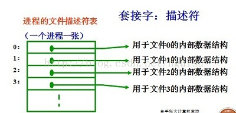
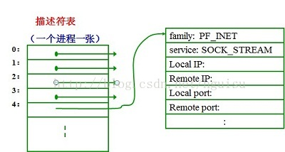

# 代码规范


## 编码规约


### 命名规范


* 抽象类命名使用Abstract或Base开头；异常类命名使用Exception结尾；测试类命名以它要测试的类的名称开始，以Test结尾


* POJO类中布尔类型变量都不要加is前缀，否则部分框架解析会引起序列化错误
  * 在建表约定第一条，表达是与否的值采用is_xxx的命名方式，所以，需要在 <resultMap>设置从is_xxx到xxx的映射关系。

反例：定义为基本数据类型Boolean isDeleted的属性，它的方法也是isDeletedO，RPC框架在反向解 析的时候，"误以为"对应的属性名称是deleted，导致属性获取不到，进而抛出异常


【强制】包名统一使用小写，点分隔符之间有且仅有一个自然语义的英语单词。包名统一使用单数形式，但是类名如果有复数含义，类名可以使用复数形式。

正例：应用工具类包名为com.alibaba.ai.util、类名为MessageUtils (此规则参考spring的框架结构)


* 避免父子类的成员变量/不同代码块的局部变量之间采用相同的命名，使可读性降低

说明：子类、父类成员变量名相同，即使是public类型的变量也是能够通过编译，而局部变量在同一方法 内的不同代码块中同名也是合法的，但是要避免使用。对于非setter/getter的参数名称也要避免与成员变量名称相同


* 【强制】杜绝完全不规范的缩写，避免望文不知义。
  * 反例：AbstractClass "缩写"命名成AbsClass ； condition "缩写"命名成condi，此类随意缩写严重 降低了代码的可阅读性


【推荐】为了达到代码自解释的目标，任何自定义编程元素在命名时，使用尽量完整的单词 组合来表达其意。

正例：在JDK中，表达原子更新的类名为：AtomicReferenceFieldUpdater。

反例：int a的随意命名方式。


\1. 【推荐】在常量与变量的命名时，表示类型的名词放在词尾，以提升辨识度。

正例：startTime / workQueue / nameList / TERMINATED_THREAD_COUNT

反例：startedAt / QueueOfWork / listName / COUNT_TERMINATED_THREAD

\2. 【推荐】如果模块、接口、类、方法使用了设计模式，在命名时需体现出具体模式。

说明：将设计模式体现在名字中，有利于阅读者快速理解架构设计理念。

正例： public class OrderFactory;

public class LoginProxy;

public class ResourceObserver;

\3. 【推荐】接口类中的方法和属性不要加任何修饰符号(public也不要加)，保持代码的简洁 性，并加上有效的 Javadoc 注释。尽量不要在接口里定义变量，如果一定要定义变量，肯定 是与接口方法相关，并且是整个应用的基础常量。

正例：接口方法签名 void commit();

接口基础常量 String COMPANY = "alibaba";

反例：接口方法定义 public abstract void f();

说明：JDK8中接口允许有默认实现，那么这个default方法，是对所有实现类都有价值的默认实现。

\4. 接口和实现类的命名有两套规则：

1)【强制】对于Service和DAO类，基于SOA的理念，暴露出来的服务一定是接口，内部的实现类用 Impl 的后缀与接口区别。

正例： CacheServiceImpl 实现 CacheService 接口。

2 )【推荐】如果是形容能力的接口名称，取对应的形容词为接口名(通常是-able的形容词)。

正例： AbstractTranslator 实现 Translatable 接口。

\5. 【参考】枚举类名带上 Enum 后缀，枚举成员名称需要全大写，单词间用下划线隔开。

说明：枚举其实就是特殊的类，域成员均为常量，且构造方法被默认强制是私有。

正例：枚举名字为 ProcessStatusEnum 的成员名称：SUCCESS / UNKNOWN_REASON。

\6. 【参考】各层命名规约：

A) Service/DAO层方法命名规约

1)获取单个对象的方法用get做前缀。

2 )获取多个对象的方法用list做前缀，复数形式结尾如：listObjects。

3 )获取统计值的方法用count做前缀。

4) 插入的方法用 save/insert 做前缀。

5) 删除的方法用 remove/delete 做前缀。

6) 修改的方法用 update 做前缀。

B) 领域模型命名规约

1) 数据对象：xxxDO，xxx即为数据表名。

2) 数据传输对象： xxxDTO， xxx 为业务领域相关的名称。

3) 展示对象： xxxVO， xxx 一般为网页名称。

4 ) POJO是DO/DTO/BO/VO的统称，禁止命名成xxxPOJO。


### 常量定义


【强制】不允许任何魔法值(即未经预先定义的常量)直接出现在代码中

​	反例:String key = "Id#taobao_" + tradeld;

​			cache.put(key, value);	//代码复制时漏掉下划线，导致缓存get击穿


【强制】在long或者Long赋值时，数值后使用大写的L，不能是小写的I，小写容易跟数字 1 混淆，造成误解。

说明：Long a = 2l;写的是数字的21，还是Long型的2。


【推荐】不要使用一个常量类维护所有常量，要按常量功能进行归类，分开维护

说明：大而全的常量类，杂乱无章，使用查找功能才能定位到修改的常量，不利于理解和维护

正例：缓存相关常量放在类CacheConsts下；系统配置相关常量放在类ConfigConsts下


【推荐】常量的复用层次有五层：跨应用共享常量、应用内共享常量、子工程内共享常量、 包内共享常量、类内共享常量。

1) 跨应用共享常量：放置在二方库中，通常是client.jar中的constant目录下。

2) 应用内共享常量：放置在一方库中，通常是子模块中的constant目录下。

反例：易懂变量也要统一定义成应用内共享常量，两位工程师在两个类中分别定义了 "YES"的变量： 类 A 中： public static final String YES = "yes";

类 B 中：public static final String YES = "y";

A.YES.equals(B.YES)，预期是true，但实际返回为false，导致线上问题。

2 )子工程内部共享常量：即在当前子工程的constant目录下。

3 )包内共享常量：即在当前包下单独的constant目录下。

4 )类内共享常量：直接在类内部private static final定义。


【推荐】如果变量值仅在一个固定范围内变化用 enum 类型来定义


### 代码格式


【强制】大括号内非空则：

1 ) 左大括号前不换行

2 ) 左大括号后换行

3 ) 右大括号后还有 else ? 不换行 : 换行


【强制】左小括号和字符之间不出现空格；同样，右小括号和字符之间也不出现空格；而左大括号前需要空格


【强制】任何二目、三目运算符的左右两边都需要加一个空格


【强制】采用4个空格缩进，禁止使用tab字符,IDEA设置tab为4个空格时，请勿勾选Use tab character


【强制】//与注释内容只有一个空格


【强制】在进行类型强制转换时，右括号与强制转换值之间不需要任何空格隔开。

正例：

long first = 1000000000000L;

int second = (int)first + 2;


【强制】单行字符数限制不超过 120 个，超出需要换行，换行时遵循如下原则：

1）第二行相对第一行缩进 4 个空格，从第三行开始，不再继续缩进，参考示例。

2）运算符与下文一起换行。

3）方法调用的点符号与下文一起换行。

4）方法调用中的多个参数需要换行时，在逗号后进行。 

5）在括号前不要换行，见反例

正例：

StringBuilder sb = new StringBuilder(); 

// 超过 120 个字符的情况下，换行缩进 4 个空格，点号和方法名称一起换行

sb.append("Jack").append("Ma")... 

.append("alibaba")... 

.append("alibaba")... 

.append("alibaba");

反例：

StringBuilder sb = new StringBuilder(); 

// 超过 120 个字符的情况下，不要在括号前换行

sb.append("Jack").append("Ma")...append 

("alibaba"); 

// 参数很多的方法调用可能超过 120 个字符，不要在逗号前换行

method(args1, args2, args3, ... 

, argsX); 


【强制】IDE 的 text file encoding 设置为 UTF-8; IDE 中文件的换行符使用 Unix 格式，不要使用 Windows 格式


【推荐】单个方法的总行数不超过 80 行。

说明：除注释之外的方法签名、左右大括号、方法内代码、空行、回车的总行数不超过80 

正例：分清**红花和绿叶，个性和共性**，绿叶逻辑单独出来成为额外方法，使主干代码更加清晰；共性逻辑抽取成为共性方法，便于复用和维护


### OOP规约


【强制】避免通过一个类的对象引用访问此类的静态变量或静态方法，无谓增加编译器解析成本，直接用类名访问


【强制】相同参数类型，相同业务含义，才可以使用 Java 的可变参数，避免使用 Object。

说明：可变参数必须放置在参数列表的最后。（提倡同学们尽量不用可变参数编程）

正例：public List<User> listUsers(String type, Long... ids) {...}


【强制】外部正在调用或者二方库依赖的接口，不允许修改方法签名，避免对接口调用方产生影响。接口过时必须加@Deprecated 注解，并清晰地说明采用的新接口或者新服务是什么。


【强制】不能使用过时的类或方法

说明：java.net.URLDecoder 中的方法 decode(String encodeStr) 这个方法已经过时，应该使用双参数decode(String source, String encode)。接口提供方既然明确是过时接口，那么有义务同时提供新的接口；作为调用方来说，有义务去考证过时方法的新实现是什么


【强制】所有整型包装类对象之间值的比较，全部使用 equals()

说明：-128 ~ 127 范围内的 Integer 对象是在 IntegerCache.cache 产生，会复用已有对象，区间之外的所有数据，都会在堆上产生


【强制】浮点数的等值判断，基本数据类型不能用==来比较，包装数据类型不能用 equals( )

说明：浮点数采用“尾数+阶码”的编码方式，二进制无法精确表示大部分的十进制小数

反例：

```java
 //反例
float a = 1.0f - 0.9f;
float b = 0.9f - 0.8f;
a == b		//false
  
Float x = Float.valueOf(a);
Float y = Float.valueOf(b);
x.equals(y)	//false

//正例
//(1) 指定一个误差范围，两个浮点数的差值在此范围之内，则认为是相等的。
 float a = 1.0f - 0.9f;
 float b = 0.9f - 0.8f;
 float diff = 1e-6f;
 Math.abs(a - b) < diff	//true

   
//(2) 使用 BigDecimal 来定义值，再进行浮点数的运算操作。
 BigDecimal a = new BigDecimal("1.0");
 BigDecimal b = new BigDecimal("0.9");
 BigDecimal c = new BigDecimal("0.8");

 BigDecimal x = a.subtract(b);
 BigDecimal y = b.subtract(c);
 x.equals(y)	//true
```


==【强制】为了防止精度损失，禁止使用构造方法BigDecimal(double)的方式把double值转 化为 BigDecimal 对象==

说明：BigDecimal(double)存在精度损失风险，在精确计算或值比较的场景中可能会导致业务逻辑异常。 如： BigDecimal g = new BigDecimal(0.1f); 实际的存储值为： 0.10000000149

正例：优先推荐入参为String的构造方法，或使用BigDecimal的valueOf方法，此方法内部其实执行了 Double的toString，而Double的toString按double的实际能表达的精度对尾数进行截断

BigDecimal recommendl = new BigDecimal("0.1");

BigDecimal recommend2 = BigDecimal.valueOf(O.I);


==关于基本数据类型与包装数据类型的使用标准如下==

1. 【强制】所有的 POJO 类属性必须使用包装数据类型

   说明:数据库可能是null，因为自动拆箱，用基本数据类型接收有NPE风险

   反例：比如显示成交总额涨跌情况，即正负x%，x为基本数据类型，RPC调用不成功时， 返回的是默认值，页面显示为 0%，这是不合理的，应该显示成中划线。所以包装数据类型的 null 值，能够表示额外的信息，如：远程调用失败，异常退出

2. 【强制】 RPC 方法的返回值和参数必须使用包装数据类型

3. 【推荐】所有的**局部变量使用基本数据类型**

   作用域只在方法内的变量，直接在栈内存中存储，怎么性能高就怎么定义

4. 【强制】定义DO/DTO/VO等POJO类时，不要设定任何属性默认值

   说明：POJO类属性没有初值是提醒使用者在需要使用时，必须自己显式地进行赋值，任何NPE问题，或者入库检查，都由使用者来保证


【强制】序列化类新增属性时，不要修改serialVersionUID字段，避免反序列失败；如果完全不兼容升级，避免反序列化混乱，修改 serialVersionUID 值

说明：注意 serialVersionUID 不一致会抛出序列化运行时异常


【强制】构造方法/get/se禁止加入任何业务逻辑，如果有初始化逻辑，请放在 init 方法中


【强制】POJO类必须写toString方法。如果继承了另一个 POJO 类，在前面追加super.toString

说明：在方法执行抛出异常时，可以直接调用POJO的toString()方法打印其属性值，便于排查问题


【强制】禁止在POJO类中，同时存在对应属性xxx的isXxx()和getXxx()方法

说明：框架在调用属性xxx的提取方法时，并不能确定哪个方法一定是被优先调用到,Mybatis 和 Hibernate 框架是根据获取方法找到对应属性，因此上述定义可能存在问题


【推荐】使用索引访问用String的split方法得到的数组时，需做最后一个分隔符后有无内容的检查，否则会有抛 IndexOutOfBoundsException 的风险。

说明：

```java
String str = "a,b,c,,";
String[] ary = str.split(",");
System.out.println(ary.length);	// 预期大于 3，结果是3
```


【推荐】 类内方法定义的顺序：公有方法或保护方法 > 私有方法 > getter / setter 方法


【推荐】循环体的字符串的拼接，使用StringBuilder的append


【推荐】下列情况用final

1. 不允许被继承的类，如： String 类
2.  不允许修改引用的域对象
3. 不允许被覆写的方法，如： POJO 类的 set 
4. 不允许运行过程中重新赋值的局部变量
5. 避免上下文重复使用一个变量，使用final可以强制重新定义一个变量，方便更好地进行重构


【推荐】**慎用Object的clone方法来拷贝对象**

说明：对象 clone 方法默认是浅拷贝，若想实现深拷贝需覆写 clone 方法实现域对象的深度遍历式拷贝


【推荐】类成员与方法访问控制从严

1. 如果不允许外部直接通过 new 来创建对象，那么构造方法必须是 private
2. 工具类不允许有public或default构造方法
3. 类非 static 成员变量并且与子类共享，必须是 protected
4. 类非 static 成员变量并且仅在本类使用，必须是 private
5. 类static成员变量如果仅在本类使用，必须是private
6. 若是static成员变量，考虑是否为final
7. 类成员方法只供类内部调用，必须是 private
8. 类成员方法只对继承类公开，那么限制为 protected

任何类、方法、参数、变量，严控访问范围。过于宽泛的访问范围，不利于模块解耦

思考：如果是一个 private 的方法，想删除就删除，可是一个 public 的 service 成员方法或成员变量，删除一下，不得手心冒点汗吗？


### 集合处理


【强制】关于 hashCode 和 equals 的处理，遵循如下规则：

1. 只要覆写equals，就必须覆写hashCode
2. **Set存储的是不重复的对象，依据hashCode和equals进行判断，所以Set存储的对象必须覆写这两个方法**
3. 如果自定义对象作为Map的键，那么必须覆写hashCode和equals

说明：**String已覆写hashCode和equals方法**


【强制】==ArrayList的subList结果不可强转成ArrayList==，否则会抛出ClassCastException异常

说明：subList返回的是ArrayList的内部类SubList，并不是ArrayList而是ArrayList的一个视图，==对subList的所有操作最终会反映到原列表上==


【强制】使用Map的方法keySet()/values()/entrySet()返回集合对象时，不可以对其进行添加元素操作，否则会抛出 UnsupportedOperationException 异常


【强制】Collections类返回的对象，如：emptyList()/singietonList()等都是 immutable list，不可对其进行添加或者删除元素的操作

反例：如果查询无结果，返回Collections.emptyList()空集合对象，调用方一旦进行了添加元素的操作，会触发 UnsupportedOperationException 异常


【强制】在subList场景中，高度注意对原集合元素的增加或删除，均会导致子列表的遍 历、增加、删除产生 ConcurrentModificationException 异常


【强制】使用集合转数组的方法，必须使用集合的toArray(T[] array)，==传入类型一致、长度为0的空数组==

反例：直接使用toArray无参方法存在问题，此方法返回值只能是Object[]类，若强转其它类型数组将出 现 ClassCastException 错误。

正例：

```java
List<String> list = new ArrayList<>(2);
list.add("guan");
list.add("bao");
String[] array = list.toArray(new String[0]);
//0	动态创建与size相同的数组，性能最好
//0<  <list.size	重新创建大小等于size的数组，增加GC负担
//list.size		在高并发时，数组创建完成前size变大,数组需要重新创建，负面影响与上相同
//>list.size	空间浪费，且在size处插入null值，存在NPE隐患
```


【强制】在使用Collection接口任何实现类的addAII()方法时，都要对输入集合参数进行 NPE判断

说明：在ArrayList#addAII方法的第一行代码即Object]] a = c.toArrayO;其中c为输入集合参数，如果 为null，则直接抛出异常


【强制】使用工具类Arrays.asList转换成集合后，不能使用其修改集合相关的方法，会抛UnsupportedOperationException

说明：asList的返回对象是一个Arrays内部类，并没有实现集合的修改方法。Arrays.asList体现的是适配器模式，只是转换接口，后台的数据仍是数组


【强制】泛型通配符<? extends T>来接收返回的数据，此写法的泛型集合不能使用add方 法，而<? super T>不能使用get方法，作为接口调用赋值时易出错

说明：PECS(Producer Extends Consumer Super)原则：

1. 频繁往外读取内容的，适合 用<? extends T>
2. 经常往里插入的，适合用<? super T>


【强制】在无泛型限制定义的集合赋值给泛型限制的集合时，在使用集合元素时，需要进行 instanceof 判断，避免抛出 CIassCastException

说明：毕竟泛型是在JDK5后才出现，考虑到向前兼容，编译器是允许非泛型集合与泛型集合互相赋值


【强制】不要在foreach循环里进行元素的remove/add操作。remove元素请使用Iterator 方式，如果并发操作，需要对 Iterator 对象加锁


【强制】在JDK7版本及以上，Comparator实现类要满足如下三个条件，不然Arrays.sort , Collections.sort 会抛 IllegalArgumentException 异常

1. x，y 的比较结果和 y，x 的比较结果相反
2. x>y,y>z,则 x>z
3. x=y，则xz和yz比较结果相同

**反例：下例中没有处理相等的情况,交换两个对象判断结果并不互反,不符合第一个条件,在实际使用中可能会出现异常**

```java
new Comparator<Student>() {
@Override
public int compare(Student o1, Student o2) {
return o1.getId() > o2.getId() ? 1 : -1;
}
};
```


【推荐】集合泛型定义时，在JDK7及以上，使用diamond(菱形泛型<>)语法或全省略

正例：HashMap<String, String> userCache = new HashMap<>(16);


【推荐】集合初始化时，指定集合初始值大小。

说明：HashMap 使用 HashMap(int initialCapacity)初始化。

正例：initialCapacity =(需要存储的元素个数/负载因子)+ 1。注意负载因子(即loader factor)默认 为0.75 ，如果暂时无法确定初始值大小，请设置为 16(即默认值)。

反例： HashMap 需要放置 1024 个元素，由于没有设置容量初始大小，随着元素不断增加，容量 7 次被 迫扩大， resize 需要重建 hash 表，严重影响性能


【推荐】==使用entrySet遍历Map类集合KV，而不是keySet方式进行遍历==,**如果是JDK8， 使用 Map.forEach 方法**

keySet其实是遍历了 2次，一次是转为Iterator对象，另一次是从hashMap中取出key所对应 的value

而entrySet只是遍历了一次就把key和value都放到了 entry中，效率高


【参考】合理利用好集合的有序性(sort)和稳定性(order)，避免集合的无序性(unsort)和不稳定性(unorder)带来的负面影响

说明：有序性是指遍历的结果是按某种比较规则依次排列的。稳定性指集合每次遍历的元素次序是一定的。如：ArrayList 是 order/unsort ； HashMap 是 unorder/unsort ； TreeSet 是 order/sort


【参考】利用Set元素唯一的特性，可以快速对一个集合进行去重操作，避免使用List的 contains 方法进行遍历、对比、去重操作。


### 注释规约


【强制】类、类属性、类方法的注释必须使用 Javadoc 规范，使用/**内容*/格式，不得使用 // xxx 方式。

说明：在IDE编辑窗口中，Javadoc方式会提示相关注释,调用方法时，不进入方法即可悬浮提示方法、参数、返回值的意义，提高阅读效率


【强制】所有的抽象方法（包括接口中的方法）必须要用Javadoc注释、除了返回值、参数、 异常说明外，还必须指出该方法做什么事情，实现什么功能。一并说明对子类的实现要求，或者调用注意事项


【强制】所有的枚举类型字段必须有注释，说明每个数据项的用途


【推荐】与其“半吊子”英文来注释，不如用中文注释把问题说清楚。专有名词与关键字保持英文原文即可

反例："TCP连接超时"解释成"传输控制协议连接超时"，理解反而费脑筋


【推荐】==代码修改时，注释也要进行相应的修改==，尤其是参数、返回值、异常、核心逻 辑等的修改


【参考】谨慎注释掉代码。在上方详细说明，而不是简单地注释掉。如果无用，则删除

说明：代码被注释掉有两种可能性： 

1）后续会恢复此段代码逻辑。

2）永久不用,建议直接删掉（代码仓库已保存了历史代码）


【参考】对于注释的要求

1. 能够准确反映设计思想和代码逻辑
2. 能够描述业务含义，使别的程序员能够迅速了解到代码背后的信息。完全没有注释的大段代码对于阅读者形同天书，注释是给自己看的，即使隔很长时间，也能清晰理解当时的思路；注释也是给继任者看的，使其能够快速接替自己的工作。


【参考】好的命名、代码结构是自解释的，注释力求精简准确、表达到位。避免出现注释的一个极端：过多过滥的注释，代码的逻辑一旦修改，修改注释是相当大的负担。


【参考】特殊注释标记，注明标记人与标记时间。注意及时处理这些标记

1. 待办事宜（ TODO ） : （标记人，标记时间， ［ 预计处理时间 ］）		表示需要实现，但目前还未实现的功能
2. 错误，不能工作（FIXME）:（标记人，标记时间，［预计处理时间］）    标记某代码是错误的，而且不能工作，需要及时纠正的情况


### 控制语句


【强制】在高并发场景中，避免使用"等于"判断作为中断或退出的条件。

说明：如果并发控制没有处理好，容易产生等值判断被"击穿"的情况，使用区间来代替

反例：判断剩余奖品数量等于0时，终止发放奖品，但因为并发处理错误导致奖品数量瞬间变成了负数， 这样的话，活动无法终止


【推荐】表达异常的分支时，少用if-else方式，这种方式可以改写成：

if (condition) {return obj;}

// 接着写 else 的业务逻辑代码;

说明：如果非使用if()...else if()...else...方式表达逻辑，避免后续代码维护困难，【强制】请勿超过3层

正例：超过 3 层的 if-else 的逻辑判断代码可以使用卫语句、策略模式、状态模式等来实现，

其中卫语句 即代码逻辑先考虑失败、异常、中断、退出等直接返回的情况，以方法多个出口的方式，解决代码中判断分支嵌套的问题，这是逆向思维的体现。


【推荐】除常用方法(如getXxx/isXxx)外，不要在条件判断中执行其它复杂的语句，将复杂逻辑判断的结果赋值给一个有意义的布尔变量名，提高可读性

说明：很多 if 语句内的逻辑表达式相当复杂，与、或、取反混合运算，甚至各种方法纵深调用，理解成本非常高。如果赋值一个非常好理解的布尔变量名字，则是件令人爽心悦目的事情


【推荐】不要在其它表达式(尤其是条件表达式)中，插入赋值语句


【推荐】循环体中的语句要考量性能，以下操作尽量移至循环体外处理，如定义对象、变 量、获取数据库连接，进行不必要的 try-catch 操作(这个 try-catch 是否可以移至循环体外)


【推荐】避免采用取反逻辑运算符。

说明：取反逻辑不利于快速理解，并且取反逻辑写法必然存在对应的正向逻辑写法


【推荐】接口入参保护，这种场景常见的是用作批量操作的接口


【参考】下列情形，需要进行参数校验：

1) 调用频次低的方法

2) 执行时间开销很大的方法。此情形中，参数校验时间几乎可以忽略不计，但如果因为参数错误导致中间执行回退，或者错误，那得不偿失

3) 需要极高稳定性和可用性的方法

4) 对外提供的开放接口，不管是RPC/API/HTTP接口

5 ) 敏感权限入口


【参考】下列情形，不需要进行参数校验：

1) 极有可能被循环调用的方法。但在方法说明里必须注明外部参数检查要求

2) 底层调用频度比较高的方法。毕竟是像纯净水过滤的最后一道，参数错误不太可能到底层才会暴露问题。一般DAO层与Service层都在同一个应用中，部署在同一台服务器中，所以DAO的参数校验，可以省略

3）被声明成private只会被自己代码所调用的方法，如果能确定调用方法的代码传入参数已经做过检查或者肯定不会有问题，此时可以不校验参数


## 设计规约


\1. 【强制】存储方案和底层数据结构的设计获得评审一致通过，并沉淀成为文档。

说明：有缺陷的底层数据结构容易导致系统风险上升，可扩展性下降，重构成本也会因历史数据迁移和系 统平滑过渡而陡然增加，所以，存储方案和数据结构需要认真地进行设计和评审，生产环境提交执行后， 需要进行double check。

正例：评审内容包括存储介质选型、表结构设计能否满足技术方案、存取性能和存储空间能否满足业务发 展、表或字段之间的辩证关系、字段名称、字段类型、索引等；数据结构变更（如在原有表中新增字段） 也需要进行评审通过后上线。

\2. 【强制】在需求分析阶段，如果与系统交互的User超过一类并且相关的User Case超过5 个，使用用例图来表达更加清晰的结构化需求。

\3. 【强制】如果某个业务对象的状态超过3个，使用状态图来表达并且明确状态变化的各个触 发条件。

说明：状态图的核心是对象状态，首先明确对象有多少种状态，然后明确两两状态之间是否存在直接转换 关系，再明确触发状态转换的条件是什么。

正例：淘宝订单状态有已下单、待付款、已付款、待发货、已发货、已收货等。比如已下单与已收货这两 种状态之间是不可能有直接转换关系的。

\4. 【强制】如果系统中某个功能的调用链路上的涉及对象超过3个，使用时序图来表达并且明 确各调用环节的输入与输出。

说明：时序图反映了一系列对象间的交互与协作关系，清晰立体地反映系统的调用纵深链路。

\5. 【强制】如果系统中模型类超过5个，并且存在复杂的依赖关系，使用类图来表达并且明确 类之间的关系。

说明：类图像建筑领域的施工图，如果搭平房，可能不需要，但如果建造蚂蚁Z空间大楼，肯定需要详细 的施工图。

\6. 【强制】如果系统中超过2个对象之间存在协作关系，并且需要表示复杂的处理流程，使用 活动图来表示。

说明：活动图是流程图的扩展，增加了能够体现协作关系的对象泳道，支持表示并发等。

\7. 【推荐】需求分析与系统设计在考虑主干功能的同时，需要充分评估异常流程与业务边界。 反例：用户在淘宝付款过程中，银行扣款成功，发送给用户扣款成功短信，但是支付宝入款时由于断网演 练产生异常，淘宝订单页面依然显示未付款，导致用户投诉。

\8. 【推荐】类在设计与实现时要符合单一原则。

说明：单一原则最易理解却是最难实现的一条规则，随着系统演进，很多时候，忘记了类设计的初衷。

\9. 【推荐】谨慎使用继承的方式来进行扩展，优先使用聚合/组合的方式来实现。

说明：不得已使用继承的话，必须符合里氏代换原则，此原则说父类能够出现的地方子类一定能够出现， t匕如，"把钱交出来"，钱的子类美元、欧元、人民币等都可以出现。

\10. 【推荐】系统设计时，根据依赖倒置原则，尽量依赖抽象类与接口，有利于扩展与维护。

说明：低层次模块依赖于高层次模块的抽象，方便系统间的解耦。

\11. 【推荐】系统设计时，注意对扩展开放，对修改闭合。

说明：极端情况下，交付线上生产环境的代码都是不可修改的，同一业务域内的需求变化，通过模块或类 的扩展来实现。

\12. 【推荐】系统设计阶段，共性业务或公共行为抽取出来公共模块、公共配置、公共类、公共 方法等，避免出现重复代码或重复配置的情况。

说明：随着代码的重复次数不断增加，维护成本指数级上升。

\13. 【推荐】避免如下误解：敏捷开发=讲故事+编码+发布。

说明：敏捷开发是快速交付迭代可用的系统，省略多余的设计方案，摒弃传统的审批流程，但核心关键点 上的必要设计和文档沉淀是需要的。

反例：某团队为了业务快速发展，敏捷成了产品经理催进度的借口，系统中均是勉强能运行但像面条一样 的代码，可维护性和可扩展性极差，一年之后，不得不进行大规模重构，得不偿失。

\14. 【参考】系统设计主要目的是明确需求、理顺逻辑、后期维护，次要目的用于指导编码。 说明：避免为了设计而设计，系统设计文档有助于后期的系统维护和重构，所以设计结果需要进行分类归 档保存。

\15. 【参考】设计的本质就是识别和表达系统难点，找到系统的变化点，并隔离变化点。

说明：世间众多设计模式目的是相同的，即隔离系统变化点。

\16. 【参考】系统架构设计的目的：

•确定系统边界。确定系统在技术层面上的做与不做。

•确定系统内模块之间的关系。确定模块之间的依赖关系及模块的宏观输入与输出。

•确定指导后续设计与演化的原则。使后续的子系统或模块设计在规定的框架内继续演化。

•确定非功能性需求。非功能性需求是指安全性、可用性、可扩展性等。

\17. 【参考】在做无障碍产品设计时，需要考虑到：

•所有可交互的控件元素必须能被tab键聚焦，并且焦点I顺序需符合自然操作逻辑。

•用于登陆校验和请求拦截的验证码均需提供图形验证以外的其它方式。

•自定义的控件类型需明确交互方式。


## 专有名词解释


POJO ( Plain Ordinary Java Object):在本手册中，POJO 专指只有 setter / getter / toString 的简单类，包括 DO/DTO/BO/VO 等。

GAV ( Groupld、Artifactctld、Version ) : Maven 坐标，是用来唯一标识 jar 包。

OOP ( Object Oriented Programming ):本手册泛指类、对象的编程处理方式。

ORM ( Object Relation Mapping ):对象关系映射，对象领域模型与底层数据之间的转换， 本文泛指iBATIS, mybatis等框架。

NPE (java.lang.NullPointerException ):空指针异常。

SOA ( Service-Oriented Architecture ):面向服务架构，它可以根据需求通过网络对松散耦合 的粗粒度应用组件进行分布式部署、组合和使用，有利于提升组件可重用性，可维护性。

OOM ( Out Of Memory ):源于 java.lang.OutOfMemoryError，当 JVM 没有足够的内存来 为对象分配空间并且垃圾回收器也无法回收空间时，系统出现的严重状况。

一方库：本工程内部子项目模块依赖的库(jar包)

二方库：公司内部发布到中央仓库，可供公司内部其它应用依赖的库(jar包)

 


# 常用注解


pojo是一个统称，可以是DTO、可以是VO、可以是PO、可以是domain，这些都叫pojo
 po、do、domain三者区别很小，用处都是和数据库进行对应

DTO是数据传输对象，简单点说就是传参数用的。比如一张表30个字段，但是传参的时候只需要传5个字段，这个时候使用dto，可以避免过多的无用数据，也可以隐藏后端表结构，往往是前端传参给后端、controller、service、dao三层之间传递使用。
 VO就是view Object，专门负责给前端展示数据。VO是业务对象，业务上需要什么字段它就给什么字段，比如上面说的学生表，在给前端展示的时候需要展示名称：class_name这个字段，那么vo里写的就不是classId，而是className或者班级类

 

do、vo、dto这些类之间不需要给继承关系，从设计思想来讲也不能给继承关系。互相之间的属性复制使用spring提供的BeanUtils.copyProperties。如果是集合这种数据较多的属性复制，就先转成json字符串再转成另一个类的List

 

@Deprecated，用来表示某个类或属性或方法已经过时

@SuppressWarnings用来压制程序中出来的警告，比如在没有用泛型或是方法已经过时的时候


## Spring注解


@Component:标准一个普通的spring Bean类
@Controller:标注一个控制器组件类
@Service:标注一个业务逻辑组件类
@Repository:标注一个DAO组件类


Bean实例的名称默认是Bean类的首字母小写，其他部分不变


@Resource


**定制spring容器中bean的生命周期行为**

@PostConstruct	bean的初始化之前的方法

@PreDestory		bean销毁之前的方法


## mvc


```
@Controller		负责处理由DispatcherServlet 分发的请求,把用户请求的数据经过业务处理层处理之后封装成一个Model ，然后再把该Model 返回给对应的View 进行展示
标记的类就是一个SpringMVC Controller 对象。分发处理器将会扫描使用了该注解的类的方法，并检测该方法是否使用了@RequestMapping 注解。@Controller 只是定义了一个控制器类，而使用@RequestMapping 注解的方法才是真正处理请求的处理器。单单使用@Controller 标记在一个类上还不能真正意义上的说它就是SpringMVC 的一个控制器类，因为这个时候Spring 还不认识它。那么要如何做Spring 才能认识它呢？这个时候就需要我们把这个控制器类交给Spring 来管理。有两种方式：


```


## @ControllerAdvice


用于定义@ExceptionHandler、@InitBinder、@ModelAttribute，并应用到所有@RequestMapping中


@ExceptionHandler  拦截异常，实现自定义异常处理

```
@ExceptionHandler(value = {UnauthorizedException.class})
public Object unauthorized() {
    Map<String, Object> map = new HashMap<>();
    map.put("code", -1);
    map.put("msg", "未授权，请联系管理员");
    return map;
}
```


@InitBinder   在其执行之前初始化数据绑定器

```
@InitBinder
    public void initBinder(WebDataBinder binder) {}
```


@ModelAttribute   把值绑定到所有的Model中

```
    @ModelAttribute
    public void addAttributes(Model model) {
        model.addAttribute("author", "lx");
    }
```


## JSON

@JsonInclude(Include.NON_NULL) 是springmvc中的标注，剔除返回json中的null

@JsonIgnore	忽略不想传给前台的的属性


//将该标记放在属性上，如果该属性为NULL则不参与序列化 
//如果放在类上边,那对这个类的全部属性起作用 
//Include.Include.ALWAYS 默认 
//Include.NON_DEFAULT 属性为默认值不序列化 
//Include.NON_EMPTY 属性为 空（“”） 或者为 NULL 都不序列化 
//Include.NON_NULL 属性为NULL 不序列化 


## Junit注解

@BeforeClass – 表示在类中的任意public static void方法执行之前执行

@AfterClass – 表示在类中的任意public static void方法执行之后执行

@Before – 表示在任意使用@Test注解标注的public void方法执行之前执行

@After – 表示在任意使用@Test注解标注的public void方法执行之后执行

@AfterRunning: 返回通知, 在方法返回结果之后执行

@AfterThrowing: 异常通知, 在方法抛出异常之后

@Around: 环绕通知, 围绕着方法执行

 


# 关键词


## assert 断言


在软件开发中是一种常用的调试方式，很多开发语言中都支持这种机制。一般来说，assertion 用于保证程序最基本、关键的正确性。assertion 检查通常在开发和测试时开启。为了提高性能，在软件发布后， assertion 检查通常是关闭的。在实现中，断言是一个包含布尔表达式的语句，在执行这个语句时假定该表达式为 true；如果表达式计算为 false，那么系统会报告一个 AssertionError。

断言用于调试目的：

assert(a > 0); // throws an AssertionError if a <= 0

断言可以有两种形式：

assert Expression1;

assert Expression1 : Expression2 ;

Expression1 应该总是产生一个布尔值。

Expression2 可以是得出一个值的任意表达式；这个值用于生成显示更多调

试信息的字符串消息。

断言在默认情况下是禁用的，要在编译时启用断言，需使用 source 1.4 标

记：

javac -source 1.4 Test.java

要在运行时启用断言，可使用-enableassertions 或者-ea 标记。

要在运行时选择禁用断言，可使用-da 或者-disableassertions 标记。

要在系统类中启用断言，可使用-esa 或者-dsa 标记。还可以在包的基础上

启用或者禁用断言。可以在预计正常情况下不会到达的任何位置上放置断言

断言可以用于验证传递给私有方法的参数。不过，断言不应该用于验证传递

给公有方法的参数，因为不管是否启用了断言，公有方法都必须检查其参数

不过，既可以在公有方法中，也可以在非公有方法中利用断言测试后置条件


 

# 日期格式处理


```
@JsonFormat           后台到前台
properties文件中有相同的配置spring.mvc.date-format

@DateTimeFormat     前台到后台
properties文件中有相同的配置spring.jackson.date-format

spring.jackson.time-zone
```


 

@Respostory

@Compment      把切面类加入到IOC容器中

@**EnableAspectJAutoProxy**   //开启对AspectJ语法风格的支持

@ControllerAdvise  当Controller出现异常时,跳转页面

@RestControllerAdvise         ,返回json

 

@bean作用在方法上

@import引入其他的配置文件 

@ComponentScan(“”) 配置扫描

 

当ioc容器里有多个同名对象时

@Qualifier 合格者，表明哪个bean是需要的

​    Qualifier的参数必须是之前用@Bean注解过的

@Primary  指明优先级

 

@Configuration(proxyBeanMethods = false) proxyBeanMethods决定了配置类是否会被代理,如果@Bean方法间没有调用关系的话可以把 proxyBeanMethods 设置为 false。否则，方法内部引用的类生产的类和 Spring 容器中类是两个类。

 

 

@ConditionalOnBean // 当给定的在bean存在时,则实例化当前Bean @ConditionalOnMissingBean // 当给定的在bean不存在时,则实例化当前Bean @ConditionalOnClass // 当给定的类名在类路径上存在，则实例化当前Bean @ConditionalOnMissingClass // 当给定的类名在类路径上不存在，则实例化当前Bean

 

 

@ConfigurationProperties(prefix = "spring.redis") 配置类注解,prefix是配置时的前缀

@EnableConfigurationProperties(RedisProperties.class)     加载配置类

 

 

**@Lazy**   **懒加载**

***注入userService时,CacheAspect中自定义的切面增强还没有被加载
 导致注入进去的是还未被动态代理的,原生的userService\***

 

@TableField(exist = false)	实体类中,数据库不存在的字段需要加上这个注解

 

@Transactional 	**public 的方法才起作用**

1)事务开始时，通过AOP机制，**生成代理connection对象**，并将其放入DataSource实例的某个与DataSourceTransactionManager相关的容器中。客户代码使用该connection连接数据库，执行所有数据库命令

2)事务结束时，回滚代理connection对象上执行的数据库命令，然后关闭该代理connection对象（事务结束后，回滚操作不会对已执行完毕的SQL操作命令起作用）


# Socket


为保证两个相互通信的进程之间既互不干扰又协调一致工作，操作系统为进程通信提供了相应设施

UNIX BSD：管道（pipe）、命名管道（named pipe）软中断信号（signal）

UNIX system V：消息（message）、共享存储区（shared memory）和信号量（semaphore)等


他们都仅限于本机进程间通信。网间进程通信要解决的是不同主机进程间的相互通信问题。为此，首先要解决的是网间==进程标识==问题

同一主机上，不同进程可用进程号（process ID）唯一标识。但在网络环境下，进程号不能唯一标识。其次，操作系统支持的网络协议众多，不同协议的工作方式不同，地址格式也不同。因此，网间进程通信还要解决==多重协议识别==问题

其实TCP/IP协议族已经解决了这个问题，ip可以唯一标识网络中的主机，而传输层的“**协议+端口**”可以唯一标识主机中的应用程序（进程）。这样利用==三元组（ip，协议，端口）==就可以标识网络的进程了，进程通信就可以利用这个标志与其它进程进行交互


使用TCP/IP协议的应用程序通常采用应用编程接口：UNIX BSD的套接字（socket）和UNIX System V的TLI（淘汰），来实现网络进程之间的通信

就目前而言，几乎所有的应用程序都是采用socket，而现在又是网络时代，网络中进程通信是无处不在，“一切皆socket”


Socket是应用层与TCP/IP协议族通信的中间软件抽象层


socket起源于Unix，而Unix/Linux基本哲学之一就是“一切皆文件”，都可以用“打开open –> 读写write/read –> 关闭close”模式来操作。Socket就是该模式的一个实现

socket是一种特殊的文件,**一组接口**，一些socket函数就是对其进行的操作

==门面模式==，把复杂的TCP/IP协议族隐藏在Socket接口后面，对用户来说，一组简单的接口就是全部，让Socket去组织数据，以符合指定的协议


相对于HTTP这种**非持久**的协议来说,Websocket是一个**持久化**的协议

在HTTP中,永远是 request:response=1:1	并且response是**被动**的，不能主动发起


Websocket是基于HTTP协议的，或者说**借用**了HTTP的协议来完成一部分握手
在握手阶段是一样的

```text
GET /chat HTTP/1.1
Host: server.example.com
Upgrade: websocket
Connection: Upgrade
Sec-WebSocket-Key: x3JJHMbDL1EzLkh9GBhXDw==
Sec-WebSocket-Protocol: chat, superchat
Sec-WebSocket-Version: 13
Origin: http://example.com
```

这段类似HTTP协议的握手请求中，多了几个东西。

```text
Upgrade: websocket
Connection: Upgrade
```

这个就是Websocket的核心了，告诉Apache、Nginx等服务器：**注意啦，窝发起的是Websocket协议，快点帮我找到对应的助理处理~不是那个老土的HTTP。**

```text
Sec-WebSocket-Key: x3JJHMbDL1EzLkh9GBhXDw==
Sec-WebSocket-Protocol: chat, superchat
Sec-WebSocket-Version: 13
```

首先，Sec-WebSocket-Key 是一个Base64 encode的值，这个是浏览器随机生成的，告诉服务器：**泥煤，不要忽悠窝，我要验证尼是不是真的是Websocket助理。**
然后，Sec_WebSocket-Protocol 是一个用户定义的字符串，用来区分同URL下，不同的服务所需要的协议。简单理解：**今晚我要服务A，别搞错啦~**
最后，Sec-WebSocket-Version 是告诉服务器所使用的Websocket Draft（协议版本），在最初的时候，Websocket协议还在 Draft 阶段，各种奇奇怪怪的协议都有，而且还有很多期奇奇怪怪不同的东西，什么Firefox和Chrome用的不是一个版本之类的，当初Websocket协议太多可是一个大难题。

然后服务器会返回下列东西，表示已经接受到请求， 成功建立Websocket啦！

```text
HTTP/1.1 101 Switching Protocols
Upgrade: websocket
Connection: Upgrade
Sec-WebSocket-Accept: HSmrc0sMlYUkAGmm5OPpG2HaGWk=
Sec-WebSocket-Protocol: chat
```

这里开始就是HTTP最后负责的区域了，告诉客户，我已经成功切换协议啦~

```text
Upgrade: websocket
Connection: Upgrade
```

依然是固定的，告诉客户端即将升级的是Websocket协议，而不是mozillasocket，lurnarsocket或者shitsocket。
然后，Sec-WebSocket-Accept 这个则是经过服务器确认，并且加密过后的 Sec-WebSocket-Key。服务器：**好啦好啦，知道啦，给你看我的ID CARD来证明行了吧。。**
后面的，Sec-WebSocket-Protocol 则是表示最终使用的协议。

至此，HTTP已经完成它所有工作了，接下来就是完全按照Websocket协议进行了


##  long poll/ajax轮询


这两个都可以实现实时信息传递

ajax轮询，让浏览器隔个几秒就发送一次请求，询问服务器是否有新信息

需要服务器有很快的处理速度和资源。（速度）


long poll 也采用轮询的方式，不过采取的是阻塞模型,客户端发起连接后，如果没消息，就一直不返回Response给客户端。直到有消息才返回，返回完之后，客户端再次建立连接，周而复始

需要服务器有很高的并发


二者都是在不断地建立HTTP连接，然后等待服务端处理，可以体现HTTP协议的另外一个特点，**被动性**,服务端不能主动联系客户端，只能有客户端发起


socket解决了HTTP的被动性，当服务器完成协议升级后（HTTP->Websocket），服务端就可以主动推送信息给客户端,只需要经过**一次HTTP请求**，就可以持续的信息传送(==回调==)


也解决了HTTP的浪费资源

HTTP需要经过两层代理，Nginx等服务器的解析，然后再传送给相应的Handler处理,Nginx速度是足够的，但是每次都卡在Handler
Websocket就解决了这样一个难题，建立后，可以直接跟Nginx建立持久连接，有信息的时候Handler想办法通知Nginx，然后Nginx统一转交给客户

同时，在传统的方式上，要不断的建立/关闭HTTP协议，由于HTTP是非状态性的，每次都要重新传输identity info（鉴别信息），来告诉服务端你是谁

虽然Nginx很快，但是每次都要处理这么一堆，效率也会有所下降的，同时还得不断把这些信息转交给Handler，会在网路传输中消耗过多的流量/时间
但是Websocket只需要一次HTTP握手，所以说整个通讯过程是建立在一次连接/状态中，也就避免了HTTP的非状态性，服务端会一直知道你的信息，直到你关闭请求，这样就解决了Nginx要反复解析HTTP协议，还要查看identity info的信息
同时由客户主动询问，转换为服务器推送，没有信息的时候就交给Nginx，不需要占用本身速度就慢的Handler


## 套接字描述符


 其实就是一个整数，我们最熟悉的句柄是0、1、2三个，0是标准输入，1是标准输出，2是标准错误输出。0、1、2是整数表示的，对应的FILE *结构的表示就是stdin、stdout、stderr

 

套接字API最初是作为UNIX操作系统的一部分而开发的，所以套接字API与系统的其他I/O设备集成在一起。特别是，当应用程序要为因特网通信而创建一个套接字（socket）时，操作系统就返回一个小整数作为描述符（descriptor）来标识这个套接字。然后，应用程序以该描述符作为传递参数，通过调用函数来完成某种操作（例如通过网络传送数据或接收输入的数据）。

在许多操作系统中，套接字描述符和其他I/O描述符是集成在一起的，所以应用程序可以对文件进行套接字I/O或I/O读/写操作。

当应用程序要创建一个套接字时，操作系统就返回一个小整数作为描述符，应用程序则使用这个描述符来引用该套接字需要I/O请求的应用程序请求操作系统打开一个文件。操作系统就创建一个文件描述符提供给应用程序访问文件。从应用程序的角度看，文件描述符是一个整数，应用程序可以用它来读写文件。下图显示，操作系统如何把文件描述符实现为一个指针数组，这些指针指向内部数据结构。





 对于每个程序系统都有一张单独的表。精确地讲，系统为每个运行的进程维护一张单独的文件描述符表。当进程打开一个文件时，系统把一个指向此文件内部数据结构的指针写入文件描述符表，并把该表的索引值返回给调用者 。应用程序只需记住这个描述符，并在以后操作该文件时使用它。操作系统把该描述符作为索引访问进程描述符表，通过指针找到保存该文件所有的信息的数据结构。

   **针对套接字的系统数据结构：**

  1）、套接字API里有个函数socket，它就是用来创建一个套接字。套接字设计的总体思路是，单个系统调用就可以创建任何套接字，因为套接字是相当笼统的。一旦套接字创建后，应用程序还需要调用其他函数来指定具体细节。例如调用socket将创建一个新的描述符条目：





2）、虽然套接字的内部数据结构包含很多字段，但是系统创建套接字后，大多数字字段没有填写。应用程序创建套接字后在该套接字可以使用之前，必须调用其他的过程来填充这些字段。

**3、文件描述符和文件指针的区别：**

 

**文件描述符：**在linux系统中打开文件就会获得文件描述符，它是个很小的正整数。每个进程在PCB（Process Control Block）中保存着一份文件描述符表，文件描述符就是这个表的索引，每个表项都有一个指向已打开文件的指针。

**文件指针：**C语言中使用文件指针做为I/O的句柄。文件指针指向进程用户区中的一个被称为FILE结构的数据结构。FILE结构包括一个缓冲区和一个文件描述符。而文件描述符是文件描述符表的一个索引，因此从某种意义上说文件指针就是句柄的句柄（在Windows系统上，文件描述符被称作文件句柄）。


## 基本的SOCKET接口函数


在生活中，A要电话给B，A拨号，B听到电话铃声后提起电话，这时A和B就建立起了连接，A和B就可以讲话了。等交流结束，挂断电话结束此次交谈。  打电话很简单解释了这工作原理：“open—write/read—close”模式。


 服务器端先初始化Socket，然后与端口绑定(bind)，对端口进行监听(listen)，调用accept阻塞，等待客户端连接。在这时如果有个客户端初始化一个Socket，然后连接服务器(connect)，如果连接成功，这时客户端与服务器端的连接就建立了。客户端发送数据请求，服务器端接收请求并处理请求，然后把回应数据发送给客户端，客户端读取数据，最后关闭连接，一次交互结束。

   **这些接口的实现都是内核来完成**

 


# 跨域


Request Method: OPTIONS		会在真实请求之前先用OPTIONS验证是否拥有跨域权限


# Environment类(Spring自身的类)

可以把Spring应用的运行时分成两个部分：一个是Spring应用本身，一个是Spring应用所处的环境。

定时注解@Scheduled有时需要获取当前的运行环境(用户信息,配置文件信息等)

Environment在容器中是一个抽象的集合，是指应用环境的2个方面：profiles和properties。

\1. Profile

  不管是XML还是注解，Beans都有可能指派给profile配置。Environment环境对象的作用，对于profiles配置来说，它能决定当前激活的是哪个profile配置，和哪个profile是默认。

\2. Properties

  properties来源于properties文件、JVM properties、system环境变量、JNDI、servlet context parameters上下文参数、专门的properties对象，Maps等等。对于properties来说，Environment对象可以提供给用户方便的服务接口、方便撰写配置、方便解析配置。
     environment.getProperty获取配置文件中的属性

 


# 异常错误


## unreachable code编译错误

Java检查到他们后面的语句都无法执行下去，

* 跳到下一次循环或其他地方
* 死循环，无法执行下一句


Checked exception:这类异常都是Exception的子类 

Unchecked exception: 这类异常都是RuntimeException的子类


## ConcurrentModificationException

方法检测到对象的并发修改，不允许修改时，抛出异常


### modCount修改次数

modCount被定义在ArrayList的父类AbstractList中，初值为0

```
protected transient int modCount = 0;
```

当发生修改 ,modCount+1 ,通过比对modCount实现了快速失败原则


在ArrayList的add方法中

```
public boolean add(E e) {
    ensureCapacityInternal(size + 1);  // Increments modCount!!
    elementData[size++] = e;
    return true;}
```

ensureCapacityInternal方法判断时都需要扩容 ,该方法调用了ensureExplicitCapacity ,使modCount+1

```
private void ensureCapacityInternal(int minCapacity) {
        ensureExplicitCapacity(calculateCapacity(elementData, minCapacity));}

    private void ensureExplicitCapacity(int minCapacity) {
        modCount++;
        if (minCapacity - elementData.length > 0)
            grow(minCapacity); }
```


**在迭代时只能用迭代器进行删除**

单线程情况：

（1）使用Iterator提供的remove方法，用于删除当前元素。

（2）建立一个集合，记录需要删除的元素，之后统一删除。

（3）不使用Iterator进行遍历，需要之一的是自己保证索引正常。

（4）使用并发集合类来避免ConcurrentModificationException，比如使用CopyOnArrayList，而不是ArrayList。

多线程情况：

（1）使用并发集合类，如使用ConcurrentHashMap或者CopyOnWriteArrayList。


# 调试


## 创建指定大小文件

在目录下进入cmd

fsutil file createnew test.txt 字节数


## adb命令


adb logcat -c
adb logcat > C:\Users\howlett\Desktop\a.txt


# MIME

| acx     | application/internet-property-stream    |
| ------- | --------------------------------------- |
| ai      | application/postscript                  |
| aif     | audio/x-aiff                            |
| aifc    | audio/x-aiff                            |
| aiff    | audio/x-aiff                            |
| asf     | video/x-ms-asf                          |
| asr     | video/x-ms-asf                          |
| asx     | video/x-ms-asf                          |
| au      | audio/basic                             |
| avi     | video/x-msvideo                         |
| axs     | application/olescript                   |
| bas     | text/plain                              |
| bcpio   | application/x-bcpio                     |
| bin     | application/octet-stream                |
| bmp     | image/bmp                               |
| c       | text/plain                              |
| cat     | application/vnd.ms-pkiseccat            |
| cdf     | application/x-cdf                       |
| cer     | application/x-x509-ca-cert              |
| class   | application/octet-stream                |
| clp     | application/x-msclip                    |
| cmx     | image/x-cmx                             |
| cod     | image/cis-cod                           |
| cpio    | application/x-cpio                      |
| crd     | application/x-mscardfile                |
| crl     | application/pkix-crl                    |
| crt     | application/x-x509-ca-cert              |
| csh     | application/x-csh                       |
| css     | text/css                                |
| dcr     | application/x-director                  |
| der     | application/x-x509-ca-cert              |
| dir     | application/x-director                  |
| dll     | application/x-msdownload                |
| dms     | application/octet-stream                |
| doc     | application/msword                      |
| dot     | application/msword                      |
| dvi     | application/x-dvi                       |
| dxr     | application/x-director                  |
| eps     | application/postscript                  |
| etx     | text/x-setext                           |
| evy     | application/envoy                       |
| exe     | application/octet-stream                |
| fif     | application/fractals                    |
| flr     | x-world/x-vrml                          |
| gif     | image/gif                               |
| gtar    | application/x-gtar                      |
| gz      | application/x-gzip                      |
| h       | text/plain                              |
| hdf     | application/x-hdf                       |
| hlp     | application/winhlp                      |
| hqx     | application/mac-binhex40                |
| hta     | application/hta                         |
| htc     | text/x-component                        |
| htm     | text/html                               |
| html    | text/html                               |
| htt     | text/webviewhtml                        |
| ico     | image/x-icon                            |
| ief     | image/ief                               |
| iii     | application/x-iphone                    |
| ins     | application/x-internet-signup           |
| isp     | application/x-internet-signup           |
| jfif    | image/pipeg                             |
| jpe     | image/jpeg                              |
| jpeg    | image/jpeg                              |
| jpg     | image/jpeg                              |
| js      | application/x-javascript                |
| latex   | application/x-latex                     |
| lha     | application/octet-stream                |
| lsf     | video/x-la-asf                          |
| lsx     | video/x-la-asf                          |
| lzh     | application/octet-stream                |
| m13     | application/x-msmediaview               |
| m14     | application/x-msmediaview               |
| m3u     | audio/x-mpegurl                         |
| man     | application/x-troff-man                 |
| mdb     | application/x-msaccess                  |
| me      | application/x-troff-me                  |
| mht     | message/rfc822                          |
| mhtml   | message/rfc822                          |
| mid     | audio/mid                               |
| mny     | application/x-msmoney                   |
| mov     | video/quicktime                         |
| movie   | video/x-sgi-movie                       |
| mp2     | video/mpeg                              |
| mp3     | audio/mpeg                              |
| mpa     | video/mpeg                              |
| mpe     | video/mpeg                              |
| mpeg    | video/mpeg                              |
| mpg     | video/mpeg                              |
| mpp     | application/vnd.ms-project              |
| mpv2    | video/mpeg                              |
| ms      | application/x-troff-ms                  |
| mvb     | application/x-msmediaview               |
| nws     | message/rfc822                          |
| oda     | application/oda                         |
| p10     | application/pkcs10                      |
| p12     | application/x-pkcs12                    |
| p7b     | application/x-pkcs7-certificates        |
| p7c     | application/x-pkcs7-mime                |
| p7m     | application/x-pkcs7-mime                |
| p7r     | application/x-pkcs7-certreqresp         |
| p7s     | application/x-pkcs7-signature           |
| pbm     | image/x-portable-bitmap                 |
| pdf     | application/pdf                         |
| pfx     | application/x-pkcs12                    |
| pgm     | image/x-portable-graymap                |
| pko     | application/ynd.ms-pkipko               |
| pma     | application/x-perfmon                   |
| pmc     | application/x-perfmon                   |
| pml     | application/x-perfmon                   |
| pmr     | application/x-perfmon                   |
| pmw     | application/x-perfmon                   |
| pnm     | image/x-portable-anymap                 |
| pot,    | application/vnd.ms-powerpoint           |
| ppm     | image/x-portable-pixmap                 |
| pps     | application/vnd.ms-powerpoint           |
| ppt     | application/vnd.ms-powerpoint           |
| prf     | application/pics-rules                  |
| ps      | application/postscript                  |
| pub     | application/x-mspublisher               |
| qt      | video/quicktime                         |
| ra      | audio/x-pn-realaudio                    |
| ram     | audio/x-pn-realaudio                    |
| ras     | image/x-cmu-raster                      |
| rgb     | image/x-rgb                             |
| rmi     | audio/mid                               |
| roff    | application/x-troff                     |
| rtf     | application/rtf                         |
| rtx     | text/richtext                           |
| scd     | application/x-msschedule                |
| sct     | text/scriptlet                          |
| setpay  | application/set-payment-initiation      |
| setreg  | application/set-registration-initiation |
| sh      | application/x-sh                        |
| shar    | application/x-shar                      |
| sit     | application/x-stuffit                   |
| snd     | audio/basic                             |
| spc     | application/x-pkcs7-certificates        |
| spl     | application/futuresplash                |
| src     | application/x-wais-source               |
| sst     | application/vnd.ms-pkicertstore         |
| stl     | application/vnd.ms-pkistl               |
| stm     | text/html                               |
| svg     | image/svg+xml                           |
| sv4cpio | application/x-sv4cpio                   |
| sv4crc  | application/x-sv4crc                    |
| swf     | application/x-shockwave-flash           |
| t       | application/x-troff                     |
| tar     | application/x-tar                       |
| tcl     | application/x-tcl                       |
| tex     | application/x-tex                       |
| texi    | application/x-texinfo                   |
| texinfo | application/x-texinfo                   |
| tgz     | application/x-compressed                |
| tif     | image/tiff                              |
| tiff    | image/tiff                              |
| tr      | application/x-troff                     |
| trm     | application/x-msterminal                |
| tsv     | text/tab-separated-values               |
| txt     | text/plain                              |
| uls     | text/iuls                               |
| ustar   | application/x-ustar                     |
| vcf     | text/x-vcard                            |
| vrml    | x-world/x-vrml                          |
| wav     | audio/x-wav                             |
| wcm     | application/vnd.ms-works                |
| wdb     | application/vnd.ms-works                |
| wks     | application/vnd.ms-works                |
| wmf     | application/x-msmetafile                |
| wps     | application/vnd.ms-works                |
| wri     | application/x-mswrite                   |
| wrl     | x-world/x-vrml                          |
| wrz     | x-world/x-vrml                          |
| xaf     | x-world/x-vrml                          |
| xbm     | image/x-xbitmap                         |
| xla     | application/vnd.ms-excel                |
| xlc     | application/vnd.ms-excel                |
| xlm     | application/vnd.ms-excel                |
| xls     | application/vnd.ms-excel                |
| xlt     | application/vnd.ms-excel                |
| xlw     | application/vnd.ms-excel                |
| xof     | x-world/x-vrml                          |
| xpm     | image/x-xpixmap                         |
| xwd     | image/x-xwindowdump                     |
| z       | application/x-compress                  |
| zip     | application/zip                         |


 

# REST


## 无状态stateless


* 状态	为两个相互关联的用户交互操作保留的某种公共信息，常被用来存储工作流或用户状态信息。
  * 可以被指定不同的作用域如page，request，session或全局作用域
  * 可以由Client或Server负责存储

* 缺点

  * 在负载均衡方面，在有状态的模式下，一个用户的请求必须被提交到保存有其相关状态信息的服务器上，否则这些请求可能无法被理解，服务器端无法对用户请求进行自由调度。
  * 容错性，倘若保有用户信息的服务器宕机，那么该用户最近的所有交互操作将无法被透明地移送至备用服务器上，除非该服务器时刻与主服务器同步全部用户的状态信息。
  * 由于**HTTP**本身无状态，开发人员必须通过模拟实现状态的钝化与激活

  

* 无状态	请求与其他请求隔离，**请求本身包含了响应端为响应请求所需的全部信息**。
  
  * 改善了分布式系统的可见性、可靠性以及可伸缩性。如果一个网站期望用户以A->B->C的流程来交互，而在执行至B时回退的话，那么系统很有可能不是按照其所期望的方式运行，因为用户的状态可能被不可逆地修改了


* RESTful的2中状态
  * 应用状态  某一特定请求相关的状态信息
  * 资源状态  某一存储在服务器端资源在某一时刻的特定状态，该状态不会因为用户请求而改变，任何用户在同一时刻对该资源的请求都会获得这一状态的表现（Representation）。


RESTful架构要求服务器端不保有任何与特定HTTP请求相关的资源，所以==应用状态必须由请求方在请求过程中提供==。

**状态与请求本身没有多大关联，重要的是状态信息是由请求方还是响应方负责保存**,“传递某种表示状态的信息”到服务器不是“有状态”的表现。


在请求中传递SessionID是unRESTful的，而将用户的credentials(认证信息)包含在每个请求里是RESTful的

Session ID可以被认为是一个用来标识某一会话状态的Key，将其传递给服务器端意味着这样一个请求：“请帮我取出这个状态信息”，这个请求假设响应方保有状态信息。而user credential作为一种应用状态，是被期望由请求方提供的，所以在请求中传递user credentials是符合RESTful架构规范的。


# Session


### 两种实现方法


#### Cookie实现Session


服务器为客户端创建并维护Session对象，用于存放数据。同时会产生SessionID，服务器以Cookie的方式将SessionID存放在客户端。，此时的Cookie中仅仅保存了一个SessionID，而相对较多的会话数据保存在服务器端对应的Session对象中，由服务器来统一维护，这样一定程度保证了会话数据安全性，但**增加了服务器端的内存开销**

Cookie会在浏览器关闭时清除,称为一个“会话”。

一个“会话”中的多次请求，共享一个Session对象，携带了相同的SessionID


#### URL重写


Session对象的正常使用要依赖于Cookie。

但客户端出于安全的考虑禁用了Cookie，需要用URL重写的方式使Session在客户端禁用Cookie的情况下继续生效


### session VS cookie


存储角度：

Session是服务器端的数据存储技术，cookie是客户端的数据存储技术

解决问题角度：

Session	同一用户不同请求的数据共享

cookie	不同用户不同请求的数据的共享

生命周期角度：

Session的id	依赖cookie存储

Cookie	可以单独设置其在浏览器的存储时间


### Ajax 的工作原理

异步的javascript和xml,通过XmlHttpRequest对象来向服务器发异步请求，从服务器获得数据，然后用javascript来操作DOM而更新页面。从而实现向服务器提出请求和处理响应，而不阻塞用户。达到无刷新的效果


### JSON 及其作用


轻量级的数据交换格式，采用完全**独立于语言**的格式。也是 JavaScript 原生格式，这意味着在 JavaScript 中处理 JSON 数据不须要任何特殊的 API 或工具包。

在 JSON 中，有两种结构：对象和数组。

 {} 对象

 [] 数组

 , 分隔属性

 : 左边为属性名，右边为属性值

属性名可用可不用引号括起，属性值为字符串一定要用引号括起


## Servlet


### Servlet生命周期

Web容器加载Servlet并将其实例化后，Servlet生命周期开始，容器运行init()方法进行Servlet的初始化；

请求到达时调用service()，service()调用对应的doGet/Post

当服务器关闭或项目被卸载时Servlet 实例被销毁，此时会调用destroy()


### JSP 和 Servlet关系

先有 Servlet，针对 Servlet 缺点推出 JSP。JSP 是 Servlet 的一种特殊形式

Servlet是特殊的Java程序，运行于服务器的JVM中，能够依靠服务器的支持向浏览器提供显示内容。JSP本质上是Servlet的一种简易形式，JSP被处理成类似于Servlet的Java程序，可以简化页面内容的生成。

不同点在于，Servlet 的应用逻辑在Java文件中，并完全从表示层中的HTML分离开来。而JSP是Java语言和HTML的组合。JSP侧重于视图，Servlet侧重于控制逻辑，在MVC架构模式中，JSP适合充当视图而Servlet 适合充当控制器（controller）

 

每个 JSP 页面就是一个 Servlet 实例——JSP 页面由系统翻译成 Servlet，

Servlet 再负责响应用户请求。


## 客户端存数据3种方法


* cookie

  会失效 ,下次请求cookie会被携带一起发送 ,不适合存储大量数据

* sessionStorage

  页面关闭则失效

* localStorage

  浏览器缓存被清空则失效


## 单点登录、域用户、常规登录、AD域

* 单点登录  
  * 用户只需要登录一次就可以访问所有相互信任的应用系统。（Single Sign On，简称为 SSO）
  * 各个server拿到同一个ID，都有办法检验ID有效 ,得到用户信息。

实现步骤：

登录应用1，服务器前验证 ——> Over（不通过，不通过验证失败）

​                     ——> 返回ticket（验证通过） ——> 下次访问应用,2，发送ticket验证  ——> 以后登录应用2不需要再次登录（验证通过）

实现SSO，具备条件所有应用系统共享一个身份认证系统。

　　统一的认证系统是SSO的前提之一。认证系统的主要功能是将用户的登录信息和用户信息库相比较，对用户进行登录认证；认证成功后，认证系统应该生成统一的认证标志（ticket），返还给用户。另外，认证系统还应该对ticket进行效验，判断其有效性。所有应用系统均能够识别和提取ticket信息

　　要实现SSO的功能，让用户只登录一次，就必须让应用系统能够识别已经登录过的用户。应用系统应该能对ticket进行识别和提取，通过与认证系统的通讯，能自动判断当前用户是否登录过，从而完成单点登录的功能。

 

2、域用户

（1）何为域？何为域用户？

域，域就是一方诸侯，有自己的权限和领土范围。（自己的装逼解释）；而领地内所有管辖和被管辖的都是域用户。

（2）域，还是域用户？

看了所有能看到的解释，都不满意。自己定义下，域的主要是，域对内的规则，域内用户的权限，域和域之间的规则；同域内用户之间的关系，权限。域，例如计算机里的域用户是需要服务器，进行域的创建，

 

（3）域账号

域账号，修改域帐号有关数据，直接修改域帐号服务器中的帐号，其他计算机就可立即获取更新后的帐号数据；本地账号，域中有数十台计算机，而且每一台计算机都必须有相同的帐号

3、AD域

AD域是Active Directory的缩写，它是基于windows的一个组合，它可以集中控制加入域的所有计算机的权限，更高效的分配权限、提高资料的安全性、节省管理成本。

域用户（我这里指的是创建域的这个用户），在任何一台加入域的计算机上都有管理员的权限。


# Spring

 

## 事务传播机制


*  原子性（Atomicity）：事务是一个原子操作，由一系列动作组成。事务的原子性确保动作要么全部完成，要么完全不起作用。

*  一致性（Consistency）：一旦事务完成（不管成功还是失败），系统必须确保它所建模的业务处于一致的状态，而不会是部分完成部分失败。在现实中的数据不应该被破坏。

*  隔离性（Isolation）：可能有许多事务会同时处理相同的数据，因此每个事务都应该与其他事务隔离开来，防止数据损坏。

*  持久性（Durability）：一旦事务完成，无论发生什么系统错误，它的结果都不应该受到影响，这样就能从任何系统崩溃中恢复过来。通常情况下，事务的结果被写到持久化存储器中


```
事务的传播性一般用在事务嵌套的场景，事务方法里调用了另外一个事务方法，需要事务传播机制的配置确定两个方法是各自作为独立的方法提交还是内层的事务合并到外层的事务一起提交

PROPAGATION_REQUIRED	默认		外层有事务，则加入外层事务。没有则新建一个事务执行

PROPAGATION_REQUES_NEW		外层事务挂起，开启新事务，当前事务执行完毕，恢复上层事务的执行。如果外层没有事务，执行当前新开的事务

PROPAGATION_SUPPORT			外层有事务，则加入外层事务，外层没有事务，以非事务方式执行。完全依赖外层的事务

PROPAGATION_NOT_SUPPORT		不支持事务，如果外层有事务则挂起，执行完当前代码，则恢复外层事务，无论是否异常都不会回滚当前的代码

PROPAGATION_NEVER			不支持外层事务，即如果外层有事务就抛出异常

PROPAGATION_MANDATORY		与NEVER相反，如果外层没有事务则抛出异常

PROPAGATION_NESTED		可以保存状态保存点，当前事务回滚到某一个点，从而避免所有的嵌套事务都回滚，前提是子事务没有把异常吃掉
```


## Spring事务的配置方式


### 1. 编程式事务管理


编程式事务管理是侵入性事务管理，使用TransactionTemplate或者直接使用PlatformTransactionManager，对于编程式事务管理，Spring推荐使用TransactionTemplate。


### 2. 声明式事务管理


声明式事务管理建立在AOP之上，其本质是对方法前后进行拦截，然后在目标方法开始之前创建或者加入一个事务，执行完目标方法之后根据执行的情况提交或者回滚。
 编程式事务每次实现都要单独实现，但业务量大功能复杂时，使用编程式事务无疑是痛苦的，而声明式事务不同，声明式事务属于无侵入式，不会影响业务逻辑的实现，只需要在配置文件中做相关的事务规则声明或者通过注解的方式，便可以将事务规则应用到业务逻辑中。
 显然声明式优于编程式事务管理，这正是Spring倡导的非侵入式的编程方式。唯一不足的地方就是声明式事务管理的粒度是方法级别，而编程式事务管理是可以到代码块的，但是可以通过提取方法的方式完成声明式事务管理的配置


## 只读

如果一个事务只对数据库执行读操作，那么该数据库就可能利用那个事务的只读特性，采取某些优化措施。通过把一个事务声明为只读，可以给后端数据库一个机会来应用那些它认为合适的优化措施。由于只读的优化措施是在一个事务启动时由后端数据库实施的， 因此，只有对于那些具有可能启动一个新事务的传播行为（REQUIRES_NEW、EQUIRED、NESTED）的方法来说，将事务声明为只读才有意义


## 事务超时

事务可能涉及对数据库的锁定，长时间运行事务会不必要地占用数据库资源。这时就可以声明一个事务在特定秒数后自动回滚，不必等它自己结束。

由于超时时钟在一个事务启动的时候开始的，因此，只有对于那些具有可能启动一个新事务的传播行为（REQUIRES_NEW、REQUIRED、NESTED）的方法来说，声明事务超时才有意义


## 回滚规则

在默认设置下，事务只在出现运行时异常（runtime exception）时回滚，而在出现受检查异常（checked exception）时不回滚

不过，可以声明在出现特定受检查异常时像运行时异常一样回滚。同样，也可以声明一个事务在出现特定的异常时不回滚，即使特定的异常是运行时异常


## Spring声明式事务配置参考


* 事务的传播性：
  @Transactional(propagation=Propagation.REQUIRED)

* 事务的隔离级别：
  @Transactional(isolation = Isolation.READ_UNCOMMITTED)

读取未提交数据(会出现脏读, 不可重复读) 基本不使用

* 只读：@Transactional(readOnly=true)
  该属性用于设置当前事务是否为只读事务，设置为true表示只读，false则表示可读写，默认值为false。

* 事务的超时性：@Transactional(timeout=30)

* 回滚：
  * 指定单一异常类：@Transactional(rollbackFor=RuntimeException.class)
  * 指定多个异常类：@Transactional(rollbackFor={RuntimeException.class, Exception.class})


## 注解还是XML

1、应用的基本配置用xml，比如：数据源、资源文件等

2、业务开发用注解，比如：Service中注入bean等


## SpringBoot的优点

1，创建独立的spring应用程序。

2，嵌入的tomcat jetty 或者undertow 不用部署WAR文件。

3，允许通过Maven来根据需要获取starter

4，尽可能的使用自动配置spring

5，提供生产就绪功能，如指标，健康检查和外部配置

6，绝对没有代码生成，对XML没有要求配置

　

## 传统开发模式

所有的功能打包在一个 WAR包里，基本没有外部依赖（除了容器），部署在一个JEE容器（Tomcat，JBoss，WebLogic）里，包含了 DO/DAO，Service，UI等所有逻辑。

 

* 优点：

①开发简单，集中式管理

②基本不会重复开发

③功能都在本地，没有分布式的管理和调用消耗

* 缺点：

1、效率低：开发都在同一个项目改代码，相互等待，冲突不断

2、维护难：代码功功能耦合在一起，新人不知道何从下手

3、不灵活：构建时间长，任何小修改都要重构整个项目，耗时

4、稳定性差：一个微小的问题，都可能导致整个应用挂掉

5、扩展性不够：无法满足高并发下的业务需求

6、对服务器的性能要求要统一，要高


# 系统架构


## 面向服务架构


SOA是一个组件模型，它将应用程序拆分成不同服务,每个服务可以独立部署

==服务之间松耦合,服务内部是高内聚,每个服务只关注完成一个功能==

通过接口和契约将服务联系起来

接口是采用中立的方式进行定义的，独立于实现服务的硬件平台、操作系统和编程语言。这使得构建在各种各样的系统中的服务以统一和通用的方式进行交互


* 优点	测试容易 可伸缩性强 可靠性强 跨语言 团队协作容易 系统迭代容易

* 缺点	运维成本高，部署数量多 接口兼容多版本 分布式系统的复杂性 分布式事务


###  微服务架构的六种常用设计模式


代理设计模式 聚合设计模式 链条设计模式 聚合链条设计模式,数据共享设计模式 异步消息设计模式


### 网关服务


网关服务，通常是外部访问服务的唯一接口，访问内部的所有服务都必须先经过网关服务。网关服务的主要功能是消息解析过滤，路由，转发等


云存储网关

- 保护数据的加密技术
- 压缩。重复数据删除
- 实现更快性能的WAN优化
- 快照
- 版本控制
- 数据保护


## AKF 拆分原则


AKF可扩展立方（Scalability Cube） 。这个立方体中沿着三个坐标轴设置分别为：X、Y、Z。

Y轴扩展会将庞大的整体应用拆分为多个服务。

X 轴扩展通过绝对平等地复制服务与数据，以解决容量和可用性的问题。其实就是将微服务运行多个实例，做集群加负载均衡的模式

Z 轴扩展通常是指基于请求者或用户独特的需求，进行系统划分，并使得划分出来的子系统是相互隔离但又是完整的。以生产汽车的工厂来举例：福特公司为了发展在中国 的业务，或者利用中国的廉价劳动力，在中国建立一个完整的子工厂，与美国工厂一样，负责完整的汽车生产。


## DAO 模式

DataAccess Object

为数据库或其他持久化机制提供了抽 象接口的对象，在不暴露数据库实现细节的前提下提供了各种数据操作。为了建立一个 健壮的 Java EE 应用，应该将所有对数据源的访问操作进行抽象化后封装在一个公共 API 中。用程序设计语言来说，就是建立一个接口，接口中定义了此应用程序中将会用到的 所有事务方法。在这个应用程序中，当需要和数据源进行交互的时候则使用这个接口， 并且编写一个单独的类来实现这个接口，在逻辑上该类对应一个特定的数据存储。DAO 尚学堂 Java 面试题大全及参考答案 408 模式实际上包含了两个模式，一是 Data Accessor（数据访问器），二是 Data Object （数据对象），前者要解决如何访问数据的问题，而后者要解决的是如何用对象封装数据。

