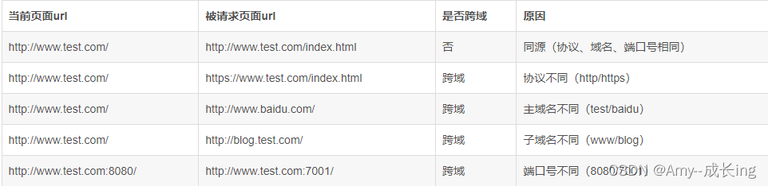

# 编码规约


### 命名规范


* 避免父子类的成员变量/不同代码块的局部变量之间采用相同的命名，使可读性降低

说明：子类、父类成员变量名相同，即使是public类型的变量也是能够通过编译，而局部变量在同一方法 内的不同代码块中同名也是合法的，但是要避免使用。对于非setter/getter的参数名称也要避免与成员变量名称相同


【强制】杜绝完全不规范的缩写，避免望文不知义。

* 反例：AbstractClass "缩写"命名成AbsClass ； condition "缩写"命名成condi，此类随意缩写严重 降低了代码的可阅读性


【推荐】为了达到代码自解释的目标，任何自定义编程元素在命名时，使用尽量完整的单词 组合来表达其意。

正例：在JDK中，表达原子更新的类名为：AtomicReferenceFieldUpdater


【推荐】在常量与变量的命名时，表示类型的名词放在词尾，以提升辨识度

正例：startTime / workQueue / nameList / TERMINATED_THREAD_COUNT


【推荐】如果模块、接口、类、方法使用了设计模式，在命名时需体现出具体模式

说明：将设计模式体现在名字中，有利于阅读者快速理解架构设计理念

正例： public class OrderFactory;


4. 接口和实现类的命名有两套规则：

1)【强制】对于Service和DAO类，基于SOA的理念，暴露出来的服务一定是接口，内部的实现类用 Impl 的后缀与接口区别。

正例： CacheServiceImpl 实现 CacheService 接口


2 )【推荐】如果是形容能力的接口名称，取对应的形容词为接口名(通常是-able的形容词)。

正例： AbstractTranslator 实现 Translatable 接口。

\5. 【参考】枚举类名带上 Enum 后缀，枚举成员名称需要全大写，单词间用下划线隔开

说明：枚举其实就是特殊的类，域成员均为常量，且构造方法被默认强制是私有。

正例：枚举名字为 ProcessStatusEnum 的成员名称：SUCCESS / UNKNOWN_REASON。

\6. 【参考】各层命名规约：

A) Service/DAO层方法命名规约

1)获取单个对象的方法用get做前缀。

2 )获取多个对象的方法用list做前缀，复数形式结尾如：listObjects。

3 )获取统计值的方法用count做前缀。

4) 插入的方法用 save/insert 做前缀。

5) 删除的方法用 remove/delete 做前缀。

6) 修改的方法用 update 做前缀


B) 领域模型命名规约

1) 数据对象：xxxDO，xxx即为数据表名。

2) 数据传输对象： xxxDTO， xxx 为业务领域相关的名称。

3) 展示对象： xxxVO， xxx 一般为网页名称。

4 ) POJO是DO/DTO/BO/VO的统称，禁止命名成xxxPOJO。


方法命名：一般有io消耗的方法，名称用findXxxxx, POJO类里自己写的方法名不允许使用getXxxx, 一律使用obtainXxxxx, 方法里面涉及复杂计算的化可以使用computeXxxx


### 常量定义


【强制】不允许任何魔法值(即未经预先定义的常量)直接出现在代码中

​	反例:String key = "Id#taobao_" + tradeld;

​			cache.put(key, value);	//代码复制时漏掉下划线，导致缓存get击穿


【强制】在long或者Long赋值时，数值后使用大写的L，不能是小写的I，小写容易跟数字 1 混淆，造成误解。

说明：Long a = 2l;写的是数字的21，还是Long型的2。


【推荐】不要使用一个常量类维护所有常量，要按常量功能进行归类，分开维护

说明：大而全的常量类，杂乱无章，使用查找功能才能定位到修改的常量，不利于理解和维护

正例：缓存相关常量放在类CacheConsts下；系统配置相关常量放在类ConfigConsts下


【推荐】常量的复用层次有五层：跨应用共享常量、应用内共享常量、子工程内共享常量、 包内共享常量、类内共享常量。

1) 跨应用共享常量：放置在二方库中，通常是client.jar中的constant目录下。

2) 应用内共享常量：放置在一方库中，通常是子模块中的constant目录下。

反例：易懂变量也要统一定义成应用内共享常量，两位工程师在两个类中分别定义了 "YES"的变量： 类 A 中： public static final String YES = "yes";

类 B 中：public static final String YES = "y";

A.YES.equals(B.YES)，预期是true，但实际返回为false，导致线上问题。

2 )子工程内部共享常量：即在当前子工程的constant目录下。

3 )包内共享常量：即在当前包下单独的constant目录下。

4 )类内共享常量：直接在类内部private static final定义。


【推荐】如果变量值仅在一个固定范围内变化用 enum 类型来定义


### 代码格式


【强制】大括号内非空则：

1 ) 左大括号前不换行

2 ) 左大括号后换行

3 ) 右大括号后还有 else ? 不换行 : 换行


【强制】左小括号和字符之间不出现空格；同样，右小括号和字符之间也不出现空格；而左大括号前需要空格


【强制】任何二目、三目运算符的左右两边都需要加一个空格


【强制】采用4个空格缩进，禁止使用tab字符,IDEA设置tab为4个空格时，请勿勾选Use tab character


【强制】//与注释内容只有一个空格


【强制】在进行类型强制转换时，右括号与强制转换值之间不需要任何空格隔开。

正例：

long first = 1000000000000L;

int second = (int)first + 2;


【强制】单行字符数限制不超过 120 个，超出需要换行，换行时遵循如下原则：

1）第二行相对第一行缩进 4 个空格，从第三行开始，不再继续缩进，参考示例。

2）运算符与下文一起换行。

3）方法调用的点符号与下文一起换行。

4）方法调用中的多个参数需要换行时，在逗号后进行。 

5）在括号前不要换行，见反例


【强制】IDE 的 text file encoding 设置为 UTF-8; IDE 中文件的换行符使用 Unix 格式，不要使用 Windows 格式


【推荐】单个方法的总行数不超过 80 行。

说明：除注释之外的方法签名、左右大括号、方法内代码、空行、回车的总行数不超过80 

正例：分清**红花和绿叶，个性和共性**，绿叶逻辑单独出来成为额外方法，使主干代码更加清晰；共性逻辑抽取成为共性方法，便于复用和维护


### OOP规约


【强制】避免通过一个类的对象引用访问此类的静态变量或静态方法，无谓增加编译器解析成本，直接用类名访问


【强制】相同参数类型，相同业务含义，才可以使用 Java 的可变参数，避免使用 Object。

说明：可变参数必须放置在参数列表的最后。（提倡同学们尽量不用可变参数编程）

正例：public List<User> listUsers(String type, Long... ids) {...}


【强制】外部正在调用或者二方库依赖的接口，不允许修改方法签名，避免对接口调用方产生影响。接口过时必须加@Deprecated 注解，并清晰地说明采用的新接口或者新服务是什么。


【强制】不能使用过时的类或方法

说明：java.net.URLDecoder 中的方法 decode(String encodeStr) 这个方法已经过时，应该使用双参数decode(String source, String encode)。接口提供方既然明确是过时接口，那么有义务同时提供新的接口；作为调用方来说，有义务去考证过时方法的新实现是什么


【强制】所有整型包装类对象之间值的比较，全部使用 equals()

说明：-128 ~ 127 范围内的 Integer 对象是在 IntegerCache.cache 产生，会复用已有对象，区间之外的所有数据，都会在堆上产生


【强制】浮点数的等值判断，基本数据类型不能用==来比较，包装数据类型不能用 equals( )

说明：浮点数采用“尾数+阶码”的编码方式，二进制无法精确表示大部分的十进制小数

反例：

```java
 //反例
float a = 1.0f - 0.9f;
float b = 0.9f - 0.8f;
a == b		//false
  
Float x = Float.valueOf(a);
Float y = Float.valueOf(b);
x.equals(y)	//false

//正例
//(1) 指定一个误差范围，两个浮点数的差值在此范围之内，则认为是相等的。
 float a = 1.0f - 0.9f;
 float b = 0.9f - 0.8f;
 float diff = 1e-6f;
 Math.abs(a - b) < diff	//true

   
//(2) 使用 BigDecimal 来定义值，再进行浮点数的运算操作。
 BigDecimal a = new BigDecimal("1.0");
 BigDecimal b = new BigDecimal("0.9");
 BigDecimal c = new BigDecimal("0.8");

 BigDecimal x = a.subtract(b);
 BigDecimal y = b.subtract(c);
 x.equals(y)	//true
```


==【强制】为了防止精度损失，禁止使用构造方法BigDecimal(double)的方式把double值转 化为 BigDecimal 对象==

说明：BigDecimal(double)存在精度损失风险，在精确计算或值比较的场景中可能会导致业务逻辑异常。 如： BigDecimal g = new BigDecimal(0.1f); 实际的存储值为： 0.10000000149

正例：优先推荐入参为String的构造方法，或使用BigDecimal的valueOf方法，此方法内部其实执行了 Double的toString，而Double的toString按double的实际能表达的精度对尾数进行截断

BigDecimal recommendl = new BigDecimal("0.1");

BigDecimal recommend2 = BigDecimal.valueOf(O.I);


==关于基本数据类型与包装数据类型的使用标准如下==

1. 【强制】所有的 POJO 类属性必须使用包装数据类型

   说明:数据库可能是null，因为自动拆箱，用基本数据类型接收有NPE风险

   反例：比如显示成交总额涨跌情况，即正负x%，x为基本数据类型，RPC调用不成功时， 返回的是默认值，页面显示为 0%，这是不合理的，应该显示成中划线。所以包装数据类型的 null 值，能够表示额外的信息，如：远程调用失败，异常退出

2. 【强制】 RPC 方法的返回值和参数必须使用包装数据类型

3. 【推荐】所有的**局部变量使用基本数据类型**

   作用域只在方法内的变量，直接在栈内存中存储，怎么性能高就怎么定义

4. 【强制】定义DO/DTO/VO等POJO类时，不要设定任何属性默认值

   说明：POJO类属性没有初值是提醒使用者在需要使用时，必须自己显式地进行赋值，任何NPE问题，或者入库检查，都由使用者来保证


【强制】序列化类新增属性时，不要修改serialVersionUID字段，避免反序列失败；如果完全不兼容升级，避免反序列化混乱，修改 serialVersionUID 值

说明：注意 serialVersionUID 不一致会抛出序列化运行时异常


【强制】构造方法/get/se禁止加入任何业务逻辑，如果有初始化逻辑，请放在 init 方法中


【强制】POJO类必须写toString方法。如果继承了另一个 POJO 类，在前面追加super.toString

说明：在方法执行抛出异常时，可以直接调用POJO的toString()方法打印其属性值，便于排查问题


【强制】禁止在POJO类中，同时存在对应属性xxx的isXxx()和getXxx()方法

说明：框架在调用属性xxx的提取方法时，并不能确定哪个方法一定是被优先调用到,Mybatis 和 Hibernate 框架是根据获取方法找到对应属性，因此上述定义可能存在问题


【推荐】使用索引访问用String的split方法得到的数组时，需做最后一个分隔符后有无内容的检查，否则会有抛 IndexOutOfBoundsException 的风险。

说明：

```java
String str = "a,b,c,,";
String[] ary = str.split(",");
System.out.println(ary.length);	// 预期大于 3，结果是3
```


【推荐】 类内方法定义的顺序：公有方法或保护方法 > 私有方法 > getter / setter 方法


【推荐】循环体的字符串的拼接，使用StringBuilder的append


【推荐】下列情况用final

1. 不允许被继承的类，如： String 类
2.  不允许修改引用的域对象
3. 不允许被覆写的方法，如： POJO 类的 set 
4. 不允许运行过程中重新赋值的局部变量
5. 避免上下文重复使用一个变量，使用final可以强制重新定义一个变量，方便更好地进行重构


【推荐】**慎用Object的clone方法来拷贝对象**

说明：对象 clone 方法默认是浅拷贝，若想实现深拷贝需覆写 clone 方法实现域对象的深度遍历式拷贝


【推荐】类成员与方法访问控制从严

1. 如果不允许外部直接通过 new 来创建对象，那么构造方法必须是 private
2. 工具类不允许有public或default构造方法
3. 类非 static 成员变量并且与子类共享，必须是 protected
4. 类非 static 成员变量并且仅在本类使用，必须是 private
5. 类static成员变量如果仅在本类使用，必须是private
6. 若是static成员变量，考虑是否为final
7. 类成员方法只供类内部调用，必须是 private
8. 类成员方法只对继承类公开，那么限制为 protected

任何类、方法、参数、变量，严控访问范围。过于宽泛的访问范围，不利于模块解耦

思考：如果是一个 private 的方法，想删除就删除，可是一个 public 的 service 成员方法或成员变量，删除一下，不得手心冒点汗吗？


### 集合处理


【强制】关于 hashCode 和 equals 的处理，遵循如下规则：

1. 只要覆写equals，就必须覆写hashCode
2. **Set存储的是不重复的对象，依据hashCode和equals进行判断，所以Set存储的对象必须覆写这两个方法**
3. 如果自定义对象作为Map的键，那么必须覆写hashCode和equals

说明：**String已覆写hashCode和equals方法**


【强制】==ArrayList的subList结果不可强转成ArrayList==，否则会抛出ClassCastException异常

说明：subList返回的是ArrayList的内部类SubList，并不是ArrayList而是ArrayList的一个视图，==对subList的所有操作最终会反映到原列表上==


【强制】使用Map的方法keySet()/values()/entrySet()返回集合对象时，不可以对其进行添加元素操作，否则会抛出 UnsupportedOperationException 异常


【强制】Collections类返回的对象，如：emptyList()/singietonList()等都是 immutable list，不可对其进行添加或者删除元素的操作

反例：如果查询无结果，返回Collections.emptyList()空集合对象，调用方一旦进行了添加元素的操作，会触发 UnsupportedOperationException 异常


【强制】在subList场景中，高度注意对原集合元素的增加或删除，均会导致子列表的遍 历、增加、删除产生 ConcurrentModificationException 异常


【强制】使用集合转数组的方法，必须使用集合的toArray(T[] array)，==传入类型一致、长度为0的空数组==

反例：直接使用toArray无参方法存在问题，此方法返回值只能是Object[]类，若强转其它类型数组将出 现 ClassCastException 错误。

正例：

```java
List<String> list = new ArrayList<>(2);
list.add("guan");
list.add("bao");
String[] array = list.toArray(new String[0]);
//0	动态创建与size相同的数组，性能最好
//0<  <list.size	重新创建大小等于size的数组，增加GC负担
//list.size		在高并发时，数组创建完成前size变大,数组需要重新创建，负面影响与上相同
//>list.size	空间浪费，且在size处插入null值，存在NPE隐患
```


【强制】在使用Collection接口任何实现类的addAII()方法时，都要对输入集合参数进行 NPE判断

说明：在ArrayList#addAII方法的第一行代码即Object]] a = c.toArrayO;其中c为输入集合参数，如果 为null，则直接抛出异常


【强制】使用工具类Arrays.asList转换成集合后，不能使用其修改集合相关的方法，会抛UnsupportedOperationException

说明：asList的返回对象是一个Arrays内部类，并没有实现集合的修改方法。Arrays.asList体现的是适配器模式，只是转换接口，后台的数据仍是数组


【强制】泛型通配符<? extends T>来接收返回的数据，此写法的泛型集合不能使用add方 法，而<? super T>不能使用get方法，作为接口调用赋值时易出错

说明：PECS(Producer Extends Consumer Super)原则：

1. 频繁往外读取内容的，适合 用<? extends T>
2. 经常往里插入的，适合用<? super T>


【强制】在无泛型限制定义的集合赋值给泛型限制的集合时，在使用集合元素时，需要进行 instanceof 判断，避免抛出 CIassCastException

说明：毕竟泛型是在JDK5后才出现，考虑到向前兼容，编译器是允许非泛型集合与泛型集合互相赋值


【强制】不要在foreach循环里进行元素的remove/add操作。remove元素请使用Iterator 方式，如果并发操作，需要对 Iterator 对象加锁


【强制】在JDK7版本及以上，Comparator实现类要满足如下三个条件，不然Arrays.sort , Collections.sort 会抛 IllegalArgumentException 异常

1. x，y 的比较结果和 y，x 的比较结果相反
2. x>y,y>z,则 x>z
3. x=y，则xz和yz比较结果相同

**反例：下例中没有处理相等的情况,交换两个对象判断结果并不互反,不符合第一个条件,在实际使用中可能会出现异常**

```java
new Comparator<Student>() {
@Override
public int compare(Student o1, Student o2) {
return o1.getId() > o2.getId() ? 1 : -1;
}
};
```


【推荐】集合泛型定义时，在JDK7及以上，使用diamond(菱形泛型<>)语法或全省略

正例：HashMap<String, String> userCache = new HashMap<>(16);


【推荐】集合初始化时，指定集合初始值大小。

说明：HashMap 使用 HashMap(int initialCapacity)初始化。

正例：initialCapacity =(需要存储的元素个数/负载因子)+ 1。注意负载因子(即loader factor)默认 为0.75 ，如果暂时无法确定初始值大小，请设置为 16(即默认值)。

反例： HashMap 需要放置 1024 个元素，由于没有设置容量初始大小，随着元素不断增加，容量 7 次被 迫扩大， resize 需要重建 hash 表，严重影响性能


【推荐】==使用entrySet遍历Map类集合KV，而不是keySet方式进行遍历==,**如果是JDK8， 使用 Map.forEach 方法**

keySet其实是遍历了 2次，一次是转为Iterator对象，另一次是从hashMap中取出key所对应 的value

而entrySet只是遍历了一次就把key和value都放到了 entry中，效率高


【参考】合理利用好集合的有序性(sort)和稳定性(order)，避免集合的无序性(unsort)和不稳定性(unorder)带来的负面影响

说明：有序性是指遍历的结果是按某种比较规则依次排列的。稳定性指集合每次遍历的元素次序是一定的。如：ArrayList 是 order/unsort ； HashMap 是 unorder/unsort ； TreeSet 是 order/sort


【参考】利用Set元素唯一的特性，可以快速对一个集合进行去重操作，避免使用List的 contains 方法进行遍历、对比、去重操作。


### 注释规约


【强制】类、类属性、类方法的注释必须使用 Javadoc 规范，使用/**内容*/格式，不得使用 // xxx 方式。

说明：在IDE编辑窗口中，Javadoc方式会提示相关注释,调用方法时，不进入方法即可悬浮提示方法、参数、返回值的意义，提高阅读效率


【强制】所有的抽象方法（包括接口中的方法）必须要用Javadoc注释、除了返回值、参数、 异常说明外，还必须指出该方法做什么事情，实现什么功能。一并说明对子类的实现要求，或者调用注意事项


【强制】所有的枚举类型字段必须有注释，说明每个数据项的用途


【推荐】与其“半吊子”英文来注释，不如用中文注释把问题说清楚。专有名词与关键字保持英文原文即可

反例："TCP连接超时"解释成"传输控制协议连接超时"，理解反而费脑筋


【推荐】==代码修改时，注释也要进行相应的修改==，尤其是参数、返回值、异常、核心逻 辑等的修改


【参考】谨慎注释掉代码。在上方详细说明，而不是简单地注释掉。如果无用，则删除

说明：代码被注释掉有两种可能性： 

1）后续会恢复此段代码逻辑。

2）永久不用,建议直接删掉（代码仓库已保存了历史代码）


【参考】对于注释的要求

1. 能够准确反映设计思想和代码逻辑
2. 能够描述业务含义，使别的程序员能够迅速了解到代码背后的信息。完全没有注释的大段代码对于阅读者形同天书，注释是给自己看的，即使隔很长时间，也能清晰理解当时的思路；注释也是给继任者看的，使其能够快速接替自己的工作。


【参考】好的命名、代码结构是自解释的，注释力求精简准确、表达到位。避免出现注释的一个极端：过多过滥的注释，代码的逻辑一旦修改，修改注释是相当大的负担。


【参考】特殊注释标记，注明标记人与标记时间。注意及时处理这些标记

1. 待办事宜（ TODO ） : （标记人，标记时间， ［ 预计处理时间 ］）		表示需要实现，但目前还未实现的功能
2. 错误，不能工作（FIXME）:（标记人，标记时间，［预计处理时间］）    标记某代码是错误的，而且不能工作，需要及时纠正的情况


### 控制语句


【强制】在高并发场景中，使用**区间代替等值**判断作为中断或退出的条件

反例：判断剩余奖品数量等于0时，终止发放奖品，但因为并发处理错误导致奖品数量瞬间变成了负数，导致活动无法终止


【参考】下列情形，需要进行参数校验：

1) 调用频次低的方法

2) 执行时间开销很大的方法。此情形中，参数校验时间几乎可以忽略不计，但如果因为参数错误导致中间执行回退，或者错误，那得不偿失

3) 需要极高稳定性和可用性的方法

4) 对外提供的开放接口，不管是RPC/API/HTTP接口

5) 敏感权限入口


【参考】下列情形，不需要进行参数校验：

1) 被循环调用的方法。但在方法说明里必须注明外部参数检查要求

2) 底层调用频度比较高的方法，参数错误不太可能到底层才会暴露问题。一般DAO层与Service层都在同一个应用中，部署在同一台服务器中，所以DAO的参数校验，可以省略

3）被声明成private只会被自己代码所调用的方法，如果能确定调用方法的代码传入参数已经做过检查或者肯定不会有问题，此时可以不校验参数


## 设计规约


\1. 【强制】存储方案和底层数据结构的设计获得评审一致通过，并沉淀成为文档。

说明：有缺陷的底层数据结构容易导致系统风险上升，可扩展性下降，重构成本也会因历史数据迁移和系 统平滑过渡而陡然增加，所以，存储方案和数据结构需要认真地进行设计和评审，生产环境提交执行后， 需要进行double check。

正例：评审内容包括存储介质选型、表结构设计能否满足技术方案、存取性能和存储空间能否满足业务发 展、表或字段之间的辩证关系、字段名称、字段类型、索引等；数据结构变更（如在原有表中新增字段） 也需要进行评审通过后上线。

\2. 【强制】在需求分析阶段，如果与系统交互的User超过一类并且相关的User Case超过5 个，使用用例图来表达更加清晰的结构化需求。

\3. 【强制】如果某个业务对象的状态超过3个，使用状态图来表达并且明确状态变化的各个触 发条件。

说明：状态图的核心是对象状态，首先明确对象有多少种状态，然后明确两两状态之间是否存在直接转换 关系，再明确触发状态转换的条件是什么。

正例：淘宝订单状态有已下单、待付款、已付款、待发货、已发货、已收货等。比如已下单与已收货这两 种状态之间是不可能有直接转换关系的。

\4. 【强制】如果系统中某个功能的调用链路上的涉及对象超过3个，使用时序图来表达并且明 确各调用环节的输入与输出。

说明：时序图反映了一系列对象间的交互与协作关系，清晰立体地反映系统的调用纵深链路。

\5. 【强制】如果系统中模型类超过5个，并且存在复杂的依赖关系，使用类图来表达并且明确 类之间的关系。

说明：类图像建筑领域的施工图，如果搭平房，可能不需要，但如果建造蚂蚁Z空间大楼，肯定需要详细 的施工图。

\6. 【强制】如果系统中超过2个对象之间存在协作关系，并且需要表示复杂的处理流程，使用 活动图来表示。

说明：活动图是流程图的扩展，增加了能够体现协作关系的对象泳道，支持表示并发等。

\7. 【推荐】需求分析与系统设计在考虑主干功能的同时，需要充分评估异常流程与业务边界。 反例：用户在淘宝付款过程中，银行扣款成功，发送给用户扣款成功短信，但是支付宝入款时由于断网演 练产生异常，淘宝订单页面依然显示未付款，导致用户投诉。

\8. 【推荐】类在设计与实现时要符合单一原则。

说明：单一原则最易理解却是最难实现的一条规则，随着系统演进，很多时候，忘记了类设计的初衷。

\9. 【推荐】谨慎使用继承的方式来进行扩展，优先使用聚合/组合的方式来实现。

说明：不得已使用继承的话，必须符合里氏代换原则，此原则说父类能够出现的地方子类一定能够出现， t匕如，"把钱交出来"，钱的子类美元、欧元、人民币等都可以出现。

\10. 【推荐】系统设计时，根据依赖倒置原则，尽量依赖抽象类与接口，有利于扩展与维护。

说明：低层次模块依赖于高层次模块的抽象，方便系统间的解耦。

\11. 【推荐】系统设计时，注意对扩展开放，对修改闭合。

说明：极端情况下，交付线上生产环境的代码都是不可修改的，同一业务域内的需求变化，通过模块或类 的扩展来实现。

\12. 【推荐】系统设计阶段，共性业务或公共行为抽取出来公共模块、公共配置、公共类、公共 方法等，避免出现重复代码或重复配置的情况。

说明：随着代码的重复次数不断增加，维护成本指数级上升。

\13. 【推荐】避免如下误解：敏捷开发=讲故事+编码+发布。

说明：敏捷开发是快速交付迭代可用的系统，省略多余的设计方案，摒弃传统的审批流程，但核心关键点 上的必要设计和文档沉淀是需要的。

反例：某团队为了业务快速发展，敏捷成了产品经理催进度的借口，系统中均是勉强能运行但像面条一样 的代码，可维护性和可扩展性极差，一年之后，不得不进行大规模重构，得不偿失。

\14. 【参考】系统设计主要目的是明确需求、理顺逻辑、后期维护，次要目的用于指导编码。 说明：避免为了设计而设计，系统设计文档有助于后期的系统维护和重构，所以设计结果需要进行分类归 档保存。

\15. 【参考】设计的本质就是识别和表达系统难点，找到系统的变化点，并隔离变化点。

说明：世间众多设计模式目的是相同的，即隔离系统变化点。

\16. 【参考】系统架构设计的目的：

•确定系统边界。确定系统在技术层面上的做与不做。

•确定系统内模块之间的关系。确定模块之间的依赖关系及模块的宏观输入与输出。

•确定指导后续设计与演化的原则。使后续的子系统或模块设计在规定的框架内继续演化。

•确定非功能性需求。非功能性需求是指安全性、可用性、可扩展性等。

\17. 【参考】在做无障碍产品设计时，需要考虑到：

•所有可交互的控件元素必须能被tab键聚焦，并且焦点I顺序需符合自然操作逻辑。

•用于登陆校验和请求拦截的验证码均需提供图形验证以外的其它方式。

•自定义的控件类型需明确交互方式。


Entity所有属性都使用包装类型，都没有默认值，对于不不能为空的字段，需要在构造方法里面进行初始化，数据库需要添加约束


## 名词解释


POJO ( Plain Ordinary Java Object):在本手册中，POJO 专指只有 setter / getter / toString 的简单类，包括 DO/DTO/BO/VO 等。

GAV ( Groupld、Artifactctld、Version ) : Maven 坐标，是用来唯一标识 jar 包。

OOP ( Object Oriented Programming ):本手册泛指类、对象的编程处理方式。

ORM ( Object Relation Mapping ):对象关系映射，对象领域模型与底层数据之间的转换， 本文泛指iBATIS, mybatis等框架。

NPE (java.lang.NullPointerException ):空指针异常。

SOA ( Service-Oriented Architecture ):面向服务架构，它可以根据需求通过网络对松散耦合 的粗粒度应用组件进行分布式部署、组合和使用，有利于提升组件可重用性，可维护性。

OOM ( Out Of Memory ):源于 java.lang.OutOfMemoryError，当 JVM 没有足够的内存来 为对象分配空间并且垃圾回收器也无法回收空间时，系统出现的严重状况。

一方库：本工程内部子项目模块依赖的库(jar包)

二方库：公司内部发布到中央仓库，可供公司内部其它应用依赖的库(jar包)


## 优雅的代码


**代码首先是写给人看的，其次才是计算机顺便能够运行**

能完成功能，也就完成了开发任务，固然是应该的。但项目是持续迭代的，以前的代码以后还要去维护，如果每次都只有完成功能的最低要求，日积月累，这个项目所能达到的质量也只会是最低要求，并且这个最低要求还会进一步降低。而且，你所编写的代码，在你维护这个项目的期间，你是面对着它最长时间的人。写得好，你看起来会舒服心情好，写得烂，恶心也只恶心到你自己

**写好代码更能省时间**

优雅的代码是逻辑清晰的，简单直观的，读逻辑清晰是更容易的，由此可以把更多的精力与时间花在功能开发上，而不是理清以前逻辑。其次，编写代码时，思维清晰，就可以写出更严谨的代码，这样就能减少bug，也就减少了修复bug所花费的时间。不应该把时间都耗费在代码的修复上，而应该更多地用于创造性的工作。编写优雅的代码，正是达成这一目标的有效方法

**做有所追求的程序员**

代码质量取决于你自己，而不是你的公司，你的老板，产品经理，设计人员，或是项目以前的负责人员。有追求的你，不应该让他们成为你降低自己要求的理由。你对自己有所追求，对代码也应当有所追求


## Effective Java


### 谨慎设计方法签名

谨慎选择方法名

始终遵循标准命名习惯,命名风格一致


不追求提供过于便利的方法


避免过长的参数列表

将方法分解为多个方法,可能导致方法过多,可以提升方法的正交性,从而减少方法的总数目

创建辅助类封装入参

整合前两种方式,从对象构建到方法调用都采用Builder模式,简化代码


### 零长度数组/集合代替null


```java
return list.isEmpty() ? null : list;
```

集合为空作为特例是不合常理的,这也使得调用方用额外地处理null的情况

```
if(list==null)
```

甚至忘记判断非空时还会报错,这也是最常见的错误


直接返回null,不去分配0长度的容器,并不会带来性能上的提升

更合适的是用集合的构造器封装返回值	更好地是用Collections.emptyList()的单例空集合

```java
new ArrayList<>(nums);
Collections.emptyList();
```


## 修炼之道


==注重实效==


### 破窗理论

> Don`t Live with Broken Windows	不要容忍破窗户
>

一扇不被修理的破窗户,会渐渐给周围的居民带来废弃感 -> 一扇又一扇的窗破了

破窗理论启发了警察,他们对轻微案件严加处理,进而防止了大案的发生


团队在项目中忍受一项糟糕的管理决策,就足以让项目开始衰败

当发现自己在有好几扇破窗户的项目工作时,很容易产生这样的想法:这段代码的其余部分也是垃圾,只要照着做就行了


### 足够好的软件


#### 让用户参与质量权衡

系统的范围和质量作为系统需求的一部分规定下来

> Make quality a requirements issue	使质量成为需求问题
>


许多用户宁愿在今天用上有一些"毛边"的软件,也不愿等待一年后的完美版本

越早交付,用户越早使用,从而提出反馈将软件引向更好地最终解决方案


#### 知道何时止步

如果一层又一层重复地完善细节,编程就会陷入死循环

不能因为过度修饰而损毁完好的程序,让代码凭着自己的质量站一会儿

它也许不够完美,但它不可能完美


### 知识财产

知识和经验是最重要的职业财富,但它们是有时效的资产

随着新技术/语言/环境的出现,知识会过时,对于公司来说,你的价值在降低


定期投资,多元化是长期成功的关键

在保守/高风险的投资间平衡资产

设法低买高卖,获取最大回报

周期性地重新评估和平衡资产


#### 批判的思考

> Critically analyze what you read and hear	批判地分析你读到的和听到的
>
> 不要低估商业主义的力量,Web搜索引擎把某个页面放在最前面,并不意味着那就是最佳选择

你需要确保资产中的知识是准确的,并没有受到"供应商或媒体"炒作的影响


### 交流

失去有效的交流,再好的想法也只是一个无人关心的孤儿

开发人员需要在多个层面上进行交流


#### 知道你想说什么

最困难的是让别人确切地弄清楚你想要说什么

需要简略地几下你想要交流的想法,并准备好几种把它们讲清楚的策略


#### 了解你的听众

**只有当你在传递信息时,才叫交流**

需要了解听众的需要/兴趣/能力


> 技术人员在发表长篇独白,介绍新技术的各种优点,把市场部员工弄得目光呆滞 -> 这不是交流,而是让人厌烦的空谈
>
> 
>
> 你想让他们学到什么?
> 他们对你讲的什么感兴趣?
> 他们有多少的经验?
> 他们想要多少的细节?
> 你想让谁拥有这些信息?
> 你如何促使他们听你说话?


调整你的交流风格,让其适应你的听众

* 正式报告

* 进入正题前高谈阔论一番

* 一大摞报告

* 简单的备忘录


记住你也是交流的一方,如果对方要求一句话概括,你认为不用几页纸就无法做到,就要如实地告诉他们.反馈也是交流的一种形式


#### 做倾听者

想让大家听你说话,必须先听他们说话,即使你掌握着全部信息

鼓励大家通过提问来交谈,或是让他们总结你告诉他们的东西 -> 把会议变为对话


### DRY

> Don`t Repeat YourSelf 不要重复你自己
>

重复往往不是你是否能记得修改其他地方的问题,而是何时会忘记

不要在系统各处对知识重复 -> 把**低级的知识留在代码中**,而在注释上写明关键的解释

重复将导致一处修改,需要记得修改其他处

在团队中指定某成员承担项目资料管理员,负责协调文档和代码仓库


#### 重复产生原因


**强加的重复**

糟糕的代码才需要很多注释,把低级知识放在代码中,注释留给高级说明,否则每次改动都要修改注释

多平台各自需要自己的编程语言/库/开发环境/重复的文档


**无意的重复**

当涉及到多个互相依赖的数据元素,容易出现不规范数据


对于线段类,起点终点是必须的,但长度非必须

通过局部化的方式,让DRY的违反不暴露给外界,也体现了面向对象语言中,使用方法来访问属性会带来更大的拓展性


**无耐心的重复**

欲速则不达,为了省事拷贝代码,以后会损失更多时间

开发者的懒惰会造成问题


**开发者间的重复**

最难被检测和处理,整个功能集都可能在重复,并且重复可能在短时间内不会被发现,从而导致维护问题

开发者需要主动的交流,或让某个团队成员担任项目资料管理员

制定公共区域,用于存放脚本

阅读他人的源码与文档


> **Make it easy to reuse**	让复用变得容易

更重要的是营造一种环境,在其中能够轻松地找到能复用的东西,**如果寻找起来麻烦,大家都不会去复用**


### 正交性

> Eliminate Effects Between Unrelated Things 消除无关事物间的影响

几何学中表示相交为直角的两条直线

计算技术中表示**不相依赖/解耦**,发生变化时不会影响其他事物


非正交性将面临 : 当系统中的各组件互相高度依赖时,局部修正将扩展为全局修正


设计自足的组件: 独立,具有单一,良好定义的目的

**局部化**	缩小测试范围

促进复用	组件有明确具体的,良好定义的责任

组合		两个组件分别能做M和N件事,如果组件是正交的,在组合后能做M*N件事

降低风险	模块出现问题不会扩散至整个系统,新模块的替换也变得容易

​			针对组件的测试更容易设计

​			第三方组件的接口被隔离在局部,不会与特定的产品/平台捆绑在一起


> Origanize Around Functionality,Not Job Functions	围绕功能,而不是工作职务进行组织
>

传统团队基于瀑布开发,各个角色基于工作职务指派任务,导致越接近用户,职务级别越高,并把开发进行严格的责任划分,认为(分析,设计,编码,测试)是独立的任务

然而分析,设计,编码,测试是看待同一问题的不同方式;离用户隔着产品和测试的程序员不会注意到他们工作的应用语境,导致设计的产品与用户需求不同


通过按照功能划分团队,分别负责最终系统的特定功能,团队中按照个人的能力进行组织,团队成员按照职责,对项目中其他成员负有责任


#### 方式


**团队**

成员间责任的重叠将使得成员对责任感到困惑,改动将需要整个团队开会

将团队责任划分,得到良好定义的小组


**设计**

系统由一组相互协作的模块组成,模块的实现不依赖于其他模块的功能

有时这些组件被组织成多个层次,每层提供一级抽象,每层都只使用其下面一层提供的抽象,改动底层无需修改上层,降低模块间依赖失控的风险


**第三方**

引入第三方时思考是否会对现有产生影响,这使得能够轻易地更换供应商


**编码**

保持代码解耦,避免向其他模块暴露或依赖

避免使用全局数据(单例模式)

避免编写相似的函数(策略模式)

AOP也是正交性的一种体现:把原本需要分散在系统各个部分的代码在一处进行表达


**测试**

组件之间的交互是形式化并且有限的,更多的测试可以在单个模块级进行,而无需集成测试


### 估算


#### 需要多准确

不同人对估算精度的需求不同,可能精确到天,也可能是秒


#### 考虑前提条件

前置条件将影响实际结果


### 曳光弹


曳光弹与常规弹药交错着装在弹药袋,会留下烟火的轨迹,曳光弹击中则弹药也击中

**曳光弹比费力计算更可取**,反馈是及时的,与弹药工作在同一环境,外部影响小


为了在代码中获得同样的效果,需要能够快速直观,可重复地从需求出发,满足需求

在曳光代码中保留着任何一段产品都有的错误检查,结构,文档,它只是功能不全而已,但当各组件之间实现了端到端的连接,增加功能就变得非常容易,所以**曳光代码无需丢弃**


* 优点

快速交付,用户能够尽早看到,提前演示

提前构建结构

更容易感知工作进度


**曳光 VS 原型**

原型在对概念进行试验后,就进行了丢弃,而曳光弹则贯穿了开发流程

原型制作生成用过就扔的代码,曳光代码虽然简约,但是完整


### 测试

bug报告的准确性会在经第三方之手时降低


复现bug

数据可视化

断点

向别人解释代码过程

当bug是由脏数据导致的,检查能否通过参数检查更早地隔离它


> Test Early,Test Often,Test Automatically	早测试,常测试,自动测试
>
> 编一点,测一点;bug被发现的越早,进行修补的成本就越低


#### 单元测试

如果各组成部分自身不能工作,它们结合在一起多半也不能工作


#### 集成测试

集成测试只是单元测试的一种拓展,只不过测试的是各个子系统遵守接口规约的情况


#### 验证和校验

尽管没有了bug,也需要验证与用户需求是否一致


#### 性能测试


#### 可用性测试


### 死程序不说谎

> Crash Early	早崩溃
>

许多时候,让程序崩溃是最佳选择

runtimeException就是这种机制,如果没有被捕获,就会渗透到程序顶部,致使其终止,并显示栈踪迹

当你的代码发现某件不可能发生的事已经发生时,你的程序就不再有存活能力,它所做的每件事都是不保证正确的,所以要尽快地终止它


死程序带来的危害通常比有疾患的程序小得多


#### 断言式编程

> If it can not happen,use assertions to ensure that it won`t	如果它不可能发生,用断言来证明
>

断言的性能开销比起它的作用是不值一提的


### 配平资源

> Finish what you start	要有始有终
>

每次分配都对应着一次释放

按资源的分配的相反顺序进行释放,避免资源含有另一个资源的引用而无法释放

对于资源的分配总是以相同的顺序,避免死锁

在编程结束后检查各项资源是否配平


Java一般在finally实现配平


### 弯曲或折断


#### 得墨忒法则

把代码组织成最小组织单位,并限制模块间的交互,使得模块的替换不会影响其他模块


编写"羞涩"的代码:不向外部暴露自己;不与过多的人打交道


#### 元程序设计

> Levy’s Eighth Law	再多的天才也无法胜过对细节的关注
>

细节将弄乱整洁的代码,需要将细节赶出代码 -> 让代码高度可配置


### 极大的期望

项目的成功取决于在多大程度上满足了用户期望

哪怕是实现了极其复杂的应用,但可能会遭到用户的抵制,因为用户只想要廉价的洋娃娃

> Gently Exceed Your User`s Expectations	温和地超出用户的期望
>


但为了满足用户的期望,需要交流期望

用户的期望可能无法被满足,也可能过于保守,需要让用户正确地理解你将要交付的产品,以及用户尚未描述出来的期望


#### 额外的一英里

当项目交付时,要设法让用户惊讶,比用户期望多一点点,给系统增加面向某种用户特性所需的一点额外努力


用户通常期望的特性

* 气泡提示
* 快捷键
* 快速参考指南
* 自动化安装
* 定制的初始化页面


### 傲慢与偏见

> Sign Your Work	在你的作品上签名
>

注重实效的程序员不会逃避责任,需要乐于接受挑战,乐于使我们的专业知识广为人知

负责一项设计,一段代码,是一件足以引以自豪的工作


但项目团队是由人组成的,签名的代码所有权概念会带来协作上的问题 -> 变得有领地意识,不愿意在公共的基础设施上工作 -> 项目变为一些互相隔离的区域


签名应当被视为质量的保证,当同事在代码上看见你的签名时,应当期望它是可靠的,用心编写的,经过测试的


### 注重实效的团队


#### 不留破窗户

团队必须为产品质量负责,质量源于全体团队成员的共同努力


#### 煮青蛙

在整体的团队中更容易忽略周围的环境,会认为有另外的人在处理某个问题,或是领导已经批准了某项改动

需要确保每个人都主动地监视环境的变化,或是指定检测员


# 写法优化


要努力编写好的程序,而不是快的程序


每次试图优化前后,都需要对性能进行测量

要猜出程序把时间花在哪里并不容易,你认为程序慢的地方可能并没有问题,这时就造成花费大量时间去优化不重要的代码


## 字符串分割->列表

```java
List<String> customerNicks = Lists.newArrayList();
for (String nick : nicks.split(",")) {
  customerNicks.add(nick);
}
-->
  Lists.newArrayList(nicks.split(","));
```


## 匹配的第一个

```java
for (FieldValueComparator fieldValueComparator : comparators) {
  if (fieldValueComparator.isMatch(comparator)) {
    return fieldValueComparator;
  }
}
return null;
-->
return comparators.stream().filter(a->a.isMatch(comparator)).findFirst();
```


## 匹配个数统计


```java
int total = 0;
for (Object obj : values) {
  if (isObjAvailable(obj)) {
    total++;
  }
}
return total;
-->
return values.stream().filter(this::isObjAvailable).count();
```


## 合并集合


```java
List<UnitFilter> filters = new ArrayList<>();
for (CampaignFilterTier tier : tiers) {
  filters.addAll(tier.getAllFilters());
}
return filters;
-->
return Iterables.concat(Lists.transform(tiers, CampaignFilterTier::getAllFilters));
```


```java
boolean objAvailable = true;
for (Condition condition : conditions) {
  if (!condition.match(obj)) {
    objAvailable = false;
  }
}
return objAvailable;
-->
return Iterables.all(conditions, c->c.match(obj));
```


# Web 页面请求过程

### 1. DHCP 配置主机信息

- 假设主机最开始没有 IP 地址以及其它信息，那么就需要先使用 DHCP 来获取。

- 主机生成一个 DHCP 请求报文，并将这个报文放入具有目的端口 67 和源端口 68 的 UDP 报文段中。

- 该报文段则被放入在一个具有广播 IP 目的地址(255.255.255.255) 和源 IP 地址（0.0.0.0）的 IP 数据报中。

- 该数据报则被放置在 MAC 帧中，该帧具有目的地址 FF:\<zero-width space\>FF:\<zero-width space\>FF:\<zero-width space\>FF:\<zero-width space\>FF:FF，将广播到与交换机连接的所有设备。

- 连接在交换机的 DHCP 服务器收到广播帧之后，不断地向上分解得到 IP 数据报、UDP 报文段、DHCP 请求报文，之后生成 DHCP ACK 报文，该报文包含以下信息：IP 地址、DNS 服务器的 IP 地址、默认网关路由器的 IP 地址和子网掩码。该报文被放入 UDP 报文段中，UDP 报文段有被放入 IP 数据报中，最后放入 MAC 帧中。

- 该帧的目的地址是请求主机的 MAC 地址，因为交换机具有自学习能力，之前主机发送了广播帧之后就记录了 MAC 地址到其转发接口的交换表项，因此现在交换机就可以直接知道应该向哪个接口发送该帧。

- 主机收到该帧后，不断分解得到 DHCP 报文。之后就配置它的 IP 地址、子网掩码和 DNS 服务器的 IP 地址，并在其 IP 转发表中安装默认网关。

### 2. ARP 解析 MAC 地址

- 主机通过浏览器生成一个 TCP 套接字，套接字向 HTTP 服务器发送 HTTP 请求。为了生成该套接字，主机需要知道网站的域名对应的 IP 地址。

- 主机生成一个 DNS 查询报文，该报文具有 53 号端口，因为 DNS 服务器的端口号是 53。

- 该 DNS 查询报文被放入目的地址为 DNS 服务器 IP 地址的 IP 数据报中。

- 该 IP 数据报被放入一个以太网帧中，该帧将发送到网关路由器。

- DHCP 过程只知道网关路由器的 IP 地址，为了获取网关路由器的 MAC 地址，需要使用 ARP 协议。

- 主机生成一个包含目的地址为网关路由器 IP 地址的 ARP 查询报文，将该 ARP 查询报文放入一个具有广播目的地址（FF:\<zero-width space\>FF:\<zero-width space\>FF:\<zero-width space\>FF:\<zero-width space\>FF:FF）的以太网帧中，并向交换机发送该以太网帧，交换机将该帧转发给所有的连接设备，包括网关路由器。

- 网关路由器接收到该帧后，不断向上分解得到 ARP 报文，发现其中的 IP 地址与其接口的 IP 地址匹配，因此就发送一个 ARP 回答报文，包含了它的 MAC 地址，发回给主机。

### 3. DNS 解析域名

- 知道了网关路由器的 MAC 地址之后，就可以继续 DNS 的解析过程了。

- 网关路由器接收到包含 DNS 查询报文的以太网帧后，抽取出 IP 数据报，并根据转发表决定该 IP 数据报应该转发的路由器。

- 因为路由器具有内部网关协议（RIP、OSPF）和外部网关协议（BGP）这两种路由选择协议，因此路由表中已经配置了网关路由器到达 DNS 服务器的路由表项。

- 到达 DNS 服务器之后，DNS 服务器抽取出 DNS 查询报文，并在 DNS 数据库中查找待解析的域名。

- 找到 DNS 记录之后，发送 DNS 回答报文，将该回答报文放入 UDP 报文段中，然后放入 IP 数据报中，通过路由器反向转发回网关路由器，并经过以太网交换机到达主机。

### 4. HTTP 请求页面

- 有了 HTTP 服务器的 IP 地址之后，主机就能够生成 TCP 套接字，该套接字将用于向 Web 服务器发送 HTTP GET 报文。

- 在生成 TCP 套接字之前，必须先与 HTTP 服务器进行三次握手来建立连接。生成一个具有目的端口 80 的 TCP SYN 报文段，并向 HTTP 服务器发送该报文段。

- HTTP 服务器收到该报文段之后，生成 TCP SYN ACK 报文段，发回给主机。

- 连接建立之后，浏览器生成 HTTP GET 报文，并交付给 HTTP 服务器。

- HTTP 服务器从 TCP 套接字读取 HTTP GET 报文，生成一个 HTTP 响应报文，将 Web 页面内容放入报文主体中，发回给主机。

- 浏览器收到 HTTP 响应报文后，抽取出 Web 页面内容，之后进行渲染，显示 Web 页面


# 跨域


同源策略: **协议、主机、端口**一致视为同源

同源策略会阻止一个域的javascript脚本和另外一个域的内容进行交互




## 后端解决方案


### nginx反向代理解决跨域

```shell
location / {
   add_header Access-Control-Allow-Origin *;
   add_header Access-Control-Allow-Headers X-Requested-With;
   add_header Access-Control-Allow-Methods GET,POST,PUT,DELETE,OPTIONS;

   if ($request_method = 'OPTIONS') {
     return 204;
   }
}
```


### WebFilter

```java
@WebFilter
public class CorsFilter implements Filter {  

  @Override
  public void doFilter(ServletRequest req, ServletResponse res, FilterChain chain) throws IOException, ServletException {  
    HttpServletResponse response = (HttpServletResponse) res;  
    response.setHeader("Access-Control-Allow-Origin", "*");  
    response.setHeader("Access-Control-Allow-Methods", "*");  
    response.setHeader("Access-Control-Max-Age", "3600");  
    response.setHeader("Access-Control-Allow-Headers", "*");
    response.setHeader("Access-Control-Allow-Credentials", "true");
    chain.doFilter(req, res);  
  }  
}
```


### 继承HandlerInterceptorAdapter


```java
@Component
public class CrossInterceptor extends HandlerInterceptorAdapter {
  @Override
  public boolean preHandle(HttpServletRequest request, HttpServletResponse response, Object handler) throws Exception {
    response.setHeader("Access-Control-Allow-Origin", "*");
    response.setHeader("Access-Control-Allow-Methods", "GET, POST, PUT, DELETE, OPTIONS");
    response.setHeader("Access-Control-Max-Age", "3600");
    response.setHeader("Access-Control-Allow-Headers", "*");
    response.setHeader("Access-Control-Allow-Credentials", "true");
    return true;
  }
}
```


### 实现WebMvcConfigurer


```java
@Configuration
@SuppressWarnings("SpringJavaAutowiredFieldsWarningInspection")
public class AppConfig implements WebMvcConfigurer {

  @Override
  public void addCorsMappings(CorsRegistry registry) {
    registry.addMapping("/**")  // 拦截所有的请求
      .allowedOrigins("http://www.abc.com")  // 可跨域的域名，可以为 *
      .allowCredentials(true)
      .allowedMethods("*")   // 允许跨域的方法，可以单独配置
      .allowedHeaders("*");  // 允许跨域的请求头，可以单独配置
  }
}
```


### @CrossOrgin

```java
@CrossOrigin	//不会全局生效
@GetMapping("/{id}")
public User get(@PathVariable Long id) {
}
```


# 正则


|     字符     |                             描述                             |
| :----------: | :----------------------------------------------------------: |
|      \       | 将下一个字符标记为一个特殊字符、或一个原义字符、或一个向后引用、或一个八进制转义符。例如，“`n`”匹配字符“`n`”。“`\n`”匹配一个换行符。串行“`\\`”匹配“`\`”而“`\(`”则匹配“`(`”。 |
|      ^       | 匹配输入字符串的开始位置。如果设置了RegExp对象的Multiline属性，^也匹配“`\n`”或“`\r`”之后的位置。 |
|      $       | 匹配输入字符串的结束位置。如果设置了RegExp对象的Multiline属性，$也匹配“`\n`”或“`\r`”之前的位置。 |
|      *       | 匹配前面的子表达式零次或多次。例如，zo*能匹配“`z`”以及“`zoo`”。*等价于{0,}。 |
|      +       | 匹配前面的子表达式一次或多次。例如，“`zo+`”能匹配“`zo`”以及“`zoo`”，但不能匹配“`z`”。+等价于{1,}。 |
|      ?       | 匹配前面的子表达式零次或一次。例如，“`do(es)?`”可以匹配“`does`”或“`does`”中的“`do`”。?等价于{0,1}。 |
|    {*n*}     | *n*是一个非负整数。匹配确定的*n*次。例如，“`o{2}`”不能匹配“`Bob`”中的“`o`”，但是能匹配“`food`”中的两个o。 |
|    {*n*,}    | *n*是一个非负整数。至少匹配*n*次。例如，“`o{2,}`”不能匹配“`Bob`”中的“`o`”，但能匹配“`foooood`”中的所有o。“`o{1,}`”等价于“`o+`”。“`o{0,}`”则等价于“`o*`”。 |
|  {*n*,*m*}   | *m*和*n*均为非负整数，其中*n*<=*m*。最少匹配*n*次且最多匹配*m*次。例如，“`o{1,3}`”将匹配“`fooooood`”中的前三个o。“`o{0,1}`”等价于“`o?`”。请注意在逗号和两个数之间不能有空格。 |
|      ?       | 当该字符紧跟在任何一个其他限制符（*,+,?，{*n*}，{*n*,}，{*n*,*m*}）后面时，匹配模式是非贪婪的。非贪婪模式尽可能少的匹配所搜索的字符串，而默认的贪婪模式则尽可能多的匹配所搜索的字符串。例如，对于字符串“`oooo`”，“`o+?`”将匹配单个“`o`”，而“`o+`”将匹配所有“`o`”。 |
|      .       | 匹配除“`\`*`n`*”之外的任何单个字符。要匹配包括“`\`*`n`*”在内的任何字符，请使用像“`(.|\n)`”的模式。 |
|  (pattern)   | 匹配pattern并获取这一匹配。所获取的匹配可以从产生的Matches集合得到，在VBScript中使用SubMatches集合，在JScript中则使用$0…$9属性。要匹配圆括号字符，请使用“`\(`”或“`\)`”。 |
| (?:pattern)  | 匹配pattern但不获取匹配结果，也就是说这是一个非获取匹配，不进行存储供以后使用。这在使用或字符“`(|)`”来组合一个模式的各个部分是很有用。例如“`industr(?:y|ies)`”就是一个比“`industry|industries`”更简略的表达式。 |
| (?=pattern)  | 正向肯定预查，在任何匹配pattern的字符串开始处匹配查找字符串。这是一个非获取匹配，也就是说，该匹配不需要获取供以后使用。例如，“`Windows(?=95|98|NT|2000)`”能匹配“`Windows2000`”中的“`Windows`”，但不能匹配“`Windows3.1`”中的“`Windows`”。预查不消耗字符，也就是说，在一个匹配发生后，在最后一次匹配之后立即开始下一次匹配的搜索，而不是从包含预查的字符之后开始。 |
| (?!pattern)  | 正向否定预查，在任何不匹配pattern的字符串开始处匹配查找字符串。这是一个非获取匹配，也就是说，该匹配不需要获取供以后使用。例如“`Windows(?!95|98|NT|2000)`”能匹配“`Windows3.1`”中的“`Windows`”，但不能匹配“`Windows2000`”中的“`Windows`”。预查不消耗字符，也就是说，在一个匹配发生后，在最后一次匹配之后立即开始下一次匹配的搜索，而不是从包含预查的字符之后开始 |
| (?<=pattern) | 反向肯定预查，与正向肯定预查类拟，只是方向相反。例如，“`(?<=95|98|NT|2000)Windows`”能匹配“`2000Windows`”中的“`Windows`”，但不能匹配“`3.1Windows`”中的“`Windows`”。 |
| (?<!pattern) | 反向否定预查，与正向否定预查类拟，只是方向相反。例如“`(?<!95|98|NT|2000)Windows`”能匹配“`3.1Windows`”中的“`Windows`”，但不能匹配“`2000Windows`”中的“`Windows`”。 |
|     x\|y     | 匹配x或y。例如，“`z|food`”能匹配“`z`”或“`food`”。“`(z|f)ood`”则匹配“`zood`”或“`food`”。 |
|    [xyz]     | 字符集合。匹配所包含的任意一个字符。例如，“`[abc]`”可以匹配“`plain`”中的“`a`”。 |
|    [^xyz]    | 负值字符集合。匹配未包含的任意字符。例如，“`[^abc]`”可以匹配“`plain`”中的“`p`”。 |
|    [a-z]     | 字符范围。匹配指定范围内的任意字符。例如，“`[a-z]`”可以匹配“`a`”到“`z`”范围内的任意小写字母字符。 |
|    [^a-z]    | 负值字符范围。匹配任何不在指定范围内的任意字符。例如，“`[^a-z]`”可以匹配任何不在“`a`”到“`z`”范围内的任意字符。 |
|      \b      | 匹配一个单词边界，也就是指单词和空格间的位置。例如，“`er\b`”可以匹配“`never`”中的“`er`”，但不能匹配“`verb`”中的“`er`”。 |
|      \B      | 匹配非单词边界。“`er\B`”能匹配“`verb`”中的“`er`”，但不能匹配“`never`”中的“`er`”。 |
|     \cx      | 匹配由x指明的控制字符。例如，\cM匹配一个Control-M或回车符。x的值必须为A-Z或a-z之一。否则，将c视为一个原义的“`c`”字符。 |
|      \d      |               匹配一个数字字符。等价于[0-9]。                |
|      \D      |              匹配一个非数字字符。等价于[^0-9]。              |
|      \f      |              匹配一个换页符。等价于\x0c和\cL。               |
|      \n      |              匹配一个换行符。等价于\x0a和\cJ。               |
|      \r      |              匹配一个回车符。等价于\x0d和\cM。               |
|      \s      | 匹配任何空白字符，包括空格、制表符、换页符等等。等价于[ \f\n\r\t\v]。 |
|      \S      |          匹配任何非空白字符。等价于[^ \f\n\r\t\v]。          |
|      \t      |              匹配一个制表符。等价于\x09和\cI。               |
|      \v      |            匹配一个垂直制表符。等价于\x0b和\cK。             |
|      \w      |    匹配包括下划线的任何单词字符。等价于“`[A-Za-z0-9_]`”。    |
|      \W      |        匹配任何非单词字符。等价于“`[^A-Za-z0-9_]`”。         |
|    \x*n*     | 匹配*n*，其中*n*为十六进制转义值。十六进制转义值必须为确定的两个数字长。例如，“`\x41`”匹配“`A`”。“`\x041`”则等价于“`\x04&1`”。正则表达式中可以使用ASCII编码。. |
|    \*num*    | 匹配*num*，其中*num*是一个正整数。对所获取的匹配的引用。例如，“`(.)\1`”匹配两个连续的相同字符。 |
|     \*n*     | 标识一个八进制转义值或一个向后引用。如果\*n*之前至少*n*个获取的子表达式，则*n*为向后引用。否则，如果*n*为八进制数字（0-7），则*n*为一个八进制转义值。 |
|    \*nm*     | 标识一个八进制转义值或一个向后引用。如果\*nm*之前至少有*nm*个获得子表达式，则*nm*为向后引用。如果\*nm*之前至少有*n*个获取，则*n*为一个后跟文字*m*的向后引用。如果前面的条件都不满足，若*n*和*m*均为八进制数字（0-7），则\*nm*将匹配八进制转义值*nm*。 |
|    \*nml*    | 如果*n*为八进制数字（0-3），且*m和l*均为八进制数字（0-7），则匹配八进制转义值*nm*l。 |
|    \u*n*     | 匹配*n*，其中*n*是一个用四个十六进制数字表示的Unicode字符。例如，\u00A9匹配版权符号（©）。 |


|         用户名          | /^[a-z0-9_-]{3,16}$/                                         |
| :---------------------: | ------------------------------------------------------------ |
|          密码           | /^[a-z0-9_-]{6,18}$/                                         |
|       十六进制值        | /^#?([a-f0-9]{6}\|[a-f0-9]{3})$/                             |
|        电子邮箱         | /^([a-z0-9_\.-]+)@([\da-z\.-]+)\.([a-z\.]{2,6})$/ /^[a-z\d]+(\.[a-z\d]+)*@([\da-z](-[\da-z])?)+(\.{1,2}[a-z]+)+$/ |
|           URL           | /^(https?:\/\/)?([\da-z\.-]+)\.([a-z\.]{2,6})([\/\w \.-]*)*\/?$/ |
|         IP 地址         | /((2[0-4]\d\|25[0-5]\|[01]?\d\d?)\.){3}(2[0-4]\d\|25[0-5]\|[01]?\d\d?)/ /^(?:(?:25[0-5]\|2[0-4][0-9]\|[01]?[0-9][0-9]?)\.){3}(?:25[0-5]\|2[0-4][0-9]\|[01]?[0-9][0-9]?)$/ |
|        HTML 标签        | /^<([a-z]+)([^<]+)*(?:>(.*)<\/\1>\|\s+\/>)$/                 |
|     删除代码\\注释      | (?<!http:\|\S)//.*$                                          |
| Unicode编码中的汉字范围 | /^[\u2E80-\u9FFF]+$/                                         |


## 二、匹配单个字符

**.**   匹配单个字符，不能匹配换行符

**.**   是元字符，表示它有特殊的含义，而不是字符本身的含义。如果需要匹配 . ，那么要用 \ 进行转义，即在 . 前面加上 \ 

正则表达式一般是区分大小写的，但也有些实现不区分。

**正则表达式**  

```
C.C2018
```

**匹配结果**  

My name is   **CyC2018**  .

## 三、匹配一组字符

**[ ]**   定义一个字符集合；

0-9、a-z 定义了一个字符区间，区间使用 ASCII 码来确定，字符区间在 [ ] 中使用。

**-**   只有在 [ ] 之间才是元字符，在 [ ] 之外就是一个普通字符；

**^**   在 [ ] 中是取非操作。

**应用**  

匹配以 abc 为开头，并且最后一个字母不为数字的字符串：

**正则表达式**  

```
abc[^0-9]
```

**匹配结果**  

1.   **abcd**  
2.   abc1
3.   abc2

## 四、使用元字符

### 匹配空白字符

| 元字符 |         说明         |
| :----: | :------------------: |
|  [\b]  | 回退（删除）一个字符 |
|   \f   |        换页符        |
|   \n   |        换行符        |
|   \r   |        回车符        |
|   \t   |        制表符        |
|   \v   |      垂直制表符      |

\r\n 是 Windows 中的文本行结束标签，在 Unix/Linux 则是 \n。

\r\n\r\n 可以匹配 Windows 下的空白行，因为它匹配两个连续的行尾标签，而这正是两条记录之间的空白行；

### 匹配特定的字符

#### 1. 数字元字符

| 元字符 |           说明            |
| :----: | :-----------------------: |
|   \d   |  数字字符，等价于 [0-9]   |
|   \D   | 非数字字符，等价于 [^0-9] |

#### 2. 字母数字元字符

| 元字符 |                      说明                      |
| :----: | :--------------------------------------------: |
|   \w   | 大小写字母，下划线和数字，等价于 [a-zA-Z0-9\_] |
|   \W   |                   对 \w 取非                   |

#### 3. 空白字符元字符

| 元字符 |                 说明                  |
| :----: | :-----------------------------------: |
|   \s   | 任何一个空白字符，等价于 [\f\n\r\t\v] |
|   \S   |              对 \s 取非               |

\x 匹配十六进制字符，\0 匹配八进制，例如 \xA 对应值为 10 的 ASCII 字符 ，即 \n。

## 五、重复匹配

-   **\+**   匹配 1 个或者多个字符
-   **\**  * 匹配 0 个或者多个字符
-   **?**   匹配 0 个或者 1 个字符

**应用**  

匹配邮箱地址。

**正则表达式**  

```
[\w.]+@\w+\.\w+
```

[\w.] 匹配的是字母数字或者 . ，在其后面加上 + ，表示匹配多次。在字符集合 [ ] 里，. 不是元字符；

**匹配结果**  

**abc.def\<span\>@\</span\>qq.com**  

-   **{n}**   匹配 n 个字符
-   **{m,n}**   匹配 m\~n 个字符
-   **{m,}**   至少匹配 m 个字符

\* 和 + 都是贪婪型元字符，会匹配尽可能多的内容。在后面加 ? 可以转换为懒惰型元字符，例如 \*?、+? 和 {m,n}? 。

**正则表达式**  

```
a.+c
```

**匹配结果**  

**abcabcabc**  

由于 + 是贪婪型的，因此 .+ 会匹配更可能多的内容，所以会把整个 abcabcabc 文本都匹配，而不是只匹配前面的 abc 文本。用懒惰型可以实现匹配前面的。

## 六、位置匹配

### 单词边界

**\b**   可以匹配一个单词的边界，边界是指位于 \w 和 \W 之间的位置；**\B** 匹配一个不是单词边界的位置。

\b 只匹配位置，不匹配字符，因此 \babc\b 匹配出来的结果为 3 个字符。

### 字符串边界

**^**   匹配整个字符串的开头，**$** 匹配结尾。

^ 元字符在字符集合中用作求非，在字符集合外用作匹配字符串的开头。

分行匹配模式（multiline）下，换行被当做字符串的边界。

**应用**  

匹配代码中以 // 开始的注释行

**正则表达式**  

```
^\s*\/\/.*$
```


## 七、使用子表达式

使用   **( )**   定义一个子表达式。子表达式的内容可以当成一个独立元素，即可以将它看成一个字符，并且使用 * 等元字符。

子表达式可以嵌套，但是嵌套层次过深会变得很难理解。

**正则表达式**  

```
(ab){2,}
```

**匹配结果**  

**ababab**  

**|**   是或元字符，它把左边和右边所有的部分都看成单独的两个部分，两个部分只要有一个匹配就行。

**正则表达式**  

```
(19|20)\d{2}
```

**匹配结果**  

1.   **1900**  
2.   **2010**  
3.   1020

**应用**  

匹配 IP 地址。

IP 地址中每部分都是 0-255 的数字，用正则表达式匹配时以下情况是合法的：

- 一位数字
- 不以 0 开头的两位数字
- 1 开头的三位数
- 2 开头，第 2 位是 0-4 的三位数
- 25 开头，第 3 位是 0-5 的三位数

**正则表达式**  

```
((25[0-5]|(2[0-4]\d)|(1\d{2})|([1-9]\d)|(\d))\.){3}(25[0-5]|(2[0-4]\d)|(1\d{2})|([1-9]\d)|(\d))
```

**匹配结果**  

1.   **192.168.0.1**  
2.   00.00.00.00
3.   555.555.555.555

## 八、回溯引用

回溯引用使用   **\n**   来引用某个子表达式，其中 n 代表的是子表达式的序号，从 1 开始。它和子表达式匹配的内容一致，比如子表达式匹配到 abc，那么回溯引用部分也需要匹配 abc 。

**应用**  

匹配 HTML 中合法的标题元素。

**正则表达式**  

\1 将回溯引用子表达式 (h[1-6]) 匹配的内容，也就是说必须和子表达式匹配的内容一致。

```
<(h[1-6])>\w*?<\/\1>
```

**匹配结果**  

1.   **&lt;h1\>x&lt;/h1\>**  
2.   **&lt;h2\>x&lt;/h2\>**  
3.   &lt;h3\>x&lt;/h1\>

### 替换

需要用到两个正则表达式。

**应用**  

修改电话号码格式。

**文本**  

313-555-1234

**查找正则表达式**  

```
(\d{3})(-)(\d{3})(-)(\d{4})
```

**替换正则表达式**  

在第一个子表达式查找的结果加上 () ，然后加一个空格，在第三个和第五个字表达式查找的结果中间加上 - 进行分隔。

```
($1) $3-$5
```

**结果**  

(313) 555-1234

### 大小写转换

| 元字符 |                说明                |
| :----: | :--------------------------------: |
|   \l   |        把下个字符转换为小写        |
|   \u   |        把下个字符转换为大写        |
|   \L   | 把\L 和\E 之间的字符全部转换为小写 |
|   \U   | 把\U 和\E 之间的字符全部转换为大写 |
|   \E   |           结束\L 或者\U            |

**应用**  

把文本的第二个和第三个字符转换为大写。

**文本**  

abcd

**查找**  

```
(\w)(\w{2})(\w)
```

**替换**  

```
$1\U$2\E$3
```

**结果**  

aBCd

## 九、前后查找

前后查找规定了匹配的内容首尾应该匹配的内容，但是又不包含首尾匹配的内容。

向前查找使用   **?=**   定义，它规定了尾部匹配的内容，这个匹配的内容在 ?= 之后定义。所谓向前查找，就是规定了一个匹配的内容，然后以这个内容为尾部向前面查找需要匹配的内容。向后匹配用 ?\<= 定义（注: JavaScript 不支持向后匹配，Java 对其支持也不完善）。

**应用**  

查找出邮件地址 @ 字符前面的部分。

**正则表达式**  

```
\w+(?=@)
```

**结果**  

**abc**  @qq.com

对向前和向后查找取非，只要把 = 替换成 ! 即可，比如 (?=) 替换成 (?!) 。取非操作使得匹配那些首尾不符合要求的内容。

## 十、嵌入条件

### 回溯引用条件

条件为某个子表达式是否匹配，如果匹配则需要继续匹配条件表达式后面的内容。

**正则表达式**  

子表达式 (\\() 匹配一个左括号，其后的 ? 表示匹配 0 个或者 1 个。 ?(1) 为条件，当子表达式 1 匹配时条件成立，需要执行 \) 匹配，也就是匹配右括号。

```
(\()?abc(?(1)\))
```

**结果**  

1.   **(abc)**  
2.   **abc**  
3.   (abc

### 前后查找条件

条件为定义的首尾是否匹配，如果匹配，则继续执行后面的匹配。注意，首尾不包含在匹配的内容中。

**正则表达式**  

 ?(?=-) 为前向查找条件，只有在以 - 为前向查找的结尾能匹配 \d{5} ，才继续匹配 -\d{4} 。

```
\d{5}(?(?=-)-\d{4})
```

**结果**  

1.   **11111**  
2.   22222-
3.   **33333-4444**  


# 集群


## 负载均衡

集群中的应用服务器（节点）通常被设计成无状态，用户可以请求任何一个节点。

负载均衡器会根据集群中每个节点的负载情况，将用户请求转发到合适的节点上。

负载均衡器可以用来实现高可用以及伸缩性：

- 高可用：当某个节点故障时，负载均衡器会将用户请求转发到另外的节点上，从而保证所有服务持续可用；
- 伸缩性：根据系统整体负载情况，可以很容易地添加或移除节点。

负载均衡器运行过程包含两个部分：

1. 根据负载均衡算法得到转发的节点；
2. 进行转发。

### 负载均衡算法

#### 1. 轮询（Round Robin）

轮询算法把每个请求轮流发送到每个服务器上。

下图中，一共有 6 个客户端产生了 6 个请求，这 6 个请求按 (1, 2, 3, 4, 5, 6) 的顺序发送。(1, 3, 5) 的请求会被发送到服务器 1，(2, 4, 6) 的请求会被发送到服务器 2。

<div align="center">  </div><br>


该算法比较适合每个服务器的性能差不多的场景，如果有性能存在差异的情况下，那么性能较差的服务器可能无法承担过大的负载（下图的 Server 2）。

<div align="center">  </div><br>

#### 2. 加权轮询（Weighted Round Robbin）

加权轮询是在轮询的基础上，根据服务器的性能差异，为服务器赋予一定的权值，性能高的服务器分配更高的权值。

例如下图中，服务器 1 被赋予的权值为 5，服务器 2 被赋予的权值为 1，那么 (1, 2, 3, 4, 5) 请求会被发送到服务器 1，(6) 请求会被发送到服务器 2。

<div align="center">  </div><br>

#### 3. 最少连接（least Connections）

由于每个请求的连接时间不一样，使用轮询或者加权轮询算法的话，可能会让一台服务器当前连接数过大，而另一台服务器的连接过小，造成负载不均衡。

例如下图中，(1, 3, 5) 请求会被发送到服务器 1，但是 (1, 3) 很快就断开连接，此时只有 (5) 请求连接服务器 1；(2, 4, 6) 请求被发送到服务器 2，只有 (2) 的连接断开，此时 (6, 4) 请求连接服务器 2。该系统继续运行时，服务器 2 会承担过大的负载。

<div align="center">  </div><br>

最少连接算法就是将请求发送给当前最少连接数的服务器上。

例如下图中，服务器 1 当前连接数最小，那么新到来的请求 6 就会被发送到服务器 1 上。

<div align="center">  </div><br>

#### 4. 加权最少连接（Weighted Least Connection）

在最少连接的基础上，根据服务器的性能为每台服务器分配权重，再根据权重计算出每台服务器能处理的连接数。

#### 5. 随机算法（Random）

把请求随机发送到服务器上。

和轮询算法类似，该算法比较适合服务器性能差不多的场景。

<div align="center">  </div><br>

#### 6. 源地址哈希法 (IP Hash)

源地址哈希通过对客户端 IP 计算哈希值之后，再对服务器数量取模得到目标服务器的序号。

可以保证同一 IP 的客户端的请求会转发到同一台服务器上，用来实现会话粘滞（Sticky Session）

<div align="center">  </div><br>

### 转发实现

#### 1. HTTP 重定向

HTTP 重定向负载均衡服务器使用某种负载均衡算法计算得到服务器的 IP 地址之后，将该地址写入 HTTP 重定向报文中，状态码为 302。客户端收到重定向报文之后，需要重新向服务器发起请求。

缺点：

- 需要两次请求，因此访问延迟比较高；
- HTTP 负载均衡器处理能力有限，会限制集群的规模。

该负载均衡转发的缺点比较明显，实际场景中很少使用它。

<div align="center">  </div><br>

#### 2. DNS 域名解析

在 DNS 解析域名的同时使用负载均衡算法计算服务器 IP 地址。

优点：

- DNS 能够根据地理位置进行域名解析，返回离用户最近的服务器 IP 地址。

缺点：

- 由于 DNS 具有多级结构，每一级的域名记录都可能被缓存，当下线一台服务器需要修改 DNS 记录时，需要过很长一段时间才能生效。

大型网站基本使用了 DNS 做为第一级负载均衡手段，然后在内部使用其它方式做第二级负载均衡。也就是说，域名解析的结果为内部的负载均衡服务器 IP 地址。

<div align="center">  </div><br>

#### 3. 反向代理服务器

反向代理服务器位于源服务器前面，用户的请求需要先经过反向代理服务器才能到达源服务器。反向代理可以用来进行缓存、日志记录等，同时也可以用来做为负载均衡服务器。

在这种负载均衡转发方式下，客户端不直接请求源服务器，因此源服务器不需要外部 IP 地址，而反向代理需要配置内部和外部两套 IP 地址。

优点：

- 与其它功能集成在一起，部署简单。

缺点：

- 所有请求和响应都需要经过反向代理服务器，它可能会成为性能瓶颈。

#### 4. 网络层

在操作系统内核进程获取网络数据包，根据负载均衡算法计算源服务器的 IP 地址，并修改请求数据包的目的 IP 地址，最后进行转发。

源服务器返回的响应也需要经过负载均衡服务器，通常是让负载均衡服务器同时作为集群的网关服务器来实现。

优点：

- 在内核进程中进行处理，性能比较高。

缺点：

- 和反向代理一样，所有的请求和响应都经过负载均衡服务器，会成为性能瓶颈。

#### 5. 链路层

在链路层根据负载均衡算法计算源服务器的 MAC 地址，并修改请求数据包的目的 MAC 地址，并进行转发。

通过配置源服务器的虚拟 IP 地址和负载均衡服务器的 IP 地址一致，从而不需要修改 IP 地址就可以进行转发。也正因为 IP 地址一样，所以源服务器的响应不需要转发回负载均衡服务器，可以直接转发给客户端，避免了负载均衡服务器的成为瓶颈。

这是一种三角传输模式，被称为直接路由。对于提供下载和视频服务的网站来说，直接路由避免了大量的网络传输数据经过负载均衡服务器。

这是目前大型网站使用最广负载均衡转发方式，在 Linux 平台可以使用的负载均衡服务器为 LVS（Linux Virtual Server）。

参考：

- [Comparing Load Balancing Algorithms](http://www.jscape.com/blog/load-balancing-algorithms)
- [Redirection and Load Balancing](http://slideplayer.com/slide/6599069/#)

## Session管理

一个用户的 Session 信息如果存储在一个服务器上，那么当负载均衡器把用户的下一个请求转发到另一个服务器，由于服务器没有用户的 Session 信息，那么该用户就需要重新进行登录等操作

### Sticky Session

需要配置负载均衡器，使得一个用户的所有请求都路由到同一个服务器，这样就可以把用户的 Session 存放在该服务器中。

缺点：

- 当服务器宕机时，将丢失该服务器上的所有 Session。

<div align="center">  </div><br>

### Session Replication

在服务器之间进行 Session 同步操作，每个服务器都有所有用户的 Session 信息，因此用户可以向任何一个服务器进行请求。

缺点：

- 占用过多内存；
- 同步过程占用网络带宽以及服务器处理器时间。

<div align="center">  </div><br>

### Session Server

使用一个单独的服务器存储 Session 数据，可以使用传统的 MySQL，也使用 Redis 或者 Memcached 这种内存型数据库。

优点：

- 为了使得大型网站具有伸缩性，集群中的应用服务器通常需要保持无状态，那么应用服务器不能存储用户的会话信息。Session Server 将用户的会话信息单独进行存储，从而保证了应用服务器的无状态。

缺点：

- 需要去实现存取 Session 的代码。

<div align="center">  </div><br>


 

# 分布式


**中心化设计**：分为两种角色，“领导” 和 “干活的”，强依赖于"领导"节点

- 问题1：“领导”节点的正常响应问题。可以使用主备方案解决。
- 问题2：“领导”节点的性能瓶颈，影响请求分发。


**去中心化设计**：强调节点自由选择中心。 集群的成员会自发的举行“会议”选举新的“领导”

- 脑裂问题：指一个集群由于网络的故障，被分为至少两个彼此无法通信的单独集群，此时如果两个集群都各自工作，则可能会产生严重的数据冲突和错误。
- 方案：规模较小的集群就“自杀”或者拒绝服务


分布式事务指事务的参与者、⽀持事务的服务器、资源服务器以及事务管理器分别位于不同的分布式系统的不同节点之上


## 分布式的难点

**存储端的多样性**

数据可能要落到多个DB，或者还会落到Redis，落到MQ


**事务链路的延展性**

请求链路被延展，拉⻓，⼀个操作 会被拆分成多个服务


## 分布式锁


### Redis SETNX


### Redis RedLock


### Zookeeper有序节点


- 创建一个锁目录 /lock
- 当一个客户端需要获取锁时，在 /lock 下创建**临时且有序的子节点**
- 客户端获取 /lock 下的子节点列表，判断自己创建的子节点是否为当前子节点列表中序号最小的子节点，如果是则认为获得锁；否则**监听前一个子节点**，获得子节点的变更通知后重复此步骤直至获得锁
- 执行业务代码，完成后，删除对应的子节点
  - 如果获得锁的会话超时,因为创建的是临时节点，其它会话依然能够获得锁


## 分布式ID生成


### 雪花算法

上面的三种方法总的来说是基于自增思想的，而接下来就介绍比较著名的雪花算法-snowflake

我们可以换个角度来对分布式ID进行思考，只要能让负责生成分布式ID的每台机器在每毫秒内生成不一样的ID就行了。

snowflake是twitter开源的分布式ID生成算法，是一种算法，所以它和上面的三种生成分布式ID机制不太一样，它不依赖数据库。

核心思想是：分布式ID固定是一个long型的数字，一个long型占8个字节，也就是64个bit，原始snowflake算法中对于bit的分配如下图：


- 第一个bit位是标识部分，在java中由于long的最高位是符号位，正数是0，负数是1，一般生成的ID为正数，所以固定为0。
- 时间戳部分占41bit，这个是毫秒级的时间，一般实现上不会存储当前的时间戳，而是时间戳的差值（当前时间-固定的开始时间），这样可以使产生的ID从更小值开始；41位的时间戳可以使用69年，(1L << 41) / (1000L * 60 * 60 * 24 * 365) = 69年
- 工作机器id占10bit，这里比较灵活，比如，可以使用前5位作为数据中心机房标识，后5位作为单机房机器标识，可以部署1024个节点。
- 序列号部分占12bit，支持同一毫秒内同一个节点可以生成4096个ID

根据这个算法的逻辑，只需要将这个算法用Java语言实现出来，封装为一个工具方法，那么各个业务应用可以直接使用该工具方法来获取分布式ID，只需保证每个业务应用有自己的工作机器id即可，而不需要单独去搭建一个获取分布式ID的应用。


### Redis的incr指令

这里额外再介绍一下使用Redis来生成分布式ID，其实和利用Mysql自增ID类似，可以利用Redis中的incr命令来实现原子性的自增与返回，比如：

```shell
127.0.0.1:6379> set seq_id 1     // 初始化自增ID为1
OK
127.0.0.1:6379> incr seq_id      // 增加1，并返回
(integer) 2
127.0.0.1:6379> incr seq_id      // 增加1，并返回
(integer) 3
```

使用redis的效率是非常高的，但是要考虑持久化的问题。Redis支持RDB和AOF两种持久化的方式

RDB持久化相当于定时打一个快照进行持久化，如果打完快照后，连续自增了几次，还没来得及做下一次快照持久化，这个时候Redis挂掉了，重启Redis后会出现ID重复

AOF持久化相当于对每条写命令进行持久化，如果Redis挂掉了，不会出现ID重复的现象，但是会由于incr命令过得，导致重启恢复数据时间过长


## 分布式事务


指事务的操作位于不同的节点上，需要保证事务的 ACID 特性。

例如在下单场景下，库存和订单如果不在同一个节点上，就涉及分布式事务。

分布式锁和分布式事务区别：

- 锁问题的关键在于进程操作的互斥关系，例如多个进程同时修改账户的余额，如果没有互斥关系则会导致该账户的余额不正确。
- 而事务问题的关键则在于事务涉及的一系列操作需要满足 ACID 特性，例如要满足原子性操作则需要这些操作要么都执行，要么都不执行。


刚性事务：遵循ACID原则，强一致性 (2PC)
柔性事务：遵循BASE理论，最终一致性,允许一定时间内不同节点的数据不一致


### XA规范

XA 规范 是 X/Open 组织定义的分布式事务处理标准,描述了全局的事务管理器与局部的资源管理器之间的接⼝,允许的多个资源在同⼀事务中访问

XA 规范 使⽤两阶段提交（2PC，Two-Phase Commit）协议来保证所 有资源同时提交或回滚任何特定的事务


AP: Application，应⽤程序。也就是业务层。哪些操作属于⼀个事务，就 是AP定义的

TM: Transaction Manager，事务管理器。接收AP的事务请求，对全局事 务进⾏管理，管理事务分⽀状态，协调RM的处理，通知RM哪些操作属于 哪些全局事务以及事务分⽀等等。这个也是整个事务调度模型的核⼼部 分

RM：Resource Manager，资源管理器。⼀般是数据库，也可以是其他的 资源管理器，如消息队列(如JMS数据源)，⽂件系统等


### 刚性事务

XA 协议（2PC、JTA、JTS）、3PC

通常⽆业务改造，强⼀致性，原⽣⽀持回滚/隔离性，低并发，适合短事务


#### 2PC

两阶段提交（Two-phase Commit），引入协调者来协调参与者的行为，并最终决定这些参与者是否要真正执行事务


1. 第一阶段 prepare 提交事务请求
   1. 事务发起者向协调者发起事务请求
   2. 协调者给所有参与者发送prepare请求
   3. 参与者执行事务（但不提交），并将 Undo 和 Redo 记入事务日志中，最后向协调者反馈是否准备好了
2. 第二阶段 commit 执行事务提交或回滚
   1. 协调者向所有参与者发送commit
   2. 参与者提交事务,并响应协调者


**2PC严重依赖于数据库事务**,⽐较适合单体应⽤中需要访问多个数据库. 但这本就是违反设计规则的,一般是每个服务只有一个自己对应的库


##### 存在的问题

1. 同步阻塞  参与者需要等待其它参与者都响应后,才能进入下一阶段
2. 性能问题  prepare阶段中，参与者进行事务的处理但并不提交，此时占用着资源不释放
   - 如果协调者挂了，那么这些资源都不会再释放了
3. 数据不一致问题
   - 协调者宕机。第二阶段，协调者只发送了一部分的 commit 请求就挂了，收到消息的参与者会进行事务的提交，没收到的则不会进行事务提交，那么这时候就会产生数据不一致性问题。
   - 脑裂问题。如果分布式节点出现网络分区，某些参与者未收到commit提交命令，就会出现一部分提交数据，而另一部分未提交数据的不一致问题。

4. 单点问题  协调者在提交阶段发生故障，所有参与者会一直同步阻塞等待


#### 3PC


1. 阶段⼀：CanCommit
   1. 事务询问。协调者向所有参与者询问是否可以执⾏事务提交，并等待应答；
   2. 参与者反馈事务询问

2. 阶段⼆：PreCommit

   协调者会根据上⼀阶段的反馈情况来决定是否可以执⾏事务的 PreCommit操作。有以下两种可能

   所有参与者都准备好了

   1. 发送预提交请求。协调者向所有节点发出PreCommit请求，并进⼊ prepared阶段
   2. 参与者收到PreCommit执⾏事务操作，并将 Undo和Redo⽇志写⼊本机事务⽇志
   3. 各参与者成功执⾏事务操作，同时将反馈以Ack响应形式发送给协调者，同时等待最终的Commit或Abort指令
   4. 中断事务 加⼊任意⼀个参与者向协调者发送No响应，或者等待超时，协调者在没有 得到所有参与者响应时，即可以中断事务：  

   任意⼀个参与者向协调者发送No响应，或者等待超时

   1. 协调者向所有参与者发送Rollback请求
   2. 参与者收到Rollback请求 或 等待超时，都会中断事务

3. 阶段三：doCommit

   在这个阶段，会真正的进⾏事务提交，同样存在两种可能

   执⾏提交

   1. 发送提交请求。假如协调者收到了所有参与者的Ack响应，那么将从预 提交转换到提交状态，并向所有参与者，发送doCommit请求
   2. 事务提交。参与者收到doCommit请求后，会正式执⾏事务提交操作， 并在完成提交操作后释放占⽤资源
   3. 反馈事务提交结果。参与者将在完成事务提交后，向协调者发送Ack消息
   4. 完成事务。协调者接收到所有参与者的Ack消息后，完成事务

   中断事务 在该阶段，假设正常状态的协调者接收到任⼀个参与者发送的No响应，或 在超时时间内，仍旧没收到反馈消息，就会中断事务

   1. 发送中断请求。协调者向所有的参与者发送abort请求
   2. 事务回滚。参与者收到abort请求后，会利⽤阶段⼆中的Undo消息执⾏ 事务回滚，并在完成回滚后释放占⽤资源
   3. 反馈事务回滚结果。参与者在完成回滚后向协调者发送Ack消息
   4. 中断事务。协调者接收到所有参与者反馈的Ack消息后，完成事务中断


#### 2PC VS 3PC

三阶段提交协议在协调者和参与者中都引⼊超时机制，并且把2PC的第⼀个阶段拆分成了两步：询问，然后再锁资源，最后真正提交


3PC主要解决的是单点故障导致的阻塞问题,因为⼀旦参与者⽆法及时收到来⾃协调者的信息之后，会默认执⾏commit. 这也导致了3PC可能导致数据的不一致


另外，通过CanCommit、PreCommit、DoCommit三个阶段的设计，相较于2PC⽽⾔，多设置了⼀个缓冲阶段保证了在最后提交阶段之前各参与节点的状态是⼀致的


#### 本地消息表

本地消息表与业务数据表处于同一个数据库中，这样就能利用本地事务来保证在对这两个表的操作满足事务特性，并且使用了消息队列来保证最终一致性。

1. 在分布式事务操作的一方完成写业务数据的操作之后向本地消息表发送一个消息，本地事务能保证这个消息一定会被写入本地消息表中。
2. 之后将本地消息表中的消息转发到消息队列中，如果转发成功则将消息从本地消息表中删除，否则继续重新转发。
3. 在分布式事务操作的另一方从消息队列中读取一个消息，并执行消息中的操作。

<div align="center">  </div><br>


### 柔性事务

CAP中的AP,Base理论

柔性是指允许系统存在中间状态,这个中间状态不会影响系统 整体的可⽤性，⽐如数据库读写分离的主从同步延迟等


柔性事务分为： 补偿型/通知型, 补偿是同步的, 通知是异步的


#### 通知型事务

通过消息队列来通知参与者,但⽆法解决本地事务执⾏和消息发送的⼀致性问题


##### 异步确保型事务

主要⽤于内部系统的数据最终⼀致性保障，因为内部相对⽐较可控


###### MQ异步事务

通常依靠MQ的半消息机制来实现投递消息和参与者⾃身本地事务的⼀致性保障

> **半消息**
>
> 在原有队列消息执⾏后的逻辑，如果后⾯的本地逻辑出错，则不发送该消息，如果通过则告知MQ发送


###### 本地消息表异步事务

核⼼思想就是将分布式事务拆分成本地事务进⾏处理


发送消息⽅：业务数据和消息表在同⼀个数据库。利⽤数据库事务，将业务数据和事务消息⼊库。另外有一个发送消息的线程将消息传到MQ,消息会发到消息消费⽅，如果发送失败，即进⾏重试

消息消费⽅：处理MQ中的消息，完成⾃⼰的业务逻辑。如果失败了需要回滚，就给消息⽣产⽅发送⼀个业务补偿消息，通知进⾏回滚


优点

1. 本地消息表建设成本低
2. ⽆需提供回查⽅法，进⼀步减少的业务的侵⼊

缺点

1. 本地消息表与业务耦合在⼀起，难于做成通⽤性
2. 本地消息表是基于数据库来做的，⽽数据库是要读写磁盘IO的，因此在⾼并发下是有性能瓶颈的


###### MQ事务消息 VS 本地消息表

相同:

1. 都依赖MQ进⾏事务通知，都是异步的
2. 事务消息在投递⽅都可能重复投递，需要有配套的机制去降低重复投递率，实现更友好的消息投递去重
3. 事务消息的消费⽅，需要进⾏消费去重或服务幂等设计


不同:

MQ事务消息需要MQ⽀持半消息机制或者类似特性，在重复投递上具有⽐较好的去重处理； 具有⽐较⼤的业务侵⼊性，需要业务⽅进⾏改造，提供对应的本地操作 成功的回查功能；

DB本地消息表： 使⽤了数据库来存储事务消息，降低了对MQ的要求，但是增加了存储 成本； 事务消息使⽤了异步投递，增⼤了消息重复投递的可能性


##### 最⼤努⼒通知

主要⽤于外部系统，因为外部的⽹络环境更加复杂和不可信，所以只能尽最⼤努⼒去通知实现数据最终⼀致性，⽐如充值平台与运营商、⽀付对接等等跨⽹络系统级别对接


本质是通过引⼊**定期校验机制**实现最终⼀致性，对业务的侵⼊性较低，适合于对最终⼀致性敏感度⽐较低、业务链路较短的场景


普通消息⽆法解决本地事务执⾏和消息发送的⼀致性问题。因为消息发送是⼀个⽹络通信的过程，发送消息的过程就有可能出现发送失败、或 者超时的情况。超时有可能发送成功了，有可能发送失败了，消息的发送 ⽅是⽆法确定的，所以此时消息发送⽅⽆论是提交事务还是回滚事务，都 有可能不⼀致性出现。 所以，通知型事务的难度在于： 投递消息和参与者本地事务的⼀致性保 障


#### 补偿型事务

⽤⼀个额外的协调服务来协调各个需要保证⼀致性的业务服务，协调服务按顺序调⽤各个业务微服务，如果某个业务服务调⽤异常就取消之前所有已经调⽤成功的业务服务


补偿模式⼤致有TCC，和Saga两种细分的⽅案


##### TCC事务模型


##### Saga事务模型


## ACID

| Atomicity原子性 | Consistency一致性           | Isolation隔离性       | Durability持久性                                     |
| --------------- | --------------------------- | --------------------- | ---------------------------------------------------- |
| 全完成/全不完成 | 保持数据**完整性/可见性**   | 允许并发事务互不干扰  | 事务提交对数据的**修改是永久**的，故障后重启也能恢复 |
|                 | [doublewrite](#doublewrite) | [隔离级别](#隔离级别) | [doublewrite](#doublewrite)                          |
|                 | 崩溃恢复                    | 锁                    |                                                      |


## CAP


CAP只能满足两项，P是必须的

对于分布式系统⽽⾔，分区容错性是最基本的要求，因此基本上我们在设计分布式系统的时候只能从⼀致性 （C）和可⽤性（A）之间进⾏取舍

如果保证了⼀致性（C）：对于节点N1和N2，当往N1⾥写数据时，N2上的操作必须被暂停，只有当N1同步数据到N2时才能对N2进⾏读 写请求，在N2被暂停操作期间客户端提交的请求会收到失败或超时。 显然，这与可⽤性是相悖的。

如果保证可⽤性（A）：就不能暂停N2的读写操作，但同时N1在写数据的话，这就违背了⼀致性的要求


### 一致性 Consistency

* 强一致性：任何时刻都最新
* 单调一致性：不会再读到更旧的值。**获取的数据版本单调递增**
* 会话一致性：本次会话中不会读到更旧的值
* 最终一致性
* 弱一致性：无法在确定时间内读到最新的值


### 可用性 Available

对于请求总是能够在**有限时间内** **返回结果**

有限时间内 和 返回结果 是衡量可用性的两个维度


### 分区容错性 Partition Tolerance

遇到网络分区故障时，仍能对外提供一致性和可用性的服务，除非整个网络故障

> 网络分区指节点分布在不同子网络中，由于特殊原因子网络之间不连通，但子网络的内部正常，导致网络环境被切分成了若干个孤立的区域
>
> 分布式系统中节点的加入/退出都可以看作网络分区


### ZooKeeper:CP


* 顺序一致性：客户端的更新**按发送顺序提交**。属于**单调一致性**

* 原子性：要么成功，要么失败。失败则不会有客户端会看到更新

* 单一系统映像：客户端无论连到哪一台服务器，看到的都是同样的系统视图。这意味着，如果一个客户端在同一个会话中连接到一台新的服务器，它所看到的系统状态不会更老。当服务器故障，导致客户端需要连接其他服务器时，所有滞后于故障服务器的服务器都不会接受请求

* 持久性：更新操作是持久的,不受到服务器故障影响

* 实时性：在特定时间内，客户端看到的系统需要被保证是实时的（十几秒）。任何系统的改变将被客户端看到

* 访问请求能得到一致的数据结果，对网络分割具备容错性


==ZooKeeper不能保证可用性==（可能会丢弃请求，需要重新请求才能获得结果,**进行leader选举时集群不可用**）


**Eureka 保证的则是 AP。** Eureka 在设计的时候就是优先保证 A （可用性）。在 Eureka 中不存在什么 Leader 节点，每个节点都是一样的、平等的。因此 Eureka 不会像 ZooKeeper 那样出现选举过程中或者半数以上的机器不可用的时候服务就是不可用的情况。 Eureka 保证即使大部分节点挂掉也不会影响正常提供服务，只要有一个节点是可用的就行了。只不过这个节点上的数据可能并不是最新的

**Nacos 不仅支持 CP 也支持 AP**


## BASE


BASE = 基本可用

Basically Available + 软状态Soft State + **最终一致性**Eventually Consistent

**BASE基于CAP定理演化⽽来**，核⼼思想是即时⽆法做到强⼀致性，但每个应⽤都可以根据⾃身业务特点，采⽤适当的⽅式来使系统达到最终⼀致性


**基本可用**	分布式系统在出现不可预知故障的时候，允许损失部分可用性。在分区故障恢复后，系统应达到最终一致性。这就是 BASE 理论延伸的地方

**软状态**	允许数据存在中间状态(不同节点的数据副本在同步上存在延时)，并认为中间态不影响系统的整体可用

**最终一致**	所有数据副本，在经过一段时间的同步后，最终能达到一致


ACID 是传统数据库常⽤的设计理念，追求强⼀致性模型

BASE ⽀持的是 ⼤型分布式系统，提出通过牺牲强⼀致性获得⾼可⽤性。 ACID 和 BASE 代表了两种截然相反的设计哲学，在分布式系统设计的场景中，系统组件对⼀致性要求是不同的，因此 ACID 和 BASE ⼜会结合使⽤


## 面试


原子性: 解决分布式问题的重点,通常在设计系统的初期,就要细分业务模块,尽量一个库对应一套业务,尽可能地避免出现分布式事务

隔离性: 在分布式网络天然具有隔离性,导致难以协调各个节点的状态.就需要一个协调者来维护多个进程之间的状态和行为(提交/回滚)

一致性: 各个节点的状态更新是必然有时间差的,可以根据业务需求调整这个时间差为一个合理的区间,达到最终一致性  **这里可以讲clickhouse的最终一致性,修改数据是以append形式录入数据库的,并会在一定时间内批量删除旧数据,不加final关键词将会在短暂时间内查到旧数据**

​	通知节点的方式也可以分为阻塞/非阻塞两种,它们之间的关系可以视为一致性的时间和资源消耗的对比.由于互联网场景下,性能要求比较高,所以我通常会采用弱一致性的事务解决方案


### 节点a失败,bc成功时,是让a重试,还是bc回滚?

根据业务场景采用不同的方案

1. 上游订单服务下单,下游扣库存服务挂了

   此时要回滚订单,因为扣库存可能是因为库存为零而失败,此时再怎么重试也不会成功,反而会导致争抢库存增加系统开销

2. 上游发货成功,下游更新订单状态挂了

   此时要用mq进行重试,因为更新订单状态不会引起资源的争抢


### 解决网络异常需要重试的问题

记录本地事务提交表,轮循提交记录放到mq,部分mq是自带重试功能的,还能做到代码的解耦,异步,允许一定程度的消息堆积


# 数据单向同步


## 并发遗漏

如果要同步的数据是自增主键，直接按主键进行同步,会因为事务的先后提交导致并发遗漏

```SQL
select * from t1 where t1.id > :lastId limit 500;
```


```SQL
select * from t1 where t1.modified > :lastModified limit 500;
```

根据 主键 + 修改时间 排序，且结束时间要离当前时间一定的距离(一般30s)


## 时间遗漏

本机时间与对方服务器时间不一致 (还需要考虑本机时间太快的问题)


## 边界条件

调用外部接口同步数据时，要测试其边界条件

例如淘宝开放平台的订单接口，按时间范围查询，经测试会发现是按闭区间查询的，而退款接口是开区间的，如果跟调用订单接口时候一样，在每次循环最后  start=end 来确定下一次循环的请求开始时间，会丢失边界的数据


## 翻页永久性遗漏

基于可变字段的翻页会导致数据永久性遗漏

```java
tid: 1, modified: 2016-09-01 19:00:00
tid: 2, modified: 2016-09-01 19:10:00
tid: 3, modified: 2016-09-01 19:20:00
```

假设增量同步的时间间隔为 19:00~当前时间（19:30），pageSize 为 1；那么查询第一页时能获取到第一个订单，查询第二页时，如果第一个订单刚好修改，那么其修改时间会变为 19:30，新的数据会变成如下：

```java
tid: 2, modified: 2016-09-01 19:10:00
tid: 3, modified: 2016-09-01 19:20:00
tid: 1, modified: 2016-09-01 19:30:00
```

此时抓取第二页的话，就会抓到第3个订单，然后就再也抓不到第二个订单了，因为现在第二个订单属于第1页，而我们程序认为第1页已经抓取完成了

解决办法：从后往前翻页，第一次调用的时候查第一页并查询总条数来确定总页数，然后从最后一页开始获取


## 翻页性能差

翻页同步时，如果符合条件的记录数很多，越往后翻，则越慢。如果数据来自内部接口，则内部可以提供一个不翻页的增量同步接口。假设查询用到的索引字段为 a,b, 主键字段为b,c，增量字段为b，那么，提供以下查询来做增量同步即可

```SQL
select * from t1 where a = :A and b>= :fromB and b <= :toB and (b > :fromB or c > :lastC) limit 500
```


## 总结：

1. 不用自增主键做同步，除非不考虑同步新增数据
2. 使用时间做同步，结束时间要离当前时间一定距离，一般来讲，减去30s以上，直至10分钟或更多，具体要看数据来源是怎么提交事务的
3. 数据同步暂时告一段落以后，为了确保之前的数据无遗漏，需要做多次同步，结束时间需要在当前时间的基础上再加一定的buffer，以避免对方服务器时间更快的情况，而保存的进度需要是当前时间减去一定的buffer；注意，这种情况与2中刚好相反；
4. 往被同步的表插入数据时，使用小事务，以免产生大误差，即当前提交的事务中包含修改时间很久以前的记录；
5. 采用两个同步任务，一前一后，用于保证即时性和不遗漏
6. 内部接口或数据库同步，采用不翻页的增量同步
7. 如果只能采用翻页同步，且增量字段是可变字段，则必须从后往前翻页
9. 服务器开启时钟同步


# Session


## 两种实现方法


### ~~Cookie实现Session~~


服务器为客户端创建并维护Session对象，用于存放数据。同时会产生SessionID，服务器以Cookie的方式将SessionID存放在客户端。，此时的Cookie中仅仅保存了一个SessionID，而相对较多的会话数据保存在服务器端对应的Session对象中，由服务器来统一维护，这样一定程度保证了会话数据安全性，但**增加了服务器端的内存开销**

Cookie会在浏览器关闭时清除,称为一个“会话”

一个“会话”中的多次请求，共享一个Session对象，携带了相同的SessionID


### URL重写


Session对象的正常使用要依赖于Cookie。

但客户端出于安全的考虑禁用了Cookie，需要用URL重写的方式使Session在客户端禁用Cookie的情况下继续生效


### session VS cookie


存储角度：

Session是服务器端的数据存储技术，cookie是客户端的数据存储技术

解决问题角度：

Session	同一用户不同请求的数据共享

cookie	不同用户不同请求的数据的共享

生命周期角度：

Session的id	依赖cookie存储

Cookie	可以单独设置其在浏览器的存储时间


### Ajax 的工作原理

异步的javascript和xml,通过XmlHttpRequest对象来向服务器发异步请求，从服务器获得数据，然后用javascript来操作DOM而更新页面。从而实现向服务器提出请求和处理响应，而不阻塞用户。达到无刷新的效果


## Servlet


### Servlet生命周期

Web容器加载Servlet并将其实例化后，Servlet生命周期开始，容器运行init()方法进行Servlet的初始化；

请求到达时调用service()，service()调用对应的doGet/Post

当服务器关闭或项目被卸载时Servlet 实例被销毁，此时会调用destroy()


## 客户端存数据3种方法


* cookie

  会失效 ,下次请求cookie会被携带一起发送 ,不适合存储大量数据

* sessionStorage

  页面关闭则失效

* localStorage

  浏览器缓存被清空则失效


# XML

可标记拓展语言,主要用于数据传输和存储,支持自定义标签


**缺点** 文件格式复杂,比较占宽带,解析xml会费时


# 限流


1. 合法性限流  验证码/ip黑名单

2. 容器限流 tomcat/nginx

   tomcat可以配置最大连接的线程数

   nginx可以配置访问的速率rate


## redis滑动窗口

将用户所有请求时间存储为zset(value唯一,score为时间戳)

可以通过zset的range查询功能,统计一段时间内的请求数量,进行限流


```java
public void rateLimit() {
  long max = System.currentTimeMillis();
  long min = LocalDateTime.now().minusWeeks(1).toInstant(ZoneOffset.ofHours(8)).toEpochMilli();

  if (BooleanUtils.isTrue(redisTemplate.hasKey("limit"))) {
    Set<String> range = redisTemplate.opsForZSet().rangeByScore("limit", min, max);
    if (!CollectionUtils.isEmpty(range) && range.size() > 5) {
      //
    }
  }
  redisTemplate.opsForZSet().add("limit", UUID.randomUUID().toString(), max);
  redisTemplate.opsForZSet().removeRange("limit", 0, min);
  //
}
```


## redis令牌桶

定期往redis放入令牌,用户从令牌桶取到令牌后能进行请求

可以用list代表令牌桶,leftPop实现获取令牌


# 系统架构


## 微服务


SOA是一个组件模型，它将应用程序拆分成不同服务,每个服务可以独立部署

==服务之间松耦合,服务内部是高内聚,每个服务只关注完成一个功能==

通过接口和契约将服务联系起来

接口是采用中立的方式进行定义的，独立于实现服务的硬件平台、操作系统和编程语言。这使得构建在各种各样的系统中的服务以统一和通用的方式进行交互


* 优点	测试容易 可伸缩性强 可靠性强 跨语言 团队协作容易 系统迭代容易
* 缺点	运维成本高，部署数量多 接口兼容多版本 分布式系统的复杂性 分布式事务
  * 调用链路长,出bug难定位问题


# DDD


> **领域**
>
> 现实世界中领域包含问题域+解系统。领域是对现实世界的部分模拟
>
> DDD中的解系统可以映射为多个限界上下文，限界上下文就是软件对于问题域的一个特定的、有限的解决方案


> **限界上下文**
>
> 由上下边界限定了问题域,界限上下文是对问题域的一个特定的、有限的解决方案
>
> 领域模型便存在于界限上下文内。在边界内的每个模型概念，以及模型的属性/操作，都具有特殊含义
>
> DDD中的限界上下文完美匹配微服务要求，可以将该限界上下文理解为一个微服务中的一个服务
>
> 
>
> 业务领域会包含多个限界上下文，不同的界限上下通过显示边界进行通信。系统通过确定的限界上下文来进行解耦，而每一个上下文内部紧密组织，职责明确，具有高内聚性
>
> 一个很形象的隐喻：细胞质所以能够存在，是因为细胞膜限定了什么在细胞内，什么在细胞外，并且确定了什么物质可以通过细胞膜


> **场景**（scenario）
>
> 业务用例的具体化描述，反应了用户使用系统达成业务目标的方式


## 贫血症和失忆症

J2EE的Action/Service/DAO开发模式偏向于过程式代码，对象只作为数据载体，没有行为，无法发挥面向对象理论

这将导致对象的能力过低,业务散落在多个service中 -> 贫血症

> **贫血领域对象** Anemic Domain Object
>
> 仅用作数据载体，没有行为和动作的领域对象


==DDD提倡**数据为中心，ER设计作驱动。将分层架构视为对数据移动、处理和实现的过程**==


> **场景需求**
>
> 在抽奖服务中,奖池里配置了若干奖项，需要按运营预先配置的概率抽中奖项
>
> 只需实现生成随机数，匹配符合该随机数生成概率的奖项即可

在贫血模型实现方案中

会将核心业务逻辑抽奖写在Service中，奖品类只是数据载体，没有行为

**简单的业务系统采用贫血模型和过程化设计是没有问题的，**但业务逻辑复杂后，业务逻辑/状态会散落到在service中，原本的代码意图会渐渐不明确,在调用service的方法时,可能不知道调修改方法还需要提前调用校验方法.这种情况称为由**贫血症引起的失忆症**


## 软件系统复杂性应对

解决**复杂和大规模软件**的方法可以被粗略地归为三类：抽象、分治和知识

**分治** 把问题分割为若干子问题。分支过程中考虑如何将分割后再装配成整体时，所需跟踪的细节量。高内聚低耦合是分治的最终目的

**抽象** 使用抽象能够精简问题空间 (从北京到上海出差，可以先理解为使用交通工具前往，但不需要一开始就想清楚到底是高铁还是飞机)

**知识** DDD可以认为是知识的一种


## 与微服务架构的结合

架构设计分为三个层面

| 业务架构                         | 系统架构               | 技术架构         |
| -------------------------------- | ---------------------- | ---------------- |
| 根据业务需求设计业务模块及其关系 | 设计系统和子系统的模块 | 采用的技术及框架 |


在系统复杂之后，需要在技术/业务维度上用分治来拆解问题

微服务架构更强调业务维度分解系统复杂度，而DDD也同样着重业务视角。如果**两者在追求的目标（业务维度）达到上下文的统一**，那么在具体做法上有什么联系和不同呢？


**DDD的核心诉求就是将业务架构映射到系统架构，在响应业务变化调整业务架构时，也随之变化系统架构。而微服务追求业务层面的复用，设计出来的系统架构和业务一致；在技术架构上则系统模块之间充分解耦，可以自由地选择合适的技术架构，去中心化地治理技术和数据**

可以参见下图来更好地理解双方之间的协作关系：


> 抽奖系统的大致需求
>
> 运营	配置一个抽奖活动，该活动面向一个特定的用户群体，并针对一个用户群体发放不同奖品（优惠券，激活码，实物奖品等）
>
> 用户	通过活动页面参与不同类型的抽奖活动


设计领域模型的步骤：

1. 根据需求划分出初步的领域和限界上下文，以及上下文间的关系
2. 进一步分析每个上下文内部，识别出哪些是实体，哪些是值对象
3. 对实体、值对象进行关联和聚合，划分出聚合/聚合根
4. 为聚合根设计仓储，并思考实体或值对象的创建方式
5. 在工程中实践领域模型，并在实践中检验模型的合理性，倒推模型中不足的地方并重构


## 划分聚合


### 生命周期一致

聚合边界内的对象，和聚合根之间存在依附关系。即：如果聚合根消失，聚合内的其他元素都应该同时消失

如果对象在聚合根消失后还有单独存在的价值，说明在系统中需要存在其他访问该对象的方法。这和聚合的定义相矛盾。所以聚合根内的其他元素必然在聚合根消失后失效

> 如果聚合根（采购请求）不存在了，那么采购项也就失去了存在的意义。而商品、作为申请人的用户等对象，和采购请求之间则不存在此关系


违反生命周期一致性，会带来实现上的严重问题:

```java
public class PurchaseRequest { //采购请求包含 多个采购项 和 1个采购人
  private Set<PurchaseItem> items;
  private User submitter;
}

r = purchaseRequestRepository.findOne(id);
purchaseRequestRepository.save(r); //对采购项的请求进行保存,但对于user会不会被修改是未知的,可能导致修改采购项在无意识中改变了采购人
```


### 问题域一致性

问题域一致是限界上下文（Bounded Context）的约束。聚合作为一种战术模式，所表示的模型一定会位于同一个限界上下文内


虽然对象生命周期一致性可作为聚合划分的依据，但”对象在聚合根消失后还有单独存在的价值“会存在争议

> 一个在线论坛，用户对论坛上用户的文章发表评论。文章是聚合根。如果文章被删除，那么，用户的评论看起来也要同时消失。那么评论是否可以属于文章这个聚合？
>
> 
>
> 考虑评论是否还可能有其他的用途。如果只是因为文章删除和评论删除之间存在逻辑上的关联，就让文章聚合持有评论对象，那么显然就约束了评论的适用范围。一目了然的事实是，评论这一个概念，在本质上和文章这个概念相去甚远。所以，评论和文字不应该出现在同一个聚合中
>


### 场景频率一致性

场景操作频率的一致性是同一聚合内部对象的一个关键表征

观察场景中涉及的领域对象操作，经常被同时操作的对象，往往属于同一个聚合。而那些极少被同时关注的对象，一般不应该划为一个聚合


基于场景一致性划分聚合，对于实现也有很大好处。不在同一个场景下操作的对象，放入同一个聚合意味着每次操作一个对象，就需要把其他对象的所有信息抓取到，这是非常没有意义的。从实现层次，如果不紧密相关的对象出现在同一个聚合中，会导致它们经常在不同的场景中被并发修改，也增加了这些对象之间冲突的可能性


> “产品”和“版本”算不算是同一个问题域？

产品确实包含了很多功能，这些功能通过一系列的版本发布。但是，在产品层面的操作，例如查看所有的产品列表，却并不需要关心特定功能的详细信息，也不需要了解特定的某个版本信息。我们做版本规划的时候，确实会用到功能列表，但是大多数时候我们并不会去查看功能详情，更加不可能在做版本规划的时候修改功能描述。

合理的划分是这样的


### 尽量小的聚合

聚合是为了解决 生命周期/问题域/场景频率一致性 带来的复杂性。凡是不破坏以上三个一致性的情况，都没有必要把它们放到同一个聚合中

仅仅由一个业务概念（即领域模型中的类名及属性以及后面马上提到的 Id 对象）构成的聚合在面向对象的世界中是大多数


根据上述分析，在采购申请的例子中，采购申请、采购申请的一些属性（如状态、提交时间等）以及采购项属于一个聚合。但是，商品、用户这些不能属于采购申请这个聚合。这些聚合之间如何关联起来呢？我们引入一种新的值对象来解决这个问题，如下图所示。图中也顺便标记了各对象是值对象还是实体对象


在采购请求这个聚合中，除了采购请求聚合根是实体对象外，其他对象，包括作为对外引用的 Id 对象都是值对象。


对应的代码：

```
public class PurchaseRequest {    private Set<PurchaseItem> items;    private UserId submitterId;    ...}public class PurchaseItem extends ValueObject{    private ProductId product;    private Integer quantity;    ...}
```


Id 值对象的引入是一个值得讨论的问题。


首先，Id 值对象的引入能断开聚合，能加快查询的速度，但是它不可避免的会导致某些场景下，需要对信息进行第二次查询，而且无法利用 ORM 的 EagerFetch/LazyFetch 加载机制的遍历。这是一种损失吗？简单地回答是：不是损失。不要贪图不属于一个聚合的对象层次嵌套带来的所谓便利——它引起的麻烦要远远多于带来的益处。这类问题应该由外部服务，例如应用层服务来完成


其次，为了断开聚合而额外引入的 Id 值对象，还能算是领域模型或者是 “统一语言” 的一部分吗？我对这一问题的解释是：这是 DDD 的实现机制的一部分，它属于领域模型，但是请把可见性控制在开发团队


第三，请注意这个 Id 对象引用的只能是其他聚合根的 Id。由于只有聚合根才可能会被外部引用，所以聚合根的 ID 应该做到全局唯一。聚合内部的对象，无论是实体对象还是值对象，都只需要保证内部的 ID 唯一即可


## 划分限界上下文

按语义的边界来划分限界上下文,而不是按技术架构或者开发任务

**考虑产品所讲的通用语言，从中提取术语称为概念对象，寻找对象间的联系；或者从需求里提取一些动词，观察动词和对象之间的关系；观察对象内在的联系，从而形成对应的界限上下文。形成后尝试用语言来描述界限上下文的职责，看它是否清晰、准确**


> 抽奖平台的用户划分为运营和用户
>
> 运营对抽奖活动的配置十分复杂但相对低频
>
> 用户对这些抽奖活动配置的使用是高频次且无感知

根据业务特点，首先将抽奖平台划分为C端抽奖和M端抽奖管理平台两个子域，让两者完全解耦

确认了M端领域和C端的限界上下文后，再对各自上下文内部进行限界上下文的划分


> 以C端进行举例产品的需求概述：
>
> 1. 抽奖活动有活动限制，例如用户的抽奖次数限制，抽奖的开始和结束的时间等
> 2. 一个抽奖活动包含多个奖品，可以针对一个或多个用户群体
> 3. 奖品有自身的奖品配置，例如库存量，被抽中的概率等，最多被一个用户抽中的次数等等
> 4. 用户群体有多种区别方式，如按照用户所在城市区分，按照新老客区分等
> 5. 活动具有风控配置，能够限制用户参与抽奖的频率


根据DDD提取了关键性概念作为子域，形成限界上下文


首先，抽奖上下文作为整个领域核心，承担着用户抽奖的核心业务，抽奖中包含了奖品和用户群体的概念

活动准入上下文	活动开始/结束时间，活动可参与次数等限制条件

库存上下文	由于库存的行为与奖品本身相对解耦，库存关注点更多是库存内容的核销，库存具备通用性，可以被奖品之外的内容使用

风控上下文

计数上下文	活动准入、风控、抽奖等领域都涉及到次数限制


## 上下文映射图

通过上下文映射图进一步梳理上下文间的关系

> **康威（梅尔·康威）定律**
>
> 任何组织在设计一套系统（广义概念上的系统）时，所交付的设计方案在结构上都与该组织的沟通结构保持一致
>
> 限界上下文是系统的业务结构,团队组织是组织结构
>
> 系统结构应尽量的与组织结构保持一致
>
> 
>
> **团队结构应该和限界上下文保持一致**


梳理清楚上下文之间的关系，从团队内部的关系来看，有如下好处：

1. 任务更好拆分，开发人员可以全身心的投入到相关的一个单独的上下文中；
2. 沟通更加顺畅，一个上下文可以明确自己对其他上下文的依赖关系，从而使得团队内开发直接更好的对接。

从团队间的关系来看，明确的上下文关系能够带来如下帮助：

1. 每个团队在它的上下文中能够更加明确自己领域内的概念，因为上下文是领域的解系统；
2. 对于限界上下文之间发生交互，团队与上下文的一致性，能够保证我们明确对接的团队和依赖的上下游


## 限界上下文间的映射关系

- 合作关系（Partnership）：两个上下文紧密合作的关系，一荣俱荣，一损俱损。
- 共享内核（Shared Kernel）：两个上下文依赖部分共享的模型。
- 客户方-供应方开发（Customer-Supplier Development）：上下文之间有组织的上下游依赖。
- 遵奉者（Conformist）：下游上下文只能盲目依赖上游上下文。
- 防腐层（Anticorruption Layer）：一个上下文通过一些适配和转换与另一个上下文交互。
- 开放主机服务（Open Host Service）：定义一种协议来让其他上下文来对本上下文进行访问。
- 发布语言（Published Language）：通常与OHS一起使用，用于定义开放主机的协议。
- 大泥球（Big Ball of Mud）：混杂在一起的上下文关系，边界不清晰。
- 另谋他路（SeparateWay）：两个完全没有任何联系的上下文。


抽奖，风控，活动准入，库存，计数五个上下文都处在抽奖领域的内部，所以它们之间符合“一荣俱荣，一损俱损”的合作关系（PartnerShip，简称PS）。

同时，抽奖上下文在进行发券动作时，会依赖券码、平台券、外卖券三个上下文。抽奖上下文通过防腐层（Anticorruption Layer，ACL）对三个上下文进行了隔离，而三个券上下文通过开放主机服务（Open Host Service）作为发布语言（Published Language）对抽奖上下文提供访问机制。

**通过上下文映射关系，我们明确的限制了限界上下文的耦合性，即在抽奖平台中，无论是上下文内部交互（合作关系）还是与外部上下文交互（防腐层），耦合度都限定在数据耦合（Data Coupling）的层级**


## 战术建模——细化上下文

梳理清楚上下文之间的关系后，我们需要从战术层面上剖析上下文内部的组织关系。首先看下DDD中的一些定义。

> **实体** Entity
>
> 当对象由其标识（而不是属性）区分时,为实体
>
> 例：最简单的，公安系统的身份信息录入，对于人的模拟即是实体，因为每个人是独一无二的
>
> 
>
> 在实践上建议将属性的验证放到实体中


> **值对象** Value Object
>
> 当对象用于对事务进行描述而没有唯一标识时,为值对象
>
> 例：比如颜色信息，只需要知道{“name”:“黑色”，”css”:“#000000”}就能够满足要求了，避免对标识追踪带来的系统复杂性
>
> 值对象具有不变性:需要保证值对象创建后就不能被修改，即不允许外部再修改其属性.如商品模型会存在于电商的各个上下文中。在订单上下文中如果你只关注下单时商品信息快照，那么将商品对象视为值对象是很好的选择
>
> 在熟悉使用数据库的数据建模后，很容易将所有对象看作实体。使用值对象，可以更好地做系统优化、精简设计


> **聚合**
>
> 将实体和值对象划分为聚合并围绕着聚合定义边界。选择其中一个实体作为每个聚合的根，并仅允许外部对象持有对聚合根的引用。作为一个整体来定义聚合的属性和不变量，并把其执行责任赋予聚合根或指定的框架机制
>
> 
>
> 聚合是面向对象的世界中建模的一个层次。它隐藏了细粒度对象，约束了对象之间的耦合
>
> 聚合是一致性的边界，是对紧密关联的对象的封装。封装了实体对象和值对象，并且采用其中最重要的一个实体对象作为聚合根。聚合根作为聚合的唯一外部入口，保证了业务规则和数据的一致性


> **聚合根 **Aggregate Root
>
> 聚合是一组相关对象的集合被外界访问，聚合根是聚合的根节点
>
> 聚合内部多个组成对象的关系可以用来指导数据库创建
>
> 
>
> 聚合的边界具有一致性:在一个事务中只修改一个聚合实例
>
> 聚合应尽量地小:大的聚合可以只包含根实体，而无需包含其他实体。即使一定要包含，可以考虑将其创建为值对象
>
> 通过唯一标识来引用其他聚合或实体：当存在对象关联时，建议引用其唯一标识而非引用其整体对象。如果聚合创建复杂，推荐使用工厂方法来屏蔽内部复杂的创建逻辑


> **领域服务**
>
> 一些重要的领域行为或操作，可以归类为领域服务。它既不是实体，也不是值对象的范畴
>
> 微服务中，一切领域逻辑的对外暴露均需要通过领域服务进行。如原本由聚合根暴露的业务逻辑也需要依托于领域服务


> **领域事件**
>
> 领域事件是对领域内发生的活动进行的建模。


抽奖平台的核心上下文是抽奖上下文，接下来介绍下我们对抽奖上下文的建模


在抽奖上下文中，通过抽奖(DrawLottery)聚合根来控制抽奖行为，可以看到，一个抽奖包括了抽奖ID（LotteryId）以及多个奖池（AwardPool），而一个奖池针对一个特定的用户群体（UserGroup）设置了多个奖品（Award）

另外，在抽奖领域中，还会使用抽奖结果（SendResult）作为输出信息，使用用户领奖记录（UserLotteryLog）作为领奖凭据和存根


## DDD工程实现


### 模块

模块（Module）是DDD中明确提到的一种控制限界上下文的手段，尽量用一个模块来表示一个领域的限界上下文

```java
//通过包的组织方式将一个上下文限定在包的内部
import com.company.team.bussiness.lottery.*;//抽奖上下文
import com.company.team.bussiness.riskcontrol.*;//风控上下文
import com.company.team.bussiness.counter.*;//计数上下文
import com.company.team.bussiness.condition.*;//活动准入上下文
import com.company.team.bussiness.stock.*;//库存上下文
```


### 模块的组织

对于模块内的组织结构，一般按领域对象、领域服务、领域资源库、防腐层等组织方式定义

```java
import com.company.team.bussiness.lottery.domain.valobj.*;//领域对象-值对象
import com.company.team.bussiness.lottery.domain.entity.*;//领域对象-实体
import com.company.team.bussiness.lottery.domain.aggregate.*;//领域对象-聚合根
import com.company.team.bussiness.lottery.service.*;//领域服务
import com.company.team.bussiness.lottery.repo.*;//领域资源库
import com.company.team.bussiness.lottery.facade.*;//领域防腐层
```


### 领域对象

DDD要解决的一个重要的问题就是对象的贫血性。用之前定义的抽奖（DrawLottery）聚合根和奖池（AwardPool）值对象来具体说明

抽奖聚合根持有了抽奖活动的id和该活动下的所有可用奖池列表，它的最主要的领域功能就是根据一个抽奖发生场景（DrawLotteryContext），选择出适配的奖池即chooseAwardPool()

chooseAwardPool的逻辑是这样的：DrawLotteryContext会带有用户抽奖时的场景信息（抽奖得分或抽奖时所在的城市），DrawLottery会根据这个场景信息，匹配一个可以给用户发奖的AwardPool。

```java
package com.company.team.bussiness.lottery.domain.aggregate;

public class DrawLottery {
  private int lotteryId; //抽奖id
  private List<AwardPool> awardPools; //奖池列表

  public void setLotteryId(int lotteryId) {
    if(id<=0) throw new IllegalArgumentException("非法的抽奖id"); 
    
    this.lotteryId = lotteryId;
  }

  //根据抽奖入参context选择奖池
  public AwardPool chooseAwardPool(DrawLotteryContext context) {
    if(context.getMtCityInfo()!=null) {
      return chooseAwardPoolByCityInfo(awardPools, context.getMtCityInfo());
    } else {
      return chooseAwardPoolByScore(awardPools, context.getGameScore());
    }
  }

  //根据抽奖所在城市选择奖池
  private AwardPool chooseAwardPoolByCityInfo(List<AwardPool> awardPools, MtCifyInfo cityInfo) {
    for(AwardPool awardPool: awardPools) {
      if(awardPool.matchedCity(cityInfo.getCityId())) {
        return awardPool;
      }
    }
    return null;
  }

  //根据抽奖活动得分选择奖池
  private AwardPool chooseAwardPoolByScore(List<AwardPool> awardPools, int gameScore) {...}
}
```


在匹配到具体的奖池后，需要确定最后给用户的奖品是什么。这部分的领域功能在AwardPool内

```java
package com.company.team.bussiness.lottery.domain.valobj;

public class AwardPool {
  private String cityIds;//奖池支持的城市
  private String scores;//奖池支持的得分
  private int userGroupType;//奖池匹配的用户类型
  private List<Awrad> awards;//奖池中包含的奖品

  //当前奖池是否与城市匹配
  public boolean matchedCity(int cityId) {...}

  //当前奖池是否与用户得分匹配
  public boolean matchedScore(int score) {...}

  //根据概率选择奖池
  public Award randomGetAward() {
    int sumOfProbablity = 0;
    for(Award award: awards) {
      sumOfProbability += award.getAwardProbablity();
    }
    int randomNumber = ThreadLocalRandom.current().nextInt(sumOfProbablity);
    range = 0;
    for(Award award: awards) {
      range += award.getProbablity();
      if(randomNumber<range) {
        return award;
      }
    }
    return null;
  }
}
```


与以往的仅有getter、setter的业务对象不同，领域对象具有了行为，对象更加丰满。同时，比起将这些逻辑写在服务内（例如**Service），领域功能的内聚性更强，职责更加明确。

### 资源库

领域对象需要资源存储，存储的手段可以是多样化的，常见的无非是数据库，分布式缓存，本地缓存等。资源库（Repository）的作用，就是对领域的存储和访问进行统一管理的对象。在抽奖平台中，我们是通过如下的方式组织资源库的。

```java
//数据库资源
import com.company.team.bussiness.lottery.repo.dao.AwardPoolDao;//数据库访问对象-奖池
import com.company.team.bussiness.lottery.repo.dao.AwardDao;//数据库访问对象-奖品
import com.company.team.bussiness.lottery.repo.dao.po.AwardPO;//数据库持久化对象-奖品
import com.company.team.bussiness.lottery.repo.dao.po.AwardPoolPO;//数据库持久化对象-奖池
  
import com.company.team.bussiness.lottery.repo.cache.DrawLotteryCacheAccessObj;//分布式缓存访问对象-抽奖缓存访问
import com.company.team.bussiness.lottery.repo.repository.DrawLotteryRepository;//资源库访问对象-抽奖资源库
```


资源库对外的整体访问由Repository提供，它聚合了各个资源库的数据信息，同时也承担了资源存储的逻辑（例如缓存更新机制）

在抽奖资源库中，我们屏蔽了对底层奖池和奖品的直接访问，而是仅对抽奖的聚合根进行资源管理。代码示例中展示了抽奖资源获取的方法（最常见的Cache Aside Pattern）。

比起以往将资源管理放在服务中的做法，由资源库对资源进行管理，职责更加明确，代码的可读性和可维护性也更强

```java
package com.company.team.bussiness.lottery.repo;
import ...;
  
@Repository
public class DrawLotteryRepository {
    @Autowired
    private AwardDao awardDao;
    @Autowired
    private AwardPoolDao awardPoolDao;
    @AutoWired
    private DrawLotteryCacheAccessObj drawLotteryCacheAccessObj;
  
    public DrawLottery getDrawLotteryById(int lotteryId) {
        DrawLottery drawLottery = drawLotteryCacheAccessObj.get(lotteryId);
        if(drawLottery!=null){
            return drawLottery;
        }
        drawLottery = getDrawLotteyFromDB(lotteryId);
        drawLotteryCacheAccessObj.add(lotteryId, drawLottery);
        return drawLottery;
    }
  
    private DrawLottery getDrawLotteryFromDB(int lotteryId) {...}
}
```


### 防腐层

在上下文中，有时需要对外部上下文进行访问，通常会引入防腐层的概念来对外部上下文的访问进行转义

有以下几种情况会考虑引入防腐层：

- 需要将外部上下文中的模型翻译成本上下文理解的模型
- 不同上下文之间的团队协作关系，如果是供奉者关系，建议引入防腐层，避免外部上下文变化对本上下文的侵蚀
- 该访问本上下文使用广泛，为了避免改动影响范围过大

如果内部多个上下文对外部上下文需要访问，那么可以考虑将其放到通用上下文中

在抽奖平台中，我们定义了用户城市信息防腐层(UserCityInfoFacade)，用于外部的用户城市信息上下文（微服务架构下表现为用户城市信息服务）

以用户信息防腐层举例，它以抽奖请求参数(LotteryContext)为入参，以城市信息(MtCityInfo)为输出

```java
package com.company.team.bussiness.lottery.facade;

@Component
public class UserCityInfoFacade {
  @Autowired
  private LbsService lbsService;//外部用户城市信息RPC服务

  public MtCityInfo getMtCityInfo(LotteryContext context) {
    LbsReq lbsReq = new LbsReq();
    lbsReq.setLat(context.getLat());
    lbsReq.setLng(context.getLng());
    LbsResponse resp = lbsService.getLbsCityInfo(lbsReq);
    return buildMtCifyInfo(resp);
  }

  private MtCityInfo buildMtCityInfo(LbsResponse resp) {...}
}
```


### 领域服务

上文中，我们将领域行为封装到领域对象中，将资源管理行为封装到资源库中，将外部上下文的交互行为封装到防腐层中。此时，我们再回过头来看领域服务时，能够发现领域服务本身所承载的职责也就更加清晰了，即就是通过串联领域对象、资源库和防腐层等一系列领域内的对象的行为，对其他上下文提供交互的接口

以抽奖服务为例（issueLottery），可以看到在省略了一些防御性逻辑（异常处理，空值判断等）后，领域服务的逻辑已经足够清晰明了

```java
package com.company.team.bussiness.lottery.service.impl

@Service
public class LotteryServiceImpl implements LotteryService {
  @Autowired
  private DrawLotteryRepository drawLotteryRepo;
  @Autowired
  private UserCityInfoFacade UserCityInfoFacade;
  @Autowired
  private AwardSendService awardSendService;
  @Autowired
  private AwardCounterFacade awardCounterFacade;

  @Override
  public IssueResponse issueLottery(LotteryContext lotteryContext) {
    DrawLottery drawLottery = drawLotteryRepo.getDrawLotteryById(lotteryContext.getLotteryId());//获取抽奖配置聚合根
    awardCounterFacade.incrTryCount(lotteryContext);//增加抽奖计数信息
    AwardPool awardPool = lotteryConfig.chooseAwardPool(bulidDrawLotteryContext(drawLottery, lotteryContext));//选中奖池
    Award award = awardPool.randomChooseAward();//选中奖品
    return buildIssueResponse(awardSendService.sendAward(award, lotteryContext));//发出奖品实体
  }

  private IssueResponse buildIssueResponse(AwardSendResponse awardSendResponse) {...}
}
```


### 数据流转


首先领域的开放服务通过信息传输对象（DTO）来完成与外界的数据交互；在领域内部，我们通过领域对象（DO）作为领域内部的数据和行为载体；在资源库内部，我们沿袭了原有的数据库持久化对象（PO）进行数据库资源的交互。同时，DTO与DO的转换发生在领域服务内，DO与PO的转换发生在资源库内。

与以往的业务服务相比，当前的编码规范可能多造成了一次数据转换，但每种数据对象职责明确，数据流转更加清晰。

### 上下文集成

通常集成上下文的手段有多种，常见的手段包括开放领域服务接口、开放HTTP服务以及消息发布-订阅机制。

在抽奖系统中，我们使用的是开放服务接口进行交互的。最明显的体现是计数上下文，它作为一个通用上下文，对抽奖、风控、活动准入等上下文都提供了访问接口。 同时，如果在一个上下文对另一个上下文进行集成时，若需要一定的隔离和适配，可以引入防腐层的概念。这一部分的示例可以参考前文的防腐层代码示例。

### 分离领域

接下来讲解在实施领域模型的过程中，如何应用到系统架构中。

我们采用的微服务架构风格，与Vernon在《实现领域驱动设计》并不太一致，更具体差异可阅读他的书体会。

如果我们维护一个从前到后的应用系统：

下图中领域服务是使用微服务技术剥离开来，独立部署，对外暴露的只能是服务接口，领域对外暴露的业务逻辑只能依托于领域服务。而在Vernon著作中，并未假定微服务架构风格，因此领域层暴露的除了领域服务外，还有聚合、实体和值对象等。此时的应用服务层是比较简单的，获取来自接口层的请求参数，调度多个领域服务以实现界面层功能。




随着业务发展，业务系统快速膨胀，我们的系统属于核心时：

应用服务虽然没有领域逻辑，但涉及到了对多个领域服务的编排。当业务规模庞大到一定程度，编排本身就富含了业务逻辑（除此之外，应用服务在稳定性、性能上所做的措施也希望统一起来，而非散落各处），那么此时应用服务对于外部来说是一个领域服务，整体看起来则是一个独立的限界上下文。

此时应用服务对内还属于应用服务，对外已是领域服务的概念，需要将其暴露为微服务。


DDD-系统架构图


注：具体的架构实践可按照团队和业务的实际情况来，此处仅为作者自身的业务实践。除分层架构外，如CQRS架构也是不错的选择

以下是一个示例。我们定义了抽奖、活动准入、风险控制等多个领域服务。在本系统中，我们需要集成多个领域服务，为客户端提供一套功能完备的抽奖应用服务。这个应用服务的组织如下：

```java
package ...;
  
import ...;
  
@Service
public class LotteryApplicationService {
    @Autowired
    private LotteryRiskService riskService;
    @Autowired
    private LotteryConditionService conditionService;
    @Autowired
    private LotteryService lotteryService;
     
    //用户参与抽奖活动
    public Response<PrizeInfo, ErrorData> participateLottery(LotteryContext lotteryContext) {
        //校验用户登录信息
        validateLoginInfo(lotteryContext);
        //校验风控 
        RiskAccessToken riskToken = riskService.accquire(buildRiskReq(lotteryContext));
        ...
        //活动准入检查
        LotteryConditionResult conditionResult = conditionService.checkLotteryCondition(otteryContext.getLotteryId(),lotteryContext.getUserId());
        ...
        //抽奖并返回结果
        IssueResponse issueResponse = lotteryService.issurLottery(lotteryContext);
        if(issueResponse!=null && issueResponse.getCode()==IssueResponse.OK) {
            return buildSuccessResponse(issueResponse.getPrizeInfo());
        } else {   
            return buildErrorResponse(ResponseCode.ISSUE_LOTTERY_FAIL, ResponseMsg.ISSUE_LOTTERY_FAIL)
        }
    }
  
    private void validateLoginInfo(LotteryContext lotteryContext){...}
    private Response<PrizeInfo, ErrorData> buildErrorResponse (int code, String msg){...}
    private Response<PrizeInfo, ErrorData> buildSuccessResponse (PrizeInfo prizeInfo){...}
} 
```

代码演示9 LotteryApplicationService

在本文中，我们采用了分治的思想，从抽象到具体阐述了DDD在互联网真实业务系统中的实践。通过领域驱动设计这个强大的武器，我们将系统解构的更加合理。

但值得注意的是，如果你面临的系统很简单或者做一些SmartUI之类，那么你不一定需要DDD。尽管本文对贫血模型、演进式设计提出了些许看法，但它们在特定范围和具体场景下会更高效。读者需要针对自己的实际情况，做一定取舍，适合自己的才是最好的。


# 面试


## 重启服务时Address in use

当我们重启 TCP 服务的时，意味着通过服务器端发起了关闭连接操作，需要四次挥手，而对于主动关闭方，会在 TIME_WAIT 这个状态里停留一段时间，这个时间大约为 2MSL. 

而等 TIME_WAIT 状态的连接结束后，重启 TCP 服务进程就能成功


