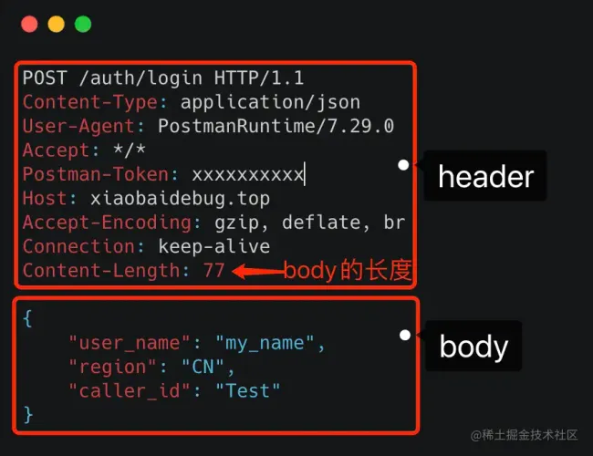

# 编码规约


### 命名规范


* 避免父子类的成员变量/不同代码块的局部变量之间采用相同的命名，使可读性降低

说明：子类、父类成员变量名相同，即使是public类型的变量也是能够通过编译，而局部变量在同一方法 内的不同代码块中同名也是合法的，但是要避免使用。对于非setter/getter的参数名称也要避免与成员变量名称相同


【强制】杜绝完全不规范的缩写，避免望文不知义。

* 反例：AbstractClass "缩写"命名成AbsClass ； condition "缩写"命名成condi，此类随意缩写严重 降低了代码的可阅读性


【推荐】为了达到代码自解释的目标，任何自定义编程元素在命名时，使用尽量完整的单词 组合来表达其意。

正例：在JDK中，表达原子更新的类名为：AtomicReferenceFieldUpdater


【推荐】在常量与变量的命名时，表示类型的名词放在词尾，以提升辨识度

正例：startTime / workQueue / nameList / TERMINATED_THREAD_COUNT


【推荐】如果模块、接口、类、方法使用了设计模式，在命名时需体现出具体模式

说明：将设计模式体现在名字中，有利于阅读者快速理解架构设计理念

正例： public class OrderFactory;


4. 接口和实现类的命名有两套规则：

1)【强制】对于Service和DAO类，基于SOA的理念，暴露出来的服务一定是接口，内部的实现类用 Impl 的后缀与接口区别。

正例： CacheServiceImpl 实现 CacheService 接口


B) 领域模型命名规约

1) 数据对象：xxxDO，xxx即为数据表名。

2) 数据传输对象： xxxDTO， xxx 为业务领域相关的名称。

3) 展示对象： xxxVO， xxx 一般为网页名称。

4 ) POJO是DO/DTO/BO/VO的统称，禁止命名成xxxPOJO。


方法命名：一般有io消耗的方法，名称用findXxxxx, POJO类里自己写的方法名不允许使用getXxxx, 一律使用obtainXxxxx, 方法里面涉及复杂计算的化可以使用computeXxxx


### 常量定义


【强制】不允许任何魔法值(即未经预先定义的常量)直接出现在代码中

​	反例:String key = "Id#taobao_" + tradeld;

​			cache.put(key, value);	//代码复制时漏掉下划线，导致缓存get击穿


【强制】在long或者Long赋值时，数值后使用大写的L，不能是小写的I，小写容易跟数字 1 混淆，造成误解。

说明：Long a = 2l;写的是数字的21，还是Long型的2。


【推荐】不要使用一个常量类维护所有常量，要按常量功能进行归类，分开维护

说明：大而全的常量类，杂乱无章，使用查找功能才能定位到修改的常量，不利于理解和维护

正例：缓存相关常量放在类CacheConsts下；系统配置相关常量放在类ConfigConsts下


【推荐】常量的复用层次有五层：跨应用共享常量、应用内共享常量、子工程内共享常量、 包内共享常量、类内共享常量。

1) 跨应用共享常量：放置在二方库中，通常是client.jar中的constant目录下。

2) 应用内共享常量：放置在一方库中，通常是子模块中的constant目录下。

反例：易懂变量也要统一定义成应用内共享常量，两位工程师在两个类中分别定义了 "YES"的变量： 类 A 中： public static final String YES = "yes";

类 B 中：public static final String YES = "y";

A.YES.equals(B.YES)，预期是true，但实际返回为false，导致线上问题。

2 )子工程内部共享常量：即在当前子工程的constant目录下。

3 )包内共享常量：即在当前包下单独的constant目录下。

4 )类内共享常量：直接在类内部private static final定义。


【推荐】如果变量值仅在一个固定范围内变化用 enum 类型来定义


### 代码格式


【强制】大括号内非空则：

1 ) 左大括号前不换行

2 ) 左大括号后换行

3 ) 右大括号后还有 else ? 不换行 : 换行


【强制】左小括号和字符之间不出现空格；同样，右小括号和字符之间也不出现空格；而左大括号前需要空格


【强制】任何二目、三目运算符的左右两边都需要加一个空格


【强制】采用4个空格缩进，禁止使用tab字符,IDEA设置tab为4个空格时，请勿勾选Use tab character


【强制】//与注释内容只有一个空格


【强制】在进行类型强制转换时，右括号与强制转换值之间不需要任何空格隔开。

正例：

long first = 1000000000000L;

int second = (int)first + 2;


【强制】单行字符数限制不超过 120 个，超出需要换行，换行时遵循如下原则：

1）第二行相对第一行缩进 4 个空格，从第三行开始，不再继续缩进，参考示例。

2）运算符与下文一起换行。

3）方法调用的点符号与下文一起换行。

4）方法调用中的多个参数需要换行时，在逗号后进行。 

5）在括号前不要换行，见反例


【强制】IDE 的 text file encoding 设置为 UTF-8; IDE 中文件的换行符使用 Unix 格式，不要使用 Windows 格式


【推荐】单个方法的总行数不超过 80 行。

说明：除注释之外的方法签名、左右大括号、方法内代码、空行、回车的总行数不超过80 

正例：分清**红花和绿叶，个性和共性**，绿叶逻辑单独出来成为额外方法，使主干代码更加清晰；共性逻辑抽取成为共性方法，便于复用和维护


### OOP规约


【强制】避免通过一个类的对象引用访问此类的静态变量或静态方法，无谓增加编译器解析成本，直接用类名访问


【强制】相同参数类型，相同业务含义，才可以使用 Java 的可变参数，避免使用 Object。

说明：可变参数必须放置在参数列表的最后。（提倡同学们尽量不用可变参数编程）

正例：public List<User> listUsers(String type, Long... ids) {...}


【强制】外部正在调用或者二方库依赖的接口，不允许修改方法签名，避免对接口调用方产生影响。接口过时必须加@Deprecated 注解，并清晰地说明采用的新接口或者新服务是什么。


【强制】不能使用过时的类或方法

说明：java.net.URLDecoder 中的方法 decode(String encodeStr) 这个方法已经过时，应该使用双参数decode(String source, String encode)。接口提供方既然明确是过时接口，那么有义务同时提供新的接口；作为调用方来说，有义务去考证过时方法的新实现是什么


【强制】所有整型包装类对象之间值的比较，全部使用 equals()

说明：-128 ~ 127 范围内的 Integer 对象是在 IntegerCache.cache 产生，会复用已有对象，区间之外的所有数据，都会在堆上产生


【强制】浮点数的等值判断，基本数据类型不能用==来比较，包装数据类型不能用 equals( )

说明：浮点数采用“尾数+阶码”的编码方式，二进制无法精确表示大部分的十进制小数

反例：

```java
 //反例
float a = 1.0f - 0.9f;
float b = 0.9f - 0.8f;
a == b		//false
  
Float x = Float.valueOf(a);
Float y = Float.valueOf(b);
x.equals(y)	//false

//正例
//(1) 指定一个误差范围，两个浮点数的差值在此范围之内，则认为是相等的。
 float a = 1.0f - 0.9f;
 float b = 0.9f - 0.8f;
 float diff = 1e-6f;
 Math.abs(a - b) < diff	//true

   
//(2) 使用 BigDecimal 来定义值，再进行浮点数的运算操作。
 BigDecimal a = new BigDecimal("1.0");
 BigDecimal b = new BigDecimal("0.9");
 BigDecimal c = new BigDecimal("0.8");

 BigDecimal x = a.subtract(b);
 BigDecimal y = b.subtract(c);
 x.equals(y)	//true
```


==【强制】为了防止精度损失，禁止使用构造方法BigDecimal(double)的方式把double值转 化为 BigDecimal 对象==

说明：BigDecimal(double)存在精度损失风险，在精确计算或值比较的场景中可能会导致业务逻辑异常。 如： BigDecimal g = new BigDecimal(0.1f); 实际的存储值为： 0.10000000149

正例：优先推荐入参为String的构造方法，或使用BigDecimal的valueOf方法，此方法内部其实执行了 Double的toString，而Double的toString按double的实际能表达的精度对尾数进行截断

BigDecimal recommendl = new BigDecimal("0.1");

BigDecimal recommend2 = BigDecimal.valueOf(O.I);


==关于基本数据类型与包装数据类型的使用标准如下==

1. 【强制】所有的 POJO 类属性必须使用包装数据类型

   说明:数据库可能是null，因为自动拆箱，用基本数据类型接收有NPE风险

   反例：比如显示成交总额涨跌情况，即正负x%，x为基本数据类型，RPC调用不成功时， 返回的是默认值，页面显示为 0%，这是不合理的，应该显示成中划线。所以包装数据类型的 null 值，能够表示额外的信息，如：远程调用失败，异常退出

2. 【强制】 RPC 方法的返回值和参数必须使用包装数据类型

3. 【推荐】所有的**局部变量使用基本数据类型**

   作用域只在方法内的变量，直接在栈内存中存储，怎么性能高就怎么定义

4. 【强制】定义DO/DTO/VO等POJO类时，不要设定任何属性默认值

   说明：POJO类属性没有初值是提醒使用者在需要使用时，必须自己显式地进行赋值，任何NPE问题，或者入库检查，都由使用者来保证


【强制】序列化类新增属性时，不要修改serialVersionUID字段，避免反序列失败；如果完全不兼容升级，避免反序列化混乱，修改 serialVersionUID 值

说明：注意 serialVersionUID 不一致会抛出序列化运行时异常


【强制】构造方法/get/se禁止加入任何业务逻辑，如果有初始化逻辑，请放在 init 方法中


【强制】POJO类必须写toString方法。如果继承了另一个 POJO 类，在前面追加super.toString

说明：在方法执行抛出异常时，可以直接调用POJO的toString()方法打印其属性值，便于排查问题


【强制】禁止在POJO类中，同时存在对应属性xxx的isXxx()和getXxx()方法

说明：框架在调用属性xxx的提取方法时，并不能确定哪个方法一定是被优先调用到,Mybatis 和 Hibernate 框架是根据获取方法找到对应属性，因此上述定义可能存在问题


【推荐】使用索引访问用String的split方法得到的数组时，需做最后一个分隔符后有无内容的检查，否则会有抛 IndexOutOfBoundsException 的风险。

说明：

```java
String str = "a,b,c,,";
String[] ary = str.split(",");
System.out.println(ary.length);	// 预期大于 3，结果是3
```


【推荐】 类内方法定义的顺序：公有方法或保护方法 > 私有方法 > getter / setter 方法


【推荐】循环体的字符串的拼接，使用StringBuilder的append


【推荐】下列情况用final

1. 不允许被继承的类，如： String 类
2.  不允许修改引用的域对象
3. 不允许被覆写的方法，如： POJO 类的 set 
4. 不允许运行过程中重新赋值的局部变量
5. 避免上下文重复使用一个变量，使用final可以强制重新定义一个变量，方便更好地进行重构


【推荐】**慎用Object的clone方法来拷贝对象**

说明：对象 clone 方法默认是浅拷贝，若想实现深拷贝需覆写 clone 方法实现域对象的深度遍历式拷贝


【推荐】类成员与方法访问控制从严

1. 如果不允许外部直接通过 new 来创建对象，那么构造方法必须是 private
2. 工具类不允许有public或default构造方法
3. 类非 static 成员变量并且与子类共享，必须是 protected
4. 类非 static 成员变量并且仅在本类使用，必须是 private
5. 类static成员变量如果仅在本类使用，必须是private
6. 若是static成员变量，考虑是否为final
7. 类成员方法只供类内部调用，必须是 private
8. 类成员方法只对继承类公开，那么限制为 protected

任何类、方法、参数、变量，严控访问范围。过于宽泛的访问范围，不利于模块解耦

思考：如果是一个 private 的方法，想删除就删除，可是一个 public 的 service 成员方法或成员变量，删除一下，不得手心冒点汗吗？


### 集合处理


【强制】关于 hashCode 和 equals 的处理，遵循如下规则：

1. 只要覆写equals，就必须覆写hashCode
2. **Set存储的是不重复的对象，依据hashCode和equals进行判断，所以Set存储的对象必须覆写这两个方法**
3. 如果自定义对象作为Map的键，那么必须覆写hashCode和equals

说明：**String已覆写hashCode和equals方法**


【强制】==ArrayList的subList结果不可强转成ArrayList==，否则会抛出ClassCastException异常

说明：subList返回的是ArrayList的内部类SubList，并不是ArrayList而是ArrayList的一个视图，==对subList的所有操作最终会反映到原列表上==


【强制】使用Map的方法keySet()/values()/entrySet()返回集合对象时，不可以对其进行添加元素操作，否则会抛出 UnsupportedOperationException 异常


【强制】Collections类返回的对象，如：emptyList()/singietonList()等都是 immutable list，不可对其进行添加或者删除元素的操作

反例：如果查询无结果，返回Collections.emptyList()空集合对象，调用方一旦进行了添加元素的操作，会触发 UnsupportedOperationException 异常


【强制】在subList场景中，高度注意对原集合元素的增加或删除，均会导致子列表的遍 历、增加、删除产生 ConcurrentModificationException 异常


【强制】使用集合转数组的方法，必须使用集合的toArray(T[] array)，==传入类型一致、长度为0的空数组==

反例：直接使用toArray无参方法存在问题，此方法返回值只能是Object[]类，若强转其它类型数组将出 现 ClassCastException 错误。

正例：

```java
List<String> list = new ArrayList<>(2);
list.add("guan");
list.add("bao");
String[] array = list.toArray(new String[0]);
//0	动态创建与size相同的数组，性能最好
//0<  <list.size	重新创建大小等于size的数组，增加GC负担
//list.size		在高并发时，数组创建完成前size变大,数组需要重新创建，负面影响与上相同
//>list.size	空间浪费，且在size处插入null值，存在NPE隐患
```


【强制】在使用Collection接口任何实现类的addAII()方法时，都要对输入集合参数进行 NPE判断

说明：在ArrayList#addAII方法的第一行代码即Object]] a = c.toArrayO;其中c为输入集合参数，如果 为null，则直接抛出异常


【强制】使用工具类Arrays.asList转换成集合后，不能使用其修改集合相关的方法，会抛UnsupportedOperationException

说明：asList的返回对象是一个Arrays内部类，并没有实现集合的修改方法。Arrays.asList体现的是适配器模式，只是转换接口，后台的数据仍是数组


【强制】泛型通配符<? extends T>来接收返回的数据，此写法的泛型集合不能使用add方 法，而<? super T>不能使用get方法，作为接口调用赋值时易出错

说明：PECS(Producer Extends Consumer Super)原则：

1. 频繁往外读取内容的，适合 用<? extends T>
2. 经常往里插入的，适合用<? super T>


【强制】在无泛型限制定义的集合赋值给泛型限制的集合时，在使用集合元素时，需要进行 instanceof 判断，避免抛出 CIassCastException

说明：毕竟泛型是在JDK5后才出现，考虑到向前兼容，编译器是允许非泛型集合与泛型集合互相赋值


【强制】不要在foreach循环里进行元素的remove/add操作。remove元素请使用Iterator 方式，如果并发操作，需要对 Iterator 对象加锁


【强制】在JDK7版本及以上，Comparator实现类要满足如下三个条件，不然Arrays.sort , Collections.sort 会抛 IllegalArgumentException 异常

1. x，y 的比较结果和 y，x 的比较结果相反
2. x>y,y>z,则 x>z
3. x=y，则xz和yz比较结果相同

**反例：下例中没有处理相等的情况,交换两个对象判断结果并不互反,不符合第一个条件,在实际使用中可能会出现异常**

```java
new Comparator<Student>() {
@Override
public int compare(Student o1, Student o2) {
return o1.getId() > o2.getId() ? 1 : -1;
}
};
```


【推荐】集合泛型定义时，在JDK7及以上，使用diamond(菱形泛型<>)语法或全省略

正例：HashMap<String, String> userCache = new HashMap<>(16);


【推荐】集合初始化时，指定集合初始值大小。

说明：HashMap 使用 HashMap(int initialCapacity)初始化。

正例：initialCapacity =(需要存储的元素个数/负载因子)+ 1。注意负载因子(即loader factor)默认 为0.75 ，如果暂时无法确定初始值大小，请设置为 16(即默认值)。

反例： HashMap 需要放置 1024 个元素，由于没有设置容量初始大小，随着元素不断增加，容量 7 次被 迫扩大， resize 需要重建 hash 表，严重影响性能


【推荐】==使用entrySet遍历Map类集合KV，而不是keySet方式进行遍历==,**如果是JDK8， 使用 Map.forEach 方法**

keySet其实是遍历了 2次，一次是转为Iterator对象，另一次是从hashMap中取出key所对应 的value

而entrySet只是遍历了一次就把key和value都放到了 entry中，效率高


【参考】合理利用好集合的有序性(sort)和稳定性(order)，避免集合的无序性(unsort)和不稳定性(unorder)带来的负面影响

说明：有序性是指遍历的结果是按某种比较规则依次排列的。稳定性指集合每次遍历的元素次序是一定的。如：ArrayList 是 order/unsort ； HashMap 是 unorder/unsort ； TreeSet 是 order/sort


【参考】利用Set元素唯一的特性，可以快速对一个集合进行去重操作，避免使用List的 contains 方法进行遍历、对比、去重操作。


### 注释规约


【强制】类、类属性、类方法的注释必须使用 Javadoc 规范，使用/**内容*/格式，不得使用 // xxx 方式。

说明：在IDE编辑窗口中，Javadoc方式会提示相关注释,调用方法时，不进入方法即可悬浮提示方法、参数、返回值的意义，提高阅读效率


【强制】所有的抽象方法（包括接口中的方法）必须要用Javadoc注释、除了返回值、参数、 异常说明外，还必须指出该方法做什么事情，实现什么功能。一并说明对子类的实现要求，或者调用注意事项


【强制】所有的枚举类型字段必须有注释，说明每个数据项的用途


【推荐】与其“半吊子”英文来注释，不如用中文注释把问题说清楚。专有名词与关键字保持英文原文即可

反例："TCP连接超时"解释成"传输控制协议连接超时"，理解反而费脑筋


【推荐】==代码修改时，注释也要进行相应的修改==，尤其是参数、返回值、异常、核心逻 辑等的修改


【参考】谨慎注释掉代码。在上方详细说明，而不是简单地注释掉。如果无用，则删除

说明：代码被注释掉有两种可能性： 

1）后续会恢复此段代码逻辑。

2）永久不用,建议直接删掉（代码仓库已保存了历史代码）


【参考】对于注释的要求

1. 能够准确反映设计思想和代码逻辑
2. 能够描述业务含义，使别的程序员能够迅速了解到代码背后的信息。完全没有注释的大段代码对于阅读者形同天书，注释是给自己看的，即使隔很长时间，也能清晰理解当时的思路；注释也是给继任者看的，使其能够快速接替自己的工作。


【参考】好的命名、代码结构是自解释的，注释力求精简准确、表达到位。避免出现注释的一个极端：过多过滥的注释，代码的逻辑一旦修改，修改注释是相当大的负担。


【参考】特殊注释标记，注明标记人与标记时间。注意及时处理这些标记

1. 待办事宜（ TODO ） : （标记人，标记时间， ［ 预计处理时间 ］）		表示需要实现，但目前还未实现的功能
2. 错误，不能工作（FIXME）:（标记人，标记时间，［预计处理时间］）    标记某代码是错误的，而且不能工作，需要及时纠正的情况


### 控制语句


【强制】在高并发场景中，使用**区间代替等值**判断作为中断或退出的条件

反例：判断剩余奖品数量等于0时，终止发放奖品，但因为并发处理错误导致奖品数量瞬间变成了负数，导致活动无法终止


【参考】下列情形，需要进行参数校验：

1) 调用频次低的方法

2) 执行时间开销很大的方法。此情形中，参数校验时间几乎可以忽略不计，但如果因为参数错误导致中间执行回退，或者错误，那得不偿失

3) 需要极高稳定性和可用性的方法

4) 对外提供的开放接口，不管是RPC/API/HTTP接口

5) 敏感权限入口


【参考】下列情形，不需要进行参数校验：

1) 被循环调用的方法。但在方法说明里必须注明外部参数检查要求

2) 底层调用频度比较高的方法，参数错误不太可能到底层才会暴露问题。一般DAO层与Service层都在同一个应用中，部署在同一台服务器中，所以DAO的参数校验，可以省略

3）被声明成private只会被自己代码所调用的方法，如果能确定调用方法的代码传入参数已经做过检查或者肯定不会有问题，此时可以不校验参数


## 设计规约


\1. 【强制】存储方案和底层数据结构的设计获得评审一致通过，并沉淀成为文档。

说明：有缺陷的底层数据结构容易导致系统风险上升，可扩展性下降，重构成本也会因历史数据迁移和系 统平滑过渡而陡然增加，所以，存储方案和数据结构需要认真地进行设计和评审，生产环境提交执行后， 需要进行double check。

正例：评审内容包括存储介质选型、表结构设计能否满足技术方案、存取性能和存储空间能否满足业务发 展、表或字段之间的辩证关系、字段名称、字段类型、索引等；数据结构变更（如在原有表中新增字段） 也需要进行评审通过后上线。

\2. 【强制】在需求分析阶段，如果与系统交互的User超过一类并且相关的User Case超过5 个，使用用例图来表达更加清晰的结构化需求。

\3. 【强制】如果某个业务对象的状态超过3个，使用状态图来表达并且明确状态变化的各个触 发条件。

说明：状态图的核心是对象状态，首先明确对象有多少种状态，然后明确两两状态之间是否存在直接转换 关系，再明确触发状态转换的条件是什么。

正例：淘宝订单状态有已下单、待付款、已付款、待发货、已发货、已收货等。比如已下单与已收货这两 种状态之间是不可能有直接转换关系的。

\4. 【强制】如果系统中某个功能的调用链路上的涉及对象超过3个，使用时序图来表达并且明 确各调用环节的输入与输出。

说明：时序图反映了一系列对象间的交互与协作关系，清晰立体地反映系统的调用纵深链路。

\5. 【强制】如果系统中模型类超过5个，并且存在复杂的依赖关系，使用类图来表达并且明确 类之间的关系。

说明：类图像建筑领域的施工图，如果搭平房，可能不需要，但如果建造蚂蚁Z空间大楼，肯定需要详细 的施工图。

\6. 【强制】如果系统中超过2个对象之间存在协作关系，并且需要表示复杂的处理流程，使用 活动图来表示。

说明：活动图是流程图的扩展，增加了能够体现协作关系的对象泳道，支持表示并发等。

\7. 【推荐】需求分析与系统设计在考虑主干功能的同时，需要充分评估异常流程与业务边界。 反例：用户在淘宝付款过程中，银行扣款成功，发送给用户扣款成功短信，但是支付宝入款时由于断网演 练产生异常，淘宝订单页面依然显示未付款，导致用户投诉。

\8. 【推荐】类在设计与实现时要符合单一原则。

说明：单一原则最易理解却是最难实现的一条规则，随着系统演进，很多时候，忘记了类设计的初衷。

\9. 【推荐】谨慎使用继承的方式来进行扩展，优先使用聚合/组合的方式来实现。

说明：不得已使用继承的话，必须符合里氏代换原则，此原则说父类能够出现的地方子类一定能够出现， t匕如，"把钱交出来"，钱的子类美元、欧元、人民币等都可以出现。

\10. 【推荐】系统设计时，根据依赖倒置原则，尽量依赖抽象类与接口，有利于扩展与维护。

说明：低层次模块依赖于高层次模块的抽象，方便系统间的解耦。

\11. 【推荐】系统设计时，注意对扩展开放，对修改闭合。

说明：极端情况下，交付线上生产环境的代码都是不可修改的，同一业务域内的需求变化，通过模块或类 的扩展来实现。

\12. 【推荐】系统设计阶段，共性业务或公共行为抽取出来公共模块、公共配置、公共类、公共 方法等，避免出现重复代码或重复配置的情况。

说明：随着代码的重复次数不断增加，维护成本指数级上升。

\13. 【推荐】避免如下误解：敏捷开发=讲故事+编码+发布。

说明：敏捷开发是快速交付迭代可用的系统，省略多余的设计方案，摒弃传统的审批流程，但核心关键点 上的必要设计和文档沉淀是需要的。

反例：某团队为了业务快速发展，敏捷成了产品经理催进度的借口，系统中均是勉强能运行但像面条一样 的代码，可维护性和可扩展性极差，一年之后，不得不进行大规模重构，得不偿失。

\14. 【参考】系统设计主要目的是明确需求、理顺逻辑、后期维护，次要目的用于指导编码。 说明：避免为了设计而设计，系统设计文档有助于后期的系统维护和重构，所以设计结果需要进行分类归 档保存。

\15. 【参考】设计的本质就是识别和表达系统难点，找到系统的变化点，并隔离变化点。

说明：世间众多设计模式目的是相同的，即隔离系统变化点。

\16. 【参考】系统架构设计的目的：

•确定系统边界。确定系统在技术层面上的做与不做。

•确定系统内模块之间的关系。确定模块之间的依赖关系及模块的宏观输入与输出。

•确定指导后续设计与演化的原则。使后续的子系统或模块设计在规定的框架内继续演化。

•确定非功能性需求。非功能性需求是指安全性、可用性、可扩展性等。

\17. 【参考】在做无障碍产品设计时，需要考虑到：

•所有可交互的控件元素必须能被tab键聚焦，并且焦点I顺序需符合自然操作逻辑。

•用于登陆校验和请求拦截的验证码均需提供图形验证以外的其它方式。

•自定义的控件类型需明确交互方式。


Entity所有属性都使用包装类型，都没有默认值，对于不不能为空的字段，需要在构造方法里面进行初始化，数据库需要添加约束


## 名词解释


POJO ( Plain Ordinary Java Object):在本手册中，POJO 专指只有 setter / getter / toString 的简单类，包括 DO/DTO/BO/VO 等。

GAV ( Groupld、Artifactctld、Version ) : Maven 坐标，是用来唯一标识 jar 包。

OOP ( Object Oriented Programming ):本手册泛指类、对象的编程处理方式。

ORM ( Object Relation Mapping ):对象关系映射，对象领域模型与底层数据之间的转换， 本文泛指iBATIS, mybatis等框架。

NPE (java.lang.NullPointerException ):空指针异常。

SOA ( Service-Oriented Architecture ):面向服务架构，它可以根据需求通过网络对松散耦合 的粗粒度应用组件进行分布式部署、组合和使用，有利于提升组件可重用性，可维护性。

OOM ( Out Of Memory ):源于 java.lang.OutOfMemoryError，当 JVM 没有足够的内存来 为对象分配空间并且垃圾回收器也无法回收空间时，系统出现的严重状况。

一方库：本工程内部子项目模块依赖的库(jar包)

二方库：公司内部发布到中央仓库，可供公司内部其它应用依赖的库(jar包)


## 优雅的代码


**代码首先是写给人看的，其次才是计算机顺便能够运行**

能完成功能，也就完成了开发任务，固然是应该的。但项目是持续迭代的，以前的代码以后还要去维护，如果每次都只有完成功能的最低要求，日积月累，这个项目所能达到的质量也只会是最低要求，并且这个最低要求还会进一步降低。而且，你所编写的代码，在你维护这个项目的期间，你是面对着它最长时间的人。写得好，你看起来会舒服心情好，写得烂，恶心也只恶心到你自己

**写好代码更能省时间**

优雅的代码是逻辑清晰的，简单直观的，读逻辑清晰是更容易的，由此可以把更多的精力与时间花在功能开发上，而不是理清以前逻辑。其次，编写代码时，思维清晰，就可以写出更严谨的代码，这样就能减少bug，也就减少了修复bug所花费的时间。不应该把时间都耗费在代码的修复上，而应该更多地用于创造性的工作。编写优雅的代码，正是达成这一目标的有效方法

**做有所追求的程序员**

代码质量取决于你自己，而不是你的公司，你的老板，产品经理，设计人员，或是项目以前的负责人员。有追求的你，不应该让他们成为你降低自己要求的理由。你对自己有所追求，对代码也应当有所追求


## Effective Java


### 谨慎设计方法签名

谨慎选择方法名

始终遵循标准命名习惯,命名风格一致


不追求提供过于便利的方法


避免过长的参数列表

将方法分解为多个方法,可能导致方法过多,可以提升方法的正交性,从而减少方法的总数目

创建辅助类封装入参

整合前两种方式,从对象构建到方法调用都采用Builder模式,简化代码


### 零长度数组/集合代替null


```java
return list.isEmpty() ? null : list;
```

集合为空作为特例是不合常理的,这也使得调用方用额外地处理null的情况

```
if(list==null)
```

甚至忘记判断非空时还会报错,这也是最常见的错误


直接返回null,不去分配0长度的容器,并不会带来性能上的提升

更合适的是用集合的构造器封装返回值	更好地是用Collections.emptyList()的单例空集合

```java
new ArrayList<>(nums);
Collections.emptyList();
```


## 修炼之道


==注重实效==


### 破窗理论

> Don`t Live with Broken Windows	不要容忍破窗户
>

一扇不被修理的破窗户,会渐渐给周围的居民带来废弃感 -> 一扇又一扇的窗破了

破窗理论启发了警察,他们对轻微案件严加处理,进而防止了大案的发生


团队在项目中忍受一项糟糕的管理决策,就足以让项目开始衰败

当发现自己在有好几扇破窗户的项目工作时,很容易产生这样的想法:这段代码的其余部分也是垃圾,只要照着做就行了


### 足够好的软件


#### 让用户参与质量权衡

系统的范围和质量作为系统需求的一部分规定下来

> Make quality a requirements issue	使质量成为需求问题
>


许多用户宁愿在今天用上有一些"毛边"的软件,也不愿等待一年后的完美版本

越早交付,用户越早使用,从而提出反馈将软件引向更好地最终解决方案


#### 知道何时止步

如果一层又一层重复地完善细节,编程就会陷入死循环

不能因为过度修饰而损毁完好的程序,让代码凭着自己的质量站一会儿

它也许不够完美,但它不可能完美


### 知识财产

知识和经验是最重要的职业财富,但它们是有时效的资产

随着新技术/语言/环境的出现,知识会过时,对于公司来说,你的价值在降低


定期投资,多元化是长期成功的关键

在保守/高风险的投资间平衡资产

设法低买高卖,获取最大回报

周期性地重新评估和平衡资产


#### 批判的思考

> Critically analyze what you read and hear	批判地分析你读到的和听到的
>
> 不要低估商业主义的力量,Web搜索引擎把某个页面放在最前面,并不意味着那就是最佳选择

你需要确保资产中的知识是准确的,并没有受到"供应商或媒体"炒作的影响


### 交流

失去有效的交流,再好的想法也只是一个无人关心的孤儿

开发人员需要在多个层面上进行交流


#### 知道你想说什么

最困难的是让别人确切地弄清楚你想要说什么

需要简略地几下你想要交流的想法,并准备好几种把它们讲清楚的策略


#### 了解你的听众

**只有当你在传递信息时,才叫交流**

需要了解听众的需要/兴趣/能力


> 技术人员在发表长篇独白,介绍新技术的各种优点,把市场部员工弄得目光呆滞 -> 这不是交流,而是让人厌烦的空谈
>
> 
>
> 你想让他们学到什么?
> 他们对你讲的什么感兴趣?
> 他们有多少的经验?
> 他们想要多少的细节?
> 你想让谁拥有这些信息?
> 你如何促使他们听你说话?


调整你的交流风格,让其适应你的听众

* 正式报告

* 进入正题前高谈阔论一番

* 一大摞报告

* 简单的备忘录


记住你也是交流的一方,如果对方要求一句话概括,你认为不用几页纸就无法做到,就要如实地告诉他们.反馈也是交流的一种形式


#### 做倾听者

想让大家听你说话,必须先听他们说话,即使你掌握着全部信息

鼓励大家通过提问来交谈,或是让他们总结你告诉他们的东西 -> 把会议变为对话


### DRY

> Don`t Repeat YourSelf 不要重复你自己
>

重复往往不是你是否能记得修改其他地方的问题,而是何时会忘记

不要在系统各处对知识重复 -> 把**低级的知识留在代码中**,而在注释上写明关键的解释

重复将导致一处修改,需要记得修改其他处

在团队中指定某成员承担项目资料管理员,负责协调文档和代码仓库


#### 重复产生原因


**强加的重复**

糟糕的代码才需要很多注释,把低级知识放在代码中,注释留给高级说明,否则每次改动都要修改注释

多平台各自需要自己的编程语言/库/开发环境/重复的文档


**无意的重复**

当涉及到多个互相依赖的数据元素,容易出现不规范数据


对于线段类,起点终点是必须的,但长度非必须

通过局部化的方式,让DRY的违反不暴露给外界,也体现了面向对象语言中,使用方法来访问属性会带来更大的拓展性


**无耐心的重复**

欲速则不达,为了省事拷贝代码,以后会损失更多时间

开发者的懒惰会造成问题


**开发者间的重复**

最难被检测和处理,整个功能集都可能在重复,并且重复可能在短时间内不会被发现,从而导致维护问题

开发者需要主动的交流,或让某个团队成员担任项目资料管理员

制定公共区域,用于存放脚本

阅读他人的源码与文档


> **Make it easy to reuse**	让复用变得容易

更重要的是营造一种环境,在其中能够轻松地找到能复用的东西,**如果寻找起来麻烦,大家都不会去复用**


### 正交性

> Eliminate Effects Between Unrelated Things 消除无关事物间的影响

几何学中表示相交为直角的两条直线

计算技术中表示**不相依赖/解耦**,发生变化时不会影响其他事物


非正交性将面临 : 当系统中的各组件互相高度依赖时,局部修正将扩展为全局修正


设计自足的组件: 独立,具有单一,良好定义的目的

**局部化**	缩小测试范围

促进复用	组件有明确具体的,良好定义的责任

组合		两个组件分别能做M和N件事,如果组件是正交的,在组合后能做M*N件事

降低风险	模块出现问题不会扩散至整个系统,新模块的替换也变得容易

​			针对组件的测试更容易设计

​			第三方组件的接口被隔离在局部,不会与特定的产品/平台捆绑在一起


> Origanize Around Functionality,Not Job Functions	围绕功能,而不是工作职务进行组织
>

传统团队基于瀑布开发,各个角色基于工作职务指派任务,导致越接近用户,职务级别越高,并把开发进行严格的责任划分,认为(分析,设计,编码,测试)是独立的任务

然而分析,设计,编码,测试是看待同一问题的不同方式;离用户隔着产品和测试的程序员不会注意到他们工作的应用语境,导致设计的产品与用户需求不同


通过按照功能划分团队,分别负责最终系统的特定功能,团队中按照个人的能力进行组织,团队成员按照职责,对项目中其他成员负有责任


#### 方式


**团队**

成员间责任的重叠将使得成员对责任感到困惑,改动将需要整个团队开会

将团队责任划分,得到良好定义的小组


**设计**

系统由一组相互协作的模块组成,模块的实现不依赖于其他模块的功能

有时这些组件被组织成多个层次,每层提供一级抽象,每层都只使用其下面一层提供的抽象,改动底层无需修改上层,降低模块间依赖失控的风险


**第三方**

引入第三方时思考是否会对现有产生影响,这使得能够轻易地更换供应商


**编码**

保持代码解耦,避免向其他模块暴露或依赖

避免使用全局数据(单例模式)

避免编写相似的函数(策略模式)

AOP也是正交性的一种体现:把原本需要分散在系统各个部分的代码在一处进行表达


**测试**

组件之间的交互是形式化并且有限的,更多的测试可以在单个模块级进行,而无需集成测试


### 估算


#### 需要多准确

不同人对估算精度的需求不同,可能精确到天,也可能是秒


#### 考虑前提条件

前置条件将影响实际结果


### 曳光弹


曳光弹与常规弹药交错着装在弹药袋,会留下烟火的轨迹,曳光弹击中则弹药也击中

**曳光弹比费力计算更可取**,反馈是及时的,与弹药工作在同一环境,外部影响小


为了在代码中获得同样的效果,需要能够快速直观,可重复地从需求出发,满足需求

在曳光代码中保留着任何一段产品都有的错误检查,结构,文档,它只是功能不全而已,但当各组件之间实现了端到端的连接,增加功能就变得非常容易,所以**曳光代码无需丢弃**


* 优点

快速交付,用户能够尽早看到,提前演示

提前构建结构

更容易感知工作进度


**曳光 VS 原型**

原型在对概念进行试验后,就进行了丢弃,而曳光弹则贯穿了开发流程

原型制作生成用过就扔的代码,曳光代码虽然简约,但是完整


### 测试

bug报告的准确性会在经第三方之手时降低


复现bug

数据可视化

断点

向别人解释代码过程

当bug是由脏数据导致的,检查能否通过参数检查更早地隔离它


> Test Early,Test Often,Test Automatically	早测试,常测试,自动测试
>
> 编一点,测一点;bug被发现的越早,进行修补的成本就越低


#### 单元测试

如果各组成部分自身不能工作,它们结合在一起多半也不能工作


#### 集成测试

集成测试只是单元测试的一种拓展,只不过测试的是各个子系统遵守接口规约的情况


#### 验证和校验

尽管没有了bug,也需要验证与用户需求是否一致


#### 性能测试


#### 可用性测试


### 死程序不说谎

> Crash Early	早崩溃
>

许多时候,让程序崩溃是最佳选择

runtimeException就是这种机制,如果没有被捕获,就会渗透到程序顶部,致使其终止,并显示栈踪迹

当你的代码发现某件不可能发生的事已经发生时,你的程序就不再有存活能力,它所做的每件事都是不保证正确的,所以要尽快地终止它


死程序带来的危害通常比有疾患的程序小得多


#### 断言式编程

> If it can not happen,use assertions to ensure that it won`t	如果它不可能发生,用断言来证明
>

断言的性能开销比起它的作用是不值一提的


### 配平资源

> Finish what you start	要有始有终
>

每次分配都对应着一次释放

按资源的分配的相反顺序进行释放,避免资源含有另一个资源的引用而无法释放

对于资源的分配总是以相同的顺序,避免死锁

在编程结束后检查各项资源是否配平


Java一般在finally实现配平


### 弯曲或折断


#### 得墨忒法则

把代码组织成最小组织单位,并限制模块间的交互,使得模块的替换不会影响其他模块


编写"羞涩"的代码:不向外部暴露自己;不与过多的人打交道


#### 元程序设计

> Levy’s Eighth Law	再多的天才也无法胜过对细节的关注
>

细节将弄乱整洁的代码,需要将细节赶出代码 -> 让代码高度可配置


### 极大的期望

项目的成功取决于在多大程度上满足了用户期望

哪怕是实现了极其复杂的应用,但可能会遭到用户的抵制,因为用户只想要廉价的洋娃娃

> Gently Exceed Your User`s Expectations	温和地超出用户的期望
>


但为了满足用户的期望,需要交流期望

用户的期望可能无法被满足,也可能过于保守,需要让用户正确地理解你将要交付的产品,以及用户尚未描述出来的期望


#### 额外的一英里

当项目交付时,要设法让用户惊讶,比用户期望多一点点,给系统增加面向某种用户特性所需的一点额外努力


用户通常期望的特性

* 气泡提示
* 快捷键
* 快速参考指南
* 自动化安装
* 定制的初始化页面


### 傲慢与偏见

> Sign Your Work	在你的作品上签名
>

注重实效的程序员不会逃避责任,需要乐于接受挑战,乐于使我们的专业知识广为人知

负责一项设计,一段代码,是一件足以引以自豪的工作


但项目团队是由人组成的,签名的代码所有权概念会带来协作上的问题 -> 变得有领地意识,不愿意在公共的基础设施上工作 -> 项目变为一些互相隔离的区域


签名应当被视为质量的保证,当同事在代码上看见你的签名时,应当期望它是可靠的,用心编写的,经过测试的


### 注重实效的团队


#### 不留破窗户

团队必须为产品质量负责,质量源于全体团队成员的共同努力


#### 煮青蛙

在整体的团队中更容易忽略周围的环境,会认为有另外的人在处理某个问题,或是领导已经批准了某项改动

需要确保每个人都主动地监视环境的变化,或是指定检测员


# Web 页面请求过程

### 1. DHCP 配置主机信息

- 假设主机最开始没有 IP 地址以及其它信息，那么就需要先使用 DHCP 来获取。

- 主机生成一个 DHCP 请求报文，并将这个报文放入具有目的端口 67 和源端口 68 的 UDP 报文段中。

- 该报文段则被放入在一个具有广播 IP 目的地址(255.255.255.255) 和源 IP 地址（0.0.0.0）的 IP 数据报中。

- 该数据报则被放置在 MAC 帧中，该帧具有目的地址 FF:\<zero-width space\>FF:\<zero-width space\>FF:\<zero-width space\>FF:\<zero-width space\>FF:FF，将广播到与交换机连接的所有设备。

- 连接在交换机的 DHCP 服务器收到广播帧之后，不断地向上分解得到 IP 数据报、UDP 报文段、DHCP 请求报文，之后生成 DHCP ACK 报文，该报文包含以下信息：IP 地址、DNS 服务器的 IP 地址、默认网关路由器的 IP 地址和子网掩码。该报文被放入 UDP 报文段中，UDP 报文段有被放入 IP 数据报中，最后放入 MAC 帧中。

- 该帧的目的地址是请求主机的 MAC 地址，因为交换机具有自学习能力，之前主机发送了广播帧之后就记录了 MAC 地址到其转发接口的交换表项，因此现在交换机就可以直接知道应该向哪个接口发送该帧。

- 主机收到该帧后，不断分解得到 DHCP 报文。之后就配置它的 IP 地址、子网掩码和 DNS 服务器的 IP 地址，并在其 IP 转发表中安装默认网关。

### 2. ARP 解析 MAC 地址

- 主机通过浏览器生成一个 TCP 套接字，套接字向 HTTP 服务器发送 HTTP 请求。为了生成该套接字，主机需要知道网站的域名对应的 IP 地址。

- 主机生成一个 DNS 查询报文，该报文具有 53 号端口，因为 DNS 服务器的端口号是 53。

- 该 DNS 查询报文被放入目的地址为 DNS 服务器 IP 地址的 IP 数据报中。

- 该 IP 数据报被放入一个以太网帧中，该帧将发送到网关路由器。

- DHCP 过程只知道网关路由器的 IP 地址，为了获取网关路由器的 MAC 地址，需要使用 ARP 协议。

- 主机生成一个包含目的地址为网关路由器 IP 地址的 ARP 查询报文，将该 ARP 查询报文放入一个具有广播目的地址（FF:\<zero-width space\>FF:\<zero-width space\>FF:\<zero-width space\>FF:\<zero-width space\>FF:FF）的以太网帧中，并向交换机发送该以太网帧，交换机将该帧转发给所有的连接设备，包括网关路由器。

- 网关路由器接收到该帧后，不断向上分解得到 ARP 报文，发现其中的 IP 地址与其接口的 IP 地址匹配，因此就发送一个 ARP 回答报文，包含了它的 MAC 地址，发回给主机。

### 3. DNS 解析域名

- 知道了网关路由器的 MAC 地址之后，就可以继续 DNS 的解析过程了。

- 网关路由器接收到包含 DNS 查询报文的以太网帧后，抽取出 IP 数据报，并根据转发表决定该 IP 数据报应该转发的路由器。

- 因为路由器具有内部网关协议（RIP、OSPF）和外部网关协议（BGP）这两种路由选择协议，因此路由表中已经配置了网关路由器到达 DNS 服务器的路由表项。

- 到达 DNS 服务器之后，DNS 服务器抽取出 DNS 查询报文，并在 DNS 数据库中查找待解析的域名。

- 找到 DNS 记录之后，发送 DNS 回答报文，将该回答报文放入 UDP 报文段中，然后放入 IP 数据报中，通过路由器反向转发回网关路由器，并经过以太网交换机到达主机。

### 4. HTTP 请求页面

- 有了 HTTP 服务器的 IP 地址之后，主机就能够生成 TCP 套接字，该套接字将用于向 Web 服务器发送 HTTP GET 报文。

- 在生成 TCP 套接字之前，必须先与 HTTP 服务器进行三次握手来建立连接。生成一个具有目的端口 80 的 TCP SYN 报文段，并向 HTTP 服务器发送该报文段。

- HTTP 服务器收到该报文段之后，生成 TCP SYN ACK 报文段，发回给主机。

- 连接建立之后，浏览器生成 HTTP GET 报文，并交付给 HTTP 服务器。

- HTTP 服务器从 TCP 套接字读取 HTTP GET 报文，生成一个 HTTP 响应报文，将 Web 页面内容放入报文主体中，发回给主机。

- 浏览器收到 HTTP 响应报文后，抽取出 Web 页面内容，之后进行渲染，显示 Web 页面


# 代理


## 正向代理

正向代理部署在**客户端**, 为客户端代理请求( 客户端知道真实的服务器IP端口, 间接地服务器交互, 类似于**中介** )


**适用场景**

1. **突破访问限制(VPN)**  访问客户端无法直接访问的服务器
2. 提高访问速度  代理服务器可以缓存响应结果
3. **隐藏客户端真实IP**  访问目标服务器的是代理服务器，服务器不知道用户的真实IP 


## 反向代理

反向代理部署在**服务器端** ( 客户端不知道服务器真实IP, 类似于**二房东** )


**适用场景**

1. **隐藏服务器真实IP**
2. **负载均衡**
3. 提高访问速度  缓存响应结果
4. **安全防护**  可以将代理服务器作为应用层的防火墙，拦截恶意的Web攻击。还可以为后端服务器统一提供加密和SSL加速（如SSL终端代理），提供HTTP访问认证等


# 跨域


同源策略: **协议、主机、端口**一致视为同源

同源策略会阻止一个域的javascript脚本和另外一个域的内容进行交互


## 后端解决方案


### nginx反向代理解决跨域

```shell
location / {
   add_header Access-Control-Allow-Origin *;
   add_header Access-Control-Allow-Headers X-Requested-With;
   add_header Access-Control-Allow-Methods GET,POST,PUT,DELETE,OPTIONS;

   if ($request_method = 'OPTIONS') {
     return 204;
   }
}
```


### WebFilter

```java
@WebFilter
public class CorsFilter implements Filter {  

  @Override
  public void doFilter(ServletRequest req, ServletResponse res, FilterChain chain) throws IOException, ServletException {  
    HttpServletResponse response = (HttpServletResponse) res;  
    response.setHeader("Access-Control-Allow-Origin", "*");  
    response.setHeader("Access-Control-Allow-Methods", "*");  
    response.setHeader("Access-Control-Max-Age", "3600");  
    response.setHeader("Access-Control-Allow-Headers", "*");
    response.setHeader("Access-Control-Allow-Credentials", "true");
    chain.doFilter(req, res);  
  }  
}
```


### 继承HandlerInterceptorAdapter


```java
@Component
public class CrossInterceptor extends HandlerInterceptorAdapter {
  @Override
  public boolean preHandle(HttpServletRequest request, HttpServletResponse response, Object handler) throws Exception {
    response.setHeader("Access-Control-Allow-Origin", "*");
    response.setHeader("Access-Control-Allow-Methods", "GET, POST, PUT, DELETE, OPTIONS");
    response.setHeader("Access-Control-Max-Age", "3600");
    response.setHeader("Access-Control-Allow-Headers", "*");
    response.setHeader("Access-Control-Allow-Credentials", "true");
    return true;
  }
}
```


### 实现WebMvcConfigurer


```java
@Configuration
@SuppressWarnings("SpringJavaAutowiredFieldsWarningInspection")
public class AppConfig implements WebMvcConfigurer {

  @Override
  public void addCorsMappings(CorsRegistry registry) {
    registry.addMapping("/**")  // 拦截所有的请求
      .allowedOrigins("http://www.abc.com")  // 可跨域的域名，可以为 *
      .allowCredentials(true)
      .allowedMethods("*")   // 允许跨域的方法，可以单独配置
      .allowedHeaders("*");  // 允许跨域的请求头，可以单独配置
  }
}
```


### @CrossOrgin

```java
@CrossOrigin	//不会全局生效
@GetMapping("/{id}")
public User get(@PathVariable Long id) {
}
```


# 正则


|     字符     |                             描述                             |
| :----------: | :----------------------------------------------------------: |
|      \       | 将下一个字符标记为一个特殊字符、或一个原义字符、或一个向后引用、或一个八进制转义符。例如，“`n`”匹配字符“`n`”。“`\n`”匹配一个换行符。串行“`\\`”匹配“`\`”而“`\(`”则匹配“`(`”。 |
|      ^       | 匹配输入字符串的开始位置。如果设置了RegExp对象的Multiline属性，^也匹配“`\n`”或“`\r`”之后的位置。 |
|      $       | 匹配输入字符串的结束位置。如果设置了RegExp对象的Multiline属性，$也匹配“`\n`”或“`\r`”之前的位置。 |
|      *       | 匹配前面的子表达式零次或多次。例如，zo*能匹配“`z`”以及“`zoo`”。*等价于{0,}。 |
|      +       | 匹配前面的子表达式一次或多次。例如，“`zo+`”能匹配“`zo`”以及“`zoo`”，但不能匹配“`z`”。+等价于{1,}。 |
|      ?       | 匹配前面的子表达式零次或一次。例如，“`do(es)?`”可以匹配“`does`”或“`does`”中的“`do`”。?等价于{0,1}。 |
|    {*n*}     | *n*是一个非负整数。匹配确定的*n*次。例如，“`o{2}`”不能匹配“`Bob`”中的“`o`”，但是能匹配“`food`”中的两个o。 |
|    {*n*,}    | *n*是一个非负整数。至少匹配*n*次。例如，“`o{2,}`”不能匹配“`Bob`”中的“`o`”，但能匹配“`foooood`”中的所有o。“`o{1,}`”等价于“`o+`”。“`o{0,}`”则等价于“`o*`”。 |
|  {*n*,*m*}   | *m*和*n*均为非负整数，其中*n*<=*m*。最少匹配*n*次且最多匹配*m*次。例如，“`o{1,3}`”将匹配“`fooooood`”中的前三个o。“`o{0,1}`”等价于“`o?`”。请注意在逗号和两个数之间不能有空格。 |
|      ?       | 当该字符紧跟在任何一个其他限制符（*,+,?，{*n*}，{*n*,}，{*n*,*m*}）后面时，匹配模式是非贪婪的。非贪婪模式尽可能少的匹配所搜索的字符串，而默认的贪婪模式则尽可能多的匹配所搜索的字符串。例如，对于字符串“`oooo`”，“`o+?`”将匹配单个“`o`”，而“`o+`”将匹配所有“`o`”。 |
|      .       | 匹配除“`\`*`n`*”之外的任何单个字符。要匹配包括“`\`*`n`*”在内的任何字符，请使用像“`(.|\n)`”的模式。 |
|  (pattern)   | 匹配pattern并获取这一匹配。所获取的匹配可以从产生的Matches集合得到，在VBScript中使用SubMatches集合，在JScript中则使用$0…$9属性。要匹配圆括号字符，请使用“`\(`”或“`\)`”。 |
| (?:pattern)  | 匹配pattern但不获取匹配结果，也就是说这是一个非获取匹配，不进行存储供以后使用。这在使用或字符“`(|)`”来组合一个模式的各个部分是很有用。例如“`industr(?:y|ies)`”就是一个比“`industry|industries`”更简略的表达式。 |
| (?=pattern)  | 正向肯定预查，在任何匹配pattern的字符串开始处匹配查找字符串。这是一个非获取匹配，也就是说，该匹配不需要获取供以后使用。例如，“`Windows(?=95|98|NT|2000)`”能匹配“`Windows2000`”中的“`Windows`”，但不能匹配“`Windows3.1`”中的“`Windows`”。预查不消耗字符，也就是说，在一个匹配发生后，在最后一次匹配之后立即开始下一次匹配的搜索，而不是从包含预查的字符之后开始。 |
| (?!pattern)  | 正向否定预查，在任何不匹配pattern的字符串开始处匹配查找字符串。这是一个非获取匹配，也就是说，该匹配不需要获取供以后使用。例如“`Windows(?!95|98|NT|2000)`”能匹配“`Windows3.1`”中的“`Windows`”，但不能匹配“`Windows2000`”中的“`Windows`”。预查不消耗字符，也就是说，在一个匹配发生后，在最后一次匹配之后立即开始下一次匹配的搜索，而不是从包含预查的字符之后开始 |
| (?<=pattern) | 反向肯定预查，与正向肯定预查类拟，只是方向相反。例如，“`(?<=95|98|NT|2000)Windows`”能匹配“`2000Windows`”中的“`Windows`”，但不能匹配“`3.1Windows`”中的“`Windows`”。 |
| (?<!pattern) | 反向否定预查，与正向否定预查类拟，只是方向相反。例如“`(?<!95|98|NT|2000)Windows`”能匹配“`3.1Windows`”中的“`Windows`”，但不能匹配“`2000Windows`”中的“`Windows`”。 |
|     x\|y     | 匹配x或y。例如，“`z|food`”能匹配“`z`”或“`food`”。“`(z|f)ood`”则匹配“`zood`”或“`food`”。 |
|    [xyz]     | 字符集合。匹配所包含的任意一个字符。例如，“`[abc]`”可以匹配“`plain`”中的“`a`”。 |
|    [^xyz]    | 负值字符集合。匹配未包含的任意字符。例如，“`[^abc]`”可以匹配“`plain`”中的“`p`”。 |
|    [a-z]     | 字符范围。匹配指定范围内的任意字符。例如，“`[a-z]`”可以匹配“`a`”到“`z`”范围内的任意小写字母字符。 |
|    [^a-z]    | 负值字符范围。匹配任何不在指定范围内的任意字符。例如，“`[^a-z]`”可以匹配任何不在“`a`”到“`z`”范围内的任意字符。 |
|      \b      | 匹配一个单词边界，也就是指单词和空格间的位置。例如，“`er\b`”可以匹配“`never`”中的“`er`”，但不能匹配“`verb`”中的“`er`”。 |
|      \B      | 匹配非单词边界。“`er\B`”能匹配“`verb`”中的“`er`”，但不能匹配“`never`”中的“`er`”。 |
|     \cx      | 匹配由x指明的控制字符。例如，\cM匹配一个Control-M或回车符。x的值必须为A-Z或a-z之一。否则，将c视为一个原义的“`c`”字符。 |
|      \d      |               匹配一个数字字符。等价于[0-9]。                |
|      \D      |              匹配一个非数字字符。等价于[^0-9]。              |
|      \f      |              匹配一个换页符。等价于\x0c和\cL。               |
|      \n      |              匹配一个换行符。等价于\x0a和\cJ。               |
|      \r      |              匹配一个回车符。等价于\x0d和\cM。               |
|      \s      | 匹配任何空白字符，包括空格、制表符、换页符等等。等价于[ \f\n\r\t\v]。 |
|      \S      |          匹配任何非空白字符。等价于[^ \f\n\r\t\v]。          |
|      \t      |              匹配一个制表符。等价于\x09和\cI。               |
|      \v      |            匹配一个垂直制表符。等价于\x0b和\cK。             |
|      \w      |    匹配包括下划线的任何单词字符。等价于“`[A-Za-z0-9_]`”。    |
|      \W      |        匹配任何非单词字符。等价于“`[^A-Za-z0-9_]`”。         |
|    \x*n*     | 匹配*n*，其中*n*为十六进制转义值。十六进制转义值必须为确定的两个数字长。例如，“`\x41`”匹配“`A`”。“`\x041`”则等价于“`\x04&1`”。正则表达式中可以使用ASCII编码。. |
|    \*num*    | 匹配*num*，其中*num*是一个正整数。对所获取的匹配的引用。例如，“`(.)\1`”匹配两个连续的相同字符。 |
|     \*n*     | 标识一个八进制转义值或一个向后引用。如果\*n*之前至少*n*个获取的子表达式，则*n*为向后引用。否则，如果*n*为八进制数字（0-7），则*n*为一个八进制转义值。 |
|    \*nm*     | 标识一个八进制转义值或一个向后引用。如果\*nm*之前至少有*nm*个获得子表达式，则*nm*为向后引用。如果\*nm*之前至少有*n*个获取，则*n*为一个后跟文字*m*的向后引用。如果前面的条件都不满足，若*n*和*m*均为八进制数字（0-7），则\*nm*将匹配八进制转义值*nm*。 |
|    \*nml*    | 如果*n*为八进制数字（0-3），且*m和l*均为八进制数字（0-7），则匹配八进制转义值*nm*l。 |
|    \u*n*     | 匹配*n*，其中*n*是一个用四个十六进制数字表示的Unicode字符。例如，\u00A9匹配版权符号（©）。 |


|         用户名          | /^[a-z0-9_-]{3,16}$/                                         |
| :---------------------: | ------------------------------------------------------------ |
|          密码           | /^[a-z0-9_-]{6,18}$/                                         |
|       十六进制值        | /^#?([a-f0-9]{6}\|[a-f0-9]{3})$/                             |
|        电子邮箱         | /^([a-z0-9_\.-]+)@([\da-z\.-]+)\.([a-z\.]{2,6})$/ /^[a-z\d]+(\.[a-z\d]+)*@([\da-z](-[\da-z])?)+(\.{1,2}[a-z]+)+$/ |
|           URL           | /^(https?:\/\/)?([\da-z\.-]+)\.([a-z\.]{2,6})([\/\w \.-]*)*\/?$/ |
|         IP 地址         | /((2[0-4]\d\|25[0-5]\|[01]?\d\d?)\.){3}(2[0-4]\d\|25[0-5]\|[01]?\d\d?)/ /^(?:(?:25[0-5]\|2[0-4][0-9]\|[01]?[0-9][0-9]?)\.){3}(?:25[0-5]\|2[0-4][0-9]\|[01]?[0-9][0-9]?)$/ |
|        HTML 标签        | /^<([a-z]+)([^<]+)*(?:>(.*)<\/\1>\|\s+\/>)$/                 |
|     删除代码\\注释      | (?<!http:\|\S)//.*$                                          |
| Unicode编码中的汉字范围 | /^[\u2E80-\u9FFF]+$/                                         |


## 二、匹配单个字符

**.**   匹配单个字符，不能匹配换行符

**.**   是元字符，表示它有特殊的含义，而不是字符本身的含义。如果需要匹配 . ，那么要用 \ 进行转义，即在 . 前面加上 \ 

正则表达式一般是区分大小写的，但也有些实现不区分。

**正则表达式**  

```
C.C2018
```

**匹配结果**  

My name is   **CyC2018**  .

## 三、匹配一组字符

**[ ]**   定义一个字符集合；

0-9、a-z 定义了一个字符区间，区间使用 ASCII 码来确定，字符区间在 [ ] 中使用。

**-**   只有在 [ ] 之间才是元字符，在 [ ] 之外就是一个普通字符；

**^**   在 [ ] 中是取非操作。

**应用**  

匹配以 abc 为开头，并且最后一个字母不为数字的字符串：

**正则表达式**  

```
abc[^0-9]
```

**匹配结果**  

1.   **abcd**  
2.   abc1
3.   abc2

## 四、使用元字符

### 匹配空白字符

| 元字符 |         说明         |
| :----: | :------------------: |
|  [\b]  | 回退（删除）一个字符 |
|   \f   |        换页符        |
|   \n   |        换行符        |
|   \r   |        回车符        |
|   \t   |        制表符        |
|   \v   |      垂直制表符      |

\r\n 是 Windows 中的文本行结束标签，在 Unix/Linux 则是 \n。

\r\n\r\n 可以匹配 Windows 下的空白行，因为它匹配两个连续的行尾标签，而这正是两条记录之间的空白行；

### 匹配特定的字符

#### 1. 数字元字符

| 元字符 |           说明            |
| :----: | :-----------------------: |
|   \d   |  数字字符，等价于 [0-9]   |
|   \D   | 非数字字符，等价于 [^0-9] |

#### 2. 字母数字元字符

| 元字符 |                      说明                      |
| :----: | :--------------------------------------------: |
|   \w   | 大小写字母，下划线和数字，等价于 [a-zA-Z0-9\_] |
|   \W   |                   对 \w 取非                   |

#### 3. 空白字符元字符

| 元字符 |                 说明                  |
| :----: | :-----------------------------------: |
|   \s   | 任何一个空白字符，等价于 [\f\n\r\t\v] |
|   \S   |              对 \s 取非               |

\x 匹配十六进制字符，\0 匹配八进制，例如 \xA 对应值为 10 的 ASCII 字符 ，即 \n。

## 五、重复匹配

-   **\+**   匹配 1 个或者多个字符
-   **\**  * 匹配 0 个或者多个字符
-   **?**   匹配 0 个或者 1 个字符

**应用**  

匹配邮箱地址。

**正则表达式**  

```
[\w.]+@\w+\.\w+
```

[\w.] 匹配的是字母数字或者 . ，在其后面加上 + ，表示匹配多次。在字符集合 [ ] 里，. 不是元字符；

**匹配结果**  

**abc.def\<span\>@\</span\>qq.com**  

-   **{n}**   匹配 n 个字符
-   **{m,n}**   匹配 m\~n 个字符
-   **{m,}**   至少匹配 m 个字符

\* 和 + 都是贪婪型元字符，会匹配尽可能多的内容。在后面加 ? 可以转换为懒惰型元字符，例如 \*?、+? 和 {m,n}? 。

**正则表达式**  

```
a.+c
```

**匹配结果**  

**abcabcabc**  

由于 + 是贪婪型的，因此 .+ 会匹配更可能多的内容，所以会把整个 abcabcabc 文本都匹配，而不是只匹配前面的 abc 文本。用懒惰型可以实现匹配前面的。

## 六、位置匹配

### 单词边界

**\b**   可以匹配一个单词的边界，边界是指位于 \w 和 \W 之间的位置；**\B** 匹配一个不是单词边界的位置。

\b 只匹配位置，不匹配字符，因此 \babc\b 匹配出来的结果为 3 个字符。

### 字符串边界

**^**   匹配整个字符串的开头，**$** 匹配结尾。

^ 元字符在字符集合中用作求非，在字符集合外用作匹配字符串的开头。

分行匹配模式（multiline）下，换行被当做字符串的边界。

**应用**  

匹配代码中以 // 开始的注释行

**正则表达式**  

```
^\s*\/\/.*$
```


## 七、使用子表达式

使用   **( )**   定义一个子表达式。子表达式的内容可以当成一个独立元素，即可以将它看成一个字符，并且使用 * 等元字符。

子表达式可以嵌套，但是嵌套层次过深会变得很难理解。

**正则表达式**  

```
(ab){2,}
```

**匹配结果**  

**ababab**  

**|**   是或元字符，它把左边和右边所有的部分都看成单独的两个部分，两个部分只要有一个匹配就行。

**正则表达式**  

```
(19|20)\d{2}
```

**匹配结果**  

1.   **1900**  
2.   **2010**  
3.   1020

**应用**  

匹配 IP 地址。

IP 地址中每部分都是 0-255 的数字，用正则表达式匹配时以下情况是合法的：

- 一位数字
- 不以 0 开头的两位数字
- 1 开头的三位数
- 2 开头，第 2 位是 0-4 的三位数
- 25 开头，第 3 位是 0-5 的三位数

**正则表达式**  

```
((25[0-5]|(2[0-4]\d)|(1\d{2})|([1-9]\d)|(\d))\.){3}(25[0-5]|(2[0-4]\d)|(1\d{2})|([1-9]\d)|(\d))
```

**匹配结果**  

1.   **192.168.0.1**  
2.   00.00.00.00
3.   555.555.555.555

## 八、回溯引用

回溯引用使用   **\n**   来引用某个子表达式，其中 n 代表的是子表达式的序号，从 1 开始。它和子表达式匹配的内容一致，比如子表达式匹配到 abc，那么回溯引用部分也需要匹配 abc 。

**应用**  

匹配 HTML 中合法的标题元素。

**正则表达式**  

\1 将回溯引用子表达式 (h[1-6]) 匹配的内容，也就是说必须和子表达式匹配的内容一致。

```
<(h[1-6])>\w*?<\/\1>
```

**匹配结果**  

1.   **&lt;h1\>x&lt;/h1\>**  
2.   **&lt;h2\>x&lt;/h2\>**  
3.   &lt;h3\>x&lt;/h1\>

### 替换

需要用到两个正则表达式。

**应用**  

修改电话号码格式。

**文本**  

313-555-1234

**查找正则表达式**  

```
(\d{3})(-)(\d{3})(-)(\d{4})
```

**替换正则表达式**  

在第一个子表达式查找的结果加上 () ，然后加一个空格，在第三个和第五个字表达式查找的结果中间加上 - 进行分隔。

```
($1) $3-$5
```

**结果**  

(313) 555-1234

### 大小写转换

| 元字符 |                说明                |
| :----: | :--------------------------------: |
|   \l   |        把下个字符转换为小写        |
|   \u   |        把下个字符转换为大写        |
|   \L   | 把\L 和\E 之间的字符全部转换为小写 |
|   \U   | 把\U 和\E 之间的字符全部转换为大写 |
|   \E   |           结束\L 或者\U            |

**应用**  

把文本的第二个和第三个字符转换为大写。

**文本**  

abcd

**查找**  

```
(\w)(\w{2})(\w)
```

**替换**  

```
$1\U$2\E$3
```

**结果**  

aBCd

## 九、前后查找

前后查找规定了匹配的内容首尾应该匹配的内容，但是又不包含首尾匹配的内容。

向前查找使用   **?=**   定义，它规定了尾部匹配的内容，这个匹配的内容在 ?= 之后定义。所谓向前查找，就是规定了一个匹配的内容，然后以这个内容为尾部向前面查找需要匹配的内容。向后匹配用 ?\<= 定义（注: JavaScript 不支持向后匹配，Java 对其支持也不完善）。

**应用**  

查找出邮件地址 @ 字符前面的部分。

**正则表达式**  

```
\w+(?=@)
```

**结果**  

**abc**  @qq.com

对向前和向后查找取非，只要把 = 替换成 ! 即可，比如 (?=) 替换成 (?!) 。取非操作使得匹配那些首尾不符合要求的内容。

## 十、嵌入条件

### 回溯引用条件

条件为某个子表达式是否匹配，如果匹配则需要继续匹配条件表达式后面的内容。

**正则表达式**  

子表达式 (\\() 匹配一个左括号，其后的 ? 表示匹配 0 个或者 1 个。 ?(1) 为条件，当子表达式 1 匹配时条件成立，需要执行 \) 匹配，也就是匹配右括号。

```
(\()?abc(?(1)\))
```

**结果**  

1.   **(abc)**  
2.   **abc**  
3.   (abc

### 前后查找条件

条件为定义的首尾是否匹配，如果匹配，则继续执行后面的匹配。注意，首尾不包含在匹配的内容中。

**正则表达式**  

 ?(?=-) 为前向查找条件，只有在以 - 为前向查找的结尾能匹配 \d{5} ，才继续匹配 -\d{4} 。

```
\d{5}(?(?=-)-\d{4})
```

**结果**  

1.   **11111**  
2.   22222-
3.   **33333-4444**  


# 集群


## 负载均衡算法

#### 1. 轮询（Round Robin）


适合每个服务器的性能差不多的场景，如果有性能存在差异的情况下，那么性能较差的服务器可能无法承担过大的负载

#### 2. 加权轮询（Weighted Round Robbin）

加权轮询是在轮询的基础上，根据服务器的性能差异，为服务器赋予一定的权值，性能高的服务器分配更高的权值。

例如下图中，服务器 1 被赋予的权值为 5，服务器 2 被赋予的权值为 1，那么 (1, 2, 3, 4, 5) 请求会被发送到服务器 1，(6) 请求会被发送到服务器 2。

<div align="center">  </div><br>

#### 3. 最少连接（least Connections）

由于每个请求的连接时间不一样，使用轮询或者加权轮询算法的话，可能会让一台服务器当前连接数过大，而另一台服务器的连接过小，造成负载不均衡。

例如下图中，(1, 3, 5) 请求会被发送到服务器 1，但是 (1, 3) 很快就断开连接，此时只有 (5) 请求连接服务器 1；(2, 4, 6) 请求被发送到服务器 2，只有 (2) 的连接断开，此时 (6, 4) 请求连接服务器 2。该系统继续运行时，服务器 2 会承担过大的负载。

<div align="center">  </div><br>

最少连接算法就是将请求发送给当前最少连接数的服务器上。

例如下图中，服务器 1 当前连接数最小，那么新到来的请求 6 就会被发送到服务器 1 上。

<div align="center">  </div><br>

#### 4. 加权最少连接（Weighted Least Connection）

在最少连接的基础上，根据服务器的性能为每台服务器分配权重，再根据权重计算出每台服务器能处理的连接数。

#### 5. 随机

#### 6. 源地址哈希法 (IP Hash)

源地址哈希通过对客户端 IP 计算哈希值之后，再对服务器数量取模得到目标服务器的序号。

可以保证同一 IP 的客户端的请求会转发到同一台服务器上，用来实现会话粘滞（Sticky Session）


## Session管理

一个用户的 Session 信息如果存储在一个服务器上，那么当负载均衡器把用户的下一个请求转发到另一个服务器，由于服务器没有用户的 Session 信息，那么该用户就需要重新进行登录等操作

### Sticky Session

需要配置负载均衡器，使得一个用户的所有请求都路由到同一个服务器，这样就可以把用户的 Session 存放在该服务器中。

缺点：

- 当服务器宕机时，将丢失该服务器上的所有 Session。

<div align="center">  </div><br>

### Session Replication

在服务器之间进行 Session 同步操作，每个服务器都有所有用户的 Session 信息，因此用户可以向任何一个服务器进行请求。

缺点：

- 占用过多内存；
- 同步过程占用网络带宽以及服务器处理器时间。

<div align="center">  </div><br>

### Session Server

使用一个单独的服务器存储 Session 数据，可以使用传统的 MySQL，也使用 Redis 或者 Memcached 这种内存型数据库。

优点：

- 为了使得大型网站具有伸缩性，集群中的应用服务器通常需要保持无状态，那么应用服务器不能存储用户的会话信息。Session Server 将用户的会话信息单独进行存储，从而保证了应用服务器的无状态。

缺点：

- 需要去实现存取 Session 的代码。

<div align="center">  </div><br>


 

# 分布式

**分布式** 把计算任务分解成若干个计算单元，并分派到不同的计算机中去执行，最终汇总计算结果的过程

**分布式事务** 事务的参与者、⽀持事务的服务器、资源服务器以及事务管理器分别位于不同的分布式系统的不同节点之上


**中心化设计**：分为两种角色，“领导” 和 “干活的”，强依赖于"领导"节点

- 问题1：“领导”节点的正常响应问题。可以使用主备方案解决。
- 问题2：“领导”节点的性能瓶颈，影响请求分发。


**去中心化设计**：强调节点自由选择中心。 集群的成员会自发的举行“会议”选举新的“领导”

- 脑裂问题：指一个集群由于网络的故障，被分为至少两个彼此无法通信的单独集群，此时如果两个集群都各自工作，则可能会产生严重的数据冲突和错误。
- 方案：规模较小的集群就“自杀”或者拒绝服务


## 分布式的难点

**存储端的多样性**

数据可能要落到多个DB，或者还会落到Redis，落到MQ


**事务链路的延展性**

请求链路被延展，拉⻓，⼀个操作 会被拆分成多个服务


## 分布式锁

最基本的分布式锁需要满足：

- **互斥**：任意一个时刻，锁只能被一个线程持有；
- **高可用**：高可用。即使客户端的释放锁的代码逻辑出现问题，锁最终一定还是会被释放，不会影响其他线程对共享资源的访问
- **可重入**：一个节点获取了锁之后，还可以再次获取锁


### Redis SETNX


### Redis RedLock


### Zookeeper临时有序节点

Redis的分布式锁可用性高,Zookeeper的分布式锁数据一致性高

- 创建一个持久节点 /lock
- 当一个客户端需要获取锁时，在 /lock 下创建**临时且有序的子节点**，并判断自己创建的子节点是否为/lock中序号最小的子节点，如果是则认为获得锁；否则**监听前一个子节点的删除事件**，获得子节点的删除通知后重复此步骤直至获得锁
- 执行业务代码，完成后，删除对应的子节点
  - 如果获得锁的会话超时,因为创建的是临时节点，其它会话依然能够获得锁

顺序节点能够**避免锁的竞争**,对性能友好


## 分布式ID生成


###  数据库号段模式

数据库记录当前分配的最大id,每次根据步长获取一批id并更新最大id

```sql
CREATE TABLE `sequence_id_generator` (
  `id` int(10) NOT NULL,
  `current_max_id` bigint(20) NOT NULL COMMENT '当前最大id',
  `step` int(10) NOT NULL COMMENT '号段的长度',
  `version` int(20) NOT NULL COMMENT '版本号',
  `biz_type`    int(20) NOT NULL COMMENT '业务类型',
   PRIMARY KEY (`id`)
) ENGINE=InnoDB DEFAULT CHARSET=utf8mb4;
```


### UUID

```java
UUID.randomUUID()
```


**缺点**：

存储消耗空间大（32 个字符串，128 位）,不适合作为mysql主键

**无序**（非自增）,容易触发mysql页分裂

需要解决**重复 ID** 问题（当机器时间不对的情况下，可能导致会产生重复 ID）


### 雪花算法

long型,不依赖数据库,通过机器id保证分布式id不重复. 


- 第一个bit位是标识部分，在java中由于long的最高位是符号位，正数是0，负数是1，一般生成的ID为正数，所以固定为0。
- 时间戳部分占41bit，这个是毫秒级的时间，一般实现上不会存储当前的时间戳，而是时间戳的差值（当前时间-固定的开始时间），这样可以使产生的ID从更小值开始；41位的时间戳可以使用69年，(1L << 41) / (1000L * 60 * 60 * 24 * 365) = 69年
- 工作机器id占10bit，这里比较灵活，比如，可以使用前5位作为数据中心机房标识，后5位作为单机房机器标识，可以部署1024个节点。
- 序列号部分占12bit，支持同一毫秒内同一个节点可以生成4096个ID


### Redis incr

这里额外再介绍一下使用Redis来生成分布式ID，其实和利用Mysql自增ID类似，可以利用Redis中的incr命令来实现原子性的自增与返回，比如：

```shell
127.0.0.1:6379> set seq_id 1     // 初始化自增ID为1
OK
127.0.0.1:6379> incr seq_id      // 增加1，并返回
(integer) 2
127.0.0.1:6379> incr seq_id      // 增加1，并返回
(integer) 3
```

使用redis的效率是非常高的，但是要考虑持久化的问题。Redis支持RDB和AOF两种持久化的方式

RDB持久化相当于定时打一个快照进行持久化，如果打完快照后，连续自增了几次，还没来得及做下一次快照持久化，这个时候Redis挂掉了，重启Redis后会出现ID重复

AOF持久化相当于对每条写命令进行持久化，如果Redis挂掉了，不会出现ID重复的现象，但是会由于incr命令过得，导致重启恢复数据时间过长


## 分布式事务


指事务的操作位于不同的节点上，需要保证事务的 ACID 特性。

例如在下单场景下，库存和订单如果不在同一个节点上，就涉及分布式事务。

分布式锁和分布式事务区别：

- 锁问题的关键在于进程操作的互斥关系，例如多个进程同时修改账户的余额，如果没有互斥关系则会导致该账户的余额不正确。
- 而事务问题的关键则在于事务涉及的一系列操作需要满足 ACID 特性，例如要满足原子性操作则需要这些操作要么都执行，要么都不执行。


刚性事务：遵循ACID原则，强一致性 (2PC)
柔性事务：遵循BASE理论，最终一致性,允许一定时间内不同节点的数据不一致


### ACID

**保证了事务的持久性、原子性、隔离性之后，一致性就会到保障。也就是说 A、I、D 是手段，C 是目的**

ACID是本地事务的解决方案, 无法保证分布式事务的一致性


#### Atomicity原子性

要么全完成, 要么全回滚

通过细分业务模块,尽量一个库对应一套业务,来保证业务的原子性, 就能尽量避免出现分布式事务


#### Consistency一致性

保持数据**完整性/可见性**

数据的同步是必然存在时间差的, 业务系统中无需强行追求强一致性

* 强一致性：任何时刻都最新
* 单调一致性：不会再读到更旧的值。**获取的数据版本单调递增**
* 会话一致性：本次会话中不会读到更旧的值
* 最终一致性 保证在一定时间内达到数据一致的状态
  * **这里可以讲clickhouse的最终一致性,修改数据是以append形式录入数据库的,并会在一定时间内批量删除旧数据,不加final关键词将会在短暂时间内查到旧数据**
* 弱一致性：无法在确定时间内读到最新的值


#### Isolation隔离性

允许并发事务互不干扰

分布式网络天然具有隔离性, 通过协调者可以维护多个进程之间共同提交或回滚


#### Durability持久性

事务提交对数据的**修改是永久**的，故障后重启也能恢复


### CAP

[一致性 Consistency](#Consistency一致性)


可用性 Available

对于请求总是能够在**有限时间内** **返回结果**

有限时间内 和 返回结果 是衡量可用性的两个维度


分区容错性 Partition Tolerance

遇到网络分区故障时，仍能对外提供一致性和可用性的服务，除非整个网络故障


> 网络分区
>
> 分布式系统中，多个节点的网络互相连通. 当部分节点网络出了问题无法连通其他节点，整个网络就分成了几块区域

在没出现网络分区之前, CAP是可以同时满足的. 在网络分区后, 分区容错性**P是必须满足的**,接下来就是一致性C和可用性A的取舍

对于单机应用, 就不存在P的问题, 保证CA即可


对于节点N1和N2发生的网络分区

如果保证⼀致性（C）：当往N1⾥写数据时，N2上的操作必须被暂停，只有当N1同步数据到N2后, N2才能进⾏读写请求，这违背了可⽤性

如果保证可⽤性（A）：N1N2可以同时进行读写操作，这违背了⼀致性


|           |       |                                                              |
| --------- | ----- | ------------------------------------------------------------ |
| ZooKeeper | CP    | 任何时刻对 ZooKeeper 的读请求都能得到一致性的结果. 但zookeeper选举时不可用 |
| Eureka    | AP    | Eureka的每个节点都是平等的,在大部分节点挂掉时也不影响可用性,但节点上的数据可能是旧的 |
| Nacos     | CP/AP |                                                              |


#### 为什么服务不需要100%可用

想做到高可用是很复杂的,线上故障和停机维护都会影响服务整体的可用时间

| 可用性   | 不可用时间（每年） | 不可用时间（每月） |
| -------- | :----------------: | :----------------: |
| 99%      |       87.6h        |        7.3h        |
| 99.9%    |       8.76h        |       0.73h        |
| 99.99%   |      52.56min      |      4.38min       |
| 99.999%  |      5.26min       |       26.3s        |
| 99.9999% |       31.56s       |       2.63s        |

99.99%是Google云计算引擎对外提供的服务质量，也是目前云服务商对外提供的最高服务等级协议（Service-Level Agreement, SLA）

当一个业务服务建立在99.9%可用的基础服务之上,它还能提供99.99%的可用性么?


1. 凡是可能出错的事情就一定会出错

任何一个线上服务能够正常运行都是**极其偶然**的，只要时间拉的足够长，就没有办法保证100%的可用性.

影响服务可用性的因素:

- 依赖的所有基础服务能够正常工作；
- 依赖的所有组件能够正常工作；
- 服务的所有配置都非常合理且无一错误；
- 能够通过网线连接到互联网并接收来自其他客户的请求；
- 能够有充足的电力保证硬件的正常工作；
- 磁盘不会突然损坏或者空间不足；
- 不会有虫子爬到机箱里阻断电源；
- 不会受到核弹、极端自然灾害的威胁和影响；

服务的提供方只能尽其所能地提高可用性,但无法做到绝对可用


2. 有限的成本

随着可用性的不断提升，提高可用性的边际成本会以指数的量级升高,这时再提升服务的可用性就没法带来经济上的利益了


3. 通过异构来提升可用性

提供相同的功能，但是有着一个或者多个不同的属性，例如：

- 物理机不同：部署在不同机器上的 Redis 服务
- 协议和代码不同：本地部署的 Redis 和 memcached 服务
- 服务提供商不同：谷歌云和 AWS 的 Redis 服务
- 地理位置不同：北京和上海的机房中的 Redis 服务

如果只依赖于一个99.99%的服务,那么对外提供的可用性最高也只有99.99%,但如果依赖两个可以互相替代的服务,就可以突破99.99%的上限


### BASE


Basically Available	**基本可用**, 例如允许系统响应时间从毫秒变为秒, 非核心功能无法访问等

Soft State				允许不同节点的数据副本同步过程中存在延时

Eventually Consistent	在分区故障恢复后，系统应达到**最终一致性**

提出通过**牺牲强⼀致性获得⾼可⽤性**，系统中一部分数据不可用或者不一致时，仍需要保持系统整体“主要可用”, 并用**最终一致性来进行兜底**


#### 最终一致性的方案

**读时修复** : 在读取数据时，检测数据的不一致，进行修复。比如 Cassandra 的 Read Repair 实现，具体来说，在向 Cassandra 系统查询数据的时候，如果检测到不同节点的副本数据不一致，系统就自动修复数据。

**写时修复** : 在写入数据，检测数据的不一致时，进行修复。比如 Cassandra 的 Hinted Handoff 实现。具体来说，Cassandra 集群的节点之间远程写数据的时候，如果写失败 就将数据缓存下来，然后定时重传，修复数据的不一致性。

**异步修复** : 这个是最常用的方式，通过定时对账检测副本数据的一致性，并修复


### XA规范

XA 规范 是 X/Open 组织定义的分布式事务处理标准,描述了全局的事务管理器与局部的资源管理器之间的接⼝,允许的多个资源在同⼀事务中访问

XA 规范 使⽤两阶段提交（2PC，Two-Phase Commit）协议来保证所 有资源同时提交或回滚任何特定的事务


AP: Application，应⽤程序

TM: Transaction Manager，事务管理器。接收AP的事务请求，对全局事务进⾏管理，协调RM的资源分配

RM：Resource Manager，资源管理器(数据库,消息队列等)


### 刚性事务 CP

XA 协议（2PC、JTA、JTS）、3PC

遵循ACID原则，强一致性, 适合低并发, 短事务的场景


#### 2PC

两阶段提交（Two-phase Commit）,引入协调者来协调参与者的行为，并最终决定这些参与者是否要真正执行事务


1. **prepare准备阶段** 询问本地事务是否成功
   1. 协调者给所有参与者发送`prepare请求`
   2. 参与者执行事务（但不提交），并将 Undo 和 Redo 记入事务日志中，最后响应协调者ack报文
   3. 如果有任意一个参与者未进入准备阶段, 协调者给所有参与者发送`rollback请求`, 在收到所有参与者回滚成功的ack报文后, 结束事务
2. **commit提交阶段** 执行事务提交或回滚
   1. 协调者向所有参与者发送`commit请求`
   2. 参与者提交本地事务, 并响应协调者


##### 存在的问题

* **同步阻塞**  参与者直到协调者的`commit`请求才会提交事务, 拉长了事务占用的时间
* **数据不一致** 提交阶段中，协调者只发送了一部分的 commit 请求就宕机, 导致部分参与者不会收到`commit/rollback`请求, 导致数据不一致
* **单点故障**  协调者挂了导致整个系统不可用


#### 3PC

1. **CanCommit询问阶段** 协调者询问参与者能否执行本地事务
2. **PreCommit准备阶段** 所有参与者都能执行本地事务时, 协调者发送`PreCommit`请求, 参与者写入Undo/Redo日志, 但不提交事务
3. **doCommit提交阶段 ** 同2PC的提交阶段, 并**引入超时机制应对协调者单点故障的问题**, 参与者在一定时间内没有收到协调者的`doCommit请求`,就会**自行提交事务**


询问阶段确保了所有参与者都能够执行本地事务, 所以准备阶段大概率是全员成功的, 所以在参与者迟迟未进入提交阶段时, 直接自行提交事务也有高概率是数据一致的


#### 本地消息表

本地消息表与业务数据表处于同一个数据库中，这样就能利用本地事务来保证在对这两个表的操作满足事务特性，并且使用了消息队列来保证最终一致性。

1. 在分布式事务操作的一方完成写业务数据的操作之后向本地消息表发送一个消息，本地事务能保证这个消息一定会被写入本地消息表中。
2. 之后将本地消息表中的消息转发到消息队列中，如果转发成功则将消息从本地消息表中删除，否则继续重新转发。
3. 在分布式事务操作的另一方从消息队列中读取一个消息，并执行消息中的操作。

<div align="center">  </div><br>


### 柔性事务 AP

遵循Base理论, 保证最终一致性

柔性是指允许系统存在中间状态,这个中间状态不会影响系统 整体的可⽤性，⽐如数据库读写分离的主从同步延迟等


柔性事务分为： 补偿型/通知型, 补偿是同步的, 通知是异步的


#### 通知型事务

通过消息队列来通知参与者,但⽆法解决本地事务执⾏和消息发送的⼀致性问题


##### 异步确保型事务

主要⽤于内部系统的数据最终⼀致性保障，因为内部相对⽐较可控


###### MQ异步事务

通常依靠MQ的半消息机制来实现投递消息和参与者⾃身本地事务的⼀致性保障

> **半消息**
>
> 在原有队列消息执⾏后的逻辑，如果后⾯的本地逻辑出错，则不发送该消息，如果通过则告知MQ发送


###### 本地消息表异步事务

核⼼思想就是将分布式事务拆分成本地事务进⾏处理


发送消息⽅：业务数据和消息表在同⼀个数据库。利⽤数据库事务，将业务数据和事务消息⼊库。另外有一个发送消息的线程将消息传到MQ,消息会发到消息消费⽅，如果发送失败，即进⾏重试

消息消费⽅：处理MQ中的消息，完成⾃⼰的业务逻辑。如果失败了需要回滚，就给消息⽣产⽅发送⼀个业务补偿消息，通知进⾏回滚


优点

1. 本地消息表建设成本低
2. ⽆需提供回查⽅法，进⼀步减少的业务的侵⼊

缺点

1. 本地消息表与业务耦合在⼀起，难于做成通⽤性
2. 本地消息表是基于数据库来做的，⽽数据库是要读写磁盘IO的，因此在⾼并发下是有性能瓶颈的


###### MQ事务消息 VS 本地消息表

相同:

1. 都依赖MQ进⾏事务通知，都是异步的
2. 事务消息在投递⽅都可能重复投递，需要有配套的机制去降低重复投递率，实现更友好的消息投递去重
3. 事务消息的消费⽅，需要进⾏消费去重或服务幂等设计


不同:

MQ事务消息需要MQ⽀持半消息机制或者类似特性，在重复投递上具有⽐较好的去重处理； 具有⽐较⼤的业务侵⼊性，需要业务⽅进⾏改造，提供对应的本地操作 成功的回查功能；

DB本地消息表： 使⽤了数据库来存储事务消息，降低了对MQ的要求，但是增加了存储 成本； 事务消息使⽤了异步投递，增⼤了消息重复投递的可能性


##### 最⼤努⼒通知

主要⽤于外部系统，因为外部的⽹络环境更加复杂和不可信，所以只能尽最⼤努⼒去通知实现数据最终⼀致性，⽐如充值平台与运营商、⽀付对接等等跨⽹络系统级别对接


本质是通过引⼊**定期校验机制**实现最终⼀致性，对业务的侵⼊性较低，适合于对最终⼀致性敏感度⽐较低、业务链路较短的场景


普通消息⽆法解决本地事务执⾏和消息发送的⼀致性问题。因为消息发送是⼀个⽹络通信的过程，发送消息的过程就有可能出现发送失败、或 者超时的情况。超时有可能发送成功了，有可能发送失败了，消息的发送 ⽅是⽆法确定的，所以此时消息发送⽅⽆论是提交事务还是回滚事务，都 有可能不⼀致性出现。 所以，通知型事务的难度在于： 投递消息和参与者本地事务的⼀致性保 障


#### 补偿型事务

⽤⼀个额外的协调服务来协调各个需要保证⼀致性的业务服务，协调服务按顺序调⽤各个业务微服务，如果某个业务服务调⽤异常就取消之前所有已经调⽤成功的业务服务


补偿模式⼤致有TCC，和Saga两种细分的⽅案


##### TCC事务模型


##### Saga事务模型


### Paxos

**提议者（Proposer）**：也可以叫做协调者（coordinator），提议者负责接受客户端的请求并发起提案。提案信息通常包括提案编号 (Proposal ID) 和提议的值 (Value)。

**接受者（Acceptor）**：也可以叫做投票员（voter），负责对提议者的提案进行投票，同时需要记住自己的投票历史；

**学习者（Learner）**：如果有超过半数接受者就某个提议达成了共识，那么学习者就需要接受这个提议，并就该提议作出运算，然后将运算结果返回给客户端

为了减少Paxos算法所需要的节点数, 一个节点可以身兼多职. 

在半数以下的节点出现故障时, 集群也能够正常工作


## 配置中心


* 权限控制  要输入账密才能修改配置
* 配置回滚
* 灰度发布
* 配置推送
* 服务发现, 负载均衡


## RPC

RPC（Remote Procedure Call Protocol）封装了网络请求的实现细节(数据格式/协议/序列化)，实现像调用本地服务一样调用远程服务. RPC并不是一种协议, 而是在应用层上的一套自定义**规范**, 支持**自定义数据格式/序列化方法/应用层协议, 并要求客户端/服务端都用同一套RPC的规范**. RPC是基于**TCP**的, 可以用http/dubbo/Hessian

RMI	Remote Methods Invoke 远程方法调用, 是RPC的一种实现, 通过调用接口来发起网络请求

HTTP 也是基于TCP, **数据格式/协议都是固定的**, 但http请求是**跨平台通用**的, 客户端与服务端的通信方式是一致的


RPC通过自定义的报文数据结构, 可以实现比HTTP更小的数据包, 这对于请求量比较大的场景是一种优化. 但在请求量比较小的情况下, HTTP调用更加简单灵活


### RPC流程

5 个部分：client、client-stub、RPCRuntime、Server-stub、Server

> Stub是一段代码，用来转换RPC过程中传递的参数. 对于java来说是一个代理类

1. client以本地调用的方式调用RPC服务
2. client stub用代理类将调用**方法、类、参数等信息序列化**, 并封装成**报文**, 通过应用层**协议**将消息发送到server
3. server stub收到消息后进行**反序列化**, 调用本地服务得到返回结果, 将返回结果发送至client(序列化+报文+协议)
4. client stub接收到消息，并进行**反序列化**
5. client得到最终结果

**rpc就是封装2~4的一套规范**，使得网络调用的细节对用户来说是透明的


### RPC VS HTTP


1. 时代背景

早期的互联网时代, B/S架构要支持访问各种类型的服务器, 为了跨平台而选择了HTTP. 而C/S架构下, 企业可以制定自己的一套通信规范, 所以采用了RPC, 放弃了兼容性的问题

现代的互联网, B/S和C/S正在融合, 很多软件同时支持网页端/移动端/pc端. 所以对外一般都用HTTP协议，而公司内部的微服务集群里则用RPC

2. 服务发现

> 服务发现: 找到服务对应的 IP和端口

HTTP依赖于**DNS服务**来解析IP, 并固定了80作为通信端口

RPC通过**中间件**来保存服务的IP端口信息, 比如Nacos、ZooKeeper. 也有CoreDNS是用DNS来做服务发现

二者的服务发现方式存在差异, 但并不能分出高下

3. 对于TCP协议的使用

HTTP1.1支持了TCP长链接, web服务器通常支持连接池来复用连接(tomcat,nginx)

RPC也是TCP长链接, 框架通常也是支持连接池的(dubbo)

这一点二者是没有区别的

4. 传输的内容

> **面向连接**、**可靠**、基于**字节流**. 对于TCP来说, HTTP和RPC传输的都是一串01, 并没有区别

TCP传输的报文由由二进制01串组成, HTTP和RPC都**定义了封装报文结构的规范**

HTTP通常采用JSON数据格式, 在body序列化为字节流后, 通过header的Content-Length来确定body的长度, 用于接收方的数据反序列化. HTTP的报文结构存在非常多的冗余, 例如规定好第几行是Content-Type, 就可以直接只传值而不用传字段名了

RPC的报文格式和序列化都是可以自定义的, 可以用**更小的报文格式来传输数据**, 也不用考虑浏览器的各种行为(例如重定向/跳转). 通常RPC能带来更高的性能, 这是在公司内部微服务中抛弃 HTTP，选择使用 RPC 的最主要原因

但现在HTTP2在HTTP1.1的基础上做了很多改动, 使得HTTP2的性能可能反超RPC, 例如谷歌的gRPC用的就是HTTP2. 但HTTP2还未普及, 所以RPC暂时不会被取代




# 身份验证


## Session


### 两种实现方法

1. Cookie实现Session

服务器为客户端创建并维护Session对象，用于存放数据。同时会产生SessionID，服务器以Cookie的方式将SessionID存放在客户端。，此时的Cookie中仅仅保存了一个SessionID，而相对较多的会话数据保存在服务器端对应的Session对象中，由服务器来统一维护，这样一定程度保证了会话数据安全性，但**增加了服务器端的内存开销**

Cookie会在浏览器关闭时清除,称为一个“会话”

一个“会话”中的多次请求，共享一个Session对象，携带了相同的SessionID

2. URL重写

在客户端禁用Cookie时，需要用URL重写的方式使Session在客户端禁用Cookie的情况下继续生效


### session VS cookie


存储角度：

Session是服务器端的数据存储技术，cookie是客户端的数据存储技术

解决问题角度：

Session	同一用户不同请求的数据共享

cookie	不同用户不同请求的数据的共享

生命周期角度：

Session的id	依赖cookie存储

Cookie	可以单独设置其在浏览器的存储时间


## token

token是**无状态**的, **token中携带了身份验证所需的所有信息**, 不需要服务器端存储用户信息

而Session是有状态的, 用户信息存储在服务器端, 客户端存储的是sessionId


**token可以避免CSRF跨站请求伪造**

浏览器会在HTTP请求中自动带上Cookie信息,  即使黑客拿不到用户的Cookie, 它也可以**诱导**用户点击链接, 来达到让用户在没有察觉的情况下进行了下单/转账等操作

而token一般是存储在localStorage中, 在请求时浏览器不会自动携带token信息, 而服务器端将拦截掉没有token的请求, 从而避免了CSEF攻击


### JWT

JSON Web Token	一种JSON结构的token, 推荐存储在**localStorage**中，避免 CSRF 风险

JWT由三段Base64编码后的部分通过`.`拼接组成, 即`Header.Payload.Signature`

1. Header 定义了生成签名的算法以及 Token 的类型
2. Payload  用来存放实际需要传递的数据. 通常需要携带**过期时间**, 因为客户端的localStorage是永久有效的
3. Signature  服务器通过 **Payload、Header 和私钥**使用 Header 里面指定的签名算法生成. 在私钥未被泄露的情况下, JWT的token不会被篡改


JWT的一个痛点是**无法提前注销token**(用户主动登出/用户注销/黑名单等场景). 由于无状态, 服务器没有存储token的具体信息, 也没有维护它的过期规则

1. 引入了数据库来维护token, 就**违背了无状态**的原则. 甚至可以说是在把JWT当做session在用了, 不过这样确实能主动地掌握token的过期规则

2. 让JWT的Payload中携带过期时间, 并且这个时间需要尽量的短一些. 来尽量减小无法提前注销token带来的影响


JWT的过期时间一般不会设置的太长, 这带来了**续签**的问题

1. 在session的方案中, 通常是用户进行一次操作后, 就将sessionId对应的过期时间往后顺延一段时间, 但客户端用的**sessionId始终不变**. JWT的token的具体信息是由客户端存储的, 发生变动后势必需要修改客户端存储的token

   一个类似session的续签方案是, 检查Payload中携带的过期时间, 在发现**即将过期时**, 服务器生成新的token给客户端, 客户端发现token不一致时, 更新localstorage

2. 每次请求返回新的JWT. 这个方案的实现思路很简单, 但是生成JWT涉及到加密步骤, 对客户端的开销比较大
3. JWT的**过期时间固定设置为半夜**. 这是一个比较巧妙的方案, 适用于流量通常在白天的系统, 能够保证了用户的正常使用, 也有较好的刷新频率. 通常适用于安全系数要求不高的系统
4. **refresh token**定时刷新策略. 服务器端生成一个过期时间较短的token, 以及一个过期时间很长的refresh token. 客户端主动监测token的过期时间, 在即将过期时, 用refresh token请求服务器拿到新的token. 这个方案需要客户端配合编写定时刷新的逻辑, 同时也要注意, 在注销token时, 要同时注销两个token


所以说JWT的无状态为服务器带来了很大的便利, 但实际场景中, 往往又需要服务器去保存JWT的信息. JWT并不是银弹, 要结合项目的实际需求去选择JWT还是session


# 限流


1. 合法性限流  验证码/ip黑名单

2. 容器限流 tomcat/nginx

   tomcat可以配置最大连接的线程数

   nginx可以配置访问的速率rate


## redis滑动窗口

将用户所有请求时间存储为zset(value唯一,score为时间戳)

可以通过zset的range查询功能,统计一段时间内的请求数量,进行限流


```java
public void rateLimit() {
  long max = System.currentTimeMillis();
  long min = LocalDateTime.now().minusWeeks(1).toInstant(ZoneOffset.ofHours(8)).toEpochMilli();

  if (BooleanUtils.isTrue(redisTemplate.hasKey("limit"))) {
    Set<String> range = redisTemplate.opsForZSet().rangeByScore("limit", min, max);
    if (!CollectionUtils.isEmpty(range) && range.size() > 5) {
      //
    }
  }
  redisTemplate.opsForZSet().add("limit", UUID.randomUUID().toString(), max);
  redisTemplate.opsForZSet().removeRange("limit", 0, min);
  //
}
```


## redis令牌桶

定期往redis放入令牌,用户从令牌桶取到令牌后能进行请求

可以用list代表令牌桶,leftPop实现获取令牌


# 系统架构


## 微服务


SOA是一个组件模型，它将应用程序拆分成不同服务,每个服务可以独立部署

==服务之间松耦合,服务内部是高内聚,每个服务只关注完成一个功能==

通过接口和契约将服务联系起来

接口是采用中立的方式进行定义的，独立于实现服务的硬件平台、操作系统和编程语言。这使得构建在各种各样的系统中的服务以统一和通用的方式进行交互


* 优点	测试容易 可伸缩性强 可靠性强 跨语言 团队协作容易 系统迭代容易
* 缺点	运维成本高，部署数量多 接口兼容多版本 分布式系统的复杂性 分布式事务
  * 调用链路长,出bug难定位问题


# 面试题


## 性能指标名词

QPS	Queries Per Second	一秒钟内接收到的搜索流量

TPS	Transactions Per Second	客户端发送请求 到 服务器响应的时间

刷新一次页面, 产生一次TPS, 但页面可能同时请求n个后端接口, 带来n次QPS


Concurrency	并发数	系统能同时处理的请求数

RT	Response-time	响应时间

> 并发数 = QPS * 平均响应时间


**常用软件QPS**

Nginx	30w+

Redis	8w+

Mysql	4k+

Tomcat	2w


## 调用三方接口


* 封装统一的http工具类, apache httpClient
* 打印接口的出入参,耗时
* 参数合法性的校验
* 接口设置超时时间
* 接口是否需要重试,如何设置重试次数
* 事务一致性的保障
  * 上游: 回滚业务或记录业务数据到本地事务消息表,用job定时补偿数据; 或者是人工补偿数据
  * 下游: 提供的接口有唯一id,提供根据id回查的接口. 做好接口的幂等

* 接口支持熔断返回兜底值,或者降级
  * 自动熔断: hytrix实现超时或接口报错时熔断
  * 手动熔断: 接入nacos,配置熔断开关

* 多次调用改为单次调用

* 接口的缓存


## 重启服务时Address in use

当我们重启 TCP 服务的时，意味着通过服务器端发起了关闭连接操作，需要四次挥手，而对于主动关闭方，会在 TIME_WAIT 这个状态里停留一段时间，这个时间大约为 2MSL. 

而等 TIME_WAIT 状态的连接结束后，重启 TCP 服务进程就能成功


## 数据单向同步


1. 禁用自增id进行同步, 避免事务的先后提交导致后提交的数据不被同步
2. 用时间区间增量同步
   1. 留意**时间范围的边界**条件, 是开区间还是闭区间
   2. 将时间区间设定为**当前时间的前几分钟**, 避免双方的服务器时间不一致, 避免对方的事务还没提交
   3. 时间是可能重复的, 对于 增量+分页 的同步, 需要额外通过 **时间+id 的排序**避免相同时间带来的分页数据遗漏
   4. **修改时间区间禁用分页同步**, 上一页读到的数据, 修改后排到了下一页, 就导致原本第二页的第一条数据遗漏了. 可以将时间区间设计的小一些, 然后全量同步
   5. 如果一定要基于修改时间分页同步,  那么可以在第一次查询时, **记录数据总条数**为n, 然后**从后往前翻页**, 并判断拉取到的数据条数是否等于n, 否则重新拉取数据

4. 大数据量的分页同步性能问题

   如果符合条件的记录数很多，越往后翻页越慢. 数据的提供方可以遵照上述的最佳实践, 提供 时间区间+id 的增量同步接口来代替分页

5. 往被同步的表插入数据时, 使用小事务, 避免出现太大的事件误差


## 实时推送数据


### 短轮询

客户端设计周期时间, 不断地调用服务端接口

### 长轮询

客户端依然是周期性地请求接口, 但服务器会将**请求挂起**不响应, 直至超时或有新数据要推送. nacos的配置中心自动更新配置也是长轮询实现的

DeferredResult是Spring封装的长轮询实现. 当接口的返回值是DeferredResult，该接口的方法体将另起线程来执行, 这个请求会被挂起

```java
@Controller
@RequestMapping("/polling")
public class PollingController {
    // 存放监听某个Id的长轮询集合
    // 线程同步结构
    public static Multimap<String, DeferredResult<String>> watchRequests = Multimaps.synchronizedMultimap(HashMultimap.create());

    /**
 * 设置监听
 */
    @GetMapping(path = "watch/{id}")
    @ResponseBody
    public DeferredResult<String> watch(@PathVariable String id) {
        // 延迟对象设置超时时间
        DeferredResult<String> deferredResult = new DeferredResult<>(TIME_OUT);
        // 异步请求完成时移除 key，防止内存溢出
        deferredResult.onCompletion(() -> {
            watchRequests.remove(id, deferredResult);
        });
        // 注册长轮询请求
        watchRequests.put(id, deferredResult);
        return deferredResult;
    }

    /**
 * 变更数据
 */
    @GetMapping(path = "publish/{id}")
    @ResponseBody
    public String publish(@PathVariable String id) {
        // 数据变更 取出监听ID的所有长轮询请求，并一一响应处理
        if (watchRequests.containsKey(id)) {
            Collection<DeferredResult<String>> deferredResults = watchRequests.get(id);
            for (DeferredResult<String> deferredResult : deferredResults) {
                deferredResult.setResult("我更新了" + new Date());
            }
        }
        return "success";
    }
```


当请求超过设置的超时时间，会抛出`AsyncRequestTimeoutException`异常，这里直接用`@ControllerAdvice`全局捕获统一返回即可，前端获取约定好的状态码后再次发起长轮询请求，如此往复调用

```kotlin
@ControllerAdvice
public class AsyncRequestTimeoutHandler {

    @ResponseStatus(HttpStatus.NOT_MODIFIED)
    @ResponseBody
    @ExceptionHandler(AsyncRequestTimeoutException.class)
    public String asyncRequestTimeoutHandler(AsyncRequestTimeoutException e) {
        System.out.println("异步请求超时");
        return "304";
    }
}
```


### Server-Sent Events

一种服务器端到客户端的**单向**消息推送

ChatGPT 就是采用的 SSE。对于需要长时间等待响应的对话场景，ChatGPT 采用了一种巧妙的策略：它会将已经计算出的数据“推送”给用户，并利用 SSE 技术在计算过程中持续返回数据。这样做的好处是可以避免用户因等待时间过长而选择关闭页面

**SSE 不支持 IE 浏览器**


SSE也是基于HTTP的, 但HTTP不支持服务器向客户端主动推送数据的, SSE是通过建立长连接后, 

```java
private static Map<String, SseEmitter> sseEmitterMap = new ConcurrentHashMap<>();

/**
 * 创建连接
 */
public static SseEmitter connect(String userId) {
    try {
        // 设置超时时间，0表示不过期。默认30秒
        SseEmitter sseEmitter = new SseEmitter(0L);
        // 注册回调
        sseEmitter.onCompletion(completionCallBack(userId));
        sseEmitter.onError(errorCallBack(userId));
        sseEmitter.onTimeout(timeoutCallBack(userId));
        sseEmitterMap.put(userId, sseEmitter);
        count.getAndIncrement();
        return sseEmitter;
    } catch (Exception e) {
        log.info("创建新的sse连接异常，当前用户：{}", userId);
    }
    return null;
}

/**
 * 给指定用户发送消息
 */
public static void sendMessage(String userId, String message) {

    if (sseEmitterMap.containsKey(userId)) {
        try {
            sseEmitterMap.get(userId).send(message);
        } catch (IOException e) {
            log.error("用户[{}]推送异常:{}", userId, e.getMessage());
            removeUser(userId);
        }
    }
}
```


### WebSocket

一种在 TCP 连接上进行**全双工通信的**协议，建立客户端和服务器之间的通信渠道


1. 客户端向服务器发送一个 HTTP 请求，请求头中包含 `Upgrade: websocket` 和 `Sec-WebSocket-Key` 等字段，表示要求升级协议为 WebSocket
2. 服务器收到这个请求后，会进行升级协议的操作，如果支持 WebSocket，它将回复一个 HTTP 101 状态码，响应头中包含 ，`Connection: Upgrade`和 `Sec-WebSocket-Accept: xxx` 等字段、表示成功升级到 WebSocket 协议
3. 客户端和服务器之间建立了一个 WebSocket 连接，可以进行双向的数据传输。数据以帧（frames）的形式进行传送，而不是传统的 HTTP 请求和响应. WebSocket 的每条消息可能会被切分成多个数据帧（最小单位）。发送端会将消息切割成多个帧发送给接收端，接收端接收消息帧，并将关联的帧重新组装成完整的消息
4. 客户端或服务器可以主动发送一个关闭帧，表示要断开连接。另一方收到后，也会回复一个关闭帧，然后双方关闭 TCP 连接

另外，建立 WebSocket 连接之后，通过心跳机制来保持 WebSocket 连接的稳定性和活跃性


```xml
<dependency>
    <groupId>org.springframework.boot</groupId>
    <artifactId>spring-boot-starter-websocket</artifactId>
</dependency>
```


```java
@Component
@Slf4j
@ServerEndpoint("/websocket/{userId}") //服务端使用@ServerEndpoint注解标注当前类为一个 WebSocket 服务器
public class WebSocketServer {
    //与某个客户端的连接会话，需要通过它来给客户端发送数据
    private Session session;
    private static final CopyOnWriteArraySet<WebSocketServer> webSockets = new CopyOnWriteArraySet<>();
    // 用来存在线连接数
    private static final Map<String, Session> sessionPool = new HashMap<String, Session>();
    /**
     * 链接成功调用的方法
     */
    @OnOpen
    public void onOpen(Session session, @PathParam(value = "userId") String userId) {
        try {
            this.session = session;
            webSockets.add(this);
            sessionPool.put(userId, session);
            log.info("websocket消息: 有新的连接，总数为:" + webSockets.size());
        } catch (Exception e) {
        }
    }
    /**
     * 收到客户端消息后调用的方法
     */
    @OnMessage
    public void onMessage(String message) {
        log.info("websocket消息: 收到客户端消息:" + message);
    }
    /**
     * 此为单点消息
     */
    public void sendOneMessage(String userId, String message) {
        Session session = sessionPool.get(userId);
        if (session != null && session.isOpen()) {
            try {
                log.info("websocket消: 单点消息:" + message);
                session.getAsyncRemote().sendText(message);
            } catch (Exception e) {
                e.printStackTrace();
            }
        }
    }
}
```


```js
<script>
    var ws = new WebSocket('ws://localhost:7777/webSocket/10086');
    //监听是否连接成功
    ws.onopen = function () {
        console.log('ws连接状态：' + ws.readyState);
        //连接成功则发送一个数据
        ws.send('test1');
    }
    // 接听服务器发回的信息并处理展示
    ws.onmessage = function (data) {
        console.log('接收到来自服务器的消息：');
        console.log(data);
        //完成通信后关闭WebSocket连接
        ws.close();
    }
    // 监听连接关闭事件
    ws.onclose = function () {
        // 监听整个过程中websocket的状态
        console.log('ws连接状态：' + ws.readyState);
    }
    // 监听并处理error事件
    ws.onerror = function (error) {
        console.log(error);
    }
    function sendMessage() {
        var content = $("#message").val();
        $.ajax({
            url: '/socket/publish?userId=10086&message=' + content,
            type: 'GET',
            data: { "id": "7777", "content": content },
            success: function (data) {
                console.log(data)
            }
        })
    }
</script>
```


### SSE VS WebSocket 

- SSE 是基于 HTTP 协议的，它们不需要特殊的协议或服务器实现即可工作；WebSocket 需单独服务器来处理协议。
- SSE 单向通信，只能由服务端向客户端单向通信；WebSocket 全双工通信，即通信的双方可以同时发送和接受信息。
- SSE 实现简单开发成本低，无需引入其他组件；WebSocket 传输数据需做二次解析，开发门槛高一些。
- SSE 默认支持断线重连；WebSocket 则需要自己实现。
- SSE 只能传送文本消息，二进制数据需要经过编码后传送；WebSocket 默认支持传送二进制数据。

在某些情况下，不需要从客户端发送数据。而你只需要一些服务器操作的更新。比如：站内信、未读消息数、状态更新、股票行情、监控数量等场景，SEE 不管是从实现的难易和成本上都更加有优势。此外，SSE 具有 WebSocket 在设计上缺乏的多种功能，例如：自动重新连接、事件 ID 和发送任意事件的能力


### MQTT

Message Queue Telemetry Transport是一种基于发布/订阅（publish/subscribe）模式的轻量级通讯协议，通过订阅相应的主题来获取消息，是物联网（Internet of Thing）中的一个标准传输协议


## 节点a失败,bc成功时,是让a重试,还是bc回滚?

根据业务场景采用不同的方案

1. 上游订单服务下单,下游扣库存服务挂了

   此时要回滚订单,因为扣库存可能是因为库存为零而失败,此时再怎么重试也不会成功,反而会导致争抢库存增加系统开销

2. 上游发货成功,下游更新订单状态挂了

   此时要用mq进行重试,因为更新订单状态不会引起资源的争抢


## 解决网络异常需要重试的问题

记录本地事务提交表,轮循提交记录放到mq,部分mq是自带重试功能的,还能做到代码的解耦,异步,允许一定程度的消息堆积


# 系统设计

1. 确定系统的功能型需求和非功能性需求

   对于功能性需求, 要筛选出核心功能来提出设计思路

   对于非功能性需求(比如说QPS), 提出不同约束条件下的多种解决方案

2. 站在一个高层面的角度上对系统进行设计. 可以画出系统涉及到的组件, 以及组件之间的关系
3. 考虑系统需要优化的点  是否需要集群和负载均衡, 数据库的索引, 是否需要缓存, 是否需要分布式文件系统, 数据的传输是否需要加密


## 设计网页UV


|                   |                                           |
| ----------------- | ----------------------------------------- |
| PV Page View      | 网页被打开/刷新的总次数                   |
| UV Unique Visitor | 一天内访问站点的用户总数 (基于userId或IP) |
| VV Visit View     | 单个用户在一天内访问站点的次数            |


### 基于Redis Set统计UV

⽹⻚ ID +⽇期 为 Key, userId或IP为Value

在**访客量不大**的情况下, 这种方案是可行的. 但访客量过大时, 有大量的userId/IP存在内存中, 还需要在插入前对它们进行contains的判断, 这样的消耗太大了


### 基于Redis HyperLogLog统计UV

HyperLogLog是基于计数概率的统计算法, 它的结果是一个近似值，一般存在0.81%的误差. 不过UV的统计一般能容忍这些误差

HyperLogLog所需的空间总是固定的，而且还很小，适合大量数据的统计. 每个 HyperLogLog 只需要花费 12 KB 内存，就可以存储 2^64 个元素

```redis
PFADD page1:date:uv user1 user2 user3 user4 user5 #支持一次性记录多个value
PFCOUNT page1:date:uv #根据key统计value个数的近似值
PFMERGE destkey page1:date:uv page2:date:uv #合并+去重统计结果
```

如果需要统计几天内的UV, 也可以通过`PFMERGE`来实现


## 设计Seed流

Feed源自早期的RSS, 是一种呈现内容给用户并持续更新的方式，用户可以选择订阅多个资源，网站提供RSS链接，用户将RSS链接登记到阅读器里，在阅读器里形成的聚合页就是feed流

2006年 Facebook重新定义了feed，叫**News Feed**，我们如今广泛使用的模式和这个类似。它有几个特点：1. 订阅源不再是某个内容，而是生产内容的人/团体。2. 订阅中通常夹杂非订阅内容，比如热门推荐, 广告。3. 内容也不再严格按照时间排序，而是支持根据用户习惯智能推荐。4. 新的feed流刻意不再需要主动搜索，而是主动呈现琳琅满目的内容


feed流有3种主要形式

1. 智能推荐 (知乎,今日头条)

   基于用户看过的内容进行推荐, 推荐内容的质量取决于推荐算法, 通常会根据用户平时的习惯决定内容

2. TimeLine (朋友圈, 微博)

   按照内容的发布时间排序. 这种更适用于社交平台

3. 智能推荐+TimeLine


在设计feed流系统时, 着重考虑这以下方面: 

**从产品设计的角度来说**

1. 信息流是单向的还是双向的, 时效性如何

   * 单向的话, 可能会出现大V效应, 一个订阅量很高的消息要被推送到大量的用户, 这样的话消息的时效性可以不作太高的要求, 比如分钟级别

   * 双向的话, 虽然不用考虑大V效应(一般不会有几万个好友), 但消息双方存在好友关系, 对于消息的实时性要求高, 要求秒级

2. 排序是按时间还是推荐算法
   * 社交平台一般用的是时间排序, 这也是用户比较容易接受的排序规则
   * 部分场景则需要推荐算法来精准匹配用户的潜在需求, 例如电商平台, 这时候要考虑用推荐算法
   * 当然时间+推荐算法也可以结合着使用

**从架构设计的角度来说**

1. 实时性  消息需要及时推送到用户侧, 要根据消息的实时性需求来决定消息的推送方式: 推 / 拉 / 推拉结合

2. 高并发  首页的消息流通常是用户最先看到的模块, 可能达到几十万qps. 实时的热门话题则会在一段时间内被频繁访问. 

3. 查询性能  信息流的拉取速度是用户对feed流最直观的感受, 通常feed流需要聚合多张表的数据, 同时承担着几十万的qps, 在这种场景下保障100ms的响应速度是巨大的挑战


### 表结构设计

**消息表feed**

| 列名         |              |
| ------------ | ------------ |
| feed_id      | 消息id       |
| user_id      | 用户id       |
| content      | 消息内容     |
| publish_time | 消息发布时间 |


**订阅关系表user_relation**

| 列名           |            |
| -------------- | ---------- |
| user_id        | 用户id     |
| follow_user_id | 订阅用户id |


**用户表user**

| 列名    |        |
| ------- | ------ |
| user_id | 用户id |


**当前在线的用户表active_user**  这张表由客户端向服务器发心跳报文来维护

| 列名             |                                       |
| ---------------- | ------------------------------------- |
| user_id          | 用户id                                |
| device_id        | 设备id                                |
| **last_feed_id** | 最新一次推送的消息id (要求消息id递增) |


### 推送方式

**推模式**

用户发送消息后, 需要在粉丝-消息关联表中批量插入数据

对于粉丝数比较小的用户来说, 这种方案是可行的, 但粉丝数量大的情况下, 这张关联表**存储的数据量**实在是太大了

另外, 在**取消订阅**时, 还需要对已推送的内容进行**过滤**, 这带来了系统的复杂性


**拉模式**

拉模式的存储成本很低, 不需要维护粉丝-消息关联表, 但在**聚合查询的成本**会大大提高. 尤其是用户关注了多个账号的情况下, 就需要把这些人的所有消息聚合后分页取出数据

通常可以针对这些数据做缓存:

1. 关注列表缓存  key为用户id, value为用户关注的用户id集合
2. 消息内容缓存  key为用户id, value消息内容


**推拉结合模式**

当大V发送消息时, 对于**当前在线表active_user**的粉丝进行推送, 不在线的粉丝主动拉取

非大V用户, 统一采用推模式


## 大文件上传


1. **秒传**	通过`spark-md5`生成文件的md5唯一标识, 后端判断文件是否是曾经上传过的
2. **分片上传**	前端将文件进行分片, 后端将分片进行合并

分片后也支持断点续传和多线程上传


前端通过Blob.slice()对文件进行切割


后端通过RandomAccessFile合并文件


## 设计短链系统

短链更加简洁, 对于有字数限制的发文更为友好, 也方便链接的传播


用户访问短链, 服务器通过短链的唯一标识找到长链, 并响应状态码301/**302**, 将用户请求重定向到长链

> 301的状态码代表永久重定向, 浏览器会对其进行缓存, 下次就会直接访问长链地址, 如果需要对短链进行**访问量统计**的话, 必须用302状态码


**短链的生成算法**

一般采用非加密型哈希算法, 例如**MurmurHash**, 相较于MD5/SHA这类的加密型哈希算法效率会更高. 而**自增id的方案容易被穷举出所有短链**, 存在安全问题

MurmurHash支持生成32bit/128bit两种长度的哈希值, 通常32bit已经能满足业务场景了. 

生成出来的哈希值是十进制的, 可以转为**62进制缩短长度**, 例如10进制的3394174629转换为62进制就是3HHBS5

使用哈希算法不可避免地带来了**哈希冲突**问题, 可以通过**唯一索引**来避免哈希值重复, 如果对高并发有需求, 也可以采用**布隆过滤器**. 当发生哈希冲突后, 可以在短链后面再拼接一个随机字符串,直到不冲突为止 


## 设计排行榜系统


**需求**

1. 按照商品销量进行排行
2. 可以获得指定商品的排名
3. 显示实时销售动态情况


```sh
#1.用zadd,zrem维护有序集合
zadd key 1 "value1" 2 "value2" 3 "value3"	
ZREM key "value1"

#2.取出排行榜前十的元素
ZREVRANGE key 0 9
```


## 设计延时任务


|          | 延时任务                         | 定时任务       |
| -------- | -------------------------------- | -------------- |
| 触发时间 | 前置操作结束后, 延时的时间才固定 | 固定           |
| 执行周期 | 通常是一次性的                   | 有周期         |
| 任务数量 | 通常单个                         | 通常是批量任务 |


### 轮询数据库

优点：简单，支持数据库集群

缺点：

1. 对服务器内存消耗大
2. 存在延迟，比如每隔3分钟扫描一次，那最坏的延迟时间就是3分钟
3. 在数据量大的情况下, 轮询对数据库的压力大


###  JDK延迟队列

`DelayQueue`是无界阻塞队列，该队列只有在延迟期满的时候才能从中获取元素，放入DelayQueue中的对象，是必须实现Delayed接口


优点: 不依赖数据库

缺点:

1. 服务器重启后数据丢失
2. `DelayQueue`只适用于单节点, 无法进行集群拓展
3. 在任务数量很多的情况下, 这个队列会占用大量的内存
4. 整体的代码复杂度高


### 消息队列

- RabbitMQ可以针对Queue和Message设置 x-message-tt，来控制消息的生存时间，如果超时，则消息变为dead letter
- lRabbitMQ的Queue可以配置x-dead-letter-exchange 和x-dead-letter-routing-key（可选）两个参数，用来控制队列内出现了deadletter，则按照这两个参数重新路由。

优点：高效，可以利用rabbitmq的分布式特性轻易的进行横向扩展，消息支持持久化增加了可靠性。

缺点：本身的易用度要依赖于rabbitMq的运维，因为要引用rabbitMq，所以复杂度和成本变高。


