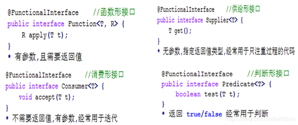
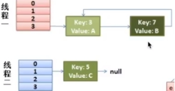
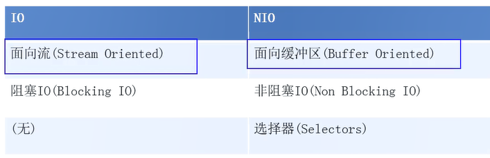
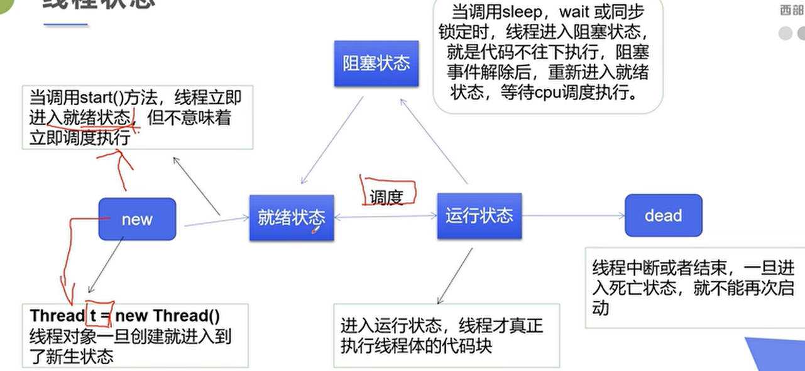
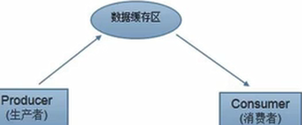

# 接口

## 默认方法

实现接口需要实现其所有的抽象方法 ,当接口加入新方法时，我们就需要对项目重新编写

使用**default**修饰， 定义**方法体**。default方法所有的子类会**默认实现** ，可以避免修改代码


这个default是jdk8新关键字，**和访问限定修饰符“default”不是一个概念**，与switch中的default功能完全不同.

实际上是**public default** ,省略了public


与抽象类的不同：抽象类更多的是提供一个模板，子类之间的某个流程大致相同，仅仅是某个步骤可能不一样（模板方法设计模式），这个时候使用抽象类，该步骤定义为抽象方法。而default关键字是用于扩展


## 静态方法

接口的静态方法不会被实现类所实现

**只用于内部调用**


两个接口定义**相同静态方法**，实现类实现这两个接口，并不会产生错误，编译器通过**反射**来区分是哪个接口下的方法

两个接口定义**相同非静态方法**，并且一个实现类同时实现了这两个接口，那么必须在实现类中重写默认方法，否则编译失败。

**静态方法调用    类名.方法**   通过**反射**来区分哪个接口下的方法

​    **非静态         对象.方法** 


## 函数式接口 

**只有一个抽象方法**

### @FunctionalInterface

只在编译期起作用，如@Override注解。编译期会强制检查该接口是否符合函数式接口的条件，不符合则会报错。**即使不使用，只要满足定义也是函数式接口**。




### Supplier

java.util.function.Supplier<T> 接口仅包含一个无参的方法： T get() 。

用来获取一个泛型参数指定类型的对象数据。由于这是一个函数式接口，这也就意味着对应的Lambda表达式需要“对外提供”一个符合泛型类型的对象数据。

```
   public void testGetUser() {
        User user = getUser(User::new);}

    private User getUser(Supplier<User> supplier) {
        return supplier.get();}
```

 

​	Supplier求数组元素的最小值

```
public void testGetMin(){
        int[] arr={5,3,100,10};
        int min = getMin(()->{
            int minNum=arr[0];
            for (int i : arr) {
                if (i<minNum) minNum=i;}
            return minNum;
        });}

    private Integer getMin(Supplier<Integer> supplier) {
        return supplier.get();
    }
```

 

### Consumer接口

java.util.function.Consumer<T> 

**与Supplier接口相反**，它不是生产一个数据，而是消费一个数据


**抽象方法：accept**，消费一个指定泛型的数据

```
public void testConsumer() {
        User user = new User();
        setUserDefaultSex(u -> u.setSex("nan"), user);
        //user的sex被改变}
        
    private void setUserDefaultSex(Consumer<User> consumer, User user) {
        consumer.accept(user);}
```


**默认方法：andThen**

**方法的参数和返回值全都是 Consumer 类型**，那么就可以实现效果：消费数据的时候，首先做一个操作，然后再做一个操作，实现组合

要想实现组合，需要两个或多个Lambda表达式

```
public void testConsumer2() {
        User user = new User();
        setUserNameAndSex(u -> u.setSex("nan"), u -> u.setName("aa"), user);
        System.out.println(user.getSex() + user.getName());}

    private void setUserNameAndSex(Consumer<User> one, Consumer<User> two, User user) 			{one.andThen(two).accept(user);}
```

 

### Predicate接口

对某种类型的数据进行判断，**得到boolean**结果

**抽象方法：test** 	用于条件判断

```
public void testPredicate() {
        longThan(s -> s.length() > 5, "hello!!");}

    private void longThan(Predicate<String> predicate, String str) {
        boolean flag = predicate.test(str);}
```


**默认方法：and** 

**默认方法：or** 

```
public void testSuccess() {
    successMan(s -> s.contains("富"), s -> s.contains("帅"), "高富帅");}

private void successMan(Predicate<String> one, Predicate<String> two, String str) {
    boolean flag = one.or(two).test(str);}
```

**默认方法：negate** 	取反


### Function接口


**抽象方法：apply** 

java.util.function.Function<T,R>根据 T类型的参数得到 R类型的返回值

```
public void testFunction() {
        Integer value = parseInteger(Integer::parseInt, "10");}

    private Integer parseInteger(Function<String, Integer> function, String str) {
        return function.apply(str);}
```

**默认方法：andThen**


# Lambda

函数式编程思想 ,只关注做什么 ,不关注怎么做

**lambda不是语法糖**

语法糖 :写法不同 ,实现原理相同 ,如增强for循环


(类型 参数1, 类型 参数2....) -> {代码}

**参数没有则留空**

**参数必须是函数式接口@FunctionalInterface**


## 省略规则

参数类型可以省略 ,但只能都省略或都不省略

参数只有一个 ,小括号能省略

大括号内语句只有一条 ,大括号/分号/return关键词能省略


## 延迟执行

new了对象后，不一定会被使用

```
public class Demo01Logger {
    private static void log(int level, String msg) {
        if (level == 1) {
            System.out.println(msg);}}
    public static void main(String[] args) {
        String msgA = "Hello";
        String msgB = "World";
        log(1, msgA + msgB);}}
```

先合并了字符串 ,再判断level==1 ,决定要不要执行方法 

```
@FunctionalInterface
public interface MessageBuilder {
    String buildMessage();
}
public class Demo02LoggerLambda {
    private static void log(int level, MessageBuilder builder) {
        if (level == 1) {
            System.out.println(builder.buildMessage());}}

    public static void main(String[] args) {
        String msgA = "Hello";
        String msgB = "World";
        log(1, () -> msgA + msgB  );}}
```

优化后 ,先判断 ,后执行字符串合并


## 方法引用 ::

```
print(e -> System.out.println(e));
```

这个lambda只是接收了参数 ,并将它打印 ,而打印的方法有现成的System.out.println

```
print(System.out::println);
```


如果Lambda要表达的函数方案已存在于某个方法的实现中，可以通过::来引用该方法

* Lambda写法	 s -> System.out.println(s); 	拿到参数之后经Lambda之手，继而传递给 System.out.println 方法去处理

* 方法引用写法	 System.out::println     直接让println 方法来取代Lambda

* 对象名引用	user :: getName

* 构造器引用	User::new

* 类名引用		User::getName

* super引用成员方法  super::sayHello

  ```
  public class Woman extends Human {
      @Override
      public void sayHello() {
          System.out.println("大家好,我是Man!");}
  
      public void method(Greetable g) {
          g.greet();}
  
      public void show() {
          method(super::sayHello);}}
  ```

* this引用	this::buyHouse

```
public class Husband {
    private void buyHouse() {
        System.out.println("买套房子");}

    private void marry(Richable lambda) {
        lambda.buy();}

    public void beHappy() {
        marry(this::buyHouse);}}
```


# Stream

得益于Lambda所带来的函数式编程，引入全新的Stream概念，用于解决集合类库的弊端。

Stream是集合元素的函数模型，不是集合，也不是数据结构，其本身不存储任何元素（或地址）,只是在原数据集上定义了一组操作。也不会改变原有数据

Stream流不保存数据，Stream操作是尽可能惰性的，即每当访问到流中的一个元素，才会在此元素上执行这一系列操作。


不使用stream ,在进行list过滤时 ,可能需要写多个for循环

```
list.stream().filter(s -> s.startsWith("张"))
                .filter(s -> s.length() == 3)
                .forEach(System.out::println);
```

 stream().forEach用的多线程方式，调用线程池的时候额外耗费时间。但在循环内处理的时间长，或要循环调用远程接口，多线程的性能高

## 获取流

* Collection接口获取流

Collection 接口中加入了default方法stream() 获取流，所有实现类均可获取流。

* Map获取流

java.util.Map 接口不是 Collection 的子接口，且其K-V数据结构不符合流元素的单一特征，所以获取对应的流

需要分key、value或entry等情况：

```
public static void main(String[] args) {
        Map<String, String> map = new HashMap<>();
        Stream<String> keyStream = map.keySet().stream();
        Stream<String> valueStream = map.values().stream();
        Stream<Map.Entry<String, String>> entryStream = map.entrySet().stream();}
```

* 数组获取流 

如果使用的不是集合或映射而是数组，由于数组对象不可能添加默认方法，所以 Stream 接口中提供了静态方法of() ，使用很简单：

```
public static void main(String[] args) {
        String[] array = {"张无忌", "张翠山", "张三丰", "张一元"};
        Stream<String> stream = Stream.of(array);}
```


## 常用方法

* forEach
* forEachOrdered     按原顺序输出 ,foreach时无序的
* filter        将一个流转换成另一个子集流

```
Stream<String> result = original.filter(s -> s.startsWith("张"));
```

* map      将流中的元素映射到另一个流	将list截取字符串 ,映射到stream

```
Stream<String> stream = list.stream().map(e -> e.substring(2));
```

* count   统计个数

* limit    取前几个

* skip     跳过前几个                          **limit + skip实现分页**

* concat   合并流 ,Stream的静态方法

```
 Stream<String> result = Stream.concat(streamA, streamB);
```

* collect   转化为Collection/Map/数组

```
list.stream().collect(Collectors.toList());
```

* distinct   去重


## parallelStream 并行流

通过默认的ForkJoinPool，提高多线程任务的速度，默认线程数量等于运行计算机上的处理器数量

Java8为ForkJoinPool添加了一个通用线程池，这个线程池用来处理那些没有被显式提交到任何线程池的任务。当调用Arrays类上添加的新方法时，自动并行化就会发生。

# 并行/并发/串行

* 并行	有两个门,两个人从前后门进入 ,互不干扰

* 并发	两个人挤一个门进入

并行时同一时刻多个进程运行 ,并发是经过上下文快速切换 ,造成同时运行的假象

多线程代码是并发而不是并行 ,并发是因为多进程/多线程都是需要去完成的任务 ,不并行是因为**并行与否由操作系统的调度器决定**

* 串行    按先后顺序进行


# HashMap


继承了AbstractMap

实现了Map ，克隆，序列化接口

```
HashMap<K,V> extends AbstractMap<K,V>
    implements Map<K,V>, Cloneable, Serializable {
```


AbstractMap已经实现过了Map接口，而HashMap又继承了AbstractMap，这样使得HashMap已经实现了Map接口，然而HashMap又再次去实现了Map接口

这是JDK中多此一举的失误

```
AbstractMap<K,V> implements Map<K,V> {
```


## 按位与2次幂容量

取余:xxx%16  不断在做除法,效率低,并且负数取余仍是负数,还需要转为正数

按位与: 	hash&(length-1)

​			(length-1)  1111

​			(hash)   1001

​			     =1001

当length-1不为全1,即length不为2的幂,将出现0,而0的部分按位与永远为0

将导致0的桶永远放不进


## 7 HashMap死锁隐患


 

原先:	3->5->7

resize:	7à3

多线程环境下,可能同时3->7	7->3,出现循环

 

当查询时就会出现死锁


==可以通过精心设计的一组object实现dos(拒绝服务攻击)==

大量的object的HashCode相同,使得它们被存放在同一个桶中,使得HashMap退化为链表,而链表的查询复杂度O(n)

 

## 8 HashMap

### hash方法

  static final int hash(Object key) {

​    int h;

​    return (key == null) ? 0 : (h = key.hashCode()) ^ (h >>> 16); }

jdk7中,容易出现低位相同,高位不同的hash	如1101……….1111

​											1001………1111

将高位与地位异或(不进位的加法),能够减少碰撞的概率

 

### resize方法

  Node<K,V> loHead = null, loTail = null;

  Node<K,V> hiHead = null, hiTail = null;

扩容时,将原链表拆为两个高低位的链表

比如16个桶,哈希码11111…….11101

​							 1111	=1101

扩容32个桶,					11111	=11101

扩容后第一位只能是0或1,并且桶中的元素被分配在了1xxx和0xxx两个新桶中,元素保持原先的顺序.而保持了顺序就降低了多线程中,顺序调换出现的死锁问题

 

Map.getOrDefault((Object key, V defaultValue),取不到key时,将返回默认的value


## 底层数组创建机制

8之前，创建对象时就创建了数组

8之后，**首次调用put**才创建


## hash相等时

会产生hash碰撞

key值相同则替换，否则加到后面		**比较key用equals**


## 成员变量


* MAXIMUM_CAPACITY = 1 << 30    最大容量

* UNTREEIFY_THRESHOLD = 6    链表的值小于6则会从红黑树转回链表

* MIN_TREEIFY_CAPACITY** = 64	超过这个值，才能进行树形化

* Node<K, V>[] table	table用来初始化(必须是二的n次幂)

* Set<Entry<K, V>> entrySet	存放缓存

* size	元素个数

* int modCount	修改次数

* int threshold		下次扩容的临界值，（容量\*负载因子)

* float loadFactor	哈希表的负载因子


# NIO



io是单向的输入流不能用于输出

而nio利用缓冲实现了数据在channel中的双向传输


nio为不同的数据类型提供了不同种类的缓冲

allocate()	分配指定大小的缓冲区


## Buffer类4个属性与方法

buffer	标记当前的position

capacity	最大容量

limit	可以操作数据的个数

position	正在被操作数据的位置

​	position<=limit<=capacity


put() get()存取数据

flip()读数据模式	开启之后,当调用get()时, 会将position调为0, limit调为当前最大存储位置,然后再执行get()方法, 不然position并不在起始位置

rewind()重置读数据模式	再次将position调为0, limit调为当前最大存储位置

clear()	**并不会删除数据**,只是将三个属性初始化 ,里面的数据处于"被遗忘"状态 ,position和limit都被初始化,难以读取数据

**mark()	记录当前的position位置**

**reset()	配合mark()的使用,回到mark的位置**


## 直接缓冲区与非直接缓冲区

非直接	调用allocate()方法分配缓冲区 ,缓冲区在**jvm**

直接	allocateDirect(),在**物理内存**

jvm对于直接缓冲区,会尽量避免使用中间缓冲区进行数据的读写,而是直接在缓冲区上进行io操作

分配**直接**缓冲区需要**更大的成本** ,也**不会被gc回收** ,会影响应用程序的内存


对于非直接缓冲区 ,物理磁盘的数据先读取至内核地址空间,再被copy到jvm内存,最后到应用程序

点开allocate()方法也可以看到返回的是heap堆缓冲


对于直接缓冲区 ,应用程序通过物理内存映射文件直接与物理磁盘交换数据 省略了copy的步骤

直到gc释放了应用程序与物理内存映射文件的引用 ,才会销毁链接

直接缓冲区的建立与销毁是成本很高的 ,而gc无法及时回收会导致浪费

所以直接缓冲区适合长时间的连接,大文件的传输


## 通道

最早,cpu需要建立若干io接口来进行io操作,这将导致cpu被占用

后来引入了**DMA**直接存储器访问 ,cpu将io操作交给DMA进行 ,DMA先向cpu申请资源 ,然后形成**DMA总线** ,不过总线的过多也会导致总线冲突,最后影响性能

而channel通道就类似于DMA总线 ,是一个完全独立的处理器 ,专门用于处理io ,不需要向cpu申请资源


### 主要实现类

* FileChannel	               本地传输
* SocketChannel             TCP
* ServerSocketChannel  TCP
* DatagramChannel        UDP

### 获取通道 getChannel()

本地

* FileInputStream/Output
* RandomAccessFile

Web

* Socket
* ServerSocket
* DatagramSocket

JDK1.7中NIO.2针对各个通道提供open()静态方法

JDK1.7中NIO.2的File工具类提供newByteChannel()方法


## 关闭

使用IO流往往需要多次使用try/catch

如果在一个try/catch中关闭多个流,将会导致关闭时其中一个流 ,抛出异常,程序中断,之后的流将不再被关闭!!!

需要一条一条的try/catch


# 多线程


## JUC包	java.util.concurrent	 

jdk1.5新特性 ,存放并发工具类

如CopyOnWriteArrayList ,底层维护了一个transient(序列化) volatile(唯一)的数组

```
final transient ReentrantLock lock = new ReentrantLock();//可重用锁
private transient volatile Object[] array;
```


即使没有主动创建线程 ,后台也会有多个线程 ,如主线程(用户线程) ,gc线程(守护线程)

线程的运行由调度器安排调度 ,调度器由操作系统控制 ,先后顺序无法干预

对同一份资源操作时 ,存在资源抢夺问题 ,需要加入并发控制

线程会带来额外开销 ,如cpu调度时间 ,并发控制开销

每个线程在自己的工作内存交互 ,内存控制不当会造成数据不一致


## ThreadLocal 原理

ThreadLocal 为每个线程创造一个资源的复本 ,而不是共享资源。将每一个线程存取数据的行为加以隔离，给每个线程特定空间来保管该线程所独享的资源

原理 : ThreadLocal 类中有一个Map，用于存储每一个线程的变量的副本。


## 创建线程3种方式

* 继承Java.lang.Thread类，并覆盖 run() 方法        Thread本身就继承了Runnable 

```
public class TestThread extends Thread {
    @Override
    public void run() {super.run();}

    public static void main(String[] args) {
        new TestThread().start();}}
```

优势：编写简单；

劣势：单继承 ,无法继承其它父类


* 实现 Java.lang.Runnable 接口，并实现 run()方法。

```
public class TestThread2 implements Runnable {
    @Override
    public void run() {}

    public static void main(String[] args) {
        TestThread2 testThread =new TestThread2();
        new Thread(testThread).start();}}
```

优势：可继承其它类，多线程可共享同一个Thread对象

劣势：编程方式稍微复杂，如需访问当前线程，需调用Thread.currentThread()


* 实现Callable接口  (有返回值 ,可以抛出异常)

1. 实现Callable接口 ,定义返回值类型
2. 重写call()方法 ,需要抛出异常
4. 创建执行服务  ExecutorService service = Executors.newFixedThreadPool(3);
5. 提交执行   Future<String> result = service.submit(new TestCallable());
6. 获取结果  result.get();
7. 关闭服务   service.shutdown();

```
public class TestCallable implements Callable<String> {

    @Override
    public String call() {
        return Thread.currentThread().getName(); }

    public static void main(String[] args) throws ExecutionException, InterruptedException  {
        //创建执行服务
        ExecutorService service = Executors.newFixedThreadPool(3);
        //提交执行
        Future<String> result = service.submit(new TestCallable());
        //获取返回值
        String str = result.get();
        //关闭服务	需要抛出2个异常
        service.shutdown();}}
```


## 线程的6种状态



* 新建 NEW，线程被创建出来，但尚未启动时的线程状态；

* 就绪 RUNNABLE，表示可以运行的线程状态，它可能正在运行，或者是在排队等待操作系统给它分配 CPU 资源；

比如Thread.start方法就是将线程从NEW状态 转换成 RUNNABLE 状态。

* 阻塞 BLOCKED，处于阻塞状态的线程正在等待监视器锁

比如等待执行 synchronized 代码块或者使用 synchronized 标记的方法。

* 等待 WAITING，等待另一个线程执行某个特定的动作。

比如，一个线程调用了Object.wait()方法，那它就在等待另一个线程调用Object.notify() 或 Object.notifyAll() 方法。

* 计时等待 TIMED_WAITING，和上者类似，只是多了一个超时时间。

比如调用了有超时时间设置的方法 Object.wait(long timeout) 和 Thread.join(long timeout) 等这些方法时，它才会进入此状态；

* 终止 TERMINATED，线程死亡	**死亡线程将无法再次start**


## 线程的方法


* setPriority()	更改优先级	优先级范围1-10

​	优先级低的也有可能被先调用 ,全看cpu心情 ,这将导致性能倒置 :优先级高的一直在等待

* yield()	**暂停但不阻塞**正在执行的线程对象 ,**转入就绪状态** ,cpu有可能再次调度到礼让线程 ,导致礼让失败

* sleep()	**转入阻塞转态** ,存在异常抛出InterruptedException ,**监控状态依然保持,不会释放锁**   

**wait 是Object的方法 ,会导致放弃对象锁**，进入等待此对象的等待锁定池。只有唤醒此对象后才进入对象锁定池，准备获得对象锁进行运行状态


* join()	合并线程 ,相当于插队 ,其他线程等待该线程终止	容易造成线程阻塞

`interrupt()	中断线程(不推荐)`

isAlive	是否存活

* start()    此时线程处于就绪状态，并没有运行，得到 cpu 时间片**再执行 run()方法** .run()方法只是类的一个普通方法而已，**如果直接调用 run 方法，程序中依然只有主线程**，还是要顺序执行
* Thread.state / thread.getState()	获取线程状态
* **线程同时启动**    for 循环，调用 wait()方法，让所有线程等待 ,再调用 notifyAll(), 同时启动所有线程


final void wait() 	等待其它线程通知

void wait(long timeout) 线程等待指定毫秒参数的时间

final void wait(longtimeout,int nanos)线程等待指定毫秒、微妙的时间

final void notify()唤醒一个处于等待状态的线程。注意的是在调用此方法的时候，并不能确切的唤醒某一个等待状态的线程，而是由 JVM 确定唤醒哪个线程，而且不是按优先级。

final void notifyAll()唤醒同一个对象上所有调用 wait()方法的线程，注意并不是给所有唤醒线程一个对象的锁，而是让它们竞争


**不推荐调用jdk的stop ,destroy方法停止线程** ,可以在源码看到这些方法加上了@Deprecated注解 ,表示方法过时

应该用boolean标志 ,boolean=false停止线程 **,让线程自己停下来 ,而不是被动停止**


JDK 1.5 通过 Lock 接口提供了显式(explicit)的锁机制，增强了灵活性以及对线程的协调。Lock 接口中定义了加锁（lock()）和解锁(unlock())的方法，同时还提供了 newCondition()方法来产生用于线程之间通信的Condition 对象；

JDK 1.5 还提供了信号量(semaphore)机制，信号量可以用来限制对某个共享资源进行访问的线程的数量。在对资源进行访问之前，线程必须得到信号量的许可（调用 Semaphore 对象的 acquire()方法）；在完成对资源的访问后，线程必须向信号量归还许可（调用 Semaphore 对象的 release()方法）。


## 守护线程 daemon

**JVM必须保证用户线程执行完毕 ,但无需等待守护线程执行完毕**


如日志记录,监控内存 ,垃圾回收


## 线程同步

每个线程在自己的工作内存交互 ,内存没有同步会造成数据不一致


### 不安全线程案例

```
List<String> list = new ArrayList<String>();
for (int i = 0; i <= 10000; i++) {
    new Thread(() -> list.add(Thread.currentThread().getName())).start();
}
Thread.sleep(4000);
System.out.println(list.size());//不到10000	list.add()时,两个线程同时add,导致list被修改而不是添加
```


### 同步代码块/方法

synchronized控制对象的访问 ,每个对象对应一把锁 ,必须获得该方法的对象的锁才能执行方法 ,否则会线程阻塞

方法执行完毕 ,才会释放锁 ,让下一个线程拿到锁


同步代码块	synchronized (对象) { }


同步方法：public synchronized void xxx(int i) { }

同步方法默认锁定this ,即当前类,所以不需要指明对象

**在静态方法中，都是默认锁定类对象**


### 锁

从jdk1.5开始 ,可以显式定义同步锁对象Lock ,实现同步

Lock接口 ,提供了对共享资源的独占访问 ,线程开始访问共享资源之前需要先获得Lock对象

锁保证了数据在方法中被访问时的正确性

锁会消耗性能 ,低优先级线程拿到排它锁 ,将导致性能倒置


ReentrantLock可重入锁 实现了Lock ,与synchronized相同并发性和内存语义

```
private final ReentrantLock lock = new ReentrantLock();
        lock.lock();					//在try外面加锁
        try {
            ...
        } finally {
            lock.unlock();}		//在finally解锁
```


#### Lock 与synchronized对比

Lock是显式锁 ,synchronized是隐式 ,出了作用域就释放

Lock只有代码块锁 ,没有方法锁

Lock在调度线程方面性能更好


**对象锁分为三种：共享资源、this、当前类的字节码文件对象**


#### 乐观锁与悲观锁

悲观锁，每次去拿数据的时候都认为别人会修改，所以每次在拿数据的时候都会上锁，这样别人想拿这个数据就会block直到它拿到锁。传统的关系型数据库里边就用到了很多这种锁机制，比如行锁，表锁等，读锁，写锁等，都是在做操作之前先上锁。

乐观锁认为别人不会修改，所以不会上锁，但是在更新时判断在此期间别人有没有去更新数据，可以使用版本号等机制,在更新数据时会提高版本号,在提交时,提交版本低于目前版本,将回滚。乐观锁适用于多读的应用类型，可以提高吞吐量

两种锁各有优缺点，不可认为一种好于另一种，像乐观锁适用于写比较少的情况下，即冲突真的很少发生的时候，这样可以省去了锁的开销，加大了系统的整个吞吐量。但如果经常产生冲突，上层应用会不断的进行retry，反倒降低性能，所以这种情况下用悲观锁就比较合适。

#### 同步锁

 Java 中每个对象都有一个内置锁。 当程序运行到非静态的 synchronized 同步方法上时，自动获得与正在执行代码类的当前实例（this 实例）有关的锁。获得一个对象的锁也称为获取锁、 锁定对象、在对象上锁定或在对象上同步。 当程序运行到 synchronized 同步方法或代码块时才该对象锁才起作用。 一个对象只有一个锁。所以，如果一个线程获得该锁，就没有其他线程可以 获得锁，直到第一个线程释放（或返回）锁。这也意味着任何其他线程都不 能进入该对象上的 synchronized 方法或代码块，直到该锁被释放。 释放锁是指持锁线程退出了 synchronized 同步方法或代码块。 关于锁和同步，有一下几个要点： 1）只能同步方法，而不能同步变量和类； 2）每个对象只有一个锁；当提到同步时，应该清楚在什么上同步？也就是 说，在哪个对象上同步？ 3）不必同步类中所有的方法，类可以同时拥有同步和非同步方法。 4）如果两个线程要执行一个类中的 synchronized 方法，并且两个线程使 用相同的实例来调用方法，那么一次只能有一个线程能够执行方法，另一个需要等待，直到锁被释放。也就是说：如果一个线程在对象上获得一个锁， 就没有任何其他线程可以进入（该对象的）类中的任何一个同步方法。 5）如果线程拥有同步和非同步方法，则非同步方法可以被多个线程自由访 问而不受锁的限制。 6）线程睡眠时，它所持的任何锁都不会释放。 7）线程可以获得多个锁。比如，在一个对象的同步方法里面调用另外一个 对象的同步方法，则获取了两个对象的同步锁。 8）同步损害并发性，应该尽可能缩小同步范围。同步不但可以同步整个方 法，还可以同步方法中一部分代码块。 9）在使用同步代码块时候，应该指定在哪个对象上同步，也就是说要获取哪个对象的锁。

#### 方法锁和静态方法锁的区别

静态方法，需要对Class对象加锁。

非静态方法，需要对本对象(this)加锁。


### 死锁

多个线程各自占有一部分共享资源 ,并发生互相等待

常发生于**一个同步块同时拥有2个以上对象的锁**


**4个必要条件**

* 互斥	一个资源同时被多个进程使用

* 请求与保持	一个进程请求资源而阻塞 ,对已有的资源保持不释放

* 不剥夺	进程已获得的资源在未使用完之前 ,不会被抢夺

* 循环等待	若干个进程之间形成循环等待资源

只要打破一个条件就能避免死锁


**尽量不要嵌套同步**

synchronized (对象) { 

​	synchronized (对象) { }

}


## 线程通信

wait + notify 解决线程通信

这两个都是Object的方法 ,只能在同步方法或同步代码块中使用 ,否则会抛出IIIegalMonitorStateException


### 管程法

生产者把产品放入**缓冲区** ,消费者从缓冲区拿

每次操作时判断缓冲区的容量 ,满了则生产者不生产 ,空了消费者不消费




### 信号灯法

判断**标志位** ,如果为真 ,等待 ,如果为假 ,唤醒

每次进行操作时判断标志位 ,决定wait或者是执行


## volatile能否保证线程安全？

不能。volatile是一种弱的同步机制，如需要强线程安全，还需要使用 synchronized。

volatile 变量用来确保将变量的更新操作通知到其他线程。当把变量声明为 volatile 类型后，编译器与运行时都会注意到这个变量是共享的，因此不会将该变量上的操作与其他内存操作一起重排序。volatile 变量不会被缓存在寄存器或者对其他处理器不可见的地方，因此在读取 volatile 类型的变量时总会返回最新写入的值。

一、volatile 的内存语义是：

当写一个 volatile 变量时，JMM 会把该线程对应的本地内存中的共享**变量值立即刷新到主内存**中。

当读一个 volatile 变量时，JMM 会把该线程对应的本**地内存设置为无效，直接从主内存中读取**共享变量。

二、volatile 底层的实现机制

如果把加入 volatile 关键字的代码和未加入 volatile 关键字的代码都生成汇编代码，会发现加入 volatile 关键字的代码会多出一个 lock 前缀指令。

1 、重排序时不能把后面的指令重排序到内存屏障之前的位置

2、使得本 CPU 的 Cache 写入内存

3、写入动作也会引起别的 CPU 或者别的内核无效化其 Cache，相当于让

新写入的值对别的线程可见。


## synchronized 关键字的用法

synchronized 关键字可以将对象或者方法标记为同步，以实现对对象和方法的互斥访问，可以用 synchronized(对象) { … }定义同步代码块，或者在声明方法时将 synchronized 作为方法的修饰符


### synchronized和Lock的异同？

Lock是Java 5以后引入的新的API

相同点：Lock 能完成synchronized所实现的所有功能；

不同点：Lock 有比 synchronized 更精确的线程语义和更好的性能。synchronized会自动释放锁，而 Lock 一定要求程序员手工释放，并且必须在 finally 块中释放（这是释放外部资源的最好的地方）


## 线程池（thread pool）

创建和销毁对象是很费时间的，**虚拟机将试图跟踪每一个对象，以便能够在对象销毁后进行垃圾回收**  线程池也**利于管理线程的个数与活跃数**

### 线程池参数

最大线程数 maximumPoolSize	性能最高的线程数

核心线程数 corePollSize	平时的流量需要的线程数

线程空闲时间 

空闲的线程保留的时间 keepAliveTime

阻塞队列大小 


Executor		总接口 ,只定义了execute()执行线程方法

ExecutorService extends Executor 子接口 ,定义了shutdown()关闭 submit()等方法

```
abstract class AbstractExecutorService implements ExecutorService
实现了ExecutorService的方法
```


class ThreadPoolExecutor extends AbstractExecutorService

```
void execute(Runnable command){}	//执行Runnable线程,无返回值
```


```
<T>Future<T> submit(Callable<T> task)	//执行Callable线程 ,有返回值
```


```
Executors工具类(工厂模式),返回不同类型的线程池
定义了new线程池的方法
Executors.newFixedThreadPool(10);
```


SingleThreadExecutor

FixedThreadPool

WorkStealingPool

CachedThreadPool

ScheduledThreadPool


使用Executors去创建，而是通过ThreadPoolExecutor的方式，这样的处理方式让写的同学更加明确线程池的运行规则，规避资源耗尽的风险。 说明：

Executors创建线程池对象的弊端
        1）FixedThreadPool和SingleThreadPool:
  允许的请求队列长度为Integer.MAX_VALUE，可能会**堆积大量的请求**，从而导致OOM。
        2）CachedThreadPool:
  允许的创建线程数量为Integer.MAX_VALUE，可能会**创建大量的线程**，从而导致OOM。


### 队列

一个缓冲的工具，当没有足够的线程去处理任务时，可以将任务放进队列中，以队列先进先出的特性来执行工作任务

核心线程满了，进队列，队列也满了，创建新线程，直到达到最大线程数，之后再超出，会进入拒绝rejectedExecution


客户端存储数据3种方法


* cookie

  会失效 ,下次请求cookie会被携带一起发送 ,不适合存储大量数据

* sessionStorage

  页面关闭则失效


* localStorage

  浏览器缓存被清空则失效


