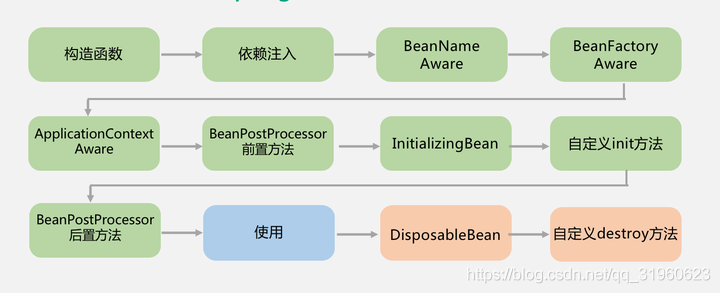
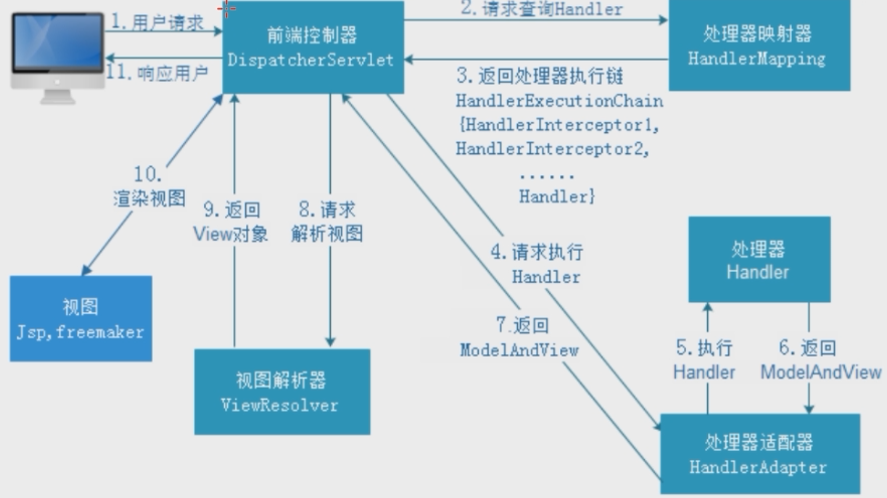

# 使用场景

1. 缓存 利用内存的高速访问

2. 排行榜 利用zset排序
3. 计算器/限速器 利用原子性的自增操作
4. Session共享
5. 分布式锁


# 注解


## 自定义注解

关键字为@interface, 属性的访问修饰符只能是public

```java
@Retention(RetentionPolicy.CLASS)
@Mapping(target = "id", ignore = true)
@Mapping(target = "version", ignore = true)
@Mapping(target = "dxCreated", ignore = true)
@Mapping(target = "dxModified", ignore = true)
public @interface ToEntity {
}
```


## SpringBootApplication


```java
@Target(ElementType.TYPE)
@Retention(RetentionPolicy.RUNTIME)
@Inherited
@SpringBootConfiguration // ≈ @Configuration
@EnableAutoConfiguration //启用boot的自动装配机制
@ComponentScan(excludeFilters = { @Filter(type = FilterType.CUSTOM, classes = TypeExcludeFilter.class),@Filter(type = FilterType.CUSTOM, classes = AutoConfigurationExcludeFilter.class) })
public @interface SpringBootApplication {
  
}
```


## EnableAutoConfiguration

```java
@Target(ElementType.TYPE)
@Retention(RetentionPolicy.RUNTIME)
@Inherited
@AutoConfigurationPackage //将main包下所有组件注册到容器中
@Import(AutoConfigurationImportSelector.class) //加载自动装配类 xxxAutoconfiguration
public @interface EnableAutoConfiguration {

   String ENABLED_OVERRIDE_PROPERTY = "spring.boot.enableautoconfiguration";

   Class<?>[] exclude() default {};

   String[] excludeName() default {};

}
```


### @AutoConfigurationPackage

```java
@Target(ElementType.TYPE)
@Retention(RetentionPolicy.RUNTIME)
@Inherited
@Import(AutoConfigurationPackages.Registrar.class)
public @interface AutoConfigurationPackage {

   String[] basePackages() default {};

   Class<?>[] basePackageClasses() default {};

}
```


#### AutoConfigurationPackages.Registrar

<a name="扫描启动类所在包">getPackageNames()</a>

```java
static class Registrar implements ImportBeanDefinitionRegistrar, DeterminableImports {

  @Override
  public void registerBeanDefinitions(AnnotationMetadata metadata, BeanDefinitionRegistry registry) {
    register(registry, new PackageImports(metadata).getPackageNames().toArray(new String[0])); //getPackageNames()获取启动类所在的包,进而扫描启动类包下的所有文件
  }

  @Override
  public Set<Object> determineImports(AnnotationMetadata metadata) {
    return Collections.singleton(new PackageImports(metadata));
  }
}
```


### AutoConfigurationImportSelector

```java
public class AutoConfigurationImportSelector implements DeferredImportSelector, BeanClassLoaderAware, ResourceLoaderAware, BeanFactoryAware, EnvironmentAware, Ordered {

}

public interface DeferredImportSelector extends ImportSelector { }

public interface ImportSelector {
  String[] selectImports(AnnotationMetadata var1); //AutoConfigurationImportSelector实现selectImports()，用于获取所有符合条件的类的全限定类名
}
```


#### selectImports

```java
public String[] selectImports(AnnotationMetadata annotationMetadata) {
  if (!isEnabled(annotationMetadata)) {
    return NO_IMPORTS;
  }
  AutoConfigurationMetadata autoConfigurationMetadata = AutoConfigurationMetadataLoader
    .loadMetadata(this.beanClassLoader);
  AutoConfigurationEntry autoConfigurationEntry = getAutoConfigurationEntry(
    autoConfigurationMetadata, annotationMetadata);
  return StringUtils.toStringArray(autoConfigurationEntry.getConfigurations());
}

protected boolean isEnabled(AnnotationMetadata metadata) {
  if (getClass() == AutoConfigurationImportSelector.class) {
    return getEnvironment().getProperty(EnableAutoConfiguration.ENABLED_OVERRIDE_PROPERTY, Boolean.class, true); //确认自动装配是否开启
  }
  return true;
}
```


#### loadMetadata

```java
public static AutoConfigurationMetadata loadMetadata(ClassLoader classLoader) {
  return loadMetadata(classLoader, PATH);
}

static AutoConfigurationMetadata loadMetadata(ClassLoader classLoader, String path) {
  try {
    Enumeration<URL> urls = (classLoader != null) ? classLoader.getResources(path)
      : ClassLoader.getSystemResources(path);
    Properties properties = new Properties();
    while (urls.hasMoreElements()) {
      properties.putAll(PropertiesLoaderUtils
                        .loadProperties(new UrlResource(urls.nextElement())));
    }
    return loadMetadata(properties);
  }
  catch (IOException ex) {
    throw new IllegalArgumentException(
      "Unable to load @ConditionalOnClass location [" + path + "]", ex);
  }
}

static AutoConfigurationMetadata loadMetadata(Properties properties) {
  return new PropertiesAutoConfigurationMetadata(properties);
}
```


所有 starter `META-INF/ 'PATH'`目录的启动配置类都会被读取到


### getAutoConfigurationEntry

```java
protected AutoConfigurationEntry getAutoConfigurationEntry(
  AutoConfigurationMetadata autoConfigurationMetadata,
  AnnotationMetadata annotationMetadata) {
  if (!isEnabled(annotationMetadata)) {
    return EMPTY_ENTRY;
  }
  AnnotationAttributes attributes = getAttributes(annotationMetadata); //EnableAutoConfiguration的exclude和excludeName属性
  
  List<String> configurations = getCandidateConfigurations(annotationMetadata, attributes); //读取所有Starter下的 META-INF/spring.factories,获取需要自动装配的配置类
  
  configurations = removeDuplicates(configurations);
  Set<String> exclusions = getExclusions(annotationMetadata, attributes);
  checkExcludedClasses(configurations, exclusions);
  configurations.removeAll(exclusions); //根据exclude和excludeName去除
  
  configurations = filter(configurations, autoConfigurationMetadata);//去除@ConditionalOnXXX 中条件不满足的类
  fireAutoConfigurationImportEvents(configurations, exclusions);
  return new AutoConfigurationEntry(configurations, exclusions);
}
```


## @ConditionalOnXXX


- `@ConditionalOnBean`：当容器里有指定 Bean 的条件下
- `@ConditionalOnMissingBean`：当容器里没有指定 Bean 的情况下
- `@ConditionalOnSingleCandidate`：当指定 Bean 在容器中只有一个，或者虽然有多个但是指定首选 Bean
- `@ConditionalOnClass`：当类路径下有指定类的条件下
- `@ConditionalOnMissingClass`：当类路径下没有指定类的条件下
- `@ConditionalOnProperty`：指定的属性是否有指定的值
- `@ConditionalOnResource`：类路径是否有指定的值
- `@ConditionalOnExpression`：基于 SpEL 表达式作为判断条件
- `@ConditionalOnJava`：基于 Java 版本作为判断条件
- `@ConditionalOnJndi`：在 JNDI 存在的条件下差在指定的位置
- `@ConditionalOnNotWebApplication`：当前项目不是 Web 项目的条件下
- `@ConditionalOnWebApplication`：当前项目是 Web 项 目的条件下


## @ComponentScan

扫描[被注册的bean](#注册bean),默认会扫描启动类所在的包下所有的类，可以通过excludeFilters自定义不扫描的 bean


只有启动类所在包外的才需要用``@CompmentScan(basePackage={“”,””})``


@Component:标准一个普通的spring Bean类

@Service:标注一个业务逻辑组件类
@Repository:标注一个DAO组件类


@Controller	标注一个控制器组件类,返回页面

@RestController 数据直接以 JSON 或 XML 形式写入 HTTP Response中


Bean实例的名称默认是Bean类的首字母小写，其他部分不变


@Resource


 

**@Lazy**   **懒加载**

***注入userService时,CacheAspect中自定义的切面增强还没有被加载
 导致注入进去的是还未被动态代理的,原生的userService\***

 

@TableField(exist = false)	实体类中,数据库不存在的字段需要加上这个注解


@Transactional 	**public 的方法才起作用**

1)事务开始时，通过AOP机制，**生成代理connection对象**，并将其放入DataSource实例的某个与DataSourceTransactionManager相关的容器中。客户代码使用该connection连接数据库，执行所有数据库命令

2)事务结束时，回滚代理connection对象上执行的数据库命令，然后关闭该代理connection对象（事务结束后，回滚操作不会对已执行完毕的SQL操作命令起作用）


## @ControllerAdvice


用于定义@ExceptionHandler、@InitBinder、@ModelAttribute，并应用到所有@RequestMapping中


@ExceptionHandler  拦截异常，实现自定义异常处理

```
@ExceptionHandler(value = {UnauthorizedException.class})
public Object unauthorized() {
    Map<String, Object> map = new HashMap<>();
    map.put("code", -1);
    map.put("msg", "未授权，请联系管理员");
    return map;
}
```


@InitBinder   在其执行之前初始化数据绑定器

```
@InitBinder
    public void initBinder(WebDataBinder binder) {}
```


## 自动装配


从以下几个方面回答：

1. 什么是 SpringBoot 自动装配？
2. SpringBoot 是如何实现自动装配的？如何实现按需加载？
3. 如何实现一个 Starter？


> SpringBoot 定义了一套接口规范，这套规范规定：SpringBoot 在启动时会扫描外部引用 jar 包中的`META-INF/spring.factories`文件，将文件中配置的类型信息加载到 Spring 容器，并执行类中定义的各种操作。对于外部 jar 来说，只需要按照 SpringBoot 定义的标准，就能将自己的功能装置进 SpringBoot
>


1. 主要通过@SpringBootApplication 中@EnableAutoConfiguration注解实现
2. 注解中@Import(AutoConfigurationImportSelector.class) 的类。借助@Import的支持，收集和注册特定场景相关的bean定义
3. AutoConfigurationImportSelector.getAutoConfigurationEntry()会扫描所有包下spring-autoconfigure-metadata.properties的属性
4. 通过@ConditionOn对比过滤符合当前配置的配置项，重新进行config的注解扫描添加需要的bean配置到BenDefinition中
5. 再执行初始化方法


## 自动注入


### @Autowired VS @Resource

| Autowired                                                 | Resource                                       |
| --------------------------------------------------------- | ---------------------------------------------- |
| Spring,按类型注入                                         | JDK,按名字注入                                 |
| 默认要求依赖对象必须存在,设置required=false开启允许null值 |                                                |
| AutoWiredAnnotationBeanPostProcessor处理@AutoWired        | CommonAnnotationBeanPostProcessor处理@Resource |


## @PathVariable

`@PathVariable`用于路径参数，`@RequestParam`用于获取查询参数

```java
@GetMapping("/klasses/{klassId}/teachers")
public List<Teacher> getKlassRelatedTeachers(
         @PathVariable("klassId") Long klassId,
         @RequestParam(value = "type", required = false) String type ) {
...
}
```

如果我们请求的 url 是：`/klasses/{123456}/teachers?type=web`

那么我们服务获取到的数据就是：`klassId=123456,type=web


## @RequestBody

用于读取请求的body并且**Content-Type=application/json** 格式的数据，接收到数据之后会自动将数据绑定到 Java 对象上去。**使用`HttpMessageConverter`或者自定义的`HttpMessageConverter`将请求的 body 中的 json 字符串转换为 java 对象**


## 读取配置文件

```yaml
library:
  location: 湖北武汉加油中国加油
  books:
    - name: 天才基本法
      description: 545
    - name: 时间的秩序
```


### @value

`@Value("${property}")`

```java
@Value("${wuhan2020}")
String wuhan2020;
```


### @ConfigurationProperties

读取配置信息并与bean绑定

```java
@Component
@ConfigurationProperties(prefix = "library")
class LibraryProperties {
  private String location;
  private List<Book> books;

  @Data
  static class Book {
    String name;
    String description;
  }
}
```


## Json处理


### 过滤Json数据


**`@JsonIgnoreProperties` 作用在类上,过滤掉特定字段不返回或者不解析。**

```java
//生成json时将userRoles属性过滤
@JsonIgnoreProperties({"userRoles"})
public class User {
    private List<UserRole> userRoles = new ArrayList<>();
}
```


`@JsonIgnore`作用在属性上

```java
public class User {
   //生成json时将userRoles属性过滤
    @JsonIgnore
    private List<UserRole> userRoles = new ArrayList<>();
}
```


### 格式化 json 数据

`@JsonFormat`


### 扁平化对象

`@JsonUnwrapped`

```java
public class Account {
  @JsonUnwrapped
    private Location location;
    @JsonUnwrapped
    private PersonInfo personInfo;
}
```


```json
//未扁平化前
{
  "location": {
    "provinceName":"湖北",
    "countyName":"武汉"
  },
  "personInfo": {
    "userName": "coder1234",
    "fullName": "shaungkou"
  }
}

//扁平化后
{
  "provinceName":"湖北",
  "countyName":"武汉",
  "userName": "coder1234",
  "fullName": "shaungkou"
}
```


## 异常处理


1. `@ControllerAdvice` :注解定义全局异常处理类
2. `@ExceptionHandler` :注解声明异常处理方法


## JPA

#### 8.1. 创建表

`@Entity`声明一个类对应一个数据库实体。

`@Table` 设置表名

```java
@Entity
@Table(name = "role")
public class Role {
    @Id
    @GeneratedValue(strategy = GenerationType.IDENTITY)
    private Long id;
    private String name;
    private String description;
    省略getter/setter......
}
```

#### 8.2. 创建主键

`@Id` ：声明一个字段为主键。

使用`@Id`声明之后，我们还需要定义主键的生成策略。我们可以使用 `@GeneratedValue` 指定主键生成策略。

**1.通过 `@GeneratedValue`直接使用 JPA 内置提供的四种主键生成策略来指定主键生成策略。**

```java
@Id
@GeneratedValue(strategy = GenerationType.IDENTITY)
private Long id;
```

JPA 使用枚举定义了 4 中常见的主键生成策略，如下：

_Guide 哥：枚举替代常量的一种用法_

```java
public enum GenerationType {

    /**
     * 使用一个特定的数据库表格来保存主键
     * 持久化引擎通过关系数据库的一张特定的表格来生成主键,
     */
    TABLE,

    /**
     *在某些数据库中,不支持主键自增长,比如Oracle、PostgreSQL其提供了一种叫做"序列(sequence)"的机制生成主键
     */
    SEQUENCE,

    /**
     * 主键自增长
     */
    IDENTITY,

    /**
     *把主键生成策略交给持久化引擎(persistence engine),
     *持久化引擎会根据数据库在以上三种主键生成 策略中选择其中一种
     */
    AUTO
}

```

`@GeneratedValue`注解默认使用的策略是`GenerationType.AUTO`

```java
public @interface GeneratedValue {

    GenerationType strategy() default AUTO;
    String generator() default "";
}
```

一般使用 MySQL 数据库的话，使用`GenerationType.IDENTITY`策略比较普遍一点（分布式系统的话需要另外考虑使用分布式 ID）。

**2.通过 `@GenericGenerator`声明一个主键策略，然后 `@GeneratedValue`使用这个策略**

```java
@Id
@GeneratedValue(generator = "IdentityIdGenerator")
@GenericGenerator(name = "IdentityIdGenerator", strategy = "identity")
private Long id;
```

等价于：

```java
@Id
@GeneratedValue(strategy = GenerationType.IDENTITY)
private Long id;
```

jpa 提供的主键生成策略有如下几种：

```java
public class DefaultIdentifierGeneratorFactory
		implements MutableIdentifierGeneratorFactory, Serializable, ServiceRegistryAwareService {

	@SuppressWarnings("deprecation")
	public DefaultIdentifierGeneratorFactory() {
		register( "uuid2", UUIDGenerator.class );
		register( "guid", GUIDGenerator.class );			// can be done with UUIDGenerator + strategy
		register( "uuid", UUIDHexGenerator.class );			// "deprecated" for new use
		register( "uuid.hex", UUIDHexGenerator.class ); 	// uuid.hex is deprecated
		register( "assigned", Assigned.class );
		register( "identity", IdentityGenerator.class );
		register( "select", SelectGenerator.class );
		register( "sequence", SequenceStyleGenerator.class );
		register( "seqhilo", SequenceHiLoGenerator.class );
		register( "increment", IncrementGenerator.class );
		register( "foreign", ForeignGenerator.class );
		register( "sequence-identity", SequenceIdentityGenerator.class );
		register( "enhanced-sequence", SequenceStyleGenerator.class );
		register( "enhanced-table", TableGenerator.class );
	}

	public void register(String strategy, Class generatorClass) {
		LOG.debugf( "Registering IdentifierGenerator strategy [%s] -> [%s]", strategy, generatorClass.getName() );
		final Class previous = generatorStrategyToClassNameMap.put( strategy, generatorClass );
		if ( previous != null ) {
			LOG.debugf( "    - overriding [%s]", previous.getName() );
		}
	}

}
```

#### 8.3. 设置字段类型

`@Column` 声明字段。

**示例：**

设置属性 userName 对应的数据库字段名为 user_name，长度为 32，非空

```java
@Column(name = "user_name", nullable = false, length=32)
private String userName;
```

设置字段类型并且加默认值，这个还是挺常用的。

```java
Column(columnDefinition = "tinyint(1) default 1")
private Boolean enabled;
```

#### 8.4. 指定不持久化特定字段

`@Transient` ：声明不需要与数据库映射的字段，在保存的时候不需要保存进数据库 。

如果我们想让`secrect` 这个字段不被持久化，可以使用 `@Transient`关键字声明。

```java
Entity(name="USER")
public class User {

    ......
    @Transient
    private String secrect; // not persistent because of @Transient

}
```

除了 `@Transient`关键字声明， 还可以采用下面几种方法：

```java
static String secrect; // not persistent because of static
final String secrect = “Satish”; // not persistent because of final
transient String secrect; // not persistent because of transient
```

一般使用注解的方式比较多。

#### 8.5. 声明大字段

`@Lob`:声明某个字段为大字段。

```java
@Lob
private String content;
```

更详细的声明：

```java
@Lob
//指定 Lob 类型数据的获取策略， FetchType.EAGER 表示非延迟 加载，而 FetchType. LAZY 表示延迟加载 ；
@Basic(fetch = FetchType.EAGER)
//columnDefinition 属性指定数据表对应的 Lob 字段类型
@Column(name = "content", columnDefinition = "LONGTEXT NOT NULL")
private String content;
```

#### 8.6. 创建枚举类型的字段

可以使用枚举类型的字段，不过枚举字段要用`@Enumerated`注解修饰。

```java
public enum Gender {
    MALE("男性"),
    FEMALE("女性");

    private String value;
    Gender(String str){
        value=str;
    }
}
```

```java
@Entity
@Table(name = "role")
public class Role {
    @Id
    @GeneratedValue(strategy = GenerationType.IDENTITY)
    private Long id;
    private String name;
    private String description;
    @Enumerated(EnumType.STRING)
    private Gender gender;
    省略getter/setter......
}
```

数据库里面对应存储的是 MAIL/FEMAIL。

#### 8.7. 增加审计功能

只要继承了 `AbstractAuditBase`的类都会默认加上下面四个字段。

```java
@Data
@AllArgsConstructor
@NoArgsConstructor
@MappedSuperclass
@EntityListeners(value = AuditingEntityListener.class)
public abstract class AbstractAuditBase {

    @CreatedDate
    @Column(updatable = false)
    @JsonIgnore
    private Instant createdAt;

    @LastModifiedDate
    @JsonIgnore
    private Instant updatedAt;

    @CreatedBy
    @Column(updatable = false)
    @JsonIgnore
    private String createdBy;

    @LastModifiedBy
    @JsonIgnore
    private String updatedBy;
}

```

我们对应的审计功能对应地配置类可能是下面这样的（Spring Security 项目）:

```java
@Configuration
@EnableJpaAuditing
public class AuditSecurityConfiguration {
    @Bean
    AuditorAware<String> auditorAware() {
        return () -> Optional.ofNullable(SecurityContextHolder.getContext())
                .map(SecurityContext::getAuthentication)
                .filter(Authentication::isAuthenticated)
                .map(Authentication::getName);
    }
}
```

简单介绍一下上面设计到的一些注解：

1. `@CreatedDate`: 表示该字段为创建时间时间字段，在这个实体被 insert 的时候，会设置值

2. `@CreatedBy` :表示该字段为创建人，在这个实体被 insert 的时候，会设置值

   `@LastModifiedDate`、`@LastModifiedBy`同理。

`@EnableJpaAuditing`：开启 JPA 审计功能。

#### 8.8. 删除/修改数据

`@Modifying` 注解提示 JPA 该操作是修改操作,注意还要配合`@Transactional`注解使用。

```java
@Repository
public interface UserRepository extends JpaRepository<User, Integer> {

    @Modifying
    @Transactional(rollbackFor = Exception.class)
    void deleteByUserName(String userName);
}
```

#### 8.9. 关联关系

- `@OneToOne` 声明一对一关系
- `@OneToMany` 声明一对多关系
- `@ManyToOne`声明多对一关系
- `MangToMang`声明多对多关系


## 参数校验


**JSR(Java Specification Requests）** 是一套 JavaBean 参数校验的标准，它定义了很多常用的校验注解，我们可以直接将这些注解加在我们 JavaBean 的属性上面，这样就可以在需要校验的时候进行校验了，非常方便！

校验的时候我们实际用的是 **Hibernate Validator** 框架。Hibernate Validator 是 Hibernate 团队最初的数据校验框架，Hibernate Validator 4.x 是 Bean Validation 1.0（JSR 303）的参考实现，Hibernate Validator 5.x 是 Bean Validation 1.1（JSR 349）的参考实现，目前最新版的 Hibernate Validator 6.x 是 Bean Validation 2.0（JSR 380）的参考实现。

SpringBoot 项目的 spring-boot-starter-web 依赖中已经有 hibernate-validator 包，不需要引用相关依赖。如下图所示（通过 idea 插件—Maven Helper 生成）：


👉 **所有的注解，推荐使用 JSR 注解，即`javax.validation.constraints`，而不是`org.hibernate.validator.constraints`**

### 常用的验证注解

- `@NotEmpty` 被注释的字符串的不能为 null 也不能为空
- `@NotBlank` 被注释的字符串非 null，并且必须包含一个非空白字符
- `@Null` 被注释的元素必须为 null
- `@NotNull` 被注释的元素必须不为 null
- `@AssertTrue` 被注释的元素必须为 true
- `@AssertFalse` 被注释的元素必须为 false
- `@Pattern(regex=,flag=)`被注释的元素必须符合指定的正则表达式
- `@Email` 被注释的元素必须是 Email 格式。
- `@Min(value)`被注释的元素必须是一个数字，其值必须大于等于指定的最小值
- `@Max(value)`被注释的元素必须是一个数字，其值必须小于等于指定的最大值
- `@DecimalMin(value)`被注释的元素必须是一个数字，其值必须大于等于指定的最小值
- `@DecimalMax(value)` 被注释的元素必须是一个数字，其值必须小于等于指定的最大值
- `@Size(max=, min=)`被注释的元素的大小必须在指定的范围内
- `@Digits (integer, fraction)`被注释的元素必须是一个数字，其值必须在可接受的范围内
- `@Past`被注释的元素必须是一个过去的日期
- `@Future` 被注释的元素必须是一个将来的日期

### 验证Body

```java
@Data
@AllArgsConstructor
@NoArgsConstructor
public class Person {
    @NotNull(message = "classId 不能为空")
    private String classId;

    @Size(max = 33)
    @NotNull(message = "name 不能为空")
    private String name;

    @Pattern(regexp = "((^Man$|^Woman$|^UGM$))", message = "sex 值不在可选范围")
    @NotNull(message = "sex 不能为空")
    private String sex;

    @Email(message = "email 格式不正确")
    @NotNull(message = "email 不能为空")
    private String email;
}
```

我们在需要验证的参数上加上了`@Valid`注解，如果验证失败，它将抛出`MethodArgumentNotValidException`。

```java
@RestController
@RequestMapping("/api")
public class PersonController {

    @PostMapping("/person")
    public ResponseEntity<Person> getPerson(@RequestBody @Valid Person person) {
        return ResponseEntity.ok().body(person);
    }
}
```

### 验证请求参数(Path Variables 和 Request Parameters)

**一定一定不要忘记在类上加上 `Validated` 注解了，这个参数可以告诉 Spring 去校验方法参数**

```java
@RestController
@RequestMapping("/api")
@Validated
public class PersonController {

  @GetMapping("/person/{id}")
  public ResponseEntity<Integer> getPersonByID(@Valid @PathVariable("id") @Max(value = 5,message = "超过 id 的范围了") Integer id) {
    return ResponseEntity.ok().body(id);
  }
}
```


## mvc 工作原理


> 流程说明
>
> http请求先经过Servlet的filter进行过滤，之后进入MVC流程

1. 客户端（浏览器）发送请求，直接请求到 DispatcherServlet
2. DispatcherServlet 根据请求信息调用 HandlerMapping，解析请求对应的 Handler (Controller）
3. 解析到Handler后，由 HandlerAdapter 适配器调用Controller来处理请求，并处理相应的业务逻辑。调用handler的时候，如果有继承HandlerInterceptor接口，就对应拦截处理
4. 处理器处理完业务后，会返回一个 ModelAndView 对象，Model 是返回的数据对象，View 是个逻辑上的 View。
5. ViewResolver 会根据逻辑 View 查找实际的 View。
6. DispatcherServlet 把返回的 Model 传给 View Resolver（视图渲染）
7. 把 View 返回给浏览器


## spring容器启动过程

1. 新建SpringApplication对象，实例化ApplicationContextInitializer和ApplicationListener

2. 实例化EventPublishRunLister，用于事件驱动模型的广播。

3. prepareEnvironment准备环境，并广播事件。

   - > 环境准备的时候，BootStrapApplicationListener会启动父类上下文，并加载对应的父类配置(spring cloud的应用)。添加CloseContextOnFailureApplicationListener，用于关闭父类上下文的监听器

4. 区分类型创建上下文。分为server、reactive和默认基于注解的三种

5. prepareContext准备上下文，调用初始化器的初始化方法

   - > BeanDefinition的加载是通过BeanDefinitionHolder填充BeanDefinition的属性，再注册到Context的BeanFactory中

6. refresh 刷新上下文，区分上下文类型创建bean工厂。

   1. 对象锁 + AtomicBoolean 锁定刷新过程。
   2. 区分类型创建 BeanFactory
   3. 进入postProcessor的调用。其中invokeBeanFactoryPostProcessors触发自动配置的加载流程
   4. 对于web 类型的上下文，新建对应的嵌入式Server
   5. 对于所有非懒加载的Bean对象，触发bean 的实例化
   6. 完成初始化后，启动server容器


# 配置文件优先级


@ConfigurationProperties

```java
//application.properties中配置  test.topAppKey=123456
@Configuration
@ConfigurationProperties("test")
public class TestConfig {

  private String topAppKey = "001234";

  public String getTopAppKey() {
    return topAppKey;
  }

  public void setTopAppKey(String topAppKey) {
    this.topAppKey = topAppKey;
  }
}
```


## IOC

Ioc—Inversion of Control 控制反转


主动创建依赖对象会导致类与类之间高耦合

把**创建和查找依赖对象的控制权交给容器**，依赖对象的获取被反转,由容器注入对象，低耦合


IoC 容器实际上就是存放各种对象的Map


### DI

DI—Dependency Injection 依赖注入

组件间依赖关系由容器在运行期决定，即由容器动态的将依赖关系注入到组件之中

应用程序的对象 需要IoC容器提供对象需要的 外部资源(对象、资源、常量数据)


IoC和DI是同一个概念的不同角度描述


## AOP

Aspect-Oriented Programming 面向切面编程


**基于动态代理**，如果要代理的对象实现了某个接口，那么Spring AOP会使用**JDK Proxy**，去创建代理对象，而对于没有实现接口的对象，就无法使用 JDK Proxy 去进行代理了，这时候Spring会使用 **Cglib** 生成一个被代理对象的子类来作为代理


JDK Proxy	代理实现**接口**的类

Cglib Proxy	生成被代理对象的**子类**进行代理


### Spring AOP VS AspectJ AOP

**Spring AOP 属于运行时增强，而 AspectJ 是编译时增强。** Spring AOP 基于代理(Proxying)，而 AspectJ 基于字节码操作(Bytecode Manipulation)。

Spring AOP 已经集成了 AspectJ  ，AspectJ  应该算的上是 Java 生态系统中最完整的 AOP 框架了。AspectJ  相比于 Spring AOP 功能更加强大，但是 Spring AOP 相对来说更简单，


# Bean


## @Scope


| singleton | prototype        | request                                           | session                                             | ~~global-session~~                                           |
| --------- | ---------------- | ------------------------------------------------- | --------------------------------------------------- | ------------------------------------------------------------ |
| 单例      | 每次请求创建新的 | 每次HTTP请求创建新的，该bean仅在当前request内有效 | 每次HTTP请求创建新的，该bean仅在当前 session 内有效 | 全局session作用域，仅仅在基于portlet的web应用中才有意义，Spring5已经没有了 |


**单例bean的线程安全问题**

一般情况下， `Controller`、`Service`、`Dao` 这些 Bean 是无状态的。无状态的 Bean 不能保存数据，因此线程安全


但若出现bean需要保存数据的场景

1. 将需要的可变成员变量保存在 `ThreadLocal`
2. 改变 Bean 的作用域为 “prototype”：每次请求都会创建一个新的 bean 实例，线程安全


## 注册bean


- `@Component` ：通用注解，标注任意类为 `Spring` 组件。如果不知道这个Bean属于哪个层，可以使用`@Component`
- @Configuration 声明配置类
- `@Repository`
- `@Service`
- `@Controller` : 对应 Spring MVC 控制层

`@RestController`=`@Controller和`+@`ResponseBody`,表示这是个控制器 bean,并且是将函数的返回值直接填入 HTTP 响应体中


**@Component VS @Bean**

| @Component                                           | @Bean                                                        |
| ---------------------------------------------------- | ------------------------------------------------------------ |
| 作用于类                                             | 作用于方法                                                   |
| 配合`@ComponentScan`类路径扫描来自动装配到Spring容器 | 在方法中定义产生bean,`@Bean`告诉了Spring这是某个类的示例     |
|                                                      | 自定义性更强,很多地方只能通过 `@Bean` 来注册bean。比如引用第三方库中的类需要装配到`Spring`容器 |


## bean生命周期

在传统的Java应用中，用new实例化,一旦bean不再被使用，则由Java自动进行垃圾回收

而spring应用中bean的生命周期是由Ioc容器托管的


**5个阶段** 反射创建bean工厂 创建实例化 依赖注入 容器缓存 销毁实例


### 各种接口方法分类

> 1、Bean自身的方法

这个包括了Bean本身调用的方法和通过配置文件中的init-method和destroy-method指定的方法

> 2、Bean级生命周期接口方法

这个包括了BeanNameAware、BeanFactoryAware、InitializingBean和DiposableBean这些接口的方法

> 3、容器级生命周期接口方法

这个包括了InstantiationAwareBeanPostProcessor 和 BeanPostProcessor 这两个接口实现，一般称它们的实现类为“后处理器”。

> 4、工厂后处理器接口方法

这个包括了AspectJWeavingEnabler, ConfigurationClassPostProcessor, CustomAutowireConfigurer等等非常有用的工厂后处理器接口的方法。工厂后处理器也是容器级的。在应用上下文装配配置文件之后立即调用





**第1步**：调用bean的构造方法创建bean

**第2步**：通过反射调用setter方法进行属性的依赖注入, 包含@AutoWired

**第3步**：如果实现BeanNameAware接口的话，会设置bean的name

**第4步**：如果实现了BeanFactoryAware，会把bean factory设置给bean

**第5步**：如果实现了ApplicationContextAware，会给bean设置ApplictionContext

**第6步**：如果实现了BeanPostProcessor接口，则执行前置处理方法；

**第7步**：实现了InitializingBean接口的话，执行afterPropertiesSet方法；

**第8步**：执行自定义的init方法；

**第9步**：执行BeanPostProcessor接口的后置处理方法。

这时，就完成了bean的创建过程。

**在使用完bean需要销毁时，会先执行DisposableBean接口的destroy方法，然后在执行自定义的destroy方法**。


### 生命周期行为

只会被执行一次,哪怕在web容器在其内部中多次实例化bean

@PostConstruct	bean初始化前的方法	注解类的构造方法之后 && Servlet.init()前执行

@PreDestory	bean销毁前的方法	Servlet.destroy()前执行


## 三级缓存

1. singletonObjects 存放已经历完整生命周期的Bean
2. earlySingletonObjects 存放早期暴露出来的Bean，Bean的生命周期未结束（属性还未填充完整）
3. singletonFactories，存放可以生成Bean的工厂


### 循环依赖


A创建过程中需要B，于是**A将自己放到三级缓存**里面，去**实例化B**

B实例化的时候发现需要A，于是B先查一级缓存，没有，再查二级缓存，还是没有，再查三级缓存，找到了A然后把三级缓存里面的这个**A放到二级缓存里面，并删除三级缓存里面的A**

B顺利初始化完毕**，将自己放到一级缓存里面（**此时B里面的A依然是创建中状态**）然后回来接着创建A，此时B已经创建结束，直接从一级缓存里面拿到B，然后完成创建，并**将A放到一级缓存**中。


### 只用earlySingletonObjects

1. 实例化A, 依赖注入时发现取不到B
2. 将A放入earlySingletonObjects中
3. 实例化B, 但并未放入earlySingletonObjects, 也没有注入到a中
4. 另一个线程注入了a, 这时a.b=null


**只用singletonObjects和singletonFactories**

**成品放在singletonObjects中，半成品通过singletonFactories来获取**

流程是这样的：实例化A ->创建A的对象工厂并放入singletonFactories中 ->填充A的属性时发现取不到B->实例化B->创建B的对象工厂并放入singletonFactories中->从singletonFactories中获取A的对象工厂并获取A填充到B中->将成品B放入singletonObjects,并从singletonFactories中删除B的对象工厂->将B填充到A的属性中->将成品A放入singletonObjects并删除A的对象工厂。

问题：这样的流程也适用于普通的IOC以及有并发的场景，但**如果A上加个切面（AOP）的话，这种情况也无法满足需求**。


## 5个作用域

1. Singleton **默认**
2. Prototype 每次注入时都是新的
3. Request 每个http请求
4. Session
5. GlobalSession 用于 Portlet 有单独的 Session


# MVC


## 常用注解

@Controller @RequestMapping @ResponseBody @RequestBody @PathVariable @RestController


## 请求流程





1. 客户端发送请求到 `DispatcherServlet`

2. `DispatcherServlet#getHandler` 根据请求url调用 `HandlerMapping`，得到对应的 `Handler`

3. 解析到对应的 `Handler`（`Controller`）后，开始由 `HandlerAdapter` 适配器处理

   早期的mvc支持实现`Controller#handleRequest`来当作一个handler,现在都是通过@RequestMapping. Adapter兼容这两种

4. 调用`HandlerAdapter#handler`, 处理业务并返回`ModelAndView` ，`Model` 是返回的数据对象，`View` 是个逻辑上的 `View`

5. `ViewResolver` 会根据逻辑 `View` 查找实际的 `View`

6. `DispaterServlet` 把返回的 `Model` 传给 `View`（视图渲染）

7. 把 `View` 返回给客户端

# Spring的设计模式

- **工厂设计模式** : Spring使用工厂模式通过 `BeanFactory`、`ApplicationContext` 创建 bean 对象
- **代理设计模式** : AOP
- **单例设计模式** : Bean 默认单例
- **模板方法模式** : Spring 中 `jdbcTemplate`、`hibernateTemplate` 等以 Template 结尾的对数据库操作的类，它们就使用到了模板模式
- **包装器设计模式** : 我们的项目需要连接多个数据库，而且不同的客户在每次访问中根据需要会去访问不同的数据库。这种模式让我们可以根据客户的需求能够动态切换不同的数据源
- **观察者模式:** Spring 事件驱动模型就是观察者模式很经典的一个应用
- **适配器模式** : MVC HandlerAdapter


# Spring事务

spring会扫描bean方法上是否包含@Transactional，如果包含则为这个bean动态生成代理类，继承那个bean。并重写方法开启关闭事务


事务开始时，会通过**AOP**机制，生成数据库的代理连接对象


**如果对象实现了接口，默认用JDK动态代理，否则用 CGLIB 动态代理**

- **JDK代理**使用的是**反射机制生成**一个实现代理接口的匿名类，在调用具体方法前调用InvokeHandler来处理。
- **CGLIB代理使用字节码处理框架ASM**，对代理对象类的class文件加载进来，**通过修改字节码生成子类。**
- JDK创建代理对象效率较高，执行效率较低；
  CGLIB创建代理对象效率较低，执行效率高。
- JDK动态代理机制是委托机制，只能对实现接口的类生成代理，通过反射动态实现接口类；
  CGLIB则使用的继承机制，针对类实现代理，被代理类和代理类是继承关系，所以代理类是可以赋值给被代理类的，因为是继承机制，不能代理final修饰的类。

JDK代理是不需要依赖第三方的库，只要JDK环境就可以进行代理，需要满足以下要求：
 **1.实现InvocationHandler接口，重写invoke()
 2.使用Proxy.newProxyInstance()产生代理对象
 3.被代理的对象必须要实现接口**

CGLib 必须依赖于CGLib的类库,需要满足以下要求：
 **1.实现MethodInterceptor接口，重写intercept()
 2.使用Enhancer对象.create()产生代理对象**


## 失效的场景

1. 事务注解作用于类,类的非public方法
2. 不会回滚的传播机制 PROPAGATION_SUPPORTS, PROPAGATION_NOT_SUPPORTED, PROPAGATION_NEVER
3. rollbackFor指定了错误的异常
4. 内部调用类的方法. 这样不会通过代理类,而是直接通过原来的bean
5. **不能在接口上加事务注解** 由于注解不会被继承, 如果在接口类上加事务,则事务失效. 如果在接口方法上加事务, 则事务依然生效
6. 异常被捕获


### 同一个方法调用无事务的解决方案

当方法被同一个类调用的时候，spring无法将这个方法加到事务管理中。只有在代理对象之间进行调用时，可以触发切面逻辑。

1. 使用 ApplicationContext 获取该对象
2. 使用 AopContext.currentProxy() 获取代理对象,但是需要配置exposeProxy=true


## 事务管理接口


**编程式事务管理**

编程式事务管理是侵入性事务管理，使用TransactionTemplate


**声明式事务管理**

声明式事务管理建立在AOP上，在目标方法开始之前创建/加入事务，执行完目标方法后提交/回滚

编程式事务每次都要单独实现，但业务量大功能复杂时，使用编程式事务无疑是痛苦的，而声明式事务不同，声明式事务属于无侵入式，不会影响业务逻辑的实现，只需要在配置文件中做相关的事务规则声明或者通过注解的方式，便可以将事务规则应用到业务逻辑中。
 显然声明式优于编程式事务管理，这正是Spring倡导的非侵入式的编程方式。唯一不足的地方就是声明式事务管理的粒度是方法级别，而编程式事务管理是可以到代码块的，但是可以通过提取方法的方式完成声明式事务管理的配置


### PlatformTransactionManager

事务管理器，Spring 事务策略的核心

Spring 并不直接管理事务，而是提供了多种事务管理器,所有管理器实现了PlatformTransactionManager接口

管理器根据**`TransactionDefinition`**定义事务的超时时间/隔离级别/传播机制等


```java
public interface PlatformTransactionManager {
  //获得事务
  TransactionStatus getTransaction(@Nullable TransactionDefinition var1) throws TransactionException;
  //提交事务
  void commit(TransactionStatus var1) throws TransactionException;
  //回滚事务
  void rollback(TransactionStatus var1) throws TransactionException;
}
```


### TransactionDefinition

定义5个事务属性


| 隔离级别  | 传播机制    | 回滚规则    | 是否只读 | 超时    |
| --------- | ----------- | ----------- | -------- | ------- |
| isolation | propagation | rollbackFor | readOnly | timeout |


```java
public interface TransactionDefinition {
  int PROPAGATION_REQUIRED = 0;
  int PROPAGATION_SUPPORTS = 1;
  int PROPAGATION_MANDATORY = 2;
  int PROPAGATION_REQUIRES_NEW = 3;
  int PROPAGATION_NOT_SUPPORTED = 4;
  int PROPAGATION_NEVER = 5;
  int PROPAGATION_NESTED = 6;
  int ISOLATION_DEFAULT = -1;
  int ISOLATION_READ_UNCOMMITTED = 1;
  int ISOLATION_READ_COMMITTED = 2;
  int ISOLATION_REPEATABLE_READ = 4;
  int ISOLATION_SERIALIZABLE = 8;
  int TIMEOUT_DEFAULT = -1;
  // 返回事务的传播行为，默认值为 REQUIRED。
  int getPropagationBehavior();
  //返回事务的隔离级别，默认值是 DEFAULT
  int getIsolationLevel();
  // 返回事务的超时时间，默认值为-1。如果超过该时间限制但事务还没有完成，则自动回滚事务。
  int getTimeout();
  // 返回是否为只读事务，默认值为 false
  boolean isReadOnly();

  @Nullable
  String getName();
}
```


### TransactionStatus

标记事务状态

```java
public interface TransactionStatus {
  boolean isNewTransaction(); // 是否是新的事务
  boolean hasSavepoint(); // 是否有恢复点
  void setRollbackOnly();  // 设为只回滚
  boolean isRollbackOnly(); // 是否为只回滚
  boolean isCompleted; // 是否已完成
}
```


[PlatformTransactionManager.getTransaction](#PlatformTransactionManager),返回TransactionStatus对象


## rollbackFor

事务管理器捕捉unchecked异常（runtime exception）时回滚

如果在事务中抛出其他类型的异常，但却期望 Spring 能够回滚事务，就需要指定 **rollbackFor**属性


### 同一个类中的方法调用


### catch了异常

> A调用B
>
> B方法内部抛了异常，Acatch了B方法的异常，此时B回滚,A不回滚
>
> UnexpectedRollbackException: Transaction rolled back because it has been marked as rollback-only


当`Service B`抛出异常后，`Service B`标识当前事务需要rollback。但`Service A`中catch异常并进行处理，`Service A`正常`commit`。就出现了前后不一致，抛出`UnexpectedRollbackException`

`spring`事务在调用方法之前开始，方法执行完毕之后才执行`commit` / `rollback`，**事务是否提交取决于是否抛出`runtime异常`**。如果抛出`runtime exception` 并在方法中没有catch，则回滚

在业务方法中一般不需要catch异常，如果非要catch一定要抛出`throw new RuntimeException()`，或者注解中指定抛异常类型`@Transactional(rollbackFor=Exception.class)`，否则会导致事务失效，数据commit造成数据不一致，有些时候catch反倒会画蛇添足


### 数据库引擎不支持事务


## 传播机制

| 支持当前事务   | REQUIRED 默认 | 加入外层/新建事务                           | 一起回滚                              |
| -------------- | ------------- | ------------------------------------------- | ------------------------------------- |
|                | SUPPORT       | 加入外层/无事务                             |                                       |
|                | MANDATORY     | 加入外层/抛异常                             |                                       |
| 不支持当前事务 | REQUIRES_NEW  | 新建事务,外层挂起                           | 独立回滚                              |
|                | NOT_SUPPORT   | 非事务执行内层,外层挂起                     |                                       |
|                | NEVER         | 非事务执行内层,外层有事务就抛异常           |                                       |
| 混沌中立       | NESTED        | 外层有事务则加入外层,无事务则与REQUIRED一致 | 外层回滚则一起回滚,子事务可以单独回滚 |


## 隔离级别

通过``isolation =XXX``配置


```java
public interface TransactionDefinition {
    int ISOLATION_DEFAULT = -1; //使用后端数据库默认的隔离级别
    int ISOLATION_READ_UNCOMMITTED = 1;
    int ISOLATION_READ_COMMITTED = 2;
    int ISOLATION_REPEATABLE_READ = 4;
    int ISOLATION_SERIALIZABLE = 8;
}
```


## 事务超时

事务可能涉及对数据库的锁定，长时间运行事务会不必要地占用数据库资源。这时就可以声明一个事务在特定秒数后自动回滚，不必等它自己结束。

由于超时时钟在一个事务启动的时候开始的，因此只对会启动新事务的传播行为来说，声明事务超时才有意义


