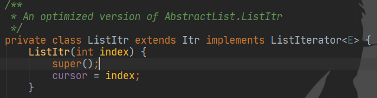

|          | 创建型模式                | 结构型模式                                  | 行为型模式                                               |
| -------- | ------------------------- | :------------------------------------------ | -------------------------------------------------------- |
| 类模式   | 工厂方法                  | (类）适配器                                 | 模板方法、解释器                                         |
| 对象模式 | 单例 原型 抽象工厂 建造者 | 代理 (对象）适配器 桥接 装饰 外观 享元 组合 | 策略 命令 职责链 状态 观察者 中介者 迭代器 访问者 备忘录 |

# 工厂设计模式：


## 简单工厂/静态工厂

**根据传入的参数，动态决定应该创建哪一个产品子类**（这些产品子类继承自同一个父类或接口）的实例，并**以父类形式返回**


优点：客户端不负责对象的创建，而是由专门的工厂类完成；客户端只负责对象的调用，实现了**创建和调用分离**，降低了客户端代码的难度；
缺点：工厂类需要知道产品类的具体实现细节 ,并决定何时实例化产品类 .如果**增加和减少产品子类，需要修改简单工厂类**，违背了开闭原则；如果产品子类过多，会导致工厂类非常的庞大，违反了高内聚原则，不利于后期维护


简单工厂用来生产**同一等级结构**中的任意产品。（**不支持增加**产品）

只有伦敦工厂，并且这个工厂只生产三种类型的pizza：chesse,pepper,greak（固定产品）。


## 工厂方法

定义一个用于创建产品的接口，由子类决定生产什么产品	使类的实例化延迟到其子类

把必须要有的方法定义在工厂接口中


Collection接口	继承迭代器

```
public interface Collection<E> extends Iterable<E> {
```

有iterator()方法生产迭代器对象

在实现类ArrayList中 ,生产出适合ArrayList的具体产品ITr




工厂方法 ：用来生产同一等级结构中的固定产品。（支持拓展增加产品）

现在不光有伦敦工厂，还增设了纽约工厂（仍然是同一等级结构，但是支持了产品的拓展），这两个工厂依然只生产三种类型的pizza：chesse,pepper,greak（固定产品）。


## 抽象工厂


抽象工厂 ：用来生产不同产品族的全部产品。（支持拓展增加产品；支持增加产品族）  

不光增设了纽约工厂（仍然是同一等级结构，但是支持了产品的拓展），这两个工厂还增加了一种新的类型的pizza：chinese pizza（增加产品族）。


# 单例模式

确保一个类只有一个实例,并且自行实例化并向整个系统提供这个实例

如序列号生成器 ,页面计数器等都可以用单例模式	创建对象需要消耗过多资源时 , 也可以用单例	减少重复创建对象 ,如io ,数据库连接

**构造方法private ,全局变量private static ,获取实例方法public static **


## 单例模式可能不只一个实例

* 分布式系统中 ,多个jvm各自有一个实例
* 一个jvm , 使用了多个类加载器同时加载这个类 ,产生多个实例


## 饿汉单例

在类**加载时创建**实例，而不是等到第一次请求实例时创建


## 懒汉单例

在类加载的时候不创建单例实例，只有在第一次请求实例时创建


通过synchronized加锁 ,防止被多次实例化


### 懒汉-双重检查锁

懒汉在第一次请求实例后创建了对象 ,就不会走singleton==null的判断了 ,也**不需要方法级别的锁**来保证它只被实例化一次

可以**缩小锁的范围** 让getInstance方法不是同步方法	

**双重检查是检查两次singleton==null ,因为没有了方法级别的锁 ,线程a在进行加锁前后 ,可能就已经被b给实例化了**

使用双重检查锁时 ,静态全局变量需要加上**volatile**

实例化分为3个步骤

* 分配内存
* 初始化对象
* 指向内存地址

虚拟机会进行优化 ,**初始化对象和指向内存地址的顺序可能会调换**

即	分配内存->指向地址	哪怕还没有进行实例化

这将导致**线程a在进行第一个singleton==null时 , true->加锁 ,再次判断singleton==null->分配内存->分配内存地址->实例化**

在线程a进行分配内存地址时 ,线程b开始进行singleton==null ,**此时singleton已经有内存地址**了 ,不为null ,直接被return


# 适配器模式
两个不兼容的接口之间的桥梁,结合了两个独立接口的功能.这种模式涉及到一个单一的类，该
类负责加入独立的或不兼容的接口功能。
属于结构型模式

# 模板方法TemplateMethod

定义一个操作中的算法骨架，而**将算法的一些步骤延迟到子类**中，使得子类可以不改变该算法结构的情况下重定义该算法的某些特定步骤。


1. 原型（Prototype）模式：将一个对象作为原型，通过对其进行复制而克隆出多个和原型类似的新实例。
2. 抽象工厂（AbstractFactory）模式：提供一个创建产品族的接口，其每个子类可以生产一系列相关的产品。
3. 建造者（Builder）模式：将一个复杂对象分解成多个相对简单的部分，然后根据不同需要分别创建它们，最后构建成该复杂对象。
4. 代理（Proxy）模式：为某对象提供一种代理以控制对该对象的访问。即客户端通过代理间接地访问该对象，从而限制、增强或修改该对象的一些特性。
5. 适配器（Adapter）模式：将一个类的接口转换成客户希望的另外一个接口，使得原本由于接口不兼容而不能一起工作的那些类能一起工作。
6. 桥接（Bridge）模式：将抽象与实现分离，使它们可以独立变化。它是用组合关系代替继承关系来实现，从而降低了抽象和实现这两个可变维度的耦合度。
7. 装饰（Decorator）模式：动态的给对象增加一些职责，即增加其额外的功能。
8. 外观（Facade）模式：为多个复杂的子系统提供一个一致的接口，使这些子系统更加容易被访问。
9. 享元（Flyweight）模式：运用共享技术来有效地支持大量细粒度对象的复用。
10. 组合（Composite）模式：将对象组合成树状层次结构，使用户对单个对象和组合对象具有一致的访问性。
11. 策略（Strategy）模式：定义了一系列算法，并将每个算法封装起来，使它们可以相互替换，且算法的改变不会影响使用算法的客户。
12. 命令（Command）模式：将一个请求封装为一个对象，使发出请求的责任和执行请求的责任分割开。
13. 职责链（Chain of Responsibility）模式：把请求从链中的一个对象传到下一个对象，直到请求被响应为止。通过这种方式去除对象之间的耦合。
14. 状态（State）模式：允许一个对象在其内部状态发生改变时改变其行为能力。
15. 观察者（Observer）模式：多个对象间存在一对多关系，当一个对象发生改变时，把这种改变通知给其他多个对象，从而影响其他对象的行为。
16. 中介者（Mediator）模式：定义一个中介对象来简化原有对象之间的交互关系，降低系统中对象间的耦合度，使原有对象之间不必相互了解。
17. 迭代器（Iterator）模式：提供一种方法来顺序访问聚合对象中的一系列数据，而不暴露聚合对象的内部表示。
18. 访问者（Visitor）模式：在不改变集合元素的前提下，为一个集合中的每个元素提供多种访问方式，即每个元素有多个访问者对象访问。
19. 备忘录（Memento）模式：在不破坏封装性的前提下，获取并保存一个对象的内部状态，以便以后恢复它。
20. 解释器（Interpreter）模式：提供如何定义语言的文法，以及对语言句子的解释方法，即解释器。


# 编程原则
## 单一职责原则：
高内聚:一个类只做它该做的事情。一个代码模块只完成一项功能，而不涉及与它无关的领域
模块化，每个功能模块是可以轻易的拿到其他系统中使用的，这样才能实现软件复用
## 开闭

软件实体应当对扩展开放，对修改关闭。要做到开闭有两个要点：

①抽象是关键，没有抽象类或接口就没有扩展点；
②封装可变性，将系统中的各种可变因素封装到一个继承结构中
## 依赖倒转

面向接口编程。（声明方法的参数类型、方法的返回类型、变量的引用类型时，尽可能使用抽象类型而不用具体类型，因为抽象类型可以被它的任何一个子类型所替代）

## 里氏替换

任何时候都可以用子类型替换掉父类型。子类一定是增加父类的能力而不是减少父类的能力

## 接口隔离

接口要小而专，绝不能大而全。（臃肿的接口是对接口的污染，既然接口表示能力，那么一个接口只应该描述一种能力，接口也应该是高度内聚的。例如，琴棋书画就应该分别设计为四个接口，而不应设计成一个接口中的四个方法，因为如果设计成一个接口中的四个方法，那么这个接口很难用，毕竟琴棋书画四样都精通的人还是少数，而如果设计成四个接口，会几项就实现几个接口，这样的话每个接口被复用的可能性是很高的。

## 合成聚合复用

优先使用聚合或合成关系复用代码。（类与类之间简单的说有三种关系，IS-A、HAS-A、USE-A，分别代表继承、关联和依赖。其中，关联关系根据其关联的强度又可以进一步划分为关联、聚合和合成，但说白了都是 HAS-A 关系

## 迪米特/最少知识原则

一个对象应当对其他对象有尽可能少的了解。（“低耦合”，门面模式和调停者模式就是对迪米特法则的践行。对于门面模式可以举一个简单的例子，你去一家公司洽谈业务，你不需要了解这个公司内部是如何运作的，你甚至可以对这个公司一无所知，去的时候只需要找到公司入口处的前台美女，告诉她们你要做什么，她们会找到合适的人跟你接洽，前台的美女就是公司这个系统的门面。再复杂的系统都可以为用户提供一个简单的门面，Java Web 开发中作为前端控制器的 Servlet 或 Filter 不就是一个门面吗，浏览器对服务器的运作方式一无所知，但是通过前端控制器就能够根据你的请求得到相应的服务。调停者模式也可以举一个简单的例子来说明，例如一台计算机，CPU、内存、硬盘、显卡、声卡各种设备需要相互配合才能很好的工作，但是如果这些东西都直接连接到一起，计算机的布线将异常复杂，在这种情况下，主板作为一个调停者的身份出现，它将各个设备连接在一起而不需要每个设备之间直接交换数据，这样就减小了系统的耦合度和复杂度。迪米特法则用通俗的话来将就是不要和陌生人打交道，如果真的需要，找一个自己的朋友，让他替你和陌生人打交道。）

