分布式系统（distributed system）是若干独立计算机的集合，这些计算机对于用户来说就像单个相关系统.是建立在网络之上的软件系统。

**发展演变**

单一应用架构

当网站流量很小时，只需一个应用，将所有功能都部署在一起，以减少部署节点和成本。此时，用于简化增删改查工作量的数据访问框架**(ORM)是关键。**

将所有功能都部署到一个功能里，简单易用。

缺点： 1、性能扩展比较难 2、协同开发问题3、不利于升级维护

垂直应用架构


|      |                                 |
| ---- | ------------------------------- |
|      |  |

当访问量逐渐增大，单一应用增加机器带来的加速度越来越小，将应用拆成互不相干的几个应用，以提升效率。此时，用于加速前端页面开发的**Web框架(MVC)是关键**。


通过切分业务来实现各个模块独立部署，降低了维护和部署的难度，团队各司其职更易管理，性能扩展也更方便，更有针对性。

缺点： 公用模块无法重复利用，开发性的浪费

**2.3，分布式服务架构**

当垂直应用越来越多，应用之间交互不可避免，将核心业务抽取出来，作为独立的服务，逐渐形成稳定的服务中心，使前端应用能更快速的响应多变的市场需求。此时，用于提高业务复用及整合的分布式服务框架(**RPC)是关键。**

**2.4，流动计算架构**

当服务越来越多，容量的评估，小服务资源的浪费等问题逐渐显现，此时需增加一个调度中心基于访问压力实时管理集群容量，提高集群利用率。此时，用于提高机器利用率的**资源调度和治理中心(SOA)[ Service Oriented Architecture]是关键。**


|      |                                 |
| ---- | ------------------------------- |
|      |  |

**RPC**	**Remote Procedure Call**


RPC是指远程调用或进程间通信的方式，他是一种技术的思想而不是规范。它允许程序调用另一个地址空间（通常是共享网络的另一台机器上）的过程或函数，而不用程序员显式编码这个远程调用的细节(之前要调用另一个进程需要手写套接字)。即程序员无论是调用本地的还是远程的函数，本质上编写的调用代码基本相同。


|      |                                 |
| ---- | ------------------------------- |
|      |  |

RPC基本原理:进程之间通过socket套接字实现通信


RPC两个核心模块：通讯，序列化。

# 简介

Apache Dubbo是一款高性能、轻量级的开源Java RPC框架，它提供了三大核心能力：面向接口的远程方法调用，智能容错和负载均衡，以及服务自动注册和发现。

 

**服务提供者（Provider）：**暴露服务的服务提供方，启动时向注册中心注册自己提供的服务。

**服务消费者（Consumer）:** 调用远程服务的服务消费方，启动时向注册中心订阅自己所需的服务，服务消费者从提供者地址列表中，基于软负载均衡算法，选一台提供者进行调用，如果调用失败，再选另一台调用。

**注册中心（Registry）：**注册中心返回服务提供者地址列表给消费者，如果有变更，注册中心将基于长连接推送变更数据给消费者

**监控中心（Monitor）：**服务消费者和提供者，定时每分钟发送统计数据到监控中心,记录在内存中累计调用次数和调用时间， 

# 安装(windows)

https://github.com/apache/dubbo-admin/tree/master

dubbo并不是一个服务软件,而是一个jar包,能够帮java程序连接zookeeper，并利用zookeeper消费、提供服务。所以你不用在Linux上启动dubbo服务

但是为了让用户更好的管理监控众多的dubbo服务，dubbo提供了一个可视化的监控程序，不过这个监控即使不装也不影响使用。

dubbo自带一个注册器,被zookeeper取代了注册的功能

 

进入dubbo-admin-master

修改 src\main\resources\application.properties 指定zookeeper地址

 

打包mvn package

运行java -jar dubbo-admin-0.0.1-SNAPSHOT.jar


# 监控中心 monitor

1.进入 dubbo-monitor-simple\src\main\resources\conf	修改 dubbo.properties文件的ip地址

2、打包dubbo-monitor-simple

mvn clean package -Dmaven.test.skip=true

3、解压 tar.gz 文件，并运行start.bat

Simple Monitor 挂掉不会影响到 Consumer 和 Provider 之间的调用，所以用于生产环境不会有风险。

Simple Monitor 采用磁盘存储统计信息，请注意安装机器的磁盘限制，如果要集群，建议用mount共享磁盘。

# 整合springboot

dubbo整合springboot三种方式

方式1：引入dubbo-starter，在application.properties配置属性，使用@Service【暴露服务】使用@Reference【引用服务】

方式2：保留xml配置文件; 导入dubbo-starter，使用@ImportResource导入dubbo的配置文件即可

方式3：使用注解API的方式， 将每一个组件手动创建到容器中,让dubbo来扫描组件

## 要点

对于provider,需要暴露服务,所以使用apache.duubo的@service ,既能注册bean,又能暴露服务

对于consumer,只需要注册bean ,使用spring的注解


provider不需要向浏览器提供服务 .无需web依赖

consumer	需要web依赖


provider和consumer**部署在不同机器,端口才允许重复**


**启动类需要加上@EnableDubbo注解**


由于provider和consumer都依赖于interface ,部分公共依赖可以写在interface中

## 服务提供者

服务者只需要勾选devTools和spring Configuration就行,由于依赖interface项目所以不需要lombok .

```java
<!-- https://mvnrepository.com/artifact/org.apache.dubbo/dubbo -->
        <dependency>
            <groupId>org.apache.dubbo</groupId>
            <artifactId>dubbo</artifactId>
            <version>2.7.3</version>
        </dependency>
        <dependency>
            <groupId>org.apache.dubbo</groupId>
            <artifactId>dubbo-dependencies-zookeeper</artifactId>
            <version>2.7.3</version>
            <type>pom</type>
            <exclusions>
                <exclusion>
                    <groupId>org.slf4j</groupId>
                    <artifactId>slf4j-log4j12</artifactId>
                </exclusion>
            </exclusions>
        </dependency>
```

### UserServiceImpl	(provider)


```
package com.lx.service.impl;

import domain.UserAddress;

import org.apache.dubbo.config.annotation.Service;
import service.UserService;

import java.util.ArrayList;
import java.util.List;

@Service
public class UserServiceImpl implements UserService {

    public static List<UserAddress> address = new ArrayList<UserAddress>();

    static {
        address.add(new UserAddress(1, "aa", "bb"));
        address.add(new UserAddress(2, "cc", "dd"));
    }

    @Override
    public List<UserAddress> queryAllAdress(String userId) {
        System.out.println("20880");
        return address;
    }
}
```


### **2.4，配置properties文件**

 

```
dubbo.application.name=boot-ego-user-service-provider

dubbo.registry.address=zookeeper://127.0.0.1:2181

dubbo.protocol.name=dubbo

dubbo.protocol.port=20880

\#dubbo.monitor.protocol=registry
```


### **2.5，修改启动类**

```
@EnableDubbo//开户注解的dubbo功能
@SpringBootApplication
public class BootEgoUserServiceProviderApplication {
  public static void main(String[] args) {
    SpringApplication.run(BootEgoUserServiceProviderApplication.class, args);}}
```


**3，服务消费者**

### **3.1，创建boot-ego-order-service-consumer**


### **3.3，创建OrderServiceImpl**

 

```
@Service
public class OrderServiceImpl implements OrderService {

  @Reference
  UserService userService;

  @Override
  public List<UserAddress> initOrder(String userId) {
    //1、查询用户的收货地址
    List<UserAddress> addressList = userService.getUserAddressList(userId);
    return addressList;}}
```

 

### **3.4，创建OrderController**

 

 

```
@Controller
public class OrderController {

  @Autowired
  OrderService orderService;

  @ResponseBody
  @RequestMapping("/initOrder")
  public List<UserAddress> initOrder(@RequestParam("uid")String userId) {
    return orderService.initOrder(userId);}}
```


### **3.5，修改properties**

 

```
dubbo.application.name=boot-ego-order-service-consumer

dubbo.registry.address=zookeeper://127.0.0.1:2181

dubbo.monitor.protocol=registry

server.port=8888
```

 

### **3.5，启动类配置**

 

```
@SpringBootApplication
@EnableDubbo //启动dubbo

public class BootEgoOrderServiceConsumerApplication {

  public static void main(String[] args) {
    SpringApplication.run(BootEgoOrderServiceConsumerApplication.class, args);
  }
}
```


# 超时处理

 

## 提供者超时

可以精确到某个接口中的方法

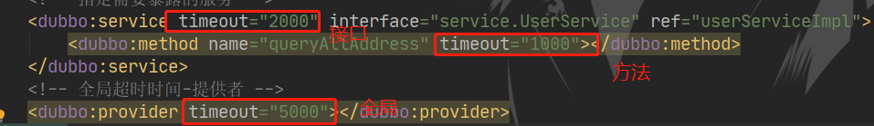

 消费者超时

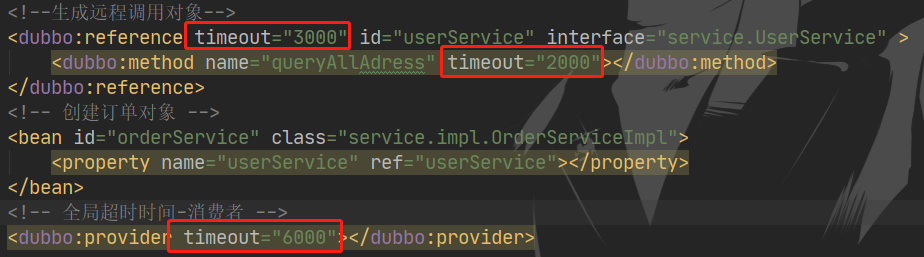

## 配置优先级  

有三个位置用于配置

​	方法>接口>全局	同级别的配置下**消费者的配置优先**

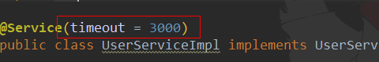


在@service/@Reference注解中指定超时时间 ,等价于接口配置

 若**超时 ,则会重新发两次请求** ,依然超时则终止

一般***只在提供者进行配置*** ,提供者更清楚服务的状态

 

# 启动检查&重试次数

  

* 消费者项目启动时 ,默认会检查提供者是否已注册 ,如果没有项目将启动失败

可以在方法/全局上配置启动不检查	check默认为true

@Reference(timeout = 3000, check = false)

* 配置的次数为重试的次数 ,总次数=重试+1

<dubbo:provider timeout="6000" ***retries="3"***></dubbo:provider>


**对于写入/修改操作	重试会引起重复提交的问题 ,应将重试调为0**


* ==幂等操作==	多次请求对数据没有影响		**修改是幂等**,重复修改最终的结果是一致的	**删除也是幂等**

* 非幂等操作	**只有添加是非幂等操作**

# 灰度发布

当新接口发布，出现不兼容时，可以用版本号过渡，**版本号不同的服务相互间不引用**。

之后进行**版本迁移**：

在低压力时间段，先**升级一半provider**为新版本	再将**所有consumer**升级为新版本

然后将剩下的一半提供者升级为新版本


provider

```
 <!--声明要暴露的实现类的对象-->
    <bean id="userServiceImpl" class="service.impl.UserServiceImpl" ></bean>
    <!-- 指定需要暴露的服务 -->
    <dubbo:service timeout="2000" interface="service.UserService" ref="userServiceImpl" **version="1.0.0"**>
        <dubbo:method name="queryAllAddress" timeout="1000"></dubbo:method>
    </dubbo:service>

<!--声明要暴露的实现类的对象-->
    <bean id="userServiceImpl2" class="service.impl.UserServiceImpl2"></bean>
    <!-- 指定需要暴露的服务 -->
    <dubbo:service timeout="2000" interface="service.UserService" ref="userServiceImpl**2**" **version="1.0.1"**>
        <dubbo:method name="queryAllAddress" timeout="1000"></dubbo:method>
    </dubbo:service>

//在指定版本号之后 ,consumer必须指定版本号才能够正常调用
 <!--生成远程调用对象-->
<dubbo:reference timeout="3000" id="userService" interface="service.UserService" version="1.0.0" >
        <dubbo:method name="queryAllAddress" timeout="2000"></dubbo:method>
</dubbo:reference>
```


版本号**支持正则匹配** ,可以实现负载均衡


# 本地存根Stub

客户端通常只剩下接口，而实现全在服务器端，但**提供方有些时候想在客户端也执行部分逻辑**，比如：做 ThreadLocal 缓存，提前验证参数，调用失败后伪造容错数据等等，此时就需要在 API 中带上Stub，客户端生成 Proxy 实例，会把 Proxy 通过构造函数传给 Stub，然后把 Stub 暴露给用户，Stub 可以决定要不要去调 Proxy。

本地存根相当于在调用服务时 ,在调用之前或之后再执行一段逻辑 ,类似于切面


<!--生成远程调用对象-->
    <dubbo:reference check="false" timeout="3000" id="userService" interface="service.UserService" version="1.0.0" **stub="service.impl.StubUserServiceImpl"** >
        <dubbo:method name="queryAllAddress" timeout="2000"></dubbo:method>
    </dubbo:reference>

 

```
//存根类必须实现接口
public class StubUserServiceImpl implements UserService {

    //远程的服务接口对象
    private UserService userService;
    
	//对外提供生成接口对象的构造方法
    public StubUserServiceImpl(UserService userService) {
        this.userService = userService;
    }

    public List<UserAddress> queryAllAddress(String userId) throws InterruptedException {
        try {
            System.out.println("stub被执行");
            return userService.queryAllAddress(userId);
        } catch (Exception e) {
        //通过catch可以实现提供方的接口出现错误时,也能返回默认数据
            return Arrays.asList(new UserAddress(1, "error", "error"));
        }
    }
}
```

 

 注解的配置方式

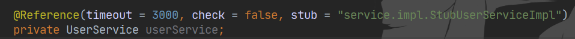

 

# zookeeper宕机

zookeeper注册中心宕机并不影响消费dubbo暴露的服务


可以看出 ,监控中心只负责同步消费者和提供者的数据

并且在provider暴露完服务 ,consumer拉取服务列表之后 ,在本地就已经有缓存了 ,之后的服务调用都是consumer与provider的直接调用 ,不需要经过zookeeper


* 数据中心宕掉后,通过仍能够通过**注册中心缓存**提供服务列表查询,但**不能注册新服务**

* zookeeper注册中心集群，任意一台宕掉后，将自动切换到另一台

* 注册中心全部宕掉后，服务提供者和服务消费者仍能通过**本地缓存**通讯

* 提供者无状态，任意一台宕掉，不影响使用

* 提供者全部宕掉后，服务消费者应用将无法使用，并无限次重连等待服务提供者恢复

**减少系统不能提供服务的时间**

​	即使zookeeper宕机,也不会造成严重的损失 ,实现高可用


# dubbo直连(绕过注册直接消费服务)

zookeeper宕机之后 ,由于消费者有本地缓存 ,依然可以正常消费服务 ,但是提供者无法注册新的服务

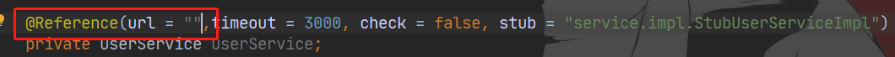

在消费者指定服务提供者的ip与端口


# 负载均衡LoadBalance

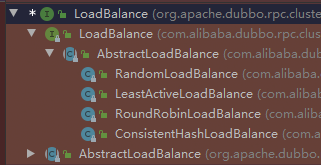

Random LoadBalance	基于权重的随机调用	**默认**

RoundRobin LoadBalance	基于权重的**轮循**调用	权重大的被轮循到的次数多

LeastActive LoadBalance	基于活跃数的调用	根据调用前后计数差,得到"延迟数" ,慢的提供者收到更少请求

ConsistentHash LoadBalance	基于一致hash的调用	相同参数的请求总是发到同一提供者(nginx)

​	缺省只对第一个参数Hash <dubbo:parameter key="hash.arguments" **value="0,1**" />可以修改value的值

```
@Service(weight = 100, loadbalance = "roundrobin")	//provider设置权重与负载均衡
```

# 服务降级

**当服务器压力剧增的情况下，根据实际业务情况及流量，对一些服务和页面有策略的不处理或换种简单的方式处理，从而释放服务器资源以保证核心交易正常运作或高效运作。**


## consumer禁用与容错

把consumer禁用之后 ,consumer发起的请求会被直接返回null ,并不会报错	但这并**不影响本地存根的执行**


consumer允许容错	在provider的响应时间过长 ,将直接返回null ,并不会报错	能够减轻服务器的压力


## 集群容错

**Failover Cluster**	**缺省**

失败自动切换。通常用于读操作，因为重试会带来延迟

**Failfast Cluster**

快速失败，只发起一次调用，失败立即报错。通常用于**非幂等性写操作**

**Failsafe Cluster**

失败安全，出现异常时，直接忽略。通常用于写入审计日志等操作。

**Failback Cluster**

失败自动恢复，后台记录失败请求，定时重发。通常用于消息通知操作。

**Forking Cluster**

**并行调用多个服务器**，只要一个成功即返回。通常用于**实时性要求较高的读操作**，但需要浪费更多服务资源。可通过 forks="2" 来设置最大并行数。

**Broadcast Cluster**

广播调用所有提供者，逐个调用，任意一台报错则报错 [2]。通常用于通知所有提供者更新缓存或日志等本地资源信息。


**集群模式配置**

@Reference(timeout = 3000, **cluster = "failover", retries = 0**, stub = "com.lx.service.impl.StubUserServiceImpl")
    private UserService userService;

或

provider	<dubbo:service cluster="failsafe" />
consumer	<dubbo:reference cluster="failsafe" />


# Hystrix服务熔断

**回退机制**和**断路器功能**的线程和信号隔离，请求缓存和请求打包，以及监控和配置等功能


当提供者挂掉时 ,Hystrix可以提供默认调用的方法 ,当一段时间内提供者一直宕机 ,将引发服务熔断 ,不再向提供者请求服务 ,而直接调用默认方法


```
双方的启动类加上	@EnableHystrix**    //启用hystrix
消费者启动类加上	@EnableCircuitBreaker	//启用hystrix的熔断保护
```


* 消费者加入依赖

```
		<dependency>
			<groupId>org.springframework.cloud</groupId>
			<artifactId>spring-cloud-starter-netflix-hystrix</artifactId>
			<version>2.2.4.RELEASE</version>
		</dependency>
```

 

* 定义具有服务熔断效果的Controller基类

@DefaultProperties	声明服务熔断后调用fallback()方法

fallbackMethod方法如果有参数 ,需要保持参数一致

```
@DefaultProperties(defaultFallback = "fallback")
public class BaseController {
    public AjaxResult fallback() {
        return AjaxResult.fail("服务器内部异常，请联系管理员");  }}
```


* 消费者Controller上 

  调用方法将经过Hystrix代理 ,当提供者出现问题/提供者不存在时 ,将调用fallback()方法

```
@HystrixCommand
```


**Hystrix类似本地存根** ,都是在提供者无法正常提供服务时 ,返回一组默认的数据


# Rpc通信原理(远程调用Remote Procedure Call)

首先客户端需要告诉服务器，需要调用的函数，这里**函数和进程号存在映射**，客户端远程调用时，需要查一下函数，找到对应的ID，然后执行函数的代码。

客户端需要把本地参数传给远程函数，**参数不在同一个内存里**，需要客户端把参数**序列化** ,转换成字节流传给服务端，然后服务端反序列化 ,将字节流转换成自身能读取的格式


**RPC同步**调用流程： 

**1）服务消费方（client）调用以本地调用方式调用服务；*

2）client stub接收到调用后负责将方法、参数等组装成能够进行网络传输的消息体； 

3）client stub找到服务地址，并将消息发送到服务端； 

4）server stub收到消息后进行解码； 

5）server stub根据解码结果调用本地的服务； 

6）本地服务执行并将结果返回给server stub； 

7）server stub将返回结果打包成消息并发送至消费方； 

8）client stub接收到消息，并进行解码； 

**9）服务消费方得到最终结果。**

**dubbo将2~8封装**，这些细节对用户来说是透明的，不可见的。


# netty通信原理

## BIO	阻塞Blocking IO

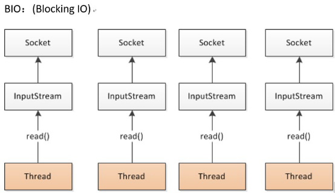

一个线程为一个流操作服务	会导致开辟过多线程


## NIO	非阻塞(多路复用)

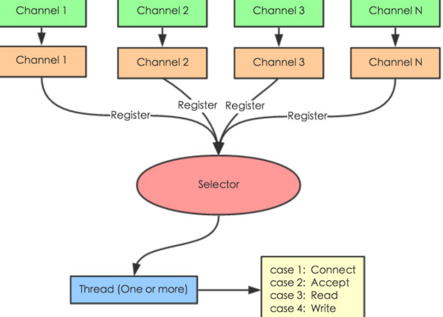

Selector 一般称 为选择器 ，也可以翻译为 多路复用器

四种状态:	Connect（连接就绪）、Accept（接受就绪）、Read（读就绪）、Write（写就绪）


# 设计原理

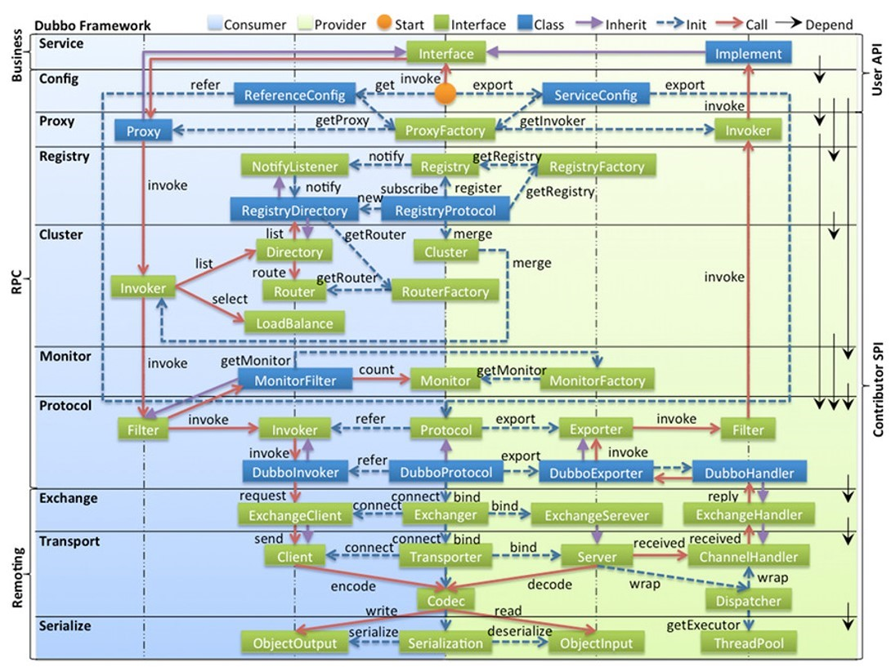

·     config 配置层：对外配置接口，以 ServiceConfig, ReferenceConfig 为中心，可以直接初始化配置类，也可以通过 spring 解析配置生成配置类

·     proxy 服务代理层：服务接口透明代理，生成服务的客户端 Stub 和服务器端 Skeleton, 以 ServiceProxy 为中心，扩展接口为 ProxyFactory

·     registry 注册中心层：封装服务地址的注册与发现，以服务 URL 为中心，扩展接口为 RegistryFactory, Registry, RegistryService

·     **cluster 路由层**：封装多个提供者的**路由及负载均衡(4种)**，并桥接注册中心，以 Invoker 为中心，扩展接口为 Cluster, Directory, Router, LoadBalance

·     monitor 监控层：RPC 调用次数和调用时间监控，以 Statistics 为中心，扩展接口为 MonitorFactory, Monitor, MonitorService

·     protocol 远程调用层：封装 RPC 调用，以 Invocation, Result 为中心，扩展接口为 Protocol, Invoker, Exporter

·     exchange 信息交换层：封装请求响应模式，同步转异步，以 Request, Response 为中心，扩展接口为 Exchanger, ExchangeChannel, ExchangeClient, ExchangeServer

·     transport 网络传输层：抽象 mina 和 netty 为统一接口，以 Message 为中心，扩展接口为 Channel, Transporter, Client, Server, Codec

·     serialize 数据序列化层：可复用的一些工具，扩展接口为 Serialization, ObjectInput, ObjectOutput, ThreadPool

## xml加载方式

BeanDefinitionParser接口	定义了怎么解析xml中bean的id


## 启动provider

DubboBeanDefinitionParser实现了BeanDefinitionParser接口


## 启动consumer


 ## 远程调用


 

 

 

# 面试

Dubbo是阿里巴巴开源的基于 Java 的高性能 **RPC 分布式服务框架**，现已成为 Apache 基金会孵化项目。

**2、为什么要用Dubbo？**

因为是阿里开源项目，国内很多互联网公司都在用，已经经过很多线上考验。内部使用了 Netty、Zookeeper，保证了高性能高可用性。

使用 Dubbo 可以将核心业务抽取出来，作为独立的服务，逐渐形成稳定的服务中心，可用于提高业务复用灵活扩展，使前端应用能更快速的响应多变的市场需求。

分布式架构可以承受更大规模的并发流量。

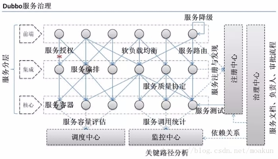 

 

**3、Dubbo 和 Spring Cloud 有什么区别？**

1）通信方式不同

Dubbo 使用的是 **RPC 通信**，而 Spring Cloud 使用的是**HTTP** RESTFul 方式。

2）组成部分不同

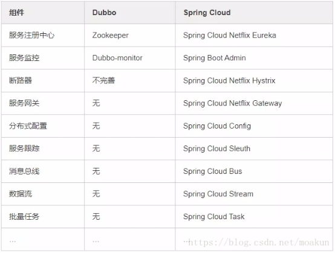 

**4、dubbo都支持什么协议，推荐用哪种？**

· dubbo://（推荐）

· rmi://

· hessian://

· http://

· webservice://

· thrift://

· memcached://

· redis://

· rest://

**5、Dubbo需要 Web 容器吗？**

不需要，直接运行jar包就行

**6、Dubbo内置了哪几种服务容器？**

· Spring Container

· Jetty Container

· Log4j Container

Dubbo 的服务容器只是一个简单的 Main 方法，并加载一个简单的 Spring 容器，用于暴露服务。

**7、Dubbo里面有哪几种节点角色？**

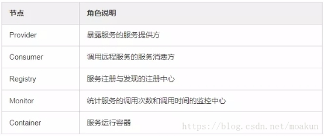 

**服务注册与发现的流程图**

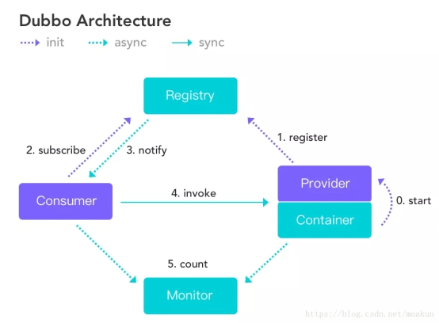 

**9、Dubbo默认使用什么注册中心，还有别的选择吗？**

推荐使用 Zookeeper 作为注册中心，还有 Redis、Multicast、Simple 注册中心，但不推荐。

**Dubbo 核心的配置**

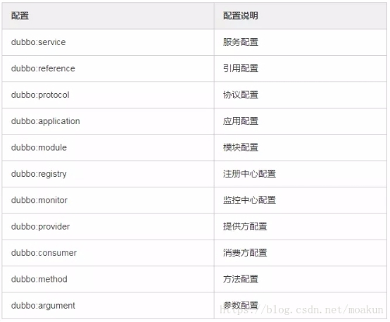 

**12、在 Provider 上可以配置的 Consumer 端的属性有哪些？**

1）timeout：方法调用超时
2）retries：失败重试次数，默认重试 2 次
3）loadbalance：负载均衡算法，默认随机
4）actives 消费者端，最大并发调用限制

**13、Dubbo启动时如果依赖的服务不可用会怎样？**

Dubbo 缺省会在启动时检查依赖的服务是否可用，不可用时会抛出异常，阻止 Spring 初始化完成，默认 check="true"，可以通过 check="false" 关闭检查。

**14、Dubbo推荐使用什么序列化框架，你知道的还有哪些？**

推荐使用Hessian序列化，还有Duddo、FastJson、Java自带序列化。

**15、Dubbo默认使用的是什么通信框架，还有别的选择吗？**

Dubbo 默认使用 Netty 框架，也是推荐的选择，另外内容还集成有Mina、Grizzly。

**集群容错方案**

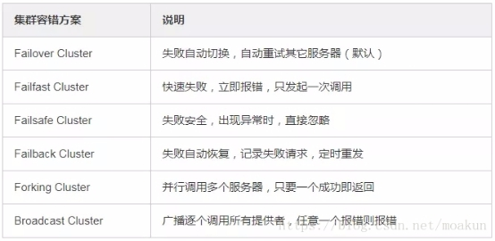 

**17、Dubbo有哪几种负载均衡策略，默认是哪种？**

 

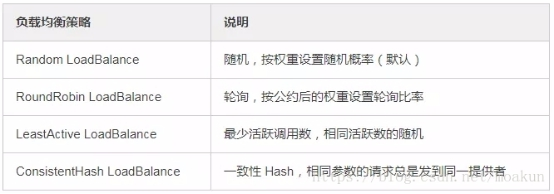 

**18、注册了多个同一样的服务，如何测试指定的某一个服务呢？**

可以配置环境点对点直连，绕过注册中心，将以服务接口为单位，忽略注册中心的提供者列表。

**19、Dubbo支持服务多协议吗？**

Dubbo 允许配置多协议，在不同服务上支持不同协议或者同一服务上同时支持多种协议。

**20、当一个服务接口有多种实现时怎么做？**

当一个接口有多种实现时，可以用 group 属性来分组，服务提供方和消费方都指定同一个 group 即可。

**21、服务上线怎么兼容旧版本？**

可以用版本号（version）过渡，多个不同版本的服务注册到注册中心，版本号不同的服务相互间不引用。这个和服务分组的概念有一点类似。

**22、Dubbo可以对结果进行缓存吗？**

可以，Dubbo 提供了声明式缓存，用于加速热门数据的访问速度，以减少用户加缓存的工作量。

**23、Dubbo服务之间的调用是阻塞的吗？**

默认是同步等待结果阻塞的，支持异步调用。

Dubbo 是基于 NIO 的非阻塞实现并行调用，客户端不需要启动多线程即可完成并行调用多个远程服务，相对多线程开销较小，异步调用会返回一个 Future 对象。

异步调用流程图如下。

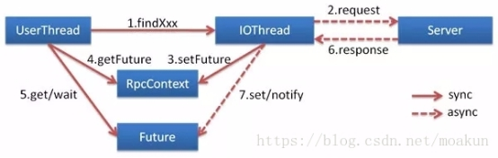 

 

**24、Dubbo支持分布式事务吗？**

目前暂时不支持，后续可能采用基于 JTA/XA 规范实现

**26、Dubbo支持服务降级吗？**

Dubbo 2.2.0 以上版本支持。

**28、服务提供者能实现失效踢出是什么原理？**

服务失效踢出基于 Zookeeper 的**临时节点**原理。

**29、如何解决服务调用链过长的问题？**

Dubbo 可以使用 Pinpoint 和 Apache Skywalking(Incubator) 实现分布式服务追踪，当然还有其他很多方案。

**30、服务读写推荐的容错策略是怎样的？**

读操作建议使用 Failover 失败自动切换，默认重试两次其他服务器。

写操作建议使用 Failfast 快速失败，发一次调用失败就立即报错。

**32、Dubbo的管理控制台能做什么？**

管理控制台主要包含：路由规则，动态配置，服务降级，访问控制，权重调整，负载均衡，等管理功能。

**33、说说 Dubbo 服务暴露的过程。**

Dubbo 会在 Spring 实例化完 bean 之后，在刷新容器最后一步发布 ContextRefreshEvent 事件的时候，通知实现了 ApplicationListener 的 ServiceBean 类进行回调 onApplicationEvent 事件方法，Dubbo 会在这个方法中调用 ServiceBean 父类 ServiceConfig 的 export 方法，而该方法真正实现了服务的（异步或者非异步）发布。

**35、Dubbo 和 Dubbox 有什么区别？**

Dubbox 是继 Dubbo 停止维护后，当当网基于 Dubbo 做的一个扩展项目，支持了HTTP Restful 调用，更新了开源组件等。

**38、在使用过程中都遇到了些什么问题？**

Dubbo 的设计目的是为了满足高并发小数据量的 rpc 调用，在大数据量下的性能表现并不好，建议使用 rmi 或 http 协议。

**40、你觉得用 Dubbo 好还是 Spring Cloud 好？**

扩展性的问题，没有好坏，只有适合不适合，不过我好像更倾向于使用 Dubbo, Spring Cloud 版本升级太快，组件更新替换太频繁，配置太繁琐，还有很多我觉得是没有 Dubbo 顺手的地方……