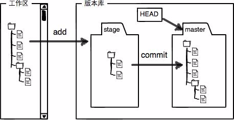
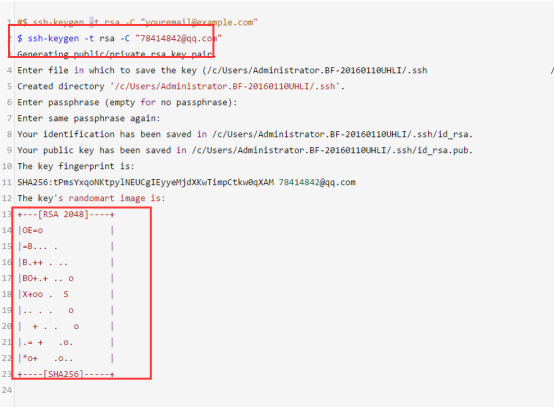
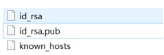
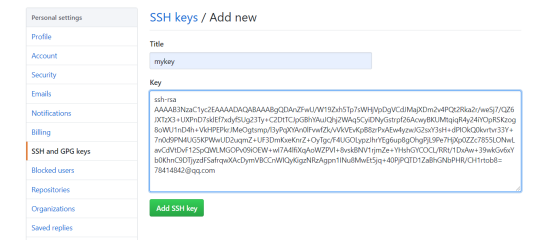

# 忽略已提交到远端仓库的文件

\# 第一步：为避免冲突需先同步远程仓库

git pull

\# 第二步：编辑.gitignore文件，添加忽略条件配置

vim .gitignore

\# 第三步：在本地项目目录下**删除缓存**

git rm -r --cached .

\# 第四步：再次add所有文件，添加到本地仓库缓存中

\# 第五步：commit，push

git diff 文件名  查看区别 没有区别就不显示

# git pull和git fetch

- .git/refs/head/[本地分支]
- .git/refs/remotes/[正在跟踪的分支]

存储了git本地仓库master分支的commit ID 和 跟踪的远程分支orign/master的commit ID

首先假设我们本地仓库的 master 分支上 commit ID =1 ，orign/master的commit ID =1 ;这时候远程仓库有人更新了master代码，commit ID =2 ,这边再提交本地仓库时

## git fetch

**本地master的commitID=1不变。远程仓库orign/master的commit ID=2**。本地相当于存储了两个代码的版本号，通过**merge**去合并，如果两个版本都修改了同一处代码，出现冲突，解决冲突后就生成了新的代码版本

**这时候本地的代码版本可能就变成了commit ID=3，即生成了一个新的代码版本**

fetch的时候本地的master没有变化，但是与远程仓关联的.git/refs/remotes/被更新了

## git pull

**使用git pull的会将.git/refs/head/和.git/refs/remotes/都更新**

git pul类似于git fetch+git merge ,但将merge自动化了 ,最后**commit ID=2**

#### **git pull把过程的细节都隐藏了起来 ,一旦代码有问题，很难找到出错的地方** ,本地仓库在未经确认的情况被更新。当然，除非你关闭所有的安全选项，否则git pull在你本地工作目录还不至于造成不可挽回的损失，但很多时候我们宁愿做的慢一些，也不愿意返工重来****

#### **将下载（fetch）和合并（merge）放到一个命令里的另外一个弊端是，你的本地工作目录在未经确认的情况下就会被远程分支更新。当然，除非你关闭所有的安全选项，否则git pull在你本地工作目录还不至于造成不可挽回的损失，但很多时候我们宁愿做的慢一些，也不愿意返工重来**

# 撤销及版本回退

git checkout 文件名 撤销

git log 文件名		查看版本号

Svn集中式,版本号为**数字**.所有人提交到同一个中央服务器,版本号由这个中央服务器统一管理.所以版本号可以为简单的阿拉伯数字

git是分布式.版本号为**字符串**.代码提交到本地版本库.在需要与其他人进行版本合并时,如果用数字版本号,就会造成冲突

 

 Git reset hard 版本号	回退

Git reset --hard HEAD^ 回退上一个版本

# 分支管理

git branch  查看分支

git branch dev创建dev分支

git branch -d dev 删除分支(先离开这个分支)

 

git checkout dev 切换分支

git checkout -b dev创建并切换

 

git merge 分支名  合并(先回到要合并的分支)

 

冲突问题？(master和dev都推进了一个版本,导致版本冲突,只有一方推进不冲突)

先合并			表示合并中

再手动解决文件中的冲突		再add	commit

# bug分支

当出现bug时,假设还在编辑一个文件.此时需要放下手头的工作去改bug

但是正在编辑的文件还不能进行提交,在未提交的状态下切换分支,其他分支上也会有这个文件

此时需要存储当前工作环境,等解决bug之后再返回工作环境

 

git stash		存储当前工作环境

git stash list	存储的所有工作环境

git stash pop		恢复工作环境

# 远程仓库

## 创建SSH Key

 在用户主目录下，看看有没有.ssh目录，如果有，再看看这个目录下有没有id_rsa和id_rsa.pub这两个文件,没有则打开Shell，创建SSH Key：

ssh-keygen -t rsa -C “1169732264@qq.com”

可以在用户主目录里找到.ssh目录，里面有id_rsa和id_rsa.pub两个文件

id_rsa是私钥，不能泄露

id_rsa.pub是公钥，可以放心地告诉任何人

 

创建shh key	**如果想要别人修改你的代码,需要配置上别人的ssh key公钥**

## 为什么配置用户ssh key而非项目ssh key？

项目的 sshkey 只针对项目，仅能拉取项目，**通常用于生产服务器拉取仓库的代码**。

用户的 key 则是针对用户的，用户添加了 key 就对用户名下的项目和用户参加了的项目具有权限，一般而言，用户的key具有推送和拉取的权限，而项目的 key 则只具有拉取权限。

## 添加远程仓库

git remote add origin 链接		关联远程仓库

git push –u origin master		推送

git clone 	clone会下载所有分支,不过本地**只会有master,其余分支需要手动关联**

git checkout -b origin/dev		创建分支并**关联远程仓库的分支**

**只在推送才需要ssh  克隆不用**

git remote –v		仓库详细信息

Fetch	拉取文件的权限	Push	推送文件的权限		clone别人仓库 ,得不到push权限

# 解决冲突

git pull --rebase origin master	合并Git和本地的库 ,本地会多出没有同步的文件

之后手动修改冲突,再add,commit

# 设置代理

git config --global http.proxy 'socks5://127.0.0.1:1080' 

git config --global https.proxy 'socks5://127.0.0.1:1080'

查看代理：

git config --global --get http.proxy

git config --global --get https.proxy

取消代理：

git config --global --unset http.proxy

git config --global --unset https.proxy

# 设置用户名

$ git config --global user.name "Your Name"

$ git config --global user.email "email@example.com"

# 免密push

git config  credential.helper store  

# 集中式VS分布式

​	集中式版本控制系统，版本库是集中存放在中央服务器的，**必须先更新最新的版本**，然后开始工作,做完后，再把自己的活推送给中央服务器。所以**必须联网才能工作**，在局域网内还好，如果在互联网上，网速慢就提交不上去

​	分布式版本控制系统根本没有“中央服务器”，每个人的电脑上都是一个完整的版本库，工作时，**不需要联网**，因为版本库就在你自己的电脑上。多人协作时只需把各自的修改推送给对方，就可以互相看到对方的修改了。

​	**分布式版本控制安全性高**，每个人电脑里都有完整的版本库。而集中式版本控制系统的中央服务器要是出了问题，所有人都没法干活了。

​    在实际使用分布式版本控制系统的时候，其实很少在两人之间的电脑上推送版本库的修改，因为可能你们俩不在一个局域网内，两台电脑互相访问不了，也可能今天你的同事病了，他的电脑压根没有开机。因此，分布式版本控制系统通常也有一台充当“中央服务器”的电脑，但这个服务器的作用仅仅是用来方便“交换”大家的修改，没有它大家也一样干活，只是交换修改不方便而已。