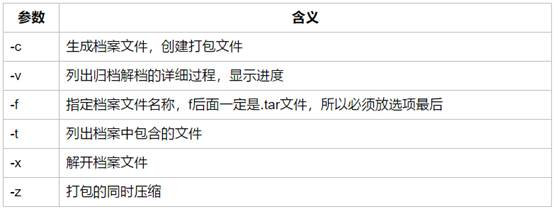
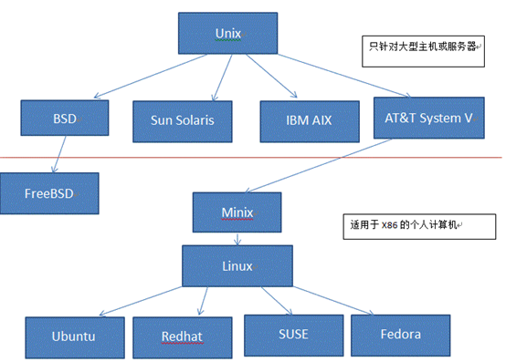

# 基本指令


## ls

* ls [options] [路径] 如果没路径  就代表显示当前所在的文件
  *  -a   显示指定目录下所有子目录与文件，包括隐藏文件    
  * -l   以列表方式显示文件的详细信息    
  * -h   配合 -l 以人性化的方式显示文件大小    
  * -d   当前目录的属性 

 

### 通配符

| **通配符** | **含义**                                                     |
| :--------- | ------------------------------------------------------------ |
| ls a.?     | 只找只有3个字符，前2字符为a.，最后一个字符任意的文件         |
| []         | [”和“]”将字符组括起来，表示可以匹配字符组中的任意一个。“-”用于表示字符范围 |
| [abc]      | 匹配a、b、c中的任意一个                                      |
| [a-f]      | 匹配从a到f范围内的的任意一个字符                             |


## cp


| 选项 | **含义**                                                     |
| ---- | :----------------------------------------------------------- |
| -a   | 该选项通常在复制目录时使用，它保留链接、文件属性，并递归地复制目录，简单而言，保持文件原有属性。 |
| -n   | 已经存在的目标文件而不提示                                   |
| -i   | 交互式复制，在覆盖目标文件之前将给出提示要求用户确认         |
| -r   | 目标文件必须为一个目录名。                                   |


## mv 移动或重命名


| **选项** | **含义**                               |
| -------- | -------------------------------------- |
| -f       | 禁止交互式操作，如有覆盖也不会给出提示 |
| -v       | 显示移动进度                           |

   

 

## ln 建立链接文件


* 软链接     ln -s 源文件 链接文件
  * 不占用磁盘空间，源文件删除则软链接失效
  * ==软链接必须用绝对路径==

* 硬链接    ln  源文件 链接文件
  * 只能链接普通文件，不能链接目录


 

## find


| **命令**                 | **含义**                              |
| ------------------------ | ------------------------------------- |
| find  -perm 777          | 查找当前目录下权限为 777 的文件或目录 |
| find -size +4k -size -5M | 查找当前目录下大于4k，小于5M的文件    |
| find  [A-Z]*             | 查找当前目录下所有以字母开头的文件    |


 

## grep


| 选项 | 含义                               |
| ---- | ---------------------------------- |
| -v   | 显示不包含匹配文本的所有行（求反） |
| -n   | 显示匹配行及行号                   |
| -i   | 忽略大小写                         |


### 正则

| **参数**     | **含义**                                                     |
| ------------ | ------------------------------------------------------------ |
| ^a           | 行首,搜寻以 a 开头的行；grep -n '^a' 1.txt                   |
| ke$          | 行尾,搜寻以 ke 结束的行；grep -n 'ke$' 1.txt                 |
| [Ss]igna[Ll] | 匹配 [] 里中一系列字符中的一个；搜寻匹配单词signal、signaL、Signal、SignaL的行；grep -n '[Ss]igna[Ll]' 1.txt |
| .            | (点)匹配一个非换行符的字符；匹配 e 和 e 之间有任意一个字符，可以匹配 eee，eae，eve，但是不匹配 ee，eaae；grep -n  'e.e' 1.txt |


 

## tar




 

==f 在最后，其余随意==


# 用户/文件管理


* 查看当前用户：whoami

* 退出登录账户： exit
  * 如果是切换后的登陆用户，退出则返回上一个登陆账号。

* 添加用户账号：useradd

| **参数** | **含义**                                                     |
| -------- | ------------------------------------------------------------ |
| -d       | 指定用户登录系统时的主目录，如果不使用该参数，系统自动在/home目录下建立与用户名同名目录为主目录 |
| -m       | 自动建立目录                                                 |
| -g       | 指定组名称                                                   |


* 设置用户密码：passwd

  

## 切换用户：su

| **命令**      | **含义**                                   |
| ------------- | ------------------------------------------ |
| su            | 切换到root用户                             |
| su root       | 切换到root用户                             |
| su -          | 切换到root用户，同时切换目录到/root        |
| su - root     | 切换到root用户，同时切换目录到/root        |
| su 普通用户   | 切换到普通用户                             |
| su - 普通用户 | 切换到普通用户，同时切换普通用户所在的目录 |

 

* 删除用户：userdel

| **命令**                | **含义**                                |
| ----------------------- | --------------------------------------- |
| userdel abc(用户名)     | 删除abc用户，但不会自动删除用户的主目录 |
| userdel -r  abc(用户名) | 删除用户，同时删除用户的主目录          |


* 查看用户组	cat /etc/group

* 修改文件所有者：chown


## 修改文件权限：chmod


| **[ u/g/o/a ]** | **含义**                                                  |
| --------------- | --------------------------------------------------------- |
| u               | user 表示该文件的所有者                                   |
| g               | group 表示与该文件的所有者属于同一组( group )者，即用户组 |
| o               | other 表示其他以外的人                                    |
| a               | all 表示这三者皆是                                        |

 

| **[ +-= ]** | **含义** |
| ----------- | -------- |
| +           | 增加权限 |
| -           | 撤销权限 |
| =           | 设定权限 |

 

| **字母** | **说明**        |
| -------- | --------------- |
| r        | 4               |
| w        | 2               |
| x        | 1               |
| -        | 0  不具任何权限 |


# 系统管理


## ps 查看进程信息


| **选项** | **含义**                                 |
| -------- | ---------------------------------------- |
| -a       | 显示终端上的所有进程，包括其他用户的进程 |
| -u       | 显示进程的详细状态                       |
| -x       | 显示没有控制终端的进程                   |
| -r       | 只显示正在运行的进程                     |

 

## top

加上-d 来指定显示信息更新的时间间隔


| **按键** | **含义**                           |
| -------- | ---------------------------------- |
| M        | 根据内存使用量来排序               |
| P        | 根据CPU占有率来排序                |
| T        | 根据进程运行时间的长短来排序       |
| U        | 可以根据后面输入的用户名来筛选进程 |
| K        | 可以根据后面输入的PID来杀死进程。  |
| q        | 退出                               |


## 关机重启：reboot、shutdown、init

| **命令**           | **含义**                                   |
| ------------------ | ------------------------------------------ |
| reboot             | 重新启动操作系统                           |
| shutdown –r  now   | 重新启动操作系统，shutdown会给别的用户提示 |
| shutdown -h now    | 立刻关机，其中now相当于时间为0的状态       |
| shutdown -h  20:25 | 系统在今天的20:25 会关机                   |
| shutdown -h  +10   | 系统再过十分钟后自动关机                   |
| init 0             | 关机                                       |
| init 6             | 重启                                       |


## df 磁盘空间占用


| **选项** | **含义**                             |
| -------- | ------------------------------------ |
| -a       | 显示所有文件系统的磁盘使用情况       |
| -m       | 以MB为单位显示                       |
| -t       | 显示各指定文件系统的磁盘空间使用情况 |
| -T       | 显示文件系统                         |


# Vim指令


## 插入

| 命令           | 作用                     |
| -------------- | ------------------------ |
| a              | 在光标后附加文本         |
| A（shift + a） | 在本行行末附加文本  行尾 |
| i              | 在光标前插入文本         |
| I(shift+i)     | 在本行开始插入文本  行首 |
| o              | 在光标下插入新行         |
| O(shift+o)     | 在光标上插入新行         |


## 定位

| 命令     | 作用                 |
| -------- | -------------------- |
| :set nu  | 设置行号             |
| :setnonu | 取消行号             |
| gg  G    | 到第一行  到最后一行 |
| nG       | 到第n行              |
| :n       | 到第n行              |

 

| $              | 移至行尾         |
| -------------- | ---------------- |
| 0              | 移至行首         |
| h 或者方向左键 | 左移一个字符     |
| j 或者方向下键 | 下移一行         |
| k 或者方向上键 | 上移一行         |
| l 或者方向右键 | 右移一个字符     |
| **H**          | **移至屏幕上端** |
| **M**          | **移至屏幕中央** |
| **L**          | **移至屏幕下端** |


## 删除

| 命令    | 作用                                           |
| ------- | ---------------------------------------------- |
| x       | 删除光标所在处字符  nx 删除光标所在处后n个字符 |
| dd      | 删除光标所在行，ndd删除n行                     |
| :n1,n2d | 删除指定范围的行（eg  :1,3d  删除了123这三行） |
| dG      | 删除光标所在行到末尾的内容                     |
| D       | 删除从光标所在处到行尾                         |

## 复制/剪切

| 命令    | 作用                          |
| ------- | ----------------------------- |
| yy、Y   | 复制当前行                    |
| nyy、nY | 复制当前行以下n行             |
| dd      | 剪切当前行                    |
| ndd     | 剪切当前行以下n行             |
| p、P    | 粘贴在当前光标所在行下 或行上 |

 

## 替换/取消

| 命令         | 作用                                |
| ------------ | ----------------------------------- |
| r            | 取代光标所在处字符                  |
| R(shift + r) | 从光标所在处开始替换字符，按Esc结束 |
| u            | undo,取消上一步操作                 |


## 搜索/替换

| 命令              | 作用                                         |
| ----------------- | -------------------------------------------- |
| /string           | 向后搜索指定字符串  搜索时忽略大小写 :set ic |
| ?string           | 向前搜索指定字符串                           |
| :%s/old/new/g     | 全文替换指定字符串                           |
| :n1,n2s/old/new/g | 在一定范围内替换指定字符串                   |

== % 指全文，s 指开始，g 指全局替换==


# 安装


```shell
## vim网络ip配置
vim /etc/sysconfig/network-script/ifcfg-ens32			修改onboot yes
systemctl restart sshd

## 安装ssh/gcc/vim/telnet
sudo yum install sshd
service sshd start
yum -y install gcc gcc-c++ autoconf pcre pcre-devel automake
yum install telnet

## 关防火墙
systemctl stop firewalld
systemctl disable firewalld
```


## 安装docker

yum install docker

配置镜像加速

vim /etc/docker/daemon.json

{

"registry-mirrors":["http://f1361db2.m.daocloud.io"]

}


## 前缀不显示主机号

echo $PS1
[\u@\H \W]\$

其中\u代表用户，\H代表主机，\W代表目录

 export PS1='[\u@ \W]\$'


或者是修改用户主目录下的bashrc文件

在 ~/.bashrc 文件最下面增加：

export PS1='[\u@ \W]\$'


## 安装mysql

tar -xvf 

依次安装

mysql-community-common-5.7.29-1.el7.x86_64.rpm


报错error: Failed dependencies:
	mysql-community-common(x86-64) >= 5.7.9 is needed by mysql-community-libs-5.7.29-1.el7.x86_64
	mariadb-libs is obsoleted by mysql-community-libs-5.7.29-1.el7.x86_64

yum remove mysql-libs清楚之前安装的依赖


 mysql-community-libs-5.7.29-1.el7.x86_64.rpm
 mysql-community-client-5.7.29-1.el7.x86_64.rpm


解决第四个server包的安装依赖

1.确认镜像光盘已连接


2.进行光盘的挂载

mount /dev/cdrom /media/

3.rpm安装net-tools

rpm -ivh net-tools-2.0-0.25.20131004git.el7.x86_64.rpm

4.安装mysql server包

mysql-community-server-5.7.29-1.el7.x86_64.rpm


### 修改初始密码

systemctl start mysqld.service	启动mysql后自动生成mysqld.log

grep 'password' /var/log/mysqld.log		得到初始密码


mysql -u root -p


密码初始等级中等,不允许过于简单的密码

alter user 'root'@'localhost' identified by '初始密码';

设置密码等级low

set global validate_password_policy=LOW;

设置最小密码位数6

set global validate_password_length=6;

设置简易密码

ALTER USER 'root'@'localhost' IDENTIFIED BY '123456';

使密码立即生效

flush privileges;

### 允许root远程登录

GRANT ALL PRIVILEGES ON *.* TO 'root'@'%' IDENTIFIED BY '123456' WITH GRANT OPTION;

修改mysql的字符集为utf8

vi /etc/my.cnf

关闭大小写敏感

lower_case_table_names=1

添加字符配置

character-set-server=utf8

collation-server=utf8_general_ci

关闭ONLY_FULL_GROUP_BY模式(否则select字段不在group中出现会报错)

sql_mode = STRICT_TRANS_TABLES,NO_ZERO_IN_DATE,NO_ZERO_DATE,ERROR_FOR_DIVISION_BY_ZERO,NO_AUTO_CREATE_USER,NO_ENGINE_SUBSTITUTION

[client]

default-character-set=utf8

### 重启mysql

systemctl start mysqld.service


# 网络适配器


*  桥接模式：默认使用vmnet0的虚拟网卡使用当有电脑路由器的分配的IP地址，也就是使用这种模式之后虚拟器就相当于当前局域网的一个真正的电脑了

* NAT模式：使用vmnet8的虚拟网卡，就是让虚拟系统借助NAT(网络地址转换)功能，通过宿主机器所在的网络来访问公网。也就是说，使用NAT模式可以实现在虚拟系统里访问互联网。**虚拟系统的TCP/IP配置信息是由VMnet8虚拟网络的DHCP服务器提供**的，无法进行手工修改，因此虚拟系统也就无法和本局域网中的其他真实主机进行通讯。

* 仅主机模式：静态ip设置 ,虚拟机与主机单独组网，安全，其他网络无法访问


 

# 后台运行jar包

```
java -jar xxx.jar &
```

&代表在后台运行	**当前ssh窗口关闭时，程序中止运行**

 

```
nohup java -jar xxx.jar &
nohup java -jar xxx.jar >/dev/null  &  //输出重定向
```

nohup 意思是不挂断运行命令,当账户退出或终端关闭时,程序仍然运行

缺省情况下该作业的所有输出被重定向到nohup.out的文件中


jobs命令查看后台运行任务	每个作业前面都有个编号

```
jobs
```

如果想将某个作业调回前台控制，只需要 fg + 编号即可。

```
fg 23
```

查看某端口占用的线程的pid

```
netstat -nlp |grep :9181
```


# 僵尸/孤儿进程





# Linux版本

### 内核版本

又分为稳定版和开发版，两种版本是相互关联，相互循环：

·     稳定版：具有工业级强度，可以广泛地应用和部署。新的稳定版相对于较旧的只是修正一些bug或加入一些新的驱动程序。

·     开发版：由于要试验各种解决方案，所以变化很快。

内核源码网址：http://www.kernel.org 所有来自全世界的对Linux源码的修改最终都会汇总到这个网站，由Linus领导的开源社区对其进行甄别和修改最终决定是否进入到Linux主线内核源码中。

### 发行版本

Linux发行版 (也被叫做 GNU/Linux 发行版) 通常包含了包括桌面环境、办公套件、媒体播放器、数据库等应用软件。

### 服务器领域

linux免费、稳定、高效等特点在这里得到了很好的体现，但早期因为维护、运行等原因同样受到了很大的限制，但近些年来linux服务器市场得到了飞速的提升，尤其在一些高端领域尤为广泛

典型代表：

Red Hat公司的AS系列

完全开源的debian系列

suse EnterPrise 11系列等

### 嵌入式领域

·     近些年来linux在嵌入式领域的应用得到了飞速的提高

·     linux运行稳定、对网络的良好支持性、低成本，且可以根据需要进行软件裁剪，内核最小可以达到几百KB等特点，使其近些年来在嵌入式领域的应用得到非常大的提高

·     主要应用：机顶盒、数字电视、网络电话、程控交换机、手机、PDA、等都是其应用领域，得到了摩托罗拉、三星、NEC、Google等公司的大力推广


# 文件和目录


/bin: (binaries)存放系统命令的目录，所有用户都可以执行。

/sbin: (super user binaries) 保存和系统环境设置相关的命令，只有超级用户可以使用这些命令，有些命令可以允许普通用户查看。（root）

/usr/bin：存放系统命令的目录，所有用户可以执行。这些命令和系统启动无关，单用户模式下不能执行

/usr/sbin：存放根文件系统不必要的系统管理命令，超级用户可执行

/root: 存放root用户的相关文件,root用户的家目录。宿主目录 超级用户

/home：用户缺省宿主目录eg:/home/spark/home/pengpeng

/tmp：(temporary)存放临时文件

/etc：(etcetera)系统配置文件

/usr：（unix software resource）系统软件共享资源目录，存放所有命令、库、手册页等

/proc：虚拟文件系统，数据保存在内存中，存放当前进程信息

/boot：系统启动目录

/dev：(devices)存放设备文件

/sys :虚拟文件系统，数据保存在内存中，主要保存于内存相关信息

/lib：存放系统程序运行所需的共享库

/lost+found：存放一些系统出错的检查结果。

/var：(variable)动态数据保存位置，包含经常发生变动的文件，如邮件、日志文件、计划任务等

/mnt：(mount)挂载目录。临时文件系统的安装点，默认挂载光驱和软驱的目录

/media:挂载目录。 挂载媒体设备，如软盘和光盘

/misc:挂载目录。 挂载NFS服务

/opt: 第三方安装的软件保存位置。 习惯放在/usr/local/目录下

/srv : 服务数据目录

## 文件权限

文件权限就是文件的访问控制权限，即哪些用户和组群可以访问文件以及可以执行什么样的操作。

Unix/Linux系统是一个典型的多用户系统，不同的用户处于不同的地位，对文件和目录有不同的访问权限。为了保护系统的安全性，Unix/Linux系统除了对用户权限作了严格的界定外，还在用户身份认证、访问控制、传输安全、文件读写权限等方面作了周密的控制。

在 Unix/Linux中的每一个文件或目录都包含有访问权限，这些访问权限决定了谁能访问和如何访问这些文件和目录。

### 访问权限

用户能够控制一个给定的文件或目录的访问程度，一个文件或目录可能有读、写及执行权限：

* 读权限（r） 对文件而言，具有读取文件内容的权限；对目录来说，具有浏览目录的权限。

* 写权限（w） 对文件而言，具有新增、修改文件内容的权限；对目录来说，具有删除、移动目录内文件的权限。

* 可执行权限（x） 对文件而言，具有执行文件的权限；对目录了来说该用户具有进入目录的权限。


