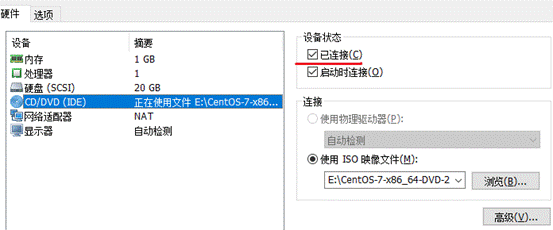
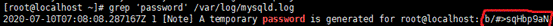

## vim网络ip配置

vim /etc/sysconfig/network-script/ifcfg-ens32

 

修改onboot yes

## 刷新网络配置

systemctl restart sshd

## 安装并开启ssh

sudo yum install sshd

service sshd start

## 查看IP地址,连接winscp

ipaddr

## 安装gcc与vim

yum -y install gcc gcc-c++ autoconf pcre pcre-devel automake

gcc --version

## 安装telnet

yum install telnet

## 前缀不显示主机号

echo $PS1
[\u@\H \W]\$

其中\u代表用户，\H代表主机，\W代表目录

 export PS1='[\u@ \W]\$'

 

或者是修改用户主目录下的bashrc文件

在 ~/.bashrc 文件最下面增加：

export PS1='[\u@ \W]\$'

# 安装mysql

tar -xvf 

依次安装

mysql-community-common-5.7.29-1.el7.x86_64.rpm

报错error: Failed dependencies:
	mysql-community-common(x86-64) >= 5.7.9 is needed by mysql-community-libs-5.7.29-1.el7.x86_64
	mariadb-libs is obsoleted by mysql-community-libs-5.7.29-1.el7.x86_64

yum remove mysql-libs清楚之前安装的依赖

 mysql-community-libs-5.7.29-1.el7.x86_64.rpm
 mysql-community-client-5.7.29-1.el7.x86_64.rpm

解决第四个server包的安装依赖

1.确认镜像光盘已连接

2.进行光盘的挂载

mount /dev/cdrom /media/

3.rpm安装net-tools

rpm -ivh net-tools-2.0-0.25.20131004git.el7.x86_64.rpm

4.安装mysql server包

mysql-community-server-5.7.29-1.el7.x86_64.rpm

## 关闭并设置开机不启动防火墙

systemctl stop firewalld

systemctl disable firewalld

## 获取mysql的root用户的初始密码

systemctl start mysqld.service	启动mysql后自动生成mysqld.log

grep 'password' /var/log/mysqld.log

mysql -u root -p

## 修改初始密码

密码初始等级中等,不允许过于简单的密码

alter user 'root'@'localhost' identified by '2020root$PWD';

设置密码等级low

set global validate_password_policy=LOW;

设置最小密码位数6

set global validate_password_length=6;

设置简易密码

ALTER USER 'root'@'localhost' IDENTIFIED BY '159753';

使密码立即生效

flush privileges;

## 允许root远程登录mysql

GRANT ALL PRIVILEGES ON *.* TO 'root'@'%' IDENTIFIED BY '159753' WITH GRANT OPTION;

修改mysql的字符集为utf8

vi /etc/my.cnf

关闭大小写敏感

lower_case_table_names=1

添加字符配置

character-set-server=utf8

collation-server=utf8_general_ci

[client]

default-character-set=utf8

## 重启mysql服务

systemctl start mysqld.service

## 执行sql脚本

source /xxx.sql;

# 安装docker

配置镜像加速

vim /etc/docker/daemon.json

{

"registry-mirrors":["http://f1361db2.m.daocloud.io"]

}

 

 # 网络适配器

*  桥接模式：默认使用vmnet0的虚拟网卡使用当有电脑路由器的分配的IP地址，也就是使用这种模式之后虚拟器就相当于当前局域网的一个真正的电脑了

* NAT模式：使用vmnet8的虚拟网卡，就是让虚拟系统借助NAT(网络地址转换)功能，通过宿主机器所在的网络来访问公网。也就是说，使用NAT模式可以实现在虚拟系统里访问互联网。**虚拟系统的TCP/IP配置信息是由VMnet8虚拟网络的DHCP服务器提供**的，无法进行手工修改，因此虚拟系统也就无法和本局域网中的其他真实主机进行通讯。

* 仅主机模式：静态ip设置 ,虚拟机与主机单独组网，安全，其他网络无法访问

 

 

 

 