**Select 表**

**From 表1**

**【连接类型】Join 表2**

**On 连接条件**

**Where 筛选条件**

**Group by 分组**

**Having 分组后的筛选**

**Order by** 

**Limit** 

 

# 三级模式两层映射

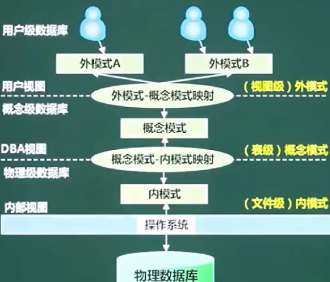

外模式(视图)	->	外模式-模式映射		模式(表)		模式-内模式映射		内模式(文件)

# 数据库设计过程

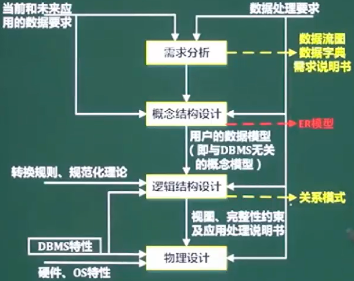

需求分析		数据流图/数据字典/需求说明书

概念结构设计	ER模型

逻辑结构设计	关系模式

# ER模型

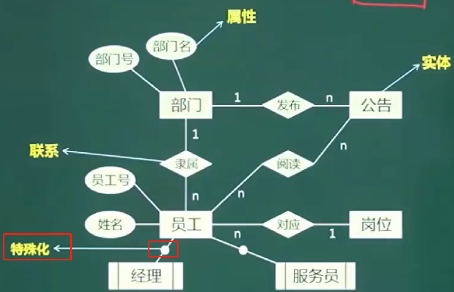

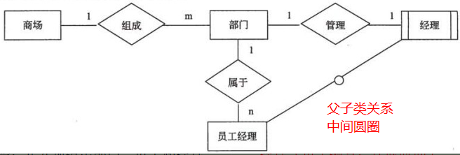

可以用D(A.主键 ,B.主键 ,C.主键)来表示ABC三个实体的关系

所以转化为ABCD 4个关系模式

# 关系代数

并

交

差		a-b ,去掉a中b有的部分

笛卡尔积

投影

选择

联接

## 自然连接

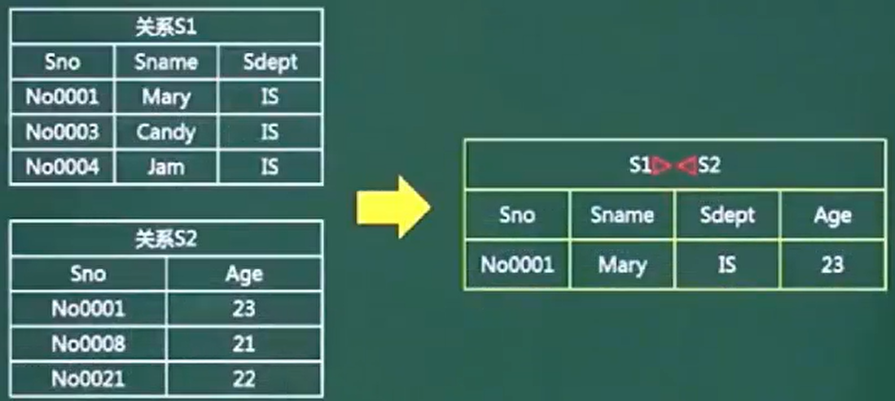

# 数据流图DFD

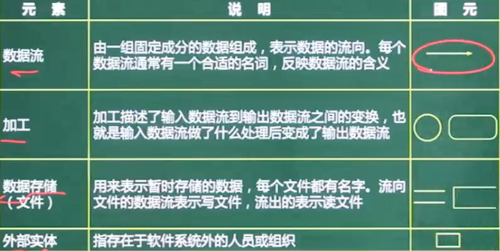

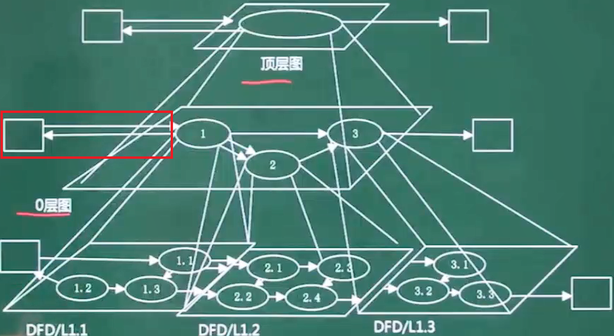

0层图 ,分解了加工			不管怎么分解 ,**外部实体和数据流不会被分解 ,也不会变**

## 数据字典

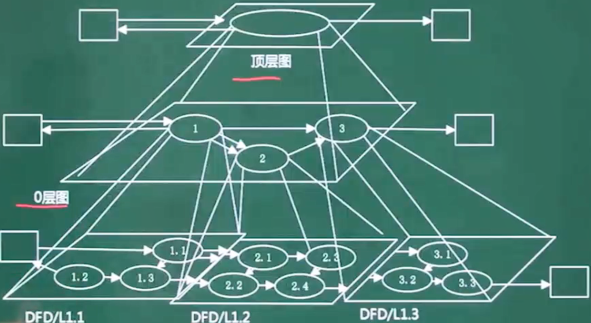

数据流图平衡原则

* 父图与子图之间的平衡    顶层图和0层图之间的加工 ,外部实体 匹配

* 子图内平衡     **输入/输出流不能单条出现在加工上**   加工前后的输入输出要匹配 ,如学生信息不能被加工为教师信息

## 弱/强实体

强实体不依赖于其他实体而存在

弱实体的主键存在外键 ,不依赖外键无法唯一标识

没主码 ,只有 部分码

在和所依附的实体集的联系中，弱实体要全部参与

# 规范化理论

部分依赖	AB->C , A->C

传递依赖	A->B ,B->C

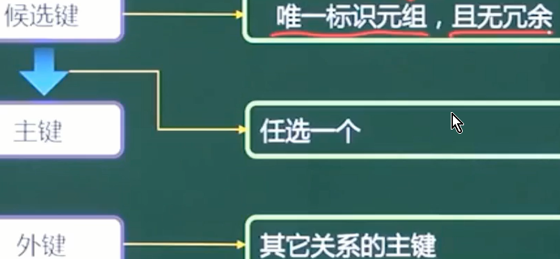

主键是其中一个候选键		学号和身份证都能唯一标识学生 ,是候选键 ,但主键只有一个

组成候选码的为**主属性**

## 范式

* 第1范式    属性不可再分

* 第2范式    消除非主属性对候选码的部分依赖
* 第3范式     消除主属性对候选码的传递依赖
* BC范式      消除主属性对候选码的部分和传递依赖

## 模式分解

 

# 常用命令

show databases;

show tables;

select database();	显示当前的库

desc 表名;				查看表的设计

**distinct				去重**

Password(“字符”)		返回字符的加密

 

**WHERE无法与聚合函数一起使用**，使用**having**来对查询结果进行筛选		having

 

# 四种外键约束

* No action：子表有匹配的记录,则不允许父表对应候选键update/delete

* Restrict：拒绝对父表的删除或更新操作

* cascade：同步update/delete子表

* set null：将子表上匹配记录的列设为null,此时子表的外键列不能为not null

  cascade和set null是容错能力比较强，并不是很严格，但可能会出导致业务上出问题，No action和Restrict是非常严格的，禁止对父表进行更新和删除，但在业务中有时我们又不得不进行对父表进行操作，而在No action和Restrict约束规则下，执行父表删或者更新时会报错：ERROR 1451

# 空值判断

ifnull(字段,空值时的缺省值)		可以设置空值时的缺省值，常用于运算

<=> 安全等于，可判断空值也可运算

Is null 只能判断空值

 

 

# 字符函数

Length											获取参数的字节个数

**Concat(字段,’拼接符’,字段)**

Concat(字段,字段) as 字段名					字符串拼接

Upper大写 	lower 

Substr(字段,截取初始位置，截取长度) 		字符串截取	

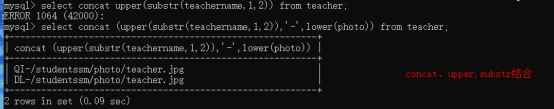 

Instr( 字段,’目标字符串’)				获取第一次出现的索引

 

## 字符串获取案例

类似于邮箱****@***的字符串，如果想要获取@之前的字符串，单靠substr并不能实现，因为substr只指定了截取初始位置和长度，而@之前的字符串字节数是不确定的，可以结合instr来获取具体要截取多少个字符

Select substr(email,1,instr(email,’@’,)-1) from 表

 

Trim(选项 ‘去掉的字符’ from 字段) from 表			字符串去头去尾

​	选项：BOTH,LEADING,TRAILING			不指定去掉的字符串则去空格

 

LPAD (‘目标’,长度,’填充字符串’)	用指定的字符串填充至长度（左）

RPAD

 

Replace(‘目标’,’被替换’,’替换’)		字符串替换

 

 

 

数学函数

Round(字段,保留几位)						四舍五入，不指定小数默认整数

 

Ceil(字段)									向上取整

Floor										向下

 

Truncate(字段,保留位数)					截断（舍弃后几位）

 

Mod(字段,被除数)							取余

 

 

## 日期函数

Now()	 		返回当前系统日期+时间

Curdate()						日期

Curtime()						时间

Monthname			以英文形式返回月

Datediff(日期1，日期2)							相差日期

 

Select year(日期)		提取日期中的年份

 

%Y			四位的年份

%y			二

%m			月份(01,02…)

%c			月份(1,2…)

%d

%H			24小时制

%h			12小时制

%l			分钟

%s			秒

Str_to_date(‘字符串’,'%Y-%c-%d’)			字符串转换日期

Date_format(‘日期’,’%y%m%d’)				日期转换字符串

 

 

 

## Case 函数

Case情况1

Case 变量/表达式/字段

When 常量1 then 值1

When 常量2 then 值2

Else 值n

End

 

Case 情况2

Case

When 条件1 then 值1

When 条件2 then 值2

Else 值n

End

## 分组函数		一般用于统计

Sum、avg 一般用于处理数值型

Max min count 可以处理任何类型（包括字符串）

以上分组函数都忽略null值

 

Count(1)	count(*)	结果相等，效率相同，运算方法不同

count（1）是在原本的表上多加了一行，其值全为1，然后统计1的个数

count（*）是直接统计表中有几行

 

select 数值1 数值2 difference					两数之差

## 连接查询

​	内连接 inner					交集

左外连接 left 【outer】		左表不匹配字段保留

右

全		full					两张表不匹配都保留

交叉	cross				笛卡尔乘积表

## 子查询

Any/some		与某一个值进行比较

All					所有值

 

Exists		判断是否存在，返回boolean

一般能用exists的都能用in来实现相同的功能

## 分页查询

Limit offset，size			mysql offset的起始位置从0开始

 

对于第一页，起始位置0，第二页起始位置size，第三页size*2…….

Limit (page-1)*size,size;			实现分页

 

Order by + 分页获取最大值最小值数据

Order by 排序，第一个数值为最大/最小值，

Limit 1		获取第一个数值

 

## Union	联合查询

​					Where and  是将查询条件联合		union是将语句联合

 

# 视图

视图方便查询,不能插入修改删除		Vo适合插入修改删除

业务只需要查询时,用视图方便

 

MySQL视图是一个虚拟表,并不存在于数据库,数据在引用视图时动态生成,但是可以创建它的逆向工程

视图提高安全性:

* 只针对一张表建立视图,可以做到筛选字段进行展示

*  针对不同用户，设定不同的视图,能查询到不同的信息

# 事务

在MySQL中只有使用了**Innodb引擎**才支持事务。

* 事务处理可以用来维护数据库的完整性，保证成批的SQL语句要么全部执行，要么全部不执行。

## 事务必须满足4个条件（ACID）。

* A 原子性：事务中的操作，要么全部完成，要么全部不完成，不会结束在中间某个环节。事务在执行过程中发生错误，会被**回滚**到事务开始前的状态，就像这个事务从来没有执行过一样。

* C一致性：在事务开始之前和事务结束以后，数据库的**完整性**没有被破坏。这表示写入的资料必须完全符合所有的预设规则，这包含资料的精确度、串联性以及后续数据库可以自发性地完成预定的工作。

* 隔离性：数据库允许多个**并发**事务同时对数据进行操作，隔离性可以防止多个事务并发执行时由于交叉执行而导致数据的不一致。

* D持久性：事务处理结束后，对数据的**修改是永久**的，即便系统故障也不会丢失。

## 隔离4个级别

读未提交、读提交、可重复读和串行化。

* 读未提交（Read Uncommitted）	可以读到未提交的内容。**查询不加锁**的，一致性最差的，可能会产生“脏读”、“不可重复读”、“幻读”。

* 读提交（Read Committed）	只能读到已经提交了的内容。**SQL Server Oracle 默认**

**最常用**的一种隔离级别，能够有效的**避免脏读**，但除非在查询中显示的加锁，如：

select * from T where ID=2 lock in share mode;

select * from T where ID=2 for update;

不然，普通的查询是不会加锁的。

那为什么“读提交”同“读未提交”一样，**都没有查询加锁，但是却能够避免脏读**呢？

这就要说道另一个机制“***快照*** ,这种既能保证一致性又不加锁的读也被称为“快照读”可以完成高并发的查询，不过，“读提交”只能避免“脏读”，并不能避免“不可重复读”和“幻读”。

* 可重复读(Repeated Read)	MySql的默认隔离级别。
  在这个级别下，**普通的查询同样是“快照读”**，但是，和“读提交”不同的是，**事务启动时，不允许进行修改**，而“不可重复读”恰恰是因为两次读取之间进行了数据的修改，**避免“不可重复读”**，但却避免不了“幻读”，因为幻读是Insert or Delete而产生的。

* 串行化（Serializable）	基本不用

最高的隔离级别，这种级别下，事务“串行化顺序执行”，也就是一个一个排队执行。

这种级别下，“脏读”、“不可重复读”、“幻读”都可以被避免，但是执行效率奇差，性能开销也最大，所以基本没人会用。

## 总结

为什么会出现“脏读”？因为没有“select”操作没有规矩。

为什么会出现“不可重复读”？因为“update”操作没有规矩。

为什么会出现“幻读”？因为“insert”和“delete”操作没有规矩。

 

“读未提（Read Uncommitted）”能预防啥？啥都预防不了。

“读提交（Read Committed）”能预防啥？使用“快照读（Snapshot Read）”，避免“脏读”，但是可能出现“不可重复读”和“幻读”。

“可重复读（Repeated Red）”能预防啥？使用“快照读（Snapshot Read）”，锁住被读取记录，避免出现“脏读”、“不可重复读”，但是可能出现“幻读”。

“串行化（Serializable）”能预防啥？有效避免“脏读”、“不可重复读”、“幻读”，不过效率低

## 事务处理2种方法

1、用 BEGIN, ROLLBACK, COMMIT来实现

BEGIN 开始

ROLLBACK 回滚

COMMIT 确认

2、直接用 SET 来改变 MySQL 的自动提交模式:

SET AUTOCOMMIT=0 禁止自动提交

SET AUTOCOMMIT=1 开启自动提交

# 索引

​	索引虽然能非常高效的提高查询速度，同时却会降低更新表的速度。实际上索引也是一张表，该表保存了主键与索引字段，并指向实体表的记录，所以索引列也是要占用空间的。

* 普通索引：仅加速查询

* 唯一索引：加速查询 + 列值唯一（可以有null）

* 主键索引：加速查询 + 列值唯一（不可以有null）+ 表中只有一个

* 组合索引：多列值组成一个索引，专门用于组合搜索，其效率大于索引合并

* 全文索引：对文本的内容进行分词，进行搜索

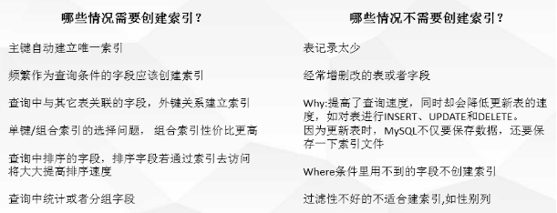

## 经常重复值的字段不能索引

数据库中聚集索引只有一个，默认主键。其他用户创建的索引都是非聚集索引。

非聚集索引存储了对主键的引用，即通过索引确定叶子节点之后，还需要再次根据主键去查询数据。（所以会查询两次）

如果非聚集索引重复率高（即一个同样的值有多个主键），那么首先你会从索引中取一半主键值，然后根据主键值再去查询数据，增加了IO，所以特别耗时。

# 引擎

* MyISAM

使用这个存储引擎，每个MyISAM在磁盘上存储成三个文件。

（1）frm文件：存储表的定义数据

（2）MYD文件：存放表具体记录的数据

（3）MYI文件：存储索引

支持数据的类型也有三种：

（1）静态固定长度表

这种方式的优点在于存储速度非常快，容易发生缓存，而且表发生损坏后也容易修复。缺点是占空间。这也是默认的存储格式。

（2）动态可变长表

优点是节省空间，但是一旦出错恢复起来比较麻烦。

（3）压缩表

支持数据压缩，说明肯定也支持这个格式。在数据文件发生错误时候，可以使用check table工具来检查，而且还可以使用repair table工具来恢复。

不支持事务，但是这也意味着他的存储速度更快，如果你的读写操作允许有错误数据的话，只是追求速度，可以选择这个存储引擎。

 

* InnoDB

InnoDB是默认的数据库存储引擎，他的主要特点有：

（1）可以通过自动增长列，方法是auto_increment。

（2）支持事务。默认的事务隔离级别为可重复读，通过MVCC（并发版本控制）来实现的。

（3）使用的锁粒度为行级锁，可以支持更高的并发；

（4）支持外键约束；外键约束其实降低了表的查询速度，但是增加了表之间的耦合度。

（5）配合一些热备工具可以支持在线热备份；

（6）在InnoDB中存在着缓冲管理，通过缓冲池，将索引和数据全部缓存起来，加快查询的速度；

（7）对于InnoDB类型的表，其数据的物理组织形式是聚簇表。所有的数据按照主键来组织。数据和索引放在一块，都位于B+数的叶子节点上；

 

当然InnoDB的存储表和索引也有下面两种形式：

（1）使用共享表空间存储：所有的表和索引存放在同一个表空间中。

（2）使用多表空间存储：表结构放在frm文件，数据和索引放在IBD文件中。分区表的话，每个分区对应单独的IBD文件，分区表的定义可以查看我的其他文章。使用分区表的好处在于提升查询效率。

对于InnoDB来说，最大的特点在于支持事务。但是这是以损失效率来换取的。

 

* Memory

将数据存在内存，为了提高数据的访问速度，每一个表实际上和一个磁盘文件关联。文件是frm。

（1）支持的数据类型有限制，比如：不支持TEXT和BLOB类型，对于字符串类型的数据，只支持固定长度的行，VARCHAR会被自动存储为CHAR类型；

（2）支持的锁粒度为表级锁。所以，在访问量比较大时，表级锁会成为MEMORY存储引擎的瓶颈；

（3）由于数据是存放在内存中，一旦服务器出现故障，数据都会丢失；

（4）查询的时候，如果有用到临时表，而且临时表中有BLOB，TEXT类型的字段，那么这个临时表就会转化为MyISAM类型的表，性能会急剧降低；

（5）默认使用hash索引。

（6）如果一个内部表很大，会转化为磁盘表。

# limit分页性能

对于小的偏移量，直接使用limit没有问题，但随着数据量的增大，越往后分页，limit语句的偏移量就会越大，速度也会明显变慢。

优化思想：避免数据量大时扫描过多的记录

解决：子查询的分页方式或者JOIN分页方式。JOIN分页和子查询分页的效率基本在一个等级上，消耗的时间也基本一致。

一般MySQL的主键是自增的数字类型，这种情况下可以使用下面的方式进行优化。

* 传统limit，文件扫描

SELECT * FROM tableName ORDER BY id LIMIT 50000,2;

时间: 0.171s

* 子查询方式，索引扫描

SELECT * FROM tableName

WHERE id >= (SELECT id FROM tableName ORDER BY id LIMIT 50000 , 1)

LIMIT 2;

时间: 0.035s

* JOIN分页方式

SELECT * FROM tableName AS t1

JOIN (SELECT id FROM tableName ORDER BY id LIMIT 50000, 1) AS t2

WHERE t1.id <= t2.id ORDER BY t1.id LIMIT 2;

时间: 0.036s

* 优化原理：

子查询在索引上完成的，而普通查询在数据文件上完成。

通常来说，索引文件要比数据文件小得多，所以操作起来也会更有效率。因为要取出所有字段内容，第一种需要跨越大量数据块并取出，而第二种基本通过直接根据索引字段定位后，才取出相应内容，效率自然大大提升。因此，对limit的优化，不是直接使用limit，而是首先获取到offset的id，然后直接使用limit size来获取数据。

在实际项目使用，可以利用类似策略模式的方式去处理分页。例如，每页100条数据，判断如果是100页以内，就使用最基本的分页方式；如果大于100，则使用子查询的分页方式。

 

