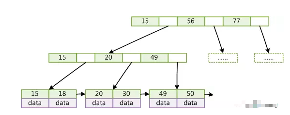

**Select 表**

**From 表1**

**【连接类型】Join 表2**

**On 连接条件**

**Where 筛选条件**

**Group by 分组**

**Having 分组后的筛选**

**Order by** 

**Limit** 

 

# SQL分类


* 查询语言DQL
  SELECT <字段名表>
  FROM <表或视图名>
  WHERE <查询条件>

* 操纵语言DML
  1) 插入：INSERT
  2) 更新：UPDATE
  3) 删除：DELETE

* 定义语言DDL
  创建数据库中的各种对象-----表、视图、索引、同义词、聚簇等
  CREATE TABLE/VIEW/INDEX/SYN/CLUSTER
  | | | | |
  表 视图 索引 同义词 簇

**DDL操作隐性提交！不能rollback **

* 控制语言DCL
  授予或回收访问数据库的某种特权，控制数据库操纵事务发生的时间及效果，对数据库监视

  * GRANT：授权。

  * ROLLBACK [WORK] TO [SAVEPOINT]：回退到某一点。
    回滚---ROLLBACK
    回滚命令使数据库状态回到上次最后提交的状态。其格式为：
    SQL>ROLLBACK;

  * COMMIT [WORK]：提交
    * 显式提交
      用COMMIT命令直接提交
    * 隐式提交
      用SQL命令间接提交
      ALTER，AUDIT，COMMENT，CONNECT，CREATE，DISCONNECT，DROP，
      EXIT，GRANT，NOAUDIT，QUIT，REVOKE，RENAME
    * 自动提交
      把AUTOCOMMIT设置为ON，则在插入、修改、删除语句执行后，系统将自动进行提交


# 数据库设计


## ER模型


可以用D(A.主键 ,B.主键 ,C.主键)来表示ABC三个实体的关系

转化为ABCD 4个关系模式


## 数据流图DFD


顶层	描述输入输出

0层	分解加工	**外部实体和数据流不会被分解 ,也不会变**


* ==保持父子图平衡==
  * 名称一致  数量相同
  * 父图的一条输入对应子图的多条输入时,保持总体平衡
  * **输入/输出流不能单条出现在加工上**
  * 加工前后的输入输出匹配,如学生信息不能被加工为教师信息


* 黑洞	只有输入
* 奇迹    只有输出


### 弱/强实体

* 强实体不依赖于其他实体而存在

* **弱实体的主键存在外键** ,不依赖外键无法唯一标识
  * 没主码,只有部分码
  * 在和所依附的实体集的联系中，弱实体要全部参与


## 规范化理论

**部分依赖	AB->C, A->C**

**传递依赖	A->B ,B->C**


* 候选码	唯一标识元组,无冗余
  * 主属性   候选码的组成者

* 主键	候选码任选一个

* 外键	其他关系的主键


### 范式

* 第1范式    属性不可再分

* 第2范式    消除非主属性对候选码的部分依赖
* 第3范式    消除主属性对候选码的传递依赖
* BC范式    消除主属性对候选码的部分和传递依赖


### 完整性约束

* 实体完整性	主键非空,唯一
* 参照完整性    外键非空,存在
* 用户自定义完整性


## 设计原则


* 尽量把数据库设计的更小的占磁盘空间
* 使用更小的整数类型.(mediumint 就比 int 更合适)
* 尽可能的定义字段为 not null
* 如果定长就用char
* 主索引尽可能的短.这样每条纪录都有名字标志且更高效
* 只创建确实需要的索引。索引利于检索，不利于保存
* **所有数据都得在保存到数据库前进行处理**


# 关系代数


并

交

差		a-b ,去掉a中b有的部分

笛卡尔积

投影

选择

联接


## 连接


* 内连接

* 等值连接
  * 表示为R(a=b)S
  * ==不去重==
  * 
  * ==自然连接==

* 表示为RS
* ==去重==,对相同名称的列形成匹配	保留公共值
* 自然连接一定是等值连接，但等值连接不一定是自然连接
* 等值连接要求相等的字段，不一定是公共字段；而自然连接必须是公共字段
* 等值连接不去重；自然连接去重


* 左连接


* 全连接	FULL OUTER JOIN


* 交叉连接/笛卡尔积	cross 
  * 返回左表中的所有行，与右表中的所有行组合


## 4种外键约束


* No action：子表有匹配的记录,则不允许父表对应候选键update/delete

* Restrict：拒绝对父表的删除或更新操作

* cascade：同步update/delete子表

* set null：将子表上匹配记录的列设为null,此时子表的外键列不能为not null

  cascade和set null是容错能力比较强，并不是很严格，但可能会出导致业务上出问题，No action和Restrict是非常严格的，禁止对父表进行更新和删除，但在业务中有时我们又不得不进行对父表进行操作，而在No action和Restrict约束规则下，执行父表删或者更新时会报错：ERROR 1451


# 指令


```mysql
show databases;
show tables;
select database();	显示当前的库
desc 表名;				查看表的设计
distinct				去重
Password(“字符”)		返回字符的加密

 
WHERE无法与聚合函数一起使用，使用 having来对查询结果进行筛选
```


 ## 设置隔离级别


```text
SET [GLOBAL|SESSION] TRANSACTION ISOLATION LEVEL level;//等级就是上面的几种

#查看数据库配置
show variables
```


## 事务启动


* 用 BEGIN, ROLLBACK, COMMIT来实现
  * BEGIN 开始
  * ROLLBACK 回滚
  * COMMIT 确认

* 用 SET 来改变 MySQL 的自动提交模式:
  * SET AUTOCOMMIT=0 禁止自动提交
  * SET AUTOCOMMIT=1 开启自动提交(长事务)    **默认**
    * 长事务会导致查询也被事务化,降低性能


# 函数


## 空值判断


ifnull(字段,空值时的缺省值)		可以设置空值时的缺省值，常用于运算

<=> 安全等于，可判断空值也可运算

Is null 只能判断空值

 

## 字符函数


```mysql
#获取参数的字节个数
Length

#字符串拼接
Concat(字段,’拼接符’,字段)
Concat(字段,字段) as 字段名

Upper大写 	lower

#字符串截取
Substr(字段,截取初始位置，截取长度)

#获取第一次出现的索引
Instr( 字段,’目标字符串’)


Trim(选项 ‘去掉的字符’ from 字段) from 表			字符串去头去尾
		-选项：BOTH,LEADING,TRAILING			不指定去掉的字符串则去空格

LPAD (‘目标’,长度,’填充字符串’)	用指定的字符串填充至长度（左）
RPAD

Replace(‘目标’,’被替换’,’替换’)		字符串替换

```

 

### 邮箱截取


如果想要获取@之前的字符串，单靠substr并不能实现，因为substr只指定了截取初始位置和长度，而@之前的字符串字节数是不确定的，可以结合instr来获取具体要截取多少个字符

Select substr(email,1,instr(email,’@’,)-1) from 表

 


## 数学函数


```mysql
Round(字段,保留几位)		四舍五入，不指定小数默认整数
Ceil(字段)							向上取整
Floor										向下
Truncate(字段,保留位数)		截断（舍弃后几位）
Mod(字段,被除数)					取余
```


 

## 日期函数

```mysql
Now()	 		返回当前系统日期+时间
Curdate()						日期
Curtime()						时间
Monthname			以英文形式返回月
Datediff(日期1，日期2)							相差日期
Select year(日期)		提取日期中的年份
%Y			四位的年份
%y			
%m			月份(01,02…)
%c			月份(1,2…)
%d
%H			24小时制
%h			12小时制
%l			分钟
%s			秒
Str_to_date(‘字符串’,'%Y-%c-%d’)			字符串转换日期
Date_format(‘日期’,’%y%m%d’)				日期转换字符串
```


## Case 函数


```mysql
Case情况1
Case 变量/表达式/字段
When 常量1 then 值1
When 常量2 then 值2
Else 值n
End

Case 情况2
Case
When 条件1 then 值1
When 条件2 then 值2
Else 值n
End
```


## 分组函数

Sum、avg 一般用于处理数值型

Max min count 可以处理任何类型（包括字符串）

以上分组函数都忽略null值

 

Count(1)	count(*)	结果相等，效率相同，运算方法不同

count（1）是在原本的表上多加了一行，其值全为1，然后统计1的个数

count（*）是直接统计表中有几行

 

select 数值1 数值2 difference					两数之差


## 子查询

Any/some		与某一个值进行比较

All					所有值

 

Exists		判断是否存在，返回boolean

一般能用exists的都能用in来实现相同的功能


## 分页查询


```mysql
Limit offset，size			mysql offset的起始位置从0开始
对于第一页，起始位置0，第二页起始位置size，第三页size*2…….

Limit (page-1)*size,size;			实现分页

Order by + 分页获取最大值最小值数据
Order by 排序，第一个数值为最大/最小值，
Limit 1		获取第一个数值
```


```sql
#Oracle：通过 rownum 来实现
select * from ( select rownum rn,t.* from addressbook where rownum<=
20 ) where rownum > 10

Sqlserver:
select top 20 * from addressbook where id not in (select top 10 id from
addressbook)
```


## Union	联合查询


Where and  是将查询条件联合		union是将语句联合

 


## 自定义函数


sql自定义函数

```mysql
Create function 函数名（参数）
Returns 返回值类型
[with {Encryption | Schemabinding }]
[as]
begin
SQL语句(必须有return 变量或值)
End
```


* [with]为附加选项
  * 需要对函数体进行加密，用WITH ENCRYPTION；
  * 需要将创建的函数与引用的数据库绑定，用WITH SCHEMABINDING（**函数一旦绑定，则不能删除、修改，除非删除绑定**）


* DECLARE  在复合语句 (BEGIN...END) 中声明 SQL 变量或异常


# 视图


视图方便查询,不能插入修改删除		Vo适合插入修改删除

业务只需要查询时,用视图方便

 

MySQL视图是一个虚拟表,并不存在于数据库,数据在引用视图时动态生成,但是可以创建它的逆向工程

视图提高安全性:

* 只针对一张表建立视图,可以做到筛选字段进行展示

*  针对不同用户，设定不同的视图,能查询到不同的信息


# 事务


不要在一次事务中使用多种存储引擎!MySQL服务器层不管理事务，由下层的存储引擎实现

如果在事务中混合使用了事务/非事务的表,在需要回滚时，非事务型表无法撤销，导致数据不一致


## ACID


* A 原子性：要么全完成，要么全不完成。发生错误就回滚

* C 一致性：事务前后，数据**完整性**没被破坏

* I 隔离性：**允许并发事务**，防止交叉执行而导致数据不一致

* D 持久性：事务提交后，对数据的**修改是永久**的，即便系统故障也不会丢失


## 4个隔离级别


* 脏读	     select

* 不可重复读	update

* 幻读	    insert/delete


* 读未提交      脏读、不可重复读、幻读
* 可以读到未提交的内容。一致性最差
* 读提交  **SQLServer/Oracle默认**     不可重复读、幻读
* 只能读已经提交的内容
  * 通过快照,使得无锁查询，也能==避免脏读==
* 可重复读	MySql默认             幻读
  * 快照查询
  * **事务启动时不允许修改**,==避免“不可重复读”==
* 串行化

  * 最高的隔离级别，事务排队执行
  * 避免“脏读”、“不可重复读”、“幻读”，效率低


* S/X封锁协议

  * S封锁(共享锁)
  * X封锁(排他锁)


## 分布式事务 XA


(全局)事务管理器(TM: Transaction Manager)

(局部)资源管理器(RM: Resource Manager)


### Mysql的内部事务


为了兼容非事务引擎的复制，binlog记录所有引擎中的修改操作，但这导致redo log与binlog的一致性问题

* 单台MySQL服务器中，binlog作为TM，多个数据库实例作为RM,属于**跨库事务**
* ==内部XA保证redo和binlog的一致性==


* InnoDB prepare,write/sync redo log
  * 引擎启动,同步redo log **binlog不作任何操作**
* write/sync Binlog
  * 写入binlog，MySQL认为事务已提交并持久化,,==立即将新增的binlog发送给订阅者,降低主从延迟==
  * 这时就算数据库崩溃，重启MySQL后仍能正确恢复事务
* commit
  * 大部分都是内存操作(不是事务的commit)，如释放锁，释放mvcc相关的read view等
  * MySQL认为这一步不会发生任何错误，一旦发生了错误就崩溃,不会回滚
  * 提交后，更新的数据才能被外部查询


### Mysql的外部事务


事务的提交分两个阶段

* prepare 准备提交
  * TM向所有涉及到的RM发出prepare
  * RM收到请求后执行数据修改和日志记录等处理，处理完后把事务的状态改成**"可以提交"**,结果返回给TM

* commit  确认提交
  * TM收到回应，任何一个RM的操作错误/收不到回应，事务失败，回滚所有RM的事务
  * 全部成功，TM向RM发出commit，RM把事务的**"可以提交"改为"提交完成"**，然后返回应答
  * RM收不到commit，也会把"可以提交"回滚


## 日志


### 二进制日志(binlog)


记录所有数据库表结构变更（CREATE、ALTER TABLE…）以及表数据修改（INSERT、UPDATE、DELETE…）

**不记录SELECT和SHOW这类操作**，因为这类操作对数据本身并没有修改，但**通用日志**记录了这些操作


二进制日志包括两类文件：

* 索引文件（后缀.index）,记录所有的二进制文件
* 日志文件（后缀.00000*）记录数据库所有的DDL和DML(除查询)语句事件


#### 开启binlog


```shell
vi /etc/my.cnf 

log-bin=mysql-bin
#选择row模式
binlog-format=ROW
#配置mysql replaction需要定义，不能和canal的slaveId重复
server_id=1
```


binlog格式


推荐row模式，准确性高，但文件大

 

在innodb中又分为两部分，一部分在缓存中，一部分在磁盘上


#### 刷盘


将缓存中的日志刷到磁盘上。跟刷盘有关的参数有两个个:sync_binlog和binlog_cache_size。这两个参数作用如下


> binlog_cache_size过大，造成内存浪费。置过小，会频繁将缓冲日志写入临时文件
>
> sync_binlog=0	刷新binlog时间点由操作系统自身来决定,性能好
>
> sync_binlog=1	每次事务提交时就会刷新binlog到磁盘
>
> sync_binlog=N	每N个事务提交会进行一次binlog刷新(数据丢失)


binlog是多文件存储，定位一个LogEvent需要通过binlog filename +  binlog position，进行定位


### undo/redo 事务日志


事务并行执行,被提交时刷新到二进制日志


innodb事务日志包括redo/undo log

* undo log 指==事务开始前==，先将需操作的数据备份,可作为数据旧版本快照,供其他并发事务快照读
  * insert undo log
    * 只在事务回滚时需要，提交后可以被立即丢弃
  * ==update undo log==   实现**事务的原子性**,实现**MVCC**,不仅在事务回滚时需要，在快照读时也需要
    * 先对该行加排它锁
    * 拷贝该行记录到update undo log
    * 修改记录,更新``事务ID的隐藏字段`` 
    * 提交事务,释放排它锁
    * 
    * update undo log依据事务ID,呈**链式**存储
    * 在快照读或事务回滚不涉及该日志时，会被**purge线程**统一清除
      * 为了节省磁盘空间，InnoDB有**purge线程**清理deleted_bit为true的记录
      * 为了不影响MVCC的工作，purge线程自己也维护了一个read view（最老活跃事务）
      * 如果某个记录的 标记删除字段 为true，并且ID相对于purge线程的read view可见，那么这条记录可以被安全清除

* redo log  指事务中操作的任何数据,将最新的数据备份到一个地方
  * ==在事务的执行过程中，开始写入==,实现**事务的未入磁盘数据进行持久化**
  * 配置具体的落盘策略,防止在发生故障的时间点，尚有脏页未写入磁盘，在重启mysql服务的时候，根据redo log进行重做
  * 事务提交且数据持久化落盘后，Redo log中的事务记录就失去了意义，所以**Redo是日志文件循环写入的**

事务日志的目的：**实例或者介质失败，事务日志文件就能派上用场**


```shell
#redo log 配置
innodb_log_group_home_dir 指定存储目录
innodb_log_files_in_group	指定Redo log日志文件组中的数量 默认2
innodb_log_file_size	指定Redo log每一个日志文件最大存储量 默认48

innodb_log_buffer_size	指定Redo log在cache/buffer中的buffer池大小 默认16

Innodb_flush_log_at_trx_commit：持久化Redo的策略， 
		0 每秒 [可能丢失一秒的事务数据]
		1 默认值，每次事务提交 [最安全，性能最差]
		2 
```


#### 事务中的非事务性语句


对于非事务性语句（insert，delete）,遵循3条规则：

* 非事务性语句被标记事务性，写入Redo
* 没标记事务性，Redo中有，写入Redo
* 没标记事务性，Redo中没有，则直接写入binlog

在一个事务中有非事务性语句，优先将非事务语句直接写入binlog


## 多版本并发控制 MVCC


Multi-Version Concurrency Control

* 只适用于RR和RC隔离级别的普通SELECT操作
* 访问记录的版本链,实现不加锁/非阻塞的并发读

**对数据库的任何修改的提交都不会直接覆盖之前的数据，而是产生一个新的版本与老版本共存，使得读取时可以完全不加锁**


==3个隐式字段，undo日志 ，Read View==


### 快照/当前读


* 快照读：读取快照       (乐观)
  * 不加锁,非阻塞
  * ==快照读的实现基于MVCC==,可能读到的不一定最新
  * 前提是隔离级别不是串行级别，串行级别下的快照读会退化成当前读
  * 普通的SELECT就是innodb快照读，数据由cache(原本数据)+undo(事务记录) 两部分组成

* 当前读：读取最新版本    (悲观)
  * 通过锁机制来保证读取的数据无法通过其他事务进行修改
  * UPDATE、DELETE、INSERT、SELECT … LOCK IN SHARE MODE、SELECT … FOR UPDATE都是 当前读


但对于写避免并发,只能靠锁。不同的数据库对于写入操作都会加悲观锁（MySQL是X锁）。

为了避免X锁带来的性能问题，会选择用乐观锁来优化。有的数据库内建乐观锁，但MySQL没有，需要开发人员自己在数据表里加version列，写业务代码实现


### 读视图 Read View


事务进行快照读操作时,产生读视图,用于可见性判断:当前事务能够看到哪个版本的数据


* 3个全局属性
  * Read View生成时,活跃的事务ID列表
  * 列表中最小的ID
  * 尚未分配的下个事务ID(出现过的最大ID+1)


* 可见性算法,将要被修改的数据的当前行ID，与Read View维护的其他活跃事务的ID对比
  * ID < 最小ID   该行在创建快照之前提交,**可见**
  * ID>=下个ID    **不可见,在该行的事务链中寻找旧ID**
  * 最小ID < ID < 下个ID  该行可能处于 活跃状态/已提交状态
    * ID存在于列表  该行活跃,**不可见,在该行的事务链中寻找旧ID**
    * 不存在        该行已提交,**可见**
  * 如果ID跟Read View的属性不符合可见性，通过DB_ROLL_PTR回滚指针去取出Undo Log中的ID再比较，即遍历链表的ID（链首->链尾，从最近的一次修改查起）


#### 整体流程


- 事务4提交
- 事务2对某行数据执行了快照读，生成Read View读视图
- 此时事务1/3活跃
- 所以Read View记录了活跃事务列表[1，3],下一个ID[5],最小ID[1]


只有事务4修改过该行记录，并在事务2执行快照读前提交了事务，所以当前该行当前数据的undo log如下图所示

事务2在快照读该行记录的时，拿ID去跟up_limit_id,low_limit_id和活跃事务列表(trx_list)进行比较，判断可见性


2<4，所以不符合条件，继续判断 

4<5，也不符合条件

4在活跃事务列表中, 符合可见性，所以事务4修改后提交的最新结果对事务2快照读时可见


### 3种并发场景


- 读-读：不存在问题，不需要并发控制
- 读-写：线程安全问题，事务隔离性问题(脏读，幻读，不可重复读)
- 写-写：线程安全问题，更新丢失


==MVCC解决读-写冲突==

为事务分配单向增长的时间戳，每个修改保存一个版本，版本与时间戳关联

读操作只读该事务开始前的快照。 所以MVCC可以为数据库解决以下问题

- 读操作**只读该事务开始前的快照,不用阻塞写操作**
- **解决脏读，幻读，不可重复读**，但不能解决更新丢失问题


因为有了MVCC，可以形成两个组合

- MVCC + 悲观锁
  MVCC解决读写冲突，悲观锁解决写写冲突
- MVCC + 乐观锁
  MVCC解决读写冲突，乐观锁解决写写冲突


### 3个隐式字段


| ID          | 6byte | 创建/最后一次修改的事务ID                                    |
| ----------- | ----- | ------------------------------------------------------------ |
| DB_ROLL_PTR | 7byte | 回滚指针，指向上一个版本（存储于rollback segment里）         |
| DB_ROW_ID   | 6byte | 隐含的自增ID，==如果没有主键，InnoDB会以DB_ROW_ID产生聚簇索引== |
| flag        |       | 标志删除,==为了实现InnoDB的MVCC机制，更新或者删除操作都设置deleted_bit，并不真正将过时的记录删除== |


表1:

| 事务A      | 事务B                                |
| ---------- | ------------------------------------ |
| 开启事务   | 开启事务                             |
| 快照读,500 | 快照读,500                           |
| 更新为400  |                                      |
| 提交事务   |                                      |
|            | select 快照读,500                    |
|            | select lock in share mode 当前读,400 |


表2:	事务B在事务A修改金额前没有进行过快照读

| 事务A      | 事务B                                |
| ---------- | ------------------------------------ |
| 开启事务   | 开启事务                             |
| 快照读,500 |                                      |
| 更新为400  |                                      |
| 提交事务   |                                      |
|            | select 快照读,==400==                |
|            | select lock in share mode 当前读,400 |


==事务中快照读的结果是非常依赖该事务首次出现快照读的地方==，决定该事务后续快照读结果的能力


### RC/RR快照读区别


**MVCC只在REPEATABLE READ和READ COMMITTED两个隔离级别下工作**

Read View生成时机的不同，造成RC,RR级别下快照读的结果的不同


- Read Committed - 读这个数据最新commit的版本
  - **每次**Read，建立Read View
- Repeatable Read - 当前事务开始之前,最后一次被commit的版本
  - 首次Read，建立Read View


- 在RR级别下的某个事务的对某条记录的第一次快照读会创建一个快照及Read View, 将当前系统活跃的其他事务记录起来，此后在调用快照读的时候，还是使用的是同一个Read View，所以只要当前事务在其他事务提交更新之前使用过快照读，那么之后的快照读使用的都是同一个Read View，所以对之后的修改不可见；
- 即RR级别下，快照读生成Read View时，Read View会记录此时所有其他活动事务的快照，这些事务的修改对于当前事务都是不可见的。而早于Read View创建的事务所做的修改均是可见


| 可重复读 | REPEATEABLE READ                                             |
| -------- | ------------------------------------------------------------ |
| SELECT   | (行的事务ID<=当前事务ID) && (不存在删除行\|\|删除行的事务ID>当前事务ID)  保证读取到的行在事务开始前已存在，或是事务自身插入/修改过的 |
| INSERT   | 当前事务ID                                                   |
| UPDATE   | 新增一行,记录当前事务ID.并更新旧版本的删除标志位             |
| DELETE   | 当前事务ID                                                   |


补充一点细节，判断可见性代码中，当前行事务id < 活跃事务列表最小id的时候返回true没错，但if条件后面还有一个条件，id=m_creator_trx_id也返回true。这个条件是什么意思呢？id=m_creator_trx_id表示如果当前行事务id等于开启事务时的事务id。简单来说，在同一个事务中insert，update的记录将可见。这个细节不补充，同一个事务中insert，update的记录照着博主您的逻辑来计算可见性，是不可见的。


瑕疵.MVCC降低了开销,但是同样的也会带来并发问题的,比如在可重复读的隔离级别下,依旧存在幻读和更新问题.在"MVCC的好处"模块应该是大牛们为了减少开销,以及完善更新时导致不可读取的悲观锁制度,利用MVCC的机制实现同时读写,把由此造成的并发问题交给开发者来处理.但总体还是很完美的,瑕不掩瑜.


## 间隙锁next-key locking


# 索引


索引虽然能非常高效的提高查询速度，同时却会降低更新表的速度。

索引也是一张表，该表保存了主键与索引字段，并指向实体表的记录，也要占用空间

* 普通索引：仅加速查询

* 唯一索引：加速查询 + 列值唯一（可以有null）

* 主键索引：加速查询 + 列值唯一（不可以有null）+ 表中只有一个

* 组合索引：多列值组成一个索引，专门用于组合搜索，其效率大于索引合并

* 全文索引：对文本的内容进行分词，进行搜索

* 聚簇索引

  * 字段必须为该表主键
  * ==表有且只有一个聚簇索引==,一般为该表主键,主键没有显示指定则其为数据库内置的一个主键
  * 表的数据都是存储在聚簇索引中的
  * 索引的叶子节点存储了整行数据,可以通过索引直接得到该行数据,**存储结构只能为B+Tree**

* 非聚簇索引
  * 除了聚簇外都是非聚簇索引

  * ==回表查询==:通过索引得到主键的值,再查询聚簇索引,得到数据

* 覆盖索引
  * 对于联合索引,在查询时select/where的字段都在索引中,就可以通过索引一次性拿到查询结果


## 索引设计


* 建索引
  * 优先用联合索引
  
  * 排序字段通过索引去访问,提高排序速度
  
  * 统计/分组字段
  
  * 聚簇索引的二级索引中必须包含主键列，如果主键列字段很长,其他索引都会很大。**当表上的索引较多时，主键应当尽可能的小**
  
    


* 不建索引
  * 经常重复的字段  非聚集索引存储了对主键的引用，在通过索引确定叶子节点后，还需要再次根据主键去查询数据（会查询两次）
  * 经常修改的字段
  * 数据量小的表


## 为什么用B+树


* hashmap	无序,导致查数据需要遍历	并且不支持范围查询

* B+树的非叶子结点不包含Data ,能存储更多的索引
  * 这也使得B+树的高度低于B-树
* B+树支持范围查询,==叶子结点被链表连接==。 B-树范围查询只能中序遍历
  * 通过链表提高了区间访问性



### 最左匹配原则


查询优化器纠正sql该以什么样的顺序执行效率最高，不合理的sql语句将被重新设计后,再进行查询


==b+树按左->右顺序来建立搜索树==,首先比较最左,来确定下一步的索引方向


# 引擎


* MyISAM

  * 不支持事务  **表级锁**,读取时共享锁，写入时排它锁
  * 支持空间函数GIS
  * 每个MyISAM在磁盘上存储成三个文件
    * frm文件：表的定义
    * MYD文件：数据
    * MYI文件：索引
  * 三种支持数据的类型
    * **静态固定长度表   默认**
      * 效率高，容易缓存，损坏后容易修复
      * 占空间大
    * 动态可变长表
      * 空间小
      * 出错恢复麻烦
    * ==压缩表==

 

* InnoDB

  * **自增长**
  * **行级锁**，支持更高并发,支持事务。**可重复读，通过MVCC实现**
  * 支持外键,但增加了表的耦合度
  * 缓冲管理，通过缓冲池加快查询的速度,以及加速插入的插入缓冲区
  * 磁盘读取数据方式采用的**可预测性预读**
  * 自动在内存中创建hash索引以加速读操作的自适应哈希索引
  * 可以通过一些机制和工具支持真正的热备份，**MySQL的其他存储引擎不支持热备份**，要获取一致性视图需要停止对所有表的写入，而在读写混合场景中，停止写入可能也意味着停止读取。
  * 2种存储形式
    * 共享表空间存储：表和索引存放在同一个表空间中
    * 多表空间存储：表结构放在frm文件，数据和索引放在IBD文件中。分区表每个分区对应单独的IBD文件

 

* Memory

  * 将数据存在**内存**(数据丢失问题)
  * 每个表和一个磁盘frm文件关联,表过大时会转化为磁盘表
  * 支持的数据类型有限，不支持TEXT和BLOB类型，==字符串只支持固定长度，VARCHAR->CHAR==
  * 锁粒度为**表级锁**,性能低
  * 查询时，如果用到临时表且有BLOB，TEXT字段，临时表转化为MyISAM引擎，性能急剧降低
  * **默认用hash索引**


# 连接池


* DBCP
  * 依赖 Jakarta commons-pool 对象池机制的数据库连接池.DBCP 可以直接 的在应用程序中使用，Tomcat 的数据源使用的就是 DBCP
* c3p0
  * 开放源代码的 JDBC 连接池
* Druid
  * 阿里出品，还包含ProxyDriver，一系列内置的 JDBC 组件库，一个SQL Parser。支持所有JDBC兼容的数据库


# 优化


* 检查不良的 SQL，考虑其写法是否还有可优化内容 

* 检查子查询 考虑 SQL 子查询是否可以用简单连接的方式进行重新书写 

* 检查优化索引的使用

* 考虑数据库的优化器

* 避免出现 SELECT * FROM table 语句，明确字段,减少多余数据的读取

* where过滤的记录越多，定位越准确，则该where越应该前移

* **尽可能使用索引覆盖**。即对SELECT字段建立复合索引，这样查询时只进行索引扫描，不读取数据块

* 有无符合条件的记录时,不要用 SELECT COUNT （*）和 select top 1 

* 使用内层限定原则，将查询条件分解、分类，并尽量在SQL的最里层进行限定，以减少数据的处理量
* 避免在order by使用表达式
* 关联的表一般不要超过 7 个
* ==<> 用 < 、 > 代替，>用>=代替，<用<=代替==
* 对于复合索引顺序一致


避免在 where 中

* null值判断
*  !=或<>操作符
* or 连接符
* 表达式/函数/算数运算
* ==复合索引作为条件,索引中的第一个字段必须作为条件，并且字段顺序与索引顺序一致==   

```sql
select id from t where num is null    
-> 
select id from t where num=0  
```


慎用in 和 not in，否则会导致全表扫描

```mysql
select id from t where num in(1,2,3)    
#对于连续的数值，能用 between 就不要用 in 了：    
select id from t where num between 1 and 3    
```

用 exists 代替 in 

```mysql
select num from a where num in(select num from b)
->
select num from a where exists(select 1 from b where num=a.num)

# select 1 新建一列,有结果的行都置为1

select 1 from kc   增加临时列，每行的列值是写在select后的数，这条sql语句中是1

select count(1) from kc  不管count(a)的a值如何变化，得出的值总是kc表的行数

select sum(1) from kc  计算临时列的和
```


下面的查询也将导致全表扫描：

```sql
select id from t where name like '%abc%'  
```


## limit优化


==子查询或者JOIN实现分页==

```mysql
SELECT * FROM tableName ORDER BY id LIMIT 50000,2;
->
#子查询方式，索引扫描
SELECT * FROM tableName
WHERE id >= (SELECT id FROM tableName ORDER BY id LIMIT 50000 , 1) LIMIT 2;

#JOIN分页方式
SELECT * FROM tableName AS t1 
JOIN (SELECT id FROM tableName ORDER BY id LIMIT 50000, 1) AS t2 
WHERE t1.id <= t2.id ORDER BY t1.id LIMIT 2;
```

进阶优化:运用策略模式处理分页,每页100条数据，判断如果是100页以内，就使用最基本的分页方式；如果大于100，则使用子查询的分页方式。

 

# sql注入


指web应用程序对用户输入数据的合法性没有判断或过滤不严，攻击者可以在事先定义好的**查询语句的结尾上添加额外的SQL语句**，实现欺骗数据库服务器执行非授权的任意查询


# Mysql主从


==只能在主机里面执行DML语句,可以在从机执行查询,不要在从机操作！！！！==


Mysql主从又叫Replication、AB复制

A与B两台机器做主从后，在A上写数据，另外一台B也会跟着写数据，实现数据实时同步

mysql主从是基于**binlog，主需开启binlog才能进行主从**

 

* 主创建**同步账户**授权给从
* 主将更改操作记录到binlog里
* 从将主的binlog同步到本机,并记录到**relaylog**
* 从根据relaylog里面的sql语句按顺序执行


