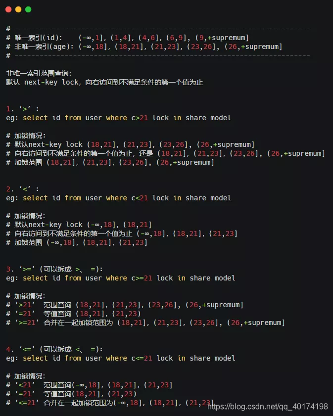

```sql
Select From 
【连接类型】Join 
On 连接条件
Where 筛选条件	#无法与聚合函数一起使用，使用 having对结果集筛选
Group by 分组
Having 分组后的筛选	HAVING不一定要有GROUP BY
Order by
Limit
```


DBMS	Database Management System 数据库管理系统


# SQL分类


| 查询语言DQL       | 操纵语言DML | 定义语言DDL(隐式提交,不能rollback) | 控制语言DCL                    |
| ----------------- | ----------- | ---------------------------------- | ------------------------------ |
| SELECT <字段名表> | INSERT      | CREATE VIEW/INDEX                  | ROLLBACK [WORK] TO [SAVEPOINT] |
| FROM <表或视图名> | UPDATE      |                                    | COMMIT [WORK]                  |
| WHERE <查询条件>  | DELETE      |                                    | GRANT授权                      |


# 数据库设计


## ER模型


可以用D(A.主键 ,B.主键 ,C.主键)来表示ABC三个实体的关系

转化为ABCD 4个关系模式


## 数据流图DFD


顶层	描述输入输出

0层	分解加工	**外部实体和数据流不会被分解 ,也不会变**


* ==保持父子图平衡==
  * 名称一致  数量相同
  * 父图的一条输入对应子图的多条输入时,保持总体平衡
  * **输入/输出流不能单条出现在加工上**
  * 加工前后的输入输出匹配,如学生信息不能被加工为教师信息


* 黑洞	只有输入
* 奇迹    只有输出


### 弱/强实体

* 强实体不依赖于其他实体而存在

* **弱实体的主键存在外键** ,不依赖外键无法唯一标识
  * 没主码,只有部分码
  * 在和所依附的实体集的联系中，弱实体要全部参与


## 规范化理论


### 函数依赖

记 A-\>B 表示 A 函数决定 B，也可以说 B 函数依赖于 A

如果 {A1，A2，... ，An} 是关系的一个或多个属性的集合，该集合函数决定了关系的其它所有属性并且是最小的，那么该集合就称为键码

对于 A-\>B，如果能找到 A 的真子集 A'，使得 A'-\> B，那么 A-\>B 就是部分函数依赖，否则就是完全函数依赖


**部分依赖	AB->C, A->C**

**传递依赖	A->B ,B->C**


候选码	唯一标识元组,无冗余

主属性   候选码的组成者

主键	候选码任选一个

外键	其他关系的主键


### 范式

* 第1范式    属性不可再分

* 第2范式    消除非主属性对候选码的部分依赖
* 第3范式    消除主属性对候选码的传递依赖
* BC范式    消除主属性对候选码的部分和传递依赖


### 完整性约束

* 实体完整性	主键非空,唯一
* 参照完整性    外键非空,存在
* 用户自定义完整性


### 关系代数


并

交

差		a-b ,去掉a中b有的部分

笛卡尔积

投影

选择

连接


#### 连接


Inner 内连接 = Cross 交叉连接 = **笛卡尔积**

左表所有行与右表中的所有行的组合


* 等值连接
  * 表示为R(a=b)S
  * ==不去重==
  
* ==自然连接==
  
* 表示为RS
* ==去重==,对相同名称的列形成匹配	保留公共值
* 自然连接一定是等值连接，但等值连接不一定是自然连接
* 等值连接要求相等的字段，不一定是公共字段；而自然连接必须是公共字段
* 等值连接不去重；自然连接去重


Left Join


左表全保留,右表无匹配则Null


Natural Left Join会根据Left Join的规则,对左右表的同名列匹配 -> 不需要指定 on/using


* 全连接	FULL OUTER JOIN


### 4种外键约束


外键要求每次修改数据时都在外键表中额外执行一次查询,虽然InnoDB强制外键使用索引,但还是无法抵消这种约束检查带来的开销

当外键的选择性很低,将导致非常大的索引片

外键的额外查询也需要加读锁,会导致额外的锁等待


| No action | 子表有匹配的记录,则不允许父表对应候选键update/delete        |
| --------- | ----------------------------------------------------------- |
| Restrict  | 拒绝对父表的删除或更新操作                                  |
| cascade   | 同步update/delete子表                                       |
| set null  | 将子表上匹配记录的列设为null,此时子表的外键列不能为not null |


cascade和set null是容错能力比较强，并不是很严格，但可能会出导致业务上出问题，No action和Restrict是非常严格的，禁止对父表进行更新和删除，但在业务中有时我们又不得不进行对父表进行操作，而在No action和Restrict约束规则下，执行父表删或者更新时会报错：ERROR 1451


## 数据类型


越小越好	占用更少的磁盘,内存和CPU

越简单越好	整型比字符操作代价更低,因为字符集和校对/排序规则复杂

避免Null	查询中包含可为Null的列,会让索引和统计复杂


==InnoDB不会区别对待定长/变长的列,所有行都只使用一个指向列值的头指针== -> char不会比varchar更简单,真正重要的只有存储空间大小


为了兼容性支持了很多别名,如Integer,Bool,Numeric,别名的真实存储为基本类型,不影响性能


**额外的存储空间**:

字符集

是否可以为Null的标识位


### 整数

|           |      |      |
| --------- | ---- | ---- |
| TINYINT   | 1    |      |
| SMALLINT  | 2    |      |
| MEDIUMINT | 3    |      |
| Int       | 4    |      |
| BigInt    | 8    |      |
|           |      |      |


可选的UNSIGNED属性,表示不允许负值,将使正数的上限翻倍

Tinyint.UNSIGNED 0~255		Tinyint -128~127


**为整数类型指定长度不会限制值的范围**,只限定显示字符的个数,不影响存储和计算


### 浮点数/实数


将数字打包成二进制字符串,每**4个字节存储9个数字**

Decimal(18,9)小数点两边将个存储9个数字,一共使用9个字节	小数点前4,小数点1,小数点后4


Decimal只作为存储格式,在计算时会转化成Double

也可以用Decimal存储比Bigint更大的数

在需要对小数进行精确计算时才用Decimal,否则将金额变为整数,用Bigint代替Decimal避免精确计算的高代价


Float 4字节,在存储相同范围的值时,会比Decimal使用更少的空间

float和double在存储的时候，存在精度丢失。如果存储的数据范围超过decimal的范围，建议将数据拆成整数和小数分开存储


### 字符


**假设字符集字节为k**

|                   | 定长                           | 最大长度(字节) | 存储字节 |      |      |      |
| ----------------- | ------------------------------ | -------------- | -------- | ---- | ---- | ---- |
| Binary(n)         | 用0x00补齐                     | n              | n        |      |      |      |
| VarBinary(n)      |                                | n              |          |      |      |      |
| Char(n)           | 空格补齐(读值时自动去末尾空格) | n              | nk       |      |      |      |
| VarChar(n)        |                                | n              |          |      |      |      |
| TinyBlob,TinyText |                                | 2^8^-1         |          |      |      |      |
| Blob,Text         |                                | 2^16^-1        |          |      |      |      |
|                   |                                |                |          |      |      |      |


#### 非二进制字符串


| Char                                                     | Varchar                                                      |
| -------------------------------------------------------- | ------------------------------------------------------------ |
| 定长,**不容易产生碎片**,自动删除所有末尾空格,最长255字符 | 在磁盘上为定长存储,==加载到内存为变长==,5000+的长度考虑用text,并将数据拆成独立的表 |
|                                                          | **额外需要1/2字节记录长度**: 长度 < 255字节? 1:2 字节        |
| 即使是null也会占用字节 -> 大量null的列,varchar更适合     |                                                              |
|                                                          | 适合于字符串列的最大长度比平均长度大很多,列的更新少          |
|                                                          | 比char更节省空间,但当行占用空间变长,页内没有多余空间时,InnoDB需要分裂页来支持变长 |
|                                                          |                                                              |


#### 二进制字符串


Binary

存储少量二进制字符串的字符码


Blob / Text

Blob 存储二进制		Text存储字符

适合存储大量字符串,会使用专门的存储区域进行存储,需要行内的1~4字节存储指针,指向专门的存储区域


Enum代替字符串

可以把不重复的字符串存储成预定义的集合

会根据列表值的数量压缩到1~2字节,将每个值在列表的位置保存为整数,并在表的.frm文件中保存的"数字-字符串"映射关系中查找

缺点:字符串列表固定,添加/删除字符必须Alert Table


#### 编码长度限制

latin11字符，每个字符占1字节

gbk字符，每个字符占2字节，最大长度不能超过32766

utf8字符，每个字符占3字节，最大长度不能超过21845

若定义的时超过上述限制，则varchar字段会被强行转为text类型


#### 行长度限制

**行的定义长度不能超过65535**.若定义的表长度超过这个值，则提示

ERROR 1118 (42000): Row size too large. The maximum row size for the used table type, not counting BLOBs, is 65535. You have to change some columns to TEXT or BLOBs


#### 字符集


所有的字符存储与表示，均以utf-8编码


|         | 1    |                                      |
| ------- | ---- | ------------------------------------ |
| latin   | 1    |                                      |
| utf8    | 1~3  | 与UTF-8编码方案对应                  |
| utf8mb4 | 1~4  | 包含utf8所有字符,额外4字节的补充字符 |
| utf16   |      | 2~4                                  |
|         |      |                                      |


**字符统计函数的区别**

```mysql
SELECT LENGTH("轻松工作")； 返回12

SELECT CHARACTER_LENGTH("轻松工作")； 返回4
```


utf8mb4	存储表情


### 时间日期


Mysql能存储的最小时间粒度为秒.但也可以用微秒进行临时运算


|           |            | 字节 |                    |                             |
| --------- | ---------- | ---- | ------------------ | --------------------------- |
| Date      | CCYY-MM-DD | 3    |                    | 适合日期函数的计算          |
| Time      | hh:mm:ss   |      |                    |                             |
| Year      | CCYY / YY  |      |                    |                             |
| DateTime  |            | 8    | 1001~9999年        | 范围大,**与时区无关**       |
| TimeStamp |            | 4    | 1970.1.1~2038.1.19 | 与UNIX时间戳相同,与时区有关 |


MySQL 提供了 FROM_UNIXTIME() 函数把 UNIX 时间戳转换为日期，并提供了 UNIX_TIMESTAMP() 函数把日期转换为 UNIX 时间戳


### Boolean

1:True	0:False


### 枚举


会根据列表值的数据压缩到1-2字节中,将映射存储在表的frm文件中,并在**列中存储整数**


### Null

为关键词,不需要加引号,不区分大小写,还会把转义符\N识别为Null


## 引擎


```mysql
create table xxx( ) ENGINE = InnoDB;
```


### InnoDB


* **自增长行级锁**，支持更高并发,支持事务。**可重复读，通过MVCC实现**
* 表基于聚簇索引建立,主键查询效率高  支持外键,但增加了表的耦合度
* 二级索引必须包含主键列,导致主键列很大将导致其他索引都会很大 -> 主键尽可能地小
* 内部的优化:预读,在内存中创建hash索引以加速自适应hash索引,加速插入操作的插入缓冲区insert buffer
* **可预测性预读**,自动在内存中创建hash索引以加速读操作的自适应哈希索引
* 支持热备份，**MySQL的其他存储引擎不支持热备份**，要获取一致性视图需要停止对所有表的写入，而在读写混合场景中，停止写入可能也意味着停止读取
* 支持hash索引,称为自适应hash

把表集中存储在一个系统表空间内,而不像其他引擎为不同的表创建不同的文件

表空间由多个文件构成,并可以包含多个原始分区

InnoDB会把表空间作为虚拟的文件系统,在其中管理所有表内容,从而支持超出文件系统存储长度


### MyISAM


不支持事务  **只支持表级锁**,读取时共享锁，写入时排它锁

支持空间函数GIS


每个MyISAM在磁盘上存储成三个文件

* frm文件：表的定义
* MYD文件：数据
* MYI文件：索引  **多个索引保存在同一文件中**

数据行保存在MYD,索引保存在MYI,使得一张表可以有多个索引,


三种支持数据的类型

**静态固定长度表   默认**,占空间大,效率高，容易缓存，损坏后容易修复

动态可变长表	空间小,出错恢复麻烦

==压缩表==


### Memory


* 将数据存在**内存**(数据丢失问题)
* 每个表和一个磁盘frm文件关联,表过大时会转化为磁盘表
* 支持的数据类型有限，不支持TEXT和BLOB类型，==字符串只支持固定长度，VARCHAR->CHAR==
* 锁粒度为**表级锁**,性能低
* 查询时，如果用到临时表且有BLOB，TEXT字段，临时表转化为MyISAM引擎，性能急剧降低
* **默认用hash索引**


## 缓冲区策略


steal：允许在事务commit前把内存中的数据写入磁盘。此时**需要undo**，因为系统在commit之前崩溃时，已经有数据写入磁盘，要恢复到崩溃前的状态，必须undo这些写入操作，否则磁盘上存在脏数据

no steal：不允许事务commit前把内存中的数据写入磁盘。不需要undo

force：内存中的数据最晚在commit的时候写入磁盘。不需要redo

no force：内存中的数据可以一直保留，在commit后延迟写入磁盘。此时需要redo，因为数据在系统崩溃的时候可能还没写入到磁盘，如果不redo，磁盘上的数据就是不完整的。


Mysql为steal/no force组合,能保证内存调度的灵活性，提高系统性能，但需要undo和redo


## 连接池


* DBCP
  * 依赖 Jakarta commons-pool 对象池机制的数据库连接池.DBCP 可以直接 的在应用程序中使用，Tomcat 的数据源使用的就是 DBCP
* c3p0
  * 开放源代码的 JDBC 连接池
* Druid
  * 阿里出品，还包含ProxyDriver，一系列内置的 JDBC 组件库，一个SQL Parser。支持所有JDBC兼容的数据库


## 主从


==只能在主机里面执行DML语句,可以在从机执行查询,不要在从机操作！！！！==


Mysql主从又叫Replication、AB复制

A与B两台机器做主从后，在A上写数据，另外一台B也会跟着写数据，实现数据实时同步

mysql主从是基于**binlog，主需开启binlog才能进行主从**

 

* 主创建**同步账户**授权给从
* 主将更改操作记录到binlog里
* 从将主的binlog同步到本机,并记录到**relaylog**
* 从根据relaylog里面的sql语句按顺序执行


## 分区表 295


分区表是独立的逻辑表,底层由多个物理子表组成(索引由子表决定,没有全局索引)

分区对SQL层来说是透明的,但从底层的文件系统可以看出,每个分区表都有用#分隔命名的表文件

实现分区的代码实际上是对一组底层表的Handler Object句柄对象的封装

对分区表的请求会通过句柄对象转化成对存储引擎的接口调用

通过**Partition By**决定分区存放的数据,在执行查询时,优化器根据分区定义过滤分区

分区目的在于将数据按较粗的粒度分布在不同表,相关的数据存放在一起,利于批量操作


**限制**

分区字段中有主键/唯一索引的列,则所有主键列和唯一索引列都必须包括进来

分区表无法进行外键约束

子表的存储引擎必须一致


### 适用场景


表数据量大,无法完全放入内存.或只在表尾有热点数据

数据维护	可以对分区进行优化/检查/修复/备份

数据分布在不同的物理设备,提高设备利用率


### 水平切分

水平切分又称为 Sharding，它是将同一个表中的记录拆分到多个结构相同的表中。

当一个表的数据不断增多时，Sharding 是必然的选择，它可以将数据分布到集群的不同节点上，从而缓存单个数据库的压力


**Sharding策略**

- 哈希取模：hash(key) % N；
- 范围：可以是 ID 范围也可以是时间范围；
- 映射表：使用单独的一个数据库来存储映射关系。


**Sharding 存在的问题**

1. 事务问题	使用分布式事务来解决，比如 XA 接口。

2. 需要可以将原来的连接分解成多个单表查询，然后在用户程序中进行连接。

3. ID 唯一性

   使用全局唯一 ID（GUID）

   为每个分片指定一个 ID 范围

   分布式 ID 生成器 (如 Twitter 的 Snowflake 算法)


### 垂直切分

垂直切分是将一张表按列切分成多个表，通常是按照列的关系密集程度进行切分，也可以利用垂直切分将经常被使用的列和不经常被使用的列切分到不同的表中。

在数据库的层面使用垂直切分将按数据库中表的密集程度部署到不同的库中，例如将原来的电商数据库垂直切分成商品数据库、用户数据库等


## 架构


# 指令


```mysql
show variables	#查看数据库配置
select database();	显示当前的库
desc 表名;				查看表的设计


```


## 大小写规则


SQL的关键词和函数名不区分大小写

```
select = SELECT = SeLeCt
```


列名/索引名/别名


数据库/表/视图名取决于文件系统的命名方式


## Explain


Explain Partitions	显示查询将访问的分区


存在子查询时,先执行子查询并将结果放入临时表,再进行外部查询优化

这代表着在进行查询优化之前需要完成所有子查询的查询,当子查询复杂时,也会消耗性能


**限制**

无法表述触发器/存储过程/UDF会如何影响查询

无法展示Mysql在查询执行中进行的特定优化

不区分相同名称的事物:内存/临时表排序都叫FileSort,磁盘和内存中的临时表都叫Using Temporary

只能解释Select语句


### id


标识Select所属的行(原始语句中的位置),不存在子查询时为1

id↑ -> 越早被执行	id相同 -> 从上到下执行


### select_type


Simple 简单查询	表示不包含子查询和Union

Primary 复杂查询	简单子查询 / 派生表(From中的子查询) / Union


当查询为复杂查询,最外层标记为Primary,内层标记为:

SubQuery	包含在Select列表中的子查询(不在From)

Derived	包含在From中的子查询,会生成临时表,进行嵌套递归

Union	Union中的第二个和随后的Select都标记为Union.第一个Select以外查询执行,为Primary;Union被From子句中的子查询包含,第一个Select标记为Derived

Union Result	从Union的匿名临时表检索结果的Select


### table

表名/表别名	正从磁盘/内存访问表

Derived + N	访问临时表

union result	访问union的结果集


### type

访问类型

system > const > eq_ref > ref > fulltext > ref_or_null > index_merge > unique_subquery > index_subquery > range > index > ALL


All	全表扫描,存在例外:Limit,或者在Extra列中Using distinct/not exists

index	按索引顺序全表扫描,无需排序	通常意味着不按索引顺序进行扫描时,开销非常大

range	只检索给定范围的行，使用一个索引来选择行。key列显示使用了哪个索引

index_subquery	利用索引来关联子查询,无需扫描全表

unique_subquery	唯一索引关联子查询

index_merge	需要多个索引组合,但未能模拟出结果

ref	非唯一索引访问,返回若干个匹配某个值的行

ref_or_null	需要在ref的基础上进行二次查找,字段既需要关联条件,也可能为null的情况

eq_ref	唯一索引,只有一行的结果集,效率高

const	优化时可以转化成常量 / 表中只有一个一个匹配行 -> 将表从关联中移除

system	表中只有一行记录(系统表)

Null	在优化中分解查询语句,在执行阶段无需访问表或索引(最小值只需要查找索引最左端)


### possible_key

候选索引,基于访问的列和比较操作符进行推断


### key

真正采用的索引,不走索引为null,覆盖索引为查询的select字段


### key_len

根据表定义推算出**单个索引的最大字节数**(包括字符集),不是表中数据实际的字节数


### ref

索引中用到的索引列,也有可能是常量


### rows

预估读取的行数,不代表真实读取的行数


### filtered

仅在使用Explain Extended时出现,表示结果集占全表的百分比


### Extra

| Using where               | 回表后进行过滤                                               |
| ------------------------- | ------------------------------------------------------------ |
| Using index               | 覆盖索引                                                     |
| using index & using where | 索引被用于查找主键,需要回表                                  |
| using index condition     | 查询列不完全被索引覆盖,但查询条件可以用索引                  |
| Using temporary           | 排序时使用临时表                                             |
| Using filesort            | 排序时使用内存/磁盘                                          |
| Using Join Buffer         | 使用连接缓存,未能成功模拟场景                                |
| Null                      | 未被索引覆盖 && where筛选列是索引的前导列，通过索引查找并回表找到未被索引覆盖的字段 |
|                           |                                                              |


### 重写非Select语句 5.6-


当需要对非Select语句进行解释时,需要重写

将语句转化成等价的访问所有相同列的Select,所有设计的列必须在Select/关联子句/Where中

但并不存在等价的查询语句,Select只需要找到数据的副本并返回,而**非Select需要修改索引上的所有副本**

```sql
Update sakila.actor
Inner Join sakila.film_actor Using(actor_id)
Set actor.last_update = film.last_update;
-->
Explain Select film_actor.last_update,actor.last_update
From sakila.actor
Inner Join sakila.film_actor Using(actor_id);
```


在5.6之后,非Select语句也支持Explain


# 函数


## 空值判断


ifnull(字段,缺省值)		可以设置空值时的缺省值


<=> 安全等于，可判断空值也可运算


**null 任何运算结果都为null**


 

## 字符函数


```mysql
Length	#获取参数的字节个数

#字符串拼接
Concat(字段,’拼接符’,字段)
Concat(字段,字段) as 字段名

Upper大写 	lower

Substr(字段,start，end)	#截取

Instr( 字段,’目标字符串’)	#获取第一次出现的索引

Trim(选项 ‘去掉的字符’ from 字段) from 表			#去头去尾,不指定去掉的字符串则去空格
		-选项：BOTH,LEADING,TRAILING

LPAD (‘目标’,长度,’填充字符串’)	#用指定的字符串填充至长度（左）
RPAD

Replace(‘目标’,’被替换’,’替换’)		#替换

```

 

### 邮箱截取


如果想要获取@之前的字符串，单靠substr并不能实现，因为substr只指定了截取初始位置和长度，而@之前的字符串字节数是不确定的，可以结合instr来获取具体要截取多少个字符

Select substr(email,1,instr(email,’@’,)-1) from 表

 


## 数学函数


```mysql
Round(字段,保留几位)		四舍五入，不指定小数默认整数
Ceil(字段)							向上取整
Floor										向下
Truncate(字段,保留位数)		截断（舍弃后几位）
Mod(字段,被除数)					取余
```


 

## 日期函数

```mysql
Now()	 		返回当前系统日期+时间
Curdate()						日期
Curtime()						时间
Monthname			以英文形式返回月
Datediff(日期1，日期2)							相差日期
Select year(日期)		提取日期中的年份
%Y			四位的年份
%y			
%m			月份(01,02…)
%c			月份(1,2…)
%d
%H			24小时制
%h			12小时制
%l			分钟
%s			秒
Str_to_date(‘字符串’,'%Y-%c-%d’)			字符串转换日期
Date_format(‘日期’,’%y%m%d’)				日期转换字符串
```


## Case 函数


```mysql
Case情况1
Case 变量/表达式/字段
When 常量1 then 值1
When 常量2 then 值2
Else 值n
End

Case 情况2
Case
When 条件1 then 值1
When 条件2 then 值2
Else 值n
End
```


## 分页


```mysql
Limit offset，size			mysql offset的起始位置从0开始
对于第一页，起始位置0，第二页起始位置size，第三页size*2…….

Limit (page-1)*size,size;			实现分页

Order by + 分页获取最大值最小值数据
Order by 排序，第一个数值为最大/最小值，
Limit 1		获取第一个数值
```


### 排序字段不唯一会导致翻页时重复记录


```mysql
-- 有8条记录
SELECT *  FROM t2 ORDER BY created DESC;
+----+---------------------+
| id | created             |
+----+---------------------+
|  2 | 2017-07-10 08:36:29 |
|  4 | 2017-07-07 16:14:30 |
|  3 | 2017-07-07 15:47:34 |
|  1 | 2017-07-07 10:25:54 |
|  6 | 2017-07-05 02:02:28 |
|  5 | 2017-06-03 00:33:05 |
|  7 | 2017-06-03 00:33:05 |
|  8 | 2017-06-03 00:33:05 |
+----+---------------------+

-- 第一页
SELECT *  FROM t2 ORDER BY created DESC LIMIT 0,6;
+----+---------------------+
| id | created             |
+----+---------------------+
|  2 | 2017-07-10 08:36:29 |
|  4 | 2017-07-07 16:14:30 |
|  3 | 2017-07-07 15:47:34 |
|  1 | 2017-07-07 10:25:54 |
|  6 | 2017-07-05 02:02:28 |
|  8 | 2017-06-03 00:33:05 |
+----+---------------------+

-- 第二页，出现重复记录 id=8
SELECT *  FROM t2 ORDER BY created DESC LIMIT 6,6;
+----+---------------------+
| id | created             |
+----+---------------------+
|  7 | 2017-06-03 00:33:05 |
|  8 | 2017-06-03 00:33:05 |
+----+---------------------+
```

当排序字段的值相同时,mysql不能保证结果集的顺序固定

避免出现排序字段值相同而导致的无序 -> 翻页时重复		需要额外增加排序字段


当未指定OrderBy时,按索引顺序排序

增，删，改可能导致查询结果集变化或者乱序


### 不需要精确记录数时,只显示记录数的大致范围


```
-- 已有索引(user_id,modified)
-- 现有查询，查询某个用户修改时间范围最近半年内的退款数
SELECT count(*)
FROM local_refund
WHERE user_id=2041579417 
  AND modified>='2019-04-19 00:00:00';

-- 考虑改为显示10000+
SELECT count(*)
FROM (
  SELECT refund_id
  FROM local_refund
  WHERE user_id=2041579417 
    AND modified>='2019-04-19 00:00:00'
LIMIT 10000) t;
```

如果需要精确数据，可以考虑生成统计表


## Count


count(col)	不统计Null,全为Null返回0

count(*)	统计NULL


有时某些业务不需要精确的Count值,可以用近似值代替

可以**用Explain优化器估算的行数代替Count**,此时并没有真正的执行查询

或者是**剔除某些查询条件**,在统计活跃人数时,要过滤离线人数,还要过滤特定ID的人,去掉某些特定条件能够加速查询,但不会过于影响结果


## OrderBy


2种排序方式:IndexSort , FileSort

index ：通过有序索引顺序扫描直接返回有序数据，不需要额外的排序，效率高

filesort：并不代表通过磁盘文件排序，只说明进行了排序操作，filesort通过相应的排序算法，将数据在内存排序区sort_buffer_size进行排序，如果内存装载不下，它就将磁盘上的数据进行分块，再对各个数据块进行排序，然后合并成有序的结果集

sort_buffer_size是每个线程独占的，**同一时刻存在多个sort buffer排序区**


优化：==尽量减少额外排序，通过索引直接返回有序的数据==。谓词和order by 使用了相同的索引，并且order by 的顺序和索引顺序相同，并且order by 的字段都是升序或者降序，否则肯定需要filesort


以下SQL不可以使用索引：

select * from tablename order by key_part1 desc,key_part2 asc; ----order by 的字段混合asc,desc

select * from tablename where key2=constant order by key1; ----用于查询的关键字与order by 中所使用的不相同

select * from tablename order by key1,key2;   ----对不同的关键字使用order by

 

对于Filesort，MySQL有两种排序算法 ：

一次扫描算法和两次扫描算法，通过比较系统变量max_length_for_sort_data的大小和query语句总字段的大小来判断使用哪种排序算法。

适当增加 max_length_for_sort_data的值，适当增加sort_buffer_size排序区，尽量使用具体的字段而不是select * 选择所有字段


## Union


结果集的列名来自第一个Select的列名

单个Union结果集列数必须相等,各列的数据类型在不相同的情况下,会自动进行类型转换

**默认自带去重效果**	Union All不会去重


**Order By / Limit**

需要将每个Union子句括起来,在最后加上第一个Select的列名/别名

==如果排序列在第一个Select的结果集为TableName.ColName形式,则必须为它指定别名==

```mysql
(Select i,c From t1) Union (Select i,d From t3)
Order By c;

(Select i,c From t1) Union (Select i,d From t3)
Limit 2;
```


 


## 自定义函数


sql自定义函数

```mysql
Create function 函数名（参数）
Returns 返回值类型
[with {Encryption | Schemabinding }]
[as]
begin
SQL语句(必须有return 变量或值)
End
```


* [with]为附加选项
  * 需要对函数体进行加密，用WITH ENCRYPTION；
  * 需要将创建的函数与引用的数据库绑定，用WITH SCHEMABINDING（**函数一旦绑定，则不能删除、修改，除非删除绑定**）


* DECLARE  在复合语句 (BEGIN...END) 中声明 SQL 变量或异常


# 视图 306


```sql
CREATE VIEW "VIEW_NAME" AS "Sql";
```


视图方便查询,不能插入修改删除		Vo适合插入修改删除

业务只需要查询时,用视图方便

 

视图是虚拟表,并不存在于数据库,数据在引用视图时动态生成,但是可以创建它的逆向工程

视图提高安全性:

* 只针对一张表建立视图,可以做到筛选字段进行展示

*  针对不同用户，设定不同的视图,能查询到不同的信息


# 事务


**不要在一次事务中使用多种存储引擎**

MySQL服务器层不管理事务，由下层的存储引擎实现

事务中混合使用了事务/非事务的表,回滚时非事务表无法撤销


**BEGIN, ROLLBACK, COMMIT 实现事务**

```mysql
Set AUTOCOMMIT = 1/ON 启用(默认)	0/OFF禁用
```

禁用自动提交时,所有查询都在一个事务中,直到显式COMMIT/ROLLBACK,事务才结束并开启新事务

回滚包括事务的提交状态,在事务前自动提交,事务中关闭自动提交,则Rollback后依然是自动提交


**保存点**

SavePoint保存点支持对事务的部分回滚

```mysql
create table t (i INT) ENGINE = InnoDB;
Begin;
Insert Into t Values(1);
SavePoint sp;
Insert Into t Values(2);	//相当于只执行了1,3的插入语句
RollBack to SavePoint sp;
Insert Into t Values(3);
Commit;
```


## ACID


* A 原子性：全完成/全不完成

* C 一致性：保持数据**完整性/可见性**

* I 隔离性：**允许并发事务的数据一致**

* D 持久性：事务提交后，对数据的**修改是永久**的，即便系统故障也不会丢失


## 隔离级别


```mysql
SET [GLOBAL|SESSION] TRANSACTION ISOLATION LEVEL {level};	#设置隔离等级
```


* 脏读	     select

* 不可重复读	update

* 幻读	    insert/delete


| 读未提交 | 读提交                        | 可重复读                     | 串行化                     |
| -------- | ----------------------------- | ---------------------------- | -------------------------- |
|          | ~~脏读~~                      | ~~脏读、不可重复读~~         | ~~脏读、不可重复读、幻读~~ |
|          | SQLServer/Oracle              | Mysql                        |                            |
|          | 快照 无锁查询也能==避免脏读== | 快照+==事务== 避免不可重复读 |                            |


**可重复读和读提交是矛盾的**。在同一个事务里，如果保证了可重复读，就看不到其他事务的提交，违背了读提交；如果保证了读提交，就会导致前后两次读到的结果不一致，违背可重复读


### 幻读


Mysql提供两种事务隔离技术避免幻读	==只有加锁读才能真正避免幻读==

| MVCC                              | NK锁 |
| --------------------------------- | ---- |
| 不加锁,生成读视图                 | 加锁 |
| 不是即时数据,依靠历史数据避免幻读 | 及时 |
| 并发高                            |      |


| 事务A                                               | 事务B            |
| --------------------------------------------------- | ---------------- |
| select -> 结果集A                                   |                  |
|                                                     | insert && commit |
| select -> 结果集B == A                              |                  |
| 对所有行记录update -> 所有行的**事务id被更新**      |                  |
| **select -> 结果集C 包含了事务B插入的数据 -> 幻读** |                  |


### 丢失更新(ABA)


#### 回滚覆盖

属于第一类丢失更新,**所有的数据库都不允许回滚覆盖**

事务的回滚操作影响了另已提交的事务


### ABA

属于第二类丢失更新


## 封锁协议


X 排它锁 eXclusive locks

S 共享锁 Shared locks

U 更新锁 Update locks

I 增量锁 Incremental locks


### 三级封锁协议


**一级封锁协议**	读提交

修改数据加X锁，直到T结束才释放锁	解决ABA问题，不会丢失修改

**二级封锁协议**	可重复读

在一级的基础上，读数据时加S锁，**读完马上释放S锁**	解决读脏,不会在修改事务过程中读取数据

**三级封锁协议**	串行化

在二级的基础上，读数据时加S锁，**事务结束才释放S锁**	解决不可重复读，避免了在事务中途数据发生变化


### 两阶段协议 2PL

Two Phase Locking Protocal


加锁/解锁分两个阶段进行,**加锁时不能解锁,解锁时不能加锁** -> 加解锁原子性 -> 隔离性


### 可串行化调度


**调度包含的事务都是良构的且两阶段，使得并发执行的事务结果与某一个串行执行的事务结果相同**


**良构**的事务	READ、WRITE、LOCK都被相应的锁覆盖，所有锁都在事务结束时释放（mysql的表和行数据在被操作时，都有对应的锁覆盖）

**两阶段**事务	加锁/解锁分两个阶段进行

合法的**调度**	调度是一组事务的操作的某种合并结果,同一时间没发生两个不同事务的锁冲突（mysql支持多事务并行执行）


## 分布式XA事务


(全局)事务管理器(TM: Transaction Manager)	-Binlog

(局部)资源管理器(RM: Resource Manager)		-Mysql本身


### 内部事务


Mysql中各个存储引擎是完全独立(参与者),所以跨存储引擎的事务需要一个外部的协调者

如果没有协调者,事务提交就只是顺序地要求各个存储引擎各自提交,在提交过程中发生错误,就会破坏事务特性

**将binlog看作独立的引擎,在存储引擎提交事务时,需要将提交信息写入binlog,这就是分布式事务,不过事务的参与者是Mysql本身**

当事务开启二进制日志时,至少需要调用3次fsync(),1次二进制日志持久化,2次事务日志持久化


为了兼容非事务引擎的复制，binlog记录所有引擎中的修改操作，但这导致redo log与binlog的一致性问题

* 单台MySQL服务器中，binlog作为TM，多个数据库实例作为RM,属于**跨库事务**
* ==内部XA保证redo和binlog的一致性==


* InnoDB prepare,write/sync redo log
  * 引擎启动,同步redo log,**binlog不作任何操作**
* write/sync Binlog
  * 写入binlog，MySQL认为事务已提交并持久化,==立即将新增的binlog发送给订阅者,降低主从延迟==
  * 这时就算数据库崩溃，重启MySQL后仍能恢复事务
* commit
  * 大部分都是内存操作(不是事务的commit)，如释放锁，释放mvcc相关的read view等
  * MySQL认为这一步不会发生任何错误，一旦发生了错误就崩溃,不会回滚
  * 提交后，更新的数据才能被外部查询


### 外部事务


分布式事务依托于==两阶段提交==实现

事务协调器保证所有事务参与者完成准备工作 **(第1阶段)**

协调器收到所有参与者都准备好的信息,通知事务可以提交 **(第2阶段)**


* prepare 准备提交
  * TM向所有涉及到的RM发出prepare
  * RM收到请求后执行数据修改和日志记录等处理，处理完后把事务的状态改成**"可以提交"**,结果返回给TM

* commit  确认提交
  * TM收到回应，任何一个RM的操作错误/收不到回应，事务失败，回滚所有RM的事务
  * 全部成功，TM向RM发出commit，RM把事务的**"可以提交"改为"提交完成"**，然后返回应答
  * RM收不到commit，也会把"可以提交"回滚


## 日志


```shell
innodb_max_undo_log_size#控制最大undo tablespace文件的大小，启动innodb_undo_log_truncate 时，undo tablespace 超过innodb_max_undo_log_size 阀值时才会尝试truncate。该值默认大小为1G，truncate后的大小默认为10M

innodb_undo_tablespaces	#undo的独立表空间个数,当DB写压力大时，通过独立表空间，把UNDO写入高速磁盘，提高写入性能


```


### Log buffer


### log file


### bin


记录表结构变更（CREATE、ALTER TABLE…）以及数据修改（INSERT、UPDATE、DELETE…）,SELECT和SHOW记录在通用日志


修改无需每次都持久到硬盘,**日志是追加方式,为顺序IO,无需移动磁头**

事务日志持久后,内存中被修改的数据再慢慢地刷回磁盘


二进制日志包括两类文件：

* 索引文件（后缀.index）,记录所有的二进制文件
* 日志文件（后缀.00000*）记录数据库所有的DDL和DML(除查询)语句事件


| Server | InnoDb存储引擎 专属 |
| ------ | ------------------- |
| binlog | undo                |
| relay  | redo                |
| error  |                     |


#### 开启binlog


```shell
vi /etc/my.cnf 

log-bin=mysql-bin
binlog-format=ROW	#推荐row模式，准确性高，但文件大
server_id=1	#配置mysql replaction需要定义，不能和canal的slaveId重复
```


binlog-format


#### 刷盘


将缓存中的日志刷到磁盘上

binlog_cache_size过大，造成内存浪费。过小，会频繁将缓冲日志写入临时文件

sync_binlog=0	刷新binlog时间点由操作系统自身来决定,性能好

sync_binlog=1	每次事务提交时就会刷新binlog到磁盘

sync_binlog=N	每N个事务提交会进行一次binlog刷新(数据丢失)


binlog是多文件存储，定位一个LogEvent需要通过binlog filename +  binlog position进行定位


### undo

逻辑日志

维护数据修改前的值,保证==原子性==,存放在系统表空间(ibdata)中,5.6+可以使用独立的Undo表空间	**随机IO**

undo使快照无需保存事务开启时行记录的历史状态 -> `delete`时，记录`相反的insert`记录;`update`时，记录`相反的update`记录。rollback根据undo的记录进行回滚


记录undo的操作本身也会有对应的redo


由于数据库的steal策略，事务在更新一个页面后，==数据库可以把未提交的数据刷入磁盘,并利用undo的版本链实现MVCC的行版本控制,维护未提交数据的可见性==，这时发生崩溃，==恢复时也通过undo中到数据的历史状态==


在事务提交前,undo一直在内存中,提交时落盘(**所有数据在落盘前都先经过内存**)

`行版本控制`也是通过undo log来实现的：当读取的某一行被其他事务锁定时，从undo log中倒推历史数据，实现`非锁定一致性`读取


Undo保证了事务失败或主动abort时的机能，除此之外，系统崩溃恢复时，也确保数据库状态能恢复到一致。

系统恢复时，Undo需要Redo的配合来实现，或者说二者是一套机制的两个方面。因为在Redo日志有commit或abort记录的事务是无需undo的。
假设以静止的检查点为日志类型，以<CKPT (t0,…,tn)>做检查点，期间不接受新事务进入，整个Undo过程可以描述如下：
1.以进行检查点时记录的活跃事务(t0,…,tn)为undo-list
2.在Redo阶段，发现<T,START>记录，就将T加入undo-list，发现<T,END>或<T,ABORT>记录，就将T移出undo-list
4.最后undo-list中的事务都是些未提交也没回滚的事务，系统如同普通的事务回滚样进行具体的undo操作
5.当undo-list中发现<T,START>时，说明完成了具体的回滚操作，系统写入一个<T,ABORT>记录，并从undo-list中删除T。
6.直到undo-list为空，撤销阶段完成

 

Undo的原语表示可以如下：


 

**1.4 写日志**
写日志有2种处理：一是等待一次IO，直接写入到存储介质。二是先写入到缓冲，在之后的某一时间点统一写入磁盘

fsync() VS sync()
fsync函数等待磁盘操作结束，然后返回，它能确保数据持久化到存储介质，而不是停留在OS或存储的写缓冲中
sync则把修改过的块缓冲区排入OS的写队列后就返回。fsync能确保数据写入，同时，这也意味着一次IO及性能消耗


不同的数据库部件有各自的设计目的，负责不同的命令，Read和Write由事务发起，Input和Output由缓冲区管理器发出。也就是说，日志记录响应的是写入内存的write命令，而不是写入磁盘的output命令，除非显示的控制

具体的实现上会有很多策略，但应保证一些原则：

针对Undo
1.如果事务T改变了数据库元素X，那么必须保证对应的一条Undo记录在X的新值写入磁盘之前落盘。
2.如果发生commit，那么该条commit记录写入磁盘前，所有之前的修改能确保先行落盘。

针对Redo，先写日志规则（Write-Ahead Logging，WAL）:
1.对数据库元素X的修改被写入磁盘前，一条对应的Redo日志保证先行落盘。
2.提交时，修改的数据库元素在写入磁盘前，一条commit记录保证落盘。

注意这里说的数据库元素X，不是事务层面的更新记录集，通常假定是一个最小的原子处理单位，一个磁盘块。当某块在output时，不能有对该块的write。为此在某块输出时可以在块上设置排他锁，这种短期持有的闩锁（latch）与事务并发控制的锁无关，按照非两阶段的方式释放这样的锁对于事务可串行性没有影响。如果数据库元素小于单个块，一个糟糕的情景是不同事务的2个数据元素位于同一块，这时候一个事务对块的写磁盘动作可能导致另一个事务违反写入规则，一个建议是以块作为数据库元素。


在InnoDB的实现中，并不严格按照WAL规则，而是通过一种事务的序列编号LSN保证逻辑上的WAL。下面对InnoDB的一些实现细节尝试分析下。

 

**2.MySQL InnoDB中的实现

**

**2.1 redo log**
每个Innodb存储引擎至少有一个重做日志文件组(group)，每个文件组下至少有2个重做日志文件，如默认的ib_logfile0和ib_logfile1，其默认路径位于引擎的数据目录。

 

设置多个日志文件时，其名字以ib_logfile[num]形式命名。多个日志文件循环利用，第一个文件写满时，换到第二个日志文件，最后一个文件写满时，回到第一个文件，组成逻辑上无限大的空间。在Innodb1.2.x前，重做日志文件的总大小不能大于等于4GB，1.2.x版本该限制以扩大到512GB.

 

重做日志文件设置的越大，越可以减少checkpoint刷新脏页的频率，这有时候对提升MySQL的性能非常重要，但缺点是增加了恢复时的耗时；如果设置的过小，则可能需要频繁地切换文件，甚至一个事务的日志要多次切换文件，导致性能的抖动。

 

Innodb中各种不同的操作有着不同类型的重做日志，类型数量有几十种，但记录条目的基本格式可以如下表示：


图2.1


 

在存储结构上，redo log文件以block块来组织，每个block大小为512字节。每个文件的开头有一个2k大小的File Header区域用来保存一些控制信息，File Header之后就是连续的block。虽然每个redo log文件在头部划出了File Header区域，但实际存储信息的只有group中第一个redo log文件。


图2.2

 

当redo log实际由mtr（Mini transaction）产生时，首先位于mtr的cache，之后输出到redo log 缓冲区，再从缓冲区写入到磁盘。Log buffer与文件中的block大小对应，以512字节为单位对齐，一个mtr日志可能不足一个block，也可能跨block。

 

**File Header**
File Header位于每个redo log文件的开始，大小为2k，格式如下：


图2.3

log group中的第一个文件实际存储这些信息，其他文件仅保留了空间。在写入日志时，除了完成block部分，还要更新File Header里的信息，这些信息对Innodb引擎的恢复操作非常关键。


**Block**
一个block块有512字节大小，每块中还有块头和块尾，中间是日志本身。其中块头Block Header占有12字节大小，块尾Block Trailer占有4字节大小，中间实际的日志存储容量为496字节(512-12-4)：


图2.4

 

LOG_BLOCK_HDR_NO
在log buffer内部，可以看成是单位大小是512字节的log block组成的数组，LOG_BLOCK_HDR_NO就用来标记数组中的位置。其根据该块的LSN计算转换而来，递增且循环使用，占有4个字节，第一位用来判断是否flush bit，所以总容量是2G。(LSN在之后一段说明)

LOG_BLOCK_HDR_DATA_LEN
标识写入本block的日志长度，占有2个字节，当写满时用0X200表示，即有512字节。

LOG_BLOCK_FIRST_REC_GROUP
占有2个字节，记录本block中第一个记录的偏移量。如果该值与LOG_BLOCK_HDR_DATA_LEN
相同，说明此block被单一记录占有，不包含新的日志。如果有新日志写入，LOG_BLOCK_FIRST_REC_GROUP就是新日志的位置。

图2.5

 

LOG_BLOCK_CHECKPOINT_NO
占有4字节，记录该block最后被写入时检查点第4字节值。

LOG_BLOCK_TRL_NO
Block trailer中只由这1个部分组成。记录本block中的checksum值，与LOG_BLOCK_HDR_NO值相同。

 

**LSN**
LSN是Log Sequence Number的缩写，占有8字节，单调递增，记录重做日志写入的字节总量，也表示日志序列号。

LSN除了记录在redo日志中，还存于每个页中。页的头部有一个FIL_PAGE_LSN用于记录该页的LSN，反应的是页的当前版本。

LSN同样也用于记录checkpoint的位置。使用SHOW ENGINE INNODB STATUS命令查看LSN情况时，Log sequence number是当前LSN，Log flushed up to 是刷新到重做日志文件的LSN，Last checkpoint at 是刷新到磁盘的LSN。

由于LSN具有单调增长性，如果重做日志中的LSN大于当前页中LSN，说明页是滞后的，如果日志记录的LSN对应的事务已经提交，那么当前页需要重做恢复。
如果页被新事务修改了，页中LSN记录的是新写入的结束点的LSN，大于重做日志中的LSN，那么当前页是新数据，是脏页。
脏页根据提交情况可能需要加入flush list中，此时flush list上的所以脏页也是以LSN排序。

写redo log时是追加写，需要保证写入顺序，或者说应保证LSN的有序。当并发写时可以通过加锁来控制顺序但效率低下，8.0中使用了无锁的方式完成并发写，mtr写时已经提前知道自己在log buffer上的区间位置，不必等待直接写入log buffer就可。这样大的LSN值可能先写到log buffer上，而小的LSN还没写入，即log buffer上有空洞。所以有一个单独的线程log_write，负责不断的扫描log buffer，检测新的连续内容并进行刷新，是真正的写线程。

 

2.2 Undo

undo是逻辑日志，在事务回滚时对数据库进行一些补偿性的修改，以使数据在逻辑上回到修改前的样子，它并不幂等
在Innodb中使用表空间，回滚段，页等多级概念结构实现undo功能，并随版本多次改进，为方便讨论，下面放一张5.7版本的大致结构图，在此基础上进行描述：


图2.6

 

\1. 在undo这部分，MySQL 5.7版本在5.6(InnoDB 1.2)的基础上主要增加有innodb_undo_log_truncate 收缩等功能，但在大致结构方面5.6可以参考上面5.7的图。

\2. 在5.5(Innodb1.1)版本之前，只有一个undo回滚段(rollback segment)，支持1024个事务同时在线。

3.在5.5版中，支持最大128个回滚段，理论上支持128*1024个事务同时在线。

4.在之前的版本中，回滚段都存储于共享表空间中，一个常见的问题是ibdata膨胀。在5.6版本(Innodb1.2)时，可以对回滚段做更多的设置：
innodb_undo_directory
innodb_undo_logs
innodb_undo_tablespaces
这3个参数分别用来设置
（1）回滚段文件所在位置，这意味着回滚段可以存储到共享表空降值外，能使用独立的表空间。
（2）回滚段的数量，默认是128个。
（3）回滚段文件的数量。如设置为3个，则在上面指定的directory文件生成3个undo为前缀的文件：undo001，undo002，undo003，默认的128个回滚段将被依次平均分配到这3个文件中。具体分配时，总是从第一个space开始轮询，所以如果将回滚段的数量依次递增到128，那所有的段都将落入undo001中。


\5. 如上图，共享表空间偏移量为5的页记录有所有回滚段的指向信息，这页的类型为FIL_PAGE_TYPE_SYS（trx_sys）。 0号回滚段被预留在ibdata中，1~32号的32个回滚段是临时表的回滚段，存储于ibtmpl文件，其余从33号开始的回滚段才是可配置的，因此InnoDB实际支出96*1024个普通事务同时在线。

6.每个回滚段的头部维护着一个段头页，该页中划分了1024个槽位slot（TRX_RSEG_N_SLOTS），每个slot可以对应一个undo log对象，这也是为什么说一个回滚段支持1024个事务。

7.MySQL8.0中，每个Undo tablespace都可以创建128个回滚段，所以总共可以有总共有innodb_rollback_segments * innodb_undo_tablespaces个回滚段。

 

**结构体**
回滚段的信息以数组的形式存放，数组大小为128，数组位于trx_sys->rseg_array
rseg_array数组中的元素类型是trx_rseg_t，表示一个回滚段。
每个trx_rseg_t中管理着许多trx_undo_t，这些trx_undo_t同时也属于多个链表，不同的链表有着不同的功能，如insert_undo_list或update_undo_list等。


图2.7

 


**undo log格式**


Innodb中undo log可以分为两种：
inser undo log
update undo log


insert undo log是insert操作中产生的undo log，因为只对本事务可见，该类undo log在事务提交后就可以删除，不需要进行purge操作。格式如下：


图2.8

 

update undo log是delete和update操作产生的undo log。此类undo log是MVCC的基础，在本事务提交后不能简单的删除，需要放入purge队列purge_sys->purge_queue
等待purge线程进行最后的删除。格式如下：

图2.9

图上可见update undo log的格式比insert undo log复杂，同名的部分功能类似，其中的type_cmpl部分，由于update undo log本身还有分类，所以值可能有：
TRX_UNDO_DEL_MARK_REC，将记录标记为delete
TRX_UNDO_UPD_DEL_REC，将delete的记录标记为not delete
TRX_UNDO_UPD_EXIST_REC，更新未被标记delete的记录


innodb对undo的操作是，如果你update 一条记录，那么就先把记录cp到undo中，记录undo的redo，加锁，修改数据，记录page的redo，事务提交，判断是否有事务引用undo log，有等待，没有则回收undo log。

如果在事务进行中崩溃了，那么就需要redo进行恢复，并检测redo中有没有该事务的提交信息，如果有，那么前滚，undo log就没用了，如果没有提交信息，就需要进行回滚，这时候需要把undo log中的记录信息在cp回去。所以undo log也需要落盘把。


#### 存储

UNDO内部由128个回滚段Rollback segment组成,即支持128*1024个undo操作，通过`innodb_undo_logs` 设置回滚段个数。undo log`默认存放`在`共享表空间`中。如果开启了`innodb_file_per_table` ，将放在每个表的`.ibd`文件中。

在MySQL5.6中，undo的存放位置还可以通过变量 `innodb_undo_directory` 来`自定义存放目录`，默认值为"."表示datadir

默认rollback segment全部写在一个文件中，但可以通过设置变量 `innodb_undo_tablespaces` 平均分配到多少个文件中。该变量`默认值为0`，即`全部写入一个表空间文件`。该变量为静态变量，只能在数据库示例停止状态下修改，如写入配置文件或启动时带上对应参数。但是innodb存储引擎在启动过程中提示，`不建议修改为非0`的值


insert在提交前只对当前事务可见 -> 记录至==insert undo log==,**提交后直接删除** (刚插入的数据没有可见性要求)

update/delete需要维护多版本信息 -> 记录至==update undo log==,提交后放到 history list，等待 purge 线程进行删除


update流程

```
假设之前插⼊该⾏的事务 ID 为 100，事务 A 的 ID 为 200，该⾏的隐藏主键为 1

对⾏记录加排他锁,把该⾏原本的值拷⻉到 undo log 中，DB_TRX_ID 和 DB_ROLL_PTR 都不动
事务A修改该⾏,产⽣新版本，更新 DATA_TRX_ID=200，DATA_ROLL_PTR=100,指向拷⻉到 undo log 链中的旧版本记录
```


采用==回滚段==的方式来维护undo log的并发写入和持久化。回滚段是 Undo 文件组织方式

每个回滚段由`1024`个`undo log slot`组成。`每个undo操作`在记录的时候`占用一个undo log slot`,同时记录,redo log，因为undo log也需要`持久化`


rseg0		预留给系统表空间

rseg 1~32	预留给临时表空间，每次数据库重启的时候，都会重建临时表空间

rseg 33~127	则根据配置存放到独立undo表空间中（如果没有打开独立Undo表空间，则存放于ibdata中）


每个回滚段维护了一个段头页，在该page中又划分了1024个slot(TRX_RSEG_N_SLOTS)，每个slot又对应到一个undo log对象，因此理论上InnoDB最多支持 96 * 1024个普通事务


**关键结构体**

为了便于管理和使用undo记录，在内存中维护关键结构体对象：

1. 所有回滚段都记录在trx_sys->rseg_array，数组大小为128，分别对应不同的回滚段
2. rseg_array数组类型为trx_rseg_t，用于维护回滚段相关信息
3. 每个回滚段对象trx_rseg_t还要管理undo log信息，对应结构体为trx_undo_t，使用多个链表来维护trx_undo_t信息
4. 事务开启时，会专门给他指定一个回滚段，以后该事务用到的undo log页，就从该回滚段上分配
5. 事务提交后，需要purge的回滚段会被放到purge队列上(purge_sys->purge_queue)


### redo

物理日志

链式记录数据每次修改前的备份 -> ==原子性== -> **顺序IO**,数据库运行时不需要对redo log进行读取


Force Log at commit机制

事务提交前持久化redo,再调用fsync刷新内存;数据本身不需要在提交时完成持久化 -> ==持久性==


#### 操作数据原语

Input(X)：将X值从存储介质读入缓冲区
Read(X,t)：将X值从缓冲区读入事务内的变量t，如果缓冲中不存在，则触发Input
Write(X,t): 将事务内的t写入到缓冲区X块，如果缓冲中X不存在，则触发Input(X)，再完成write
Output(X)：将缓冲区X写入到存储中


Redo日志往往是由多个事务交织在一起的，错误也随时能发生


(a) 事务未提交&&宕机,需要重做redo

(b) 日志中T0已经提交了，必须要对T0 进行Redo，而部分T1也需要Redo
(c) 日志中T0已经提交了，必须要对T0进行Redo,而T1虽然abort也需要Redo


对于已commit的事务,宕机时必须重做Redo，但未提交的事务可以不必进行Redo，但这样会增加Redo阶段的复杂性，Mysql**根据Redo全部重做，之后的撤销工作交给Undo来进行 -> **Redo事务无关性


#### Checkpoint

原则上，系统恢复时可以通过检查整个日志来完成

但日志过长时

1. 搜索慢
2. 全部redo都重做慢
3. 事务commit日志记录写入磁盘后,恢复时不再需要这部分的undo.但由于其他事务可能在使用Undo中的旧值。为此需要checkpoint来处理这些当前活跃的事务


##### 简单检查点
（1）**停止接受新的事务**
（2）等待当前所有活跃事务完成或中止，并在日志中写入commit或abort记录
（3）将当前位于内存的日志缓冲块刷新到磁盘
（4）写入日志记录<CKPT>，并再次刷新到磁盘
（5）重新开始接受事务
系统恢复时，可以从日志尾端反向搜索，直到找到第一个<CKPT>标志，而没有必要处理<CKPT>之前的记录


**非静止检查点**
简单检查点期间需要停止响应，非静止检查点允许进行检查点时接受新事务进入，步骤如下：
（1）写入日志记录<START CKPT(t1,…tn)>，其中t1,…tn是当前活跃的事务
（2）等待t1,…tn所有事务提交或中止，但仍接受新事务的进入
（3）当t1,…tn所有事务都已完成，写入日志记录<END CKPT>

 

当使用非静止检查点技术，恢复时的也是从日志尾向前扫描，可能先遇到<START CKPT>标志，也可能先遇到<END CKPT>标志：
1.先遇到<START CKPT(t1,…tn)>时，说明系统在检查点过程中崩溃，未完成事务包括2部分：(t1,…tn)记录的部分及<START>标志后新进入部分。这部分事务中最早那个事务的开始点就是扫描的截止点，再往前可以不必扫描。

2.先遇到<END CKPT>，说明系统完成了上一个周期的检查点，新的检查点还没开始。需要处理2部分事务：<END CKPT>标志之后到系统崩溃时这段时间内的事务及上一个<START>，<END>区间内新接受的事务。为此扫描到上一个检查点<START CKPT()>就可以截止。

多说一句，很容易发现，非静止检查点是将一个点扩展为一个处理区间了，类似的设计其他技术也有，如JVM的GC处理，从stop the world到安全区的处理

 

 


数据修改时，先把数据页从磁盘读到buffer pool中并进行修改，导致buffer pool中数据页与磁盘上数据页内容不一致,此时Mysql宕机会导致，buffer pool中的内存数据丢失

buffer pool的数据页变更后，修改记录**顺序IO**至redo log，那么当Mysql恢复时，根据redo内容，**找到需要重新刷新到磁盘文件的记录**

如果在buffer pool的数据页变更后直接flush到disk file，是随机IO -> 事务提交慢


修改表中 id=2的行数据’B’-> B2’，那么redo记录‘B2’ -> ‘B’，如果这个修改在flush到磁盘文件时异常，可以使用redo实现重做，保证持久性


#### redo VS bin

redo log 是存储引擎层产生的，而binary log是数据库层产生的

事务执行过程中不断往redo顺序IO，而bin不作处理，直到事务提交，一次性地写入bin


```mysql
innodb_log_files_in_group	#redo文件个数，命名方式如：ib_logfile0，iblogfile1… iblogfilen。默认2个，最大100个
innodb_log_file_size	#文件大小(所有redo之和)，默认值48M，最大值512G
innodb_log_group_home_dir	#文件存放路径

innodb_log_buffer_size	#Redo Buffer，默认8M，可设置1-8M。延迟事务日志写入磁盘，把redo log 放到该缓冲区，然后根据 innodb_flush_log_at_trx_commit参数的设置，再把日志从buffer 中flush 到磁盘中。

innodb_flush_log_at_trx_commit

innodb_flush_log_at_trx_commit=1，每次commit都会把redo log从redo log buffer写入到system，并fsync刷新到磁盘文件中。

innodb_flush_log_at_trx_commit=2，每次事务提交时MySQL会把日志从redo log buffer写入到system，但只写入到file system buffer，由系统内部来fsync到磁盘文件。如果数据库实例crash，不会丢失redo log，但是如果服务器crash，由于file system buffer还来不及fsync到磁盘文件，所以会丢失这一部分的数据。
innodb_flush_log_at_trx_commit=0，事务发生过程，日志一直激励在redo log buffer中，跟其他设置一样，但是在事务提交时，不产生redo 写操作，而是MySQL内部每秒操作一次，从redo log buffer，把数据写入到系统中去。如果发生crash，即丢失1s内的事务修改操作。

注意：由于进程调度策略问题,这个“每秒执行一次 flush(刷到磁盘)操作”并不是保证100%的“每秒”。
```


#### 三种落盘方式

Buffer Pool **每秒**-> OS Buffer 每次-> 磁盘	Mysql宕机问题

Buffer Pool 每次-> OS Buffer **每秒**-> 磁盘	OS宕机问题

Buffer Pool 每次-> OS Buffer 每次-> 磁盘	性能问题


mysql路径/var/lib/mysql/下,ib_logfile0/1两个文件用于redo的持久化,能防止mysql宕机

0用于


ib_logfile文件个数由innodb_log_files_in_group决定，并进行循环使用，binary log不是循环使用，在写满或者重启之后，会生成新的binary log文件

ib_logfile包含commit和uncommit的数据

binary log只有commit的数据


假设有A、B两个数据，值分别为1,2，开始⼀个事务，事务的操作内容为：把1修改为3，2修改为4，那 么实际的记录如下（简化）： A.事务开始. B.记录A=1到undo log. C.修改A=3. D.记录A=3到redo log. E. 记录B=2到undo log. F.修改B=4. G.记录B=4到redo log. H.将redo log写⼊磁盘（随机IO）。 I.事务提交 undo ⽇志的记录内容如下，只进⾏顺序追加的操作，当⼀个事务需要回滚时，它的Redo Log记录也不 会从Redo Log中删除掉


**undo log** ==事务开始前==，先将需操作的数据备份,作为数据旧版本快照,供其他并发事务快照读

* insert undo log
  
  * 只在事务回滚时需要，提交后可以被立即丢弃
* ==update undo log==   实现**原子性**,不仅在事务回滚时需要，在快照读时也需要
  * 先对该行加排它锁,拷贝该行记录到update undo log
  * 修改记录,更新``事务ID的隐藏字段``(依据事务ID,呈**链式**存储)
  * 提交事务,释放排它锁


**redo log**  备份事务过程中的最新的数据

* ==在事务的执行过程中，开始写入==,实现**事务的未入磁盘数据进行持久化**
* 配置落盘策略,防止在发生故障的时间点，尚有脏页未写入磁盘，在重启mysql服务时，根据redo log进行重做
* 事务提交且数据持久化落盘后，Redo log中的事务记录就失去了意义，所以**Redo是日志文件循环写入的**


```shell
#redo log 配置
innodb_log_group_home_dir 指定存储目录
innodb_log_files_in_group	指定Redo log日志文件组中的数量 默认2
innodb_log_file_size	指定Redo log每一个日志文件最大存储量 默认48

innodb_log_buffer_size	指定Redo log在cache/buffer中的buffer池大小 默认16

Innodb_flush_log_at_trx_commit：持久化Redo的策略， 
		0 每秒 [可能丢失一秒的事务数据]
		1 默认值，每次事务提交 [最安全，性能最差]
		2 
```


#### 恢复策略


未提交的事务和回滚事务也会记录Redo Log，因此在进行恢复时,这些事务要进行特殊处理


**2种恢复策略**

1. 只重做已经提交了的事务
2. **重做redo所有事务(未提交/回滚),然后通过Undo Log回滚那些未提交的事务** InnoDB默认


A. 在重做Redo Log时，并不关心事务性。 恢复时，没有BEGIN，也没有COMMIT,ROLLBACK的行为。也不关心每个日志是哪个事务的。尽管事务ID等事务相关的内容会记入Redo Log，这些内容只是被当作要操作的数据的一部分。


**重做redo所有事务(未提交/回滚),然后通过Undo Log回滚那些未提交的事务** InnoDB默认

此策略必须将Undo持久化，而且必须在写Redo之前将Undo写入磁盘。Undo和Redo Log的这种关联，使得持久化变得复杂起来。为了降低复杂度，InnoDB将Undo Log看作数据，因此记录Undo Log的操作也会记录到redo log中,这样undo就可以象数据一样缓存起来，而不用在redo log之前写入磁盘了

包含Undo Log操作的Redo Log，看起来是这样的：

```mysql
     记录1: <trx1, Undo log insert <undo_insert …>>
     记录2: <trx1, insert …>
     记录3: <trx2, Undo log insert <undo_update …>>
     记录4: <trx2, update …>
     记录5: <trx3, Undo log insert <undo_delete …>>
     记录6: <trx3, delete …>123456
```


到这里，还有一个问题没有弄清楚。既然Redo没有事务性，那岂不是会重新执行被回滚了的事务？
确实是这样。同时Innodb也会将事务回滚时的操作也记录到redo log中。回滚操作本质上也是
对数据进行修改，因此回滚时对数据的操作也会记录到Redo Log中。
一个回滚了的事务的Redo Log，看起来是这样的：

```
  记录1: <trx1, Undo log insert <undo_insert …>>
     记录2: <trx1, insert A…>
     记录3: <trx1, Undo log insert <undo_update …>>
     记录4: <trx1, update B…>
     记录5: <trx1, Undo log insert <undo_delete …>>
     记录6: <trx1, delete C…>
     记录7: <trx1, insert C>
     记录8: <trx1, update B to old value>
     记录9: <trx1, delete A>123456789
 一个被回滚了的事务在恢复时的操作就是先redo再undo，因此不会破坏数据的一致性。
```


#### 事务中的非事务性语句


对于非事务性语句（insert，delete）遵循3条规则：

* 非事务性语句被标记事务性，写入Redo
* 没标记事务性，Redo中有，写入Redo
* 没标记事务性，Redo中没有，则直接写入binlog

在一个事务中有非事务性语句，优先将非事务语句直接写入binlog


#### 数据更新流程


### Undo + Redo事务的简化过程

假设有A、B两个数据，值分别为1,2，开始一个事务，事务的操作内容为：把1修改为3，2修改为4，那么实际的记录如下（简化）：

1. 事务开始
2. 记录A=1到undo log
   C.修改A=3.
   D.记录A=3到redo log.
   E.记录B=2到undo log.
   F.修改B=4.
   G.记录B=4到redo log.
   H.将redo log写入磁盘。
   I.事务提交


### IO影响

Undo + Redo的设计主要考虑的是提升IO性能，增大数据库吞吐量。可以看出，B D E G H，均是新增操作，但是B D E G 是缓冲到buffer区，只有G是增加了IO操作，为了保证Redo Log能够有比较好的IO性能，InnoDB 的 Redo Log的设计有以下几个特点：

A. 尽量保持Redo Log存储在一段连续的空间上。因此在系统第一次启动时就会将日志文件的空间完全分配。 以顺序追加的方式记录Redo Log,通过顺序IO来改善性能。
B. 批量写入日志。日志并不是直接写入文件，而是先写入redo log buffer.当需要将日志刷新到磁盘时 (如事务提交),将许多日志一起写入磁盘.
C. 并发的事务共享Redo Log的存储空间，它们的Redo Log按语句的执行顺序，依次交替的记录在一起，
以减少日志占用的空间。例如,Redo Log中的记录内容可能是这样的：

```
 记录1: <trx1, insert …>
 记录2: <trx2, update …>
 记录3: <trx1, delete …>
 记录4: <trx3, update …>
 记录5: <trx2, insert …>
12345
```

D. 因为C的原因,当一个事务将Redo Log写入磁盘时，也会将其他未提交的事务的日志写入磁盘。
E. Redo Log上只进行顺序追加的操作，当一个事务需要回滚时，它的Redo Log记录也不会从Redo Log中删除掉。


### 慢查询日志


### relay


### error


## 只读事务

Read-Only transaction

InnoDB通过如下两种方式来判断一个事务是否为只读事务
１）在InnoDB中通过 start transaction read only 命令来开启，只读事务是指在事务中只允许读操作，不允许修改操作。如果在只读事务中尝试对数据库做修改操作会报错，报错后该事务依然是只读事务，'ERROR 1792 (25006): Cannot execute statement in a READ ONLY transaction.'
２）autocommit 开关打开，并且语句是单条语句，并且这条语句是"non-locking" SELECT 语句，也就是不使用 FOR UPDATE/LOCK IN SHARE MODE 的 SELECT 语句。
优势：１）只读事务避免了为事务分配事务ID(TRX_ID域)的开销；２）对于密集读的场景，可以将一组查询请求包裹在只读事务中，既能提高性能，又能保证查询数据的一致性。


## LBCC

Lock-Based Concurrent Control	基于锁的并发控制

对读写操作加不同的锁，以及对释放锁的时机进行不同的控制，可以实现四种隔离级别

但只能解决并发的读读场景,**读写性能低**


- 读未提交（Read Uncommitted）：事务读不阻塞其他事务读和写，事务写阻塞其他事务写但不阻塞读；通过对写操作加 “持续X锁”，对读操作不加锁 实现；
- 读已提交（Read Committed）：事务读不会阻塞其他事务读和写，事务写会阻塞其他事务读和写；通过对写操作加 “持续X锁”，对读操作加 “临时S锁” 实现；不会出现脏读；
- 可重复读（Repeatable Read）：事务读会阻塞其他事务事务写但不阻塞读，事务写会阻塞其他事务读和写；通过对写操作加 “持续X锁”，对读操作加 “持续S锁” 实现；
- 序列化（Serializable）：为了解决幻读问题，行级锁做不到，需使用表级锁。


## MVCC

Multi-Version Concurrency Control 多版本并发控制


==隐式字段，undo日志 ，Read View==

访问版本链,实现不加锁/非阻塞的并发读,只适用于RR和RC隔离级别的普通SELECT操作,RU总是读最新的行,串行化会对读取行加锁

**修改的提交都不会直接覆盖，而是新老版本共存，使读取时不加锁**


==解决快照读的幻读==,[但无法完全避免](#幻读).除了这个案例,单纯的快照/当前读都不存在幻读

==但快照/当前读混合使用,将无法避免幻读==


### 隐式字段


| DB_ROLL_PTR  | 回滚指针，指向上一个版本（存储于rollback segment）  | 7字节 |
| ------------ | --------------------------------------------------- | ----- |
| DATA_TRX_ID  | 最近更新行记录的事务ID                              | 6     |
| DB_ROW_ID    | 隐藏的自增ID，==没有主键则以DB_ROW_ID生成聚簇索引== | 6     |
| deleted_flag | 标志删除,==不将过时的记录删除,实现MVCC==            |       |


### Purge线程

MVCC的update/delete都只改动deleted_bit，在提交后由purge线程清理deleted记录

==purge线程自身维护了一个read view==，保证删除时的可见性


### 快照/当前读

每个事务对同一张表/同一时刻,看到的数据可能不一致


| 快照读                                                       | 当前读                           |
| ------------------------------------------------------------ | -------------------------------- |
| 普通select                                                   | 乐观/悲观读/update/delete/insert |
| [不保证最新](#快照读案例),数据由cache(原本数据)+undo(事务记录) 组成 | 总是读最新数据                   |
| 不加锁,==无法避免ABA==                                       |                                  |


#### RC/RR快照读区别


**Read View生成时机不同，造成RC,RR级别下快照读的结果不同**

Read Committed	**每次**Read，建立Read View

Repeatable Read	首次Read，建立Read View(之后的修改不可见)


| 可重复读 | REPEATEABLE READ                                             |
| -------- | ------------------------------------------------------------ |
| SELECT   | (行的事务ID<=当前事务ID) && (不存在删除行\|\|删除行的事务ID>当前事务ID)  保证读取到的行在事务开始前已存在，或是事务自身插入/修改过的 |
| INSERT   | 当前事务ID                                                   |
| UPDATE   | 新增一行,记录当前事务ID.并更新旧版本的删除标志位             |
| DELETE   | 当前事务ID                                                   |


### 读视图 Read View

cache + ==undo(回滚指针 ROLL_PTR)== + 当前活跃事务列表TRX_IDs(TRX_ID_MIN/MAX最大最小的事务)

用于可见性判断:当前事务能够看到哪个版本的数据

RC级别下,每次读都重新生成读视图

RR级别下,**加锁读重新生成读视图**


#### 3个全局属性

* Read View生成时,活跃的事务ID列表
* 列表中最小的ID
* 尚未分配的下个事务ID(出现过的最大ID+1)


- **low_limit_id**：目前出现过的最大的事务ID+1，即下一个将被分配的事务ID。high water mark，大于等于view->low_limit_id的事务对于view都是不可见的。
- **up_limit_id**：活跃事务列表trx_ids中最小的事务ID，如果trx_ids为空，则up_limit_id 为 low_limit_id。low water mark，小于view->up_limit_id的事务对于view一定是可见的
- **low_limit_no**：trx_no小于view->low_limit_no的undo log对于view是可以purge的
- **rw_trx_ids**：读写事务数组。Read View创建时其他未提交的活跃事务ID列表。意思就是创建Read View时，将当前未提交事务ID记录下来，后续即使它们修改了记录行的值，对于当前事务也是不可见的。*注意：Read View中trx_ids的活跃事务，不包括当前事务自己和已提交的事务（正在内存中）*

创建/关闭read view需要持有trx_sys->mutex，会降低系统性能，5.7版本对此进行优化，在事务提交时session会cache只读事务的 read view。下次创建read view 时，判断如果是只读事务并且系统的读写事务状态没有发生变化，即trx_sys的max_trx_id没有向前推进，而且没有新的读写事务产生，就可以重用上次的read view


#### 可见性算法

将要被修改的数据的当前行ID，与Read View维护的其他活跃事务的ID对比


* TRX_ID \< TRX_ID_MIN   该行在创建快照之前提交,**可见**
* TRX_ID \> TRX_ID_MAX   该行在事务启动之后提交，不可见
* ID>=下个ID    **不可见,在该行的事务链中寻找旧ID**
* 最小ID < ID < 下个ID  该行可能处于 活跃状态/已提交状态
  * ID存在于列表  该行活跃,**不可见,在该行的事务链中寻找旧ID**
  * 不存在        该行已提交,**可见**
* 如果ID跟Read View的属性不符合可见性，通过DB_ROLL_PTR回滚指针去取出Undo Log中的ID再比较，即遍历链表的ID（链首->链尾，从最近的一次修改查起）


- TRX_ID \< TRX_ID_MIN，表示该数据行快照时在当前所有未提交事务之前进行更改的，因此可以使用。

- TRX_ID \> TRX_ID_MAX，表示该数据行快照是在事务启动之后被更改的，因此不可使用。
- TRX_ID_MIN \<= TRX_ID \<= TRX_ID_MAX，需要根据隔离级别再进行判断：
  - 提交读：如果 TRX_ID  在 TRX_IDs  列表中，表示该数据行快照对应的事务还未提交，则该快照不可使用。否则表示已经提交，可以使用。
  - 可重复读：都不可以使用。因为如果可以使用的话，那么其它事务也可以读到这个数据行快照并进行修改，那么当前事务再去读这个数据行得到的值就会发生改变，也就是出现了不可重复读问题。

在数据行快照不可使用的情况下，需要沿着 Undo Log 的回滚指针 ROLL_PTR  找到下一个快照，再进行上面的判断


#### 整体流程


事务4已提交,事务1/3活跃

事务2快照读，生成Read View读视图,记录了活跃事务列表[1，3],下一个ID[5],最小ID[1]

事务2在快照读该行记录的时，拿ID去跟up_limit_id,low_limit_id和活跃事务列表(trx_list)进行比较，判断可见性


2<4，所以不符合条件，继续判断 

4<5，也不符合条件

4在活跃事务列表中, 符合可见性，所以事务4修改后提交的最新结果对事务2快照读时可见


### 3种并发场景


- 读-读：不存在问题，不需要并发控制
- 读-写：线程安全问题，事务隔离性问题(脏读，幻读，不可重复读)
- 写-写：线程安全问题，更新丢失


==MVCC解决读-写冲突==

为事务分配单向增长的时间戳，每个修改保存一个版本，版本与时间戳关联

读操作**只读该事务开始前的快照,不用阻塞写操作**

解决脏读，幻读，不可重复读，但**不能解决更新丢失问题**


因为有了MVCC，可以形成两个组合

- MVCC + 悲观锁
  MVCC解决读写冲突，悲观锁解决写写冲突
- MVCC + 乐观锁
  MVCC解决读写冲突，乐观锁解决写写冲突


# 锁


服务器在需要时自动创建/释放隐式锁,并传递给存储引擎,由存储引擎自动转换为特定类型的锁


**SHOW PROCESSLIST	查看等待锁的线程**


锁粒度减小 -> 提高并发 -> 容易死锁


<a name="锁兼容性">锁兼容性</a>


|      | IS   | IX   | S    | X    |
| ---- | ---- | ---- | ---- | ---- |
| IS   | √    | √    | √    |      |
| IX   | √    | √    |      |      |
| S    | √    |      | √    |      |
| X    |      |      |      |      |


```mysql
SELECT * FROM information_schema.INNODB_TRX;	#活跃事务
 
 SELECT * FROM information_schema.INNODB_LOCKs;	#当前锁
 
SELECT * FROM information_schema.INNODB_LOCK_waits;	#锁等待关系
```


## lock_sys


所有事务锁对象都挂在==全局对象==lock_sys上，同时每个==事务对象==上也维持了其拥有的事务锁，每个==表对象==上维持了构建在其上的表级锁对象


**加表级锁**

- 首先从当前事务的`trx_lock_t::table_locks`中查找是否已经加了等同或更高级别的表锁，如果已经加锁了，则直接返回成功。（`lock_table_has`）
- 检查当前是否有和当前申请的锁模式冲突的表级锁对象（`lock_table_other_has_incompatible`）
  - 直接遍历链表`dict_table_t::locks`链表
- 如果存在冲突的锁对象，则需要进入等待队列（`lock_table_enqueue_waiting`）
  - 创建等待锁对象 （`lock_table_create`）
  - 检查是否存在死锁（`DeadlockChecker::check_and_resolve`），当存在死锁时：如果当前会话被选作牺牲者，就移除锁请求(`lock_table_remove_low`)，重置当前事务的wait_lock为空，并返回错误码DB_DEADLOCK；若被选成胜利者，则锁等待解除，可以认为当前会话已经获得了锁，返回成功。
  - 若没有发生死锁，设置事务对象的相关变量后，返回错误码DB_LOCK_WAIT，随后进入锁等待状态
- 如果不存在冲突的锁，则直接创建锁对象（`lock_table_create`），加入队列

`lock_table_create`: 创建锁对象

- 当前请求的是AUTO-INC锁时
  - 递增`dict_table_t::n_waiting_or_granted_auto_inc_locks`。前面我们已经提到过，当这个值非0时，对于自增列的插入操作就会退化到OLD-STYLE。
  - 锁对象直接引用已经预先创建好的`dict_table_t::autoinc_lock`，并加入到`trx_t::autoinc_locks`集合中。
- 对于非AUTO-INC锁，则从一个pool中分配锁对象。
  - 在事务对象`trx_t::lock`中，维持了两个pool，一个是`trx_lock_t::rec_pool`，预分配了一组锁对象用于记录锁分配，另外一个是`trx_lock_t::table_pool`，用于表级锁的锁对象分配。通过预分配内存的方式，可以避免在持有全局大锁时(`lock_sys->mutex`)进行昂贵的内存分配操作。rec_pool和table_pool预分配的大小都为8个锁对象。（`lock_trx_alloc_locks`）
  - 如果table_pool已经用满，则走内存分配，创建一个锁对象
- 构建好的锁对象分别加入到事务的`trx_t::lock.trx_locks`链表上以及表对象的`dict_table_t::locks`链表上。
- 构建好的锁对象加入到当前事务的`trx_t::lock.table_locks`集合中。

可以看到锁对象会加入到不同的集合或者链表中，通过挂载到事务对象上，可以快速检查当前事务是否已经持有表锁；通过挂到表对象的锁链表上，可以用于检查该表上的全局冲突情况。

**加行级锁**

行级锁加锁的入口函数为`lock_rec_lock`，其中第一个参数impl如果为TRUE，则当当前记录上已有的锁和`LOCK_X | LOCK_REC_NOT_GAP`不冲突时，就无需创建锁对象。（见上文关于记录锁LOCK_X相关描述部分），为了描述清晰，下文的流程描述，默认impl为false。

`lock_rec_lock`：

- 首先尝试fast lock的方式，对于冲突少的场景，这是比较普通的加锁方式(`lock_rec_lock_fast`), 符合如下情况时，可以走fast lock:
  - 记录所在的page上没有任何记录锁时，直接创建锁对象，加入rec_hash，并返回成功
  - 记录所在的page上只存在一个记录锁，并且属于当前事务，且这个记录锁预分配的bitmap能够描述当前的heap no （预分配的bit数为创建锁对象时的page上记录数 + 64，参阅函数`RecLock::lock_size`），则直接设置对应的bit位并返回。
- 无法走fast lock时，再调用slow lock的逻辑(`lock_rec_lock_slow`)
  - 判断当前事务是否已经持有了一个优先级更高的锁，如果是的话，直接返回成功（`lock_rec_has_expl`）
  - 检查是否存在和当前申请锁模式冲突的锁（`lock_rec_other_has_conflicting`），如果存在的话，就创建一个锁对象（`RecLock::RecLock`），并加入到等待队列中（`RecLock::add_to_waitq`），这里会进行死锁检测。
  - 如果没有冲突的锁，则入队列（`lock_rec_add_to_queue`）：已经有在同一个Page上的锁对象且没有别的会话等待相同的heap no时，可以直接设置对应的bitmap（`lock_rec_find_similar_on_page`）；否则需要创建一个新的锁对象。
- 返回错误码，对于DB_LOCK_WAIT, DB_DEADLOCK等错误码，会在上层进行处理。

**等待及死锁判断**

当发现有冲突的锁时，调用函数`RecLock::add_to_waitq`进行判断

- 如果持有冲突锁的线程是内部的后台线程（例如后台dict_state线程），这个线程不会被一个高优先级的事务取消掉，因为总是优先保证内部线程正常执行。
- 比较当前会话和持有锁的会话的事务优先级，调用函数trx_arbitrate 返回被选作牺牲者的事务
  - 当前发起请求的会话是后台线程，但持有锁的会话设置了高优先级时，选择当前线程作为牺牲者
  - 持有锁的线程为后台线程时，在第一步已经判断了，不会选作牺牲者
  - 如果两个会话都设置了优先级，低优先级的被选做牺牲者，优先级相同时，请求者被选做牺牲者(`thd_tx_arbitrate`)
  - PS: 目前最新版本的5.7还不支持用户端设置线程优先级（但增加一个配置session变量的接口非常容易)
- 如果当前会话的优先级较低，或者另外一个持有锁的会话为后台线程，这时候若当前会话设置了优先级，直接报错，并返回错误码DB_DEADLOCK。
  - 默认不设置优先级时，请求锁的会话也会被选作victim_trx，但只创建锁等待对象，不会直接返回错误。
- 当持有锁的会话被选作牺牲者时，说明当前会话肯定设置了高优先级，这时候会走`RecLock::enqueue_priority`的逻辑
  - 如果持有锁的会话在等待另外一个不同的锁时，或者持有锁的事务不是readonly的，当前会话会被回滚掉。
  - 开始跳队列，直到当前会话满足加锁条件（`RecLock::jump_queue`）
    - 请求的锁对象跳过阻塞它的锁对象，直接操作hash链表，将锁对象往前挪。
    - 从当前lock，向前遍历链表，逐个判断是否有别的会话持有了相同记录上的锁（`RecLock::is_on_row`），并将这些会话标记为回滚（`mark_trx_for_rollback`）,同时将这些事务对象搜集下来，以待后续处理。（但直接阻塞当前会话的事务会被立刻回滚掉）
  - 高优先级的会话非常具有杀伤力，其他低优先级会话即使拿到了锁，也会被它所干掉。

不过实际场景中，我们并没有多少机会去设置事务的优先级，这里先抛开这个话题，只考虑默认的场景，即所有的事务优先级都未设置。

在创建了一个处于WAIT状态的锁对象后，我们需要进行死锁检测（`RecLock::deadlock_check`），死锁检测采用深度优先遍历的方式，通过事务对象上的`trx_t::lock.wait_lock`构造事务的wait-for graph进行判断，当最终发现一个锁请求等待闭环时，可以判定发生了死锁。另外一种情况是，如果检测深度过长（即锁等待的会话形成的检测链路非常长），也会认为发生死锁，最大深度默认为`LOCK_MAX_DEPTH_IN_DEADLOCK_CHECK`，值为200。

当发生死锁时，需要选择一个牺牲者（`DeadlockChecker::select_victim()`）来解决死锁，通常事务权重低的回滚（`trx_weight_ge`）

- 修改了非事务表的会话具有更高的权重；
- 如果两个表都修改了、或者都没有修改事务表，那么就根据的事务的undo数量加上持有的事务锁个数来决定权值。（TRX_WEIGHT）
- 低权重的事务被回滚，高权重的获得锁对象。

Tips：对于一个经过精心设计的应用，我们可以从业务上避免死锁，而死锁检测本身是通过持有全局大锁来进行的，代价非常高昂，在阿里内部的应用中，由于有专业的团队来保证业务SQL的质量，我们可以选择性的禁止掉死锁检测来提升性能，尤其是在热点更新场景，带来的性能提升非常明显，极端高并发下，甚至能带来数倍的提升。

当无法立刻获得锁时，会将错误码传到上层进行处理（`row_mysql_handle_errors`）

- `DB_LOCK_WAIT`：
  - 具有高优先级的事务已经搜集了会阻塞它的事务链表，这时候会统一将这些事务回滚掉（`trx_kill_blocking`）；
  - 将当前的线程挂起（`lock_wait_suspend_thread`），等待超时时间取决于session级别配置（`innodb_lock_wait_timeout`），默认为50秒。
  - 如果当前会话的状态设置为running，。一种是被选做死锁检测的牺牲者，需要回滚当前事务，另外一种是在进入等待前已经获得了事务锁，也无需等待
  - 获得等待队列的一个空闲slot。（`lock_wait_table_reserve_slot`）
    - 系统启动时，已经创建好了足够用的slot数组，类型为`srv_slot_t`，挂在`lock_sys->waiting_threads`上。
    - 分配slot时，从slot数组的第一个元素开始遍历，直到找到一个空闲的slot。注意这里存在的一个性能问题是，如果挂起的线程非常多，每个新加入挂起等待的线程都需要遍历直到找到一个空闲的slot。 实际上如果每次遍历都从上次分配的位置往后找，到达数组末尾在循环到数组头，这样可以在高并发高锁冲突场景下获得一定的性能提升。
  - 如果会话在innodb层（通常为true），则强制从InnoDB层退出，确保其不占用`innodb_thread_concurrency`的槽位。然后进入等待状态。被唤醒后，会再次强制进入InnoDB层
  - 被唤醒后，释放slot（`lock_wait_table_release_slot`）
  - 若被选作死锁的牺牲者了，返回上层回滚事务；若等待超时了，则根据参数`innodb_rollback_on_timeout`的配置，默认为OFF只回滚当前SQL，设置为ON表示回滚整个事务。
- `DB_DEADLOCK`: 直接回滚当前事务

**释放锁及唤醒**

大多数情况下事务锁都是在事务提交时释放，但有两种意外：

- AUTO-INC锁在SQL结束时直接释放（`innobase_commit --> lock_unlock_table_autoinc`）
- 在RC隔离级别下执行DML语句时，从引擎层返回到Server层的记录，如果不满足where条件，则需要立刻unlock掉。（`ha_innobase::unlock_row`）

除这两种情况外，其他的事务锁都是在事务提交时释放的。(`lock_trx_release_locks --> lock_release`)。 事务持有的所有锁都维护在链表`trx_t::lock.trx_locks`上，依次遍历释放即可。

对于行锁，从全局hash中删除后，还需要判断别的正在等待的会话是否可以被唤醒（`lock_rec_dequeue_from_page`）。例如如果当前释放的是某个记录的X锁，那么所有的S锁请求的会话都可以被唤醒。

这里的移除锁和检查的逻辑开销比较大，尤其是大量线程在等待少量几个锁时。当某个锁从hash链上移除时，InnoDB实际上通过遍历相同page上的所有等待的锁，并判断这些锁等待是否可以被唤醒。而判断唤醒的逻辑又一次遍历，这是因为当前的链表维护是基于的，并不是基于Heap no构建的。关于这个问题的讨论，可以参阅[bug#53825](http://bugs.mysql.com/bug.php?id=53825)。官方开发Sunny也提到虽然使用来构建链表，移除Bitmap会浪费更多的内存，但效率更高，而且现在的内存也没有以前那么昂贵。

对于表锁，如果表级锁的类型不为LOCK_IS，且当前事务修改了数据，就将表对象的`dict_table_t::query_cache_inv_id`设置为当前最大的事务id。 在检查是否可以使用该表的Query Cache时会使用该值进行判断（`row_search_check_if_query_cache_permitted`），如果某个用户会话的事务对象的low_limit_id（即最大可见事务id）比这个值还小，说明它不应该使用当前table cache的内容，也不应该存储到query cache中。

表级锁对象的释放调用函数`lock_table_dequeue`

注意在释放锁时，如果该事务持有的锁对象太多，每释放1000（`LOCK_RELEASE_INTERVAL`）个锁对象，会暂时释放下`lock_sys->mutex`再重新持有，防止InnoDB hang住。


## 隐式/显式锁

普通select	快照读			不加锁

普通 insert、update、delete	隐式写锁

select… lock in share mode	显式读锁

select… for update			显式写锁


## 表锁


五种锁模式：LOCK_IS、LOCK_IX、LOCK_X、LOCK_S以及LOCK_AUTO_INC


X模式的表锁场景

- DDL操作的最后一个阶段对表加LOCK_X锁，以确保没有别的事务持有表级锁。通常情况下Server层MDL锁已经能保证这一点了，在DDL的commit 阶段是加了排他的MDL锁的。但诸如外键检查或者刚从崩溃恢复的事务正在进行某些操作，这些操作都是直接InnoDB自治的，不走server层，也就无法通过MDL所保护
- 当设置会话的autocommit变量为OFF时，执行`LOCK TABLE tbname WRITE`这样的操作会加表级的LOCK_X锁
- 对某个表空间执行discard或者Import操作时，需要加LOCK_X锁


S模式的表锁场景

- 在DDL的第一个阶段，如果当前DDL不能通过ONLINE的方式执行，则对表加LOCK_S锁
- 设置会话的autocommit为OFF，执行LOCK TABLE tbname READ时，会加LOCK_S锁


开销最小的锁策略,==不会导致死锁==	**Myisam只有表锁**

```mysql
Lock Tables 表名 Read/Write;

SHOW PROCESSLIST 查询状态为 Waiting for table,表明正处于表锁
```


### 表锁数据结构

⽤于表的意向锁和⾃增锁

```c
typedef struct lock_table_struct lock_table_t;
struct lock_table_struct {
  dict_table_t* table; /*database table in dictionary cache*/
  UT_LIST_NODE_T(lock_t) locks; /*list of locks on the same table*/
}
```


### 事务中关联锁的结构

index变量指向⼀个索引，⾏锁本质是索引记录锁。

UT_LIST_NODE_T是⼀个典型的链表结构

```c
typedef struct lock_struct lock_t;
struct lock_struct{
  trx_t* trx; /* transaction owning the lock 持有该锁对象的事务*/
  UT_LIST_NODE_T(lock_t) trx_locks; //⼀个事务可能在不同⻚上有多个⾏锁，trx_locks将事务所有锁信息进⾏链接，这样就可以快速查询事务所有锁信息
  ulint type_mode;
  hash_node_t hash; /* hash chain node for a record lock 在lock_sys->rec_hash对应哈希桶中的下⼀个节点*/
  dict_index_t* index; /* index for a record lock 锁对应的索引*/
  union {
    lock_table_t tab_lock; /* table lock */
    lock_rec_t rec_lock; /* record lock */
  } un_member;
};

//UT_LIST_NODE_T 是c的链表
struct {
  TYPE * prev;
  TYPE * next;
}


//type_mode	⽆符号32位整型，从低位排列，第1字节为lock_mode，定义如下
  enum lock_mode {
  LOCK_IS = 0, /* intention shared */
    LOCK_IX, /* intention exclusive */
    LOCK_S, /* shared */
    LOCK_X, /* exclusive */
    LOCK_AUTO_INC, /* locks the auto-inc counter of a tablein an exclusive mode */
    LOCK_NONE, /* this is used elsewhere to note consistent read */
    LOCK_NUM = LOCK_NONE, /* number of lock modes */
    LOCK_NONE_UNSET = 255
};

//第2字节为lock_type，⽬前只⽤前两位，⼤⼩为 16 和 32 ，表示 LOCK_TABLE 和 LOCK_REC，剩下的⾼位 bit 表示⾏锁的类型record_lock_type
  define LOCK_WAIT 256 /* 表示正在等待锁 */
  define LOCK_ORDINARY 0 /* 表示 Next-Key Lock ，锁住记录本身和记录之前的 Gap*/
  define LOCK_GAP 512 /* 表示锁住记录之前 Gap（不锁记录本身） */
  define LOCK_REC_NOT_GAP 1024 /* 表示锁住记录本身，不锁记录前⾯的 gap */
  define LOCK_INSERT_INTENTION 2048 /* 插⼊意向锁 */
  define LOCK_CONV_BY_OTHER 4096 /* 表示锁是由其它事务创建的(⽐如隐式锁转换) */

//lock_sys是⼀个全局变量，⽤于控制整个Innodb锁系统的全部锁结构，其对应的结构体为lock_sys_t，该结构体只包含两个成员：
    struct lock_sys_struct{
 hash_table_t* rec_hash; // 根据space 和page no来计算对应的哈希桶，然后再将锁对象插⼊到其中，作⽤是映射⾏数据和锁信息
 ulint rec_num; //锁数量
};

//从函数lock_rec_create（新建⼀个锁对象）可以看出这两个变量的作⽤：
quoted code:
 HASH_INSERT(lock_t, hash, lock_sys->rec_hash,
 lock_rec_fold(space, page_no), lock);
 lock_sys->rec_num++;

//只有记录锁会存在lock_sys->rec_hash中， 表锁是不会存这⾥，只会插⼊到事务trx->trx_locks链表和对
应表对象的table->locks中,并且都是加到链表的尾部(lock_table_create)。
```


### 命名锁

表锁的一种,在重命名/删除表时创建,**与其他的表锁冲突**


### 全局读锁

Flush Tables With Read Lock 或 设置read_onnly=1 获取单个全局读锁,**与表锁冲突**

```
SHOW PROCESSLIST 查询状态为 Waiting for release of readlock
标明正处于全局读锁而不是表锁
```


和设置数据库只读(set global readonly=true)相比，全局锁在发生异常时会自动释放,多用于做全库的逻辑备份


### 自增锁


LOCK_AUTO_INC	特殊的表锁

在sql执⾏完就释放锁，并不是事务执⾏完。 对于Insert...select⼤数据量插⼊会影响插⼊性能，因为会阻塞另外⼀个事务执⾏


```mysql
show variables like 'innodb_autoinc_lock_mode';	#查看自增锁模式
#0:传统模式:在分配前加上AUTO_INC锁，并在SQL结束时释放.影响并发插入性能，但保证一条SQL内自增值分配的连续性
#1:连续模式(默认):对于插⼊的时候可以确定⾏数的使⽤互斥量，对于不能确定⾏数的使⽤表锁的模式
#2:交错模式:所有都使⽤互斥量，为什么叫交错模式呢，有可能在批量插⼊时⾃增值不是连续的，⼀般来说如果不看重⾃增值连续⼀般选择这个模式，性能是最好的
```


## 行级锁

lock_mode: X locks rec but not gap [ , ]

**在存储引擎层实现**,Mysql服务层没有实现

**在5.1+,行锁在服务器端过滤掉行后释放**

通过给索引项加锁实现 -> ==走索引才行锁，不走索引则表锁==


主键更新索引值时，首先锁住主键，然后检查二级索引是否冲突，如果无冲突就不对二级索引加锁


==不同行,同一索引键 -> 阻塞==

```mysql
#索引:city_id		两条语句对应相同索引键,需要锁的行记录相同,阻塞
SELECT * FROM city WHERE city_id=14 AND Cityname='深圳' FOR UPDATE;
SELECT * FROM city WHERE city_id=14 AND Cityname='长沙' FOR UPDATE;
```


==不同索引键,同一行 -> 阻塞==

```mysql
#主键索引:city_id	二级索引:CityCode		访问同一行记录,阻塞
SELECT * FROM city WHERE city_id=14  FOR UPDATE;
SELECT * FROM city WHERE CityCode='002' FOR UPDATE;
```


### 行锁数据结构

⾏锁实际上是索引记录锁，对索引记录的锁定。即使表没有建⽴索引，InnoDB也会根据隐藏字段创建聚簇索引，并使⽤此索引进⾏记录锁定

InnoDB根据==⻚==的单位进⾏锁管理，并使⽤==位图==记录锁信息

```c
typedef struct lock_rec_struct lock_rec_t
struct lock_rec_struct{
 ulint space; /*space id*/
 ulint page_no; /*page number*/
 unint n_bits;	//表示位图占⽤的字节数，它后⾯紧跟着⼀个bitmap，bitmap中的每⼀位标识对应的⾏记录是否加锁
}
```


## 间隙锁

LOCK_GAP ( , )


出现条件:==RR级别== + 范围查询/**等值查询未命中**

**查询范围内的索引项加锁,不包括记录本身(锁定条件范围内但并不存在的记录)**

**只阻塞insert** -> ==解决当前读的幻读==


每一页都有2个虚拟的行记录,用于圈定==间隙锁边界==

==Infimum Record== 比该页中任何记录都要小的行记录

==Supremum Record== 比该页中任何记录都要大的行记录

这两条记录在创建页的时候就存在，不会被删除


==间隙锁互相兼容,共享/排他间隙锁没有区别==,彼此不冲突，执行相同功能

允许间隙锁兼容的原因:	间隙锁的***纯粹抑制性***,只为了防止被其他事务插入间隙,允许多个事务申请同一区域的间隙锁,它们的目的相同


### 范围查询bug


```mysql
+----+----+----+----+
| c1 | c2 | c3 | c4 |
+----+----+----+----+
|  0 |  0 |  0 |  0 |
|  1 |  1 |  1 |  0 |
|  3 |  3 |  3 |  0 |
|  4 |  2 |  2 |  0 |
+----+----+----+----+

c1主键	c2二级索引
```


下面的两个案例中，session2会被阻塞

| 时间点 | session1                                 | sessioin2                        |
| :----- | :--------------------------------------- | :------------------------------- |
| T1     | begin;                                   | begin;                           |
| T2     | select * from t1 where c1<=1 for update; |                                  |
| T3     |                                          | delete from t1 where c1=3;  阻塞 |

| 时间点 | session1                                       | sessioin2                  |
| :----- | :--------------------------------------------- | :------------------------- |
| T1     | begin;                                         | begin;                     |
| T2     |                                                | delete from t1 where c1=3; |
| T3     | select * from t1 where c1<=1 for update;  阻塞 |                            |


`select * from t1 where c1<=1 for update` 除了对(Infimum Record,0],(0,1) 的 NK锁 外，还有**对 (1,3]的 NK锁**


在8.0-时,返回查询会对 第一个不满足条件的记录 也加锁

这个bug在8.0被修复


## next-key lock (,]

LOCK_ORDINARY

==查询专用==	行锁 + 行前的间隙锁

Innodb采用每页一个锁对象，锁对象里面有个位图，每个位代表页内的一条记录，对记录加锁就是将对应的位置位。所以相当于是以页锁的消耗来实现记录锁的功能

相较于为每个记录创建锁对象，减少内存资源消耗


唯一索引等值查询：索引项存在时，next-key lock退化为record lock -> [ , ]	索引项不存在时，默认next-key lock，访问到不满足条件的第一个值后next-key lock退化成grap lock -> ( , )

唯一索引范围查询：默认 next-key lock，(特殊’<=’ 范围查询直到访问不满足条件的第一个值为止)

非唯一索引等值查询：默认next-key lock ，索引项存在/不存在都是访问到不满足条件的第一个值后next-key lock退化成grap lock

非唯一索引范围查询：默认 next-key lock，向右访问到不满足条件的第一个值为止


```mysql
//session A
BEGIN;
SELECT * FROM z WHERE b = 6 FOR UPDATE;

//session B
INSERT INTO z VALUES (2, 4);/*success*/
INSERT INTO z VALUES (2, 8);/*blocked*/
INSERT INTO z VALUES (4, 4);/*blocked*/
INSERT INTO z VALUES (4, 8);/*blocked*/
INSERT INTO z VALUES (8, 4);/*blocked*/
INSERT INTO z VALUES (8, 8);/*success*/
INSERT INTO z VALUES (0, 4);/*blocked*/
INSERT INTO z VALUES (-1, 4);/*success*/
```

A启动,给索引 b 加 next-key lock (4, 6]和(6 ,8],向右遍历发现最后一个值不满足条件,(6 ,8]退化为间隙锁 (6,8)；所以索引 b 上的 next-key lock 的范围是 [ (b=4,id=3) , (b=6,id=5) ) 和 ( (b=6,id=5) , (b=8,id=7) )


由于(b=4,id=3)的存在，(b=4,id=2)不在锁的范围内，可以插入 

但是(b=8,id=2)在间隙锁(6,8)的范围内,所以阻塞

对于(0, 4)被阻塞: 在非 `NO_AUTO_VALUE_ON_ZERO`模式下,对于ID=0的记录会被分配自增序列的下一个值 -> (10,4)


### 案例


| id   | name | age  |
| ---- | ---- | ---- |
| 1    | 张三 | 21   |
| 4    | 王一 | 26   |
| 6    | 小军 | 18   |
| 9    | 小红 | 23   |


**唯一索引等值查询**：


**唯一索引范围查询**：


**非唯一索引等值查询**：


**非唯一索引范围查询**：




上面例子中：

唯一索引的查询用的是 select … for update
非唯一索引的查询用的是 select … lock in share model
for update 写锁，不管是否涉及回表,都会对聚簇索引加锁
lock in share model 读锁，不回表则不会对聚簇索引(主键索引)加锁

如果上面例子中非唯一索引的查询用的是 select … for update，还需要分析聚簇索引(主键索引)的加锁情况


## 意向锁 IS/IX


Intention Locks

为了==兼容行锁和表锁==,==申请意向锁由数据库内部实现==,外部应用无感知

加表锁时,为了不与行锁冲突需要遍历行锁情况.而意向锁的存在使得无需遍历表的加锁情况


在行锁前申请意向锁,==意向锁只阻塞表级锁,与行锁不冲突==,后续**添加表锁时,若发现意向锁,则表锁阻塞**

意向锁之间相互兼容(各个行级的读写锁都会申请意向锁,但不会互相阻塞)


**存在意向锁,但可能对应的S/X锁已经释放或还未申请成功**


## 插入意向锁 (,) IX

LOCK_INSERT_INTENTION

==属于间隙锁的一种类型==,**不会阻塞任何锁,只会被间隙锁阻塞**

**针对间隙范围内的行锁,插入间隙中的不同位置则兼容**,==用于解决间隙内插入的并发问题,不能避免幻读==


没有插入意向锁时,当前索引上有4,8，并发插入6，7,会分别为(4,8)加上Gap锁，但Gap属于X锁,导致互斥

引入插入意向锁,将锁的粒度变得更细了,此时不会互斥([同一个Gap的插入意向锁互相兼容](#锁兼容性))


如果已经有两个索引记录 4 和 7， 两个会话分别插入 5 和 6，如果没有‘插入意向锁’而只有‘间隙锁’就会出现并发问题， 两个会话都会要求获取 4~7 记录之间的间隙锁 。 所以 MySQL 引入了插入意向锁， 同一个 gap 的IX插入意向锁相互兼容所以不会发生阻塞


## 隐式锁


在不发生冲突的情况下，多数的锁都是不必要的。Innodb 实现了隐式锁,**只在可能发生冲突时才加锁,延迟加锁的时机**,减少加锁数量

隐式锁是针对被修改的 B+Tree 记录，因此都是 Record 类型的锁，不可能是 Gap 或 Next-Key 类型


⼆级索引虽然没有记录事务id，但同样可以存在隐式锁，只不过判断逻辑复杂⼀些


**流程**

1. 在操作记录前先根据 ==trx_id== 检查该⾏记录是否有隐式锁(事务是否活跃)，如果有，将自己的隐式锁升级为显式锁
2. 检查是否有锁冲突，如果冲突则创建锁，并设置为 waiting 状态；如果没有冲突不加锁，跳到 4
3. 等待加锁成功/超时
4. 写数据，更新行记录的 trx_id 字段


1. INSERT 操作只加隐式锁，不需要显示加锁；
2. UPDATE、DELETE 在查询时，直接对查询用的 Index 和主键使用显示锁，其他索引上使用隐式锁

理论上说，可以对主键使用隐式锁的。提前使用显示锁应该是为了减少死锁的可能性。INSERT，UPDATE，DELETE 对 B+Tree 们的操作都是从主键的 B+Tree 开始，因此对主键加锁可以有效的阻止死锁


## 案例

 


主键:id

二级唯一索引:no

二级非唯一索引:name

二级非唯一索引:age


### 主键命中

```
UPDATE students SET score = 100 WHERE id = 15;
```

RR / RC 对主键索引的id=15行记录 排它锁


### 主键未命中

```
UPDATE students SET score = 100 WHERE id = 16;
```

RR (15,18)间隙锁

RC 不加锁


### 二级唯一命中

```
UPDATE students SET score = 100 WHERE no = 'S0003';
```

RR / RC 二级索引的索引项加行锁,主键索引的行记录加排它锁


### 二级唯一未命中

```
UPDATE students SET score = 100 WHERE no = 'S0008';
```

RR (50,[Supremum Record](##间隙锁))间隙锁

RC 不加锁

二级唯一索引未命中时,==主键索引不加锁==	该索引项唯一 -> 不会幻读 -> 无需锁


### 二级非唯一命中

```
UPDATE students SET score = 100 WHERE name = 'Tom';
```

RR [37],[49]行锁+行记录排它锁,(),(),()间隙锁

RC [37],[49]行锁+行记录排它锁

二级非唯一索引未命中时,==主键索引加锁==


### 二级非唯一未命中

```
UPDATE students SET score = 100 WHERE name = 'John';
```

RR ()间隙锁

RC 不加锁


### 无索引

```
UPDATE students SET score = 100 WHERE score = 22;
```

RR 所有行记录排它锁,所有索引项行锁+间隙锁

RC 所有行记录排它锁,所有索引项行锁


### 主键范围查询

```
UPDATE students SET score = 100 WHERE id <= 20;
```

RR 15,18,20 行记录排它锁,(Infimum Record,15],(18,20],[(20,30](#范围查询bug)]() NK锁==	**范围条件是 id <= N，则N后一条记录也会被加上 NK 锁**

RC 15,18,20 行记录排它锁+索引项行锁


### 二级索引范围查询

```
UPDATE students SET score = 100 WHERE age <= 23
```

RR 22,23,23 行记录排它锁,(Infimum Record,22],(22,23],(23,23],(23,24] NK锁	**范围条件是 id <= N，则N后一条记录也会被加上 NK 锁**

RC 22,23,23 行记录排它锁+索引项行锁


### 修改索引值

SET字段的加锁。譬如 UPDATE students SET name = 'John' WHERE id = 15 不仅在 id = 15 记录上加锁之外，还会在 name = 'Bob'（原值）和 name = 'John'（新值） 上加锁。示意图如下（<span style='color:red;'>此处理解有误，参见下面的评论区</span>）：

```
UPDATE students SET name = 'John' WHERE id = 15;
```


### 复杂条件加锁

当SQL包含多个条件时，需要分析使用了哪个索引

```
mysql> DELETE FROM students WHERE name = 'Tom' AND age = 22;
```

其中 name 和 age 两个字段都是索引，锁只会加在用于查询的索引Index Key上,非索引谓词起到过滤行Table Filter的作用

如果用到的索引为 age，那么 age 就是 Index Key，而 name 作为过滤行

Index Key 又分为 First Key 和 Last Key，如果 Index Key 是范围查询的话，如下面的例子：

```
mysql> DELETE FROM students WHERE name = 'Tom' AND age > 22 AND age < 25;
```

其中 First Key 为 age > 22，Last Key 为 age < 25


锁是加在 First / Last Key 之间的记录上的，如果隔离级别为 RR，额外加间隙锁


主键a

二级索引(b,c,d)

e不在索引中,需要回表

```mysql
select * from t1 where b >= 2 and b < 8 and c > 1 and d != 4 and e != ‘a’;
```


1. 确定范围


First Key	[2,2,2]	第一个需要检查的索引项	由b >= 2，c > 1决定

Last Key	[8,8,8]	最后一个需要检查的记录	由b < 8决定


2. 确定过滤	范围[(2,2,2),(8,8,8))中,并不是每条记录都是满足where查询条件的

(3,1,1)不满足c > 1的约束；(6,4,4)不满足d != 4的约束。而c，d列，均可在索引idx_t1_bcd中过滤掉不满足条件的索引记录的。因此，SQL中还可以使用c > 1 and d != 4条件进行索引记录的过滤。


3. 是否需要回表

查询条件e != ‘a’无法在二级索引上进行过滤，需要回表


### DELETE加锁

DELETE并没有直接删除记录，而在隐藏字段进行删除标记，通过purge线程清理被删除的记录,导致DELETE的加锁机制不同


两种情况下会对已标记为删除的记录加锁：**阻塞后加锁** 和 **快照读后加锁**

**阻塞后加锁** 如下图所示，事务 A 删除 id = 18 这条记录，同时事务 B 也删除 id = 18 这条记录，很显然，id 为主键，DELETE 语句需要获取 X 记录锁，事务 B 阻塞。事务 A 提交之后，id = 18 这条记录被标记为删除，此时事务 B 就需要对已删除记录进行加锁


**快照读后加锁** 如下图所示，事务 A 删除 id = 18 这条记录，并提交。事务 B 在事务 A 提交之前有一次 id = 18 的快照读，所以在后面删除 id = 18 这条记录的时候就需要对已删除记录加锁了。如果没有事务开头的这个快照读，DELETE 语句就只是简单的删除一条不存在的记录


- 删除记录为聚簇索引
  - 阻塞后加锁：在删除记录上加 X 记录锁（rec but not gap），并在删除的后一条记录上加间隙锁（gap before rec）
  - 快照读后加锁：在删除记录上加 X 记录锁（rec but not gap）
- 删除记录为二级索引（唯一索引和非唯一索引都适用）
  - 阻塞后加锁：在删除记录上加 Next-key 锁，并在删除的后一条记录上加间隙锁
  - 快照读后加锁：在删除记录上加 Next-key 锁，并在删除的后一条记录上加间隙锁


### INSERT加锁


```
insert into students(no, name, age, score) value('S0008', 'John', 26, 87);
```

用 `show engine innodb status\G` 查询事务的锁情况：

```mysql
---TRANSACTION 3774, ACTIVE 2 sec``1 lock struct(s), heap size 1136, 0 row lock(s), undo log entries 1``MySQL thread id 150, OS thread handle 10420, query id 3125 localhost ::1 root``TABLE LOCK table `sys`.`t3` trx id 3774 lock mode IX
```

只有 IX 的 TABLE LOCK,但insert还依赖着其他隐式锁


1. **记录间有 GAP 锁不能 INSERT	->	插入意向锁**

2. **INSERT的记录造成唯一键冲突，不能 INSERT	->	S锁进行当前读**

INSERT时如果没出现这两种情况，那么就是隐式锁


#### 流程


1. 表加意向锁
2. S锁当前读,检查唯一索引
   1. 键值冲突 && 记录行锁定 : 加S锁等待操作该数据的事务完成
   2. 键值冲突 && 无锁:
      1. 记录行标记删除 : 加S锁等待purge线程删除行记录
      2. 未标记删除 : **1062** duplicate key error
4. 申请IX插⼊意向锁 (不直接申请X锁,避免阻塞其他事务.IX对其他意向锁都兼容,提高了并发)
   1. 检查插入位置的下一条记录上是否存在锁对象
   2. 锁对象存在并且锁住了gap,则插入意向锁阻塞
5. 申请X锁,插入记录

 


### <a name="快照读案例">快照读</a>

==快照读的结果依赖于该事务首次快照读的实际==

| 事务A      | 事务B                                | 事务C                                |
| ---------- | ------------------------------------ | ------------------------------------ |
| 开启事务   | 开启事务                             |                                      |
| 快照读,500 | 快照读,500                           |                                      |
| 更新为400  |                                      |                                      |
| 提交事务   |                                      |                                      |
|            | select 快照读,500                    | select 快照读,==400==                |
|            | select lock in share mode 当前读,400 | select lock in share mode 当前读,400 |


### dx


```mysql
CREATE TABLE `user3` (
  `id` int(11) unsigned NOT NULL AUTO_INCREMENT,
  `name` varchar(11) DEFAULT NULL,
  `comment` varchar(11) DEFAULT NULL,
  PRIMARY KEY (`id`),
  KEY `idx_name` (`name`)
) ENGINE=InnoDB DEFAULT CHARSET=utf8mb4 COLLATE=utf8mb4_bin;

INSERT INTO `user3` (`id`, `name`, `comment`)
VALUES
 (20, 333, 333),
 (25, 555,555),
 (30, 999,999);
```


#### 间隙锁

| 事务A                                              | 事务B                                                        |
| -------------------------------------------------- | ------------------------------------------------------------ |
| begin;                                             |                                                              |
| select * from user3 where name = '555' for update; | begin;                                                       |
|                                                    | insert user3 values (31,'556','556');                        |
|                                                    | ERROR 1205 (HY000): Lock wait timeout exceeded; try restarting transaction |


mysql> select * from information_schema.INNODB_LOCKS;
+----------------+-------------+-----------+-----------+------------------+------------+------------+-----------+----------+-----------+
| lock_id        | lock_trx_id | lock_mode | lock_type | lock_table       | lock_index | lock_space | lock_page | lock_rec | lock_data |
+----------------+-------------+-----------+-----------+------------------+------------+------------+-----------+----------+-----------+
| 111661:284:4:4 | 111661      | X,GAP     | RECORD    | `sakila`.`user3` | idx_name   |        284 |         4 |        4 | '999', 30 |
| 111658:284:4:4 | 111658      | X,GAP     | RECORD    | `sakila`.`user3` | idx_name   |        284 |         4 |        4 | '999', 30 |
+----------------+-------------+-----------+-----------+------------------+------------+------------+-----------+----------+-----------+

mysql> SELECT * FROM information_schema.INNODB_LOCK_waits;
+-------------------+-------------------+-----------------+------------------+
| requesting_trx_id | requested_lock_id | blocking_trx_id | blocking_lock_id |
+-------------------+-------------------+-----------------+------------------+
| 111661            | 111661:284:4:4    | 111658          | 111658:284:4:4   |
+-------------------+-------------------+-----------------+------------------+


select * from user3 where name = '555' for update;	->	二级索引 (333,555],(555,999)	主键索引 [25]X锁


#### 间隙+插入意向引发的死锁


| 事务A                                 | 事务B                                                        |
| ------------------------------------- | ------------------------------------------------------------ |
| begin;                                | begin;                                                       |
| delete from user3 where name = '777'; | delete from user3 where name = '666';                        |
| insert user3 select 27,'777','777';   | insert user3 select 26,'666','666';                          |
| Query OK, 1 row affected (6.27 sec)   | ERROR 1213 (40001): **Deadlock found** when trying to get lock; try restarting transaction |


事务A删除name = '777'的数据，需要对777这个索引加上next-Key锁，但是其不存在，所以对555-999之间加间隙锁，同理事务B也对555-999之间加间隙锁。间隙锁兼容的

事务A，执⾏Insert操作，⾸先插⼊意向锁，但是555-999之间有间隙锁，由于插⼊意向锁和间 隙锁冲突，事务A阻塞，等待事务B释放间隙锁。事务B同理，等待事务A释放间隙锁。于是出现死锁

mysql检测到死锁,选择事务B进行释放锁,事务A执行成功


#### 行锁

| 事务A                                         | 事务B                               |
| --------------------------------------------- | ----------------------------------- |
| begin;                                        |                                     |
| select * from user3 where id = 25 for update; | begin;                              |
|                                               | insert user3 select 26,'666','666'; |
|                                               | Query OK, 1 row affected (0.00 sec) |


### 死锁


两个及以上的事务相互 持有并请求锁,形成循环的依赖关系


**2种策略**

1. innodb_lock_wait_timeout 设置超时时间(默认50s)
2. innodb_deadlock_detect = on 设置死锁检测(默认开启),根据等待图(wait-for-graph)判断死锁，选择回滚权重较⼩的事务(undo较⼩)


#### 案例


##### 何登成


```mysql
CREATE TABLE dltask (
  id bigint unsigned NOT NULL AUTO_INCREMENT COMMENT ‘auto id’,
  a varchar(30) NOT NULL COMMENT ‘uniq.a’,
  b varchar(30) NOT NULL COMMENT ‘uniq.b’,
  c varchar(30) NOT NULL COMMENT ‘uniq.c’,
  x varchar(30) NOT NULL COMMENT ‘data’,
  PRIMARY KEY (id),
  UNIQUE KEY uniq_abc (a, b, c)
) ENGINE=InnoDB DEFAULT CHARSET=utf8 COMMENT=’deadlock test';
//id主键,二级唯一索引(a，b，c)
```


```mysql
delete from dltask where a=? and b=? and c=?;

explain select * from dltask where a='d' and b='b' and c='c';

id | select_type | table | type | possible_keys | key | key_len | ref							 | rows | Extra
1	| Simple			| dltask | const | uniq_abc	| uniq_abc | 276 	| 	const,const,const | 1		 | 
```


**死锁日志**


**初步分析**

并发事务，每个事务只有一条SQL语句：给定唯一的二级索引键值，删除一条记录。每个事务，最多只会删除一条记录，为什么会产生死锁？这绝对是不可能的。但是，事实上，却真的是发生了死锁。产生死锁的两个事务，删除的是同一条记录，这应该是死锁发生的一个潜在原因，但是，即使是删除同一条记录，从原理上来说，也不应该产生死锁。因此，经过初步分析，这个死锁是不可能产生的。这个结论，远远不够！

***\*如何阅读死锁日志\****

在详细给出此死锁产生的原因之前，让我们先来看看，如何阅读MySQL给出的死锁日志。

以上打印出来的死锁日志，由InnoDB引擎中的lock0lock.c::lock_deadlock_recursive()函数产生。死锁中的事务信息，通过调用函数lock_deadlock_trx_print()处理；而每个事务持有、等待的锁信息，由lock_deadlock_lock_print()函数产生。

例如，以上的死锁，有两个事务。事务1，当前正在操作一张表(mysql tables in use 1)，持有两把锁(2 lock structs，一个表级意向锁，一个行锁(1 row lock))，这个事务，当前正在处理的语句是一条delete语句。同时，这唯一的一个行锁，处于等待状态(WAITING FOR THIS LOCK TO BE GRANTED)。

事务1等待中的行锁，加锁的对象是唯一索引uniq_a_b_c上页面号为12713页面上的一行(注：具体是哪一行，无法看到。但是能够看到的是，这个行锁，一共有96个bits可以用来锁96个行记录，n bits 96：lock_rec_print()方法)。同时，等待的行锁模式为next key锁(lock_mode X)。(注：关于InnoDB的锁模式，可参考我早期的一篇PPT：《InnoDB 事务/锁/多版本 实现分析》。简单来说，next key锁有两层含义，一是对当前记录加X锁，防止记录被并发修改，同时锁住记录之前的GAP，防止有新的记录插入到此记录之前。)

同理，可以分析事务2。事务2上有两个行锁，两个行锁对应的也都是唯一索引uniq_a_b_c上页面号为12713页面上的某一条记录。一把行锁处于持有状态，锁模式为X lock with no gap(注：记录锁，只锁记录，但是不锁记录前的GAP，no gap lock)。一把行锁处于等待状态，锁模式为next key锁(注：与事务1等待的锁模式一致。同时，需要注意的一点是，事务2的两个锁模式，并不是一致的，不完全相容。持有的锁模式为X lock with no gap，等待的锁模式为next key lock X。因此，并不能因为持有了X lock with no gap，就可以说next key lock X就一定能够加上。)。

分析这个死锁日志，就能发现一个死锁。事务1的next key lock X正在等待事务2持有的X lock with no gap(行锁X冲突)，同时，事务2的next key lock X，却又在等待事务1正在等待中的next key锁(注：这里，事务2等待事务1的原因，在于公平竞争，杜绝事务1发生饥饿现象。)，形成循环等待，死锁产生。

死锁产生后，根据两个事务的权重，事务1的权重更小，被选为死锁的牺牲者，回滚。

根据对于死锁日志的分析，确认死锁确实存在。而且，产生死锁的两个事务，确实都是在运行同样的基于唯一索引的等值删除操作。既然死锁确实存在，那么接下来，就是抓出这个死锁产生原因。

***\*死锁原因深入剖析\****

***\*Delete操作的加锁逻辑\****

在《MySQL加锁处理分析》一文中，我详细分析了各种SQL语句对应的加锁逻辑。例如：Delete语句，内部就包含一个当前读(加锁读)，然后通过当前读返回的记录，调用Delete操作进行删除。在此文的 组合六：id唯一索引+RR 中，可以看到，RR隔离级别下，针对于满足条件的查询记录，会对记录加上排它锁(X锁)，但是并不会锁住记录之前的GAP(no gap lock)。对应到此文上面的死锁例子，事务2所持有的锁，是一把记录上的排它锁，但是没有锁住记录前的GAP(lock_mode X locks rec but not gap)，与我之前的加锁分析一致。

其实，在《MySQL加锁处理分析》一文中的 组合七：id非唯一索引+RR 部分的最后，我还提出了一个问题：如果组合五、组合六下，针对SQL：select * from t1 where id = 10 for update; 第一次查询，没有找到满足查询条件的记录，那么GAP锁是否还能够省略？针对此问题，参与的朋友在做过试验之后，给出的正确答案是：此时GAP锁不能省略，会在第一个不满足查询条件的记录上加GAP锁，防止新的满足条件的记录插入。

其实，以上两个加锁策略，都是正确的。以上两个策略，分别对应的是：1）唯一索引上满足查询条件的记录存在并且有效；2）唯一索引上满足查询条件的记录不存在。但是，除了这两个之外，其实还有第三种：3）唯一索引上满足查询条件的记录存在但是无效。众所周知，InnoDB上删除一条记录，并不是真正意义上的物理删除，而是将记录标识为删除状态。(注：这些标识为删除状态的记录，后续会由后台的Purge操作进行回收，物理删除。但是，删除状态的记录会在索引中存放一段时间。) 在RR隔离级别下，唯一索引上满足查询条件，但是却是删除记录，如何加锁？InnoDB在此处的处理策略与前两种策略均不相同，或者说是前两种策略的组合：对于满足条件的删除记录，InnoDB会在记录上加next key lock X(对记录本身加X锁，同时锁住记录前的GAP，防止新的满足条件的记录插入。) Unique查询，三种情况，对应三种加锁策略，总结如下：

**找到满足条件的记录，并且记录有效**，则对记录加X锁，No Gap锁(lock_mode X locks rec but not gap)； **找到满足条件的记录，但是记录无效**(标识为删除的记录)，则对记录加next key锁(同时锁住记录本身，以及记录之前的Gap：lock_mode X);

**未找到满足条件的记录**，则对第一个不满足条件的记录加Gap锁，保证没有满足条件的记录插入(locks gap before rec)；

此处，我们看到了next key锁，是否很眼熟？对了，前面死锁中事务1，事务2处于等待状态的锁，均为next key锁。明白了这三个加锁策略，其实构造一定的并发场景，死锁的原因已经呼之欲出。但是，还有一个前提策略需要介绍，那就是InnoDB内部采用的死锁预防策略。

***\*死锁预防策略\****

InnoDB引擎内部(或者说是所有的数据库内部)，有多种锁类型：事务锁(行锁、表锁)，Mutex(保护内部的共享变量操作)、RWLock(又称之为Latch，保护内部的页面读取与修改)。

InnoDB每个页面为16K，读取一个页面时，需要对页面加S锁，更新一个页面时，需要对页面加上X锁。任何情况下，操作一个页面，都会对页面加锁，页面锁加上之后，页面内存储的索引记录才不会被并发修改。

因此，为了修改一条记录，InnoDB内部如何处理：

根据给定的查询条件，找到对应的记录所在页面；对页面加上X锁(RWLock)，然后在页面内寻找满足条件的记录；在持有页面锁的情况下，对满足条件的记录加事务锁(行锁：根据记录是否满足查询条件，记录是否已经被删除，分别对应于上面提到的3种加锁策略之一)； **死锁预防策略**：相对于事务锁，页面锁是一个短期持有的锁，而事务锁(行锁、表锁)是长期持有的锁。因此，为了防止页面锁与事务锁之间产生死锁。InnoDB做了死锁预防的策略：持有事务锁(行锁、表锁)，可以等待获取页面锁；但反之，持有页面锁，不能等待持有事务锁。根据死锁预防策略，在持有页面锁，加行锁的时候，如果行锁需要等待。则释放页面锁，然后等待行锁。此时，行锁获取没有任何锁保护，因此加上行锁之后，记录可能已经被并发修改。因此，此时要重新加回页面锁，重新判断记录的状态，重新在页面锁的保护下，对记录加锁。如果此时记录未被并发修改，那么第二次加锁能够很快完成，因为已经持有了相同模式的锁。但是，如果记录已经被并发修改，那么，就有可能导致本文前面提到的死锁问题。 以上的InnoDB死锁预防处理逻辑，对应的函数，是row0sel.c::row_search_for_mysql()。感兴趣的朋友，可以跟踪调试下这个函数的处理流程，很复杂，但是集中了InnoDB的精髓。

***\*剖析死锁的成因\****

做了这么多铺垫，有了Delete操作的3种加锁逻辑、InnoDB的死锁预防策略等准备知识之后，再回过头来分析本文最初提到的死锁问题，就会手到拈来，事半而功倍。

首先，假设dltask中只有一条记录：(1, ‘a’, ‘b’, ‘c’, ‘data’)。三个并发事务，同时执行以下的这条SQL：

delete from dltask where a=’a’ and b=’b’ and c=’c’;

并且产生了以下的并发执行逻辑，就会产生死锁：


上面分析的这个并发流程，完整展现了死锁日志中的死锁产生的原因。其实，根据事务1步骤6，与事务0步骤3/4之间的顺序不同，死锁日志中还有可能产生另外一种情况，那就是事务1等待的锁模式为记录上的X锁 + No Gap锁(lock_mode X locks rec but not gap waiting)。这第二种情况，也是”润洁”同学给出的死锁用例中，使用MySQL 5.6.15版本测试出来的死锁产生的原因。

***\*总结\****

行文至此，MySQL基于唯一索引的单条记录的删除操作并发，也会产生死锁的原因，已经分析完毕。其实，分析此死锁的难点，在于理解MySQL/InnoDB的行锁模式，针对不同情况下的加锁模式的区别，以及InnoDB处理页面锁与事务锁的死锁预防策略。明白了这些，死锁的分析就会显得清晰明了。

最后，总结下此类死锁，产生的几个前提：

Delete操作，针对的是唯一索引上的等值查询的删除；(范围下的删除，也会产生死锁，但是死锁的场景，跟本文分析的场景，有所不同)至少有3个(或以上)的并发删除操作；

并发删除操作，有可能删除到同一条记录，并且保证删除的记录一定存在；

事务的隔离级别设置为Repeatable Read，同时未设置innodb_locks_unsafe_for_binlog参数(此参数默认为FALSE)；(Read Committed隔离级别，由于不会加Gap锁，不会有next key，因此也不会产生死锁)


##### 记一次Insert死锁


```mysql
CREATE TABLE `role_menu_info` (
  `id` int(10) NOT NULL AUTO_INCREMENT ,
  `role_id` varchar(30) NOT NULL DEFAULT '' ,
  `menu_id` varchar(30) NOT NULL DEFAULT '' ,
  `is_deleted` tinyint(4) NOT NULL DEFAULT '0',
  PRIMARY KEY (`id`) USING BTREE,
  UNIQUE KEY `role_id_menu_id_unique` (`role_id`,`menu_id`) USING BTREE
) ENGINE=InnoDB;
```


**代码逻辑**

1. 业务系统中的 createRole() 方法，调用权限服务的 roleRpc.createRole() 接口方法创建角色并赋予权限。
2. roleRpc.createRole() 方法，逻辑是先调用 saveRoleInfo() 方法创建角色，再调用 overrideAllMenu() 方法为该角色赋予菜单权限。
3. overrideAllMenu() 方法，逻辑是先逻辑删除指定 roleId 下的所有 menu 权限，再为其赋予指定的 menuId 集合。

roleRpc.createRole() 方法、overrideAllMenu() 方法均有 @Transactional 注解，采用的是 Spring 的默认事务传播 PROPAGATION_REQUIRED，如果当前存在事务则加入。

伪代码：

```java
createRole() { 
	roleRpc.createRole() { 
        String roleId = saveRoleInfo();
        overrideAllMenu() { 
            deleteByRoleId(roleId);
            for (String menuId : menuIds) { 
                insertRoleMenu(roleId, menuId);
            }
        }
    }
}
```


死锁发生在二级索引 role_id_menu_id_unique 上，要插入的两条数据：

```
role_id = ***9264, menu_id = ***1936
role_id = ***9440, menu_id = ***1632
```


可以确定，这个死锁中的 X 锁本身不是由 INSERT 产生的，因为 INSERT 可能产生的锁包括插入意向锁、检查 duplicate key 时的 S 锁。

而在二级索引上产生X锁，一般是根据二级索引进行记录更新导致的。回看上面的代码逻辑，事务中，在 INSERT 之前，根据 roleId 进行了 UPDATE 操作

仔细查看死锁的日志，WAITING FOR THIS LOCK TO BE GRANTED 的内容：

- “page no 155 n bits 344”  在第 155 页的记录上，lock bitmap 共 344 位
- “index role_id_menu_id_unique” 代表锁位于的索引
- “heap no” 代表记录的序号，0:infimum Record、1:supremum Record，用户记录从 2 开始
- “PHYSICAL RECORD” 后面的内容是索引记录的内存结构，通常无法直接阅读

可以看到，两个事务在同一数据页上，均为 supremum 记录加上了 Next-Key 锁，造成了之后的循环等待

业务场景如下：

| 时刻 | 事务1                                                        | 事务2                                                        |
| ---- | ------------------------------------------------------------ | ------------------------------------------------------------ |
| t1   | begin                                                        |                                                              |
| t2   | update role_menu_info set is_deleted = 1 where role_id = ‘9264’; | begin                                                        |
| t3   |                                                              | update role_menu_info set is_deleted = 1 where role_id = ‘9440’; |
| t4   | insert into role_menu_info (id, rolr_id, menu_id, is_deleted) values (null, 9264, 1936, 0); |                                                              |
| t5   |                                                              | insert into role_menu_info (id, rolr_id, menu_id, is_deleted) values (null, 9440, 1632, 0); |

思考一下，由于是首次创建角色，role_menu_info 表中不存在该角色对应的记录，所以 overrideAllMenu() 方法中的第一步 deleteByRoleId() ，实际上是对不存在的记录进行更新

- t2 时刻：事务 1 更新 role_id = ‘9264’ 的记录，没有满足条件的记录行，RR 隔离级别下，持有了 heap no 为 1 的 supremum 记录行的 Next-Key 锁。
- t3 时刻：事务 2 也更新不存在的记录 role_id = ‘9440’，同理，持有 supremum 记录的 Next-Key 锁。
- t4 时刻：事务 1 尝试插入 (‘9264’, ‘1936’) 的数据，插入操作需要在相应的记录行加上插入意向锁，但是因为事务 2 持有了 supremum 的锁，与插入意向锁不兼容，即无法在数据表末尾进行插入，所以此时事务 1 等待事务 2 释放 supremum 的锁。
- t5 时刻：同理，事务 2 尝试插入 (‘9440’, ‘1632’) 的数据，被事务 1 持有的 supremum的 锁阻塞，两个事务互相等待，发生死锁。数据库选择回滚了事务 2。


**复现**

本地运行权限服务 roleRpc.createRole() 方法的单元测试，同时启动两个实例。该 dubbo 服务的默认端口号是 20881，需要设置第二个实例的 JVM 参数 -Ddubbo.protocol.port=20882，否则会提示 “Failed to bind NettyServer …, cause: Address already in use”。##

在代码 “deleteByRoleId(roleId);” 执行完成处打上断点，此时可以查看数据库锁的情况：

select * from information_schema.innodb_locks;

查询结果如下：

lock_id	lock_trx_id	lock_mode	lock_type	lock_table	lock_index	lock_space	lock_page	lock_rec	lock_data
312474981	312474981	X	RECORD	sso.role_menu_info	role_id_menu_id_unique	3502	61	1	supremum pseudo-record
312474962	312474962	X	RECORD	sso.role_menu_info	role_id_menu_id_unique	3502	61	1	supremum pseudo-record


# 索引


创建索引相当于把数据组织成数据结构的过程

减少需要扫描的数据量,避免排序和临时表,将随机IO变为顺序IO


```mysql
Alert Table xxx Add [Unique] Index indexName(xxx,xxx)

Drop Index indexName On tableName;
Drop `PRIMARY` indexName On tableName;	#主键索引名为`PRIMARY`
```


**提示使用索引**

```
在表名后面加上
Force Index / Use Index / Ignore Index	提示服务器如何使用索引
```


不相关子查询不会引用外层查询的值,可以作为独立的查询指令执行

相关子查询依赖于外层查询


## 索引片


**访问路径的成本取决于索引片厚度**,索引片范围内,相应的表行将被缓冲/磁盘读

厚度小 -> 顺序扫描的索引页小 -> 处理的索引记录小 -> 缓冲/**磁盘读少(根本原因)


### 索引下推 5.6+

Index Condition Pushdown ICP

下推是指原本在service层执行的操作,下推至存储引擎层进行处理

**将 Index Filter 下推到到索引层面进行过滤**

在MySQL 5.6-，不区分Index/Table Filter，统统将Index First/Last Key范围内的索引记录全部回表，然后返回给MySQL Server层进行过滤

而在MySQL 5.6+，==Index Filter下推==到InnoDB的索引层面进行过滤，减少了回表与返回MySQL Server层的记录交互开销


### Index Key

用于定义起始/结束范围

Index Key拆分为Index First Key 和 Index Last Key，分别用于定位索引查找的起始，以及索引查询的终止条件


**Index First Key**	索引查询的起始

提取规则：从索引的第一个键值开始，检查其在where条件中是否存在，

1）若存在并且条件是=、>=，则将对应的条件加入Index First Key之中，继续读取索引的下一个键值，使用同样的提取规则；

2）若存在并且条件是>，则将对应的条件加入Index First Key中，同时终止Index First Key的提取；

3）若不存在，终止Index First Key的提取。

针对上面的SQL，应用这个提取规则，提取出来的Index First Key为(b >= 2, c > 1)。由于c的条件为 >，提取结束，不包括d。


**Index Last Key**	确定索引查询的终止

提取规则：从索引的第一个键值开始，检查其在where条件中是否存在

1）若存在并且条件是=、<=，则将对应条件加入到Index Last Key中，继续提取索引的下一个键值，使用同样的提取规则；

2）若存在并且条件是 < ，则将条件加入到Index Last Key中，同时终止提取；

3）若不存在，同样终止Index Last Key的提取。


### 索引过滤


* 匹配列	(参与索引片的定义)
  * 与列对应的谓词足够简单
  * **谓词为范围谓词,则之后的索引列都是 过滤列/非匹配列**

* 过滤列    (不参与索引片定义)
  * 对于最后一个匹配列之后的非匹配列,如果有简单的谓词与之对应,则为过滤列
  * 虽然不参与索引片的定义,但减少了缓冲/磁盘读的次数

* 非匹配列
  * where子句中,没有谓词对应,则该列和后面的索引列都是非匹配列


```mysql
索引ABCD
WHERE A=A	//等值谓词,匹配列
AND	B>B		//范围谓词,匹配列
AND	C=C		//由于B是范围谓词,C不参与匹配过程(不能定义索引片),但仍参与索引片的过滤
```

从效果上而言,ABC同等重要,但C不参与匹配过程使得索引片变厚了

如果取消A的谓词,BC都只是过滤列


### Index Filter

用于过滤索引查询范围中不满足查询条件的记录，因此对于索引范围中的每一条记录，均需要与Index Filter进行对比，若不满足Index Filter则直接丢弃，继续读取索引下一条记录


### Table Filter

则是最后一道where条件的防线，用于过滤通过前面索引的层层考验的记录，此时的记录已经满足了Index First Key与Index Last Key构成的范围，并且满足Index Filter的条件，回表读取了完整的记录，判断完整记录是否满足Table Filter中的查询条件，同样的，若不满足，跳过当前记录，继续读取索引的下一条记录，若满足，则返回记录，此记录满足了where的所有条件，可以返回给前端用户。


可以看到 pubtime > 1 and pubtime < 20 为 Index First Key 和 Index Last Key，MySQL 会在这个范围内加上记录锁和间隙锁

userid = 'hdc' 为 Index Filter，这个过滤条件可以在索引层面就可以过滤掉一条记录，因此如果数据库支持 ICP 的话，(4, yyy, 3) 这条记录就不会加锁

comment is not NULL 为 Table Filter，虽然可以过滤一条记录，但是不能在索引层面过滤，而是在回表后才过滤的，因此加锁并不能省略


#### 谓词(搜索参数)

索引设计的切入点,一个索引能够满足select的所有谓词表达式,那么优化器能够建立高效访问路径


**过滤因子**

表示谓词的选择性(满足谓词的行记录所占比例)


**组合谓词的过滤因子**

如果谓词间没有相关性	组合谓词的过滤因子 = 谓词过滤因子 * 谓词过滤因子

当谓词有相关性,可能导致谓词间的组合过滤因子不稳定

设计索引结构时,需要根据组合谓词评估过滤因子,不能仅根据无相关的谓词进行评估


## 类型


### 主键 VS 唯一索引

主键/主键索引只能有一个	主键索引名始终为`PRIMARY`,不能修改

主键不能为null,unique可以(null不与包括自身的任何值相等)


### 非唯一/普通索引


### 全文索引

适用于MyISAM / InnoDB 5.6.4+


全文索引有自己的独特语法,没有索引也能工作,但有索引效率更高


### 组合索引


## 名词解释


**页**

表和索引行都存储在页中,页大小一般4KB -> 行最大也是4KB

页大小只决定了存储多少索引/表行,以及需要多少页来存储	**页大小不是影响效率的因素**

当表和索引被**加载/重组时,每页都会预留空闲空间**,以满足加入新索引/表行

缓冲池/IO都基于页,一次IO读取多个页到缓冲池


**缓冲池**

为了确保表/索引中的数据随时可用,使用缓冲池来最小化磁盘活动,**避免不必要的磁盘读**


**同步IO**

在进行IO操作时,DBMS不能进行其他操作,必须先定位行位置,访问该页并处理行.每一步都必须等待上一步完成


**异步IO**

异步读在前一步的页处理中就提前发起了.每一组页都被预读再进行处理

整个预读过程在首次的同步读后就可以开始


### 缓冲区读


### 磁盘读(随机IO)

10ms = 排队3 **寻道4 半圈旋转2** 传输1 -> 磁盘驱动器运行6ms

在磁盘驱动器繁忙时,**排队**将远超3ms


磁盘驱动器的性能相差无几,转速在1w-1.5w转/min,平均寻道时间3-4ms

随机读的10ms适用于所有磁盘系统


### 顺序读

DBMS会识别出不在缓冲池的页,随后发起多页IO请求,只有不在缓冲池中的页才从磁盘服务器上读取


同时读取多个页 -> 平均每个页的读取时间↓

==充分利用预读==,避免重复读相邻页,提高读取速度 -> 页的大小不影响顺序读性能


顺序读很大程度上受硬件配置影响,取决于连接的带宽和并行度


### 辅助式随机读

这一术语未被任何一个DBMS使用


#### 自动跳跃式顺序读

一系列不连续的列被按照同一方向扫描,则访问模式将是跳跃式顺序的

跳跃的距离↓ -> 时间↓


当走主键索引时,就是跳跃式阅读的


跳跃式顺序读的好处将在种情况下放大

磁盘服务器意识到对驱动器的访问是顺序的 -> 触发**预读**

DBMS意识到Select语句以顺序的方式访问索引-> 向前提前读取几个页(触发**动态预读**)


#### 列表预读

DB2 for z/OS能够在表和索引顺序不一致的情况下,主动创造跳跃式顺序读

需要先得出索引片,然后按照表页的顺序对索引片进行排序后,再访问表


#### ~~数据块预读~~ Oracle生效


### 辅助式随机读


### 聚簇索引


聚簇:数据行和键值紧凑地存储在一起,==并不是索引类型,而是数据的存储方式==

**数据行存储位置唯一 -> 只有一个聚簇索引**,聚簇索引也决定了新行所在的表页

没有定义PK,则第一个**唯一非空**列是聚簇索引;否则用隐藏主键列作为聚簇索引


* 优点

把相关数据保存在一起,根据主键聚集数据,减少IO次数

行记录的存储顺序与主键索引顺序一致 -> **顺序读**

数据访问更快,索引和数据保存在同一个B-Tree中

支持二级索引对于主键的覆盖索引


* 缺点

更新聚簇索引时需要将每个被更新的行移动到新位置

在插入新行/移动行时,触发**页分裂**:页空间不足,拆分为2个页面来容纳新行,会导致占用更多磁盘空间


### 覆盖索引


在查询时select/where的字段都在索引中,无需回表就能拿到查询结果

**覆盖索引要存储索引的列值,只能使用B-Tree，而hash索引、空间索引和全文索引等都不存储索引列值**

索引远小于数据行大小,比数据行更容易放入内存,只读索引时将减少数据访问量

索引按照列值顺序存储，对于IO密集的范围查找会比随机从磁盘读取每一行数据的IO小


**只能在索引中执行最左前缀匹配的like操作**,因为可以转化成简单的比较操作,如果是**通配符开头的Like,将触发磁盘读**


### 延迟关联


deferred join	延迟对列的访问

查询的第一阶段用覆盖索引,获得主键列;再根据主键列查询聚簇索引,获得数据行


```sql
Select * From products Where actor='SEAN' And title Like '%Appolo%'
全查询将导致没有索引能覆盖所有查询列,必然触发磁盘读
以通配符开头的Like也只能执行索引过滤
->
将索引拓展至三个数据列(artist,title,id)
SELECT * From products Join(
  Select id From products
  Where actor='SEAN' And title Like '%Appolo%'
) As t1 On t1.id = products.id
```


### 索引扫描排序


EXPLAIN的Type值为index,说明用了索引进行排序

需要Order By子句的字段都在索引中,且**与索引顺序一致**


## 索引与锁


索引可以让查询锁定更少的行,但这只在存储引擎层能过滤掉所有不需要的行时才有效

否则无法避免锁定过多的行


==在二级索引上使用共享(读)锁,访问主键索引需要排它(写)锁==


## B+树索引


在innodb里面，表为独立表空间，存储所有数据和索引

每一页都记录所属表空间和页偏移量,二级索引通过 表空间号+页偏移量 找到根页，进而找到相应记录


B树索引**所有非叶子页保存在内存/读缓存**中,一般只有叶子页需要从磁盘驱动器读取


### 联合主键索引


```mysql
CREATE TABLE `geek` (
  `a` int(11) NOT NULL,
  `b` int(11) NOT NULL,
  `c` int(11) NOT NULL,
  PRIMARY KEY (`a`,`b`),	#自动建立a,b的聚簇索引	顺序相当于order by a,b
  KEY `c_index` (`c`),		#按c,a顺序排序,叶子结点记录b
  KEY `ca_index` (`c`,`a`),#按c,a顺序排序,叶子结点记录b
  KEY `cb_index` (`c`,`b`)	#按出,b顺序排序,叶子结点记录a
) ENGINE=InnoDB;
```


### 最左匹配原则


与联合索引的**索引构建方式**及**存储结构**有关

idx_t1_bcd(b,c,d)，等价于创建了(b)、（b、c）（b、c、d）三个索引

首先比较最左,来确定下一步的索引方向,这将导致b列单调递增,而cd无序,无法脱离b使用索引


### 叶子不存储地址


**假定叶子结点存储地址,回表的时间成本将大幅降低**

避免回表的主要原因在于:从主键索引再去根据主键值定位行记录,相当于走了2次索引,存时间成本

而二级索引存储地址将避免从主键索引寻找行记录的时间消耗,使得回表也变得很快


但是**地址变动将导致二级索引失效**

数据迁移	数据迁移后地址变化

页变化	删除导致的**页合并**,插入/修改导致的**页分裂**

加锁	**无法对物理地址进行加锁**,尤其是做插入/更新时,数据会经历redo日志、缓冲池等步骤才得以落盘，而在落盘前，都无法保证二级索引记录的物理地址是否会被其它东西占用。


## 三星索引


**添加另一个索引能否提升性能**,顺序是否还有调换的空间

利用预读避免单行访问,,**控制在一次磁盘随机读和一次窄索引片的扫描**

索引的**过滤因子**是否合适	**用于范围查找的列放在索引最后面**


最大化页的空间利用率 -> 避免读到的页都是空闲空间

减少索引的存储空间所占字节数 -> 加速查找,内存中能容纳更多的索引

减少主键的字节数 -> 主键在一二级索引反复出现,避免存储开销

主键递增 -> 自增的主键在插入时是顺序IO,否则随机写入会触发页分裂/页合并

字符过长时,**索引索引** -> **减少字符索引的字节数**,在原有的过滤因子基础上,截取前缀后的过滤因子与全字符的过滤因子大致相等

```mysql
char(200),其中前20个字符唯一,则无需设置200长度的索引
```


索引列不能是表达式的一部分,不能是函数的参数

使用慢查询日志找出性能低的查询

两个比较的列数据类型相同,避免类型转换耗时


不合理的索引设置不如全表扫描

```mysql
#数据量100w	索引LNAME,FNAME(过滤因子1%)
SELECT CNO,FNAME FROM	CUST
WHERE	LNAME=LNAME AND	CITY=CITY
ORDER BY FNAME

走索引,CITY不在索引中,每条数据都要比对索引行和表行,需要比对1w次
假定索引LNAME,FNAME大小为100w*100byte=100Mb,顺序读速度40MB/s,读取宽度1%(1MB)的索引片,要花费10ms+1/40s=35ms,1w次随机读取总时间1w*10ms=100s

全表扫描,只有第一页需要随机读,其余顺序读
表大小100w*600byte=600MB,花费时间10ms+600/40s=15s
此时CPU花费的时间比走索引的更多,因为需要比对100w而不是1w

三星索引 LNAME,CITY,FNAME,CNO / CITY,LNAME,FNAME,CNO
```


1. 与谓词相关的索引行相邻/相距近		**更窄的索引片**

   等值谓词的列作为索引的开头

2. 索引行顺序与谓词顺序一致			**避免排序**

   将OrderBy列加入索引,走索引将得到顺序的结果集

3. 索引行包含查询语句中所有的列		**避免回表**

   将查询语句剩余列加入索引,将易变的列加至最后,降低更新成本

第三条最重要,将满足第三条的索引称为对应查询语句的宽索引


首先把所有字段加入索引(3),再设计索引片尽可能窄的宽索引(1),最后考虑使用这个索引时是否需要排序(2)

通常12不能兼得,1更重要,但遵循2将会是最佳的查询语句


**当存在范围谓词,就无法实现3星**

```sql
//索引LNAME,FNAME
SELECT CNO,FNAME FROM	CUST
WHERE	LNAME
BETWEEN LNAME AND LNAME
AND	CITY = CITY
ORDER BY FNAME

首先确保谓词都在索引中(3)

再把等值谓词CITY作为开头(1)
CITY,LNAME将使得索引片更窄,但CITY,FNAME只作为过滤列

添加OrderBy列(2),但仅当放在 BETWEEN 谓词LNAME前有效
索引CITY,FNAME,LNAME由于结果集中CITY唯一(等值谓词),所以结果集根据FNAME排列,无需 ORDER BY;
索引CITY,LNAME,FNAME不是按FNAME进行排列,需要额外排序

此时(2)(1)冲突
```


**排序速度很快,为什么还需要(2)**

如果程序只要一部分的数据量,(23)会比(13)快

避免排序将使得读取数据集之后能够直接进行物化,不占用CPU资源


## 多余的索引


**完全多余**的索引

```mysql
查询1 WHERE A=A AND B=B
查询2 WHERE B=B AND A=A
如果没有包含A/B的范围查询,将完全多余
```


**近乎多余**的索引

```
已有4列的索引
新建14列的索引,4列索引多余
```


**可能多余**的索引

```
新查询需要ABCDEF,已有索引ABFC
把原索引改为ABFCDE,则ABCDEF多余
```

ABCDEF有更多的匹配列,避免排序,但会受到在索引片上扫描行数的影响


**新增索引的代价**

更新数据变慢,每次插入都需要在每个索引上添加相应的行


## 误区


**索引层级不超过5**

当时只有根页保存在内存,而现在所有非叶子页都在内存,索引层级的限制没有太大意义


**单表的索引数量限制**


**只为稳定列建立索引**

不稳定列更新时,会导致需要在索引中移动位置

若新旧位置在相同叶子页上,就只有一页受到影响

若位置不同,则索引项被移动到不同的叶子页上,两页受到影响


以前4层索引时,2页的索引更新将导致 : 2次非叶子页读 + 1次叶子页读 + 新位置的3次随机读

现在4层索引有3层在内存中,一次磁盘随机读10ms,响应时间变为2*10=20ms;组合索引也使得索引的键值大部分都是唯一的,当不稳定列在列尾时,更新不稳定列不会导致迁移到新的叶子页

索引键值唯一,更新不稳定列不需要迁移至新的叶子页


# 优化


==关系数据库的优势在于,用户无需关心数据的访问方式==,Sql被执行前,由优化器确定访问路径(索引,索引访问方式,辅助式随机读)


## 性能优化的定义

每秒查询量(吞吐量) / cpu利用率 / 可拓展性 -> 不同场景下,性能优化的定义不同

可以将性能优化定义为完成某件任务所需时间的度量 -> 性能 = 响应时间(通过任务量和时间度量性能)


优化 = 在**一定的工作负载**下尽可能地降低响应时间

优化 != 降低cpu利用率	资源是用来消耗的,很多情况下消耗更多资源能加速查询(在老版本InnoDb升级后,可能导致cpu利用率上升,但不意味着性能下降,反而是对资源的利用率上升导致查询速度加快)

优化 != 提升每秒查询量	吞吐量是性能优化的副产品,

优化 != 减低响应时间

优化 == 了解响应时间花在什么地方	了解查询消耗的时间分布,找到合适的测量范围(只测量需要优化的部分)


完成任务的时间可以分为:

优化执行时间	测量定位不同子任务花费的时间,优化去除/降低子任务执行频率

优化等待时间	可能是争用cpu/磁盘资源


## 性能剖析


### profile


set profilng=1;

select * from bus_goods;


show profiles;
+----------+------------+-------------------------+
| Query_ID | Duration   | Query                   |
+----------+------------+-------------------------+
|        1 | 0.00033750 | select * from bus_goods |
+----------+------------+-------------------------+


show profile for query 1;
+----------------------+----------+
| Status               | Duration |
+----------------------+----------+
| starting             | 0.000084 |
| checking permissions | 0.000008 |
| Opening tables       | 0.000023 |
| init                 | 0.000026 |
| System lock          | 0.000009 |
| optimizing           | 0.000005 |
| statistics           | 0.000013 |
| preparing            | 0.000011 |
| executing            | 0.000004 |
| Sending data         | 0.000097 |	//性能瓶颈
| end                  | 0.000006 |
| query end            | 0.000009 |
| closing tables       | 0.000009 |
| freeing items        | 0.000019 |
| cleaning up          | 0.000016 |
+----------------------+----------+


### 间歇性问题

有些幻影问题只在没有注意到时发生,无法重现/诊断


* 缓存条目过期,导致大量请求落到mysql以重新生成缓存条目
* DNS查询超时
* 互斥锁争用
* 并发度达到阈值,InnoBD的拓展性限制导致查询计划的优化需要较长时间


首先需要断定是单条查询问题还是服务器问题


### show processlist

查看连接的线程数量


show processlist;
+-----+------+----------------------+---------------+---------+------+----------+------------------+
| Id  | User | Host                 | db            | Command | Time | State    | Info             |
+-----+------+----------------------+---------------+---------+------+----------+------------------+
| 564 | root | localhost            | lx_storehouse | Query   |    0 | starting | show processlist |
| 566 | root | 183.128.219.185:1414 | lx_storehouse | Sleep   |    1 |          | NULL             |
| 567 | root | 183.128.219.185:1419 | lx_storehouse | Sleep   |    1 |          | NULL             |
+-----+------+----------------------+---------------+---------+------+----------+------------------+


Time: 表示该线程处于当前状态的时间


State: 线程的状态，和 Command 对应，下面单独解释

Info: 一般记录的是线程执行的语句。默认只显示前100个字符，show full processlist显示全部


#### Command: 此刻该线程正在执行的命令


Binlog Dump: 主节点正在将二进制日志 ，同步到从节点

Change User: 正在执行一个 change-user 的操作

Close Stmt: 正在关闭一个Prepared Statement 对象

Connect: 一个从节点连上了主节点

Connect Out: 一个从节点正在连主节点

Create DB: 正在执行一个create-database 的操作

Daemon: 服务器内部线程，而不是来自客户端的链接

Debug: 线程正在生成调试信息

Delayed Insert: 该线程是一个延迟插入的处理程序

Drop DB: 正在执行一个 drop-database 的操作

Execute: 正在执行一个 Prepared Statement

Fetch: 正在从Prepared Statement 中获取执行结果

Field List: 正在获取表的列信息

Init DB: 该线程正在选取一个默认的数据库

Kill : 正在执行 kill 语句，杀死指定线程

Long Data: 正在从Prepared Statement 中检索 long data

Ping: 正在处理 server-ping 的请求

Prepare: 该线程正在准备一个 Prepared Statement

ProcessList: 该线程正在生成服务器线程相关信息

Query: 该线程正在执行一个语句

Quit: 该线程正在退出

Refresh：该线程正在刷表，日志或缓存；或者在重置状态变量，或者在复制服务器信息

Register Slave： 正在注册从节点

Reset Stmt: 正在重置 prepared statement

Set Option: 正在设置或重置客户端的 statement-execution 选项

Shutdown: 正在关闭服务器

Sleep: 正在等待客户端向它发送执行语句

Statistics: 该线程正在生成 server-status 信息

Table Dump: 正在发送表的内容到从服务器


## 3个指标


**响应时间** = 服务时间 + 排队时间(等IO完成/等行锁)

**返回的行数**

**扫描的行数与访问类型**	基本原因

访问类型 好->坏

使用Where过滤不匹配记录(存储引擎层)

索引覆盖避免回表(Mysql服务器层)

从结果集过滤不满足条件的行(Mysql服务器层,在Extra列出现Using Where)


## 手段


**是否在查询不需要的数据**

Mysql查出结果集在进行计算,可能造成结果集过大导致响应时间长


**避免返回全部列**

取出全部列会让优化器无法索引覆盖,还会带来额外IO/内存/CPU消耗


**避免重复查询相同数据**

将热点数据缓存


**切分查询**

将大查询切分成小查询,避免一次锁住过多数据,占满事务日志,耗尽系统资源,阻塞小查询

```mysql
Delete From messages Where created < Date_Sub(Now(),Interval 3 Month)
->
row_affected = 0
do{
row_affected = do_query(
  "Delete From messages
  Where created < Date_Sub(Now(),Interval 3 Month)
  Limit 10000"
)
}While row_affected > 0;
//改为一次删除1w条,也可以每次删除后暂停一段时间再删除,减少锁持有时间
```


**分解关联查询**

将大连接查询分解成各个单表查询，然后在应用程序中进行关联

优点:

提高缓存效率	查询的粒度越细,缓存命中率越高

锁粒度更小,减少锁竞争

在应用层关联数据的拓展性更高,容易对数据库进行拆分

数据库的关联查询可能需要重复访问一部分数据,而应用层做关联只需访问一次


**数字运算 > 字符运算**	数字的比较可以在一个运算内完成,字符串需要一个字符一个字符地比较


字段声明为Not Null	可以在查询处理期间不必检查列值是否为Null,加速查询


使用Enum	Enum的内部表示为数字,提高运算效率,节省存储空间


把长度过长的字段抽离为单独的表	可以在磁盘读时无需通过网络拉取过大的结果集


避免在 where 中

* null值判断
* !=或<>操作符
* or 连接符       使用or，且没有使用覆盖索引,会进行全表扫描 
* 表达式/函数/算数运算
* ==复合索引作为条件,索引中的第一个字段必须作为条件，并且字段顺序与索引顺序一致==   

```sql
select id from t where num is null    
-> 
select id from t where num=0  
```


慎用in 和 not in，否则会导致全表扫描

```mysql
select id from t where num in(1,2,3)    
#对于连续的数值，能用 between 就不要用 in 了：    
select id from t where num between 1 and 3    
```

用 exists 代替 in 

```mysql
select num from a where num in(select num from b)
->
select num from a where exists(select 1 from b where num=a.num)

# select 1 新建一列,有结果的行都置为1

select 1 from kc   增加临时列，每行的列值是写在select后的数，这条sql语句中是1

select count(1) from kc  不管count(a)的a值如何变化，得出的值总是kc表的行数

select sum(1) from kc  计算临时列的和
```


## 查询优化


1. 客户端发送查询请求
2. 服务器查询缓存
3. 服务器进行Sql解析,预处理,再由优化器生成执行计划
4. 根据执行计划调用存储引擎的API执行查询
5. 将结果返回


### 查询缓存


对应用程序透明,保存查询返回的完整结果,当查询命中缓存立即返回,跳过解析/优化/执行阶段

**只降低查询执行时间,无法减少结果集传输的网络消耗**

查询缓存系统会跟踪查询中设计的每张表,**当表发生变化,和表相关的所有缓存数据都将失效**,这个机制会影响服务器性能,在很多时候需要关闭查询缓存,或者是配置很小的查询缓存空间(几十兆)


**额外的消耗:**

1. 读查询开始前先检查是否命中缓存(加排它锁)

2. 在执行完成后检查是否可以被缓存,若能则放入缓存,**当查询语句包含不确定的数据时,不会被缓存**	函数Now()/Current_Date()/用户自定义变量/临时表

3. 执行的是修改操作,将对应表的所有缓存设置失效

InnoDB多版本特性会暂时将修改对其他事务屏蔽,在事务提交之前,表的相关查询无法被缓存(长时间运行的事务将降低缓存命中率)

大量缓存的失效将成为性能瓶颈,这个操作被全局锁保护,检查缓存命中和缓存失效都需要阻塞等待锁


#### 适用场景


查询执行时间长,结果集传输时间短	如果传输时间是性能瓶颈,降低查询执行时间意义不大

过于消耗资源的查询(统计汇总)

不经常改动的外联表,避免缓存失效


==缓存命中率不决定查询缓存是否能够提升性能==,对于大量消耗Cpu的查询,即使命中率很低,也足以提升性能


#### 查询缓存优化


多个小表代替大表	让缓存失效在更小的粒度上进行

控制缓存空间大小(query_cache_size)	缓存过大将导致服务器僵死

通过SQL_CACHE / SQL_NO_CACHE控制某个Select语句是否进行缓存


### 语法解析器

通过关键字将Sql进行解析,**生成解析树**

验证关键字是否错误,关键字顺序是否正确,符号的匹配


### 预处理器

进一步检查解析树是否合法,检查数据表和数据列是否存咋,解析名字和别名,查看是否存在歧义


### 查询优化器


**CBO	基于成本优化(Mysql基本都是CBO)**

**RBO	基于规则优化**


==将解析树转化为执行计划==

**由存储引擎保存数据和索引的统计信息**,优化器在生成查询计划时,向存储引擎获取统计信息,包括表的记录数,表页数,叶子页数,索引的聚簇率,列的不同值个数,最大/小值

通过hint关键词提示优化器,影响决策过程


**有多种原因导致优化器选择错误**

基于成本模型选择最优,与实际最优可能不一致

统计信息过时	MVCC的架构导致无法维护表的精准行数

Mysql层不知道数据在页面还是内存中,查询过程需要多少次IO无法提前得知

不考虑并发执行的查询


#### Union限制


Mysql总是通过临时表的方式来执行Union查询,而**无法将部分限制条件从外层下推到内层**,导致很多优化策略无法在Union中使用,需要手动将Where/Limit/OrderBy等子句下推到Union子查询


如果需要Union的各个子句能够根据Limit取结果集,必须在所有子句都加上Limit

```sql
(Select first_name,last_name
 From sakila.actor
 Order By last_name
 Limit 20)					#子句不加Limit,会导致临时表过大
Union All
(Select first_name,last_name
 From sakila.customer
 Order By last_name
 Limit 20)
Limit 20
```


==Union会给临时表加上Distinct,对临时表进行唯一性检查,影响性能,用Union All替代==


#### 优化关联查询


确保On/Using子句的列上有索引,考虑关联的顺序

**确保Group/OrderBy只涉及到一张表中的列,这样才可能使用索引**


==多表关联时,优化器预估成本,调整关联的顺序==


#### 优化Group By/Distinct


Mysql会自动使用索引进行优化

当无法使用索引时,Group By使用2种策略完成:临时表,文件排序

可以通过提示SQL_BIG_RESULT / SQL_SMALL_RESULT 提示优化器的执行方式


#### 关联子查询 IN限制   260


```mysql
SELECT * FROM sakila.film WHEREfilm_id IN ( 
  SELECT film_id FROM sakila.film_actor WHERE actor_id = 1 
);
->
EXPLAIN SELECT * FROM sakila.film WHERE EXISTS ( 
  SELECT * FROM sakila.film_actor WHERE actor_id = 1 AND film_actor.film_id = film.film_id 
);
#会将外层表压到子查询中,此时子查询也变成了关联查询,需要根据film_id关联外部表film,这将导致Mysql认为无法先执行子查询,所以先对file进行全表扫描,再根据film_id进行逐个子查询
```


可以用等价的 Exists()完成in查询


#### 查询优化器的提示hint  268


### 查询执行计划


Mysql不生成查询字节码来执行查询,而是生成指令树,通过存储引擎执行索引查找（index seek）/索引扫描（index scan）/表扫描（table scan）来实现具体的查询 


四表关联的指令树		四表关联的执行顺序(嵌套循环,回溯完成所有表关联)


### 查询执行引擎


根据执行计划给出的指令逐步执行,将大量调用存储引擎实现的接口

存储引擎接口功能丰富,但底层接口只有几十个,通过组合底层接口实现复杂功能,但这也为优化器的优化带来了限制


### 返回结果


即使查询不需要返回结果,也会返回这个查询的部分信息(查询影响到的行数)

**如果查询可以缓存,在这个阶段放入缓存**


==结果集的返回是增量,逐步返回的过程,当Mysql服务器处理完最后一个关联表,生成第一条结果时,就开始返回结果集==


* 优点

客户端无需存储大量的结果集,也不会因为返回太多结果消耗大量内存

结果集的每一行都以满足Mysql客户端/服务器端通信协议的封包发送,再通过TCP传输,在传输过程中,可能对Mysql的封包进行缓存并批量传输


## 自动优化


重新定义关联表的顺序

外连接转为内连接

等价变换规则	合并或移除冗余的等价条件

优化Count(),Min(),Max()	查询最小值只需要找到B-Tree中的最左记录,优化器会将表达式作为一个常数对待,在Explain可以看到"Select tables optimized away",表示已从执行计划移除该表,并以常数替代

提前终止查询

等值传播

```sql
Select film.id
From sakila.film
Inner Join sakila.film_actor Using(id)
Where film.id > 500;
此处使用id进行等值关联,Mysql知道这里的Where不仅适用于film,对film_actor同样适用
但Where film.id > 500 And film_actor.id > 500是不必要的
```


## 临时表


关联不局限于两张表的关联,每个查询都有可能是关联

对于Union,先将一系列单个查询结果放入临时表,然后重新读出临时表数据完成Union,读取临时表也是一次关联

倒转顺序可能会让查询进行更少的嵌套循环和回溯,这也是由优化器自行控制


## 文件排序 fileSort


不能利用索引排序时,需要的额外排序操作


数据量<排序缓冲区	在内存排序

数据量>排序缓冲区	将数据分块,对每个独立的块使用快速排序,并将各个结果存放在磁盘,最后合并


文件排序所需临时空间很大,因为在排序时需要对记录分配充足的定长空间,例如Varchar需要分配其完整长度


在关联查询时如果需要排序,会分2种情况处理

1. Order By子句所有列都来自关联的第1张表,则在关联第1张表时进行文件排序.Explain的Extra字段为"Using filesort"
2. 其余所有情况都是先将关联结果放进临时表,在关联结束后进行文件排序.Explain的Extra字段为"Using temporary;Using filesort"


## limit


偏移量大时查询遍历的数据多，效率降低 

例如limit 1000,10这样的查询这时MYSQL需要查询出1020条记录然后只返回最后20条，前面的1000条记录都会被抛弃 

```mysql
-- 下文t1表结构都如下
CREATE TABLE `t1` (
  `tid` BIGINT(20) NOT NULL AUTO_INCREMENT,
  `user_id` BIGINT(20) NOT NULL,
  `created` DATETIME NOT NULL DEFAULT '1970-01-01 08:00:00',
  `pay_time` DATETIME NOT NULL DEFAULT '1970-01-01 08:00:00',
  `num` INT(11) NOT NULL DEFAULT '0',
  `payment` FLOAT NOT NULL DEFAULT '0',
  `status` VARCHAR(255) DEFAULT NULL,
  `buyer_nick` VARCHAR(255) DEFAULT NULL,
  `sid` VARCHAR(50) NOT NULL,
  PRIMARY KEY (`tid`),
  KEY `idx_tra_uid_cre` (`user_id`,`created`),
  KEY `idx_tra_uid_pt_cre` (`user_id`,`pay_time`,`created`)
) ENGINE=INNODB DEFAULT CHARSET=utf8;

-- 业务需求：用户在created一段时间范围内的记录导出
-- 优化前
EXPLAIN
SELECT *
FROM t1
WHERE user_id = 2881139781
  AND created >= '2018-05-01'
ORDER BY created,tid
LIMIT 100000,10;
+----+-------------+-------+-------+------------------------------------+-----------------+---------+------+--------+-----------------------+
| id | select_type | table | type  | possible_keys                      | key             | key_len | ref  | rows   | Extra                 |
+----+-------------+-------+-------+------------------------------------+-----------------+---------+------+--------+-----------------------+
|  1 | SIMPLE      | t1    | range | idx_tra_uid_cre,idx_tra_uid_pt_cre | idx_tra_uid_cre | 13      | NULL | 213144 | Using index condition |
+----+-------------+-------+-------+------------------------------------+-----------------+---------+------+--------+-----------------------+
-- 10 rows in set (34.11 sec)

EXPLAIN SELECT * FROM t1
JOIN
  (SELECT tid
   FROM t1
   WHERE user_id = 2881139781
   AND created >= '2018-05-01'
   ORDER BY created,tid
   LIMIT 100000,10) t2 #子查询走覆盖索引
   ON t1.tid=t2.tid;	#走主键索引
+----+-------------+------------+--------+------------------------------------+-----------------+---------+--------+--------+--------------------------+
| id | select_type | table      | type   | possible_keys                      | key             | key_len | ref    | rows   | Extra                    |
+----+-------------+------------+--------+------------------------------------+-----------------+---------+--------+--------+--------------------------+
|  1 | PRIMARY     | <derived2> | ALL    | NULL                               | NULL            | NULL    | NULL   | 100010 | NULL                     |
|  1 | PRIMARY     | t1         | eq_ref | PRIMARY                            | PRIMARY         | 8       | t2.tid |      1 | NULL                     |
|  2 | DERIVED     | t1         | range  | idx_tra_uid_cre,idx_tra_uid_pt_cre | idx_tra_uid_cre | 13      | NULL   | 213144 | Using where; Using index |
+----+-------------+------------+--------+------------------------------------+-----------------+---------+--------+--------+--------------------------+
-- 10 rows in set (0.37 sec)

SELECT * FROM tableName ORDER BY id LIMIT 50000,2;
->
#子查询方式，索引扫描
SELECT * FROM tableName
WHERE id >= (SELECT id FROM tableName ORDER BY id LIMIT 50000 , 1) LIMIT 2;

#JOIN分页方式
SELECT * FROM t1 
JOIN (
  SELECT id FROM t1 ORDER BY id LIMIT 50000, 1) AS t2	#走覆盖索引 
WHERE t1.id <= t2.id ORDER BY t1.id LIMIT 2;
```


## 高效加载数据


数据从缓存回写磁盘的次数 ↓	数据加载速度 ↑

这也使得批量加载的效率比单行加载高,插入的行可以先缓存,然后在加载操作结束后刷回磁盘


索引数量 ↓	加载速度 ↑

过多的索引将影响修改数据的效率


使用短sql

短sql的数据加载速度更快,并且在网络传输中更有利


## 瓶颈


最为常见的是CPU和IO瓶颈

CPU瓶颈	数据完全存放在内存 或 磁盘读速度很快

磁盘IO瓶颈	结果集远超过有效内存

网络IO瓶颈	应用程序分布在网络上,有大量查询和低延迟的要求


瓶颈之间会互相转化

原本是内存不足 -> Mysql频繁地读写缓存 -> IO容量不足

在发现瓶颈时需要思考是否由其他原因导致


