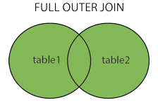

**Select 表**

**From 表1**

**【连接类型】Join 表2**

**On 连接条件**

**Where 筛选条件**

**Group by 分组**

**Having 分组后的筛选**

**Order by** 

**Limit** 

 


# 数据库设计


## ER模型


可以用D(A.主键 ,B.主键 ,C.主键)来表示ABC三个实体的关系

转化为ABCD 4个关系模式


## 数据流图DFD


顶层	描述输入输出

0层	分解加工	**外部实体和数据流不会被分解 ,也不会变**


* ==保持父子图平衡==
  * 名称一致  数量相同
  * 父图的一条输入对应子图的多条输入时,保持总体平衡
  * **输入/输出流不能单条出现在加工上**
  * 加工前后的输入输出匹配,如学生信息不能被加工为教师信息


* 黑洞	只有输入
* 奇迹    只有输出


### 弱/强实体

* 强实体不依赖于其他实体而存在

* **弱实体的主键存在外键** ,不依赖外键无法唯一标识
  * 没主码,只有部分码
  * 在和所依附的实体集的联系中，弱实体要全部参与


## 规范化理论

**部分依赖	AB->C, A->C**

**传递依赖	A->B ,B->C**


* 候选码	唯一标识元组,无冗余
  * 主属性   候选码的组成者

* 主键	候选码任选一个

* 外键	其他关系的主键


### 范式

* 第1范式    属性不可再分

* 第2范式    消除非主属性对候选码的部分依赖
* 第3范式    消除主属性对候选码的传递依赖
* BC范式    消除主属性对候选码的部分和传递依赖


### 完整性约束

* 实体完整性	主键非空,唯一
* 参照完整性    外键非空,存在
* 用户自定义完整性


## 设计原则


* 尽量把数据库设计的更小的占磁盘空间
* 使用更小的整数类型.(mediumint 就比 int 更合适)
* 尽可能的定义字段为 not null
* 如果定长就用char
* 主索引尽可能的短.这样每条纪录都有名字标志且更高效
* 只创建确实需要的索引。索引利于检索，不利于保存
* **所有数据都得在保存到数据库前进行处理**


# 关系代数

并

交

差		a-b ,去掉a中b有的部分

笛卡尔积

投影

选择

联接


## 内连接


## 等值连接

表示为R(a=b)S

==不去重==


## 自然连接


表示为RS

==去重==

对相同名称的列形成匹配	保留公共值


左连接


全连接	FULL OUTER JOIN




交叉连接/笛卡尔积	cross 

返回左表中的所有行，与右表中的所有行组合


### 区别

1、自然连接一定是等值连接，但等值连接不一定是自然连接。

2、等值连接要求相等的分量，不一定是公共属性；而自然连接要求相等的分量必须是公共属性。

3、等值连接不去重；而自然连接去重


 

# 指令


```mysql
show databases;
show tables;
select database();	显示当前的库
desc 表名;				查看表的设计
distinct				去重
Password(“字符”)		返回字符的加密

 
WHERE无法与聚合函数一起使用，使用 having来对查询结果进行筛选
```


 

# 四种外键约束

* No action：子表有匹配的记录,则不允许父表对应候选键update/delete

* Restrict：拒绝对父表的删除或更新操作

* cascade：同步update/delete子表

* set null：将子表上匹配记录的列设为null,此时子表的外键列不能为not null

  cascade和set null是容错能力比较强，并不是很严格，但可能会出导致业务上出问题，No action和Restrict是非常严格的，禁止对父表进行更新和删除，但在业务中有时我们又不得不进行对父表进行操作，而在No action和Restrict约束规则下，执行父表删或者更新时会报错：ERROR 1451


# 函数


## 空值判断


ifnull(字段,空值时的缺省值)		可以设置空值时的缺省值，常用于运算

<=> 安全等于，可判断空值也可运算

Is null 只能判断空值

 

## 字符函数

Length											获取参数的字节个数

**Concat(字段,’拼接符’,字段)**

Concat(字段,字段) as 字段名					字符串拼接

Upper大写 	lower 

Substr(字段,截取初始位置，截取长度) 		字符串截取	

 

Instr( 字段,’目标字符串’)				获取第一次出现的索引

 

### 字符串获取案例

类似于邮箱****@***的字符串，如果想要获取@之前的字符串，单靠substr并不能实现，因为substr只指定了截取初始位置和长度，而@之前的字符串字节数是不确定的，可以结合instr来获取具体要截取多少个字符

Select substr(email,1,instr(email,’@’,)-1) from 表

 

```mysql
Trim(选项 ‘去掉的字符’ from 字段) from 表			字符串去头去尾
		-选项：BOTH,LEADING,TRAILING			不指定去掉的字符串则去空格

LPAD (‘目标’,长度,’填充字符串’)	用指定的字符串填充至长度（左）

RPAD

Replace(‘目标’,’被替换’,’替换’)		字符串替换

```


### 去空格


* 存入了空格
  * Replace(column,' ','')

* 控制符显示为空格
  * 先查出相应的ASCII码，再用 Replace(column,char(ascii 码),'')


## 数学函数


```mysql
Round(字段,保留几位)		四舍五入，不指定小数默认整数
Ceil(字段)							向上取整
Floor										向下
Truncate(字段,保留位数)		截断（舍弃后几位）
Mod(字段,被除数)					取余
```


 

## 日期函数

```mysql
Now()	 		返回当前系统日期+时间
Curdate()						日期
Curtime()						时间
Monthname			以英文形式返回月
Datediff(日期1，日期2)							相差日期
Select year(日期)		提取日期中的年份
%Y			四位的年份
%y			
%m			月份(01,02…)
%c			月份(1,2…)
%d
%H			24小时制
%h			12小时制
%l			分钟
%s			秒
Str_to_date(‘字符串’,'%Y-%c-%d’)			字符串转换日期
Date_format(‘日期’,’%y%m%d’)				日期转换字符串
```


## Case 函数


```mysql
Case情况1
Case 变量/表达式/字段
When 常量1 then 值1
When 常量2 then 值2
Else 值n
End

Case 情况2
Case
When 条件1 then 值1
When 条件2 then 值2
Else 值n
End
```


## 分组函数

Sum、avg 一般用于处理数值型

Max min count 可以处理任何类型（包括字符串）

以上分组函数都忽略null值

 

Count(1)	count(*)	结果相等，效率相同，运算方法不同

count（1）是在原本的表上多加了一行，其值全为1，然后统计1的个数

count（*）是直接统计表中有几行

 

select 数值1 数值2 difference					两数之差


## 子查询

Any/some		与某一个值进行比较

All					所有值

 

Exists		判断是否存在，返回boolean

一般能用exists的都能用in来实现相同的功能


## 分页查询


```mysql
Limit offset，size			mysql offset的起始位置从0开始
对于第一页，起始位置0，第二页起始位置size，第三页size*2…….

Limit (page-1)*size,size;			实现分页

Order by + 分页获取最大值最小值数据
Order by 排序，第一个数值为最大/最小值，
Limit 1		获取第一个数值
```


```sql
#Oracle：通过 rownum 来实现
select * from ( select rownum rn,t.* from addressbook where rownum<=
20 ) where rownum > 10

Sqlserver:
select top 20 * from addressbook where id not in (select top 10 id from
addressbook)
```


## Union	联合查询

​					Where and  是将查询条件联合		union是将语句联合

 


## 自定义函数


sql自定义函数

```mysql
Create function 函数名（参数）
Returns 返回值类型
[with {Encryption | Schemabinding }]
[as]
begin
SQL语句(必须有return 变量或值)
End
```


* [with]为附加选项
  * 需要对函数体进行加密，用WITH ENCRYPTION；
  * 需要将创建的函数与引用的数据库绑定，用WITH SCHEMABINDING（**函数一旦绑定，则不能删除、修改，除非删除绑定**）


* DECLARE  在复合语句 (BEGIN...END) 中声明 SQL 变量或异常


# 视图

视图方便查询,不能插入修改删除		Vo适合插入修改删除

业务只需要查询时,用视图方便

 

MySQL视图是一个虚拟表,并不存在于数据库,数据在引用视图时动态生成,但是可以创建它的逆向工程

视图提高安全性:

* 只针对一张表建立视图,可以做到筛选字段进行展示

*  针对不同用户，设定不同的视图,能查询到不同的信息


# 事务


## ACID


* A 原子性：要么全部完成，要么全部不完成。发生错误就回滚

* C 一致性：事务前后，数据**完整性**没有被破坏。这表示写入符合所有的预设规则

* I 隔离性：**允许并发事务同时进行**，可以防止交叉执行而导致数据的不一致

* D 持久性：事务处理结束后，对数据的**修改是永久**的，即便系统故障也不会丢失


## 隔离4个级别


* 脏读	     select

* 不可重复读	update

* 幻读	    insert/delete


* 读未提交 可以读到未提交的内容。**查询不加锁**，一致性最差          脏读、不可重复读、幻读

* 读提交  只能读已经提交的内容。**SQLServer/Oracle默认**     不可重复读、幻读

  * 通过快照,使得没有加锁的查询，也能够==避免脏读==

* 可重复读	MySql默认                               幻读
  * 快照查询，**事务启动时不允许修改**,==避免“不可重复读”==
* 串行化

  * 最高的隔离级别，这种级别下，事务排队执行
  * “脏读”、“不可重复读”、“幻读”都可以被避免，但执行效率差，性能开销大


## 事务处理2种方法


* 用 BEGIN, ROLLBACK, COMMIT来实现
  * BEGIN 开始
  * ROLLBACK 回滚
  * COMMIT 确认

* 用 SET 来改变 MySQL 的自动提交模式:
  * SET AUTOCOMMIT=0 禁止自动提交
  * SET AUTOCOMMIT=1 开启自动提交


* S/X封锁协议

S封锁(共享锁)

X封锁(排他锁)


# 索引


索引虽然能非常高效的提高查询速度，同时却会降低更新表的速度。

索引也是一张表，该表保存了主键与索引字段，并指向实体表的记录，也要占用空间

* 普通索引：仅加速查询

* 唯一索引：加速查询 + 列值唯一（可以有null）

* 主键索引：加速查询 + 列值唯一（不可以有null）+ 表中只有一个

* 组合索引：多列值组成一个索引，专门用于组合搜索，其效率大于索引合并

* 全文索引：对文本的内容进行分词，进行搜索

* 聚簇索引 索引的叶子节点存储了整行数据,在查询时可以通过该索引直接得到该行数据

  * 字段必须为该表主键
  * ==表有且只有一个聚簇索引==,一般为该表主键,主键没有显示指定则其为数据库内置的一个主键
  * 表的数据都是存储在聚簇索引中的
  * 索引的存储结构只能为B+Tree

* 非聚簇索引
  * 除了聚簇外都是非聚簇索引(好像有点废话)

  * ==回表查询==:通过索引得到主键的值,再查询聚簇索引,得到数据

* 覆盖索引
  * 对于联合索引,在查询时select/where的字段都在索引中,就可以通过索引一次性拿到查询结果


## 索引设计


* 建索引
  * 优先用联合索引
  
  * 排序字段通过索引去访问,提高排序速度
  
  * 统计/分组字段
  
    


* 不建索引
  * 经常重复的字段  非聚集索引存储了对主键的引用，在通过索引确定叶子节点后，还需要再次根据主键去查询数据（会查询两次）
  * 经常修改的字段
  * 数据量小的表


## 为什么用B+树


* hashmap	无序,导致查数据需要遍历	并且不支持范围查询

* B+树的非叶子结点不包含Data ,能存储更多的索引
  * 这也使得B+树的高度低于B-树
* B+树支持范围查询,==叶子结点被链表连接==。 B-树范围查询只能中序遍历
  * 通过链表提高了区间访问性


### 最左匹配原则


查询优化器纠正sql该以什么样的顺序执行效率最高，不合理的sql语句将被重新设计后,再进行查询


==b+树按左->右顺序来建立搜索树==,首先比较最左,来确定下一步的索引方向


# 引擎

* MyISAM

  * 每个MyISAM在磁盘上存储成三个文件。
    * frm文件：存储表的定义数据
    * MYD文件：存放表具体记录的数据
    * MYI文件：存储索引
  * 三种支持数据的类型
    * **静态固定长度表   默认**
      * 存储速度非常快，容易缓存，而且表发生损坏后也容易修复
      * 缺点是占空间
    * 动态可变长表
      * 节省空间
      * 出错恢复麻烦
    * 压缩表
      * 支持压缩格式。在数据文件发生错误时候，可以使用check table工具来检查，而且还可以使用repair table工具来恢复。
      * **不支持事务，效率高**，如果你的读写操作允许有错误数据的话，只是追求速度，可以选择这个存储引擎

 

* InnoDB

  * **自增长**
  * 支持事务。默认隔离级别为**可重复读，通过MVCC（并发版本控制）实现**
  * **行级锁**，支持更高的并发
  * 支持外键,但增加了表的耦合度
  * 有缓冲管理，通过缓冲池加快查询的速度
  * 2种存储形式
    * 使用共享表空间存储：所有的表和索引存放在同一个表空间中
    * 使用多表空间存储：表结构放在frm文件，数据和索引放在IBD文件中。分区表的话，每个分区对应单独的IBD文件

 

* Memory

  * 将数据存在内存，为了提高数据的访问速度，每个表和一个磁盘frm文件关联
  * 支持的数据类型有限，不支持TEXT和BLOB类型，==对于字符串只支持固定长度，VARCHAR会被自动存储为CHAR==
  * 锁粒度为**表级锁**,性能低
  * 由于数据是存放在内存中，**一旦服务器出现故障，数据都会丢失**
  * 查询的时候，如果有用到临时表，而且临时表中有BLOB，TEXT类型的字段，那么这个临时表就会转化为MyISAM类型的表，性能会急剧降低
  * **默认用hash索引**
  * 表过大时会转化为磁盘表


# 连接池


* DBCP
  * 依赖 Jakarta commons-pool 对象池机制的数据库连接池.DBCP 可以直接 的在应用程序中使用，Tomcat 的数据源使用的就是 DBCP
* c3p0
  * 开放源代码的 JDBC 连接池，它在 lib 目录中与 Hibernate 一起发布,包括了 实现jdbc3和jdbc2扩展规范说明的Connection 和Statement 池的DataSources 对 象。
* Druid
  * 阿里出品，淘宝和支付宝专用数据库连接池，但它不仅仅是一个数据库连接池，它还包 含一个 ProxyDriver，一系列内置的 JDBC 组件库，一个 SQL Parser。支持所有 JDBC 兼容的数据库，包括 Oracle、MySql、Derby、Postgresql、SQL Server、H2 等等。


# 优化


* 检查不良的 SQL，考虑其写法是否还有可优化内容 

* 检查子查询 考虑 SQL 子查询是否可以用简单连接的方式进行重新书写 

* 检查优化索引的使用

* 考虑数据库的优化器

* 避免出现 SELECT * FROM table 语句，明确字段,减少对多余数据的读取包括多余的列与多余的行

* 在一个 SQL 语句中，如果一个 where 条件过滤的数据库记录越多，定位越准确，则该 where 条件越应该前移

* 尽可能使用索引覆盖。即对SELECT字段建立复合索引，这样查询时只进行索引扫描，不读取数据块

* 有无符合条件的记录时,不要用 SELECT COUNT （*）和 select top 1 

* 使用内层限定原则，将查询条件分解、分类，并尽量在SQL的最里层进行限定，以减少数据的处理量
* 避免在order by子句中使用表达式
* 如果需要从关联表读数据，关联的表一般不要超过 7 个
* ==<> 用 < 、 > 代替，>用>=代替，<用<=代替==
* 对于复合索引要注意，例如在建立复合索引时列的顺序是 F1，F2，F3，则在 where 或 order by 子句中这些字段出现的顺序要与建立索引时的字段顺序一致，且必须包含第 一列。只能是 F1 或 F1，F2 或 F1，F2，F3。否则不会用到该索引


避免在 where 中

* null值判断
*  !=或<>操作符
* or 连接符
* 表达式/函数/算数运算
* ==复合索引作为条件,索引中的第一个字段必须作为条件，并且字段顺序与索引顺序一致==   

```sql
select id from t where num is null    
-> 
select id from t where num=0  
```


慎用in 和 not in，否则会导致全表扫描

```mysql
select id from t where num in(1,2,3)    
#对于连续的数值，能用 between 就不要用 in 了：    
select id from t where num between 1 and 3    
```

用 exists 代替 in 

```mysql
select num from a where num in(select num from b)
->
select num from a where exists(select 1 from b where num=a.num)

# select 1 新建一列,有结果的行都置为1

select 1 from kc   增加临时列，每行的列值是写在select后的数，这条sql语句中是1

select count(1) from kc  不管count(a)的a值如何变化，得出的值总是kc表的行数

select sum(1) from kc  计算临时列的和
```


下面的查询也将导致全表扫描：   

```sql
select id from t where name like '%abc%'  
```


## limit优化


==子查询或者JOIN实现分页==

```mysql
SELECT * FROM tableName ORDER BY id LIMIT 50000,2;
->
#子查询方式，索引扫描
SELECT * FROM tableName
WHERE id >= (SELECT id FROM tableName ORDER BY id LIMIT 50000 , 1) LIMIT 2;

#JOIN分页方式
SELECT * FROM tableName AS t1 
JOIN (SELECT id FROM tableName ORDER BY id LIMIT 50000, 1) AS t2 
WHERE t1.id <= t2.id ORDER BY t1.id LIMIT 2;
```

进阶优化:运用策略模式处理分页,每页100条数据，判断如果是100页以内，就使用最基本的分页方式；如果大于100，则使用子查询的分页方式。

 

# sql注入


指web应用程序对用户输入数据的合法性没有判断或过滤不严，攻击者可以在事先定义好的**查询语句的结尾上添加额外的SQL语句**，实现欺骗数据库服务器执行非授权的任意查询


