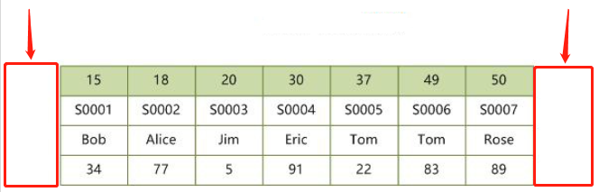

```sql
Select From 
【连接类型】Join 
On 连接条件
Where 筛选条件	#无法与聚合函数一起使用，使用 having对结果集筛选
Group by 分组
Having 分组后的筛选	HAVING不一定要有GROUP BY
Order by
Limit
```


DBMS	Database Management System 数据库管理系统


# Mysql架构


### 连接器

1. 验证用户账号密码
2. 验证通过后,去权限表中查询用户的所有权限，后续的权限判断都是依赖此时读取到的数据(修改权限只会在重新连接时生效)


### ~~查询缓存~~

**由于缓存命中率低,专门的缓存服务器出现,8.0+移除**


对应用程序透明,保存查询返回的完整结果,当查询命中缓存立即返回,跳过解析/优化/执行阶段

**只降低查询执行时间,无法减少结果集传输的网络消耗**

查询缓存系统会跟踪查询中设计的每张表,**当表发生变化,和表相关的所有缓存数据都将失效**,这个机制会影响服务器性能,在很多时候需要关闭查询缓存,或者是配置很小的查询缓存空间(几十兆)


### 解析器

==词法分析== 提取关键字解析sql,**生成解析树**

验证关键字顺序,符号的匹配


### 预处理器

==语法分析==

检查表/列是否存在,字段名是否存在歧义


### 优化器

选择它认为的最优的方案去执行,例如走哪个索引,调整关联表的顺序


### 执行器

根据执行计划给出的指令逐步执行,执行每条sql前都将**校验用户权限**,随后**调用存储引擎实现的接口**

存储引擎接口handle api功能丰富,但底层接口只有几十个,通过组合底层接口实现复杂功能,但这也为优化器的优化带来了限制

~~在查询语句可以缓存时,查询结束放入缓存~~


## 存储引擎

存储引擎采用的是**插件式架构**,并且是**基于表**的,可以为不同表设计不同的存储引擎

```mysql
show engines; #查看mysql支持的所有引擎

create table xxx( ) ENGINE = InnoDB;
```


|             | InnoDB                              | MyISAM                                  |
| ----------- | ----------------------------------- | --------------------------------------- |
| 锁          | **自增长行级锁**,表级锁             | 只支持表级锁,读取共享，写入排它         |
| 日志        | 支持redolog,支持灾难恢复            |                                         |
|             | MVCC,性能高                         |                                         |
| 索引        | B+Tree索引,数据文件本身就是索引文件 | B+Tree索引,数据和索引**分两个文件存储** |
| 外键        | √                                   | ×                                       |
| 热备份      | √                                   | ×                                       |
| 空间函数GIS |                                     | √                                       |
|             |                                     |                                         |
|             |                                     |                                         |
|             |                                     |                                         |


#### InnoDB

* 内部的优化:预读,在内存中创建hash索引以加速自适应hash索引,加速插入操作的插入缓冲区insert buffer
* **可预测性预读**,自动在内存中创建hash索引以加速读操作的自适应哈希索引

InnoDB会把表空间作为虚拟的文件系统,在其中管理所有表内容,从而支持超出文件系统存储长度


#### MyISAM

每个MyISAM在磁盘上存储成三个文件

* frm文件：表的定义
* MYD文件：数据
* MYI文件：索引  **多个索引保存在同一文件中**

数据行保存在MYD,索引保存在MYI,使得一张表可以有多个索引


三种支持数据的类型

**静态固定长度表   默认**,占空间大,效率高，容易缓存，损坏后容易修复

动态可变长表	空间小,出错恢复麻烦

==压缩表==


#### Memory

* 将数据存在**内存**(数据丢失问题)
* 每个表和一个磁盘frm文件关联,表过大时会转化为磁盘表
* 支持的数据类型有限，不支持TEXT和BLOB类型，==字符串只支持固定长度，VARCHAR->CHAR==
* 锁粒度为**表级锁**,性能低
* 查询时，如果用到临时表且有BLOB，TEXT字段，临时表转化为MyISAM引擎，性能急剧降低
* **默认用hash索引**


## 通信协议


Mysql客户端和服务器的通信是==半双工==的 -> 查询和返回结果集不能同时发生

这意味着Mysql无法做到流量控制:一端发生消息,**另一端要接收完整消息才能响应** -> 客户端无法终止服务端返回数据


客户端用单独的数据包将查询传给服务器,当查询语句很长时,max_allowed_packet就非常重要了


## SQL分类


| 查询语言DQL       | 操纵语言DML | 定义语言DDL(隐式提交,不能rollback) | 控制语言DCL                    |
| ----------------- | ----------- | ---------------------------------- | ------------------------------ |
| SELECT <字段名表> | INSERT      | CREATE VIEW/INDEX                  | ROLLBACK [WORK] TO [SAVEPOINT] |
| FROM <表或视图名> | UPDATE      |                                    | COMMIT [WORK]                  |
| WHERE <查询条件>  | DELETE      |                                    | GRANT授权                      |


## Buffer Pool

缓冲池是主存储器中的一个区域

`InnoDB`在访问 table 和索引数据时会对其进行缓存

为了提高大容量读取操作的效率，缓冲池被分为多个页，使用LRU算法的变体将很少使用的数据从缓存中老化掉

知道如何利用缓冲池将经常访问的数据保留在内存中是 MySQL 优化的重要方面


## Change Buffer


当页不在Buffer Pool中,**对二级索引页的修改**将缓存在Change Buffer中,这些更改将在触发读操作时被加载到Buffer Pool中合并

二级索引相对于聚簇索引,是不唯一的 -> 删除/更新可能会影响相邻的二级索引页,引发随机IO

通过Change Buffer合并对二级索引树的修改,避免了大量的随机IO


## Log Buffer

缓冲区大小由`innodb_log_buffer_size`定义。默认16MB	较大的日志缓冲区使大型事务可以运行


## Buffer Cache

当有请求数据，CPU就要去读取数据，如果直接从磁盘读取（并且数据量很大），那么会导致IO过高，速度过慢。

为了解决这个问题，就产生了“中间站” -- buffer cache（数据高速缓存区）{位于内存中}

所有请求的数据都会先写入到“中间站”，再定时将数据更新到磁盘中，这样就避免了点对点的压力过大


### 缓冲区策略

**steal**：commit前把内存中的数据写入磁盘。此时**需要undo**，在commit前宕机时,已经有数据写入磁盘，要恢复到崩溃前的状态必须undo这些写入操作，否则磁盘存在脏数据

no steal：不允许事务commit前把内存中的数据写入磁盘。不需要undo

force：内存中的数据最晚在commit的时候写入磁盘。不需要redo

**no force**：内存中的数据可以一直保留，在commit后延迟写入磁盘。此时需要redo，因为数据在系统崩溃的时候可能还没写入磁盘，如果不redo，磁盘上的数据就是不完整的


Mysql为steal/no force组合,能保证内存灵活调度，提高系统性能，但需要undo和redo


# 数据库设计


## 建模


### ER模型


可以用D(A.主键 ,B.主键 ,C.主键)来表示ABC三个实体的关系

转化为ABCD 4个关系模式


### 数据流图DFD


顶层	描述输入输出

0层	分解加工	**外部实体和数据流不会被分解 ,也不会变**


* ==保持父子图平衡==
  * 名称一致  数量相同
  * 父图的一条输入对应子图的多条输入时,保持总体平衡
  * **输入/输出流不能单条出现在加工上**
  * 加工前后的输入输出匹配,如学生信息不能被加工为教师信息


* 黑洞	只有输入
* 奇迹    只有输出


#### 弱/强实体

* 强实体不依赖于其他实体而存在

* **弱实体的主键存在外键** ,不依赖外键无法唯一标识
  * 没主码,只有部分码
  * 在和所依附的实体集的联系中，弱实体要全部参与


## 规范化理论


### 函数依赖

记 A-\>B 表示 A 函数决定 B，也可以说 B 函数依赖于 A

如果 {A1，A2，... ，An} 是关系的一个或多个属性的集合，该集合函数决定了关系的其它所有属性并且是最小的，那么该集合就称为键码

对于 A-\>B，如果能找到 A 的真子集 A'，使得 A'-\> B，那么 A-\>B 就是部分函数依赖，否则就是完全函数依赖


**部分依赖	AB->C, A->C**

**传递依赖	A->B ,B->C**


候选码	唯一标识元组,无冗余

主属性   候选码的组成者

主键	候选码任选一个

外键	其他关系的主键


### 范式

* 第1范式    属性不可再分

* 第2范式    消除非主属性对候选码的部分依赖
* 第3范式    消除主属性对候选码的传递依赖
* BC范式    消除主属性对候选码的部分和传递依赖


### 完整性约束

* 实体完整性	主键非空,唯一
* 参照完整性    外键非空,存在
* 用户自定义完整性


### 关系代数


并

交

差		a-b ,去掉a中b有的部分

笛卡尔积

投影

选择

连接


#### 连接


Inner 内连接 = Cross 交叉连接 = **笛卡尔积**

左表所有行与右表中的所有行的组合


* 等值连接
  * 表示为R(a=b)S
  * ==不去重==

* ==自然连接==

* 表示为RS
* ==去重==,对相同名称的列形成匹配	保留公共值
* 自然连接一定是等值连接，但等值连接不一定是自然连接
* 等值连接要求相等的字段，不一定是公共字段；而自然连接必须是公共字段
* 等值连接不去重；自然连接去重


Left Join


左表全保留,右表无匹配则Null


Natural Left Join会根据Left Join的规则,对左右表的同名列匹配 -> 不需要指定 on/using


* 全连接	FULL OUTER JOIN


### 4种外键约束


外键要求每次修改数据时都在外键表中额外执行一次查询,虽然InnoDB强制外键使用索引,但还是无法抵消这种约束检查带来的开销

当外键的选择性很低,将导致非常大的索引片

外键的额外查询也需要加读锁,会导致额外的锁等待


| No action | 子表有匹配的记录,则不允许父表对应候选键update/delete        |
| --------- | ----------------------------------------------------------- |
| Restrict  | 拒绝对父表的删除或更新操作                                  |
| cascade   | 同步update/delete子表                                       |
| set null  | 将子表上匹配记录的列设为null,此时子表的外键列不能为not null |


cascade 和 set null容错能力较强，并不是很严格，但可能会出导致业务上出问题，No action和Restrict是非常严格的，禁止对父表进行更新和删除，但在业务中有时我们又不得不进行对父表进行操作，而在No action和Restrict约束规则下，执行父表删或者更新时会报错：ERROR 1451


## 建库/表

1. 【强制】表达是与否概念的字段，数据类型必须是 unsigned tinyint
   说明：任何字段如果为非负数，必须是`unsigned`。 
   正例：表达逻辑删除的字段名`deleted`，1表示删除，0表示未删除。
2. 【强制】表名、字段名必须使用小写字母或数字，禁止出现数字开头，禁止两个下划线中间只出现数字。数据库字段名的修改代价很大，因为无法进行预发布，所以字段名称需要慎重考虑。 
   说明：MySQL在Windows下不区分大小写，但在Linux下默认是区分大小写。因此，数据库名、表名、字段名，都不允许出现任何大写字母，避免节外生枝。 
   正例：aliyun_admin，rdc_config，level3_name 
   反例：AliyunAdmin，rdcConfig，level_3_name
3. 【强制】表名不使用复数名词。 
   说明：表名应该仅仅表示表里面的实体内容，不应该表示实体数量，对应于Entity类名也是单数形式，符合表达习惯。
4. 【强制】禁用保留字，如`desc`、`range`、`match`、`delayed`等，请参考MySQL官方保留字。
5. 【强制】唯一索引名为uk_开头；普通索引名则为idx_开头。以表名/字段的名称或缩写作为后缀，表名、各字段名之间以下划线分隔。
6. 【强制】小数类型为decimal，禁止使用float和double。 
   说明：float和double在存储的时候，存在精度损失的问题，很可能在值的比较时，得到不正确的结果。如果存储的数据范围超过decimal的范围，建议将数据拆成整数和小数分开存储。
7. 【强制】varchar是可变长字符串，不预先分配存储空间，长度不要超过5000，如果存储长度大于此值，定义字段类型为text，独立出来一张表，用主键来对应，避免影响其它字段索引效率。
8. 【强制】每个表必须有一个主键，字段名为 id，类型为 unsigned bigint。 
   说明：自增主键如果是单表，步长为1；如果是分库分表，采用全局唯一 id 生成器生成步长为 1 的自增 ID。
9. 【强制】数据库中有关联关系的字段必须添加备注，备注格式："ref:关联表名.关联字段名, 备注内容"。主要目的是保证相关联字段数据类型保持一致。 
   正例：orders表的trade_id关联了trade.tid。则orders.trade_id comment "ref:trade.tid, 订单id"
10. 【推荐】每个表都应该包含两个由应用负责维护的时间字段，dx_created 和 dx_modified。两个字段都采用过去式，表示数据创建和修改的时间。禁止由 mysql 维护的自动更新的时间字段。
11. 【推荐】库名与应用名称尽量一致。
12. 【推荐】如果修改字段含义或对字段表示的状态追加时，需要及时更新字段注释。
13. 【推荐】字段允许适当冗余，以提高查询性能，但必须考虑数据一致。冗余字段应遵循：
     1）不是频繁修改的字段。
     2）不是varchar超长字段，更不能是text字段。 
    正例：商品类目名称使用频率高，字段长度短，名称基本一成不变，可在相关联的表中冗余存储类目名称，避免关联查询。
14. 【推荐】单表行数超过500万行或者单表容量超过2GB，才推荐进行分库分表。 
    说明：如果预计三年后的数据量根本达不到这个级别，请不要在创建表时就分库分表。
15. 【参考】合适的字符存储长度，不但节约数据库表空间、节约索引存储，更重要的是提升检索速度。 
    正例：如下表，其中无符号值可以避免误存负数，且扩大了表示范围。

| 对象     | 年龄区间  | 类型              | 字节 |
| -------- | --------- | ----------------- | ---- |
| 人       | 150岁之内 | unsigned tinyint  | 1    |
| 龟       | 数百岁    | unsigned smallint | 2    |
| 恐龙化石 | 数千万岁  | unsigned int      | 4    |
| 太阳     | 约50亿年  | unsigned bigint   |      |


### 连接池


* DBCP
  * 依赖 Jakarta commons-pool 对象池机制的数据库连接池.DBCP 可以直接 的在应用程序中使用，Tomcat 的数据源使用的就是 DBCP
* c3p0
  * 开放源代码的 JDBC 连接池
* Druid
  * 阿里出品，还包含ProxyDriver，一系列内置的 JDBC 组件库，一个SQL Parser。支持所有JDBC兼容的数据库


### 视图 306


```sql
CREATE VIEW "VIEW_NAME" AS "Sql";
```


视图方便查询,不能插入修改删除		Vo适合插入修改删除

业务只需要查询时,用视图方便

 

视图是虚拟表,并不存在于数据库,数据在引用视图时动态生成,但是可以创建它的逆向工程

视图提高安全性:

* 只针对一张表建立视图,可以做到筛选字段进行展示

* 针对不同用户，设定不同的视图,能查询到不同的信息


### 主从


==只能在主机里面执行DML语句,可以在从机执行查询,不要在从机操作！！！！==


Mysql主从又叫Replication、AB复制

A与B两台机器做主从后，在A上写数据，另外一台B也会跟着写数据，实现数据实时同步

mysql主从是基于**binlog，主需开启binlog才能进行主从**

 

* 主创建**同步账户**授权给从
* 主将更改操作记录到binlog里
* 从将主的binlog同步到本机,并记录到**relaylog**
* 从根据relaylog里面的sql语句按顺序执行


### 分区表 295


分区表是独立的逻辑表,底层由多个物理子表组成(索引由子表决定,没有全局索引)

分区对SQL层来说是透明的,但从底层的文件系统可以看出,每个分区表都有用#分隔命名的表文件

实现分区的代码实际上是对一组底层表的Handler Object句柄对象的封装

对分区表的请求会通过句柄对象转化成对存储引擎的接口调用

通过**Partition By**决定分区存放的数据,在执行查询时,优化器根据分区定义过滤分区

分区目的在于将数据按较粗的粒度分布在不同表,相关的数据存放在一起,利于批量操作


**限制**

分区字段中有主键/唯一索引的列,则所有主键列和唯一索引列都必须包括进来

分区表无法进行外键约束

子表的存储引擎必须一致


#### 水平切分

水平切分又称为 Sharding，它是将同一个表中的记录拆分到多个结构相同的表中。

当一个表的数据不断增多时，Sharding 是必然的选择，它可以将数据分布到集群的不同节点上，从而缓存单个数据库的压力


**Sharding策略**

- 哈希取模：hash(key) % N；
- 范围：可以是 ID 范围也可以是时间范围；
- 映射表：使用单独的一个数据库来存储映射关系。


**Sharding 存在的问题**

1. 事务问题	使用分布式事务来解决，比如 XA 接口。

2. 需要可以将原来的连接分解成多个单表查询，然后在用户程序中进行连接。

3. ID 唯一性

   使用全局唯一 ID（GUID）

   为每个分片指定一个 ID 范围

   分布式 ID 生成器 (如 Twitter 的 Snowflake 算法)


#### 垂直切分

垂直切分是将一张表按列切分成多个表，通常是按照列的关系密集程度进行切分，也可以利用垂直切分将经常被使用的列和不经常被使用的列切分到不同的表中。

在数据库的层面使用垂直切分将按数据库中表的密集程度部署到不同的库中，例如将原来的电商数据库垂直切分成商品数据库、用户数据库等


## 数据类型


越小越好	占用更少的磁盘,内存和CPU

越简单越好	整型比字符操作代价更低,因为字符集和校对/排序规则复杂

避免Null	查询中包含可为Null的列,会让索引和统计复杂


==InnoDB不会区别对待定长/变长的列,所有行都只使用一个指向列值的头指针== -> char不会比varchar更简单,真正重要的只有存储空间大小


为了兼容性支持了很多别名,如Integer,Bool,Numeric,别名的真实存储为基本类型,不影响性能


**额外的存储空间**:

字符集

是否可以为Null的标识位


### 整数

|           |      |                    |
| --------- | ---- | ------------------ |
| TINYINT   | 1    | (0，255)           |
| SMALLINT  | 2    | (0，65 535)        |
| MEDIUMINT | 3    | (0，16 777 215)    |
| Int       | 4    | (0，4 294 967 295) |
| BigInt    | 8    |                    |


可选的UNSIGNED属性,表示不允许负值,将使正数的上限翻倍

Tinyint.UNSIGNED 0~255		Tinyint -128~127


**为整数类型指定长度不会限制值的范围**,只限定显示字符的个数,不影响存储和计算


### 浮点数/实数


将数字打包成二进制字符串,每**4个字节存储9个数字**

Decimal(18,9)小数点两边将个存储9个数字,一共使用9个字节	小数点前4,小数点1,小数点后4


Decimal只作为存储格式,在计算时会转化成Double

也可以用Decimal存储比Bigint更大的数

在需要对小数进行精确计算时才用Decimal,否则将金额变为整数,用Bigint代替Decimal避免精确计算的高代价


Float 4字节,在存储相同范围的值时,会比Decimal使用更少的空间

float和double在存储的时候，存在精度丢失。如果存储的数据范围超过decimal的范围，建议将数据拆成整数和小数分开存储


### 字符


**假设字符集字节为k**

|                   | 定长                           | 最大长度(字节) | 存储字节 |      |      |      |
| ----------------- | ------------------------------ | -------------- | -------- | ---- | ---- | ---- |
| Binary(n)         | 用0x00补齐                     | n              | n        |      |      |      |
| VarBinary(n)      |                                | n              |          |      |      |      |
| Char(n)           | 空格补齐(读值时自动去末尾空格) | n              | nk       |      |      |      |
| VarChar(n)        |                                | n              |          |      |      |      |
| TinyBlob,TinyText |                                | 2^8^-1         |          |      |      |      |
| Blob,Text         |                                | 2^16^-1        |          |      |      |      |
|                   |                                |                |          |      |      |      |


#### 非二进制字符串


| Char                                                     | Varchar                                                      |
| -------------------------------------------------------- | ------------------------------------------------------------ |
| 定长,**不容易产生碎片**,自动删除所有末尾空格,最长255字符 | 在磁盘上为定长存储,==加载到内存为变长==,5000+的长度考虑用text,并将数据拆成独立的表 |
|                                                          | **额外需要1/2字节记录长度**: 长度 < 255字节? 1:2 字节        |
| 即使是null也会占用字节 -> 大量null的列,varchar更适合     |                                                              |
|                                                          | 适合于字符串列的最大长度比平均长度大很多,列的更新少          |
|                                                          | 比char更节省空间,但当行占用空间变长,页内没有多余空间时,InnoDB需要分裂页来支持变长 |
|                                                          |                                                              |


#### 二进制字符串


Binary

存储少量二进制字符串的字符码


Blob / Text

Blob 存储二进制		Text存储字符

适合存储大量字符串,会使用专门的存储区域进行存储,需要行内的1~4字节存储指针,指向专门的存储区域


Enum代替字符串

可以把不重复的字符串存储成预定义的集合

会根据列表值的数量压缩到1~2字节,将每个值在列表的位置保存为整数,并在表的.frm文件中保存的"数字-字符串"映射关系中查找

缺点:字符串列表固定,添加/删除字符必须Alert Table


#### 编码长度限制

latin11字符，每个字符占1字节

gbk字符，每个字符占2字节，最大长度不能超过32766

utf8字符，每个字符占3字节，最大长度不能超过21845

若定义的时超过上述限制，则varchar字段会被强行转为text类型


#### 行长度限制

**行的定义长度不能超过65535**.若定义的表长度超过这个值，则提示

ERROR 1118 (42000): Row size too large. The maximum row size for the used table type, not counting BLOBs, is 65535. You have to change some columns to TEXT or BLOBs


#### 字符集


所有的字符存储与表示，均以utf-8编码


|         | 1    |                                      |
| ------- | ---- | ------------------------------------ |
| latin   | 1    |                                      |
| utf8    | 1~3  | 与UTF-8编码方案对应                  |
| utf8mb4 | 1~4  | 包含utf8所有字符,额外4字节的补充字符 |
| utf16   |      | 2~4                                  |
|         |      |                                      |


**字符统计函数的区别**

```mysql
SELECT LENGTH("轻松工作")； 返回12

SELECT CHARACTER_LENGTH("轻松工作")； 返回4
```


utf8mb4	存储表情


### 时间日期

Mysql能存储的最小时间粒度为秒.但也可以用微秒进行临时运算

|           |            | 字节 |                    |                             |
| --------- | ---------- | ---- | ------------------ | --------------------------- |
| Date      | CCYY-MM-DD | 3    |                    | 适合日期函数的计算          |
| Time      | hh:mm:ss   |      |                    |                             |
| Year      | CCYY / YY  |      |                    |                             |
| DateTime  |            | 8    | 1001~9999年        | 范围大,**与时区无关**       |
| TimeStamp |            | 4    | 1970.1.1~2038.1.19 | 与UNIX时间戳相同,与时区有关 |


提供FROM_UNIXTIME()函数把 UNIX 时间戳转换为日期，并提供了 UNIX_TIMESTAMP() 函数把日期转换为 UNIX 时间戳


**字符串存储日期的缺陷:**

1. 字符串占用空间更大
2. 字符串存储的日期比较效率比较低（逐个字符进行比对），无法用日期相关的 API 进行计算和比较


### Boolean

1:True	0:False


### 枚举


会根据列表值的数据压缩到1-2字节中,将映射存储在表的frm文件中,并在**列中存储整数**


### Null

关键词之一,不需要加引号,不区分大小写,还会把转义符\N识别为Null

**与任何数值运算结果都为null**


在唯一索引中,由于Null互不相等 -> null能插入唯一索引


==字段定义为not null==

MySQL难以优化引用了可空列的查询,会使索引、索引统计和值更加复杂

可空列需要更多的储存空间，还需要在MySQL内部进行特殊处理。当可空列被索引的时候，每条记录都需要一个额外的字节


# Explain


Explain Partitions	显示查询将访问的分区


存在子查询时,先执行子查询并将结果放入临时表,再进行外部查询优化

这代表着在查询优化之前需要完成所有子查询的查询,当子查询复杂时,也会消耗性能


**限制**

无法表述触发器/存储过程/UDF会如何影响查询

无法展示Mysql在查询执行中进行的特定优化

不区分相同名称的事物:内存/临时表排序都叫FileSort,磁盘和内存中的临时表都叫Using Temporary

只能解释Select语句


## id

标识Select所属的行(原始语句中的位置),不存在子查询时为1

id↑ -> 越早被执行	id相同 -> 从上到下执行


## select_type


Simple 简单查询	表示不包含子查询和Union

Primary 复杂查询	简单子查询 / 派生表(From中的子查询) / Union


当查询为复杂查询,最外层标记为Primary,内层标记为:

SubQuery	包含在Select列表中的子查询(不在From)

Derived	包含在From中的子查询,会生成临时表,进行嵌套递归

Union	Union中的第二个和随后的Select都标记为Union.第一个Select以外查询执行,为Primary;Union被From子句中的子查询包含,第一个Select标记为Derived

Union Result	从Union的匿名临时表检索结果的Select


## table

表名/表别名	正从磁盘/内存访问表

Derived + N	访问临时表

union result	访问union的结果集


## type

访问类型

system > const > eq_ref > ref > fulltext > ref_or_null > index_merge > unique_subquery > index_subquery > range > index > ALL


All	全表扫描,存在例外:Limit,或者在Extra列中Using distinct/not exists

index	按索引顺序全表扫描,无需排序	通常意味着不按索引顺序进行扫描时,开销非常大

range	只检索给定范围的行，使用一个索引来选择行。key列显示使用了哪个索引

index_subquery	利用索引来关联子查询,无需扫描全表

unique_subquery	唯一索引关联子查询

index_merge	需要多个索引组合,但未能模拟出结果

ref	非唯一索引访问,返回若干个匹配某个值的行

ref_or_null	需要在ref的基础上进行二次查找,字段既需要关联条件,也可能为null的情况

eq_ref	唯一索引,只有一行的结果集,效率高

const	优化时可以转化成常量 / 表中只有一个一个匹配行 -> 将表从关联中移除

system	表中只有一行记录(多见于系统表)

Null	在优化中分解查询语句,在执行阶段无需访问表或索引(走索引查找最大最小值)


## possible_key

候选索引,基于访问的列和比较操作符进行推断


## key

真正采用的索引,不走索引为null,覆盖索引为查询的select字段


## key_len

根据表定义推算出**单个索引的最大字节数**(包括字符集),不是表中数据实际的字节数

如果列定义为允许null,还需额外的1字节

列为变长类型,还需要额外2字节


## ref

索引中用到的索引列,也有可能是常量


## rows

预估读取的行数,不代表真实读取的行数


## filtered

仅在使用Explain Extended时出现,表示结果集占全表的百分比


## Extra

| Using where                                                  | 回表后进行过滤                                               |
| ------------------------------------------------------------ | ------------------------------------------------------------ |
| Using index                                                  | 覆盖索引                                                     |
| using index & using where                                    | 索引被用于查找主键,需要回表                                  |
| using index condition                                        | 查询列不完全被索引覆盖,但查询条件可以用索引                  |
| Using temporary                                              | 排序时使用临时表                                             |
| [Using temporary;Using filesort](#Usingtemporary;Usingfilesort) | 对临时表进行排序后,再用临时表进行关联;最后的结果集再进行一次排序 |
| [Using filesort](#Usingfilesort)                             | 使用内存/磁盘排序,排序列都来自关联的第一张表,在关联处理第一张表时就进行了文件排序 |
| Using Join Buffer                                            | 使用连接缓存,未能成功模拟场景                                |
| Null                                                         | 未被索引覆盖 && where筛选列是索引的前导列，通过索引查找并回表找到未被索引覆盖的字段 |
|                                                              |                                                              |


# 函数


SQL的关键词和函数名不区分大小写

```
select = SELECT = SeLeCt
```


```mysql
show variables	#查看数据库配置
select database();	显示当前的库
desc 表名;				查看表的设计
```


## 空值判断


ifnull(字段,缺省值)		可以设置空值时的缺省值


<=> 安全等于，可判断空值也可运算


## Case


```mysql
Case情况1
Case 变量/表达式/字段
When 常量1 then 值1
When 常量2 then 值2
Else 值n
End

Case 情况2
Case
When 条件1 then 值1
When 条件2 then 值2
Else 值n
End
```


## 分页


```mysql
Limit offset，size			mysql offset的起始位置从0开始
对于第一页，起始位置0，第二页起始位置size，第三页size*2…….

Limit (page-1)*size,size;			实现分页

Order by + 分页获取最大值最小值数据
Order by 排序，第一个数值为最大/最小值，
Limit 1		获取第一个数值
```


### 排序字段不唯一会导致翻页时重复记录


```mysql
-- 有8条记录
SELECT *  FROM t2 ORDER BY created DESC;
+----+---------------------+
| id | created             |
+----+---------------------+
|  2 | 2017-07-10 08:36:29 |
|  4 | 2017-07-07 16:14:30 |
|  3 | 2017-07-07 15:47:34 |
|  1 | 2017-07-07 10:25:54 |
|  6 | 2017-07-05 02:02:28 |
|  5 | 2017-06-03 00:33:05 |
|  7 | 2017-06-03 00:33:05 |
|  8 | 2017-06-03 00:33:05 |
+----+---------------------+

-- 第一页
SELECT *  FROM t2 ORDER BY created DESC LIMIT 0,6;
+----+---------------------+
| id | created             |
+----+---------------------+
|  2 | 2017-07-10 08:36:29 |
|  4 | 2017-07-07 16:14:30 |
|  3 | 2017-07-07 15:47:34 |
|  1 | 2017-07-07 10:25:54 |
|  6 | 2017-07-05 02:02:28 |
|  8 | 2017-06-03 00:33:05 |
+----+---------------------+

-- 第二页，出现重复记录 id=8
SELECT *  FROM t2 ORDER BY created DESC LIMIT 6,6;
+----+---------------------+
| id | created             |
+----+---------------------+
|  7 | 2017-06-03 00:33:05 |
|  8 | 2017-06-03 00:33:05 |
+----+---------------------+
```

当排序字段的值相同时,mysql不能保证结果集的顺序固定

避免出现排序字段值相同而导致的无序 -> 翻页时重复		需要额外增加排序字段


当未指定OrderBy时,按索引顺序排序

增，删，改可能导致查询结果集变化或者乱序


## Count

统计列值	count(col)		==不统计null==,性能较慢

统计行数	count(1) / count(*)	统计NULL


有时某些业务不需要精确的Count值,可以用近似值代替

可以**用Explain优化器估算的行数代替Count**,此时并没有真正的执行查询

或者是**剔除某些查询条件**,在统计活跃人数时,要过滤离线人数,还要过滤特定ID的人,去掉某些特定条件能够加速查询,但不会过于影响结果


## OrderBy


2种排序方式:IndexSort , FileSort

index ：通过有序索引顺序扫描直接返回有序数据，不需要额外的排序，效率高

filesort：并不代表通过磁盘文件排序，只说明进行了排序操作，filesort通过相应的排序算法，将数据在内存排序区sort_buffer_size进行排序，如果内存装载不下，它就将磁盘上的数据进行分块，再对各个数据块进行排序，然后合并成有序的结果集

sort_buffer_size是每个线程独占的，**同一时刻存在多个sort buffer排序区**


优化：==尽量减少额外排序，通过索引直接返回有序的数据==。谓词和order by 使用了相同的索引，并且order by 的顺序和索引顺序相同，并且order by 的字段都是升序或者降序，否则肯定需要filesort


以下SQL不可以使用索引：

select * from tablename order by key_part1 desc,key_part2 asc; ----order by 的字段混合asc,desc

select * from tablename where key2=constant order by key1; ----用于查询的关键字与order by 中所使用的不相同

select * from tablename order by key1,key2;   ----对不同的关键字使用order by

 

对于Filesort，MySQL有两种排序算法 ：

一次扫描算法和两次扫描算法，通过比较系统变量max_length_for_sort_data的大小和query语句总字段的大小来判断使用哪种排序算法。

适当增加 max_length_for_sort_data的值，适当增加sort_buffer_size排序区，尽量使用具体的字段而不是select * 选择所有字段


## GroupBy


#### group by 什么情况下需要用 order by null

在此只讨论group by无法使用索引直接分组，需要使用临时表的情况。

1. MySQL group by的做法：

   默认按分组字段排序:

```sql
-- 使用索引(`user_id`,`pay_time`,`tid`,`status`,`buyer_nick`,`payment`)，下同
SELECT count(*) paynum,sum(payment) paymentSum  
FROM trade_info  
WHERE user_id=619123122 
  AND pay_time>"2017-09-10" AND pay_time<="2017-09-17"
GROUP BY `buyer_nick`;
```

```sql
-- 执行计划
+----+-------------+------------+-------+-----------------------------+-----------------------------+---------+------+--------+-----------------------------------------------------------+
| id | select_type | table      | type  | possible_keys               | key                         | key_len | ref  | rows   | Extra                                                     |
+----+-------------+------------+-------+-----------------------------+-----------------------------+---------+------+--------+-----------------------------------------------------------+
|  1 | SIMPLE      | trade_info | range | idx_ti_uid_pt_tid_sta_bn_pm | idx_ti_uid_pt_tid_sta_bn_pm | 14      | NULL | 830346 | Using where; Using index; Using temporary; Using filesort |
+----+-------------+------------+-------+------------------------------------------+-----------------------------+---------+------+--------+----------------------------------------------+
```

查询等价于下面sql:   

```sql
SELECT count(*) paynum,sum(payment) paymentSum  
FROM trade_info  
WHERE user_id=619123122 
  AND pay_time>"2017-09-10" AND pay_time<="2017-09-17"
GROUP BY `buyer_nick` 
ORDER BY `buyer_nick`;
```

如果不想对结果集进行排序，需要加上ORDER BY NULL.

```sql
SELECT count(*) paynum,sum(payment) paymentSum  
FROM trade_info  
WHERE user_id=619123122 
  AND pay_time>"2017-09-10" AND pay_time<="2017-09-17"
GROUP BY `buyer_nick` 
ORDER BY NULL;
```

```sql
-- 执行计划
+----+-------------+------------+-------+-----------------------------+-----------------------------+---------+------+--------+-------------------------------------------+
| id | select_type | table      | type  | possible_keys               | key                         | key_len | ref  | rows   | Extra                                     |
+----+-------------+------------+-------+-----------------------------+-----------------------------+---------+------+--------+-------------------------------------------+
|  1 | SIMPLE      | trade_info | range | idx_ti_uid_pt_tid_sta_bn_pm | idx_ti_uid_pt_tid_sta_bn_pm | 14      | NULL | 830346 | Using where; Using index; Using temporary |
+----+-------------+------------+-------+------------------------------------------+-----------------------------+---------+------+--------+------------------------------+
```

1. 有没有order by null的性能测试对比：

```sql
-- 对比1
SELECT count(*) paynum,sum(payment) paymentSum  
FROM trade_info  
WHERE user_id=619123122 
  AND pay_time>"2017-09-10" AND pay_time<="2017-09-17"
GROUP BY `buyer_nick`;
-- 391753 rows in set (33.30 sec)

    SELECT count(*) paynum,sum(payment) paymentSum  
FROM trade_info  
WHERE user_id=619123122 
  AND pay_time>"2017-09-10" AND pay_time<="2017-09-17"
GROUP BY `buyer_nick` 
ORDER BY NULL;
-- 391753 rows in set (11.67 sec)
```

    ```sql

-- 对比2
SELECT count(*) paynum,sum(payment) paymentSum  
FROM trade_info  
WHERE user_id=619123122 
  AND pay_time>"2017-09-10" AND pay_time<="2017-09-17"
GROUP BY `status`;
-- 4 rows in set (3.08 sec)

    SELECT count(*) paynum,sum(payment) paymentSum  

FROM trade_info  
WHERE user_id=619123122 
  AND pay_time>"2017-09-10" AND pay_time<="2017-09-17"
GROUP BY `status` 
ORDER BY NULL;
-- 4 rows in set (3.06 sec)

```
2. group by 执行过程：

    (1). 创建内存临时表，存储引擎为MEMORY，各字段定义为固定长度，长度为列的最大可能长度。表结构为：

        - 有一个唯一键，即group by的列，这里为buyer_nick

        - select的列，包括聚合函数的列，本例中为sum(payment)的值，字段类型为bigint

    (2). 从InnoDB存储引擎表读取一条记录，先在临时表中查找唯一键，若唯一键值不存在，则insert，否则更新相同KEY的total_pay的值，循环往复

    (3). 以group by的key(buyer_nick)对临时表进行文件排序(filesort)；如果有order by null, 则不排序

    (4). 发送结果

1. 临时表分两种：

    |临时表类型|存储位置|存储引擎|
|:---|:---|:---|
|内存临时表 |内存| MEMORY|
|磁盘临时表 | 磁盘|MyISAM|

1. 默认创建内存临时表，内存临时表的大小可根据上面提到的临时表结构来估算，当内存临时表大小大于(tmp_table_size， max_heap_table_size两者中的最小值，默认16M, 淘宝RDS为2M)时，内存临时表自动转化磁盘临时表。如果会产生磁盘临时表，应尽量优化避免。
​```sql
> show global variables like '%table_size%';
+---------------------+----------+
| Variable_name       | Value    |
+---------------------+----------+
| max_heap_table_size | 67108864 |
| tmp_table_size      | 2097152 |
+---------------------+----------+
```

1. 如何判断查询是否使用了临时表：

   使用explain查看执行计划，Extra列看到Using temporary就意味着使用了临时表。

```sql
> show global status like '%created_tmp%_tables';
+-------------------------+-------+
| Variable_name           | Value |
+-------------------------+-------+
| Created_tmp_disk_tables | 152   |
| Created_tmp_tables      | 500   |
+-------------------------+-------+
-- 使用了内存临时表时，Created_tmp_tables状态变量+1
-- 使用了磁盘临时表时，Created_tmp_disk_tables状态变量+1
```

1. MySQL在以下几种情况会创建临时表：

   (1)、UNION查询；

   (2)、用到TEMPTABLE算法或者是UNION查询中的视图；

   (3)、FROM中的子查询（派生表）；

   (4)、子查询或者semi-join时创建的表；

   (5)、ORDER BY和GROUP BY的子句不一样时；

   (6)、DISTINCT查询并且加上ORDER BY时；

   (7)、SQL中用到SQL_SMALL_RESULT修饰符的查询；

   (8)、insert ... select 操作同一个表；

   (9)、GROUP BY无法在索引上直接分组时；

1. 在以下几种情况下，会创建磁盘临时表：

   (1)、表中存在BLOB/TEXT列；

   (2)、在 GROUP BY 或者 DSTINCT 的列中有超过512字符的字符类型列（或者超过 512字节的 二进制类型列）；

   (3)、在UNION、UNION ALL查询中，select的列存在最大长度超过512的列（对于字符串类型是512个字符，对于二进制类型则是512字节）；

   (4)、对含有BLOB列的表执行SHOW COLUMNS/FIELDS、DESCRIBE等SQL命令时。


>  最佳实践：

1. 如果group by的结果集较大时，建议加上order by null，能显著提高性能。结果集越大，性能提高越大，如果是内存临时表，性能差别不大。
2. group by 性能由好到差：松散索引扫>紧凑索引扫描>内存临时表>磁盘临时表不排序>磁盘临时表排序。
3. 考虑避免分组，直接按组分别查询提高性能


## Union


结果集的列名来自第一个Select的列名

单个Union结果集列数必须相等,各列的数据类型在不相同的情况下,会自动类型转换

**Union去重**	==Union All不去重==


**Order By / Limit**

需要将每个Union子句括起来,在最后加上第一个Select的列名/别名

==如果排序列在第一个Select的结果集为TableName.ColName形式,则必须为它指定别名==

```mysql
(Select i,c From t1) Union (Select i,d From t3)
Order By c;

(Select i,c From t1) Union (Select i,d From t3)
Limit 2;
```


## WITH TIES


把与最后一条记录值相同的数据也放入列表中

一般和Top , order by相结合使用


## 字符串函数

| 函数                        | 描述                                                         | 实例                                                         |
| :-------------------------- | :----------------------------------------------------------- | :----------------------------------------------------------- |
| ASCII(s)                    | 返回 s 的第一个字符的 ASCII 码                               |                                                              |
| CHAR_LENGTH(s)              | 返回字符串 s 的字符数                                        | 返回字符串 RUNOOB 的字符数`SELECT CHAR_LENGTH("RUNOOB") AS LengthOfString;` |
| CHARACTER_LENGTH(s)         | 返回字符串 s 的字符数                                        | 返回字符串 RUNOOB 的字符数`SELECT CHARACTER_LENGTH("RUNOOB") AS LengthOfString;` |
| CONCAT(s1,s2...sn)          | 字符串 s1,s2 等多个字符串合并为一个字符串                    | 合并多个字符串`SELECT CONCAT("SQL ", "Runoob ", "Gooogle ", "Facebook") AS ConcatenatedString;` |
| CONCAT_WS(x, s1,s2...sn)    | 同 CONCAT(s1,s2,...) 函数，但是每个字符串之间要加上 x，x 可以是分隔符 | 合并多个字符串，并添加分隔符：`SELECT CONCAT_WS("-", "SQL", "Tutorial", "is", "fun!")AS ConcatenatedString;` |
| FIELD(s,s1,s2...)           | 返回第一个字符串 s 在字符串列表(s1,s2...)中的位置            | 返回字符串 c 在列表值中的位置：`SELECT FIELD("c", "a", "b", "c", "d", "e");` |
| FIND_IN_SET(s1,s2)          | 返回在字符串s2中与s1匹配的字符串的位置                       | 返回字符串 c 在指定字符串中的位置：`SELECT FIND_IN_SET("c", "a,b,c,d,e");` |
| FORMAT(x,n)                 | 函数可以将数字 x 进行格式化 "#,###.##", 将 x 保留到小数点后 n 位，最后一位四舍五入。 | 格式化数字 "#,###.##" 形式：`SELECT FORMAT(250500.5634, 2);     -- 输出 250,500.56` |
| INSERT(s1,x,len,s2)         | 字符串 s2 替换 s1 的 x 位置开始长度为 len 的字符串           | 从字符串第一个位置开始的 6 个字符替换为 runoob：`SELECT INSERT("google.com", 1, 6, "runoob");  -- 输出：runoob.com` |
| LOCATE(s1,s)                | 从字符串 s 中获取 s1 的开始位置                              | 获取 b 在字符串 abc 中的位置：`SELECT LOCATE('st','myteststring');  -- 5`返回字符串 abc 中 b 的位置：`SELECT LOCATE('b', 'abc') -- 2` |
| LCASE(s)                    | 将字符串 s 的所有字母变成小写字母                            | 字符串 RUNOOB 转换为小写：`SELECT LCASE('RUNOOB') -- runoob` |
| LEFT(s,n)                   | 返回字符串 s 的前 n 个字符                                   | 返回字符串 runoob 中的前两个字符：`SELECT LEFT('runoob',2) -- ru` |
| LOWER(s)                    | 将字符串 s 的所有字母变成小写字母                            | 字符串 RUNOOB 转换为小写：`SELECT LOWER('RUNOOB') -- runoob` |
| LPAD(s1,len,s2)             | 在字符串 s1 的开始处填充字符串 s2，使字符串长度达到 len      | 将字符串 xx 填充到 abc 字符串的开始处：`SELECT LPAD('abc',5,'xx') -- xxabc` |
| LTRIM(s)                    | 去掉字符串 s 开始处的空格                                    | 去掉字符串 RUNOOB开始处的空格：`SELECT LTRIM("    RUNOOB") AS LeftTrimmedString;-- RUNOOB` |
| MID(s,n,len)                | 从字符串 s 的 n 位置截取长度为 len 的子字符串，同 SUBSTRING(s,n,len) | 从字符串 RUNOOB 中的第 2 个位置截取 3个 字符：`SELECT MID("RUNOOB", 2, 3) AS ExtractString; -- UNO` |
| POSITION(s1 IN s)           | 从字符串 s 中获取 s1 的开始位置                              | 返回字符串 abc 中 b 的位置：`SELECT POSITION('b' in 'abc') -- 2` |
| REPEAT(s,n)                 | 将字符串 s 重复 n 次                                         | 将字符串 runoob 重复三次：`SELECT REPEAT('runoob',3) -- runoobrunoobrunoob` |
| **REPLACE(s,s1,s2)**        |                                                              | 将字符串 abc 中的字符 a 替换为字符 x：`SELECT REPLACE('abc','a','x') --xbc` |
| REVERSE(s)                  | 将字符串s的顺序反过来                                        | 将字符串 abc 的顺序反过来：`SELECT REVERSE('abc') -- cba`    |
| RIGHT(s,n)                  | 返回字符串 s 的后 n 个字符                                   | 返回字符串 runoob 的后两个字符：`SELECT RIGHT('runoob',2) -- ob` |
| RPAD(s1,len,s2)             | 在字符串 s1 的结尾处添加字符串 s2，使字符串的长度达到 len    | 将字符串 xx 填充到 abc 字符串的结尾处：`SELECT RPAD('abc',5,'xx') -- abcxx` |
| RTRIM(s)                    | 去掉字符串 s 结尾处的空格                                    | 去掉字符串 RUNOOB 的末尾空格：`SELECT RTRIM("RUNOOB     ") AS RightTrimmedString;   -- RUNOOB` |
| SPACE(n)                    | 返回 n 个空格                                                | 返回 10 个空格：`SELECT SPACE(10);`                          |
| STRCMP(s1,s2)               | 比较字符串 s1 和 s2，如果 s1 与 s2 相等返回 0 ，如果 s1>s2 返回 1，如果 s1<s2 返回 -1 | 比较字符串：`SELECT STRCMP("runoob", "runoob");  -- 0`       |
| SUBSTR(s, start, length)    | 从字符串 s 的 start 位置截取长度为 length 的子字符串         | 从字符串 RUNOOB 中的第 2 个位置截取 3个 字符：`SELECT SUBSTR("RUNOOB", 2, 3) AS ExtractString; -- UNO` |
| SUBSTRING(s, start, length) | 从字符串 s 的 start 位置截取长度为 length 的子字符串         | 从字符串 RUNOOB 中的第 2 个位置截取 3个 字符：`SELECT SUBSTRING("RUNOOB", 2, 3) AS ExtractString; -- UNO` |
| TRIM(s)                     | 去掉字符串 s 开始和结尾处的空格                              | 去掉字符串 RUNOOB 的首尾空格：`SELECT TRIM('    RUNOOB    ') AS TrimmedString;` |
| UCASE(s)                    | 将字符串转换为大写                                           | 将字符串 runoob 转换为大写：`SELECT UCASE("runoob"); -- RUNOOB` |
| UPPER(s)                    | 将字符串转换为大写                                           | 将字符串 runoob 转换为大写：`SELECT UPPER("runoob"); -- RUNOOB` |


### 邮箱截取


如果想要获取@之前的字符串，单靠substr并不能实现，因为substr只指定了截取初始位置和长度，而@之前的字符串字节数是不确定的，可以结合instr来获取具体要截取多少个字符

Select substr(email,1,instr(email,’@’,)-1) from 表


## 数字函数

| 函数名                             | 描述                                                         | 实例                                                         |
| :--------------------------------- | :----------------------------------------------------------- | :----------------------------------------------------------- |
| ABS(x)                             | 返回 x 的绝对值                                              | 返回 -1 的绝对值：`SELECT ABS(-1) -- 返回1`                  |
| ACOS(x)                            | 求 x 的反余弦值(参数是弧度)                                  | `SELECT ACOS(0.25);`                                         |
| ASIN(x)                            | 求反正弦值(参数是弧度)                                       | `SELECT ASIN(0.25);`                                         |
| ATAN(x)                            | 求反正切值(参数是弧度)                                       | `SELECT ATAN(2.5);`                                          |
| ATAN2(n, m)                        | 求反正切值(参数是弧度)                                       | `SELECT ATAN2(-0.8, 2);`                                     |
| AVG(expression)                    | 返回一个表达式的平均值，expression 是一个字段                | 返回 Products 表中Price 字段的平均值：`SELECT AVG(Price) AS AveragePrice FROM Products;` |
| CEIL(x)                            | 上取整                                                       | `SELECT CEIL(1.5) -- 返回2`                                  |
| CEILING(x)                         | 返回大于或等于 x 的最小整数                                  | `SELECT CEILING(1.5); -- 返回2`                              |
| COS(x)                             | 求余弦值(参数是弧度)                                         | `SELECT COS(2);`                                             |
| COT(x)                             | 求余切值(参数是弧度)                                         | `SELECT COT(6);`                                             |
| COUNT(expression)                  | 返回查询的记录总数，expression 参数是一个字段或者 * 号       | 返回 Products 表中 products 字段总共有多少条记录：`SELECT COUNT(ProductID) AS NumberOfProducts FROM Products;` |
| DEGREES(x)                         | 将弧度转换为角度                                             | `SELECT DEGREES(3.1415926535898) -- 180`                     |
| n DIV m                            | 整除，n 为被除数，m 为除数                                   | 计算 10 除于 5：`SELECT 10 DIV 5;  -- 2`                     |
| EXP(x)                             | 返回 e 的 x 次方                                             | 计算 e 的三次方：`SELECT EXP(3) -- 20.085536923188`          |
| FLOOR(x)                           | 下取整                                                       | 小于或等于 1.5 的整数：`SELECT FLOOR(1.5) -- 返回1`          |
| GREATEST(expr1, expr2, expr3, ...) | 返回列表中的最大值                                           | 返回以下数字列表中的最大值：`SELECT GREATEST(3, 12, 34, 8, 25); -- 34`返回以下字符串列表中的最大值：`SELECT GREATEST("Google", "Runoob", "Apple");   -- Runoob` |
| LEAST(expr1, expr2, expr3, ...)    | 返回列表中的最小值                                           | 返回以下数字列表中的最小值：`SELECT LEAST(3, 12, 34, 8, 25); -- 3`返回以下字符串列表中的最小值：`SELECT LEAST("Google", "Runoob", "Apple");   -- Apple` |
| LN                                 | 返回数字的自然对数，以 e 为底。                              | 返回 2 的自然对数：`SELECT LN(2);  -- 0.6931471805599453`    |
| LOG(x) 或 LOG(base, x)             | 返回自然对数(以 e 为底的对数)，如果带有 base 参数，则 base 为指定带底数。 | `SELECT LOG(20.085536923188) -- 3 SELECT LOG(2, 4); -- 2`    |
| LOG10(x)                           | 返回以 10 为底的对数                                         | `SELECT LOG10(100) -- 2`                                     |
| LOG2(x)                            | 返回以 2 为底的对数                                          | 返回以 2 为底 6 的对数：`SELECT LOG2(6);  -- 2.584962500721156` |
| MAX(expression)                    | 返回字段 expression 中的最大值                               | 返回数据表 Products 中字段 Price 的最大值：`SELECT MAX(Price) AS LargestPrice FROM Products;` |
| MIN(expression)                    | 返回字段 expression 中的最小值                               | 返回数据表 Products 中字段 Price 的最小值：`SELECT MIN(Price) AS MinPrice FROM Products;` |
| MOD(x,y)                           | 取余                                                         | 5 除于 2 的余数：`SELECT MOD(5,2) -- 1`                      |
| PI()                               | 圆周率                                                       |                                                              |
| POW(x,y)                           | 返回 x 的 y 次方                                             | 2 的 3 次方：`SELECT POW(2,3) -- 8`                          |
| POWER(x,y)                         | 返回 x 的 y 次方                                             | 2 的 3 次方：`SELECT POWER(2,3) -- 8`                        |
| RADIANS(x)                         | 将角度转换为弧度                                             | 180 度转换为弧度：`SELECT RADIANS(180) -- 3.1415926535898`   |
| RAND()                             | 返回 0 到 1 的随机数                                         | `SELECT RAND() --0.93099315644334`                           |
| ROUND(x)                           | 返回离 x 最近的整数                                          | `SELECT ROUND(1.23456) --1`                                  |
| SIGN(x)                            | 返回 x 的符号，x 是负数、0、正数分别返回 -1、0 和 1          | `SELECT SIGN(-10) -- (-1)`                                   |
| SIN(x)                             | 求正弦值(参数是弧度)                                         | `SELECT SIN(RADIANS(30)) -- 0.5`                             |
| SQRT(x)                            | 返回x的平方根                                                | 25 的平方根：`SELECT SQRT(25) -- 5`                          |
| SUM(expression)                    | 返回指定字段的总和                                           | 计算 OrderDetails 表中字段 Quantity 的总和：`SELECT SUM(Quantity) AS TotalItemsOrdered FROM OrderDetails;` |
| TAN(x)                             | 求正切值(参数是弧度)                                         | `SELECT TAN(1.75);  -- -5.52037992250933`                    |
| TRUNCATE(x,y)                      | 返回数值 x 保留到小数点后 y 位的值（与 ROUND 最大的区别是不会进行四舍五入） | `SELECT TRUNCATE(1.23456,3) -- 1.234`                        |


## 日期函数

| 函数名                            | 描述                                                         | 实例                                                         |
| :-------------------------------- | :----------------------------------------------------------- | :----------------------------------------------------------- |
| ADDDATE(d,n)                      | 计算起始日期 d 加上 n 天的日期                               | `SELECT ADDDATE("2017-06-15", INTERVAL 10 DAY); ->2017-06-25` |
| ADDTIME(t,n)                      | n 是一个时间表达式，时间 t 加上时间表达式 n                  | 加 5 秒：`SELECT ADDTIME('2011-11-11 11:11:11', 5); ->2011-11-11 11:11:16 (秒)`添加 2 小时, 10 分钟, 5 秒:`SELECT ADDTIME("2020-06-15 09:34:21", "2:10:5");  -> 2020-06-15 11:44:26` |
| CURDATE()                         | 返回当前日期                                                 | `SELECT CURDATE(); -> 2018-09-19`                            |
| CURRENT_DATE()                    | 返回当前日期                                                 | `SELECT CURRENT_DATE(); -> 2018-09-19`                       |
| CURRENT_TIME                      | 返回当前时间                                                 | `SELECT CURRENT_TIME(); -> 19:59:02`                         |
| CURRENT_TIMESTAMP()               | 返回当前日期和时间                                           | `SELECT CURRENT_TIMESTAMP() -> 2018-09-19 20:57:43`          |
| CURTIME()                         | 返回当前时间                                                 | `SELECT CURTIME(); -> 19:59:02`                              |
| DATE()                            | 从日期或日期时间表达式中提取日期值                           | `SELECT DATE("2017-06-15");     -> 2017-06-15`               |
| **DATEDIFF(d1,d2)**               | 相差日期                                                     | `SELECT DATEDIFF('2001-01-01','2001-02-02') -> -32`          |
| DATE_ADD(d，INTERVAL expr type)   | 计算起始日期 d 加上一个时间段后的日期                        | `SELECT ADDDATE('2011-11-11 11:11:11',1) -> 2011-11-12 11:11:11  (默认是天) SELECT ADDDATE('2011-11-11 11:11:11', INTERVAL 5 MINUTE) -> 2011-11-11 11:16:11 (TYPE的取值与上面那个列出来的函数类似)` |
| DATE_FORMAT(d,f)                  | 按表达式 f的要求显示日期 d                                   | `SELECT DATE_FORMAT('2011-11-11 11:11:11','%Y-%m-%d %r') -> 2011-11-11 11:11:11 AM` |
| DATE_SUB(date,INTERVAL expr type) | 函数从日期减去指定的时间间隔。                               | Orders 表中 OrderDate 字段减去 2 天：`SELECT OrderId,DATE_SUB(OrderDate,INTERVAL 2 DAY) AS OrderPayDate FROM Orders` |
| DAY(d)                            | 返回日期值 d 的日期部分                                      | `SELECT DAY("2017-06-15");   -> 15`                          |
| DAYNAME(d)                        | 返回日期 d 是星期几，如 Monday,Tuesday                       | `SELECT DAYNAME('2011-11-11 11:11:11') ->Friday`             |
| DAYOFMONTH(d)                     | 计算日期 d 是本月的第几天                                    | `SELECT DAYOFMONTH('2011-11-11 11:11:11') ->11`              |
| DAYOFWEEK(d)                      | 日期 d 今天是星期几，1 星期日，2 星期一，以此类推            | `SELECT DAYOFWEEK('2011-11-11 11:11:11') ->6`                |
| DAYOFYEAR(d)                      | 计算日期 d 是本年的第几天                                    | `SELECT DAYOFYEAR('2011-11-11 11:11:11') ->315`              |
| EXTRACT(type FROM d)              | 从日期 d 中获取指定的值，type 指定返回的值。 type可取值为： MICROSECONDSECONDMINUTEHOURDAYWEEKMONTHQUARTERYEARSECOND_MICROSECONDMINUTE_MICROSECONDMINUTE_SECONDHOUR_MICROSECONDHOUR_SECONDHOUR_MINUTEDAY_MICROSECONDDAY_SECONDDAY_MINUTEDAY_HOURYEAR_MONTH | `SELECT EXTRACT(MINUTE FROM '2011-11-11 11:11:11')  -> 11`   |
| FROM_DAYS(n)                      | 计算从 0000 年 1 月 1 日开始 n 天后的日期                    | `SELECT FROM_DAYS(1111) -> 0003-01-16`                       |
| HOUR(t)                           | 返回 t 中的小时值                                            | `SELECT HOUR('1:2:3') -> 1`                                  |
| LAST_DAY(d)                       | 返回给给定日期的那一月份的最后一天                           | `SELECT LAST_DAY("2017-06-20"); -> 2017-06-30`               |
| LOCALTIME()                       | 返回当前日期和时间                                           | `SELECT LOCALTIME() -> 2018-09-19 20:57:43`                  |
| LOCALTIMESTAMP()                  | 返回当前日期和时间                                           | `SELECT LOCALTIMESTAMP() -> 2018-09-19 20:57:43`             |
| MAKEDATE(year, day-of-year)       | 基于给定参数年份 year 和所在年中的天数序号 day-of-year 返回一个日期 | `SELECT MAKEDATE(2017, 3); -> 2017-01-03`                    |
| MAKETIME(hour, minute, second)    | 组合时间，参数分别为小时、分钟、秒                           | `SELECT MAKETIME(11, 35, 4); -> 11:35:04`                    |
| MICROSECOND(date)                 | 返回日期参数所对应的微秒数                                   | `SELECT MICROSECOND("2017-06-20 09:34:00.000023"); -> 23`    |
| MINUTE(t)                         | 返回 t 中的分钟值                                            | `SELECT MINUTE('1:2:3') -> 2`                                |
| MONTHNAME(d)                      | 返回日期当中的月份名称，如 November                          | `SELECT MONTHNAME('2011-11-11 11:11:11') -> November`        |
| MONTH(d)                          | 返回日期d中的月份值，1 到 12                                 | `SELECT MONTH('2011-11-11 11:11:11') ->11`                   |
| NOW()                             | 返回当前日期和时间                                           | `SELECT NOW() -> 2018-09-19 20:57:43`                        |
| PERIOD_ADD(period, number)        | 为 年-月 组合日期添加一个时段                                | `SELECT PERIOD_ADD(201703, 5);    -> 201708`                 |
| PERIOD_DIFF(period1, period2)     | 返回两个时段之间的月份差值                                   | `SELECT PERIOD_DIFF(201710, 201703); -> 7`                   |
| QUARTER(d)                        | 返回日期d是第几季节，返回 1 到 4                             | `SELECT QUARTER('2011-11-11 11:11:11') -> 4`                 |
| SECOND(t)                         | 返回 t 中的秒钟值                                            | `SELECT SECOND('1:2:3') -> 3`                                |
| SEC_TO_TIME(s)                    | 将以秒为单位的时间 s 转换为时分秒的格式                      | `SELECT SEC_TO_TIME(4320) -> 01:12:00`                       |
| STR_TO_DATE(string, format_mask)  | 将字符串转变为日期                                           | `SELECT STR_TO_DATE("August 10 2017", "%M %d %Y"); -> 2017-08-10` |
| SUBDATE(d,n)                      | 日期 d 减去 n 天后的日期                                     | `SELECT SUBDATE('2011-11-11 11:11:11', 1) ->2011-11-10 11:11:11 (默认是天)` |
| SUBTIME(t,n)                      | 时间 t 减去 n 秒的时间                                       | `SELECT SUBTIME('2011-11-11 11:11:11', 5) ->2011-11-11 11:11:06 (秒)` |
| SYSDATE()                         | 返回当前日期和时间                                           | `SELECT SYSDATE() -> 2018-09-19 20:57:43`                    |
| TIME(expression)                  | 提取传入表达式的时间部分                                     | `SELECT TIME("19:30:10"); -> 19:30:10`                       |
| TIME_FORMAT(t,f)                  | 按表达式 f 的要求显示时间 t                                  | `SELECT TIME_FORMAT('11:11:11','%r') 11:11:11 AM`            |
| TIME_TO_SEC(t)                    | 将时间 t 转换为秒                                            | `SELECT TIME_TO_SEC('1:12:00') -> 4320`                      |
| TIMEDIFF(time1, time2)            | 计算时间差值                                                 | `SELECT TIMEDIFF("13:10:11", "13:10:10"); -> 00:00:01`       |
| TIMESTAMP(expression, interval)   | 单个参数时，函数返回日期或日期时间表达式；有2个参数时，将参数加和 | `SELECT TIMESTAMP("2017-07-23",  "13:10:11"); -> 2017-07-23 13:10:11` |
| TO_DAYS(d)                        | 计算日期 d 距离 0000 年 1 月 1 日的天数                      | `SELECT TO_DAYS('0001-01-01 01:01:01') -> 366`               |
| WEEK(d)                           | 计算日期 d 是本年的第几个星期，范围是 0 到 53                | `SELECT WEEK('2011-11-11 11:11:11') -> 45`                   |
| WEEKDAY(d)                        | 日期 d 是星期几，0 表示星期一，1 表示星期二                  | `SELECT WEEKDAY("2017-06-15"); -> 3`                         |
| WEEKOFYEAR(d)                     | 计算日期 d 是本年的第几个星期，范围是 0 到 53                | `SELECT WEEKOFYEAR('2011-11-11 11:11:11') -> 45`             |
| YEAR(d)                           | 返回年份                                                     | `SELECT YEAR("2017-06-15"); -> 2017`                         |
| YEARWEEK(date, mode)              | 返回年份及第几周（0到53），mode 中 0 表示周天，1表示周一，以此类推 | `SELECT YEARWEEK("2017-06-15"); -> 201724`                   |

------

## 高级函数

| 函数名                                                       | 描述                                                         | 实例                                                         |
| :----------------------------------------------------------- | :----------------------------------------------------------- | :----------------------------------------------------------- |
| BIN(x)                                                       | 返回 x 的二进制编码                                          | 15 的 2 进制编码:`SELECT BIN(15); -- 1111`                   |
| BINARY(s)                                                    | 将字符串 s 转换为二进制字符串                                | `SELECT BINARY "RUNOOB"; -> RUNOOB`                          |
| `CASE expression    WHEN condition1 THEN result1    WHEN condition2 THEN result2   ...    WHEN conditionN THEN resultN    ELSE result END` | CASE 表示函数开始，END 表示函数结束。如果 condition1 成立，则返回 result1, 如果 condition2 成立，则返回 result2，当全部不成立则返回 result，而当有一个成立之后，后面的就不执行了。 | `SELECT CASE  　WHEN 1 > 0 　THEN '1 > 0' 　WHEN 2 > 0 　THEN '2 > 0' 　ELSE '3 > 0' 　END ->1 > 0` |
| CAST(x AS type)                                              | 转换数据类型                                                 | 字符串日期转换为日期：`SELECT CAST("2017-08-29" AS DATE); -> 2017-08-29` |
| COALESCE(expr1, expr2, ...., expr_n)                         | 返回参数中的第一个非空表达式（从左向右）                     | `SELECT COALESCE(NULL, NULL, NULL, 'runoob.com', NULL, 'google.com'); -> runoob.com` |
| CONNECTION_ID()                                              | 返回唯一的连接 ID                                            | `SELECT CONNECTION_ID(); -> 4292835`                         |
| CONV(x,f1,f2)                                                | 返回 f1 进制数变成 f2 进制数                                 | `SELECT CONV(15, 10, 2); -> 1111`                            |
| CONVERT(s USING cs)                                          | 函数将字符串 s 的字符集变成 cs                               | `SELECT CHARSET('ABC') ->utf-8     SELECT CHARSET(CONVERT('ABC' USING gbk)) ->gbk` |
| CURRENT_USER()                                               | 返回当前用户                                                 | `SELECT CURRENT_USER(); -> guest@%`                          |
| DATABASE()                                                   | 返回当前数据库名                                             | `SELECT DATABASE();    -> runoob`                            |
| IF(expr,v1,v2)                                               | 如果表达式 expr 成立，返回结果 v1；否则，返回结果 v2。       | `SELECT IF(1 > 0,'正确','错误')     ->正确`                  |
| [IFNULL(v1,v2)](https://www.runoob.com/mysql/mysql-func-ifnull.html) | 如果 v1 的值不为 NULL，则返回 v1，否则返回 v2。              | `SELECT IFNULL(null,'Hello Word') ->Hello Word`              |
| ISNULL(expression)                                           | 判断表达式是否为 NULL                                        | `SELECT ISNULL(NULL); ->1`                                   |
| LAST_INSERT_ID()                                             | 返回最近生成的 AUTO_INCREMENT 值                             | `SELECT LAST_INSERT_ID(); ->6`                               |
| NULLIF(expr1, expr2)                                         | 比较两个字符串，如果字符串 expr1 与 expr2 相等 返回 NULL，否则返回 expr1 | `SELECT NULLIF(25, 25); ->`                                  |
| SESSION_USER()                                               | 返回当前用户                                                 | `SELECT SESSION_USER(); -> guest@%`                          |
| SYSTEM_USER()                                                | 返回当前用户                                                 | `SELECT SYSTEM_USER(); -> guest@%`                           |
| USER()                                                       | 返回当前用户                                                 | `SELECT USER(); -> guest@%`                                  |


## 自定义函数


sql自定义函数

```mysql
Create function 函数名（参数）
Returns 返回值类型
[with {Encryption | Schemabinding }]
[as]
begin
SQL语句(必须有return 变量或值)
End
```


* [with]为附加选项
  * 需要对函数体进行加密，用WITH ENCRYPTION；
  * 需要将创建的函数与引用的数据库绑定，用WITH SCHEMABINDING（**函数一旦绑定，则不能删除、修改，除非删除绑定**）


* DECLARE  在复合语句 (BEGIN...END) 中声明 SQL 变量或异常


# 存储结构


`.ibd`的文件由多个段（segments）组成，每个段和一个索引相关

文件的结构是不随数据行的删除而变化的，但段则会跟着构成它的区变化。区仅存在于段内，并且每个区都是固定的1MB大小（页体积默认的情况下）。页则是区的下一级构成单位，默认体积为16KB。

按这样算，一个区可以容纳最多64个页，一个页可以容纳2~N个行。行的数量取决于它的大小，由你的表结构定义。InnoDB要求**每页至少要有两个行**，因此可以算出行的大小最多为8000 bytes


```shell
ROOT NODE #3: 4 records, 68 bytes
 NODE POINTER RECORD ≥ (id=2) → #197
 INTERNAL NODE #197: 464 records, 7888 bytes
 NODE POINTER RECORD ≥ (id=2) → #5
 LEAF NODE #5: 57 records, 7524 bytes			叶子节点#5有57行记录，共7524 bytes
 RECORD: (id=2) → (uuid="884e471c-0e82-11e7-8bf6-08002734ed50", millid=139, kwatts_s=1956, date="2017-05-01", location="For beauty's pattern to succeeding men.Yet do thy", active=1, time="2017-03-21 22:05:45", strrecordtype="Wit")
```

根节点作为B树的入口,**根节点（页）**包含了如索引ID、INodes数量等信息。INode页包含了关于页本身的信息、值的范围等。最后还有叶子节点，也就是我们数据实际所在的位置

InnoDB会将数据以分支、页和记录的形式组织起来。**InnoDB不是按行的来操作的**，它可操作的最小粒度是页，页加载进内存后才会通过扫描页来获取行/记录


## 页


页中的行记录按主键顺序来排列


MERGE_THRESHOLD属性决定了页合并的时机,默认为页大小的一半


表和索引行都存储在页中 -> 页大小只决定了存储多少索引/表行,行记录的最大长度,以及需要多少页来存储,页大小决定,但不影响查询性能


当表和索引被**加载/重组时,每页都会预留空闲空间**,以满足加入新索引/表行


### 页合并


在删除记录时，标记flaged为删除,这部分空间变得允许被其他记录声明使用


页中剩余记录达到MERGE_THRESHOLD，寻找相邻页（前/后）,判断能否将两个页合并


### 页分裂


插入页#10,空间不足,并且页#11也空间不足时


1. 创建新页#12
2. 判断页#10可以从哪里进行分裂（记录行层面）
3. 移动#10的部分记录行至#12
4. 重新定义页的关系 #10 -> #12 -> #11

虽然保证了B树水平方向上的一致性,但导致物理存储乱序,不同的页分散至不同的区


MERGE_THRESHOLD定义的过大 -> 索引占用空间↓ 页空间利用率过高 -> 页分裂频繁

​					过小 -> 空间利用率↓ 索引占用空间↑


一旦页分裂导致物理存储区乱序,只有2种方法恢复:

1. 新分裂出来的页因为低于合并阈值（merge threshold）,触发页合并被删除

2. 用`OPTIMIZE`重新整理表,是唯一将大量分布在不同区的页理顺的方法,耗时长


在合并/分裂时，InnoDB会在索引树上加写锁（x-latch）。在操作频繁的系统中这可能会是个隐患。它可能会导致索引的锁争用（index latch contention）。如果表中没有合并和分裂（也就是写操作）的操作，称为“乐观”更新，只需要使用读锁（S）。带有合并也分裂操作则称为“悲观”更新，使用写锁（X）


# 事务

**一次事务中使用多种存储引擎会导致无法回滚**

MySQL服务器层不管理事务，由下层的存储引擎实现


**BEGIN, ROLLBACK, COMMIT 实现事务**

```mysql
Set AUTOCOMMIT = 1/ON 启用(默认)	0/OFF禁用
```

回滚包括事务的提交状态,在事务前自动提交,事务中关闭自动提交,则Rollback后依然是自动提交


**保存点**

SavePoint保存点支持对事务的部分回滚

```mysql
create table t (i INT) ENGINE = InnoDB;
Begin;
Insert Into t Values(1);
SavePoint sp;
Insert Into t Values(2);	//相当于只执行了1,3的插入语句
RollBack to SavePoint sp;
Insert Into t Values(3);
Commit;
```


InnoDB通过 ⽇志和锁 来保证的事务的 ACID特性

1. 数据库锁保障事务的隔离性
2. Redo Log（重做⽇志）保障事务的持久性. 操作数据前, 将新数据备份到redo log, 事务提交时只需要保证redo log已持久化, 不需要将数据持久化, 在恢复数据时只需要根据redo log恢复数据即可
3. Undo Log （撤销⽇志）保障事务的原⼦性/⼀致性. 操作数据前, 先将数据在undo log备份, 在需要回滚时可以将数据恢复到事务开始前的状态


## 隔离级别

mysql的隔离级别是基于锁和MVCC共同实现的

基于MVCC:RC,RR的快照读	基于锁:RC的当前读,SERIALIZABLE

```mysql
#设置隔离等级
SET [GLOBAL|SESSION] TRANSACTION ISOLATION LEVEL {level};
#[READ UNCOMMITTED|READ COMMITTED|REPEATABLE READ|SERIALIZABLE]
```


|               |   脏读 select    |        不可重复读 update         |       幻读 insert/delete       |
| :-----------: | :--------------: | :------------------------------: | :----------------------------: |
| Read Uncommit |                  |                                  |                                |
|  Read Commit  |        ×         |                                  |                                |
| Read Repeate  |        ×         |          快照+==事务==           |     [MVCC/NK锁](#避免幻读)     |
| SERIALIZABLE  |        ×         |                ×                 |               ×                |
|               | 读到没提交的数据 | 两次查询结果的**数据内容**不一致 | 两次查询结果的**记录数**不一致 |


**可重复读和读提交是矛盾的**。可重复读看不到其他事务的提交，违背了读提交；如果可重复读严格遵守读提交，就会导致前后两次读到的结果不一致，违背可重复读


### 避免幻读

Mysql提供两种事务隔离技术避免幻读

| MVCC(乐观)                        | NK锁==真正避免幻读==(悲观) |
| --------------------------------- | -------------------------- |
| 不加锁,生成读视图,并发高          | 加锁                       |
| 不是即时数据,依靠历史数据避免幻读 | 即时数据                   |


| 事务A                                               | 事务B            |
| --------------------------------------------------- | ---------------- |
| select -> 结果集A                                   |                  |
|                                                     | insert && commit |
| select -> 结果集B == A                              |                  |
| 对所有行记录update -> 所有行的**事务id被更新**      |                  |
| **select -> 结果集C 包含了事务B插入的数据 -> 幻读** |                  |


## 封锁协议


X 排它锁 eXclusive locks

S 共享锁 Shared locks

U 更新锁 Update locks

I 增量锁 Incremental locks


### 三级封锁协议


| 0级  | 有写请求加X锁,写完释放           |                              |          |
| ---- | -------------------------------- | ---------------------------- | -------- |
| 1级  | 写数据加X锁，事务结束释放        | 不会丢失修改                 | 读提交   |
| 2级  | 读写互斥 读数据S锁，**读完释放** | 不会在修改事务过程中读取数据 | 可重复读 |
| 3级  | 读数据S锁，**事务结束释放**      | 避免读事务中数据变化         | 串行化   |


### 两阶段协议

Two Phase Locking Protocal 2PL

加锁/解锁分两个阶段进行,**加锁时不能解锁,解锁时不能加锁** -> 加解锁原子性 -> 隔离性


### 可串行化调度

**调度包含的事务都是良构的且两阶段，使得并发/串行的执行结果相同**


**良构**的事务	锁粒度细,有多个种类，事务结束释放锁

[两阶段协议](#两阶段协议)

合理的**调度**	调度是一组事务的操作的合并结果,调度过程中不出现两个不同事务的锁冲突


## 分布式XA事务


(全局)事务管理器(TM: Transaction Manager)	-Binlog

(局部)资源管理器(RM: Resource Manager)		-Mysql本身


### 内部事务

Mysql中各个存储引擎是完全独立(参与者),所以跨存储引擎的事务需要一个外部的协调者

如果没有协调者,事务提交就只是顺序地要求各个存储引擎各自提交,在提交过程中发生错误,就会破坏事务特性

**将binlog看作独立的引擎,在存储引擎提交事务时,需要将提交信息写入binlog,这就是分布式事务,不过事务的参与者是Mysql本身**

当事务开启二进制日志时,至少需要调用3次fsync(),1次二进制日志持久化,2次事务日志持久化


为了兼容非事务引擎的复制，bin记录所有引擎中的修改操作，但这导致redo与bin的一致性问题

* 单台MySQL服务器中，binlog作为TM，多个数据库实例作为RM,属于**跨库事务**
* ==内部XA保证redo和binlog的一致性==


* InnoDB prepare,write/sync redo log
  * 引擎启动,同步redo log,**binlog不作任何操作**
* write/sync Binlog
  * 写入binlog，MySQL认为事务已提交并持久化,==立即将新增的binlog发送给订阅者,降低主从延迟==
  * 这时就算数据库崩溃，重启MySQL后仍能恢复事务
* commit
  * 大部分都是内存操作(不是事务的commit)，如释放锁，释放mvcc相关的read view等
  * MySQL认为这一步不会发生任何错误，一旦发生了错误就崩溃,不会回滚
  * 提交后，更新的数据才能被外部查询


### 外部事务

分布式事务依托于==两阶段提交==实现

事务协调器保证所有事务参与者完成准备工作 **(第1阶段)**

协调器收到所有参与者都准备好的信息,通知事务可以提交 **(第2阶段)**


* prepare 准备提交
  * TM向所有涉及到的RM发出prepare
  * RM收到请求后执行数据修改和日志记录等处理，处理完后把事务的状态改成**"可以提交"**,结果返回给TM

* commit  确认提交
  * TM收到回应，任何一个RM的操作错误/收不到回应，事务失败，回滚所有RM的事务
  * 全部成功，TM向RM发出commit，RM把事务的**"可以提交"改为"提交完成"**，然后返回应答
  * RM收不到commit，也会把"可以提交"回滚


## 只读事务

Read-Only transaction

InnoDB通过如下两种方式来判断一个事务是否为只读事务
１）在InnoDB中通过 start transaction read only 命令来开启，只读事务是指在事务中只允许读操作，不允许修改操作。如果在只读事务中尝试对数据库做修改操作会报错，报错后该事务依然是只读事务，'ERROR 1792 (25006): Cannot execute statement in a READ ONLY transaction.'
２）autocommit 开关打开，并且语句是单条语句，并且这条语句不使用 FOR UPDATE/LOCK IN SHARE MODE 的 SELECT 语句
优势：１）只读事务避免了为事务分配事务ID(TRX_ID域)的开销；２）对于密集读的场景，可以将一组查询请求包裹在只读事务中，既能提高性能，又能保证查询数据的一致性。


## 事务中的非事务性语句


对于非事务性语句（insert，delete）遵循3条规则：

* 非事务性语句被标记事务性，写入Redo
* 没标记事务性，Redo中有，写入Redo
* 没标记事务性，Redo中没有，则直接写入binlog

在一个事务中有非事务性语句，优先将非事务语句直接写入binlog


## mini transaction

保证并发事务下数据页中数据的一致性,主要用于redo / undo log写入


加锁、写日志到 mlog 等操作在 mini transaction 过程中进行

解锁、日志刷盘等操作全部在 mtr_commit 中进行，和事务类似

mini transaction 没有回滚操作， 因为只有在 mtr_commit 才将修改落盘，如果宕机，内存丢失，无需回滚；如果落盘过程中宕机，崩溃恢复时可以看出落盘过程不完整，丢弃这部分修改


mtr_commit 主要包含以下步骤

1. mlog 中日志刷盘
2. 释放 mtr 持有的锁，锁信息保存在 memo 中，以栈形式保存，后加的锁先释放
3. 清理 mtr 申请的内存空间，memo 和 log
4. mtr—>state 设置为 MTR_COMMITTED


上面的步骤 1. 中，日志刷盘策略和 innodb_flush_log_at_trx_commit 有关

- 当设置该值为1时，每次事务提交都要做一次fsync，这是最安全的配置，即使宕机也不会丢失事务
- 当设置为2时，则在事务提交时只做write操作，只保证写到系统的page cache，因此实例crash不会丢失事务，但宕机则可能丢失事务
- 当设置为0时，事务提交不会触发redo写操作，而是留给后台线程每秒一次的刷盘操作，因此实例crash将最多丢失1秒钟内的事务


### 三个原则


**The FIX Rules**

修改需要获得该页的x-latch;访问需要获得该页的s/x-latch

持有latch直到修改/访问页的操作完成


<a name="WriteAheadLog">Write-Ahead Log</a> 预先日志持久化

持久化数据页前，必须先将内存中相应的日志页持久化

每个页都有 **日志序号**(LSN:Log sequence number),每次页修改需要维护LSN,当页需要持久化时，要求内存中小于该页LSN的日志必须先持久化

==只保证单个数据页一致性，无法保证事务持久性 : 事务可以同时修改多个页==


<a name="ForceLogAtCommit">Force Log at commit</a>

事务提交时，其产生所有的mini-transaction日志必须先持久化

这样即使在页数据刷盘的时候宕机，也可以通过日志进行redo恢复


### 数据结构

mini transaction 的信息保存在结构体 mtr_t 中，结构体成员描述如下

| 成员属性      | 描述                                                         |
| :------------ | :----------------------------------------------------------- |
| state         | mini transaction所处状态 MTR_ACTIVE, MTR_COMMITTING, MTR_COMMITTED |
| memo          | mtr 持有锁的栈                                               |
| log           | mtr产生的日志                                                |
| inside_ibuf   | insert buffer 是否修改                                       |
| modifications | 是否修改buffer pool pages                                    |
| made_dirty    | 是否产生buffer pool脏页                                      |
| n_log_recs    | log 记录数                                                   |
| n_freed_pages | 释放page数                                                   |
| log_mode      | 日志模式，默认MTR_LOG_ALL                                    |
| start_lsn     | lsn 起始值                                                   |
| end_lsn       | lsn 结束值                                                   |
| magic_n       | 魔术字                                                       |

一个 mini transaction 从 mtr_start(mtr)开始，到 mtr_commit(mtr)结束


## LBCC

Lock-Based Concurrent Control	基于锁的并发控制

对读写操作加不同的锁，以及对释放锁的时机进行不同的控制，可以实现四种隔离级别

但只能解决并发的读读场景,**读写性能低**


- 读未提交（Read Uncommitted）：事务读不阻塞其他事务读和写，事务写阻塞其他事务写但不阻塞读；通过对写操作加 “持续X锁”，对读操作不加锁 实现
- 读已提交（Read Committed）：事务读不会阻塞其他事务读和写，事务写会阻塞其他事务读和写；通过对写操作加 “持续X锁”，对读操作加 “临时S锁” 实现；不会出现脏读；
- 可重复读（Repeatable Read）：事务读会阻塞其他事务事务写但不阻塞读，事务写会阻塞其他事务读和写；通过对写操作加 “持续X锁”，对读操作加 “持续S锁” 实现；
- 序列化（Serializable）：为了解决幻读问题，行级锁做不到，需使用表级锁


## MVCC

Multi-Version Concurrency Control 多版本并发控制

对一份数据会存储多个版本,通过可见性来保证事务能看到自己应该看到的版本。通常会有一个全局的版本分配器来为每一行数据设置版本号


==隐式字段 + undo log + Read View==,只适用于RR和RC隔离级别的普通SELECT,RU总是读最新的行,串行化会加锁

**修改的提交都不会直接覆盖，而是新老版本共存，使读取时不加锁**


==解决快照读的幻读==,[但无法完全避免](#幻读).除了这个案例,单纯的快照/当前读都不存在幻读


### 隐式字段

| DB_ROLL_PTR   | 回滚指针，指向上一个版本（存储于rollback segment） | 7字节 |
| ------------- | -------------------------------------------------- | ----- |
| DATA_TRX_ID   | 最近更新行记录的事务ID                             | 6     |
| ~~DB_ROW_ID~~ | 没有主键&&没有唯一索引,则追加DB_ROW_ID生成聚簇索引 | 6     |
| deleted_flag  | 标志删除,==不将过时的记录删除,实现MVCC==           |       |

隐式字段==只在聚簇索引上存在==,二级索引没有


### Purge线程

1. MVCC的update/delete都只改动deleted_bit，在提交后由purge线程清理deleted记录
2. 清除undo页中的无用信息

==purge线程自身维护了一个read view==，保证删除时的可见性


### 快照/当前读

每个事务对同一张表/同一时刻,看到的数据可能不一致

| 快照读                                                       | 当前读                           |
| ------------------------------------------------------------ | -------------------------------- |
| 普通select                                                   | 乐观/悲观读/update/delete/insert |
| [不保证最新](#快照读案例),数据由cache(原本数据)+undo(事务记录) 组成 | 总是读最新数据                   |
| 不加锁,==无法避免ABA==                                       |                                  |


#### RC/RR快照读生成时机

Read Committed	**每次**Read，建立Read View

Repeatable Read	事务开启后的首次Read，建立Read View(之后的修改不可见,即可重复读)


| 可重复读 | REPEATEABLE READ                                             |
| -------- | ------------------------------------------------------------ |
| SELECT   | (行的事务ID<=当前事务ID) && (不存在删除行\|\|删除行的事务ID>当前事务ID)  保证读取到的行在事务开始前已存在，或是事务自身插入/修改过的 |
| INSERT   | 当前事务ID                                                   |
| UPDATE   | 新增一行,记录当前事务ID.并更新旧版本的删除标志位             |
| DELETE   | 当前事务ID                                                   |


### 读视图 Read View

cache + ==undo(回滚指针 ROLL_PTR)== + 当前活跃事务列表TRX_IDs(TRX_ID_MIN/MAX最大最小的事务)

用于可见性判断:当前事务能够看到哪个版本的数据

RC级别下,每次读都重新生成读视图

RR级别下,**加锁读重新生成读视图**


#### 4个全局属性

TRX_ID	该行事务ID

TRX_IDs	Read View生成时,活跃事务ID列表 

TRX_ID_MIN	列表中最小的ID

TRX_ID_MAX	列表中最大的ID	-> 下个事务ID = TRX_ID_MAX +1


#### 可见性算法

将要被修改的数据的当前行ID，与Read View维护的其他活跃事务的ID对比


* TRX_ID < TRX_ID_MIN   该行在创建快照前提交,可见
* TRX_ID > TRX_ID_MAX   该行在事务启动之后提交，**不可见**
* TRX_ID_MIN < TRX_ID < TRX_ID_MAX  该行处于活跃/已提交状态
  * 读提交  ID存在于列表 ? **不可见** :可见
  * ==可重复读  都不可见==

不可见则通过DB_ROLL_PTR回滚指针去取出Undo Log中的ID再比较，即遍历链表的ID


#### 整体流程


事务4已提交,事务1,3活跃

事务2快照读，生成Read View,记录活跃事务列表[1，3],下一个ID[5],最小ID[1]

事务2在快照读该行记录的时，拿ID去跟up_limit_id,low_limit_id和活跃事务列表(trx_list)进行比较，判断可见性


2<4，所以不符合条件，继续判断 

4<5，也不符合条件

4在活跃事务列表中, 符合可见性，所以事务4修改后提交的最新结果对事务2快照读时可见


### 3种并发场景


- 读-读：不需要并发控制
- 读-写：线程安全问题，事务隔离性问题(脏读，幻读，不可重复读)
- 写-写：线程安全问题，[更新丢失](#更新丢失)


==MVCC解决读-写冲突==

为事务分配单向增长的时间戳，每个修改保存一个版本，版本与时间戳关联

**快照读只读该事务开始前的快照,不阻塞写**

解决脏读，幻读，不可重复读，但**不能解决更新丢失问题**


因为有了MVCC，可以形成两个组合

MVCC + 悲观锁	MVCC解决读写冲突，悲观锁解决写写冲突

MVCC + 乐观锁	MVCC解决读写冲突，乐观锁解决写写冲突


### MVCC VS 锁


场景1：对读的响应速度要求高

有一类系统更新特别频繁，并且对读的响应速度要求很高，如股票交易系统。在悲观锁机制下，写会阻塞读，那么当有写操作时，读操作的响应速度就会受到影响；而MVCC不存在读写锁，读操作是不受任何阻塞的，所以读的响应速度会更快更稳定。


场景2：读远多于写

对于许多系统来讲，读操作的比例往往远大于写操作，特别是某些海量并发读的系统。在悲观锁机制下，当有写操作占用锁，就会有大量的读操作被阻塞，影响并发性能；而MVCC可以保持比较高且稳定的读并发能力。


场景3：写操作冲突频繁

如果系统中写操作的比例很高，且冲突频繁，这时就需要仔细评估。假设两个有冲突的业务L1和L2，它们在单独执行是分别耗时t1，t2。在悲观锁机制下，它们的总时间大约等于串行执行的时间：

T = t1 + t2

而在MVCC下，假设L1在L2之前更新，L2需要retry一次，它们的总时间大约等于L2执行两次的时间（这里假设L2的两次执行耗时相等，更好的情况是，如果第1次能缓存下部分有效结果，第二次执行L2耗时是可能减小的）：

T = 2 * t2

这时关键是要评估retry的代价，如果retry的代价很低，比如，对某个计数器递增，又或者第二次执行可以比第一次快很多，这时采用MVCC机制就比较适合。反之，如果retry的代价很大，比如，报表统计运算需要算几小时甚至一天那就应该采用锁机制避免retry


从上面的分析，我们可以简单的得出这样的结论：对读的响应速度和并发性要求比较高的场景适合MVCC；而retry代价越大的场景越适合悲观锁机制


# Log

日志的写入形式是==顺序,循环==的	logfile0写完从logfile1继续，logfile3写完则logfile0继续

```shell
innodb_max_undo_log_size#控制最大undo tablespace文件的大小，启动innodb_undo_log_truncate 时，undo tablespace 超过innodb_max_undo_log_size 阀值时才会尝试truncate。该值默认大小为1G，truncate后的大小默认为10M

innodb_undo_tablespaces	#undo的独立表空间个数,当DB写压力大时，通过独立表空间，把UNDO写入高速磁盘，提高写入性能
```


**为什么只有InnoDb记录了redo**

Mysql的Server层并没有记录redo日志,redo是在引擎层实现的

而引擎层是插件式的,只有InnoDb实现了redo.这也导致了存储引擎中只有InnoDb支持事务

| Server层 | InnoDb存储引擎 |
| -------- | -------------- |
| binlog   | redo           |
| relay    |                |
| error    |                |
| undo     |                |


## 一条DML语句记录的日志


1. 原始数据从磁盘读入内存，修改数据的内存拷贝

2. 由多个[mini transaction](#mini transaction)将数据**修改后**的值写入mini-transaction**私有Buffer**中

   所有mini-transaction结束后,将私有buffer写入**redo log buffer**

4. **根据刷盘策略定期将Buffer写入Redo Log File**,这个过程是异步的,这也是mysql宕机时,redo file可能存在缺失的原因

4. 所有sql执行完后,==redo进入prepare状态==,然后通知执行器提交事务

   执行器记录binlog,==redo置为commit状态==,最后将整个事务提交

5. 定期将内存中修改的数据刷新到磁盘


## 数据恢复


| bin                                                          | redo                           |
| ------------------------------------------------------------ | ------------------------------ |
| Server层 -> **所有存储引擎都有bin，但不一定有redo**          | 存储引擎层                     |
| 事务提交时一次性地写入bin -> 主从一致性                      | 顺序IO                         |
| 非循环写入,写满/重启生产新的bin log                          | ib_logfile循环写入             |
| 手动数据恢复/主从复制                                        | 异常宕机恢复(不能用于手动恢复) |
| statement格式记录的是sql语句，row格式记录的是行内容更新前/后的两条数据 | 记录数据页上的修改,物理日志    |

所有存储引擎都支持bin,而redo是后续以插件的形式被Mysql引入,这使得只有InnoDb引擎支持redo,从而获得支持事务


<a name="doublewrite">DoubleWrite</a>

InnoDB使用doublewrite的文件刷新技术。在之前，首先将它们写入称为 doublewrite 缓冲区的存储区域。仅在对双写缓冲区的写入和刷新完成之后，才将 **页** 写入 **数据文件** 。如果在页面写入过程中发生宕机，则可以在“崩溃恢复”期间从 doublewrite 缓冲区中找到该页面的良好副本

尽管数据总是被写入两次，但不会带来两倍的 I/O 操作。通过对 os 的一次`fsync()`，数据将作为一个较大的 Sequences 块写入缓冲区本身


## binlog

记录表结构变更（CREATE、ALTER TABLE…）,数据修改（INSERT、UPDATE、DELETE…）,未命中的数据更改（不匹配任何行的DELETE）

主要用于**主从同步的复制**, 所以SELECT/SHOW这一类不影响数据的sql,并不会被记录biglog

**事务提交时一次性落盘**


二进制日志包括两类文件：

* 索引文件（后缀.index）,记录所有的二进制文件
* 日志文件（后缀.00000*）记录数据库所有的DDL和DML(除查询)语句事件


```shell
binlog-format=ROW

#落盘
sync_binlog=0	刷新binlog时间点由操作系统自身来决定,性能好
sync_binlog=1	每次事务提交时就会刷新binlog到磁盘
sync_binlog=N	每N个事务提交会进行一次binlog刷新(数据丢失)
```


binlog-format

| STATEMENT (SBR)                                              | ROW (RBR)                                        | MIXED (MBR)                                                  |
| ------------------------------------------------------------ | ------------------------------------------------ | ------------------------------------------------------------ |
| 基于sql语句                                                  | 基于行数据                                       | 混用sql语句和行数据                                          |
| 无需记录行数据的变化,**日志量小**,性能高                     | 会产生**大量**日志，尤其是alter table            | 执行的SQL语句选择日志保存方式:一般的复制使用STATEMENT模式保存binlog，对于STATEMENT模式无法复制的操作使用ROW模式保存binlog |
| 存在表的自增值不同,now()返回值不同等原因,导致主从复制数据不一致 | 复制需要进行全表扫描的 UPDATE 时，需要大量行级锁 |                                                              |
| 保留所有数据库更改信息                                       | 从库数据表需要与主库一致,否则执行错误            |                                                              |
|                                                              |                                                  |                                                              |


## undo

逻辑日志,**随机IO**

**记录相反的DML语句**,维护数据==修改前==的值,保证==原子性==,undo log`默认存放`在`共享表空间`中。5.6+如果开启`innodb_file_per_table` ，将放在每个表的`.ibd`文件中

快照无需保存事务开启前行记录历史状态 -> 记录`相反的DML语句`,根据undo进行回滚，`非锁定一致性`读 -> ==MVCC==

**直接写入磁盘,顺序写**

[缓冲池steal策略](#缓冲区策略)


**宕机重启 -> 检测redo中事务提交信息 ? 已提交,前滚,undo失效 : 未提交/abort,根据undo回滚** -> 存储引擎层不知道执行DML语句后，被rollback还是commit


* insert undo log

  * 新增数据没有可见性要求,只用于回滚,提交后可以被立即丢弃
* ==update undo log==   实现**原子性**,用于回滚/快照读
  * 先对该行加排它锁,拷贝该行记录到update undo log
  * 修改记录,更新[隐式字段](#隐式字段)
  * 提交事务,释放排它锁
  * 当update undo log不再被任何事务的快照读所需要时,被[purge](#purge)删除 -> 过大的事务造成update undo log过大


### 回滚段

UNDO由Rollback segment组成

5.5-只有1个undo回滚段,5.5+支持128个回滚段


rseg0		预留给系统表空间

rseg 1~32	预留给临时表空间，每次数据库重启的时候，都会重建临时表空间

rseg 33~127	则根据配置存放到独立undo表空间中（如果没有打开独立Undo表空间，则存放于ibdata中） -> **最多支持 96 * 1024个普通事务**


默认rollback segment全部写在一个文件中，通过设置 `innodb_undo_tablespaces` 平均分配到多少个文件中。该变量`默认值为0`，即`全部写入一个表空间文件`。该变量为静态变量，只能在数据库示例停止状态下修改，如写入配置文件或启动时带上对应参数。但是innodb存储引擎在启动过程中提示，`不建议修改为非0`的值


采用==回滚段==的方式来维护undo log的并发写入和持久化。回滚段是 Undo 文件组织方式

每个回滚段由`1024`个`undo log slot`组成。`每个undo操作`在记录的时候`占用一个undo log slot`,同时记录redo


### 关键结构体

为了便于管理和使用undo记录，在内存中维护关键结构体对象：

1. 所有回滚段都记录在trx_sys->rseg_array，数组大小为128，分别对应不同的回滚段
2. rseg_array数组类型为trx_rseg_t，用于维护回滚段相关信息
3. 每个回滚段对象trx_rseg_t还要管理undo log信息，对应结构体为trx_undo_t，使用多个链表来维护trx_undo_t信息
4. 事务开启时，会专门给他指定一个回滚段，以后该事务用到的undo log页，就从该回滚段上分配
5. 事务提交后，需要purge的回滚段会被放到purge队列上(purge_sys->purge_queue)


### 写入时机


- DML操作**修改聚簇索引前**，记录undo日志
- 二级索引记录的修改，不记录undo日志

记录undo操作本身也会有对应的redo : [undo需要redo的持久化保护](#undo需要redo的持久化保护)


| insert                       | 记录插入数据的rowId  |
| ---------------------------- | -------------------- |
| update                       | 记录被更新字段的旧值 |
| delete（资源使用高，易堵塞） | 记录一整行完整的数据 |
| select                       | 不处理               |


#### update流程


```mysql
--假设sal=3000
update emp set sal = 4000 where empno = 02 
```

1. 在buffer cache里找undo segment相应的empno=02数据块（不存在，则在3中创建数据块）

   相当于查看之前empno是否被修改过，已经存在了缓存中

2. 在回滚段的事务表分配事务槽 ==> 记录redo

3. 从回滚段读sal的数据 / buffer cache里创建数据块 ==> 记录redo

4. 修改数据 ==> **记录undo**

5. 修改结束 ==> 记录redo

6. commit ==> 在redo log buffer里记录提交信息，并在回滚段标记该事务为inactive


| undo块状态            |                                                              |
| --------------------- | ------------------------------------------------------------ |
| Active                | 未提交事务的undo数据，这些数据永远不能覆盖，用于回滚事务     |
| Inactive              | 可以被其他事务覆盖                                           |
| Expired               | 该undo持续inactive的时间超过undo_retention所指定的时间;可以被其他事务覆盖 |
| Inexpired（未过期的） | 事务已提交，但事务提交前，有些查询正在进行，它要读取的是提交前的数据，这部分数据就是未过期数据。 |
| Freed                 | 空闲块                                                       |


### undo为什么需要落盘

由于innodb的delta存储结构，数据页中一直保持着最新的版本，undo记录更新前的数据

由于数据库的steal策略，事务修改页的操作不是原子性的,并且会涉及到多个页的修改;在修改过程中数据库可以把未提交的数据刷入磁盘，这时如果发生崩溃，恢复时先重做redo,检查 存在该事务的提交信息 ? 前滚，undo废弃 : 回滚，恢复至undo的原始数据


## redo

物理日志

,**顺序IO**,运行时对redo**只写不读**


设置多个日志文件时，以ib_logfile[num]形式命名。多个日志文件循环利用，第一个文件写满时，换到第二个日志文件，最后一个文件写满时，回到第一个文件，组成逻辑上无限大的空间

重做日志阈值↑,checkpoint刷新脏页频率↓,性能↑,但恢复耗时↑

阈值↓，可能需要频繁地切换文件，导致性能抖动


==redo不记录事务状态==，活动的事务列表需要通过找rollback segment

对于已commit的事务,宕机时必须重做Redo，但未提交的事务可以不必进行Redo，但这样会增加Redo阶段的复杂性，Mysql**根据Redo全部重做，之后的撤销工作交给Undo来进行 -> **Redo事务无关性


[Force Log at commit](#ForceLogAtCommit) 提交前先将redo log buffer写入到redo log file进行持久化,然后调用[fsync](#fsync落盘方式);数据本身不需要在提交时完成持久化 -> ==持久性==

[Write-Ahead Log](#WriteAheadLog) 在InnoDB的实现中，并不严格按照WAL规则，而是通过一种事务的序列编号LSN保证逻辑上的WAL


### 写入流程

1. 整个事务由多个[mini transaction](#mini transaction)保证redo日志写入mini-transaction私有的Buffer中

2. 每个mini-transaction结束后,将私有buffer写入Redo Log Buffer

   Log Buffer根据刷盘策略定期写入Redo Log File

3. 所有sql执行完后,==redo进入prepare状态==,然后通知执行器提交事务

4. 执行器记录bin,然后把==redo置为commit状态==

5. 执行器提交事务,写入完成


redo在bin写入的前后区分prepare和commit状态,从而保证数据的一致性

即使是在redo prepare,bin写完时宕机,重启时:

* 检验redo commit状态,则直接提交事务
* redo prepare状态 && bin数据完整 ? 提交 : 回滚


#### 先写redo再写bin的必要性

反证法

* **写完redo直接提交，然后写bin**，假设写完 redo后宕机，bin没有被写入，**主机能通过redo恢复全部数据,从机因为bin导致数据缺失**
* **先写bin，再写 redo**，假设写完bin宕机，机器宕机，主机因为redo导致恢复时丢失数据,从机因为bin导致多了一份数据


### 原语

Input(X)：将X值从存储介质读入缓冲区
Read(X,t)：将X值从缓冲区读入事务内的变量t，如果缓冲中不存在，则触发Input
Write(X,t): 将事务内的t写入到缓冲区X块，如果缓冲中X不存在，则触发Input(X)，再完成write
Output(X)：将缓冲区X写入到存储中


Redo日志往往是由多个事务交织在一起的，错误也随时能发生


(a) 事务未提交&&宕机,需要重做redo

(b) 日志中T0已经提交了，必须要对T0 进行Redo，而部分T1也需要Redo
(c) 日志中T0已经提交了，必须要对T0进行Redo,而T1虽然abort也需要Redo


### checkpoint

表示一个时间点，在CHECKPOINT LSN之前的更改都已经保存到了持久存储。恢复时只需从最后一个CHECKPOINT LSN开始


原则上，系统恢复时可以通过检查整个日志来完成,但日志过长时

1. 搜索慢
2. 全部redo都重做慢
3. 事务commit日志记录写入磁盘后,恢复时不再需要这部分的undo.但由于其他事务可能在使用Undo中的旧值。为此需要checkpoint来处理这些当前活跃的事务


Ib_logfile的checkpoint field
实际上不仅要记录checkpoint做到哪儿（LOG_CHECKPOINT_LSN），还要记录用到了哪个位置（LOG_CHECKPOINT_OFFSET）等其他信息。所以在ib_logfile0的头部预留了空间，用于记录这些信息。
因此即使使用后面的logfile，每次checkpoint完成后，ib_logfile0都是要更新的。同时你会发现所谓的顺序写盘，也并不是绝对的

相关的一些数字
a) InnoDB留了两个checkpoint filed，按照注释的解释，目的是为了能够“write alternately”
b) 每个checkpint field需要的大小空间为304字节。(相关定义在log0log.h)
c) 第一个checkpoint的起始位置在ib_logfile0的第512字节(OS_FILE_LOG_BLOCK_SIZE)处；
d) 第二个在1536 (3 * OS_FILE_LOG_BLOCK_SIZE)字节处。


##### 简单检查点

（1）**停止接受新的事务**
（2）等待当前所有活跃事务完成或中止，并在日志中写入commit或abort记录
（3）将当前位于内存的日志缓冲块刷新到磁盘
（4）写入日志记录<CKPT>，并再次刷新到磁盘
（5）重新开始接受事务
系统恢复时，可以从日志尾端反向搜索，直到找到第一个<CKPT>标志，而没有必要处理<CKPT>之前的记录


**非静止检查点**
简单检查点期间需要停止响应，非静止检查点允许进行检查点时接受新事务进入，步骤如下：
（1）写入日志记录<START CKPT(t1,…tn)>，其中t1,…tn是当前活跃的事务
（2）等待t1,…tn所有事务提交或中止，但仍接受新事务的进入
（3）当t1,…tn所有事务都已完成，写入日志记录<END CKPT>

 

当使用非静止检查点技术，恢复时的也是从日志尾向前扫描，可能先遇到<START CKPT>标志，也可能先遇到<END CKPT>标志：
1.先遇到<START CKPT(t1,…tn)>时，说明系统在检查点过程中崩溃，未完成事务包括2部分：(t1,…tn)记录的部分及<START>标志后新进入部分。这部分事务中最早那个事务的开始点就是扫描的截止点，再往前可以不必扫描。

2.先遇到<END CKPT>，说明系统完成了上一个周期的检查点，新的检查点还没开始。需要处理2部分事务：<END CKPT>标志之后到系统崩溃时这段时间内的事务及上一个<START>，<END>区间内新接受的事务。为此扫描到上一个检查点<START CKPT()>就可以截止。


#### 落盘方式


fsync() VS sync()
fsync函数等待磁盘操作结束，然后返回，它能确保数据持久化到存储介质，而不是停留在OS或存储的写缓冲中
sync则把修改过的块缓冲区排入OS的写队列后就返回。fsync能确保数据写入，同时意味着一次IO及性能消耗


`innodb_flush_log_at_trx_commit`决定调用fsync的时机	由于进程调度策略,无法保证100%的“每秒”

= 0		Buffer Pool **每秒**-> OS Buffer 立即fsync-> 磁盘	事务提交**不产生redo**,只依赖于每秒的fsync -> Mysql宕机将丢失1s数据

= 1 **默认**	Buffer Pool 每次-> OS Buffer 立即fsync-> 磁盘	安全性高,不会数据丢失;性能问题

= 2 		Buffer Pool 每次-> OS Buffer **每秒**fsync-> 磁盘	事务提交将redo log buffer写入OS Buffer,由系统决定fsync时机 -> OS宕机问题


mysql路径/var/lib/mysql/下,ib_logfile0/1两个文件用于redo的持久化,能防止mysql宕机


**redo log**  备份事务过程中的最新的数据

* ==在事务的执行过程中，开始写入==,实现**事务的未入磁盘数据进行持久化**
* 配置落盘策略,防止在发生故障的时间点，尚有脏页未写入磁盘，在重启mysql服务时，根据redo log进行重做
* 事务提交且数据持久化落盘后，Redo log中的事务记录就失去了意义，所以**Redo是日志文件循环写入的**


### IO影响


Log存储在连续空间上 -> 以顺序IO记录Log,系统第一次启动时就将日志文件的空间完全分配

存在Log Buffer -> 从Buffer批量写入File -> IO次数↓


**Redo特性**

并发事务共享Redo Log空间，按语句执行顺序进行依次交替记录 -> 减少日志占用的空间

```
 记录1: <trx1, insert …>
 记录2: <trx2, update …>
 记录3: <trx1, delete …>
 记录4: <trx3, update …>
 记录5: <trx2, insert …>
```

==当一个事务将Redo Log写入磁盘时，也会将其他未提交的事务的日志写入磁盘==
Redo Log只进行顺序追加，事务回滚不删除Redo


## Redo+Undo数据恢复

1. 检查点记录的活跃事务列表undo-list(t0,…,tn)

2. 在Redo阶段，发现<T,START>记录，就将T加入undo-list，发现<T,END> / <T,ABORT>记录，就将T移出undo-list

3. 最后undo-list中的事务都是 未提交也没回滚 的事务，需要根据undo进行回滚

   当执行undo回滚中发现<T,START>时，说明完成了具体的回滚操作，系统写入一个<T,ABORT>记录，并从undo-list中删除T

4. 直到undo-list为空，撤销阶段完成


 


### 恢复策略

未提交的事务和回滚事务也会记录Redo Log，因此在进行恢复时,通过undo处理未提交事务


**2种恢复策略**

1. 只重做已经提交了的事务
2. **重做redo所有事务(未提交/回滚),然后通过Undo Log回滚那些未提交的事务** InnoDB默认


由于==redo不关心事务性==,没有记录BEGIN/COMMIT/ROLLBACK的行为,也不关心日志归属于哪个事务的,尽管事务ID等事务相关的内容会记入Redo Log，这些内容只是被当作要操作的数据的一部分 -> **只重做提交事务非常困难**


==重做redo所有事务(未提交/回滚),然后通过Undo Log回滚未提交事务== **InnoDB默认**

此策略 **必须将Undo持久化** && **必须在Redo前将Undo持久化**。Undo和Redo Log的关联使得持久化更为复杂。为了降低复杂度，InnoDB将Undo Log看作数据，因此<a name="undo需要redo的持久化保护">记录Undo的操作也会记录到redo log中</a>,这样undo就可以象数据一样缓存起来，而不用在redo前写入磁盘了

包含Undo Log操作的Redo Log，看起来是这样的：

```mysql
     记录1: <trx1, Undo log insert <undo_insert …>>
     记录2: <trx1, insert …>
     记录3: <trx2, Undo log insert <undo_update …>>
     记录4: <trx2, update …>
     记录5: <trx3, Undo log insert <undo_delete …>>
     记录6: <trx3, delete …>123456
```


由于Redo没有事务性，会重新执行被回滚了的事务
一个回滚了的事务的Redo Log，看起来是这样的：

```mysql
  记录1: <trx1, Undo log insert <undo_insert …>>
     记录2: <trx1, insert A…>
     记录3: <trx1, Undo log insert <undo_update …>>
     记录4: <trx1, update B…>
     记录5: <trx1, Undo log insert <undo_delete …>>
     记录6: <trx1, delete C…>
     记录7: <trx1, insert C>
     记录8: <trx1, update B to old value>
     记录9: <trx1, delete A>123456789
 已回滚事务在恢复时的操作就是先redo再undo，不会破坏数据的一致性
```


## 慢查询


## relay


## error


# Lock

服务器在需要时自动创建/释放隐式锁,并传给存储引擎,由存储引擎自动转换为特定类型的锁


**SHOW PROCESSLIST	查看等待锁的线程**


锁粒度↓ -> 并发能力↑ -> 死锁概率↑


加S锁场景

* LOCK IN SHARE MODE
* 普通的INSERT/UPDATE，检查Duplicate key（或者被标记删除的duplicate key）
* INSERT…SELECT,会对SELECT数据加S锁


加X锁场景

REPLACE INTO或者INSERT ON DUPLICATE


对于RC,会为读取的每一行加锁,然后确定 是否需要对其修改 ? 释放锁 : 持有锁

对于RR,会为读取的每一行加锁,然后 持续持有锁


<a name="锁兼容性">锁兼容性</a>


|      | IS   | IX   | S    | X    |
| ---- | ---- | ---- | ---- | ---- |
| IS   | √    | √    | √    |      |
| IX   | √    | √    |      |      |
| S    | √    |      | √    |      |
| X    |      |      |      |      |


```mysql
SELECT * FROM information_schema.INNODB_TRX;	#活跃事务
 
SELECT * FROM information_schema.INNODB_LOCKs;	#查看阻塞住每个事务的锁
lock_id：锁 ID。
lock_trx_id：拥有锁的事务 ID。可以和 INNODB_TRX 表 JOIN 得到事务的详细信息。
lock_mode：行级锁包括：S、X、IS、IX。表级锁包括：S_GAP、X_GAP、IS_GAP、IX_GAP 和 AUTO_INC
lock_type：锁的类型。RECORD 代表行级锁，TABLE 代表表级锁。
lock_table：被锁定的或者包含锁定记录的表的名称。
lock_index：当 LOCK_TYPE=’RECORD’ 时，表示索引的名称；否则为 NULL。
lock_space：当 LOCK_TYPE=’RECORD’ 时，表示锁定行的表空间 ID；否则为 NULL。
lock_page：当 LOCK_TYPE=’RECORD’ 时，表示锁定行的页号；否则为 NULL。
lock_rec：当 LOCK_TYPE=’RECORD’ 时，表示一堆页面中锁定行的数量，亦即被锁定的记录号；否则为 NULL。
lock_data：当 LOCK_TYPE=’RECORD’ 时，表示锁定行的主键；否则为NULL。
 
SELECT * FROM information_schema.INNODB_LOCK_waits;	#锁等待关系
```


## 锁表更新


GAP加在索引项上,但如果索引项之前发生了插入/删除，该索引项的GAP就代表的范围就发生了变化，需要对锁表进行更新


| SessionA      | SessionB |
| ------------- | -------- |
|               | 插入[5], |
| 持有(3,9) Gap |          |
|               |          |
|               |          |


对于数据插入，假设我们当前在记录[3,9]之间有会话持有锁(不管是否和插入意向锁冲突)，现在插入一条新的记录5，需要调用函数`lock_update_insert`。这里会遍历所有在记录9上的记录锁，如果这些锁不是插入意向锁并且是LOCK_GAP或者NEXT-KEY LOCK（没有设置LOCK_REC_NOT_GAP标记)，(`lock_rec_inherit_to_gap_if_gap_lock`)，就会为这些会话的事务增加一个新的锁对象，锁的类型为`LOCK_REC | LOCK_GAP`，锁住的GAP范围在本例中为(3,5)。所有符合条件的会话都继承了这个新的GAP，避免之前的GAP锁失效。

对于数据删除操作，调用函数`lock_update_delete`，这里会遍历在被删除记录上的记录锁，当符合如下条件时，需要为这些锁对应的事务增加一个新的GAP锁，锁的Heap No为被删除记录的下一条记录：

完成GAP锁继承后，将所有等待该记录的锁对象全部唤醒


## lock_sys


所有事务锁对象都挂在==全局对象==lock_sys上，同时每个==事务对象==上也维持了其拥有的事务锁，每个==表对象==维护构建在其上的表级锁对象


## 隐式锁

Implicit Lock

通过延迟加锁减少加锁次数


1. 操作记录前，先根据记录中的trx_id检查该事务是否活跃。如果活跃，将该事务的隐式锁转换为显式锁(等同于为该事务加锁)
2. 检查锁冲突，冲突则创建锁，并加入等待队列。没有冲突则不加锁,跳到4
3. 等待加锁成功唤醒 / 超时
4. 写数据，并将自己的trx_id写入trx_id字段。**Page** **Lock**可以保证操作的正确性


普通select	快照读			不加锁

普通 insert、update、delete	隐式写锁

select… lock in share mode	显式读锁

select… for update			显式写锁


## 表锁

==由服务层实现==

五种锁模式：LOCK_IS、LOCK_IX、LOCK_X、LOCK_S以及LOCK_AUTO_INC


X模式的表锁场景

- DDL操作的最后一个阶段对表加LOCK_X锁，以确保没有别的事务持有表级锁。通常情况下Server层MDL锁已经能保证这一点了，在DDL的commit 阶段是加了排他的MDL锁的。但诸如外键检查或者刚从崩溃恢复的事务正在进行某些操作，这些操作都是直接InnoDB自治的，不走server层，也就无法通过MDL所保护
- 当设置会话的autocommit变量为OFF时，执行`LOCK TABLE tbname WRITE`这样的操作会加表级的LOCK_X锁
- 对某个表空间执行discard或者Import操作时，需要加LOCK_X锁


S模式的表锁场景

- 在DDL的第一个阶段，如果当前DDL不能通过ONLINE的方式执行，则对表加LOCK_S锁
- 设置会话的autocommit为OFF，执行LOCK TABLE tbname READ时，会加LOCK_S锁


开销最小的锁策略,[不会导致死锁](#一次封锁)	**Myisam只有表锁,不存在死锁场景**

```mysql
Lock Tables 表名 Read/Write;

SHOW PROCESSLIST 查询状态为 Waiting for table,表明正处于表锁
```


### 一次封锁

在会话开始时,用 lock 命令将后面所有要用到的表加上锁，在锁释放之前，只能访问这些加锁的表，不能访问其他表，最后通过 unlock tables 释放所有表锁


==只有一次加锁的时机 -> 避免死锁==


### 表锁数据结构

⽤于表的意向锁和⾃增锁

```c
typedef struct lock_table_struct lock_table_t;
struct lock_table_struct {
  dict_table_t* table; /*database table in dictionary cache*/
  UT_LIST_NODE_T(lock_t) locks; /*list of locks on the same table*/
}
```


### 事务中关联锁的结构

index变量指向⼀个索引，⾏锁本质是索引记录锁

UT_LIST_NODE_T是⼀个典型的链表结构

```c
typedef struct lock_struct lock_t;
struct lock_struct{
  trx_t* trx; /* transaction owning the lock 持有该锁对象的事务*/
  UT_LIST_NODE_T(lock_t) trx_locks; //⼀个事务可能在不同⻚上有多个⾏锁，trx_locks将事务所有锁信息进⾏链接，这样就可以快速查询事务所有锁信息
  ulint type_mode;
  hash_node_t hash; /* hash chain node for a record lock 在lock_sys->rec_hash对应哈希桶中的下⼀个节点*/
  dict_index_t* index; /* index for a record lock 锁对应的索引*/
  union {
    lock_table_t tab_lock; /* table lock */
    lock_rec_t rec_lock; /* record lock */
  } un_member;
};

//UT_LIST_NODE_T 是c的链表
struct {
  TYPE * prev;
  TYPE * next;
}

//type_mode	⽆符号32位整型，从低位排列，第1字节为lock_mode，定义如下
enum lock_mode {
  LOCK_IS = 0, /* intention shared */
    LOCK_IX, /* intention exclusive */
    LOCK_S, /* shared */
    LOCK_X, /* exclusive */
    LOCK_AUTO_INC, /* locks the auto-inc counter of a tablein an exclusive mode */
    LOCK_NONE, /* this is used elsewhere to note consistent read */
    LOCK_NUM = LOCK_NONE, /* number of lock modes */
    LOCK_NONE_UNSET = 255
};

//第2字节为lock_type，⽬前只⽤前两位，⼤⼩为 16 和 32 ，表示 LOCK_TABLE 和 LOCK_REC，剩下的⾼位 bit 表示⾏锁的类型record_lock_type
  define LOCK_WAIT 256 /* 表示正在等待锁 */
  define LOCK_ORDINARY 0 /* 表示 Next-Key Lock ，锁住记录本身和记录之前的 Gap*/
  define LOCK_GAP 512 /* 表示锁住记录之前 Gap（不锁记录本身） */
  define LOCK_REC_NOT_GAP 1024 /* 表示锁住记录本身，不锁记录前⾯的 gap */
  define LOCK_INSERT_INTENTION 2048 /* 插⼊意向锁 */
  define LOCK_CONV_BY_OTHER 4096 /* 表示锁是由其它事务创建的(⽐如隐式锁转换) */

//lock_sys是⼀个全局变量，⽤于控制整个Innodb锁系统的全部锁结构，其对应的结构体为lock_sys_t，该结构体只包含两个成员：
    struct lock_sys_struct{
 hash_table_t* rec_hash; // 根据space 和page no来计算对应的哈希桶，然后再将锁对象插⼊到其中，作⽤是映射⾏数据和锁信息
 ulint rec_num; //锁数量
};

//从函数lock_rec_create（新建⼀个锁对象）可以看出这两个变量的作⽤：
quoted code:
 HASH_INSERT(lock_t, hash, lock_sys->rec_hash,
 lock_rec_fold(space, page_no), lock);
 lock_sys->rec_num++;

//只有记录锁会存在lock_sys->rec_hash中， 表锁是不会存这⾥，只会插⼊到事务trx->trx_locks链表和对应表对象的table->locks中,并且都是加到链表的尾部(lock_table_create)。
```


### 命名锁

表锁的一种,在重命名/删除表时创建,**与其他的表锁冲突**


### 全局读锁

Flush Tables With Read Lock 或 设置read_onnly=1 获取单个全局读锁,**与表锁冲突**

```
SHOW PROCESSLIST 查询状态为 Waiting for release of readlock
标明正处于全局读锁而不是表锁
```


和设置数据库只读(set global readonly=true)相比，全局锁在发生异常时会自动释放,多用于全库逻辑备份


### 自增锁

LOCK_AUTO_INC

特殊的互斥表锁,一张表同时只允许有一个自增锁;在一个事务进行插入时,该事务的其他任何事务都必须等待此次插入完成,以便获取自增的主键值


==不遵循二段锁协议==，不等待事务结束时释放，==insert执⾏完就释放==，提高并发插入性能

一旦分配了就会+1，==自增值无法回滚== -> 自增值可能出现中断


#### 三种自增模式

```mysql
show variables like 'innodb_autoinc_lock_mode';	#查看自增锁模式
```


0:traditional lock mode	传统模式

使用原始的 AUTO_INC 表锁，并发性差，但保证一条SQL内自增值分配的连续性


**1:consecutive lock mode	连续模式(默认)**

<a name="mutex">轻量级锁 mutex</a>

只锁住预分配自增值的过程，不锁整张表.通过分析sql获得最坏情况下需要插入的数量，**一次性分配足够的自增值**

优点:并发性一般，能保证同一条 INSERT 语句分配的自增值连续

缺点:分配过多，浪费空间


将插入语句分成三类：

| Simple inserts               | Bulk inserts             | Mixed-mode inserts                              |
| ---------------------------- | ------------------------ | ----------------------------------------------- |
| [mutex锁](#mutex)            | LOCK_AUTO_INC            | [mutex锁](#mutex)                               |
| 通过分析sql可以明确插入数量  | 无法分析插入数量         | 数量确定,不确定是否需要分配自增值               |
| INSERT INTO table VALUE(1,2) | INSERT INTO table SELECT | INSERT INTO table VALUES(1,'a'), (**NULL**,'b') |
|                              |                          | INSERT ... ON DUPLICATE KEY UPDATE              |


2:interleaved lock mode	交错模式

统一使用[mutex锁](#mutex)

优点:并发性能最高，不会预分配

缺点:不保证同一条 INSERT 语句内自增值连续，这样在主从复制时，如果 binlog_format 为 statement-based（基于语句的复制）就会存在问题，因为是来一个分配一个，同一条 INSERT 语句内获得的自增值可能不连续，主从数据集会出现数据不一致


## Record

lock_mode: X locks rec but not gap [ , ]

==只有InnoDb存储引擎层实现==,通过索引项加锁实现 -> ==走索引才行锁，不走索引则表锁==(即使走索引,优化器也有可能决定锁表)

主键更新索引值时，首先锁住主键，然后检查二级索引是否冲突，如果无冲突就不对二级索引加锁

行锁在Server层执行完[Table Filter](#Table Filter)后释放


==不同行,同一索引键 -> 阻塞==

```mysql
#索引:city_id		两条语句对应相同索引键,需要锁的行记录相同,阻塞
SELECT * FROM city WHERE city_id=14 AND Cityname='深圳' FOR UPDATE;
SELECT * FROM city WHERE city_id=14 AND Cityname='长沙' FOR UPDATE;
```


==不同索引键,同一行 -> 阻塞==

```mysql
#主键索引:city_id	二级索引:CityCode		访问同一行记录,阻塞
SELECT * FROM city WHERE city_id=14  FOR UPDATE;
SELECT * FROM city WHERE CityCode='002' FOR UPDATE;
```


### 行锁数据结构

⾏锁实际上是索引记录锁，对索引记录的锁定。即使表没有建⽴索引，InnoDB也会根据隐藏字段创建聚簇索引，并使⽤此索引进⾏记录锁定

InnoDB根据==⻚==的单位进⾏锁管理，并使⽤==位图==记录锁信息

```c
typedef struct lock_rec_struct lock_rec_t
struct lock_rec_struct{
 ulint space; /*space id*/
 ulint page_no; /*page number*/
 unint n_bits;	//表示位图占⽤的字节数，它后⾯紧跟着⼀个bitmap，bitmap中的每⼀位标识对应的⾏记录是否加锁
}
```


## GAP

LOCK_GAP ( , )	出现条件:==RR级别== + 范围查询/**等值查询未命中**

并不是加在区间上,而是**加在区间的下一条记录**

**查询范围内的索引项加锁,不包括记录本身(锁定条件范围内但并不存在的记录)**

**只阻塞insert** -> ==解决当前读的幻读==


==间隙锁互相兼容,不存在S/X的区别==

间隙锁的***纯粹抑制性***,只为了防止被其他事务插入间隙,允许多个事务申请同一区域的间隙锁,S/X执行相同功能


每页都有2个虚拟行记录,用于圈定==间隙锁边界==,这两条记录在创建页的时候就存在，不会被删除

==Infimum Record== 比该页中任何记录都要小的行记录

==Supremum Record== 比该页中任何记录都要大的行记录




### 范围查询bug


```mysql
+----+----+----+----+
| c1 | c2 | c3 | c4 |
+----+----+----+----+
|  0 |  0 |  0 |  0 |
|  1 |  1 |  1 |  0 |
|  3 |  3 |  3 |  0 |
|  4 |  2 |  2 |  0 |
+----+----+----+----+

c1主键	c2二级索引
```


下面的两个案例中，session2会被阻塞

| 时间点 | session1                                 | sessioin2                        |
| :----- | :--------------------------------------- | :------------------------------- |
| T1     | begin;                                   | begin;                           |
| T2     | select * from t1 where c1<=1 for update; |                                  |
| T3     |                                          | delete from t1 where c1=3;  阻塞 |

| 时间点 | session1                                       | sessioin2                  |
| :----- | :--------------------------------------------- | :------------------------- |
| T1     | begin;                                         | begin;                     |
| T2     |                                                | delete from t1 where c1=3; |
| T3     | select * from t1 where c1<=1 for update;  阻塞 |                            |


`select * from t1 where c1<=1 for update` 除了对(Infimum Record,0],(0,1) 的 NK锁 外，还有**对 (1,3]的 NK锁**


==8.0-,返回查询会对 第一个不满足条件的记录 也加锁==,这个bug在8.0被修复


## next-key lock (,]

> A next-key lock is a combination of a record lock on the index record and a gap lock on the gap before the index record

==查询专用==	行锁 + **行前**间隙锁

每页对应一个锁对象，锁对象里有个位图，每位代表页内的一条记录，对记录加锁等同于位图置位。相当于是以页锁的位图来实现行级锁

相较于为每个记录创建锁对象，减少内存资源消耗


==在RR的隔离级别下,优先会使用nk锁==,但会对nk锁进行优化,减少锁的范围

1. 唯一索引等值查询

   索引项存在时: 退化为record lock -> 只锁一行数据

   索引项不存在时: 退化为grap lock -> ( , )

2. 唯一索引范围查询: 退化为grap lock -> ( , )

   **8.0-的bug:** 唯一索引的范围查询对最后一个不满足的记录也加锁, 导致实际加的是nk lock而不是grap

3. 非唯一索引等值查询：默认next-key lock，访问到不满足条件的第一个值后next-key lock退化成grap lock

4. 非唯一索引范围查询：默认 next-key lock，向右访问到不满足条件的第一个值为止


```mysql
//session A
BEGIN;
SELECT * FROM z WHERE b = 6 FOR UPDATE;

//session B
INSERT INTO z VALUES (2, 4);/*success*/
INSERT INTO z VALUES (2, 8);/*blocked*/
INSERT INTO z VALUES (4, 4);/*blocked*/
INSERT INTO z VALUES (4, 8);/*blocked*/
INSERT INTO z VALUES (8, 4);/*blocked*/
INSERT INTO z VALUES (8, 8);/*success*/
INSERT INTO z VALUES (0, 4);/*blocked*/
INSERT INTO z VALUES (-1, 4);/*success*/
```

A启动,给索引 b 加 next-key lock (4, 6]和(6 ,8],向右遍历发现最后一个值不满足条件,(6 ,8]退化为间隙锁 (6,8)；所以索引 b 上的 next-key lock 的范围是 [ (b=4,id=3) , (b=6,id=5) ) 和 ( (b=6,id=5) , (b=8,id=7) )


由于(b=4,id=3)的存在，(b=4,id=2)不在锁的范围内，可以插入 

但是(b=8,id=2)在间隙锁(6,8)的范围内,所以阻塞

对于(0, 4)被阻塞: 在非 `NO_AUTO_VALUE_ON_ZERO`模式下,对于ID=0的记录会被分配自增序列的下一个值 -> (10,4)


### 案例


| id   | name | age  |
| ---- | ---- | ---- |
| 1    | 张三 | 21   |
| 4    | 王一 | 26   |
| 6    | 小军 | 18   |
| 9    | 小红 | 23   |


**唯一索引等值查询**：


**唯一索引范围查询**：


**非唯一索引等值查询**：


**非唯一索引范围查询**：


上面例子中：

唯一索引的查询用的是 select … for update
非唯一索引的查询用的是 select … lock in share model
for update 写锁，不管是否涉及回表,都会对聚簇索引加锁
lock in share model 读锁，不回表则不会对聚簇索引(主键索引)加锁

如果上面例子中非唯一索引的查询用的是 select … for update，还需要分析聚簇索引(主键索引)的加锁情况


## Intention

**意向锁只会阻塞表锁**,只在**添加行锁前**额外申请意向锁,加锁由mysql内部控制,外部应用无感知

意向锁的出现兼容了Mysql的行锁和表锁,**避免锁表时,需要遍历检查是否存在行锁**


**意向锁之间相互兼容**(各个行级的读写锁都会申请意向锁,但不会互相阻塞)


**存在意向锁,但可能对应的S/X锁已经释放或还未申请成功**


## 插入意向锁 (,) IX

LOCK_INSERT_INTENTION

==属于间隙锁的一种类型==,**不会阻塞任何锁,只会被间隙锁阻塞**,相比于X锁,能让更多事务并发运行

**针对间隙范围内的行锁,插入间隙中的不同位置则兼容**,==解决间隙内插入的并发问题,不能避免幻读==


没有插入意向锁时,当前索引上有4,8，并发插入6，7,会分别为(4,8)加上Gap锁，但Gap属于X锁,导致互斥

引入插入意向锁,将锁的粒度变得更细了,[同一个Gap的插入意向锁互相兼容](#锁兼容性)


插入意向锁带来的不仅仅是检测插入冲突,也为插入带来了==等待/唤醒的机制==,在其他事务释放gap后,插入操作被唤醒,支持更高的并发插入


[插入加锁流程](#INSERT加锁)


## 隐式锁


在不发生冲突的情况下，多数的锁都是不必要的。Innodb 实现了隐式锁,**只在可能发生冲突时才加锁,延迟加锁的时机**,减少加锁数量

隐式锁是针对被修改的 B+Tree 记录，因此都是 Record 类型的锁，不可能是 Gap 或 Next-Key 类型


⼆级索引虽然没有记录事务id，但同样可以存在隐式锁，只不过判断逻辑复杂⼀些


**流程**

1. 在操作记录前先根据 ==trx_id== 检查该⾏记录是否有隐式锁(事务是否活跃)，如果有，将自己的隐式锁升级为显式锁
2. 检查是否有锁冲突，如果冲突则创建锁，并设置为 waiting 状态；如果没有冲突不加锁，跳到 4
3. 等待加锁成功/超时
4. 写数据，更新行记录的 trx_id 字段


1. INSERT 操作只加隐式锁，不需要显示加锁；
2. UPDATE、DELETE 在查询时，直接对查询用的 Index 和主键使用显示锁，其他索引上使用隐式锁

理论上说，可以对主键使用隐式锁的。提前使用显示锁应该是为了减少死锁的可能性。INSERT，UPDATE，DELETE 对 B+Tree 们的操作都是从主键的 B+Tree 开始，因此对主键加锁可以有效的阻止死锁


## Latch 闩锁


在InnoDB 的实现中, btree 主要有两种lock: index lock 和 page lock

index lock 就是整个Index 的lock, 具体在代码里面就是 dict_index->lock

page lock 就是我们在btree 里面每一个page 的变量里面都会有的 lock


B-tree 索引的并发控制需要考虑两个方面：

事务 并发访问数据内容	->	数据内容在多个事务间的一致性

线程 并发访问内存数据结构 ->	一个线程在页分裂时，其他线程不能去访问这种中间状态的数据结构

通常用 lock 和 latch 来实现并发控制，而操作系统中常用的 lock 这个词，在数据库中其实指的是 latch

latch 指物理Lock, Lock 指的是事务的逻辑lock


latch只作用于内存数据结构，例如，控制多个线程互斥访问内存池中的 B-tree 节点

latch 是低级别、轻量级的锁，线程通常只在临界区内读写共享内存数据结构时持有 latch，因此 latch 的锁定时间一般很短并且频繁使用

latch 的获取和释放需要尽量小的消耗和更好的性能。latch 最简单的形式就是互斥锁（mutex），它不允许任何的并发访问，在数据库系统中通常还会使用共享（shared）和互斥（exclusive）两种类型的 latch

latch 的死锁不能使用复杂的死锁检测或回滚机制，而是需要通过设计编码规范来避免死锁发生，例如多个线程都以规定好的顺序申请 latch


lock 用于隔离多个事务，锁定的对象是数据库逻辑内容，例如 table、record、B-tree keys、key range 等，通常锁定时间很长，在事务结束时才释放。lock 会参与死锁检测，也支持复杂的调度策略，例如使用队列来排队加锁请求，因此 lock 申请和释放是比较耗时的，通常要上千的 CPU 周期。数据库系统通常会实现 lock table，因为 lock table 是共享的内存数据结构并且会有多个线程并发访问，因此访问 lock table 也就需要 latch 来保护

latch 可以直接嵌入数据结构，例如内存池中的磁盘数据页，每个数据页都有一个内存描述符结构记录 page id 等信息，而数据页对应的 latch 就可以嵌入到这个描述符结构中。 lock 用于保护逻辑的数据库内容，被保护的数据可能都不在内存里出现，因此 lock 也就无法像 latch 一样嵌入要保护的对象


### 单个节点并发控制

如果要修改 B-tree 的内容或结构，必须先把 B-tree 节点读取到内存池中，修改后再写回磁盘。在多线程场景下，内存池中的一个 B-tree 节点在被一个线程读取时，不能被另一个线程修改，这种场景就是多线程编程中共享数据的临界区问题

数据库中使用 latch 来控制单个 B-tree 节点的访问，从而保持 B-tree 物理结构的一致性，通常在每个节点的描述符中嵌入一个对应的 latch


### latch coupling

当线程沿着指针从 B-tree 的父节点到子节点，期间不能有其它线程去改变这个指针，例如删除这个子节点等操作。这个时候需要持有父节点的 latch 直到获得了子节点的 latch，这种方法通常称为 ”latch coupling”

持有父节点 latch 去请求子节点 latch 时，如果子节点不在内存，就需要进行磁盘 IO 来获取子节点，因为 latch 的持有时间必须很短，等待读取子节点时，释放父节点的 latch。在获取子节点的 IO 操作结束之后，需要重新进行从 root 到 leaf 的遍历来获得父节点的 latch，这样避免释放父节点的期间 B-tree 的结构改变导致的不一致问题。这种重新遍历的操作代价并不大，因为可以来重用上一次遍历的路径，当需要的节点已经从磁盘读取到内存池中时，它的祖先节点可能还没有被其它线程修改过


### 反向遍历 level list

latch coupling 除了上面提到的从父节点到子节点遍历的情况，还有一种是同层相邻节点遍历的场景，例如范围查询时需要沿着叶节点的链表正向或反向遍历，并发查询可能会由于遍历的方向不同导致死锁。为了避免相反方向遍历产生的死锁，一种方法是让 latch 支持立即重试的模式，即当一个 latch 被其它线程占有而获取不到时，立即返回失败而不是继续等待 latch 被其它线程释放。在正向或反向遍历 B-tree 同层节点时，只要遇到 latch 获取失败，就立即释放掉自己占有的 latch，从而让冲突的对方能继续执行下去，而自己进行一次从 root 到 leaf 的重试。这里要考虑的一个问题是，如何避免两个冲突的线程同时重试的情况，因为同时重试后有可能还在相同的地方发生冲突，可以规定一个遍历方向的优先级，这样可以保证冲突时只有一个线程会重试，另一个线程会继续执行


### 递归向上更新

在向 B-tree 插入记录时可能导致叶节点 overflow，需要将 overflow 的节点分裂成两个，并将新节点指针插入到父节点，这时父节点可能也会 overflow，因此又会触发插入到祖父节点的操作，最极端的情况，这种递归向上插入会一直执行到 root 节点。除了插入操作，删除或者更新记录操作也可能发生这种从叶节点到根节点的变更，这个过程需要从下到上的加锁顺序，因此可能会与从上到下的遍历操作形成死锁。最简单的解决办法是对整个 B-tree 加一个互斥锁，但是这样太影响多线程并发，最好的方法应该是只对 B-tree 节点加锁，下面总结了几种针对这个问题的策略

1. 在从上到下查找目标节点时，就把整个路径节点加互斥锁，这样从下到上的节点变更时就不再需要加锁。很明显的这种方法每次都会锁住 root 节点，跟锁住整个 B-tree 没有本质区别，严重影响 B-tree 的并发性；
2. 在从上到下遍历时给查找路径加共享锁，在必要时再将共享锁升级成互斥锁，升级过程中需要检查死锁的风险。由于这种方法是可能失败的，因此需要有额外的备选方案，这就增加了逻辑的复杂度。
3. 引入一种共享互斥锁（SX latch），从上到下遍历时给路径上的节点都加 SX latch，这种类型的 latch 可以与共享锁相容，从而不会阻塞其它线程的读请求。但是 SX latch 无法与自身相容，因此对于并发更新来说 B-tree 的根节点依然是一个瓶颈，只允许一个线程进行修改 B-tree 结构的操作。
4. 上面三种方法都需要一直持有遍历路径上节点的 latch，直到一个节点不再会触发向上更新才释放路径上的所有 latch。实际情况是大多数节点都不是满的，因此大多数插入操作都不会触发节点分裂并向上变更，锁住整个路径的节点是没有必要的。如果在插入操作的从上到下遍历时主动进行节点分裂，就能避免了根节点的瓶颈问题，也没有升级 latch 时失败的问题。缺点是需要在实际分裂之前预先分配空间，造成一定的空间浪费，并且在可变长记录更新时无法准确地判断是否需要预先分裂
5. 为了解决不必要的对节点加互斥锁，可以在第一次从上到下遍历时加共享锁，直到一个节点需要分裂时，重新回到 root 做一次遍历，这次给要分裂的节点加互斥锁，并进行实际的分裂操作。第二次遍历时可以通过检查第一次遍历保存的路径来进行重用，不必从根节点重新遍历


## 案例


主键:id

二级唯一索引:no

二级非唯一索引:name

二级非唯一索引:age


### 主键命中

```
UPDATE student SET score = 100 WHERE id = 15;
```

RR / RC 对主键索引的id=15行记录 排它锁


### 主键未命中

```
UPDATE student SET score = 100 WHERE id = 16;
```

RR (15,18)间隙锁

RC 不加锁


### 二级唯一命中

```
UPDATE student SET score = 100 WHERE no = 'S0003';
```

RR / RC **二级索引+主键索引加行锁**. 通过在主键索引加锁,可以避免多个二级索引之间出现重复加锁的情况

二级唯一索引命中时,==不加GAP锁==	索引项唯一 -> 不会幻读 -> 无需Gap


### 二级唯一未命中

```mysql
UPDATE student SET score = 100 WHERE no = 'S0008';

INDEX_NAME|LOCK_TYPE|LOCK_MODE|LOCK_DATA             |
----------+---------+---------+----------------------+
          |TABLE    |IX       |                      |
t_un      |RECORD   |X        |supremum pseudo-record|
```

RR (50,[Supremum Record](##间隙锁))间隙锁,不需要在主键索引加锁	当另一个事务插入no ='S0008'时,会先锁主键,再去检查二级索引,此时就被Gap阻塞

RC 不加锁


### 二级非唯一命中

```mysql
UPDATE student SET score = 100 WHERE name = 'Tom';

INDEX_NAME|LOCK_TYPE|LOCK_MODE    |LOCK_DATA             |
----------+---------+-------------+----------------------+
          |TABLE    |IX           |                      |
t_name    |RECORD   |X            |supremum pseudo-record|
t_name    |RECORD   |X            |'Tom', 37             |
t_name    |RECORD   |X            |'Tom', 49             |
PRIMARY   |RECORD   |X,REC_NOT_GAP|37                    |
PRIMARY   |RECORD   |X,REC_NOT_GAP|49                    |
```

二级索引加nk锁,聚簇索引加行锁


### 二级非唯一未命中

```mysql
UPDATE student SET score = 100 WHERE name = 'John';

INDEX_NAME|LOCK_TYPE|LOCK_MODE|LOCK_DATA |
----------+---------+---------+----------+
          |TABLE    |IX       |          |
t_name    |RECORD   |X,GAP    |'Rose', 50|
```

RR 加间隙锁	RC 不加锁


### 无索引

```mysql
UPDATE student SET score = 100 WHERE score = 22;

INDEX_NAME|LOCK_TYPE|LOCK_MODE|LOCK_DATA             |
----------+---------+---------+----------------------+
          |TABLE    |IX       |                      |
PRIMARY   |RECORD   |X        |supremum pseudo-record|
PRIMARY   |RECORD   |X        |15                    |
PRIMARY   |RECORD   |X        |18                    |
PRIMARY   |RECORD   |X        |30                    |
PRIMARY   |RECORD   |X        |50                    |
PRIMARY   |RECORD   |X        |20                    |
PRIMARY   |RECORD   |X        |49                    |
PRIMARY   |RECORD   |X        |37                    |
```

RR 聚簇索引的所有索引项都加nk锁

RC 聚簇索引所有索引项行锁


### 主键范围查询

```mysql
UPDATE student SET score = 100 WHERE id <= 20;

INDEX_NAME|LOCK_TYPE|LOCK_MODE|LOCK_DATA|
----------+---------+---------+---------+
          |TABLE    |IX       |         |
PRIMARY   |RECORD   |X        |15       |
PRIMARY   |RECORD   |X,GAP    |18       |
```

RR (Infimum Record,15],[(15,18)](#范围查询bug) NK锁	如果是8.0-,则为(15,18]

RC 15,18,20行锁


### 二级索引范围查询

```mysql
UPDATE student SET score = 100 WHERE age <= 23;

INDEX_NAME|LOCK_TYPE|LOCK_MODE    |LOCK_DATA|
----------+---------+-------------+---------+
          |TABLE    |IX           |         |
t_age     |RECORD   |X            |24, 18   |
t_age     |RECORD   |X            |23, 30   |
t_age     |RECORD   |X            |22, 37   |
t_age     |RECORD   |X            |23, 50   |
PRIMARY   |RECORD   |X,REC_NOT_GAP|18       |
PRIMARY   |RECORD   |X,REC_NOT_GAP|30       |
PRIMARY   |RECORD   |X,REC_NOT_GAP|37       |
PRIMARY   |RECORD   |X,REC_NOT_GAP|50       |
```

RR 22,23,23 行记录排它锁,(Infimum Record,22],(22,23],(23,23],(23,24] NK锁	**范围条件是 id <= N，则N后一条记录也会被加上 NK 锁**

RC 22,23,23 行记录排它锁+索引项行锁


### 修改索引值

修改将同时对原值和新值加锁

UPDATE student SET name = 'John' WHERE id = 15 不仅在 id = 15 记录上加锁之外，还会在 name = 'Bob'（原值）和 name = 'John'（新值） 上加锁


```mysql
UPDATE student SET name = 'John' WHERE id = 15;
#此处走主键索引,先对主键索引上锁,再检查对应的二级索引上是否存在锁冲突
```


### 复杂条件加锁

当SQL包含多个条件时，需要分析使用了哪个索引

```
mysql> DELETE FROM student WHERE name = 'Tom' AND age = 22;
```

其中 name 和 age 两个字段都是索引，锁只会加在用于查询的索引Index Key上,非索引谓词起到过滤行Table Filter的作用

如果用到的索引为 age，那么 age 就是 Index Key，而 name 作为过滤行

Index Key 又分为 First Key 和 Last Key，如果 Index Key 是范围查询的话，如下面的例子：

```
mysql> DELETE FROM student WHERE name = 'Tom' AND age > 22 AND age < 25;
```

其中 First Key 为 age > 22，Last Key 为 age < 25


锁是加在 First / Last Key 之间的记录上的，如果隔离级别为 RR，额外加间隙锁


主键a

二级索引(b,c,d)

e不在索引中,需要回表

```mysql
select * from t1 where b >= 2 and b < 8 and c > 1 and d != 4 and e != ‘a’;
```


1. 确定范围


First Key	[2,2,2]	第一个需要检查的索引项	由b >= 2，c > 1决定

Last Key	[8,8,8]	最后一个需要检查的记录	由b < 8决定


2. 确定过滤	范围[(2,2,2),(8,8,8))中,并不是每条记录都是满足where查询条件的

(3,1,1)不满足c > 1的约束；(6,4,4)不满足d != 4的约束。而c，d列，均可在索引idx_t1_bcd中过滤掉不满足条件的索引记录的。因此，SQL中还可以使用c > 1 and d != 4条件进行索引记录的过滤。


3. 是否需要回表

查询条件e != ‘a’无法在二级索引上进行过滤，需要回表


### DELETE加锁

DELETE并没有直接删除记录，而在隐藏字段进行删除标记，通过purge线程清理被删除的记录,导致DELETE的加锁机制不同


两种情况下会对已标记为删除的记录加锁：**阻塞后加锁** 和 **快照读后加锁**

**阻塞后加锁** 事务 A 删除 id = 18 这条记录，同时事务 B 也删除 id = 18 这条记录，很显然，id 为主键，DELETE 语句需要获取 X 记录锁，事务 B 阻塞。事务 A 提交之后，id = 18 这条记录被标记为删除，此时事务 B 就需要对已删除记录进行加锁


**快照读后加锁** 如下图所示，事务 A 删除 id = 18 这条记录，并提交。事务 B 在事务 A 提交之前有一次 id = 18 的快照读，所以在后面删除 id = 18 这条记录的时候就需要对已删除记录加锁了。如果没有事务开头的这个快照读，DELETE 语句就只是简单的删除一条不存在的记录


- 删除记录为主键索引
  - 阻塞后加锁：删除记录加 X 锁，删除的后一条记录上加Gap
  - 快照读后加锁：删除记录加 X 锁
- 删除记录为二级索引
  - 阻塞/快照读后加锁：在删除记录上加 NK 锁，删除的后一条记录上加Gap


### INSERT加锁


```
insert into student(no, name, age, score) value('S0008', 'John', 26, 87);
```

用 `show engine innodb status\G` 查询事务的锁情况：

```mysql
---TRANSACTION 3774, ACTIVE 2 sec``1 lock struct(s), heap size 1136, 0 row lock(s), undo log entries 1``MySQL thread id 150, OS thread handle 10420, query id 3125 localhost ::1 root``TABLE LOCK table `sys`.`t3` trx id 3774 lock mode IX
```

只有 IX 的 TABLE LOCK,但insert还依赖着其他隐式锁


#### 流程


1. 对操作页加RW-X-LATCH

2. 检查锁冲突 ? 为活跃事务加锁,加入等待队列 : 跳至7(隐式锁)

3. 表加意向锁

4. S锁当前读,检查唯一索引

   * 键值冲突 && 记录行锁定 ? 阻塞 : 跳至5

   * 键值不冲突,索引check duplicate,判断能否复用索引

     * insert记录与索引项相同 && 索引项标记删除 && 键相同

       * 主键索引 ? 置位删除标记,更新索引值实现重用 : 新建索引项插入

       * 二级索引 && **主键相同** ? 置位删除标记,更新索引值实现重用 : 新建索引项插入

         唯一索引只需要比较一次;非唯一索引还需要向后比较多个索引项能否重用

   * 新建索引项插入

5. 插入位置的下一条记录上存在gap/NK ? 申请IX插⼊意向锁,进入等待队列 : 更新页上的**最大事务ID**为当前事务ID,更新**trx_id**字段

6. 申请X锁

7. 插入记录

8. 释放 RW-X-LATCH

9. gap锁,防止其他insert唯一键冲突


RW-X-LATCH依托于[**mini-transaction**](#mini-transaction)进行申请,保证了原子性:插入数据的过程中其他事务无法访问记录所在的页

select lock in share mode需要对操作页加RW-S-LATCH,如果页面上存在 RW-X-LATCH 则阻塞，没有的话则判断记录上是否存在活跃的事务，如果存在，则为 `insert` 事务创建一个排他记录锁，并将自己加入到锁等待队列，最后也会释放 RW-S-LATCH；


| Session A                                         | Session B                                                    |
| ------------------------------------------------- | ------------------------------------------------------------ |
| Insert 无锁冲突,不加锁,进入插入前检查(唯一键/gap) |                                                              |
|                                                   | select lock in share mode 冲突,为sessionA加X锁,自身进入等待队列 |
| Insert 插入数据                                   |                                                              |
| commit 释放锁                                     |                                                              |


```c
//  将记录上的 implicit 锁转换为 explicit 锁
	lock_rec_convert_impl_to_expl();
		//  查询当前记录上是否存在 implicit 锁
		// 1.  必须已经持有了 kernel mutex
		// 2.  获取记录上的 DB_TRX_ID 系统列，获取事务 ID
		// 3.  根据事务 ID，判断当前事务是否为活跃事务
		// 4.  若为活跃事务，则返回此活跃事务对象
		impl_trx = lock_clust_rec_some_has_impl(rec, index, offsets);
			ut_ad(mutex_own(&kernel_mutex));
			trx_id = row_get_rec_trx_id();
			trx_is_active(trx_id);
		//  判断返回事务，是否含有 explicit 锁；若有，直接返回；否则将implicit 锁转化为 explicit 锁；由 session 2 完成 session 1 insert 记录的加锁
		lock_rec_has_expl(impl_trx);
		//  当前 session 1 不存在 explicit 锁，因此直接创建一个锁，锁模式为LOCK_REC | LOCK_X | LOCK_REC_NOT_GAP由于 insert 记录上不可能有其他锁，因此转化直接成功，X 锁加上
		lock_rec_add_to_queue();
//  完成 session 1  的 insert 操作的 implicit 到 explicit 锁转化之后，此时可以加 session 2的 scan S 锁，但是会等待 session 1 放锁
lock_rec_lock();
```


### INSERT ON DUPLICATE KEY UPDATE

和INSERT的区别是，在duplicate key时，加的是X锁，而不是S锁


### REPLACE

replace into 跟 insert 功能类似，不同点在于：

replace into 首先尝试插入数据到表中

主键/唯一索引重复 ? 申请X锁先删除此行数据，然后插入新的数据 : 直接插入新数据


### <a name="快照读案例">快照读</a>

==快照读的结果依赖于该事务首次快照读的实际==

| 事务A      | 事务B                                | 事务C                                |
| ---------- | ------------------------------------ | ------------------------------------ |
| 开启事务   | 开启事务                             |                                      |
| 快照读,500 | 快照读,500                           |                                      |
| 更新为400  |                                      |                                      |
| 提交事务   |                                      |                                      |
|            | select 快照读,500                    | select 快照读,==400==                |
|            | select lock in share mode 当前读,400 | select lock in share mode 当前读,400 |


### 批量加锁流程


MySQL Server 根据 WHERE 条件读取的第一条满足条件的记录，然后 InnoDB 引擎会将第一条记录返回并加锁（current read），待 MySQL Server 收到这条加锁的记录之后，会再发起一个 UPDATE 请求，更新这条记录。一条记录操作完成，再读取下一条记录，直至没有满足条件的记录为止。因此，==批量加锁是一条条进行的==

```mysql
update student set level = 3 where score >= 60;
```


### dx


```mysql
CREATE TABLE `user3` (
  `id` int(11) unsigned NOT NULL AUTO_INCREMENT,
  `name` varchar(11) DEFAULT NULL,
  `comment` varchar(11) DEFAULT NULL,
  PRIMARY KEY (`id`),
  KEY `idx_name` (`name`)
) ENGINE=InnoDB DEFAULT CHARSET=utf8mb4 COLLATE=utf8mb4_bin;

INSERT INTO `user3` (`id`, `name`, `comment`)
VALUES
 (20, 333, 333),
 (25, 555,555),
 (30, 999,999);
```


#### 间隙锁

| 事务A                                              | 事务B                                                        |
| -------------------------------------------------- | ------------------------------------------------------------ |
| begin;                                             |                                                              |
| select * from user3 where name = '555' for update; | begin;                                                       |
|                                                    | insert user3 values (31,'556','556');                        |
|                                                    | ERROR 1205 (HY000): Lock wait timeout exceeded; try restarting transaction |


select * from user3 where name = '555' for update;	->	二级索引 (333,555],(555,999)	主键索引 [25]X锁


#### 间隙+插入意向引发的死锁


| 事务A                                 | 事务B                                                        |
| ------------------------------------- | ------------------------------------------------------------ |
| begin;                                | begin;                                                       |
| delete from user3 where name = '777'; | delete from user3 where name = '666';                        |
| insert user3 select 27,'777','777';   | insert user3 select 26,'666','666';                          |
| Query OK, 1 row affected (6.27 sec)   | ERROR 1213 (40001): **Deadlock found** when trying to get lock; try restarting transaction |


事务A删除name = '777'的数据，需要对777这个索引加上next-Key锁，但是其不存在，所以对555-999之间加间隙锁，同理事务B也对555-999之间加间隙锁。间隙锁兼容的

事务A，执⾏Insert操作，⾸先插⼊意向锁，但是555-999之间有间隙锁，由于插⼊意向锁和间 隙锁冲突，事务A阻塞，等待事务B释放间隙锁。事务B同理，等待事务A释放间隙锁。于是出现死锁

mysql检测到死锁,选择事务B进行释放锁,事务A执行成功


#### 行锁

| 事务A                                         | 事务B                               |
| --------------------------------------------- | ----------------------------------- |
| begin;                                        |                                     |
| select * from user3 where id = 25 for update; | begin;                              |
|                                               | insert user3 select 26,'666','666'; |
|                                               | Query OK, 1 row affected (0.00 sec) |


## 死锁

两个及以上的事务相互 持有并请求锁,形成循环的依赖关系


### 手段

innodb_lock_wait_timeout 设置超时时间(默认50s),并发访问比较高的情况下，如果大量事务因无法立即获得所需的锁而挂起，会占用大量计算机资源，造成性能问题

innodb_deadlock_detect = on 设置死锁检测(默认开启),根据等待图(wait-for-graph)判断死锁，选择回滚权重较⼩的事务(undo较⼩)

所有申请锁都在一次完成,之后不再申请锁

按同一顺序访问索引

避免事务中的用户交互

事务简短,大事务占用资源多，耗时长，与其他事务冲突的概率也会变高

**Gap往往引发死锁**,在隔离级别不重要的情况下换成RC级别

为表添加合理的索引，如果不走索引将会为表的每一行记录加锁，死锁的概率就会大大增大


### 案例


#### 何登成


```mysql
CREATE TABLE dltask (
  id bigint unsigned NOT NULL AUTO_INCREMENT COMMENT ‘auto id’,
  a varchar(30) NOT NULL COMMENT ‘uniq.a’,
  b varchar(30) NOT NULL COMMENT ‘uniq.b’,
  c varchar(30) NOT NULL COMMENT ‘uniq.c’,
  x varchar(30) NOT NULL COMMENT ‘data’,
  PRIMARY KEY (id),
  UNIQUE KEY uniq_abc (a, b, c)
) ENGINE=InnoDB DEFAULT CHARSET=utf8 COMMENT=’deadlock test';
//id主键,二级唯一索引(a，b，c)
```


```mysql
delete from dltask where a=? and b=? and c=?;

explain select * from dltask where a='d' and b='b' and c='c';

id | select_type | table | type | possible_keys | key | key_len | ref							 | rows | Extra
1	| Simple			| dltask | const | uniq_abc	| uniq_abc | 276 	| 	const,const,const | 1		 | 
```


**死锁日志**


**初步分析**

并发事务，每个事务只有一条SQL语句：给定唯一的二级索引键值，删除一条记录。每个事务，最多只会删除一条记录，为什么会产生死锁？这绝对是不可能的。但是，事实上，却真的是发生了死锁。产生死锁的两个事务，删除的是同一条记录，这应该是死锁发生的一个潜在原因，但是，即使是删除同一条记录，从原理上来说，也不应该产生死锁。因此，经过初步分析，这个死锁是不可能产生的。这个结论，远远不够！

***\*如何阅读死锁日志\****

在详细给出此死锁产生的原因之前，让我们先来看看，如何阅读MySQL给出的死锁日志。

以上打印出来的死锁日志，由InnoDB引擎中的lock0lock.c::lock_deadlock_recursive()函数产生。死锁中的事务信息，通过调用函数lock_deadlock_trx_print()处理；而每个事务持有、等待的锁信息，由lock_deadlock_lock_print()函数产生。

例如，以上的死锁，有两个事务。事务1，当前正在操作一张表(mysql tables in use 1)，持有两把锁(2 lock structs，一个表级意向锁，一个行锁(1 row lock))，这个事务，当前正在处理的语句是一条delete语句。同时，这唯一的一个行锁，处于等待状态(WAITING FOR THIS LOCK TO BE GRANTED)。

事务1等待中的行锁，加锁的对象是唯一索引uniq_a_b_c上页面号为12713页面上的一行(注：具体是哪一行，无法看到。但是能够看到的是，这个行锁，一共有96个bits可以用来锁96个行记录，n bits 96：lock_rec_print()方法)。同时，等待的行锁模式为next key锁(lock_mode X)。(注：关于InnoDB的锁模式，可参考我早期的一篇PPT：《InnoDB 事务/锁/多版本 实现分析》。简单来说，next key锁有两层含义，一是对当前记录加X锁，防止记录被并发修改，同时锁住记录之前的GAP，防止有新的记录插入到此记录之前。)

同理，可以分析事务2。事务2上有两个行锁，两个行锁对应的也都是唯一索引uniq_a_b_c上页面号为12713页面上的某一条记录。一把行锁处于持有状态，锁模式为X lock with no gap(注：记录锁，只锁记录，但是不锁记录前的GAP，no gap lock)。一把行锁处于等待状态，锁模式为next key锁(注：与事务1等待的锁模式一致。同时，需要注意的一点是，事务2的两个锁模式，并不是一致的，不完全相容。持有的锁模式为X lock with no gap，等待的锁模式为next key lock X。因此，并不能因为持有了X lock with no gap，就可以说next key lock X就一定能够加上。)。

分析这个死锁日志，就能发现一个死锁。事务1的next key lock X正在等待事务2持有的X lock with no gap(行锁X冲突)，同时，事务2的next key lock X，却又在等待事务1正在等待中的next key锁(注：这里，事务2等待事务1的原因，在于公平竞争，杜绝事务1发生饥饿现象。)，形成循环等待，死锁产生。

死锁产生后，根据两个事务的权重，事务1的权重更小，被选为死锁的牺牲者，回滚。

根据对于死锁日志的分析，确认死锁确实存在。而且，产生死锁的两个事务，确实都是在运行同样的基于唯一索引的等值删除操作。既然死锁确实存在，那么接下来，就是抓出这个死锁产生原因。

***\*死锁原因深入剖析\****

***\*Delete操作的加锁逻辑\****

在《MySQL加锁处理分析》一文中，我详细分析了各种SQL语句对应的加锁逻辑。例如：Delete语句，内部就包含一个当前读(加锁读)，然后通过当前读返回的记录，调用Delete操作进行删除。在此文的 组合六：id唯一索引+RR 中，可以看到，RR隔离级别下，针对于满足条件的查询记录，会对记录加上排它锁(X锁)，但是并不会锁住记录之前的GAP(no gap lock)。对应到此文上面的死锁例子，事务2所持有的锁，是一把记录上的排它锁，但是没有锁住记录前的GAP(lock_mode X locks rec but not gap)，与我之前的加锁分析一致。

其实，在《MySQL加锁处理分析》一文中的 组合七：id非唯一索引+RR 部分的最后，我还提出了一个问题：如果组合五、组合六下，针对SQL：select * from t1 where id = 10 for update; 第一次查询，没有找到满足查询条件的记录，那么GAP锁是否还能够省略？针对此问题，参与的朋友在做过试验之后，给出的正确答案是：此时GAP锁不能省略，会在第一个不满足查询条件的记录上加GAP锁，防止新的满足条件的记录插入。

其实，以上两个加锁策略，都是正确的。以上两个策略，分别对应的是：1）唯一索引上满足查询条件的记录存在并且有效；2）唯一索引上满足查询条件的记录不存在。但是，除了这两个之外，其实还有第三种：3）唯一索引上满足查询条件的记录存在但是无效。众所周知，InnoDB上删除一条记录，并不是真正意义上的物理删除，而是将记录标识为删除状态。(注：这些标识为删除状态的记录，后续会由后台的Purge操作进行回收，物理删除。但是，删除状态的记录会在索引中存放一段时间。) 在RR隔离级别下，唯一索引上满足查询条件，但是却是删除记录，如何加锁？InnoDB在此处的处理策略与前两种策略均不相同，或者说是前两种策略的组合：对于满足条件的删除记录，InnoDB会在记录上加next key lock X(对记录本身加X锁，同时锁住记录前的GAP，防止新的满足条件的记录插入。) Unique查询，三种情况，对应三种加锁策略，总结如下：

**找到满足条件的记录，并且记录有效**，则对记录加X锁，No Gap锁(lock_mode X locks rec but not gap)； **找到满足条件的记录，但是记录无效**(标识为删除的记录)，则对记录加next key锁(同时锁住记录本身，以及记录之前的Gap：lock_mode X);

**未找到满足条件的记录**，则对第一个不满足条件的记录加Gap锁，保证没有满足条件的记录插入(locks gap before rec)；

此处，我们看到了next key锁，是否很眼熟？对了，前面死锁中事务1，事务2处于等待状态的锁，均为next key锁。明白了这三个加锁策略，其实构造一定的并发场景，死锁的原因已经呼之欲出。但是，还有一个前提策略需要介绍，那就是InnoDB内部采用的死锁预防策略。

***\*死锁预防策略\****

InnoDB引擎内部(或者说是所有的数据库内部)，有多种锁类型：事务锁(行锁、表锁)，Mutex(保护内部的共享变量操作)、RWLock(又称之为Latch，保护内部的页面读取与修改)。

InnoDB每个页面为16K，读取一个页面时，需要对页面加S锁，更新一个页面时，需要对页面加上X锁。任何情况下，操作一个页面，都会对页面加锁，页面锁加上之后，页面内存储的索引记录才不会被并发修改。

因此，为了修改一条记录，InnoDB内部如何处理：

根据给定的查询条件，找到对应的记录所在页面；对页面加上X锁(RWLock)，然后在页面内寻找满足条件的记录；在持有页面锁的情况下，对满足条件的记录加事务锁(行锁：根据记录是否满足查询条件，记录是否已经被删除，分别对应于上面提到的3种加锁策略之一)； **死锁预防策略**：相对于事务锁，页面锁是一个短期持有的锁，而事务锁(行锁、表锁)是长期持有的锁。因此，为了防止页面锁与事务锁之间产生死锁。InnoDB做了死锁预防的策略：持有事务锁(行锁、表锁)，可以等待获取页面锁；但反之，持有页面锁，不能等待持有事务锁。根据死锁预防策略，在持有页面锁，加行锁的时候，如果行锁需要等待。则释放页面锁，然后等待行锁。此时，行锁获取没有任何锁保护，因此加上行锁之后，记录可能已经被并发修改。因此，此时要重新加回页面锁，重新判断记录的状态，重新在页面锁的保护下，对记录加锁。如果此时记录未被并发修改，那么第二次加锁能够很快完成，因为已经持有了相同模式的锁。但是，如果记录已经被并发修改，那么，就有可能导致本文前面提到的死锁问题。 以上的InnoDB死锁预防处理逻辑，对应的函数，是row0sel.c::row_search_for_mysql()。感兴趣的朋友，可以跟踪调试下这个函数的处理流程，很复杂，但是集中了InnoDB的精髓。

***\*剖析死锁的成因\****

做了这么多铺垫，有了Delete操作的3种加锁逻辑、InnoDB的死锁预防策略等准备知识之后，再回过头来分析本文最初提到的死锁问题，就会手到拈来，事半而功倍。

首先，假设dltask中只有一条记录：(1, ‘a’, ‘b’, ‘c’, ‘data’)。三个并发事务，同时执行以下的这条SQL：

delete from dltask where a=’a’ and b=’b’ and c=’c’;

并且产生了以下的并发执行逻辑，就会产生死锁：


上面分析的这个并发流程，完整展现了死锁日志中的死锁产生的原因。其实，根据事务1步骤6，与事务0步骤3/4之间的顺序不同，死锁日志中还有可能产生另外一种情况，那就是事务1等待的锁模式为记录上的X锁 + No Gap锁(lock_mode X locks rec but not gap waiting)。这第二种情况，也是”润洁”同学给出的死锁用例中，使用MySQL 5.6.15版本测试出来的死锁产生的原因。

***\*总结\****

行文至此，MySQL基于唯一索引的单条记录的删除操作并发，也会产生死锁的原因，已经分析完毕。其实，分析此死锁的难点，在于理解MySQL/InnoDB的行锁模式，针对不同情况下的加锁模式的区别，以及InnoDB处理页面锁与事务锁的死锁预防策略。明白了这些，死锁的分析就会显得清晰明了。

最后，总结下此类死锁，产生的几个前提：

Delete操作，针对的是唯一索引上的等值查询的删除；(范围下的删除，也会产生死锁，但是死锁的场景，跟本文分析的场景，有所不同)至少有3个(或以上)的并发删除操作；

并发删除操作，有可能删除到同一条记录，并且保证删除的记录一定存在；

事务的隔离级别设置为Repeatable Read，同时未设置innodb_locks_unsafe_for_binlog参数(此参数默认为FALSE)；(Read Committed隔离级别，由于不会加Gap锁，不会有next key，因此也不会产生死锁)


#### 记一次Insert死锁


```mysql
CREATE TABLE `role_menu_info` (
  `id` int(10) NOT NULL AUTO_INCREMENT ,
  `role_id` varchar(30) NOT NULL DEFAULT '' ,
  `menu_id` varchar(30) NOT NULL DEFAULT '' ,
  `is_deleted` tinyint(4) NOT NULL DEFAULT '0',
  PRIMARY KEY (`id`) USING BTREE,
  UNIQUE KEY `role_id_menu_id_unique` (`role_id`,`menu_id`) USING BTREE
) ENGINE=InnoDB;
```


**代码逻辑**

1. 业务系统中的 createRole() 方法，调用权限服务的 roleRpc.createRole() 接口方法创建角色并赋予权限。
2. roleRpc.createRole() 方法，逻辑是先调用 saveRoleInfo() 方法创建角色，再调用 overrideAllMenu() 方法为该角色赋予菜单权限。
3. overrideAllMenu() 方法，逻辑是先逻辑删除指定 roleId 下的所有 menu 权限，再为其赋予指定的 menuId 集合。

roleRpc.createRole() 方法、overrideAllMenu() 方法均有 @Transactional 注解，采用的是 Spring 的默认事务传播 PROPAGATION_REQUIRED，如果当前存在事务则加入。

伪代码：

```java
createRole() { 
	roleRpc.createRole() { 
        String roleId = saveRoleInfo();
        overrideAllMenu() { 
            deleteByRoleId(roleId);
            for (String menuId : menuIds) { 
                insertRoleMenu(roleId, menuId);
            }
        }
    }
}
```


死锁发生在二级索引 role_id_menu_id_unique 上，要插入的两条数据：

```
role_id = ***9264, menu_id = ***1936
role_id = ***9440, menu_id = ***1632
```


可以确定，这个死锁中的 X 锁本身不是由 INSERT 产生的，因为 INSERT 可能产生的锁包括插入意向锁、检查 duplicate key 时的 S 锁。

而在二级索引上产生X锁，一般是根据二级索引进行记录更新导致的。回看上面的代码逻辑，事务中，在 INSERT 之前，根据 roleId 进行了 UPDATE 操作

仔细查看死锁的日志，WAITING FOR THIS LOCK TO BE GRANTED 的内容：

- “page no 155 n bits 344”  在第 155 页的记录上，lock bitmap 共 344 位
- “index role_id_menu_id_unique” 代表锁位于的索引
- “heap no” 代表记录的序号，0:infimum Record、1:supremum Record，用户记录从 2 开始
- “PHYSICAL RECORD” 后面的内容是索引记录的内存结构，通常无法直接阅读

可以看到，两个事务在同一数据页上，均为 supremum 记录加上了 Next-Key 锁，造成了之后的循环等待

业务场景如下：

| 时刻 | 事务1                                                        | 事务2                                                        |
| ---- | ------------------------------------------------------------ | ------------------------------------------------------------ |
| t1   | begin                                                        |                                                              |
| t2   | update role_menu_info set is_deleted = 1 where role_id = ‘9264’; | begin                                                        |
| t3   |                                                              | update role_menu_info set is_deleted = 1 where role_id = ‘9440’; |
| t4   | insert into role_menu_info (id, rolr_id, menu_id, is_deleted) values (null, 9264, 1936, 0); |                                                              |
| t5   |                                                              | insert into role_menu_info (id, rolr_id, menu_id, is_deleted) values (null, 9440, 1632, 0); |

思考一下，由于是首次创建角色，role_menu_info 表中不存在该角色对应的记录，所以 overrideAllMenu() 方法中的第一步 deleteByRoleId() ，实际上是对不存在的记录进行更新

- t2 时刻：事务 1 更新 role_id = ‘9264’ 的记录，没有满足条件的记录行，RR 隔离级别下，持有了 heap no 为 1 的 supremum 记录行的 Next-Key 锁。
- t3 时刻：事务 2 也更新不存在的记录 role_id = ‘9440’，同理，持有 supremum 记录的 Next-Key 锁。
- t4 时刻：事务 1 尝试插入 (‘9264’, ‘1936’) 的数据，插入操作需要在相应的记录行加上插入意向锁，但是因为事务 2 持有了 supremum 的锁，与插入意向锁不兼容，即无法在数据表末尾进行插入，所以此时事务 1 等待事务 2 释放 supremum 的锁。
- t5 时刻：同理，事务 2 尝试插入 (‘9440’, ‘1632’) 的数据，被事务 1 持有的 supremum的 锁阻塞，两个事务互相等待，发生死锁。数据库选择回滚了事务 2。


**复现**

本地运行权限服务 roleRpc.createRole() 方法的单元测试，同时启动两个实例。该 dubbo 服务的默认端口号是 20881，需要设置第二个实例的 JVM 参数 -Ddubbo.protocol.port=20882，否则会提示 “Failed to bind NettyServer …, cause: Address already in use”。##

在代码 “deleteByRoleId(roleId);” 执行完成处打上断点，此时可以查看数据库锁的情况：

select * from information_schema.innodb_locks;

查询结果如下：

lock_id	lock_trx_id	lock_mode	lock_type	lock_table	lock_index	lock_space	lock_page	lock_rec	lock_data
312474981	312474981	X	RECORD	sso.role_menu_info	role_id_menu_id_unique	3502	61	1	supremum pseudo-record
312474962	312474962	X	RECORD	sso.role_menu_info	role_id_menu_id_unique	3502	61	1	supremum pseudo-record


#### 并发插入导致的死锁


create table t1 (a int primary key);
开启三个会话执行： insert into t1(a) values (2);

| session 1 | session 2                                   | session 3                     |
| :-------- | :------------------------------------------ | :---------------------------- |
| INSERT    |                                             |                               |
|           | INSERT (block),为session1创建X锁，并等待S锁 | INSERT (block)，等待S锁       |
| ROLLBACK  |                                             |                               |
|           | 获得S锁                                     | 获得S锁                       |
|           | 申请插入意向X锁，等待session3               | 申请插入意向X锁，等待session2 |

属于**锁升级**导致死锁


create table t1 (a int primary key ,b int);
insert into t1 values (1,2),(2,3),(3,4),(11,22);

| session 1                                                    | session 2                                                    |
| :----------------------------------------------------------- | :----------------------------------------------------------- |
| begin;select * from t1 where a = 5 for update;(获取记录(11,22)上的GAP X锁) |                                                              |
|                                                              | begin;select * from t1 where a = 5 for update; (同上,GAP锁之间不冲突 |
| insert into t1 values (4,5); (block，等待session1)           |                                                              |
|                                                              | insert into t1 values (4,5);（需要等待session2，死锁）       |

GAP锁和插入意向X锁冲突导致的死锁


## 锁监控


```mysql
show engine innodb status;	#获取死锁信息(只能获取最近的一次)

-- 标准监控
set GLOBAL innodb_status_output=ON/OFF;
 
-- 锁监控
set GLOBAL innodb_status_output_locks=ON/OFF;

-- 记录死锁
set GLOBAL innodb_print_all_deadlocks=ON;

```


### 分析死锁日志


```mysql
------------------------
LATEST DETECTED DEADLOCK
------------------------
2017-09-06 11:58:16 7ff35f5dd700
*** (1) TRANSACTION:
TRANSACTION 182335752, ACTIVE 0 sec inserting
mysql tables in use 1, locked 1
LOCK WAIT 11 lock struct(s), heap size 1184, 2 row lock(s), undo log entries 15
MySQL thread id 12032077, OS thread handle 0x7ff35ebf6700, query id 196418265 10.40.191.57 RW_bok_db update
INSERT INTO bok_task
         ``( order_id ...
*** (1) WAITING FOR THIS LOCK TO BE GRANTED:
RECORD LOCKS space id 300 page no 5480 n bits 552 index `order_id_un` of table `bok_db`.`bok_task` 
  ``trx id 182335752 lock_mode X insert intention waiting
*** (2) TRANSACTION:
TRANSACTION 182335756, ACTIVE 0 sec inserting
mysql tables in use 1, locked 1
11 lock struct(s), heap size 1184, 2 row lock(s), undo log entries 15
MySQL thread id 12032049, OS thread handle 0x7ff35f5dd700, query id 196418268 10.40.189.132 RW_bok_db update
INSERT INTO bok_task
         ``( order_id ...
*** (2) HOLDS THE LOCK(S):
RECORD LOCKS space id 300 page no 5480 n bits 552 index `order_id_un` of table `bok_db`.`bok_task` 
  ``trx id 182335756 lock_mode X
*** (2) WAITING FOR THIS LOCK TO BE GRANTED:
RECORD LOCKS space id 300 page no 5480 n bits 552 index `order_id_un` of table `bok_db`.`bok_task` 
  ``trx id 182335756 lock_mode X insert intention waiting
*** WE ROLL BACK TRANSACTION (2)
```


日志中列出了死锁发生的时间，以及导致死锁的事务信息（只显示两个事务，多个事务导致的死锁也只显示两个），并显示出每个事务正在执行的 SQL 语句、等待的锁以及持有的锁信息等

首先看事务一的信息：

> *** (1) TRANSACTION:
> TRANSACTION 182335752, ACTIVE 0 sec inserting

ACTIVE 0 sec 表示事务活动时间，inserting 为事务当前正在运行的状态，可能的事务状态有：fetching rows，updating，deleting，inserting 等


> mysql tables in use 1, locked 1
> LOCK WAIT 11 lock struct(s), heap size 1184, 2 row lock(s), undo log entries 15

tables in use 1 表示有一个表被使用，locked 1 表示有一个表锁。LOCK WAIT 表示事务正在等待锁，11 lock struct(s) 表示该事务的锁链表的长度为 11，每个链表节点代表该事务持有的一个锁结构，包括表锁，记录锁以及 autoinc 锁等。heap size 1184 为事务分配的锁堆内存大小。
2 row lock(s) 表示当前事务持有的行锁个数，通过遍历上面提到的 11 个锁结构，找出其中类型为 LOCK_REC 的记录数。undo log entries 15 表示当前事务有 15 个 undo log 记录，因为二级索引不记 undo log，说明该事务已经更新了 15 条聚集索引记录


> MySQL thread id 12032077, OS thread handle 0x7ff35ebf6700, query id 196418265 10.40.191.57 RW_bok_db update

事务的线程信息，以及数据库 IP 地址和数据库名，对我们分析死锁用处不大


> INSERT INTO bok_task
>
> ```
> ( order_id ...
> ```

这里显示的是正在等待锁的 SQL 语句，死锁日志里每个事务都只显示一条 SQL 语句，这对我们分析死锁很不方便，我们必须要结合应用程序去具体分析这个 SQL 之前还执行了哪些其他的 SQL 语句，或者根据 binlog 也可以大致找到一个事务执行的 SQL 语句


> *** (1) WAITING FOR THIS LOCK TO BE GRANTED:

RECORD LOCKS space id 300 page no 5480 n bits 552 index `order_id_un` of table `bok_db`.`bok_task` trx id 182335752 lock_mode X insert intention waiting

这里显示的是事务正在等待什么锁。RECORD LOCKS 表示记录锁（并且可以看出要加锁的索引为 order_id_un），space id 为 300，page no 为 5480，n bits 552 表示这个记录锁结构上留有 552 个 bit 位（该 page 上的记录数 + 64）。
lock_mode X 表示该记录锁为排他锁，insert intention waiting 表示要加的锁为插入意向锁，并处于锁等待状态。

在上面有提到 `innodb_status_output_locks` 这个系统变量可以开启 InnoDb 的锁监控，如果开启了，这个地方还会显示出锁的一些额外信息，包括索引记录的 info bits 和数据信息等：

```
Record lock, heap no 2 PHYSICAL RECORD: n_fields 2; compact format; info bits 0`` ``0: len 4; hex 80000002; asc   ;;`` ``1: len 4; hex 80000001; asc   ;;
```

并不是在日志里看到 lock_mode X 就认为这是 Next-key 锁，因为还有一个例外：如果在 supremum record 上加锁，`locks gap before rec` 会省略掉，间隙锁会显示成 `lock_mode X`，插入意向锁会显示成 `lock_mode X insert intention`。譬如下面这个：

```
RECORD LOCKS space id 0 page no 307 n bits 72 index `PRIMARY` of table `test`.`test` trx id 50F lock_mode X``Record lock, heap no 1 PHYSICAL RECORD: n_fields 1; compact format; info bits 0
```

看起来像是 Next-key 锁，但是看下面的 `heap no 1` 表示这个记录是 supremum record（另外，infimum record 的 heap no 为 0），所以这个锁应该看作是一个间隙锁。


第二个事务：

> *** (2) TRANSACTION:

TRANSACTION 182335756, ACTIVE 0 sec inserting
mysql tables in use 1, locked 1
11 lock struct(s), heap size 1184, 2 row lock(s), undo log entries 15
MySQL thread id 12032049, OS thread handle 0x7ff35f5dd700, query id 196418268 10.40.189.132 RW_bok_db update
INSERT INTO bok_task

```
( order_id ...
```

*** (2) HOLDS THE LOCK(S):
RECORD LOCKS space id 300 page no 5480 n bits 552 index `order_id_un` of table `bok_db`.`bok_task` trx id 182335756 lock_mode X
*** (2) WAITING FOR THIS LOCK TO BE GRANTED:
RECORD LOCKS space id 300 page no 5480 n bits 552 index `order_id_un` of table `bok_db`.`bok_task` trx id 182335756 lock_mode X insert intention waiting

事务二和事务一的日志基本类似，不过它多了一部分 HOLDS THE LOCK(S)，表示事务二持有什么锁，这个锁往往就是事务一处于锁等待的原因。这里可以看到事务二正在等待索引 order_id_un 上的插入意向锁，并且它已经持有了一个 X 锁（Next-key 锁，也有可能是 supremum 上的间隙锁）。

到这里为止，我们得到了很多关键信息，此时我们可以逆推出死锁发生的原因吗？这可能也是每个开发人员和 DBA 最关心的问题，如何通过死锁日志来诊断死锁的成因？实际上这是非常困难的。

如果每个事务都只有一条 SQL 语句，这种情况的死锁成因还算比较好分析，因为我们可以从死锁日志里找到每个事务执行的 SQL 语句，只要对这两条 SQL 语句的加锁过程有一定的了解，死锁原因一般不难定位。但也有可能死锁的成因非常隐蔽，这时需要我们对这两条 SQL 语句的加锁流程做非常深入的研究才有可能分析出死锁的根源。

不过大多数情况下，每个事务都不止一条 SQL 语句，譬如上面的死锁日志里显示的 `undo log entries 15`，说明执行 INSERT 语句之前肯定还执行了其他的 SQL 语句，但是具体是什么，我们不得而知，我们只能根据 HOLDS THE LOCK(S) 部分知道有某个 SQL 语句对 order_id_un 索引加了 Next-key 锁（或间隙锁）。另外事务二在 WAITING FOR 插入意向锁，至于它和事务一的哪个锁冲突也不得而知，因为事务一的死锁日志里并没有 HOLDS THE LOCK(S) 部分。

所以，对死锁的诊断不能仅仅靠死锁日志，还应该结合应用程序的代码来进行分析，如果实在接触不到应用代码，还可以通过数据库的 binlog 来分析（只要你的死锁不是 100% 必现，那么 binlog 日志里肯定能找到一份完整的事务一和事务二的 SQL 语句）。通过应用代码或 binlog 理出每个事务的 SQL 执行顺序，这样分析死锁时就会容易很多。


# 索引

创建索引 = 无序的数据组织成有序数据结构的过程

减少扫描数据量,避免排序和临时表,将随机IO变为顺序IO


```mysql
Alert Table xxx Add [Unique] Index indexName(`xxx`,`xxx`);
ALTER TABLE `table_name` ADD FULLTEXT ( `column`); //全文索引

Create [Unique] Index indexName ON tableName(`xxx`); //无法创建主键

Drop Index indexName On tableName;
Drop `PRIMARY` indexName On tableName;	#主键索引名为`PRIMARY`
```


不相关子查询不会引用外层查询的值,可以作为独立的查询指令执行

相关子查询依赖于外层查询


**百万数据的删除**

增删改的执行时间与索引数量成正比,在删除大量数据时会耗费时间在删除索引上

**先删除索引,再删除数据,最后重新创建索引**.避免了直接删数据时回滚,造成问题


## 索引片


**访问路径的成本取决于索引片厚度**,索引片范围内,相应的表行将被缓冲/磁盘读

厚度小 -> 顺序扫描的索引页小 -> 处理的索引记录小 -> 缓冲/磁盘读少(根本原因)


### 索引下推

Index Condition Pushdown ICP 5.6+

5.6-，不区分Index/Table Filter，将Index First/Last Key范围内的索引记录全部回表，由Server层进行过滤

5.6+，==Index Filter下推==到存储引擎层，减少回表开销


**更窄的索引片使得查询锁定更少的行**


### Index Key

拆分为Index First/Last Key，分别用于定位索引查找的起始，以及索引查询的终止条件


**Index First Key**	索引查询的起始

**Index Last Key**	确定索引查询的终止


### Index Filter

过滤索引查询范围中不满足查询条件的记录，因此对于索引范围中的每一条记录，均需要与Index Filter进行对比，不满足Index Filter则直接丢弃，继续读取索引下一条记录


* 匹配列	(参与索引片的定义)
  * 与列对应的谓词足够简单
  * **范围谓词后的索引列都是 过滤列/非匹配列**

* 过滤列    (不参与索引片定义)
  * 对于最后一个匹配列之后的非匹配列,如果有简单的谓词与之对应,则为过滤列
  * 虽然不参与索引片的定义,但减少缓冲/磁盘读次数

==过滤列在索引下推的情况下,与匹配列等价==


#### 提取


```mysql
#key1是索引列，而nonkey没有索引
SELECT * FROM t1 WHERE
  (key1 < 'abc' AND (key1 LIKE 'abcde%' OR key1 LIKE '%b')) OR
  (key1 < 'bar' AND nonkey = 4) OR
  (key1 < 'uux' AND key1 > 'z');
```


将table filter替换为true

```mysql
key1 LIKE '%b' -> true
nonkey = 4 -> true
-->
(key1 < 'abc' AND key1 LIKE 'abcde%') OR
(key1 < 'bar') OR
(key1 < 'uux' AND key1 > 'z')
```


尝试优化为常量

```mysql
key1 < 'abc' AND key1 LIKE 'abcde%' -> key1 LIKE 'abcde%'
key1 < 'uux' AND key1 > 'z' -> false
-->
key1 < 'abc' OR key1 < 'bar'
```


合并重叠的扫描区间

```mysql
-->
(key1 < 'bar')
```


### Table Filter

返回至Server层的结果集满足Index Filter

通过Table Filter进行最后的过滤


可以看到 pubtime > 1 and pubtime < 20 为 Index First Key 和 Index Last Key，MySQL 会在这个范围内加上记录锁和间隙锁

userid = 'hdc' 为 Index Filter，这个过滤条件可以在索引层面就可以过滤掉一条记录，因此如果数据库支持 ICP 的话，(4, yyy, 3) 这条记录就不会加锁

comment is not NULL 为 Table Filter，虽然可以过滤一条记录，但是不能在索引层面过滤，而是在回表后才过滤的，因此加锁并不能省略


#### 谓词(搜索参数)

索引设计的切入点,一个索引能够满足select的所有谓词表达式,那么优化器能够建立高效访问路径


**过滤因子**

表示谓词的选择性(满足谓词的行记录所占比例)


**组合谓词的过滤因子**

如果谓词间没有相关性	组合谓词的过滤因子 = 谓词过滤因子 * 谓词过滤因子

当谓词有相关性,可能导致谓词间的组合过滤因子不稳定

设计索引结构时,需要根据组合谓词评估过滤因子,不能仅根据无相关的谓词进行评估


### 最左匹配


与联合索引的**索引构建方式**及**存储结构**有关

idx_t1_bcd(b,c,d)，等价于创建了(b)、（b、c）（b、c、d）三个索引

首先比较最左,来确定下一步的索引方向,这将导致b列单调递增,而cd无序,无法脱离b使用索引


## 类型


### 主键 VS 唯一索引

主键/主键索引只能有一个	主键索引名始终为`PRIMARY`,不能修改

主键不能为null,unique可以(null不与包括自身的任何值相等)


### 非唯一/普通索引


### 全文索引

适用于MyISAM / InnoDB 5.6.4+


全文索引有自己的独特语法,没有索引也能工作,但有索引效率更高


### 组合索引


## 名词解释


**缓冲池**

基于页的读取单位

为了确保表/索引中的数据随时可用,使用缓冲池来最小化磁盘活动,**避免不必要的磁盘读**


**同步IO**

在进行IO操作时,DBMS不能进行其他操作,必须先定位行位置,访问该页并处理行.每一步都必须等待上一步完成


**异步IO**

异步读在前一步的页处理中就提前发起了.每一组页都被预读再进行处理

整个预读过程在首次的同步读后就可以开始


### 缓冲区读


### 磁盘读

10ms = 排队3 **寻道4 半圈旋转2** 传输1 -> 磁盘驱动器运行6ms

在磁盘驱动器繁忙时,**排队**将远超3ms


磁盘驱动器的性能相差无几,转速1w-1.5w转/min,平均寻道时间3-4ms

随机读的10ms适用于所有磁盘系统


### 顺序读

DBMS会识别出不在缓冲池的页,随后发起多页IO请求,只有不在缓冲池中的页才从磁盘服务器上读取


同时读取多个页 -> 平均每个页的读取时间↓

==充分利用预读==,避免重复读相邻页,提高读取速度 -> 页的大小不影响顺序读性能


顺序读很大程度上受硬件配置影响,取决于连接的带宽和并行度


#### 自动跳跃式顺序读

一系列不连续的列被按照同一方向扫描,则访问模式将是跳跃式顺序

跳跃的距离↓ -> 时间↓


跳跃式顺序读的好处

磁盘服务器意识到对驱动器的访问是顺序的 -> 触发**预读**

DBMS意识到Select语句以顺序的方式访问索引-> 向前提前读取几个页(触发**动态预读**)


#### 列表预读

DB2 for z/OS能够在表和索引顺序不一致的情况下,主动创造跳跃式顺序读

需要先得出索引片,然后按照表页的顺序对索引片进行排序后,再访问表


### 聚簇索引

聚簇:数据行和键值存储在一起,==并不是索引类型,而是数据的存储方式==

**数据行存储位置唯一 -> 只有一个聚簇索引**,聚簇索引也决定了新行所在的表页

没有定义PK,则第一个**唯一非空**列是聚簇索引;否则用隐式字段建立聚簇索引

| 优                                               | 缺                                             |
| ------------------------------------------------ | ---------------------------------------------- |
| 相关数据保存在一起,根据主键聚集数据,减少IO次数   | 更新聚簇索引时需要将每个被更新的行移动到新位置 |
| 行记录的存储顺序与主键索引顺序一致 -> **顺序读** | **页分裂**占用更多磁盘空间,页合并占用IO时间    |
| 覆盖索引                                         |                                                |


### 覆盖索引

在查询时select/where的字段都在索引中,**无需回表**就能拿到查询结果.也可以把**随机IO变为顺序IO**加快查询效率

**覆盖索引要存储索引的列值,只能使用B-Tree，而hash索引、空间索引和全文索引等都不存储索引列值**


### 延迟关联

deferred join	延迟对列的访问

查询的第一阶段用覆盖索引,获得主键列;再根据主键列查询聚簇索引,获得数据行


```sql
Select * From products Where actor='SEAN' And title Like '%Appolo%'
全查询将导致没有索引能覆盖所有查询列,必然触发磁盘读
以通配符开头的Like也只能执行索引过滤
->
将索引拓展至三个数据列(artist,title,id)
SELECT * From products Join(
  Select id From products
  Where actor='SEAN' And title Like '%Appolo%'
) As t1 On t1.id = products.id
```


### 索引扫描排序


EXPLAIN的Type值为index,说明用了索引进行排序

需要Order By子句的字段都在索引中,且**与索引顺序一致**


## B+树索引


在innodb里面，表为独立表空间，存储所有数据和索引

每一页都记录所属表空间和页偏移量,二级索引通过 表空间号+页偏移量 找到根页，进而找到相应记录


B树索引**所有非叶子页保存在内存/读缓存**中,一般只有叶子页需要从磁盘驱动器读取


### 联合主键索引


```mysql
CREATE TABLE `geek` (
  `a` int(11) NOT NULL,
  `b` int(11) NOT NULL,
  `c` int(11) NOT NULL,
  PRIMARY KEY (`a`,`b`),	#自动建立a,b的聚簇索引	顺序相当于order by a,b
  KEY `c_index` (`c`),		#按c,a顺序排序,叶子结点记录b
  KEY `ca_index` (`c`,`a`),#按c,a顺序排序,叶子结点记录b
  KEY `cb_index` (`c`,`b`)	#按出,b顺序排序,叶子结点记录a
) ENGINE=InnoDB;
```


### 叶子不存储地址

**假定存储地址,走完二级索引直接得到数据地址,不需要再走主键索引,时间成本↓**


**页合并/分裂的地址变动将导致二级索引失效**

**无法对物理地址加锁**,数据在落盘前经历redo、缓冲池等步骤，落盘前无法保证二级索引记录的物理地址是否被占用


### 不使用hash索引

hash索引的单条数据查找效率远高于B+树


缺点:

hash冲突(性能影响可以忽略)

不支持顺序/范围查询


## 三星索引


**添加另一个索引能否提升性能**,顺序是否还有调换的空间

利用预读避免单行访问,**控制在一次磁盘随机读和一次窄索引片的扫描**

**过滤因子**是否合适	**用于范围查找的列放在索引最后面**


避免字段为Null Mysql对可能为null的字段难以优化

查询sys库的 schema_unused_indexes 视图来查询哪些索引从未被使用


最大化页的空间利用率 -> 避免读到的页都是空闲空间

行记录长度↓ -> 内存中能容纳更多索引

主键长度↓ -> 主键值在一二级索引共同存储,避免存储开销

主键递增 -> 保证顺序IO,避免随机写入触发页分裂/合并

字符**前缀索引** -> **减少字符索引的字节数**,还需保证过滤因子与原索引相近

```mysql
char(200),其中前20个字符唯一,则无需设置200长度的索引
```


索引列不能是表达式的一部分,不能是函数的参数

使用慢查询日志找出性能低的查询

两个比较的列数据类型相同,避免类型转换耗时


不合理的索引设置不如全表扫描

```mysql
#数据量100w	索引LNAME,FNAME(过滤因子1%)
SELECT CNO,FNAME FROM	CUST
WHERE	LNAME=LNAME AND	CITY=CITY
ORDER BY FNAME

走索引,CITY不在索引中,每条数据都要比对索引行和表行,需要比对1w次
假定索引LNAME,FNAME大小为100w*100byte=100Mb,顺序读速度40MB/s,读取宽度1%(1MB)的索引片,要花费10ms+1/40s=35ms,1w次随机读取总时间1w*10ms=100s

全表扫描,只有第一页需要随机读,其余顺序读
表大小100w*600byte=600MB,花费时间10ms+600/40s=15s
此时CPU花费的时间比走索引的更多,因为需要比对100w而不是1w

三星索引 LNAME,CITY,FNAME,CNO / CITY,LNAME,FNAME,CNO
```


1. 与谓词相关的索引行相邻/相距近		**更窄的索引片**

   等值谓词的列作为索引开头

2. 索引行顺序与谓词顺序一致			**避免排序**

   将OrderBy列加入索引,走索引将得到顺序的结果集

3. 索引行包含查询语句中所有的列		**避免回表**

   将查询语句剩余列加入索引,将易变的列加至最后,降低更新成本

3最重要;通常12不能兼得,1更重要,但遵循2将会是最佳的查询语句

2的避免排序将使得读取数据集之后能够直接进行物化,不占用CPU资源 -> (2,3)适合读多写少


**存在范围谓词,无法实现3星**

```mysql
#原索引LNAME,FNAME
SELECT CNO,FNAME FROM	CUST
WHERE	LNAME
BETWEEN LNAME? AND LNAME?
AND	CITY = CITY?
ORDER BY FNAME

首先确保谓词都在索引中(3)

再把等值谓词CITY作为开头(1)
CITY,LNAME将使得索引片更窄

添加OrderBy列(2),但仅当放在 BETWEEN 谓词LNAME前有效
索引CITY,FNAME,LNAME -> CITY唯一等值谓词,结果集根据FNAME排列,无需 ORDER BY,但LNAME只能作为table filter
索引CITY,LNAME,FNAME不是按FNAME进行排列,需要额外排序

此时(2)(1)冲突
```


### 快速上限估算

LRT本地响应时间 = TR随机访问的记录数 x 10ms + TS顺序访问的记录数 x 0.01ms


新增索引的代价 = 10ms x 插入行数 x 索引数


```sql
-- account_status1, account_status2, account_status3 三表结果相同，只是二级索引不一样。
CREATE TABLE `account_status` (
  `id` INT(10) UNSIGNED NOT NULL AUTO_INCREMENT,
  `user_id` BIGINT(20) NOT NULL,
  `login_status` CHAR(1) NOT NULL,
  `on_service_status` CHAR(1) NOT NULL,
  `business_day` DATE NOT NULL,
  `log_time` TIME NOT NULL,
  `wangwang_nick` VARCHAR(255) NOT NULL,
  PRIMARY KEY (`id`)
) ENGINE=INNODB DEFAULT CHARSET=utf8;
-- 总行数：31917946 rows;

SELECT count(*)
FROM   account_status
WHERE  user_id = 470168984
   AND business_day >= '2015-11-01'
   AND business_day < '2015-12-01';
-- 假定结果集：20000 rows;

SELECT count(*)
FROM   account_status
WHERE  user_id = 470168984
   AND login_status = '1'
   AND business_day >= '2015-11-01'
   AND business_day < '2015-12-01';
-- 假定结果集：10000 rows;

-- test1
index1: (`user_id`,`business_day`)

SELECT id,
       login_status,
       on_service_status,
       business_day,
       log_time,
       wangwang_nick
FROM   account_status1
WHERE  user_id = 470168984
   AND login_status = '1'
   AND business_day >= '2015-11-01'
   AND business_day < '2015-12-01';
+----+-------------+-----------------+-------+-----------------+-----------------+---------+------+-------+------------------------------
| id | select_type | table           | type  | possible_keys   | key             | key_len | ref  | rows  | Extra                              |
+----+-------------+-----------------+-------+-----------------+-----------------+---------+------+-------+------------------------------
|  1 | SIMPLE      | account_status1 | range | idx_as_uid_bday | idx_as_uid_bday | 11      | NULL | 92840 | Using index condition; Using where |
+----+-------------+-----------------+-------+-----------------+-----------------+---------+------+-------+------------------------------

LRT=1*10ms+20000*0.01ms+20000*10ms=200.21s

-- 实际执行结果：34769 rows in set (4.47 sec)

-- test2
index2: (`user_id`,`business_day`,`login_status`)

SELECT id,
       login_status,
       on_service_status,
       business_day,
       log_time,
       wangwang_nick
FROM   account_status2
WHERE  user_id = 470168984
   AND login_status = '1'
   AND business_day >= '2015-11-01'
   AND business_day < '2015-12-01';
+----+-------------+-----------------+-------+--------------------+--------------------+---------+------+-------+-----------------------+
| id | select_type | table           | type  | possible_keys      | key                | key_len | ref  | rows  | Extra                 |
+----+-------------+-----------------+-------+--------------------+--------------------+---------+------+-------+-----------------------+
|  1 | SIMPLE      | account_status2 | range | idx_as_uid_bday_ls | idx_as_uid_bday_ls | 14      | NULL | 85716 | Using index condition |
+----+-------------+-----------------+-------+--------------------+--------------------+---------+------+-------+-----------------------+

LRT=1*10ms+20000*0.01ms+10000*10ms=100.21s

-- 实际执行结果：34769 rows in set (4.15 sec)


-- test3
index3: (`user_id`,`business_day`,`wangwang_nick`,`login_status`,`on_service_status`,`log_time`)

SELECT id,
       login_status,
       on_service_status,
       business_day,
       log_time,
       wangwang_nick
FROM   account_status3
WHERE  user_id = 470168984
   AND login_status = '1'
   AND business_day >= '2015-11-01'
   AND business_day < '2015-12-01';
+----+-------------+-----------------+-------+----------------------------------+----------------------------------+---------+------+-------+--------------------------+
| id | select_type | table           | type  | possible_keys                    | key                              | key_len | ref  | rows  | Extra                    |
+----+-------------+-----------------+-------+----------------------------------+----------------------------------+---------+------+-------+--------------------------+
|  1 | SIMPLE      | account_status3 | range | idx_as_uid_bday_wwnick_ls_oss_lt | idx_as_uid_bday_wwnick_ls_oss_lt | 11      | NULL | 85280 | Using where; Using index |
+----+-------------+-----------------+-------+----------------------------------+----------------------------------+---------+------+-------+--------------------------+

LRT=1*10ms+20000*0.01ms=0.21s

-- 实际执行结果：34769 rows in set (1.29 sec)
```

```sql
-- 连接查询io代价估算：
CREATE TABLE `wangwang` (
  `id` INT(11) NOT NULL AUTO_INCREMENT,
  `deleted` BIT(1) NOT NULL,
  `wangwang_nick` VARCHAR(255) NOT NULL,
  `owner` BIGINT(20) DEFAULT NULL,
  `created_time` DATETIME DEFAULT NULL,
  `updated_time` TIMESTAMP NULL DEFAULT CURRENT_TIMESTAMP ON UPDATE CURRENT_TIMESTAMP,
  `show_name` VARCHAR(255) DEFAULT NULL,
  `wangwang_type` VARCHAR(255) DEFAULT NULL,
  `wwgroup_id` INT(11) DEFAULT NULL,
  PRIMARY KEY (`id`),
  UNIQUE KEY `uniq_ww_wwnick` (`wangwang_nick`),
  KEY `idx_ww_owner` (`owner`)
) ENGINE=INNODB AUTO_INCREMENT=41264 DEFAULT CHARSET=utf8;

SELECT a.id,
       a.login_status,
       a.on_service_status,
       a.business_day,
       a.log_time,
       a.wangwang_nick,
       w.show_name
FROM   account_status3 a JOIN wangwang w ON a.wangwang_nick=w.wangwang_nick
WHERE  user_id = 470168984
   AND login_status = '1'
   AND business_day >= '2015-11-01'
   AND business_day < '2015-12-01';
+----+-------------+-------+--------+----------------------------------+----------------------------------+---------+------------------------+-------+--------------------------+
| id | select_type | table | type   | possible_keys                    | key                              | key_len | ref                    | rows  | Extra                    |
+----+-------------+-------+--------+----------------------------------+----------------------------------+---------+------------------------+-------+--------------------------+
|  1 | SIMPLE      | a     | range  | idx_as_uid_bday_wwnick_ls_oss_lt | idx_as_uid_bday_wwnick_ls_oss_lt | 11      | NULL                   | 85280 | Using where; Using index |
|  1 | SIMPLE      | w     | eq_ref | uniq_ww_wwnick                   | uniq_ww_wwnick                   | 767     | dbtest.a.wangwang_nick |     1 | NULL                     |
+----+-------------+-------+--------+----------------------------------+----------------------------------+---------+------------------------+-------+--------------------------+

LRT=1*10ms+20000*0.01ms+10000*10ms=100.21s
```


## 多余的索引


**完全多余**

```mysql
查询1 WHERE A=A AND B=B
查询2 WHERE B=B AND A=A
如果没有包含A/B的范围查询,将完全多余
```


**近乎多余**

```
已有4列的索引
新建14列的索引,4列索引多余
```


**可能多余**

```
新查询需要ABCDEF,已有索引ABFC
把原索引改为ABFCDE,则ABCDEF多余
```


**新增索引的代价**

更新数据变慢,每次插入都需要在每个索引上添加相应的行


## 误区


**索引层级不超过5**

当时只有根页保存在内存,而现在所有非叶子页都在内存,目前限制索引层级没有太大意义


**单表的索引数量限制**


**只为稳定列建立索引**

不稳定列更新时,会导致需要在索引中移动位置

若新旧位置在相同叶子页上,就只有一页受到影响

索引键值唯一,当不稳定列在列尾时,更新不稳定列不会导致迁移到新的叶子页

若位置不同,则索引项被移动到不同的叶子页上,两页受到影响


以前4层索引时,2页的索引更新将导致 : 2次非叶子页读 + 1次叶子页读 + 新位置的3次随机读

现在4层索引有3层在内存中,一次磁盘随机读10ms,响应时间变为2*10=20ms


# 优化


## 优化定义

每秒查询量(吞吐量) / cpu利用率 / 可拓展性 -> 不同场景下,性能优化的定义不同

性能优化:完成某件任务所需时间的度量 -> 性能 = 响应时间(通过任务量和时间度量性能)


优化 = 在**一定工作负载**下尽可能地降低响应时间

优化 != 降低cpu利用率	资源是用来消耗的,消耗更多资源能加速查询(cpu利用率上升,但不意味性能下降)

优化 != 提升每秒查询量	吞吐量是性能优化的副产品

优化 != 减低响应时间

优化 == ==响应时间 + 扫描行数 + 扫描类型 + 返回行数==


==响应时间== = 执行各个子任务的**执行时间** + 等待资源的**排队时间**


==扫描/返回行数==

反映了过滤因子是否合理


==扫描类型== 好->坏

使用Where过滤不匹配记录(存储引擎层)

索引覆盖避免回表(Server层)

从结果集过滤不满足条件的行(Server层,在Extra列出现Using Where)


## 性能剖析


### profile


set profilng=1;

select * from bus_goods;


show profiles;
+----------+------------+-------------------------+
| Query_ID | Duration   | Query                   |
+----------+------------+-------------------------+
|        1 | 0.00033750 | select * from bus_goods |
+----------+------------+-------------------------+


show profile for query 1;
+----------------------+----------+
| Status               | Duration |
+----------------------+----------+
| starting             | 0.000084 |
| checking permissions | 0.000008 |
| Opening tables       | 0.000023 |
| init                 | 0.000026 |
| System lock          | 0.000009 |
| optimizing           | 0.000005 |
| statistics           | 0.000013 |
| preparing            | 0.000011 |
| executing            | 0.000004 |
| Sending data         | 0.000097 |	//性能瓶颈
| end                  | 0.000006 |
| query end            | 0.000009 |
| closing tables       | 0.000009 |
| freeing items        | 0.000019 |
| cleaning up          | 0.000016 |
+----------------------+----------+


### 间歇性问题

有些幻影问题只在没有注意到时发生,无法重现/诊断


* 缓存条目过期,导致大量请求落到mysql以重新生成缓存条目
* DNS查询超时
* 互斥锁争用
* 并发度达到阈值,InnoBD的拓展性限制导致查询计划的优化需要较长时间


首先需要断定是单条查询问题还是服务器问题


### show processlist

查看连接的线程数量


show processlist;
+-----+------+----------------------+---------------+---------+------+----------+------------------+
| Id  | User | Host                 | db            | Command | Time | State    | Info             |
+-----+------+----------------------+---------------+---------+------+----------+------------------+
| 564 | root | localhost            | lx_storehouse | Query   |    0 | starting | show processlist |
| 566 | root | 183.128.219.185:1414 | lx_storehouse | Sleep   |    1 |          | NULL             |
| 567 | root | 183.128.219.185:1419 | lx_storehouse | Sleep   |    1 |          | NULL             |
+-----+------+----------------------+---------------+---------+------+----------+------------------+


Time: 表示该线程处于当前状态的时间


State: 线程的状态，和 Command 对应，下面单独解释

Info: 一般记录的是线程执行的语句。默认只显示前100个字符，show full processlist显示全部


#### Command: 此刻该线程正在执行的命令

**Analying and statistics**	正在收集存储引擎的统计信息,并生成查询的执行计划

Binlog Dump: 主节点正在将二进制日志 ，同步到从节点

Change User: 正在执行一个 change-user 的操作

Close Stmt: 正在关闭一个Prepared Statement 对象

Connect: 一个从节点连上了主节点

Connect Out: 一个从节点正在连主节点

**Copying to tmp table** [on disk]	正执行查询,并将结果集复制到临时表;如果有[on disk]后缀,表示正在将内存临时表写入磁盘

Create DB: 正在执行一个create-database 的操作

Daemon: 服务器内部线程，而不是来自客户端的链接

Debug: 线程正在生成调试信息

Delayed Insert: 该线程是一个延迟插入的处理程序

Drop DB: 正在执行一个 drop-database 的操作

Execute: 正在执行一个 Prepared Statement

Fetch: 正在从Prepared Statement 中获取执行结果

Field List: 正在获取表的列信息

Init DB: 该线程正在选取一个默认的数据库

Kill : 正在执行 kill 语句，杀死指定线程

Long Data: 正在从Prepared Statement 中检索 long data

**Locked**	==在服务层正在等待表锁	存储引擎层实现的锁,例如行锁,不会反映在线程状态中==

Ping: 正在处理 server-ping 的请求

Prepare: 该线程正在准备一个 Prepared Statement

**ProcessList**	正在生成服务器线程相关信息

**Query**	正在执行查询/返回结果

Quit: 该线程正在退出

Refresh：该线程正在刷表，日志或缓存；或者在重置状态变量，或者在复制服务器信息

Register Slave： 正在注册从节点

Reset Stmt: 正在重置 prepared statement

Set Option: 正在设置或重置客户端的 statement-execution 选项

Sending data	表示多种情况:线程在多个状态间传送数据 / 正在生成结果集 / 正在向客户端返回结果 

Shutdown: 正在关闭服务器

**Sleep**	等待客户端发送新sql

Statistics: 该线程正在生成 server-status 信息

Sorting result	正在对结果集排序

Table Dump: 正在发送表的内容到从服务器


## 手段


**三星索引**


**使用自增id作为主键**

Innodb 是按照主键索引的顺序来组织表的

- 不要使用更新频繁的列作为主键，不适用多列主键（相当于联合索引）
- 不要使用 UUID,MD5,HASH,字符串列作为主键（无法保证数据的顺序增长）
- 主键建议使用自增 ID 值


**是否在查询不需要的数据**

Mysql查出结果集在进行计算,可能造成结果集过大导致响应时间长

检查查询的列是否都是必须的,会带来额外IO/内存/CPU消耗


**避免重复查询相同数据**,将热点数据缓存


**切分查询**

将大查询切分成小查询,避免一次锁住过多数据,占满事务日志,耗尽系统资源,阻塞小查询

```mysql
Delete From messages Where created < Date_Sub(Now(),Interval 3 Month)
-->
row_affected = 0
do{
row_affected = do_query(
  "Delete From messages
  Where created < Date_Sub(Now(),Interval 3 Month)
  Limit 10000"
)
}While row_affected > 0;
#改为一次删除1w条,也可以每次删除后暂停一段时间再删除,减少锁持有时间
```


**分解查询**

同时考虑 网络通信/查询解析/优化 成本

优点:

提高缓存效率	查询的粒度越细,缓存命中率越高,锁粒度更小,减少锁竞争

在应用层关联数据的拓展性更高,容易对数据库进行拆分

数据库的关联查询可能需要重复访问一部分数据,而应用层做关联只需访问一次

缺点:

网络传输的时延翻倍


字段声明为Not Null	可以在查询处理期间不必检查列值是否为Null,加速查询


把过长的字段抽离为单独的表


**避免在 where 中**

* null值判断
* !=或<>操作符
* or 连接符       使用or，且没有使用覆盖索引,会进行全表扫描 
* 表达式/函数/算数运算
* ==复合索引作为条件,索引中的第一个字段必须作为条件，并且字段顺序与索引顺序一致==   


**避免使用子查询**

把子查询优化为join


**慎用in 和 not in**

```mysql
select id from t where num in(1,2,3)    
#连续的数值用between
select id from t where num between 1 and 3    
```

用 exists 代替 in 

```mysql
select num from a where num in(select num from b)
->
select num from a where exists(select 1 from b where num=a.num)

# select 1 新建一列,有结果的行都置为1

select 1 from kc   增加临时列，每行的列值是写在select后的数，这条sql语句中是1

select count(1) from kc  不管count(a)的a值如何变化，得出的值总是kc表的行数

select sum(1) from kc  计算临时列的和
```


## 查询优化


### 查询优化器

到这一步语法树被认为是合法的,并由优化器找到最优的查询方式,==将解析树转化为执行计划==


**CBO	基于成本优化(Mysql)**

**RBO	基于规则优化**

**基于成本模型**选择最优,与实际最优可能不一致 : 成本模型需要考虑 执行时间/IO次数/内存消耗/CPU消耗 ,==最优解不等于执行时间最短,而是成本最低==

统计信息过时	**MVCC导致无法维护表的精准行数**

**不考虑并发**,锁争用也会带来偏差


```mysql
show status like 'last_query_cost';	#上一次查询的成本

+-----------------+----------+
| Variable_name   | Value    |
+-----------------+----------+
| Last_query_cost | 1024.000 |
+-----------------+----------+
#标明优化器认为需要做1024个数据页的随机查找才能完成查询
```


**由存储引擎保存数据和索引的统计信息**,优化器向存储引擎获取统计信息,包括表的记录数,页数,列不同值个数,最大/小值


~~通过hint关键词提示优化器,影响决策过程~~,优化器不需要人为地提示,往往会带来负收益


#### 优化策略


##### 静态优化

直接对解析树进行分析/优化,并在第一次完成后一直有效,即使参数不同,可以视为"编译时优化"


优化器可以通过简单的代数变换,将Where条件转化为其他等价形式


##### 动态优化

与查询的上下文紧密联系 : Where条件的取值,索引中条目对应的行数 等等

**每次执行时都需要重复评估**,有时在查询的执行过程中也会重新优化


* 调整关联表的顺序

* 外连接转化为内连接

* 等价变换	a=5 and a>5 -> a>=5

* 优化count(),Min(),Max()
  * 通过索引和列不为空可以帮助Mysql优化这类表达式
  * 对于找最小值,可以直接从索引的最左端取值 -> 当作常数对待

* 提前终止查询	在某些特定场景下,发现一个不成立的条件直接返回空结果集
* In的比较	将In的列表进行排序,通过二分查找数据O(logn),对于等价的or语句O(n)


###### 索引合并优化

当where子句中包含多个复杂条件时,Mysql能访问单表的多个索引,以合并和交叉过滤的方式定位到需要查找的行


###### 等值传播

两个列通过等式进行关联,把**Where条件传递**到这两个列

```sql
Select film.id
From sakila.film
Inner Join sakila.film_actor Using(id)
Where film.id > 500;
此处使用id进行等值关联,Mysql知道这里的Where不仅适用于film,对film_actor同样适用
但Where film.id > 500 And film_actor.id > 500是不必要的
```


#### 关联查询


确保On/Using子句的列上有索引,考虑关联的顺序,==优化器也会预估成本,调整关联的顺序==

**确保Group/OrderBy只涉及一张表中的列,这样才可能使用索引**


Mysql中"关联"一词比想象中的还要广泛,任何一次查询都是一次关联,并不仅仅是两表的匹配

任何关联都执行<a name="嵌套循环关联">嵌套循环关联</a>:在一张表中循环取出单条数据,再嵌套到另一张表中寻找匹配行;最后根据每次的匹配行返回结果集


从tb1依次取出一条行记录,去tb2寻找匹配行


##### 关联查询优化器

决定了关联的顺序

关联优化器会尝试在所有关联顺序中选择一个最小成本的树来生成执行计划树

这意味着n张表就会检查n!个关联顺序 -> 关联的表↑,优化速度↓


##### limit


偏移量大时查询遍历的数据多，效率降低 

例如limit 1000,10这样的查询这时MYSQL需要查询出1020条记录然后只返回最后20条，前面的1000条记录都会被抛弃 

```mysql
CREATE TABLE `t1` (
  `tid` BIGINT(20) NOT NULL AUTO_INCREMENT,
  `user_id` BIGINT(20) NOT NULL,
  `created` DATETIME NOT NULL DEFAULT '1970-01-01 08:00:00',
  `pay_time` DATETIME NOT NULL DEFAULT '1970-01-01 08:00:00',
  `num` INT(11) NOT NULL DEFAULT '0',
  `payment` FLOAT NOT NULL DEFAULT '0',
  `status` VARCHAR(255) DEFAULT NULL,
  `buyer_nick` VARCHAR(255) DEFAULT NULL,
  `sid` VARCHAR(50) NOT NULL,
  PRIMARY KEY (`tid`),
  KEY `idx_tra_uid_cre` (`user_id`,`created`),
  KEY `idx_tra_uid_pt_cre` (`user_id`,`pay_time`,`created`)
) ENGINE=INNODB DEFAULT CHARSET=utf8;

-- 业务需求：用户在created一段时间范围内的记录导出
-- 优化前
EXPLAIN
SELECT *
FROM t1
WHERE user_id = 2881139781
  AND created >= '2018-05-01'
ORDER BY created,tid
LIMIT 100000,10;
+----+-------------+-------+-------+------------------------------------+-----------------+---------+------+--------+-----------------------+
| id | select_type | table | type  | possible_keys                      | key             | key_len | ref  | rows   | Extra                 |
+----+-------------+-------+-------+------------------------------------+-----------------+---------+------+--------+-----------------------+
|  1 | SIMPLE      | t1    | range | idx_tra_uid_cre,idx_tra_uid_pt_cre | idx_tra_uid_cre | 13      | NULL | 213144 | Using index condition |
+----+-------------+-------+-------+------------------------------------+-----------------+---------+------+--------+-----------------------+
-- 10 rows in set (34.11 sec)

EXPLAIN SELECT * FROM t1
JOIN
  (SELECT tid
   FROM t1
   WHERE user_id = 2881139781
   AND created >= '2018-05-01'
   ORDER BY created,tid
   LIMIT 100000,10) t2 #子查询走覆盖索引
   ON t1.tid=t2.tid;	#走主键索引
+----+-------------+------------+--------+------------------------------------+-----------------+---------+--------+--------+--------------------------+
| id | select_type | table      | type   | possible_keys                      | key             | key_len | ref    | rows   | Extra                    |
+----+-------------+------------+--------+------------------------------------+-----------------+---------+--------+--------+--------------------------+
|  1 | PRIMARY     | <derived2> | ALL    | NULL                               | NULL            | NULL    | NULL   | 100010 | NULL                     |
|  1 | PRIMARY     | t1         | eq_ref | PRIMARY                            | PRIMARY         | 8       | t2.tid |      1 | NULL                     |
|  2 | DERIVED     | t1         | range  | idx_tra_uid_cre,idx_tra_uid_pt_cre | idx_tra_uid_cre | 13      | NULL   | 213144 | Using where; Using index |
+----+-------------+------------+--------+------------------------------------+-----------------+---------+--------+--------+--------------------------+
-- 10 rows in set (0.37 sec)

SELECT * FROM tableName ORDER BY id LIMIT 50000,2;
->
#子查询方式，索引扫描
SELECT * FROM tableName
WHERE id >= (SELECT id FROM tableName ORDER BY id LIMIT 50000 , 1) LIMIT 2;

#JOIN分页方式
SELECT * FROM t1 
JOIN (
  SELECT id FROM t1 ORDER BY id LIMIT 50000, 1) AS t2	#走覆盖索引 
WHERE t1.id <= t2.id ORDER BY t1.id LIMIT 2;
```


##### IN限制

Mysql对In()中的选项有专门的优化策略

```mysql
SELECT * FROM sakila.film
WHERE film_id IN ( 
  SELECT film_id FROM sakila.film_actor WHERE actor_id = 1 
);

#被Mysql翻译为-->
EXPLAIN SELECT * FROM sakila.film
WHERE EXISTS ( 
  SELECT * FROM sakila.film_actor
  WHERE actor_id = 1 AND film_actor.film_id = film.film_id 
);
#会将外层表压到子查询中,此时子查询也变成了关联查询,需要根据film_id关联外部表film,这将导致Mysql认为无法先执行子查询,先对file进行全表扫描,再根据film_id进行逐个子查询

#需要改写为-->
select film.* from sakila.film
inner join sakila.film_actor Using(film_id)
where actor_id=1;

#也可以用等价的 Exists()完成in查询
select * from sakila.film
where exists(
  select * from sakila.film_actor where actor_id=1
  and film_actor.film._id = film.film_id
);
```


##### Union限制

Mysql总是通过临时表的方式来执行Union查询,而**无法将部分限制条件下推到内层**,需要手动将Where/Limit/OrderBy等子句下推到Union子查询


如果需要Union的各个子句能够根据Limit取结果集,必须在所有子句都加上Limit

```mysql
(Select first_name,last_name
 From sakila.actor
 Order By last_name
 Limit 20)					#子句不加Limit,会导致临时表过大
Union All
(Select first_name,last_name
 From sakila.customer
 Order By last_name
 Limit 20)
Limit 20
```


==Union会给临时表加上Distinct,对临时表进行唯一性检查,影响性能,用Union All替代==


#### 文件排序 fileSort

不能利用索引排序时,需要在服务层进行排序


数据量<排序缓冲区	在内存排序

数据量>排序缓冲区	将数据分块,对每个独立的块使用快速排序,并将各个结果存放在磁盘,最后合并


文件排序==所需临时空间很大==,需要对记录**分配充足的定长空间**,例如Varchar分配其完整长度;这将导致临时空间会比磁盘上的原表还要大


<a name="Usingfilesort">Using filesort</a>

Order By子句所有列都来自关联的第1张表,则在关联第1张表时进行文件排序


<a name="Usingtemporary;Usingfilesort">Using temporary;Using filesort</a>

其余所有情况都是先将关联结果放进临时表,在关联结束后进行文件排序


#### 限制


##### min/max

对于不走索引的求最大/小值,mysql无法进行优化

```mysql
select min(id) from t where name='xx';
#当name没索引时,将全表扫描;但这种情况下走主键索引会比全表扫描更快地找到最小的主键.但mysql无法做到这样的优化

#改写为-->
select id from t use index(PRIMARY) where name ='xxx' limit 1;
```


### 查询执行计划


Mysql不生成查询字节码来执行查询,而是生成指令树,通过存储引擎执行索引查找（index seek）/索引扫描（index scan）/表扫描（table scan）


四表关联的指令树(左侧深度优先),关联的执行顺序为**嵌套循环,回溯完成所有表关联**


### 返回结果

即使是空结果集,也会返回这个查询的部分信息(影响行数)


==结果集的返回是[增量,逐步返回](#通信协议)的过程==,对于关联查询,在Mysql服务器**处理完最后一个关联表,生成第一条结果时,就开始返回结果集**([嵌套循环关联使得关联查询的结果是增量获取的](#嵌套循环关联))


* 优点

客户端无需存储大量结果集

结果集的每一行都以满足Mysql客户端/服务器端通信协议的封包发送,再通过TCP传输,在传输过程中,可能对Mysql的封包进行缓存并批量传输


## 临时表


关联不局限于两张表的关联,每个查询都有可能是关联

对于Union,先将一系列单个查询结果放入临时表,然后重新读出临时表数据完成Union,读取临时表也是一次关联

倒转顺序可能会让查询进行更少的嵌套循环和回溯,这也是由优化器自行控制


**在临时表上无法使用索引**


## 高效加载数据


数据从缓存回写磁盘的次数 ↓	数据加载速度 ↑

这也使得批量加载的效率比单行加载高,插入的行可以先缓存,然后在加载操作结束后刷回磁盘


索引数量 ↓	加载速度 ↑

过多的索引将影响修改数据的效率


使用短sql

短sql的数据加载速度更快,并且在网络传输中更有利


### 瓶颈


最为常见的是CPU和IO瓶颈

CPU瓶颈	数据完全存放在内存 或 磁盘读速度很快

磁盘IO瓶颈	结果集远超过有效内存

网络IO瓶颈	应用程序分布在网络上,有大量查询和低延迟的要求


瓶颈之间会互相转化

原本是内存不足 -> Mysql频繁地读写缓存 -> IO容量不足

在发现瓶颈时需要思考是否由其他原因导致


# 面试


## 行列转换


```sql
SELECT `姓名`,
max(case `科目` when '语文' then `成绩` else 0 end) AS '语文' --非语文科目返回0, 通过max可以取到结果
FROM t GROUP BY name;
```


## 同时使用group和order


```sql
SELECT id FROM (
  SELECT * FROM t ORDER BY create_time desc
) tmp
GROUP BY bill_no; --group优先于order执行. 会导致group后的结果无法携带正确的时间信息
```


