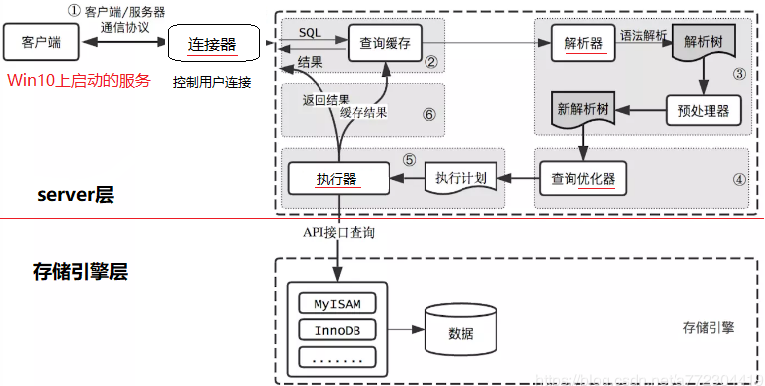
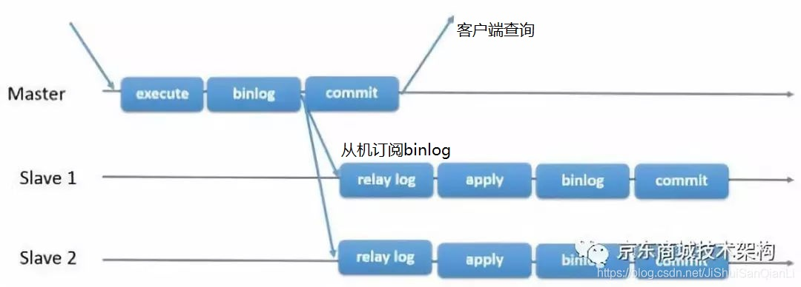

```sql
Select From 
【连接类型】Join 
On 连接条件
Where 筛选条件	#无法与聚合函数一起使用，使用 having对结果集筛选
Group by 分组
Having 分组后的筛选	HAVING不一定要有GROUP BY
Order by
Limit
```


# SQL分类


* 查询语言DQL
  SELECT <字段名表>
  FROM <表或视图名>
  WHERE <查询条件>

* 操纵语言DML
  INSERT
  UPDATE
  DELETE

* 定义语言DDL
  创建数据库中的各种对象---表、视图、索引、同义词、聚簇
  CREATE TABLE/VIEW/INDEX/SYN/CLUSTER

**DDL隐式提交,不能rollback **

* 控制语言DCL
  授予或回收访问数据库的某种特权，控制数据库操纵事务发生的时间及效果，对数据库监视

  * GRANT

  * ROLLBACK [WORK] TO [SAVEPOINT]
    
  * COMMIT [WORK]：提交
    * 显式提交
    用COMMIT命令直接提交
    * 隐式提交
      用SQL命令间接提交
      ALTER，AUDIT，COMMENT，CONNECT，CREATE，DISCONNECT，DROP，
      EXIT，GRANT，NOAUDIT，QUIT，REVOKE，RENAME
    * 自动提交
      把AUTOCOMMIT设置为ON，则在插入、修改、删除语句执行后，系统将自动进行提交


# 数据库设计


## ER模型


可以用D(A.主键 ,B.主键 ,C.主键)来表示ABC三个实体的关系

转化为ABCD 4个关系模式


## 数据流图DFD


顶层	描述输入输出

0层	分解加工	**外部实体和数据流不会被分解 ,也不会变**


* ==保持父子图平衡==
  * 名称一致  数量相同
  * 父图的一条输入对应子图的多条输入时,保持总体平衡
  * **输入/输出流不能单条出现在加工上**
  * 加工前后的输入输出匹配,如学生信息不能被加工为教师信息


* 黑洞	只有输入
* 奇迹    只有输出


### 弱/强实体

* 强实体不依赖于其他实体而存在

* **弱实体的主键存在外键** ,不依赖外键无法唯一标识
  * 没主码,只有部分码
  * 在和所依附的实体集的联系中，弱实体要全部参与


## 规范化理论


**部分依赖	AB->C, A->C**

**传递依赖	A->B ,B->C**


候选码	唯一标识元组,无冗余

主属性   候选码的组成者

主键	候选码任选一个

外键	其他关系的主键


### 范式

* 第1范式    属性不可再分

* 第2范式    消除非主属性对候选码的部分依赖
* 第3范式    消除主属性对候选码的传递依赖
* BC范式    消除主属性对候选码的部分和传递依赖


### 完整性约束

* 实体完整性	主键非空,唯一
* 参照完整性    外键非空,存在
* 用户自定义完整性


### 关系代数


并

交

差		a-b ,去掉a中b有的部分

笛卡尔积

投影

选择

连接


#### 连接


* 内连接

* 等值连接
  * 表示为R(a=b)S
  * ==不去重==
  
* ==自然连接==
  
* 表示为RS
* ==去重==,对相同名称的列形成匹配	保留公共值
* 自然连接一定是等值连接，但等值连接不一定是自然连接
* 等值连接要求相等的字段，不一定是公共字段；而自然连接必须是公共字段
* 等值连接不去重；自然连接去重


* 左连接


* 全连接	FULL OUTER JOIN


* 交叉连接/笛卡尔积	cross 
  * 返回左表中的所有行，与右表中的所有行组合


### 4种外键约束


外键要求每次修改数据时都在外键表中额外执行一次查询,虽然InnoDB强制外键使用索引,但还是无法抵消这种约束检查带来的开销

当外键的选择性很低,将导致非常大的索引片

外键的额外查询也需要加读锁,会导致额外的锁等待


| No action | 子表有匹配的记录,则不允许父表对应候选键update/delete        |
| --------- | ----------------------------------------------------------- |
| Restrict  | 拒绝对父表的删除或更新操作                                  |
| cascade   | 同步update/delete子表                                       |
| set null  | 将子表上匹配记录的列设为null,此时子表的外键列不能为not null |


cascade和set null是容错能力比较强，并不是很严格，但可能会出导致业务上出问题，No action和Restrict是非常严格的，禁止对父表进行更新和删除，但在业务中有时我们又不得不进行对父表进行操作，而在No action和Restrict约束规则下，执行父表删或者更新时会报错：ERROR 1451


## 数据类型


越小越好	占用更少的磁盘,内存和CPU

越简单越好	整型比字符操作代价更低,因为字符集和校对/排序规则复杂

尽量避免Null	查询中包含可为Null的列,将使得索引和统计更为复杂


为了兼容性支持了很多别名,如Integer,Bool,Numeric,别名的真实存储为基本类型,不影响性能


**额外的存储空间**:

字符集

是否可以为Null的标识位


### 整数


可选的UNSIGNED属性,表示不允许负值,将使正数的上限提高一倍

Tinyint.UNSIGNED 0~255		Tinyint -128~127


**为整数类型指定长度不会限制值的范围**,只限定显示字符的个数,对存储和计算来说不影响


### 实数


将数字打包成二进制字符串,每**4个字节存储9个数字**

Decimal(18,9)小数点两边将个存储9个数字,一共使用9个字节	小数点前4,小数点1,小数点后4


Decimal只作为存储格式,在计算时会转化成Double

也可以用Decimal存储比Bigint更大的数

在需要对小数进行精确计算时才用Decimal,否则将金额变为整数,用Bigint代替Decimal避免精确计算的高代价


Float 4字节,在存储相同范围的值时,会比Decimal使用更少的空间


### 字符


Char

定长,**不容易产生碎片**,自动删除所有末尾空格


Varchar

比char更节省空间,但当行占用空间变长,页内没有多余空间时,InnoDB需要分裂页来支持变长

**额外需要1~2字节,记录长度**: 长度 < 255字节 ? 需要1字节 :2字节

适合于字符串列的最大长度比平均长度大很多,列的更新少


Binary

存储少量二进制字符串的字符码


Blob / Text

Blob 存储二进制		Text存储字符

适合存储大量字符串,会使用专门的存储区域进行存储,需要行内的1~4字节存储指针,指向专门的存储区域


Enum代替字符串

可以把不重复的字符串存储成预定义的集合

会根据列表值的数量压缩到1~2字节,将每个值在列表的位置保存为整数,并在表的.frm文件中保存的"数字-字符串"映射关系中查找

缺点:字符串列表固定,添加/删除字符必须Alert Table


#### 编码长度限制

latin11字符，每个字符占1字节

gbk字符，每个字符占2字节，最大长度不能超过32766

utf8字符，每个字符占3字节，最大长度不能超过21845

若定义的时超过上述限制，则varchar字段会被强行转为text类型


#### 行长度限制

**行的定义长度不能超过65535**.若定义的表长度超过这个值，则提示

ERROR 1118 (42000): Row size too large. The maximum row size for the used table type, not counting BLOBs, is 65535. You have to change some columns to TEXT or BLOBs


### 时间日期


Mysql能存储的最小时间粒度为秒.但也可以用微秒进行临时运算


DateTime

8个字节	能存储大范围的时间	1001~9999年,精度为秒

把日期和时间封装为 YYYYMMDD HHMMSS的整数中,**与时区无关**


TimeStamp

4字节	效率高,范围小	1970.1.1~2038

依赖于时区


## 字符集


所有的字符存储与表示，均以utf-8编码


注意字符统计函数的区别

```mysql
SELECT LENGTH("轻松工作")； 返回12

SELECT CHARACTER_LENGTH("轻松工作")； 返回4
```


utf8mb4	存储表情


## 连接池


* DBCP
  * 依赖 Jakarta commons-pool 对象池机制的数据库连接池.DBCP 可以直接 的在应用程序中使用，Tomcat 的数据源使用的就是 DBCP
* c3p0
  * 开放源代码的 JDBC 连接池
* Druid
  * 阿里出品，还包含ProxyDriver，一系列内置的 JDBC 组件库，一个SQL Parser。支持所有JDBC兼容的数据库


## 主从


==只能在主机里面执行DML语句,可以在从机执行查询,不要在从机操作！！！！==


Mysql主从又叫Replication、AB复制

A与B两台机器做主从后，在A上写数据，另外一台B也会跟着写数据，实现数据实时同步

mysql主从是基于**binlog，主需开启binlog才能进行主从**

 

* 主创建**同步账户**授权给从
* 主将更改操作记录到binlog里
* 从将主的binlog同步到本机,并记录到**relaylog**
* 从根据relaylog里面的sql语句按顺序执行


## 分区表 295


分区表是独立的逻辑表,底层由多个物理子表组成(索引由子表决定,没有全局索引)

分区对SQL层来说是透明的,但从底层的文件系统可以看出,每个分区表都有用#分隔命名的表文件

实现分区的代码实际上是对一组底层表的Handler Object句柄对象的封装

对分区表的请求会通过句柄对象转化成对存储引擎的接口调用

通过**Partition By**决定分区存放的数据,在执行查询时,优化器根据分区定义过滤分区

分区目的在于将数据按较粗的粒度分布在不同表,相关的数据存放在一起,利于批量操作


**限制**

分区字段中有主键/唯一索引的列,则所有主键列和唯一索引列都必须包括进来

分区表无法进行外键约束

子表的存储引擎必须一致


### 适用场景


表数据量大,无法完全放入内存.或只在表尾有热点数据

数据维护	可以对分区进行优化/检查/修复/备份

数据分布在不同的物理设备,提高设备利用率


### 原理


分区表由多个相关的底层表组成,底层表由Handler Object句柄对象表示


## Mysql架构





# 指令


```mysql
show variables	#查看数据库配置
select database();	显示当前的库
desc 表名;				查看表的设计


```


## Explain


Explain Partitions	显示查询将访问的分区


Explain中存在子查询时,将执行子查询的查询,将子查询结果放入临时表,再进行外部查询优化

这代表着在进行查询优化之前需要完成所有子查询的查询,当子查询复杂时,也会消耗性能


**限制**

无法表述触发器/存储过程/UDF会如何影响查询

无法展示Mysql在查询执行中进行的特定优化

不区分相同名称的事物:内存/临时表排序都叫FileSort,磁盘和内存中的临时表都叫Using Temporary

只能解释Select语句


### id


标识Select所属的行(原始语句中的位置),当不存在子查询时为1


### select_type


Simple 简单查询	表示不包含子查询和Union

Primary 复杂查询	简单子查询 / 派生表(From中的子查询) / Union


当查询为复杂查询,最外层标记为Primary,内层标记为:

SubQuery	包含在Select列表中的子查询(不在From)

Derived	包含在From中的子查询,会生成临时表,进行嵌套递归

Union	Union中的第二个和随后的Select都标记为Union.第一个Select以外查询执行,为Primary;Union被From子句中的子查询包含,第一个Select标记为Derived

Union Result	从Union的匿名临时表检索结果的Select


### table


表示正在访问哪张表(或表的别名)


### type


访问类型


All	全表扫描,存在例外:Limit,或者在Extra列中Using distinct/not exists

index	按索引顺序全表扫描,无需排序	通常意味着不按索引顺序进行扫描时,开销非常大

range	有范围的索引扫描,无需遍历全部索引

ref	索引访问,返回若干个匹配某个值的行(常发生于非唯一性索引)

ref_or_null	需要在ref的基础上进行二次查找

eq_ref	只返回一条符合条件的记录,效率高

const/system	优化时转化成常量(将表从关联中移除)

Null	在优化中分解查询语句,在执行阶段无需访问表或索引(最小值只需要查找索引最左端)


### possible_key

执行查询可以使用的索引,基于访问的列和比较操作符进行推断


### key

真正采用的索引


### key_len

根据表定义推算出单个索引的最大字节数(包括字符集影响的字节数),不是表中数据实际的字节数


### ref


在索引中查找值所用的列/常量


### rows

估计需要读取的行数	是内嵌循环关联计划里的循环数目,不代表最终读取的行数


### filtered

仅在使用Explain Extended时出现,表示结果集占全表的百分比


### Extra

Using Index


| Using where               | 回表后进行过滤,                                              |
| ------------------------- | ------------------------------------------------------------ |
| Using index               | 覆盖索引,筛选条件是前导列                                    |
| using index & using where | 索引覆盖，但where条件在索引列中不是前导列,**不一定会回表**,如果用到前导列，就是“索引查找”，如果用不到前导列，就“索引扫描”，回不回表完全看查询列是否被索引覆盖 |
| using index condition     | 查询列不完全被索引覆盖,但查询条件可以用索引                  |
| Using temporary           | 在查询结果排序时会使用临时表                                 |
| Using filesort            | 会使用内存/磁盘排序                                          |
| Null                      | 未被索引覆盖 && where筛选列是索引的前导列，通过索引查找并回表找到未被索引覆盖的字段 |


### 重写非Select语句 5.6-


当需要对非Select语句进行解释时,需要重写

将语句转化成等价的访问所有相同列的Select,所有设计的列必须在Select/关联子句/Where中

但并不存在等价的查询语句,Select只需要找到数据的副本并返回,而**非Select需要修改索引上的所有副本**

```sql
Update sakila.actor
Inner Join sakila.film_actor Using(actor_id)
Set actor.last_update = film.last_update;
-->
Explain Select film_actor.last_update,actor.last_update
From sakila.actor
Inner Join sakila.film_actor Using(actor_id);
```


在5.6之后,非Select语句也支持Explain


# 函数


## 空值判断


ifnull(字段,缺省值)		可以设置空值时的缺省值


<=> 安全等于，可判断空值也可运算


**null 任何运算结果都为null**


 

## 字符函数


```mysql
Length	#获取参数的字节个数

#字符串拼接
Concat(字段,’拼接符’,字段)
Concat(字段,字段) as 字段名

Upper大写 	lower

Substr(字段,start，end)	#截取

Instr( 字段,’目标字符串’)	#获取第一次出现的索引

Trim(选项 ‘去掉的字符’ from 字段) from 表			#去头去尾,不指定去掉的字符串则去空格
		-选项：BOTH,LEADING,TRAILING

LPAD (‘目标’,长度,’填充字符串’)	#用指定的字符串填充至长度（左）
RPAD

Replace(‘目标’,’被替换’,’替换’)		#替换

```

 

### 邮箱截取


如果想要获取@之前的字符串，单靠substr并不能实现，因为substr只指定了截取初始位置和长度，而@之前的字符串字节数是不确定的，可以结合instr来获取具体要截取多少个字符

Select substr(email,1,instr(email,’@’,)-1) from 表

 


## 数学函数


```mysql
Round(字段,保留几位)		四舍五入，不指定小数默认整数
Ceil(字段)							向上取整
Floor										向下
Truncate(字段,保留位数)		截断（舍弃后几位）
Mod(字段,被除数)					取余
```


 

## 日期函数

```mysql
Now()	 		返回当前系统日期+时间
Curdate()						日期
Curtime()						时间
Monthname			以英文形式返回月
Datediff(日期1，日期2)							相差日期
Select year(日期)		提取日期中的年份
%Y			四位的年份
%y			
%m			月份(01,02…)
%c			月份(1,2…)
%d
%H			24小时制
%h			12小时制
%l			分钟
%s			秒
Str_to_date(‘字符串’,'%Y-%c-%d’)			字符串转换日期
Date_format(‘日期’,’%y%m%d’)				日期转换字符串
```


## Case 函数


```mysql
Case情况1
Case 变量/表达式/字段
When 常量1 then 值1
When 常量2 then 值2
Else 值n
End

Case 情况2
Case
When 条件1 then 值1
When 条件2 then 值2
Else 值n
End
```


## 分页


```mysql
Limit offset，size			mysql offset的起始位置从0开始
对于第一页，起始位置0，第二页起始位置size，第三页size*2…….

Limit (page-1)*size,size;			实现分页

Order by + 分页获取最大值最小值数据
Order by 排序，第一个数值为最大/最小值，
Limit 1		获取第一个数值
```


### 排序字段不唯一会导致翻页时重复记录


```mysql
-- 有8条记录
SELECT *  FROM t2 ORDER BY created DESC;
+----+---------------------+
| id | created             |
+----+---------------------+
|  2 | 2017-07-10 08:36:29 |
|  4 | 2017-07-07 16:14:30 |
|  3 | 2017-07-07 15:47:34 |
|  1 | 2017-07-07 10:25:54 |
|  6 | 2017-07-05 02:02:28 |
|  5 | 2017-06-03 00:33:05 |
|  7 | 2017-06-03 00:33:05 |
|  8 | 2017-06-03 00:33:05 |
+----+---------------------+

-- 第一页
SELECT *  FROM t2 ORDER BY created DESC LIMIT 0,6;
+----+---------------------+
| id | created             |
+----+---------------------+
|  2 | 2017-07-10 08:36:29 |
|  4 | 2017-07-07 16:14:30 |
|  3 | 2017-07-07 15:47:34 |
|  1 | 2017-07-07 10:25:54 |
|  6 | 2017-07-05 02:02:28 |
|  8 | 2017-06-03 00:33:05 |
+----+---------------------+

-- 第二页，出现重复记录 id=8
SELECT *  FROM t2 ORDER BY created DESC LIMIT 6,6;
+----+---------------------+
| id | created             |
+----+---------------------+
|  7 | 2017-06-03 00:33:05 |
|  8 | 2017-06-03 00:33:05 |
+----+---------------------+
```

当排序字段的值相同时,mysql不能保证结果集的顺序固定

避免出现排序字段值相同而导致的无序 -> 翻页时重复		需要额外增加排序字段


当未指定OrderBy时,按索引顺序排序

增，删，改可能导致查询结果集变化或者乱序


### 不需要精确记录数时,只显示记录数的大致范围


```
-- 已有索引(user_id,modified)
-- 现有查询，查询某个用户修改时间范围最近半年内的退款数
SELECT count(*)
FROM local_refund
WHERE user_id=2041579417 
  AND modified>='2019-04-19 00:00:00';

-- 考虑改为显示10000+
SELECT count(*)
FROM (
  SELECT refund_id
  FROM local_refund
  WHERE user_id=2041579417 
    AND modified>='2019-04-19 00:00:00'
LIMIT 10000) t;
```

如果需要精确数据，可以考虑生成统计表


## Count


count(col)	不统计Null,全为Null返回0

count(*)	统计NULL


有时某些业务不需要精确的Count值,可以用近似值代替

可以**用Explain优化器估算的行数代替Count**,此时并没有真正的执行查询

或者是**剔除某些查询条件**,在统计活跃人数时,要过滤离线人数,还要过滤特定ID的人,去掉某些特定条件能够加速查询,但不会过于影响结果


## OrderBy


2种排序方式:IndexSort , FileSort

index ：通过有序索引顺序扫描直接返回有序数据，不需要额外的排序，效率高

filesort：并不代表通过磁盘文件排序，只说明进行了排序操作，filesort通过相应的排序算法，将数据在内存排序区sort_buffer_size进行排序，如果内存装载不下，它就将磁盘上的数据进行分块，再对各个数据块进行排序，然后合并成有序的结果集

sort_buffer_size是每个线程独占的，**同一时刻存在多个sort buffer排序区**


优化：==尽量减少额外排序，通过索引直接返回有序的数据==。谓词和order by 使用了相同的索引，并且order by 的顺序和索引顺序相同，并且order by 的字段都是升序或者降序，否则肯定需要filesort


以下SQL不可以使用索引：

select * from tablename order by key_part1 desc,key_part2 asc; ----order by 的字段混合asc,desc

select * from tablename where key2=constant order by key1; ----用于查询的关键字与order by 中所使用的不相同

select * from tablename order by key1,key2;   ----对不同的关键字使用order by

 

对于Filesort，MySQL有两种排序算法 ：

一次扫描算法和两次扫描算法，通过比较系统变量max_length_for_sort_data的大小和query语句总字段的大小来判断使用哪种排序算法。

适当增加 max_length_for_sort_data的值，适当增加sort_buffer_size排序区，尽量使用具体的字段而不是select * 选择所有字段


## Union	联合


Where and  是将查询条件联合		union是将语句联合

 


## 自定义函数


sql自定义函数

```mysql
Create function 函数名（参数）
Returns 返回值类型
[with {Encryption | Schemabinding }]
[as]
begin
SQL语句(必须有return 变量或值)
End
```


* [with]为附加选项
  * 需要对函数体进行加密，用WITH ENCRYPTION；
  * 需要将创建的函数与引用的数据库绑定，用WITH SCHEMABINDING（**函数一旦绑定，则不能删除、修改，除非删除绑定**）


* DECLARE  在复合语句 (BEGIN...END) 中声明 SQL 变量或异常


# 视图 306


```sql
CREATE VIEW "VIEW_NAME" AS "Sql";
```


视图方便查询,不能插入修改删除		Vo适合插入修改删除

业务只需要查询时,用视图方便

 

视图是虚拟表,并不存在于数据库,数据在引用视图时动态生成,但是可以创建它的逆向工程

视图提高安全性:

* 只针对一张表建立视图,可以做到筛选字段进行展示

*  针对不同用户，设定不同的视图,能查询到不同的信息


# 事务


**不要在一次事务中使用多种存储引擎**

MySQL服务器层不管理事务，由下层的存储引擎实现

如果在事务中混合使用了事务/非事务的表,在需要回滚时，非事务型表无法撤销，导致数据不一致


**BEGIN, ROLLBACK, COMMIT 实现事务**

**AUTOCOMMIT自动提交模式**	1/ON 启用(默认)	0/OFF禁用

禁用自动提交时,所有查询都在一个事务中,直到显式执行COMMIT / ROLLBACK,事务才会结束,同时开启新事务


**隐式/显式锁**

隐式锁	根据隔离级别在需要的时候自动加锁

InnoDB采用两阶段锁定协议,在事务执行过程中,随时都可以执行锁定,锁只在Commit/Rollback时才会释放,并且所有锁在同一时刻释放


显式锁	

SELECT … LOCK IN SHARE MODE

SELECT … FOR UPDATE


## ACID


* A 原子性：全完成/全不完成。发生错误就回滚

* C 一致性：事务前后，数据**完整性**没被破坏

* I 隔离性：**允许并发事务**，防止交叉执行导致数据不一致

* D 持久性：事务提交后，对数据的**修改是永久**的，即便系统故障也不会丢失


## 隔离级别


```mysql
SET [GLOBAL|SESSION] TRANSACTION ISOLATION LEVEL {level};	#设置隔离等级
```


* 脏读	     select

* 不可重复读	update

* 幻读	    insert/delete


* 读未提交      脏读、不可重复读、幻读
* 读提交  **SQLServer/Oracle默认**     不可重复读、幻读
  * 快照 使得无锁查询也能==避免脏读==
* 可重复读	MySql默认             幻读
  * 快照+==事务== 避免“不可重复读”
* 串行化  避免“脏读”、“不可重复读”、“幻读”


## 封锁协议


X 排它锁 eXclusive locks

S 共享锁 Shared locks

U 更新锁 Update locks

I 增量锁 Incremental locks


**当进入死锁状态时，有下列 2 种策略：**

1. innodb_lock_wait_timeout 设置超时时间(默认50s)
2. innodb_deadlock_detect = on 设置死锁检测(默认开启)，发现死锁自动回滚其中一个事务，让其他事务得以继续执行


### 三级封锁协议


**一级封锁协议**	读提交

修改数据加X锁，直到T结束才释放锁	解决ABA问题，不会覆盖修改

**二级封锁协议**	可重复读

在一级的基础上，读数据时加S锁，**读完马上释放S锁**	解决读脏,不会在修改事务过程中读取数据

**三级封锁协议**	串行化

在二级的基础上，读数据时加S锁，**事务结束才释放S锁**	解决不可重复读，避免了在事务中途数据发生变化


### 两阶段协议 2PL

Two Phase Locking Protocal


加锁/解锁分两个阶段进行

根据隔离级别在需要的时候自动加锁,**所有锁在同一时刻释放,加锁时不能解锁,解锁时不能加锁,保证执行的串行化**,从而保证隔离性


### 可串行化调度


**调度包含的事务都是良构的且两阶段，使得并发执行的事务结果与某一个串行执行的事务结果相同**


**良构**的事务	READ、WRITE、LOCK都被相应的锁覆盖，所有锁都在事务结束时释放（mysql的表和行数据在被操作时，都有对应的锁覆盖）

**两阶段**事务	加锁/解锁分两个阶段进行

合法的**调度**	调度是一组事务的操作的某种合并结果,同一时间没发生两个不同事务的锁冲突（mysql支持多事务并行执行）


## 分布式XA事务


(全局)事务管理器(TM: Transaction Manager)	-Binlog

(局部)资源管理器(RM: Resource Manager)		-Mysql本身


### 内部事务


Mysql中各个存储引擎是完全独立(参与者),所以跨存储引擎的事务需要一个外部的协调者

如果没有协调者,事务提交就只是顺序地要求各个存储引擎各自提交,在提交过程中发生错误,就会破坏事务特性

**将binlog看作独立的引擎,在存储引擎提交事务时,需要将提交信息写入binlog,这就是分布式事务,不过事务的参与者是Mysql本身**

当事务开启二进制日志时,至少需要调用3次fsync(),1次二进制日志持久化,2次事务日志持久化


为了兼容非事务引擎的复制，binlog记录所有引擎中的修改操作，但这导致redo log与binlog的一致性问题

* 单台MySQL服务器中，binlog作为TM，多个数据库实例作为RM,属于**跨库事务**
* ==内部XA保证redo和binlog的一致性==


* InnoDB prepare,write/sync redo log
  * 引擎启动,同步redo log,**binlog不作任何操作**
* write/sync Binlog
  * 写入binlog，MySQL认为事务已提交并持久化,==立即将新增的binlog发送给订阅者,降低主从延迟==
  * 这时就算数据库崩溃，重启MySQL后仍能恢复事务
* commit
  * 大部分都是内存操作(不是事务的commit)，如释放锁，释放mvcc相关的read view等
  * MySQL认为这一步不会发生任何错误，一旦发生了错误就崩溃,不会回滚
  * 提交后，更新的数据才能被外部查询




### 外部事务


分布式事务依托于==两阶段提交==实现

事务协调器保证所有事务参与者完成准备工作 **(第1阶段)**

协调器收到所有参与者都准备好的信息,通知事务可以提交 **(第2阶段)**


* prepare 准备提交
  * TM向所有涉及到的RM发出prepare
  * RM收到请求后执行数据修改和日志记录等处理，处理完后把事务的状态改成**"可以提交"**,结果返回给TM

* commit  确认提交
  * TM收到回应，任何一个RM的操作错误/收不到回应，事务失败，回滚所有RM的事务
  * 全部成功，TM向RM发出commit，RM把事务的**"可以提交"改为"提交完成"**，然后返回应答
  * RM收不到commit，也会把"可以提交"回滚


## 日志


### 二进制日志(binlog)


记录表结构变更（CREATE、ALTER TABLE…）以及数据修改（INSERT、UPDATE、DELETE…）,SELECT和SHOW记录在通用日志


修改无需每次都持久到硬盘,**日志是追加方式,为顺序IO,无需移动磁头**

事务日志持久后,内存中被修改的数据再慢慢地刷回磁盘


二进制日志包括两类文件：

* 索引文件（后缀.index）,记录所有的二进制文件
* 日志文件（后缀.00000*）记录数据库所有的DDL和DML(除查询)语句事件


#### 开启binlog


```shell
vi /etc/my.cnf 

log-bin=mysql-bin
binlog-format=ROW	#推荐row模式，准确性高，但文件大
server_id=1	#配置mysql replaction需要定义，不能和canal的slaveId重复
```


binlog-format


#### 刷盘


将缓存中的日志刷到磁盘上

binlog_cache_size过大，造成内存浪费。过小，会频繁将缓冲日志写入临时文件

sync_binlog=0	刷新binlog时间点由操作系统自身来决定,性能好

sync_binlog=1	每次事务提交时就会刷新binlog到磁盘

sync_binlog=N	每N个事务提交会进行一次binlog刷新(数据丢失)


binlog是多文件存储，定位一个LogEvent需要通过binlog filename +  binlog position，进行定位


### undo/redo 事务日志


事务并行执行,被提交时刷新到二进制日志


innodb事务日志包括redo/undo log

**undo log** ==事务开始前==，先将需操作的数据备份,作为数据旧版本快照,供其他并发事务快照读

* insert undo log
  
  * 只在事务回滚时需要，提交后可以被立即丢弃
* ==update undo log==   实现**原子性**,不仅在事务回滚时需要，在快照读时也需要
  * 先对该行加排它锁,拷贝该行记录到update undo log
  * 修改记录,更新``事务ID的隐藏字段``(依据事务ID,呈**链式**存储)
  * 提交事务,释放排它锁


**redo log**  备份事务过程中的最新的数据

* ==在事务的执行过程中，开始写入==,实现**事务的未入磁盘数据进行持久化**
* 配置落盘策略,防止在发生故障的时间点，尚有脏页未写入磁盘，在重启mysql服务时，根据redo log进行重做
* 事务提交且数据持久化落盘后，Redo log中的事务记录就失去了意义，所以**Redo是日志文件循环写入的**


```shell
#redo log 配置
innodb_log_group_home_dir 指定存储目录
innodb_log_files_in_group	指定Redo log日志文件组中的数量 默认2
innodb_log_file_size	指定Redo log每一个日志文件最大存储量 默认48

innodb_log_buffer_size	指定Redo log在cache/buffer中的buffer池大小 默认16

Innodb_flush_log_at_trx_commit：持久化Redo的策略， 
		0 每秒 [可能丢失一秒的事务数据]
		1 默认值，每次事务提交 [最安全，性能最差]
		2 
```


#### 事务中的非事务性语句


对于非事务性语句（insert，delete）遵循3条规则：

* 非事务性语句被标记事务性，写入Redo
* 没标记事务性，Redo中有，写入Redo
* 没标记事务性，Redo中没有，则直接写入binlog

在一个事务中有非事务性语句，优先将非事务语句直接写入binlog


## 多版本并发控制 MVCC


Multi-Version Concurrency Control

访问记录的版本链,实现不加锁/非阻塞的并发读,只适用于RR和RC隔离级别的普通SELECT操作,RU总是读最新的行,串行化会对读取行加锁

**对数据库的任何修改的提交都不会直接覆盖之前的数据，而是产生新版本与老版本共存，使读取时不加锁**


==3个隐式字段，undo日志 ，Read View==


### 3个隐式字段


| ID          | 6byte | 创建/最后一次修改的事务ID                                    |
| ----------- | ----- | ------------------------------------------------------------ |
| DB_ROLL_PTR | 7byte | 回滚指针，指向上一个版本（存储于rollback segment里）         |
| DB_ROW_ID   | 6byte | 隐含的自增ID，==如果没有主键，InnoDB会以DB_ROW_ID产生聚簇索引== |
| flag        |       | 标志删除,==为了实现InnoDB的MVCC机制，更新或者删除操作都设置deleted_bit，并不真正将过时的记录删除== |


==快照读的结果依赖于该事务首次出现快照读的地方==

| 事务A      | 事务B                                | 事务C                                |
| ---------- | ------------------------------------ | ------------------------------------ |
| 开启事务   | 开启事务                             |                                      |
| 快照读,500 | 快照读,500                           |                                      |
| 更新为400  |                                      |                                      |
| 提交事务   |                                      |                                      |
|            | select 快照读,500                    | select 快照读,==400==                |
|            | select lock in share mode 当前读,400 | select lock in share mode 当前读,400 |


### 快照/当前读


每个事务对同一张表,同一时刻,看到的数据可能不一致


* 快照读：(乐观)
  * 不加锁,非阻塞,读到的不一定最新
  * 普通的SELECT就是innodb快照读，**数据由cache(原本数据) + undo(事务记录) 两部分组成**
  
* 当前读：(悲观)
  * 通过锁机制来保证读取的数据无法通过其他事务进行修改
  * UPDATE、DELETE、INSERT、SELECT … LOCK IN SHARE MODE、SELECT … FOR UPDATE


但对于写避免并发,只能靠锁,为了避免X锁带来的性能问题，会选择用乐观锁来优化，需要开发人员在数据表里加version列，写业务代码实现


#### 读视图 Read View


快照读操作时,由cache + undo产生读视图,用于可见性判断:当前事务能够看到哪个版本的数据


**3个全局属性**

* Read View生成时,活跃的事务ID列表
* 列表中最小的ID
* 尚未分配的下个事务ID(出现过的最大ID+1)


**可见性算法**	将要被修改的数据的当前行ID，与Read View维护的其他活跃事务的ID对比

* ID < 最小ID   该行在创建快照之前提交,**可见**
* ID>=下个ID    **不可见,在该行的事务链中寻找旧ID**
* 最小ID < ID < 下个ID  该行可能处于 活跃状态/已提交状态
  * ID存在于列表  该行活跃,**不可见,在该行的事务链中寻找旧ID**
  * 不存在        该行已提交,**可见**
* 如果ID跟Read View的属性不符合可见性，通过DB_ROLL_PTR回滚指针去取出Undo Log中的ID再比较，即遍历链表的ID（链首->链尾，从最近的一次修改查起）


#### 整体流程


事务4已提交,事务1/3活跃

事务2快照读，生成Read View读视图,记录了活跃事务列表[1，3],下一个ID[5],最小ID[1]

事务2在快照读该行记录的时，拿ID去跟up_limit_id,low_limit_id和活跃事务列表(trx_list)进行比较，判断可见性


2<4，所以不符合条件，继续判断 

4<5，也不符合条件

4在活跃事务列表中, 符合可见性，所以事务4修改后提交的最新结果对事务2快照读时可见


### 3种并发场景


- 读-读：不存在问题，不需要并发控制
- 读-写：线程安全问题，事务隔离性问题(脏读，幻读，不可重复读)
- 写-写：线程安全问题，更新丢失


==MVCC解决读-写冲突==

为事务分配单向增长的时间戳，每个修改保存一个版本，版本与时间戳关联

读操作**只读该事务开始前的快照,不用阻塞写操作**

解决脏读，幻读，不可重复读，但**不能解决更新丢失问题**


因为有了MVCC，可以形成两个组合

- MVCC + 悲观锁
  MVCC解决读写冲突，悲观锁解决写写冲突
- MVCC + 乐观锁
  MVCC解决读写冲突，乐观锁解决写写冲突


### RC/RR快照读区别


**Read View生成时机不同，造成RC,RR级别下快照读的结果不同**

Read Committed	**每次**Read，建立Read View

Repeatable Read	首次Read，建立Read View(之后的修改不可见)


| 可重复读 | REPEATEABLE READ                                             |
| -------- | ------------------------------------------------------------ |
| SELECT   | (行的事务ID<=当前事务ID) && (不存在删除行\|\|删除行的事务ID>当前事务ID)  保证读取到的行在事务开始前已存在，或是事务自身插入/修改过的 |
| INSERT   | 当前事务ID                                                   |
| UPDATE   | 新增一行,记录当前事务ID.并更新旧版本的删除标志位             |
| DELETE   | 当前事务ID                                                   |


## 锁


**隐式显式区别**

服务器在需要时自动创建/释放隐式锁,并传递给存储引擎,由存储引擎自动转换为特定类型的锁


**SHOW PROCESSLIST	查看等待锁的线程**


### 表锁

显式的读写锁 Lock Tables 表名 Read/Write

```
SHOW PROCESSLIST 查询状态为 Waiting for table
标明正处于表锁
```


#### 命名锁

表锁的一种,在重命名/删除表时创建,**与其他的表锁冲突**


### 全局读锁

Flush Tables With Read Lock 或 设置read_onnly=1 获取单个全局读锁,**与表锁冲突**

```
SHOW PROCESSLIST 查询状态为 Waiting for release of readlock
标明正处于全局读锁而不是表锁
```


### 行级锁 Record Lock [ , ]

**只在存储引擎层实现**,Mysql服务层没有实现


### 间隙锁 Gap Lock ( , )


Innodb在**可重复读**下为解决幻读引入的锁机制,**锁定一个范围,但不包括记录本身**


: 锁定一个范围，并且锁定记录本身 


**间隙锁（无论是S还是X）只阻塞insert操作**	==防止幻读==

共享锁只锁覆盖索引。排他锁，系统会认为你接下来要更新数据，因此会顺便给主键索引上满足条件的行加上行锁 


### next-key lock (,]


由行锁和间隙锁共同组成 **锁定一个范围,查询过程中访问的对象会加锁,包括记录本身**


3. 等值查询中给唯一索引加锁时，next-key lock升级为行锁 -> [ , ]

4. 等值查询中最右的值不满足查询需求，next-key lock 退化为间隙锁 -> ( , )

5. 唯一索引上的范围查询会访问到不满足条件的第一个值为止


```mysql
//session A
BEGIN;
SELECT * FROM z WHERE b = 6 FOR UPDATE;

//session B
INSERT INTO z VALUES (2, 4);/*success*/
INSERT INTO z VALUES (2, 8);/*blocked*/
INSERT INTO z VALUES (4, 4);/*blocked*/
INSERT INTO z VALUES (4, 8);/*blocked*/
INSERT INTO z VALUES (8, 4);/*blocked*/
INSERT INTO z VALUES (8, 8);/*success*/
INSERT INTO z VALUES (0, 4);/*blocked*/
INSERT INTO z VALUES (-1, 4);/*success*/
```

A启动,给索引 b 加 next-key lock (4, 6]和(6 ,8],向右遍历发现最后一个值不满足条件,(6 ,8]退化为间隙锁 (6,8)；所以索引 b 上的 next-key lock 的范围是 [ (b=4,id=3) , (b=6,id=5) ) 和 ( (b=6,id=5) , (b=8,id=7) )


由于(b=4,id=3)的存在，(b=4,id=2)不在锁的范围内，可以插入 

但是(b=8,id=2)在间隙锁(6,8)的范围内,所以阻塞

对于(0, 4)被阻塞: 在非 `NO_AUTO_VALUE_ON_ZERO`模式下,对于ID=0的记录会被分配自增序列的下一个值 -> (10,4)


### 用户锁

需要为命名互斥量,需要指定锁名称/超时秒数

```
Select GET_LOCK(‘锁名’,秒数)
```


# 引擎


* MyISAM

  * 不支持事务  **表级锁**,读取时共享锁，写入时排它锁
  * 支持空间函数GIS
  * 每个MyISAM在磁盘上存储成三个文件
    * frm文件：表的定义
    * MYD文件：数据
    * MYI文件：索引
  * 三种支持数据的类型
    * **静态固定长度表   默认**
      * 占空间大,效率高，容易缓存，损坏后容易修复
    * 动态可变长表
      * 空间小,出错恢复麻烦
    * ==压缩表==

 

* InnoDB

  * **自增长行级锁**，支持更高并发,支持事务。**可重复读，通过MVCC实现**
  * 表基于聚簇索引建立,主键查询效率高  支持外键,但增加了表的耦合度
  * 二级索引必须包含主键列,导致主键列很大将导致其他索引都会很大 -> 主键尽可能地小
  * 数据存储在表空间tablespace中,表空间是InnoDB管理的黑盒,由一系列数据文件组成
  * 内部的优化:预读,在内存中创建hash索引以加速自适应hash索引,加速插入操作的插入缓冲区insert buffer
  * 磁盘读取数据方式采用的**可预测性预读**,自动在内存中创建hash索引以加速读操作的自适应哈希索引
  * 可以通过一些机制和工具支持真正的热备份，**MySQL的其他存储引擎不支持热备份**，要获取一致性视图需要停止对所有表的写入，而在读写混合场景中，停止写入可能也意味着停止读取
  * 支持hash索引,称为自适应hash

 


* Memory

  * 将数据存在**内存**(数据丢失问题)
  * 每个表和一个磁盘frm文件关联,表过大时会转化为磁盘表
  * 支持的数据类型有限，不支持TEXT和BLOB类型，==字符串只支持固定长度，VARCHAR->CHAR==
  * 锁粒度为**表级锁**,性能低
  * 查询时，如果用到临时表且有BLOB，TEXT字段，临时表转化为MyISAM引擎，性能急剧降低
  * **默认用hash索引**


# 索引


创建索引相当于把数据组织成数据结构的过程

减少需要扫描的数据量,避免排序和临时表,将随机IO变为顺序IO


## 名词解释


**页**

表和索引行都存储在页中

页大小决定可以存储多少索引/表行,以及需要多少页来存储

当表和索引被**加载/重组时,每页都会预留空闲空间**,以满足加入新索引/表行

缓冲池/IO都基于页,一次IO读取多个页到缓冲池


**缓冲池**

为了确保表/索引中的数据随时可用,使用缓冲池来最小化磁盘活动,**避免不必要的磁盘读**


**缓冲区读**

1ms	当索引/表页不在缓冲池,将进行磁盘读


**磁盘读**

排队3ms **寻道4ms 半圈旋转2ms** 传输1ms = 10ms -> 一次IO,磁盘驱动器运行6ms


**顺序读**

DBMS会识别出不在缓冲池的页,随后发起多页IO请求

==顺序读取充分利用预读==,避免重复读相邻页,提高读取速度 -> 页的大小不影响顺序读性能


### 索引片


**访问路径的成本取决于索引片厚度**,索引片范围内,相应的表行将被缓冲/磁盘读

厚度小 -> 顺序扫描的索引页小 -> 处理的索引记录小 -> 缓冲/**磁盘读少(根本原因)**


* 普通索引：仅加速查询

* 唯一索引：列唯一（可以有null）

* 主键索引：列唯一（不可以有null）+ 表中唯一

  

主键索引

唯一索引	允许null

普通索引	既不是主键也不是唯一的都是普通索引

全文索引	

组合索引	


### 聚簇索引


聚簇:数据行和键值紧凑地存储在一起,==并不是索引类型,而是数据的存储方式==

Innodb下主键索引是聚集索引

**因为不能把数据行存储在两个不同的地方,所以只有一个聚簇索引**,聚簇索引也决定了新行所在的表页,使存储顺序尽可能与索引顺序一致,如果没有聚簇索引,新行将被放置在表的最后一页或任意一个空间足够的表页上

没有定义PK,则第一个**唯一非空**列是聚簇索引;否则创建一个隐藏的主键列作为聚簇索引


* 优点

把相关数据保存在一起,根据主键聚集数据,减少IO次数

数据访问更快,索引和数据保存在同一个B-Tree中

支持二级索引对于主键的覆盖索引


* 缺点

更新聚簇索引时需要将每个被更新的行移动到新位置

在插入新行/移动行时,触发**页分裂**:页空间不足,拆分为2个页面来容纳新行,会导致占用更多磁盘空间


### 覆盖索引


在查询时select/where的字段都在索引中,无需回表就能拿到查询结果

**覆盖索引要存储索引的列值,只能使用B-Tree，而hash索引、空间索引和全文索引等都不存储索引列值**

索引远小于数据行大小,比数据行更容易放入内存,只读索引时将减少数据访问量

索引按照列值顺序存储，对于IO密集的范围查找会比随机从磁盘读取每一行数据的IO小


**只能在索引中执行最左前缀匹配的like操作**,因为可以转化成简单的比较操作,如果是**通配符开头的Like,将触发磁盘读**


### 全文索引


全文索引有自己的独特语法,没有索引也能工作,但有索引效率更高


### 索引下推


```
Select * from tb1 where name = ? and age = ?
```

5.7- 先根据name去存储引擎获取数据,然后在service层根据age进行筛选

5.7+ 根据name,age去存储引擎获取数据,减少了结果集数量


### 索引过滤


* 匹配列	(参与索引片的定义)
  * 与列对应的谓词足够简单
  * **谓词为范围谓词,则之后的索引列都是 过滤列/非匹配列**

* 过滤列    (不参与索引片定义)
  * 对于最后一个匹配列之后的非匹配列,如果有简单的谓词与之对应,则为过滤列
  * 虽然不参与索引片的定义,但减少了缓冲/磁盘读的次数

* 非匹配列
  * where子句中,没有谓词对应,则该列和后面的索引列都是非匹配列


```mysql
索引ABCD
WHERE A=A	//等值谓词,匹配列
AND	B>B		//范围谓词,匹配列
AND	C=C		//由于B是范围谓词,C不参与匹配过程(不能定义索引片),但仍参与索引片的过滤
```

从效果上而言,ABC同等重要,但C不参与匹配过程使得索引片变厚了

如果取消A的谓词,BC都只是过滤列


#### 谓词(搜索参数)

索引设计的切入点,一个索引能够满足select的所有谓词表达式,那么优化器能够建立高效访问路径


**过滤因子**

表示谓词的选择性(满足谓词的行记录所占比例)

在进行评估时,最差情况下的过滤因子比平均过滤因子更重要


**组合谓词的过滤因子**

如果谓词间没有相关性	组合谓词的过滤因子 = 谓词过滤因子 * 谓词过滤因子

当谓词有相关性,可能导致谓词间的组合过滤因子不稳定

设计索引结构时,需要根据组合谓词评估过滤因子,不能仅根据无相关的谓词进行评估


### 延迟关联


deferred join	延迟对列的访问

查询的第一阶段用覆盖索引,获得主键列;再根据主键列查询聚簇索引,获得数据行


```sql
Select * From products Where actor='SEAN' And title Like '%Appolo%'
全查询将导致没有索引能覆盖所有查询列,必然触发磁盘读
以通配符开头的Like也只能执行索引过滤
->
将索引拓展至三个数据列(artist,title,id)
SELECT * From products Join(
  Select id From products
  Where actor='SEAN' And title Like '%Appolo%'
) As t1 On t1.id = products.id
```


### 索引扫描排序


EXPLAIN的Type值为index,说明用了索引进行排序

需要Order By子句的字段都在索引中,且**与索引顺序一致**


## 索引与锁


索引可以让查询锁定更少的行

但这只当InnoDB在存储引擎层能够过滤掉所有不需要的行时才有效

如果无法过滤掉无效行,在InnoDB检索到数据并返回给服务器层以后,Mysql服务器才能应用Where子句,此时已经无法避免锁定行了


==在二级索引上使用共享(读)锁,访问主键索引需要排它(写)锁==


## B+树索引


在innodb里面，表为独立表空间，存储所有数据和索引

每一页都记录所属表空间和页偏移量,二级索引通过 表空间号+页偏移量 找到根页，进而找到相应记录


B树索引**所有非叶子页保存在内存/读缓存**中,一般只有叶子页需要从磁盘驱动器读取


### 联合主键索引


```mysql
CREATE TABLE `geek` (
  `a` int(11) NOT NULL,
  `b` int(11) NOT NULL,
  `c` int(11) NOT NULL,
  PRIMARY KEY (`a`,`b`),	#自动建立a,b的聚簇索引	顺序相当于order by a,b
  KEY `c_index` (`c`),		#按c,a顺序排序,叶子结点记录b
  KEY `ca_index` (`c`,`a`),#按c,a顺序排序,叶子结点记录b
  KEY `cb_index` (`c`,`b`)	#按出,b顺序排序,叶子结点记录a
) ENGINE=InnoDB;
```


### 最左匹配原则


与联合索引的**索引构建方式**及**存储结构**有关

idx_t1_bcd(b,c,d)，等价于创建了(b)、（b、c）（b、c、d）三个索引

首先比较最左,来确定下一步的索引方向,这将导致b列单调递增,而cd无序,无法脱离b使用索引


## 三星索引


**再添加另一个索引能否提升性能**

索引的顺序是否还有调换的空间

避免单行访问	充分利用预读

**控制在一次磁盘随机读和一次窄索引片的扫描**


索引列不能是表达式的一部分,不能是函数的参数

保持索引的选择性,过滤掉更多的行	**用于范围查找的列放在索引最后面**


**当表上的索引较多时，主键应当尽可能的小**


不合理的索引设置不如全表扫描

```mysql
//数据量100w	索引LNAME,FNAME(过滤因子1%)
SELECT CNO,FNAME FROM	CUST
WHERE	LNAME=LNAME AND	CITY=CITY
ORDER BY FNAME

走索引,CITY不在索引中,每条数据都要比对索引行和表行,需要比对1w次
假定索引LNAME,FNAME大小为100w*100byte=100Mb,顺序读速度40MB/s,读取宽度1%(1MB)的索引片,要花费10ms+1/40s=35ms,1w次随机读取总时间1w*10ms=100s

全表扫描,只有第一页需要随机读,其余顺序读
表大小100w*600byte=600MB,花费时间10ms+600/40s=15s
此时CPU花费的时间比走索引的更多,因为需要比对100w而不是1w

三星索引 LNAME,CITY,FNAME,CNO / CITY,LNAME,FNAME,CNO
```


1. 与谓词相关的索引行相邻/相距近		**索引片更窄**

   将等值谓词的列作为索引的开头

2. 索引行顺序与谓词顺序一致			**避免排序**

   将OrderBy列加入索引,走索引将得到顺序的结果集

3. 索引行包含查询语句中所有的列		**避免访问表**

   将查询语句剩余列加入索引,将易变的列加至最后,降低更新成本

第三条最重要,将满足第三条的索引称为对应查询语句的宽索引


首先把所有字段加入索引(3),再设计索引片尽可能窄的宽索引(1),最后考虑使用这个索引时是否需要排序(2)

通常12不能兼得,1更重要,但遵循2将会是最佳的查询语句


**当存在范围谓词,就无法实现3星**

```sql
//索引LNAME,FNAME
SELECT CNO,FNAME FROM	CUST
WHERE	LNAME
BETWEEN LNAME AND LNAME
AND	CITY = CITY
ORDER BY FNAME

首先确保谓词都在索引中(3)

再把等值谓词CITY作为开头(1)
CITY,LNAME将使得索引片更窄,但CITY,FNAME只作为过滤列

添加OrderBy列(2),但仅当放在 BETWEEN 谓词LNAME前有效
索引CITY,FNAME,LNAME由于结果集中CITY唯一(等值谓词),所以结果集根据FNAME排列,无需 ORDER BY;
索引CITY,LNAME,FNAME不是按FNAME进行排列,需要额外排序

此时(2)(1)冲突
```


**排序速度很快,为什么还需要(2)**

如果程序只要一部分的数据量,(23)会比(13)快

避免排序将使得读取数据集之后能够直接进行物化,不占用CPU资源


## 多余的索引


**完全多余**的索引

```mysql
查询1 WHERE A=A AND B=B
查询2 WHERE B=B AND A=A
如果没有包含A/B的范围查询,将完全多余
```


**近乎多余**的索引

```
已有4列的索引
新建14列的索引,4列索引多余
```


**可能多余**的索引

```
新查询需要ABCDEF,已有索引ABFC
把原索引改为ABFCDE,则ABCDEF多余
```

ABCDEF有更多的匹配列,避免排序,但会受到在索引片上扫描行数的影响


**新增索引的代价**

更新数据变慢,每次插入都需要在每个索引上添加相应的行


## 误区


**索引层级不超过5**

当时只有根页保存在内存,而现在所有非叶子页都在内存,索引层级的限制没有太大意义


**单表的索引数量限制**


**不为不稳定的列建立索引**

4层索引有3层在内存中,索引键值唯一,更新不稳定列不需要迁移至新的叶子页


# 优化


==关系数据库的优势在于,用户无需关心数据的访问方式==,Sql被执行前,由优化器确定访问路径(索引,索引访问方式,辅助式随机读)


## 3个指标


**响应时间** = 服务时间 + 排队时间(等IO完成/等行锁)

**返回的行数**

**扫描的行数与访问类型**	基本原因

访问类型 好->坏

使用Where过滤不匹配记录(存储引擎层)

索引覆盖避免回表(Mysql服务器层)

从结果集过滤不满足条件的行(Mysql服务器层,在Extra列出现Using Where)


## 手段


**是否在查询不需要的数据**

Mysql查出结果集在进行计算,可能造成结果集过大导致响应时间长


**避免返回全部列**

取出全部列会让优化器无法索引覆盖,还会带来额外IO/内存/CPU消耗


**避免重复查询相同数据**

将热点数据缓存


**切分查询**

将大查询切分成小查询,避免一次锁住过多数据,占满事务日志,耗尽系统资源,阻塞小查询

```mysql
Delete From messages Where created < Date_Sub(Now(),Interval 3 Month)
->
row_affected = 0
do{
row_affected = do_query(
  "Delete From messages
  Where created < Date_Sub(Now(),Interval 3 Month)
  Limit 10000"
)
}While row_affected > 0;
//改为一次删除1w条,也可以每次删除后暂停一段时间再删除,减少锁持有时间
```


**分解关联查询**

提高缓存效率	查询的粒度越细,缓存命中率越高

锁粒度更小,减少锁竞争

在应用层关联数据的拓展性更高

数据库的关联查询可能需要重复访问一部分数据,而应用层做关联只需访问一次


避免在 where 中

* null值判断
* !=或<>操作符
* or 连接符       使用or，且没有使用覆盖索引,会进行全表扫描 
* 表达式/函数/算数运算
* ==复合索引作为条件,索引中的第一个字段必须作为条件，并且字段顺序与索引顺序一致==   

```sql
select id from t where num is null    
-> 
select id from t where num=0  
```


慎用in 和 not in，否则会导致全表扫描

```mysql
select id from t where num in(1,2,3)    
#对于连续的数值，能用 between 就不要用 in 了：    
select id from t where num between 1 and 3    
```

用 exists 代替 in 

```mysql
select num from a where num in(select num from b)
->
select num from a where exists(select 1 from b where num=a.num)

# select 1 新建一列,有结果的行都置为1

select 1 from kc   增加临时列，每行的列值是写在select后的数，这条sql语句中是1

select count(1) from kc  不管count(a)的a值如何变化，得出的值总是kc表的行数

select sum(1) from kc  计算临时列的和
```


## 查询优化


1. 客户端发送查询请求
2. 服务器查询缓存
3. 服务器进行Sql解析,预处理,再由优化器生成执行计划
4. 根据执行计划调用存储引擎的API执行查询
5. 将结果返回


### 查询缓存


对应用程序透明,保存查询返回的完整结果,当查询命中缓存立即返回,跳过解析/优化/执行阶段

**只降低查询执行时间,无法减少结果集传输的网络消耗**

查询缓存系统会跟踪查询中设计的每张表,**当表发生变化,和表相关的所有缓存数据都将失效**,这个机制会影响服务器性能,在很多时候需要关闭查询缓存,或者是配置很小的查询缓存空间(几十兆)


**额外的消耗:**

1. 读查询开始前先检查是否命中缓存(加排它锁)

2. 在执行完成后检查是否可以被缓存,若能则放入缓存,**当查询语句包含不确定的数据时,不会被缓存**	函数Now()/Current_Date()/用户自定义变量/临时表

3. 执行的是修改操作,将对应表的所有缓存设置失效

InnoDB多版本特性会暂时将修改对其他事务屏蔽,在事务提交之前,表的相关查询无法被缓存(长时间运行的事务将降低缓存命中率)

大量缓存的失效将成为性能瓶颈,这个操作被全局锁保护,检查缓存命中和缓存失效都需要阻塞等待锁


#### 适用场景


查询执行时间长,结果集传输时间短	如果传输时间是性能瓶颈,降低查询执行时间意义不大

过于消耗资源的查询(统计汇总)

不经常改动的外联表,避免缓存失效


==缓存命中率不决定查询缓存是否能够提升性能==,对于大量消耗Cpu的查询,即使命中率很低,也足以提升性能


#### 查询缓存优化


多个小表代替大表	让缓存失效在更小的粒度上进行

控制缓存空间大小(query_cache_size)	缓存过大将导致服务器僵死

通过SQL_CACHE / SQL_NO_CACHE控制某个Select语句是否进行缓存


### 语法解析器

通过关键字将Sql进行解析,**生成解析树**

验证关键字是否错误,关键字顺序是否正确,符号的匹配


### 预处理器

进一步检查解析树是否合法,检查数据表和数据列是否存咋,解析名字和别名,查看是否存在歧义


### 查询优化器


**CBO	基于成本优化(Mysql基本都是CBO)**

**RBO	基于规则优化**


==将解析树转化为执行计划==

**由存储引擎保存数据和索引的统计信息**,优化器在生成查询计划时,向存储引擎获取统计信息,包括表的记录数,表页数,叶子页数,索引的聚簇率,列的不同值个数,最大/小值

通过hint关键词提示优化器,影响决策过程


**有多种原因导致优化器选择错误**

基于成本模型选择最优,与实际最优可能不一致

统计信息过时	MVCC的架构导致无法维护表的精准行数

Mysql层不知道数据在页面还是内存中,查询过程需要多少次IO无法提前得知

不考虑并发执行的查询


#### Union限制


Mysql总是通过临时表的方式来执行Union查询,而**无法将部分限制条件从外层下推到内层**,导致很多优化策略无法在Union中使用,需要手动将Where/Limit/OrderBy等子句下推到Union子查询


如果需要Union的各个子句能够根据Limit取结果集,必须在所有子句都加上Limit

```sql
(Select first_name,last_name
 From sakila.actor
 Order By last_name
 Limit 20)					#子句不加Limit,会导致临时表过大
Union All
(Select first_name,last_name
 From sakila.customer
 Order By last_name
 Limit 20)
Limit 20
```


==Union会给临时表加上Distinct,对临时表进行唯一性检查,影响性能,用Union All替代==


#### 优化关联查询


确保On/Using子句的列上有索引,考虑关联的顺序

**确保Group/OrderBy只涉及到一张表中的列,这样才可能使用索引**


==多表关联时,优化器预估成本,调整关联的顺序==


#### 优化Group By/Distinct


Mysql会自动使用索引进行优化

当无法使用索引时,Group By使用2种策略完成:临时表,文件排序

可以通过提示SQL_BIG_RESULT / SQL_SMALL_RESULT 提示优化器的执行方式


#### 关联子查询 IN限制   260


```mysql
SELECT * FROM sakila.film WHEREfilm_id IN ( 
  SELECT film_id FROM sakila.film_actor WHERE actor_id = 1 
);
->
EXPLAIN SELECT * FROM sakila.film WHERE EXISTS ( 
  SELECT * FROM sakila.film_actor WHERE actor_id = 1 AND film_actor.film_id = film.film_id 
);
#会将外层表压到子查询中,此时子查询也变成了关联查询,需要根据film_id关联外部表film,这将导致Mysql认为无法先执行子查询,所以先对file进行全表扫描,再根据film_id进行逐个子查询
```


可以用等价的 Exists()完成in查询


#### 查询优化器的提示hint  268


### 查询执行计划


Mysql不生成查询字节码来执行查询,而是生成指令树,通过存储引擎执行索引查找（index seek）/索引扫描（index scan）/表扫描（table scan）来实现具体的查询 


四表关联的指令树		四表关联的执行顺序(嵌套循环,回溯完成所有表关联)


### 查询执行引擎


根据执行计划给出的指令逐步执行,将大量调用存储引擎实现的接口

存储引擎接口功能丰富,但底层接口只有几十个,通过组合底层接口实现复杂功能,但这也为优化器的优化带来了限制


### 返回结果


即使查询不需要返回结果,也会返回这个查询的部分信息(查询影响到的行数)

**如果查询可以缓存,在这个阶段放入缓存**


==结果集的返回是增量,逐步返回的过程,当Mysql服务器处理完最后一个关联表,生成第一条结果时,就开始返回结果集==


* 优点

客户端无需存储大量的结果集,也不会因为返回太多结果消耗大量内存

结果集的每一行都以满足Mysql客户端/服务器端通信协议的封包发送,再通过TCP传输,在传输过程中,可能对Mysql的封包进行缓存并批量传输


## 自动优化


重新定义关联表的顺序

外连接转为内连接

等价变换规则	合并或移除冗余的等价条件

优化Count(),Min(),Max()	查询最小值只需要找到B-Tree中的最左记录,优化器会将表达式作为一个常数对待,在Explain可以看到"Select tables optimized away",表示已从执行计划移除该表,并以常数替代

提前终止查询

等值传播

```sql
Select film.id
From sakila.film
Inner Join sakila.film_actor Using(id)
Where film.id > 500;
此处使用id进行等值关联,Mysql知道这里的Where不仅适用于film,对film_actor同样适用
但Where film.id > 500 And film_actor.id > 500是不必要的
```


## 临时表


关联不局限于两张表的关联,每个查询都有可能是关联

对于Union,先将一系列单个查询结果放入临时表,然后重新读出临时表数据完成Union,读取临时表也是一次关联

倒转顺序可能会让查询进行更少的嵌套循环和回溯,这也是由优化器自行控制


## 文件排序 fileSort


不能利用索引排序时,需要的额外排序操作


数据量<排序缓冲区	在内存排序

数据量>排序缓冲区	将数据分块,对每个独立的块使用快速排序,并将各个结果存放在磁盘,最后合并


文件排序所需临时空间很大,因为在排序时需要对记录分配充足的定长空间,例如Varchar需要分配其完整长度


在关联查询时如果需要排序,会分2种情况处理

1. Order By子句所有列都来自关联的第1张表,则在关联第1张表时进行文件排序.Explain的Extra字段为"Using filesort"
2. 其余所有情况都是先将关联结果放进临时表,在关联结束后进行文件排序.Explain的Extra字段为"Using temporary;Using filesort"


## limit


偏移量大时查询遍历的数据多，效率降低 

例如limit 1000,10这样的查询这时MYSQL需要查询出1020条记录然后只返回最后20条，前面的1000条记录都会被抛弃 

```mysql
-- 下文t1表结构都如下
CREATE TABLE `t1` (
  `tid` BIGINT(20) NOT NULL AUTO_INCREMENT,
  `user_id` BIGINT(20) NOT NULL,
  `created` DATETIME NOT NULL DEFAULT '1970-01-01 08:00:00',
  `pay_time` DATETIME NOT NULL DEFAULT '1970-01-01 08:00:00',
  `num` INT(11) NOT NULL DEFAULT '0',
  `payment` FLOAT NOT NULL DEFAULT '0',
  `status` VARCHAR(255) DEFAULT NULL,
  `buyer_nick` VARCHAR(255) DEFAULT NULL,
  `sid` VARCHAR(50) NOT NULL,
  PRIMARY KEY (`tid`),
  KEY `idx_tra_uid_cre` (`user_id`,`created`),
  KEY `idx_tra_uid_pt_cre` (`user_id`,`pay_time`,`created`)
) ENGINE=INNODB DEFAULT CHARSET=utf8;

-- 业务需求：用户在created一段时间范围内的记录导出
-- 优化前
EXPLAIN
SELECT *
FROM t1
WHERE user_id = 2881139781
  AND created >= '2018-05-01'
ORDER BY created,tid
LIMIT 100000,10;
+----+-------------+-------+-------+------------------------------------+-----------------+---------+------+--------+-----------------------+
| id | select_type | table | type  | possible_keys                      | key             | key_len | ref  | rows   | Extra                 |
+----+-------------+-------+-------+------------------------------------+-----------------+---------+------+--------+-----------------------+
|  1 | SIMPLE      | t1    | range | idx_tra_uid_cre,idx_tra_uid_pt_cre | idx_tra_uid_cre | 13      | NULL | 213144 | Using index condition |
+----+-------------+-------+-------+------------------------------------+-----------------+---------+------+--------+-----------------------+
-- 10 rows in set (34.11 sec)

EXPLAIN SELECT * FROM t1
JOIN
  (SELECT tid
   FROM t1
   WHERE user_id = 2881139781
   AND created >= '2018-05-01'
   ORDER BY created,tid
   LIMIT 100000,10) t2 #子查询走覆盖索引
   ON t1.tid=t2.tid;	#走主键索引
+----+-------------+------------+--------+------------------------------------+-----------------+---------+--------+--------+--------------------------+
| id | select_type | table      | type   | possible_keys                      | key             | key_len | ref    | rows   | Extra                    |
+----+-------------+------------+--------+------------------------------------+-----------------+---------+--------+--------+--------------------------+
|  1 | PRIMARY     | <derived2> | ALL    | NULL                               | NULL            | NULL    | NULL   | 100010 | NULL                     |
|  1 | PRIMARY     | t1         | eq_ref | PRIMARY                            | PRIMARY         | 8       | t2.tid |      1 | NULL                     |
|  2 | DERIVED     | t1         | range  | idx_tra_uid_cre,idx_tra_uid_pt_cre | idx_tra_uid_cre | 13      | NULL   | 213144 | Using where; Using index |
+----+-------------+------------+--------+------------------------------------+-----------------+---------+--------+--------+--------------------------+
-- 10 rows in set (0.37 sec)

SELECT * FROM tableName ORDER BY id LIMIT 50000,2;
->
#子查询方式，索引扫描
SELECT * FROM tableName
WHERE id >= (SELECT id FROM tableName ORDER BY id LIMIT 50000 , 1) LIMIT 2;

#JOIN分页方式
SELECT * FROM t1 
JOIN (
  SELECT id FROM t1 ORDER BY id LIMIT 50000, 1) AS t2	#走覆盖索引 
WHERE t1.id <= t2.id ORDER BY t1.id LIMIT 2;
```


## 瓶颈


最为常见的是CPU和IO瓶颈

CPU瓶颈	数据完全存放在内存 或 磁盘读速度很快

磁盘IO瓶颈	结果集远超过有效内存

网络IO瓶颈	应用程序分布在网络上,有大量查询和低延迟的要求


瓶颈之间会互相转化

原本是内存不足 -> Mysql频繁地读写缓存 -> IO容量不足

在发现瓶颈时需要思考是否由其他原因导致


