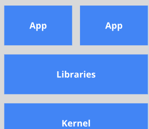
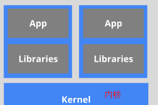

# Docker VS 虚拟机

* 虚拟机就是带环境安装的一种解决方案。对于底层系统来说，虚拟机就是一个普通文件。能够使应用程序，操作系统和硬件三者之间的逻辑不变。  

缺点：1 资源占用多 2 冗余步骤多 3 启动慢

* 由于前面虚拟机存在这些缺点，Linux 发展出虚拟化技术：Linux 容器（Linux Containers，LXC）

  容器不是模拟一个完整的操作系统，而是对进程隔离。**将软件运行所需的所有资源打包到一个隔离的容器中**。容器与虚拟机不同，**不需要捆绑一整套操作系统**。系统因此而变得高效轻量并保证部署在任何环境中的软件都能始终如一地运行。

