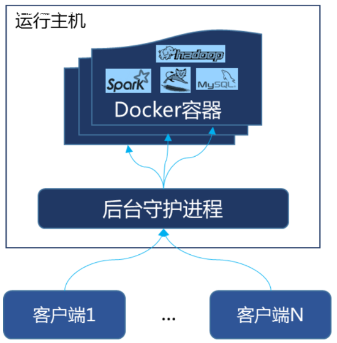

官网 http://www.docker.com

中文官网 https://docker-cn.com

仓库  https://hub.docker.com


# Docker VS 虚拟机


* 虚拟机就是带环境安装的一种解决方案。对于底层系统来说，虚拟机就是一个普通文件。能够使应用程序，操作系统和硬件三者之间的逻辑不变。  


缺点：1 资源占用多 2 冗余步骤多 3 启动慢

另外 ,虚拟机可能会有内存泄漏/溢出等问题


* 由于前面虚拟机存在这些缺点，Linux 发展出虚拟化技术：Linux 容器（Linux Containers，LXC）

  容器不是模拟一个完整的操作系统，而是对进程隔离。**将软件运行所需的所有资源打包到一个隔离的容器中**。容器与虚拟机不同，**不需要捆绑一整套操作系统**。系统因此而变得高效轻量并保证部署在任何环境中的软件都能始终如一地运行。


Docker提供隔离功能，可以将应用程序问题限制在一个容器中，而不是整个机器上。

这意味着及时出现内存泄漏/溢出 ,也只是发生在容器中 ,主机并不会卡死


==镜像一旦运行就成了容器==		==一个镜像可以被多次运行==


## 容器


容器镜像是软件的轻量级独立可执行软件包，包含运行环境：代码，运行时，系统工具，系统库，设置。

容器将软件与其周围环境隔离开来，例如开发环境和生产环境之间的差异，并有助于减少在同一基础架构上运行不同软件的团队之间的冲突。


## 容器数据卷


容器关闭后 ,需要进行数据持久化 ,这时就需要数据卷

容器数据卷是在宿主机，容器之间/==容器与容器之间==建立的文件共享机制


## 镜像


UnionFS（联合文件系统）：分层、轻量级并且高性能的文件系统，支持**对文件系统的修改作为一次提交**来一层层的叠加，可以将不同目录挂载到同一个虚拟文件系统下。

Union 文件系统是 Docker 镜像的基础。**镜像通过分层来进行继承**，基于基础镜像，可以制作各种具体的应用镜像。

一次同时加载多个文件系统，但从外面看起来，只能看到一个文件系统，联合加载会把各层文件系统叠加起来，这样最终的文件系统会包含所有底层的文件和目录


==镜像都是只读的==

当容器启动时，一个新的可写的镜像被加载到镜像层的顶部。

这一层通常被叫做容器层，容器层之下的都叫镜像层


### 镜像加载原理


docker的镜像实际上由一层一层的文件系统组成，这种层级的文件系统UnionFS。

bootfs(boot file system)主要包含bootloader和kernel, bootloader主要是引导加载kernel, Linux刚启动时会加载bootfs文件系统，在Docker镜像的最底层是bootfs。这一层与我们典型的Linux/Unix系统是一样的，包含boot加载器和内核。当boot加载完成之后整个内核就都在内存中了，此时内存的使用权已由bootfs转交给内核，此时系统也会卸载bootfs。

 rootfs (root file system) ，在bootfs之上。包含的就是典型 Linux 系统中的 /dev, /proc, /bin, /etc 等标准目录和文件。rootfs就是各种不同的操作系统发行版，比如Ubuntu，Centos等等。 


对于一个精简的OS，rootfs可以很小，只需要包括最基本的命令、工具和程序库就可以了，因为底层直接用Host的kernel，自己只需要提供 rootfs 就行了。由此可见对于不同的linux发行版, bootfs基本是一致的, rootfs会有差别, 因此不同的发行版可以公用bootfs。


### 镜像的共享资源


比如：有多个镜像都从相同的 base 镜像构建而来，那么宿主机只需在磁盘上保存一份base镜像，

同时内存中也只需加载一份 base 镜像，就可以为所有容器服务了。而且镜像的每一层都可以被共享


# 安装启动

下载的镜像会比普通的安装大很多倍	因为还下载了镜像的运行环境

默认先访问本地仓库 ,本地有镜像则无需下载


yum install docker

systemctl start docker

docker version


## 镜像加速


vim /etc/docker/daemon.json

```
{
  "registry-mirrors": ["https://ybaeu1te.mirror.aliyuncs.com"]
}
```

systemctl daemon-reload 

systemctl restart docker


## 开启自启

systemctl enable docker


## 测试运行nginx

docker run -p 8080:80 -d docker.io/nginx


docker images  列表当前docker引擎里面所有镜像

docker run -p 8080:80 -d docker.io/nginx

run 	运行 ,让镜像成为容器

-p	 端口映射

8080:80   		==8080 代表宿主机的对外暴露的端口  80代表容器里面的nginx服务器使用的端口==

​						==对外端口不同 ,内部端口一致==

-d 代表后台运行

docker.io/nginx 代表要运行哪一个镜像  可以改成nginx [从仓库下载新镜像]  也可以改成镜像ID


## 卸载

systemctl stop docker

yum -y remover docker

rm -rf /var/lib/docker


# Docker原理



​	Docker是一个Client-Server结构的系统，Docker守护进程运行在主机上， 然后通过Socket连接从客户端访问，守护进程从客户端接受命令并管理运行在主机上的容器


​	也就是说 ,==Docker容器后台运行,就必须有一个前台进程==

以nginx为例，nginx为后台进程模式运行,就导致docker前台没有运行的应用,这样的容器后台启动后,会立即退出 ,因为他觉得他没事可做了

所以，最佳的解决方案是,**将你要运行的程序以前台进程的形式运行**


# 命令


* docker --help 显示docker相关的所有命令及功能说明

* docker images -[options]

  * -a 列表本地的所有镜像及子镜像
  * -q 只显示镜像ID
  * --digests 显示镜像的摘要信息
  * --no-trunc 显示完整的镜像信息

* docker search 镜像名称             在hub上找镜像

* docker pull 镜像名称                  镜像下载          
* docker rim					 镜像删除
  * 删除单个  docker rmi -f 镜像ID
  * docker rim -f 镜像ID  镜像ID
  * 删除全部    docker rmi -f $(docker images -qa)

* docker run [options] images [command][args] 
  * --name="容器新名字": 为容器指定一个名称；
  * -d: 后台运行容器，并返回容器ID
  * -i：以交互模式运行容器，通常与 -t 同时使用；
  * -t：为容器重新分配一个伪输入终端，通常与 -i 同时使用；
  * -P: 随机端口
  * -p: 指定端口映射，有四种格式
    * ip:hostPort:containerPort
    * ip::containerPort
    * hostPort:containerPort
    * containerPort


* docker ps	列出正在运行的容器
  * -a 	历史上运行过的
  * -l 	显示最近创建的1个容器
  * -n	显示最近n个创建的容器
  * -q 	静默模式，只显示容器编号
  * --no-trunc :不截断输出。


* 启动容器
  * docker start
  * docker restart      重启

* 退出容器
  * exit	退出==并停止==容器
  * ctrl+P+Q  容器不停止退出

* 停止容器	
  * docker stop
  * docker kill      强制停止


## 容器内命令


* docker logs -tf --tail 10 容器ID               打印日志
  * -t  显示时间戳
  * -f 跟随最新的日志打印
  * --tail 数字      显示最后多少条


* docker top 容器ID		查看容器运行进程

* docker inspect 容器ID		查询容器内部细节


* 进入容器
  * docker exec -it 容器ID /bin/bash			新开终端
  * docker attach 容器ID								直接进入容器终端


* docker cp ID:容器内的路径 主机目录			复制文件到主机


* docker commit -m='备注' -a='作者' 容器ID 镜像名:[标签名]			容器提交 ,成为镜像


## 添加容器数据卷


==方式1==

* docker run -it -v /宿主机目录:/容器目录 --privileged=true 容器ID /bin/bash
  * --privileged=true  解决权限限制问题

 

* 查看容器卷是否挂载成功		docker inspect 容器ID


==方式2==

* vim Dockerfile		在任意目录下

```
#指定镜像
FROM centos
#指定挂载目录
VOLUME ["/dataContainer1","/dataContainer2"]
#成功后的提示输出
CMD echo "finished,--------success1"
CMD /bin/bash
```


* 在Dockerfile所在目录下  docker build -t 容器名:[tag] .	==末尾有个点==

```
Step 1/4 : FROM centos
 ---> 0d120b6ccaa8
Step 2/4 : VOLUME /dataContainer1 /dataContainer2
 ---> Running in 6f0a90f52099
 ---> c61db2588fa9
Removing intermediate container 6f0a90f52099
Step 3/4 : CMD echo "finished,--------success1"
 ---> Running in 6845938c71b9
 ---> 59d62df76438
Removing intermediate container 6845938c71b9
Step 4/4 : CMD /bin/bash
 ---> Running in 6c9ef07d2a55
 ---> 76e79514ccd7
Removing intermediate container 6c9ef07d2a55
Successfully built 76e79514ccd7
```


* 启动容器 	docker run -it  容器名:[tag]

* docker inspect 容器ID   查看容器内部信息

```
"Mounts": [
            {
                "Type": "volume",
                "Name": "f5b03ac8645ab2087b6e63388512b7785aaffa804bacff5a98fa4c000c983178",
                //挂载的目录
                "Source": "/var/lib/docker/volumes/f5b03ac8645ab2087b6e63388512b7785aaffa804bacff5a98fa4c000c983178/_data",
                "Destination": "/dataContainer2",
                "Driver": "local",
                "Mode": "",
                "RW": true,
                "Propagation": ""
            },
            {
                "Type": "volume",
                "Name": "accb657ed89b053ea9ca299a4eb19c701db465d0d4ec9d3b61bd48eb2d62827a",
                "Source": "/var/lib/docker/volumes/accb657ed89b053ea9ca299a4eb19c701db465d0d4ec9d3b61bd48eb2d62827a/_data",
                "Destination": "/dataContainer1",
                "Driver": "local",
                "Mode": "",
                "RW": true,
                "Propagation": ""
            }
        ],
```

可以看到文件在宿主机中的挂载目录


## 容器继承


docker run -it –name 容器2 —volumes-from 容器1 镜像名


父子容器将共享数据卷

当父子任意一方被删除 ,数据卷中的内容依然存在

==数据卷的生命周期将持续到没有任何容器使用它==


# Dockerfile解析


Dockerfile中

* 每条保留字指令都必须为大写字母后面要跟随至少一个参数
* ==每条指令都会创建一个新的镜像层==，并对镜像进行==提交==


大致流程

* 从基础镜像运行一个容器
* 执行一条指令并对容器进行修改 ,然后提交
* 基于提交的新的镜像 ,运行新容器
* 执行下一个指令

==每一行指令都会生成一个新的镜像层 ,这些镜像层存在层级的继承关系 ,下一条指令是对上一层镜像的修改==


```
Dockerfile、Docker镜像与Docker容器分别代表软件的三个不同阶段，
*  Dockerfile是软件的原材料
*  Docker镜像是软件的交付品
*  Docker容器则可以认为是软件的运行态。
```

Dockerfile		build->	镜像		运行->		容器


## 关键字


**FROM** 基础镜像，当前新镜像是基于哪个镜像的

**MAINTAINER** 镜像维护者的姓名和邮箱地址

**RUN** 容器构建时需要运行的linux命令

**EXPOSE** 当前容器对外暴露的端口	==只起到提示作用 ,端口不在Dockerfile进行定义==

**WORKDIR** 创建容器后，终端登陆的初始目录

**ENV** 		声明变量

**ADD** 将宿主机Dockerfile目录下的文件拷贝进镜像 ,会自动处理URL和解压tar包

**COPY** 类似ADD，拷贝文件和目录到镜像中 ，不带解压和url	语法COPY src dest  COPY [''src","dest"]

**VOLUME** 容器数据卷，用于数据保存和持久化工作

**CMD** 指定一个容器启动时要运行的命令格式

​    shell:  CMD  <命令>

​    exec  CMD ['可执行文件',"参数1","参数2"]

可以有多个CMD指令，但==CMD只有最后一个生效==，CMD会被docker run之后的参数替换

**ENTEYPONT** 指定一个容器启动时要运行的命令

​      ENTRYPOINT的目地和CMD一样，都是在指定容器启动程序及参数

**OBBUILD** 父镜像在被继承时运行的命令


## 模板


```shell
#基于镜像
FROM centos
#作者
MAINTAINER lx
#声明变量
ENV ROOT_PATH /usr/local
#设置工作目录
WORKDIR $ROOT_PATH
#添加软件包	指定软件包的路径	当前目录为工作目录,软件包将被自动解压
ADD ***
#将安装好的软件包改名
RUN mv *** ***
#配置环境变量
ENV JAVA_HOME /usr/local/jdk8
#安装vim
RUN yum -y install
#输出工作目录下的所有文件
RUN ls -lh
#提示对外暴露的端口
EXPOSE 80
CMD /bin/bash
```

Docker build -t mycentos:1.0 . 

Docker run -it mycentos:1.0 /bin/bash


## jar包镜像


```shell
#基于jdk镜像
FROM openjdk:8u181-jdk-alpine
#作者
MAINTAINER lx
#声明变量	工作目录/jar包名称/内部端口
ENV ROOT_PATH /mydocker/lx_storehouse/
#设置工作目录
WORKDIR $ROOT_PATH
#添加到指定目录	当前为工作目录,软件包将被自动解压,jar包不会
ADD lx.jar ./
#设置容器卷	之后只要把jar包上传至容器卷目录就能重新build
VOLUME $ROOT_PATH
#运行jar包
ENTRYPOINT ["java","-jar","lx.jar","-port","1234"]
```


## 镜像仓库


https://cr.console.aliyun.com/repository/cn-hongkong/lx-persona/lx/details

关于仓库使用的详细说明


# 4种网络模式


docker run创建Docker容器时，可以用–net指定网络模式


## bridge模式	默认

--net=bridge


为每一个容器分配Network Namespace、设置IP等，并将Docker==连接到虚拟网桥==上。当Docker server启动时，在主机上创建docker0虚拟网桥。虚拟网桥的工作方式和物理交换机类似，**主机上的所有容器通过网桥连在二层网络中**。接下来就要为容器分配IP了，从RFC1918所定义的私有IP网段中，选择和宿主机不同的IP地址和子网分配给docker0，连接到docker0的容器就从这个子网中选择一个未占用的IP使用。如一般Docker会使用172.17.0.0/16这个网段，并将172.17.42.1/16分配给docker0网桥

在主机上使用ifconfig命令是可以看到docker0的，可以认为它是网桥的管理端口，在宿主机上作为一块虚拟网卡使用


## host模式

--net=host


和宿主机共用Network Namespace ,IP和端口。 


host模式：使--net =host指定； 

none模式：使--net =none指定； 

container模式：使--net =container:NAMEorID指定。


## none模式

--net=none


Docker容器拥有自己的Network Namespace，但==不进行任何网络配置== ,即没有网卡、IP、路由等信息。需要自己配置


## container模式

--net=container


新容器和已经存在的一个容器共享Network Namespace。新容器不会创建网卡/配置IP，而是和指定容器共享IP。两个容器的进程可以通过lo网卡设备通信


