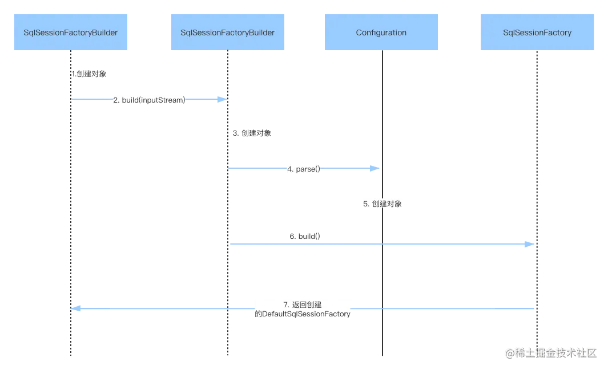
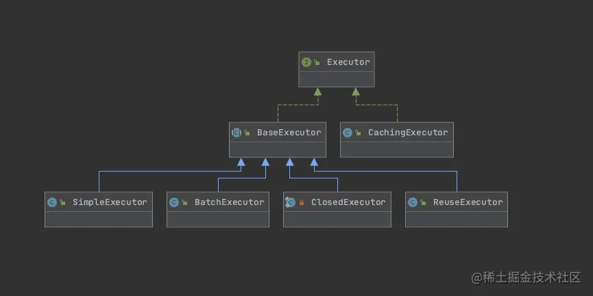

# MP


## 特性

1. 无侵入：Mybatis-Plus 在 Mybatis 的基础上进行扩展，只做增强不做改变，引入 Mybatis-Plus 不会对您现有的 Mybatis 构架产生任何影响，而且 MP 支持所有 

2. Mybatis 原生的特性

3. 依赖少：仅仅依赖 Mybatis 以及 Mybatis-Spring

4. 损耗小：启动即会自动注入基本 CURD，性能基本无损耗，直接面向对象操作

5. 预防Sql注入：内置 Sql 注入剥离器，有效预防Sql注入攻击

6. 通用CRUD操作：内置通用 Mapper、通用 Service，仅仅通过少量配置即可实现单表大部分 CRUD 操作，更有强大的条件构造器，满足各类使用需求

7. 多种主键策略：支持多达4种主键策略（内含分布式唯一ID生成器），可自由配置，完美解决主键问题

8. 支持热加载：Mapper 对应的 XML 支持热加载，对于简单的 CRUD 操作，甚至可以无 XML 启动

9. 支持ActiveRecord：支持 ActiveRecord 形式调用，实体类只需继承 Model 类即可实现基本 CRUD 操作

10. 支持代码生成：采用代码或者 Maven 插件可快速生成 Mapper 、 Model 、 Service 、 Controller 层代码，支持模板引擎，更有超多自定义配置等您来使用（P.S. 比 Mybatis 官方的 Generator 更加强大！）

11. 支持自定义全局通用操作：支持全局通用方法注入（ Write once, use anywhere ）

12. 支持关键词自动转义：支持数据库关键词（order、key......）自动转义，还可自定义关键词

13. 内置分页插件：基于 Mybatis 物理分页，开发者无需关心具体操作，配置好插件之后，写分页等同于普通List查询

14. 内置性能分析插件：可输出 Sql 语句以及其执行时间，建议开发测试时启用该功能，能有效解决慢查询

15. 内置全局拦截插件：提供全表 delete 、 update 操作智能分析阻断，预防误操作


## #和$的区别


* 传入的参数在SQL中显示不同
  * \#传入的参数在SQL中显示为字符串，自动加引号
  * $传入的参数在SqL中直接显示为传入的值

* \#防注入的风险（语句拼接）,$无法防止注入

* $方式一般用于传入数据库对象，例如传入表名。

* ==排序时使用order by 动态参数时用$==


## 一级缓存


指Session缓存。一级缓存的作用域默认是一个SqlSession。Mybatis默认开启一级缓存。
也就是在同一个SqlSession中，执行相同的查询SQL，第一次会去数据库进行查询，并写到缓存中；
第二次以后是直接去缓存中取。
当执行SQL查询中间发生了增删改的操作，MyBatis会把SqlSession的缓存清空。

一级缓存的范围有SESSION和STATEMENT两种，默认是SESSION，如果不想使用一级缓存，可以把一级缓存的范围指定为STATEMENT，这样每次执行完一个Mapper中的语句后都会将一级缓存清除。
如果需要更改一级缓存的范围，可以在Mybatis的配置文件中，在下通过localCacheScope指定。

| 1    | `<setting name=``"localCacheScope"` `value=``"STATEMENT"``/>` |
| ---- | ------------------------------------------------------------ |
|      |                                                              |

建议不需要修改

**需要注意的是**
当Mybatis整合Spring后，直接通过Spring注入Mapper的形式，如果不是在同一个事务中每个Mapper的每次查询操作都对应一个全新的SqlSession实例，这个时候就不会有一级缓存的命中，但是在同一个事务中时共用的是同一个SqlSession。
如有需要可以启用二级缓存


## 二级缓存


指mapper映射文件。二级缓存的作用域是同一个namespace下的mapper映射文件内容，多个SqlSession共享。Mybatis需要手动设置启动二级缓存。

二级缓存是默认启用的(要生效需要对每个Mapper进行配置)，如想取消，则可以通过Mybatis配置文件中的元素下的子元素来指定cacheEnabled为false


## 分页原理


Mybatis 使用 RowBounds 对象进行分页，也可以直接编写 sql 实现分页，也可 以使用 Mybatis 的分页插件。 2）分页插件的原理：实现 Mybatis 提供的接口，实现自定义插件，在插件的拦截方法内拦截待执行的 sql，然后重写 sql。 举例：select * from student，拦截 sql 后重写为：select t.* from （select * from student）t limit 0，10


## 自增主键


AUTO	数据库自增 依赖数据库
NONE	未设置主键类型（默认雪花算法,可以通过注册填充插件进行填充）

//下面这三种类型,只有当插入对象id为空时 才会自动填充。
ID_WORKER	全局唯一（idWorker）数值类型

ID_WORKER_STR(5)	全局唯一（idWorker的字符串表示）

UUID	全局唯一（UUID）


## 启动流程


```java
// 1. 读取mybatis-config.xml配置
InputStream in = Resources.getResourceAsStream("mybatis-config.xml");
// 2. 创建SqlSessionFactory工厂
SqlSessionFactory sqlSessionFactory = new SqlSessionFactoryBuilder().build(in);
// 3. 获取sqlSession
SqlSession sqlSession = sqlSessionFactory.openSession();
// 4. 获取代理的Mapper对象
TTestUserMapper userMapper = sqlSession.getMapper(TTestUserMapper.class);
// 5. 执行接口方法
TTestUser userInfo = userMapper.selectByPrimaryKey(16L);
// 6. 提交事物
sqlSession.commit();
// 7. 关闭资源
sqlSession.close();
in.close()
```





**SqlSessionFactoryBuilder**

创建SqlSessionFactory工厂

```java
public class SqlSessionFactoryBuilder {
    public SqlSessionFactory build(InputStream inputStream, String environment, Properties properties) {
        try {
            //XMLConfigBuilder用来读取mybatis-config.xml
            XMLConfigBuilder parser = new XMLConfigBuilder(inputStream, environment, properties);
            //parse()返回Configuration
            return build(parser.parse());
        } catch (Exception e) {
            throw ExceptionFactory.wrapException("Error building SqlSession.", e);
        } finally {
            ErrorContext.instance().reset();
            try {
                inputStream.close();
            } catch (IOException e) {
            }
        }
    }
}
```


**SqlSessionFactory**

产出**sqlSession**对象，并为这个对象的**excutor**成员变量赋值


**SqlSession**

定义了查询、更新、回滚等接口, 对外提供了用户和数据库之间交互需要的所有方法

SqlSession是线程不安全的，每个线程都会有自己唯一的SqlSession，不同线程间调用同一个SqlSession会出现问题，因此在使用完后需要close掉


##### Executor

SqlSession对数据库操作都委托给了Executor

1. SimpleExecutor：**默认**，每次都会创建新的Statement对象，并在执行结束后关闭
2. ReuseExecutor：可**重用**Statement对象的执行器，第一次执行一条sql，会将这条sql的Statement对象缓存在map缓存中，**执行结束后不关闭statement对象**。下一次执行，就可以从缓存中取出Statement对象，减少了重复编译的次数，从而提高了性能。每个SqlSession对象都有一个Executor对象，因此这个缓存是SqlSession级别的，当SqlSession销毁时，缓存也会销毁
3. BatchExecutor：批量执行器，每次执行一条sql，不会立马发送到数据库，而是批量一次性发送sql
4. ClosedExecutor: ResultLoaderMap的内部类，用来进行处理懒加载相关
5. CachingExecutor: Executor的装饰器, 在**执行更新时清除缓存**，在执行查询时先从缓存中查找




```java
//Configuration.class
public Executor newExecutor(Transaction transaction, ExecutorType executorType) {
    executorType = executorType == null ? defaultExecutorType : executorType;
    executorType = executorType == null ? ExecutorType.SIMPLE : executorType;
    Executor executor;
    if (ExecutorType.BATCH == executorType) {
      executor = new BatchExecutor(this, transaction);
    } else if (ExecutorType.REUSE == executorType) {
      executor = new ReuseExecutor(this, transaction);
    } else {
      executor = new SimpleExecutor(this, transaction); //默认
    }
    if (cacheEnabled) {//如果二级缓存开启,会用CachingExecutor来装饰执行器
      executor = new CachingExecutor(executor);
    }
   // 加载插件链
    executor = (Executor) interceptorChain.pluginAll(executor);
    return executor;
  }
```


Executor流程，以SimpleExecutor为例,  如果是ReuseExecutor，则没有关闭Statement这一步

```java
//SimpleExecutor.class
@Override
  public int doUpdate(MappedStatement ms, Object parameter) throws SQLException {
    Statement stmt = null;
    try {
      Configuration configuration = ms.getConfiguration();
      // 1. 创建StatementHandler
      StatementHandler handler = configuration.newStatementHandler(this, ms, parameter, RowBounds.DEFAULT, null, null);
      // 2. 创建Statement
      stmt = prepareStatement(handler, ms.getStatementLog());
      // 3. 执行sql			
      return handler.update(stmt);
    } finally {
      // 4. 关闭Statement
      closeStatement(stmt);
    }
  }
```


prepareStatement，以ReuseExecutor为例. SimpleExecutor则是没有了从缓存中存取的这一步

```java
//ReuseExecutor.class
//k:sql语句 v:Statement对象
private final Map<String, Statement> statementMap = new HashMap<>();

private Statement prepareStatement(StatementHandler handler, Log statementLog) throws SQLException {
    Statement stmt;
    BoundSql boundSql = handler.getBoundSql();
    String sql = boundSql.getSql();
    // 1. sql在缓存中则直接获取statement对象
    if (hasStatementFor(sql)) {
        stmt = getStatement(sql);
        applyTransactionTimeout(stmt);
    } else {
        //2. 不存在则创建statement对象
        Connection connection = getConnection(statementLog);
        stmt = handler.prepare(connection, transaction.getTimeout());
        //3. 放到缓存中
        putStatement(sql, stmt);
    }
    handler.parameterize(stmt);
    return stmt;
}
```


# JPA

Java Persistence API Java持久层API

使得应⽤程序以统⼀的⽅式访问持久层


JPA中的持久化上下⽂是EntityManager

内部实现使⽤了Hibernate Session（使⽤Hibernate作为持久化provider） 

持久化上下⽂包括三部分

1、事务的切⾯ 事务的切⾯是⼀个“around（环绕）”切⾯，在注解的业务⽅法前后都可以被调⽤。实现切⾯的具体类是 TransactionInterceptor。 事务的切⾯有两个主要职责： 在’before’时，切⾯提供⼀个调⽤点，来决定被调⽤业务⽅法应该在正在进⾏事务的范围内运⾏，还是开 始⼀个新的独⽴事务。 在’after’时，切⾯需要确定事务被提交，回滚或者继续运⾏。

2、事务管理器 事务管理器需要解决下⾯两个问题： 新的Entity Manager是否应该被创建？是否应该开始新的事务？这些需要事务切⾯’before’逻辑被调⽤时 决定。事务管理器的决策基于以下两点： 事务是否正在进⾏ 事务⽅法的propagation属性（⽐如REQUIRES_NEW总要开始新事务） 如果事务管理 器确定要创建新事务，那么将创建⼀个新的entity manager，entity manager绑定到当前线程，从数据 库连接池中获取连接，将连接绑定到当前线程，使⽤ThreadLocal变量将entity manager和数据库连接 都绑定到当前线程。事务运⾏时他们存储在线程中，当它们不再被使⽤时，事务管理器决定是否将他们 清除。程序的任何部分如果需要当前的entity manager和数据库连接都可以从线程中获取

3、EntityManager proxy 隔离级别

脏读 不可重复读 幻读 未提交读(RUC) 是 是 是 已提交读(RC) 否 是 是 可重复读(RR) 否 否 是 可串⾏化 否 否 否 当业务⽅法调⽤entityManager.persist()时，这不是由entity manager直接调⽤的。⽽是业务⽅法调⽤ 代理，代理从线程获取当前的entity manager，事务管理器将entity manager绑定到线程


8种锁

~~Read,WRITE~~


OPTIMISTIC	乐观读	**默认**

OPTIMISTIC_FORCE_INCREMENT	乐观写


PESSIMISTIC_READ	悲观读,读之间共享,保证数据在读期间不受修改

PESSIMISTIC_FORCE_INCREMENT	悲观读,事务结束后**增加实体的版本号**，即使实体没有修改 

PESSIMISTIC_WRITE	悲观写,当多个并发更新失败几率较高时使用


NONE	无锁


## 创建查询


query builder机制内置为构建约束查询库的实体。 带前缀的机制`findXXBy`,`readAXXBy`,`queryXXBy`,`countXXBy`, `getXXBy`自动解析的其余部分。进一步引入子句可以包含表达式等`Distinct`设置不同的条件创建查询。 然而,第一个`By`作为分隔符来表示实际的标准的开始。 在一个非常基础的查询,可以定义条件`And`或者`Or`。


IgnoreCase	忽略大小写

OrderBy…Asc/Desc	排序


假设一个`Person`有一个`Address`与一个`Zipcode`

```java
List<Person> findByAddressZipCode(ZipCode zipCode);
//通过 _ 分割,降低错误概率	但实体类需要避免使用 _
->
List<Person> findByAddress_ZipCode(ZipCode zipCode);
```


入参与方法同名

```java
Page<User> findByLastname(String lastname, Pageable pageable);

Slice<User> findByLastname(String lastname, Pageable pageable);

List<User> findByLastname(String lastname, Sort sort);

List<User> findByLastname(String lastname, Pageable pageable);
```


限制个数

查询方法的结果通过关键字first或者top来限制,它们可以交替使用

在top/firest后添加数字来表示返回最大的结果数,默认1

```java
User findFirstByOrderByLastnameAsc();

User findTopByOrderByAgeDesc();

Page<User> queryFirst10ByLastname(String lastname, Pageable pageable);

Slice<User> findTop3ByLastname(String lastname, Pageable pageable);

List<User> findFirst10ByLastname(String lastname, Sort sort);

List<User> findTop10ByLastname(String lastname, Pageable pageable);
```


返回流

```java
@Query("select u from User u")
Stream<User> findAllByCustomQueryAndStream();
```


异步查询结果

```java
@Async
Future<User> findByFirstname(String firstname);	//返回值java.util.concurrent.Future

@Async
CompletableFuture<User> findOneByFirstname(String firstname);	//java.util.concurrent.CompletableFuture

@Async
ListenableFuture<User> findOneByLastname(String lastname);	//org.springframework.util.concurrent.ListenableFuture
```


## 关键字


|                     | Sample                                |               |
| :------------------ | :------------------------------------ | :------------ |
| Is / Equals         | `findByFirstname`,`findByFirstnameIs` | 等价谓词      |
| True/False          | `findByActiveTrue()`                  | = true/false  |
| Not                 | `findByLastnameNot`                   | <> 不等于     |
| Between             | `findByStartDateBetween`              |               |
| LessThan[Equal]     | findByAgeLessThanEqual                | <=            |
| GreaterThan[Equal]  | `findByAgeGreaterThan`                | >=            |
| After               | `findByStartDateAfter`                | > (日期)      |
| Before              | `findByStartDateBefore`               | < (日期)      |
| IsNull              | `findByAgeIsNull`                     |               |
| IsNotNull,NotNull   | `findByAge(Is)NotNull`                |               |
| Starting/EndingWith | `findByFirstnameStartingWith`         | 前缀/后缀匹配 |
| Containing          | `findByFirstnameContaining`           | 全文匹配      |
| IgnoreCase          | `findByFirstnameIgnoreCase`           |               |


@Version

在实体 bean 中使用,会自动对该实体使用**乐观锁**,无需锁声明


@NotNull

**当对查询结果进行操作时,提示用户可能为Null**,只辅助代码提示,不对查询结果是否可以为Null作限制


## 非持久化一个字段


```java
static String transient1;

final String transient2 = “Satish”;

transient String transient3;

@Transient
String transient4; //注解形式的瞬态
```


