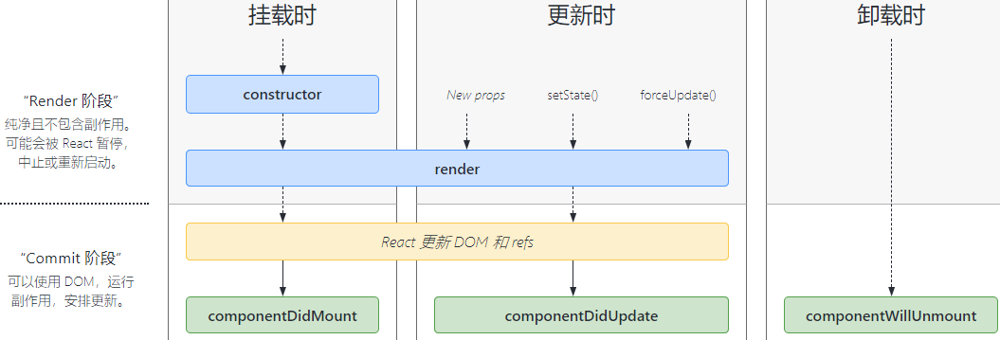

| on[Event]     | 事件的监听         |
| ------------- | ------------------ |
| handle[Event] | 处理事件的监听方法 |
|               |                    |
|               |                    |


**JSX**，JS的语法扩展。可以很好地描述 UI 应该呈现出它应有交互的本质形式

 渲染逻辑本质上与其他 UI 逻辑内在耦合, 比如，在 UI 中需要绑定处理事件、在某些时刻状态发生变化时需要通知到 UI，以及需要在 UI 中展示准备好的数据 

 React  将 *标记与逻辑*  共同存放在称之为“组件”的松散耦合单元之中 


**根DOM 节点**	根节点下的所有内容都将由 React DOM 管理

```react
const element = <h1>Hello, world</h1>;
//将元素渲染到根节点上
ReactDOM.render(element, document.getElementById('root'));
```


**React 元素**	元素一旦创建，无法修改子元素或者属性 

元素更新的唯一方式是创建新的元素,并ReactDOM.render()


**props**

React 组件的输入。它们是从父组件向下传递给子组件的数据。

**只读,不会变化,也不能手动变化它**


**props.children**

包含组件的开始标签和结束标签之间的内容

每个组件都可以获取到 `props.children`


**state**

组件中数据在某些时刻发生**变化**时，需要用 `state` 来跟踪状态

如果可以通过state / props 计算出该数据的值,则它不该定义成 state


区别：==`props` 由父组件传入， `state` 由组件本身管理==。组件不能修改 `props`，但可以修改 `state`

对所有变化数据中的每个特定部分，只应该由一个组件在其 state 中“持有”它。不要试图同步两个组件的 state。相反，应当将其[提升](https://react.docschina.org/docs/lifting-state-up.html)到最近的共同祖先组件中，并将这个 state 作为 props 传递到两个子组件


# 组件


允许将 UI 拆分为独立可复用的代码片段，并对每个片段进行独立构思,能接受任意的入参（props），并返回用于描述页面展示内容的 React 元素 

**组件名必须以大写开头** , React 会将以小写字母开头的组件视为原生 DOM 标签


**函数组件**	 本质上就是 JS 函数 ,接收入参并返回一个React 元素

```react
function Welcome(props) {
  return <h1>Hello, {props.name}</h1>;
}
==
class Welcome extends React.Component {
  render() {
    return <h1>Hello, {this.props.name}</h1>;
  }
}
```


**渲染组件**

```react
//会在页面上渲染 “Hello, Sara”
function Welcome(props) { return <h1>Hello, {props.name}</h1>; }

//对于用户自定义的组件,将JSX所接收的属性（attributes）以及子组件（children）转换为单个对象传递给组件，这个对象被称之为 “props”
const element = <Welcome name="Sara" />;
ReactDOM.render(
  element,document.getElementById('root')
);
```


**组合组件**

```react
function Welcome(props) {
  return <h1>Hello, {props.name}</h1>;
}
//App组件可以多次渲染Welcome组件
function App() {
  return (
    <div>
      <Welcome name="Sara" />
      <Welcome name="Cahal" />
      <Welcome name="Edite" />
    </div>
  );
}

ReactDOM.render(
  <App />,
  document.getElementById('root')
);
```


**提取组件**

```react
//该组件接收 author（对象），text（字符串）以及 date（日期）作为props
function Comment(props) {
  return (
    <div className="Comment">
      <div className="UserInfo">
        
        <div className="UserInfo-name">  {props.author.name} </div>
      </div>
      <div className="Comment-text">  {props.text}	</div>
      <div className="Comment-date">  {formatDate(props.date)}	</div>
    </div>
  );
}

//首先提取 Avatar 组件	->
function Avatar(props) {
  return (
    //
    
  );
} 
```


同时获取多个子组件的数据/子组件之间的通信 从技术上可以实现,但代码难以维护,可以将子组件的state提升至父组件,之后父组件通过props将状态数据传递到子组件


**受控组件**	子组件在触发事件时从父组件接收值,并通知父组件

元素的值是由 React 控制 ,state为唯一的数据源

==受控组件上指定了value,将阻止用户更改输入== ( `value` 设置为 `undefined` 或 `null` 时不再受控)

当用户将数据输入到受控组件时，会触发修改状态的事件处理器，这时由 条件判断 来决定输入是否有效


**非受控组件**

运行在 React 体系之外的表单元素。对于用户的输入,React只需要映射更新后的信息。但这也意味着无法强制给这个元素设置一个特定值 


**函数组件**	组件只包含render(),并不需要state或state由父组件管理,就可以使用函数组件

 接收 `props` 作为参数，然后返回需要渲染的元素 

```react
class Square extends React.Component {
  render() {
    return (
      <button className="square" 
        onClick={()=>this.props.onClick()}>
        {this.props.value}
      </button>
    );
  }
}
->
function Square(props){
  return(
    <button className="square" onClick={props.onClick}> //此处去掉了this和括号
      {props.value}
    </button>
  );
}
```


## 生命周期





**挂载**		组件实例被创建并插入 DOM 中

- constructor()
- static getDerivedStateFromProps()
- render()
- componentDidMount()


**更新**	当组件的 props 或 state 发生变化时会触发更新

- [`static getDerivedStateFromProps()`](https://react.docschina.org/docs/react-component.html#static-getderivedstatefromprops)
- [`shouldComponentUpdate()`](https://react.docschina.org/docs/react-component.html#shouldcomponentupdate)
- [**`render()`**](https://react.docschina.org/docs/react-component.html#render)
- [`getSnapshotBeforeUpdate()`](https://react.docschina.org/docs/react-component.html#getsnapshotbeforeupdate)
- [**`componentDidUpdate()`**](https://react.docschina.org/docs/react-component.html#componentdidupdate)


**卸载**		当组件从 DOM 中移除时会调用如下方法：

- [**`componentWillUnmount()`**](https://react.docschina.org/docs/react-component.html#componentwillunmount)


**错误处理**	当渲染过程，生命周期，或子组件的构造函数中抛出错误时

- [`static getDerivedStateFromError()`](https://react.docschina.org/docs/react-component.html#static-getderivedstatefromerror)
- [`componentDidCatch()`](https://react.docschina.org/docs/react-component.html#componentdidcatch)

### 


## input


```react
class Reservation extends React.Component {
  constructor(props) {
    super(props);
    this.state = {
      isGoing: true,
      numberOfGuests: 2
    };

    this.handleInputChange = this.handleInputChange.bind(this);
  }

  handleInputChange(event) {
    const target = event.target;
    const value = target.name === 'isGoing' ? target.checked : target.value;
    const name = target.name;

    this.setState({
      [name]: value
    });
  }

  render() {
    return (
      <form>
        <label>
          参与:
          <input
            //给input增加name属性
            name="isGoing"
            type="checkbox"
            checked={this.state.isGoing}
            onChange={this.handleInputChange} />
        </label>
        <br />
        <label>
          来宾人数:
          <input
            name="numberOfGuests"
            type="number"
            value={this.state.numberOfGuests}
            onChange={this.handleInputChange} />
        </label>
      </form>
    );
  }
}
```


对于文件的input标签	type="file" 它的value是只读的,为**非受控组件**

```react
<input type="file" />
```

 


## textarea


`this.state.value` 初始化于构造函数中，因此文本区域默认有初值。 

```react
class EssayForm extends React.Component {
  constructor(props) {
    super(props);
    this.state = {      value: '请撰写一篇关于你喜欢的 DOM 元素的文章.'    };
    this.handleChange = this.handleChange.bind(this);
    this.handleSubmit = this.handleSubmit.bind(this);
  }

  handleChange(event) {    this.setState({value: event.target.value});  }
  handleSubmit(event) {
    alert('提交的文章: ' + this.state.value);
    event.preventDefault();
  }

  render() {
    return (
      <form onSubmit={this.handleSubmit}>
        <label>
          <textarea value={this.state.value} onChange={this.handleChange} />        							</label>
        <input type="submit" value="提交" />
      </form>
    );
  }
}
```


## Select


```react
class FlavorForm extends React.Component {
  constructor(props) {
    super(props);
    //多选	this.state = {value: ['coconut', 'lime'],flag:true,};
    this.state = {value: 'coconut'};
    this.handleChange = this.handleChange.bind(this);
    this.handleSubmit = this.handleSubmit.bind(this);
  }

  handleChange(event) {    this.setState({value: event.target.value});  }
  handleSubmit(event) {
    alert('你喜欢的风味是: ' + this.state.value);
    event.preventDefault();
  }

  render() {
    return (
      <form onSubmit={this.handleSubmit}>
					<!--多选multiple={this.state.flag}-->
          <select value={this.state.value} onChange={this.handleChange}>            									<option value="grapefruit">葡萄柚</option>
            <option value="lime">酸橙</option>
            <option value="coconut">椰子</option>
            <option value="mango">芒果</option>
          </select>
        <input type="submit" value="提交" />
      </form>
    );
  }
}
```


# 状态提升


 多个组件需要反映相同的变化数据 ,可以将共享状态提升到最近的共同父组件中去 


```react
//BoilingVerdict组件接受 celsius 温度作为prop,并对prop进行条件判断
function BoilingVerdict(props) {
  if (props.celsius >= 100) {
    return <p>The water would boil.</p>;  
  }
  return <p>The water would not boil.</p>;
}

//Calculator组件渲染 input,并将input的value保存在this.state.temperature中
class Calculator extends React.Component {
  constructor(props) {
    super(props);
    this.handleChange = this.handleChange.bind(this);
    this.state = {temperature: ''};
  }

  handleChange(e) {
    this.setState({temperature: e.target.value});
  }

  render() {
    const temperature = this.state.temperature;
    return (
      <fieldset>
        <input
          value={temperature}
          //根据当前用户输入值进行重新渲染,渲染受React控制
          onChange={this.handleChange} />
        <BoilingVerdict  celsius={parseFloat(temperature)} />
      </fieldset>
    );
  }
}
```


然而这种情况只有1个input,为了支持多个input,需要将其抽离,


```react
const scaleNames = {
  c: 'Celsius',
  f: 'Fahrenheit'
};

function toCelsius(fahrenheit) {
  return (fahrenheit - 32) * 5 / 9;
}

function toFahrenheit(celsius) {
  return (celsius * 9 / 5) + 32;
}

function tryConvert(temperature, convert) {
  const input = parseFloat(temperature);
  if (Number.isNaN(input)) {
    return '';
  }
  const output = convert(input);
  const rounded = Math.round(output * 1000) / 1000;
  return rounded.toString();
}

function BoilingVerdict(props) {
  if (props.celsius >= 100) {
    return <p>The water would boil.</p>;
  }
  return <p>The water would not boil.</p>;
}

class TemperatureInput extends React.Component {
  constructor(props) {
    super(props);
    this.handleChange = this.handleChange.bind(this);
  }

  //1.调用 TemperatureInput 组件的 handleChange()
  handleChange(e) {
    //2.调用Calculator传入的props 中的onTemperatureChange()
    this.props.onTemperatureChange(e.target.value);
  }

  render() {
    const temperature = this.props.temperature;
    const scale = this.props.scale;
    return (
      <fieldset>
        <legend>Enter temperature in {scaleNames[scale]}:</legend>
        <input value={temperature}
               onChange={this.handleChange} />
      </fieldset>
    );
  }
}

class Calculator extends React.Component {
  constructor(props) {
    super(props);
    this.handleCelsiusChange = this.handleCelsiusChange.bind(this);
    this.handleFahrenheitChange = this.handleFahrenheitChange.bind(this);
    this.state = {temperature: '', scale: 'c'};
  }

  //4.通过setState改变值,进而render()重新渲染,2个输入框的值都将被重新计算
  handleCelsiusChange(temperature) {  this.setState({scale: 'c', temperature});}
  handleFahrenheitChange(temperature) {  this.setState({scale: 'f', temperature});}

  render() {
    const scale = this.state.scale;
    const temperature = this.state.temperature;
    const celsius = scale === 'f' ? tryConvert(temperature, toCelsius) : temperature;
    const fahrenheit = scale === 'c' ? tryConvert(temperature, toFahrenheit) : temperature;

    return (
      <div>
        //5.render()过程中也调用了2个子组件的render(),子组件也被重新渲染
        <TemperatureInput
          scale="c"
          temperature={celsius}
          //3.onTemperatureChange()具体可以为2种实现
          onTemperatureChange={this.handleCelsiusChange} />
        <TemperatureInput
          scale="f"
          temperature={fahrenheit}
          onTemperatureChange={this.handleFahrenheitChange} />
        //6.重新计算水是否沸腾
        <BoilingVerdict
          celsius={parseFloat(celsius)} />
      </div>
    );
  }
}

ReactDOM.render(
  <Calculator />,
  document.getElementById('root')
);
```


state的数据流应当是自顶向下的,而不是在各个组件中进行同步state

虽然提升 state 方式比双向绑定方式需要编写更多的“样板”代码，但带来的好处是，排查和隔离 bug 所需的工作量将会变少。由于“存在”于组件中的任何 state，仅有组件自己能够修改它，缩小 bug 排查范围


## 组合


 用 `children` prop 将子组件传递到渲染结果 	(不推荐用继承)


```react
//当需要对WelcomeDialog进行外层的包装时
function WelcomeDialog() {
  return (
    <FancyBorder color="blue">
      <h1>	Welcome	</h1>
    </FancyBorder>
  );
}

function FancyBorder(props) {
  return (
    <div className={'FancyBorder FancyBorder-' + props.color}>
      {props.children}	<!--组合,将WelcomeDialog的所有内容作为{props.children}传入-->
    </div>
  );
}
```


对于多个组件的组合

```react
function SplitPane(props) {
  return (
    <div className="SplitPane">
      <!--预留插槽-->
      <div>  {props.left}     </div>
      <div>  {props.right}    </div>
    </div>
  );
}

function App() {
  return (
    <SplitPane
      left={  <Contacts />   }
      right={  <Chat />      }
    />
  );
}
```


 ## 事件


使用 JSX 语法时需要传入函数，而不是字符串 

```react
<button onclick="activateLasers()">  Activate Lasers	</button>
->
<button onClick={activateLasers}>  Activate Lasers	</button>
```


```react
preventDefault()	//终止事件,无法用return
```


 在 JavaScript 中，class 的方法默认不会绑定 `this`。如果忘记绑定 `this.handleClick` 并把它传入了 `onClick`，当调用时 `this` 的值为 `undefined` 

```react
class Toggle extends React.Component {
  constructor(props) {
    super(props);
    // 为了在回调中使用 `this`，需要绑定this
    this.handleClick = this.handleClick.bind(this);  
  }

  handleClick() {}

  render() {
    return (
      <button onClick={this.handleClick}> </button>
    );
  }
}
//如果要去掉绑定this
->
  handleClick = () => {
  console.log('this is:', this);
}
//或者
->
  return (
      <button onClick={() => this.handleClick()}></button>
    );
```


### 向事件处理程序传递参数

```react
//事件对象e
<button onClick={(e) => this.deleteRow(id, e)}>Delete Row</button>	//箭头函数需要显示传递e
<button onClick={this.deleteRow.bind(this, id)}>Delete Row</button>	//普通函数通过bind
```


## 条件渲染


~~if 不使用~~

```react
class LoginControl extends React.Component {
  constructor(props) {
    super(props);
    this.handleLoginClick = this.handleLoginClick.bind(this);
    this.handleLogoutClick = this.handleLogoutClick.bind(this);
    this.state = {isLoggedIn: false};
  }

  handleLoginClick() {
    this.setState({isLoggedIn: true});
  }

  handleLogoutClick() {
    this.setState({isLoggedIn: false});
  }

  render() {
    const isLoggedIn = this.state.isLoggedIn;
    let button;
    //决定了button绑定哪个点击事件函数
    if (isLoggedIn) {
      button = <LogoutButton onClick={this.handleLogoutClick} />;    
    } else {      
      button = <LoginButton onClick={this.handleLoginClick} />;    
    }
    return (
      <div><Greeting isLoggedIn={isLoggedIn} /> {button}  </div>
    );
  }
}

ReactDOM.render(
  <LoginControl />,
  document.getElementById('root')
);
```


&&

```react
function Mailbox(props) {
  const unreadMessages = props.unreadMessages;
  return (
    <div>
      {unreadMessages.length > 0 &&  <h2>You have unread messages.</h2>}    </div>
  );
}

const messages = ['React', 'Re: React', 'Re:Re: React'];
ReactDOM.render(
  <Mailbox unreadMessages={messages} />,
  document.getElementById('root')
);
```

在 JavaScript 中

`true && expression` 返回 `expression`	使得组件被渲染

`false && expression` 返回 `false` 


?:	三目

当条件过于复杂时,需要考虑提取组件

```react
render() {
  const isLoggedIn = this.state.isLoggedIn;
  return (
    <div>
      The user is <b>{isLoggedIn ? 'currently' : 'not'}</b> logged in.    </div>
  );
}
```


阻止渲染

```react
function WarningBanner(props) {
  //直接返回null
  if (!props.warn) {    return null;  }
  return (
    <div className="warning">
      Warning!
    </div>
  );
}
```


## 列表&key


通过map()将数组转化为元素

```
const numbers = [1, 2, 3, 4, 5];
const listItems = numbers.map((number) =>  <li>{number}</li>);
```


**key的定义应当在就近的数组上下文**

```react
function ListItem(props) {
  //此处无需指定key  
  return <li>{props.value}</li>;
}

function NumberList(props) {
  const numbers = props.numbers;
  // key 应该在数组的上下文中被指定
  const listItems = numbers.map((number) => <ListItem key={number.toString()} value={number} />
  );
  return (
    <ul>
      {listItems}
    </ul>
  );
}
```

并且key只需要在兄弟节点间唯一,而不必全局唯一


由于JSX 允许在大括号中嵌入任何表达式,可以优化为

```react
function NumberList(props) {
  const numbers = props.numbers;
  return (
    <ul>
      {numbers.map((number) => 
                   <ListItem key={number.toString()}      
                     value={number} />      )}   
    </ul>
  );
}
```


# 井字棋


```react
function Square(props){
  return(
    <button className="square" onClick={props.onClick}>
      {props.value}
    </button>
  );
}

class Board extends React.Component {
  renderSquare(i) {
    return (
      <Square value={this.props.squares[i]}
        onClick={() => this.props.onClick(i)}
        />
    );
  }

  render() {
    return (
      <div>
        <div className="board-row">
          {this.renderSquare(0)}{this.renderSquare(1)}{this.renderSquare(2)}
        </div>
        <div className="board-row">
          {this.renderSquare(3)}{this.renderSquare(4)}{this.renderSquare(5)}
        </div>
        <div className="board-row">
          {this.renderSquare(6)}{this.renderSquare(7)}{this.renderSquare(8)}
        </div>
      </div>
    );
  }
}

class Game extends React.Component {
  constructor(props) {
    super(props);
    this.state = {
      //存放历史记录,从Board提升至Game
      history:[{squares: Array(9).fill(null),}],
      flag:true,
      stepNumber: 0,
    };
  }


  handleClick(i){
    //此处无法使用this.state.history,如果发生回退,再走一步时会导致“未来”历史记录不正确
    // const history = this.state.history;
    const history = this.state.history.slice(0, this.state.stepNumber + 1);
    const current = history[history.length - 1];
    const squares = current.squares.slice();
    if (calculateWinner(squares) || squares[i]) {
      return;
    }
    squares[i]=this.state.flag?'X':'O';
    this.setState({
      //concat()不会修改原数组
      history: history.concat([{
        squares: squares
      }]),
      stepNumber: history.length,
      flag: !this.state.flag,
    });
  }

  //回退  重置stepNumber与flag
  jumpTo(step) {
    this.setState({
      stepNumber: step,
      flag: (step % 2) === 0,
    });
  }

  render() {
    const history=this.state.history;
    //根据当前stepNumber展示数据,避免回退导致的异常
    const current = history[this.state.stepNumber];
    const winner = calculateWinner(current.squares);

    const moves = history.map((step,move)=>{
      const desc =move? 'Go to move #' + move :'Go to game start';
      return (
        <li key={move}>
          <button onClick={() => this.jumpTo(move)}>{desc}</button>
        </li>
      );
    });


    let status;
    if (winner) {
      status = "Winner: " + winner;
    } else {
      status = "Next player: " + (this.state.xIsNext ? "X" : "O");
    }

    return (
      <div className="game">
        <div className="game-board">
          <Board squares={current.squares}
            onClick={i => this.handleClick(i)} />
        </div>
        <div className="game-info">
          <div>{status}</div>
          <ol>{moves}</ol>
        </div>
      </div>
    );
  }
}

// ========================================
ReactDOM.render(
  <Game />,
  document.getElementById('root')
);

function calculateWinner(squares) {
  const lines = [
    [0, 1, 2],
    [3, 4, 5],
    [6, 7, 8],
    [0, 3, 6],
    [1, 4, 7],
    [2, 5, 8],
    [0, 4, 8],
    [2, 4, 6],
  ];
  for (let i = 0; i < lines.length; i++) {
    const [a, b, c] = lines[i];
    if (squares[a] && squares[a] === squares[b] && squares[a] === squares[c]) {
      return squares[a];
    }
  }
  return null;
}
```


[^Warning: Each child in an array or iterator should have a unique “key” prop. Check the render method of “XXX”.]: 需要给每个元素key,以便区别不同的元素以及父子元素

当重新渲染时,会根据每个元素的key检索出上次渲染时的key

1. key不存在,创建新组件
2. key缺少,销毁组件
3. key彼岸花,销毁再用新的state重建


 `key` 是 React 中特殊保留属性（还有一个是 `ref`，拥有更高级的特性）

当 React 元素被创建时，会提取出 `key` 并存储在返回的元素上

无法通过 `this.props.key` 来获取 `key`。React 会通过 `key` 来自动判断哪些组件需要更新。组件是不能访问 `key`  

**key只需要在同级元素之前保证唯一**


# Context


共享对于组件树而言是“全局”的数据，例如当前认证的用户、主题或首选语言 


# 高阶组件HOC


 **参数为组件，返回值为新组件的函数** , 组件是将 props 转换为 UI，而高阶组件是将组件转换为另一个组件 


## memo


```
const MyComponent = React.memo(function MyComponent(props) {
  /* 使用 props 渲染 */
});
```


适用于 相同 props 时渲染得到相同的组件,通过memo 记忆组件渲染结果,提高渲染性能

memo仅检查 props 变更。如果函数组件被 `React.memo` 包裹，且其实现中拥有 useState / useContext 的 Hook，当 context 发生变化时，仍会重新渲染 

 默认做浅层对比，可以将自定义比较函数通过第二个参数传入来实现 


# API


## render()


class 组件中唯一必须实现的方法 

render会检查 `this.props` 和 `this.state` 的变化并返回以下类型之一：

- **React 元素**。通常通过 JSX 创建
- **数组或 fragments**。 使得 render 方法可以返回多个元素
- **Portals**。可以渲染子节点到不同的 DOM 子树中
- **字符串或数值类型**。在 DOM 中会被渲染为文本节点
- **boolean / null**。什么都不渲染。（主要用于支持 `boolean && ` )

`render()` 应为纯函数，在不修改 state 的情况下，每次调用都返回相同结果，并且**不会直接与浏览器交互**

如需与浏览器进行交互，用 `componentDidMount()` 。保持 `render()` 为纯函数，可以使组件更容易思考


## constructor()


```react
constructor(props) {
	//必须先super(props);否则this.props可能会未定义
  super(props);
  //构造函数中this.setState()		其他函数中this.setState()
  this.state = { counter: 0 };
  this.handleClick = this.handleClick.bind(this);
}
```


当不初始化 state /不进行方法绑定，不需要构造函数

构造函数仅用于以下两种情况：

- 通过给 `this.state` 赋值对象来初始化[内部 state](https://react.docschina.org/docs/state-and-lifecycle.html)。
- 为[事件处理函数](https://react.docschina.org/docs/handling-events.html)绑定实例


**避免将 props 的值赋值给 state！** 可以直接使用 `this.props.` ,赋值将导致修改props不改变state


## componentDidMount()


会在组件挂载后（插入 DOM 树）立即调用

适用场景:	实例化网络请求,添加订阅


可以在 `componentDidMount()` 里setState(),将触发额外渲染，但此渲染会发生在浏览器更新屏幕之前。如此保证了即使在 `render()` 两次调用的情况下，用户也不会看到中间状态。请谨慎使用该模式，因为它会导致性能问题。通常，你应该在 `constructor()` 中初始化 state。如果你的渲染依赖于 DOM 节点的大小或位置，比如实现 modals 和 tooltips 等情况下，可以使用此方式处理


### componentDidUpdate()


会在更新后会被立即调用。首次渲染不会执行此方法

==如果 shouldComponentUpdate()返回值为 false，则不会调用 componentDidUpdate()==

当组件更新后，可在此处对 DOM 进行操作。如果对更新前后的 props 进行了比较，也可以选择在此处进行网络请求。（例如，当 props 未发生变化时，则不会执行网络请求）。

```react
componentDidUpdate(prevProps) {
  //比较props,发生改变则重新发起网络请求
  if (this.props.userID !== prevProps.userID) {
    this.fetchData(this.props.userID);
  }
}
```

可以在 `componentDidUpdate()` 中**setState()**，但**必须被包裹在条件语句中**，否则会死循环。还会导致额外的重新渲染


## componentWillUnmount()


会在组件卸载及销毁之前直接调用

在此方法中执行必要的**清理操作**，例如，清除 timer，取消网络请求或清除在 `componentDidMount()` 中创建的订阅等

**此处不应setState()**，因为该组件将永远不会重新渲染


# HOOK 16.8+


**在无需修改组件结构的情况下复用状态逻辑**, 在函数组件里“钩入” React state 及生命周期等特性的函数


* 不能在 class 组件中使用

* 在**函数最外层**调用 Hook。不要在循环、条件判断或者子函数中调用

* 在 **React 的函数组件**中调用 Hook。不要在其他 JavaScript 函数中调用
* 在自定义HOOK中调用其他HOOK


## useState


给组件添加一些内部 state, 会在重复渲染时保留这个 state

useState 会返回一对值：**当前**状态和一个让你更新它的函数,这个函数类似 class 组件的 `this.setState`，**但不会把新的 state 和旧的 state 进行合并**( state 只在组件首次渲染的时候被创建。在下一次重新渲染时，`useState` 返回上一次的 state )


非Class的React函数组件是无状态的(没有state),不使用HOOK的情况下想要加入state,必须得转化成Class

==`useState` 让React 函数组件也能拥有 状态state==


```react
class Example extends React.Component {
  constructor(props) {
    super(props);
    this.state = {  count: 0  };
}
->
function Example() {
  // 声明一个叫 “count” 的 state 变量		0作为初始state,只在第一次渲染时使用
  //useState返回一对值：count 当前状态 setCount 更新状态函数
  const [count, setCount] = useState(0);
}
```


**定义多个state**

```react
const [state, setState] = useState({ left: 0, top: 0, width: 100, height: 100 });
//需要展开...state 以确保没有丢失 width 和 height
setState(state => ({ ...state, left: e.pageX, top: e.pageY }));
```


**读取state**

```react
<p>You clicked {this.state.count} times</p>
->
//没有this,可以直接指定变量
<p>You clicked {count} times</p>
```


**更新state**

```react
<button onClick={() => this.setState({ count: this.state.count + 1 })}></button>
->
  //同样没有this
<button onClick={() => setCount(count + 1)}></button>
```


**总结**

```react
import React, { useState } from 'react';	//引入`useState` Hook
function Example() {
  const [count, setCount] = useState(0);	//调用useState Hook,返回一个变量,命名为count,返回一个更新变量的函数,命名为setCount
  return (
    <div>
      <p>{count}</p>
      <button onClick={() => setCount(count + 1)} />	//点击后更新count,触发重新渲染
    </div>
  );
}
```


const [count, setCount]	此处为 JavaScript 语法 ==数组解构==


```javascript
const foo = ['one', 'two', 'three'];

const [red, yellow, green] = foo;
console.log(red); // "one"
console.log(yellow); // "two"
console.log(green); // "three"
```


## useEffect 


副作用函数,在React完成对Dom的更改后运行	( 每次渲染 ,包括第一次)

可以视为`componentDidMount`，`componentDidUpdate` 和 `componentWillUnmount` 这三个函数的组合 

**可以在 effect 中直接访问组件的 props 和 state**


**无需清除的effect**

```react
import React, { useState, useEffect } from 'react';
// 相当于 componentDidMount 和 componentDidUpdate:  
useEffect(() => {    
  // 使用浏览器的 API 更新页面标题    
  document.title = `You clicked ${count} times`;  
});
```


**需要清除的effect**		订阅&清除订阅

一些副作用是需要清除的。例如**订阅外部数据源**。可以防止内存泄露 

```react
//Class中componentDidMount 和 componentWillUnmount相对应。挂载与卸载逻辑分离
componentDidMount() {
  document.title = `You clicked ${this.state.count} times`;
  ChatAPI.subscribeToFriendStatus(
    this.props.friend.id,
    this.handleStatusChange
  );
}

componentDidUpdate() {
  document.title = `You clicked ${this.state.count} times`;
}

componentWillUnmount() {
  ChatAPI.unsubscribeFromFriendStatus(
    this.props.friend.id,
    this.handleStatusChange
  );
}
->
useEffect(() => {
  document.title = `You clicked ${count} times`;
});

const [isOnline, setIsOnline] = useState(null);
useEffect(() => {
  function handleStatusChange(status) {
    setIsOnline(status.isOnline);
  }

  ChatAPI.subscribeToFriendStatus(props.friend.id, handleStatusChange);
  return () => {
    ChatAPI.unsubscribeFromFriendStatus(props.friend.id, handleStatusChange);
  };
});
```

==return () => {}	 返回一个函数是 useEffect 可选的清除机制。**每个 effect只能返回一个清除函数**。如此可以将添加和移除订阅的逻辑放在一起==

会在组件卸载时执行清除操作 


**Effect HOOK主要是解决Class中生命周期拆分代码逻辑带来的问题**

在Class中,`document.title` 的逻辑是被分割到 `componentDidMount` 和 `componentDidUpdate` 中，订阅逻辑又被分割到 `componentDidMount` 和 `componentWillUnmount` 中。而且 `componentDidMount` 中同时包含了两个不同功能的代码 

使用多个 effect,可以**按照代码的用途分离** ,而不是根据生命周期分离


## useContext


接收 context 对象（`React.createContext` 的返回值）并返回该 context 的当前值。当前的 context 值由上层组件中距离当前组件最近的  <MyContext.Provider>  的 `value` prop 决定。

当组件上层最近的更新时，该 Hook 会触发重渲染，并使用最新传递给 MyContext provider 的 context value值。即使祖先使用 React.memo / shouldComponentUpdate，也会在组件本身使用 useContext 时重新渲染。

别忘记 `useContext` 的参数必须是 *context 对象本身*：

调用了 `useContext` 的组件总会在 context 值变化时重新渲染 

```react
const themes = {
  light: {
    foreground: "#000000",
    background: "#eeeeee"
  },
  dark: {
    foreground: "#ffffff",
    background: "#222222"
  }
};

const ThemeContext = React.createContext(themes.light);

function App() {
  return (
    <ThemeContext.Provider value={themes.dark}>
      <Toolbar />
    </ThemeContext.Provider>
  );
}

function Toolbar(props) {
  return (
      <ThemedButton />
  );
}

function ThemedButton() {
  //useContext() 相当于 class组件中的 static contextType = MyContext 或 <MyContext.Consumer>
  const theme = useContext(ThemeContext);
  return (
    <button style={{ background: theme.background, color: theme.foreground }}/>
  );
}
```


## useRef


返回ref对象,其 `.current` 属性可变,但返回的 ref 对象在组件的整个生命周期内保持不变

当`.current` 属性发生改变时,useRef并不会进行通知,也不会触发重新渲染

```react
const [count, setCount] = useState(0);
const prevCountRef = useRef();
useEffect(() => {	prevCountRef.current = count;  });
const prevCount = prevCountRef.current;
```


useRef.current用于保存需要销毁的数据,在useEffect的return中进行销毁

```react
const divRef = useRef<NodeJS.Timeout | null>(null);
useEffect(() => {
  if (buyers.length && currentIndex < buyers.length - 1) {
    divRef.current = setTimeout(() => {
      setActive(!active);
    }, 2000);
  }
  return () => {
    if (divRef.current) {
      clearTimeout(divRef.current);
    }
  };
}, [active]);
```


## useCallback


**返回memoized回调函数**

把内联回调函数及依赖项数组作为参数传入 `useCallback`，它将返回该回调函数的 memoized 版本

回调函数仅在某个依赖项改变时才会更新,把回调函数传递给经过优化的并使用引用相等性去避免非必要渲染（例如 `shouldComponentUpdate`）的子组件时，将非常有用

```react
const memoizedCallback = useCallback(
  //内联回调函数										依赖项数组
  () => {  doSomething(a, b); }, [a, b],
);
```


## useMemo


```
const memoizedValue = useMemo(() => computeExpensiveValue(a, b), [a, b]);
```

返回一个 [memoized](https://en.wikipedia.org/wiki/Memoization) 值。

把“创建”函数和依赖项数组作为参数传入 `useMemo`，它仅会在某个依赖项改变时才重新计算 memoized 值。这种优化有助于避免在每次渲染时都进行高开销的计算。

记住，传入 `useMemo` 的函数会在渲染期间执行。请不要在这个函数内部执行与渲染无关的操作，诸如副作用这类的操作属于 `useEffect` 的适用范畴，而不是 `useMemo`。

如果没有提供依赖项数组，`useMemo` 在每次渲染时都会计算新的值。

**你可以把 `useMemo` 作为性能优化的手段，但不要把它当成语义上的保证。**将来，React 可能会选择“遗忘”以前的一些 memoized 值，并在下次渲染时重新计算它们，比如为离屏组件释放内存。先编写在没有 `useMemo` 的情况下也可以执行的代码 —— 之后再在你的代码中添加 `useMemo`，以达到优化性能的目的。


## 自定义HOOK


对于在组件间重用状态逻辑: 高阶组件 / render props / 自定义HOOK


函数名以 “`use`” 开头并调用其他 Hook 

只针对状态逻辑进行复用,但每个组件的state是独立的 -> 支持在单个组件多次调用同一个HOOK


 `FriendStatus` 组件，通过调用 `useState` 和 `useEffect` 的 Hook 来订阅一个好友的在线状态。如果要在另一个组件里重用这个订阅逻辑 

```react
import React, { useState, useEffect } from 'react';

function FriendStatus(props) {
  const [isOnline, setIsOnline] = useState(null);

  function handleStatusChange(status) {
    setIsOnline(status.isOnline);
  }

  useEffect(() => {
    ChatAPI.subscribeToFriendStatus(props.friend.id, handleStatusChange);
    return () => {
      ChatAPI.unsubscribeFromFriendStatus(props.friend.id, handleStatusChange);
    };
  });
  if (isOnline === null) {
    return 'Loading...';
  }
  return isOnline ? 'Online' : 'Offline';
}
//抽取到useFriendStatus自定义Hook,以friendID 作为参数，并返回该好友是否在线
->
function useFriendStatus(friendID) {
  const [isOnline, setIsOnline] = useState(null);

  function handleStatusChange(status) {
    setIsOnline(status.isOnline);
  }

  useEffect(() => {
    ChatAPI.subscribeToFriendStatus(friendID, handleStatusChange);
    return () => {
      ChatAPI.unsubscribeFromFriendStatus(friendID, handleStatusChange);
    };
  });
  return isOnline;
}

//此时可以在2个组件中复用
function FriendStatus(props) {
  const isOnline = useFriendStatus(props.friend.id);

  if (isOnline === null) {
    return 'Loading...';
  }
  return isOnline ? 'Online' : 'Offline';
}
function FriendListItem(props) {
  const isOnline = useFriendStatus(props.friend.id);

  return (
    <li style={{ color: isOnline ? 'green' : 'black' }}>
      {props.friend.name}
    </li>
  );
}
```


# 划分组件


* `FilterableProductTable` (橙色):整个示例应用的整体
  * `SearchBar` (蓝色): 接受所有的*用户输入*
  * `ProductTable` (绿色): 展示*数据内容*并根据*用户输入*筛选结果
    * `ProductCategoryRow` (天蓝色):为每一个产品类别展示标题
    * `ProductRow` (红色):每一行展示一个产品

当应用比较简单时，自上而下开发；较为大型的项目，自下而上


将渲染 UI 和添加交互这两个过程分开。因为编写静态版本时，往往要大量代码而不需要考虑太多交互细节；添加交互功能时则要考虑大量细节，而不需要编写太多代码


1. 构建应用的静态版本

   需要创建重用组件，然后通过 *props* 传入所需的数据。*props* 是父组件向子组件传递数据的方式。**但不应该使用 state构建静态版本**。state 代表随时间会产生变化的数据，仅在实现交互时使用

   只提供render()用于渲染,顶层组件通过 props 接受数据模型。如果数据模型发生改变，再次调用 `ReactDOM.render()`，UI 会相应地被更新

2. 确定state的最小集合

   找出应用所需的 state 的最小表示，并根据需要计算出其他所有数据,只保留应用所需的 state 的最小集合，其他数据均由它们计算产生

> 用户输入的搜索词
>
> 复选框是否选中的值

3. 确定state的放置位置 (state从父->子)

   找到公共父组件,父组件在组件层级上高于根据这个 state 进行渲染的所有组件

   如果找不到合适位置,就直接创建新组件来存放，并将新组件作为公共父组件

> `ProductTable` 需要根据 state 筛选产品列表。`SearchBar` 需要展示搜索词和复选框的状态。
>
> 他们的共同所有者是 `FilterableProductTable`。
>
> 因此，搜索词和复选框的值应该很自然地存放在 `FilterableProductTable` 组件中

4. 添加反向数据流 (从子->父)


