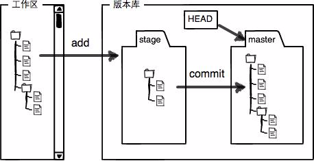
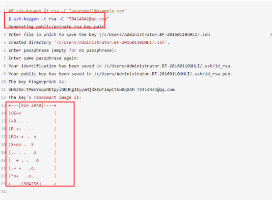
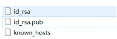
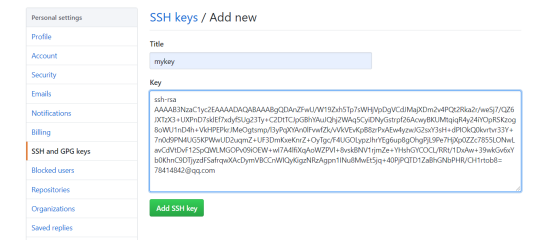

# gitignore

\# 第一步：为避免冲突需先同步远程仓库

git pull

\# 第二步：编辑.gitignore文件，添加忽略条件配置

vim .gitignore

\# 第三步：在本地项目目录下**删除缓存**

git rm -r --cached .

\# 第四步：再次add所有文件，添加到本地仓库缓存中

\# 第五步：commit，push


git diff 文件名  查看区别 没有区别就不显示


## 分支实现

使用指针将每个提交连接成一条时间线，HEAD 指针指向当前分支指针。

新建分支是新建一个指针指向时间线的最后一个节点，并让 HEAD 指针指向新分支，表示新分支成为当前分支。

每次提交只会让当前分支指针向前移动，而其它分支指针不会移动。

合并分支也只需要改变指针即可。

<div align="center">  </div><br>

## 冲突

当两个分支都对同一个文件的同一行进行了修改，在分支合并时就会产生冲突。

<div align="center">  </div><br>


## Fast forward

"快进式合并"（fast-farward merge），会直接将 master 分支指向合并的分支，这种模式下进行分支合并会丢失分支信息，也就不能在分支历史上看出分支信息。

可以在合并时加上 --no-ff 参数来禁用 Fast forward 模式，并且加上 -m 参数让合并时产生一个新的 commit。

```
$ git merge --no-ff -m "merge with no-ff" dev
```

<div align="center">  </div><br>

## 储藏（Stashing）

在一个分支上操作之后，如果还没有将修改提交到分支上，此时进行切换分支，那么另一个分支上也能看到新的修改。这是因为所有分支都共用一个工作区的缘故。

可以使用 git stash 将当前分支的修改储藏起来，此时当前工作区的所有修改都会被存到栈中，也就是说当前工作区是干净的，没有任何未提交的修改。此时就可以安全的切换到其它分支上了。

```
$ git stash
Saved working directory and index state \ "WIP on master: 049d078 added the index file"
HEAD is now at 049d078 added the index file (To restore them type "git stash apply")
```

该功能可以用于 bug 分支的实现。如果当前正在 dev 分支上进行开发，但是此时 master 上有个 bug 需要修复，但是 dev 分支上的开发还未完成，不想立即提交。在新建 bug 分支并切换到 bug 分支之前就需要使用 git stash 将 dev 分支的未提交修改储藏起来。

## SSH 传输设置

Git 仓库和 Github 中心仓库之间的传输是通过 SSH 加密。

如果工作区下没有 .ssh 目录，或者该目录下没有 id_rsa 和 id_rsa.pub 这两个文件，可以通过以下命令来创建 SSH Key：

```
$ ssh-keygen -t rsa -C "youremail@example.com"
```

然后把公钥 id_rsa.pub 的内容复制到 Github "Account settings" 的 SSH Keys 中。


# git pull和git fetch

- .git/refs/head/[本地分支]
- .git/refs/remotes/[正在跟踪的分支]

存储了git本地仓库master分支的commit ID 和 跟踪的远程分支orign/master的commit ID


首先假设我们本地仓库的master分支上commit ID =1 ，orign/master的commit ID =1 ;

这时远程仓库有人更新了master代码，commit ID =2 ,这边再提交本地仓库时


* git fetch  下载,手动merge
  * 本地master的commitID=1不变。远程仓库orign/master的commit ID=2**。本地相当于存储了两个代码的版本号**
  * 通过merge去合并，如果两个版本都修改了同一处代码，出现冲突，解决冲突后就生成了新的代码版本
  * **这时候本地的代码版本可能就变成了commit ID=3，即生成了一个新的代码版本**
  * fetch的时候本地的master没有变化，**但与远程仓关联的.git/refs/remotes/被更新了**


* git pull  更新,自动merge
  * **将.git/refs/head/和.git/refs/remotes/都更新**
  * 类似于git fetch+git merge ,但将merge自动化了 ,最后**commit ID=2**
  * git pull一旦代码有问题，很难找到出错的地方,**本地仓库在未经确认的情况被更新**。当然在本地工作目录还不至于造成不可挽回的损失


# 撤销/回退


* 工作区
  * git checkout —- 文件名 	撤销单个
  * git checkout —-	丢弃全部

* add区
  * git reset HEAD 文件名
  * git reset HEAD .

* commit区
  * ==reset 修改HEAD位置==
  * git reset —-hard 版本号
  * git reset --hard HEAD^	回退上一个版本
  * git reset –-soft 版本号  提交回退到暂存区,修改记录保留
  * git reset –-mixed 版本号 提交回退到工作区，修改记录保留
  * git reset –-hard  修改记录不保留

* push区
  * ==revert复制历史版本，加在当前分支之前==
  * git revert -n 版本号


Svn集中式,版本号为**数字**.所有人提交到同一个中央服务器,版本号由这个中央服务器统一管理.所以版本号可以为简单的阿拉伯数字

git是分布式.版本号为**字符串**.代码提交到本地版本库.在需要与其他人进行版本合并时,如果用数字版本号,就会造成冲突


# 分支管理

git branch  查看本地分支

git branch -r  查看远程分支

git branch dev	创建dev分支

git branch -d dev 删除分支(先离开这个分支)

 

git checkout dev 切换分支

git checkout -b dev创建并切换

git checkout -- filename	检出上次提交的文件

 

git merge 分支名  合并(先回到要合并的分支)

git merge --no-ff origin/dev  在当前分支上合并远程分支dev

git merge --abort 终止本次merge，并回到merge前的状态


冲突问题？(master和dev都推进了一个版本,导致版本冲突,只有一方推进不冲突)

先合并			表示合并中

再手动解决文件中的冲突		再add	commit


## bug分支

当出现bug时,假设还在编辑一个文件.此时需要放下手头的工作去改bug

但是正在编辑的文件还不能进行提交,在未提交的状态下切换分支,其他分支上也会有这个文件

此时需要存储当前工作环境,等解决bug之后再返回工作环境

 

git stash		存储当前工作环境

git stash list	存储的所有工作环境

git stash pop		恢复工作环境


# 远程仓库


## 创建SSH Key

 在用户主目录下，看看有没有.ssh目录，如果有，再看看这个目录下有没有id_rsa和id_rsa.pub这两个文件,没有则打开Shell，创建SSH Key：

ssh-keygen -t rsa -C “1169732264@qq.com”



可以在用户主目录里找到.ssh目录，里面有id_rsa和id_rsa.pub两个文件

id_rsa	私钥

id_rsa.pub	公钥

 

创建shh key	**如果想要别人修改你的代码,需要配置上别人的ssh key公钥**



## 为什么配置用户ssh key而非项目ssh key？

项目的 sshkey 只针对项目，仅能拉取项目，**通常用于生产服务器拉取仓库的代码**。

用户的 key 则是针对用户的，用户添加了 key 就对用户名下的项目和用户参加了的项目具有权限，一般而言，用户的key具有推送和拉取的权限，而项目的 key 则只具有拉取权限。


## 添加远程仓库

git remote add origin 链接		关联远程仓库


* git clone
  * clone会下载所有分支,不过本地**只会有master,其余分支需要手动关联**
  * **只在推送才需要ssh  克隆不用**
  * clone别人仓库,得不到push权限

git checkout -b origin/dev		创建分支并**关联远程仓库的分支**


git remote –v		仓库详细信息


# 初始化设置


## 代理

* git config --global http.proxy 'socks5://127.0.0.1:1080' 

* git config --global https.proxy 'socks5://127.0.0.1:1080'

查看代理：

* git config --global --get http.proxy

* git config --global --get https.proxy

取消代理：

* git config --global --unset http.proxy

* git config --global --unset https.proxy


## 用户名

git config --global user.name ""

git config --global user.email ""

git config  credential.helper store  	免密push


