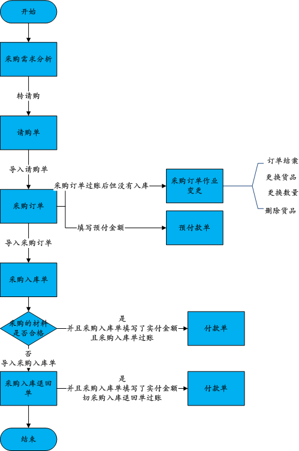
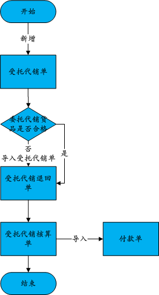

# WMS 仓储

## 采购

**采购之前无订单管理环节**：直接开俱【采购入库单】-> 提交【采购入库单】审核->审核通过->过账->入库

**采购之前先下订单**：先做【采购需求分析】——【请购单】――【采购单】――相关人员审核通过――在【采购入库单】调入通过的【采购订单】－－审核、过账――入库

### 采购需求分析

根据库存情况、销售情况及市场预测，为采购人员提供决策支持。统计分析指定日期范围内的历史销售情况除以总天数得出每天的平均销售量，再针对这个平均销售量和当前的库存数计算预测分析目前的库存量是否能维系查询条件里给定的销售天数

### 请购单

可以来源于需求分析也可以新增

### 采购订单

当仓库的存货不足，需要向供应商订货时，在系统中登打采购订单。

采购订单与入库单完全连线，并可管制已交货数量、订金，已交货完毕者系统将自动结案

#### 采购订金处理

采购时有给供应商付订金的话，在新增采购订单时，录入采购信息后，在表尾预付订金中录入订金金额，并选择付款账户，订金金额不能超过单据的结算金额，录入完成后点击保存，订单过账后系统会自动产生一张对该供应商的预付款单

#### **折扣处理：**

采购中有发生折扣时通过折扣率进行处理，新增采购订单，录入采购信息后对有折扣的货品录入折扣率，系统会自动推算折后单价和折后金额。折后单价=单价*折扣率，折后金额=折后单价*数量，录入完成后点击保存即可。

#### 赠品处理

采购中有搭赠货品时有两种处理方式，对于固定的搭赠，在采购政策中设置赠品，新增采购订单后，选择货品系统会自动带出相关的赠品信息；对于临时赠品，在登打采购订单时将赠品的单价录入为0，并且勾选“是赠品”，这样赠品部分就不会产生付款信息。

#### 采购订单变更作业

采购订单已过账生效后，发现需要更改货品数量、或者更改货品或者需要将订单终止等等情况，可通过采购订单变更实现，注意**该订单必须没有产生后续的入库单**。订单变更的界面如下

变更的采购订单在审核无误进行过账，**过账后订单重新生效**。

==订单变更类型:==

* 订单结案:终止所选择的订单

* 更换货品:将原来的采购货品更换其他货品

* 更改数量:修改需要采购的数量

* 删除货品:将需要采购的货品删除

### 采购入库单

当供应商的货物送到后，对货品进行入库处理。入库有两种方式，一种是从采购订单导入生成采购入库单，另一种是直接登打采购入库单。

#### 优惠抹零处理

入库结算时有发生优惠时，通过采购入库单表尾的优惠金额进行处理，新增采购入库单，录入或从采购订单导入入库数据，有优惠时，例如原入库购买金额为1050，入库时供应商优惠了50，则优惠金额输入50，后续结算时只需要支付1000的账款即可，录入完成后点击保存

#### 现付处理

当支付方式是货到付款时，通过采购入库单表尾的实付金额进行处理，新增采购入库单，录入或从采购订单导入入库数据，对供应商支付的货款，在实付栏输入实付金额，选择付款账户，录入完成后点击保存，过账后系统会自动产生相应的付款单据，点击追溯可以查看产生的付款单。

#### 采购入库退货单

已经入库的货品，在使用中发现不合格需要退货给供应商时，做采购入库退货单。退货有两种方式，一种是从采购入库单导入生成采购入库退货单，另一种是直接登打采购入库退货单。

#### 采购发票

#### 采购发票调整单

对于处理采购货品已经入库，但是发票还没到，或者发票没有收齐的情况自动产生的发票调整单。

* 需要进行**入库暂估**
  * **单到红冲：**货品全部入库，发票一张都没有收到。开发票的时候，将发票单红冲，生成金额相同的负数发货调整单。==等发票到齐，再将发票调整单红冲掉==
  * **单到补差：**货品全部入库，发票没收齐，开发票的时候，将没有收齐的金额红冲，生成发票调整单。等发票到齐，再将发票调整单红冲掉

### 采购报表

三大部分：单据明细表、单据统计表、采购综合报表

具体包括的单据有：请购单、采购订单、采购入库单、采购入库退回单、受托代销单、受托代销核算单、受托代销退回单

### 受托代销

受到第三方的委托代理销售其产品

先检查代销货品是否合格

### 受托代销退回单

已经入库的委托代销货品，在使用中发现不合格需要退货给委托方时，做委托代销退回单

#### 受托代销核算单

用于处理受托产品销售后，与委托方进行核算，核算单生效后自动生成付款单。数据来源于受托代销单和受托代销退回单

# CMS 内容管理

# CRM 客户关系管理

ERP系统并没有很好地实现对[供应链](https://baike.baidu.com/item/供应链)下游（客户端）的管理

CRM是选择和管理有价值客户及其关系的一种商业策略，要求以客户为中心的商业哲学和企业文化来支持有效的市场营销、销售与服务流程

# 网关服务

APP/Browser怎么去访问这些后端的服务? 

如果业务比较简单的话，可以给每个业务都分配一个独立的域名，但这种方式会有几个问题:

- 每个业务都需要限流、权限校验等逻辑
- 客户端代码会难维护，涉及到数百个域名
- 连接数的瓶颈
- 每上线一个新的服务，都需要运维参与，申请域名、配置Nginx，上下线服务器
- 后端微服务可能不同语言/协议，HTTP、Dubbo、GRPC等，但不可能要求客户端去适配这么多种协议
- 后期如果要对微服务进行重构也会麻烦，需要客户端配合一起改造，比如商品服务，随着业务变的越来越复杂，后期需要进行拆分成多个微服务，这个时候对外提供的服务也需要拆分成多个，同时需要客户端配合你进行改造，非常蛋疼。

**API Gateway**

API网关接管所有的入口流量，类似Nginx，将用户请求转发给后端的服务器，但网关不仅仅是转发，也会针对流量做一些扩展，比如鉴权、限流、熔断、协议转换、错误码统一、缓存、日志、监控、告警等，这样将通用的逻辑抽出来，由网关统一去做，业务方也能够更专注于业务逻辑，提升迭代的效率

客户端只需与API网关交互，而不用与各个业务方的接口分别通讯，但多引入一个组件就多引入了一个潜在的故障点，因此要实现一个高性能、稳定的网关，也会涉及到很多点

**API注册**

业务方如何接入网关?一般来说有几种方式。

- 第一种采用插件扫描业务方的API，比如Spring MVC的注解，并结合Swagger的注解，从而实现参数校验、文档&&SDK生成等功能，扫描完成之后，需要上报到网关的存储服务。
- 手动录入。比如接口的路径、请求参数、响应参数、调用方式等信息，但这种方式相对来说会麻烦一些，如果参数过多的话，前期录入会很费时费力。

- 配置文件导入。比如通过SwaggerOpenAPI等，比如阿里云的网关:

**协议转换**

内部的API可能是由很多种不同的协议实现的，比如HTTP、Dubbo、GRPC等，但对于用户来说其中很多都不是很友好，或者根本没法对外暴露，比如Dubbo服务，因此需要在网关层做一次协议转换，将用户的HTTP协议请求，在网关层转换成底层对应的协议，比如HTTP -> Dubbo, 但这里需要注意很多问题，比如参数类型，如果类型搞错了，导致转换出问题，而日志又不够详细的话，问题会很难定位

**服务发现**

网关作为流量的入口，负责请求的转发，但首先需要知道转发给谁，如何寻址，这里有几种方式:

- 写死在代码/配置文件里，这种方式虽然比较挫，但也能使用，比如线上仍然使用的是物理机，IP变动不会很频繁，但扩缩容、包括应用上下线都会很麻烦，网关自身甚至需要实现一套健康监测机制。
- 域名。采用域名也是一种不错的方案，对于所有的语言都适用，但对于内部的服务，走域名会很低效，另外环境隔离也不太友好，比如预发、线上通常是同一个数据库，因此网关读取到的可能是同一个域名，这时候预发的网关调用的就是线上的服务。
- 注册中心。采用注册中心就不会有上述的这些问题，即使在容器环境下，节点的IP变更比较频繁，但节点列表的实时维护会由注册中心搞定，对网关是透明的，另外应用的正常上下线、包括异常宕机等情况，也会由注册中心的健康检查机制检测到，并实时反馈给网关。并且采用注册中心性能也没有额外的性能损耗，采用域名的方式，额外需要走一次DNS解析、Nginx转发等，中间多了很多跳，性能会有很大的下降，但采用注册中心，网关是和业务方直接点对点的通讯，不会有额外的损耗

**服务调用**

网关由于对接很多种不同的协议，因此可能需要实现很多种调用方式，比如HTTP、Dubbo等，基于性能原因，最好都采用异步的方式，而Http、Dubbo都是支持异步的，比如apache就提供了基于NIO实现的异步HTTP客户端。

因为网关会涉及到很多异步调用，比如拦截器、HTTP客户端、dubbo、[redis](https://cloud.tencent.com/product/crs?from=10680)等，因此需要考虑下异步调用的方式，如果基于回调或者future的话，代码嵌套会很深，可读性很差，可以参考zuul和spring cloud gateway的方案，基于响应式进行改造

**优雅下线**

优雅下线也是网关需要关注的一个问题，网关底层会涉及到很多种协议，比如HTTP、Dubbo，而HTTP又可以继续细分，比如域名、注册中心等，有些自身就支持优雅下线

Nginx自身是支持健康监测机制的，如果检测到某一个节点已经挂掉了，就会把这个节点摘掉

对于应用正常下线，需要结合发布系统，首先进行逻辑下线，然后对后续Nginx的健康监测请求直接返回失败(比如直接返回500),然后等待一段时间(根据Nginx配置决定)，然后再将应用实际下线掉

另外对于注册中心的其实也类似，一般注册中心是只支持手动下线的，可以在逻辑下线阶段调用注册中心的接口将节点下线掉，而有些不支持主动下线的，需要结合缓存的配置，让应用延迟下线。另外对于其他比如Dubbo等原理也是类似

**性能**

网关作为所有流量的入口，性能是重中之重，早期大部分网关都是基于同步阻塞模型构建的，每个请求/连接都会占用一个线程，而线程在JVM中是一个很重的资源，比如Tomcat默认就是200个线程，如果网关隔离没有做好的话，当发生网络延迟、FullGC、第三方服务慢等情况造成上游服务延迟时，线程池很容易会被打满，造成新的请求被拒绝，但这个时候其实线程都阻塞在IO上，系统的资源被没有得到充分的利用

另外一点，容易受网络、磁盘IO等延迟影响。需要**谨慎设置超时时间**，如果设置不当，且服务隔离做的不是很完善的话，网关很容易被一个**慢接口**拖垮

而异步化的方式则完全不同，通常情况下一个CPU核启动一个线程即可处理所有的请求、响应。一个请求的生命周期不再固定于一个线程，而是会分成不同的阶段交由不同的线程池处理，系统的资源能够得到更充分的利用。而且因为线程不再被某一个连接独占，一个连接所占用的系统资源也会低得多，只是一个文件描述符加上几个监听器等。

对于上游服务的延迟情况，也能够得到很大的缓解，因为在阻塞模型中，慢请求会独占一个线程资源，而异步化之后，因为单条连接所占用的资源变的非常低，系统可以同时处理大量的请求。

如果是JVM平台，Zuul 2、Spring Cloud gateway等都是不错的异步网关选型，另外也可以基于Netty、Spring Boot2.x的webflux、vert.x或者servlet3.1的异步支持进行自研

**缓存**

对于一些幂等的get请求，可以在网关层面根据业务方指定的缓存头做一层缓存，存储到Redis等二级缓存中，这样一些重复的请求，可以在网关层直接处理，而不用打到业务线，降低业务方的压力，另外如果业务方节点挂掉，网关也能够返回自身的缓存

**限流**

限流对于每个业务组件来说，可以说都是一个必须的组件，如果限流做不好的话，当请求量突增时，很容易导致业务方的服务挂掉

因此一定要在接入层做好限流策略，对于非核心接口可以直接将降级掉，保障核心服务的可用性，对于核心接口，需要根据压测时得到的接口容量，制定对应的限流策略

限流又分为几种:

- 单机。单机性能比较高，不涉及远程调用，只是本地计数，对接口RT影响最小。但需要考虑下限流数的设置，比如是针对单台网关、还是整个网关集群，如果是整个集群的话，需要考虑到网关缩容、扩容时修改对应的限流数
- 分布式。分布式的就需要一个存储节点维护当前接口的调用数，比如redis、sentinel等，这种方式由于涉及到远程调用，会有些性能损耗，另外也需要考虑到存储挂掉的问题，比如redis如果挂掉，网关需要考虑降级方案，是降级到本地限流，还是直接将限流功能本身降级掉

另外还有不同的策略:简单计数、令牌桶等，大部分场景下其实简单计数已经够用了，但如果需要支持突发流量等场景时，可以采用令牌桶等方案。还需要考虑根据什么限流，比如是IP、接口、用户维度、还是请求参数中的某些值，这里可以采用表达式，相对比较灵活

**稳定性**

稳定性是网关非常重要的一环，监控、告警需要做的很完善才可以，比如接口调用量、响应时间、异常、错误码、成功率等相关的监控告警，还有线程池相关的一些，比如活跃线程数、队列积压等，还有些系统层面的，比如CPU、内存、FullGC

网关是所有服务的入口，对于网关的稳定性的要求相对于其他服务会更高，最好能够一直稳定的运行，尽量少重启，但当新增功能、或者加日志排查问题时，不可避免的需要重新发布，因此可以参考zuul的方式，将所有的核心功能都基于不同的拦截器实现，拦截器的代码采用Groovy编写，存储到数据库中，支持动态加载、编译、运行，这样在出了问题的时候能够第一时间定位并解决，并且如果网关需要开发新功能，只需要增加新的拦截器，并动态添加到网关即可，不需要重新发布

**熔断降级**

熔断机制也是非常重要的一项。若某一个服务挂掉、接口响应严重超时等发生，则可能整个网关都被一个接口拖垮，因此需要增加熔断降级，当发生特定异常的时候，对接口降级由网关直接返回，可以基于Hystrix或者Resilience4j实现

**日志**

由于所有的请求都是由网关处理的，因此日志也需要相对比较完善，比如接口的耗时、请求方式、请求IP、请求参数、响应参数(注意脱敏)等，另外由于可能涉及到很多微服务，因此需要提供一个统一的traceId方便关联所有的日志，可以将这个traceId置于响应头中，方便排查问题

**隔离**

比如线程池、http连接池、redis等应用层面的隔离，另外也可以根据业务场景，将核心业务部署带单独的网关集群，与其他非核心业务隔离开

**网关管控平台**

这块也是非常重要的一环，需要考虑好整个流程的用户体验，比如接入到网关的这个流程，能不能尽量简化、智能，比如如果是dubbo接口，我们可以通过到git仓库中获取源码、解析对应的类、方法，从而实现自动填充，尽量帮用户减少操作；另外接口一般是从测试->预发->线上，如果每次都要填写一遍表单会非常麻烦，我们能不能自动把这个事情做掉，另外如果网关部署到了多个可用区、甚至不同的国家，那这个时候，我们还需要接口数据同步功能，不然用户需要到每个后台都操作一遍，非常麻烦。

这块个人的建议是直接参考阿里云、aws等提供的网关服务即可，功能非常全面

**其他**

其他还有些需要考虑到的点，比如接口mock，文档生成、sdk代码生成、错误码统一、服务治理相关的等

**总结**

目前的网关还是中心化的架构，所有的请求都需要走一次网关，因此当大促或者流量突增时，网关可能会成为性能的瓶颈，而且当网关接入的大量接口的时候，做好流量评估也不是一项容易的工作，每次大促前都需要跟业务方一起针对接口做压测，评估出大致的容量，并对网关进行扩容，而且网关是所有流量的入口，所有的请求都是由网关处理，要想准确的评估出容量很复杂。可以参考目前比较流行的ServiceMesh，采用去中心化的方案，将网关的逻辑下沉到sidecar中，sidecar和应用部署到同一个节点，并接管应用流入、流出的流量，这样大促时，只需要对相关的业务压测，并针对性扩容即可，另外升级也会更平滑，中心化的网关，即使灰度发布，但是理论上所有业务方的流量都会流入到新版本的网关，如果出了问题，会影响到所有的业务，但这种去中心化的方式，可以先针对非核心业务升级，观察一段时间没问题后，再全量推上线。另外ServiceMesh的方案，对于多语言支持也更友好。

