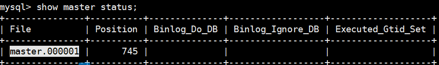
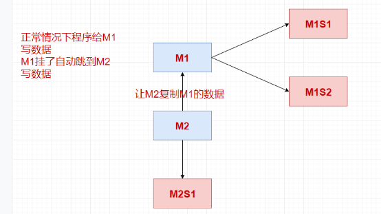
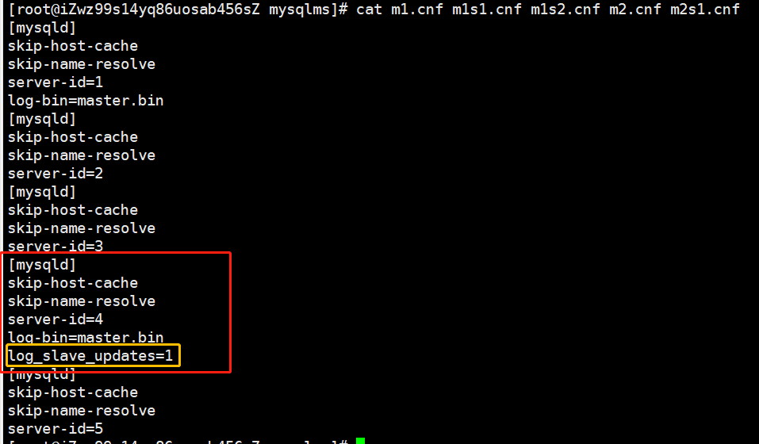
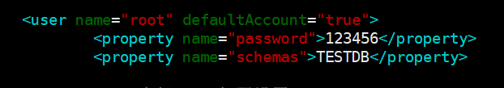
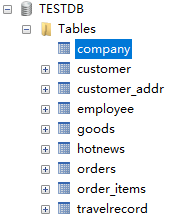
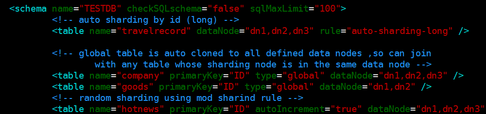
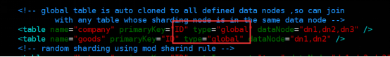
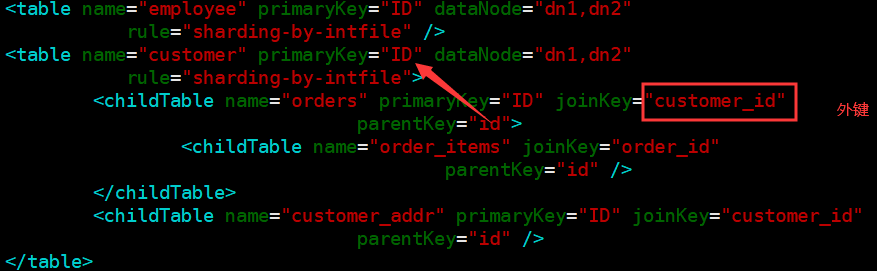
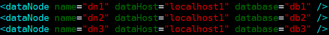

传统的关系性数据库已经无法满足快速查询与插入数据的需求。这个时候NoSQL的出现暂时解决了这一危机。它通过**降低数据的安全性，减少对事务的支持，减少对复杂查询的支持**，来获取性能上的提升。

但是，有些场合NoSQL无法满足，所以还是需要使用关系性数据库。此时就需要做数据库集群，为了提高查询性能将一个数据库的数据分散到不同的数据库


Mycat能满足数据库数据大量存储；提高了查询性能;实现读写分离，分库分表


Mysql的表最大存储	500w条	数据

表查询的性能极限	二分查找平均情况下log(n)


==Mycat和Mysql区别==

  可以把上层看作是对下层的抽象，例如操作系统是对硬件的抽象。Mycat对数据库层做一个抽象，来管理这些数据库，而上层应用只需要面对一个数据库层的抽象或者说数据库中间件就行，这就是Mycat的核心作用。**数据库是对底层存储文件的抽象，而Mycat是对数据库的抽象。**


==Mycat原理==

它拦截了用户发送过来的SQL语句，首先对SQL语句做了一些特定的分析，如分片分析，路由分析，读写分离分析，缓存分析等，然后将此sql发往后端的真实数据库，并将返回的结果做适当处理，最终返回给用户


主库将所有的写操作记录在binlog日志中，并生成**log dump线程，将binlog日志传给从库的I/O线程**

**从库生成两个线程**，一个是I/O线程，另一个是SQL线程

 

I/O线程去请求主库的binlog日志，并将binlog日志中的文件写入**relay log（中继日志**）中

SQL线程会读取relay loy中的内容，并解析成具体的操作，来实现主从的操作一致，达到最终数据一致的目的


mycat只能路由，分布，==不能数据同步==，所以要数据同步必做还要使用mysql的读写分离，主从复制


# Mysql主从


Mysql主从又叫Replication、AB复制。

A与B两台机器做主从后，在A上写数据，另外一台B也会跟着写数据，实现数据实时同步

mysql主从是基于**binlog**，主需开启binlog才能进行主从

 

主从3个步骤

* 主创建**同步账户**授权给从
* 主将更改操作记录到binlog里
* 从将主的binlog事件（sql语句） 同步本机上并记录在relaylog里
* 从根据relaylog里面的sql语句按顺序执行


主从模式

* 一主一从

* 主主复制

* 一主多从---扩展系统读取的性能，因为读是在从库读取的

* 多主一从---5.7版本开始支持

* 联级复制


## docker搭建

* docker提取配置文件

docker run --name M1 -p 3307:3306 -e MYSQL_ROOT_PASSWORD=123456 -d mysql:5.7

docker run --name M1S1 -p 3308:3306 -e MYSQL_ROOT_PASSWORD=123456 -d mysql:5.7


* 修改配置文件

mkdir /root/mysqlms		创建配置文件的文件夹

docker cp M1:/etc/mysql/conf.d/docker.cnf m1.cnf 

docker cp M1S1:/etc/mysql/conf.d/docker.cnf m1s1.cnf


vim m1.cnf	主添加2条

server-id=1
log-bin=master.bin


vim m1s1.cnf	从添加server-id

server-id=2


* 配置文件复制进docker

docker cp m1.cnf M1:/etc/mysql/conf.d/docker.cnf

docker cp m1s1.cnf M1S1:/etc/mysql/conf.d/docker.cnf


docker restart M1 M1S1		重启docker


* 创建共享账户给从机

docker exec -it M1 bash    进入镜像

mysql -uroot -p123456

create user 'rep'@'%' identified by '123456';

grant replication slave on *.* to 'rep'@'%';				**replication 复制权限**

**flush privileges;**		刷新权限


==show master status;==




* 配置从机

docker exec -it M1 bash

mysql -uroot -p123456


change master to master_host="120.76.132.188",master_port=3307,master_user="rep",master_password="123456",master_log_file="master.000001",master_log_pos=745;

master_log_file 为主机show master status 的文件名	master_log_pos同理


start slave ;		启动主从

==show slave status \G;==	校验主从状态，有下图2个yes代表配置成功

​			Slave_IO_Running: Yes
​            Slave_SQL_Running: Yes

* 如果第一个是connecting		可能从机上主机的ip端口错误

​		stop slave;		先关闭主从 ，再重新change master

* 第一个是no		检查server-id配置

* 如果第二个no	表示两个数据库并没有同步


## 主从操作规范


* 只能在主机里面执行DML 语句
* 使用navicat时，**不要在从机操作**！！！！会不同步

* 在从机里面可以执行查询语句

* 主机只有一台，但是从机可以有多台


# Mysql集群


### 优点

高可伸缩性：服务器集群具有很强的可伸缩性。 随着需求和负荷的增长，可以向集群系统添加更多的服务器。在这样的配置中，可以有多台服务器执行相同的应用和数据库操作。

高可用性：在不需要操作者干预的情况下，防止系统发生故障或从故障中自动恢复的能力。通过把故障服务器上的应用程序转移到备份服务器上运行，集群系统能够把正常运行时间提高到大于99.9%，大大减少服务器和应用程序的停机时间。

### 缺点

​    我们知道集群中的应用只在一台服务器上运行，如果这个应用出现故障，其它的某台服务器会重新启动这个应用，接管位于共享磁盘柜上的数据区，进而使应用重新正常运转。我们知道整个应用的接管过程大体需要三个步骤：侦测并确认故障、后备服务器重新启动该应用、接管共享的数据区。因此在切换的过程中需要花费一定的时间，原则上根据应用的大小不同切换的时间也会不同，越大的应用切换的时间越长。


mysql集群需要**5台起步**

| 名称 | Ip              | Port |
| ---- | --------------- | ---- |
| M1   | 192.168.149.128 | 3307 |
| M1S1 | 192.168.149.128 | 3308 |
| M1S2 | 192.168.149.128 | 3309 |
| M2   | 192.168.149.128 | 3310 |
| M2S1 | 192.168.149.128 | 3311 |




\#docker run --name M1 -p 3307:3306 -e MYSQL_ROOT_PASSWORD=123456  -d mysql:5.7

\#docker run --name M1S1 -p 3308:3306 -e MYSQL_ROOT_PASSWORD=123456  -d mysql:5.7

docker run --name M1S2 -p 3309:3306 -e MYSQL_ROOT_PASSWORD=123456  -d mysql:5.7

docker run --name M2 -p 3310:3306 -e MYSQL_ROOT_PASSWORD=123456  -d mysql:5.7

docker run --name M2S1 -p 3311:3306 -e MYSQL_ROOT_PASSWORD=123456  -d mysql:5.7


M2是M1的集群，需要额外加上 log_slave_updates=1

不加上去的话，M2从M1复制过来的数据**不会被记录，导致M2S1不同步**




\##docker cp m1.cnf M1:/etc/mysql/conf.d/docker.cnf

\##docker cp m1s1.cnf M1S1:/etc/mysql/conf.d/docker.cnf

docker cp m1s2.cnf M1S2:/etc/mysql/conf.d/docker.cnf

docker cp m2.cnf M2:/etc/mysql/conf.d/docker.cnf

docker cp m2s1.cnf M2S1:/etc/mysql/conf.d/docker.cnf


docker restart M1S2 M2 M2S1


* 修改M1S2         master_log_pos可能有改动，再去查询一次

docker exec -it M1S2 bash

mysql -uroot -p123456

==show master status \G;==	**在M1上查看**

change master to master_host="120.76.132.188",master_port=3307,master_user="rep",master_password="123456",master_log_file="master.000001",master_log_pos=1058;

start slave ;

show slave status \G;


* 修改M2      M2也有从机，需要创建共享账户

docker exec -it M2 bash

mysql -uroot -p123456


create user 'rep1'@'%' identified by '123456';

grant replication slave on *.* to 'rep1'@'%';

flush privileges;


==M2是M1的从机，修改master账户==

==show master status \G;==	**在M1上查看**

change master to master_host="120.76.132.188",master_port=3307,master_user="rep",master_password="123456",master_log_file="master.000001",master_log_pos=1058;

start slave ;

show slave status \G;


* 修改M2S1

==show master status \G;==	**在M2上查看**	**填M2的端口**	**用M2的共享账户rep1**

change master to master_host="120.76.132.188",master_port=3310,master_user="rep1",master_password="123456",master_log_file="master.000002",master_log_pos=154;

start slave ;

show slave status \G;


# Mycat安装


wget http://dl.mycat.io/1.6.7.1/Mycat-server-1.6.7.1-release-20190627191042-linux.tar.gz


* 启动

/usr/local/mycat/bin/mycat start

​	可能会内存不足，vim /usr/local/mycat/conf/wrapper.conf

* 连接

​	Mycat默认端口8066

在conf/server.xml定义了用户名和密码123456




连接时error:138	8066的端口没有放行

​			error：10060	mycat启动失败


# 名词解释


* 逻辑库

实际应用并不需要知道中间件的存在，业务开发人员只需要知道数据库的概念

**数据库中间件可以被看做是一个或多个数据库集群构成的逻辑库**



MYCAT服务区中的TESTDB库，只是逻辑上存在的数据库

在Mycat中逻辑库在{MYCAT_HOME}/conf/schema.xml 用<schema> 标签定义




* 逻辑表

对应用来说，读写数据的表就是逻辑表。

逻辑表的数据来源可以是多个分片库，针对不同的数据分布和管理特点，将逻辑表又分为

1. 分片表

2. 全局表    每张表存放全部数据

3. ER表

4. 非分片表

   在schema.xml使用<table>标签对逻辑表进行定义


* 分片表

每个分片都有表的一部分数据，所有分片数据的合集构成了完整的表数据

```
<table name="company" primaryKey="ID" type="global" dataNode="dn1,dn2,dn3" />
```

如上，定义了3张分片表 dn1,dn2,dn3

```
<dataNode name="dn1" dataHost="localhost1" database="db1" />
<dataNode name="dn2" dataHost="localhost2" database="db2" />
<dataNode name="dn3" dataHost="localhost1" database="db3" />
```


* 分片规则

/conf/rule.xml中进行定义

内置规则：按时间、按自定义数字范围、十进制取模、程序指定，字符串Hash，一致性Hash等等

总体可将这些分片规则分为**离散型和连续型**两种

离散型分片规则数据分布均衡，对数据的处理并发能力强，但是对于分片的扩缩容存在较大的挑战。

连续性分片数据分布较集中，更符合业务特性，但是对数据的处理并发能力受限数据的分布，分片的扩缩容有更好的支持。


* 全局表

一个真实的业务系统中，往往存在大量的类似数据字典表的表，数据字典表具有以下几个特性：

• 数据变动不频繁；

• 数据规模不大，数据量在十万以内；

• **跟其他表（特别是分片表）关联查询**

每张全局表都有所有数据的一份拷贝。crud时，所有的全局表都将受到影响




* ER表

子表与父表记录存放在同一个数据分片上，**子表依赖于父表**，通过**表分组**（Table Group）保证数据 Join 不会跨库操作。

这样一种表分组的设计方式是解决跨分片数据 join 的一种很好的思路，也是数据切分规划的重要一条规则。ER表中在schema.xml中使用<childTable>标签进行描述和定义




* 非分片表

对于数据量小的表，不需要进行数据切分


只指定一个分片节点


* 分片节点

数据切分后，每个表分片所在的数据库就是分片节点，

可以认为一个DB实例就是一个节点

使用<dataNode>进行分片节点的定义




* 节点主机

数据切分后，每个分片节点（dataNode）不一定都会独占一台机器，同一机器上面可以有多个分片数据库，这样一个或多个分片节点（dataNode）所在的机器就是节点主机,为了规避单节点主机并发数限制。

尽量将读写压力高的分片节点（dataNode）均衡的放在不同的节点主机，

schema.xml中使用<dataHost>进行分片节点的定义

```
<dataHost name="M1" maxCon="1000" minCon="10" balance="0"
        writeType="0" dbType="mysql" dbDriver="native" switchType="1"  slaveThreshold="100">
   <heartbeat>select user()</heartbeat>
   <writeHost host="hostM1" url="120.76.132.188:3307" user="root"
            password="123456">
      <readHost host="M1S1" url="120.76.132.188:3308" user="root" password="xxx" />
      <readHost host="M1S2" url="120.76.132.188:3309" user="root" password="xxx" />
   </writeHost>
</dataHost>
```


# server.xml

* 端口

```
<property name="serverPort">8066</property>
```


* 账号

```
<user name="root" defaultAccount="true">
   <property name="password">123456</property>
   <property name="schemas">TESTDB</property></user>
```


# schema.xml

* 配置虚拟表

```
 <schema name="TESTDB" checkSQLschema="false" sqlMaxLimit="100">
   <table name="sys_user" primaryKey="ID" dataNode="dn1,dn2,dn3"  rule="sharding-by-intfile" /></schema>
```


* 配置数据节点dataNode

```
<dataNode name="dn1" dataHost="localhost1" database="db1" />
<dataNode name="dn2" dataHost="localhost1" database="db2" />
<dataNode name="dn3" dataHost="localhost1" database="db3" />
```

name 节点名称	dataHost 主机名	database 数据库名


* 配置节点主机dataHost

```
<dataHost name="localhost1" maxCon="1000" minCon="10" balance="0"
        writeType="0" dbType="mysql" dbDriver="native" switchType="1"  slaveThreshold="100">
   <heartbeat>select user()</heartbeat>
   <writeHost host="M1" url="120.76.132.188:3307" user="root"
            password="123456">
      <readHost host="M1S1" url="120.76.132.188:3308" user="root" password="xxx" />
      <readHost host="M1S2" url="120.76.132.188:3309" user="root" password="xxx" />
   </writeHost>
</dataHost>
```


## name

唯一标识dataHost 标签，供上层标签使用


## maxCon/minCon

连接数。标签内嵌套的 writeHost、readHost标签都会根据这个实例化连接数


## balance 属性
负载均衡类型，目前的取值有 3 种：

1. balance="0"		不开启读写分离
2. balance="1"，全部的 readHost 与 stand by writeHost 参与select语句的负载均衡，简单的说，当双
主双从模式(M1->S1，M2->S2，并且 M1 与 M2 互为主备)，正常情况下，M2,S1,S2 都参与select语句的负载均衡。
3. balance="2"，所有读操作都随机的在 writeHost、readhost 上分发。
4. balance="3"，所有读请求随机的分发到 wiriterHost 对应的 readhost 执行，writerHost 不负担读压
力，注意 balance=3 只在 1.4 及其以后版本有，1.3 没有


## writeType 属性

废弃，改用switchType


## switchType

- -1 表示不自动切换	
- 1   **默认**，自动切换 
- 2  基于 MySQL 主从同步的状态决定是否     **心跳语句show slave stat**

* 3 基于 MySQL galary cluster 的切换机制（适合集群）心跳语句 show status like ‘wsrep%

## dbType

指定后端连接的数据库类型，目前支持二进制的 mysql 协议，还有其他使用 JDBC 连接的数据库。例如：
mongodb、oracle、spark 等


# dbDriver

指定连接后端数据库使用的驱动Driver，目前可选的值有 native 和 JDBC。

使用 native 的话，支持mysql 和 maridb。

其他使用 JDBC 


