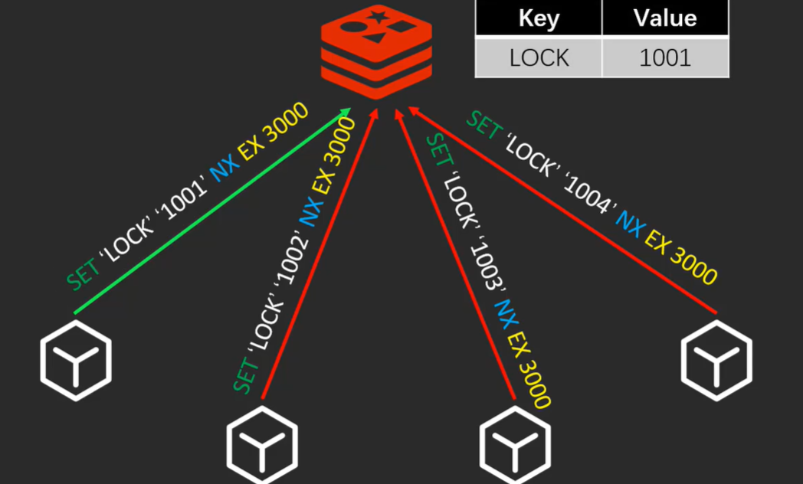

# 3种缓存读写策略


## Cache Aside Pattern 旁路缓存模式

优先读缓存，其次数据库	适合读多写少

更新的时候，==先更新数据库，再删除缓存== -> 存在缓存不一致可能性


**先写数据后删缓存并不能避免的问题**

1. 缓存的写入速度是比数据库的写入速度快,可能出现删除缓存后数据还未落盘,缓存就再次写入

2. 对于写多读少的场景,将导致数据库不断被修改,缓存也被多次删除插入,影响缓存命中率

   也可以更新DB的同时更新cache，不过需要加分布式锁来保证更新cache的时线程安全


**删除缓存，而不更新**

缓存不单单是数据库中直接取出来的值,可能查询另外两个表的数据并进行运算，才能计算出缓存最新的值的


其实删除缓存，而不是更新缓存，就是 lazy 的思想，不要每次都重新做复杂的计算，不管它会不会用到，而是让它需要被使用的时候再重新计算


### Read/Write Through Pattern（读写穿透）

cache 作为主要数据存储，**在cache进行数据修改。cache服务器 负责将修改后的数据写入 DB**，从而减轻了DB压力

但Redis 并没有提供 cache 将数据写入DB的功能,所以这个不常用

**写（Write Through）：**

- 先查 cache，cache 中不存在，直接更新 DB。
- cache 中存在，则先更新 cache，然后 cache 服务自己更新 DB（**同步更新 cache 和 DB**）


**读(Read Through)：** 

- 从 cache 中读取数据，读取到就直接返回
- 读取不到的话，先从 DB 加载，写入到 cache 后返回响应


Read-Through Pattern 实际只是在 Cache-Aside Pattern 之上进行了封装。在 Cache-Aside Pattern 下，发生读请求的时候，如果 cache 中不存在对应的数据，是由客户端自己负责把数据写入 cache，而 Read Through Pattern 则是 cache 服务自己来写入缓存的，对客户端透明

和 Cache Aside Pattern 一样， Read-Through Pattern 也有首次请求数据一定不再 cache 的问题，对于热点数据可以提前放入缓存中


### Write Behind Pattern（异步缓存写入）

Write Behind Pattern 和 Read/Write Through Pattern 很相似，两者都是由 cache 服务来负责 cache 和 DB 的读写

但**Write Behind Caching 只更新缓存，异步批量更新 DB**

这种方式对数据一致性带来了更大的挑战，比如cache数据可能还没异步更新DB的话，cache服务可能就就挂掉了

适合消息队列中消息的异步写入磁盘、InnoDB Buffer Pool 机制也用到了这种策略

Write Behind Pattern 下 DB 的写性能非常高，非常适合一些数据经常变化又对数据一致性要求没那么高的场景，比如浏览量、点赞量


## 缓存不一致

先更新数据库，再删除缓存	删除缓存失败,将导致数据库中是新数据，缓存中是旧数据

1. **缓存失效时间变短** ：我们让缓存数据的过期时间变短，这样的话缓存就会从数据库中加载数据。另外
2. **增加 cache 更新重试机制（常用）**： 如果 cache 服务当前不可用导致缓存删除失败的话，我们就隔一段时间进行重试，重试次数可以自己定。如果多次重试还是失败的话，我们可以把当前更新失败的 key 存入队列中，等缓存服务可用之后，再将 缓存中对应的 key 删除即可。


先删除缓存,再更新数据库	刚删完缓存,数据库还没更新成功,又被读了脏数据至缓存


# 安装


安装gcc 

```
yum install gcc-c++ 
```

解压

```
tar -zxvf redis-4.0.14.tar.gz
```

把解压的文件copy到/usr/local/src里面

```
cp -r /root/software/redis-4.0.14 /usr/local/src/
改名
cd /usr/local/src/
mv redis-4.0.14  redis
```

打开/usr/local/src/redis/deps进行编译依赖项

```
cd /usr/local/src/redis/deps
make hiredis lua jemalloc linenoise
```

打开/usr/local/src/redis进行编译

```
cd /usr/local/src/redis
make
```

安装到/usr/local/redis里

```
mkdir /usr/local/redis
make install PREFIX=/usr/local/redis
```

把配置文件移动到/root/myredis目录[目录可以自定义]

mkdir /root/myredis

cp /usr/local/src/redis/redis.conf /root/myredis

验证安装是否成功

```
cd /usr/local/redis/bin
ls
```

使用which命令查看系统里面是否有redis的服务

```
which redis-server
```

## 启动

/usr/local/redis/bin/redis-server  /usr/local/myredis/redis.conf

```
#客户端连接
/usr/local/redis/bin/redis-cli -h 127.0.0.1 -p 7001
```

开机自启

```
vim /etc/rc.local
　　加入
/usr/local/redis/bin/redis-server /root/myredis/redis-conf
文件地址                          运行哪个配置文件
```


## 停止

```
/usr/local/redis/bin/redis-cli shutdown
#或者
pkill redis-server
```


# 配置解析


Unit

```shell
# Note on units: when memory size is needed, it is possible to specify
# it in the usual form of 1k 5GB 4M and so forth:
#
# 1k => 1000 bytes
# 1kb => 1024 bytes
# 1m => 1000000 bytes
# 1mb => 1024*1024 bytes
# 1g => 1000000000 bytes
# 1gb => 1024*1024*1024 bytes
#
# units are case insensitive so 1GB 1Gb 1gB are all the same.

定义了一些基本的度量单位，只支持bytes，不支持bit
对大小写不敏感
```


INCLUDES	配置文件包含关系

```shell
# Include one or more other config files here.  This is useful if you
# have a standard template that goes to all Redis servers but also need
# to customize a few per-server settings.  Include files can include
# other files, so use this wisely.
#
# Notice option "include" won't be rewritten by command "CONFIG REWRITE"
# from admin or Redis Sentinel. Since Redis always uses the last processed
# line as value of a configuration directive, you'd better put includes
# at the beginning of this file to avoid overwriting config change at runtime.
#
# If instead you are interested in using includes to override configuration
# options, it is better to use include as the last line.
#
# include /path/to/local.conf
# include /path/to/other.conf

和spring配置文件类似，可以通过includes包含其他配置文件
```


NETWORK

```shell
##默认情况下，redis在server上所有有效的网络接口上监听客户端连接。绑定多个ip空格分隔
bind 0.0.0.0

protected-mode yes

port 6379

#backlog连接队列，队列总和=未完成三次握手队列 + 已经完成三次握手队列。
#高并发环境下需要高backlog值来避免慢客户端连接问题。注意Linux内核会将这个值减小到/proc/sys/net/core/somaxconn的值，所以需要确认增大somaxconn和tcp_max_syn_backlog两个值来达到想要的效果
tcp-backlog 511

#当客户端闲置多少秒后关闭连接， 0表示关闭该功能
timeout 0

#单位秒，周期性检测客户端是否还处于健康状态，避免服务器一直阻塞，建议60
tcp-keepalive 300
```


GRNERAL

```shell
daemonize no

#通过upstart和systemd管理Redis守护进程，这个参数是和具体的操作系统相关的
supervised no

#pid文件路径。默认/var/run/redis.pid 。
pidfile /var/run/redis_6379.pid。

# 日志级别。debug（记录大量日志信息，适用于开发、测试）verbose（较多日志信息）
#notice（适量日志信息，使用于生产环境）warning（仅有部分重要、关键信息才会被记录）
loglevel notice 

#日志文件位置，空字符串时为标准输出，如果以守护进程模式运行，将会输出到 /dev/null 。
logfile ""   

#是否把日志记录到系统日志
syslog-enabled no

#设置系统日志的id     如syslog-ident redis
syslog-ident

databases 16

#是否一直显示日志
always-show-logo yes
```


SNAPSHOTTING	快照

```shell
#second秒内,changes个keys发生改变则保存一次
save <seconds> <changes>
       save 900 1
       save 300 10
       save 60 10000

#保存失败，redis将停止接受写操作。直到后台保存进程重新启动,将再次允许写操作
#然而要是安装了靠谱的监控，不需要redis停止写操作来通知保存失败，改成 no
stop-writes-on-bgsave-error yes

#是否在dump.rdb压缩字符串，默认设置为yes。节约cpu资源可以设置no，这样的话数据集就可能会比较大。
rdbcompression yes

#是否CRC64校验rdb文件，性能损失10%
rdbchecksum yes

#rdb文件的名字
dbfilename dump.rdb
```


==SECURITY	安全==		6种淘汰策略

```shell
#设置密码
requirepass ****

#最大客户端连接数
maxclients 10000   

#到达内存上限会试图移除内部数据，移除规则通过maxmemory-policy来指定。
#如果无法根据移除规则来移除，或者设置“不允许移除”，则针对那些需要申请内存的指令返回错误信息，比如SET、LPUSH等,但对于无内存申请的指令，仍然会正常响应，如GET。
#主redis在设置内存使用上限时，需要在系统中留出一些内存空间给同步队列缓存，只有在你设置的是“不移除”的情况下，才不用考虑这个因素
maxmemory-policy
			#6种淘汰策略
                  （1）volatile-lru：LRU 过期
                  （2）allkeys-lru： LRU 最近最少原则
                  （5）volatile-ttl：TTL值最小,即最近要过期
                  一般不用
                  （3）volatile-random：过期移除随机key 
                  （4）allkeys-random：移除随机的key
    #默认,需修改     （6）noeviction：不移除。针对写操作，只返回错误信息	
    
#设置样本数量，LRU算法和最小TTL算法并非精确算法而是估算值，可以设置样本的大小，默认会检查这么多个key并选择其中LRU的那个
maxmemory-samples
```


AOF

```shell
#AOF重写期间是否禁止fsync；如果开启该选项，可以减轻文件重写时CPU和硬盘的负载（尤其是硬盘），但是可能会丢失AOF重写期间的数据；需要在负载和安全性之间进行平衡
no-appendfsync-on-rewrite no

#文件重写触发条件
auto-aof-rewrite-percentage 100
auto-aof-rewrite-min-size 64mb

#如果AOF文件结尾损坏，Redis启动时是否仍载入AOF文件
aof-load-truncated yes
```


# 单线程


利用**队列**将并发变为串行


虽说 Redis 是单线程模型，但是**Redis 在 4.0+ 就已经加入了对多线程的支持**

Redis 4.0 增加的多线程主要是针对大键值对的删除命令大体上来说，**Redis 6.0- 主要还是单线程**

1. 单线程编程容易并且更容易维护
2. CPU不是Redis的瓶颈，**Redis的瓶颈是机器内存的大小/网络带宽**
3. 单线程**避免多余的上下文切换和竞争消耗CPU**，不存在加解锁，不存在死锁


**Redis6.0 在网络IO耗时操作引入多线程,**执行命令仍然是单线程顺序执行。因此不需要担心线程安全

Redis6.0 的多线程默认是禁用的，只使用主线程。如需开启需要修改 redis 配置文件 `redis.conf`

```bash
io-threads-do-reads yes
#必须设置线程数,否则不生效
io-threads 4 #官网建议4核设置为2/3，8核设置为6
```


==多路I/O复用模型，非阻塞IO==,**“多路”指多个网络连接，“复用”指的是复用同一线程**


## 单线程模型详解

**Redis 基于 Reactor 模式来设计开发了一套高效的事件处理模型**,这套事件处理模型对应的是 Redis 中的文件事件处理器（file event handler）。由于文件事件处理器（file event handler）是单线程方式运行的，所以我们一般都说 Redis 是单线程模型

**既然是单线程，那怎么监听大量的客户端连接呢？**

Redis 通过**IO 多路复用程序** 来监听来自客户端的大量连接（或者说是监听多个 socket），它会将感兴趣的事件及类型(读、写）注册到内核中并监听每个事件是否发生

这样的好处非常明显： **I/O 多路复用技术的使用让 Redis 不需要额外创建多余的线程来监听客户端的大量连接，降低了资源的消耗**（和 NIO 中的 `Selector` 组件很像）

另外， Redis 服务器是一个事件驱动程序，服务器需要处理两类事件：1. 文件事件; 2. 时间事件。

时间事件不需要多花时间了解，使用最多的还是 **文件事件**（客户端进行读取写入等操作，涉及一系列网络通信）


> 当被监听的套接字准备好执行连接应答（accept）、读取（read）、写入（write）、关闭（close）等操作时，与操作相对应的文件事件就会产生，这时文件事件处理器就会调用套接字关联好的事件处理器来处理事件
>
> **虽然文件事件处理器以单线程方式运行，但通过使用 I/O 多路复用程序来监听多个套接字**，文件事件处理器既实现了高性能的网络通信模型，又可以很好地与 Redis 服务器中其他同样以单线程方式运行的模块进行对接，这保持了 Redis 内部单线程设计的简单性

可以看出，文件事件处理器主要是包含 4 个部分：

- 多个 socket（客户端连接）
- IO 多路复用程序（支持多个客户端连接的关键）
- 文件事件分派器（将 socket 关联到相应的事件处理器）
- 事件处理器（连接应答处理器、命令请求处理器、命令回复处理器）


1. [Redis 6.0 新特性-多线程连环 13 问！](https://mp.weixin.qq.com/s/FZu3acwK6zrCBZQ_3HoUgw)
2. [为什么 Redis 选择单线程模型](https://draveness.me/whys-the-design-redis-single-thread/)


# 指令


无论是哪种类型，Redis都不会直接存储，而是通过redisObject对象进行存储

Redis中不存在表的概念


3，切换数据库

Select [index]   切换对应下标的数据库

4，常用基本命令

dbsize	当前数据库的key的数量

flushdb	清空当前库

Flushall	清空全部库


* 基本指令
  * keys * 		获取所有的key	可以跟正则
  * dbsize       当前数据库 key 的数量
  * info        查看redis 服务器状态和一些统计信息。
  * move key1 		将key移动到其他数据库,目标库有则不能移动
  * lpush key a b c	将若干值插入到key(存入list)
  * type key 		查看key类型
  * del key 		删除key
  * exists key 		是否存在key
  * **expire key seconds 	过期(秒)**
  * **pexpire key milliseconds   毫秒**
  
* expireat key timestamp   某个时间戳（秒）之后过期；
  * pexpireat key millisecondsTimestamp：某个时间戳（毫秒）之后过期；
  * persist key 	删除过期时间
  * ttl key 		查看还有多少秒过期，-1永不过期，-2已过期
  * monitor      实时监听并返回redis服务器接收到的所有请求信息。
  * flushall       删除全部数据库中所有 key，此方法不会失败
  * flushdb       删除当前数据库中所有 key,此方法不会失败

  


## String


不仅可以是 String，也可以是数字（当数字类型用 Long 可以表示的时候encoding就是整型，其他都存储在 sdshdr 当做字符串）

redis 的 string是二进制安全的,可以包含任何数据。如数字，字符串，jpg图片或者序列化的对象

可以实现Memcached的所有功能,并且效率更高


* getrange name 0 -1 		字符串分割  0 -1是全部	其中-1等价于n-1,即末尾下标.
* getset name new_value 修改key对应值，返回旧值
* mset k1 v1 k2 v2 		批量设置
* mget key1 key2 批量获取

* setrange key index value 从index开始替换value

* incr age 递增
* incrby age 10 递增

* decr age 递减
* decrby age 10 递减

* incrbyfloat 增减浮点数
* append 追加(智能分配内存,每次2倍)

* strlen 长度
* object encoding key  得到key 的类型  string里面有三种编码
  * int	能够用64位有符号整数表示的字符串
  * embstr 长度<=39字节的字符串，性能高
  * raw  用于>=39字节的


## list


类似双向链表


* 微博最新消息排行

- 消息队列
  - 利用PUSH将任务存在 List 中，然后工作线程再用 POP 操作将任务取出进行执行


* lpush mylist a b c 左插入
* rpush mylist x y z 右插入
* lrange mylist 0 -1  取出数据集合  0 -1取出所有      0  1取第一个和第二个
  * 可以用lrange实现分页
* lpop mylist 弹出最后一个元素
* rpop mylist 弹出第一个元素
* llen mylist 长度
* lrem mylist count value 删除

  * count > 0 : 头->尾搜索，移除COUNT个等于VALUE的元素
  * count < 0 : 尾->头搜索
  * count = 0 : 移除所有与 VALUE 相等的值。
* lindex mylist 2 指定索引的值
* lset mylist 2 n 索引设值
* ltrim mylist 0 4    修剪(trim)，不在指定区间之内的元素都将被删除
  * Java分割是左闭右开,redis是左右闭
* linsert mylist before/after a   在元素前或后插入元素。 当元素不存在或空列表时，不执行任何操作,当key不是列表类型，返回一个错误。
* rpoplpush list list2
  *  移除列表的最后一个元素，并将该元素添加到另一个列表并返回。


## hash


在 Memcached 中经常将一些结构化的信息打包成hashmap，在客户端序列化后存储为JSON字符串。在需要修改其中某一项时将JSON字符串取出来，反序列化，修改后再序列化存储回去,简单修改一个属性就干这么多事情，消耗必定是很大的，也不适用于并发操作场合

而 Redis 的 Hash 结构可以像在数据库中 Update一样只修改某一项属性值


==字段和值必须是字符串==


- 存储、读取、修改用户属性


```shell
    hset myhash name cxx
         |--字段已经存在，旧值将被覆盖
    hmget myhash       批量获取
    hgetall myhash     获取所有
    hexists myhash name        是否存在
    hincrby myhash id 1        按1递增
    hdel myhash name           删除
    hkeys myhash       只取key
    hvals myhash       只取value
    hlen myhash        长度
```


## set


- 共同好友
- 利用唯一性，可以统计访问网站的所有独立 IP
- 好友推荐的时候，根据 tag 求交集，大于某个 threshold 就可以推荐


```shell
    sadd myset redis   添加
    smembers myset     获取所有
    srem myset set1    删除
    sismember myset set1 判断是否存在
    scard key_name     长度
    sdiff | sinter | sunion    #差|交|并集
    srandmember 随机获取集合中的元素
    spop 从集合中弹出一个元素
```


## zset


Zset增加了一个**权重参数score**，实现有序排列


```
    zadd zset 1 one
    zincrby zset 1 one 增长分数
    zscore zset two 获取分数
    zrange zset 0 -1 withscores 范围值
    zrangebyscore zset 10 25 withscores 指定范围的值
    zrangebyscore zset 10 25 withscores limit 1 2 分页
    Zrevrangebyscore zset 10 25 withscores 指定范围的值
    zcard zset 元素数量
    Zcount zset 获得指定分数范围内的元素个数
    Zrem zset one two 删除一个或多个元素
    Zremrangebyrank zset 0 1 按照排名范围删除元素
    Zremrangebyscore zset 0 1 按照分数范围删除元素
    Zrank zset 0 -1 分数最小的元素排名为0
    Zrevrank zset 0 -1 分数最大的元素排名为0
```


## setnx


set if not exists

只有不存在的时候才设置, 成功返回 1 ，失败返回 0 。可以实现锁的效果


默认16个数据库，类似数组下表从零开始，初始为零号库

统一密码管理，16个库密码相同


# 持久化


## RDB

【Redis DataBase】  指定次数	==快照==,数据在某个时间点上的副本

* 优点

  * 适合灾难恢复,**恢复速度快**,可以将单个压缩文件传输到数据中心
  * 性能高,父进程分配工作给子进程完成RDB的写入,**不影响父进程**

  * 文件小,适合**数据量大的全量复制**

* 缺点
  * **不保证数据完整性和一致性**
  * 宕机时最后一次持久化后的数据可能丢失
  * 需要经常fork()子进程进行持久化,会先将数据写入到临时文件中，再替换上次持久化好的文件,数据集大将导致fork()耗时,导致redis宕机,AOF也需要fork(),但可以调整重写日志的频率
  * **fork()的临时文件也会导致内存2倍的膨胀性**

* 恢复数据
  * 将备份文件 (dump.rdb) 移动到 redis 安装目录并启动服务
  * CONFIG GET dir获取目录


## AOF

通过日志记录每个写操作.支持秒级持久化、兼容性好

缺点是文件大、恢复速度慢、对性能影响大


* 优点
  * **日志只追加不修改**,就算停电,没有搜索的话也没有损坏问题，redis启动时会读取该文件，将写指令从前到后执行以完成数据的恢复工作
  * 可以自定义同步策略

* 缺点
  * 文件比RDB大,**文件过大后将重写至新的aof**
  * 恢复速度慢

* 修复AOF文件	Redis-check-aof --fix


### 策略


|         选项         |         同步频率         |
| :------------------: | :----------------------: |
|  appendfsync always  |     每个写命令都同步     |
| appendfsync everysec |       每秒同步一次       |
|    appendfsync no    | 让操作系统来决定何时同步 |


同时开启两种持久化方式时,默认**优先载入AOF**文件来恢复原始的数据,确保数据完整

但不能只用AOF，**RDB更适合用于备份数据库(AOF在不断变化不好备份)**，快速重启，不会有AOF可能潜在的bug


**只在Slave上持久化RDB文件,减少性能损耗**

如果Enalbe AOF，最恶劣情况下也只丢失1秒数据，启动脚本简单,只load自己的AOF文件就可以了。代价是持续的IO，以及重写。只要硬盘许可，应该尽量减少AOF rewrite的频率，AOF重写的基础大小提升至5G以上。默认超过原大小100%大小时重写可以改到适当的数值


## 4.0对持久化的 优化


Redis 4.0 开始支持 RDB 和 AOF 的混合持久化（默认关闭，可以通过配置项 `aof-use-rdb-preamble` 开启）。

如果把混合持久化打开，AOF 重写的时候就直接把 RDB 的内容写到 AOF 文件开头。这样做的好处是可以结合 RDB 和 AOF 的优点, 快速加载同时避免丢失过多的数据。当然缺点也是有的， AOF 里面的 RDB 部分是压缩格式不再是 AOF 格式，可读性差

**补充内容：AOF 重写**

AOF 重写可以产生一个新的 AOF 文件，这个新的 AOF 文件和原有的 AOF 文件所保存的数据库状态一样，但体积更小。

AOF 重写是一个有歧义的名字，该功能是通过读取数据库中的键值对来实现的，程序无须对现有 AOF 文件进行任何读入、分析或者写入操作

在执行 BGREWRITEAOF 命令时，Redis 服务器会维护一个 AOF 重写缓冲区，该缓冲区会在子进程创建新 AOF 文件期间，记录服务器执行的所有写命令。当子进程完成创建新 AOF 文件的工作之后，服务器会将重写缓冲区中的所有内容追加到新 AOF 文件的末尾，使得新旧两个 AOF 文件所保存的数据库状态一致。最后，服务器用新的 AOF 文件替换旧的 AOF 文件，以此来完成 AOF 文件重写操作


# 主从复制  2.8之前


哨兵和集群都是在复制基础上实现高可用

持久化保证了redis重启丢失数据，但硬盘损坏会导致数据丢失，通过主从复制可以避免单点故障

==读写分离/容灾恢复/高可用==


* 原理

  * Slave启动连接到master后,发送sync命令
  * Master接到命令启动后台的存盘进程，收集修改命令，传送整个数据文件到slave,完成全量复制
    * 全量复制：第一次链接成功,全部都复制给从机
    * 增量复制：Master继续将新的修改命令依次传给slave
    * ==重新连接master,一次完全同步（全量复制)将被自动执行==
  * 从机只读不写	主机宕机后,从机原地待命
  * 上个Slave可以为下个slave的Master, 减轻master的写压力,避免master需要负责太多slave
  * 变更master会清除数据，重新全量复制
* 缺点
    * 故障恢复无法自动化
    * 写操作无法负载均衡
    * ==每个节点都必须保存完整的数据，扩展能力还是受限于单个节点的存储能力==

 

```shell
拷贝多个redis.conf文件,文件名加上端口号区分
开启daemonize yes
修改从机端口
修改从机Log文件名(可与主机同名)
修从机Dump.rdb文件名

#配置主从		每次与master断开之后，都要重新配置，除非配置进redis.conf文件
SLAVEOF 主库IP 主库端口

#查看当前的主从关系
Info replication

#停止主从，变成主数据库
SLAVEOF no one
```


# 哨兵	2.8及之后


==自动化故障恢复==，**投票**

* 缺点:写操作无法负载均衡；存储能力受单机的限制


```shell
	##	/myredis目录下新建sentinel.conf文件
	## 数字1表示主机挂掉后salve投票,得票1就能当主机.数字设置的越大,投票消耗的时间越长
sentinel monitor 自定义主机名 127.0.0.1 6379 1 
sentinel monitor port6379 127.0.0.1 6379 1

	## 同一哨兵监视多个主机,只需要在配置文件另起一行
	##哨兵配置集群:同一份配置文件复制多分,启动

启动
/usr/local/redis/bin/redis-sentinel /root/myredis/sentinel.conf
```


# 集群	2.8及之后


==去中心化	去掉路由，自己来路由==

**主从和哨兵只有主机负责写入,从机负责读取,容易造成性能瓶颈****


| 机器编号 | ip              | port |
| -------- | --------------- | ---- |
| 1        | 192.168.186.128 | 7002 |
| 2        | 192.168.186.128 | 7003 |
| 3        | 192.168.186.128 | 7004 |
| 4        | 192.168.186.128 | 7005 |
| 5        | 192.168.186.128 | 7006 |
| 6        | 192.168.186.128 | 7007 |

Redis集群中内置了16384个哈希槽,可以将哈希槽理解为分表

进行set时,先对key进行crc16算法算出应该插入到哪个槽.进行get同理

 

```shell
新建redis集群文件夹
mkdir redis-cluster
复制一个server
cp /usr/local/redis/bin/redis-server ./

配置第一个redis
mkdir redis1
复制一个配置文件
cp /usr/local/src/redis/redis.conf redis1
修改配置
vim redis1/redis.conf

bind 0.0.0.0                    69行
port 7001                       92行
daemonize yes                   136行
# 打开aof 持久化
appendonly yes                  672行 
# 开启集群
cluster-enabled yes             814行
# 集群的配置文件,该文件自动生成   
cluster-config-file nodes-7001.conf  822行
# 集群的超时时间
cluster-node-timeout 15000         828行

将这个redis1复制6分,每份替换端口号
%s/7000/7001/g

安装完成后同时启动所有的redis
```


```shell
##docker搭建
docker pull inem0o/redis-trib
##启动
docker run -it --net host inem0o/redis-trib create --replicas 1 192.168.186.128:7002 192.168.186.128:7003 192.168.186.128:7004 192.168.186.128:7005 192.168.186.128:7006 192.168.186.128:7007

docker run -it --net host inem0o/redis-trib create --replicas 1 127.0.0.1:7002 127.0.0.1:7003 127.0.0.1:7004 127.0.0.1:7005 127.0.0.1:7006 127.0.0.1:7007

-it是为了可以输入
--net host 是为了上docker容器能连接上本地的宿主机
集群后客户端连接需要加上 -c
```


# Redis Module 4.0 以后


Module只要编译引入到Redis中就能轻松的实现我们某些需求的功能

- neural-redis 主要是神经网络的机器学
- RedisSearch 主要支持一些富文本的的搜索
- **RedisBloom** 支持分布式环境下的Bloom 过滤器
  - bloomfilter就类似于一个hash set，用于快速判某个元素是否存在于集合中，其典型的应用场景就是快速判断一个key是否存在于某容器，不存在就直接返回。布隆过滤器的关键就在于hash算法和容器大小


# 订阅-发布系统


发布（Publish）与订阅（Subscribe）

在 Redis 中，你可以设定对某一个 key 值进行消息发布及消息订阅，当一个 key 值上进行了消息发布后，所有订阅它的客户端都会收到相应的消息。这一功能最明显的用法就是用作实时消息系统，比如普通的即时聊天，群聊等功能


# Web使用


## 缓存位置


### 浏览器

当 HTTP 响应允许进行缓存时，浏览器会将 HTML、CSS、JavaScript、图片等静态资源进行缓存。

### ISP

网络服务提供商（ISP）是网络访问的第一跳，通过将数据缓存在 ISP 中能够大大提高用户的访问速度。

### 反向代理

反向代理位于服务器之前，请求与响应都需要经过反向代理。通过将数据缓存在反向代理，在用户请求反向代理时就可以直接使用缓存进行响应。

### 本地缓存

使用 Guava Cache 将数据缓存在服务器本地内存中，服务器代码可以直接读取本地内存中的缓存，速度非常快。

### 分布式缓存

使用 Redis、Memcache 等分布式缓存将数据缓存在分布式缓存系统中。

相对于本地缓存来说，分布式缓存单独部署，可以根据需求分配硬件资源。不仅如此，服务器集群都可以访问分布式缓存，而本地缓存需要在服务器集群之间进行同步，实现难度和性能开销上都非常大。

### 数据库缓存

MySQL 等数据库管理系统具有自己的查询缓存机制来提高查询效率。

### Java 内部的缓存

Java 为了优化空间，提高字符串、基本数据类型包装类的创建效率，设计了字符串常量池及 Byte、Short、Character、Integer、Long、Boolean 这六种包装类缓冲池。

### CPU 多级缓存

CPU 为了解决运算速度与主存 IO 速度不匹配的问题，引入了多级缓存结构，同时使用 MESI 等缓存一致性协议来解决多核 CPU 缓存数据一致性的问题。


## RedisTemplate<Object,Object>


若不设置序列化规则，它将使用JDK自动的序列化将对象转换为字节，存到Redis 里面

它可以存在对象到redis里面

如果对象没有序列化，那么默认使用的JDK的序列化方式


```java
@RunWith(SpringRunner.class)
@SpringBootTest
public class SpringbootRedisTemplateTests {
    @Autowired
    private RedisTemplate<Object, Object> redisTemplate ; // 因为创建RedisTemplate 没有使用泛型信息来创建，泛型 本质还是Object，只不过泛型能自动推断并强转
   
    @Test
    public void testString() {
        redisTemplate.setKeySerializer(new  StringRedisSerializer()); // key的序列化用String 因为key 很多时候都是一个字符串
        redisTemplate.setValueSerializer(new GenericJackson2JsonRedisSerializer()); // 优先没有泛型的
        ValueOperations<Object, Object> valueOperations = redisTemplate.opsForValue();
//      valueOperations.set("boot-redis", "boot-value"); //对象->字符串 json
        User user = new User(1, "laolei", "xx.jpg", "78414842@qq.com");
//       KEY : com.sxt.domain.User:1 
//      com.fasterxml.jackson.databind.JsonSerializer 没有依赖jackson 之前大家可能使用spring-boot-web，这里面会自动依赖
        valueOperations.set(User.class.getName()+":"+user.getId(), user);
        
        // 若该对象的强转转换，则redis 内部会使用JackSon 的工具将字符串-> 转换为java 对象 ，那jackson 转换为对象时，需要一个对象的类型 ，其实它已经自动对象的类型了"@class": "com.sxt.domain.User",
        User object = (User)valueOperations.get(User.class.getName()+":"+user.getId());
        System.out.println(object.getName()+":"+object.getIcon()); }
    
    /**
     * hash
     */
    @Test
    public void testHash() {
        redisTemplate.setKeySerializer(new  StringRedisSerializer()); // key的序列化使用String 类型来完成 因为key 很多时候都是一个字符串
        redisTemplate.setHashKeySerializer(new  StringRedisSerializer());
        redisTemplate.setHashValueSerializer(new  StringRedisSerializer()); // 若都是string 则和StringRedisTempalte一样了
        HashOperations<Object, Object, Object> opsForHash = redisTemplate.opsForHash();
        opsForHash.put("redis-hash", "prop1", "value");
    }}
```


集群额外操作

```java
@Test
    public void testCluster() {
        ClusterOperations<Object, Object> opsForCluster = redisTemplate.opsForCluster();
        //关闭集群的7000端口的主机
        opsForCluster.shutdown(new RedisClusterNode("192.168.120.130", 7000));
    }
```


## StringRedisTemplate


StringRedisTemplate extends RedisTemplate<String,String>


```java
@RunWith(SpringRunner.class)
@SpringBootTest
public class SpringbootRedisApplicationTests {
	@Autowired
	private StringRedisTemplate redisTemplate;
	/**
	 * redis数据类型为String的操作
	 */
	@Test
	public void testString() {
		// 操作String类型
		ValueOperations<String, String> opsValue = redisTemplate.opsForValue();
		// 给redis 里面set 一个key
		opsValue.set("boot", "spring-boot"); // k -v 都是String
		// 从redis 里面获取key
		String value = opsValue.get("boot");
		System.out.println(value);
		// 从redis 里面或多个key
		List<String> asList = Arrays.asList("boot", "alll-menu-data");
		List<String> mulitValues = opsValue.multiGet(asList);
		System.out.println(mulitValues);
		// redis的自动增长
		Long increment = opsValue.increment("boot-incr", 2);// delta 可以+ 任意的数（步长）
		System.out.println(increment);
	}
	@Test
	public void testHash() {
		HashOperations<String, Object, Object> opsForHash = redisTemplate.opsForHash();
		// hset
		opsForHash.put("object-1", "name", "sxt"); // 后面的2 个参数都是object,但是只支持String 类型
		opsForHash.put("object-1", "age", "27"); // 后面的2 个参数都是object,但是只支持String 类型
		opsForHash.put("object-1", "sex", "man"); // 后面的2 个参数都是object,但是只支持String 类型
		Object value = opsForHash.get("object-1", "sex");
		System.out.println(value);
		// 取多个值
		List<Object> multiGet = opsForHash.multiGet("object-1", Arrays.asList("name", "sex"));
		System.out.println(multiGet);
	}
	@Test
	public void testZset() {
		ZSetOperations<String, String> opsForZSet = redisTemplate.opsForZSet();
		// 放到zset集合里面
		opsForZSet.add("lol", "sxt", 2500);
		opsForZSet.add("lol", "lz", 0);
		opsForZSet.add("lol", "ln", 1400);
		opsForZSet.add("lol", "ll", -10);
		opsForZSet.add("lol", "lt", 2700);
		Set<String> rangeAsc = opsForZSet.range("lol", 0, 2); // 通过排序取值 ll lz ln
		System.out.println(rangeAsc);
		Set<String> reverseRange = opsForZSet.reverseRange("lol", 0, 2);// lt lz ln
		System.out.println(reverseRange);
		Set<TypedTuple<String>> tuples = new HashSet<ZSetOperations.TypedTuple<String>>();
		tuples.add(new DefaultTypedTuple<String>("sxt", 1000.00));
		tuples.add(new DefaultTypedTuple<String>("lv", 1200.00));
		tuples.add(new DefaultTypedTuple<String>("lz", 2900.00));
		tuples.add(new DefaultTypedTuple<String>("lt", 100.00));
		// 若redis 存在该key ，则需要数据类型相同，不然报错
		opsForZSet.add("dnf", tuples);}}
```


## boot


RedisAutoCongiguration	创建对象

RedisProperties	读取配置文件


```shell
#redis的配置
spring:
  redis:
    host: 
    port: 6379
    password: 
    jedis:
      pool:
        max-idle: 20
        max-active: 25
        min-idle: 10   
```


启动类

```
@EnableCaching
```


业务实现类

```java
//查询	cacheNames 缓存的前缀
@Cacheable(cacheNames = "",key = "#id")
//添加	CachePut = jedis.set	key 参数对象/对象属性		result	返回值对象
@CachePut(cacheNames = "",key = "#result.id")
//修改
@CachePut(cacheNames = "",key = "#result.id")
//删除
@CacheEvict(cacheNames = "",key = "#id")

//全局配置缓存
@CacheConfig

注解缓存缓存的是当前注解所在方法的返回值
```


更改序列化方式

```java
@Configuration
public class RedisConfig {
	@Bean
	 public RedisCacheConfiguration redisCacheConfiguration(CacheProperties cacheProperties) {
	        CacheProperties.Redis redisProperties = cacheProperties.getRedis();
	        RedisCacheConfiguration config = RedisCacheConfiguration
	                .defaultCacheConfig();
	        config = config.serializeValuesWith(RedisSerializationContext.SerializationPair
	        		//把默认的jdk的序列化方式变成jackson
	        		.fromSerializer(new GenericJackson2JsonRedisSerializer()));
	        if (redisProperties.getTimeToLive() != null) {
	            config = config.entryTtl(redisProperties.getTimeToLive());
	        }
	        if (redisProperties.getKeyPrefix() != null) {
	            config = config.prefixKeysWith(redisProperties.getKeyPrefix());
	        }
	        if (!redisProperties.isCacheNullValues()) {
	            config = config.disableCachingNullValues();
	        }
	        if (!redisProperties.isUseKeyPrefix()) {
	            config = config.disableKeyPrefix();
	        }
	        return config;    }}
```


## 键值设计


* value
  * JSON存储value
    * 标准，主流数据交换格式
    * 简单，结构清晰，相对于XML来说更轻量，易于解析
    * **语言无关,类型安全**，值是有类型的


* key
  * 系统：基础数据系统   user:sex:1=男 user:sex:0= 女
  * 模块：数据字典    sys:available:1=true  sys:available:0=false
  * 方法：根据数据字典类型查询
  * 参数：字典类型
  * ==抽象出key存储规则==,使用工具去查看时可以看出层级关系

common:sys:sex:1 男

user:1 {id:1.name:小明}


## ~~事务~~

**Redis的单线程决定了它并不需要事务**

隔离性：Redis单线程执行过程中，不会被其他客户端发送来的请求打断

没有隔离级别的概念：队列中的命令没有提交之前都不会被执行，不存在”事务间的可见性”这个让人万分头痛的问题

不保证原子性：redis==不支持回滚==


# 分布式锁


**单Redis的分布式锁**

* 存在单点故障问题,Redis故障将导致整个服务失效
* ==不能使用主从==
  * 主从复制是异步的,主节点故障时,锁信息可能未能同步到从节点
  * 从节点选举成功后,没有锁信息,导致锁被其他服务重新获得


```shell
#NX键值不存在才成功	PX超时后自动删除
set '要锁定的资源' '随机value' NX PX time

#所有服务申请的资源相同->key相同
#只有获得锁的服务才能删除锁->value随机
#在删除时先判断是否为本客户端设置的随机值,不然无法删除
value不随机将导致:
	a申请资源后没有释放锁,超时,kv过期被删除
	b申请到了锁
	a释放锁,此时把b的锁释放了
```





* Redis集群的分布式锁	RedLock算法

  * 获取当前时间T1
  * 向n个Redis循环发送锁请求信息(使用的是单实例的命令,附带超时时间),==超时时间远小于锁的有效时间==
  * 记录客户端获得锁的总消耗时间T2
    * T2-T1<超时时间  ||  半数以上节点成功    -> 获得锁
    * 如果未获得锁,向所有Redis发送释放锁的指令,然后再次请求锁


避免了死锁问题,即使客户端执行过长/故障,Redis都根据过期时间自动释放锁

高可用:**只要大部分节点存活,依然可以获取/释放锁**


依次向 N 个 `Redis`节点请求锁。请求锁的方式与从单节点 `Redis`获取锁的方式一致。为了保证在某个 `Redis`节点不可用时该算法能够继续运行，获取锁的操作都需要设置超时时间，需要保证该超时时间远小于锁的有效时间。这样才能保证客户端在向某个 `Redis`节点获取锁失败之后，可以立刻尝试下一个节点。

计算获取锁的过程总共消耗多长时间（consumeTime = end - start）。如果客户端从大多数 `Redis`节点（>= N/2 + 1) 成功获取锁，并且获取锁总时长没有超过锁的有效时间，这种情况下，客户端会认为获取锁成功，否则，获取锁失败。

如果最终获取锁成功，锁的有效时间应该重新设置为锁最初的有效时间减去 `consumeTime`。

如果最终获取锁失败，客户端应该立刻向所有 `Redis`节点发起释放锁的请求。


但导致了n次锁的性能问题		多路复用优化


# 缓存带来的问题


* 缓存穿透	缓存/数据库中都没有的数据被恶意请求
  * 加强参数校验，对非法请求直接抛出异常信息
  * 对查询结果为空的情况也缓存，过期时间短
  * 对一定不存在的key进行过滤。把所有的可能存在的key放到Bitmap，查询时通过bitmap过滤
  * bloom filter,快速判断给定数据是否存在于海量数据中
* mutex。在缓存失效时，先用缓存工具的某些带成功操作返回值的操作去set一个mutex key，当操作返回成功时，再进行load db的操作并回设缓存；否则，就重试整个get缓存的方法
* 缓存雪崩     redis不可用/重启 / 缓存集体失效,导致大量请求到数据库
  * 互斥锁/排队 控制读/写线程数量。对某个key只允许单线程查询/写入，其他线程等待
  * 二级缓存，A1为原始缓存，A2为拷贝缓存，A1失效时，可以访问A2，**A1缓存失效时间设置为短期，A2设置为长期**
  * 不同key不同过期时间，让缓存失效时间点均匀

  * ==缓存预热==  启动后,将相关的缓存数据直接加载到缓存系统
    * 数据量小,工程启动时进行加载缓存
    * 数据量大,设定定时脚本,进行缓存刷新
    * 数据量过大,优先保证热点数据提前加载到缓存
* 缓存降级
  * 缓存失效或缓存服务器宕机时,也不去访问数据库,直接返回默认数据
* 缓存并发
  * 这里的并发指的是多个redis的client同时set key
  * 把set操作放在队列中使其串行化，或者加锁
* 缓存一致性
  * 数据更新时立即去更新缓存；
  * 读缓存之前先判断缓存是否是最新的，如果不是最新的先进行更新。


### 缓存无底洞

指的是为了满足业务要求添加了大量缓存节点，但是性能不但没有好转反而下降了的现象

产生原因：缓存系统通常采用 hash 函数将 key 映射到对应的缓存节点，随着缓存节点数目的增加，键值分布到更多的节点上，导致客户端一次批量操作会涉及多次网络操作，这意味着批量操作的耗时会随着节点数目的增加而不断增大。此外，网络连接数变多，对节点的性能也有一定影响。

- 优化批量数据操作命令；
- 减少网络通信次数；
- 降低接入成本，使用长连接 / 连接池，NIO


# NOSQL


**NoSQL指"不仅仅是SQL"**，泛指非关系型的数据库。强调Key-Value Stores和文档数据库的优点


关系型数据库问题

 1：不能满足高性能查询需求

​	语言和存储结构是面向对象，但是数据库却是关系的，在存储或者查询时，需要做转换。ORM框架可以简化这个过程，但性能低

 2：应用程序规模的变大

​	需要储存更多的数据、服务更多的用户以及需求更多的计算能力


## NoSQL数据库类型


* 键值（Key-Value）数据库

  * 适用场景：

    * 信息和ID挂钩
    * 用户信息，会话、配置文件、参数、购物车

  * 不适用场景：

    * 信息和值挂钩

    * 数据之间有关系。**不能通过两个或以上的键来关联数据**

    * **不支持回滚**

* 面向文档[MongoDB]    数据用XML、JSON或者JSONB等形式存储。

  * 适用场景：1.日志 2.分析
  * 不适用场景：不支持事务

* 列存储[HBASE]  数据储存在列族中，列族存储经常被一起查询的数据

  * 适用场景：
    * 1.日志 
    * 2.博客平台,我们储存每个信息到不同的列族中。举个例子，标签可以储存在一个，类别可以在一个，而文章则在另一个。
  * 不适用场景：1.不支持事务
    * 原型开发。模型设计之初，无法预测它的查询方式，而一旦查询方式改变，我们就必须重新设计列族。

* 图[Neo4J]    适用范围小，主要用于网络拓扑分析 如脉脉的人员关系图等


| RDBMS                      | NoSQL                                              |
| -------------------------- | -------------------------------------------------- |
| 高度组织化结构化数据       | 不仅仅是SQL                                        |
| 结构化查询语言（SQL）      | 没有声明性查询语言                                 |
| 数据和关系存储在单独的表中 | 没有预定义的模式                                   |
| 数据操纵语言，数据定义语言 | 键 - 值对存储，列存储，文档存储，图形数据库        |
| 严格的一致性               | **最终一致性**，而非ACID【原子，一致，隔离，持久】 |
| 基础事务                   | 非结构化和不可预知的数据                           |
|                            | CAP定理【一致性，可用性，容错性】                  |
|                            | 高性能，高可用性和可伸缩性                         |


## NoSQL数据库


* Memcached

  * 挥发性(临时性)的键值存储,==无法持久化==,**一般作为关系型数据库的缓存来使用**
  * **支持的数据类型少****
  * 有过期功能expires
  * 使用一致性散列(Consistent Hashing)算法来分散数据

* Tokyo Tyrant

  * 持久性的键值存储,用来处理需要持久保存，高速处理的数据
  * 效率高
  * 不支持过期
  * 使用一致性散列(Consistent Hashing)算法来分散数据

* Redis

  * 擅长处理数组类型的数据
  * 可以高速处理时间序列的数据，易于处理集合运算
  * **原子操作**，支持对多个操作合并后的原子性执行
  * 使用一致性散列(Consistent Hashing)算法来分散数据
  * 应用场景
    * 数据缓存（提高访问性能）
    * 会话管理（session cache，保存web会话信息）
    * 排行榜/计数器（NGINX+lua+redis计数器进行IP自动封禁）
    * 消息队列（构建实时消息系统，聊天，群聊）

* MongoDB

  * 面向无需定义表结构的文档数据
  * 通过BSON的形式可以保存和查询任何类型的数据
  * 无法进行JOIN处理，但是可以通过嵌入(embed)来实现同样的功能

  * 使用sharding(范围分割)算法来分散数据


## bin目录

　　redis-benchmark：redis性能测试工具

　　redis-check-aof：检查aof日志的工具

　　redis-check-dump：检查rdb日志的工具

　　redis-cli：连接用的客户端

　　redis-server：redis服务进程


# Redis内存模型


**mem_allocator**：内存分配器，在编译时指定；可以是 libc 、jemalloc或tcmalloc，默认是jemalloc

**used_memory**：Redis分配器分配的内存总量（字节），包括使用的虚拟内存（swap）

**used_memory_rss**：Redis进程占操作系统的内存（字节），与top及ps命令看到的值一致；除了分配器分配的内存之外，还包括进程本身的内存、内存碎片等，**不包括虚拟内存**

mem_fragmentation_ratio：内存碎片比率，used_memory_rss / used_memory


## 内存划分


### **进程本身的内存**

主进程本身占用内存，如代码、常量池等,大约几兆

不会统计在used_memory中


### **缓冲内存**

* 客户端缓冲  存储客户端连接
* 复制积压缓冲  用于部分复制功能
* AOF缓冲    用于AOF重写时，保存最近的写入命令

由jemalloc分配,会统计在used_memory中


### **内存碎片**


分配、回收物理内存过程中产生内存碎片

不会统计在used_memory中


## Redis做异步队列

一般使用list结构作为队列，rpush生产消息，lpop消费消息。当lpop没有消息的时候，要适当sleep一会再重试。缺点：在消费者下线的情况下，生产的消息会丢失，得使用专业的消息队列如rabbitmq等。**能不能生产一次消费多次呢？**使用pub/sub主题订阅者模式，可以实现1:N的消息队列。


## SCAN系列命令注意事项

- SCAN的参数没有key，因为其迭代对象是DB内数据；
- 返回值都是数组，第一个值都是下一次迭代游标；
- 时间复杂度：每次请求都是O(1)，完成所有迭代需要O(N)，N是元素数量；
- 可用版本：version >= 2.8.0；


# 管道 Pipeline


在某些场景下我们在**一次操作中可能需要执行多个命令**，而如果我们只是一个命令一个命令去执行则会浪费很多网络消耗时间，如果将命令一次性传输到 `Redis`中去再执行，则会减少很多开销时间


# 内存淘汰


如果假设你设置了一批 key 只能存活 1 分钟，那么 1 分钟后，Redis 是怎么对这批 key 进行删除的呢？

常用的过期数据的删除策略就两个（重要！自己造缓存轮子的时候需要格外考虑的东西）：

1. **惰性删除** ：只会在取出 key 的时候才对数据进行过期检查。这样对 CPU 最友好，但是可能会造成太多过期 key 没有被删除。
2. **定期删除** ： 每隔一段时间抽取一批 key 执行删除过期 key 操作。并且，Redis 底层会通过限制删除操作执行的时长和频率来减少删除操作对 CPU 时间的影响。

定期删除对内存更加友好，惰性删除对 CPU 更加友好。Redis 采用的是 **定期删除+惰性/懒汉式删除**

但是，仅仅通过给 key 设置过期时间还是有问题的。因为还是可能存在定期删除和惰性删除漏掉了很多过期 key 的情况。这样就导致大量过期 key 堆积在内存里，导致OOM

怎么解决这个问题呢？答案就是： **Redis 内存淘汰机制**


- FIFO（First In First Out）：先进先出策略，在实时性的场景下，需要经常访问最新的数据，那么就可以使用 FIFO，使得最先进入的数据（最晚的数据）被淘汰

- LRU（Least Recently Used）：最近最久未使用策略，优先淘汰最久未使用的数据，也就是上次被访问时间距离现在最久的数据。该策略可以保证内存中的数据都是热点数据，也就是经常被访问的数据，从而保证缓存命中率

- LFU（Least Frequently Used）：最不经常使用策略，优先淘汰一段时间内使用次数最少的数据


6 种数据淘汰策略：

| volatile-lru    | 从已设置过期时间的数据集中挑选 最近最少使用的数据淘汰 |
| --------------- | ----------------------------------------------------- |
| allkeys-lru     | 从全部数据集                                          |
|                 |                                                       |
| volatile-ttl    | 从已设置过期时间的数据集中挑选 将要过期的数据淘汰     |
|                 |                                                       |
| volatile-random | 从已设置过期时间的数据集中挑选 任意选择数据淘汰       |
| allkeys-random  |                                                       |
|                 |                                                       |
| ~~no-eviction~~ | 不淘汰数据，当内存不足以容纳新写入数据时，插入会报错  |
|                 |                                                       |
| 4.0+ 新增       |                                                       |
| volatile-lfu    | 从已设置过期时间的数据集中挑选 最不经常使用的数据淘汰 |
| allkeys-lfu     |                                                       |
|                 |                                                       |


## 定时删除


在设置键的过期时间的同时创建定时任务，当键达到过期时间，立即执行对键的删除操作

- **优点：**对内存友好，及时释放
- **缺点：**对cpu不友好，影响服务器的响应时间和吞吐量


## 定期删除


每隔一定时间对数据库进行检查，删除里面的过期键，由算法决定删除多少过期键以及检查多少数据库


通过限制删除操作执行的时长和频率来减少删除操作对CPU时间的影响


## 惰性删除


放任键过期不管，每次从键空间获取键时，检查键是否过期，过期则删除键

- **优点：**对cpu友好，在每次从键空间获取键时进行过期键检查并是否删除，删除目标也仅限当前处理的键，这个策略不会在其他无关的删除任务上花费任何cpu时间
- **缺点：**对内存不友好，过期键过期可能不会被删除，所占的内存也不会释放,导致内存泄露


