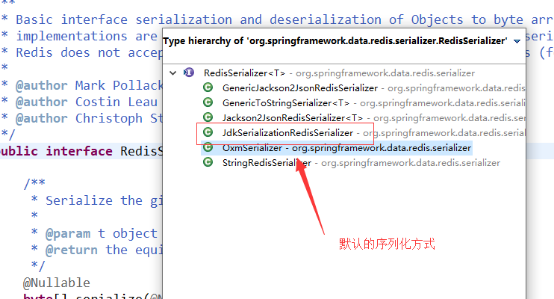

# 安装


安装gcc 

```
yum install gcc-c++ 
```

解压

```
tar -zxvf redis-4.0.14.tar.gz
```

把解压的文件copy到/usr/local/src里面

```
cp -r /root/software/redis-4.0.14 /usr/local/src/
改名
cd /usr/local/src/
mv redis-4.0.14  redis
```

打开/usr/local/src/redis/deps进行编译依赖项

```
cd /usr/local/src/redis/deps
make hiredis lua jemalloc linenoise
```

打开/usr/local/src/redis进行编译

```
cd /usr/local/src/redis
make
```

安装到/usr/local/redis里

```
mkdir /usr/local/redis
make install PREFIX=/usr/local/redis
```

把配置文件移动到/root/myredis目录[目录可以自定义]

mkdir /root/myredis

cp /usr/local/src/redis/redis.conf /root/myredis

验证安装是否成功

```
cd /usr/local/redis/bin
ls
```

使用which命令查看系统里面是否有redis的服务

```
which redis-server
```

### 启动

/usr/local/redis/bin/redis-server /root/myredis/redis.conf

```
#客户端连接
/usr/local/redis/bin/redis-cli -h 127.0.0.1 -p 7001
```

开机自启

```
vim /etc/rc.local
　　加入
/usr/local/redis/bin/redis-server /root/myredis/redis-conf
文件地址                          运行哪个配置文件
```


### 停止

```
/usr/local/redis/bin/redis-cli shutdown
#或者
pkill redis-server
```


# 配置解析


Unit

```shell
# Note on units: when memory size is needed, it is possible to specify
# it in the usual form of 1k 5GB 4M and so forth:
#
# 1k => 1000 bytes
# 1kb => 1024 bytes
# 1m => 1000000 bytes
# 1mb => 1024*1024 bytes
# 1g => 1000000000 bytes
# 1gb => 1024*1024*1024 bytes
#
# units are case insensitive so 1GB 1Gb 1gB are all the same.

定义了一些基本的度量单位，只支持bytes，不支持bit
对大小写不敏感
```


INCLUDES	配置文件包含关系

```shell
# Include one or more other config files here.  This is useful if you
# have a standard template that goes to all Redis servers but also need
# to customize a few per-server settings.  Include files can include
# other files, so use this wisely.
#
# Notice option "include" won't be rewritten by command "CONFIG REWRITE"
# from admin or Redis Sentinel. Since Redis always uses the last processed
# line as value of a configuration directive, you'd better put includes
# at the beginning of this file to avoid overwriting config change at runtime.
#
# If instead you are interested in using includes to override configuration
# options, it is better to use include as the last line.
#
# include /path/to/local.conf
# include /path/to/other.conf

和spring配置文件类似，可以通过includes包含其他配置文件
```


NETWORK

```shell
##默认情况下，redis在server上所有有效的网络接口上监听客户端连接。绑定多个ip空格分隔
bind 0.0.0.0

protected-mode yes

port 6379

#backlog连接队列，队列总和=未完成三次握手队列 + 已经完成三次握手队列。
#高并发环境下需要高backlog值来避免慢客户端连接问题。注意Linux内核会将这个值减小到/proc/sys/net/core/somaxconn的值，所以需要确认增大somaxconn和tcp_max_syn_backlog两个值来达到想要的效果
tcp-backlog 511

#当客户端闲置多少秒后关闭连接， 0表示关闭该功能
timeout 0

#单位秒，周期性检测客户端是否还处于健康状态，避免服务器一直阻塞，建议60
tcp-keepalive 300
```


GRNERAL

```shell
daemonize no

#通过upstart和systemd管理Redis守护进程，这个参数是和具体的操作系统相关的
supervised no

#pid文件路径。默认/var/run/redis.pid 。
pidfile /var/run/redis_6379.pid。

# 日志级别。debug（记录大量日志信息，适用于开发、测试）verbose（较多日志信息）
#notice（适量日志信息，使用于生产环境）warning（仅有部分重要、关键信息才会被记录）
loglevel notice 

#日志文件位置，空字符串时为标准输出，如果以守护进程模式运行，将会输出到 /dev/null 。
logfile ""   

#是否把日志记录到系统日志
syslog-enabled no

#设置系统日志的id     如syslog-ident redis
syslog-ident

databases 16

#是否一直显示日志
always-show-logo yes
```


SNAPSHOTTING	快照

```shell
#second秒内,changes个keys发生改变则保存一次
save <seconds> <changes>
       save 900 1
       save 300 10
       save 60 10000

#默认情况下，如果最后一次的后台保存失败，redis将停止接受写操作。直到后台保存进程重新启动,将再次允许写操作
#然而要是安装了靠谱的监控，不需要redis停止写操作来通知保存失败，改成 no
stop-writes-on-bgsave-error yes

#是否在dump.rdb压缩字符串，默认设置为yes。节约cpu资源可以设置no，这样的话数据集就可能会比较大。
rdbcompression yes

#是否CRC64校验rdb文件，性能损失10%
rdbchecksum yes

#rdb文件的名字
dbfilename dump.rdb
```


==SECURITY	安全==		6种淘汰策略

```shell
#设置密码
requirepass ****

#最大客户端连接数
maxclients 10000   

#到达内存上限会试图移除内部数据，移除规则通过maxmemory-policy来指定。
#如果无法根据移除规则来移除，或者设置“不允许移除”，则针对那些需要申请内存的指令返回错误信息，比如SET、LPUSH等,但对于无内存申请的指令，仍然会正常响应，如GET。
#主redis在设置内存使用上限时，需要在系统中留出一些内存空间给同步队列缓存，只有在你设置的是“不移除”的情况下，才不用考虑这个因素
maxmemory-policy
			#6种淘汰策略
                  （1）volatile-lru：LRU 过期
                  （2）allkeys-lru： LRU 最近最少原则
                  （5）volatile-ttl：TTL值最小,即最近要过期
                  一般不用
                  （3）volatile-random：过期移除随机key 
                  （4）allkeys-random：移除随机的key
    #默认,需修改     （6）noeviction：不移除。针对写操作，只返回错误信息	
    
#设置样本数量，LRU算法和最小TTL算法并非精确算法而是估算值，可以设置样本的大小，默认会检查这么多个key并选择其中LRU的那个
maxmemory-samples
```


AOF

```shell
#AOF重写期间是否禁止fsync；如果开启该选项，可以减轻文件重写时CPU和硬盘的负载（尤其是硬盘），但是可能会丢失AOF重写期间的数据；需要在负载和安全性之间进行平衡
no-appendfsync-on-rewrite no

#文件重写触发条件
auto-aof-rewrite-percentage 100
auto-aof-rewrite-min-size 64mb

#如果AOF文件结尾损坏，Redis启动时是否仍载入AOF文件
aof-load-truncated yes
```


# 数据类型


无论是哪种类型，Redis都不会直接存储，而是通过redisObject对象进行存储。

Redis中不存在表这个概念，首先考虑哪种数据类型适合业务，此外，我们无法像在关系数据库中那样，使用sql来操作Redis中的数据，需要直接使用API发送对应的命令，来操作想要操作的数据


1.字符串	Redis中所有键必须是字符串。

2.list    类似双向链表。

3.hash	Redis数据集本身就可以看做一个哈希，而Reidis的数据对象也可以再次使用哈希，其字段和值必须是字符串

4.set	唯一，无序

5.zset	有序集合


1，单进程单线程

多线程处理可能涉及到锁/线程切换消耗CPU/线程安全三个问题

Redis的单线程可以通过在单机开多个Redis实例来弥补

2， 默认16个数据库，类似数组下表从零开始，初始为零号库

统一密码管理，16个库密码相同

3，切换数据库

Select [index]   切换对应下标的数据库

4，常用基本命令

dbsize查看当前数据库的key的数量

flushdb：清空当前库

Flushall；清空全部库


# 指令


* 基本指令
  * keys * 		获取所有的key	可以跟正则
  * dbsize       当前数据库 key 的数量
  * info        查看redis 服务器状态和一些统计信息。
  * move key1 		将key移动到其他数据库,目标库有则不能移动
  * randomkey  	从当前数据库中随机返回
  * lpush key a b c	将若干值插入到key(存入list)
  * type key 		查看key类型
  * del key 		删除key
  * exists key 		是否存在key
  * **expire key seconds 	过期(秒)**
  * **pexpire key milliseconds   毫秒**
* expireat key timestamp   某个时间戳（秒）之后过期；
  * pexpireat key millisecondsTimestamp：某个时间戳（毫秒）之后过期；
  * persist key 	删除过期时间
  * ttl key 		查看还有多少秒过期，-1永不过期，-2已过期
  * monitor      实时监听并返回redis服务器接收到的所有请求信息。
  * flushall       删除全部数据库中所有 key，此方法不会失败
  * flushdb       删除当前数据库中所有 key,此方法不会失败
  
* String
  * getrange name 0 -1 		字符串分割  0 -1是全部	其中-1等价于n-1,即末尾下标.
  * getset name new_value 修改key对应值，返回旧值
  * mset k1 v1 k2 v2 		批量设置
  * mget key1 key2 批量获取

  * setnx key value 			不存在就插入
  * setrange key index value 从index开始替换value

  * incr age 递增
  * incrby age 10 递增

  * decr age 递减
  * decrby age 10 递减

  * incrbyfloat 增减浮点数
  * append 追加

  * strlen 长度
  * object encoding key  得到key 的类型  string里面有三种编码
    * int	能够用64位有符号整数表示的字符串
    * embstr 长度<=39字节的字符串，性能高
    * raw  用于>=39字节的

* list
  * lpush mylist a b c 左插入
  * rpush mylist x y z 右插入
  * lrange mylist 0 -1  取出数据集合  0 -1取出所有      0  1取第一个和第二个
    * 可以用lrange实现分页
  * lpop mylist 弹出最后一个元素
  * rpop mylist 弹出第一个元素
  * llen mylist 长度
  * lrem mylist count value 删除

    * count > 0 : 头->尾搜索，移除COUNT个等于VALUE的元素
    * count < 0 : 尾->头搜索
    * count = 0 : 移除所有与 VALUE 相等的值。
  * lindex mylist 2 指定索引的值
  * lset mylist 2 n 索引设值
  * ltrim mylist 0 4    修剪(trim)，不在指定区间之内的元素都将被删除
    * Java分割是左闭右开,redis是左右闭
  * linsert mylist before/after a   在元素前或后插入元素。 当元素不存在或空列表时，不执行任何操作,当key不是列表类型，返回一个错误。
  * rpoplpush list list2
    *  移除列表的最后一个元素，并将该元素添加到另一个列表并返回。


## hash

```
    hset myhash name cxx
         |--字段已经存在，旧值将被覆盖。
    hmget myhash       批量获取
    hgetall myhash     获取所有
    hexists myhash name        是否存在
    hsetnx myhash score 100    存在则不做处理,不存在则设置
    hincrby myhash id 1        按1递增
    hdel myhash name           删除
    hkeys myhash       只取key
    hvals myhash       只取value
    hlen myhash        长度
```


## set

```
    sadd myset redis   添加
    smembers myset     获取所有
    srem myset set1    删除
    sismember myset set1 判断是否存在
    scard key_name     长度
    sdiff | sinter | sunion    差|交|并集
    srandmember 随机获取集合中的元素
    spop 从集合中弹出一个元素
```


## zset

Zset增加了一个**权重参数score**，实现有序排列。

```
    zadd zset 1 one
    zincrby zset 1 one 增长分数
    zscore zset two 获取分数
    zrange zset 0 -1 withscores 范围值
    zrangebyscore zset 10 25 withscores 指定范围的值
    zrangebyscore zset 10 25 withscores limit 1 2 分页
    Zrevrangebyscore zset 10 25 withscores 指定范围的值
    zcard zset 元素数量
    Zcount zset 获得指定分数范围内的元素个数
    Zrem zset one two 删除一个或多个元素
    Zremrangebyrank zset 0 1 按照排名范围删除元素
    Zremrangebyscore zset 0 1 按照分数范围删除元素
    Zrank zset 0 -1 分数最小的元素排名为0
    Zrevrank zset 0 -1 分数最大的元素排名为0
```


# 持久化


RDB【Redis DataBase】  指定次数	快照,数据在某个时间点上的副本

* 优点

  * 适合灾难恢复,**恢复速度快**,可以将单个压缩文件传输到数据中心
  * 性能高,父进程分配工作给子进程完成RDB的写入,**不影响父进程**

  * 文件小,适合**数据量大的全量复制**

* 缺点
  * **不保证数据完整性和一致性**
  * 老版本的Redis不兼容新版本的RDB文件
  * 遇到突然断电,最后一次持久化后的数据可能丢失
  * 需要经常创建fork()子进程进行持久化,会先将数据写入到临时文件中，再替换上次持久化好的文件,数据集大将导致fork()耗时,可能会让redis宕机几秒,AOF也需要fork(),但可以调整重写日志的频率
    * Fork:克隆与当前进程一样的进程。新进程所有数据值都和原进程一致，但作为一个全新的进程
  * **fork()也会导致内存2倍的膨胀性**
  
* 恢复数据
  * 将备份文件 (dump.rdb) 移动到 redis 安装目录并启动服务
  * CONFIG GET dir获取目录


**AOF持久化**

与RDB持久化相对应，AOF的优点在于支持秒级持久化、兼容性好，缺点是文件大、恢复速度慢、对性能影响大。

AOF	日志记录每个写操作

* 优点
  * **日志只许追加不允许修改**,就算停电,没有搜索的话也没有损坏问题，redis启动时会读取该文件，将写指令从前到后执行一次以完成数据的恢复工作
  * 可以自定义同步策略,同步策略好

* 缺点
  * 文件比RDB大,**文件过大后将重写至新的aof**
  * 恢复速度慢

* 同步策略
  * 每修改同步：appendfsync always   性能较差但数据完整性好
  * 每秒同步：appendfsync everysec   异步操作,如果一秒内宕机，有数据丢失
  * 不同步：appendfsync no

* 修复AOF文件	Redis-check-aof --fix


同时开启两种持久化方式时,默认**优先载入AOF**文件来恢复原始的数据,确保数据完整

但不能只用AOF，**RDB更适合用于备份数据库(AOF在不断变化不好备份)**， 快速重启，不会有AOF可能潜在的bug


**只在Slave上持久化RDB文件,减少性能损耗,留后手**，而且只要15分钟备份一次就够了，save 900 1

如果Enalbe AOF，好处是在最恶劣情况下也只会丢失不超过两秒数据，启动脚本较简单只load自己的AOF文件就可以了。代价是持续的IO，以及rewrite和rewrite过程中产生的新数据写到新文件造成的阻塞不可避免的。只要硬盘许可，应该尽量减少AOF rewrite的频率，AOF重写的基础大小默认值64M太小了，可以设到5G以上。默认超过原大小100%大小时重写可以改到适当的数值。


# 主从复制  2.8之前


哨兵和集群都是在复制基础上实现高可用

持久化保证了即使redis重启也不会丢失数据，但当硬盘损坏,会导致数据丢失，通过redis的主从复制机制就可以避免这种单点故障，==读写分离/容灾恢复/高可用==

* 原理

  * Slave启动成功连接到master后会发送一个sync命令

  * Master接到命令启动后台的存盘进程，收集所有接收到的修改数据集命令，执行完毕后，传送整个数据文件到slave,完成一次全量复制
    * 全量复制：第一次链接成功,全部都复制给从机
    * 增量复制：Master继续将新的所有收集到的修改命令依次传给slave,完成同步
    * ==重新连接master,一次完全同步（全量复制)将被自动执行==
* 缺点
* 故障恢复无法自动化
  * 写操作无法负载均衡
  * 存储能力受到单机的限制
* 指令
* SLAVEOF 主库IP 主库端口		配置主从
    * 每次与master断开之后，都需要重新连接，除非配置进redis.conf文件**
  * Info replication	查看当前的主从关系
  
* SLAVEOF no one	停止主从，变成主数据库(**并不是把之前的master取代了**)

 

①拷贝多个redis.conf文件,文件名加上端口号区分

②开启daemonize yes

③修改从机端口

④修改从机Log文件名(可与主机同一文件)

⑤修从机Dump.rdb文件名


从机是从头复制,只读不写	主机宕机后,从机是原地待命

* 薪火相传

  * 上一个Slave可以是下一个slave的Master, 可以有效减轻master的写压力

  * 变更master会清除之前的数据，重新全量复制


# 哨兵	2.8及之后


==自动化的故障恢复==，进行投票

* 缺点:写操作无法负载均衡；存储能力受到单机的限制


```shell
	##	/myredis目录下新建sentinel.conf文件
	## 数字1表示主机挂掉后salve投票,得票1就能当主机.数字设置的越大,投票消耗的时间越长
sentinel monitor 自定义主机名 127.0.0.1 6379 1 
sentinel monitor port6379 127.0.0.1 6379 1

	## 同一哨兵监视多个主机,只需要在配置文件另起一行
	##哨兵配置集群:同一份配置文件复制多分,启动

启动
/usr/local/redis/bin/redis-sentinel /root/myredis/sentinel.conf
```


# 集群	2.8及之后


去中心化	去掉路由，自己来路由

主从和哨兵只有主机负责写入,从机负责读取,很容易造成性能的瓶颈


| 机器编号 | ip              | port |
| -------- | --------------- | ---- |
| 1        | 192.168.186.128 | 7002 |
| 2        | 192.168.186.128 | 7003 |
| 3        | 192.168.186.128 | 7004 |
| 4        | 192.168.186.128 | 7005 |
| 5        | 192.168.186.128 | 7006 |
| 6        | 192.168.186.128 | 7007 |

Redis集群中内置了16384个哈希槽,可以将哈希槽理解为分表

进行set时,先对key进行crc16算法算出应该插入到哪个槽.进行get同理

 

```shell
新建redis集群文件夹
mkdir redis-cluster
复制一个server
cp /usr/local/redis/bin/redis-server ./

配置第一个redis
mkdir redis1
复制一个配置文件
cp /usr/local/src/redis/redis.conf redis1
修改配置
vim redis1/redis.conf

bind 0.0.0.0                    69行
port 7001                       92行
daemonize yes                   136行
# 打开aof 持久化
appendonly yes                  672行 
# 开启集群
cluster-enabled yes             814行
# 集群的配置文件,该文件自动生成   
cluster-config-file nodes-7001.conf  822行
# 集群的超时时间
cluster-node-timeout 15000         828行

将这个redis1复制6分,每份替换端口号
%s/7000/7001/g

安装完成后同时启动所有的redis
```


```shell
##docker搭建
docker pull inem0o/redis-trib
##启动
docker run -it --net host inem0o/redis-trib create --replicas 1 192.168.186.128:7002 192.168.186.128:7003 192.168.186.128:7004 192.168.186.128:7005 192.168.186.128:7006 192.168.186.128:7007

docker run -it --net host inem0o/redis-trib create --replicas 1 127.0.0.1:7002 127.0.0.1:7003 127.0.0.1:7004 127.0.0.1:7005 127.0.0.1:7006 127.0.0.1:7007

-it是为了可以输入
--net host 是为了上docker容器能连接上本地的宿主机
集群后客户端连接需要加上 -c
```


# Redis Module 4.0 以后


Module只要编译引入到Redis中就能轻松的实现我们某些需求的功能

- neural-redis 主要是神经网络的机器学
- RedisSearch 主要支持一些富文本的的搜索
- **RedisBloom** 支持分布式环境下的Bloom 过滤器
  - bloomfilter就类似于一个hash set，用于快速判某个元素是否存在于集合中，其典型的应用场景就是快速判断一个key是否存在于某容器，不存在就直接返回。布隆过滤器的关键就在于hash算法和容器大小


# Web使用


## java


```java
## Jedis
<dependency>
    <groupId>redis.clients</groupId>
    <artifactId>jedis</artifactId>
    <version>3.1.0</version>
</dependency>
```


主从复制

```java
public class TestReidsMS {
    public static void main(String[] args) throws InterruptedException {
        // 创建连接
        Jedis jedis_M = new Jedis("192.168.186.128", 6379);
        Jedis jedis_S = new Jedis("192.168.186.128", 6380);
        jedis_S.slaveof("127.0.0.1", 6379);
        jedis_M.set("k6", "v6");
        Thread.sleep(500);
        System.out.println(jedis_S.get("k6"));
        jedis_M.close();
        jedis_S.close();   }}
```


==JedisPool==

 1，获取Jedis实例需要从JedisPool中获取

 2，用完Jedis实例需要返还给JedisPool

 3，如果Jedis在使用过程中出错，则也需要还给JedisPool


## RedisTemplate<Object,Object>

若不设置序列化规则，它将使用JDK自动的序列化将对象转换为字节，存到Redis 里面

它可以存在对象到redis里面

如果对象没有序列化，那么默认使用的JDK的序列化方式




```java
@RunWith(SpringRunner.class)
@SpringBootTest
public class SpringbootRedisTemplateTests {
    @Autowired
    private RedisTemplate<Object, Object> redisTemplate ; // 因为创建RedisTemplate 没有使用泛型信息来创建，泛型 本质还是Object，只不过泛型能自动推断并强转
   
    @Test
    public void testString() {
        redisTemplate.setKeySerializer(new  StringRedisSerializer()); // key的序列化使用String 类型来完成 因为key 很多时候都是一个字符串
        redisTemplate.setValueSerializer(new GenericJackson2JsonRedisSerializer()); // 优先没有泛型的，因为有泛型后，它支持的数据类型就定了
        ValueOperations<Object, Object> valueOperations = redisTemplate.opsForValue();
//      valueOperations.set("boot-redis", "boot-value"); //对象->字符串 json
        User user = new User(1, "laolei", "xx.jpg", "78414842@qq.com");
//       KEY : com.sxt.domain.User:1 
//      com.fasterxml.jackson.databind.JsonSerializer 没有依赖jackson 之前大家可能使用spring-boot-web，这里面会自动依赖
        valueOperations.set(User.class.getName()+":"+user.getId(), user);
        
        // 若该对象的强转转换，则redis 内部会使用JackSon 的工具将字符串-> 转换为java 对象 ，那jackson 转换为对象时，需要一个对象的类型 ，其实它已经自动对象的类型了"@class": "com.sxt.domain.User",
        User object = (User)valueOperations.get(User.class.getName()+":"+user.getId());
        System.out.println(object.getName()+":"+object.getIcon());
    }
    
    /**
     * hash
     */
    @Test
    public void testHash() {
        redisTemplate.setKeySerializer(new  StringRedisSerializer()); // key的序列化使用String 类型来完成 因为key 很多时候都是一个字符串
        redisTemplate.setHashKeySerializer(new  StringRedisSerializer());
        redisTemplate.setHashValueSerializer(new  StringRedisSerializer()); // 若都是string 则和StringRedisTempalte一样了
        HashOperations<Object, Object, Object> opsForHash = redisTemplate.opsForHash();
        opsForHash.put("redis-hash", "prop1", "value");
    }
}
```


集群额外操作

```java
@Test
    public void testCluster() {
        ClusterOperations<Object, Object> opsForCluster = redisTemplate.opsForCluster();
        //关闭集群的7000端口的主机
        opsForCluster.shutdown(new RedisClusterNode("192.168.120.130", 7000));
    }
```


## StringRedisTemplate

StringRedisTemplate extends RedisTemplate<String,String>


```java
@RunWith(SpringRunner.class)
@SpringBootTest
public class SpringbootRedisApplicationTests {
	@Autowired
	private StringRedisTemplate redisTemplate;
	/**
	 * redis数据类型为String的操作
	 */
	@Test
	public void testString() {
		// 操作String类型
		ValueOperations<String, String> opsValue = redisTemplate.opsForValue();
		// 给redis 里面set 一个key
		opsValue.set("boot", "spring-boot"); // k -v 都是String
		// 从redis 里面获取key
		String value = opsValue.get("boot");
		System.out.println(value);
		// 从redis 里面或多个key
		List<String> asList = Arrays.asList("boot", "alll-menu-data");
		List<String> mulitValues = opsValue.multiGet(asList);
		System.out.println(mulitValues);
		// redis的自动增长
		Long increment = opsValue.increment("boot-incr", 2);// delta 可以+ 任意的数（步长）
		System.out.println(increment);
	}
	@Test
	public void testHash() {
		HashOperations<String, Object, Object> opsForHash = redisTemplate.opsForHash();
		// hset
		opsForHash.put("object-1", "name", "sxt"); // 后面的2 个参数都是object,但是只支持String 类型
		opsForHash.put("object-1", "age", "27"); // 后面的2 个参数都是object,但是只支持String 类型
		opsForHash.put("object-1", "sex", "man"); // 后面的2 个参数都是object,但是只支持String 类型
		Object value = opsForHash.get("object-1", "sex");
		System.out.println(value);
		// 取多个值
		List<Object> multiGet = opsForHash.multiGet("object-1", Arrays.asList("name", "sex"));
		System.out.println(multiGet);
	}
	@Test
	public void testZset() {
		ZSetOperations<String, String> opsForZSet = redisTemplate.opsForZSet();
		// 放到zset集合里面
		opsForZSet.add("lol", "sxt", 2500);
		opsForZSet.add("lol", "lz", 0);
		opsForZSet.add("lol", "ln", 1400);
		opsForZSet.add("lol", "ll", -10);
		opsForZSet.add("lol", "lt", 2700);
		Set<String> rangeAsc = opsForZSet.range("lol", 0, 2); // 通过排序取值 ll lz ln
		System.out.println(rangeAsc);
		Set<String> reverseRange = opsForZSet.reverseRange("lol", 0, 2);// lt lz ln
		System.out.println(reverseRange);
		Set<TypedTuple<String>> tuples = new HashSet<ZSetOperations.TypedTuple<String>>();
		tuples.add(new DefaultTypedTuple<String>("sxt", 1000.00));
		tuples.add(new DefaultTypedTuple<String>("lv", 1200.00));
		tuples.add(new DefaultTypedTuple<String>("lz", 2900.00));
		tuples.add(new DefaultTypedTuple<String>("lt", 100.00));
		// 若redis 存在该key ，则需要数据类型相同，不然报错
		opsForZSet.add("dnf", tuples);
	}
}
```


## boot


RedisAutoCongiguration	创建对象

RedisProperties	读取配置文件


```shell
#redis的配置
spring:
  redis:
    host: 
    port: 6379
    password: 
    jedis:
      pool:
        max-idle: 20
        max-active: 25
        min-idle: 10   
```


启动类

```
@EnableCaching
```


业务实现类

```java
//查询	cacheNames 缓存的前缀
@Cacheable(cacheNames = "",key = "#id")
//添加	CachePut = jedis.set	key 参数对象/对象属性		result	返回值对象
@CachePut(cacheNames = "",key = "#result.id")
//修改
@CachePut(cacheNames = "",key = "#result.id")
//删除
@CacheEvict(cacheNames = "",key = "#id")

//全局配置缓存
@CacheConfig

注解缓存缓存的是当前注解所在方法的返回值
```


更改序列化方式

```java
@Configuration
public class RedisConfig {
	@Bean
	 public RedisCacheConfiguration redisCacheConfiguration(CacheProperties cacheProperties) {
	        CacheProperties.Redis redisProperties = cacheProperties.getRedis();
	        RedisCacheConfiguration config = RedisCacheConfiguration
	                .defaultCacheConfig();
	        config = config.serializeValuesWith(RedisSerializationContext.SerializationPair
	        		//把默认的jdk的序列化方式变成jackson
	        		.fromSerializer(new GenericJackson2JsonRedisSerializer()));
	        if (redisProperties.getTimeToLive() != null) {
	            config = config.entryTtl(redisProperties.getTimeToLive());
	        }
	        if (redisProperties.getKeyPrefix() != null) {
	            config = config.prefixKeysWith(redisProperties.getKeyPrefix());
	        }
	        if (!redisProperties.isCacheNullValues()) {
	            config = config.disableCachingNullValues();
	        }
	        if (!redisProperties.isUseKeyPrefix()) {
	            config = config.disableKeyPrefix();
	        }
	        return config;    }}
```


# 键值设计


## value

JSON存储value

 

标准，主流数据交换格式

简单，结构清晰，相对于XML来说更加的轻量级，易于解析

**语言无关,类型安全**，值是有类型的，比如整数、字符串、布尔

代码中redis value在存储前我们对其做了一次转换，转换为json对象后存储.也就是一个key对应一个json串


## key

系统：基础数据系统   user:sex:1=男 user:sex:0= 女

模块：数据字典    sys:available:1=true  sys:available:0=false

方法：根据数据字典类型查询

参数：字典类型

==抽象出key存储规则==,使用工具去查看时可以看出层级关系

common:sys:sex:1 男

user:1 {id:1.name:小明}


## 缓存穿透

缓存和数据库中都没有的数据被恶意请求,对后端系统造成压力。

解决方法

1：对查询结果为空的情况也进行缓存，缓存时间设置短一点，或者该key对应的数据insert了之后清理缓存。

2：对一定不存在的key进行过滤。可以把所有的可能存在的key放到一个大的Bitmap中，查询时通过该bitmap过滤

3：布隆过滤器bloom filter

使用mutex。在缓存失效的时，先使用缓存工具的某些带成功操作返回值的操作去set一个mutex key，当操作返回成功时，再进行load db的操作并回设缓存；否则，就重试整个get缓存的方法


## 缓存雪崩


缓存服务器重启或缓存集体失效


1：互斥锁/排队 控制读数据库写缓存的线程数量。比如对某个key只允许一个线程查询数据和写缓存，其他线程等待。

2：二级缓存，A1为原始缓存，A2为拷贝缓存，A1失效时，可以访问A2，**A1缓存失效时间设置为短期，A2设置为长期**

3：不同的key，设置不同的过期时间，让缓存失效的时间点尽量均匀

4.缓存预热


 

## 缓存预热

系统上线后,将相关的缓存数据直接加载到缓存系统

解决方案

数据量小,工程启动时进行加载缓存

数据量大时,设定定时脚本,进行缓存刷新

数据量过大,优先保证热点数据提前加载到缓存

 

## 缓存降级

缓存失效或缓存服务器宕机时,也不去访问数据库,而访问内存部分内存部分和数据缓存或直接返回默认数据.


## 缓存并发


这里的并发指的是多个redis的client同时set key。

可以把set操作放在队列中使其串行化，或者加锁


# 事务(基本不用)


Redis的单线程决定了它并不需要事务

```shell
Discard	取消事务,放弃事务块中存储的所有指令
Exec	执行事务块中所有指令
Multi	标记事务块的开始
Watch key	监视若干个key,如果在事务前key发生修改,打断事务
Unwatch	取消对key的监视
	 Watch指令类似乐观锁，事务提交时，如果Key的值已被别的客户端改变，比如某个list已被别的客户端push/pop过了,这个key的版本号就高于提交的版本号,被乐观锁锁住，整个事务队列都不会被执行
   通过WATCH命令在事务执行之前监控了多个Keys，倘若在WATCH之后有任何Key的值发生了变化， EXEC命令执行的事务都将被放弃，同时返回Nullmulti-bulk应答以通知调用者事务执行失败
```


* 3大特性
  * 单独的隔离操作：事务中的所有命令都会序列化、按顺序地执行。事务在执行的过程中，不会被其他客户端发送来的命令请求所打断。
  * 没有隔离级别的概念：队列中的命令没有提交之前都不会实际的被执行，因为事务提交前任何指令都不会被实际执行， 也就不存在”事务内的查要看到事务里的更新，在事务外查询不能看到”这个让人万分头痛的问题
  * 不保证原子性：redis同一个事务中如果有一条命令执行失败，其后的命令仍然会被执行，==不支持回滚==


# NOSQL

 NoSQL指"不仅仅是SQL"，泛指非关系型的数据库。强调Key-Value Stores和文档数据库的优点。


关系型数据库问题

 1：不能满足高性能查询需求

​	语言和存储结构是面向对象，但是数据库却是关系的，在存储或者查询时，需要做转换。ORM框架可以简化这个过程，但性能低。

 2：应用程序规模的变大

​	需要储存更多的数据、服务更多的用户以及需求更多的计算能力。


## NoSQL数据库类型


* 键值（Key-Value）数据库

  * 适用场景：

    * 储存用户信息，比如会话、配置文件、参数、购物车等。这些信息一般都和ID（键）挂钩，这种情景下键值数据库是个很好的选择。

  * 不适用场景：

    * 通过值查询

    * 需要储存数据之间的关系。**不能通过两个或以上的键来关联数据**

    * **不支持回滚**。

* 面向文档[MongoDB]    数据用XML、JSON或者JSONB等形式存储。

  * 适用场景：1.日志 2.分析
  * 不适用场景：不支持事务

* 列存储[HBASE]  数据储存在列族中，列族存储经常被一起查询的数据

  * 适用场景：
    * 1.日志 
    * 2.博客平台,我们储存每个信息到不同的列族中。举个例子，标签可以储存在一个，类别可以在一个，而文章则在另一个。
  * 不适用场景：1.不支持事务
    * 原型开发。模型设计之初，无法预测它的查询方式，而一旦查询方式改变，我们就必须重新设计列族。

* 图[Neo4J]    适用范围小，主要用于网络拓扑分析 如脉脉的人员关系图等


| RDBMS                          | NoSQL                                              |
| ------------------------------ | -------------------------------------------------- |
| 高度组织化结构化数据           | 代表着不仅仅是SQL                                  |
| 结构化查询语言（SQL）          | 没有声明性查询语言                                 |
| 数据和关系都存储在单独的表中。 | 没有预定义的模式                                   |
| 数据操纵语言，数据定义语言     | 键 - 值对存储，列存储，文档存储，图形数据库        |
| 严格的一致性                   | 最终一致性，而非ACID【原子，一致，隔离，持久】属性 |
| 基础事务                       | 非结构化和不可预知的数据                           |
|                                | CAP定理【一致性，可用性，容错性】                  |
|                                | 高性能，高可用性和可伸缩性                         |


## NoSQL数据库


* Memcached

挥发性(临时性)的键值存储

**一般作为关系型数据库的缓存来使用**

具有非常快的处理速度

由于**存在数据丢失的可能**，一般用来处理**不需要持久化的数据****

有过期功能expires

使用一致性散列(Consistent Hashing)算法来分散数据

* Tokyo Tyrant

持久性的键值存储

用来处理需要持久保存，高速处理的数据

具有非常快的处理速度

用于不需要定期清除的数据

使用一致性散列(Consistent Hashing)算法来分散数据

* Redis

兼具Memcached和Tokyo Tyrant优势的键值存储

擅长处理数组类型的数据

具有非常快的处理速度

可以高速处理时间序列的数据，易于处理集合运算

拥有很多可以进行原子操作的方法

使用一致性散列(Consistent Hashing)算法来分散数据

* MongoDB

面向无需定义表结构的文档数据

具有非常快的处理速度

通过BSON的形式可以保存和查询任何类型的数据

无法进行JOIN处理，但是可以通过嵌入(embed)来实现同样的功能

使用sharding(范围分割)算法来分散数据


## Redis简介

​	Redis它和Memcache一样，Redis数据缓存在计算机内存中，不同的是，**Memcache只能将数据缓存到内存中，无法自动定期写入硬盘**。而Redis能实现数据的持久化


* 特点
  * 操作都是原子性的，支持对多个操作合并后的原子性执行
  * 支持多种数据结构：string,list,hash,set,zset
  * 持久化，主从复制（集群）
  * 支持过期时间，支持事务，消息订阅。

* 应用场景
  * 数据缓存（提高访问性能）
  * 会话管理（session cache，保存web会话信息）
  * 排行榜/计数器（NGINX+lua+redis计数器进行IP自动封禁）
  * 消息队列（构建实时消息系统，聊天，群聊）


## bin目录

　　redis-benchmark：redis性能测试工具

　　redis-check-aof：检查aof日志的工具

　　redis-check-dump：检查rdb日志的工具

　　redis-cli：连接用的客户端

　　redis-server：redis服务进程


## **2.Redis相比memcached有哪些优势：**

- memcached所有的值均是简单的字符串，redis作为其替代者，支持更为丰富的数据类型
- redis的速度比memcached快很多
- redis可以持久化其数据


## 单线程


redis利用**队列**将并发访问变为串行访问，消除了传统数据库串行控制的开销

没有锁的概念，多个客户端连接并不存在竞争，利用setnx实现锁

CPU不是Redis的瓶颈，**Redis的瓶颈是机器内存的大小/网络带宽**

既然单线程容易实现， 并且CPU不是瓶颈，就顺理成章地采用单线程的方案了


* 完全基于内存，绝大部分请求是纯粹的内存操作，非常快速。数据存在内存中，类似HashMap，查找和操作的时间复杂度都是O(1)；

* 数据结构简单，对数据操作也简单，Redis中的数据结构是专门设计的

* 单线程**避免了不必要的上下文切换和竞争条件，不存在多线程导致的切换而消耗 CPU，不用去考虑锁**，不存在加锁释放锁操作，不存在死锁

* ==多路I/O复用模型，非阻塞IO==,**“多路”指多个网络连接，“复用”指的是复用同一线程**


# Redis内存模型


**mem_allocator**：内存分配器，在编译时指定；可以是 libc 、jemalloc或tcmalloc，默认是jemalloc

**used_memory**：Redis分配器分配的内存总量（字节），包括使用的虚拟内存（swap）

**used_memory_rss**：Redis进程占操作系统的内存（字节），与top及ps命令看到的值一致；除了分配器分配的内存之外，还包括进程本身的内存、内存碎片等，**不包括虚拟内存**

mem_fragmentation_ratio：内存碎片比率，used_memory_rss / used_memory


## 内存划分


### **进程本身的内存**

主进程本身占用内存，如代码、常量池等,大约几兆

不会统计在used_memory中


### **缓冲内存**

* 客户端缓冲  存储客户端连接
* 复制积压缓冲  用于部分复制功能
* AOF缓冲    用于AOF重写时，保存最近的写入命令

由jemalloc分配,会统计在used_memory中


### **内存碎片**


分配、回收物理内存过程中产生内存碎片

不会统计在used_memory中


## Redis没有直接使用C字符串

(即以空字符’\0’结尾的字符数组)作为默认的字符串表示，而是使用了SDS(简单动态字符串)(Simple Dynamic String),并加入了加入了free和len字段


## **35.缓存和数据库一致性**


只能采取合适的策略来降低缓存和数据库间数据不一致的概率，而无法保证两者间的强一致性。

合适的策略包括 合适的缓存更新策略，更新数据库后要及时更新缓存、缓存失败时增加重试机制，例如MQ模式的消息队列


## **40.读写分离模型**

通过增加Slave DB的数量，读的性能可以线性增长。为了避免Master DB的单点故障，集群一般都会采用两台Master DB做双机热备，所以整个集群的读和写的可用性都非常高。读写分离架构的缺陷在于，不管是Master还是Slave，每个节点都必须保存完整的数据，如果在数据量很大的情况下，集群的扩展能力还是受限于单个节点的存储能力，而且对于Write-intensive类型的应用，读写分离架构并不适合。


## **41.数据分片模型**

为了解决读写分离模型的缺陷，可以将数据分片模型应用进来。

可以将每个节点看成都是独立的master，然后通过业务实现数据分片。

结合上面两种模型，可以将每个master设计成由一个master和多个slave组成的模型。


## 性能问题和解决方案

==Master最好不要做任何持久化工作==，如RDB内存快照和AOF日志文件

如果数据比较重要，某个Slave开启AOF备份数据，策略设置为每秒同步一次

为了主从复制的速度和连接的稳定性，Master和Slave最好在同一个局域网内

尽量避免在压力很大的主库上增加从库


## **43.redis通讯协议**

RESP 是redis客户端和服务端之前使用的一种通讯协议

RESP 的特点：实现简单、快速解析、可读性好


## **44.Redis分布式锁实现**

先拿setnx来争抢锁，抢到之后，再用expire给锁加一个过期时间防止锁忘记了释放。**如果在setnx之后执行expire之前进程意外crash或者要重启维护了，那会怎么样？**set指令有非常复杂的参数，这个应该是可以同时把setnx和expire合成一条指令来用的！

## **45.Redis做异步队列**

一般使用list结构作为队列，rpush生产消息，lpop消费消息。当lpop没有消息的时候，要适当sleep一会再重试。缺点：在消费者下线的情况下，生产的消息会丢失，得使用专业的消息队列如rabbitmq等。**能不能生产一次消费多次呢？**使用pub/sub主题订阅者模式，可以实现1:N的消息队列。

## **46.Redis中海量数据的正确操作方式**

利用SCAN系列命令（SCAN、SSCAN、HSCAN、ZSCAN）完成数据迭代。


## **47.SCAN系列命令注意事项**

- SCAN的参数没有key，因为其迭代对象是DB内数据；
- 返回值都是数组，第一个值都是下一次迭代游标；
- 时间复杂度：每次请求都是O(1)，完成所有迭代需要O(N)，N是元素数量；
- 可用版本：version >= 2.8.0；

## **48.Redis 管道 Pipeline**

在某些场景下我们在**一次操作中可能需要执行多个命令**，而如果我们只是一个命令一个命令去执行则会浪费很多网络消耗时间，如果将命令一次性传输到 `Redis`中去再执行，则会减少很多开销时间。但是需要注意的是 `pipeline`中的命令并

## **50.手写一个 LRU 算法**

```text
class LRUCache<K, V> extends LinkedHashMap<K, V> {
    private final int CACHE_SIZE;

    /**
     * 传递进来最多能缓存多少数据
     *
     * @param cacheSize 缓存大小
     */
    public LRUCache(int cacheSize) {
        // true 表示让 linkedHashMap 按照访问顺序来进行排序，最近访问的放在头部，最老访问的放在尾部。
        super((int) Math.ceil(cacheSize / 0.75) + 1, 0.75f, true);
        CACHE_SIZE = cacheSize;
    }

    @Override
    protected boolean removeEldestEntry(Map.Entry<K, V> eldest) {
        // 当 map中的数据量大于指定的缓存个数的时候，就自动删除最老的数据。
        return size() > CACHE_SIZE;
    }
}
```

## **51.多节点 Redis 分布式锁：Redlock 算法**

获取当前时间（start）。

依次向 N 个 `Redis`节点请求锁。请求锁的方式与从单节点 `Redis`获取锁的方式一致。为了保证在某个 `Redis`节点不可用时该算法能够继续运行，获取锁的操作都需要设置超时时间，需要保证该超时时间远小于锁的有效时间。这样才能保证客户端在向某个 `Redis`节点获取锁失败之后，可以立刻尝试下一个节点。

计算获取锁的过程总共消耗多长时间（consumeTime = end - start）。如果客户端从大多数 `Redis`节点（>= N/2 + 1) 成功获取锁，并且获取锁总时长没有超过锁的有效时间，这种情况下，客户端会认为获取锁成功，否则，获取锁失败。

如果最终获取锁成功，锁的有效时间应该重新设置为锁最初的有效时间减去 `consumeTime`。

如果最终获取锁失败，客户端应该立刻向所有 `Redis`节点发起释放锁的请求。


# 三种删除策略


## 定时删除


在设置键的过期时间的同时，创建定时任务，当键达到过期时间时，立即执行对键的删除操作


- **优点：**对内存友好，及时释放
- **缺点：**对cpu不友好，影响服务器的响应时间和吞吐量


## 定期删除


每隔一点时间对数据库进行检查，删除里面的过期键，由算法决定删除多少过期键以及检查多少个数据库


1. 定期删除策略每隔一段时间执行一次删除过期键操作，并通过限制删除操作执行的时长和频率来减少删除操作对CPU时间的影响。

2. 定时删除策略有效地减少了因为过期键带来的内存浪费

   

## 惰性删除


放任键过期不管，每次从键空间获取键时，检查键是否过期，过期则删除键


- **优点：**对cpu友好，在每次从键空间获取键时进行过期键检查并是否删除，删除目标也仅限当前处理的键，这个策略不会在其他无关的删除任务上花费任何cpu时间。
- **缺点：**对内存不友好，过期键过期也可能不会被删除，导致所占的内存也不会释放。甚至可能会出现内存泄露的现象，当存在很多过期键，而这些过期键又没有被访问到，这会可能导致它们会一直保存在内存中，造成内存泄露。


## **58.Redis常见的几种缓存策略**

- Cache-Aside
- Read-Through
- Write-Through
- Write-Behind


## **60.Redis 到底是怎么实现“附近的人”**

### **使用方式**

```text
GEOADD key longitude latitude member [longitude latitude member ...]
```

将给定的位置对象（纬度、经度、名字）添加到指定的key。其中，key为集合名称，member为该经纬度所对应的对象。在实际运用中，当所需存储的对象数量过多时，可通过设置多key(如一个省一个key)的方式对对象集合变相做sharding，避免单集合数量过多。

成功插入后的返回值：

```text
(integer) N
```

其中N为成功插入的个数。

