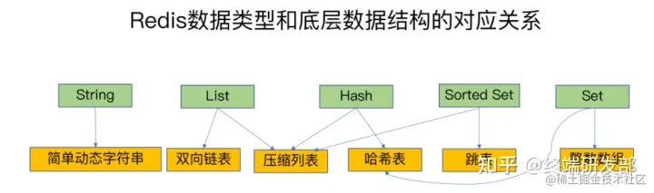

# 安装


安装gcc 

```
yum install gcc-c++ 
```

解压

```
tar -zxvf redis-4.0.14.tar.gz
```

把解压的文件copy到/usr/local/src里面

```
cp -r /root/software/redis-4.0.14 /usr/local/src/
改名
cd /usr/local/src/
mv redis-4.0.14  redis
```

打开/usr/local/src/redis/deps进行编译依赖项

```
cd /usr/local/src/redis/deps
make hiredis lua jemalloc linenoise
```

打开/usr/local/src/redis进行编译

```
cd /usr/local/src/redis
make
```

安装到/usr/local/redis里

```
mkdir /usr/local/redis
make install PREFIX=/usr/local/redis
```

把配置文件移动到/root/myredis目录[目录可以自定义]

mkdir /root/myredis

cp /usr/local/src/redis/redis.conf /root/myredis

验证安装是否成功

```
cd /usr/local/redis/bin
ls
```

使用which命令查看系统里面是否有redis的服务

```
which redis-server
```

## 启动

/usr/local/redis/bin/redis-server  /usr/local/myredis/redis.conf

```
#客户端连接
/usr/local/redis/bin/redis-cli -h 127.0.0.1 -p 7001
```

开机自启

```
vim /etc/rc.local
　　加入
/usr/local/redis/bin/redis-server /root/myredis/redis-conf
文件地址                          运行哪个配置文件
```


## 停止

```
/usr/local/redis/bin/redis-cli shutdown
#或者
pkill redis-server
```


# 配置解析


NETWORK

```shell
##默认情况下，redis在server上所有有效的网络接口上监听客户端连接。绑定多个ip空格分隔
bind 0.0.0.0

protected-mode yes

port 6379

#backlog连接队列，队列总和=未完成三次握手队列 + 已经完成三次握手队列。
#高并发环境下需要高backlog值来避免慢客户端连接问题。注意Linux内核会将这个值减小到/proc/sys/net/core/somaxconn的值，所以需要确认增大somaxconn和tcp_max_syn_backlog两个值来达到想要的效果
tcp-backlog 511

#当客户端闲置多少秒后关闭连接， 0表示关闭该功能
timeout 0

#单位秒，周期性检测客户端是否还处于健康状态，避免服务器一直阻塞，建议60
tcp-keepalive 300
```


GRNERAL

```shell
daemonize no

#通过upstart和systemd管理Redis守护进程，这个参数是和具体的操作系统相关的
supervised no

#pid文件路径。默认/var/run/redis.pid 。
pidfile /var/run/redis_6379.pid。

# 日志级别。debug（记录大量日志信息，适用于开发、测试）verbose（较多日志信息）
#notice（适量日志信息，使用于生产环境）warning（仅有部分重要、关键信息才会被记录）
loglevel notice 

#日志文件位置，空字符串时为标准输出，如果以守护进程模式运行，将会输出到 /dev/null 。
logfile ""   

#是否把日志记录到系统日志
syslog-enabled no

#设置系统日志的id     如syslog-ident redis
syslog-ident

databases 16

#是否一直显示日志
always-show-logo yes
```


SNAPSHOTTING	快照

```shell
#second秒内,changes个keys发生改变则保存一次
save <seconds> <changes>
       save 900 1
       save 300 10
       save 60 10000

#保存失败，redis将停止接受写操作。直到后台保存进程重新启动,将再次允许写操作
#然而要是安装了靠谱的监控，不需要redis停止写操作来通知保存失败，改成 no
stop-writes-on-bgsave-error yes

#是否在dump.rdb压缩字符串，默认设置为yes。节约cpu资源可以设置no，这样的话数据集就可能会比较大。
rdbcompression yes

#是否CRC64校验rdb文件，性能损失10%
rdbchecksum yes

#rdb文件的名字
dbfilename dump.rdb
```


==SECURITY	安全==		6种淘汰策略

```shell
#设置密码
requirepass ****

#最大客户端连接数
maxclients 10000   

#到达内存上限会试图移除内部数据，移除规则通过maxmemory-policy来指定。
#如果无法根据移除规则来移除，或者设置“不允许移除”，则针对那些需要申请内存的指令返回错误信息，比如SET、LPUSH等,但对于无内存申请的指令，仍然会正常响应，如GET。
#主redis在设置内存使用上限时，需要在系统中留出一些内存空间给同步队列缓存，只有在你设置的是“不移除”的情况下，才不用考虑这个因素
maxmemory-policy
			#6种淘汰策略
                  （1）volatile-lru：LRU 过期
                  （2）allkeys-lru： LRU 最近最少原则
                  （5）volatile-ttl：TTL值最小,即最近要过期
                  一般不用
                  （3）volatile-random：过期移除随机key 
                  （4）allkeys-random：移除随机的key
    #默认,需修改     （6）noeviction：不移除。针对写操作，只返回错误信息	
    
#设置样本数量，LRU算法和最小TTL算法并非精确算法而是估算值，可以设置样本的大小，默认会检查这么多个key并选择其中LRU的那个
maxmemory-samples
```


AOF

```shell
#AOF重写期间是否禁止fsync；如果开启该选项，可以减轻文件重写时CPU和硬盘的负载（尤其是硬盘），但是可能会丢失AOF重写期间的数据；需要在负载和安全性之间进行平衡
no-appendfsync-on-rewrite no

#文件重写触发条件
auto-aof-rewrite-percentage 100
auto-aof-rewrite-min-size 64mb

#如果AOF文件结尾损坏，Redis启动时是否仍载入AOF文件
aof-load-truncated yes
```


# Redis的线程

`Redis`的**网络`IO`**和**键值对读写**是由一个线程来完成的，这也是`Redis`对外提供键值存储服务的主要流程。但`Redis`的其他功能，比如**持久化、异步删除、集群数据同步**等，其实是由额外的线程执行的单线程


1. 单线程编程容易并且更容易维护
2. 基于内存,省去了cpu将数据从磁盘复制到内存的时间,这使得CPU不是Redis的瓶颈，**Redis的瓶颈是内存/网络带宽**
3. 单**避免多余的上下文切换和竞争**，不存在加解锁，不存在死锁


**Redis6.0 在网络IO耗时操作引入多线程,**执行命令仍然是单线程顺序执行。因此**不需要担心线程安全**


==多路I/O复用模型，非阻塞IO==,**“多路”指多个网络连接，“复用”指的是复用同一线程**


## 单线程模型详解

**Redis 基于 Reactor 模式来设计开发了一套高效的事件处理模型**,这套事件处理模型对应的是 Redis 中的文件事件处理器（file event handler）。由于文件事件处理器（file event handler）是单线程方式运行的，所以我们一般都说 Redis 是单线程模型

**既然是单线程，那怎么监听大量的客户端连接呢？**

Redis 通过**IO 多路复用** 来监听来自客户端的大量连接（socket），它会将感兴趣的事件及类型(读、写）注册到内核中并监听每个事件是否发生

这样的好处非常明显： **I/O 多路复用技术的使用让 Redis 不需要额外创建多余的线程来监听客户端的大量连接，降低了资源的消耗**

另外， Redis 服务器是一个事件驱动程序，服务器需要处理两类事件：1. 文件事件; 2. 时间事件。

时间事件不需要多花时间了解，使用最多的还是 **文件事件**（客户端进行读取写入等操作，涉及一系列网络通信）


> 当被监听的套接字准备好执行连接应答（accept）、读取（read）、写入（write）、关闭（close）等操作时，与操作相对应的文件事件就会产生，这时文件事件处理器就会调用套接字关联好的事件处理器来处理事件
>
> **虽然文件事件处理器以单线程方式运行，但通过使用 I/O 多路复用程序来监听多个套接字**，文件事件处理器既实现了高性能的网络通信模型，又可以很好地与 Redis 服务器中其他同样以单线程方式运行的模块进行对接，这保持了 Redis 内部单线程设计的简单性

可以看出，文件事件处理器主要是包含 4 个部分：

- 多个 socket（客户端连接）
- IO 多路复用程序（支持多个客户端连接的关键）
- 文件事件分派器（将 socket 关联到相应的事件处理器）
- 事件处理器（连接应答处理器、命令请求处理器、命令回复处理器）


# 基本类型


Select [index]   切换对应下标的数据库

dbsize	当前数据库的key的数量

flushdb	清空当前库

Flushall	清空全部库


* 基本指令
  * keys * 		获取所有的key	可以跟正则
  * info        查看redis 服务器状态和一些统计信息。
  * move key1 		将key移动到其他数据库,目标库有则不能移动
  * type key 		查看key类型
  * del key 		删除key
  * exists key 		是否存在key
  * **expire key seconds 	过期(秒)**
  * **pexpire key milliseconds   毫秒**
  
  * expireat key timestamp   某个时间戳（秒）之后过期；
  * pexpireat key millisecondsTimestamp：某个时间戳（毫秒）之后过期；
  * persist key 	删除过期时间
  * ttl key 		查看还有多少秒过期，-1永不过期，-2已过期
  * monitor      实时监听并返回redis服务器接收到的所有请求信息。
  
  

## 底层数据结构

redis的键值对也是用全局哈希表来存储的,在数据量过大时,也会存在hash冲突和rehash的问题


对于string类型,查询时间复杂度为O(1)找到哈希桶+O(n)找到哈希桶的元素

对于集合类型,O(1)是不变的,之后要根据集合的底层数据结构进行计算


### 压缩列表

压缩列表底层用的是数组,但是数组的前三位存放`zlbytes`、`zltail`和`zllen`，分别表示**列表长度**、**列表尾的偏移量**和**列表中的entry个数**

所以访问第一个元素和最后一个元素通过前三个字段很快访问，时间复杂度O(1)，其他元素O(n)


### 跳表

跳表是在链表的基础上，增加了多级索引


### 渐进式rehash

redis有两个全局哈希表,在表1触发rehash时:

1. 给表2分配两倍的表1空间

2. 将表1中的数据重新映射到表2中

   如果在这个阶段客户端的请求改动了某个哈希桶的元素,则将整个哈希桶重新映射到表2,这使得**rehash无需阻塞用户请求**

3. 释放哈希表1的空间





## String

redis的string是二进制安全的,可以包含任何数据。如**数字，字符串，jpg图片或者序列化的对象**


* getrange name 0 -1 		字符串分割  0 -1是全部	其中-1等价于n-1,即末尾下标.
* getset name new_value 修改key对应值，返回旧值
* mset k1 v1 k2 v2 		批量设置
* mget key1 key2 批量获取

* setrange key index value 从index开始替换value

* incr age 递增
* incrby age 10 递增

* decr age 递减
* decrby age 10 递减

* incrbyfloat 增减浮点数
* append 追加(智能分配内存,每次2倍)

* strlen 长度
* object encoding key  得到key 的类型  string里面有三种编码
  * int	能够用64位有符号整数表示的字符串
  * embstr 长度<=39字节的字符串，性能高
  * raw  用于>=39字节的


## list

类似双向链表


|                                  |                                                              |
| -------------------------------- | ------------------------------------------------------------ |
| LPUSH KEY_NAME v1 v2             | 插入列表头部                                                 |
| BLPUSH                           | 阻塞地插入                                                   |
| LPOP                             | 弹出第一个元素                                               |
| linsert KEY_NAME before/after v1 | 在元素前或后插入元素。 当元素不存在或空列表时，不执行任何操作 |
| LSET key index value             | 指定下标赋值                                                 |


* lrange mylist 0 -1  取出数据集合  0 -1取出所有      0  1取第一个和第二个
  * 可以用lrange实现分页
* llen mylist 长度
* lrem mylist count value 删除

  * count > 0 : 头->尾搜索，移除COUNT个等于VALUE的元素
  * count < 0 : 尾->头搜索
  * count = 0 : 移除所有与 VALUE 相等的值。
* ltrim mylist 0 4    修剪(trim)，不在指定区间之内的元素都将被删除
  * Java分割是左闭右开,redis是左右闭
* rpoplpush list list2
  *  移除列表的最后一个元素，并将该元素添加到另一个列表并返回。


## hash

==字段和值必须是字符串==


- 存储、读取、修改用户属性


```shell
    hset myhash name cxx
         |--字段已经存在，旧值将被覆盖
    hmget myhash       批量获取
    hgetall myhash     获取所有
    hexists myhash name        是否存在
    hincrby myhash id 1        按1递增
    hdel myhash name           删除
    hkeys myhash       只取key
    hvals myhash       只取value
    hlen myhash        长度
```


## set


```shell
    sadd myset redis   添加
    smembers myset     获取所有
    srem myset set1    删除
    sismember myset set1 判断是否存在
    scard key_name     长度
    sdiff | sinter | sunion    #差|交|并集
    srandmember 随机获取集合中的元素
    spop 从集合中弹出一个元素
```


## zset


Zset增加了一个**权重参数score**，实现有序排列


```shell
zadd zset 1 one
zincrby zset 1 one 增长分数
zscore zset two 获取分数
zrange zset 0 -1 withscores 范围值
zrangebyscore zset 10 25 withscores 指定范围的值
zrangebyscore zset 10 25 withscores limit 1 2 分页
Zrevrangebyscore zset 10 25 withscores 指定范围的值
zcard zset 元素数量
Zcount zset 获得指定分数范围内的元素个数
Zrem zset one two 删除一个或多个元素
Zremrangebyrank zset 0 1 按照排名范围删除元素
Zremrangebyscore zset 0 1 按照分数范围删除元素
Zrank zset 0 -1 分数最小的元素排名为0
Zrevrank zset 0 -1 分数最大的元素排名为0
```


## bitmap


```shell
setbit key offset value #当offset超过位图长度,会触发扩容,key对应的位图不存在,会新建位图
getbit key offset
bitcount key start end #统计start-end之间1的个数
bitop and key1 key2 #位运算 and:与 or:或 not:取反 xor:异或


```


# 统计模式


# 持久化

集群时,一般只在master上进行持久化,slave不需要

如果同时开启RDB和AOF,在**恢复数据时优先AOF**,确保数据完整性


## RDB

Redis DataBase  存储数据==快照==


* 优点

  * 适合灾难恢复,**恢复速度快**,可以做**冷备**,定期将完整的快照文件传输到数据中心
  * 性能高,通过fork子线程实现快照,**不影响父进程**

  * 文件小,适合**数据量大的全量复制**

* 缺点
  * **不保证数据完整性和一致性**,两次快照之间存在时间间隔
  * 会先**将数据写入到临时文件中，再替换上次持久化好的文件**,数据集大将导致fork()耗时,AOF也需要fork(),但可以调整重写日志的频率

* 恢复数据
  * 将备份文件 (dump.rdb) 移动到 redis 安装目录并启动服务


### save配置项

> #second秒内,changes个keys发生改变则保存一次
> save <seconds> <changes>
>        save 900 1
>        save 300 10
>        save 60 10000


### BGSAVE命令

客户端向Redis发送**BGSAVE命令**(Windows不支持)创建快照，Redis会调用fork来创建一个子进程，然后子进程负责将快照写入硬盘，而父进程则继续处理命令请求


### SAVE命令

客户端向Redis发送 **SAVE命令** 创建快照，接到SAVE命令的Redis服务器在快照创建完毕之前不会再响应任何其他命令。SAVE命令不常用，我们通常只会在没有足够内存去执行BGSAVE命令的情况下，又或者即使等待持久化操作执行完毕也无所谓的情况下，才会使用这个命令


## AOF

Append Only File 日志记录所有写操作

```shell
auto-aof-rewrite-min-size 64MB // 当文件小于64M时不进行重写
auto-aof-rewrite-min-percenrage 100 // 当文件比上次重写后的文件大100%时进行重写
```


* 优点
  * **日志只追加不修改**,文件不容易损坏，redis启动时会读取该文件，执行全部指令以完成数据的恢复工作
  * 如果开启每个写命令都记录日志,就能确保数据的完整性

* 缺点
  * **文件比RDB大**,文件过大后触发**重写**
  * 文件系统本身对文件的大小有限制,无法保存过大的文件
* `AOF`支持的写`QPS`会比`RDB`支持的写`QPS`低，因为`AOF`一般会配置成每秒`fsync`一次日志文件
  * 恢复速度慢, 影响性能  **如果是集群,可以选择只在slave上开启持久化**
  
* 修复AOF文件	Redis-check-aof --fix


### AOF 重写

```shell
auto-aof-rewrite-percentage 100 #上次rewrite之后的文件大小/目前大小
auto-aof-rewrite-min-size 64mb #触发重写的最小存储大小
这两条规则是与逻辑
```


1. 主线程fork出子线程执行``BGREWRITEAOF`

2. 子线程创建新的AOF文件,**基于数据库当前数据**,生成插入语句,作为AOF内容的开头

   主线程维护**AOF重写缓冲区**，记录重写过程中执行的写命令

3. 主线程将重写缓冲区中的所有内容追加到新的AOF文件

4. 替换掉旧的AOF文件


### 策略


|         选项         |         同步频率         |
| :------------------: | :----------------------: |
|  appendfsync always  |     每个写命令都同步     |
| appendfsync everysec |       每秒同步一次       |
|    appendfsync no    | 让操作系统来决定何时同步 |


同时开启两种持久化方式时,默认**优先载入AOF**文件来恢复原始的数据,确保数据完整


## 4.0对持久化的 优化


Redis 4.0 开始支持 RDB 和 AOF 的混合持久化（默认关闭，可以通过配置项 `aof-use-rdb-preamble` 开启）。

如果把混合持久化打开，AOF 重写的时候就直接把 RDB 的内容写到 AOF 文件开头。这样做的好处是可以结合 RDB 和 AOF 的优点, 快速加载同时避免丢失过多的数据。当然缺点也是有的， AOF 里面的 RDB 部分是压缩格式不再是 AOF 格式，可读性差


# 主从复制  2.8-

哨兵和集群都是在复制基础上实现高可用

持久化保证了redis重启丢失数据，但硬盘损坏会导致数据丢失，通过主从复制可以避免单点故障

==读写分离/容灾恢复/高可用==

slave是与master完全一致的副本,一旦master宕机,可以**手动**选择slave成为新的master,手动化也导致单独的主从复制不具备生产实用性


* 原理

  * Slave启动连接到master后,发送sync命令
  * Master接到命令启动后台的存盘进程，收集修改命令，传送整个数据文件到slave,完成全量复制
    * 全量复制：Master发送RDB文件给slave
    * 增量复制：Master将新的写入命令传给slave
  * slave只读不写	主机宕机后,slave原地待命
  * slave可以作为其他slave的Master, 减轻master的写压力,避免master需要负责太多slave
  * **变更master会清除数据，重新全量复制**
* 缺点
    * 故障恢复无法自动化
    * 写操作无法负载均衡
    * ==每个节点都必须保存完整的数据，扩展能力还是受限于单个节点的存储能力==

 

```shell
拷贝多个redis.conf文件,文件名加上端口号区分
开启daemonize yes
修改从机端口
修改从机Log文件名(可与主机同名)
修从机Dump.rdb文件名

#配置主从		每次与master断开之后，都要重新配置，除非配置进redis.conf文件
SLAVEOF 主库IP 主库端口

#查看当前的主从关系
Info replication

#停止主从，变成主数据库
SLAVEOF no one
```


# 哨兵	2.8+

哨兵模式在主从的基础上,提供了监控主从节点,自动切换master的功能

1. 监控主从节点的运行状态
2. 将Redis实例的运行故障信息通过API通知监控系统
3. **自动故障恢复**：当master故障时，哨兵会自动将某个从节点会升级为主节点，其他从节点会使用新的主节点进行主从复制，通知客户端使用新的主节点
4. **配置中心**：哨兵可以作为客户端服务发现的授权源，客户端连接到哨兵请求给定服务的Redis主节点地址。如果发生故障转移，哨兵会通知新的地址


* 缺点:写操作无法负载均衡；存储能力受单机的限制


```shell
	##	/myredis目录下新建sentinel.conf文件
	## 数字1表示主机挂掉后salve投票,得票1就能当主机.数字设置的越大,投票消耗的时间越长
sentinel monitor 自定义主机名 127.0.0.1 6379 1 
sentinel monitor port6379 127.0.0.1 6379 1

	## 同一哨兵监视多个主机,只需要在配置文件另起一行
	##哨兵配置集群:同一份配置文件复制多分,启动

启动
/usr/local/redis/bin/redis-sentinel /root/myredis/sentinel.conf
```


# 集群	2.8+


==去中心化	去掉路由，自己来路由==

**主从和哨兵只有主机负责写入,从机负责读取,容易造成性能瓶颈****


| 机器编号 | ip              | port |
| -------- | --------------- | ---- |
| 1        | 192.168.186.128 | 7002 |
| 2        | 192.168.186.128 | 7003 |
| 3        | 192.168.186.128 | 7004 |
| 4        | 192.168.186.128 | 7005 |
| 5        | 192.168.186.128 | 7006 |
| 6        | 192.168.186.128 | 7007 |

Redis集群中内置了16384个哈希槽,可以将哈希槽理解为分表

进行set时,先对key进行crc16算法算出应该插入到哪个槽.进行get同理

 

```shell
新建redis集群文件夹
mkdir redis-cluster
复制一个server
cp /usr/local/redis/bin/redis-server ./

配置第一个redis
mkdir redis1
复制一个配置文件
cp /usr/local/src/redis/redis.conf redis1
修改配置
vim redis1/redis.conf

bind 0.0.0.0                    69行
port 7001                       92行
daemonize yes                   136行
# 打开aof 持久化
appendonly yes                  672行 
# 开启集群
cluster-enabled yes             814行
# 集群的配置文件,该文件自动生成   
cluster-config-file nodes-7001.conf  822行
# 集群的超时时间
cluster-node-timeout 15000         828行

将这个redis1复制6分,每份替换端口号
%s/7000/7001/g

安装完成后同时启动所有的redis
```


```shell
##docker搭建
docker pull inem0o/redis-trib
##启动
docker run -it --net host inem0o/redis-trib create --replicas 1 192.168.186.128:7002 192.168.186.128:7003 192.168.186.128:7004 192.168.186.128:7005 192.168.186.128:7006 192.168.186.128:7007

docker run -it --net host inem0o/redis-trib create --replicas 1 127.0.0.1:7002 127.0.0.1:7003 127.0.0.1:7004 127.0.0.1:7005 127.0.0.1:7006 127.0.0.1:7007

-it是为了可以输入
--net host 是为了上docker容器能连接上本地的宿主机
集群后客户端连接需要加上 -c
```


# Redis Module 4.0+


Module只要编译引入到Redis中就能轻松的实现我们某些需求的功能

- neural-redis 主要是神经网络的机器学
- RedisSearch 主要支持一些富文本的的搜索
- **RedisBloom** 支持分布式环境下的Bloom 过滤器
  - bloomfilter就类似于一个hash set，用于快速判某个元素是否存在于集合中，其典型的应用场景就是快速判断一个key是否存在于某容器，不存在就直接返回。布隆过滤器的关键就在于hash算法和容器大小


# RedisTemplate

## RedisTemplate<Object,Object>


若不设置序列化规则，它将使用JDK自动的序列化将对象转换为字节，存到Redis 里面

它可以存在对象到redis里面

如果对象没有序列化，那么默认使用的JDK的序列化方式


```java
@RunWith(SpringRunner.class)
@SpringBootTest
public class SpringbootRedisTemplateTests {
    @Autowired
    private RedisTemplate<Object, Object> redisTemplate ; // 因为创建RedisTemplate 没有使用泛型信息来创建，泛型 本质还是Object，只不过泛型能自动推断并强转
   
    @Test
    public void testString() {
        redisTemplate.setKeySerializer(new  StringRedisSerializer()); // key的序列化用String 因为key 很多时候都是一个字符串
        redisTemplate.setValueSerializer(new GenericJackson2JsonRedisSerializer()); // 优先没有泛型的
        ValueOperations<Object, Object> valueOperations = redisTemplate.opsForValue();
//      valueOperations.set("boot-redis", "boot-value"); //对象->字符串 json
        User user = new User(1, "laolei", "xx.jpg", "78414842@qq.com");
//       KEY : com.sxt.domain.User:1 
//      com.fasterxml.jackson.databind.JsonSerializer 没有依赖jackson 之前大家可能使用spring-boot-web，这里面会自动依赖
        valueOperations.set(User.class.getName()+":"+user.getId(), user);
        
        // 若该对象的强转转换，则redis 内部会使用JackSon 的工具将字符串-> 转换为java 对象 ，那jackson 转换为对象时，需要一个对象的类型 ，其实它已经自动对象的类型了"@class": "com.sxt.domain.User",
        User object = (User)valueOperations.get(User.class.getName()+":"+user.getId());
        System.out.println(object.getName()+":"+object.getIcon()); }
    
    /**
     * hash
     */
    @Test
    public void testHash() {
        redisTemplate.setKeySerializer(new  StringRedisSerializer()); // key的序列化使用String 类型来完成 因为key 很多时候都是一个字符串
        redisTemplate.setHashKeySerializer(new  StringRedisSerializer());
        redisTemplate.setHashValueSerializer(new  StringRedisSerializer()); // 若都是string 则和StringRedisTempalte一样了
        HashOperations<Object, Object, Object> opsForHash = redisTemplate.opsForHash();
        opsForHash.put("redis-hash", "prop1", "value");
    }}
```


集群额外操作

```java
@Test
    public void testCluster() {
        ClusterOperations<Object, Object> opsForCluster = redisTemplate.opsForCluster();
        //关闭集群的7000端口的主机
        opsForCluster.shutdown(new RedisClusterNode("192.168.120.130", 7000));
    }
```


## StringRedisTemplate


StringRedisTemplate extends RedisTemplate<String,String>


```java
@RunWith(SpringRunner.class)
@SpringBootTest
public class SpringbootRedisApplicationTests {
	@Autowired
	private StringRedisTemplate redisTemplate;
	/**
	 * redis数据类型为String的操作
	 */
	@Test
	public void testString() {
		// 操作String类型
		ValueOperations<String, String> opsValue = redisTemplate.opsForValue();
		// 给redis 里面set 一个key
		opsValue.set("boot", "spring-boot"); // k -v 都是String
		// 从redis 里面获取key
		String value = opsValue.get("boot");
		System.out.println(value);
		// 从redis 里面或多个key
		List<String> asList = Arrays.asList("boot", "alll-menu-data");
		List<String> mulitValues = opsValue.multiGet(asList);
		System.out.println(mulitValues);
		// redis的自动增长
		Long increment = opsValue.increment("boot-incr", 2);// delta 可以+ 任意的数（步长）
		System.out.println(increment);
	}
	@Test
	public void testHash() {
		HashOperations<String, Object, Object> opsForHash = redisTemplate.opsForHash();
		// hset
		opsForHash.put("object-1", "name", "sxt"); // 后面的2 个参数都是object,但是只支持String 类型
		opsForHash.put("object-1", "age", "27"); // 后面的2 个参数都是object,但是只支持String 类型
		opsForHash.put("object-1", "sex", "man"); // 后面的2 个参数都是object,但是只支持String 类型
		Object value = opsForHash.get("object-1", "sex");
		System.out.println(value);
		// 取多个值
		List<Object> multiGet = opsForHash.multiGet("object-1", Arrays.asList("name", "sex"));
		System.out.println(multiGet);
	}
	@Test
	public void testZset() {
		ZSetOperations<String, String> opsForZSet = redisTemplate.opsForZSet();
		// 放到zset集合里面
		opsForZSet.add("lol", "sxt", 2500);
		opsForZSet.add("lol", "lz", 0);
		opsForZSet.add("lol", "ln", 1400);
		opsForZSet.add("lol", "ll", -10);
		opsForZSet.add("lol", "lt", 2700);
		Set<String> rangeAsc = opsForZSet.range("lol", 0, 2); // 通过排序取值 ll lz ln
		System.out.println(rangeAsc);
		Set<String> reverseRange = opsForZSet.reverseRange("lol", 0, 2);// lt lz ln
		System.out.println(reverseRange);
		Set<TypedTuple<String>> tuples = new HashSet<ZSetOperations.TypedTuple<String>>();
		tuples.add(new DefaultTypedTuple<String>("sxt", 1000.00));
		tuples.add(new DefaultTypedTuple<String>("lv", 1200.00));
		tuples.add(new DefaultTypedTuple<String>("lz", 2900.00));
		tuples.add(new DefaultTypedTuple<String>("lt", 100.00));
		// 若redis 存在该key ，则需要数据类型相同，不然报错
		opsForZSet.add("dnf", tuples);}}
```


## boot


RedisAutoCongiguration	创建对象

RedisProperties	读取配置文件


```shell
#redis的配置
spring:
  redis:
    host: 
    port: 6379
    password: 
    jedis:
      pool:
        max-idle: 20
        max-active: 25
        min-idle: 10   
```


启动类

```
@EnableCaching
```


业务实现类

```java
//查询	cacheNames 缓存的前缀
@Cacheable(cacheNames = "",key = "#id")
//添加	CachePut = jedis.set	key 参数对象/对象属性		result	返回值对象
@CachePut(cacheNames = "",key = "#result.id")
//修改
@CachePut(cacheNames = "",key = "#result.id")
//删除
@CacheEvict(cacheNames = "",key = "#id")

//全局配置缓存
@CacheConfig

注解缓存缓存的是当前注解所在方法的返回值
```


更改序列化方式

```java
@Configuration
public class RedisConfig {
	@Bean
	 public RedisCacheConfiguration redisCacheConfiguration(CacheProperties cacheProperties) {
	        CacheProperties.Redis redisProperties = cacheProperties.getRedis();
	        RedisCacheConfiguration config = RedisCacheConfiguration
	                .defaultCacheConfig();
	        config = config.serializeValuesWith(RedisSerializationContext.SerializationPair
	        		//把默认的jdk的序列化方式变成jackson
	        		.fromSerializer(new GenericJackson2JsonRedisSerializer()));
	        if (redisProperties.getTimeToLive() != null) {
	            config = config.entryTtl(redisProperties.getTimeToLive());
	        }
	        if (redisProperties.getKeyPrefix() != null) {
	            config = config.prefixKeysWith(redisProperties.getKeyPrefix());
	        }
	        if (!redisProperties.isCacheNullValues()) {
	            config = config.disableCachingNullValues();
	        }
	        if (!redisProperties.isUseKeyPrefix()) {
	            config = config.disableKeyPrefix();
	        }
	        return config;    }}
```


## 键值设计


* value
  * JSON存储value
    * 标准，主流数据交换格式
    * 简单，结构清晰，相对于XML来说更轻量，易于解析
    * **语言无关,类型安全**，值是有类型的


* key
  * 系统：基础数据系统   user:sex:1=男 user:sex:0= 女
  * 模块：数据字典    sys:available:1=true  sys:available:0=false
  * 方法：根据数据字典类型查询
  * 参数：字典类型
  * ==抽象出key存储规则==,使用工具去查看时可以看出层级关系

common:sys:sex:1 男

user:1 {id:1.name:小明}


## ~~事务~~

**Redis的单线程决定了它并不需要事务**

隔离性：Redis单线程执行过程中，不会被其他客户端发送来的请求打断

没有隔离级别的概念：队列中的命令没有提交之前都不会被执行，不存在”事务间的可见性”这个让人万分头痛的问题

不保证原子性：redis==不支持回滚==


# 分布式锁

## 单机 setnx

1. 用**setnx**命令 [key,随机数],并设置**过期时间**,防止异常造成死锁. nx: 只有在key不存在才会执行

2. set成功的服务, 就可以执行后续业务
3. 任务处理完后,用`del`指令删除key,也就是释放锁
   1. key过期了, 在删除前需要判断value是否是自己设置的
   2. key未过期, 直接删除

* 存在单点故障问题,Redis故障将导致整个服务失效
* ==不能使用主从==
  * 主从复制是异步的,主节点故障时,锁信息可能未能同步到从节点
  * 从节点选举成功后,没有锁信息,导致锁被其他服务重新获得


## 集群 RedLock

* 获取当前时间T1
* 向n个Redis循环发送锁请求信息(使用的是单实例的命令,附带超时时间),==超时时间远小于锁的有效时间==
* 记录客户端获得锁的总消耗时间T2
  * T2-T1<超时时间  ||  半数以上节点成功    -> 获得锁
  * 如果未获得锁,向所有Redis发送释放锁的指令,然后再次请求锁


避免了死锁问题,即使客户端执行过长/故障,Redis都根据过期时间自动释放锁

高可用:**只要大部分节点存活,依然可以获取/释放锁**


依次向 N 个 `Redis`节点请求锁。请求锁的方式与从单节点 `Redis`获取锁的方式一致。为了保证在某个 `Redis`节点不可用时该算法能够继续运行，获取锁的操作都需要设置超时时间，需要保证该超时时间远小于锁的有效时间。这样才能保证客户端在向某个 `Redis`节点获取锁失败之后，可以立刻尝试下一个节点。

计算获取锁的过程总共消耗多长时间（consumeTime = end - start）。如果客户端从大多数 `Redis`节点（>= N/2 + 1) 成功获取锁，并且获取锁总时长没有超过锁的有效时间，这种情况下，客户端会认为获取锁成功，否则，获取锁失败。

如果最终获取锁成功，锁的有效时间应该重新设置为锁最初的有效时间减去 `consumeTime`。

如果最终获取锁失败，客户端应该立刻向所有 `Redis`节点发起释放锁的请求。


但导致了n次锁的性能问题		多路复用优化


# 缓存带来的问题


* 缓存穿透	缓存中==不存在==的数据被恶意请求
  * 加强参数校验，拦截非法请求
  * 对查询结果为空时,也放入缓存,并且**过期时间短**,避免后续数据库又有值
  * 对一定不存在的key进行过滤。把所有的可能存在的key放到Bitmap，查询时通过bitmap过滤
  * bloom filter,快速判断给定数据是否存在
* 缓存击穿  ==热点key过期==
  * 热点数据**永不过期**
  * 对请求进行**加锁同步**,第一个请求结果会被缓存,后续的请求都能用
    * 用SETNX去加分布式锁，当操作返回成功时，再进行load db的操作并回设缓存；否则，就重试整个get缓存的方法。
* 缓存雪崩     redis不可用/缓存集体失效
  * 对请求**加锁同步** 只允许单线程查询/写入，其他线程等待
  * 二级缓存，A1为原始缓存，A2为拷贝缓存，A1失效时，可以访问A2，**A1缓存失效时间设置为短期，A2设置为长期**
  * 不同key**不同过期时间**，让缓存失效时间点均匀
  * 服务降级,直接返回预定义信息、空值或是错误信息
* 用redis集群确保redis的可用性
  * ==缓存预热==  启动后将部分数据直接缓存
    * 数据量小,工程启动时进行加载缓存
    * 数据量大,设定定时脚本,进行缓存刷新
    * 数据量过大,优先保证热点数据提前加载到缓存
* 缓存降级
  * 缓存失效或缓存服务器宕机时,也不去访问数据库,直接返回默认数据


## 写入并发竞争

用分布式锁(redis/zookeeper),将客户端的写入操作序列化,避免并发写入


## 双写一致性

无法保证缓存和DB中数据一致


==Cache Aside Pattern 旁路缓存模式==: 优先读缓存，其次数据库,**更新数据库时,删除缓存**


但还是存在数据库已删除,缓存还没删除时,其他线程访问缓存,导致数据不一致

**严格的话还需要将请求加锁,通过序列化保证一致性**


### 为什么删缓存而不是更新缓存

缓存有可能是查询n张表运算出来的数据,计算缓存会耗时

通过这种lazy的方式,可以在有需要时才去录入缓存


## 缓存无底洞

为了满足业务要求添加了大量缓存节点，但是性能反而下降了

产生原因：缓存系统通常采用 hash 函数将 key 映射到对应的缓存节点，随着缓存节点数目的增加，键值分布到更多的节点上，导致客户端一次批量操作会涉及多次网络操作，这意味着批量操作的耗时会随着节点数目的增加而不断增大。此外，网络连接数变多，对节点的性能也有一定影响。

- 优化批量数据操作命令
- 减少网络通信次数
- 降低接入成本，使用长连接 / 连接池，NIO


## 主从切换数据丢失


### 异步复制导致数据丢失

主从的复制是异步的,存在部分数据还没复制到`slave`，`master`就宕机了. 此时推举新的slave,将丢弃了未同步的数据


**方案**

比对主从库上的复制进度差值 `master_repl_offset`和`slave_repl_offset`


### 从机同步到过期数据

slave会同步到master上未过期的数据

如果是设置为经过5min过期,由于slave是在异步复制后才获取到这条数据的,存在1min时间差. 这会导致master删除过期数据后,slave上还差1min才会过期,导致数据不同步


**方案**

用EXPIREAT和PEXPIREAT命令，将过期时间设置为具体的时间点


### 脑裂问题导致数据丢失

1. master与slave网络不通了,但master与client网络正常,读写都能正常响应
2. 此时哨兵认为master宕机,并选举slave作为新master.在选举过程中,client仍然在往旧master发送写指令
3. 选举出新master后,旧master会被作为`slave`挂到新的`master`上,这将导致旧master的数据被清空,并进行全量同步. 用户在上个阶段的写操作都将丢失


**方案**

排查客户端日志,查看主从切换的一段时间内,客户端是否还在跟旧master进行通信


## 解决数据丢失


`redis`提供了两个参数配置来限制主库的请求处理

```text
min-slaves-to-write：这个配置项设置了主库能进行数据同步的最少从库数量；
min-slaves-max-lag：这个配置项设置了主从库间进行数据复制时，从库给主库发送ACK消息的最大延迟（以秒为单位）。
```

`min-slaves-to-write`和`min-slaves-max-lag`这两个配置项搭配起来使用，分别给它们设置一定的阈值，假设为N和T。这两个配置项组合后的要求是，主库连接的从库中至少有N个从库，和主库进行数据复制时的`ACK`消息延迟不能超过T秒，否则，主库就不会再接收客户端的请求了。

举个例子，
假设我们将`min-slaves-to-write`设置为1，把`min-slaves-max-lag`设置为12s，把哨兵的`down-after-milliseconds`设置为10s，主库因为某些原因卡住了15s，导致哨兵判断主库客观下线，开始进行主从切换。同时，因为原主库卡住了15s，没有一个从库能和原主库在12s内进行数据复制，原主库也无法接收客户端请求了。这样一来，主从切换完成后，也只有新主库能接收请求，不会发生脑裂，也就不会发生数据丢失的问题了。


# NOSQL


**NoSQL指"不仅仅是SQL"**，泛指非关系型的数据库。强调Key-Value Stores和文档数据库的优点


关系型数据库问题

 1：不能满足高性能查询需求

​	语言和存储结构是面向对象，但是数据库却是关系的，在存储或者查询时，需要做转换。ORM框架可以简化这个过程，但性能低

 2：应用程序规模的变大

​	需要储存更多的数据、服务更多的用户以及需求更多的计算能力


## NoSQL数据库类型


* 键值（Key-Value）数据库

  * 适用场景：

    * 信息和ID挂钩
    * 用户信息，会话、配置文件、参数、购物车

  * 不适用场景：

    * 信息和值挂钩

    * 数据之间有关系。**不能通过两个或以上的键来关联数据**

    * **不支持回滚**

* 面向文档[MongoDB]    数据用XML、JSON或者JSONB等形式存储。

  * 适用场景：1.日志 2.分析
  * 不适用场景：不支持事务

* 列存储[HBASE]  数据储存在列族中，列族存储经常被一起查询的数据

  * 适用场景：
    * 1.日志 
    * 2.博客平台,我们储存每个信息到不同的列族中。举个例子，标签可以储存在一个，类别可以在一个，而文章则在另一个。
  * 不适用场景：1.不支持事务
    * 原型开发。模型设计之初，无法预测它的查询方式，而一旦查询方式改变，我们就必须重新设计列族。

* 图[Neo4J]    适用范围小，主要用于网络拓扑分析 如脉脉的人员关系图等


| RDBMS                      | NoSQL                                              |
| -------------------------- | -------------------------------------------------- |
| 高度组织化结构化数据       | 不仅仅是SQL                                        |
| 结构化查询语言（SQL）      | 没有声明性查询语言                                 |
| 数据和关系存储在单独的表中 | 没有预定义的模式                                   |
| 数据操纵语言，数据定义语言 | 键 - 值对存储，列存储，文档存储，图形数据库        |
| 严格的一致性               | **最终一致性**，而非ACID【原子，一致，隔离，持久】 |
| 基础事务                   | 非结构化和不可预知的数据                           |
|                            | CAP定理【一致性，可用性，容错性】                  |
|                            | 高性能，高可用性和可伸缩性                         |


## NoSQL数据库


* Memcached

  * 挥发性(临时性)的键值存储,==无法持久化==,**一般作为关系型数据库的缓存来使用**
  * **支持的数据类型少****
  * 有过期功能expires
  * 使用一致性散列(Consistent Hashing)算法来分散数据

* Tokyo Tyrant

  * 持久性的键值存储,用来处理需要持久保存，高速处理的数据
  * 效率高
  * 不支持过期
  * 使用一致性散列(Consistent Hashing)算法来分散数据

* Redis

  * 擅长处理数组类型的数据
  * 可以高速处理时间序列的数据，易于处理集合运算
  * **原子操作**，支持对多个操作合并后的原子性执行
  * 使用一致性散列(Consistent Hashing)算法来分散数据
  * 应用场景
    * 数据缓存（提高访问性能）
    * 会话管理（session cache，保存web会话信息）
    * 排行榜/计数器（NGINX+lua+redis计数器进行IP自动封禁）
    * 消息队列（构建实时消息系统，聊天，群聊）

* MongoDB

  * 面向无需定义表结构的文档数据
  * 通过BSON的形式可以保存和查询任何类型的数据
  * 无法进行JOIN处理，但是可以通过嵌入(embed)来实现同样的功能

  * 使用sharding(范围分割)算法来分散数据


## bin目录

　　redis-benchmark：redis性能测试工具

　　redis-check-aof：检查aof日志的工具

　　redis-check-dump：检查rdb日志的工具

　　redis-cli：连接用的客户端

　　redis-server：redis服务进程


# Redis内存模型


**mem_allocator**：内存分配器，在编译时指定；可以是 libc 、jemalloc或tcmalloc，默认是jemalloc

**used_memory**：Redis分配器分配的内存总量（字节），包括使用的虚拟内存（swap）

**used_memory_rss**：Redis进程占操作系统的内存（字节），与top及ps命令看到的值一致；除了分配器分配的内存之外，还包括进程本身的内存、内存碎片等，**不包括虚拟内存**

mem_fragmentation_ratio：内存碎片比率，used_memory_rss / used_memory


## 内存划分


### **进程本身的内存**

主进程本身占用内存，如代码、常量池等,大约几兆

不会统计在used_memory中


### **缓冲内存**

* 客户端缓冲  存储客户端连接
* 复制积压缓冲  用于部分复制功能
* AOF缓冲    用于AOF重写时，保存最近的写入命令

由jemalloc分配,会统计在used_memory中


### **内存碎片**


分配、回收物理内存过程中产生内存碎片

不会统计在used_memory中


## Redis做异步队列

一般使用list结构作为队列，rpush生产消息，lpop消费消息。当lpop没有消息的时候，要适当sleep一会再重试。缺点：在消费者下线的情况下，生产的消息会丢失，得使用专业的消息队列如rabbitmq等。**能不能生产一次消费多次呢？**使用pub/sub主题订阅者模式，可以实现1:N的消息队列。


## SCAN系列命令注意事项

- SCAN的参数没有key，因为其迭代对象是DB内数据；
- 返回值都是数组，第一个值都是下一次迭代游标；
- 时间复杂度：每次请求都是O(1)，完成所有迭代需要O(N)，N是元素数量；
- 可用版本：version >= 2.8.0；


# 淘汰策略

当内存使用量超出时，会施行数据淘汰策略


- FIFO（First In First Out）：先进先出策略，最先进入的数据被淘汰

- LRU（Least Recently Used）：最近最久未使用策略。保证内存中的数据都是热点数据

- LFU（Least Frequently Used）：最不经常使用策略，优先淘汰一段时间内使用次数最少的数据


- 如果数据呈现幂律分布，也就是一部分数据访问频率高，一部分数据访问频率低，则使用`allkeys-lru`
- 如果数据呈现平等分布，也就是所有的数据访问频率都相同，则使用`allkeys-random`

|                 | 筛选范围                                              | 淘汰规则                                 |
| --------------- | ----------------------------------------------------- | ---------------------------------------- |
| volatile-lru    | 已设置过期时间的数据集                                | 最近最少使用                             |
| allkeys-lru     | 全部数据集                                            | 最近最少使用                             |
|                 |                                                       |                                          |
| volatile-ttl    | 已设置过期时间的数据集                                | 剩余过期时间最短                         |
|                 |                                                       |                                          |
| volatile-random | 已设置过期时间                                        | 任意                                     |
| allkeys-random  | 全部数据集                                            | 任意                                     |
|                 |                                                       |                                          |
| no-eviction     | 不淘汰数据                                            | 当内存不足以容纳新写入数据时，插入会报错 |
|                 |                                                       |                                          |
| 4.0+ 新增       |                                                       |                                          |
| volatile-lfu    | 从已设置过期时间的数据集中挑选 最不经常使用的数据淘汰 |                                          |
| allkeys-lfu     |                                                       |                                          |


# 过期键的删除策略


## 定时删除

在设置键的过期时间的同时创建定时任务，当键达到过期时间，立即执行对键的删除操作

- **优点：**对内存友好，及时释放
- **缺点：**对cpu不友好，影响服务器的响应时间和吞吐量


## 定期删除

每隔一定时间对数据库进行检查，由算法决定删除多少过期键以及检查多少数据库


通过限制删除操作执行的时长和频率来减少删除操作对CPU时间的影响


## 惰性删除

放任键过期不管，每次从键空间获取键时，检查键是否过期，过期则删除键

- **优点：**对cpu友好
- **缺点：**对内存不友好，容易内存泄露


# 布隆过滤器

位图+hash

对key进行**若干次hash**,并将hashcode取模后,在bitMap上标记为1

在进行查找时,将搜索值也进行上述操作,并判断bitMap,为0则一定不存在.为1,则因为存在哈希冲突,可能存在

**hash的次数越多,过滤结果越精准**


**缺陷**

1. 判断为存在的元素,可能实际上不存在
2. **不支持删除元素**,bitMap的一个位置可能对应了多个元素


# 案例分析


## redis服务器性能估算

一个 2 核 `CPU`、`4GB` 内存、`500GB` 磁盘的云主机运行 `Redis`，`Redis` 数据库的数据量大小差不多是 `2GB`，用了 `RDB` 做持久化保证。同时`Redis`主要以写操作为主，读写比例为`2:8`。那么此时做`RDB`持久化有什么风险？

**内存资源风险：**

1. 因为`RDB`是由`fork`子进程做持久化的，而本篇文章提到好多次写时复制这么个概念。那么在持久化的过程中，**写时复制就会重新分配整个实例80%的内存副本**（读写比例为`2:8`）。也就是`2GB * 0.8 = 1.6GB`。那么此时系统一共就`4GB`，接近饱和了。
2. 如果此时父进程又有大量新`key`写入，**而`Redis`中的数据又是保存到内存中的，所以机器的内存很容易被消耗殆尽。**

而这里又可以考虑是否开启`Swap`机制：

- **开启`Swap`机制，那么`Redis`会有一部分数据被换到磁盘上，当`Redis`访问这部分在磁盘上的数据时，性能会急剧下降**，已经达不到高性能的标准。
- 没有开启`Swap`机制，**会直接触发`OOM`，父子进程会面临被系统`kill`掉的风险**

**CPU资源风险：**

1. **子进程在做生成`RDB`快照的过程会消耗大量的`CPU`资源。**
2. 虽然`Redis`处理处理请求是单线程的，但`Redis Server`还有其他线程在后台工作，例如`AOF`每秒刷盘等这些操作。**即其他工作线程还需要占用`CPU`。**
3. 由于机器只有2核`CPU`，这也就意味着父进程占用了超过一半的`CPU`资源，**此时子进程做`RDB`持久化，可能会产生`CPU`竞争，导致的结果就是父进程处理请求延迟增大，子进程生成`RDB`快照的时间也会变长，整个`Redis Server`性能下降。**


`swap` 空间是硬盘上的一块区域。虚拟内存是由可访问的物理内存和`swap space`组成，也即`swap space`是虚拟内存的一部分。**`swap`存储那些暂时不活跃的内存页面。当操作系统决定要给活跃的进程分配物理内存空间并且可利用的物理内存不足时会用到swap space。**

**说白了，就是把一块磁盘空间或者一个本地文件，当做内存来使用（重点）。** 因此即使服务器的内存不足，也可以运行大内存的应用程序。


## 新客/留存客户统计

用一个集合统计所有登陆过的用户,key为 user:login

每天新建一个集合统计当天登录的用户,key为 user:login:yyyyMMdd

```shell
#计算新客  总客户-day1客户=day2新客
SDIFFSTORE user:new:20230222 user:login:20230222 user:login

#次日留存客户   取day1 day2登录用户的交集
SINTERSTORE user:rem:20230222 user:login:20230222 user:login:20230223
```

集合的计算复杂度较高,在数据量比较大时,建议将数据传取到客户端,让客户端来计算,避免阻塞redis实例


##  一个月内签到次数统计

签到与未签到是简单的0,1二值状态,可以用bitmap记录

```shell
SETBIT user:sign:1:202302 0 1 #id为1的用户在2023-02-01签到
SETBIT user:sign:1:202302 1 1 #id为1的用户在2023-02-02签到
#如果当天用户未签到,则位图默认为0,不用做处理

BITCOUNT user:sign:1:202302 #获取一个月内的签到次数
```


## 连续签到的用户数量统计

> 用户数量1e,需要算出10天内有多少用户连续签到


```shell
SETBIT user:sign:20230223 0 1 #创建1e位的bitmap,key为日期,0代表第一位用户
SETBIT user:sign:20230224 1 1
......10天的签到.....

bitop and key1 key2
.....10个bitmap求与......
与运算结果x, 则x二进制中1的个数就是连续签到的用户数
```


## 网页独立访客统计

> UV:Unique Visitor 网页的独立访客,通过IP去重


**Set统计UV**

```shell
SADD page1:uv user1
SCARD page1:uv #返回set中元素的个数
```

当用户数量大时,set里会有千万个用户. 并且每个网页都要用独立的set存储uv,大促时可能会有上万个网页需要统计,这会导致占用过多的内存


**Hset统计UV**

```bash
HSET page1:uv user1 1 #用户ID作为Hset的key,对这个用户 ID 记录一个值“1”，表示一个独立访客
HLEN page1:uv #统计 Hash 集合中的所有元素个数
```

和 Set 类型相似，当页面很多时，Hash 类型也会消耗很大的内存空间


**HyperLogLog统计UV**

HyperLogLog 是一种用于统计基数的数据集合类型,它计算基数所需的空间总是固定的，而且还很小，适合大量数据的统计

每个 HyperLogLog 只需要花费 12 KB 内存，就可以存储 2^64 个元素

```shell
PFADD page1:uv user1 user2 user3 user4 user5 #支持一次性记录多个用户
PFCOUNT page1:uv #统计结果是基于概率完成的，一般存在0.81%的误差
```


