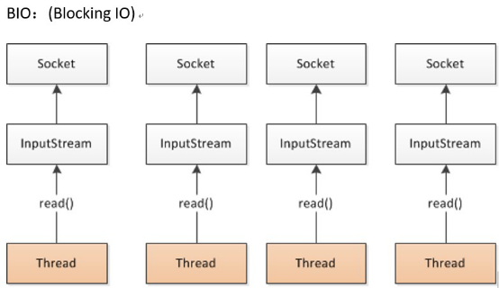
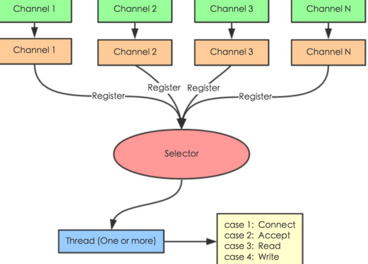

分布式系统是若干独立计算机的集合，这些计算机对于用户来说就像单个相关系统.是建立在网络之上的软件系统。


* 单一应用架构
  * 网站流量小，所有功能部署在一起，以减少部署节点和成本。此时，用于简化增删改查的数据访问框架**(ORM)是关键。**
    * 缺点： 1、扩展难 2、协同开发难3、不利于升级维护
  * 访问量大，单一应用增加机器带来的加速度越来越小，将应用拆成互不相干的几个应用，以提升效率。此时，用于加速前端页面开发的**Web框架(MVC)是关键**。
    * 缺点： 公用模块无法重复利用，开发性的浪费

* 分布式服务架构
  * 当垂直应用越来越多，应用之间交互不可避免，将核心业务抽取出来，作为独立的服务。此时，用于提高业务复用及整合的分布式服务框架(**RPC)是关键。**

* 流动计算架构
  * 服务过多，需增加调度中心基于访问压力实时管理集群容量，提高集群利用率。此时，用于提高机器利用率的**资源调度和治理中心(SOA)是关键。**


==节点角色==

| Provider  |                                 |
| --------- | ------------------------------- |
| Consumer  |                                 |
| Registry  | 服务注册/发现的注册中心         |
| Monitor   | 统计服务调用次数/时间的监控中心 |
| Container | 服务运行容器                    |


# 安装(windows)

https://github.com/apache/dubbo-admin/tree/master


修改dubbo-admin-master	application.properties


 

打包mvn package

运行java -jar dubbo-admin-0.0.1-SNAPSHOT.jar


## 监控中心 monitor


```
进入dubbo-monitor-simple\src\main\resources\conf	修改 dubbo.properties文件的ip地址

mvn clean package -Dmaven.test.skip=true

解压 tar.gz 文件，并运行start.bat
```


Simple Monitor 挂掉不会影响到 Consumer 和 Provider 的调用，所以用于生产环境不会有风险

Simple Monitor 采用磁盘存储统计信息，请注意安装机器的磁盘限制，如果要集群，建议用mount共享磁盘。


# 整合springboot


三种方式

方式1：引入dubbo-starter，在application.properties配置属性，使用@Service【暴露服务】使用@Reference【引用服务】

方式2：保留xml配置文件; 导入dubbo-starter，使用@ImportResource导入dubbo的配置文件即可

方式3：使用注解API的方式， 将每一个组件手动创建到容器中,让dubbo来扫描组件


## 要点


==provider需要暴露服务,用apache.duubo的@service,既能注册bean,又能暴露服务==

==consumer只需要注册bean,使用spring的@service==


* **provider项目无需web依赖**,不需要向浏览器提供服务

* consumer	需要web依赖

* provider和consumer**部署在不同机器,端口才允许重复**

* **启动类需要加上@EnableDubbo注解**


由于provider和consumer都依赖于interface,部分公共依赖可以写在interface中


## provider


* 启动类

```java
@EnableDubbo
```

* 依赖

服务者只需要勾选devTools和spring Configuration就行,由于依赖interface项目所以不需要lombok

```java
       <dependency>
            <groupId>org.apache.dubbo</groupId>
            <artifactId>dubbo</artifactId>
            <version>2.7.3</version>
        </dependency>
        <dependency>
            <groupId>org.apache.dubbo</groupId>
            <artifactId>dubbo-dependencies-zookeeper</artifactId>
            <version>2.7.3</version>
            <type>pom</type>
            <exclusions>
                <exclusion>
                    <groupId>org.slf4j</groupId>
                    <artifactId>slf4j-log4j12</artifactId>
                </exclusion>
            </exclusions>
        </dependency>
```

* ServiceImpl	(provider)

```java
apache.duubo	@service
```

* properties

```shell
dubbo.application.name=boot-ego-user-service-provider
dubbo.registry.address=zookeeper://127.0.0.1:2181
dubbo.protocol.name=dubbo
dubbo.protocol.port=20880
#dubbo.monitor.protocol=registry
```


## consumer


* 启动类配置

```
@EnableDubbo //启动dubbo
```

* ServiceImpl

```java
@Service	Sping注解

      @Reference		远程调用服务注解
      UserService userService;
```

* properties

```shell
dubbo.application.name=boot-ego-order-service-consumer
dubbo.registry.address=zookeeper://127.0.0.1:2181
dubbo.monitor.protocol=registry
server.port=8888
```

 

# 服务暴露过程


Dubbo 会在 Spring 实例化完 bean 之后，在刷新容器最后一步发布 ContextRefreshEvent 事件的时候，通知实现了 ApplicationListener 的 ServiceBean 类进行回调 onApplicationEvent 事件方法，Dubbo 会在这个方法中调用 ServiceBean 父类 ServiceConfig 的 export 方法，而该方法真正实现了服务的（异步或者非异步）发布。


# 负载均衡LoadBalance


* Random LoadBalance	基于权重随机调用	**默认**

* RoundRobin LoadBalance	基于**权重轮循**调用	权重大的被轮循到的次数多

* LeastActive LoadBalance   基于活跃数的调用	根据调用前后计数差,得到"延迟数"

* ConsistentHash LoadBalance	基于一致hash的调用

```
@Service(weight = 100, loadbalance = "roundrobin")	//provider设置权重与负载均衡
```


## 服务降级 2.2+


**服务器压力剧增时，对一些服务有策略地不处理或简单处理，从而释放服务器资源**


consumer禁用后,consumer发起的请求会被直接返回null,并不会报错	**不影响本地存根的执行**

consumer允许容错	在provider的响应时间过长,将直接返回null,并不会报错	能够减轻服务器的压力


## dubbo直连


绕过zookeeper注册,直接消费服务	指定服务提供者的ip与端口


# 超时处理

 

## 提供者超时

可以精确到某个接口中的方法


 消费者超时


## 重试


* 配置的次数为重试的次数,==总次数=重试+1==

```java
<dubbo:provider timeout="6000" retries="3"></dubbo:provider>
```


* ==幂等操作==	多次请求对数据没有影响	**修改幂等**,重复修改最终结果一致	**删除也幂等**
* 非幂等操作	==只有添加非幂等,重试为0==


## 集群容错


* 读操作用 Failover 失败自动切换，默认重试两次其他服务器

* 写操作用 Failfast 快速失败，发一次调用失败就立即报错


| **Failover Cluster** | ==缺省==    失败自动切换。通常用于==读==操作                 |
| -------------------- | ------------------------------------------------------------ |
| **Failfast Cluster** | 快速失败，只发起一次调用，失败立即报错。通常用于非幂等性==写==操作 |
| **Failsafe Cluster** | 安全失败，出现异常时直接忽略。通常用于写入**审计日志**       |
| Failback Cluster     | 失败自动恢复，**记录失败请求，定时重发**。通常用于**消息通知** |
| Forking Cluster      | 并行调用多个服务器，只要一个成功即返回。通常用于**实时性要求较高的读操作**，但需要浪费更多服务资源。可通过 forks="2" 来设置最大并行数 |
| Broadcast Cluster    | 广播调用所有提供者，逐个调用，任意一台报错则报错 。通常用于通知所有提供者更新缓存或日志等本地资源信息 |


**集群模式配置**

```java
//注解
@Reference(timeout = 3000, cluster = "failover", retries = 0, stub = "com.lx.service.impl.StubUserServiceImpl")
    private UserService userService;

//xml
provider	<dubbo:service cluster="failsafe" />
consumer	<dubbo:reference cluster="failsafe" />
```


## 启动检查

  

* 消费者项目启动时,默认会检查提供者是否已注册,如果没有将启动失败

可以在方法/全局上配置启动不检查	check默认为true

```
@Reference(timeout = 3000, check = false)
```


## 配置优先级

有三个位置用于配置

​	方法>接口>全局	同级别的配置下==消费者的配置优先==


在@service/@Reference注解中指定超时时间,等价于接口配置

**超时,则会重新发两次请求**,依然超时则终止

一般***只在提供者进行配置***,提供者更清楚服务的状态


# 灰度发布


新接口发布出现不兼容时，可以用版本号过渡，**版本号不同的服务相互不引用**。

之后进行**版本迁移**：

在低压力时间段，先**升级一半provider**为新版本	再将**所有consumer**升级为新版本

然后将剩下的一半提供者升级为新版本


版本号**支持正则匹配**,可以实现负载均衡


provider

```shell
 <!--声明要暴露的实现类的对象-->
    <bean id="userServiceImpl" class="service.impl.UserServiceImpl" ></bean>
    <!-- 指定需要暴露的服务 -->
    <dubbo:service timeout="2000" interface="service.UserService" ref="userServiceImpl" **version="1.0.0"**>
        <dubbo:method name="queryAllAddress" timeout="1000"></dubbo:method>
    </dubbo:service>

<!--声明要暴露的实现类的对象-->
    <bean id="userServiceImpl2" class="service.impl.UserServiceImpl2"></bean>
    <!-- 指定需要暴露的服务 -->
    <dubbo:service timeout="2000" interface="service.UserService" ref="userServiceImpl**2**" **version="1.0.1"**>
        <dubbo:method name="queryAllAddress" timeout="1000"></dubbo:method>
    </dubbo:service>

//在指定版本号之后,consumer必须指定版本号才能够正常调用
 <!--生成远程调用对象-->
<dubbo:reference timeout="3000" id="userService" interface="service.UserService" version="1.0.0" >
        <dubbo:method name="queryAllAddress" timeout="2000"></dubbo:method>
</dubbo:reference>
```


# 本地存根Stub

客户端通常只剩下接口，而实现全在服务器端，但**有时想在客户端也执行部分逻辑**，比如：做 ThreadLocal缓存/提前验证参数/调用失败后伪造容错数据等，此时就需要在 API 中带上Stub，客户端生成 Proxy 实例，会把 Proxy 通过构造函数传给 Stub，然后把 Stub 暴露给用户，Stub 可以决定要不要去调 Proxy。

**在调用之前或之后再执行一段逻辑,类似于切面**


* 注解方式


 

* xml方式

```java
<!--生成远程调用对象-->
<dubbo:reference check="false" timeout="3000" id="userService" interface="service.UserService" version="1.0.0" stub="service.impl.StubUserServiceImpl">
        <dubbo:method name="queryAllAddress" timeout="2000"></dubbo:method>
</dubbo:reference>
```


```java
//存根类必须实现接口
public class StubUserServiceImpl implements UserService {

    //远程的服务接口对象
    private UserService userService;
    
	//对外提供生成接口对象的构造方法
    public StubUserServiceImpl(UserService userService) {
        this.userService = userService;
    }

    public List<UserAddress> queryAllAddress(String userId) throws InterruptedException {
        try {
            System.out.println("stub被执行");
            return userService.queryAllAddress(userId);
        } catch (Exception e) {
        //通过catch可以实现提供方的接口出现错误时,也能返回默认数据
            return Arrays.asList(new UserAddress(1, "error", "error"));        }  }}
```

 


# zookeeper宕机


注册中心宕机并不影响消费dubbo暴露的服务


可以看出,监控中心只负责同步消费者和提供者的数据

==在provider暴露完服务,consumer拉取服务列表之后,在本地就已经有缓存了,之后的服务调用都是consumer与provider的直接调用,不需要经过zookeeper==


* 数据中心宕掉后,仍能够通过**注册中心缓存**提供服务列表查询,但**不能注册新服务**

  * 注册中心集群，任意一台宕掉后，将自动切换到另一台

* 注册中心全部宕掉后，提供者和消费者仍能通过**本地缓存**通讯

* 提供者任意一台宕掉，不影响使用

* 提供者全部宕掉，消费者无法调用，无限重连

==即使zookeeper宕机,也不会造成严重的损失,实现高可用,减少系统不能提供服务的时间==


# Hystrix服务熔断


**回退机制**和**断路器功能**的线程和信号隔离，请求缓存和请求打包，以及监控和配置等功能


当提供者挂掉时,Hystrix可以提供默认调用的方法,当一段时间内提供者一直宕机,将引发服务熔断,不再向提供者请求服务,而直接调用默认方法


```
双方的启动类加上	@EnableHystrix    //启用hystrix
消费者启动类加上	@EnableCircuitBreaker	//启用hystrix的熔断保护
```


* 消费者加入依赖

```
		<dependency>
			<groupId>org.springframework.cloud</groupId>
			<artifactId>spring-cloud-starter-netflix-hystrix</artifactId>
			<version>2.2.4.RELEASE</version>
		</dependency>
```

 

* 定义具有服务熔断效果的Controller基类

@DefaultProperties	声明服务熔断后调用fallback()方法

fallbackMethod方法如果有参数,需要保持参数一致

```
@DefaultProperties(defaultFallback = "fallback")
public class BaseController {
    public AjaxResult fallback() {
        return AjaxResult.fail("服务器内部异常，请联系管理员");  }}
```


* 消费者Controller上 

  调用方法将经过Hystrix代理,当提供者出现问题/提供者不存在时,将调用fallback()方法

```
@HystrixCommand
```


**Hystrix类似本地存根**,都是在提供者无法正常提供服务时,返回一组默认的数据


# Rpc Remote Procedure Call


指远程调用或进程间通信的方式，是技术思想而不是规范。

允许程序调用另一个地址空间的过程或函数，而不用程序员手写套接字

==调用远程服务，就像调用本地的服务一样，不用关心调用细节,不需要了解底层网络技术的协议==


* 基本原理:进程间通过socket实现通信

* 两个核心模块：通讯，序列化

* 3个透明
  * 网络协议/ IO模型透明

  * 消息格式透明

  * 语言透明：调用方无需知道远程使用的语言


 5 个部分：client、client-stub、RPCRuntime、Server-stub、Server

**RPC同步**调用流程： 

1）服务消费方（client）以本地调用方式调用服务

2）client stub负责将方法、参数**序列化**,并将消息发送到服务端

3）server stub收到消息后进行**反序列化**,调用本地服务,并将结果返回给server stub

4）server stub将返回结果**序列化**,发送至消费方

5）client stub接收到消息，并进行**反序列化**

6)  client得到最终结果

**dubbo将2~5封装**，这些细节对用户来说是透明的，不可见的


==在消息序列化时,需要注意三点：==

* 通用性，能否支持Map等复杂的数据结构

* 性能/时间/空间复杂度，由于RPC框架将会被公司几乎所有服务使用，如果序列化上能节约资源，对整个公司的收益都将非常可观

* 可扩展性，能够支持自动增加新字段，删除老字段，而不影响老服务，这将大大提供系统的健壮性


## 消息的数据结构


* 请求的数据结构
  * 接口名称
  * 方法名
  * 参数类型&参数值
  * 超时时间
  * **requestID，唯一标识请求id**

* 返回的消息的数据结构
  * 返回值
  * 状态code
  * **requestID**


### requestID作用


netty一般用channel.writeAndFlush()方法来发送消息二进制串，是异步的

对当前线程来说，将请求发送出来后，线程就可以往后执行了，在服务端处理完成后，再以消息的形式返回结果。这里出现两个问题

1）怎么让当前线程“暂停”，等结果回来后，再向后执行？

2）消息的前后顺序随机，怎么知道哪个消息结果是原先哪个线程调用的？

如下图所示，线程A和线程B同时向client socket发送请求requestA和requestB，socket先后将requestB和requestA发送至server，而server可能将responseA先返回，尽管requestA请求到达时间更晚。我们需要一种机制保证responseA丢给ThreadA，responseB丢给ThreadB。


1.client线程每次调用远程接口前，生成唯一的requestID（必需保证在一个Socket连接内唯一），一般用AtomicLong累计数字生成唯一ID

2.将处理结果的回调对象callback，存放到全局ConcurrentHashMap.put(requestID, callback)

3.当线程调用channel.writeAndFlush()发送消息后，紧接着执行callback的get()方法试图获取远程返回的结果。

4.在get()时,使用synchronized获取回调对象callback的锁，再先检测是否已经获取到结果，没有则调用callback的wait()方法，释放callback上的锁，让当前线程处于等待状态。

5.服务端接收到请求并处理后，将response结果（包含requestID）发送给客户端，客户端socket连接上专门监听消息的线程收到消息，分析结果，取到requestID，再从前面的ConcurrentHashMap里面get(requestID)，从而找到callback对象，再用synchronized获取callback上的锁，将方法调用结果设置到callback对象里，再调用callback.notifyAll()唤醒前面处于等待状态的线程。


```java
public Object get() {
        synchronized (this) {
            while (!isDone) {  // 是否有结果了
                wait(); //没结果是释放锁，让当前线程处于等待状态        }       } }
private void setDone(Response res) {
        this.res = res;
        isDone = true;
        synchronized (this) { //获取锁，因为前面wait()已经释放了callback的锁了
            notifyAll(); // 唤醒处于等待的线程       }   }
```


## 通信模型


2种IO通信模型


### BIO	阻塞Blocking IO



一个线程为一个流操作服务	会导致开辟过多线程，任务没完成之前线程不会被释放，不能处理大量请求


### NIO	非阻塞(多路复用)

实现起来复杂

每个请求视为通道，注册进选择器（selector），选择器监听多个通道，在发生事件后执行相应方法



Selector选择器/多路复用器

四种状态:	Connect（连接就绪）、Accept（接受就绪）、Read（读就绪）、Write（写就绪）


### netty通信原理


阿里巴巴的HSF、dubbo，Twitter的finagle

Netty是一个**异步事件驱动**的网络应用程序框架，简化了TCP和UDP套接字编程。

在 JDK 层面封装了NIO ，但 JDK 底层基于 Linux 的 **epoll 机制**实现

整个I/O过程只在调用 epoll时才会阻塞，收发客户消息是不会阻塞的，从而使得系统在单线程/进程的情况下，可以同时处理多个客户端请求，这就是I/O 多路复用模型

I/O多路复用的最大优势就是系统开销小，不需要创建新的额外线程，也不需要维护这些线程的运行、切换、同步问题，降低了系统的开发和维护的工作量，节省了时间和系统资源


select，poll，epoll都是==同步IO多路复用==的机制。通过监视多个描述符，一旦某个描述符就绪（读/写就绪），能够通知程序进行相应的读写操作

**但他们都需要在读写事件就绪后进行读写，这个读写过程是阻塞的**，而异步I/O会负责把数据从内核拷贝到用户空间,无需负责读写

* select机制	O(n)
  * 仅知道有I/O，却并不知道是哪个流（一个/多个），只能无差别轮询所有流

* poll     O(n)
  * 和select没有太大区别，将用户传入的数组拷贝到内核空间，然后查询每个fd对应的设备状态， **但它基于链表来存储,没有最大连接数的限制**

* epoll    O(1)
  * 可以理解为event poll(事件驱动)，能事先知道哪个流发生了IO,每个事件关联上fd（file description）
  * I/O效率不会随着fd数目的增加而线性下将
  * 使用mmap加速内核与用户空间的消息传递
  * epoll拥有更加简单的API


* Netty基本原理
  * Netty启动，监听端口，初始化通道注册进selector
  * 轮询accept事件
  * 处理accept,建立连接channel
  * 注册channel到selector
  * 轮询读写,处理读写.....


## 发布


.png)

Provider部署后将服务注册到zookeeper的某一节点上

服务中心定时向各个Provider发送请求（建立socket 长连接），如果长期没有响应，就认为该提供者已经“挂了”，并将其剔除

消费者订阅节点，一旦节点上的数据变化（增加或减少），通知消费方进行更新

==更重要的是zookeeper的容错容灾能力（leader选举），确保服务注册表的高可用性==


# 设计原理


·     config 配置层：对外配置接口，以 ServiceConfig, ReferenceConfig 为中心，可以直接初始化配置类，也可以通过 spring 解析配置生成配置类

·     proxy 服务代理层：服务接口透明代理，生成服务的客户端 Stub 和服务器端 Skeleton, 以 ServiceProxy 为中心，扩展接口为 ProxyFactory

·     registry 注册中心层：封装服务地址的注册与发现，以服务 URL 为中心，扩展接口为 RegistryFactory, Registry, RegistryService

·     **cluster 路由层**：封装多个提供者的**路由及负载均衡(4种)**，并桥接注册中心，以 Invoker 为中心，扩展接口为 Cluster, Directory, Router, LoadBalance

·     monitor 监控层：RPC 调用次数和调用时间监控，以 Statistics 为中心，扩展接口为 MonitorFactory, Monitor, MonitorService

·     protocol 远程调用层：封装 RPC 调用，以 Invocation, Result 为中心，扩展接口为 Protocol, Invoker, Exporter

·     exchange 信息交换层：封装请求响应模式，同步转异步，以 Request, Response 为中心，扩展接口为 Exchanger, ExchangeChannel, ExchangeClient, ExchangeServer

·     transport 网络传输层：抽象 mina 和 netty 为统一接口，以 Message 为中心，扩展接口为 Channel, Transporter, Client, Server, Codec

·     serialize 数据序列化层：可复用的一些工具，扩展接口为 Serialization, ObjectInput, ObjectOutput, ThreadPool


# 面试


Dubbo是阿里巴巴开源的基于 Java 的高性能 **RPC 分布式服务框架**，现已成为 Apache 基金会孵化项目。

能够满足高并发**小数据量**的 rpc 调用，在大数据量下的性能表现并不好，建议使用 rmi 或 http 协议

目前**不支持分布式事务**，后续可能采用基于 JTA/XA 规范实现


Dubbox 是继 Dubbo 停止维护后，当当网基于 Dubbo 做的一个扩展项目，支持了HTTP Restful 调用，更新了开源组件等


**为什么用Dubbo？**

内部使用了 Netty、Zookeeper，保证了高性能高可用性

使用 Dubbo 可以将核心业务抽取出来，作为独立的服务，提高业务复用灵活扩展，使前端应用能更快速的响应多变的市场需求

分布式架构可以承受更大规模的并发

 

 

## Dubbo 和 Spring Cloud 区别


Dubbo和Spring Cloud没有好坏，只有适合不适合，不过我好像更倾向于使用 Dubbo, Spring Cloud 版本升级太快，组件更新替换太频繁，配置太繁琐


1）通信方式不同

Dubbo 使用的是 **RPC 通信**，而 Spring Cloud 使用的是**HTTP** RESTFul 方式。

2）组成部分不同

 


**dubbo支持的协议****

· dubbo://（推荐）

· rmi://

· hessian://

· http://

· webservice://

· thrift://

· memcached://

· redis://

· rest://


**Dubbo内置了哪几种服务容器？**

· Spring Container

· Jetty Container

· Log4j Container

Dubbo 的服务容器只是一个简单的 Main 方法，并加载一个简单的 Spring 容器，用于暴露服务


## Dubbo注册中心


推荐使用 Zookeeper 作为注册中心，还有 Redis、Multicast、Simple 注册中心


## Dubbo 配置

 


## 在 Provider 上配置的 Consumer 端的属性

1）timeout：方法调用超时
2）retries：失败重试次数，默认重试 2 次
3）loadbalance：负载均衡算法，默认随机
4）actives 消费者端，最大并发调用限制


**14、Dubbo推荐使用什么序列化框架，你知道的还有哪些？**

推荐使用Hessian序列化，还有FastJson、Java自带序列化


**15、Dubbo默认使用的是什么通信框架，还有别的选择吗？**

Dubbo 默认使用 Netty 框架，也是推荐的选择，另外内容还集成有Mina、Grizzly


**19、Dubbo支持服务多协议吗？**

Dubbo 允许配置多协议，在不同服务上支持不同协议或者同一服务上同时支持多种协议。


* 当一个服务接口有多种实现时怎么做
  * 用 group 属性来分组，服务提供方和消费方都指定同一个 group


## 服务上线兼容旧版本


用版本号过渡，多个不同版本的服务注册到注册中心，版本号不同的服务相互间不引用


## Dubbo可以对结果进行缓存吗？

可以，提供了声明式缓存，用于加速热门数据的访问速度，以减少用户加缓存的工作量


**23、Dubbo服务之间的调用是阻塞的吗？**

默认是同步等待结果阻塞的，支持异步调用。

==Dubbo是基于NIO的非阻塞实现并行调用==，客户端不需要启动多线程即可完成并行调用多个远程服务，相对多线程开销较小，异步调用会返回一个 Future 对象。

异步调用流程图如下。

 

 

**29、如何解决服务调用链过长的问题？**

Dubbo 可以使用 Pinpoint 和 Apache Skywalking(Incubator) 实现分布式服务追踪，当然还有其他很多方案。


**32、Dubbo的管理控制台能做什么？**

路由规则，动态配置，服务降级，访问控制，权重调整，负载均衡


