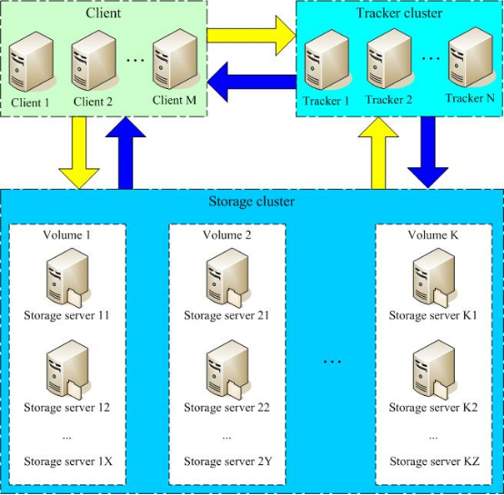
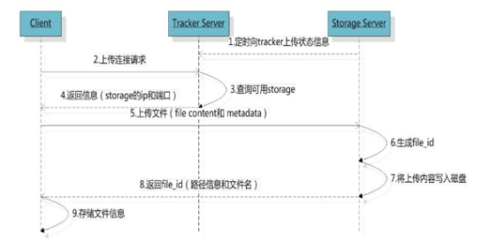
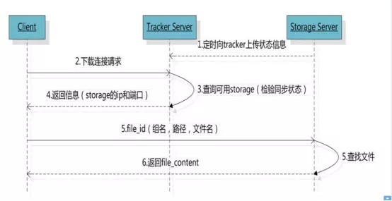

## 两个角色

* Storage    存储文件
* Tracker    存储节点 ,返回文件所在Storage的ip和端口，主要作用是负载均衡和资源调度。

**Tracker、Storage都可以集群部署**，Tracker的每个节点地位平等，而Storage可以分为多个组，**每个组保存的文件不同**，组内部分为多个成员，**每个成员保存的内容一样**

优点：支持横向扩展 ,可以存储大量文件，通过集群避免单点故障问题，用户不会因为服务器宕机而无法访问文件资源


## 上传下载

* 上传    Client向Tracker询问存储地址，Tracker查询到存储地址后返回给Client，Client拿着ip和端口和Storage通讯

 

* 下载    Client向Tracker询问地址，并带上要查询的文件名和组名，Tracker查询后会将地址返回给Client，Client拿着地址和指定Storage通讯并下载文件。




# 传统安装


* yum install git gcc gcc-c++ make automake autoconf libtool pcre pcre-devel zlib zlib-devel openssl-devel wget vim -y
* yum -y install make zlib-devel gcc-c++ libtool openssl openssl-devel

前置依赖环境

* yum install git

* docker pull season/fastdfs

* mkdir -p /data/fdfs

  创建存储目录

* 安装libfatscommon

  git clone https://github.com/happyfish100/libfastcommon.git --depth 1

  cd libfastcommon/

  ./make.sh && ./make.sh install

  cd ..

* 安装fastdfs

  git clone https://github.com/happyfish100/fastdfs.git --depth 1

  cd fastdfs/

  ./make.sh && ./make.sh install #编译安装

  cd ..

* 安装nginx

  wget http://nginx.org/download/nginx-1.15.4.tar.gz #下载nginx压缩包

  tar -zxvf nginx-1.15.4.tar.gz #解压

  cd nginx-1.15.4/

  #添加fastdfs-nginx-module模块
  ./configure --add-module=/data/fdfs/fastdfs-nginx-module/src/ 

  make && make install #编译安装		出现错误则 ./configure 

  cd /usr/local 查看nginx是否安装成功，成功则显示nginx目录

* 创建FastDFS存储目录

  mkdir -p /data/fdfs/{tracker_data,storage_data,store_path,fdfs_conf}

* 启动一个临时的tracker 拷贝storage.conf tracker.conf 至/var/fdfs/fdfs_conf

  docker run  -d --name tracker  --net=host season/fastdfs tracker

  docker ps  //查询到容器id 

  docker cp 容器ID:/fdfs_conf/tracker.conf /data/fdfs/fdfs_conf/ 

  docker cp 容器ID:/fdfs_conf/storage.conf /data/fdfs/fdfs_conf/
  
  

## 单机搭建


* tracker配置    vim /etc/fdfs/tracker.conf

port=22122   

 #存储日志和数据的根目录

base_path=/data/fdfs/tracker_data

* storage配置    vim /etc/fdfs/storage.conf

port=23000

 #数据和日志文件存储根目录 

base_path=/data/fdfs/store_path

#第一个存储目录 

store_path0=/data/fdfs/store_path

tracker_server=192.168.199.120:22122

http.server_port=80  # http访问文件的端口(**与nginx中保持一致)**

* client 配置    vim /etc/fdfs/client.conf

base_path=/data/fdfs/store_path 

tracker_server=192.168.199.120:22122    #tracker服务器IP和端口 

* 保存后测试,返回ID表示成功

fdfs_upload_file /etc/fdfs/client.conf /usr/local/src/nginx-1.15.4.tar.gz

* fastdfs配置    vim /etc/fdfs/mod_fastdfs.conf

tracker_server=192.168.199.120:22122  #tracker服务器IP和端口

url_have_group_name=true #是否使用group_name为前缀 

store_path0=/data/fdfs/store_path

* nginx配置    vim /usr/local/nginx/conf/nginx.conf

user root;              ##配置访问权限 

server {    

​	listen       80;    ## 该端口为storage.conf中的http.server_port相同   

​	server_name  192.168.199.120;    

​	location ~/group[0-9]/ {     

​		root /data/fdfs/storage_path/data;       

​		ngx_fastdfs_module;    }   


# Docker搭建

docker run -d --restart=always --privileged=true --net=host --name=fastdfs -e IP=120.76.132.188 -e WEB_PORT=80 -v ${HOME}/fastdfs:/var/local/fdfs registry.cn-beijing.aliyuncs.com/tianzuo/fastdfs


其中-v ${HOME}/fastdfs:/var/local/fdfs是指：将${HOME}/fastdfs这个目录挂载到容器里的/var/local/fdfs这个目录里。所以上传的文件将被持久化到${HOME}/fastdfs/storage/data里，-e WEB_PORT=80 指定nginx端口


**阿里云暴露22122-24000端口**


## 测试上传

//进入容器

docker exec -it fastdfs /bin/bash

//创建文件

echo "Hello FastDFS!">index.html

//测试文件上传

fdfs_test /etc/fdfs/client.conf upload index.html

返回的url ,访问后可以下载文件


# 整合maven项目


```
  <dependency>
      <groupId>net.oschina.zcx7878</groupId>
      <artifactId>fastdfs-client-java</artifactId>
      <version>1.27.0.0</version>
    </dependency>
    <!-- spring-core -->
    <dependency>
      <groupId>org.springframework</groupId>
      <artifactId>spring-core</artifactId>
      <version>4.3.25.RELEASE</version>
    </dependency>
```


创建 fdfs_client.conf

```
# 连接超时时间
connect_timeout=30
# 网络超时时间
network_timeout=60
base_path=/home/fastdfs
tracker_server=120.76.132.188:22122
log_level=info
use_connection_pool = false
connection_pool_max_idle_time = 3600
load_fdfs_parameters_from_tracker=false
use_storage_id = false
storage_ids_filename = storage_ids.conf
http.tracker_server_port=80
```


```
public static void main(String[] args) throws IOException, MyException {

        String uploadFilePath = "F:/女神异闻录5/1.jpg";
        //获取配置文件的绝对路径
        String filePath = new ClassPathResource("fdfs_client.conf").getFile().getAbsolutePath();

        ClientGlobal.init(filePath);
        // 2、创建一个 TrackerClient 对象。直接 new 一个。
        TrackerClient trackerClient = new TrackerClient();
        // 3、使用 TrackerClient 对象创建连接，获得一个 TrackerServer 对象。
        TrackerServer trackerServer = trackerClient.getConnection();
        // 4、创建一个 StorageServer 的引用，值为 null
        StorageServer storageServer = null;
        // 5、创建一个 StorageClient 对象，需要两个参数 TrackerServer 对象、StorageServer 的引用
        StorageClient storageClient = new StorageClient(trackerServer, storageServer);
        // 6、使用 StorageClient 对象上传图片。
        //扩展名不带“.”
        String[] strings = storageClient.upload_file(uploadFilePath, "jpg",
                null);
        // 7、返回数组。包含组名和图片的路径。
        for (String string : strings) {
            System.out.println(string);
        }
    }
```


# 整合boot

```
<dependency>
    <groupId>com.github.tobato</groupId>
    <artifactId>fastdfs-client</artifactId>
    <version>1.27.2</version>
</dependency>
```


创建配置类UploadProperties

```
@ConfigurationProperties(prefix = "upload")
@Data
public class UploadProperties {

    private String baseUrl;

    private List<String> allowTypes;
}
```


yml

```
fdfs:
  so-timeout: 2500       # 读取时间
  connect-timeout: 600   # 连接超时时间
  thumb-image:           # 缩略图
    width: 100
    height: 100
  tracker-list:          # tracker服务配置地址列表
    - 120.76.132.188:22122
upload:
  base-url: http://120.76.132.188/
  #自定义文件类型参考MIME手册
  allow-types:
    - image/jpeg
    - image/png
    - image/bmp
    - image/gif
```


创建工具类UploadService

```
@Component
@EnableConfigurationProperties(UploadProperties.class)
public class UploadService {

    private Log log = LogFactory.getLog(UploadService.class);
    @Autowired
    private FastFileStorageClient storageClient;
    @Autowired
    private UploadProperties prop;

    public String uploadImage(MultipartFile file) {
        // 校验文件类型
        String contentType = file.getContentType();
        if (!prop.getAllowTypes().contains(contentType)) {
            throw new RuntimeException("文件类型不支持");
        }
        // 校验文件内容
        try {
            BufferedImage image = ImageIO.read(file.getInputStream());
            if (image == null || image.getWidth() == 0 || image.getHeight() == 0) {
                throw new RuntimeException("上传文件有问题");
            }
        } catch (IOException e) {
            log.error("校验文件内容失败....{}", e);
            throw new RuntimeException("校验文件内容失败" + e.getMessage());
        }

        try {
            // 获取扩展名
            String extension = StringUtils.substringAfterLast(file.getOriginalFilename(), ".");
            // 上传
            StorePath storePath = storageClient.uploadFile(file.getInputStream(), file.getSize(), extension, null);
            // 返回路径	前缀+后缀
            return prop.getBaseUrl() + storePath.getFullPath();
        } catch (IOException e) {
            log.error("【文件上传】上传文件失败！....{}", e);
            throw new RuntimeException("【文件上传】上传文件失败！" + e.getMessage()); }}}
```


创建controller

```
@RestController
@RequestMapping("upload")
public class UploadController {

    @Autowired
    private UploadService uploadService;

    @RequestMapping("doUpload")
    public Map<String, Object> doUpload(MultipartFile mf) {
        System.out.println(mf.getOriginalFilename());
        Map<String, Object> map = new HashMap<String, Object>();
        String filePath = uploadService.uploadImage(mf);
        map.put("path", filePath);
        return map;}}
```


index.html

```
<!DOCTYPE html>
<html lang="en">
<head>
    <meta charset="UTF-8">
    <title>Title</title>
</head>
<body>
<h1>文件上传</h1>
<hr>
<form action="/upload/doUpload" method="post" enctype="multipart/form-data">
    <input type="file" name="mf">
    <input type="submit" value="上传">
</form>
</body>
</html>
```


# 整合boot2	不推荐

```
  <dependency>
      <groupId>net.oschina.zcx7878</groupId>
      <artifactId>fastdfs-client-java</artifactId>
      <version>1.27.0.0</version>
    </dependency>
    <!-- spring-core -->
    <dependency>
      <groupId>org.springframework</groupId>
      <artifactId>spring-core</artifactId>
      <version>4.3.25.RELEASE</version>
    </dependency>
```


创建yml

```
fastdfs:
  connect_timeout_in_seconds: 120
  network_timeout_in_seconds: 120
  charset: UTF-8
  #多个 trackerServer中间以逗号分隔
  tracker_servers: 120.76.132.188:22122 
```


创建工具类UploadService

```
@Component
public class UploadService {

    @Value("${fastdfs.tracker_servers}")
    private String tracker_servers;

    @Value("${fastdfs.connect_timeout_in_seconds}")
    private int connect_timeout;

    @Value("${fastdfs.network_timeout_in_seconds}")
    private int network_timeout;

    @Value("${fastdfs.charset}")
    private String charset;

    public Map<String,Object> upload(MultipartFile multipartFile) {
        if (multipartFile == null) {
            throw new RuntimeException("文件不能为空");
        }
        // 上传至fastDFS, 返回文件id
        String fileId = this.fdfsUpload(multipartFile);
        if (StringUtils.isEmpty(fileId)) {
            System.out.println("上传失败");
            throw  new RuntimeException("上传失败");
        }
        Map<String, Object> map=new HashMap<>();
        map.put("code",200);
        map.put("msg","上传成功");
        map.put("fileId",fileId);
        return map;
    }


    /**
     * 上传至fastDFS
     * @param multipartFile
     * @return 文件id
     */
    private String fdfsUpload(MultipartFile multipartFile) {
        // 初始化fastDFS的环境
        initFdfsConfig();
        // 获取trackerClient服务
        TrackerClient trackerClient = new TrackerClient();
        try {
            TrackerServer trackerServer = trackerClient.getConnection();
            // 获取storage服务
            StorageServer storeStorage = trackerClient.getStoreStorage(trackerServer);
            // 获取storageClient
            StorageClient1 storageClient1 = new StorageClient1(trackerServer, storeStorage);
            // 获取文件扩展名
            String originalFilename = multipartFile.getOriginalFilename();
            String extName = originalFilename.substring(originalFilename.lastIndexOf(".") + 1);
            // 上传
            String fileId = storageClient1.upload_file1(multipartFile.getBytes(), extName, null);
            return fileId;
        } catch (Exception e) {
            System.out.println(e);
            return null;
        }
    }

    /**
     * 初始化fastDFS的环境
     */
    private void initFdfsConfig() {
        try {
            ClientGlobal.initByTrackers(tracker_servers);
            ClientGlobal.setG_connect_timeout(connect_timeout);
            ClientGlobal.setG_network_timeout(network_timeout);
            ClientGlobal.setG_charset(charset);
        } catch (Exception e) {
            System.out.println(e);
        }
    }
}
```


创建UploadController

```
@RestController
@RequestMapping("upload")
public class UploadController {

    @Autowired
    private UploadService uploadService;

    public Map<String, Object> doUpload(MultipartFile mu) {
        System.out.println(mu.getOriginalFilename());
        Map<String, Object> map = uploadService.upload(mu);
        return map;
    }
}
```


index.html

```
<!DOCTYPE html>
<html lang="en">
<head>
    <meta charset="UTF-8">
    <title>Title</title>
</head>
<body>
<h1>文件上传</h1>
<hr>
<form action="/upload/doUpload" method="post" enctype="multipart/form-data">
    <input type="file" name="mf">
    <input type="submit" value="上传">
</form>
</body>
</html>
```


