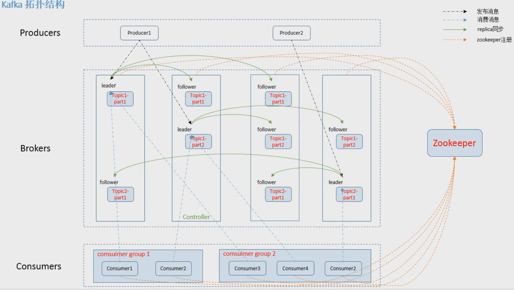

* 发布与订阅数据流
* 以实时的方式对事件进行响应
* 将数据以安全地存储在分布式的,可复制的,失败容错的集群中


为什么用kafka

* http调用: 3次握手,传输数据,4次挥手
* rpc调用: 建立长连接,传输数据
* 面向mq调用
  * 面向消息队列,双方没有耦合
  * http和rpc不支持异步处理
  * 削峰,过量的消息暂时存储在队列
  * 消息会被持久化,无论是否被消费过


高性能

* 顺序读写
* 零拷贝
* 分区
* 批量发送
* 数据压缩





用zk选举某个borker为某个topic的leader,不同topic可以有不同leader


* broker 一台kafka服务器

* topic 一个消息队列

* partition
  * topic可以存储在1~n个partition,n为broker数量,越接近n,代表负载均衡合理
  * partition内部数据流是有序的,但partition互相不能保证有序

* offset  partition中的数据根据offset来维护顺序

* Consumer Group消费者组
  * 一个partition分区中的消息只能被某一个消费者组中的一个消费者消费。这样设计的目的是为了提高消费者组的并发度。
    当一个消费者组中的消费者个数与主题的分区数一致时才最合理，如果消费者个数过多就造成了性能浪费。


在kafka中，Topic是一个存储消息的逻辑概念，可认为是一个消息的集合。而物理上，不同Topic的消息分开存储，每个Topic可划分多个partition，同一个Topic下的不同的partition包含不同消息。每个消息被添加至分区时，分配唯一offset，以此保证partition内消息的顺序性。

并且，kafka通过多副本复制技术，实现kafka集群的高可用和稳定性。每个partition都会有多个数据副本，每个副本分别存在于不同的broker。所有的数据副本中，有一个数据副本为Leader，其他的数据副本为follower。在kafka集群内部，所有的数据副本皆采用自动化的方式进行管理，并且确保所有的数据副本的数据皆保持同步状态。不论是producer端还是consumer端发往partition的请求，皆通过leader数据副本所在的broker进行处理。当broker发生故障时，对于leader数据副本在该broker的所有partition将会变得暂时不可用。Kafka将会自动在其他数据副本中选择出一个leader，用于接收客户端的请求。

在kafka的broker中，每个分区都会对照着文件系统的一个目录。在kafka的数据日志文件目录中，每个日志数据段都会分配两个文件，一个索引文件和一个数据文件。当前版本的kafka，每个broker会为每个日志段文件打开一个index文件句柄和一个数据文件句柄。因此，随着partition的增多，需要底层操作系统配置更高的文件句柄数量限制。这更多的是一个配置问题。


### 重复消费

1. kill线程  导致消费过的数据，offset没有提交（消费系统宕机、重启等）
2. 设置offset自动提交，关闭kafka时，如果在close之前，调用consumer.unsubscribe(), 则可能部分offset没提交，下次重启会重复消费

```java
try {
  consumer.unsubscribe();
} catch (Exception e) {
}

try {
  consumer.close();
} catch (Exception e) {
}
```


3. （最常见）消费后的数据，当offset还没有提交时，partition就断开连接

   比如,消费的数据，耗时超过了Kafka的session timeout,触发reblance，此时有一定几率offset没提交，会导致重平衡后重复消费

4. 消费者重新分配partition时，可能出现从头开始消费的情况，导致重发问题

5. 消费的速度很慢的时候，可能在一个session周期内还未完成，导致心跳机制检测报告出问题