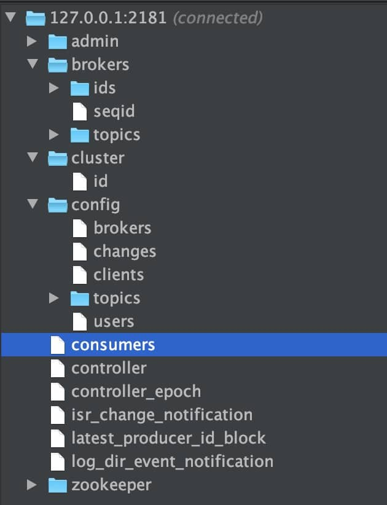

* 消息队列 发布与订阅数据流
* **流式处理平台** 在消息发布的时候进行处理，提供了一个完整的流式处理类库
* 消息持久化到磁盘,避免丢失

**极致的性能**：基于 Scala 和 Java 语言开发，设计中大量使用了批量处理和异步的思想，最高可以每秒处理千万级别的消息。

**生态系统兼容性无可匹敌**：与周边生态系统的兼容性是最好的


为什么用kafka

* http调用: 3次握手,传输数据,4次挥手
* rpc调用: 建立长连接,传输数据
* 面向mq调用
  * 面向消息队列,双方没有耦合
  * http和rpc不支持异步处理
  * 削峰,过量的消息暂时存储在队列
  * 消息会被持久化,无论是否被消费过


高性能

* 顺序读写
* 零拷贝
* 分区
* 批量发送
* 数据压缩


# 发布订阅模型

发布订阅模型（Pub-Sub） 使用**主题（Topic）** 作为消息通信载体，类似于**广播模式**；发布者发布一条消息，该消息通过主题传递给所有的订阅者，**在一条消息广播之后才订阅的用户则是收不到该条消息的**。

在发布-订阅模型中，如果只有一个订阅者，那它和队列模型就基本一致了;如果有**多个订阅者**,在发布订阅模型中,每个订阅者都能拿到**全量**的消息,而生产消费模型中,消费者会分摊消息,只能拿到**部分**的消息

> **RocketMQ 的消息模型和 Kafka 基本是完全一样的。唯一的区别是 Kafka 中没有队列这个概念，与之对应的是 Partition（分区）。**


1. **Producer（生产者）**

2. **Consumer（消费者）**

3. **Broker（代理）** : 可以看作是一个独立的 Kafka 实例。多个 Broker 组成Cluster

   * **Topic（主题）** : Producer 将消息发送到特定的主题，Consumer 通过订阅特定的 Topic(主题) 来消费消息。

   * **Partition（分区）** : Topic由1~n个Partition组成,n的最大值为broker的数量

     同一 Topic 下的 Partition 可以分布在不同的 Broker 上,实现负载均衡

     partition内部数据流是有序的,但partition互相不能保证有序


# ISR多副本机制

in-sync replica set

生产者和消费者只与 leader 副本交互,同时还有若干个follower 副本从 leader 副本中拉取消息进行同步

如果 follower长时间未向leader同步数据，则该 follower 将被踢出 ISR，该时间阈值由`replica.lag.time.max.ms`设定

当 leader 副本发生故障时会从 follower 中选举出一个 leader,但是 follower 中如果有和 leader 同步程度达不到要求的参加不了 leader 的竞选


## ACK机制

对于某些不太重要的数据,没必要等 ISR 中的 follower 全部接收成功才返回ack


**acks 参数配置**：

- 0： producer 不等待 broker（或者说是leader）的 ack， broker一接收到还没有写入磁盘的数据就已经返回，当 broker 故障时有可能丢失数据；
- 1： producer 等待 broker 的 ack， partition 的 leader 落盘成功后返回 ack，如果在 follower同步成功之前 leader 故障，那么将会丢失数据；
- -1（all）： producer 等待 broker 的 ack， partition 的 leader 和 ISR 里的follower 全部落盘成功后才返回 ack。但是如果在 follower 同步完成后， broker 发送 ack 之前， leader 发生故障，那么会造成数据重复。（假如ISR中没有follower，就变成了 ack=1 的情况）


# offset

消息在被追加到 Partition(分区)的时候都会分配一个特定的偏移量（offset）。偏移量（offset)表示 Consumer 当前消费到的 Partition(分区)的所在的位置。Kafka 通过偏移量（offset）可以保证消息在分区内的顺序性

- 自动提交
  - enable.auto.commit：是否开启自动提交 offset 功能，消费者只在启动的时候去访问offset的值，如果将该值配置为false，就要手动提交offset，否则offset就不会更新。
  - auto.commit.interval.ms：自动提交 offset 的时间间隔
- 手动提交
  - commitSync（同步提交）
  - commitAsync（异步提交）
  - 两者的相同点是：都会将本次 poll 的一批数据最高的偏移量提交；
  - 不同点是：commitSync 阻塞当前线程，一直到提交成功，并且会自动失败重试（由不可控因素导致，也会出现提交失败）；而 commitAsync 则没有失败重试机制，故有可能提交失败。
  - 无论是同步提交还是异步提交 offset，都有可能会造成数据的漏消费或者重复消费。先提交 offset 后消费，有可能造成数据的漏消费；而先消费后提交 offset，有可能会造成数据的重复消费。


# Zookeeper在Kafka中的作用

> **要想搞懂 zookeeper 在 Kafka 中的作用 一定要自己搭建一个 Kafka 环境然后自己进 zookeeper 去看一下有哪些文件夹和 Kafka 有关，每个节点又保存了什么信息。** 一定不要光看不实践，这样学来的也终会忘记！这部分内容参考和借鉴了这篇文章：https://www.jianshu.com/p/a036405f989c 。

下图就是我的本地 Zookeeper ，它成功和我本地的 Kafka 关联上（以下文件夹结构借助 idea 插件 Zookeeper tool 实现）。



ZooKeeper 主要为 Kafka 提供元数据的管理的功能。

从图中我们可以看出，Zookeeper 主要为 Kafka 做了下面这些事情：

1. **Broker 注册**：在 Zookeeper 上会有一个专门**用来进行 Broker 服务器列表记录**的节点。每个 Broker 在启动时，都会到 Zookeeper 上进行注册，即到 `/brokers/ids` 下创建属于自己的节点。每个 Broker 就会将自己的 IP 地址和端口等信息记录到该节点中去
2. **Topic 注册**：在 Kafka 中，同一个**Topic 的消息会被分成多个分区**并将其分布在多个 Broker 上，**这些分区信息及与 Broker 的对应关系**也都是由 Zookeeper 在维护。比如我创建了一个名字为 my-topic 的主题并且它有两个分区，对应到 zookeeper 中会创建这些文件夹：`/brokers/topics/my-topic/Partitions/0`、`/brokers/topics/my-topic/Partitions/1`
3. **负载均衡**：上面也说过了 Kafka 通过给特定 Topic 指定多个 Partition, 而各个 Partition 可以分布在不同的 Broker 上, 这样便能提供比较好的并发能力。 对于同一个 Topic 的不同 Partition，Kafka 会尽力将这些 Partition 分布到不同的 Broker 服务器上。当生产者产生消息后也会尽量投递到不同 Broker 的 Partition 里面。当 Consumer 消费的时候，Zookeeper 可以根据当前的 Partition 数量以及 Consumer 数量来实现动态负载均衡


# 最佳实践


## 消息有序

1. **1 个 Topic 只对应1个 Partition**,这样就跟普通的消息队列一样了
2. 针对不同的消息类型,**指定不同的partition**. partition内部是有序的, 各个店铺按seller_id的hash值分配到指定的partition,就可以实现店铺内的消息有序


## 消息丢失

### 生产者丢失消息的情况

生产者调用`send`方法发送消息之后，消息可能因为网络问题并没有发送过去。

需要在调用`send`后通过 `get`获取调用结果，但这会让异步的发送变为了同步操作

```java
SendResult<String, Object> sendResult = kafkaTemplate.send(topic, o).get();
if (sendResult.getRecordMetadata() != null) {
  logger.info("发送消息到" + sendResult.getProducerRecord().topic() + "-> " + sendResult.getProducerRecord().value().toString());
}
```


为future添加回调函数,则可以保持消息发送的异步性,当消息发送失败时，我们检查失败的原因之后重新发送即可

```java
ListenableFuture<SendResult<String, Object>> future = kafkaTemplate.send(topic, o);
future.addCallback(result -> logger.info("生产者成功发送消息到topic:{} partition:{}的消息", result.getRecordMetadata().topic(), result.getRecordMetadata().partition()),
                   ex -> logger.error("生产者发送消失败，原因：{}", ex.getMessage()));
```


**Producer 的`retries `（重试次数）设置一个比较合理的值，一般是 3 ，还要设置重试间隔**


### 消费者丢失消息的情况

消费者自动提交 offset后,在进行真正消费时宕机了,就导致offset已变更,但消息没有被消费

**方案: 手动提交 offset** 但这会带来重复消费的问题。比如刚刚消费完消息之后，还没提交 offset，结果自己挂掉了，那么这个消息理论上就会被消费两次


### Kafka 弄丢了消息

**leader 副本所在的 broker 突然挂掉，部分数据还未同步至follower,新选举出的leader上就会有消息丢失**

**设置 acks = all**

acks 的默认值即为 1，代表我们的消息被 leader 副本接收之后就算被成功发送。当我们配置 **acks = all** 表示所有副本全部收到消息时，生产者才会接收到来自服务器的响应. 这种模式可以避免主从复制的消息丢失,但延迟比较高

**设置 replication.factor >= 3**

为了保证 leader 副本能有 follower 副本能同步消息，我们一般会为 topic 设置 **replication.factor >= 3**。这样就可以保证每个 分区(partition) 至少有 3 个副本。虽然造成了数据冗余，但是带来了数据的安全性

**设置 min.insync.replicas > 1**

一般情况下我们还需要设置 **min.insync.replicas> 1** ，这样配置代表消息至少要被写入到 2 个副本才算是被成功发送。**min.insync.replicas** 的默认值为 1 ，在实际生产中应尽量避免默认值 1

但是，为了保证整个 Kafka 服务的高可用性，你需要确保 **replication.factor > min.insync.replicas** 。为什么呢？设想一下假如两者相等的话，只要是有一个副本挂掉，整个分区就无法正常工作了。这明显违反高可用性！一般推荐设置成 **replication.factor = min.insync.replicas + 1**

**设置 unclean.leader.election.enable = false**

在leader 副本发生故障时,禁止从未完全同步的follower副本中选举出leader，这样降低了消息丢失的可能性


## 重复消费

1. 消费系统宕机/kill线程  导致offset没有提交
2. （最常见）消费后的数据，当offset还没有提交时，partition就断开连接.比如,消费的数据，耗时超过了Kafka的session timeout,触发reblance，此时有一定几率offset没提交，会导致重平衡后重复消费
3. 消费者重新分配partition时，可能出现从头开始消费的情况，导致重发问题
4. 消费的速度很慢的时候，可能在一个session周期内还未完成，导致心跳机制检测报告出问题


**解决方案：**

- 消费消息服务做幂等校验，比如 Redis 的 set、MySQL 的主键等天然的幂等功能。这种方法最有效。
- 关闭自动提交，但存在重复消费的问题
  - 处理完消息再提交：依旧有消息重复消费的风险，和自动提交一样
  - 拉取到消息即提交：会有消息丢失的风险。允许消息延时的场景，一般会采用这种方式。然后，通过定时任务在业务不繁忙（比如凌晨）的时候做数据兜底


## 消息遇到网络问题

下单的消息发送失败, 会导致消费者无法消费付款的消息


异步重试: 处理失败的消息放到一张专门的表. 消费消息时,先判断这个订单号在失败表里有没有数据, 有则直接插入失败表,没有才进行后续业务逻辑


## 消息积压

从producer->broker,一次网络io,一次磁盘io

从broker->consumer,一次磁盘io,一次网络io

io的次数比较多,可以在发消息时只传关键的字段,避免消息的报文过大


在上面我是按商家编号区分partition的,后来发现部分商家的订单量过于庞大,出现了部分partition积压,部分partition空闲的情况

后来改为按订单号区分partition


