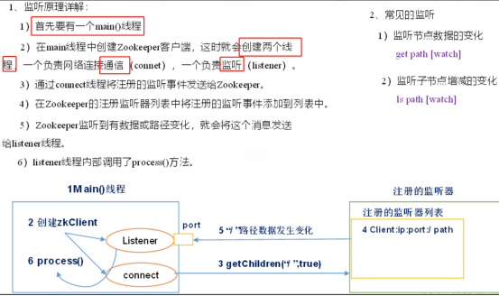
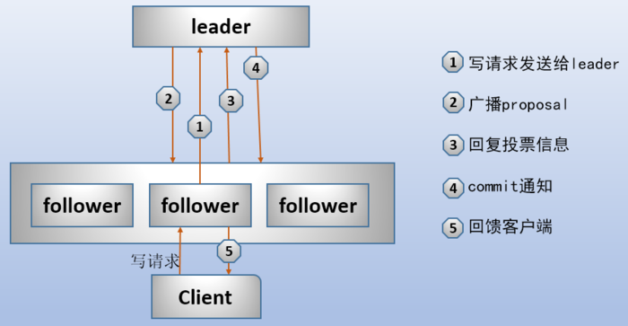
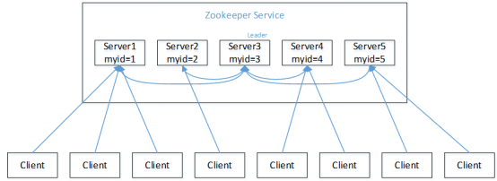
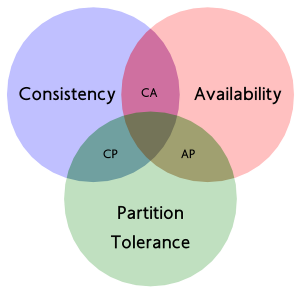

# 概述


分布式协调服务，**高性能的分布式数据一致性的解决方案**

分布式是指：把计算任务分解成若干个计算单元，并分派到不同的计算机中去执行，最终汇总计算结果的过程


* 数据发布/订阅
  * 推模式  服务器主动往客户端推送信息
  * 拉模式  客户端主动去服务端请求目标数据（定时轮询）

Zookeeper采用两种方式结合：发布者将数据发布到Zookeeper集群节点上，订阅者订阅节点，那么在服务端数据发生变化时，通知客户端去获取这些信息

* 负载均衡
  * 提供者启动的时，注册临时节点。宕机时，节点会自动的从zookeeper上删除，保证可用性
  * 客户端在需要访问服务器的时,首先获得所有可用的服务端的连接信息,通过策略选择一个建立连接
  * 客户端发现连接不可用时，会再次从zookeeper上获取可用的服务端连接，并同时删除之前获取的连接列表

* 命名服务
  * 提供接口可以用来获取一个顺序增长的，可以在集群环境下使用的id

* 分布式协调，通知，心跳服务
  * 判断一个服务是否可用，只需要判断这个节点是否在zookeeper集群中存在

* 配置管理
  * 配置全部放到某个节点，所有相关应用程序订阅这个节点，一旦配置信息发生变化，获取新的配置信息

* 服务动态上线


## 4种znode：


每个子目录项都被称作为znode(目录节点)，==znode本身可以存储数据(文件夹本身能存数据)==

* **PERSISTENT	持久化目录节点**    断开连接后，节点依旧存在
* **PERSISTENT_SEQUENTIAL	持久化顺序编号目录节点**  断开连接后，节点依旧存在，进行顺序编号
* **EPHEMERAL	临时节点**  断开连接后，删除
* **EPHEMERAL_SEQUENTIAL	临时顺序编号目录节点**


## Observer


Observer，除了没有投票功能外，其它和follower一样


* 优点
  * 不参与投票,减轻了投票性能消耗
  * 提高了伸缩性,可以通过添加服务器来负载请求
  * 部署跨地区的ZooKeeper更方便
    * observer能直接从本地内存数据库中取出数据来响应读请求，提高读的吞吐量
  * 在出现Observer之前，伸缩性由follower来实现。
    * 虽然对于读写操作来说，follower是"无状态"的。但**对于投票来说，follower是有状态的**，增、减follower的数量，都直接影响投票结果，特别是follower的数量越多，投票过程的性能就越差
    * observer无论是读写请求还是投票，都是无状态的，observer数量不影响投票结果。这样就可以让一部分server作为follower参与投票，另一部分作为observer单纯地提供读写服务

```shell
#vim想要成为observer的配置文件
peerType=observer

#在所有 server的配置文件中，修改server.X配置项，在那些observer的节点上加上:observer后缀。
server.1=IP:2181:3181:observer
#这样配置后，所有节点都知道哪些节点是observer
```


## 监听器原理




# 安装


```shell
#配置java环境变量

#解压并修改位置
tar -zxvf zookeeper-3.4.14.tar.gz -C /usr/local
cd /usr/local/
mv zookeeper-3.4.14/ zookeeper

#修改配置文件
cd /usr/local/zookeeper/conf
#修改zoo_sample.cfg 为zoo.cfg [一定要改]
mv zoo_sample.cfg  zoo.cfg
#编辑zoo.cfg
vi zoo.cfg

dataDir=/usr/myzk1/data
ClientPort=2181
```


```shell
#启动
/usr/local/zookeeper/bin/zkServer.sh start
#停止
/usr/local/zookeeper/bin/zkServer.sh stop
#查看zk的运行状态
/usr/local/zookeeper/bin/zkServer.sh status
#连接
/usr/local/zookeeper/bin/zkCli.sh
```


# 指令


```shell
create [-s] [-e] path data acl		创建节点
	-s	顺序节点	在节点后面加上数字序号
	-e	临时节点。默认创建持久节点
	path节点路径，data节点数据，acl权限控制

get	/节点	获取指定节点的内容/属性

get	/节点	watch	节点监控

set path data 更新节点内容

delete	/节点		删除节点,存在子节点时无法删除,要用rmr path 删除当前节点及子节点

```


# 配置


```shell
#毫秒	心跳时间	最小的session超时时间为两倍心跳时间
tickTime =2000

#Follower跟随者与Leader初始连接时能容忍的最多心跳数，限定集群中的Zookeeper连接到Leader的时限
initLimit =10	LF连接时限

#Leader与Follower最大响应时间单位，超过syncLimit * tickTime，从服务器列表中删除Follwer。
syncLimit =5	LF同步通信时限

#数据文件目录+数据持久化路径,主要用于保存Zookeeper中的数据
dataDir

#监听客户端连接的端口
clientPort =2181
```


# 集群搭建


| 机器编号 | Ip 地址         | 端口 |
| -------- | --------------- | ---- |
| Zk-1     | 192.168.186.128 | 2181 |
| Zk-2     | 192.168.186.128 | 2182 |
| Zk-3     | 192.168.186.128 | 2183 |


```shell
#复制3份zookeeper,每个创建2个目录,1个文件
#创建data数据目录
mkdir /usr/local/zookeeper-cluster/zk1/data
#创建myid文件,写入id号
vim /usr/local/zookeeper-cluster/zk1/data/myid

1	(id号)

#创建log日志目录
mkdir /usr/local/zookeeper-cluster/zk1/log

#修改配置文件
#数据目录，三个zk数据目录要不同
dataDir=/usr/local/zookeeper-cluster/zk1/data
#日志目录,可以相同
dataLogDir=/usr/local/zookeeper-cluster/zk1/log
# zookeeper 的client的端口号
clientPort=2181

# 集群额外的配置
# 第几个服务器（1，2，3来自数据目录的一个myid文件，该文件里面保存着当前集群的标识（1，2，3））
# 第一个端口：集群内部数据复制的端口 第二个端口代表：选举端口端口可以重复,但复制和选举不能相同端口
server.1=192.168.186.128:2888:3888
server.2=192.168.186.128:2889:3889
server.3=192.168.186.128:2887:3887
```


# 处理请求


集群中的每个server(包括observer)都能为客户端提供读、写服务。

* 对于客户端的读请求，server直接从它本地的内存数据库中取出数据返回给客户端，不联系leader

* 对于客户端的写请求，需要修改znode，必须在集群中进行协调
  * 收到写请求的server将请求发送给leader
  * leader收到写请求后，==首先计算这次写操作之后的状态，然后将请求转换成带有状态的事务(版本号、zxid)==
  * leader将这个事务以提案的方式广播出去(proposal)
  * 所有follower收到proposal后，进行投票，投票完成后**返回ack给leader**
    * 投票两种方式：(1)确认提案；(2)丢弃提案表示不同意
  * leader收集投票结果，投票过半提案通过,leader向所有server发送commit提交通知
  * 所有节点将事务**写入事务日志，并提交**
  * 提交后，收到写请求的那个server向客户端返回成功信息




# 选举（Paxos算法）


配置文件没有指定Master和Slave。工作时临时产生Leader

 

* 初始阶段,所有server都投给自己

* 半数机制：半数以上机器存活，集群可用。需要**奇数**台服务器

* id机制:未决定leader的情况下,优先投大id

 



- Server1->5顺序启动

（1）服务器1启动，此时只有一台服务器，发出去的报文没有响应，LOOKING选举状态

（2）服务器2启动，与最开始启动的服务器1进行通信，互相交换自己的选举结果，由于两者都没有历史数据，所以id值较大的服务器2胜出，但是没有超过半数以上的服务器都同意选举它，继续LOOKING

（3）服务器3启动

第一轮:	1->1	2->2	3->3

第二轮:	1->3	2->3	3->3

3获得超过半数的票,成为leader

（4）服务器4启动，虽然id最大，但是已经有半数以上选举了服务器3，所以它只能following

（5）服务器5启动，同4一样following

 

- Server5->1启动

（1/2）服务器5/4启动，不满足半数,选举状态一直是LOOKING状态

（3）服务器3启动

第一轮:	5->5	4->5	3->5

5获得超过半数的票,成为leader


从id较大的server开始启动,一轮完成投票

==投票是极其消耗时间的,可以通过serverID从大到小启动来加速投票==


# CAP/一致性


CAP只能满足两项，P是必须的

* 一致性（C:Consistency）
  * 强一致性：任何时刻都最新
  * 单调一致性：不会再读到更旧的值。**获取的数据版本单调递增**
  * 会话一致性：本次会话中不会读到更旧的值
  * 最终一致性：只能读到某次更新后的值，但系统保证数据将最终达到完全一致的状态，所需时间不确定
  * 弱一致性：无法在确定时间内读到最新的值

* 可用性（A:Available）
  * 请求总能在有限的时间内返回结果

* 分区容错性（P:Partition Tolerance）
  * 遇到任何网络分区故障的时候，仍能对外提供满足一致性和可用性的服务，除非整个网络故障
    * 网络分区指节点分布在不同子网络中，由于特殊原因子网络之间不连通，但子网络的内部正常，导致网络环境被切分成了若干个孤立的区域
    * 分布式系统中节点的加入/退出都可以看作网络分区




## ZooKeeper的一致性


* 顺序一致性：客户端的更新**按发送顺序提交**。属于**单调一致性**

* 原子性：要么成功，要么失败。失败则不会有客户端会看到更新

* 单一系统映像：客户端无论连到哪一台服务器，看到的都是同样的系统视图。这意味着，如果一个客户端在同一个会话中连接到一台新的服务器，它所看到的系统状态不会更老。当服务器故障，导致客户端需要连接其他服务器时，所有滞后于故障服务器的服务器都不会接受请求

* 持久性：更新操作是持久的,不受到服务器故障影响

* 实时性：在特定时间内，客户端看到的系统需要被保证是实时的（十几秒）。任何系统的改变将被客户端看到

* 访问请求能得到一致的数据结果，对网络分割具备容错性


==ZooKeeper不能保证可用性==（可能会丢弃请求，需要重新请求才能获得结果,**进行leader选举时集群不可用**）


# java


```
		<dependency>
			<groupId>com.101tec</groupId>
			<artifactId>zkclient</artifactId>
			<version>0.11</version>
		</dependency>
```


增删改查

```java
创建create
修改writeData
查询readData
删除delete
public class TestCRUD {
	private static final String SERVERSTRING = "192.168.33.115:2181,192.168.33.115:2182,192.168.33.115:2183";
	private static ZkClient zkClient=null;
	static {zkClient=new ZkClient(SERVERSTRING,10000,10000);}
	public static void main(String[] args) {}
}
```


监听节点之前需要序列化

```java
public class CustomerSerializer implements ZkSerializer {

	private String charset = "UTF-8";
	
	public CustomerSerializer() {
	}
	public CustomerSerializer(String charset) {
		this.charset = charset;
	}
	/**
	 * 序列化
	 */
	@Override
	public byte[] serialize(Object data) throws ZkMarshallingError {
		try {
			byte[] bytes = String.valueOf(data).getBytes(charset);
			return bytes;
		} catch (UnsupportedEncodingException e) {
			throw new ZkMarshallingError("Wrong Charset:" + charset);
		}
	}
	/**
	 * 反序列化
	 */
	@Override
	public Object deserialize(byte[] bytes) throws ZkMarshallingError {
		String result = null;
		try {
			result = new String(bytes, charset);
		} catch (UnsupportedEncodingException e) {
			throw new ZkMarshallingError("Wrong Charset:" + charset);	}
		return result;}}
```


监听

```java
public class TestWatch {
	private static final String SERVERSTRING = "192.168.33.115:2181,192.168.33.115:2182,192.168.33.115:2183";
	private static ZkClient zkClient=null;
	
	static {
		zkClient=new ZkClient(SERVERSTRING,10000,10000,new CustomerSerializer());
	}
	public static void main(String[] args) throws IOException {
		
		//监听当前节点的改变和删除事件
		zkClient.subscribeDataChanges("/sanguo", new IZkDataListener() {
			
			/**
			 * 当dataPath被删除时回调用的方法
			 */
			@Override
			public void handleDataDeleted(String dataPath) throws Exception {
				System.out.println("handleDataDeleted:"+dataPath);
			}
			
			/**
			 * 当dataPath这个节点的数据发生改变时回调用
			 * data:改变这之后的值
			 */
			@Override
			public void handleDataChange(String dataPath, Object data) throws Exception {
				System.out.println("handleDataChange:"+dataPath+"  "+data);
			}
		});
		
		//监听子节的变化
		zkClient.subscribeChildChanges("/sanguo", new IZkChildListener() {
			
			/**
			 * parentPath父节点路径
			 * currentChilds  当前父节点下面的所有子节点
			 */
			@Override
			public void handleChildChange(String parentPath, List<String> currentChilds) throws Exception {
				
			}
		});
		System.out.println("监听启动成功");
		System.in.read();//不让程序结束	}}
```


