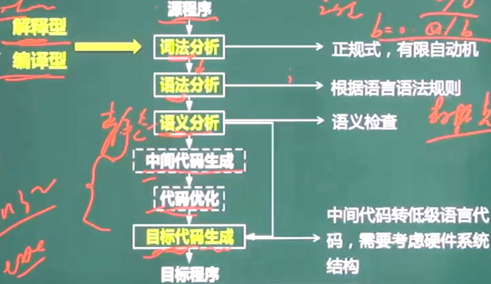

# 解释与编译

* **解释程序和源程序要参与到程序的运行**过程中，运行程序的控制权在解释程序。解释器翻译源程序时不产生独立的目标程序 ,如html,python

* 编译:  运行的是与源程序等价的目标程序，源程序和编译程序都**不再参与**目标程序的执行过程；

* 词法:    非法字符/关键字/变量是否被定义或声明

* 语法:    语法结构,if endif不匹配

* 语义     动态语义:死循环/逻辑错误 ,强制转换

  ​			静态语义 ,a/b ,b=0

# 文法

有序四元组G=(V ,T ,S ,P)

V	非终结符 ,类似于占位符 ,不是语言组成部分 ,不是最终结果

T	终结符	是最终结果	V交T =空集

S	起始符	语言的开始符号

P	产生式	用终结符替代非终结符的规则 ,如a->b

* 闭包			A+	1~n个a的并集
* 正则闭包	A*	0~n个a的并集

0型 短语文法         ->图灵机

1型 上下文有关文法->线性界线自动机

2             无关     ->非确定的下推自动机

3    正规文法          ->有限自动机

设某语言的语法规则用上下文无关文法G=(N，T，P，S)表示，其中N是非终结符号的集合，T是终结符号的集合，P是产生式集合，S是开始符号，令V=NUT,那么符合该语言的句子是（50)。

(50)A.从S出发推导的、仅包含T中符号的符号串

B.从N中符号出发推导的、仅包含T中符号的符号串	

C.从S出发推导的、包含V中符号的符号串

 	D.从N中符号出发推导的、包含V中符号的符号串

***\*【答案】A\****

***\*【解析】本题考査程序语言方面的基础知识。\****

一个文法的语言是该文法能产生的句子的集合。一个文法产生的句子是从文法开始符号出发推导出的所有终结符号串。

# 语法推导树

推导树以S起始符为根结点

每个结点都有一个标记 ,此标记是V的一个符号

由题得S->Aas     S->a      A->SbA   A->SS    A->ba

**V=a,b 非终结符	T=S,A 终结符**	

开始推导

S->aAS,又因为A->SbA,所以S->a(SbA)S

又因为S->a,所以S-> a(abA)a->aabAa

# 有限自动机 (词法分析)

能用闭包等符号表示出来的是**确定的有限自动机**

# 正规式

# 数据类型与程序控制结构

顺序结构	选择结构	循环结构

# 后缀表达式

转化为二叉树 ,再后序遍历

# 传值 传址

形参为*a时 ,代表传址

# 各种程序语言特点

c语言   编译型   全局/静态局部/静态全局变量都放在静态数据存储区

**php 动态网页     不是标记语言**

标记语言常用于描述格式化和链接

脚本语言采用解释方式实现,代表一套与程序设计语言不同的协议,牺牲执行速度和与程序设计语言相关的类型长度而提供更高的编程创作能力和软件复用,脚本语言都是动态语言,动态语言都是解释性语言

编译性语言的执行效率更高

 

动态语言:在程序运行时可以改变结构,新的函数被引进,已有的函数被删除等等.动态语言的类型检查在运行时进行,能够方便阅读,不需要写很多与类型相关的代码,缺点是不方便调试,命名不规范时会读不懂

# 开发模型

## 瀑布模型	线性/里程碑

三个阶段

* 定义

  ​	软件计划	可行性分析

  ​	需求分析	需求规格说明书

* 开发

​		软件设计	分为概要/详细设计 ,生成概要/详细设计说明书

​		程序编码	

​		软件测试	

* 维护

 		运行维护

适用于需求已明确的,很少需求变动

**测试在编码之后**,没有把测试提前

## V模型	重视测试

单元测试以详细设计为依据,主要测试编码中的问题……以此类推

**验收测试由用户主导**

**并没有解决瀑布模型中测试过于靠后的问题** ,把测试放在了编码之后

# 喷泉模型

**面向对象**

**每个阶段并没有明确的界限** ,能做到一定程度上并行,提高效率 ,从而**方便迭代**

## 原型化模型

用户难以表达需求 通过与用户沟通产生原型,用原型再与用户沟通 ,矫正为用户想要的模型

原型不能用于指导代码优化

探索型原型	探索模型

实验型原型	验证模型的正确性

演化型原型	演化出最终需要的产品

# 螺旋模型

基于原型+瀑布	额外强调**风险分析**,提高了成本

# 统一过程

统一过程:	用例驱动/架构为中心/迭代和增量

四个阶段:

* 初始
  * 确定项目的**范围和边界**
  * 识别系统的**关键用例**
  *  展示系统的候选**架构**
  * 估计项目**费用和时间**
  * 评估项目**风险**

* 细化
  * 分析系统问题领域
  * 建立软件架构基础
  * 淘汰最高风险元素

* 构建
  * 开发剩余的构件		
  * 构件组装与测试

* 交付

  * 进行贝塔测试

  * 制作发布版本
  * 用户文档定稿
  * 确认新系统
  * 培训 ,调整产品

# 敏捷方法

敏捷方法中，**重构是**一种重新组织技术，重新审视需求和设计，重新明确地描述它们以符合新的和现有的需求，可以**简化构件的设计而无需改变其功能或行为**

* 自适应开发ASD     三个非线性,重叠的开发阶段 :猜测 ,合作 ,学习

* 水晶法            用**最少的纪律**约束 ,**经常交付**,每一种项目都要有**不同策略**
* 功用驱动开发FDD     短时间迭代 ,开发人员分为两类 ,首席程序员和类程序员
* 极限编程             费用控制严格
* 开放式源码     开发人员在地域上分布很广
* 并列争球SCRUM      明确**定义可重复**的方法过程 ,**迭代,增量交付**

## 4大价值观

沟通	简单	反馈	勇气

## 5大原则

快速反馈	简单性假设	逐步修改	提倡更改	优质工作

## 12大最佳实践

结对编程

集体代码所有制

隐喻			

简单设计:只处理当前需求,使设计保持简单

每周工作40小时

测试先行:先写测试代码,然后再编写程序

持续集成:可以随时为客户提供可运行的版本

现场客户:系统最终用户代表应全程配合xp团队

计划游戏:快速制定计划,随细节的变化不断完善

小型发布:系统的设计要尽可能早地发布

隐喻:找到合适的比喻传达信息

现场客户

重构

编码标准

## 基本原则

**短平快的会议**

**合作为重**

**客户直接参与**

**自动化测试**

小型版本发布

较少的文档

适应性计划调整

结对编程

测试驱动开发

持续集成

**重构**

# 内聚/耦合

功能内聚:	完成单一功能,各个部分协同工作,缺一不可

顺序内聚:	处理元素相关,并且必须顺序执行

通信内聚:	所有处理元素集中在一个数据结构的区域上

过程内聚:	处理元素相关,按特定的次序执行

瞬时内聚:	所包含的任务必须在同一时间内运行

逻辑内聚:	完成逻辑上相关的一组任务

偶然内聚:	完成一组没有关系或松散的任务

 

数据耦合:	模块通过数据参数交换信息

标记耦合:	模块通过参数表传递记录信息

控制耦合:	模块彼此间传递的信息中有控制信息

内容耦合:	模块需要涉及到另一个模块的内部信息

# 软件调试

* 归纳法：从测试所暴露的问题出发，收集所有正确或不正确的数据，分析他们之间的关系，提出假想的错误原因，用这些数据来证明或反驳，从而查出错误所在。

* 试探法 

* 回溯法

* 对分查找法：前提条件:已经知道程序中的变量在若干位置的正确取值,可以用来缩小错误范围，

* 演绎法：根据测试结果，列出所有可能的错误；分析已有的数据，排除不可能和彼此矛盾的原因；对其余的原因，选择可能性最大的，利用已有的数据完善该假设，使假设更具体

# 开发方法

* 结构化方法	**面向数据流**  用数据流图描述
  * 用户至上
  * 严格区分工作阶段 ,每阶段有任务和结果
  * 强调系统开发过程的整体性和全局性
  * 系统开发过程工程化 ,文档资料标准化
  * **自顶向下 ,逐步分解** (精益求精)
  * **不适用于大型软件**

* 原型法
* 面向数据结构    Jackson

* 面向对象方法    喷泉
  * 更好的复用性
  * 建立全面 ,合理 ,统一的模型
  * 分析 ,设计 ,实现三个阶段的界限不明确

* 面向服务方法SOA
  * 

# 需求分析

# 软件设计

* 内聚 高->低

功能 > 信息 > 通信 > 过程 > 时间/瞬时 > 逻辑 > 巧合/偶然

顺序内聚按顺序	**过程内聚按特定的顺序**

* 耦合 高->低

内容 > 公共 > 外部 > 控制 > 标记 > 数据 > 非直接

模块**被调用的次数越多 ,说明这个模块越独立**

### 应用工具

IPO图	输入处理输出图

PDL		程序描述语言(伪代码)

PAD		问题分析图

程序流程图	

N/S盒图					

PAD ,程序流程图 ,N/S盒图	三者可以互相转化 ,都用于分析问题

# 软件维护

可理解性 ( 文档 )

可测试性

可修改性

## 维护类型

改正性维护	25%	改正系统发布前的问题

适应性维护	20%	环境发生变化 ,进行适应环境的修改

预防性维护	5%		

**完善性维护**	50%	扩充功能 ,改善性能

## 文档分类

* 开发文档
  * 可行性研究和项目任务书
  * 需求规格说明
  * 功能规格说明
  * 设计规格说明 ( 包括程序和数据规格说明)
  * 开发计划
  * 软件集成和测试计划
  * 质量保证计划,标准 ,进度
  * 安全和测试信息

* 产品文档
  * 培训手册
  * 参考手册和用户指南
  * 软件支持手册
  * 产品手册和信息广告

* 管理文档
  * 开发过程的每个**阶段的进度和进度变更的记录**
  * 软件变更情况的记录
  * 相对与开发的判定记录
  * 职责定义

## 质量保证

* 功能性
  * 适合性
  * 准确性
  * 互操作性
  * 安全保密性
  * 功能性的依从性

* 可靠性
  * 成熟性
  * 容错性
  * 易恢复性
  * 可靠性的依从性

* 易用性
  * 易理解性
  * 易学性
  * 易操作性
  * 吸引性
  * 易用性的依从性

* 效率
  * 时间特性
  * 资源利用性
  * 效率依从性

* 维护性
  * 易分析性
  * 易改变性
  * 稳定性
  * 易测试性
  * 维护性的依从性

* 可移植性
  * 适应性
  * 易安装性
  * 共存性
  * 易替换性
  * 可移植的依从性

## 过程改进	软件成熟度CMMI

* 初始级

* 可管理级	纪律化的过程

* 已定义级	标准一致的过程

* 定量管理级	可预测的过程

* 优化管理级	不断改进

# 项目管理	十大知识领域

* 范围管理
* **时间管理**
* 成本管理
* 质量管理
* 人力资源管理
* 沟通管理
* 风险管理
* 采购管理
* 整体管理
* 项目干系人管理

## 横道图 (甘特图)

粗线条代表计划		细线条代表实际

## 关键路径

## 双代号网络图 ADM

虚线代表虚工作 ,不占用时间和资源 ,只表示制约关系

## 风险

风险曝光度 = 风险概率 * 损失

