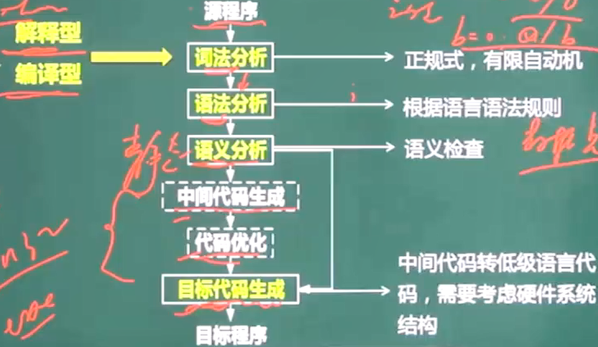
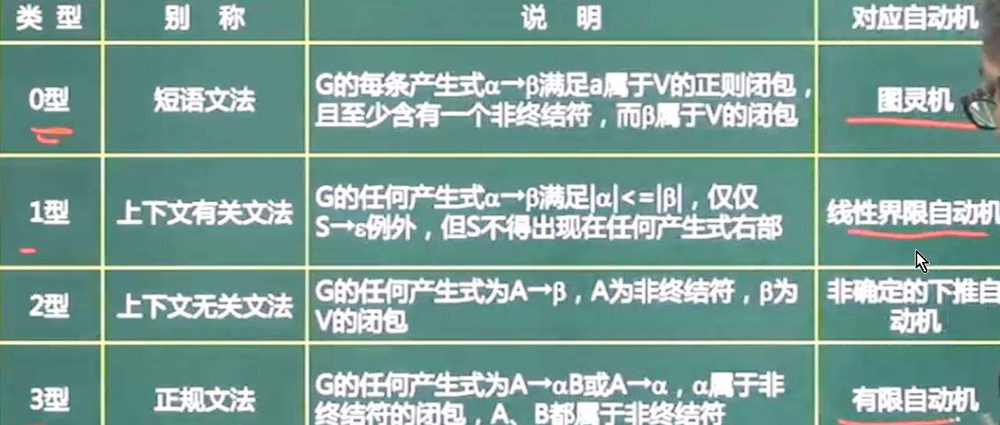
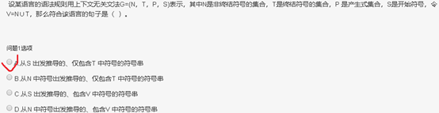
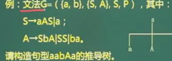
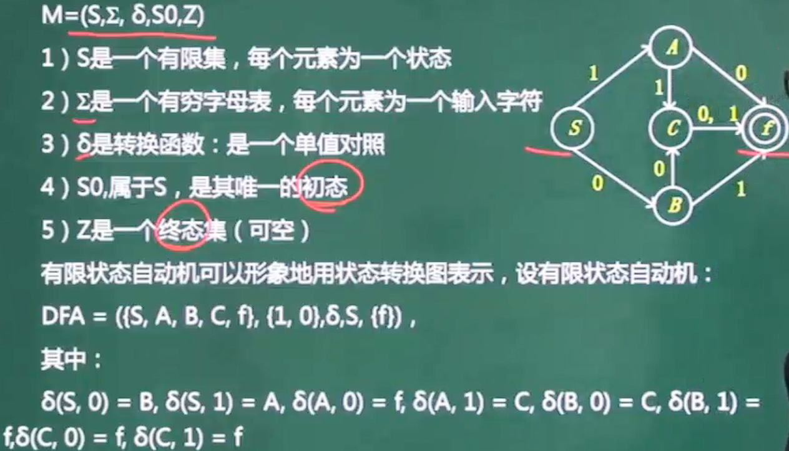
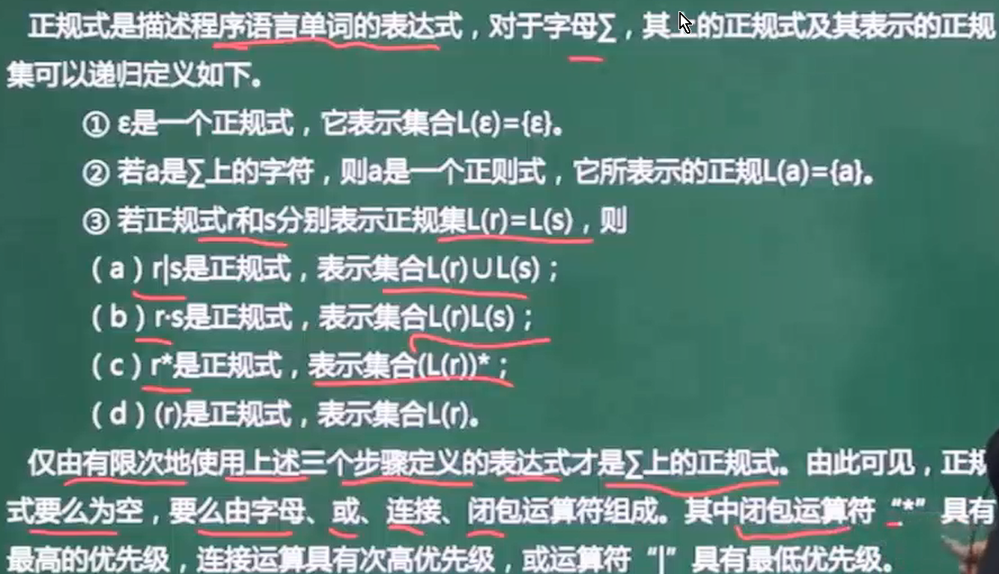
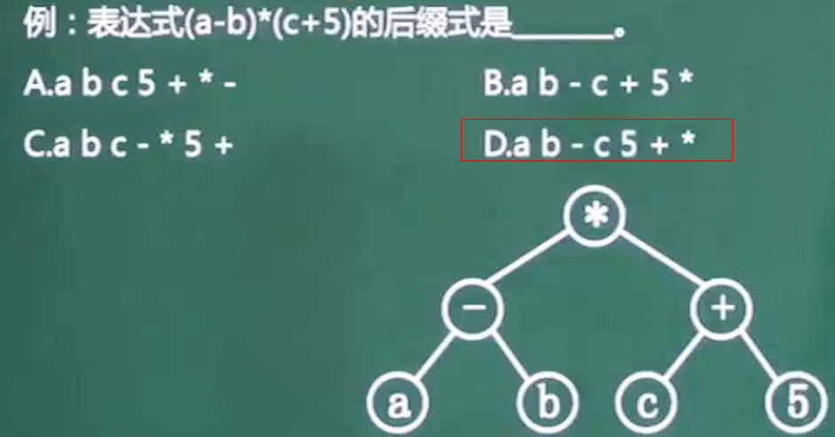
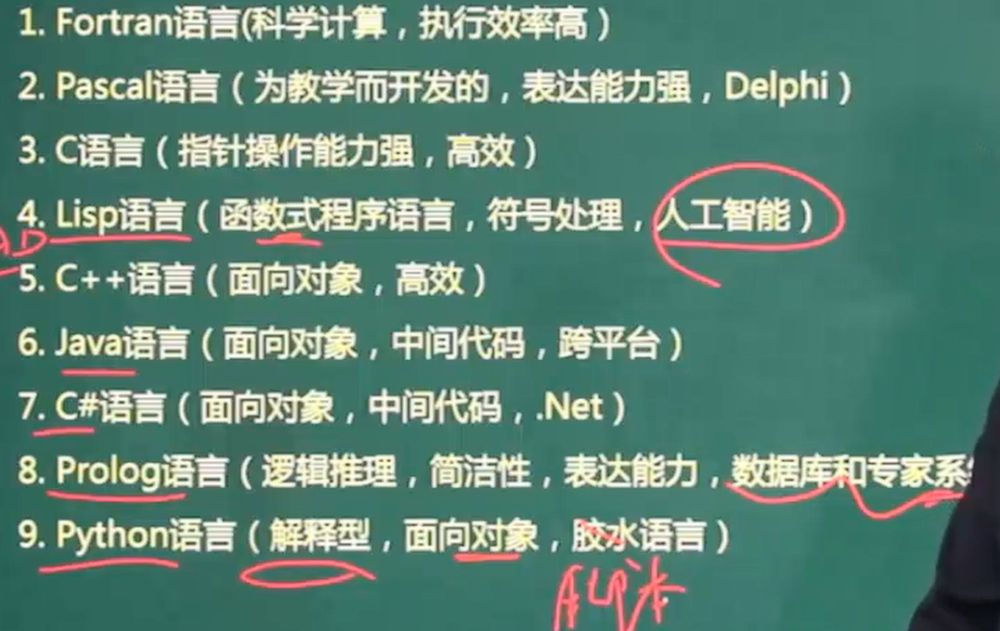

# 解释与编译

* **解释程序和源程序要参与到程序的运行**过程中，运行程序的控制权在解释程序。解释器翻译源程序时不产生独立的目标程序 ,如html,python

* 编译:  运行的是与源程序等价的目标程序，源程序和编译程序都**不再参与**目标程序的执行过程；

* 词法:    非法字符/关键字/变量是否被定义或声明

* 语法:    语法结构,if endif不匹配

* 语义     动态语义:死循环/逻辑错误 ,强制转换

  ​			静态语义 ,a/b ,b=0

# 文法

有序四元组G=(V ,T ,S ,P)

V	非终结符 ,类似于占位符 ,不是语言组成部分 ,不是最终结果

T	终结符	是最终结果	V交T =空集

S	起始符	语言的开始符号

P	产生式	用终结符替代非终结符的规则 ,如a->b

* 闭包			A+	1~n个a的并集
* 正则闭包	A*	0~n个a的并集

0型 短语文法         ->图灵机

1型 上下文有关文法->线性界线自动机

2             无关     ->非确定的下推自动机

3    正规文法          ->有限自动机

# 语法推导树

推导树以S起始符为根结点

每个结点都有一个标记 ,此标记是V的一个符号

由题得S->Aas     S->a      A->SbA   A->SS    A->ba

**V=a,b 非终结符	T=S,A 终结符**	

开始推导

S->aAS,又因为A->SbA,所以S->a(SbA)S

又因为S->a,所以S-> a(abA)a->aabAa

# 有限自动机 (词法分析)

能用闭包等符号表示出来的是**确定的有限自动机**

# 正规式

# 数据类型与程序控制结构

顺序结构	选择结构	循环结构

# 后缀表达式

转化为二叉树 ,再后序遍历

# 传值 传址

形参为*a时 ,代表传址

# 各种程序语言特点

c语言   编译型   全局/静态局部/静态全局变量都放在静态数据存储区

php 动态网页     不是标记语言

标记语言常用于描述格式化和链接

脚本语言采用解释方式实现,代表一套与程序设计语言不同的协议,牺牲执行速度和与程序设计语言相关的类型长度而提供更高的编程创作能力和软件复用,脚本语言都是动态语言,动态语言都是解释性语言

编译性语言的执行效率更高

 

动态语言:在程序运行时可以改变结构,新的函数被引进,已有的函数被删除等等.动态语言的类型检查在运行时进行,能够方便阅读,不需要写很多与类型相关的代码,缺点是不方便调试,命名不规范时会读不懂

