# 数组

行row	列col

二维数组有两种存储方式

​	按行存储 :先存完行再换行

​	按列存储

5行5列的二维数组a中 ,各元素占2个字节 ,求元素a[2,3]按行存储优先存储的位置		26

## 矩阵

### 稀疏矩阵

* 三角矩阵

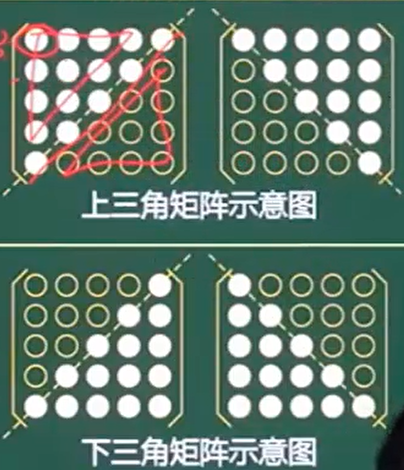

# 线性表

* 顺序表
* 单链表

若对一个链表最常用的操作是在末尾插入结点和删除尾结点，则采用仅设尾指针的单向循环链表（不含头结点）时，插入操作的时间复杂度为O(1),删除操作的时间复杂度为O(n)

 

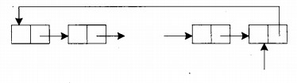

要删除尾指针所指结点，必须通过遍历操作找到尾结点的前驱结点

* 循环链表
* 双向链表

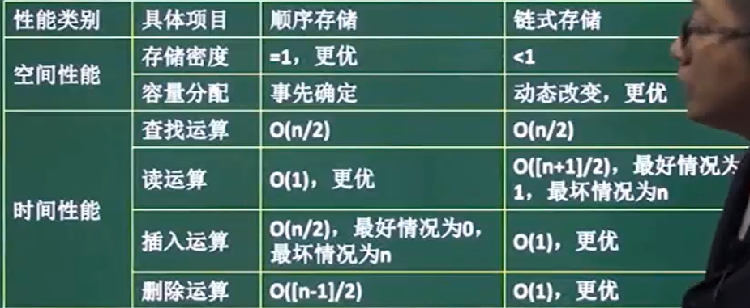

## 队列/栈

* 循环队列     

  ​    当head=tail时 ,队空		当(tail+1)%总长=head  需要取模

## 广义表

由n个表组成的有限序列

例如LS1=( a ,(b,c) ,(d,e) )

深度指的是括号的层数

取值 head ( LS1 ) =a

tail ( LS1 ) = (b,c) ,(d,e)

 head( head ( tail ( LS1) ) )

# 树

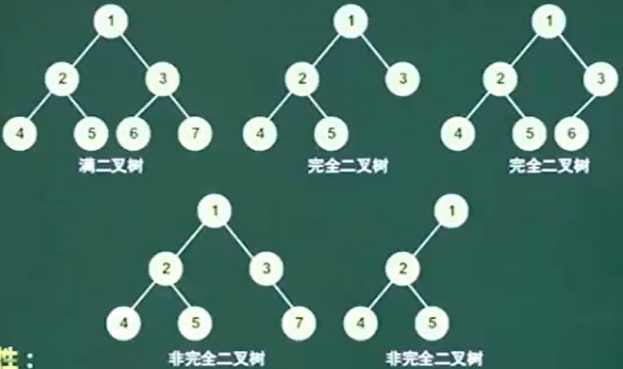

* 度	树的分叉

任意二叉树 ,叶子结点共x个 ,度为2的结点共y个 ,则x=y+1

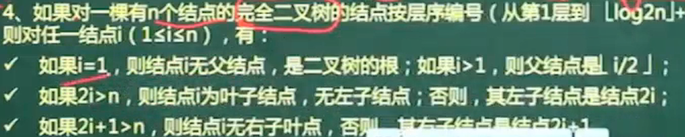

* 遍历
  * 前序    
  * 中序    ==必须有中序遍历才能反向构造二叉树==
  * 后序    

## 二叉树

### 查找树

最坏情况下树高N,退化为链表

* 删除

  * 被删除结点只有一个孩子 ,直接替换掉被删除节点的位置
  * 有2个孩子 ,在被删除结点的**左子树中序遍历**找到最大值 ,替换被删除结点

### 哈夫曼树

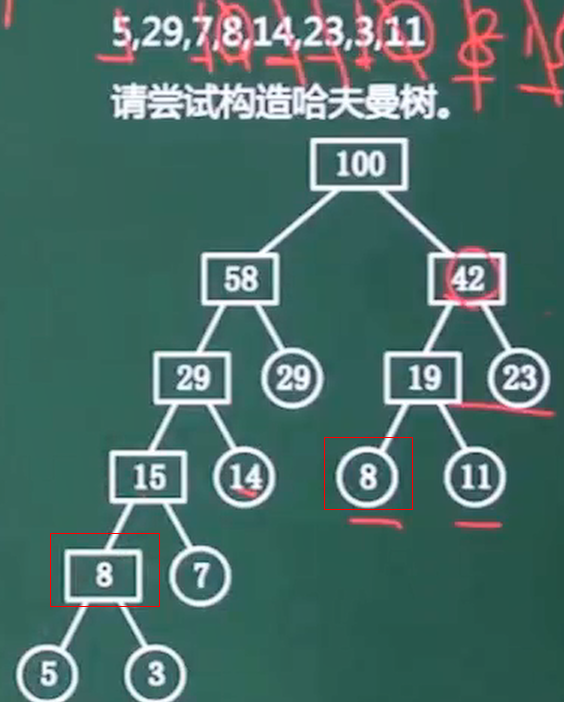

**8的值相同 ,被放在了右子树**

假设某消息中只包含7个字符怡{a,b,c,d,e,f,g}，折7个字符在消息中出现的次数为{5,24,8,17,34,f4,13}，利用哈夫曼树（最优二叉树）为该消息中的字符构造符合前缀编码要求的不等长编码。各字符的编码长度分别为（A）。

A.a:4,b:2,c:3,d:3,e:2,f:4,g:3      B.a:6,b:2,c:5,d:3,e:1,f:6,g:4

C.a:3,b:3,c:3,d:3,e:3,f:2,g:3      D.a:2,b:6,c:3,d:5,e:6,f:1,g:4

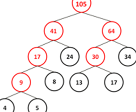

### 线索二叉树

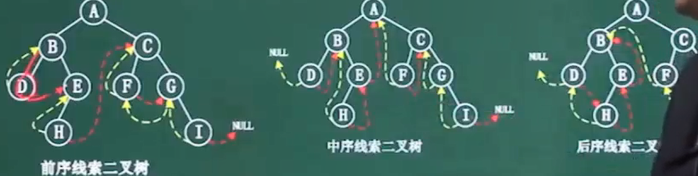

线索二叉树记录了结点的前驱和后继	类似于双向循环链表

### 平衡二叉树

基于二分策略提高数据的查找速度	

- 每一个非叶子节点,左小，右大

* 保证数据的左右两边的节点层级相差<=1,**高度越小查询越快,同时避免退化为链表**
* 没有值相等重复的节点

### 树转二叉树

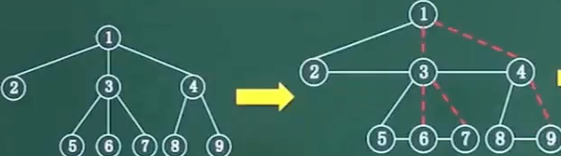

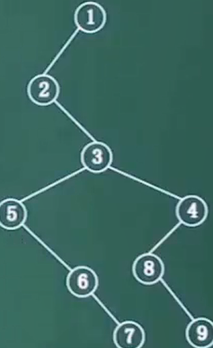

孩子结点 -> 左子树		兄弟结点 -> 右孩子

上层和下层的连线只保留最左边 ,下层互相连接

最后旋转45度 ,得到答案

## 2-3树

**允许一个结点保存多个键**

* 2-结点	一个键两条链,左小右大

* 3-结点	两个键三条链
  * 左 小
  * 中 在两个键区间之内
  * 右 大

* 任意空链接到根结点的路径长度相等
* 4-结点变换为3-结，树高不变，**只有当根结点分解时，树高+1**
* ==自底向上生长==
* 实现复杂
  * 需要处理不同的结点类型
  * 需要多次比较操作来将结点下移
  * 需要上移来拆分4-结点； 拆分4-结点的情况有很多种

**最坏情况下所有结点都是2-,树高lgN**

### 查找

* 和根结点比较
* 查找相应区间的链接，并在其指向的子树中递归地继续查找
* 如果是空链接，查找未命中

### 插入

* 先查找，将节点挂到未找到的节点上
  * 找到2-结点，放到2-结点里面使其变成3-结点
  * 找到3-结点
    * 插入,使其变成4-结点,触发自平衡
    * 中间结点上升至父节点
      * 父结点也变4-的话,继续上升中间结点,向上自平衡
        * 直到根结点还是4-,分裂根结点

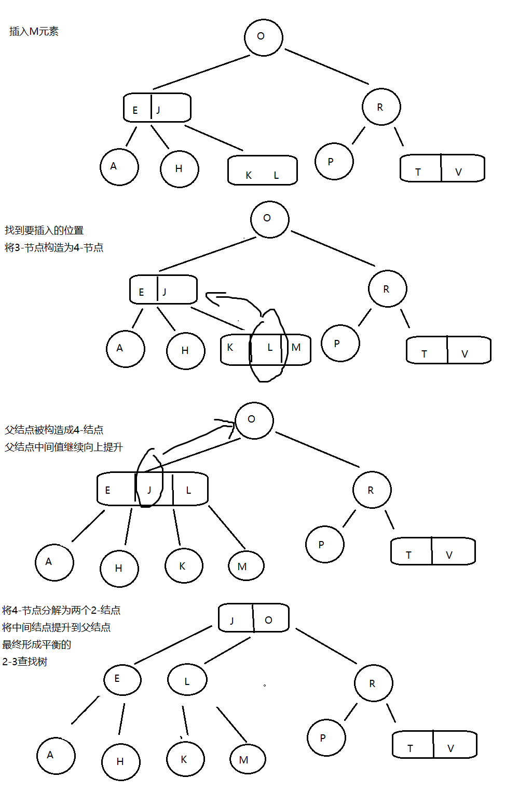

#### 单个3-结点/父结点为2的3-结点

* 暂时使其变成一个4-结点，同时包含四条链接

* 中间元素提升，左边的键作为左子结点，右边的键作为右子结点

* 插入完成，变为平衡2-3 查找树，树的高度从0变为1

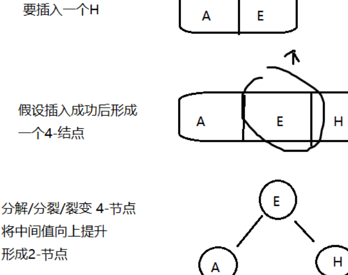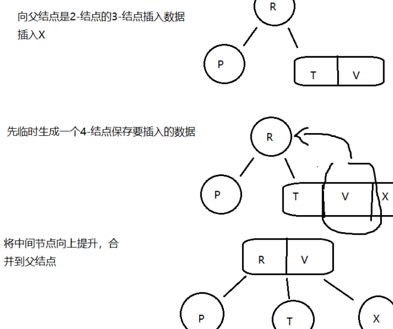

#### 父节点为3-结点的3-结点插入新键

插入的结点是3-结点的时候，我们将该结点拆分，中间元素提升至父结点，但是此时父结点是一 个3-结点， 插入之后，父结点变成了4-结点，然后继续将中间元素提升至其父结点，直至遇到一个父结 点是2-结点，然后将其 变为3-结点，不需要继续进行拆分

#### 分解根节点

当插入结点到根结点的路径上全部是3-结点的时候，最终根结点会变成一个临时的4-结点

需要将根结点拆分为两个2-结点，树高加1

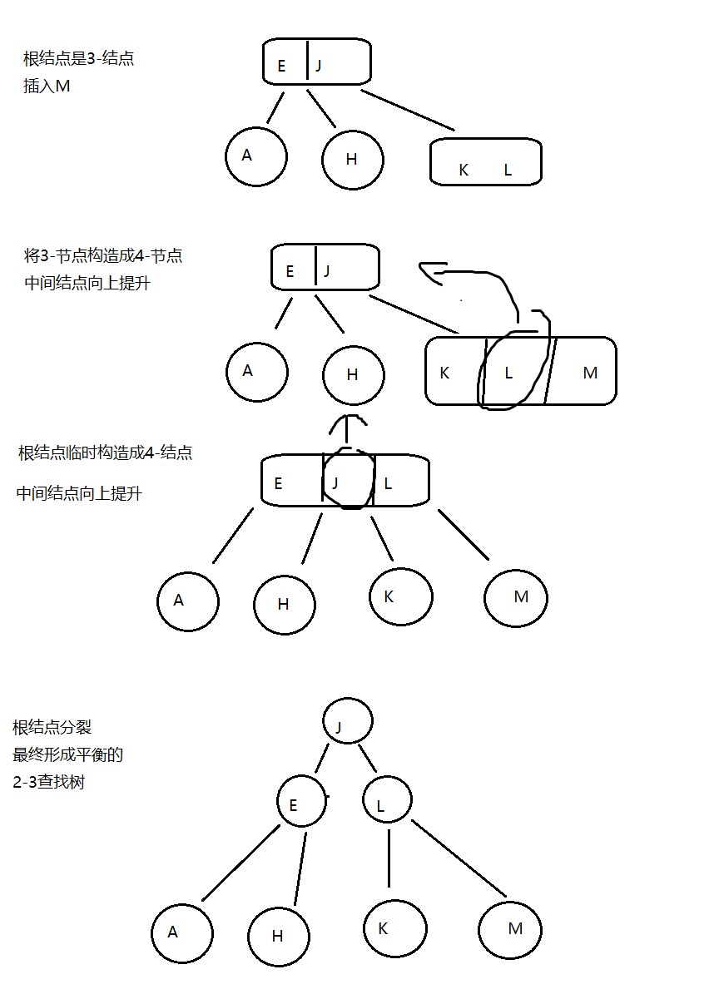

## 红黑树

借助了2-3树的思想

将3-结点表示为由一条左斜红链接(两个2-结点其中之一是另一个的左子结点)相连的两个2-结点

优点:无需修改就可以直接使用标准的二叉查找树的get方法

**红链接：将两个2-结点连接,构成3-结点**

黑链接：2-结点

叶子结点	为null的结点

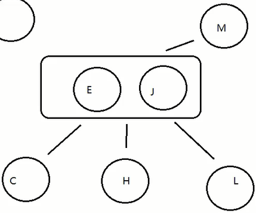 变为 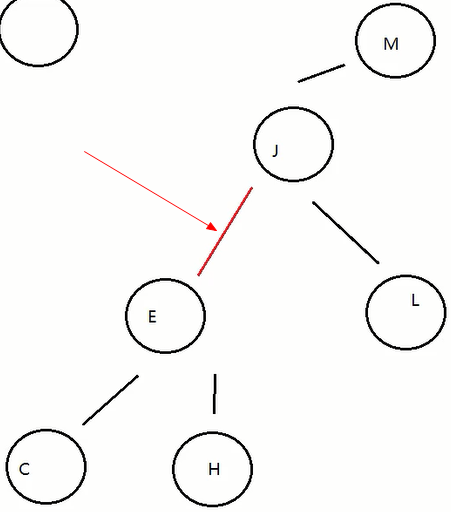

  

* 红链接均为左链接
  * **没有结点同时和两条红链接相连**(不存在4-结点)
* **完美黑色平衡**
  * 任意空链接到根结点,路径上的黑链接数量相同
  * 任意结点到叶子结点,路径上的黑结点数量相同
  * **整体并不完美平衡**

* 根/叶子节点黑
* 不能有两个连续红

### 左旋

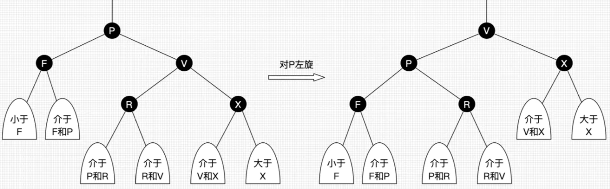

以某个结点作为支点，其右变为父，右结点的左变为旋转结点的右，左子树不变

==旋转之后,变色==

**左旋**只影响**旋转结点以下**的结构，把旋转结点的左子树移到根节点,作为根节点右子树

==局部的旋转==,当一边子树的结点少了，那么向另外一边子树“借”一些结点；当一边子树的结点多了，那么向另外一边子树“租”一些结点

### 查找

红黑树总保持黑色完美平衡，所以它的查找最坏时间复杂度为O(2lgN)，也即整颗树刚好红黑相隔的时候

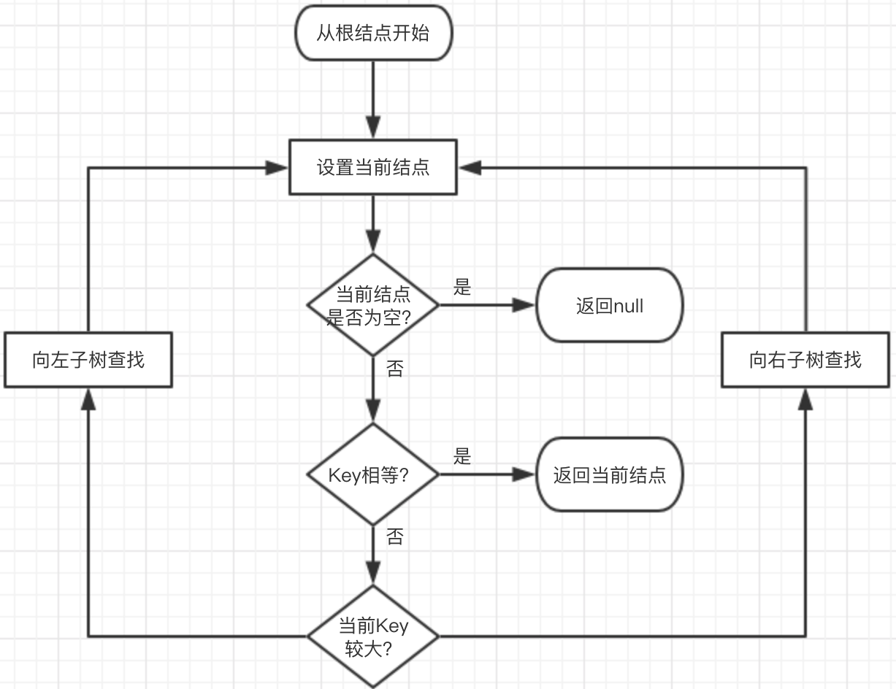

### 插入

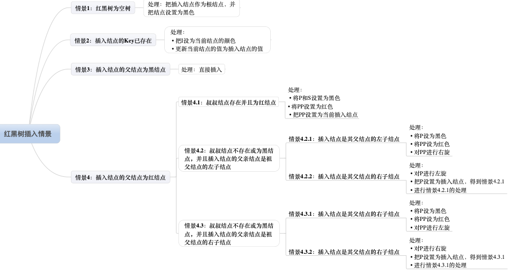

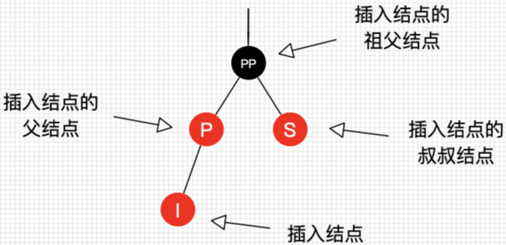

==插入时初始红色==

* 空树

  * 直接插入,变黑

* 插入结点的Key已存在

  * 更新值,变为原结点颜色

* 插入的父结点 黑

  * 直接插入    红色插入黑色时，不影响平衡

* 插入的**父结点 红		代表必定还有祖父结点,祖父黑,需要考虑旋转**
  * 叔叔结点 红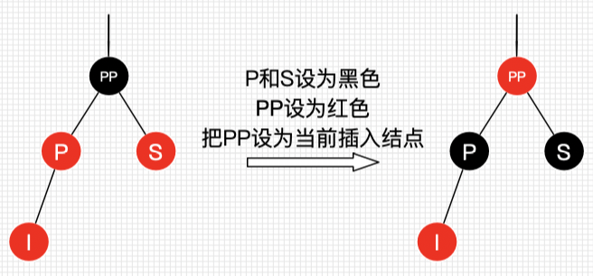
    * 父/叔变黑,祖父变红 -> **把祖父视为当前插入结点,再次进行插入平衡处理**
      * 祖父就是根节点的话,祖父变黑,此时红黑结构：黑黑红,**是唯一增加黑色结点层数的插入情景**
      * 这也说明了**红黑树自底向上生长**，普通的二叉查找树自顶向下生长
  * 叔叔 黑/不存在,父是祖父的左子结点
    * 插入结点是其父结点的左子结点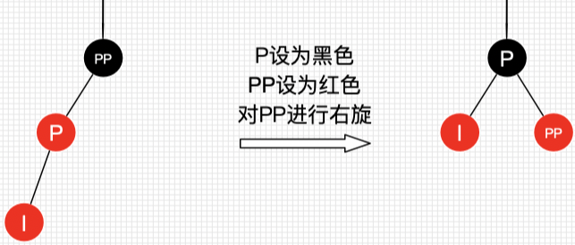
      * 父/插入结点黑,祖父红 -> 右旋   (这里可以让插入节点为红,父/祖父黑,但这将导致自底向上的平衡,不如变黑,最小化地局部平衡)
    * 插入结点是其父结点的右子结点
  * 叔叔 黑/不存在,父亲是祖父的右子结点
    * 插入结点是其父结点的左子结点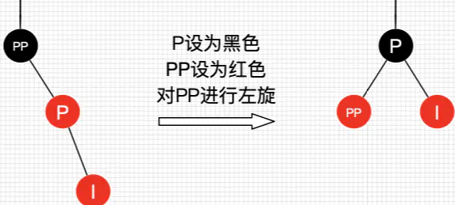
      * 父/插入节点黑,祖父红 -> 左旋

​													==红黑插入练习==

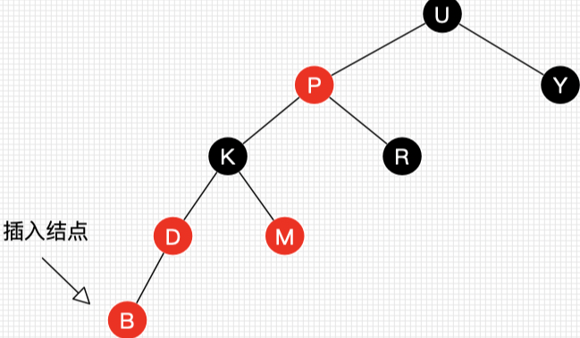

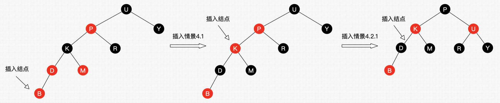

### 删除

- 删的是叶子，直接删除
- 被删除结点只有一个子结点，子结点替换删除结点
- 有两个子结点，用后继结点（==大于删除结点的最小结点==）替换删除结点
- 删除可以视为替代结点代替被删除结点的位置,==替代结点永远在树末,永远比被删除结点稍大==
- ==替代结点在删除前，还在原来位置参与平衡==

可以通过结点在x轴上的映射找到后继节点

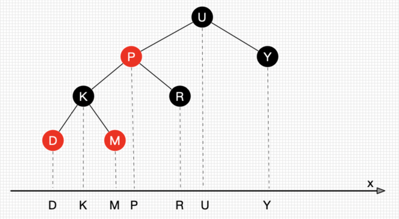

在不考虑结点的键值的情况下,删除可以视为是节点之间的替换,基于这个思想，上述3种删除情景可以相互转换并且最终都是删除替代节点

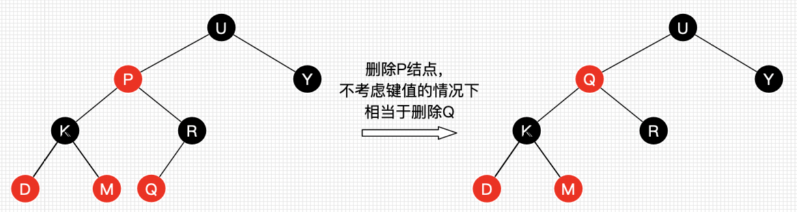

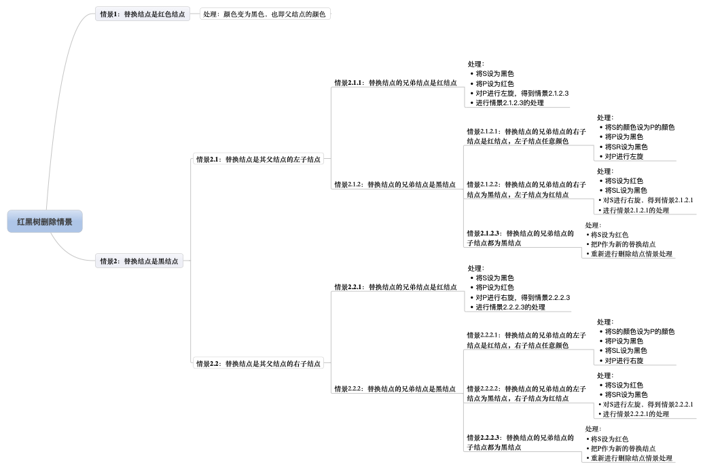

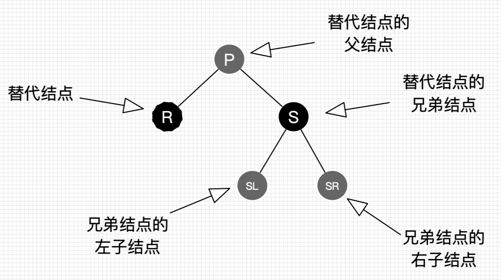

灰色表示可以是红/黑

**替换结点红**

* 变色为被删除结点,红色减少不影响平衡

**替换结点黑**

* 替换结点是其父的左子结点
  * 兄弟红->兄弟的父和子必黑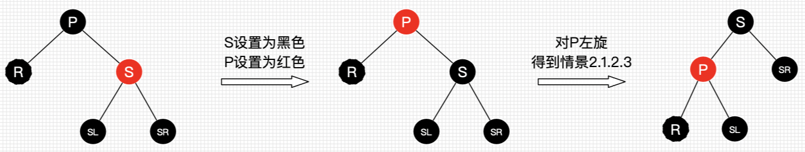
    * 父红,兄弟黑 -> 左旋 -> 后续平衡
  * 兄弟黑
    * 兄弟右红，左任意      左子树将少一个黑,将父变黑加到左子树,兄弟代替父,兄弟右变黑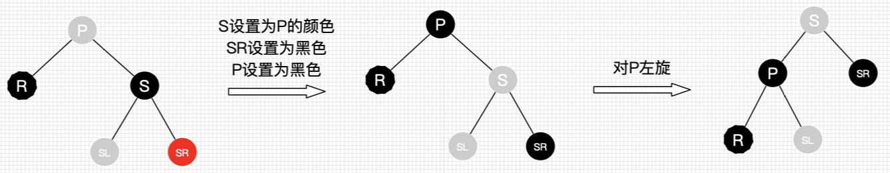
      * 兄变父颜色,父变黑,兄弟右变黑 -> 左旋 -> 进行后续平衡
      * **左旋后看似不平衡,实际上R要参与替换的,去掉R就平衡了**,并且这里糅合了第一次替换和自底向上处理的情况，如果只考虑第一次替换的情况，根据红黑树性质，SL肯定是红色或为Nil。对于自底向上平衡，只需保证每棵子树都平衡,就能达到最终平衡
    * 兄弟左红，右黑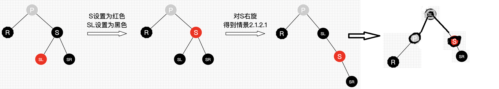
      * 兄弟变红,兄弟左黑 -> 右旋,进行兄弟右红的处理
    * 兄弟左右黑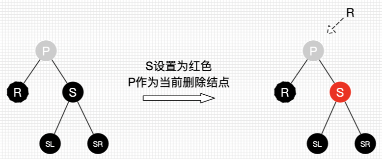
      * 兄弟变红 -> 父视为替换节点,参与自底向上平衡	(右边自减1黑,实现平衡)
  
* 替换结点是其父的右子结点
  * 兄弟红 -> 兄弟的父和子必黑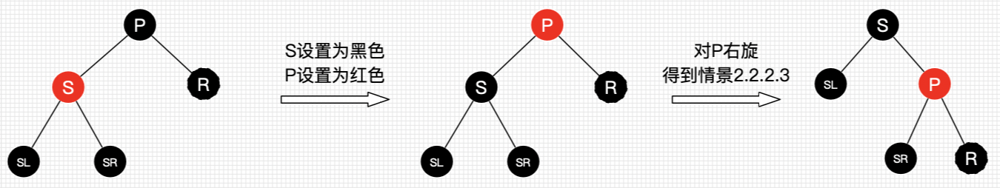
    * 父红,兄弟黑 -> 右旋
  * 兄弟黑
    * 兄弟左红，右任意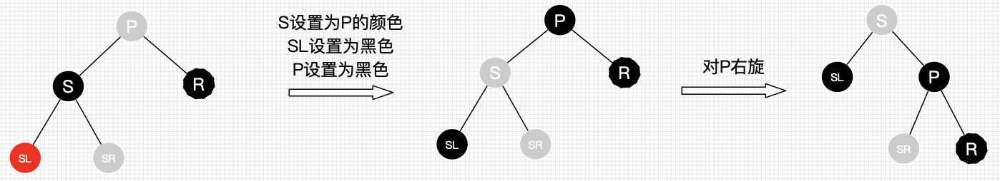
      * 兄弟变父颜色,父变黑,兄弟左变黑 -> 右旋
    * 兄弟左黑，右红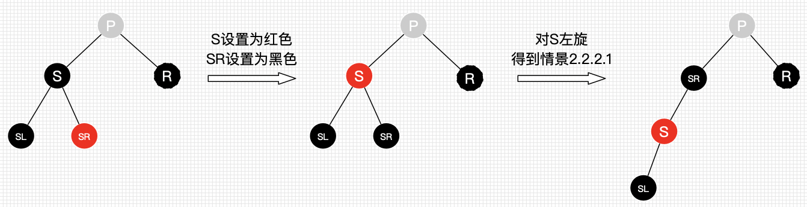
      * 兄弟变红,兄弟右变黑 -> 左旋 -> 进行兄弟左红的处理
    * 兄弟左右黑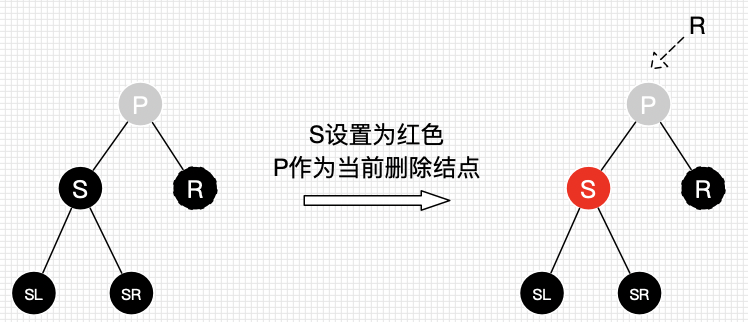
      * 兄弟变红 -> 父视为替换节点,参与自底向上平衡

删除后自平衡的处理可以总结为

1. 自己能搞定的自消化                                   
2. 自己不能搞定的叫兄弟帮忙   ==对于兄弟的子结点,有红的话红的来帮忙==
3. 兄弟都帮忙不了的，通过改变兄弟,自底向上平衡

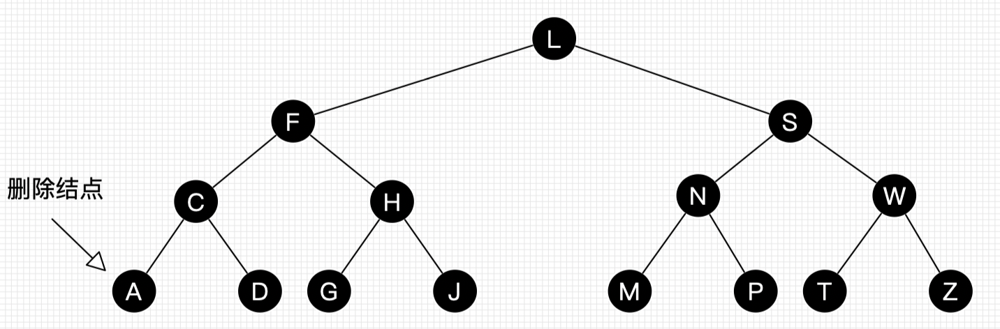

### 黑结点可以同时包含红黑子结点

## B树

==自平衡多路查找树==（查找路径不只两个）

专门为外部存储器设计的，如磁盘，对于读取和写入大块数据有良好的性能

K的个数称为阶,用M表示

### B-树

* ==允许每个节点有更多子节点==
* 按关键字递增排列，左小右大,关键字只出现在一个结点中
* 根节点的子结点>=2
* M/2（上取整）<=非叶节点的子结点数<=M ，且M>=2，空树除外（M阶代表查找路径，M=2是2叉）
* M/2（上取整）-1<= 非根节点的key <=M-1
* ==所有叶子节点均在同一层==,叶子节点除了关键字和关键字记录的指针外,也有指向其子节点(null)的指针

实际应用中阶数通常>100，即使存储大量的数据，B树的高度仍然比较小

==用度定义B树==

再阐述下：B树中每一个结点能包含的key个数有上界和下界。下界可以用一个称作B树的最小度数t（t>=2）表示

1. 每个非根的内结点至少有t个子女，每个非根的结点必须至少含有t-1个关键字，如果树是非空的， 则根结点至少包含一个关键字
2. 每个结点可包含至多2t-1个关键字。所以一个内结点至多可有2t个子女。如果一个结点恰好有2t-1 个关键字，我们就说这个结点是满的 

==t度的B树就是 2t阶的B树 (t=2m)==

因为t度的B树,节点最多有2t个孩子，2t-1个关键字；m阶的B树最多有m个孩子，m-1个关键字

用度定义B树，分割会先提出了t−1处的结点

### B+树

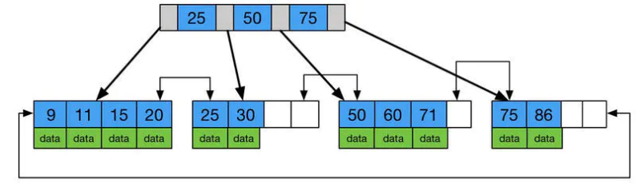

* ==非叶子节点并不存储真正的data==,所有data存储在叶节点,==查询时间复杂度固定log n==
  * B-树可能保存在根结点,最快O(1)查询速度,而B+树永远lgN,**查询速度稳定**
* 为所有叶子结点增加了==链指针==
  * 提高区间访问性,支持范围查询,缓存命中率高
  * **全树遍历快**,只需遍历所有叶子,无需对每一层遍历
* 因为非叶子节点不存储data，所以B+树的节点能存储更多指向data的key
  * 如果经常访问的数据离根节点近，B树会更合适

#### B+树与索引

磁盘由盘片构成,每个盘片有两面，又称为盘面 。盘片中央有一个可以旋转的主轴，他使得盘片以固定 的旋转速率 旋转，一个磁盘中包含了多个这样的盘片并封装在一个密 封的容器内 。盘片的每 个表面是由一组称为磁道同心圆组成的 ，每个磁道被划分为了一组扇区 ，每个 扇区包含相等数量的数据位，通常 是512个子节，扇区之间由一些间隙隔开,这些间隙中不存储数据 。

​	MySQL数据以文件的形式存储到硬盘。而读取数据靠机械臂运动,分为寻道时间、旋转延迟、传输时间三个部分,寻道和旋转花费时间长.

​	计算机操作系统做了一些优化，一次IO会把相邻的数据也都读取到内存缓冲区内，==空间局部性原理==告诉我们，访问一个地址时，其相邻的地址大概率也会被访问到。每一次IO读取的数据我们称之为一页,读取一页的数据，才发生一次IO（包括当前数据+相邻数据）

​	每次查数据时减少磁盘IO次数,**需要稳定的数据结构**

* 红黑树
  * 高度不可控,**逻辑上很近的节点实际很远**，无法很好的利用磁盘预读（局部性原理）
  * 通过**旋转**保持平衡，而旋转是对整棵树的操作，若部分加载到内存中则无法完成旋转操作

**所以红黑树不能用于索引**

* B-树
  * ==不支持范围搜索==
  * 非叶子节点也存储数据,导致存储索引的数量变少

**所以B-不能用于索引**

* B+树
  * 节点存储着多个id（以磁盘的角度可以看作磁盘块）,多路查找,优于二叉树
  * 非叶子节点只存储key,一次IO能取出更多索引
  * 每次将范围分割为多个区间，区间越多，定位数据越快,区间对应存储器上的一页

B树每个节点包含的关键字多，应用到数据库中的时，能够充分利用磁盘的块式存储原理,把节点大小限制在块大小范围；把树的关键字多,**层级比二叉树小**，能够减少查找的次数和复杂度

==InnoDB最小储存单元为页，16K==

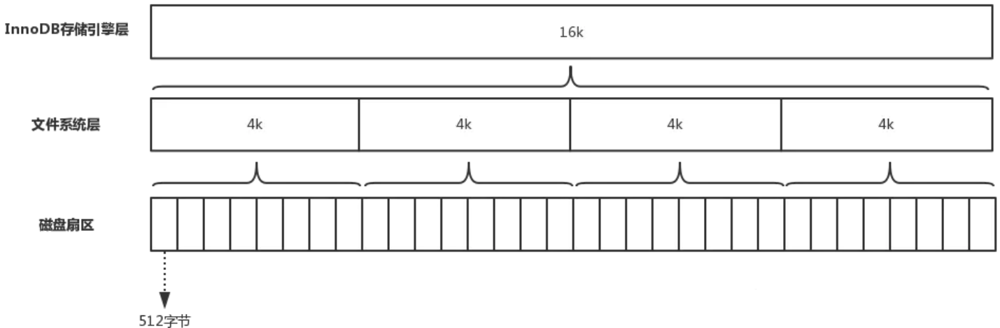

### B^*^树

是B+树的变种

B+树节点满时就会分裂，而B*树节点满时会检查兄弟节点是否满（因为每个节点都有指向兄 弟的指针），如果兄弟节点未满则向兄弟节点转移关键字，如果兄弟节点已满，则从当前节点和兄 弟节点各拿出1/3的数据创建一个新的节点出来；

• 特点 在B+树的基础上因其初始化的容量变大，使得节点空间使用率更高，而又存有兄弟节点的指针， 可以向兄弟节点转移关键字的特性使得B*树额分解次数变得更少；

==演变的过程中通过IO从磁盘读取数据的原理进行一步步的演变，每次演变都是为了让节点的空间更合理运用，从而使树的层级减少达到快速查找数据的目的==

## Trie字典树

是哈希树的变种。常用于**搜索引擎**统计和排序字符串（但不限于字符串）

优点：减少无谓的字符串比较，查询效率比哈希表高

缺点:需要的存储空间大

3个性质

* **根节点不包含字符，除根节点外每个节点都只有一个字符**
* 从根节点到某一节点，路径上经过的字符连接起来，为该节点对应的字符串
* **每个节点的子节点字符不同**

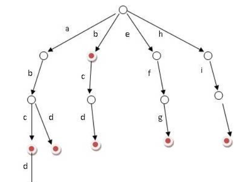

### 前缀查询

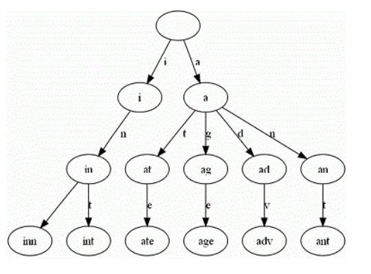

### 高频词

题目：有一个1GB大小的文件， 文件里面每行是一 个词，每个词的大小不超过16B. 内存大小限制是1MB,要求返回频数最高的100个词

解答:
    由于文件大小为1GB,而内存大小只有1MB,因此不可能一次把所有的词读入到内存中处理,因此采用分治法，把一个大的文件分解成多个小的子文件，从而保证每个文件的大小都小于1MB,可以直接被读取到内存中

* 遍历文件，对遍历到的每一个词，计算hash(x)%2000, 将结果为i的词存放到文件ai中，通过这个分解步骤，可以使每个子文件的大小大约为400KB左右，如果这个操作后某个文件的大小超过1MB了，那么可以采用相同的方法对这个文件继续分解，直到文件的大小小于1MB为止

* 字典树统计出每个文件中出现频率最高的100个词。遍历文件中的所有词，对于遍历到的词，如果在字典中不存在，那么把这个词存入字典中(键为这个词，值为1)，如果这个词在字典中已经存在了，那么把这个词对应的值加1

* 最小堆找出所有词中出现频率最高的100个。遍历第一个文件，把第一个文件中出现频率最高的100 个词构建成一个小顶堆。(如果第一个文件中词的个数小于100，那么可以继续遍历第2个文件，直到构建好有100个结点的小顶堆为止)。如果遍历到的词的出现次数大于堆顶上词的出现次数，那么可以用新遍历到的词替换堆顶的词，然后重新调整这个堆为小顶堆。当遍历完所有文件后，这个小顶堆中的词就是出现频率最高的100 个词

# 堆

用**数组**实现的**完全二叉树**，根据**堆属性**来排序

只有最后一层的结点可以不满,且左满右不满

堆分为两种：最大堆和最小堆，两者的差别在于节点的排序方式。

在最大堆中，父节点的值比每一个子节点的值都要大。在最小堆中，父节点的值比每一个子节点的值都要小。这就是所谓的“堆属性”，并且这个属性对堆中的每一个节点都成立。

* 堆和普通树的区别
  * 节点顺序
    * 二叉搜索树中，左比父小，右比父大
    * 最大堆中两个子节点都比父节点小，最小堆中都比父节点大
  * 内存占用。
    * 树占用的内存大。需要存储左/右子节点指针
    * 堆用数组，内存占用小
  * 平衡
    * 二叉搜索树必须是“平衡”的情况下，复杂度才到O(log n)。你可以按任意顺序位置插入/删除数据，或者使用 AVL 树或者红黑树
    * ==堆中不需要整棵树都有序==。因为堆中数据的组织方式可以保证O(log n) 的性能
  * 搜索
    * 二叉树搜索快
    * 堆中搜索慢。==堆更注重存储==

## 堆的存储方式

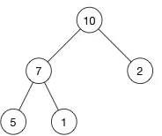[ 10, 7, 2, 5, 1 ]

如果 i 是节点的索引，那么下面的公式就给出了它的父节点和子节点在数组中的位置

parent(i) = floor((i - 1)/2)

left(i)  = 2i + 1

right(i) = 2i + 2

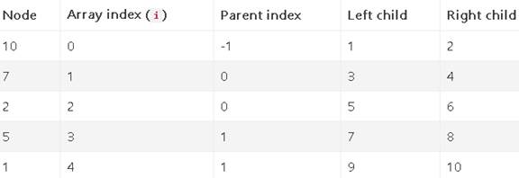

根节点(10)没有父节点，因为 -1 不是一个有效的数组索引。同样，节点 (2)，(5)和(1) 没有子节点，因为这些索引已经超过了数组的大小，所以我们在使用这些索引值的时候需要保证是有效的索引值。

 

堆并不一定是有序数组！要将堆转换成有序数组，需要使用堆排序。

堆中低层节点不一定小于高层节点！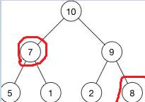7<8

## 上浮/下沉

上浮 shiftUp(): 如果一个节点比它的父节点大/小，那么需要将它同父节点交换位置。这样是这个节点在数组的位置上升。

下沉shiftDown(): 如果一个节点比它的子节点小（最大堆）或者大（最小堆），那么需要将它向下移动。

shiftUp 或者 shiftDown 是一个递归的过程，所以它的时间复杂度是 O(log n)

### 插入

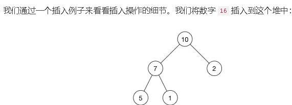

变成了[ 10, 7, 2, 5, 1, 16 ] 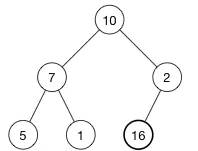

为了恢复堆属性,交换两次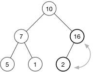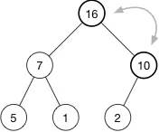

### 删除根节点

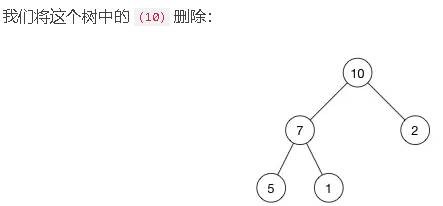

此时顶部为空节点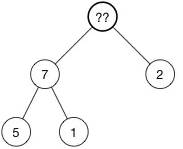

取出最后一个节点,代替空节点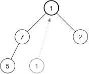

之后开始交换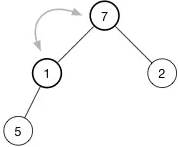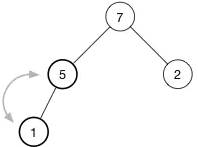

### 删除子节点

remove() 的通用版本，它可能会使用到 shiftDown 和 shiftUp。

[ 10, 7, 2, 5, 1 ]      删除7

-> [ 10, **1**, 2, 5, **7** ]   

==将待删除元素与最后的元素交换==,**removeLast()**删除,而1的位置不对,用shiftDown()调整位置

# 栈

# 队列

单向循环链表可以表示队列

一个线性序列经过队列结构后只能得到与原序列相同的元素序列，

而经过一个栈结构后则可以得到多种元素序列。

所以**两个栈可以模拟一个队列的入队和出队**

## 最小大优先队列

等于堆

## 索引优先队列

根据索引去操作队列中元素的值	最大/小堆都无法根据索引

# 图

* 完全图
  * 每对顶点都有一条边相连的无向图
  * 每对顶点都有2条有向边互相连接的有向图

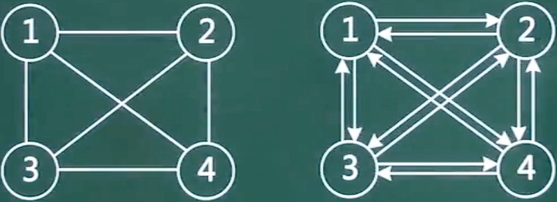

## 图的存储

### 邻接矩阵

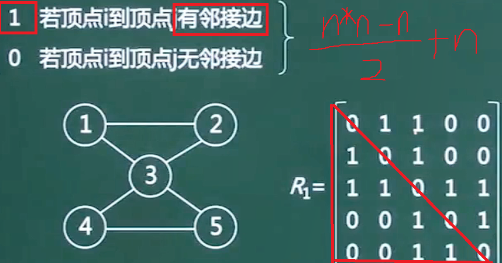

**图有n个节点 ,就要用n*n的矩阵存储**

表示上下三角时 ,耗费空间

### 邻接表

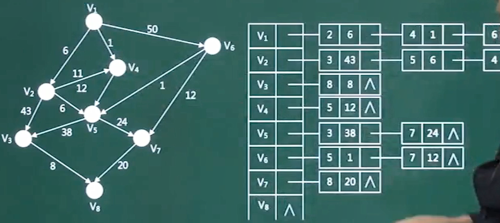

V1 ->2 6 -> 4 1

代表V1 -> V2距离4 ,V1 -> V4距离1

==完全图适合采用邻接矩阵存储==

**图的顶点数决定了邻接矩阵的阶和邻接表中的单链表数目**

无论是对有向图还是无向图，**边数的多少决定了单链表中的结点数，而不影响邻接矩阵的规模**，因此完全图适合采用邻接矩阵存储。

## 图的遍历

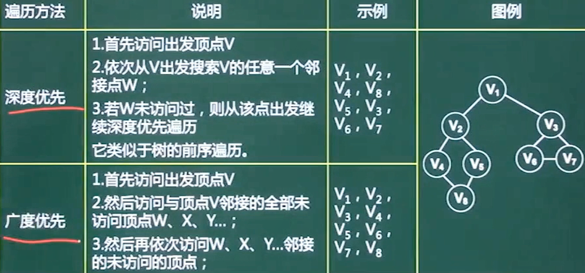

## 拓扑图 AOV网络

用有向边表示活动的先后

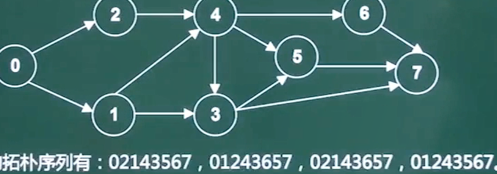

## 最小生成树

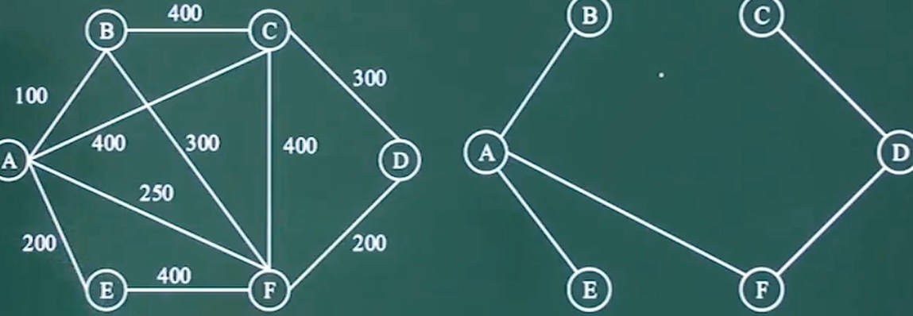

下面关于图（网）的叙述，正确的是（58)。

 (58)A.连通无向网的最小生成树中，顶点数恰好比边数多1

B.若有向图是强连通的，则其边数至少是顶点数的2倍

C.可以采用AOV网估算工程的工期

D.关键路径是AOE网中源点至汇点的最短路径

***\*【答案】\*******\*A\****

***\*【解析】本题考查数据结构方面的基础知识。\****

在有向图中，若以顶点表示活动，用有向边表示活动之间的优先关系，则称这样的有向图为以顶点表示活动的网（Activity On Vertex Network, AOV网）。

若在带权有向图G中以顶点表示事件，以有向边表示活动，边上的权值表示该活动持续的时间，则这种带权有向图称为用边表示活动的网（Activity On Edge Network, AOE 网）通常在AOE网中列出了完成预定工程计划所需进行的活动、每项活动的计划完成时间、要发生哪些事件以及这些事件和活动间的关系，从而可以分析该项工程是否实际可行并估计工程完成的最短时间，分析出哪些活动是影响工程进度的关键。进一步可以进行人力、物力的调度和分配，以达到缩短工期的目的。

根据生成树的定义，有n个顶点的连通图的生成树中恰好有n-1条边。

# 算法思想

## 递推

## 分治

子问题相互独立且形式相同 ,可以通过递归解决

二分查找 ,斐波那契 ,**归并/快速排序** ,矩阵乘法 ,大整数乘法,汉诺伊塔

**归并排序不是归纳法!!!!!!!!!!**

## 回溯

是一种选优搜索法 ,可以求得多个解

N皇后 ,迷宫 ,背包

## 迭代

也称辗转法

不断用变量的旧值递推新值，在解决问题时总是重复利用一种方法

迭代法又分为精确迭代和近似迭代。“二分法”和“牛顿迭代法”属于近似迭代法，功能都比较类似

## 深度优先 DFS

用于遍历或 搜索树/图

* 回溯强调了回退操作对于搜索的合理性

* 深度优先强调一种遍历的思想

## 贪心

**局部最优** ,每一步选择当前的最优解

背包问题 ,多机调度(银行家算法) ,找零钱

## 动态规划

全局最优

斐波那契 ,矩阵乘法 ,背包 ,LCS最长公共子序列

**贪心法找到局部最优解	分治法找到可能不是最优的解	动态规划找到最优解**

# 时间复杂度

二分查找       对数级别       logN

循环           线性级别       N

归并(分治思想)   线性对数级别    NlogN

穷举           指数级别       2^N

**堆排序**						nlog2n

==与树有关的都有log==

|          | 时间  |          |          | 空间  |
| -------- | ----- | -------- | -------- | ----- |
|          | Best  | Avg      | Worst    | Worst |
| 快速     | nlogn | nlogn    | n^2^     | nlogn |
| 归并     | nlogn | nlogn    | nlogn    | n     |
| TimSort  | n     | nlogn    | nlogn    | n     |
| 堆       | nlogn | nlogn    | nlogn    | 1     |
| 冒泡     | n     | n^2^     | n^2^     | 1     |
| 插入     | n     | n^2^     | n^2^     | 1     |
| 选择     | n^2^  | n^2^     | n^2^     | 1     |
| 树形选择 | nlogn | nlogn    | n^2^     | n     |
| 希尔     | nlogn | nlogn^2^ | nlogn^2^ | 1     |
| 桶       | n+k   | n+k      | n^2^     | n     |
| 基数     | nk    | nk       | nk       | n+k   |
| 计数     | n+k   | n+k      | n+k      | k     |
|          |       |          |          |       |

基本有序时的排序

* 插入  时间复杂度nk,k为需要插入的元素
* 增强型冒泡,无需频繁交换元素
* 最小堆+插入,每次［i，i+k］区间的数进行排序,i为上次操作的下标,［i，i+k］区间内有序,用二分寻找下标

快速不适合基本有序的排序,因为它的原理是选定一个值，然后使得他的左边的数都比他小，右边的数都比他大

