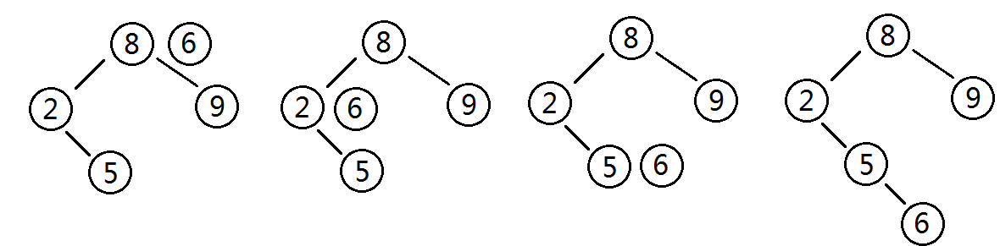

# 数组

行row	列col


二维数组有两种存储方式

​	按行存储 :先存完行再换行

​	按列存储


5行5列的二维数组a中 ,各元素占2个字节 ,求元素a[2,3]按行存储优先存储的位置		26


## 矩阵


### 稀疏矩阵


* 三角矩阵


# 线性表


* 顺序表
* 单链表

若对一个链表最常用的操作是在末尾插入结点和删除尾结点，则采用仅设尾指针的单向循环链表（不含头结点）时，插入操作的时间复杂度为O(1),删除操作的时间复杂度为O(n)

 


要删除尾指针所指结点，必须通过遍历操作找到尾结点的前驱结点

* 循环链表
* 双向链表


## 队列/栈


* 循环队列     

  ​    当head=tail时 ,队空		当(tail+1)%总长=head  需要取模


## 广义表

由n个表组成的有限序列

例如LS1=( a ,(b,c) ,(d,e) )

深度指的是括号的层数


取值 head ( LS1 ) =a

tail ( LS1 ) = (b,c) ,(d,e)

 head( head ( tail ( LS1) ) )


# 树


* 度	树的分叉


任意二叉树 ,叶子结点共x个 ,度为2的结点共y个 ,则x=y+1


* 遍历
  * 前序    
  * 中序    ==必须有中序遍历才能反向构造二叉树==
  * 后序    


## 二叉树


### 查找/搜索树


最坏情况下树高N,**退化为链表** -> 需要使用平衡树


任意节点的子树也是二叉查找树，所有左节点均小于该节点，所有右节点均大于该节点 -> 通过**中序遍历得到递增**序列


#### 插入 O(log2n)

先从根节点出发,比较大小决定左/右递归



#### 查找 O(log2n)

类似于插入,左右递归寻找位置


需查找的值为5

1. 查找根节点，5<8，进入左儿子
2. 5>2，进入右儿子
3. 5=5，查找到该节点，返回该节点的位置


#### 删除 O(log2n)


被删除结点只有一个孩子,直接交换位置


有2个孩子,在被删除结点的**右子树**找到最小值,替换被删除结点


### 哈夫曼树


**8的值相同 ,被放在了右子树**


假设某消息中只包含7个字符怡{a,b,c,d,e,f,g}，折7个字符在消息中出现的次数为{5,24,8,17,34,f4,13}，利用哈夫曼树（最优二叉树）为该消息中的字符构造符合前缀编码要求的不等长编码。各字符的编码长度分别为（A）。

A.a:4,b:2,c:3,d:3,e:2,f:4,g:3      B.a:6,b:2,c:5,d:3,e:1,f:6,g:4

C.a:3,b:3,c:3,d:3,e:3,f:2,g:3      D.a:2,b:6,c:3,d:5,e:6,f:1,g:4


### 线索二叉树


线索二叉树记录了结点的前驱和后继	类似于双向循环链表


### 平衡二叉树


基于二分策略提高数据的查找速度	


- 每一个非叶子节点,左小，右大

* 保证数据的左右两边的节点层级相差<=1,**高度越小查询越快,同时避免退化为链表**
* 没有值相等重复的节点


### 树转二叉树


孩子结点 -> 左子树		兄弟结点 -> 右孩子

上层和下层的连线只保留最左边 ,下层互相连接

最后旋转45度 ,得到答案


## 2-3树


**允许一个结点保存多个键**

* 2-结点	一个键两条链,左小右大

* 3-结点	两个键三条链
  * 左 小
  * 中 在两个键区间之内
  * 右 大


* 任意空链接到根结点的路径长度相等
* 4-结点变换为3-结，树高不变，**只有当根结点分解时，树高+1**
* ==自底向上生长==
* 实现复杂
  * 需要处理不同的结点类型
  * 需要多次比较操作来将结点下移
  * 需要上移来拆分4-结点； 拆分4-结点的情况有很多种


**最坏情况下所有结点都是2-,树高lgN**


### 查找


* 和根结点比较
* 查找相应区间的链接，并在其指向的子树中递归地继续查找
* 如果是空链接，查找未命中


### 插入


* 先查找，将节点挂到未找到的节点上
  * 找到2-结点，放到2-结点里面使其变成3-结点
  * 找到3-结点
    * 插入,使其变成4-结点,触发自平衡
    * 中间结点上升至父节点
      * 父结点也变4-的话,继续上升中间结点,向上自平衡
        * 直到根结点还是4-,分裂根结点


#### 单个3-结点/父结点为2的3-结点


* 暂时使其变成一个4-结点，同时包含四条链接

* 中间元素提升，左边的键作为左子结点，右边的键作为右子结点

* 插入完成，变为平衡2-3 查找树，树的高度从0变为1


#### 父节点为3-结点的3-结点插入新键


插入的结点是3-结点的时候，我们将该结点拆分，中间元素提升至父结点，但是此时父结点是一 个3-结点， 插入之后，父结点变成了4-结点，然后继续将中间元素提升至其父结点，直至遇到一个父结 点是2-结点，然后将其 变为3-结点，不需要继续进行拆分


#### 分解根节点


当插入结点到根结点的路径上全部是3-结点的时候，最终根结点会变成一个临时的4-结点

需要将根结点拆分为两个2-结点，树高加1


## 红黑树


借助了2-3树思想

将3-结点表示为由一条左斜红链接(两个2-结点其中之一是另一个的左子结点)相连的两个2-结点

优点:无需修改就可以直接使用标准的二叉查找树的get方法


**红链接：将两个2-结点连接,构成3-结点**

黑链接：2-结点

叶子结点	为null的结点


  变为  


  

* 红链接均为左链接
  * **没有结点同时和两条红链接相连**(不存在4-结点)
* **完美黑色平衡**
  * 任意空链接到根结点,路径上的黑链接数量相同
  * 任意结点到叶子(包括NIL)结点,路径上的黑结点(包括NIL)数量相同
  * **整体并不完美平衡**

* **根/叶子(NIL空节点)黑**
* 不能有两个连续红


### 左旋


以某个结点作为支点，其右变为父，右结点的左变为旋转结点的右，左子树不变

==旋转后,变色==


**左旋**只影响**旋转结点以下**的结构，把旋转结点的左子树移到根节点,作为根节点右子树

==局部旋转==,当一边子树的结点少了，向另外一边子树“借”结点


### 查找


红黑树总保持黑色完美平衡，查找最坏时间复杂度为O(2lgN)，即整颗树刚好红黑相隔的时候


### 插入


==插入时初始红色==

* 空树	直接插入,变黑

* 插入结点的Key已存在   更新值,变为原结点颜色

* 插入的父结点 黑

  * 直接插入    红色插入黑色时，不影响平衡

* 插入的**父结点 红		必存在黑祖父,需要考虑旋转**
  * 叔叔结点 红
    * 父/叔变黑,祖父变红 -> **把祖父视为当前插入结点,自底向上平衡**
      * 祖父就是根节点的话,祖父变黑,此时结构：黑黑红(唯一增加黑色结点层数的插入情景)
      * 这也说明了**红黑树自底向上生长**，普通的二叉查找树自顶向下生长
  * 叔叔 黑/不存在,父是祖父的左子结点
    * 插入结点是其父结点的左子结点
      * 父黑,祖父红 -> 右旋
    * 插入结点是其父结点的右子结点


​													==红黑插入练习==


### 删除


- 删的是叶子，直接删除
- 被删除结点只有一个子结点，子结点替换删除结点
- 有两个子结点，用后继结点（==大于删除结点的最小结点==）替换删除结点
- 删除可以视为替代结点代替被删除结点的位置,==替代结点永远在树末,永远比被删除结点稍大==
- ==替代结点在删除前，还在原来位置参与平衡==


可以通过结点在x轴上的映射找到后继节点


在不考虑结点的键值的情况下,删除可以视为节点间的替换,基于这个思想，上述3种删除情景可以相互转换并且最终都是删除替代节点


灰色表示可以是红/黑


**替换结点红**

* 变色为被删除结点,红色减少不影响平衡

**替换结点黑**

* 替换结点是其父的左子结点
  * 兄弟红->兄弟的父和子必黑
    * 父红,兄弟黑 -> 左旋
  * 兄弟黑
    * 兄弟右红，左任意      左子树将少一个黑,将父变黑加到左子树,兄弟代替父,兄弟右变黑
      * 兄变父颜色,父/兄弟右变黑 -> 左旋
      * **左旋后看似不平衡,实际上R要参与替换的,去掉R就平衡了**,并且这里糅合了第一次替换和自底向上处理的情况，如果只考虑第一次替换的情况，根据红黑树性质，SL肯定是红或Nil。对于自底向上平衡，只需保证每棵子树都平衡,就能达到最终平衡
    * 兄弟左红，右黑
      * 兄弟变红,兄弟左黑 -> 右旋,进行兄弟右红的处理
    * 兄弟左右黑
      * 兄弟变红 -> 父视为替换节点,参与自底向上平衡	(右边自减1黑,实现平衡)
  
* 替换结点是其父的右子结点
  * 兄弟红 -> 兄弟的父和子必黑
    * 父红,兄弟黑 -> 右旋
  * 兄弟黑
    * 兄弟左红，右任意
      * 兄弟变父颜色,父变黑,兄弟左变黑 -> 右旋
    * 兄弟左黑，右红
      * 兄弟变红,兄弟右变黑 -> 左旋 -> 进行兄弟左红的处理
    * 兄弟左右黑
      * 兄弟变红 -> 父视为替换节点,参与自底向上平衡


删除后自平衡的处理可以总结为

1. 自己能搞定的自消化                                   
2. 自己不能搞定的叫兄弟帮忙   ==对于兄弟的子结点,有红的话红的来帮忙==
3. 兄弟都帮忙不了的，通过改变兄弟,自底向上平衡


### 黑结点可以同时包含红黑子结点


## B树


==自平衡多路查找树==（查找路径不只两个）

专门为外部存储器设计的，如磁盘，对于读取和写入大块数据有良好的性能


K的个数称为阶,用M表示


### B-树


* 每个结点至多有m个孩子(m>=2)
* 按关键字递增排列，左小右大,关键字只出现在一个结点中
* 根节点的子结点>=2
* M/2（上取整）<=非叶节点的子结点数<=M ，且M>=2，空树除外（M阶代表查找路径，M=2是2叉）
* M/2（上取整）-1<= 非根节点的key <=M-1
* ==所有叶子节点均在同一层==,叶子节点除了关键字和关键字记录的指针外,也有指向其子节点(null)的指针

实际应用中阶数通常>100，即使存储大量的数据，B树的高度仍然比较小


==用度定义B树==

再阐述下：B树中每一个结点能包含的key个数有上界和下界。下界可以用一个称作B树的最小度数t（t>=2）表示

1. 每个非根的内结点至少有t个子女，每个非根的结点必须至少含有t-1个关键字，如果树是非空的， 则根结点至少包含一个关键字
2. 每个结点可包含至多2t-1个关键字。所以一个内结点至多可有2t个子女。如果一个结点恰好有2t-1 个关键字，我们就说这个结点是满的 


==t度的B树就是 2t阶的B树 (t=2m)==

因为t度的B树,节点最多有2t个孩子，2t-1个关键字；m阶的B树最多有m个孩子，m-1个关键字

用度定义B树，分割会先提出了t−1处的结点


### B+树


* ==非叶子节点并不存储真正的data==,所有data存储在叶节点,==查询时间复杂度固定log n==
  * B-树可能保存在根结点,最快O(1)查询速度,而B+树永远lgN,**查询速度稳定**
* 为所有叶子结点增加了==链指针==
  * 提高区间访问性,支持范围查询,缓存命中率高
  * **全树遍历快**,只需遍历所有叶子,无需对每一层遍历
* 因为非叶子节点不存储data，所以B+树的节点能存储更多指向data的key
  * 如果经常访问的数据离根节点近，B树会更合适


#### B+树与索引


磁盘由盘片构成,每个盘片有两个盘面

盘片中央有一个可以旋转的主轴，他使得盘片以固定的旋转速率旋转

盘面由磁道同心圆组成的 ，每个磁道被划分扇区 ，每个扇区包含相等数量的数据位，通常是512字节，扇区之间由一些间隙隔开,这些间隙中不存储数据。


MySQL数据以文件的形式存储到硬盘。而读取数据靠机械臂运动,分为寻道时间、旋转延迟、传输时间三个部分,寻道和旋转花费时间长.

计算机操作系统做了一些优化，一次IO会把相邻的数据也都读取到内存缓冲区内，==空间局部性原理==:访问一个地址时，其相邻的地址大概率也会被访问到。每一次IO称为读取一页的数据（包括当前数据+相邻数据）


稳定的数据结构 -> 减少IO次数 -> 查询变快


* hashmap	无序,查数据需要遍历	不支持范围查询


* 红黑树
  * 高度不可控,**逻辑上很近的节点实际很远**，无法很好的利用磁盘预读（局部性原理）
  * 通过**旋转**保持平衡，而旋转是对整棵树的操作，若部分加载到内存中则无法完成旋转操作

**所以红黑树不能用于索引**


* B-树
  * ==不支持范围搜索==,只能中序遍历
  * 非叶子节点也存储数据,导致存储索引的数量变少

**所以B-不能用于索引**


* B+树
  * 节点存储多个id,多路查找优于二叉树
  * 非叶子节点只存储key,不包含data -> 一次IO能取出更多索引
  * 每个节点包含的关键字多 -> 树的高度低 -> IO次数少
  * 支持范围查询,==叶子结点被链表连接==,通过链表提高了区间访问性


==InnoDB最小储存单元为页，16K==


### B^*^树


是B+树的变种


B+树节点满时就会分裂，而B*树节点满时会检查兄弟节点是否满（因为每个节点都有指向兄 弟的指针），如果兄弟节点未满则向兄弟节点转移关键字，如果兄弟节点已满，则从当前节点和兄 弟节点各拿出1/3的数据创建一个新的节点出来；


• 特点 在B+树的基础上因其初始化的容量变大，使得节点空间使用率更高，而又存有兄弟节点的指针， 可以向兄弟节点转移关键字的特性使得B*树额分解次数变得更少；


==演变的过程中通过IO从磁盘读取数据的原理进行一步步的演变，每次演变都是为了让节点的空间更合理运用，从而使树的层级减少达到快速查找数据的目的==


## Trie字典树


是哈希树的变种。常用于**搜索引擎**统计和排序字符串（但不限于字符串）

优点：减少无谓的字符串比较，查询效率比哈希表高

缺点:需要的存储空间大


3个性质

* **根节点不包含字符，除根节点外每个节点都只有一个字符**
* 从根节点到某一节点，路径上经过的字符连接起来，为该节点对应的字符串
* **每个节点的子节点字符不同**


### 前缀查询


### 高频词


题目：有一个1GB大小的文件， 文件里面每行是一 个词，每个词的大小不超过16B. 内存大小限制是1MB,要求返回频数最高的100个词


解答:
    由于文件大小为1GB,而内存大小只有1MB,因此不可能一次把所有的词读入到内存中处理,因此采用分治法，把一个大的文件分解成多个小的子文件，从而保证每个文件的大小都小于1MB,可以直接被读取到内存中

* 遍历文件，对遍历到的每一个词，计算hash(x)%2000, 将结果为i的词存放到文件ai中，通过这个分解步骤，可以使每个子文件的大小大约为400KB左右，如果这个操作后某个文件的大小超过1MB了，那么可以采用相同的方法对这个文件继续分解，直到文件的大小小于1MB为止

* 字典树统计出每个文件中出现频率最高的100个词。遍历文件中的所有词，对于遍历到的词，如果在字典中不存在，那么把这个词存入字典中(键为这个词，值为1)，如果这个词在字典中已经存在了，那么把这个词对应的值加1

* 最小堆找出所有词中出现频率最高的100个。遍历第一个文件，把第一个文件中出现频率最高的100 个词构建成一个小顶堆。(如果第一个文件中词的个数小于100，那么可以继续遍历第2个文件，直到构建好有100个结点的小顶堆为止)。如果遍历到的词的出现次数大于堆顶上词的出现次数，那么可以用新遍历到的词替换堆顶的词，然后重新调整这个堆为小顶堆。当遍历完所有文件后，这个小顶堆中的词就是出现频率最高的100 个词


## 最小生成树 MST


Minimum Spanning Tree

G:图

V:集合

N:顶点数	(==MST有N-1条边==)


### kruskal算法

以边生成MST

取最短边进行连通,将a,b加入集合	V={a，b}

取最短边,校验2个顶点是否已经连通,加入集合


> 1. 取最小边V1-3	连通1,3
>
> 2. 取最小边V4-6	连通4,6
>
> 3. 取最小边V2-5	连通2,5
>
> 4. 取最小边V3-6	连通3,5 (1,4连通 使得V3-4剔除)
>
> 5. 取最小边V2-3	全连通


### Prim算法

以==点==生成MST

从图中任取一点a,以此为基准,找到最短边进行连通,并将另一点b加入集合	V={a，b}

再寻找以a，b为基准的最短边进行连通,直到所有点都在集合


> 点2基准,当前最短为V5	连通2,5
>
> 点2,5基准,当前最短V3	连通2,3
>
> …
>
> 直至所有点连通


# 堆


用**数组**实现的**完全二叉树**，根据**堆属性**来排序

只有最后一层的结点可以不满,且左满右不满


**最大堆/大根堆**

父节点的值比每一个子节点的值都要大

**最小堆/小顶堆**

父节点的值比每一个子节点的值都要小


**最大/小属性只对堆中的父子节点成立** -> ==堆并不一定有序==


* 堆和普通树的区别
  * 节点顺序
    * 二叉搜索树中，左比父小，右比父大
    * 最大堆中两个子节点都比父节点小，最小堆中都比父节点大
  * 内存占用
    * 树内存大,需要存储左/右子节点指针
    * 堆用数组，内存小
  * 平衡
    * 二叉搜索树必须是“平衡”的情况下，复杂度才到O(log n)。你可以按任意顺序位置插入/删除数据，或者使用 AVL 树或者红黑树
    * ==堆中不需要整棵树都有序==。因为堆中数据的组织方式可以保证O(log n) 的性能
  * 搜索
    * 二叉树搜索快
    * 堆搜索慢,==更注重存储==


## 堆的存储方式


[ 10, 7, 2, 5, 1 ]

如果 i 是节点的索引，那么下面的公式就给出了它的父节点和子节点在数组中的位置

parent(i) = floor((i - 1)/2)

left(i)  = 2i + 1

right(i) = 2i + 2


根节点(10)没有父节点，因为 -1 不是一个有效的数组索引。同样，节点 (2)，(5)和(1) 没有子节点，因为这些索引已经超过了数组的大小，所以我们在使用这些索引值的时候需要保证是有效的索引值。

 


## 上浮/下沉


上浮 shiftUp(): 如果一个节点比它的父节点大/小，那么需要将它同父节点交换位置。这样是这个节点在数组的位置上升。

下沉shiftDown(): 如果一个节点比它的子节点小（最大堆）或者大（最小堆），那么需要将它向下移动。

shiftUp 或者 shiftDown 是一个递归的过程，所以它的时间复杂度是 O(log n)


### 插入


变成了[ 10, 7, 2, 5, 1, 16 ] 

为了恢复堆属性,交换两次

### 删除根节点


此时顶部为空节点

取出最后一个节点,代替空节点

之后开始交换


### 删除子节点

remove() 的通用版本，它可能会使用到 shiftDown 和 shiftUp。

[ 10, 7, 2, 5, 1 ]      删除7

-> [ 10, **1**, 2, 5, **7** ]   

==将待删除元素与最后的元素交换==,**removeLast()**删除,而1的位置不对,用shiftDown()调整位置


## TopK


从arr[1, n]这n个数中，找出最大的k个数


1.排序	O(nlg(n))	只需要TopK,无需全局排序

2.局部排序	O(nk)	冒泡,需要K个则冒泡K次(但还是把最大的K个元素排序了)

3.堆	O(nlg(k)) (每次都入堆调整，每次调整lg(树高))	只找到TopK，不排序TopK


	

先用前k个元素生成小顶堆,再遍历后续元素，维护小顶堆

最后堆顶元素即为TopK


# 栈


# 队列


单向循环链表可以表示队列


一个线性序列经过队列结构后只能得到与原序列相同的元素序列，

而经过一个栈结构后则可以得到多种元素序列。

所以**两个栈可以模拟一个队列的入队和出队**


## 最小大优先队列

等于堆


## 索引优先队列


根据索引去操作队列中元素的值	最大/小堆都无法根据索引


# 图


==图不允许没有顶点，但是可以没有边==


无向图


有向图


* 完全图
  * 每对顶点都有一条边相连的无向图
  * 每对顶点都有2条有向边互相连接的有向图


## 连通图


在无向图 G 中，如果从顶点 v 到顶点 v' 有路径，则称 v 和 v' 是连通的。 如果对于图中任意两个顶点 vi 、vj ∈E， vi，和vj都是连通的，则称 G 是**连通图**，否则图为**非连通图**


A、B、C、D是连通的，但是其中任一顶点与顶点E或者顶点F之间没有路径，因此为非连通图


顶点的度：与V关联的边个数 TD(V)=ID(V)+OD(V)

入度：指向V的边个数，记为 ID(V)

出度：			记为 OD(V)


邻接

如果图包含（u,v），v与u邻接。==无向图的邻接关系是对称的==,可以得到u与v也邻接


路径

在图中，依次遍历顶点序列之间的边所形成的轨迹


## 邻接矩阵


**图有n个节点,就要用n*n的矩阵存储**

表示上下三角时 ,耗费空间


### 无向图存储


（1）顶点数组长度为图的顶点数目n。边数组为n X n的二维数组

（2）1代表邻接，0代表不邻接

（3）==无向边顶点的邻接关系是对称的，边数组为对称二维数组==

（4）顶点与自身之间并未邻接关系，**对角线上的元素均为0**

（5）顶点的度即为顶点所在的行/列中1的数目


### 有向图存储


（1）顶点数组长度为图的顶点数目n。边数组为n X n的二维数组

（2）**1代表i与j邻接，且i为尾，j为头**

（3）在有向图中，由于边存在方向性，因此数组**不一定为对称**数组

（4）对角线上元素为0

（5）行中1个数:出度	列:入度


**数组存储方式优点：** 数组存储方式容易实现图的操作。例如：求某顶点的度、判断顶点之间是否有边（弧）、找顶点的邻接点等等

**数组存储方式缺点：** 采用数组存储方式，图若有n个顶点则需要n^2个单元。 当==顶点多，边少时，此时图为稀疏图==，浪费空间


## 邻接表


使用数组存储时，主要有以下三个问题：

> （1）对于一个图，若图中的顶点数目过大，则无法使用邻接矩阵进行存储。因为在分配数组内存时可能会导致内存分配失败
>
> （2）对于某些稀疏图（即顶点数目多，边数目少），创建的数组大小很大，而真正存储的有用信息又很少，这就造成了空间上的浪费
>
> （3）有时两个点之间不止存在有一条边，这是用邻接矩阵就无法同时表示两条以上的边


数组存储和链表相结合

在邻接表中，对图中的每个顶点建立一个单链表，第 i 个单链表中的结点依附于顶点 Vi 的边。链表中的节点称为表节点，共有3个域

adjvex存储与Vi邻接的点在图中的位置，nextarc存储下一条边或弧的结点，data存储与边或弧相关的信息如权值


除表节点外，需要在数组中存储**头节点**，**头结点**由两个域组成，分别指向链表中第一个顶点和存储Vi的名或其他信息


其中，data域中存储顶点相关信息，firstarc指向链表的第一个节点。 **无向图采用邻接表方式存储** 例如：图6.1所示的无向图采用邻接表存储。


采用邻接表方式存储图 6.1 中的无向图，绘图过程中忽略边节点的info信息，头结点中的 data 域存储顶点名称。以V1顶点为例，V1顶点的邻接顶点为V2、V3、V4，则可以创建3个表节点，表节点中adjvex分别存储V2、V3、V4的索引1、2、3，按照此方式，得到的邻接表为：


**无向图的邻接表存储特性：**

> （1）数组中头节点的数目为图的顶点数目。 （2）链表的长度即为顶点的度。例如：V1顶点的度为3，则以V1为头节点的链表中表节点的数目为3。

**有向图采用邻接表方式存储** 例如：图 6.3 所示的有向图采用邻接表存储。


采用邻接表方式存储图6.3中的有向图，绘图过程中忽略边节点的info信息，头结点中的data域存储顶点名称。以V1顶点为例，V1顶点的邻接顶点为V2、V3、V4，但是以V1顶点为尾的边只有两条，即<V1 , V3>和<V1 , V4>因此，创建2个表节点。表节点中adjvex分别存储V3、V4的索引2、3，按照此方式，得到的邻接表为


**有向图的邻接表存储特性：**

> （1）数组中表节点的数目为图的顶点数目。 （2）链表的长度即为顶点的出度。例如V1的出度为2，V1为头节点的链表中，表节点的数目为2。 （3）顶点Vi的入度为邻接表中所有adjvex值域为i的表结点数目。例如：顶点V3的入度为4，则链表中所有adjvex值域为2的表结点数目为4。

**注：图采用邻接表的方式表示时，其表示方式是不唯一的。这是因为在每个顶点对应的单链表中，各边节点的链接次序可以是任意的，取决于建立邻接表的算法以及边的输入次序。**


## 逆邻接表


在邻接表中，可以轻易的得出顶点的出度，但是想要得到顶点的入度，则需要遍历整个链表。为了便于确定顶点的入度，可以建立有向图的逆邻接表。逆邻接表的建立与邻接表相反。 **采用逆邻接表的方式存储图3.2所示的无向图。以V3顶点为例，V3顶点的邻接顶点为V1、V2、V4、V5，以V3顶点为头的边有4条，即<V1 , V3>、<V2 , V3>、<V4 , V3>、<V5 , V3>因此，创建4个表节点。表节点中adjvex分别存储V0、V1、V3、V4的索引0、1、3、4，按照此方式，得到的逆邻接表为：**


## 十字链表


对于有向图而言，邻接链表的缺陷是要查询某个顶点的入度时需要遍历整个链表，而逆邻接链表在查询某个顶点的出度时要遍历整个链表。为了解决这些问题，十字链表将邻接链表和逆邻接链表综合了起来，而得到的一种十字链表。在十字链表中，每一条边对应一种边节点，每一个顶点对应为顶点节点。

**顶点节点** 顶点节点即为头节点，由3个域构成，具体形式如下：


其中，data域存储与顶点相关的信息，firstin和firstout分别指向以此顶点为头或尾的第一个边节点。 **边节点** 在边节点为链表节点，共有 5 个域，具体形式如下：


其中，尾域tailvex和头域headvex分别指向尾和头的顶点在图中的位置。链域hlink指向头相同的下一条边，链域tlink指向尾相同的下一条边。info 存储此条边的相关信息。 例如：图8.1所示的有向图，采用十字链表存储图方式


采用十字链表的方式存储图8.1中的有向图，绘图过程忽略边节点中的info信息，表头节点中的data域存储顶点名称。以V1顶点为例，顶点节点的data域存储V1顶点名，firstin存储以V1顶点为头第一个边节点，以V1顶点为头边为<V3 , V1>，firstout存储以以V1顶点为尾第一个边节点，对应边为<V1 , V2>。按照此规则，得到的十字链表存储为：


**注：采用十字链表存储时，表头节点仍然使用数组存储，采用下标索引方式获取。**


## **邻接多重表**


对于无向图而言，其每条边在邻接链表中都需要两个结点来表示，而邻接多重表正是对其进行优化，让同一条边只用一个结点表示即可。邻接多重表仿照了十字链表的思想，对邻接链表的边表结点进行了改进。

重新定义的边结点结构如下图：


其中，ivex和jvex是指某条边依附的两个顶点在顶点表中的下标。 ilink指向依附顶点ivex的下一条边，jlink指向依附顶点jvex的下一条边。info存储边的相关信息。

重新定义的顶点结构如下图：


其中，data存储顶点的相关信息，firstedge指向第一条依附于该顶点的边。 例如：图9.1所示的无向图，采用邻接多重表存储图。


图 9.1 所示的无向图，采用邻接多重表存储，以 V0 为例，顶点节点的data域存储V0名称，firstedge 指向(V0 , V1)边，边节点中的ilink指向依附V0顶点的下一条边(V0 , V3)，jlink指向依附V1顶点的下一条边(V1 , V2)，按照此方式建立邻接多重表：


V1 ->2 6 -> 4 1

代表V1 -> V2距离4 ,V1 -> V4距离1


==完全图适合采用邻接矩阵存储==

**图的顶点数决定了邻接矩阵的阶和邻接表中的单链表数目**

无论是对有向图还是无向图，**边数的多少决定了单链表中的结点数，而不影响邻接矩阵的规模**，因此完全图适合采用邻接矩阵存储。


## 图的遍历


## 拓扑图 AOV网络


用有向边表示活动的先后


## 最小生成树


下面关于图（网）的叙述，正确的是（58)。

 (58)A.连通无向网的最小生成树中，顶点数恰好比边数多1

B.若有向图是强连通的，则其边数至少是顶点数的2倍

C.可以采用AOV网估算工程的工期

D.关键路径是AOE网中源点至汇点的最短路径

***\*【答案】\*******\*A\****

***\*【解析】本题考查数据结构方面的基础知识。\****

在有向图中，若以顶点表示活动，用有向边表示活动之间的优先关系，则称这样的有向图为以顶点表示活动的网（Activity On Vertex Network, AOV网）。

若在带权有向图G中以顶点表示事件，以有向边表示活动，边上的权值表示该活动持续的时间，则这种带权有向图称为用边表示活动的网（Activity On Edge Network, AOE 网）通常在AOE网中列出了完成预定工程计划所需进行的活动、每项活动的计划完成时间、要发生哪些事件以及这些事件和活动间的关系，从而可以分析该项工程是否实际可行并估计工程完成的最短时间，分析出哪些活动是影响工程进度的关键。进一步可以进行人力、物力的调度和分配，以达到缩短工期的目的。

根据生成树的定义，有n个顶点的连通图的生成树中恰好有n-1条边。


# 并查集


用于解决动态连通性问题，能动态连接两个点，并且判断两个点是否连通。

<div align="center">  </div><br>

|              方法               |           描述            |
| :-----------------------------: | :-----------------------: |
|            UF(int N)            | 构造一个大小为 N 的并查集 |
|    void union(int p, int q)     |     连接 p 和 q 节点      |
|         int find(int p)         | 查找 p 所在的连通分量编号 |
| boolean connected(int p, int q) | 判断 p 和 q 节点是否连通  |

```java
public abstract class UF {

    protected int[] id;

    public UF(int N) {
        id = new int[N];
        for (int i = 0; i < N; i++) {
            id[i] = i;
        }
    }

    public boolean connected(int p, int q) {
        return find(p) == find(q);
    }

    public abstract int find(int p);

    public abstract void union(int p, int q);
}
```

## Quick Find

可以快速进行 find 操作，也就是可以快速判断两个节点是否连通。

需要保证同一连通分量的所有节点的 id 值相等，就可以通过判断两个节点的 id 值是否相等从而判断其连通性。

但是 union 操作代价却很高，需要将其中一个连通分量中的所有节点 id 值都修改为另一个节点的 id 值。

<div align="center">  </div><br>

```java
public class QuickFindUF extends UF {

    public QuickFindUF(int N) {
        super(N);
    }


    @Override
    public int find(int p) {
        return id[p];
    }


    @Override
    public void union(int p, int q) {
        int pID = find(p);
        int qID = find(q);

        if (pID == qID) {
            return;
        }

        for (int i = 0; i < id.length; i++) {
            if (id[i] == pID) {
                id[i] = qID;
            }
        }
    }
}
```

## Quick Union

可以快速进行 union 操作，只需要修改一个节点的 id 值即可。

但是 find 操作开销很大，因为同一个连通分量的节点 id 值不同，id 值只是用来指向另一个节点。因此需要一直向上查找操作，直到找到最上层的节点。

<div align="center">  </div><br>

```java
public class QuickUnionUF extends UF {

    public QuickUnionUF(int N) {
        super(N);
    }


    @Override
    public int find(int p) {
        while (p != id[p]) {
            p = id[p];
        }
        return p;
    }


    @Override
    public void union(int p, int q) {
        int pRoot = find(p);
        int qRoot = find(q);

        if (pRoot != qRoot) {
            id[pRoot] = qRoot;
        }
    }
}
```

这种方法可以快速进行 union 操作，但是 find 操作和树高成正比，最坏的情况下树的高度为节点的数目。

<div align="center">  </div><br>

## 加权 Quick Union

为了解决 quick-union 的树通常会很高的问题，加权 quick-union 在 union 操作时会让较小的树连接较大的树上面。

理论研究证明，加权 quick-union 算法构造的树深度最多不超过 logN。

<div align="center">  </div><br>

```java
public class WeightedQuickUnionUF extends UF {

    // 保存节点的数量信息
    private int[] sz;


    public WeightedQuickUnionUF(int N) {
        super(N);
        this.sz = new int[N];
        for (int i = 0; i < N; i++) {
            this.sz[i] = 1;
        }
    }


    @Override
    public int find(int p) {
        while (p != id[p]) {
            p = id[p];
        }
        return p;
    }


    @Override
    public void union(int p, int q) {

        int i = find(p);
        int j = find(q);

        if (i == j) return;

        if (sz[i] < sz[j]) {
            id[i] = j;
            sz[j] += sz[i];
        } else {
            id[j] = i;
            sz[i] += sz[j];
        }
    }
}
```

## 路径压缩的加权 Quick Union

在检查节点的同时将它们直接链接到根节点，只需要在 find 中添加一个循环即可。

## 比较

|            算法            |   union    |    find    |
| :------------------------: | :--------: | :--------: |
|         Quick Find         |     N      |     1      |
|        Quick Union         |    树高    |    树高    |
|      加权 Quick Union      |    logN    |    logN    |
| 路径压缩的加权 Quick Union | 非常接近 1 | 非常接近 1 |


#  BitMap


# 符号表


符号表（Symbol Table）是一种存储键值对的数据结构，可以支持快速查找操作。

符号表分为有序和无序两种，有序符号表主要指支持 min()、max() 等根据键的大小关系来实现的操作。

有序符号表的键需要实现 Comparable 接口。

```java
public interface UnorderedST<Key, Value> {

    int size();

    Value get(Key key);

    void put(Key key, Value value);

    void delete(Key key);
}
```

```java
public interface OrderedST<Key extends Comparable<Key>, Value> {

    int size();

    void put(Key key, Value value);

    Value get(Key key);

    Key min();

    Key max();

    int rank(Key key);

    List<Key> keys(Key l, Key h);
}
```

## 初级实现

### 1. 链表实现无序符号表

```java
public class ListUnorderedST<Key, Value> implements UnorderedST<Key, Value> {

    private Node first;

    private class Node {
        Key key;
        Value value;
        Node next;

        Node(Key key, Value value, Node next) {
            this.key = key;
            this.value = value;
            this.next = next;
        }
    }

    @Override
    public int size() {
        int cnt = 0;
        Node cur = first;
        while (cur != null) {
            cnt++;
            cur = cur.next;
        }
        return cnt;
    }

    @Override
    public void put(Key key, Value value) {
        Node cur = first;
        // 如果在链表中找到节点的键等于 key 就更新这个节点的值为 value
        while (cur != null) {
            if (cur.key.equals(key)) {
                cur.value = value;
                return;
            }
            cur = cur.next;
        }
        // 否则使用头插法插入一个新节点
        first = new Node(key, value, first);
    }

    @Override
    public void delete(Key key) {
        if (first == null)
            return;
        if (first.key.equals(key))
            first = first.next;
        Node pre = first, cur = first.next;
        while (cur != null) {
            if (cur.key.equals(key)) {
                pre.next = cur.next;
                return;
            }
            pre = pre.next;
            cur = cur.next;
        }
    }

    @Override
    public Value get(Key key) {
        Node cur = first;
        while (cur != null) {
            if (cur.key.equals(key))
                return cur.value;
            cur = cur.next;
        }
        return null;
    }
}
```

### 2. 二分查找实现有序符号表

使用一对平行数组，一个存储键一个存储值。

二分查找的 rank() 方法至关重要，当键在表中时，它能够知道该键的位置；当键不在表中时，它也能知道在何处插入新键。

二分查找最多需要 logN+1 次比较，使用二分查找实现的符号表的查找操作所需要的时间最多是对数级别的。但是插入操作需要移动数组元素，是线性级别的。

```java
public class BinarySearchOrderedST<Key extends Comparable<Key>, Value> implements OrderedST<Key, Value> {

    private Key[] keys;
    private Value[] values;
    private int N = 0;

    public BinarySearchOrderedST(int capacity) {
        keys = (Key[]) new Comparable[capacity];
        values = (Value[]) new Object[capacity];
    }

    @Override
    public int size() {
        return N;
    }

    @Override
    public int rank(Key key) {
        int l = 0, h = N - 1;
        while (l <= h) {
            int m = l + (h - l) / 2;
            int cmp = key.compareTo(keys[m]);
            if (cmp == 0)
                return m;
            else if (cmp < 0)
                h = m - 1;
            else
                l = m + 1;
        }
        return l;
    }

    @Override
    public List<Key> keys(Key l, Key h) {
        int index = rank(l);
        List<Key> list = new ArrayList<>();
        while (keys[index].compareTo(h) <= 0) {
            list.add(keys[index]);
            index++;
        }
        return list;
    }

    @Override
    public void put(Key key, Value value) {
        int index = rank(key);
        // 如果找到已经存在的节点键为 key，就更新这个节点的值为 value
        if (index < N && keys[index].compareTo(key) == 0) {
            values[index] = value;
            return;
        }
        // 否则在数组中插入新的节点，需要先将插入位置之后的元素都向后移动一个位置
        for (int j = N; j > index; j--) {
            keys[j] = keys[j - 1];
            values[j] = values[j - 1];
        }
        keys[index] = key;
        values[index] = value;
        N++;
    }

    @Override
    public Value get(Key key) {
        int index = rank(key);
        if (index < N && keys[index].compareTo(key) == 0)
            return values[index];
        return null;
    }

    @Override
    public Key min() {
        return keys[0];
    }

    @Override
    public Key max() {
        return keys[N - 1];
    }
}
```

## 二叉查找树

**二叉树**   是一个空链接，或者是一个有左右两个链接的节点，每个链接都指向一颗子二叉树。

<div align="center">  </div><br>

**二叉查找树**  （BST）是一颗二叉树，并且每个节点的值都大于等于其左子树中的所有节点的值而小于等于右子树的所有节点的值。

BST 有一个重要性质，就是它的中序遍历结果递增排序。

<div align="center">  </div><br>

基本数据结构：

```java
public class BST<Key extends Comparable<Key>, Value> implements OrderedST<Key, Value> {

    protected Node root;

    protected class Node {
        Key key;
        Value val;
        Node left;
        Node right;
        // 以该节点为根的子树节点总数
        int N;
        // 红黑树中使用
        boolean color;

        Node(Key key, Value val, int N) {
            this.key = key;
            this.val = val;
            this.N = N;
        }
    }

    @Override
    public int size() {
        return size(root);
    }

    private int size(Node x) {
        if (x == null)
            return 0;
        return x.N;
    }

    protected void recalculateSize(Node x) {
        x.N = size(x.left) + size(x.right) + 1;
    }
}
```

为了方便绘图，下文中二叉树的空链接不画出来。

### 1. get()

- 如果树是空的，则查找未命中；
- 如果被查找的键和根节点的键相等，查找命中；
- 否则递归地在子树中查找：如果被查找的键较小就在左子树中查找，较大就在右子树中查找。

```java
@Override
public Value get(Key key) {
    return get(root, key);
}

private Value get(Node x, Key key) {
    if (x == null)
        return null;
    int cmp = key.compareTo(x.key);
    if (cmp == 0)
        return x.val;
    else if (cmp < 0)
        return get(x.left, key);
    else
        return get(x.right, key);
}
```

### 2. put()

当插入的键不存在于树中，需要创建一个新节点，并且更新上层节点的链接指向该节点，使得该节点正确地链接到树中。

<div align="center">  </div><br>

```java
 @Override
public void put(Key key, Value value) {
    root = put(root, key, value);
}

private Node put(Node x, Key key, Value value) {
    if (x == null)
        return new Node(key, value, 1);
    int cmp = key.compareTo(x.key);
    if (cmp == 0)
        x.val = value;
    else if (cmp < 0)
        x.left = put(x.left, key, value);
    else
        x.right = put(x.right, key, value);
    recalculateSize(x);
    return x;
}
```

### 3. 分析

二叉查找树的算法运行时间取决于树的形状，而树的形状又取决于键被插入的先后顺序。

最好的情况下树是完全平衡的，每条空链接和根节点的距离都为 logN。

<div align="center">  </div><br>

在最坏的情况下，树的高度为 N。

<div align="center">  </div><br>

### 4. floor()

floor(key)：小于等于键的最大键

- 如果键小于根节点的键，那么 floor(key) 一定在左子树中；
- 如果键大于根节点的键，需要先判断右子树中是否存在 floor(key)，如果存在就返回，否则根节点就是 floor(key)。

```java
public Key floor(Key key) {
    Node x = floor(root, key);
    if (x == null)
        return null;
    return x.key;
}

private Node floor(Node x, Key key) {
    if (x == null)
        return null;
    int cmp = key.compareTo(x.key);
    if (cmp == 0)
        return x;
    if (cmp < 0)
        return floor(x.left, key);
    Node t = floor(x.right, key);
    return t != null ? t : x;
}
```

### 5. rank()

rank(key) 返回 key 的排名。

- 如果键和根节点的键相等，返回左子树的节点数；
- 如果小于，递归计算在左子树中的排名；
- 如果大于，递归计算在右子树中的排名，加上左子树的节点数，再加上 1（根节点）。

```java
@Override
public int rank(Key key) {
    return rank(key, root);
}

private int rank(Key key, Node x) {
    if (x == null)
        return 0;
    int cmp = key.compareTo(x.key);
    if (cmp == 0)
        return size(x.left);
    else if (cmp < 0)
        return rank(key, x.left);
    else
        return 1 + size(x.left) + rank(key, x.right);
}
```

### 6. min()

```java
@Override
public Key min() {
    return min(root).key;
}

private Node min(Node x) {
    if (x == null)
        return null;
    if (x.left == null)
        return x;
    return min(x.left);
}
```

### 7. deleteMin()

令指向最小节点的链接指向最小节点的右子树。

<div align="center">  </div><br>

```java
public void deleteMin() {
    root = deleteMin(root);
}

public Node deleteMin(Node x) {
    if (x.left == null)
        return x.right;
    x.left = deleteMin(x.left);
    recalculateSize(x);
    return x;
}
```

### 8. delete()

- 如果待删除的节点只有一个子树，  那么只需要让指向待删除节点的链接指向唯一的子树即可；
- 否则，让右子树的最小节点替换该节点。

<div align="center">  </div><br>

```java
public void delete(Key key) {
    root = delete(root, key);
}
private Node delete(Node x, Key key) {
    if (x == null)
        return null;
    int cmp = key.compareTo(x.key);
    if (cmp < 0)
        x.left = delete(x.left, key);
    else if (cmp > 0)
        x.right = delete(x.right, key);
    else {
        if (x.right == null)
            return x.left;
        if (x.left == null)
            return x.right;
        Node t = x;
        x = min(t.right);
        x.right = deleteMin(t.right);
        x.left = t.left;
    }
    recalculateSize(x);
    return x;
}
```

### 9. keys()

利用二叉查找树中序遍历的结果为递增的特点。

```java
@Override
public List<Key> keys(Key l, Key h) {
    return keys(root, l, h);
}

private List<Key> keys(Node x, Key l, Key h) {
    List<Key> list = new ArrayList<>();
    if (x == null)
        return list;
    int cmpL = l.compareTo(x.key);
    int cmpH = h.compareTo(x.key);
    if (cmpL < 0)
        list.addAll(keys(x.left, l, h));
    if (cmpL <= 0 && cmpH >= 0)
        list.add(x.key);
    if (cmpH > 0)
        list.addAll(keys(x.right, l, h));
    return list;
}
```

### 10. 分析

二叉查找树所有操作在最坏的情况下所需要的时间都和树的高度成正比。

## 2-3 查找树

2-3 查找树引入了 2- 节点和 3- 节点，目的是为了让树平衡。一颗完美平衡的 2-3 查找树的所有空链接到根节点的距离应该是相同的。

<div align="center">  </div><br>

### 1. 插入操作

插入操作和 BST 的插入操作有很大区别，BST 的插入操作是先进行一次未命中的查找，然后再将节点插入到对应的空链接上。但是 2-3 查找树如果也这么做的话，那么就会破坏了平衡性。它是将新节点插入到叶子节点上。

根据叶子节点的类型不同，有不同的处理方式：

- 如果插入到 2- 节点上，那么直接将新节点和原来的节点组成 3- 节点即可。

<div align="center">  </div><br>

- 如果是插入到 3- 节点上，就会产生一个临时 4- 节点时，需要将 4- 节点分裂成 3 个 2- 节点，并将中间的 2- 节点移到上层节点中。如果上移操作继续产生临时 4- 节点则一直进行分裂上移，直到不存在临时 4- 节点。

<div align="center">  </div><br>

### 2. 性质

2-3 查找树插入操作的变换都是局部的，除了相关的节点和链接之外不必修改或者检查树的其它部分，而这些局部变换不会影响树的全局有序性和平衡性。

2-3 查找树的查找和插入操作复杂度和插入顺序无关，在最坏的情况下查找和插入操作访问的节点必然不超过 logN 个，含有 10 亿个节点的 2-3 查找树最多只需要访问 30 个节点就能进行任意的查找和插入操作。

## 红黑树

红黑树是 2-3 查找树，但它不需要分别定义 2- 节点和 3- 节点，而是在普通的二叉查找树之上，为节点添加颜色。指向一个节点的链接颜色如果为红色，那么这个节点和上层节点表示的是一个 3- 节点，而黑色则是普通链接。

<div align="center">  </div><br>

红黑树具有以下性质：

- 红链接都为左链接；
- 完美黑色平衡，即任意空链接到根节点的路径上的黑链接数量相同。

画红黑树时可以将红链接画平。

<div align="center">  </div><br>

```java
public class RedBlackBST<Key extends Comparable<Key>, Value> extends BST<Key, Value> {

    private static final boolean RED = true;
    private static final boolean BLACK = false;

    private boolean isRed(Node x) {
        if (x == null)
            return false;
        return x.color == RED;
    }
}
```

### 1. 左旋转

因为合法的红链接都为左链接，如果出现右链接为红链接，那么就需要进行左旋转操作。

<div align="center">  </div><br>

```java
public Node rotateLeft(Node h) {
    Node x = h.right;
    h.right = x.left;
    x.left = h;
    x.color = h.color;
    h.color = RED;
    x.N = h.N;
    recalculateSize(h);
    return x;
}
```

### 2. 右旋转

进行右旋转是为了转换两个连续的左红链接，这会在之后的插入过程中探讨。

<div align="center">  </div><br>

```java
public Node rotateRight(Node h) {
    Node x = h.left;
    h.left = x.right;
    x.right = h;
    x.color = h.color;
    h.color = RED;
    x.N = h.N;
    recalculateSize(h);
    return x;
}
```

### 3. 颜色转换

一个 4- 节点在红黑树中表现为一个节点的左右子节点都是红色的。分裂 4- 节点除了需要将子节点的颜色由红变黑之外，同时需要将父节点的颜色由黑变红，从 2-3 树的角度看就是将中间节点移到上层节点。

<div align="center">  </div><br>

```java
void flipColors(Node h) {
    h.color = RED;
    h.left.color = BLACK;
    h.right.color = BLACK;
}
```

### 4. 插入

先将一个节点按二叉查找树的方法插入到正确位置，然后再进行如下颜色操作：

- 如果右子节点是红色的而左子节点是黑色的，进行左旋转；
- 如果左子节点是红色的，而且左子节点的左子节点也是红色的，进行右旋转；
- 如果左右子节点均为红色的，进行颜色转换。

<div align="center">  </div><br>

```java
@Override
public void put(Key key, Value value) {
    root = put(root, key, value);
    root.color = BLACK;
}

private Node put(Node x, Key key, Value value) {
    if (x == null) {
        Node node = new Node(key, value, 1);
        node.color = RED;
        return node;
    }
    int cmp = key.compareTo(x.key);
    if (cmp == 0)
        x.val = value;
    else if (cmp < 0)
        x.left = put(x.left, key, value);
    else
        x.right = put(x.right, key, value);

    if (isRed(x.right) && !isRed(x.left))
        x = rotateLeft(x);
    if (isRed(x.left) && isRed(x.left.left))
        x = rotateRight(x);
    if (isRed(x.left) && isRed(x.right))
        flipColors(x);

    recalculateSize(x);
    return x;
}
```

可以看到该插入操作和二叉查找树的插入操作类似，只是在最后加入了旋转和颜色变换操作即可。

根节点一定为黑色，因为根节点没有上层节点，也就没有上层节点的左链接指向根节点。flipColors() 有可能会使得根节点的颜色变为红色，每当根节点由红色变成黑色时树的黑链接高度加 1.

### 5. 分析

一颗大小为 N 的红黑树的高度不会超过 2logN。最坏的情况下是它所对应的 2-3 树，构成最左边的路径节点全部都是 3- 节点而其余都是 2- 节点。

红黑树大多数的操作所需要的时间都是对数级别的。

## 散列表

散列表类似于数组，可以把散列表的散列值看成数组的索引值。访问散列表和访问数组元素一样快速，它可以在常数时间内实现查找和插入操作。

由于无法通过散列值知道键的大小关系，因此散列表无法实现有序性操作。

### 1. 散列函数

对于一个大小为 M 的散列表，散列函数能够把任意键转换为 [0, M-1] 内的正整数，该正整数即为 hash 值。

散列表存在冲突，也就是两个不同的键可能有相同的 hash 值。

散列函数应该满足以下三个条件：

- 一致性：相等的键应当有相等的 hash 值，两个键相等表示调用 equals() 返回的值相等。
- 高效性：计算应当简便，有必要的话可以把 hash 值缓存起来，在调用 hash 函数时直接返回。
- 均匀性：所有键的 hash 值应当均匀地分布到 [0, M-1] 之间，如果不能满足这个条件，有可能产生很多冲突，从而导致散列表的性能下降。

除留余数法可以将整数散列到 [0, M-1] 之间，例如一个正整数 k，计算 k%M 既可得到一个 [0, M-1] 之间的 hash 值。注意 M 最好是一个素数，否则无法利用键包含的所有信息。例如 M 为 10<sup>k</sup>，那么只能利用键的后 k 位。

对于其它数，可以将其转换成整数的形式，然后利用除留余数法。例如对于浮点数，可以将其的二进制形式转换成整数。

对于多部分组合的类型，每个部分都需要计算 hash 值，这些 hash 值都具有同等重要的地位。为了达到这个目的，可以将该类型看成 R 进制的整数，每个部分都具有不同的权值。

例如，字符串的散列函数实现如下：

```java
int hash = 0;
for (int i = 0; i < s.length(); i++)
    hash = (R * hash + s.charAt(i)) % M;
```

再比如，拥有多个成员的自定义类的哈希函数如下：

```java
int hash = (((day * R + month) % M) * R + year) % M;
```

R 通常取 31。

Java 中的 hashCode() 实现了哈希函数，但是默认使用对象的内存地址值。在使用 hashCode() 时，应当结合除留余数法来使用。因为内存地址是 32 位整数，我们只需要 31 位的非负整数，因此应当屏蔽符号位之后再使用除留余数法。

```java
int hash = (x.hashCode() & 0x7fffffff) % M;
```

使用 Java 的 HashMap 等自带的哈希表实现时，只需要去实现 Key 类型的 hashCode() 函数即可。Java 规定 hashCode() 能够将键均匀分布于所有的 32 位整数，Java 中的 String、Integer 等对象的 hashCode() 都能实现这一点。以下展示了自定义类型如何实现 hashCode()：

```java
public class Transaction {

    private final String who;
    private final Date when;
    private final double amount;

    public Transaction(String who, Date when, double amount) {
        this.who = who;
        this.when = when;
        this.amount = amount;
    }

    public int hashCode() {
        int hash = 17;
        int R = 31;
        hash = R * hash + who.hashCode();
        hash = R * hash + when.hashCode();
        hash = R * hash + ((Double) amount).hashCode();
        return hash;
    }
}
```

### 2. 拉链法

拉链法使用链表来存储 hash 值相同的键，从而解决冲突。

查找需要分两步，首先查找 Key 所在的链表，然后在链表中顺序查找。

对于 N 个键，M 条链表 (N\>M)，如果哈希函数能够满足均匀性的条件，每条链表的大小趋向于 N/M，因此未命中的查找和插入操作所需要的比较次数为 \~N/M。

<div align="center">  </div><br>

### 3. 线性探测法

线性探测法使用空位来解决冲突，当冲突发生时，向前探测一个空位来存储冲突的键。

使用线性探测法，数组的大小 M 应当大于键的个数 N（M\>N)。


<div align="center">  </div><br>

```java
public class LinearProbingHashST<Key, Value> implements UnorderedST<Key, Value> {

    private int N = 0;
    private int M = 16;
    private Key[] keys;
    private Value[] values;

    public LinearProbingHashST() {
        init();
    }

    public LinearProbingHashST(int M) {
        this.M = M;
        init();
    }

    private void init() {
        keys = (Key[]) new Object[M];
        values = (Value[]) new Object[M];
    }

    private int hash(Key key) {
        return (key.hashCode() & 0x7fffffff) % M;
    }
}
```

##### 3.1 查找

```java
public Value get(Key key) {
    for (int i = hash(key); keys[i] != null; i = (i + 1) % M)
        if (keys[i].equals(key))
            return values[i];

    return null;
}
```

##### 3.2 插入

```java
public void put(Key key, Value value) {
    resize();
    putInternal(key, value);
}

private void putInternal(Key key, Value value) {
    int i;
    for (i = hash(key); keys[i] != null; i = (i + 1) % M)
        if (keys[i].equals(key)) {
            values[i] = value;
            return;
        }

    keys[i] = key;
    values[i] = value;
    N++;
}
```

##### 3.3 删除

删除操作应当将右侧所有相邻的键值对重新插入散列表中。

```java
public void delete(Key key) {
    int i = hash(key);
    while (keys[i] != null && !key.equals(keys[i]))
        i = (i + 1) % M;

    // 不存在，直接返回
    if (keys[i] == null)
        return;

    keys[i] = null;
    values[i] = null;

    // 将之后相连的键值对重新插入
    i = (i + 1) % M;
    while (keys[i] != null) {
        Key keyToRedo = keys[i];
        Value valToRedo = values[i];
        keys[i] = null;
        values[i] = null;
        N--;
        putInternal(keyToRedo, valToRedo);
        i = (i + 1) % M;
    }
    N--;
    resize();
}
```

##### 3.5 调整数组大小

线性探测法的成本取决于连续条目的长度，连续条目也叫聚簇。当聚簇很长时，在查找和插入时也需要进行很多次探测。例如下图中 2\~4 位置就是一个聚簇。


<div align="center">  </div><br>

α = N/M，把 α 称为使用率。理论证明，当 α 小于 1/2 时探测的预计次数只在 1.5 到 2.5 之间。为了保证散列表的性能，应当调整数组的大小，使得 α 在 [1/4, 1/2] 之间。

```java
private void resize() {
    if (N >= M / 2)
        resize(2 * M);
    else if (N <= M / 8)
        resize(M / 2);
}

private void resize(int cap) {
    LinearProbingHashST<Key, Value> t = new LinearProbingHashST<Key, Value>(cap);
    for (int i = 0; i < M; i++)
        if (keys[i] != null)
            t.putInternal(keys[i], values[i]);

    keys = t.keys;
    values = t.values;
    M = t.M;
}
```

## 小结

### 1. 符号表算法比较

|           算法           | 插入 | 查找 | 是否有序 |
| :----------------------: | :--: | :--: | :------: |
|   链表实现的无序符号表   |  N   |  N   |   yes    |
| 二分查找实现的有序符号表 |  N   | logN |   yes    |
|        二叉查找树        | logN | logN |   yes    |
|        2-3 查找树        | logN | logN |   yes    |
|    拉链法实现的散列表    | N/M  | N/M  |    no    |
|  线性探测法实现的散列表  |  1   |  1   |    no    |

应当优先考虑散列表，当需要有序性操作时使用红黑树。

### 2. Java 的符号表实现

- java.util.TreeMap：红黑树
- java.util.HashMap：拉链法的散列表


### 3. 稀疏向量乘法

当向量为稀疏向量时，可以使用符号表来存储向量中的非 0 索引和值，使得乘法运算只需要对那些非 0 元素进行即可。

```java
public class SparseVector {
    private HashMap<Integer, Double> hashMap;

    public SparseVector(double[] vector) {
        hashMap = new HashMap<>();
        for (int i = 0; i < vector.length; i++)
            if (vector[i] != 0)
                hashMap.put(i, vector[i]);
    }

    public double get(int i) {
        return hashMap.getOrDefault(i, 0.0);
    }

    public double dot(SparseVector other) {
        double sum = 0;
        for (int i : hashMap.keySet())
            sum += this.get(i) * other.get(i);
        return sum;
    }
}
```


# 算法思想


## 递推


## 分治


子问题相互独立且形式相同 ,可以通过递归解决


二分查找 ,斐波那契 ,**归并/快速排序** ,矩阵乘法 ,大整数乘法,汉诺伊塔

**归并排序不是归纳法!!!!!!!!!!**


## 回溯

是一种选优搜索法 ,可以求得多个解


N皇后 ,迷宫 ,背包


## 迭代


也称辗转法

不断用变量的旧值递推新值，在解决问题时总是重复利用一种方法

迭代法又分为精确迭代和近似迭代。“二分法”和“牛顿迭代法”属于近似迭代法，功能都比较类似


## 深度优先 DFS


用于遍历或 搜索树/图


* 回溯强调了回退操作对于搜索的合理性

* 深度优先强调一种遍历的思想


## 贪心

**局部最优** ,每一步选择当前的最优解


背包问题 ,多机调度(银行家算法) ,找零钱


## 动态规划


全局最优

斐波那契 ,矩阵乘法 ,背包 ,LCS最长公共子序列


**贪心法找到局部最优解	分治法找到可能不是最优的解	动态规划找到最优解**


# 时间复杂度


二分查找       对数级别       logN

循环           线性级别       N

归并(分治思想)   线性对数级别    NlogN

穷举           指数级别       2^N

**堆排序**						nlog2n


==与树有关的都有log==


|          | 时间  |          |          | 空间  |
| -------- | ----- | -------- | -------- | ----- |
|          | Best  | Avg      | Worst    | Worst |
| 快速     | nlogn | nlogn    | n^2^     | nlogn |
| 归并     | nlogn | nlogn    | nlogn    | n     |
| TimSort  | n     | nlogn    | nlogn    | n     |
| 堆       | nlogn | nlogn    | nlogn    | 1     |
| 冒泡     | n     | n^2^     | n^2^     | 1     |
| 插入     | n     | n^2^     | n^2^     | 1     |
| 选择     | n^2^  | n^2^     | n^2^     | 1     |
| 树形选择 | nlogn | nlogn    | n^2^     | n     |
| 希尔     | nlogn | nlogn^2^ | nlogn^2^ | 1     |
| 桶       | n+k   | n+k      | n^2^     | n     |
| 基数     | nk    | nk       | nk       | n+k   |
| 计数     | n+k   | n+k      | n+k      | k     |
|          |       |          |          |       |


基本有序时的排序

* 插入  时间复杂度nk,k为需要插入的元素
* 增强型冒泡,无需频繁交换元素
* 最小堆+插入,每次［i，i+k］区间的数进行排序,i为上次操作的下标,［i，i+k］区间内有序,用二分寻找下标

快速不适合基本有序的排序,因为它的原理是选定一个值，然后使得他的左边的数都比他小，右边的数都比他大


