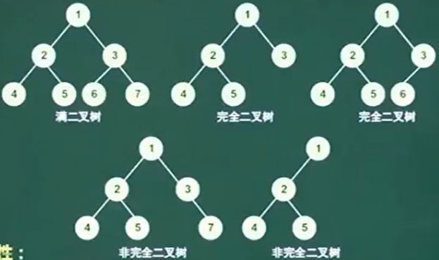
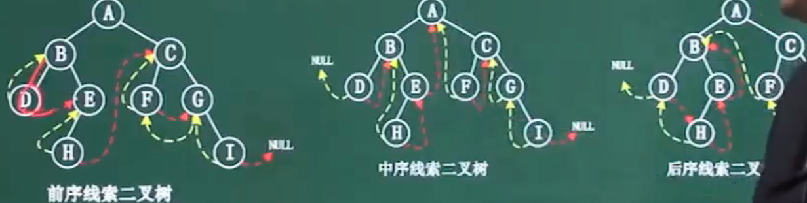
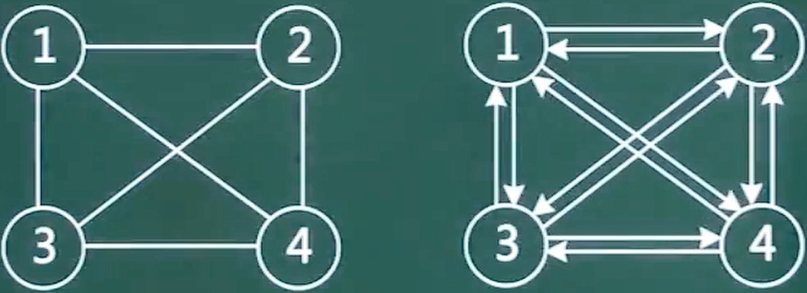
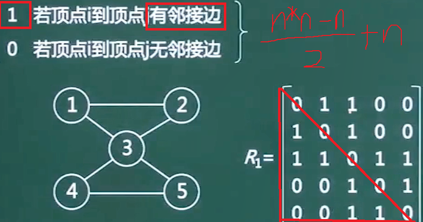
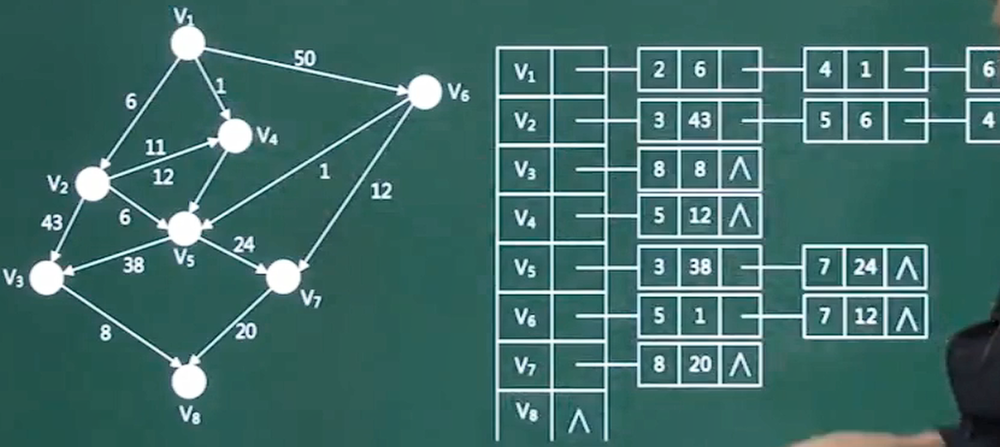
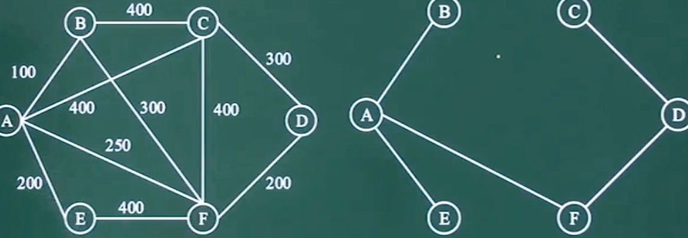

# 数组

行row	列col

二维数组有两种存储方式

​	按行存储 :先存完行再换行

​	按列存储

5行5列的二维数组a中 ,各元素占2个字节 ,求元素a[2,3]按行存储优先存储的位置		26

## 矩阵

### 稀疏矩阵

* 三角矩阵

# 线性表

* 顺序表
* 单链表

若对一个链表最常用的操作是在末尾插入结点和删除尾结点，则采用仅设尾指针的单向循环链表（不含头结点）时，插入操作的时间复杂度为O(1),删除操作的时间复杂度为O(n)

 

要删除尾指针所指结点，必须通过遍历操作找到尾结点的前驱结点

* 循环链表
* 双向链表

## 队列/栈

* 循环队列     

  ​    当head=tail时 ,队空		当(tail+1)%总长=head  需要取模

## 广义表

由n个表组成的有限序列

例如LS1=( a ,(b,c) ,(d,e) )

深度指的是括号的层数

取值 head ( LS1 ) =a

tail ( LS1 ) = (b,c) ,(d,e)

 head( head ( tail ( LS1) ) )

# 树

* 度	树的分叉

任意二叉树 ,叶子结点共x个 ,度为2的结点共y个 ,则x=y+1

## 遍历

  从上到下 ,从左到右

* 前序    12457836
* 中序    42785136
* 后序    48752631

## 查找二叉树

插入的关键字大于树根，则插入到右子树上，若小于树根，则插入到左子树上，若为空树，则作为树根结点

结点已存在则不插入

* 删除结点时

被删除结点只有一个孩子 ,直接替换掉被删除节点的位置

有2个孩子 ,在被删除结点的**左子树中序遍历**找到最大值 ,替换被删除结点

## 哈夫曼树

**8的值相同 ,被放在了右子树**

假设某消息中只包含7个字符怡{a,b,c,d,e,f,g}，折7个字符在消息中出现的次数为{5,24,8,17,34,f4,13}，利用哈夫曼树（最优二叉树）为该消息中的字符构造符合前缀编码要求的不等长编码。各字符的编码长度分别为（A）。

A.a:4,b:2,c:3,d:3,e:2,f:4,g:3      B.a:6,b:2,c:5,d:3,e:1,f:6,g:4

C.a:3,b:3,c:3,d:3,e:3,f:2,g:3      D.a:2,b:6,c:3,d:5,e:6,f:1,g:4

## 线索二叉树

线索二叉树记录了结点的前驱和后继	类似于双向循环链表

## 平衡二叉树

## 反向构造二叉树

必须有中序遍历才能反向构造

前序 ABHFDECG	中序HBEDFAGC

## 树转二叉树

孩子结点 -> 左子树		兄弟结点 -> 右孩子

上层和下层的连线只保留最左边 ,下层互相连接

最后旋转45度 ,得到答案

# 栈

# 队列

单向循环链表可以表示队列

一个线性序列经过队列结构后只能得到与原序列相同的元素序列，

而经过一个栈结构后则可以得到多种元素序列。

所以**两个栈可以模拟一个队列的入队和出队**

# 图

完全图

​	每对顶点都有一条边相连的无向图

​	每对顶点都有2条有向边互相连接的有向图

## 图的存储

### 邻接矩阵

**图有n个节点 ,就要用n*n的矩阵存储**

表示上下三角时 ,耗费空间

### 邻接表

V1 ->2 6 -> 4 1

代表V1 -> V2距离4 ,V1 -> V4距离1

## 图的遍历

## 拓扑图 AOV网络

用有向边表示活动的先后

## 最小生成树

下面关于图（网）的叙述，正确的是（58)。

 (58)A.连通无向网的最小生成树中，顶点数恰好比边数多1

B.若有向图是强连通的，则其边数至少是顶点数的2倍

C.可以采用AOV网估算工程的工期

D.关键路径是AOE网中源点至汇点的最短路径

***\*【答案】\*******\*A\****

***\*【解析】本题考查数据结构方面的基础知识。\****

在有向图中，若以顶点表示活动，用有向边表示活动之间的优先关系，则称这样的有向图为以顶点表示活动的网（Activity On Vertex Network, AOV网）。

若在带权有向图G中以顶点表示事件，以有向边表示活动，边上的权值表示该活动持续的时间，则这种带权有向图称为用边表示活动的网（Activity On Edge Network, AOE 网）通常在AOE网中列出了完成预定工程计划所需进行的活动、每项活动的计划完成时间、要发生哪些事件以及这些事件和活动间的关系，从而可以分析该项工程是否实际可行并估计工程完成的最短时间，分析出哪些活动是影响工程进度的关键。进一步可以进行人力、物力的调度和分配，以达到缩短工期的目的。

根据生成树的定义，有n个顶点的连通图的生成树中恰好有n-1条边。

# 算法思想

## 分治法

子问题相互独立且形式相同 ,可以通过递归解决

二分查找 ,斐波那契 ,**归并/快速排序** ,矩阵乘法 ,大整数乘法,汉诺伊塔

**归并排序不是归纳法!!!!!!!!!!**

## 回溯

是一种选优搜索法 ,可以求得多个解

N皇后 ,迷宫 ,背包

## 贪心

**局部最优** ,每一步选择当前的最优解

背包问题 ,多机调度(银行家算法) ,找零钱

## 动态规划

全局最优

斐波那契 ,矩阵乘法 ,背包 ,LCS最长公共子序列

**贪心法找到局部最优解	分治法找到可能不是最优的解	动态规划找到最优解**

# 时间复杂度

与树有关的都有log

nlog2n	**堆排序**

现需要对一个基本有序的数组进行排序。此时最适宜采用的算法为（A），时间复杂度为（A）。

(64)A.插入       B.快速       C.归并       D.堆

(65)A.O(n)       B.O(nlgn)      C.O(n²)       D.O(n²lgn)

插入排序对基本有序的数组排序速度快；插入排序的时间复杂度都是O(n)

