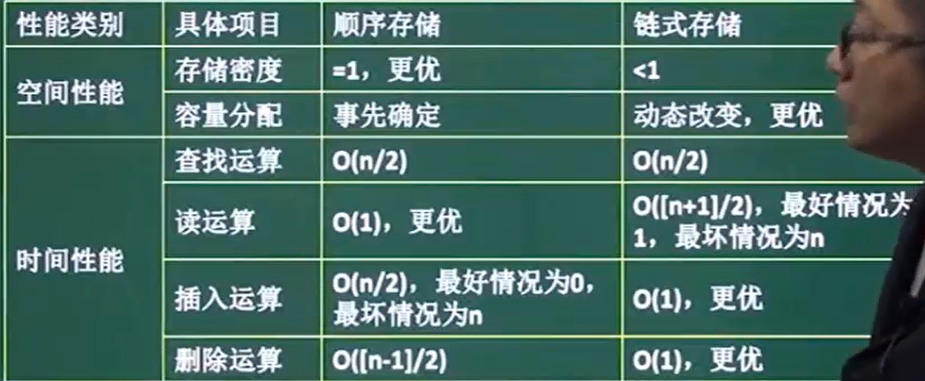
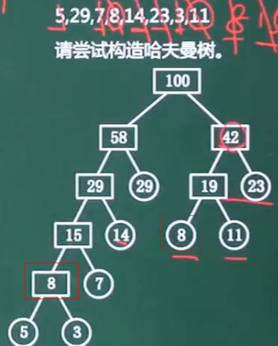

# 数组

行row	列col

二维数组有两种存储方式

​	按行存储 :先存完行再换行

​	按列存储

5行5列的二维数组a中 ,各元素占2个字节 ,求元素a[2,3]按行存储优先存储的位置		26

## 矩阵

### 稀疏矩阵

* 三角矩阵

# 线性表

* 顺序表

* 单链表

* 循环链表

* 双向链表

## 队列/栈

* 循环队列     

  ​    当head=tail时 ,队空		当(tail+1)%总长=head  需要取模

## 广义表

由n个表组成的有限序列

例如LS1=( a ,(b,c) ,(d,e) )

深度指的是括号的层数

取值 head ( LS1 ) =a

tail ( LS1 ) = (b,c) ,(d,e)

 head( head ( tail ( LS1) ) )

# 树

* 度	树的分叉

任意二叉树 ,叶子结点共x个 ,度为2的结点共y个 ,则x=y+1

## 遍历

  从上到下 ,从左到右

* 前序    12457836
* 中序    42785136
* 后序    48752631

## 查找二叉树

**左孩子小于根	右孩子大于根**

* 插入结点时

结点已存在 ,不插入

插入结点与父结点比较 ,就能知道在左还是右

* 删除结点时

被删除结点只有一个孩子 ,直接替换掉被删除节点的位置

有2个孩子 ,在被删除结点的**左子树中序遍历**找到最大值 ,替换被删除结点

## 哈夫曼树

**8的值相同 ,被放在了右子树**

## 线索二叉树

线索二叉树记录了结点的前驱和后继	类似于双向循环链表

## 平衡二叉树

## 反向构造二叉树

必须有中序遍历才能反向构造

前序 ABHFDECG	中序HBEDFAGC

## 树转二叉树

孩子结点 -> 左子树		兄弟结点 -> 右孩子

上层和下层的连线只保留最左边 ,下层互相连接

最后旋转45度 ,得到答案

# 算法思想

## 分治法

子问题相互独立且形式相同 ,可以通过递归解决

二分查找 ,斐波那契 ,归并/快速排序 ,矩阵乘法 ,大整数乘法,汉诺伊塔

## 回溯

是一种选优搜索法 ,可以求得多个解

N皇后 ,迷宫 ,背包

## 贪心

**局部最优** ,每一步选择当前的最优解

背包问题 ,多机调度(银行家算法) ,找零钱

## 动态规划

全局最优

斐波那契 ,矩阵乘法 ,背包 ,LCS最长公共子序列

**贪心法找到局部最优解	分治法找到可能不是最优的解	动态规划找到最优解**

# 时间复杂度

与树有关的都有log

nlog2n	**堆排序**

