# *7层模型*

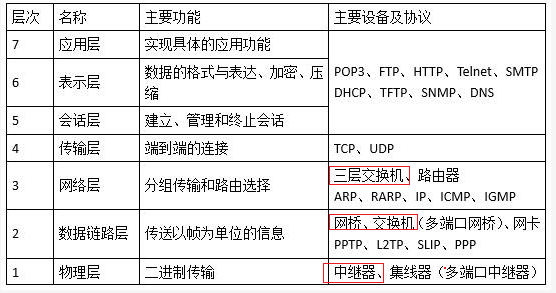

## 应用层

### 基于TCP

POP3	110		离线接收邮件     

FTP	上传20下载21

http 80		超文本传输协议

https 443	使用了SSL,安全

Telnet	23	远程访问   

SMTP	25	简单邮件

### 基于UDP

DHCP		67	动态ip地址分配

TFTP		69		传输文件

SNMP 	161	网络管理

DNS		53		域名解析

NFS					网络文件系统

## 表示层

定义数据格式及加密

## 会话层

它定义了如何开始、控制和结束一个会话

## 传输层 

TCP

UDP

## 网络层	包

对端到端的包传输进行定义，它定义了能够标识所有结点的逻辑地址，还定义了路由实现的方式和学习的方式。为了适应最大传输单元长度小于包长度的传输介质，网络层还定义了如何将一个包分解成更小的包的分段方法。示例：IP，IPX等。

三层交换机   有**路由功能的交换机**

路由器       解决交换机的广播冲突问题

**ARP	地址解析协议     IP->MAC		RARP反向地址解析    MAV->IP**

IP		网际协议

ICMP	因特网控制协议

IGMP	组播协议/网关信息协议

## 数据链路层	帧

它定义了在单个链路上如何传输数据。这些协议与被讨论的各种介质有关。

网桥

交换机	解决集线器存在的分流冲突问题 ,存在广播冲突问题

PPTP ,L2TP ,IP ,ICMP ,IGMP

## 物理层	bit

物理层常用多个规范完成对所有细节的定义，连接头、帧、帧的使用、电流、编码及光调制等都属于各种物理层规范中的内容。

集线器Hub	用于分流 ,存在**冲突域**

中继器       物理层   用于信号放大 ,网络传输有距离限制 ,中继器延长距离

CSMA/CD	载波监听多路访问

TokingRing	令牌环

# 协议

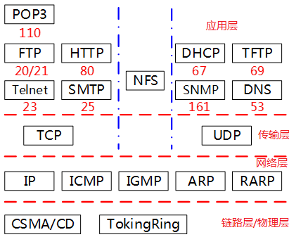                  

TLS      安全传输层协议,保密,数据完整

SSL       安全套接层  ,                ,与TLS类似,都是传输层

PGP      基于RSA公钥的**邮件加密**

IPSec     网络层的加密安全协议

SSL/HTTPS /PGP    跟邮件服务有关

 

序列号seq：4个字节，用来标记数据段的顺序，TCP把连接中发送的所有数据字节都编上一个序号，第一个字节的编号由本地随机产生；给字节编上序号后，就给每一个报文段指派一个序号

确认号ack：4个字节，期待收到对方下一个报文段的第一个数据字节的序号

确认ACK：占1位，仅当ACK=1时，确认号字段才有效。ACK=0时，确认号无效

同步SYN：连接建立时用于同步序号。当SYN=1，ACK=0时表示：这是一个连接请求报文段。若同意连接，则在响应报文段中使得SYN=1，ACK=1。因此，SYN=1表示这是一个连接请求，或连接接受报文。SYN这个标志位只有在TCP建产连接时才会被置1，握手完成后SYN标志位被置0。

终止FIN：释放连接。FIN=1表示：发送方的数据发送完毕，要求释放连接

 

大写表示标志位, 其值要么是1，要么是0；ack、seq小写的单词表示序号

# *TCP 面向连接的运输*

差错检测,重传,累积确认,定时器,用于序号和确认号的首部字段

 

原本为TCP/IP(传输控制协议/网际协议)一个协议,之后又被拆分为单独运行的两个部分,以便为应用提供广泛的支持,以及允许任何主机与链路层协议互操作

 

面向连接:	应用程序在向另一个应用程序发送数据之前,必须先握手

全双工服务:	双向传输数据

点对点		单个发送方与单个接收方之间连接

 

### **三次握手:(让我知道你已经知道)**

 

第一次握手：建立连接时，客户端发送syn包（syn=x）到服务器，并进入SYN_SENT状态，等待服务器确认；SYN：同步序列编号（Synchronize Sequence Numbers）。

第二次握手：服务器收到syn包，必须确认客户的SYN（ack=x+1），同时自己也发送一个SYN包（syn=y），即SYN+ACK包，此时服务器进入SYN_RECV状态；

第三次握手：客户端收到服务器的SYN+ACK包，向服务器发送确认包ACK(ack=y+1），此包发完毕，客户端和服务器进入ESTABLISHED（TCP连接成功）状态，完成三次握手。

 

前两次握手不包含应用层数据,第三次可以包含

### **四次挥手**

 

1）客户端进程发出连接释放报文，并且停止发送数据。释放数据报文首部，FIN=1，其序列号为seq=u（等于前面已经传送过来的数据的最后一个字节的序号加1），此时，客户端进入FIN-WAIT-1（终止等待1）状态。 TCP规定，FIN报文段即使不携带数据，也要消耗一个序号。

2）服务器收到连接释放报文，发出确认报文，ACK=1，ack=u+1，并且带上自己的序列号seq=v，此时，服务端就进入了CLOSE-WAIT（关闭等待）状态。TCP服务器通知高层的应用进程，客户端向服务器的方向就释放了，这时候处于半关闭状态，即客户端已经没有数据要发送了，但是服务器若发送数据，客户端依然要接受。这个状态还要持续一段时间，也就是整个CLOSE-WAIT状态持续的时间。

3）客户端收到服务器的确认请求后，此时，客户端就进入FIN-WAIT-2（终止等待2）状态，等待服务器发送连接释放报文（在这之前还需要接受服务器发送的最后的数据）。

4）服务器将最后的数据发送完毕后，就向客户端发送连接释放报文，FIN=1，ack=u+1，由于在半关闭状态，服务器很可能又发送了一些数据，假定此时的序列号为seq=w，此时，服务器就进入了LAST-ACK（最后确认）状态，等待客户端的确认。

5）客户端收到服务器的连接释放报文后，必须发出确认，ACK=1，ack=w+1，而自己的序列号是seq=u+1，此时，客户端就进入了TIME-WAIT（时间等待）状态。注意此时TCP连接还没有释放，必须经过2MSL（最长报文段寿命）的时间后，才进入CLOSED状态。

6）服务器只要收到了客户端发出的确认，立即进入CLOSED状态。可以看到，服务器结束TCP连接的时间要比客户端早一些。

# *面试题*

#### **为什么连接时三次，关闭时四次？**

答：因为当Server端收到Client端的SYN连接请求报文后，可以直接发送SYN+ACK报文。其中ACK报文是用来应答的，SYN报文是用来同步的。但是关闭连接时，当Server端收到FIN报文时，很可能并不会立即关闭SOCKET，所以只能先回复一个ACK报文，等所有的报文都发送完了，才能发送FIN报文，由于FIN和ACK不能一起发送。故需要四步握手。

#### **为什么TIME_WAIT状态要经过2MSL才能进入CLOSE状态？**

虽然按道理，四个报文都发送完毕，我们可以直接进入CLOSE状态了，但是我们必须假象网络是不可靠的，有可以最后一个ACK丢失。所以TIME_WAIT状态就是用来重发可能丢失的ACK报文。Client发送出最后的ACK可能会丢失。Server如果没有收到ACK，将不断重复发送FIN片段。所以Client不能立即关闭，它必须确认Server接收到了该ACK。Client会在发送出ACK之后进入到TIME_WAIT状态。Client会设置一个计时器，等待2MSL的时间。如果在该时间内再次收到FIN，那么Client会重发ACK并再次等待2MSL。所谓的2MSL是两倍的最长报文段寿命，也是单次发送和回复所需的最大时间。如果直到2MSL，Client都没有再次收到FIN，那么Client推断ACK已经被成功接收，则结束TCP连接。

#### **为什么不能用两次握手？**

3次握手的基本思想是”让我知道你已经知道”,既要双方做好发送数据的准备工作，也要允许双方就初始序列号进行协商，这个序列号在握手过程中被发送和确认。

​    现在把三次握手改成仅需要两次握手，死锁是可能发生的。作为例子，考虑计算机S和C之间的通信，假定C给S发送一个连接请求分组，S收到了这个分组，并发 送了确认应答分组。按照两次握手的协定，S认为连接已经成功地建立了，可以开始发送数据分组。可是，C在S的应答分组在传输中被丢失的情况下，将不知道S 是否已准备好，不知道S建立什么样的序列号，C甚至怀疑S是否收到自己的连接请求分组。在这种情况下，C认为连接还未建立成功，将忽略S发来的任何数据分 组，只等待连接确认应答分组。而S在发出的分组超时后，重复发送同样的分组。这样就形成了死锁。

#### **已经建立连接，客户端突然故障怎么办？**

TCP还设有一个保活计时器，显然，客户端如果出现故障，服务器不能一直等下去，白白浪费资源。服务器每收到一次客户端的请求后都会重新复位这个计时器，时间通常是设置为2小时，若两小时还没有收到客户端的任何数据，服务器就会发送一个探测报文段，以后每隔75秒发送一次。若一连发送10个探测报文仍然没反应，服务器就认为客户端出了故障，接着就关闭连接。

# *127.0.0.1 本地环回地址(loopback)*

在请求/接受数据时, client和server需要两个不同的ip地址。
要在本地测试时, 可以将我们本地ip当做客户端的地址,再把127.0.0.1当做服务器server的地址, 
这样一来，客户端向127.0.0.1发送请求, 就会从127.0.0.1得到返回数据。

# IP地址	网络号+主机号

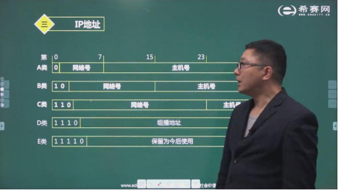

A类	00000000-01111111	0-127		24位主机号-->2^24-2

B类	10000000-10111111	128-191	16位主机号-->2^16-2

C类	11000000-11011111	198-223

主机号全为0 网络地址

​			全为1 广播地址

## 子网划分	向主机号借位

**子网掩码**	网络号和借位全表示为1 ,剩余主机号为0

**主机路由的子网掩码是255.255.255.255**

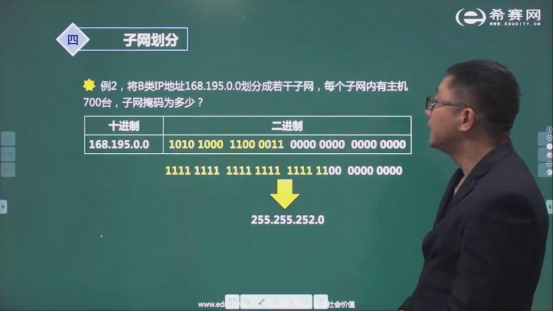

主机700台 ,需要10位主机号	总共16位主机号 ,划分6位到网络号

答案	255.255.252.0

# 网络规划与设计

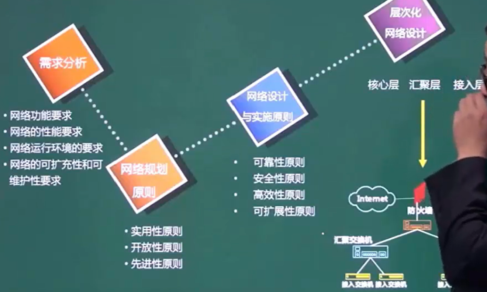

## 需求分析

网络功能要求

网络性能要求

运行环境要求

可扩充性/可维护性要求

## 网络规划原则

实用性原则

开放性

先进性

## 网络设计与实施原则

可靠性原则

安全性

高效性

可拓展性

## 层次化网络设计

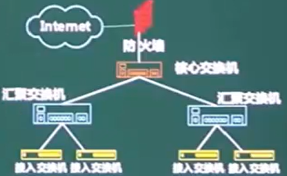

核心层		核心交换机	快速高效的数据分发 ,冗余控制

汇聚层		汇聚交换机	过滤 ,数据包处理,寻址

接入层		接入交换机	用户接入,计费管理,mac地址认证,收集用户信息

## 计算机网络分类

### 按范围分

局域

城域网

广域网

因特网

### 按拓扑分类

总线型		总线出现故障将导致瘫痪

星型			中心的负担重		也有双中心 ,但会造成设备冗余 ,成本上升

环型

# 网络接入技术

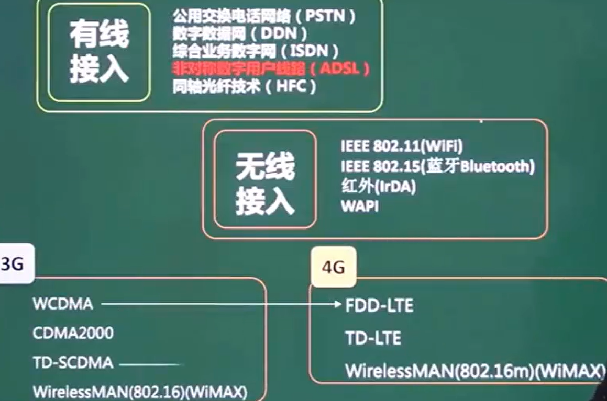

# HTML

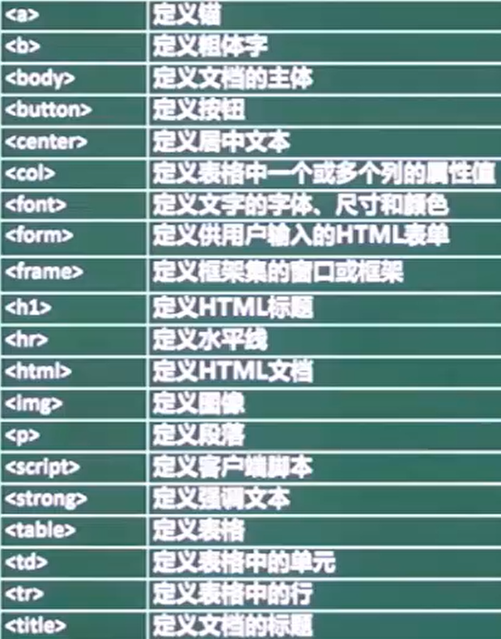

<I>	斜体字

alink		正在被点击的链接的颜色

vlink		已使用的链接的颜色

background	背景图片

bgcolor	文档整体背景颜色

# 对称加密与非对称加密

对称加密	双方使用同一套密钥	**加密强度低** ,**密钥分发困难** ,但效率高 ,

​		加密算法	DES	3DES	RC-5	IDEA

非对称加密	加密速度慢 ,加密强度高	**用接收方公钥加密 ,接收方用自己的私钥解密**

​		加密算法	RSA	ECC椭圆曲线加密算法

# 数字签名

证明文件是谁发的

使用**发送方的私钥签名**	发送方的公钥验签

在使用发送方的私钥签名时 ,会生成信息摘要

## 信息摘要

对比发送方发送的摘要 ,和接收方算出的摘要是否相同 ,判断文件有没有被篡改

摘要由**不可逆**的散列函数加密 ,生成**固定长度**的散列值

​		MD5	128位散列值		SHA	160位			SHA更安全

# PKI公钥体系(公钥管理)

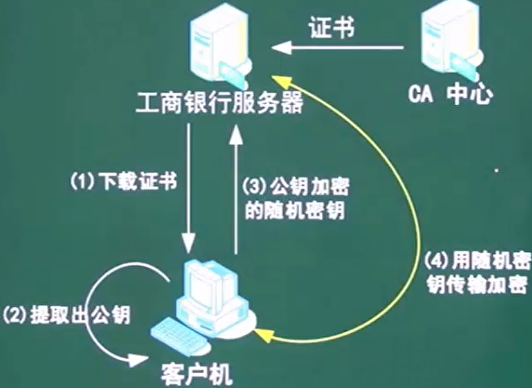

数字证书由CA发布 ,**附带CA签名**		CA还管理密钥注册 ,更新 ,注销

证书包含版本、序列号、签名算法标识符、签发人姓名、有效期、主体名和主体公钥信息等并附有CA的签名，**用户获取网站数字证书后通过CA签名**来确认数字证书的有效性，从而验证网站的真伪。

用户发送数据时使用网站的公钥加密（从数字证书中获得）,收到数据时使用网站的公钥验证网站数字签名，网站用私钥签名和对收到的消息解密。

# 网络安全

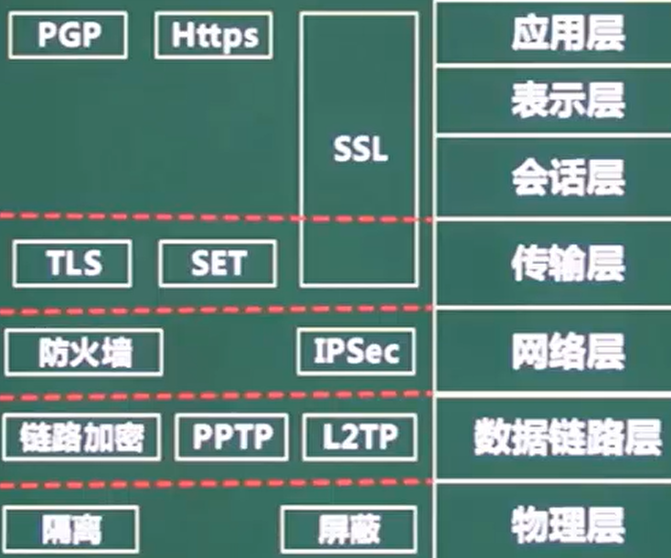

## 主动/被动攻击

主动攻击

​		中断(可用性)

​		篡改(完整性)

​		伪造(真实性)

​		Dos拒绝服务	攻击傀儡机 ,向服务器发起大量请求 ,服务器忙于处理傀儡机的请求 ,拒绝了真实用户的请求	网络宽带攻击,连通性攻击,SYN Flooding

​		资源使用

​		欺骗

​		伪装

​		重放

* 会话拦截

被动攻击	主要用**监听/分析**来获取数据

		* 消息内容获取	
		* 业务流分析
		* 系统干涉

## 防火墙

* 网络级防火墙

​		包过滤	只检查**数据源和目的地的ip和端口**	安全性低

​		状态检测	依据**状态表** 

* 应用级防火墙

​		双穴主机	外网->双穴主机->内网

​		屏蔽主机	外网->屏蔽路由器->堡垒主机->内网

​		**屏蔽子网** 	在外网与内网之间加入了**DMZ**

## 入侵检测技术

* 专家系统
* 模型检测
* 简单匹配

**漏洞扫描是另一种安全防护策略**

## 安全防范体系

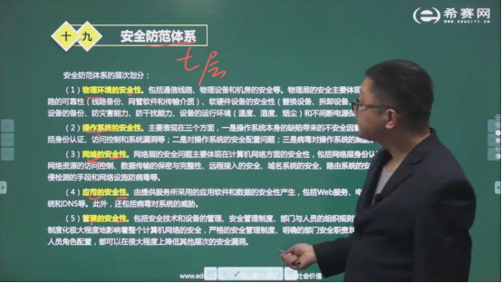

## 病毒/木马

病毒	无需联网 破坏计算机功能或数据 ,能自我复制

木马	用于**窃取信息** ,需要联网 ,后门程序 ,能远程控制

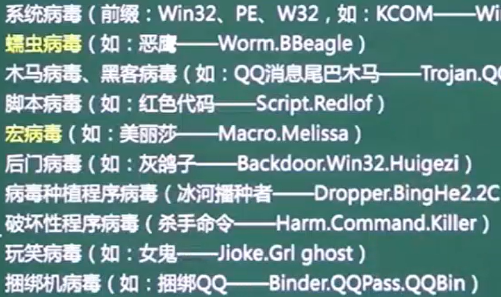

# 题型

## 集线器&交换机

集线器---一个冲突域,一个广播域

交换机---多个冲突域,一个广播域

ping      用户与外部站点的连通性

netstat   显示与ip,tcp等协议相关的统计数据

arp      查看arp缓存/解决地址解析问题

tracert   跟踪网络连接,查看在哪段路由出现连通问题

 

防火墙分为   内网->DMZ(缓冲区/隔离区)->外网

​     		功能:过滤不安全服务和非法用户,控制对特殊站点的访问,提供监视internet安全和预警的端点

DMZ隔离区	安装防火墙后,外部网络无法访问内部服务器,需要设立非安全系统与安全系统之间的缓冲区

**在DMZ上放置必须公开的服务器,如web服务器**

 

漏洞扫描能获取ftp服务器中是否存在可写目录

入侵检测是对防火墙的补充,拓展了系统管理员的安全管理能力,安全审计,监视,进攻识别和响应

 

windows的默认路由-----------没有可选路由时的最后选择

 

●主域名服务器在接收到域名请求后，首先查询的是（C）。

（70）A.本地hosts   B.转发域名服务器    C.本地缓存      D授权域名服务器.

## DNS故障判断

 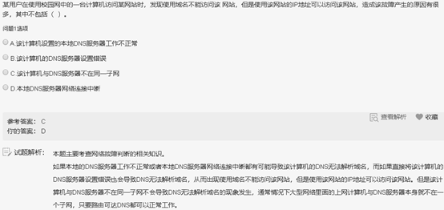

## 路由类型

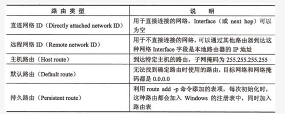

## IPV4 ->6

4->6的过渡期间,主要采用3种技术

* 双协议栈	主机同时运行4和6两种协议栈

* 隧道技术	在4之上连接6的站点 ,站点可以是若干台主机 .将6的分组封装到4的分组中 ,再通过4的路由体系传输 ,分组报头的**协议域为41** ,表示这是6的分组
* NAT-PT	  利用转换网关转换4和6 IP报头的地址 ,根据不同协议对分组语义翻译 ,从而使4和6之间透明通信

# 病毒/攻击

被动攻击:    获取消息内容/流量分析/系统干涉

主动攻击:    中断(会话拦截)/篡改/拒绝服务/资源使用/欺骗/伪装/重放

 

dos攻击:     使计算机或网络无法提供服务(网络宽带攻击,连通性攻击,SYN Flooding)

 

蠕虫病毒     针对基础设施(发电站等)    例如冲击波病毒

引导区病毒   破坏电脑引导盘/目录

宏病毒       与office相关

