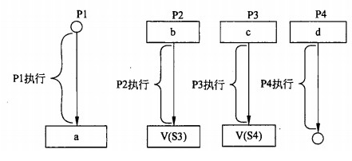

# 进制转换

## 短除法

## 分割法

## 数据的表示

对于计算 1-1	可以视为1+(-1)

* 正数 

**原反补相同**

* 负数

反码	除符号位以外 ,全部取反

**补码**	反码基础上+1							用于加减计算	对于1-1 ,只有补码是全0

移码	补码基础上 ,符号位取反			用于浮点数计算 ,移码有-0 ,不适合用于计算

**原/反 有-0**			**补/移只没有-0**

## 海明校验码

**多组**数位的奇偶校验 ,**纠错**

在数据位后面增加一些比特 ,检验数据有效性

**1个以上的校验位**

为了保证能够纠错 ,码间最小距离3

​	2k-1>=n+k	k海明码个数 ,n数据位个数

## 循环冗余校验码(CRC)

在k位信息码后再拼接r位的校验码，长度为k+r位的编码，

检错能力极强且开销小，易于用**编码器及检测电路**实现

**不能纠错**

## 数值表示范围

小数点不占位数	

**补码和移码没有-0 只有0**

## 浮点数

N = 尾数*基数^阶码

**尾数用补码	阶码用移码**

**小数向大数看齐** ,小数尾数右移

对阶 -> 尾数计算 -> 结果格式化

| 阶符 | 阶码 | 数符 | 尾数 |
| ---- | ---- | ---- | ---- |
|      |      |      |      |

# 存储管理

## 页式存储

将程序与内存划分为同样大小的块 ,以页单位将程序调入内存

逻辑地址 = **页号** + 页内地址

物理地址 = **页帧号** + 页内地址

* 优点	页面长度固定 ,利用率高 ,碎片小 ,分配管理简单

* 缺点	最后一页的零头无法被充分利用 ,按固定大小模块拆分 ,会导致频繁调进调出 ,增加系统开销 ,造成抖动现象

采用分页存储管理方式，下图给出了进程A和进程B的页表结构。如果物理页的大小为1K字节，那么进程A中逻辑地址为1024 (十进制)用变量存放在（3）号物理内存页中。

## 段式存储

对于上图 ,合法段	0-25K		

​				非法段	0-35K			0号的段长30K ,能放入25 ,不能放入35

按用户作业中的自然段来划分逻辑空间 ,然后调入内存 ,段的长度可以不一样

* 优点	多道程序共享内存 ,各段程序修改互不影响  段的分界与程序的自然分界相对应 ,因而具有逻辑独立性 ,易于编译 /管理/修改

* 缺点	长度可变导致分配空间不便 ,**容易在段间留下碎片**

## 段页式	较少考

先分段 ,再分页	页大小相同 ,段大小不同

优点	**空间浪费小** ,存储共享容易 ,存储保护容易 ,能动态连接

缺点	由于管理软件增加 ,造成复杂性和开销 ,需要的硬件也增加 ,**执行效率低**

### 页面置换算法

* 最优算法OPT    由系统判断哪个页不需要 ,进行删除   过于理想化
* 随机算法
* 先进先出FIFO    先掉进的可能在后面又被重复掉进 ,造成**抖动**
* 最近最少使用LRU    不会抖动    "局部性原理"理论依据
* 时间局部性    刚被访问的内容 ,立即又被访问
* 空间局部性    刚被访问的内容,邻近的空间立即又被访问

## 磁盘管理

磁道越来越小 ,但是密度越来越高 ,存储的数据是一样多的

磁头通过磁道和扇区来确定到存储位置

存取时间 = 寻道时间 + 等待时间

寻道时间	磁头移动到磁道

等待时间	磁头移动到扇区

==磁盘调度算法==

* 先来先服务 FCFS

* 最短寻道时间优先 SSTF

* 扫描算法 SCAN   也叫电梯算法 ,先从最里面到最外面 ,再从最外面到最里面      对于最外面和最里面不友好

* 循环扫描 CSCAN    只从里到外,到达最外圈时,直接返回,再次从里到外 ,是单边的循环

先来先服务和最短寻道时间可能随时改变移动臂的方向

读取数据时间 = 找磁道 +找扇区 + 传输时间

## 存储器

存储器按所处的位置可分为内存和外存。

按构成存储器的材料可分为磁存储器、半导体存储器和光存储器。

按存储器的工作方式可分为读写存储器和只读存储器。

按访问方式可分为按地址访问和按内容访问的存储器。

按寻址方式可分为随机存储器、顺序存储器和直接存储器。

相联存储器是一种按内容访问的存储器。

# 总线

包括数据总线、地址总线、控制总线

# DRAM / SRAM

DRAM（Dynamic Random Access Memory），即动态[随机存取存储器](https://baike.baidu.com/item/随机存取存储器)，最为常见的[系统内存](https://baike.baidu.com/item/系统内存)。

SRAM（Static Random Access Memory），即静态随机存取存储器。它是一种具有静止存取功能的内存，不需要刷新电路即能保存它内部存储的数据。

Caché，是 一种后关系型数据库。能并发访问同一数据的数据库技术。

EEPROM (Electrically Erasable Programmable read only memory)，[电可擦可编程只读存储器](https://baike.baidu.com/item/电可擦可编程只读存储器)--一种掉电后数据不丢失的[存储芯片](https://baike.baidu.com/item/存储芯片)。 EEPROM 可以在电脑上或专用设备上擦除已有信息，重新编程。一般用在即插即用。

# 程序查询方式

程序查询方式是通过**CPU执行程序**来查询状态的。 

DMA(Direct Memory Access，直接内存存取)，允许**不同速度**的硬件装置来沟通，而不需要依赖于 CPU 的大量中断负载。否则，CPU 需要从来源把每一片段的资料复制到[暂存器](https://baike.baidu.com/item/暂存器)，然后把它们再次写回到新的地方。在这个时间中，CPU 对于其他的工作来说就无法使用。

# 计算机结构

==五大件==	控制器 ,运算器 ,存储器 ,输入 ,输出设备组成

硬盘属于辅助存储器

运算器

* 算术逻辑单元ALU    负责算数/逻辑运算
* 累加寄存器AC       为算数逻辑提供临时空间 ，暂存数据
* 数据缓冲寄存器DR   写内存时，暂存指令或数据
* 状态条件寄存器     存状态/控制标志

控制器

* 程序计数器PC    存放下一条指令地址
* 指令寄存器IR     存放即将执行的指令
* 地址寄存器AR    记录cpu当前访问的指令地址
* 指令译码器      翻译指令
* 时序部件        指令顺序

控制器功能: 从内存中取出一条指令，并指出下一条指令在内存中的位置；对指令进行译码或测试，并产生相应的操作控制信号，以便启动规定的动作；**指挥并控制CPU、内存和输入输出设备之间数据的流动**

程序计数器（PC)是专用寄存器，具有**寄存信息和计数**两种功能，又称为指令计数器，在程序开始执行前，将程序的起始地址送入PC,该地址在程序加载到内存时确定，。执行指令时，CPU将自动修改PC的内容，指向下一条指令的地址。当遇到转移指令时，后继指令的地址根据当前指令的地址加上一个向前或向后转移的位移量得到，或者根据转移指令给出 的直接转移的地址得到。

**Cpu由运算器 ,控制器 ,寄存器和内部总线组成**

# 计算机体系结构分类 Flynn

# 进程管理

进程是程序在一个数据集合上运行的过程 ,系统进行**资源分配和调度的独立单位**

由**程序块 ,进程控制块PCB ,数据块**组成

**进程是程序的一次执行过程** ,程序是静态的 ,进程是动态的 .

## 3/5态模型

3态模型中 ,只有**运行–就绪能互相转换**

## 同步/互斥

* 同步->直接制约    a需要等待b的完成       单方等待
* 互斥->间接制约    ab互相争夺**临界资源**   双方等待

临界资源	互斥进程之间共享的资源     **不是指最大能调用的资源**

临界区		进程中访问临界资源的代码

信号量		特殊的变量

## PV操作

p申请资源(排队中)         v释放资源   s信号量(剩余可用资源)

p申请资源,s-1(资源-1) ,此时s<0进入阻塞

v释放资源,s+1         ,s<=0进入阻塞

 

同步信号量                     协调多个进程访问

互斥信号量   确保同一时间资源只被某一进程访问

单缓冲区同步模型

S1市场中的产品数量		S2

P(S1)申请生产产品的资源	V(S2)唤醒消费

P(S2)申请产品进行消费		V(S1)唤醒生产

**进来的箭头是P ,出去的箭头是V**

对于购书者 ,付款时先唤醒收银员V(S1) ,再通知第二个购书者P(S2)

对于消费者 ,收费时先申请资源P(S1) ,再唤醒第二个购书者

前驱图 ,只有等abc都完成了 ,d才能开始

若用PV操作控制这几个进程并发执行的过程，则需要设置4个信号量SI、S2、S3 和S4,且信号量初值都等于零。下图中a和b应分别填写（25)，c和d应分别填写(26)。

(25)A.P(S1) P(S2) 和 P(S3)     B.P(S1) P(S2) 和 V(S1)

​    C.V(S1) V(S2) 和 P(S1)     D.V(S1) V(S2) 和 V(S3)

(26)A.P(S1) P(S2) 和 P(S4)     B.P(S2) P(S3) 和 P(S4)

C.V(S1) V(S2) 和 V(S4)     D.V(S2) V(S3) 和 V(S4)

**【答案】C B**

根据题意，进程P2、P3等待P1的结果，因此当P1执行完毕需要使用V操作通知 P2、P3,即 a 处填 V (SI) V (S2), b 处应填P (S1)。

根据题意，进程P3要执行需要测试P1、P2有没有消息，故应该在c处填P (S2)、P (S3)。当P3执行完毕需要使用V操作通知P4，即在d处填P (S4)。

## 死锁

四大必要条件     互斥/环路等待/保持和等待/不剥夺

不剥夺:	资源不会被释放,也不会借给别的进程

 

### 避免死锁	(打破4个必要条件) 

* 有序资源分配法       预留1个资源轮流分配

* 银行家算法          按什么顺序运行不会死锁

不超过**最大资源**数/不超过**自身需求**/资源不足时**推迟**分配

程序计数器/寄存器/栈 是线程私有的,其余资源被各个线程共享

 

## 索引文件结构

0-9 直接索引 ,存储10kb

10 一级索引 ,4b一索引 ,存储256kb

11 二级索引 ,存储256*256=64Mb

地址按顺序存储

总共13kb的索引节点,每个节点1kb,索引最小4b

0-9的索引节点    采用直接索引 指向1kb的物理盘块,保存10kb内容     范围0-10239

10节点,将1kb分成256个4b的索引,每个索引指向1kb的物理盘块,保存了256kb内容

11节点,( 将1kb分成256个4b的索引)*2          保存了64mb

12节点                                                 16gb

# 作业

## 4个状态

提交	后备	执行	完成

## 调度算法

* 先来先服务
* 时间片轮转
* 短作业优先
* 最高优先权优先
* 高响应比优先      响应比=作业等待时间/执行时间

# 设备管理

## 数据传输控制方式

* 程序控制(查询)	分为无条件传送和程序查询2种 ,方法简单 ,**硬件开销少** ,但**IO能力低** ,影响cpu利用率

* 程序中断	cpu无需等待 ,提高传世请求的响应速度

* **DMA**	在主存和外设之间实现高速 ,批量数据交换而设置 ,DMA与CPU无关

* 通道方式

* IO处理机

从上到下效率递增

## 虚设备与SPOOLING假脱机技术

SPOOLING是关于慢速字符设备如何与计算机主机交换信息的一种技术 ,通过**磁盘**实现

