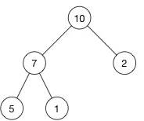
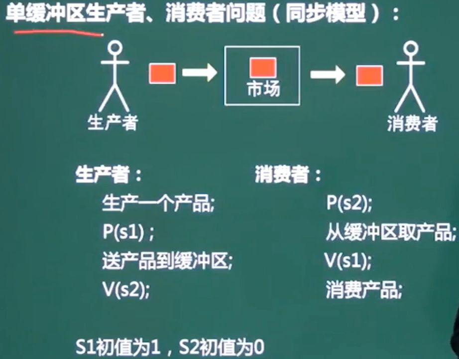

# 进制转换

* 短除法

* 分割法

## 数据的表示

对于计算 1-1	可以视为1+(-1)

* 正数 

  * **原反补相同**

* 负数

  * 反码	除符号位以外 ,全部取反
  * 补码	反码基础上+1			**用于加减计算**	对于1-1 ,只有补码是全0
  * 移码	补码基础上 ,符号位取反	**用于浮点数计算** ,移码有-0 ,不适合用于计算

* **原/反 有-0,**补/移只有0

## 浮点数

N = 尾数*基数^阶码

==小数点不占位数==,靠尾数和阶码定位小数点,所以==一个数的浮点数不唯一==,多种浮点数可以表示同一个数

**尾数用补码	阶码用移码**

**小数向大数看齐** ,小数尾数右移

对阶 -> 尾数计算 -> 结果格式化

| 阶符 | 阶码 | 数符 | 尾数 |
| ---- | ---- | ---- | ---- |
|      |      |      |      |

# 校验码

## 码距

两个码之间**变化最小**的二进制位数为码距

01->10	变化2位 ，码距2		0->1	码距1

并不是4	而是考虑最小

## 奇偶校验	

若干位有效信息 ,再加上一个二进制位(校验位)组成校验码

==奇校验	有效信息+校验位中 ,1出现奇数次==

**只能检查1位的错误**

## 循环校验码CRC

在k位信息码之后拼接r位校验码 ,利用了**模2除法**进行校验

只能检错 **,不能纠错**		易于用**编码器及检测电路**实现

将余数拼接到后面 ,再次进行除法 ,如果仍能除尽 ,则正确

## 海明校验码

**多组**数位的奇偶校验,在数据位后面增加一些比特 ,**能纠错**

**1个以上的校验位**

为了保证能够纠错,码间**最小距离3**

​	2^k-1>=n+k	k海明码个数 ,n数据位个数

# 存储管理

## 页式存储

将程序与内存划分为同样大小的块 ,以页单位将程序调入内存

逻辑地址 = **页号** + 页内地址

物理地址 = **页帧号** + 页内地址

* 优点	页面长度固定 ,利用率高 ,碎片小 ,分配管理简单

* 缺点	最后一页的零头无法被充分利用 ,按固定大小模块拆分 ,会导致频繁调进调出 ,增加系统开销 ,造成抖动现象

采用分页存储管理方式，下图给出了进程A和进程B的页表结构。如果物理页的大小为1K字节，那么进程A中逻辑地址为1024存放在**（3）**号物理内存页中

某进程有5个页面，页号为0〜4,页面变换表如下所示。表中状态位等于0和1分 别表示页面不在内存或在内存。若系统给该进程分配了3个存储块，当访问的页面3不在内存时，应该淘汰表中页号为（25）的页面。假定页面大小为4KB，逻辑地址为十六进制2C25H,该地址经过变换后，其物理地址应为十六进制（26)。

(25)A.0       B.1       C.2       D.4

(26)A.2C25H     B.4096H     C.4C25H     D.8C25H

**【答案】A C**

**【解析】**

根据题意，页面变换表中状态位等于0和1分别表示页面不在内存或在内存，所以0、2和4号页面在内存。当访问的页面3不在内存时，系统应该首先淘汰未被访问的页面，因为根据程序的局部性原理，最近未被访问的页面下次被访问的概率更小；如果页面最近都被访问过，应该先淘汰未修改过的页面。因为未修改过的页面内存与辅存一致，故淘汰时无需写回辅存，使系统页面置换代价小。经上述分析，0、2和4号页面都是最近被访问过的，但2和4号页面都被修改过而0号页面未修改过，故应该淘汰0号页面。

  (26) 根据题意，页面大小为4KB，逻辑地址为十六进制2C25H 其页号为2,页内地址为C25H，查页表后可知页帧号（物理块号）为4,该地址经过变换后，其物理地址应为页帧号4拼上页内地址C25H，即十六进制4C25H。

假设一台按字节编址的16位计算机系统，采用虚拟页式存储管理方案，页面的大小为2K，且系统中没有使用快表（或联想存储器)。某用户程序如图a所示，该程序的页面变换表如图b所示，表中状态位等于1和0分别表示页面在内存或不在内存。

 

　　图a中MOVE Datal, Data2是一个4字节的指令，Datal和Data2表示该指令的两个32位操作数。假设MOVE指令存放在2047地址开始的内存单元中，Datal存放在6143 地址开始的内存单元中，Data2存放在10239地址开始的内存单元中，那么执行MOVE 指令将产生（26)次缺页中断,其中：取指令产生（27)次缺页中断，取Datal和 Data2操作数分别产生（28)次缺页中断。

(26)A.3				B.4				C.5				D.6

(27)A.0				B.1				C.2				D.3

(28)A.1、1			B.1、2			C.2、2			D.2、3

答案】C  B  C

【解析】本题考查操作系统中系统内存管理方面的知识

从题图中可见，程序的MOVE指令跨两个页面，且源地址Datal和目标地址Data2所涉及的区域也跨两个页面的页内地址， 根据题意1、2、3、4和5号页面不在内存，系统取“MOVE Datal，Data2”的指令时， 由于该指令跨越两个页面0、1，查页面变换表可以发现1号页面不在内存，故需要产生一次缺页中断；取地址为Datal的操作数时，由于该操作数不在内存且跨两个页面2、3, 需要将2、3页面装入内存，所以产生两次缺页中断；同理，取地址为Data2的操作数时， 由于该操作数不在内存且跨两个页面4、5,需要将4、5页面装入内存，所以产生两次缺页中断，共产生5次缺页中断。

## 段式存储

对于上图 ,合法段	0-25K		

​				非法段	0-35K			0号的段长30K ,能放入25 ,不能放入35

按用户作业中的自然段来划分逻辑空间 ,然后调入内存 ,段的长度可以不一样

* 优点	多道程序共享内存 ,各段程序修改互不影响  段的分界与程序的自然分界相对应 ,因而具有逻辑独立性 ,易于编译 /管理/修改

* 缺点	长度可变导致分配空间不便 ,**容易在段间留下碎片**

## 段页式	较少考

先分段 ,再分页	页大小相同 ,段大小不同

优点	**空间浪费小** ,存储共享容易 ,存储保护容易 ,能动态连接

缺点	由于管理软件增加 ,造成复杂性和开销 ,需要的硬件也增加 ,**执行效率低**

### 页面置换算法

* 最优算法OPT    由系统判断哪个页不需要 ,进行删除   过于理想化
* 随机算法
* 先进先出FIFO    先掉进的可能在后面又被重复掉进 ,造成**抖动**
* 最近最少使用LRU    不会抖动    "局部性原理"理论依据
* 时间局部性    刚被访问的内容 ,立即又被访问
* 空间局部性    刚被访问的内容,邻近的空间立即又被访问

## 磁盘管理

磁道越来越小 ,但是密度越来越高 ,存储的数据是一样多的

磁头通过磁道和扇区来确定到存储位置

存取时间 = 寻道时间 + 旋转延迟时间 + 等待时间

寻道时间	磁头移动到磁道

等待时间	磁头移动到扇区

==磁盘调度算法==

* 先来先服务 FCFS

* 最短寻道时间优先 SSTF

* 扫描算法 SCAN   也叫电梯算法 ,先从最里面到最外面 ,再从最外面到最里面      对于最外面和最里面不友好

* 循环扫描 CSCAN    只从里到外,到达最外圈时,直接返回,再次从里到外 ,是单边的循环

先来先服务和最短寻道时间可能随时改变移动臂的方向

读取数据时间 = 找磁道 +找扇区 + 传输时间

## 存储器

存储器按所处的位置可分为内存和外存。

按构成存储器的材料可分为磁存储器、半导体存储器和光存储器。

按存储器的工作方式可分为读写存储器和只读存储器。

按访问方式可分为按地址访问和按内容访问的存储器。

按寻址方式可分为随机存储器、顺序存储器和直接存储器。

相联存储器是一种按内容访问的存储器。

# 总线

包括数据总线、地址总线、控制总线

# DRAM / SRAM

DRAM（Dynamic Random Access Memory），即动态[随机存取存储器](https://baike.baidu.com/item/随机存取存储器)，最为常见的[系统内存](https://baike.baidu.com/item/系统内存)。

SRAM（Static Random Access Memory），即静态随机存取存储器。它是一种具有静止存取功能的内存，不需要刷新电路即能保存它内部存储的数据。

Caché，是 一种后关系型数据库。能并发访问同一数据的数据库技术。

EEPROM (Electrically Erasable Programmable read only memory)，[电可擦可编程只读存储器](https://baike.baidu.com/item/电可擦可编程只读存储器)--一种掉电后数据不丢失的[存储芯片](https://baike.baidu.com/item/存储芯片)。 EEPROM 可以在电脑上或专用设备上擦除已有信息，重新编程。一般用在即插即用。

# 程序查询方式

程序查询方式是通过**CPU执行程序**来查询状态的。 

DMA(Direct Memory Access，直接内存存取)，允许**不同速度**的硬件装置来沟通，而不需要依赖于 CPU 的大量中断负载。否则，CPU 需要从来源把每一片段的资料复制到[暂存器](https://baike.baidu.com/item/暂存器)，然后把它们再次写回到新的地方。在这个时间中，CPU 对于其他的工作来说就无法使用。

# 计算机结构

==五大件==	控制器 ,运算器 ,存储器 ,输入 ,输出设备组成

硬盘属于辅助存储器

运算器

* 算术逻辑单元ALU    负责算数/逻辑运算
* 累加寄存器AC       为算数逻辑提供临时空间 ，暂存数据
* ==数据缓冲寄存器DR==   写内存时，暂存指令或数据
* 状态条件寄存器     存状态/控制标志

控制器

* 程序计数器PC    存放下条指令地址 ==唯一能被人为访问==
* 指令寄存器IR     存放正在执行的指令
* 地址寄存器AR    记录cpu当前访问的指令地址
* 指令译码器      翻译指令
* 时序部件        指令顺序

先把指令从内存储器取到**缓冲寄存器DR**中，再送入**指令寄存器IR**暂存，**指令译码器**根据IR的内容产生各种微操作指令，控制其他的组成部件工作

**Cpu由运算器 ,控制器 ,寄存器和内部总线组成**

## 计算机体系结构分类 Flynn

# 层次化存储结构

* CPU	寄存器		最快 ,容量小 ,成本高
* cache高速缓存      按内容存取

* 内存/主存	随机存储器RAM		只读存储器ROM

* 外存	硬盘/U盘

从上到下速度变慢

虚拟存储器	比主存更大,可随机访问地址空间

虚拟存储技术使==辅存和主存==密切配合， 对用户来说，好像计算机具有一个容量比实际主存大得多的主存可供使用，因此称为虚拟存储器。**虚拟存储器的地址称为虚地址或逻辑地址**

## Cache

cache通过程序的**局部性原理** ,改善系统性能

* 时间局部性 :	刚刚被访问过的内容可能还会被访问

* 空间局部性 :										旁边的地址可能被访问(可以防止抖动)

==命中率==

"cache+主存储器"周期 = h乘以cache周期 + (1-h)*主存储器周期

而h为命中率	1-h为失效率(没命中缓存,去命中主存)

==映像==

* 直接相联映像	硬件电路简单 ,**冲突率高**

主存只能固定地存储在cache中

之后放入的主存16页 ,将顶替cache0页上的主存0页 ,造成冲突而0页可能在后续被再次调用 ,会造成抖动

**主存标记+cache页号+业内地址**

* 全相联映像	电路难实现 ,只适合小cache ,冲突率低

主存可以放在cache的任意页

**主存标记+业内地址**

* 组相联映像		直接相联和全相联的**折中**

先分区 ,后分组

==同组之间使用全相联映像==

cache组号+组内页号+页内地址

* 地址映像	将主存和cache划分为若干大小相同的页(块)

## 主存

## 编址与计算

按字编址	存储单元是字

按字节编址	存储单元字节

所需芯片数=总容量/芯片容量

400H =2^10

又因为存储单元为16位

总容量=2^10*16bit

芯片容量=2^10*16bit/4

## 主机/外设数据传输控制方法

* 程序控制方式，由**CPU**执行程序控制数据的输入输出过程。

* 中断方式下，**外设**准备好输入数据或接收数据时向CPU发出**中断请求信号**，若CPU决定响应该请求，则暂停正在执行的任务，转而执行中断服务程序进行数据的输入输出处理，之后再回去执行原来被中断的任务。

* DMA方式下，CPU向**DMA控制器**下达指令，让DMA控制器来处理数据的传送，数据传送完毕再把信息反馈给CPU,减轻了CPU的负担

# 总线

一条主线同一时刻只允许**一个设备发送** ,但允许**多个设备接收**

* 数据总线DB	在CPU和RAM之间传输数据

* 地址总线AB	指定在RAM中存储的数据的地址

* 控制总线CB	将微处理器控制单元的信号传送到周边设备

==若内存容量为4GB，字长为32,则 地址总线和数据总线的宽度都为32==

## 并联串联

并联	R=1-（1-R1）*（1-R2）......

# 指令

一条指令就是机器语言中的一个语句

指令由操作码+地址码字段组成

操作码决定操作类型(加减乘除)

地址码决定操作数的位置

a+b=c	3地址

a+=b	2地址

a++		1地址

无需操作数	0地址

## 伪指令

伪指令语句用于指示汇编程序如何汇编源程序，常用于为汇编程序提供以下信息：该源程序如何分段，有哪些逻辑段在程序段中，哪些是当前段，它们分别由哪个段寄存器指向；定义了哪些数据，存储单元是如何分配的等。

伪指令语句除==定义的具体数据要生成目标代码==外，==其他不生成目标代码==。伪指令语句的这些命令功能是由汇编程 序在汇编源程序时，通过执行一段程序来完成的，而不是在运行目标程序时实现的。

## 寻址方式

* 立即寻址	指令存放操作数	速度快,灵活性差

* 直接寻址					操作数地址

  间接寻址								地址的地址

  寄存器寻址	寄存器存放操作数

  寄存器间接寻址						的地址

## CISC/RISC

| 指令系统类型 | 指令                                                         | 寻址方式     | 实现方式                                                   | 其他                      |
| ------------ | ------------------------------------------------------------ | ------------ | ---------------------------------------------------------- | ------------------------- |
| CISC 复杂    | 指令多,使用频率差别大,不定长格式                             | 支持多种寻址 | 微程序控制技术(微码)                                       | 研制周期长                |
| RISC 精简    | 指令少,使用频率接近,定长,多为**单周期指令**,操作**寄存器**,只有Load/Store操作内存 | 寻址单一     | 增加了通用寄存器(累加器),硬布线逻辑控制为主,适合采用流水线 | 优化编译,**支持高级语言** |

# 进程管理

进程是程序在一个数据集合上运行的过程 ,系统进行**资源分配和调度的独立单位**

由**程序块 ,进程控制块PCB ,数据块**组成

**进程是程序的一次执行过程** ,程序是静态的 ,进程是动态的 .

## 3/5态模型

3态模型中 ,只有**运行–就绪能互相转换**

## 同步/互斥

* 同步->直接制约    a需要等待b的完成       单方等待
* 互斥->间接制约    ab互相争夺**临界资源**   双方等待

临界资源	互斥进程之间共享的资源     **不是指最大能调用的资源**

临界区		进程中访问临界资源的代码

信号量		特殊的变量

## PV操作

p申请资源(排队中)         v释放资源   s信号量(剩余可用资源)

p申请资源,s-1(资源-1) ,此时s<0进入阻塞

v释放资源,s+1         ,s<=0进入阻塞

 

同步信号量                     协调多个进程访问

互斥信号量   确保同一时间资源只被某一进程访问

单缓冲区同步模型

S1市场中的产品数量		S2

P(S1)申请生产产品的资源	V(S2)唤醒消费

P(S2)申请产品进行消费		V(S1)唤醒生产

**进来的箭头是P ,出去的箭头是V**

对于购书者 ,付款时先唤醒收银员V(S1) ,再通知第二个购书者P(S2)

对于消费者 ,收费时先申请资源P(S1) ,再唤醒第二个购书者

前驱图 ,只有等abc都完成了 ,d才能开始

若用PV操作控制这几个进程并发执行的过程，则需要设置4个信号量SI、S2、S3 和S4,且信号量初值都等于零。下图中a和b应分别填写（25)，c和d应分别填写(26)。

(25)A.P(S1) P(S2) 和 P(S3)     B.P(S1) P(S2) 和 V(S1)

​    C.V(S1) V(S2) 和 P(S1)     D.V(S1) V(S2) 和 V(S3)

(26)A.P(S1) P(S2) 和 P(S4)     B.P(S2) P(S3) 和 P(S4)

C.V(S1) V(S2) 和 V(S4)     D.V(S2) V(S3) 和 V(S4)

**【答案】C B**

根据题意，进程P2、P3等待P1的结果，因此当P1执行完毕需要使用V操作通知 P2、P3,即 a 处填 V (SI) V (S2), b 处应填P (S1)。

根据题意，进程P3要执行需要测试P1、P2有没有消息，故应该在c处填P (S2)、P (S3)。当P3执行完毕需要使用V操作通知P4，即在d处填P (S4)。

进程P1、P2、P3、P4和P5的前趋图如下：

若用PV操作控制进程P1〜P5并发执行的过程，则需要设置6个信号量S1、S2、S3.S4.S5和S6,且信号量S1〜S6的初值都等于零。下图中a和b处应分别填写 (23)： c和d处应分别填写（24) , e和f处应分别填写（25)。

(23)A.P(S1) P(S2)和 P(S3)P(S4)   B.P(S1) V(S2)和 P(S2) V(S1) 

​    C.V(S1) V(S2)和 V(S3) V(S4)   D.P(S1) P(S2)和 V(S1) V(S2)

(24)A.P(S1) P(S2)和 V(S3) V(S4)   B.P(S1) P(S3)和 V(S5) V(S6) 

C.V(S1) V(S2)和 P(S3) P(S4)   D.P(S1) V(S3)和 P(S2) V(S4)

(25)A.P(S3) P(S4)和 V(S5)V(S6)   B.V(S5) V(S6)和 P(S5) P(S6)

C.P(S2) P(S5)和 P(S4) P(S6)   D.P(S4) V(S5)和 P(S5) V(S6)

**【答案】C B C**

**【解析】本题考査PV操作方面的基本知识。**

试题（23)的正确答案是C，因为P1是P3和P4的前驱，当P1执行完成后，应通知P3和P4，故应采用V(S1) V(S2)操作分别通知P3和P4;同理，P2是P3和P5的前驱，当P2执行完后，应通知P3和P5,故应采用V(S3)V(S4)操作分别通知P3和P5。

试题（24)的正确答案是B,因为P3是P1和P2的后继，当P3执行前应测试P1 和P2是否执行完，故应采用P(S1) P(S3)操作分别测试P1和P2是否执行完；又因为P3是P4和P5的前驱，当P3执行完应通知P4和P5,故应采用V(S5)V(S6)操作分别通知 P4 和 P5。

试题（25)的正确答案是C,因为P4是P1和P3的后继，当P4执行前应测试P1和P3是否执行完，故应采用P(S2) P(S5)操作分别测试P1和P3是否执行完；又因为P5是P2和P3的前驱的后继，当P5执行前应测试P2和P3是否执行完,故应采用P(S4) P(S6) 操作分别测试P2和P3是否执行完。

## 死锁

四大必要条件     互斥/环路等待/保持和等待/不剥夺

不剥夺:	资源不会被释放,也不会借给别的进程

 

### 避免死锁	(打破4个必要条件) 

* 有序资源分配法       预留1个资源轮流分配

* 银行家算法          按什么顺序运行不会死锁

不超过**最大资源**数/不超过**自身需求**/资源不足时**推迟**分配

程序计数器/寄存器/栈 是线程私有的,其余资源被各个线程共享

 

## 阻塞

进程资源图如图(a)和(b)所示，其中：图(a)中（25);图(b)中（26)。

 

(a)图

R1资源只有2个，P2申请该资源得不到满足，故进程P2是阻塞节点；同样R2资源只有3个，P1申请该资源得不到满足，故进程P1也是阻塞节点。可见进程资源图（a）是死锁的，该图不可以化简。

(b)图

R2资源有3个，已分配2个，P3申请1个R2资源可以得到满足，故进程P3可以运行完毕释放其占有的资源。这样可以使得Pl、P2都变为非阻塞节点，得到所需资源运行完毕，因此，进程资源图（b)是可化简的

## 索引文件结构

0-9 直接索引 ,存储10kb

10 一级索引 ,4b一索引 ,存储256kb

11 二级索引 ,存储256*256=64Mb

地址按顺序存储

总共13kb的索引节点,每个节点1kb,索引最小4b

0-9的索引节点    采用直接索引 指向1kb的物理盘块,保存10kb内容     范围0-10239

10节点,将1kb分成256个4b的索引,每个索引指向1kb的物理盘块,保存了256kb内容

11节点,( 将1kb分成256个4b的索引)*2          保存了64mb

12节点                                                 16gb

# 作业

## 4个状态

提交	后备	执行	完成

## 调度算法

* 先来先服务
* 时间片轮转
* 短作业优先
* 最高优先权优先
* 高响应比优先      响应比=作业等待时间/执行时间

# 设备管理

## 数据传输控制方式

* 程序控制(查询)	分为无条件传送和程序查询2种 ,方法简单 ,**硬件开销少** ,但**IO能力低** ,影响cpu利用率

* 程序中断	cpu无需等待 ,提高传世请求的响应速度

* **DMA**	在主存和外设之间实现高速 ,批量数据交换而设置 ,DMA与CPU无关

* 通道方式

* IO处理机

从上到下效率递增

## 虚设备与SPOOLING假脱机技术

SPOOLING是关于慢速字符设备如何与计算机主机交换信息的一种技术 ,通过**磁盘**实现

# 流水线

将指令的执行过程分为**取址,分析,执行**3步

## 超标量流水线

度为流水线条数		度为2的超标量流水线能同时执行2个操作

## 吞吐率   单位时间内流水线完成的数量

吞吐率TP=指令条数/执行时间

最大吞吐率=1/流水线周期

# 中断

当系统中有多个中断请求时，中断系统**按优先级进行排队**

在处理低级中断过程中又有高级中断申请中断，则高级中断可以打断低级中断处理，转去处理高级中断，等处理完高级中断后再返回去处理原来的低级中断，称为**中断嵌套**。实现中断嵌套用后进先出的栈来保护断点和现场最有效.

# 冗余技术

对于实现系统规定功能是多余的资源，包括硬/软件、指令,数据,存放和调用的空间和通道

* 结构冗余，按其工作方法可以分为静态、动态和混合冗余
* 信息冗余，指的是为了检测或纠正信息在运算或传输中的错误另外加的一部分信息
* 时间冗余，是指以重复执行指令或程序来消除瞬时错误带来的影响；
* 冗余附件技术，是指为实现上述冗余技术所需的资源和技术

