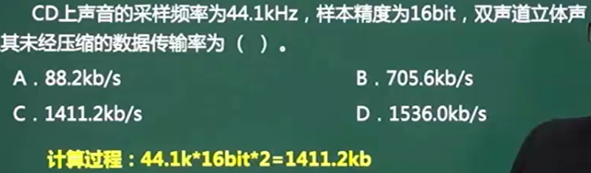
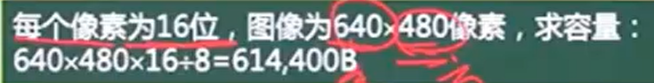
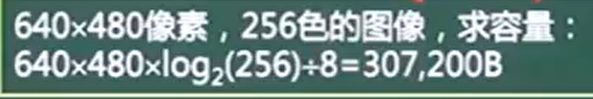
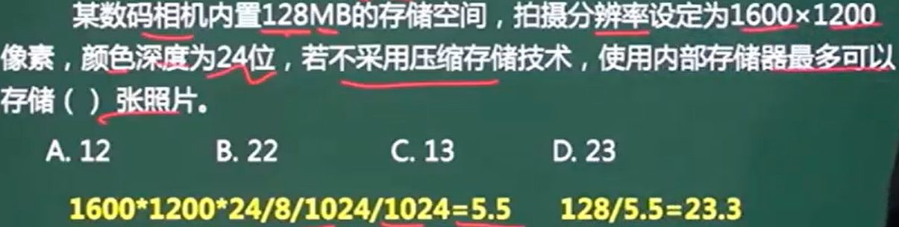
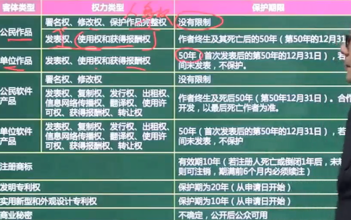
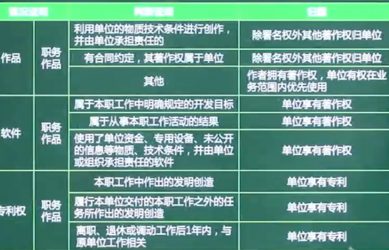
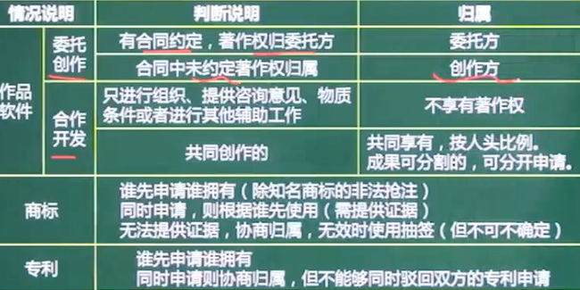
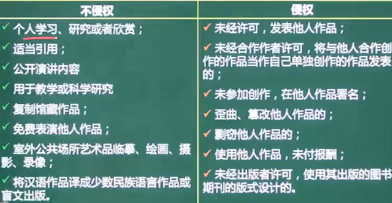

# 音频

说话频率在300-3400Hz

采样频率 (采样周期)

采样精度 (1/采样周期)

**采样频率应为采样精度的2倍**

==A/D转换==	采样 -> 量化 ->编码			模拟信号A		数字信号D

* 音频格式	WAVE (微软) ,MIDI (乐器) ,MP3 (Mpeg Player 3)

==每秒容量 =采样频率 x 量化/采样位数(位) x 声道数 / 8==

==每秒容量 =采样频率 x 精度 x 声道数==

kHz	而选项都是kb ,所以无需转化为更小的单位

# 图像

亮度	画面明亮程度

色调	颜色的种类

饱和度	颜色的纯洁性	**饱和度越低越接近灰色**

==容量==

* 已知像素 ,位数

容量 =像素 * 位数 /8

* 已知像素 ,色素

  容量 =像素 * log2(色数) /8			==2^位数 =色数==

# 媒体种类

* 感觉媒体	直接作用于人的感觉器官
  * 声音
  * 图像/动画

* 表示媒体	**用于传输或加工感觉媒体**
  * 编码方式 (文本/图像/声音编码)

* 显示媒体(表现媒体)	表现信息的**物理设备**
  * 输入输出设备 (显示器 麦克风)
  * 打印机
  * 音响

* 存储媒体
  * 磁盘 ,光盘
  * 内存

* 传输媒体
  * 电缆 ,光缆
  * 交换设备

# 数据压缩

空间冗余 (几何冗余)		背景是空的

时间冗余							部分时间是多余的

视觉冗余							

信息熵冗余

结构冗余							

知识冗余

# 多媒体标准

* JPEG-2000
  * 有损/无损 2种
  * 压缩比高
  * 小波变换
  * 医学图像应用

* JPEG
  * 有损
  * RGB转YUV
  * 离散余弦

* MPEG-1
  * 离散余弦
  * VCD
  * **MP3**

* MPEG-2
  * Huffman
  * DVD
  * 有线电视
  * AAC

* MPEG-4
  * 网络应用 /可视电话
  * **无线通信**
  * 增强**交互性**
  * 数码权限管理
  * 多媒体传输集成框架

* MPEG -7
  * **多媒体内容描述接口**
  * 不是编码标准

* MPEG-21
  * **融合不同协议****
  * 制定**新标准**
  * 标准集成

# 知识产权保护范围

| 法律                            | 保护范围            |                                                      |
| ------------------------------- | ------------------- | ---------------------------------------------------- |
| 著作权法                        | 著作权 文字/绘画    | 无需申请,作品完成即保护 .                            |
| 软件著作权法/计算机软件保护条例 | 软件著作权 软件作品 | 无需申请,作品完成即保护 .                            |
| 专利法                          |                     | **申请日开始**有效                                   |
| 商标法                          |                     | **审核通过**后有效                                   |
| 反不正当竞争法                  | **商业秘密权**      | **必需有保密措施**才能被保护     包括技术和经营2方面 |

# 保护期限

# 知识产权人

==委托创作未规定著作权 ,则归创作方==

==合作开发 ,辅助者无著作权 ,其余按人头比例/成果比例进行分割 ,分开申请==

==商标谁先申请归谁 ,同时申请则根据谁先使用==

==专利同时申请则协商归属 ,不能同时驳回双方申请==

# 侵权判定

中国公民/法人的作品 ,不论是否发表 ,都享有著作权

开发软件所用的思想 ,处理过程 ,操作方法,数学概念不受保护

法律法规 ,新闻 ,历法 ,公式等 ,没有著作权

