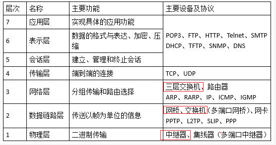
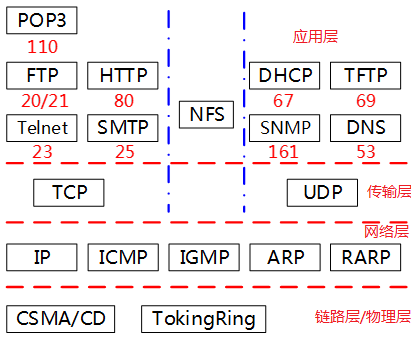
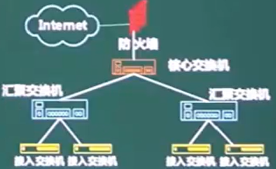
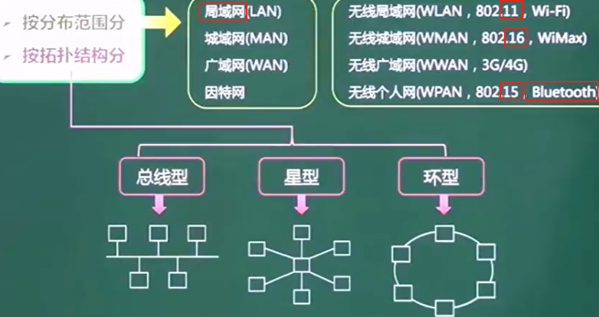
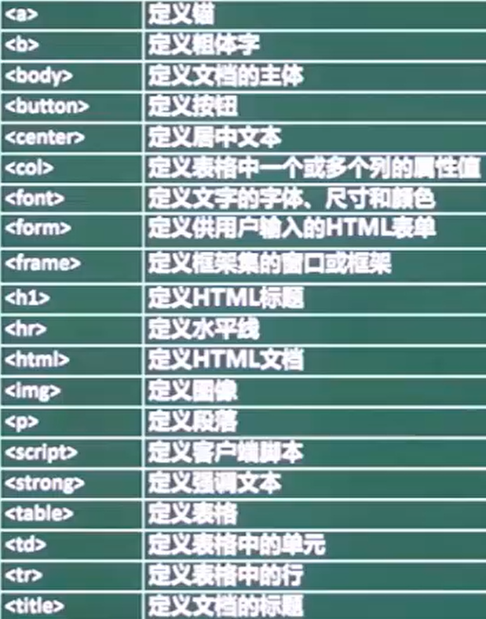
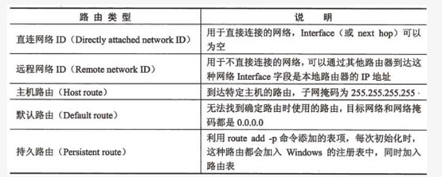

# *7层模型*

## 应用层

* 基于TCP
  * POP3	110	离线接收邮件
  * FTP	上传20	下载21

  * http    80	超文本传输协议
  * https 443	使用了SSL,安全
  * Telnet	23	远程访问   
  * SMTP	25	简单邮件

* 基于UDP
  * DHCP	67	动态ip地址分配
  * TFTP	69	传输文件
  * SNMP 	161	网络管理
  * DNS	53	域名解析

NFS		网络文件系统

## 表示层

定义数据格式及加密

## 会话层

定义了如何开始、控制和结束一个会话

## 传输层

TCP

UDP

## 网络层	包

对端到端的包传输进行定义，它定义了能够标识所有结点的逻辑地址，还定义了路由实现的方式和学习的方式。

为了适应最大传输单元长度小于包长度的传输介质，网络层还**定义了包的分段方法**,如IP，IPX等。

* 三层交换机   有**路由功能的交换机**

* 路由器       解决交换机的广播冲突问题

* ARP	地址解析协议     IP->MAC		RARP反向地址解析    MAC->IP

* IP		网际协议

* ICMP	因特网控制协议

* IGMP	组播协议/网关信息协议

## 数据链路层	帧

定义了在单个链路上如何传输数据

* 网桥

* **交换机	解决集线器存在的分流冲突问题,存在广播冲突问题**     ==多个冲突域,一个广播域==

PPTP ,L2TP ,IP ,ICMP ,IGMP

## 物理层	bit

用多个规范完成对所有细节的定义，如连接头、帧、帧的使用、电流、编码及光调制等

* 集线器Hub	用于分流,存在**冲突域**	==一个冲突域,一个广播域==

* 中继器       用于信号放大 ,延长网络传输距离限制

* CSMA/CD	载波监听多路访问

* TokingRing	令牌环

## 长/短连接

* 长连接
  * c与se建立连接后不断开，减少重复握手损耗。常用于点对点P2P通信
* 
* 
* 
* 短连接
  * C与s每进行报文传输时才连接。**常用于一点对多点通讯**

* 发送接收方式
  * 异步：报文发送和接收是分开的，相互独立，互不影响的。这种方式又分两种情况：异步双工：接收和发送在同一个程序中，有两个不同的子进程分别负责发送和接送。异步单工：接送和发送使用两个不同的程序来完成。
  * 同步：报文发送和接收是同步进行，即报文发送后等待接送返回报文。同步方式一般需要考虑超时问题，试想我们发送报文以后也不能无限等待啊，所以我们要设定一个等待时候。超过等待时间发送方不再等待读返回报文。直接通知超时返回。

* 报文格式
  * 非阻塞方式：读函数不停的进行读动作，如果没有报文接收到，等待一段时间后超时返回，**一般需要指定超时时间****
  * 阻塞方式：如果没有接收到报文，则读函数一直处于等待状态，直到报文到达。
    循环读写方式1、一次直接读写报文：在一次接收或发送报文动作中一次性不加分别地全部读取或全部发送报文字节。
  * 不指定长度循环读写：这一版发生在短连接进程中，受网络路由等限制，一次较长的报文可能在网络传输过程中被分解成很多个包，一次读取可能不能全部读完一次报文，这就需要循环读取报文，知道读完为止。
  * 带长度报文头循环读写：这种情况一般在长连接中，由于在长连接中没有条件能够判断循环读写什么时候结束。必须要加长度报文头。
    

# TCP

原本为TCP/IP(传输控制协议/网际协议)一个协议,之后又被拆分为单独的两个部分,以便提供广泛支持,以及允许任何主机与链路层协议互操作

 

* 面向连接	应用程序在向另一个应用程序发送数据之前,**必须先握手**

* 全双工服务	双向传输数据

* 点对点	**单个**发送方与单个接收方之间连接

* 差错检测

* 重传

* 累积确认

* 定时器

* 用于序号和确认号的首部字段
  * 序列号seq：4个字节，标记顺序，第一个字节的编号由本地随机产生；给字节编上序号后，就给每一个报文段指派一个序号
  * 确认号ack：4个字节，期待收到对方下一个报文段的第一个数据字节的序号
  * 确认ACK：占1位，**仅当ACK=1时，确认号字段才有效**。ACK=0时，确认号无效
  * 同步SYN：连接建立时用于同步序号。SYN=1，ACK=0表示：这是一个连接请求报文段。若同意连接，则在响应报文段中使得SYN=1，ACK=1。因此，SYN=1表示这是一个连接请求，或连接接受报文。SYN这个标志位**只有在TCP建产连接时才被置1，握手完成后被置0**
  * 终止FIN：FIN=1表示发送方的数据发送完毕，要求释放连接
  * ==大写表示标志位, 其值为1/0	ack、seq小写的单词表示序号==

 

## 三次握手(让我知道你已经知道)

 

* 第一次握手：建立连接
  * 客户端发送（syn=x）syn包到服务器，
  * 进入"同步已发送"SYN_SENT状态，等待服务器确认

* 第二次握手：服务器收到syn包
  * 确认客户的syn，返回（ack=x+1,syn=y）SYN+ACK包
  * 服务器进入"同步收到"SYN_RECV状态

* 第三次握手：客户端收到服务器的SYN+ACK包
  * 向服务器发送(ack=y+1）确认包ACK
  * 客户端和服务器都进入"已建立连接"ESTABLISHED"状态
  * 完成三次握手

 

==前两次握手不包含应用层数据==,第三次可以包含

## 四次挥手

 

1）客户端进程发出连接释放报文，并且停止发送数据。释放数据报文首部，FIN=1，其序列号为seq=u（等于前面已经传送过来的数据的最后一个字节的序号加1），此时，客户端进入FIN-WAIT-1（终止等待1）状态。 TCP规定，FIN报文段即使不携带数据，也要消耗一个序号。

2）服务器收到连接释放报文，发出确认报文，ACK=1，ack=u+1，并且带上自己的序列号seq=v，此时，服务端就进入了CLOSE-WAIT（关闭等待）状态。TCP服务器通知高层的应用进程，客户端向服务器的方向就释放了，这时候处于半关闭状态，即客户端已经没有数据要发送了，但是服务器若发送数据，客户端依然要接受。这个状态还要持续一段时间，也就是整个CLOSE-WAIT状态持续的时间。

3）客户端收到服务器的确认请求后，此时，客户端就进入FIN-WAIT-2（终止等待2）状态，等待服务器发送连接释放报文（在这之前还需要接受服务器发送的最后的数据）。

4）服务器将最后的数据发送完毕后，就向客户端发送连接释放报文，FIN=1，ack=u+1，由于在半关闭状态，服务器很可能又发送了一些数据，假定此时的序列号为seq=w，此时，服务器就进入了LAST-ACK（最后确认）状态，等待客户端的确认。

5）客户端收到服务器的连接释放报文后，必须发出确认，ACK=1，ack=w+1，而自己的序列号是seq=u+1，此时，客户端就进入了TIME-WAIT（时间等待）状态。注意此时TCP连接还没有释放，必须经过2MSL（最长报文段寿命）的时间后，才进入CLOSED状态。

6）服务器只要收到了客户端发出的确认，立即进入CLOSED状态。可以看到，服务器结束TCP连接的时间要比客户端早一些。

## **为什么连接时三次，关闭时四次？**

当Server端收到Client端的SYN连接请求报文后，可以直接发送SYN+ACK报文。其中ACK报文是用来应答的，SYN报文是用来同步的。

但关闭连接时，当Server收到FIN报文，很可能并**不会立即关闭SOCKET**，所以只能先回复一个ACK报文，等所有的报文都发送完了，才发送FIN报文，由于FIN和ACK不能一起发送。故需要四步握手。

## **为什么TIME_WAIT状态要经过2MSL才能进入CLOSE状态？**

2MSL是两倍的最长报文段寿命，也是单次发送和回复所需的最大时间

按道理，四个报文都发送完毕，我们可以直接进入CLOSE状态了，但是我们必须假象网络是不可靠的，有可以最后一个ACK丢失。

TIME_WAIT状态就是用来**重发可能丢失的ACK报文**。**Client发出最后的ACK可能会丢失。Server如果没有收到ACK，将不断发送FIN片段**。所以Client不能立即关闭，它必须确认Server接收到了该ACK。

Client会在发送出ACK之后进入到TIME_WAIT状态,再设置一个计时器，2MSL内再次收到FIN，那么Client会重发ACK并再次等待2MSL。

没有再次收到FIN，那么Client推断ACK已经被成功接收，结束TCP连接

## **为什么不能用两次握手？**

3次握手的基本思想是”让我知道你已经知道”,既要双方做好发送数据的准备工作，也要允许双方就初始序列号进行协商，这个序列号在握手过程中被发送和确认。

把三次握手改成仅需要两次握手，**可能发生死锁**。

假定C给S发送一个连接请求分组，S收到了这个分组，并发送了确认应答分组。

按照两次握手的协定，S认为连接成功建立，开始发送数据分组。

但C在S的应答分组在传输中被丢失的情况下，将不知道S是否已准备好,是否收到连接请求分组,序列号是多少

这种情况下，C认为连接还未建立成功，忽略S发来的数据分组，**只等待连接确认应答分组**。而S发出的分组超时后，**重复发送同样的分组**。这样就形成了死锁。

## **已经建立连接，客户端突然故障怎么办？**

保活计时器

服务器会一直等客户端回复,每收到一次客户端的请求后都会重新复位这个计时器，时间通常是设置为2小时

两小时还没有收到客户端的任何数据，服务器就会发送一个探测报文段，以后每隔75秒发送一次。若一连发送10个探测报文仍然没反应，服务器就认为客户端出了故障，关闭连接。

## 打开网页的过程

1. DNS解析
2. TCP连接
3. 发送HTTP请求
4. 服务器处理请求并返回HTTP报文
5. 浏览器解析渲染页面
6. 连接结束

# IP

网络+主机号

* 主机号全为0 网络地址

* ​     全为1 广播地址

|      |                   |         |                    |
| ---- | ----------------- | ------- | ------------------ |
| A类  | 00000000-01111111 | 0-127   | 24位主机号->2^24-2 |
| B类  | 10000000-10111111 | 128-191 | 16位主机号->2^16-2 |
| C类  | 11000000-11011111 | 198-223 |                    |

## IP VS MAC

* 两者地址使用不同
  * IP地址是指Internet协议使用的地址
  * MAC地址是Ethernet协议使用的地址。当存在一个附加层的地址寻址时，设备更易于移动和维修。

* 分配依据不同
  * IP地址的分配是基于网络拓朴，MAC地址的分配是基于制造商。
  * IP地址可以自动分配的，MAC地址唯一

## 子网划分	

==向主机号借位==

**子网掩码**	网络号和借位全1 ,主机号全0

**主机路由的子网掩码是255.255.255.255**

## 本地环回地址(loopback)

在请求/接受数据时, client和server需要两个不同的ip地址。
要在本地测试时, 可以将我们本地ip当做客户端的地址,再把127.0.0.1当做服务器server的地址, 
这样一来，客户端向127.0.0.1发送请求, 就会从127.0.0.1得到返回数据

## IPV4->6

4->6的过渡期间,主要采用3种技术

* 双协议栈	主机同时运行4和6两种协议栈

* 隧道技术	在4之上连接6的站点.==将6的分组封装到4的分组中,再通过4的路由体系传输== ,分组报头的**协议域为41**,表示是6的分组
* NAT-PT	 利用**转换网关**转换4和6 IP报头的地址 ,根据不同协议对分组语义翻译

## DNS

## HTTP VS HTTPS

* 安全性
  * http 明文
  * https 安全性的ssl加密传输

* 连接方式不同
  * http 无状态
  * https SSL＋HTTP协议构建的可进行加密传输、身份认证的网络协议

* 端口不同
  * http 80。
  * https 443．

* 证书申请方式不同
  * http：免费申请。
  * https：需要到ca申请证书，免费证书很少，需要交费。

# 网络规划与设计

* 需求分析
  * 网络功能要求
  * 网络性能要求
  * 运行环境要求
  * 可扩充性/可维护性要求

* 规划原则
  * 实用性
  * 开放性
  * 先进性

* 网络设计与实施原则
  * 可靠性
  * 安全性
  * 高效性
  * 可拓展性

## 层次化网络设计

核心层		核心交换机	快速高效的数据分发 ,冗余控制

汇聚层		汇聚交换机	过滤 ,数据包处理,寻址

接入层		接入交换机	用户接入,计费管理,mac地址认证,收集用户信息

## 计算机网络分类

* 按范围分
  * 局域
  * 城域网
  * 广域网
  * 因特网

* 按拓扑分类
  * 总线型		总线出现故障将导致瘫痪
  * 星型			中心的负担重		也有双中心 ,但会造成设备冗余 ,成本上升
  * 环型

## 网络接入技术

# HTML

<I>	斜体字

alink		正在被点击的链接颜色

vlink		已使用的链接颜色

background	背景图片

bgcolor	文档整体背景颜色

# 加密

发送数据	==发送方私钥签名,接收方公钥加密==

接收数据	==发送方公钥验签,接收方私钥解密==

==用证书来对验证身份;使用签名确保消息不可否认==

* 对称加密	加密解密同一套密钥	**加密强度低** ,**密钥分发困难** ,效率高
  * 加密算法	DES	3DES	RC-5	IDEA

* 非对称加密	速度慢,强度高	==接收方公钥加密 ,接收方私钥解密==
  * 加密算法	RSA	ECC椭圆曲线加密算法

## 数字签名

证明文件是谁发的

**发送方的私钥签名**	发送方的公钥验签

签名时会生成信息摘要

## 信息摘要

对比发送和接收的摘要是否相同,判断文件是否被篡改

摘要由**不可逆**的散列函数加密 ,生成**固定长度**的散列值

* MD5	128位散列值

* SHA	160位		SHA更安全

## PKI公钥体系

数字证书由CA发布 ,**附带CA签名**		CA还管理密钥注册 ,更新 ,注销

证书包含版本、序列号、签名算法标识符、签发人姓名、有效期、主体名和主体公钥信息等并附有CA的签名

# 网络安全

TLS      安全传输层协议,保密,数据完整

SSL       安全套接层  ,                ,与TLS类似,都是传输层

PGP      基于RSA公钥的**邮件加密**

IPSec     网络层的加密安全协议

SSL/HTTPS /PGP    跟邮件服务有关

## 主动/被动攻击

* 主动攻击
  * 中断(可用性)
  * 篡改(完整性)
  * 伪造(真实性)
  * ==DDos拒绝服务==
    * 傀儡机向服务器发起大量请求,服务器忙于处理请求
    * **SYN Flooding** 利用TCP协议的缺陷，攻击者首先伪造地址对服务器发起SYN请求，服务器回应ACK+SYN。而真实的IP对此不作回应。服务器没有收到回应，会重试3-5次并且等待一个SYN Time（一般30秒-2分钟）后，丢弃这个连接
  * 资源使用
  * 欺骗
  * 伪装
  * 重放
  * 会话拦截

* 被动攻击	主要用**监听/分析**来获取数据
  * 消息内容获取	
  * 业务流分析
  * 系统干涉

## 防火墙

过滤不安全服务和非法用户,控制对特殊站点的访问,提供监视internet安全和预警的端点

==防火墙分为   内网->DMZ(缓冲区/隔离区)->外网==

安装防火墙后,外部网络无法访问内部服务器,需要设立**非安全系统与安全系统之间的DMZ隔离区,在DMZ上放置必须公开的服务器,如web服务器**

* 网络级防火墙

  * 包过滤	只检查**数据源和目的地的ip和端口**	安全性低
  * 状态检测	依据**状态表**

* 应用级防火墙

  * 双穴主机	外网->双穴主机->内网
  * 屏蔽主机	外网->屏蔽路由器->堡垒主机->内网
  * 屏蔽子网 	在外网与内网之间加入了**DMZ**

## 入侵检测技术

对防火墙的补充,拓展了系统管理员的安全管理能力,安全审计,监视,进攻识别和响应

* 专家系统
* 模型检测
* 简单匹配

**漏洞扫描是另一种安全防护策略**,能检测ftp服务器中**是否存在可写目录**

## 病毒/木马

* ==病毒	无需联网== 破坏计算机功能或数据,能自我复制
  * **蠕虫病毒     针对基础设施**(发电站等)    例如冲击波病毒
  * 引导区病毒   破坏电脑**引导盘/目录**
  * **宏病毒**       感染文档、数据库、电子表格等文件

* 木马	用于**窃取信息** ,需要联网 ,后门程序 ,能远程控制

ping      用户与外部站点的连通性

netstat   显示与ip,tcp等协议相关的统计数据

arp      查看arp缓存/解决地址解析问题

tracert   跟踪网络连接,查看在哪段路由出现连通问题

 

## 路由类型

