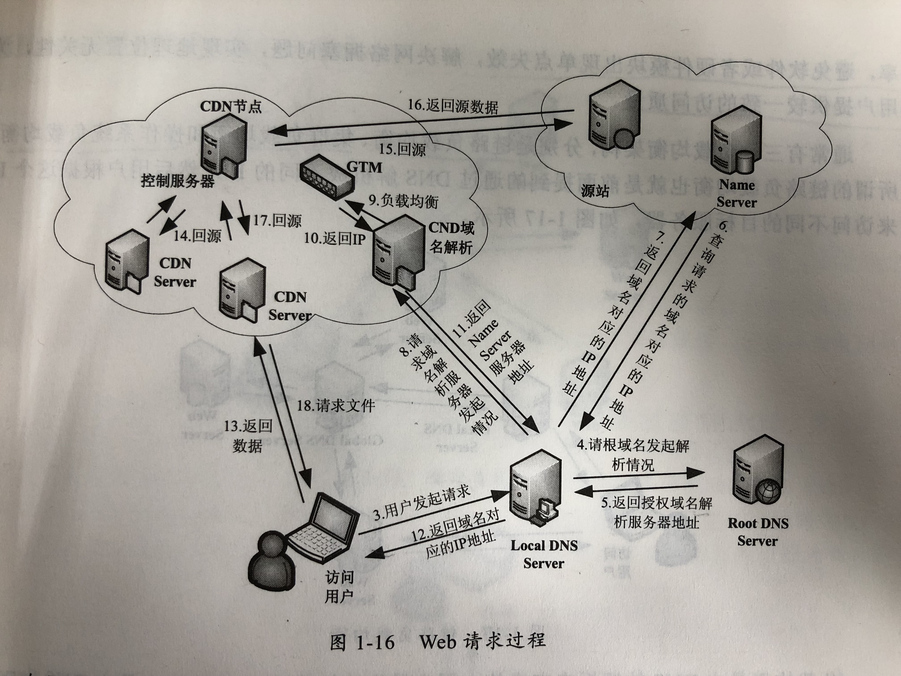
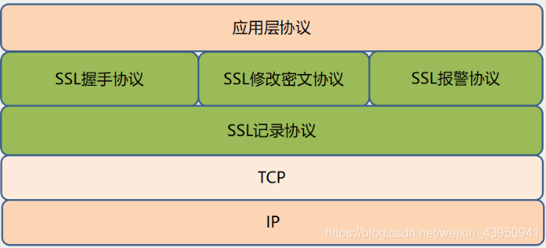
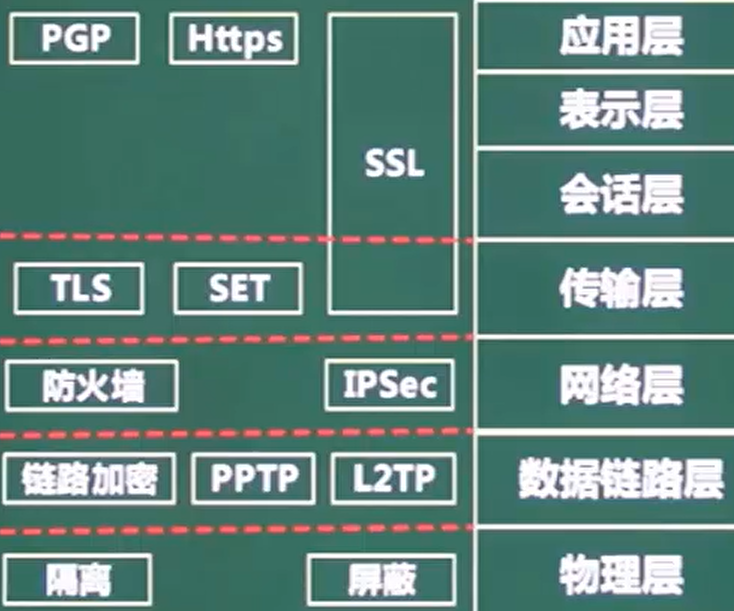

# *7层模型*


## 应用层


**这三层是socket编程，客户端与主机间通信**网络编程的重点！！！


* 基于TCP
  * POP3	110	离线接收邮件
  * FTP	上传20	下载21

  * http    80	超文本传输协议
  * https 443	使用了SSL,安全
  * Telnet	23	远程访问   
  * SMTP	25	简单邮件

* 基于UDP
  * DHCP	67	动态ip地址分配
  * TFTP	69	传输文件
  * SNMP 	161	网络管理
  * DNS	53	域名解析

NFS		网络文件系统


## 表示层


定义数据格式及加密


## 会话层


定义了如何开始、控制和结束一个会话


## 传输层


**按照规定协议来收发数据**


TCP

UDP


## 网络层	包


端到端(**寻找路由与确认主机**)

定义了能够标识所有结点的逻辑地址，还定义了路由实现的方式

为适应最大传输单元长度小于包长度的传输介质，**定义了包的分段方法**,如IP，IPX等

* 三层交换机   有**路由功能的交换机**

* 路由器       解决交换机的广播冲突问题


* ARP	地址解析协议     IP->MAC		RARP反向地址解析    MAC->IP

* IP		网际协议

* ICMP	因特网控制协议

* IGMP	组播协议/网关信息协议


## 数据链路层	帧


**保证数据的正确传输（校验）**

定义了在单个链路上如何传输数据


* 网桥

* **交换机	解决集线器存在的分流冲突问题,存在广播冲突问题**     ==多个冲突域,一个广播域==


PPTP ,L2TP ,IP ,ICMP ,IGMP


## 物理层	bit


数据转换（数字信号->电信号）

用多个规范完成对所有细节的定义，如连接头、帧、帧的使用、电流、编码及光调制等


==arp，rarp==


* 集线器Hub	用于分流,存在**冲突域**	==一个冲突域,一个广播域==

* 中继器       用于信号放大 ,延长网络传输距离限制


* CSMA/CD	载波监听多路访问

* TokingRing	令牌环


* 发送接收方式
  * 异步：报文发送和接收相互独立
    * 异步双工：接收和发送在同一个程序中，有两个不同的子进程分别负责发送和接送
    * 异步单工：接送和发送使用两个不同的程序来完成
  * 同步：报文发送和接收同步进行，需要考虑超时问题


* 报文格式
  * 非阻塞方式：读函数不停的进行读动作，如果没有报文接收到，等待一段时间后超时返回，**需要指定超时时间**
  * 阻塞方式：如果没有接收到报文，则读函数一直处于等待状态，直到报文到达。
    循环读写方式1、一次直接读写报文：在一次接收或发送报文动作中一次性不加分别地全部读取或全部发送报文字节。
  * 不指定长度循环读写：一般发生在短连接中，受网络路由等限制，一次较长的报文可能在网络传输过程中被分解成很多个包，一次读取可能不能全部读完一次报文，这就需要循环读取报文，知道读完为止
  * 带长度报文头循环读写：一般在长连接中，由于在长连接中没有条件能够判断循环读写什么时候结束。必须要加长度报文头。
    


# TCP


原本为TCP/IP(传输控制/网际协议)协议,之后被拆分为单独的两个部分,以便提供广泛支持,允许任何主机与链路层协议互操作

==在维持连接情况下，一个TCP可以发送多个HTTP请求==

 

* 面向连接	发送数据前,**先握手**

* 全双工服务

* 点对点	**单个**发送/接收方

* 差错检测

* 重传

* 累积确认

* 定时器

  * 序列号seq：4字节，标记顺序，第一个字节编号由本地随机产生

  * 确认号ack：4字节，期待收到对方下一个报文段的第一个数据字节的序号

  * 确认ACK：占1位，**仅当ACK=1时，确认字段才有效**

  * 同步SYN：连接建立时用于同步序号,**只在握手时才置1，握手完成置0**

    * SYN=1，ACK=0：连接请求报文段
    * SYN=1，ACK=1:同意连接

  * 终止FIN：FIN=1表示发送方的数据发送完毕，要求释放连接

    ==大写表示标志位, 其值为1/0	ack、seq小写的单词表示序号==


## 连接数量限制


`Chrome`最多允许对同一个`Host`建立六个`TCP`连接。不同的浏览器有区别


如果资源都是`HTTPS`连接并且在同一个域名下，那么浏览器在`SSL`握手之后会和S商量能不能用`HTTP2`，如果能的话就使用`Multiplexing`进行多路传输。不过也未必会所有挂在这个域名的资源都会使用一个`TCP`连接去获取，但Multiplexing很可能会被用到

如果用不了`HTTP2`,就会在一个`HOST`上建立多个`TCP`连接，**连接数量的最大限制取决于浏览器设置**，这些连接会在空闲的时候被浏览器用来发送新的请求，如果所有的连接都正在发送请求,其他请求阻塞


## 三次握手


==让我知道你已经知道==

重点是**协商初始序列号**,做好发数据的准备工作

* 3->2，**可能死锁**
  * C->S连接请求，S收到并确认应答,按照两次握手的协定，S认为连接成功建立，开始发送数据分组
  * 应答分组丢失，C不知道S是否已准备好,是否收到连接请求分组,序列号是多少,C认为连接未建立，忽略S发来的数据，**只等待连接确认应答分组**
  * 而S发出的分组超时后，**重复发送同样的分组**。形成死锁

==当S收到C的SYN连接请求报文后，可以直接发送SYN+ACK,所以只有3次==

 

* 第1次握手：建立连接
  * C->（SYN=1,seq=x） 连接请求
  * 进入"同步已发送"SYN_SENT状态，等待S确认

* 第2次握手：S收到SYN包
  * S->（ACK=1,ack=x+1,SYN=1,seq=y） 同意连接,同步序列号
  * S进入"同步收到"SYN_RECV状态

* 第3次握手：C收到S的SYN+ACK包
  * C->(ACK=1,ack=y+1,seq=x+1）  确认包
  * C和S都进入"已建立连接"ESTABLISHED"状态


==前两次握手不包含应用层数据==,第三次可以包含


## 四次挥手


* 第1次挥手
  * C->FIN=1，seq=u（之前数据的最后序号+1）  连接释放报文，并停止发送数据,释放数据报文首部
    * FIN报文段即使不携带数据，也要消耗一个序号
  * C进入FIN-WAIT-1（终止等待1）状态

* 第2次挥手
  * S->ACK=1，ack=u+1，seq=v   收到连接释放报文，发出确认报文
  * S通知高层的应用进程，释放C->S方向的连接，这时处于半关闭状态，即C没有数据要发送，但是S若发送数据，C依然要接受
  * S进入CLOSE-WAIT（关闭等待）状态,这个状态要持续一段时间
  * C收到S的连接释放报文
  * C进入FIN-WAIT-2（终止等待2）状态，等待S的连接释放报文

* 第3次挥手
  * S->FIN=1，ack=u+1,seq=w(半关闭状态下S很可能又发送了一些数据)    数据发送完毕，向C发送连接释放报文
  * S进入了LAST-ACK（最后确认）状态，等待C的确认释放

* 第4次挥手
  * C->ACK=1，ack=w+1，seq=u+1   收到S的连接释放报文后，必须回复确认释放报文
  * C进入了TIME-WAIT（时间等待）状态。==此时TCP连接还没有释放，必须经过2MSL（最长报文段寿命）的时间后，才进入CLOSED状态==
    * 2MSL:单次发送+回复所需的最大时间
    * **Client发出最后的ACK可能会丢失。Server如果没有收到ACK，将不断发送FIN片段**。所以Client不能立即关闭，它必须确认Server接收到了该ACK
    * 同时设置==计时器==，2MSL内再次收到FIN，那么Client会重发ACK并再次等待2MSL
  * S收到了C发出的确认释放，立即进入CLOSED状态,==S结束TCP连接的时间比C早==
  
    ****

当Server收到FIN报文，**不会立即关闭SOCKET**，只先回复一个ACK报文，等所有的报文都发送完了，才发送FIN报文,==由于FIN和ACK不能一起发送,需要四次==


## C突然故障


==保活计时器==

收到请求后重新复位计时器，时间通常2小时

两小时还没有收到任何数据，S就会发送一个探测报文段，以后每隔75秒发送一次。若一连发送10个探测报文仍然没反应，S就认为C出了故障，关闭连接


## 打开网页的过程


1. 浏览器根据域名,去调操作系统的gethostbyname()
2. gethostbyname()首先检查域名是否在本地Hosts里
3. 本地Hosts没有,通过网卡给DNS服务器发UDP请求,接收结果并返回给浏览器
4. 浏览器拿到解析的IP地址，建立TCP连接
5. 向IP发送HTTP请求
6. S处理请求并返回响应结果
7. 关闭TCP连接
8. 浏览器解析HTML,布局渲染


# IP


网络+主机号

* 主机号全为0 网络地址

* ​     全为1 广播地址

|      |                   |         |                    |
| ---- | ----------------- | ------- | ------------------ |
| A类  | 00000000-01111111 | 0-127   | 24位主机号->2^24-2 |
| B类  | 10000000-10111111 | 128-191 | 16位主机号->2^16-2 |
| C类  | 11000000-11011111 | 198-223 |                    |


## IP VS MAC


* 两者地址使用不同
  * IP地址是指Internet协议使用的地址
  * MAC地址是Ethernet协议使用的地址。当存在一个附加层的地址寻址时，设备更易于移动和维修。

* 分配依据不同
  * IP地址的分配是基于网络拓朴，MAC地址的分配是基于制造商。
  * IP地址可以自动分配的，MAC地址唯一


## 子网划分	


==向主机号借位==


**子网掩码**	网络号和借位全1 ,主机号全0

**主机路由的子网掩码是255.255.255.255**


## 本地环回地址(loopback)


在请求/接受数据时, client和server需要两个不同的ip地址。
要在本地测试时, 可以将我们本地ip当做C的地址,再把127.0.0.1当做Sserver的地址, 
这样一来，C向127.0.0.1发送请求, 就会从127.0.0.1得到返回数据


## IPV4->6

4->6的过渡期间,主要采用3种技术

* 双协议栈	主机同时运行4和6两种协议栈

* 隧道技术	在4之上连接6的站点.==将6的分组封装到4的分组中,再通过4的路由体系传输== ,分组报头的**协议域为41**,表示是6的分组
* NAT-PT	 利用**转换网关**转换4和6 IP报头的地址 ,根据不同协议对分组语义翻译


## HTTP VS HTTPS


* 安全性
  * http 明文
  * https 安全性的ssl加密传输

* 连接方式不同
  * http 无状态
  * https SSL＋HTTP协议构建的可进行加密传输、身份认证的网络协议

* 端口不同
  * http 80
  * https 443．

* 证书申请方式不同
  * http：免费申请
  * https：CA申请证书，免费证书少


# DNS


DNS域名系统（Domain Name System）


1. 根域名服务器：并不直接把待查询的域名直接解析出IP地址，而是告诉本地域名服务器应当找顶级域名服务器的IP
2. 顶级域名服务器：负责管理该顶级域名下的二级域名
3. 权限域名服务器：负责一个“区”的域名服务器
4. 本地域名服务器：离用户最近的DNS，当一个主机发出DNS查询请求时，这个查询请求报文就发送给本地域名服务器


2种DNS

* 在一个区中,主DNSS从自己本机的数据文件中读取该区的DNS数据信息

* 辅助DNSS从本区的主DNSS中读取该区的DNS数据信息
  * 辅助DNSS启动时，==用TCP与主DNSS通信==,**这是DNS唯一使用到TCP的地方**
  * 由于涉及到主从复制,而UDP不可靠,传输的数据量小,只能传512字节

==主要使用UDP==,只要一次请求/应答,而使用基于TCP的DNS协议要三次握手、发送数据以及应答、四次挥手。**但UDP协议传输内容不能超过512字节**。不过C向DNSS查询域名，一般返回的内容都不超过512字节


## 域名解析


* 浏览器缓存
  * 缓存大小/时间有限制，通常情况下为几分钟到几小时不等，域名被缓存的时间**通过TTL属性设置**
    * 缓存时间长，一旦IP变化，会导致被客户端缓存的域名无法解析到变化后的IP
    * 时间太短，会导致用户每次访问网站都要重新解析一次域名

* 操作系统缓存  操作系统也有域名解析的过程
  * Windows C:\Windows\System32\drivers\etc\hosts
  * Linux中 /etc/hosts
  * 用户可以将任何域名解析到任何能够访问的IP地址,利于测试
  * 正是因为有这种本地DNS解析的规程，黑客把特定的域名解析到他指定的IP地址上，==域名劫持==

* 本地域名服务器 LDNS  提供给用户本地互联网接入的DNS解析服务
  * 性能高，会缓存域名解析结果，当然缓存时间是受到域名的失效时间控制的。大约80%的域名解析到这里就结束了，LDNS承担了域名解析主要工作
  * 通常会在用户所在城市的某个角落，不会很远
  * Windows ipconfig，Linux cat /etc/resolv.conf 查询配置的DNS服务器

* 根域名服务器Root Server
  * 返回给LDNS所查询的主域名服务器（gTLD Server）地址。gTLD是国际顶级域名服务器

* LDNS再向gTLD发送请求

* gTLD服务器查找并返回此域名对应的Name Server域名服务器的地址
  * Name Server通常就是用户注册的域名服务器，例如用户在某个域名服务提供商申请的域名，域名解析任务就由这个域名提供商的服务器完成

* Name Server域名服务器查询存储的域名和IP的映射关系表，连同TTL值返回给DNS Server域名服务器

* LDNS缓存这个域名和IP的对应关系，缓存时间由TTL值控制

* 把解析的结果返回给用户，用户根据TTL值缓存在本地系统缓存中
* 域名解析结束

在实际的DNS解析过程中，可能还不止这10步，如Name Server可能有很多级，或者有一个GTM来负载均衡控制，这都有可能会影响域名解析过程


```shell
# dig www.persona6.cn	dig指令显示域名解析过程
#dig +trace

; <<>> DiG 9.11.4-P2-RedHat-9.11.4-26.P2.el7_9.2 <<>> www.persona6.cn
;; global options: +cmd
;; Got answer:
;; ->>HEADER<<- opcode: QUERY, status: NOERROR, id: 50379
;; flags: qr rd ra; QUERY: 1, ANSWER: 1, AUTHORITY: 0, ADDITIONAL: 1

;; OPT PSEUDOSECTION:
; EDNS: version: 0, flags:; udp: 4096

#查询内容
;; QUESTION SECTION:
##	域名			IN代表互联网		查询类型 A:IP	MX:邮件S	PTR:根据IP地址反查域名	CNAME:查询域名相关别名
;www.persona6.cn.	IN				A

;; ANSWER SECTION:
#查询结果
www.persona6.cn.	600	IN	A	120.76.132.188

;; Query time: 41 msec
;; SERVER: 100.100.2.136#53(100.100.2.136)
;; WHEN: Mon Nov 30 17:54:13 CST 2020
;; MSG SIZE  rcvd: 60
```


`www.persona6.cn`对应的真正的域名为`www.persona6.cn.`	

* 根域名	`.`	每个域名都有根域名，通常省略

* 顶级域名 `.com、.net`

* 2级域名 `.persona6`，用户自己注册

* 3级域名/主机名 `www`，用户在自己的域里面为S分配的名称


==先在本机的DNS查,再去根S查。发现属于`cn`域，**返回`com`域中的DNS的IP地址**==


## CDN


Content Delivery Network，即内容分发网络

目的是通过在现有的Internet中增加一层新的CACHE(缓存)层，将网站的内容发布到最接近用户的网络”边缘“的节点，使用户可以==就近获取网站内容==，提高用户访问网站的响应速度


解决服务器端的“第一公里”问题 　
缓解甚至消除了不同运营商之间互联的瓶颈造成的影响 　
减轻了各省的出口带宽压力 　
缓解了骨干网的压力 　
优化了网上热点内容的分布





* 用户向localDNS发起请求查询输入域名对应的IP地址（若有缓存直接返回，否则去rootDNS查询）

* localDNS迭代向rootDNS查询，逐级迭代,rootDNS=>顶级DNS=>权限DNS

* 获得权限DNS后，localDNS向权限DNS发起域名解析请求

* 权限DNS通常会将域名CNAME【没有的话默认为普通请求，直接返回解析到的IP】指向CDN网络中的智能DNS负载均衡系统

* DNS负载均衡系统通过一些智能算法，将最合适的CDN节点IP地址返回给localDNS

* localDNS将获得的IP地址返回给用户

* 用户得到节点的IP地址后，向该节点发起访问请求

* CDN节点返回请求文件，如果该节点中请求的文件不存在，就会再回到源站获取这个文件，然后返回给用户


## A记录


用来指定主机名/域名 对应的IP地址记录。用户可以将该域名下的网站服务器指向到自己的web server上。同时也可以设置二级域名


## CName


别名记录。这种记录允许您将多个名字映射到同一台计算机。 通常用于同时提供WWW和MAIL服务的计算机。例如，有一台计算机名为“host.mydomain.com”（A记录）。 它同时提供WWW和MAIL服务，为了便于用户访问服务。可以为该计算机设置两个别名（CNAME）：WWW和MAIL


A 记录和 CNAME 记录有什么区别

简单的说，A 记录直接指向 IP 地址，CNAME 记录指向域名。IP 地址是互联网世界中唯一的，而 CNAME 指向的域名也要指向 A 记录，也就说 **IP 地址可以按需更换，无需变更CNAME的记录值**

2.域名解析选 A 记录还是 CNAME 记录

长期建站、项目运营的话，一般使用 CNAME 记录,可用于 CDN 加速，既可以起到加速网站的作用，又能**隐藏真实IP**，减少被攻击的几率

现在的云一般都接入了 BGP 多线路，至少是电信、联通、移动三线路，在更换 IP 的时候 CNAME 记录变，特别方便


# HTTP


* 长连接
  * c与s建立连接后不断开，减少重复握手损耗
  * 发送**探测包**来维持连接
  * 常用于点对点P2P通信
* 短连接
  * C与s每进行报文传输时才连接
  * **常用于一点对多点通讯**


无状态
同一个客户端第二次访问同一个Web服务器上的页面时，服务器无法知道这个客户曾经访问过。HTTP的无状态性简化了服务器的设计，使其更容易支持大量并发的HTTP请求


**HTTP**
超文本传输协议，基于请求与响应模式、无状态、按照URL指示，将超文本文档从一台主机(Web服务器)传输到另一台主机(浏览器)的应用层协议，以实现超链接的功能

**Hyper Text**
超文本是用超链接的方法，将各种不同空间的文字信息组织在一起的网状文本。超文本更是一种用户界面范式，用以显示文本及与文本之间相关的内容。现时超文本普遍以电子文档方式存在，其中的文字包含有可以链结到其他位置或者文档的连结，允许从当前阅读位置直接切换到超文本连结所指向的位置。这些链接使用URL表示。最常见的超文本格式是超文本标记语言HTML

**URL**
url是统一资源定位符(Uniform Resource Locator)，对可以从互联网上得到的资源的位置和访问方法的一种简洁的表示，是互联网上标准资源的地址。互联网上的每个文件都有一个唯一的URL，它包含的信息指出文件的位置以及浏览器应该怎么处理它。URL**由协议、主机和端口(默认为80)以及文件名三部分构成**


USER-agent 浏览器标识
Server：响应头包含处理请求的原始服务器的软件信息
Referer：浏览器向 WEB 服务器表明自己是从哪个 网页/URL 获得/点击 当前请求中的网址/URL。
Location：WEB 服务器告诉浏览器，试图访问的对象已经被移到别的位置了，到该头部指定的位置去取。


## 状态码


* 1xx	服务器正在处理请求

* 2xx	成功处理了请求

* 3xx (重定向)表示要完成请求，需要进一步操作
  * 304 (未修改) 自从上次请求后，请求的网页未修改过。 服务器返回此响应时，不会返回网页内容

* 4xx(请求错误)请求可能出错，妨碍服务器的处理
  * 400 (错误请求) 服务器不理解请求的语法

  * 403 (禁止) 服务器拒绝请求

* 5xx(服务器错误)
  * 500 (服务器内部错误) 服务器遇到错误，无法完成请求
  * 501 (尚未实施) 服务器不具备完成请求的功能。 例如，服务器无法识别请求方法
  * 502 (错误网关) 服务器作为网关或代理，从上游服务器收到无效响应
  * 503 (服务不可用) 服务器目前无法使用(由于超载或停机维护)
  * 504 (网关超时) 服务器作为网关或代理，但是没有及时从上游服务器收到请求
  * 505 (HTTP 版本不受支持) 服务器不支持请求中所用的 HTTP 协议版本


## SSL 安全套接字协议


SSL是信息传输的加密方法，而https是信息传输加密成功后的结果


443端口

为网络通信提供安全及数据完整性的一种安全协议

SSL协议可以保护正常运行于TCP之上的任何应用协议

是传输层与应用层之间的协议，高层的应用协议能透明地建立在SSL协议之上；**SSL协议在应用层之前就完成了加密算法、通信密钥的协商和服务器的认证工作，此后应用层发送的数据都会被加密，保证通信的安全性**


SSL协议提供的安全通道有以下三个特性
1.机密性：SSL协议使用**密钥加密通信数据**
2.可靠性：服务器和客户都会被认证，客户的认证是可选的
3.完整性：SSL协议会对传送的数据进行完整性检


SSL提供的服务
1.认证用户和服务器，确保数据发送到正确的客户机和服务器
2.加密数据以防止数据中途被窃取
3.维护数据的完整性，确保数据在传输过程中不被改变


**SSL的数据包结构**




SSL协议的分层模型原理：
SSL协议是一个分层的协议，共有两层组成。处于SSL协议的底层的是SSL记录层协议(SSL Record Protocol)，它位于可靠的传输层协议(如TCP)之上，用于封装高层协议的数据。其中SSL握手协议(SSL Handshake Protocol)允许服务方和客户方互相认证，并在应用层协议传送数据之前协商出一个加密算法和会话密钥（类似于IPSEC的第一阶段）


**握手协议(SSL Handshake Protocol)**
允许服务方和客户方互相认证，并在应用层协议传送数据之前协商出一个加密算法和会话密钥。握手协议可以用于建立一个新的会话，也可以恢复一个先前存在的会话，但每次握手都会建立一个全新的连接
功能：
1.协商SSL协议的版本
2.协商加密套件
3.协商密钥参数
4.验证通讯双方的身份(可选)
5.建立SSL连接


1.网络连接建立，SSL客户端发送消息，消息中包含SSL版本号、密码设置、可实现的算法列表、随机数以及服务器使用SSL协议通信所需的其它信息；
2.SSL服务器端回应消息，确定SSL版本号、加密算法和压缩算法；
3.SSL服务器发出服务器数字证书；
4.SSL客户端的身份认证是可选的；
5.客户端生成预主密钥pre_master_secret，用服务器的公钥加密后返回服务器，服务器利用自己的私钥解密后得到会话密钥；
\6. 若服务器要求客户认证，客户机会向服务器随加密的pre_master_secret一起发送签名的数据和客户自己的证书。
\7. 服务器若认证客户成功，使用私钥加密pre_master_secret，然后执行一系列步骤生成master secret。否则会话终止。
\8. 客户机与服务器使用master secret生成会话密钥。该密钥是对称密钥，用于加密和解密在SSL会话期间交换的信息，检验信息完整性。
\9. CCS：发送消息通知以后从客户机来的消息将用会话密钥加密。客户机然后发送一条独立的（加密的）消息表明握手的客户机部分已经完成。


## HTTP1.0


* 默认短连接

* 每次请求都会重新建立/断开`TCP`连接，耗费资源

* 某些S对`Connection: keep-alive`的`Header`进行了支持，完成`HTTP`请求后，不断开连接,连接可以被重用,避免SSL的开销


## HTTP1.1


* 默认长连接

* 把`Connection`头写进标准，C和S会维持一段时间的`TCP`连接，不会请求结束就断掉

* 只有在请求报头中声明`Connection: close`才会请求完成之后关闭连接
* 由于`HTTP/1.1`是文本协议，返回的内容不能区分对应于哪个发送的请求,导致单个`TCP`连接在同一时刻只能处理一个请求(只区分端口,不区分进程)，**两个请求的生命周期不能重叠**
  * 规定了 `Pipelining` ，但是这个功能在浏览器中默认是关闭的
    * Pipelining ，RFC 2616 中规定：
    * 一个支持持久连接的C可以在一个连接中发送多个请求（**不需要等待任意请求的响应**）
    * **收到请求的S必须按照请求收到的顺序发送响应**


### HTTP 1.1的功能

​    需要增加新的请求头来帮助实现，例如，Connection请求头的值为Keep-Alive时，C通知S返回本次请求结果后保持连接；Connection请求头的值为close时，C通知S返回本次请求结果后关闭连接。HTTP 1.1还提供了与身份认证、状态管理和Cache缓存等机制相关的请求头和响应头。

   请求的流水线（Pipelining）处理，在一个TCP连接上可以传送多个HTTP请求和响应，减少了建立和关闭连接的消耗和延迟。例如：一个包含有许多图像的网页文件的多个请求和应答可以在一个连接中传输，但每个单独的网页文件的请求和应答仍然需要使用各自的连接。  HTTP 1.1还允许C不用等待上一次请求结果返回，就可以发出下一次请求，但S端必须按照接收到C请求的先后顺序依次回送响应结果，以保证C能够区分出每次请求的响应内容


### **HTTP 1.1增加host字段**

​    在HTTP1.0中认为每台S都绑定一个唯一的IP地址，因此，请求消息中的URL并没有传递主机名（hostname）。但随着虚拟主机技术的发展，在一台物理S上可以存在多个虚拟主机（Multi-homed Web Servers），并且它们共享一个IP地址。

​    HTTP1.1的请求消息和响应消息都应支持Host头域，且请求消息中如果没有Host头域会报告一个错误（400 Bad Request）。此外，S应该接受以绝对路径标记的资源请求


### 100(Continue) Status(节约带宽)


新的状态码100（Continue）,允许C在请求之前先用request header试探一下server，看server要不要接收request body，再决定要不要发request body

* C事先发送一个只带头域的请求
  * S因为权限拒绝了请求，就回送响应码401（Unauthorized）
  * 如果S接收此请求就回送响应码100


## HTTP2


* 提供了 `Multiplexing` 多路传输特性，==可以在一个`TCP`连接中同时完成多个`HTTP`请求==


主要基于 SPDY 协议（Google开发的基于TCP的应用层协议，用以最小化网络延迟，提升网络速度，优化用户的网络使用体验）


**2 VS 1.1**

2采用二进制格式而非文本格式

**2是完全多路复用的，而非有序并阻塞的——只需一个连接即可实现并行**

使用报头压缩，2降低了开销

2让服务器可以将响应主动“推送”到客户端缓存中

多路复用对前端优化性能有很大的帮助


**什么是多路复用**

在 HTTP 1.1 中，发起一个请求是这样的：

浏览器请求 url -> 解析域名 -> 建立 HTTP 连接 -> 服务器处理文件 -> 返回数据 -> 浏览器解析、渲染文件 

这个流程最大的问题是，每次请求都需要建立一次 HTTP 连接，也就是我们常说的3次握手4次挥手，这个过程在一次请求过程中占用了相当长的时间，而且逻辑上是非必需的，因为不间断的请求数据，第一次建立连接是正常的，以后就占用这个通道，下载其他文件，这样效率多高啊！

为了解决这个问题， HTTP 1.1 中提供了 Keep-Alive，允许我们建立一次 HTTP 连接，来返回多次请求数据


但是这里有两个问题：

HTTP 1.1 基于串行文件传输数据，因此这些请求必须是有序的，所以实际上我们只是节省了建立连接的时间，而获取数据的时间并没有减少

最大并发数问题，假设我们在 Apache 中设置了最大并发数 300，而因为浏览器本身的限制，最大请求数为 6，那么服务器能承载的最高并发数是 50


而 2 引入二进制数据帧和流的概念，其中帧对数据进行顺序标识，这样浏览器收到数据之后，就可以按照序列对数据进行合并，而不会出现合并后数据错乱的情况。同样是因为有了序列，服务器可以并行传输数据

2对同一域名下所有请求都是基于流，也就是说同一域名不管访问多少文件，也只建立一路连接,提高并发


# 网络规划与设计


* 需求分析
  * 网络功能要求
  * 网络性能要求
  * 运行环境要求
  * 可扩充性/可维护性要求

* 规划原则
  * 实用性
  * 开放性
  * 先进性

* 网络设计与实施原则
  * 可靠性
  * 安全性
  * 高效性
  * 可拓展性


## 层次化网络设计


核心层		核心交换机	快速高效的数据分发 ,冗余控制

汇聚层		汇聚交换机	过滤 ,数据包处理,寻址

接入层		接入交换机	用户接入,计费管理,mac地址认证,收集用户信息


## 计算机网络分类


* 按范围分
  * 局域
  * 城域网
  * 广域网
  * 因特网

* 按拓扑分类
  * 总线型		总线出现故障将导致瘫痪
  * 星型			中心的负担重		也有双中心 ,但会造成设备冗余 ,成本上升
  * 环型


## 网络接入技术


# HTML


<I>	斜体字

alink		正在被点击的链接颜色

vlink		已使用的链接颜色

background	背景图片

bgcolor	文档整体背景颜色


# 加密


发送数据	==发送方私钥签名,接收方公钥加密==

接收数据	==发送方公钥验签,接收方私钥解密==


==用证书来对验证身份;使用签名确保消息不可否认==


* 对称加密	加密解密同一套密钥	**加密强度低** ,**密钥分发困难** ,效率高
  * 加密算法	DES	3DES	RC-5	IDEA


* 非对称加密	速度慢,强度高	==接收方公钥加密 ,接收方私钥解密==
  * 加密算法	RSA	ECC椭圆曲线加密算法


## 数字签名

证明文件是谁发的


**发送方的私钥签名**	发送方的公钥验签

签名时会生成信息摘要


## 信息摘要

对比发送和接收的摘要是否相同,判断文件是否被篡改


摘要由**不可逆**的散列函数加密 ,生成**固定长度**的散列值

* MD5	128位散列值

* SHA	160位		SHA更安全


## PKI公钥体系


数字证书由CA发布 ,**附带CA签名**		CA还管理密钥注册 ,更新 ,注销

证书包含版本、序列号、签名算法标识符、签发人姓名、有效期、主体名和主体公钥信息等并附有CA的签名


# 网络安全



TLS      安全传输层协议,保密,数据完整

SSL       安全套接层  ,                ,与TLS类似,都是传输层

PGP      基于RSA公钥的**邮件加密**

IPSec     网络层的加密安全协议

SSL/HTTPS /PGP    跟邮件服务有关


## 主动/被动攻击

* 主动攻击
  * 中断(可用性)
  * 篡改(完整性)
  * 伪造(真实性)
  * ==DDos拒绝服务==
    * 傀儡机向S发起大量请求,S忙于处理请求
    * **SYN Flooding** 利用TCP协议的缺陷，攻击者首先伪造地址对S发起SYN请求，S回应ACK+SYN。而真实的IP对此不作回应。S没有收到回应，会重试3-5次并且等待一个SYN Time（一般30秒-2分钟）后，丢弃这个连接
  * 资源使用
  * 欺骗
  * 伪装
  * 重放
  * 会话拦截

* 被动攻击	主要用**监听/分析**来获取数据
  * 消息内容获取	
  * 业务流分析
  * 系统干涉


## 防火墙


过滤不安全服务和非法用户,控制对特殊站点的访问,提供监视internet安全和预警的端点

==防火墙分为   内网->DMZ(缓冲区/隔离区)->外网==

安装防火墙后,外部网络无法访问内部S,需要设立**非安全系统与安全系统之间的DMZ隔离区,在DMZ上放置必须公开的S,如webS**


* 网络级防火墙

  * 包过滤	只检查**数据源和目的地的ip和端口**	安全性低
  * 状态检测	依据**状态表**

* 应用级防火墙

  * 双穴主机	外网->双穴主机->内网
  * 屏蔽主机	外网->屏蔽路由器->堡垒主机->内网
  * 屏蔽子网 	在外网与内网之间加入了**DMZ**


## 入侵检测技术

对防火墙的补充,拓展了系统管理员的安全管理能力,安全审计,监视,进攻识别和响应


* 专家系统
* 模型检测
* 简单匹配


**漏洞扫描是另一种安全防护策略**,能检测ftpS中**是否存在可写目录**


## 病毒/木马

* ==病毒	无需联网== 破坏计算机功能或数据,能自我复制
  * **蠕虫病毒     针对基础设施**(发电站等)    例如冲击波病毒
  * 引导区病毒   破坏电脑**引导盘/目录**
  * **宏病毒**       感染文档、数据库、电子表格等文件

* 木马	用于**窃取信息** ,需要联网 ,后门程序 ,能远程控制


ping      用户与外部站点的连通性

netstat   显示与ip,tcp等协议相关的统计数据

arp      查看arp缓存/解决地址解析问题

tracert   跟踪网络连接,查看在哪段路由出现连通问题

 

## 路由类型


