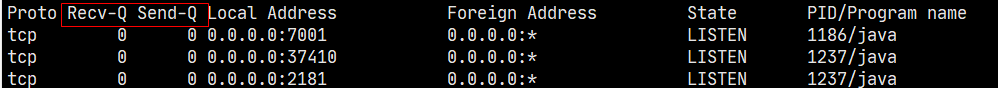
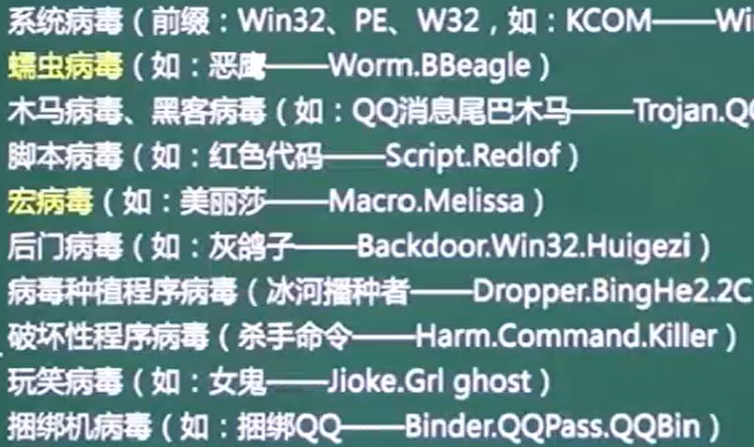

端系统通过通信链路和分组交换机连接在一起


路由	源->目的的传输路径


转发	将分组从分组交换机的输入端口交换至正确的输出端口


分组	发送端将数据分段,每段加上首部字节,通过通信链路和分组交换机进行传输

优点:传输的可靠性,提高通信线路利用率

缺点:增加转发/传输时延


**分组交换时延**

节点处理	检查分组首部,决定分组被发送到哪个输出链路,检查分组出错,检查路由表

排队		排队等待传输取决于流量强度，越接近1延迟越高,流量强度 【0，1】=分组*数量/带宽 = 已用带宽/总带宽

传输		从队列到输出链路所需时间,分组比特L/链路传输速率R

传播		链路中传播所需时间,链路距离d/传播速率s


**分组交换机**

链路层交换机(2层交换机)	用于接入网

路由器(三层交换机)		用于网络核心

**存储转发传输机制**	在开始向输出链路传输第一个bit前,必须先收到整个分组

**输出缓存/输出队列**的存在使得分组转发还需要额外的排队时延 -> 队满**丢包**

**转发表**	将分组首部的ip地址映射为输出链路


**电路交换**

在端系统间通话前,预留了通信所需的资源(电路/缓存/链路传输速率),这些资源在分组交换中不是提前预留的.电路交换需要在发送/接收方之间建立真实的连接,并预留带宽,确保能够以恒定的速率传输数据

**频分复用/时分复用**

优点:	时延低,随时通信,实时性强

缺点:	**独占带宽**,连接的端系统越多,分到的带宽越少,还无法分享带宽->信道利用率低


**RTT**

从发送端发送数据开始,到收到来自接收端的确认,总共经历的时延


协议	定义多个通信实体间交换报文的格式/顺序,和发送/接受报文时的动作

协议栈	各层协议的集合


端系统/主机	位于**网络边缘**

网络核心	由分组交换机和链路组成的网状网络


# 7层模型


开放系统互连(OSI)7层模型并非唯一的协议栈,因特网并没有表示层和会话层,但这不意味着不需要这两层,需要由开发者选择性地实现


某层所提供的服务实现易于改变,只要向上提供相同的服务,并向下使用相同的服务,使得服务的改变不影响系统的其他组件

缺点:	冗余了较低层的功能,下层提供每段链路/端到端2种传输方式,上层需要重复为这2中传输方式实现差错恢复;某层的功能需要其它层的信息,违反了层次分离的目标


封装


链路交换机实现了1\~2层,路由器实现了1\~3层 -> 链路交换机不能实现IP协议

主机实现了5层协议 -> 最为复杂 -> 放在网络边缘


每一层的数据单元 = 首部字段 + 有效载荷字段

运输层报文段 = 应用层报文 + 运输层首部信息

网络层数据报 = 运输层报文段 + 源/目的端系统地址


|       应用       | 应用层协议 | 端口号  | 传输层协议 |            备注             |
| :--------------: | :--------: | :-----: | :--------: | :-------------------------: |
|     域名解析     |    DNS     |   53    |  UDP/TCP   | 长度超过 512 字节时使用 TCP |
| 动态主机配置协议 |    DHCP    |  67/68  |    UDP     |                             |
| 简单网络管理协议 |    SNMP    | 161/162 |    UDP     |                             |
|   文件传送协议   |    FTP     |  20/21  |    TCP     |  控制连接 21，数据连接 20   |
|   远程终端协议   |   TELNET   |   23    |    TCP     |                             |
|  超文本传送协议  |    HTTP    |   80    |    TCP     |                             |
| 简单邮件传送协议 |    SMTP    |   25    |    TCP     |                             |
|   邮件读取协议   |    POP3    |   110   |    TCP     |                             |
| 网际报文存取协议 |    IMAP    |   143   |    TCP     |                             |


## 应用层	报文message


**这三层是socket编程，客户端与主机间通信**网络编程的重点！！！


* 基于TCP
  * POP3	110	离线接收邮件
  * FTP	上传20	下载21

  * http    80	超文本传输协议
  * https 443	使用了SSL,安全
  * Telnet	23	远程访问   
  * SMTP	25	简单邮件

* 基于UDP
  * DHCP	67	动态ip地址分配
  * TFTP	69	传输文件
  * SNMP 	161	网络管理
  * DNS	53	域名解析

NFS		网络文件系统


## 表示层


定义数据格式及加密


## 会话层

**会话层以下都由内核负责**


定义了如何开始、控制和结束一个会话


## 传输层	报文段segment


网络层只把分组发送到目的主机，但是真正通信的并不是主机而是主机中的进程。传输层提供了进程间的逻辑通信，传输层向高层用户屏蔽了下面网络层的核心细节，使应用程序看起来像是在两个传输层实体之间有一条端到端的逻辑通信信道。


**按照规定协议来收发数据**


TCP

UDP


## 网络层	分组/数据报datagram


端到端(**寻找路由与确认主机**)

定义了能够标识所有结点的逻辑地址，还定义了路由实现的方式

为适应最大传输单元长度小于包长度的传输介质，**定义了包的分段方法**,如IP，IPX等


**数据包通过mac ip port定位到具体的进程号**


* 三层交换机   有**路由功能的交换机**

* 路由器       解决交换机的广播冲突问题


* ARP	地址解析协议     IP->MAC		RARP反向地址解析    MAC->IP

* IP		网际协议

* ICMP	因特网控制协议

* IGMP	组播协议/网关信息协议


## 数据链路层	帧frame


**保证数据的正确传输（校验）**,与TCP提供的可靠服务不同的是:链路层面向以太网/wifi/电缆接入网

定义了在单个链路上如何传输数据


* 网桥

* **交换机	解决集线器存在的分流冲突问题,存在广播冲突问题**     ==多个冲突域,一个广播域==


PPTP ,L2TP ,IP ,ICMP ,IGMP


### 1. 封装成帧

将网络层传下来的分组添加首部和尾部，用于标记帧的开始和结束。

<div align="center">  </div><br>

### 2. 透明传输

透明表示一个实际存在的事物看起来好像不存在一样。

帧使用首部和尾部进行定界，如果帧的数据部分含有和首部尾部相同的内容，那么帧的开始和结束位置就会被错误的判定。需要在数据部分出现首部尾部相同的内容前面插入转义字符。如果数据部分出现转义字符，那么就在转义字符前面再加个转义字符。在接收端进行处理之后可以还原出原始数据。这个过程透明传输的内容是转义字符，用户察觉不到转义字符的存在。

<div align="center">  </div><br>

### 3. 差错检测

目前数据链路层广泛使用了循环冗余检验（CRC）来检查比特差错


### 信道分类


**广播信道**

一对多通信，一个节点发送的数据能够被广播信道上所有的节点接收到。

所有的节点都在同一个广播信道上发送数据，因此需要有专门的控制方法进行协调，避免发生冲突（冲突也叫碰撞）。

主要有两种控制方法进行协调，一个是使用信道复用技术，一是使用 CSMA/CD 协议。


**点对点信道**

一对一通信

因为不会发生碰撞，因此也比较简单，使用 PPP 协议进行控制


### 信道复用技术


**频分复用**

频分复用的所有主机在相同的时间占用不同的频率带宽资源。

<div align="center">  </div><br>

**时分复用**

时分复用的所有主机在不同的时间占用相同的频率带宽资源。

<div align="center">  </div><br>

使用频分复用和时分复用进行通信，在通信的过程中主机会一直占用一部分信道资源。但是由于计算机数据的突发性质，通信过程没必要一直占用信道资源而不让出给其它用户使用，因此这两种方式对信道的利用率都不高。

**统计时分复用**

是对时分复用的一种改进，不固定每个用户在时分复用帧中的位置，只要有数据就集中起来组成统计时分复用帧然后发送。

<div align="center">  </div><br>

**波分复用**

光的频分复用。由于光的频率很高，因此习惯上用波长而不是频率来表示所使用的光载波


**码分复用**

为每个用户分配 m bit 的码片，并且所有的码片正交，对于任意两个码片  和  有

<div align="center">  </div><br>

为了讨论方便，取 m=8，设码片  为 00011011。在拥有该码片的用户发送比特 1 时就发送该码片，发送比特 0 时就发送该码片的反码 11100100。

在计算时将 00011011 记作 (-1 -1 -1 +1 +1 -1 +1 +1)，可以得到

<div align="center">  </div><br>

<div align="center">  </div><br>

其中  为  的反码。

利用上面的式子我们知道，当接收端使用码片  对接收到的数据进行内积运算时，结果为 0 的是其它用户发送的数据，结果为 1 的是用户发送的比特 1，结果为 -1 的是用户发送的比特 0。

码分复用需要发送的数据量为原先的 m 倍。

<div align="center">  </div><br>

### CSMA/CD 协议

CSMA/CD 表示载波监听多点接入 / 碰撞检测。

-   **多点接入**  ：说明这是总线型网络，许多主机以多点的方式连接到总线上。
-   **载波监听**  ：每个主机都必须不停地监听信道。在发送前，如果监听到信道正在使用，就必须等待。
-   **碰撞检测**  ：在发送中，如果监听到信道已有其它主机正在发送数据，就表示发生了碰撞。虽然每个主机在发送数据之前都已经监听到信道为空闲，但是由于电磁波的传播时延的存在，还是有可能会发生碰撞。

记端到端的传播时延为 τ，最先发送的站点最多经过 2τ 就可以知道是否发生了碰撞，称 2τ 为   **争用期**  。只有经过争用期之后还没有检测到碰撞，才能肯定这次发送不会发生碰撞。

当发生碰撞时，站点要停止发送，等待一段时间再发送。这个时间采用   **截断二进制指数退避算法**   来确定。从离散的整数集合 {0, 1, .., (2<sup>k</sup>-1)} 中随机取出一个数，记作 r，然后取 r 倍的争用期作为重传等待时间。

<div align="center">  </div><br>

### PPP 协议

互联网用户通常需要连接到某个 ISP 之后才能接入到互联网，PPP 协议是用户计算机和 ISP 进行通信时所使用的数据链路层协议。

<div align="center">  </div><br>

PPP 的帧格式：

- F 字段为帧的定界符
- A 和 C 字段暂时没有意义
- FCS 字段是使用 CRC 的检验序列
- 信息部分的长度不超过 1500

<div align="center">  </div><br>

### MAC 地址

MAC 地址是链路层地址，长度为 6 字节（48 位），用于唯一标识网络适配器（网卡）。

一台主机拥有多少个网络适配器就有多少个 MAC 地址。例如笔记本电脑普遍存在无线网络适配器和有线网络适配器，因此就有两个 MAC 地址。

### 局域网

局域网是一种典型的广播信道，主要特点是网络为一个单位所拥有，且地理范围和站点数目均有限。

主要有以太网、令牌环网、FDDI 和 ATM 等局域网技术，目前以太网占领着有线局域网市场。

可以按照网络拓扑结构对局域网进行分类：

<div align="center">  </div><br>

### 以太网

以太网是一种星型拓扑结构局域网。

早期使用集线器进行连接，集线器是一种物理层设备， 作用于比特而不是帧，当一个比特到达接口时，集线器重新生成这个比特，并将其能量强度放大，从而扩大网络的传输距离，之后再将这个比特发送到其它所有接口。如果集线器同时收到两个不同接口的帧，那么就发生了碰撞。

目前以太网使用交换机替代了集线器，交换机是一种链路层设备，它不会发生碰撞，能根据 MAC 地址进行存储转发。

以太网帧格式：

-   **类型**  ：标记上层使用的协议；
-   **数据**  ：长度在 46-1500 之间，如果太小则需要填充；
-   **FCS**  ：帧检验序列，使用的是 CRC 检验方法；

<div align="center">  </div><br>

### 交换机

交换机具有自学习能力，学习的是交换表的内容，交换表中存储着 MAC 地址到接口的映射。

正是由于这种自学习能力，因此交换机是一种即插即用设备，不需要网络管理员手动配置交换表内容。

下图中，交换机有 4 个接口，主机 A 向主机 B 发送数据帧时，交换机把主机 A 到接口 1 的映射写入交换表中。为了发送数据帧到 B，先查交换表，此时没有主机 B 的表项，那么主机 A 就发送广播帧，主机 C 和主机 D 会丢弃该帧，主机 B 回应该帧向主机 A 发送数据包时，交换机查找交换表得到主机 A 映射的接口为 1，就发送数据帧到接口 1，同时交换机添加主机 B 到接口 2 的映射。

<div align="center">  </div><br>

### 虚拟局域网

虚拟局域网可以建立与物理位置无关的逻辑组，只有在同一个虚拟局域网中的成员才会收到链路层广播信息。

例如下图中 (A1, A2, A3, A4) 属于一个虚拟局域网，A1 发送的广播会被 A2、A3、A4 收到，而其它站点收不到。

使用 VLAN 干线连接来建立虚拟局域网，每台交换机上的一个特殊接口被设置为干线接口，以互连 VLAN 交换机。IEEE 定义了一种扩展的以太网帧格式 802.1Q，它在标准以太网帧上加进了 4 字节首部 VLAN 标签，用于表示该帧属于哪一个虚拟局域网。

<div align="center">  </div><br>


## 物理层	bit


数据转换（数字信号->电信号）

用多个规范完成对所有细节的定义，如连接头、帧、帧的使用、电流、编码及光调制等

==arp，rarp==


* 集线器Hub	用于分流,存在**冲突域**	==一个冲突域,一个广播域==

* 中继器       用于信号放大 ,延长网络传输距离限制


* CSMA/CD	载波监听多路访问

* TokingRing	令牌环


**3种通信方式**

- 单工通信：单向传输
- 半双工通信：双向交替传输
- 全双工通信：双向同时传输


**瓶颈链路**
端到端之间，影响吞吐量的链路


* 发送接收方式
  * 异步：报文发送和接收相互独立
    * 异步双工：接收和发送在同一个程序中，有两个不同的子进程分别负责发送和接送
    * 异步单工：接送和发送使用两个不同的程序来完成
  * 同步：报文发送和接收同步进行，需要考虑超时问题


* 报文格式
  * 非阻塞方式：读函数不停的进行读动作，如果没有报文接收到，等待一段时间后超时返回，**需要指定超时时间**
  * 阻塞方式：如果没有接收到报文，则读函数一直处于等待状态，直到报文到达。
    循环读写方式1、一次直接读写报文：在一次接收或发送报文动作中一次性不加分别地全部读取或全部发送报文字节。
  * 不指定长度循环读写：一般发生在短连接中，受网络路由等限制，一次较长的报文可能在网络传输过程中被分解成很多个包，一次读取可能不能全部读完一次报文，这就需要循环读取报文，知道读完为止
  * 带长度报文头循环读写：一般在长连接中，由于在长连接中没有条件能够判断循环读写什么时候结束。必须要加长度报文头。
    


# TCP


Transmission Control Protocol 传输控制协议	==面向连接的可靠的传输协议==

原本为TCP/IP(传输控制/网际协议)协议,之后被拆分为单独的两个部分,以便提供广泛支持,允许任何主机与链路层协议互操作


Socket	可以理解为IP:Port-IP:Port的四元组

Socket是唯一不重复的这意味着在接收方IP/Port固定,发送方IP固定的情况下,可以建立65535个连接




内核接收网络传输后,数据被保存在内核中,表现形式为Recv/Send-Q

**应用的发送/接收数据就是与内核的队列进行交互**


==在维持连接情况下，一个TCP可以发送多个HTTP请求==

 

* 面向连接	发送数据前,**先握手**

* 全双工服务

* 点对点	**单个**发送/接收方

* 差错检测

* 重传

* 累积确认

* 定时器

  * 序列号seq：4字节，标记顺序，第一个字节编号由本地随机产生

  * 确认号ack：4字节，期待收到对方下一个报文段的第一个数据字节的序号

  * 确认ACK：占1位，**仅当ACK=1时，确认字段才有效**

  * 同步SYN：连接建立时用于同步序号,**只在握手时才置1，握手完成置0**

    * SYN=1，ACK=0：连接请求报文段
    * SYN=1，ACK=1:同意连接

  * 终止FIN：FIN=1表示发送方的数据发送完毕，要求释放连接

    ==大写表示标志位, 其值为1/0	ack、seq小写的单词表示序号==


## 连接数量限制


`Chrome`最多允许对同一个`Host`建立六个`TCP`连接。不同的浏览器有区别


如果资源都是`HTTPS`连接并且在同一个域名下，那么浏览器在`SSL`握手之后会和S商量能不能用`HTTP2`，如果能的话就使用`Multiplexing`进行多路传输。不过也未必会所有挂在这个域名的资源都会使用一个`TCP`连接去获取，但Multiplexing很可能会被用到

如果用不了`HTTP2`,就会在一个`HOST`上建立多个`TCP`连接，**连接数量的最大限制取决于浏览器设置**，这些连接会在空闲的时候被浏览器用来发送新的请求，如果所有的连接都正在发送请求,其他请求阻塞


## 三次握手


==让我知道你已经知道==

重点是**协商初始序列号**,做好发数据的准备工作

* 3->2，**可能死锁**
  * C->S连接请求，S收到并确认应答,按照两次握手的协定，S认为连接成功建立，开始发送数据分组
  * 应答分组丢失，C不知道S是否已准备好,是否收到连接请求分组,序列号是多少,C认为连接未建立，忽略S发来的数据，**只等待连接确认应答分组**
  * 而S发出的分组超时后，**重复发送同样的分组**。形成死锁

==当S收到C的SYN连接请求报文后，可以直接发送SYN+ACK,所以只有3次==

 

* 第1次握手：建立连接
  * C->（SYN=1,seq=x） 连接请求
  * 进入"同步已发送"SYN_SENT状态，等待S确认

* 第2次握手：S收到SYN包
  * S->（ACK=1,ack=x+1,SYN=1,seq=y） 同意连接,同步序列号
  * S进入"同步收到"SYN_RECV状态

* 第3次握手：C收到S的SYN+ACK包
  * C->(ACK=1,ack=y+1,seq=x+1）  确认包
  * C和S都进入"已建立连接"ESTABLISHED"状态


==前两次握手不包含应用层数据==,第三次可以包含


## 四次挥手


* 第1次挥手
  * C->FIN=1，seq=u（之前数据的最后序号+1）  连接释放报文，并停止发送数据,释放数据报文首部
    * FIN报文段即使不携带数据，也要消耗一个序号
  * C进入FIN-WAIT-1（终止等待1）状态

* 第2次挥手
  * S->ACK=1，ack=u+1，seq=v   收到连接释放报文，发出确认报文
  * S通知高层的应用进程，释放C->S方向的连接，这时处于半关闭状态，即C没有数据要发送，但是S若发送数据，C依然要接受
  * S进入CLOSE-WAIT（关闭等待）状态,这个状态要持续一段时间
  * C收到S的连接释放报文
  * C进入FIN-WAIT-2（终止等待2）状态，等待S的连接释放报文

* 第3次挥手
  * S->FIN=1，ack=u+1,seq=w(半关闭状态下S很可能又发送了一些数据)    数据发送完毕，向C发送连接释放报文
  * S进入了LAST-ACK（最后确认）状态，等待C的确认释放

* 第4次挥手
  * C->ACK=1，ack=w+1，seq=u+1   收到S的连接释放报文后，必须回复确认释放报文
  * C进入了TIME-WAIT（时间等待）状态。==此时TCP连接还没有释放，必须经过2MSL（最长报文段寿命）的时间后，才进入CLOSED状态==
    * 2MSL:单次发送+回复所需的最大时间
    * **Client发出最后的ACK可能会丢失。Server如果没有收到ACK，将不断发送FIN片段**。所以Client不能立即关闭，它必须确认Server接收到了该ACK
    * 同时设置==计时器==，2MSL内再次收到FIN，那么Client会重发ACK并再次等待2MSL
  * S收到了C发出的确认释放，立即进入CLOSED状态,==S结束TCP连接的时间比C早==
  
    ****

当Server收到FIN报文，**不会立即关闭SOCKET**，只先回复一个ACK报文，等所有的报文都发送完了，才发送FIN报文,==由于FIN和ACK不能一起发送,需要四次==


## C突然故障


==保活计时器==

收到请求后重新复位计时器，时间通常2小时

两小时还没有收到任何数据，S就会发送一个探测报文段，以后每隔75秒发送一次。若一连发送10个探测报文仍然没反应，S就认为C出了故障，关闭连接


## 打开网页的过程


1. 浏览器根据域名,去调操作系统的gethostbyname()
2. gethostbyname()首先检查域名是否在本地Hosts里
3. 本地Hosts没有,通过网卡给DNS服务器发UDP请求,接收结果并返回给浏览器
4. 浏览器拿到解析的IP地址，建立TCP连接
5. 向IP发送HTTP请求
6. S处理请求并返回响应结果
7. 关闭TCP连接
8. 浏览器解析HTML,布局渲染


# IP


网络+主机号

* 主机号全为0 网络地址

* ​     全为1 广播地址

|      |                   |         |                    |
| ---- | ----------------- | ------- | ------------------ |
| A类  | 00000000-01111111 | 0-127   | 24位主机号->2^24-2 |
| B类  | 10000000-10111111 | 128-191 | 16位主机号->2^16-2 |
| C类  | 11000000-11011111 | 198-223 |                    |

称为点分字节,每2点之间由1字节存储


## IP VS MAC


* 两者地址使用不同
  * IP地址是指Internet协议使用的地址
  * MAC地址是Ethernet协议使用的地址。当存在一个附加层的地址寻址时，设备更易于移动和维修。

* 分配依据不同
  * IP地址的分配是基于网络拓朴，MAC地址的分配是基于制造商。
  * IP地址可以自动分配的，MAC地址唯一


## 子网划分	


==向主机号借位==


**子网掩码**	网络号和借位全1 ,主机号全0

**主机路由的子网掩码是255.255.255.255**


## 本地环回地址(loopback)


在请求/接受数据时, client和server需要两个不同的ip地址。
要在本地测试时, 可以将我们本地ip当做C的地址,再把127.0.0.1当做Sserver的地址, 
这样一来，C向127.0.0.1发送请求, 就会从127.0.0.1得到返回数据


## IPV4->6

4->6的过渡期间,主要采用3种技术

* 双协议栈	主机同时运行4和6两种协议栈

* 隧道技术	在4之上连接6的站点.==将6的分组封装到4的分组中,再通过4的路由体系传输== ,分组报头的**协议域为41**,表示是6的分组
* NAT-PT	 利用**转换网关**转换4和6 IP报头的地址 ,根据不同协议对分组语义翻译


# DNS


DNS域名系统（Domain Name System）


1. 根域名服务器：并不直接把待查询的域名直接解析出IP地址，而是告诉本地域名服务器应当找顶级域名服务器的IP
2. 顶级域名服务器：负责管理该顶级域名下的二级域名
3. 权限域名服务器：负责一个“区”的域名服务器
4. 本地域名服务器：离用户最近的DNS，当一个主机发出DNS查询请求时，这个查询请求报文就发送给本地域名服务器


2种DNS

* 在一个区中,主DNS Server从自己本机的数据文件中读取该区的DNS数据信息

* 辅助DNS Server从本区的主DNS Server中读取该区的DNS数据信息
  * 辅助DNS Server启动时，==用TCP与主DNS Server通信==,**这是DNS唯一用到TCP的地方**
  * 由于涉及到主从复制,而UDP不可靠,传输的数据量小,只能传512字节

==主要使用UDP==,只要一次请求/应答,而使用基于TCP的DNS协议要三次握手、发送数据以及应答、四次挥手。**但UDP传输内容不能超过512字节**。但域名解析一般都不超过512字节


## 域名解析


* 浏览器缓存
  * 缓存大小/时间有限制，通常情况下为几分钟到几小时不等，域名被缓存的时间**通过TTL属性设置**
    * 缓存时间长，一旦IP变化，会导致被客户端缓存的域名无法解析到变化后的IP
    * 时间太短，会导致用户每次访问网站都要重新解析一次域名

* 操作系统缓存  操作系统也有域名解析的过程
  * Windows C:\Windows\System32\drivers\etc\hosts
  * Linux中 /etc/hosts
  * 用户可以将任何域名解析到任何能够访问的IP地址,利于测试
  * 正是因为有这种本地DNS解析的规程，黑客把特定的域名解析到他指定的IP地址上，==域名劫持==

* 本地域名服务器 LDNS  提供给用户本地互联网接入的DNS解析服务
  * 性能高，会缓存域名解析结果，当然缓存时间是受到域名的失效时间控制的。大约80%的域名解析到这里就结束了，LDNS承担了域名解析主要工作
  * 通常会在用户所在城市的某个角落，不会很远
  * Windows ipconfig，Linux cat /etc/resolv.conf 查询配置的DNS服务器

* 根域名服务器Root Server
  * 返回给LDNS所查询的主域名服务器（gTLD Server）地址。gTLD是国际顶级域名服务器

* LDNS再向gTLD发送请求

* gTLD服务器查找并返回此域名对应的Name Server域名服务器的地址
  * Name Server通常就是用户注册的域名服务器，例如用户在某个域名服务提供商申请的域名，域名解析任务就由这个域名提供商的服务器完成

* Name Server域名服务器查询存储的域名和IP的映射关系表，连同TTL值返回给DNS Server域名服务器

* LDNS缓存这个域名和IP的对应关系，缓存时间由TTL值控制

* 把解析的结果返回给用户，用户根据TTL值缓存在本地系统缓存中
* 域名解析结束

在实际的DNS解析过程中，可能还不止这10步，如Name Server可能有很多级，或者有一个GTM来负载均衡控制，这都有可能会影响域名解析过程


```shell
# dig www.persona6.cn	dig指令显示域名解析过程
#dig +trace

; <<>> DiG 9.11.4-P2-RedHat-9.11.4-26.P2.el7_9.2 <<>> www.persona6.cn
;; global options: +cmd
;; Got answer:
;; ->>HEADER<<- opcode: QUERY, status: NOERROR, id: 50379
;; flags: qr rd ra; QUERY: 1, ANSWER: 1, AUTHORITY: 0, ADDITIONAL: 1

;; OPT PSEUDOSECTION:
; EDNS: version: 0, flags:; udp: 4096

#查询内容
;; QUESTION SECTION:
##	域名			IN代表互联网		查询类型 A:IP	MX:邮件S	PTR:根据IP地址反查域名	CNAME:查询域名相关别名
;www.persona6.cn.	IN				A

;; ANSWER SECTION:
#查询结果
www.persona6.cn.	600	IN	A	120.76.132.188

;; Query time: 41 msec
;; SERVER: 100.100.2.136#53(100.100.2.136)
;; WHEN: Mon Nov 30 17:54:13 CST 2020
;; MSG SIZE  rcvd: 60
```


`www.persona6.cn`对应的真正的域名为`www.persona6.cn.`	

* 根域名	`.`	每个域名都有根域名，通常省略

* 顶级域名 `.com、.net`

* 2级域名 `.persona6`，用户自己注册

* 3级域名/主机名 `www`，用户在自己的域里面为S分配的名称


==先在本机的DNS查,再去根S查。发现属于`cn`域，**返回`com`域中的DNS的IP地址**==


## CDN


Content Delivery Network，即内容分发网络

目的是通过在现有的Internet中增加一层新的CACHE(缓存)层，将网站的内容发布到最接近用户的网络”边缘“的节点，使用户可以==就近获取网站内容==，提高用户访问网站的响应速度


解决服务器端的“第一公里”问题 　
缓解甚至消除了不同运营商之间互联的瓶颈造成的影响 　
减轻了各省的出口带宽压力 　
缓解了骨干网的压力 　
优化了网上热点内容的分布


* 用户向localDNS发起请求查询输入域名对应的IP地址（若有缓存直接返回，否则去rootDNS查询）

* localDNS迭代向rootDNS查询，逐级迭代,rootDNS=>顶级DNS=>权限DNS

* 获得权限DNS后，localDNS向权限DNS发起域名解析请求

* 权限DNS通常会将域名CNAME【没有的话默认为普通请求，直接返回解析到的IP】指向CDN网络中的智能DNS负载均衡系统

* DNS负载均衡系统通过一些智能算法，将最合适的CDN节点IP地址返回给localDNS

* localDNS将获得的IP地址返回给用户

* 用户得到节点的IP地址后，向该节点发起访问请求

* CDN节点返回请求文件，如果该节点中请求的文件不存在，就会再回到源站获取这个文件，然后返回给用户


## A记录


用来指定主机名/域名 对应的IP地址记录。用户可以将该域名下的网站服务器指向到自己的web server上。同时也可以设置二级域名


## CName


别名记录。这种记录允许您将多个名字映射到同一台计算机。 通常用于同时提供WWW和MAIL服务的计算机。例如，有一台计算机名为“host.mydomain.com”（A记录）。 它同时提供WWW和MAIL服务，为了便于用户访问服务。可以为该计算机设置两个别名（CNAME）：WWW和MAIL


A 记录和 CNAME 记录有什么区别

简单的说，A 记录直接指向 IP 地址，CNAME 记录指向域名。IP 地址是互联网世界中唯一的，而 CNAME 指向的域名也要指向 A 记录，也就说 **IP 地址可以按需更换，无需变更CNAME的记录值**

2.域名解析选 A 记录还是 CNAME 记录

长期建站、项目运营的话，一般使用 CNAME 记录,可用于 CDN 加速，既可以起到加速网站的作用，又能**隐藏真实IP**，减少被攻击的几率

现在的云一般都接入了 BGP 多线路，至少是电信、联通、移动三线路，在更换 IP 的时候 CNAME 记录变，特别方便


## 路由表


```shell
[root@lx ~]# route -n
Kernel IP routing table
Destination     Gateway         Genmask         Flags Metric Ref    Use Iface
0.0.0.0         172.27.111.253  0.0.0.0         UG    0      0        0 eth0
169.254.0.0     0.0.0.0         255.255.0.0     U     1002   0        0 eth0
172.17.0.0      0.0.0.0         255.255.0.0     U     0      0        0 docker0
172.27.96.0     0.0.0.0         255.255.240.0   U     0      0        0 eth0

[root@lx ~]# ping www.baidu.com
PING www.a.shifen.com (14.215.177.39) 56(84) bytes of data.

ping百度时,目标IP14.215.177.39,与路由表中各个路由的Genmask子网掩码进行按位与,得到的结果如果等于Destination下一跳IP,就表示路由可达,将请求发送给Gateway网关进行下一跳
```


# ICP/ISP


ISP Internet service provider 服务提供商

ICP Internet content provider 内容提供商，百度，谷歌
ICP需要接入ISP，才能为端系统提供服务


端系统通过接入ISP连接互联网
ISP接入global ISP，使得ISP之间互连
global ISP在全球有多个，不同的global ISP通过合作将旗下的用户互连，存在流量结算，根据双方的流量计算合作的价格


global ISP的互连方式
对等连接，双方各分配路由器，光纤，用于互连

ISP之间的互连使得海外用户在接入互联网时需要经过多跳
ICP为了避免多跳，在全球各地的核心ISP旁边部署数据中心，以专线连接数据中心
当用户请求ICP服务时，先通过ISP连接到ICP的数据中心，当需要请求其他数据中心时，通过ICP的专线拉取数据，再返回给用户。避免了用户多跳至其他数据中心


POP ISP上下层之间不对等的接入


# FTP

FTP 使用 TCP 进行连接，它需要两个连接来传送一个文件：

- 控制连接：服务器打开端口号 21 等待客户端的连接，客户端主动建立连接后，使用这个连接将客户端的命令传送给服务器，并传回服务器的应答。
- 数据连接：用来传送一个文件数据。

根据数据连接是否是服务器端主动建立，FTP 有主动和被动两种模式：

- 主动模式：服务器端主动建立数据连接，其中服务器端的端口号为 20，客户端的端口号随机，但是必须大于 1024，因为 0\~1023 是熟知端口号。

<div align="center">  </div><br>

- 被动模式：客户端主动建立数据连接，其中客户端的端口号由客户端自己指定，服务器端的端口号随机。

<div align="center">  </div><br>

主动模式要求客户端开放端口号给服务器端，需要去配置客户端的防火墙。被动模式只需要服务器端开放端口号即可，无需客户端配置防火墙。但是被动模式会导致服务器端的安全性减弱，因为开放了过多的端口号


# DHCP


Dynamic Host Configuration Protocol	动态主机配置协议

提供了即插即用的连网方式，用户不再需要手动配置 IP 地址等信息。

DHCP 配置的内容不仅是 IP 地址，还包括子网掩码、网关 IP 地址。

DHCP 工作过程如下：

1. 客户端发送 Discover 报文，该报文的目的地址为 255.255.255.255:67，源地址为 0.0.0.0:68，被放入 UDP 中，该报文被广播到同一个子网的所有主机上。如果客户端和 DHCP 服务器不在同一个子网，就需要使用中继代理。
2. DHCP 服务器收到 Discover 报文之后，发送 Offer 报文给客户端，该报文包含了客户端所需要的信息。因为客户端可能收到多个 DHCP 服务器提供的信息，因此客户端需要进行选择。
3. 如果客户端选择了某个 DHCP 服务器提供的信息，那么就发送 Request 报文给该 DHCP 服务器。
4. DHCP 服务器发送 Ack 报文，表示客户端此时可以使用提供给它的信息。

<div align="center">  </div><br>


# 电子邮件协议

一个电子邮件系统由三部分组成：用户代理、邮件服务器以及邮件协议。

邮件协议包含发送协议和读取协议，发送协议常用 SMTP，读取协议常用 POP3 和 IMAP。

<div align="center">  </div><br>

### 1. SMTP

SMTP 只能发送 ASCII 码，而互联网邮件扩充 MIME 可以发送二进制文件。MIME 并没有改动或者取代 SMTP，而是增加邮件主体的结构，定义了非 ASCII 码的编码规则。

<div align="center">  </div><br>

### 2. POP3

POP3 的特点是只要用户从服务器上读取了邮件，就把该邮件删除。但最新版本的 POP3 可以不删除邮件。

### 3. IMAP

IMAP 协议中客户端和服务器上的邮件保持同步，如果不手动删除邮件，那么服务器上的邮件也不会被删除。IMAP 这种做法可以让用户随时随地去访问服务器上的邮件。


# 数据交换方式
线路交换
分组交换 额外的延迟，分组丢失

分组丢失
路径的可达性以路由表的形式存储，待传输的分组存储在有界队列中，当队满则新分组被丢弃


# HTTP


超文本传输协议，基于请求与响应模式、无状态、按照URL指示，将纯文本数据进行传输的应用层协议，以实现超链接的功能


* 长连接
  * c与s建立连接后不断开，减少重复握手损耗
  * 发送**探测包**来维持连接
  * 常用于点对点P2P通信
* 短连接
  * C与s每进行报文传输时才连接
  * **常用于一点对多点通讯**


无状态
同一个客户端第二次访问同一个Web服务器上的页面时，服务器无法知道这个客户曾经访问过。HTTP的无状态性简化了服务器的设计，使其更容易支持大量并发的HTTP请求

**Hyper Text**
超文本是用超链接的方法，将各种不同空间的文字信息组织在一起的网状文本。超文本更是一种用户界面范式，用以显示文本及与文本之间相关的内容。现时超文本普遍以电子文档方式存在，其中的文字包含有可以链结到其他位置或者文档的连结，允许从当前阅读位置直接切换到超文本连结所指向的位置。这些链接使用URL表示。最常见的超文本格式是超文本标记语言HTML


## URL

Uniform Resource Locator	统一资源定位符

对可以从互联网上得到的资源的位置和访问方法的一种简洁的表示，互联网上每个文件都有一个唯一的URL，它包含的信息指出文件的位置以及浏览器应该怎么处理它。URL**由协议、主机和端口以及文件名三部分构成**


Url中包含了**URN**（Uniform Resource Name，统一资源名称）,但URN只是用来定义资源的名称，并不具备定位该资源的能力


USER-agent 浏览器标识
Server：响应头包含处理请求的原始服务器的软件信息
Referer：浏览器向 WEB 服务器表明自己是从哪个 网页/URL 获得/点击 当前请求中的网址/URL。
Location：WEB 服务器告诉浏览器，试图访问的对象已经被移到别的位置了，到该头部指定的位置去取。


## 请求和响应报文

客户端发送请求报文给服务器，服务器根据请求报文进行处理，并将处理结果放入响应报文中返回客户端


### 请求报文结构

- 一行是包含了请求方法、URL、协议版本；
- 多行请求首部Header，每个首部都有一个首部名称，以及对应的值。
- 分隔用的空行
- 请求的内容主体

```
GET http://www.example.com/ HTTP/1.1
Accept: text/html,application/xhtml+xml,application/xml;q=0.9,image/webp,image/apng,*/*;q=0.8,application/signed-exchange;v=b3;q=0.9
Accept-Encoding: gzip, deflate
Accept-Language: zh-CN,zh;q=0.9,en;q=0.8
Cache-Control: max-age=0
Host: www.example.com
If-Modified-Since: Thu, 17 Oct 2019 07:18:26 GMT
If-None-Match: "3147526947+gzip"
Proxy-Connection: keep-alive
Upgrade-Insecure-Requests: 1
User-Agent: Mozilla/5.0 xxx

param1=1&param2=2
```


### 响应报文结构

- 一行协议版本、状态码以及描述
- 多行首部内容
- 一个空行分隔首部和内容主体
- 最后是响应的内容主体

```
HTTP/1.1 200 OK
Age: 529651
Cache-Control: max-age=604800
Connection: keep-alive
Content-Encoding: gzip
Content-Length: 648
Content-Type: text/html; charset=UTF-8
Date: Mon, 02 Nov 2020 17:53:39 GMT
Etag: "3147526947+ident+gzip"
Expires: Mon, 09 Nov 2020 17:53:39 GMT
Keep-Alive: timeout=4
Last-Modified: Thu, 17 Oct 2019 07:18:26 GMT
Proxy-Connection: keep-alive
Server: ECS (sjc/16DF)
Vary: Accept-Encoding
X-Cache: HIT

<!doctype html>
<html>
<head>
    <title>Example Domain</title>
	// 省略... 
</body>
</html>
```


### HTTP 方法

客户端发送的   **请求报文**   第一行为请求行，包含了方法字段


GET	获取资源

HEAD	获取报文首部,和GET类似，但是不返回报文实体主体部分。主要用于确认 URL 的有效性以及资源更新的日期时间等

POST	传输实体主体

~~PUT~~	上传文件,由于自身不带验证机制，存在安全性问题，一般不使用该方法

PATCH	对资源进行部分修改,PUT只能完全替代原始资源

DELETE	删除文件,与 PUT 功能相反，并且同样**不带验证**机制

OPTIONS	查询URL支持的方法。返回 `Allow: GET, POST, HEAD, OPTIONS` 这样的内容

CONNECT	要求在与代理服务器通信时建立隧道,使用 SSL（Secure Sockets Layer，安全套接层）和 TLS（Transport Layer Security，传输层安全）协议把通信内容加密后经网络隧道传输。

TRACE	服务器会将通信路径返回给客户端,发送请求时，在 Max-Forwards 首部字段中填入数值，每经过一个服务器就会减 1，当数值为 0 时就停止传输。


### 状态码


* 1xx	服务器正在处理请求

* 2xx	成功处理了请求

* 3xx (重定向)表示要完成请求，需要进一步操作
  * **301 Moved Permanently**  ：永久性重定向
* **302 Found**  ：临时性重定向
  
  * **303 See Other**  ：和 302 有着相同的功能，但是 303 明确要求客户端应该采用 GET 方法获取资源。
  
  * 注：虽然 HTTP 协议规定 301、302 状态下重定向时不允许把 POST 方法改成 GET 方法，但是大多数浏览器都会在 301、302 和 303 状态下的重定向把 POST 方法改成 GET 方法。
  
  * **304 Not Modified**  ：如果请求报文首部包含一些条件，例如：If-Match，If-Modified-Since，If-None-Match，If-Range，If-Unmodified-Since，如果不满足条件，则服务器会返回 304 状态码。
  
  * **307 Temporary Redirect**  ：临时重定向，与 302 的含义类似，但是 307 要求浏览器不会把重定向请求的 POST 方法改成 GET 方法。
  
* 4xx(请求错误)请求可能出错，妨碍服务器的处理
  * 400 参数校验不合法
  * 401 未登录
  * 403 无权限
  
* 5xx(服务器错误)
  * 500 服务器内部错误
  * 501 (尚未实施) 服务器不具备完成请求的功能。 例如，服务器无法识别请求方法
  * 502 (错误网关) 服务器作为网关或代理，从上游服务器收到无效响应
  * 503 (服务不可用) 服务器目前无法使用(由于超载或停机维护)
  * 504 (网关超时) 服务器作为网关或代理，但是没有及时从上游服务器收到请求
  * 505 (HTTP 版本不受支持) 服务器不支持请求中所用的 HTTP 协议版本


### HTTP 首部

有 4 种类型的首部字段：通用首部字段、请求首部字段、响应首部字段和实体首部字段。


#### 通用首部字段

|    首部字段名     |                    说明                    |
| :---------------: | :----------------------------------------: |
|   Cache-Control   |               控制缓存的行为               |
|    Connection     | 控制不再转发给代理的首部字段、管理持久连接 |
|       Date        |             创建报文的日期时间             |
|      Pragma       |                  报文指令                  |
|      Trailer      |             报文末端的首部一览             |
| Transfer-Encoding |         指定报文主体的传输编码方式         |
|      Upgrade      |               升级为其他协议               |
|        Via        |            代理服务器的相关信息            |
|      Warning      |                  错误通知                  |

#### 请求首部字段

|     首部字段名      |                      说明                       |
| :-----------------: | :---------------------------------------------: |
|       Accept        |            用户代理可处理的媒体类型             |
|   Accept-Charset    |                  优先的字符集                   |
|   Accept-Encoding   |                 优先的内容编码                  |
|   Accept-Language   |             优先的语言（自然语言）              |
|    Authorization    |                  Web 认证信息                   |
|       Expect        |              期待服务器的特定行为               |
|        From         |               用户的电子邮箱地址                |
|        Host         |               请求资源所在服务器                |
|      If-Match       |              比较实体标记（ETag）               |
|  If-Modified-Since  |               比较资源的更新时间                |
|    If-None-Match    |        比较实体标记（与 If-Match 相反）         |
|      If-Range       |      资源未更新时发送实体 Byte 的范围请求       |
| If-Unmodified-Since | 比较资源的更新时间（与 If-Modified-Since 相反） |
|    Max-Forwards     |                 最大传输逐跳数                  |
| Proxy-Authorization |         代理服务器要求客户端的认证信息          |
|        Range        |               实体的字节范围请求                |
|       Referer       |            对请求中 URI 的原始获取方            |
|         TE          |                传输编码的优先级                 |
|     User-Agent      |              HTTP 客户端程序的信息              |

#### 响应首部字段

|     首部字段名     |             说明             |
| :----------------: | :--------------------------: |
|   Accept-Ranges    |     是否接受字节范围请求     |
|        Age         |     推算资源创建经过时间     |
|        ETag        |        资源的匹配信息        |
|      Location      |   令客户端重定向至指定 URI   |
| Proxy-Authenticate | 代理服务器对客户端的认证信息 |
|    Retry-After     |   对再次发起请求的时机要求   |
|       Server       |    HTTP 服务器的安装信息     |
|        Vary        |   代理服务器缓存的管理信息   |
|  WWW-Authenticate  |   服务器对客户端的认证信息   |

#### 实体首部字段

|    首部字段名    |          说明          |
| :--------------: | :--------------------: |
|      Allow       | 资源可支持的 HTTP 方法 |
| Content-Encoding | 实体主体适用的编码方式 |
| Content-Language |   实体主体的自然语言   |
|  Content-Length  |     实体主体的大小     |
| Content-Location |   替代对应资源的 URI   |
|   Content-MD5    |   实体主体的报文摘要   |
|  Content-Range   |   实体主体的位置范围   |
|   Content-Type   |   实体主体的媒体类型   |
|     Expires      | 实体主体过期的日期时间 |
|  Last-Modified   | 资源的最后修改日期时间 |


## SSL 安全套接字协议


SSL是信息传输的加密方法，而https是信息传输加密成功后的结果


443端口

为网络通信提供安全及数据完整性的一种安全协议

SSL协议可以保护正常运行于TCP之上的任何应用协议

是传输层与应用层之间的协议，高层的应用协议能透明地建立在SSL协议之上；**SSL协议在应用层之前就完成了加密算法、通信密钥的协商和服务器的认证工作，此后应用层发送的数据都会被加密，保证通信的安全性**


SSL协议提供的安全通道有以下三个特性
1.机密性：SSL协议使用**密钥加密通信数据**
2.可靠性：服务器和客户都会被认证，客户的认证是可选的
3.完整性：SSL协议会对传送的数据进行完整性检


SSL提供的服务
1.认证用户和服务器，确保数据发送到正确的客户机和服务器
2.加密数据以防止数据中途被窃取
3.维护数据的完整性，确保数据在传输过程中不被改变


**SSL的数据包结构**


SSL协议的分层模型原理：
SSL协议是一个分层的协议，共有两层组成。处于SSL协议的底层的是SSL记录层协议(SSL Record Protocol)，它位于可靠的传输层协议(如TCP)之上，用于封装高层协议的数据。其中SSL握手协议(SSL Handshake Protocol)允许服务方和客户方互相认证，并在应用层协议传送数据之前协商出一个加密算法和会话密钥（类似于IPSEC的第一阶段）


**握手协议(SSL Handshake Protocol)**
允许服务方和客户方互相认证，并在应用层协议传送数据之前协商出一个加密算法和会话密钥。握手协议可以用于建立一个新的会话，也可以恢复一个先前存在的会话，但每次握手都会建立一个全新的连接
功能：
1.协商SSL协议的版本
2.协商加密套件
3.协商密钥参数
4.验证通讯双方的身份(可选)
5.建立SSL连接


1.网络连接建立，SSL客户端发送消息，消息中包含SSL版本号、密码设置、可实现的算法列表、随机数以及服务器使用SSL协议通信所需的其它信息；
2.SSL服务器端回应消息，确定SSL版本号、加密算法和压缩算法；
3.SSL服务器发出服务器数字证书；
4.SSL客户端的身份认证是可选的；
5.客户端生成预主密钥pre_master_secret，用服务器的公钥加密后返回服务器，服务器利用自己的私钥解密后得到会话密钥；
\6. 若服务器要求客户认证，客户机会向服务器随加密的pre_master_secret一起发送签名的数据和客户自己的证书。
\7. 服务器若认证客户成功，使用私钥加密pre_master_secret，然后执行一系列步骤生成master secret。否则会话终止。
\8. 客户机与服务器使用master secret生成会话密钥。该密钥是对称密钥，用于加密和解密在SSL会话期间交换的信息，检验信息完整性。
\9. CCS：发送消息通知以后从客户机来的消息将用会话密钥加密。客户机然后发送一条独立的（加密的）消息表明握手的客户机部分已经完成。


## HTTP1.0


* 默认短连接

* 每次请求都会重新建立/断开`TCP`连接，耗费资源

* 某些S对`Connection: keep-alive`的`Header`进行了支持，完成`HTTP`请求后，不断开连接,连接可以被重用,避免SSL的开销


## HTTP1.1


* 默认长连接

* 把`Connection`头写进标准，C和S会维持一段时间的`TCP`连接，不会请求结束就断掉

* 只有在请求报头中声明`Connection: close`才会请求完成之后关闭连接
* 由于`HTTP/1.1`是文本协议，返回的内容不能区分对应于哪个发送的请求,导致单个`TCP`连接在同一时刻只能处理一个请求(只区分端口,不区分进程)，**两个请求的生命周期不能重叠**
  * 规定了 `Pipelining` ，但是这个功能在浏览器中默认是关闭的
    * Pipelining ，RFC 2616 中规定：
    * 一个支持持久连接的C可以在一个连接中发送多个请求（**不需要等待任意请求的响应**）
    * **收到请求的S必须按照请求收到的顺序发送响应**


### HTTP 1.1的功能

​    需要增加新的请求头来帮助实现，例如，Connection请求头的值为Keep-Alive时，C通知S返回本次请求结果后保持连接；Connection请求头的值为close时，C通知S返回本次请求结果后关闭连接。HTTP 1.1还提供了与身份认证、状态管理和Cache缓存等机制相关的请求头和响应头。

   请求的流水线（Pipelining）处理，在一个TCP连接上可以传送多个HTTP请求和响应，减少了建立和关闭连接的消耗和延迟。例如：一个包含有许多图像的网页文件的多个请求和应答可以在一个连接中传输，但每个单独的网页文件的请求和应答仍然需要使用各自的连接。  HTTP 1.1还允许C不用等待上一次请求结果返回，就可以发出下一次请求，但S端必须按照接收到C请求的先后顺序依次回送响应结果，以保证C能够区分出每次请求的响应内容


### **HTTP 1.1增加host字段**

​    在HTTP1.0中认为每台S都绑定一个唯一的IP地址，因此，请求消息中的URL并没有传递主机名（hostname）。但随着虚拟主机技术的发展，在一台物理S上可以存在多个虚拟主机（Multi-homed Web Servers），并且它们共享一个IP地址。

​    HTTP1.1的请求消息和响应消息都应支持Host头域，且请求消息中如果没有Host头域会报告一个错误（400 Bad Request）。此外，S应该接受以绝对路径标记的资源请求


### 100(Continue) Status(节约带宽)


新的状态码100（Continue）,允许C在请求之前先用request header试探一下server，看server要不要接收request body，再决定要不要发request body

* C事先发送一个只带头域的请求
  * S因为权限拒绝了请求，就回送响应码401（Unauthorized）
  * 如果S接收此请求就回送响应码100


## HTTP2


* 提供了 `Multiplexing` 多路传输特性，==可以在一个`TCP`连接中同时完成多个`HTTP`请求==


主要基于 SPDY 协议（Google开发的基于TCP的应用层协议，用以最小化网络延迟，提升网络速度，优化用户的网络使用体验）


**2 VS 1.1**

2采用二进制格式而非文本格式

**2是完全多路复用的，而非有序并阻塞的——只需一个连接即可实现并行**

使用报头压缩，2降低了开销

2让服务器可以将响应主动“推送”到客户端缓存中

多路复用对前端优化性能有很大的帮助


**什么是多路复用**

在 HTTP 1.1 中，发起一个请求是这样的：

浏览器请求 url -> 解析域名 -> 建立 HTTP 连接 -> 服务器处理文件 -> 返回数据 -> 浏览器解析、渲染文件 

这个流程最大的问题是，每次请求都需要建立一次 HTTP 连接，也就是我们常说的3次握手4次挥手，这个过程在一次请求过程中占用了相当长的时间，而且逻辑上是非必需的，因为不间断的请求数据，第一次建立连接是正常的，以后就占用这个通道，下载其他文件，这样效率多高啊！

为了解决这个问题， HTTP 1.1 中提供了 Keep-Alive，允许我们建立一次 HTTP 连接，来返回多次请求数据


但是这里有两个问题：

HTTP 1.1 基于串行文件传输数据，因此这些请求必须是有序的，所以实际上我们只是节省了建立连接的时间，而获取数据的时间并没有减少

最大并发数问题，假设我们在 Apache 中设置了最大并发数 300，而因为浏览器本身的限制，最大请求数为 6，那么服务器能承载的最高并发数是 50


而 2 引入二进制数据帧和流的概念，其中帧对数据进行顺序标识，这样浏览器收到数据之后，就可以按照序列对数据进行合并，而不会出现合并后数据错乱的情况。同样是因为有了序列，服务器可以并行传输数据

2对同一域名下所有请求都是基于流，也就是说同一域名不管访问多少文件，也只建立一路连接,提高并发


## HTTPS


基于TCP+HTTP+SSL


在TCP三次握手后可靠的连接已建立,在此基础上进行**四次握手**

C->S 明文地通知服务器接下来所采用的对称性加密算法 (抓包得到对称性加密算法)

S->C 同意算法,附带S的公钥 (抓包得到公钥)

C	用S的公钥对密码加密

C->S 公钥加密的算法再次通过对称性加密算法传输 (此时抓包可以破解对称性加密,但只有公钥解不开非对称性加密)


## HTTP VS HTTPS


* 安全性
  * http 明文
  * https 安全性的ssl加密传输

* 连接方式不同
  * http 无状态
  * https SSL＋HTTP协议构建的可进行加密传输、身份认证的网络协议

* 端口不同
  * http 80
  * https 443．

* 证书申请方式不同
  * http：免费申请
  * https：CA申请证书，免费证书少


## 无状态 stateless


状态 为两个相互关联的用户交互操作保留的某种公共信息，常被用来存储工作流或用户状态信息

无状态 请求与其他请求隔离，**请求本身包含了响应端为响应请求所需的全部信息**


C端的2个线程需要与S进行交互,分别发送请求AB,S在处理完成之后返回ab,**当无状态时C端无法判断ab到底属于哪个线程**,若返回值携带进程号,则为有状态


* 缺点

  * 在负载均衡方面，在有状态的模式下，一个用户的请求必须被提交到保存有其相关状态信息的服务器上，否则这些请求可能无法被理解，服务器端无法对用户请求进行自由调度。
  * 容错性，倘若保有用户信息的服务器宕机，那么该用户最近的所有交互操作将无法被透明地移送至备用服务器上，除非该服务器时刻与主服务器同步全部用户的状态信息。
  * 由于**HTTP**本身无状态，开发人员必须通过模拟实现状态的钝化与激活


* RESTful的2中状态
  * 应用状态  某一特定请求相关的状态信息
  * 资源状态  某一存储在服务器端资源在某一时刻的特定状态，该状态不会因为用户请求而改变，任何用户在同一时刻对该资源的请求都会获得这一状态的表现（Representation）。


RESTful架构要求服务器端不保有任何与特定HTTP请求相关的资源，所以==应用状态必须由请求方在请求过程中提供==。

**状态与请求本身没有多大关联，重要的是状态信息是由请求方还是响应方负责保存**,“传递某种表示状态的信息”到服务器不是“有状态”的表现。


在请求中传递SessionID是unRESTful的，而将用户的credentials(认证信息)包含在每个请求里是RESTful的

Session ID可以被认为是一个用来标识某一会话状态的Key，将其传递给服务器端意味着这样一个请求：“请帮我取出这个状态信息”，这个请求假设响应方保有状态信息。而user credential作为一种应用状态，是被期望由请求方提供的，所以在请求中传递user credentials是符合RESTful架构规范的。


* URL中的字母全小写（参数使用小驼峰）
  * 用户比较容易输入，不用因为大小写混合而出现错误

* 连词符使用中横线
  * 搜索引擎中，中横线当作一个空格来处理的，而下划线则被忽略
  * 中横线更容易识别


CRUD函数名称不应在URI中使用，应该由HTTP方法表示

| GET    | 获取                                 |
| ------ | ------------------------------------ |
| POST   | 新建                                 |
| PUT    | 更新（向客户端提供改变后的所有资源） |
| PATCH  | 更新（向客户端提供改变的属性）       |
| DELETE | 删除                                 |


文件扩展名不应包含在URI，应该依靠Content-Type来传达 /user


使用复数名词

不要混淆名词单数和复数，只对所有资源使用复数


# 网络规划与设计


* 需求分析
  * 网络功能要求
  * 网络性能要求
  * 运行环境要求
  * 可扩充性/可维护性要求

* 规划原则
  * 实用性
  * 开放性
  * 先进性

* 网络设计与实施原则
  * 可靠性
  * 安全性
  * 高效性
  * 可拓展性


## 层次化网络设计


核心层		核心交换机	快速高效的数据分发 ,冗余控制

汇聚层		汇聚交换机	过滤 ,数据包处理,寻址

接入层		接入交换机	用户接入,计费管理,mac地址认证,收集用户信息


## 计算机网络分类


* 按范围分
  * 局域
  * 城域网
  * 广域网
  * 因特网

* 按拓扑分类
  * 总线型		总线出现故障将导致瘫痪
  * 星型			中心的负担重		也有双中心 ,但会造成设备冗余 ,成本上升
  * 环型


## 网络接入技术


# HTML


<I>	斜体字

alink		正在被点击的链接颜色

vlink		已使用的链接颜色

background	背景图片

bgcolor	文档整体背景颜色


# 加密


发送数据	==发送方私钥签名,接收方公钥加密==

接收数据	==发送方公钥验签,接收方私钥解密==


==用证书来对验证身份;使用签名确保消息不可否认==


* 对称加密	加密解密同一套密钥	**加密强度低** ,**密钥分发困难** ,效率高
  * 加密算法	DES	3DES	RC-5	IDEA


* 非对称加密	速度慢,强度高	==接收方公钥加密 ,接收方私钥解密==
  * 加密算法	RSA	ECC椭圆曲线加密算法


1. OpenSSL生成私钥(有hash/时间戳等保证唯一)
2. OpenSSL利用rsa算法,将私钥生成公钥,有私钥参与,公私成对使用


## 数字签名

证明文件是谁发的


**发送方的私钥签名**	发送方的公钥验签

签名时会生成信息摘要


## 信息摘要

对比发送和接收的摘要是否相同,判断文件是否被篡改


摘要由**不可逆**的散列函数加密 ,生成**固定长度**的散列值

* MD5	128位散列值

* SHA	160位		SHA更安全


## PKI公钥体系


数字证书由CA发布 ,**附带CA签名**		CA还管理密钥注册 ,更新 ,注销

证书包含版本、序列号、签名算法标识符、签发人姓名、有效期、主体名和主体公钥信息等并附有CA的签名


# 网络安全


TLS      安全传输层协议,保密,数据完整

SSL       安全套接层  ,                ,与TLS类似,都是传输层

PGP      基于RSA公钥的**邮件加密**

IPSec     网络层的加密安全协议

SSL/HTTPS /PGP    跟邮件服务有关


## 主动/被动攻击

* 主动攻击
  * 中断(可用性)
  * 篡改(完整性)
  * 伪造(真实性)
  * ==DDos拒绝服务==
    * 傀儡机向S发起大量请求,S忙于处理请求
    * **SYN Flooding** 利用TCP协议的缺陷，攻击者首先伪造地址对S发起SYN请求，S回应ACK+SYN。而真实的IP对此不作回应。S没有收到回应，会重试3-5次并且等待一个SYN Time（一般30秒-2分钟）后，丢弃这个连接
  * 资源使用
  * 欺骗
  * 伪装
  * 重放
  * 会话拦截

* 被动攻击	主要用**监听/分析**来获取数据
  * 消息内容获取	
  * 业务流分析
  * 系统干涉


## 防火墙


过滤不安全服务和非法用户,控制对特殊站点的访问,提供监视internet安全和预警的端点

==防火墙分为   内网->DMZ(缓冲区/隔离区)->外网==

安装防火墙后,外部网络无法访问内部S,需要设立**非安全系统与安全系统之间的DMZ隔离区,在DMZ上放置必须公开的S,如webS**


* 网络级防火墙

  * 包过滤	只检查**数据源和目的地的ip和端口**	安全性低
  * 状态检测	依据**状态表**

* 应用级防火墙

  * 双穴主机	外网->双穴主机->内网
  * 屏蔽主机	外网->屏蔽路由器->堡垒主机->内网
  * 屏蔽子网 	在外网与内网之间加入了**DMZ**


## 入侵检测技术

对防火墙的补充,拓展了系统管理员的安全管理能力,安全审计,监视,进攻识别和响应


* 专家系统
* 模型检测
* 简单匹配


**漏洞扫描是另一种安全防护策略**,能检测ftpS中**是否存在可写目录**


## 病毒/木马

* ==病毒	无需联网== 破坏计算机功能或数据,能自我复制
  * **蠕虫病毒     针对基础设施**(发电站等)    例如冲击波病毒
  * 引导区病毒   破坏电脑**引导盘/目录**
  * **宏病毒**       感染文档、数据库、电子表格等文件

* 木马	用于**窃取信息** ,需要联网 ,后门程序 ,能远程控制





ping      用户与外部站点的连通性

netstat   显示与ip,tcp等协议相关的统计数据

arp      查看arp缓存/解决地址解析问题

tracert   跟踪网络连接,查看在哪段路由出现连通问题

 

## 路由类型


