# 进制转换

* 短除法

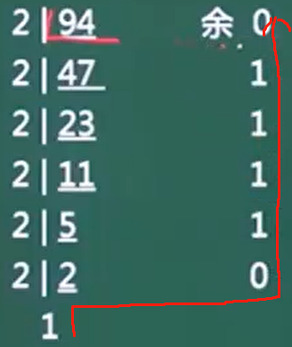

* 分割法

## 数据的表示

对于计算 1-1	可以视为1+(-1)

* 正数 

  * **原反补相同**

* 负数

  * 反码	除符号位外,全取反
  * 补码	反码+1			**用于加减计算**	对于1-1,只有补码是全0
  * 移码	补码符号位取反	**用于浮点数计算**

* **原/反 有-0,**补/移只有0

## 浮点数

N = 尾数*基数^阶码

==小数点不占位数==,靠尾数和阶码定位小数点

==一个数的浮点数不唯一==,多种浮点数可以表示同一个数

**尾数用补码	阶码用移码**

**小数向大数看齐**,小数尾数右移

对阶 -> 尾数计算 -> 结果格式化

| 阶符 | 阶码 | 数符 | 尾数 |
| ---- | ---- | ---- | ---- |
|      |      |      |      |

## 位运算

~	取反

&	与	都为1时=1

|	或	都为0时=0

^	异或	位相同时为0,相异1

# 校验码

## 码距

两个码之间**变化最小**的二进制位数为码距

01->10	变化2位 ，码距2		0->1	码距1

并不是4	而是考虑最小

## 奇偶校验	

若干位有效信息,再加上一个二进制位(校验位)组成校验码

==奇校验	有效信息+校验位中,1出现奇数次==

**只能检查1位的错误**

## 循环校验码CRC

在k位信息码之后拼接r位校验码,用**模2除法**进行校验

只能检错**,不能纠错**		易于用**编码器及检测电路**实现

将余数拼接到后面,再次进行除法,如果仍能除尽,则正确

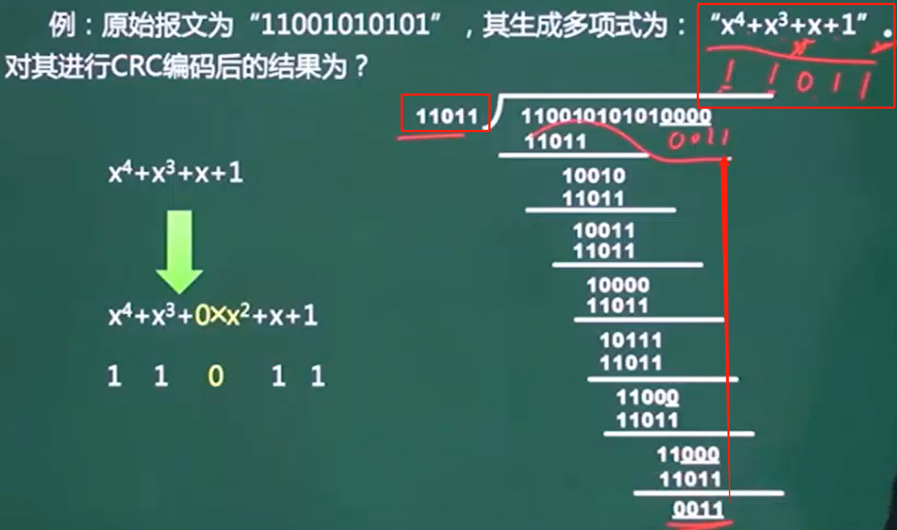

## 海明校验码

**多组**数位的奇偶校验,在数据位后面增加一些bit,**能纠错**

**1个以上的校验位**

**码距最小3**

​	2^k-1>=n+k	k海明码个数,n数据位个数

# 存储管理

## 页式存储	固长

将程序与内存划分为同样大小的页,以页单位将程序调入内存

逻辑地址 = **页号** + 页内地址

物理地址 = **页帧号** + 页内地址

* 优点	页长固定,利用率高,碎片小,分配管理简单

* 缺点	最后一页零头无法利用,按固定大小分页导致频繁调进调出,增加系统开销,造成抖动

假设一台按字节编址的16位计算机系统，采用虚拟页式存储管理方案，页面的大小为2K。某用户程序如图a所示，该程序的页面变换表如图b所示，表中状态位等于1和0分别表示页面在内存或不在内存。

 

　　图a中MOVE Datal, Data2是一个4字节的指令，Datal和Data2表示该指令的两个32位操作数。假设MOVE指令存放在2047地址开始的内存单元中，Datal存放在6143 地址开始的内存单元中，Data2存放在10239地址开始的内存单元中，那么执行MOVE 指令将产生（26)次缺页中断,其中：取指令产生（27)次缺页中断，取Datal和 Data2操作数分别产生（28)次缺页中断。

(26)A.3				B.4				C.5				D.6

(27)A.0				B.1				C.2				D.3

(28)A.1、1			B.1、2			C.2、2			D.2、3

答案】C  B  C

从题图中可见，程序的MOVE指令跨两个页面，且源地址Datal和目标地址Data2所涉及的区域也跨两个页面的页内地址， 根据题意1、2、3、4和5号页面不在内存，系统取“MOVE Datal，Data2”的指令时， 由于该指令跨越两个页面0、1，查页面变换表可以发现1号页面不在内存，故需要产生一次缺页中断；取地址为Datal的操作数时，由于该操作数不在内存且跨两个页面2、3, 需要将2、3页面装入内存，所以产生两次缺页中断；同理，取地址为Data2的操作数时， 由于该操作数不在内存且跨两个页面4、5,需要将4、5页面装入内存，所以产生两次缺页中断，共产生5次缺页中断。

## 段式存储	变长

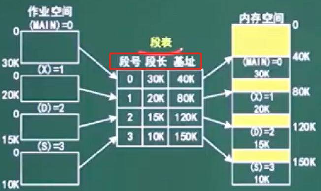

合法段	0-25K		

非法段	0-35K			0号的段长30K,能放入25,不能放入35

按用户作业中的自然段来划分逻辑空间,然后调入内存

==段的长度可变==

* 优点
  * 多道程序共享内存,各段程序修改互不影响
  * 段的分界与程序的自然分界相对应,具有逻辑独立性,易于编译/管理/修改
* 缺点	长度可变导致分配空间不便,**容易在段间留下碎片**

## 段页式	较少考

先分段,再分页	页大小相同,段大小不同

* 优点	**空间浪费小**,存储共享容易,存储保护容易,能动态连接

* 缺点	由于管理软件增加,造成复杂性和开销,需要的硬件也增加,**执行效率低**

### 页面置换算法

* 最优算法OPT    由系统判断哪个页不需要,进行删除   过于理想化
* 随机算法
* 先进先出FIFO    先调进的可能在后面又被重复掉进,造成**抖动**
* 最近最少使用LRU  不会抖动    "局部性原理"
* 时间局部性    刚被访问的内容,立即又被访问
* 空间局部性    刚被访问的内容,邻近空间又被访问

## 磁盘管理

磁道越来越小,但密度越来越高,存储的数据一样多

磁头通过磁道和扇区来确定到存储位置

存取时间 = 寻道时间 + 旋转延迟时间 + 等待时间

寻道时间	磁头移动到磁道

等待时间	磁头移动到扇区

==磁盘调度算法==

* 先来先服务 FCFS

* 最短寻道时间优先 SSTF

* 扫描/电梯算法 SCAN  先从最里到最外,再从最外到最里

* 循环扫描 CSCAN    单边循环,只从里到外,到达最外圈时,直接返回

先来先服务和最短寻道时间可能随时改变移动臂的方向

读取数据时间 = 找磁道 + 找扇区 + 传输时间

## 寄存器

寄存器的功能是存储二进制代码,由具有存储功能的触发器组合构成

一个触发器可以存储1位二进制代码，故存放n位二进制代码的寄存器，需用n个触发器来构成

按照功能的不同，可将寄存器分为基本寄存器和移位寄存器两大类。基本寄存器只能并行送入数据，也只能并行输出。移位寄存器中的数据可以在移位脉冲作用下依次逐位右移或左移，数据既可以并行输入、并行输出，也可以串行输入、串行输出，还可以并行输入、串行输出，或串行输入、并行输出，十分灵活，用途也很广

## 存储器

* 按所处的位置可分为内存和外存
* 按构成存储器的材料
  * 磁表面存储器  在金属或塑料基体的表面上涂一层磁性材料作为记录介质
  * 光盘存储器  应用激光在磁光材料上进行读写的存储器  不易丢失,记录密度高,可互换性强
  * 半导体存储器  体积小,功耗低,存取时间短
* 分为磁存储器、半导体存储器和光存储器。
* 按存储器的工作方式分为读写存储器和只读存储器。
* 按访问方式可分为按地址访问和按内容访问的存储器。
* 按寻址方式可分为
  * 随机存储器RAM  任何一个存储单元都可以随机存取,并且存取时间和存储单元的物理位置无关  **主存的主要存储器**
    * 静态SRAM  以触发器原理寄存信息,不需要刷新电路
    * 动态DRAM  以电容充放电原理寄存信息 **系统内存**
  * 只读存储器ROM  一般只进行读操作,用于保存,与RAM共同作为主存的一部分
    * 掩膜ROM：不可编程ROM，属于第一代ROM，只能读，不能写。
    * PROM：可编程ROM,只能写一次
      * 一个存储单元就是一个二极管和熔断丝，熔断丝导通的时代表1，通过烧录器把熔断丝烧断，电路不导通,实现单次的写入
    * EPROM：可编程ROM，紫外光可以多次擦除（可以写），速度慢，操作复杂
    * EEPROM：电可擦可编程只读存储器,**掉电后数据不丢失,一般用在即插即用**。（可以写），比EPROM方便
    * flash：即“闪存”，可以高速读写。被广泛使用
  * 直接存储器
  * 顺序/串行存储器  按物理位置的先后寻找地址(读写时间波动大)
  * ==部分顺序访问 如磁盘== 先指定磁道(直接),然后再寻址(顺序)

## 程序查询方式

程序查询方式是通过**CPU执行程序**来查询状态的。 

* DMA(Direct Memory Access，直接内存存取)
  * 允许**不同速度**的硬件装置来沟通，而不需要依赖CPU的大量中断负载。否则，CPU 需要从来源把每一片段的资料复制到暂存器，然后把它们再次写回到新的地方。在这个时间中，CPU不可用

# 计算机结构

==五大件==	控制器,运算器,存储器,输入,输出设备

硬盘属于辅助存储器

**Cpu由运算器,控制器,寄存器和内部总线组成**

* 运算器
  * 算术逻辑单元ALU    负责算数/逻辑运算
  * 累加寄存器AC       为算数逻辑提供临时空间，**暂存数据**
  * ==数据缓冲寄存器DR==   写内存时，暂存指令或数据
  * 状态条件寄存器     存状态/控制标志

* 控制器
  * 程序计数器PC    下条指令地址 ==唯一能被人为访问==
  * 地址寄存器AR    cpu当前访问的指令地址
  * 指令寄存器IR     存放正在执行的指令
  * 指令译码器      翻译指令
  * 时序部件        指令顺序

先把指令从内存储器取到**缓冲寄存器DR**，再送入**指令寄存器IR**暂存，**指令译码器**根据IR产生各种微操作指令，控制其他的组成部件工作

## 多核CPU/多级缓存

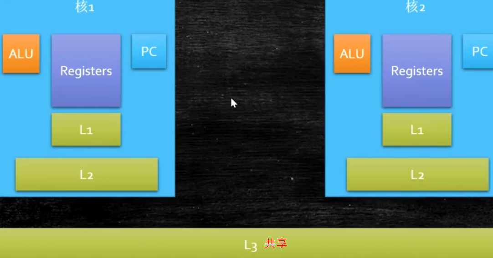

缓存分为3级,L3缓存被多个CPU共享

## 运算速度

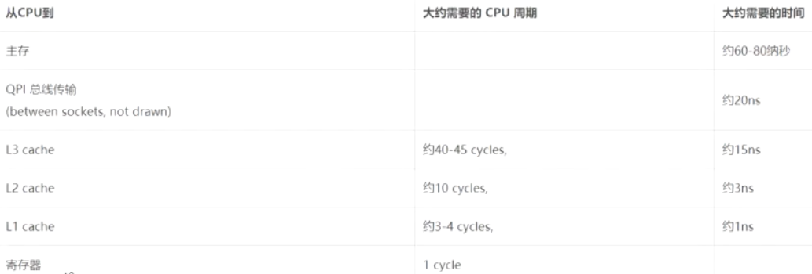

## 体系结构分类 Flynn

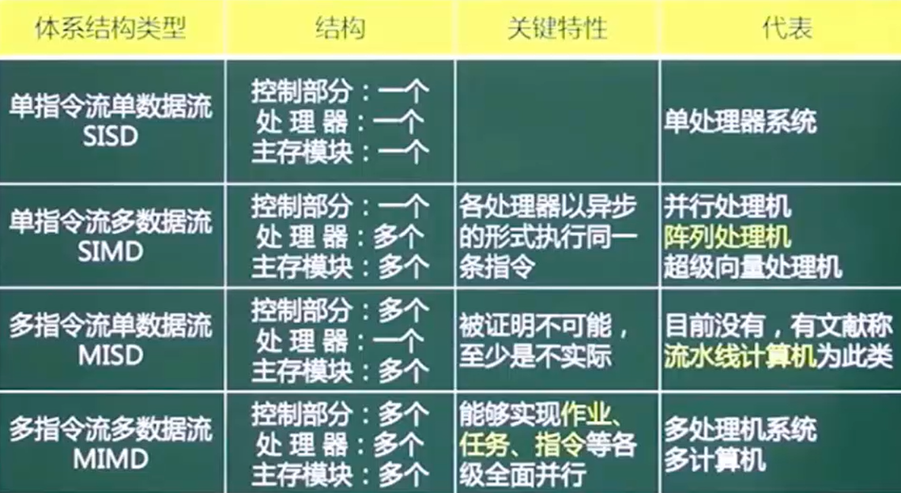

# 层次化存储结构

* CPU	寄存器	最快,容量小,成本高
* cache高速缓存    按内容存取

* 内存/主存	随机存储器RAM	只读存储器ROM

* 外存	硬盘/U盘

从上到下速度变慢

* 虚拟存储器	比主存更大,可随机访问地址空间

虚拟存储技术使==辅存和主存==密切配合，对用户来说，好像计算机具有一个容量比实际主存大得多的主存可供使用，因此称为虚拟存储器。**虚拟存储器的地址称为虚地址或逻辑地址**

## Cache

cache通过程序的**局部性原理**,改善系统性能

* 时间局部性	刚刚被访问过的内容可能还会被访问

* 空间局部性	旁边的地址可能被访问(可以防止抖动)

==命中率==

"cache+主存储器"周期 = 命中率 x cache周期 + (1-h) x 主存储器周期

==映像==

* 直接相联映像
  * 硬件电路简单,**冲突率高**
  * 主存只能固定地存储在cache中

之后放入的主存16页,将顶替cache0页上的主存0页,造成冲突而0页可能在后续被再次调用,会造成抖动

**主存标记+cache页号+业内地址**

* 全相联映像
  * 电路难实现,只适合小cache,冲突率低
  * 主存可以放在cache的任意页

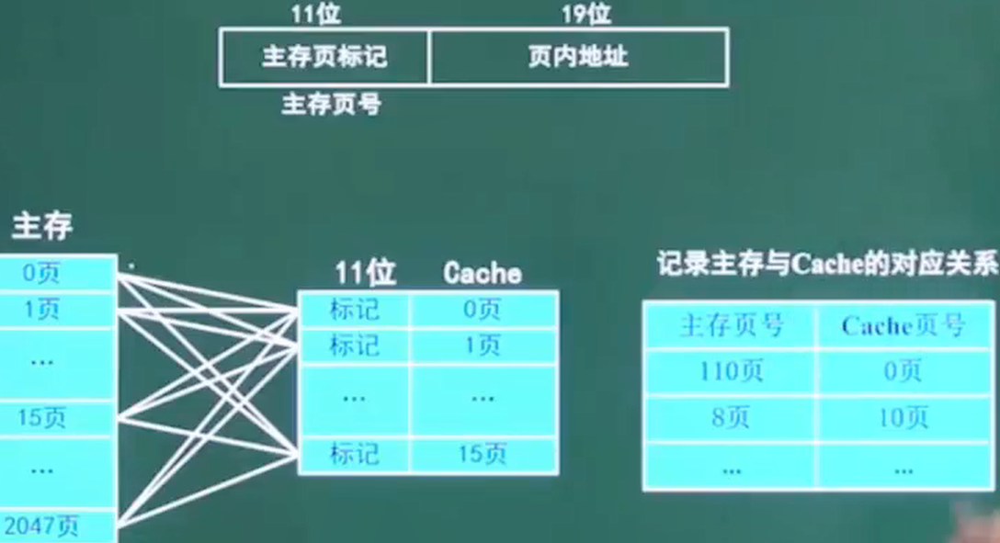

**主存标记+业内地址**

* 组相联映像
  * 直接相联和全相联的**折中**
  * 先分区,后分组,==同组之间用全相联映像==

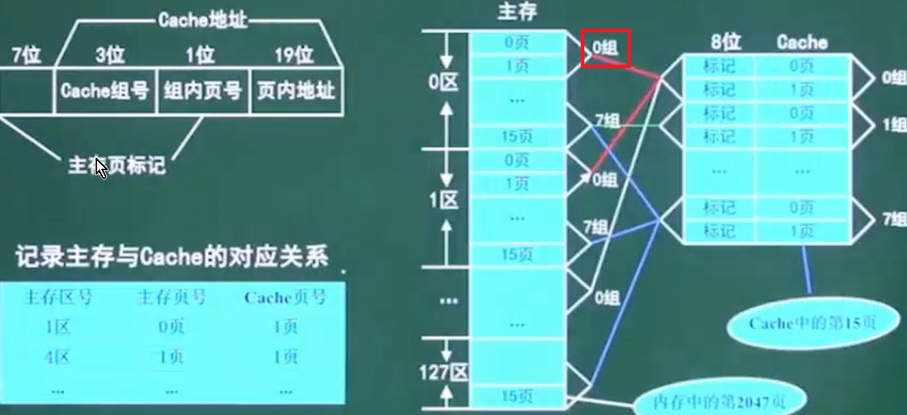

cache组号+组内页号+页内地址

* 地址映像	将主存和cache划分为若干大小相同的页(块)

## 主存

## 编址与计算

按字编址	存储单元是字

按字节编址	存储单元字节

所需芯片数=总容量/芯片容量

400H =2^10

又因为存储单元为16位

总容量=2^10*16bit

芯片容量=2^10*16bit/4

## 主机/外设数据传输控制方法

* 程序控制方式，由**CPU**执行程序控制数据的输入输出过程。

* 中断方式下，**外设**准备好输入数据或接收数据时向CPU发出**中断请求信号**，若CPU决定响应该请求，则暂停正在执行的任务，转而执行中断服务程序进行数据的输入输出处理，之后再回去执行原来被中断的任务。

* DMA方式下，CPU向**DMA控制器**下达指令，让DMA控制器来处理数据的传送，数据传送完毕再把信息反馈给CPU,减轻了CPU的负担

# 总线

主线同一时刻只允许**一个设备发送**,但允许**多个设备接收**

* 数据总线DB	在CPU和RAM之间传输数据

* 地址总线AB	指定RAM中存储数据的地址

* 控制总线CB	将微处理器控制单元的信号传送到周边设备

==字长为32,则地址总线和数据总线的宽度都为32==

## 并联串联

并联	R=1-（1-R1）*（1-R2）......

# 指令

一条指令就是机器语言中的一个语句

* 指令由**操作码+地址码**组成
  * 操作码决定操作类型(加减乘除)

  * 地址码决定操作数的位置

a+b=c	3地址

a+=b	2地址

a++		1地址

无需操作数	0地址

## 伪指令

用于指示汇编程序如何汇编源程序，常用于为汇编程序提供以下信息：该源程序如何分段，有哪些逻辑段在程序段中，哪些是当前段，它们分别由哪个段寄存器指向；定义了哪些数据，存储单元是如何分配的等。

伪指令语句除==定义的具体数据要生成目标代码==外，==其他不生成目标代码==。伪指令语句的这些命令功能是由汇编程 序在汇编源程序时，通过执行一段程序来完成的，而不是在运行目标程序时实现的。

## 寻址方式

* 立即寻址	指令存放操作数	速度快,灵活性差
  * 直接寻址			地址
  * 间接寻址			的地址
* 寄存器寻址	寄存器存放操作数
* 寄存器间接寻址			的地址

## CISC/RISC指令系统

| 类型      | 指令                                                         | 寻址方式     | 实现方式                                                   | 其他                      |
| --------- | ------------------------------------------------------------ | ------------ | ---------------------------------------------------------- | ------------------------- |
| CISC 复杂 | 指令多,使用频率差别大,不定长                                 | 支持多种寻址 | 微程序控制技术(微码)                                       | 研制周期长                |
| RISC 精简 | 指令少,使用频率接近,定长,多为**单周期指令**,操作**寄存器**,只有Load/Store操作内存 | 寻址单一     | 增加了通用寄存器(累加器),硬布线逻辑控制为主,适合采用流水线 | 优化编译,**支持高级语言** |

# 进程管理

进程是程序在一个数据集合上运行的过程,系统进行**资源分配和调度的独立单位**

由**程序块,进程控制块PCB,数据块**组成

**进程是程序的一次执行过程**,程序是静态的,进程是动态的

可执行程序是在磁盘上的文件,包含Cpu指令集

当可执行程序被加载进内存,就成了进程

## 3/5态模型

3态模型中,只有**运行–就绪能互相转换**

## 同步/互斥

* 同步->直接制约    a需要等待b的完成       单方等待
* 互斥->间接制约    ab互相争夺**临界资源**   双方等待

临界资源	互斥进程之间共享资源     **不是指最大能调用的资源**

临界区	访问临界资源的代码

信号量	特殊变量

## PV操作

p申请资源,s-1(资源量-1),s<0进入阻塞

v释放资源,s+1        ,s<=0进入阻塞

同步信号量   协调多个进程访问

互斥信号量   确保同一时间资源只被某一进程访问

单缓冲区同步模型

S1市场中的产品数量		S2

P(S1)申请生产产品的资源	V(S2)唤醒消费

P(S2)申请产品进行消费		V(S1)唤醒生产

**进来的箭头是P,出去V**

对于购书者,付款时先唤醒收银员V(S1),再通知第二个购书者P(S2)

对于消费者,收费时先申请资源P(S1),再唤醒第二个购书者

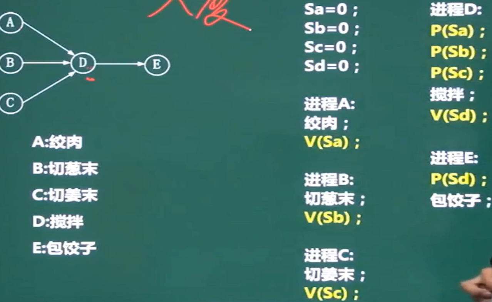

前驱图,只有等abc都完成了,d才能开始

若用PV操作控制这几个进程并发执行的过程，则需要设置4个信号量SI、S2、S3 和S4,且信号量初值都等于零。下图中a和b应分别填写（25)，c和d应分别填写(26)。

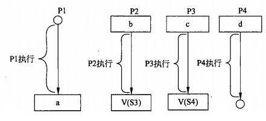

(25)A.P(S1) P(S2) 和 P(S3)     B.P(S1) P(S2) 和 V(S1)

​    C.V(S1) V(S2) 和 P(S1)     D.V(S1) V(S2) 和 V(S3)

(26)A.P(S1) P(S2) 和 P(S4)     B.P(S2) P(S3) 和 P(S4)

C.V(S1) V(S2) 和 V(S4)     D.V(S2) V(S3) 和 V(S4)

**【答案】C B**

根据题意，进程P2、P3等待P1的结果，因此当P1执行完毕需要使用V操作通知 P2、P3,即 a 处填 V (SI) V (S2), b 处应填P (S1)。

根据题意，进程P3要执行需要测试P1、P2有没有消息，故应该在c处填P (S2)、P (S3)。当P3执行完毕需要使用V操作通知P4，即在d处填P (S4)。

进程P1、P2、P3、P4和P5的前趋图如下：

若用PV操作控制进程P1〜P5并发执行的过程，则需要设置6个信号量S1、S2、S3.S4.S5和S6,且信号量S1〜S6的初值都等于零。下图中a和b处应分别填写 (23)： c和d处应分别填写（24), e和f处应分别填写（25)。

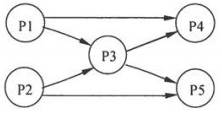

(23)A.P(S1) P(S2)和 P(S3)P(S4)   B.P(S1) V(S2)和 P(S2) V(S1) 

​    C.V(S1) V(S2)和 V(S3) V(S4)   D.P(S1) P(S2)和 V(S1) V(S2)

(24)A.P(S1) P(S2)和 V(S3) V(S4)   B.P(S1) P(S3)和 V(S5) V(S6) 

C.V(S1) V(S2)和 P(S3) P(S4)   D.P(S1) V(S3)和 P(S2) V(S4)

(25)A.P(S3) P(S4)和 V(S5)V(S6)   B.V(S5) V(S6)和 P(S5) P(S6)

C.P(S2) P(S5)和 P(S4) P(S6)   D.P(S4) V(S5)和 P(S5) V(S6)

**【答案】C B C**

试题（23)的正确答案是C，因为P1是P3和P4的前驱，当P1执行完成后，应通知P3和P4，故应采用V(S1) V(S2)操作分别通知P3和P4;同理，P2是P3和P5的前驱，当P2执行完后，应通知P3和P5,故应采用V(S3)V(S4)操作分别通知P3和P5。

试题（24)的正确答案是B,因为P3是P1和P2的后继，当P3执行前应测试P1 和P2是否执行完，故应采用P(S1) P(S3)操作分别测试P1和P2是否执行完；又因为P3是P4和P5的前驱，当P3执行完应通知P4和P5,故应采用V(S5)V(S6)操作分别通知 P4 和 P5。

试题（25)的正确答案是C,因为P4是P1和P3的后继，当P4执行前应测试P1和P3是否执行完，故应采用P(S2) P(S5)操作分别测试P1和P3是否执行完；又因为P5是P2和P3的前驱的后继，当P5执行前应测试P2和P3是否执行完,故应采用P(S4) P(S6) 操作分别测试P2和P3是否执行完。

## 死锁

四大条件     互斥/环路等待/保持和等待/不剥夺

不剥夺:	资源不会被释放,也不会借给别的进程

 

### 避免死锁	(打破4个必要条件) 

* 有序资源分配法       预留1个资源轮流分配

* 银行家算法          按什么顺序运行不会死锁

不超过**最大资源**数/不超过**自身需求**/资源不足时**推迟**分配

 

## 阻塞

进程资源图如图(a)和(b)所示，其中：图(a)中（25);图(b)中（26)。

 

(a)图

R1资源只有2个，P2申请该资源得不到满足，故进程P2是阻塞节点；同样R2资源只有3个，P1申请该资源得不到满足，故进程P1也是阻塞节点。可见进程资源图（a）是死锁的，该图不可以化简。

(b)图

R2资源有3个，已分配2个，P3申请1个R2资源可以得到满足，故进程P3可以运行完毕释放其占有的资源。这样可以使得Pl、P2都变为非阻塞节点，得到所需资源运行完毕，因此，进程资源图（b)是可化简的

## 索引文件结构

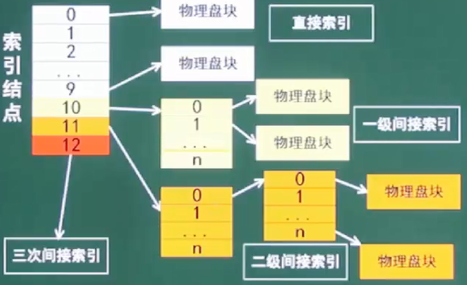

0-9 直接索引,存储10kb

10 一级索引,4b一索引,存储256kb

11 二级索引,存储256*256=64Mb

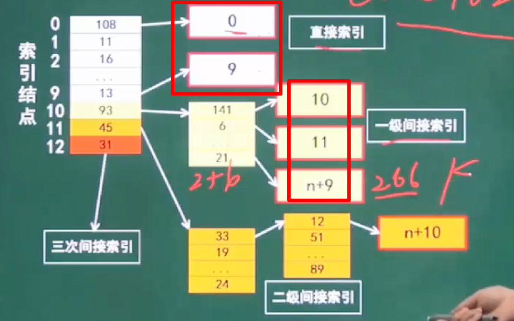

地址按顺序存储

总共13kb的索引节点,每个节点1kb,索引最小4b

0-9的索引节点    采用直接索引 指向1kb的物理盘块,保存10kb内容     范围0-10239

10节点,将1kb分成256个4b的索引,每个索引指向1kb的物理盘块,保存了256kb内容

11节点,( 将1kb分成256个4b的索引)*2          保存了64mb

12节点                                                 16gb

# 作业

## 4个状态

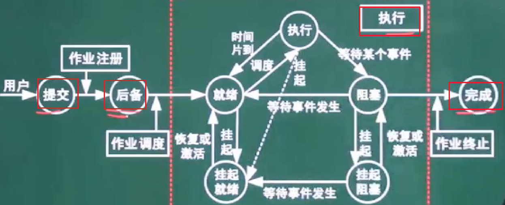

提交	后备	执行	完成

## 调度算法

* 先来先服务
* 时间片轮转
* 短作业优先
* 最高优先权优先
* 高响应比优先      响应比=作业等待时间/执行时间

# 设备管理

## 数据传输控制方式

* 程序控制(查询)	分为无条件传送和程序查询2种,方法简单,**硬件开销少**,但**IO能力低**,影响cpu利用率

* 程序中断	cpu无需等待,提高请求响应速度

* **DMA**	在主存和外设之间批量数据交换,DMA与CPU无关

* 通道方式

* IO处理机

从上到下效率递增

## 虚设备与SPOOLING假脱机技术

SPOOLING是关于慢速字符设备如何与计算机主机交换信息的一种技术,通过**磁盘**实现

# 流水线

将指令的执行过程分为**取址,分析,执行**3步

## 超标量流水线

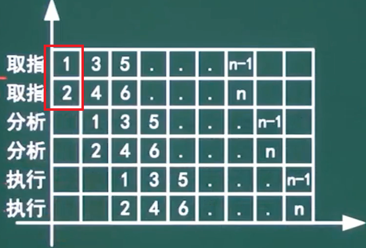

度为流水线条数		度为2的超标量流水线能同时执行2个操作

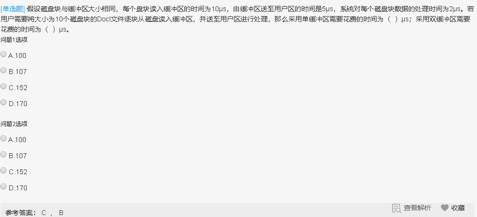

## 吞吐率   单位时间内流水线完成量

吞吐率TP=指令条数/执行时间

最大吞吐率=1/流水线周期

# 中断

当系统中有多个中断请求时，中断系统**按优先级进行排队**

在处理低级中断过程中又有高级中断申请中断，则高级中断可以打断低级中断处理，转去处理高级中断，等处理完高级中断后再返回去处理原来的低级中断，称为**中断嵌套**。实现中断嵌套用后进先出的栈来保护断点和现场最有效.

# 冗余技术

对于实现系统规定功能是多余的资源，包括硬/软件、指令,数据,存放和调用的空间和通道

* 结构冗余，按其工作方法可以分为静态、动态和混合冗余
* 信息冗余，为检测或纠正信息在运算或传输中的错误另外加的部分信息
* 时间冗余，以重复执行指令或程序来消除瞬时错误带来的影响；
* 冗余附件技术，是指为实现上述冗余技术所需的资源和技术

