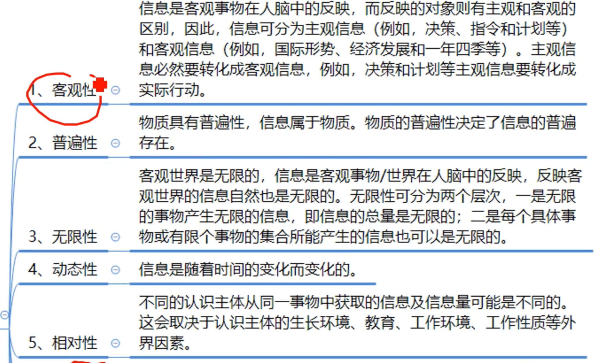
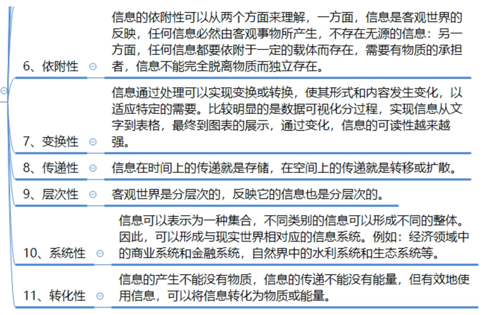
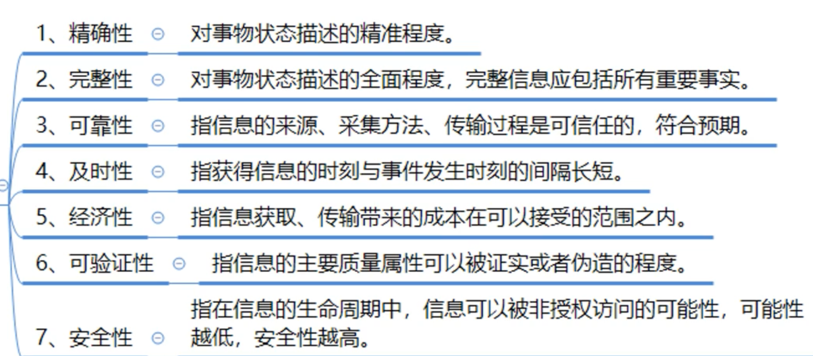
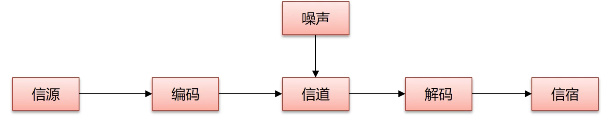

# 信息

**信息的基本概念**	用来消除不确定性的东西,是系统有序程度的度量

面向管理是信息系统的显著特点，以计算机为基础的信息系统可以定义为：结合管理理论和方法，应用信息技术解决管理问题，为管理决策提供支持的系统

管理模型(也称对象的处理模型)、信息处理模型、系统实现的基础条件三者的结合产生信息系统

## 信息的特征

## 信息的质量属性

## 信息的传输模型

信宿是信息的发送目标

编码器包括量化器,调制器,压缩编码器等

译码器包括解调器,数模转换器,译码器等

## 信息化

## 信息化的5个层次

1 、 产品信息化
2 、 企业信息化
3 、 产业信息化
4 、 国民经息化
5 、 社会生活信息化

## 信息化的内涵

| 信息化的内涵 |                                                           |
| ------------ | --------------------------------------------------------- |
| 信息化的主体 | 全体社会成员,包括政府,企业,事业,团体和个人                |
| 时域         | 长期                                                      |
| 空域         | 政治,经济,文化,军事和社会的一切领域                       |
| 手段         | 基于现代信息技术的先进社会生产工具                        |
| 途径         | 创建信息时代的社会生产力,推动社会生产关系及上层建筑的改革 |
| 目标         | 提高国家的综合实力,文明素质,生活质量                      |

## 信息化6个要素

|            |                                                              |
| ---------- | ------------------------------------------------------------ |
| 资源       | 信息资源的**开发和利用**是信息化的**核心**任务,信息化建设**取得实效的关犍**,也是我国信息化的薄弱环节 |
| 网络       | 信息资源开发和利用的**基础设施**,包括电信网,广播电视,计算机网络 |
| 技术应用   | **六要素的龙头,反映了信息化建设的效率**,把信息技术广泛应用在社会各个领域,是国家信息化建设的主阵地 |
| 技术与产业 | 信息化的物质基础                                             |
| 人才       | 信息化的成功之本                                             |
| 政策法规   | 规范和系统调信息化体系要素之间的关系,是信息化持续发展的保障  |

## 信息系统

### 生命周期

**4个大的方面**

1. 立项
2. 开发
   1. 分析
   2. 设计
   3. 实施
3. 运维
4. 消亡

**5个小的方面**

1. 系统规划  可行性分析/规划
2. 系统分析  需求分析,**逻辑模型**
3. 系统设计  概要设计,详细设计,**物理模型**
4. 系统实施  编码,测试
5. 运行维护

### 信息系统的功能

信息系统具有数据的输入、传输、存储、处理、输出等基本功能

(1)数据的采集和输入：
(2)数据的传输：实质是数据通信
(3)信息的存储：
(4)信息的加工处理：
(5)信息的维护：
(6)信息的使用：

### 开发方法

#### 结构化

自顶向下,逐步求精和模块化设计

适用于数据处理领域的问题,不适用于规模大,复杂的系统

**缺点**

开发周期长,难适应需求变化,很少考虑数据结构

**特点**

1. 开发目标清晰
2. 工作阶段化
3. 开发文档规范化
4. 设计方法结构化

#### 面向对象

**优点**

符合思维习惯,有利于开发人员和用户的沟通,缩短开发周期

**缺点**

不能涉足系统分析以前的开发环节(项目立项)

#### 原型化

==适用于需求不明确的系统开发==

1. 确定用户基本需求
2. 设计原型
3. 试用和评价原型
4. 修改原型
5. 整理原型,提供文档

**特点**

开发周期短,成本和风险低,获得较高的综合开发效益

以用户为中心,用户的满意度高

用户参与系统开发的全过程,有利于系统的移交

#### 面向服务

**优点**

提高系统复用性

信息资源共享

系统之间的互操作性

### 信息系统集成技术

#### 互连设备

|      |      |
| ---- | ---- |
|      |      |
|      |      |
|      |      |
|      |      |

## 构件

Compoment 是一个功能相对独立的,具有可复用性的软件单元

### 常用构件标准（COM/DCOM/COM+、CORBA和EJB） 

三个主流构件标准：

(1) Microsoft 微软：
COM: 构件对象模型 Component Object Model 
DCOM: 分布式构件对象模型 Distributed Component Object Model   
COM+: COM+是COM、DCOM和MTS(Microsoft Transaction Server)的集成,形成一个全新的、功能强大的组件体系结构.
微软的分布式DCOM扩展了COM,使其能够支持在局域网、广域网、Internet上不同计算机的对象之间的通信。
DCOM具有语言无关性，任何语言都可以用来创建COM构件。

(2) CMG(Object Management Group,对象管理集团)：
CORBA: 公共对象请求代理 Common Object Request Broker Architecture,

(3) Sun: 
EJB: Enterprise JavaBean, 企业JavaBean
EJB是用于开发和部署多层结构的、分布式的、面向对象的JAVA应用系统的跨平台的构件架构。

# 项目管理

**项目的定义**

1. 具有特定目标的一次性任务，有特定的环境与要求
2. 在一定的组织机构内，利用有限的资源在规定的时间内完成
3. 任务满足一定性能、质量、数量、技术等要求

**项目的属性**

1. 一次性
2. 独特性
3. 目标的确定性
4. 组织的临时性和开放性
5. 成果的不可挽回性

**项目管理的特征**
将各种资源应用于目标，以实现项目的目标，满足各方面既定的需求。  
注重于综合性管理，并且项目管理工作有严格的时间期限。具体表现为：
（1）项目管理的对象是项目或者被当做项目来处理的事务。  
（2）项目管理的全过程都贯穿着系统工程的思想。  
（3）项目管理的组织具有特殊性。（临时的，开放的，组织结构多为矩阵结构）
（4）项目管理的方式是目标管理
（5）项目管理的体制是一种基于团队管理的个人负责制
（6）项目管理的要点是创造和保持一种使项目顺利进行的环境
（7）项目管理的方法、工具和手段具有先进性、开放性 

**项目管理VS运行管理**

项目管理一次性、独立性、目标确定性和组织临时性 

## 项目4个生命周期

定义、开发、实施、收尾

项目可行性阶段： 定义+开发
项目获取阶段：实施+收尾

## 项目干系人

Stakeholder 积极参与项目或其利益可能受项目影响的个人或组织

典型的项目干系人： 项目经理、项目团队、用户、发起人、项目组合经理（项目组合评审委员会）、项目集经理、项目管理办公室、职能经理、运营经理、卖方（业务伙伴）

## 项目组织方式

1. 职能型组织： 按职能以及职能的相似性来划分部门

2. 项目型组织： 指按照项目来划归所有资源的，**每个项目之间独立**

3. 矩阵式组织： 将按照职能划分的纵向部门和按照项目划分的横向部门结合起来， 以构成类似矩阵的管理系统

   矩阵式组织可以分为弱矩阵、强矩阵、平衡矩阵三种形式

## 项目管理过程

（1） 启动过程：

（2） 计划过程：

（3） 执行过程：

（4） 监控过程：

（5） 收尾过程：

